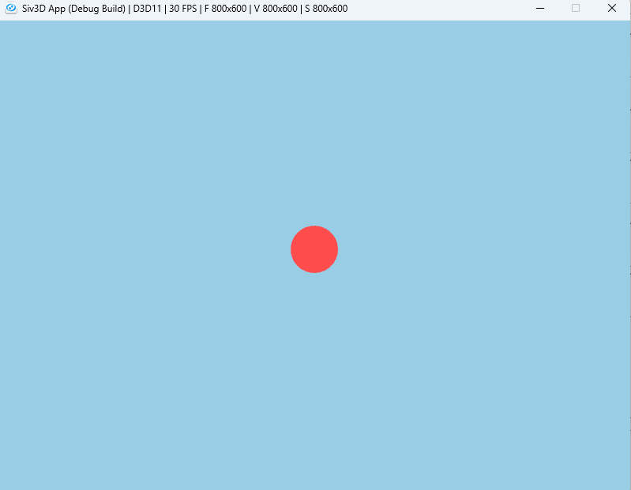
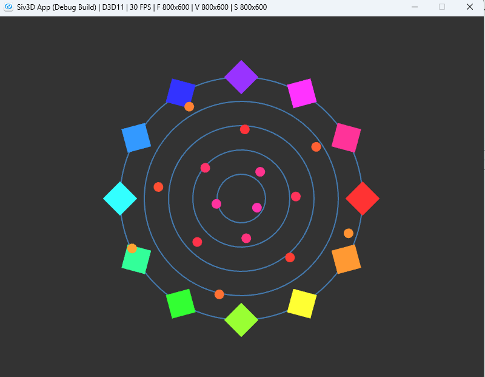
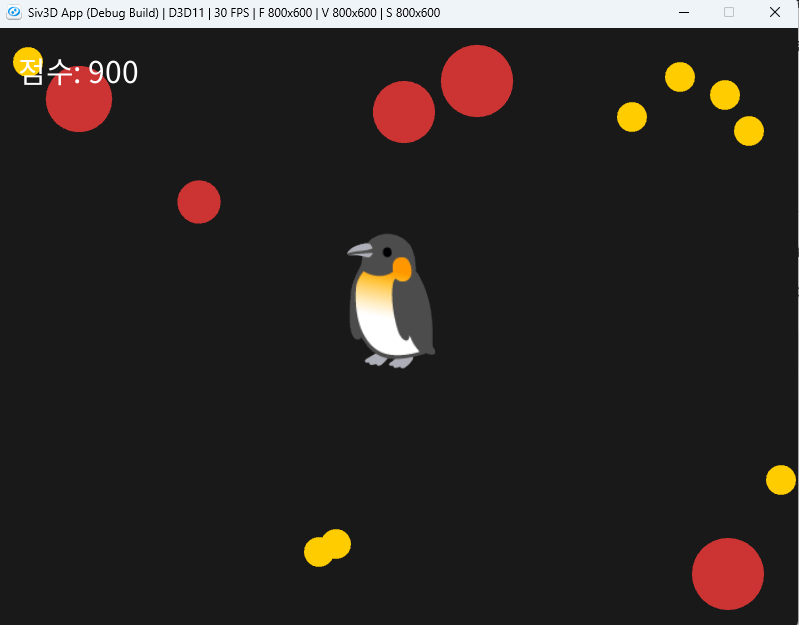

# OpenSiv3D를 이용한 C++ 프로그래밍 학습
  
저자: 최흥배, Claude AI  
  
C++ 프로그래밍 언어를 배우는 것에 중점을 두되, Siv3D 프레임워크를 활용하여 시각적으로 흥미로운 예제를 통해 학습 효과를 높이도록 설계 되었다. 단순한 콘솔 프로그램 대신 그래픽, 소리, 상호작용을 포함한 프로그램을 만들며 C++의 개념을 익힐 수 있다.  
  
필요 소프트웨어:  
- Windows 10 이상
- Visual Studio 2022 이상   
  
-----    
    
# Chapter.02: 제어 구조와 움직이는 그래픽  
  
**C++ 개념:**
- 조건문 (if, else, switch)
- 반복문 (for, while, do-while)
- 논리 연산자

**Siv3D 활용 예제:**
- 키보드 입력에 반응하는 도형 (조건문 활용)
- 반복문을 이용한 패턴 그리기
- 마우스 커서를 따라 움직이는 캐릭터 (조건문과 반복문 조합)
  

  
## 2.1 조건문 기초
C++에서는 프로그램의 흐름을 제어하기 위해 다양한 조건문을 사용한다.

### if문
가장 기본적인 조건문으로, 조건이 참일 때만 코드 블록을 실행한다.

```cpp
if (조건식) {
    // 조건이 참일 때 실행할 코드
}
```

### if-else문
조건이 참일 때와 거짓일 때 실행할 코드를 각각 지정한다.

```cpp
if (조건식) {
    // 조건이 참일 때 실행할 코드
} else {
    // 조건이 거짓일 때 실행할 코드
}
```

### else if문
여러 조건을 순차적으로 검사할 때 사용한다.

```cpp
if (조건식1) {
    // 조건식1이 참일 때 실행할 코드
} else if (조건식2) {
    // 조건식1이 거짓이고 조건식2가 참일 때 실행할 코드
} else {
    // 모든 조건이 거짓일 때 실행할 코드
}
```

### C++23의 `if consteval`
C++23에서는 컴파일 타임에 상수식을 평가하기 위한 `if consteval`이 추가 되었다.  
  
```cpp
constexpr int getValue() {
    if consteval {
        return 100; // 컴파일 타임에 호출될 때 실행
    } else {
        return 200; // 런타임에 호출될 때 실행
    }
}
```     
```
#include <iostream>

constexpr int getValue() {
    if consteval {
        return 100; // 컴파일 타임에 호출될 때 실행
    } else {
        return 200; // 런타임에 호출될 때 실행
    }
}

int main() {
    // 1. 컴파일 타임 평가
    // 이 값은 컴파일 시점에 100으로 확정됩니다.
    constexpr int compileTimeValue = getValue(); 
    static_assert(compileTimeValue == 100); // 컴파일 타임에 성공적으로 통과

    // 2. 런타임 평가
    // 이 값은 프로그램 실행 중에 200으로 결정됩니다.
    int runTimeValue = getValue();
    
    std::cout << "컴파일 타임 값: " << compileTimeValue << std::endl; // 출력: 100
    std::cout << "런타임 값: " << runTimeValue << std::endl;         // 출력: 200

    return 0;
}
```    

### switch문
여러 가지 상수 값에 따라 다른 코드를 실행하고 싶을 때 사용한다.

```cpp
switch (표현식) {
    case 값1:
        // 표현식이 값1과 같을 때 실행할 코드
        break;
    case 값2:
        // 표현식이 값2와 같을 때 실행할 코드
        break;
    default:
        // 일치하는 case가 없을 때 실행할 코드
        break;
}
```
  


## 2.2 반복문 기초
반복문은 코드 블록을 여러 번 실행하고 싶을 때 사용한다.

### for 반복문
반복 횟수가 정해져 있을 때 주로 사용한다.

```cpp
for (초기화; 조건식; 증감식) {
    // 반복할 코드
}
```

예시:
```cpp
for (int i = 0; i < 10; ++i) {
    // i가 0부터 9까지 10번 반복
}
```

### 범위 기반 for문 (C++11 이상)
컨테이너의 모든 요소를 순회할 때 편리하게 사용할 수 있다.

```cpp
for (요소타입 변수명 : 컨테이너) {
    // 각 요소에 대해 실행할 코드
}
```

예시:
```cpp
std::vector<int> numbers = {1, 2, 3, 4, 5};
for (int num : numbers) {
    // 각 숫자에 대해 실행할 코드
}
```

### while 반복문
조건이 참인 동안 계속해서 반복한다.

```cpp
while (조건식) {
    // 반복할 코드
}
```

### do-while 반복문
코드 블록을 먼저 실행한 후 조건을 검사한다. 최소 한 번은 실행된다.

```cpp
do {
    // 반복할 코드
} while (조건식);
```
  

## 2.3 논리 연산자
여러 조건을 조합할 때 사용하는 연산자이다.

| 연산자 | 의미 | 예시 |
|-------|------|------|
| `&&` | AND (두 조건이 모두 참이면 참) | `if (x > 0 && y > 0)` |
| `\|\|` | OR (조건 중 하나라도 참이면 참) | `if (x == 0 \|\| y == 0)` |
| `!` | NOT (조건의 결과를 반전) | `if (!isReady)` |
  


## 2.4 실습 예제: 키보드로 움직이는 도형
이 예제는 키보드의 방향키를 사용하여 원을 이동시키는 프로그램이다. 조건문을 활용해 키 입력에 따라 원의 위치를 변경한다.

```cpp
#include <Siv3D.hpp>

void Main()
{
    // 배경색 설정
    Scene::SetBackground(ColorF{0.6, 0.8, 0.9});
    
    // 원의 초기 위치 설정
    Vec2 circlePos{400, 300};
    const double circleRadius = 30;
    const double speed = 5.0;
    
    while (System::Update())
    {
        // 키 입력에 따라 원의 위치 변경 (조건문 활용)
        if (KeyLeft.pressed())
        {
            circlePos.x -= speed; // 왼쪽 키: x 좌표 감소
        }
        
        if (KeyRight.pressed())
        {
            circlePos.x += speed; // 오른쪽 키: x 좌표 증가
        }
        
        if (KeyUp.pressed())
        {
            circlePos.y -= speed; // 위쪽 키: y 좌표 감소
        }
        
        if (KeyDown.pressed())
        {
            circlePos.y += speed; // 아래쪽 키: y 좌표 증가
        }
        
        // 화면 경계 처리 (논리 연산자 활용)
        if (circlePos.x < circleRadius)
        {
            circlePos.x = circleRadius;
        }
        else if (circlePos.x > Scene::Width() - circleRadius)
        {
            circlePos.x = Scene::Width() - circleRadius;
        }
        
        if (circlePos.y < circleRadius)
        {
            circlePos.y = circleRadius;
        }
        else if (circlePos.y > Scene::Height() - circleRadius)
        {
            circlePos.y = Scene::Height() - circleRadius;
        }
        
        // 원 그리기
        Circle{circlePos, circleRadius}.draw(ColorF{1.0, 0.3, 0.3});
        
        // 현재 위치 표시
        FontAsset(U"Monospace")(U"위치: ({:.1f}, {:.1f})"_fmt(circlePos.x, circlePos.y))
            .draw(20, 20, ColorF{0.2});
    }
}
``` 
  
실행 화면:  
      
  
### 코드 설명
- 여러 개의 `if`문을 사용하여 키 입력을 각각 독립적으로 처리한다. 이렇게 하면 대각선 이동도 가능하다.
- 논리 연산자와 조건문을 사용하여 원이 화면 밖으로 나가지 않도록 제한한다.
- `pressed()` 함수는 키가 눌려있는 동안 계속 `true`를 반환한다.
  

## 2.5 실습 예제: 반복문으로 패턴 그리기
이 예제는 반복문을 사용하여 화면에 원형으로 배치된 사각형 패턴을 그린다.

```cpp
constexpr double GoldenAngle = 2.399963229728653; // 약 137.50776405003785도(라디안)

void Main()
{
	// 배경색 설정
	Scene::SetBackground(ColorF{ 0.2, 0.2, 0.2 });

	// 화면 중앙 좌표
	const Vec2 center{ Scene::Width() / 2, Scene::Height() / 2 };
	const double radius = 200.0;

	while (System::Update())
	{
		// 동심원 그리기 (for 반복문 활용)
		for (int i = 1; i <= 5; ++i)
		{
			Circle{ center, radius * i / 5 }.drawFrame(2, ColorF{ 0.3, 0.6, 0.9, 0.7 });
		}

		// 원형으로 사각형 배치하기 (for 반복문 활용)
		const int numRectangles = 12;
		for (int i = 0; i < numRectangles; ++i)
		{
			// 각도 계산 (0부터 2π까지 균등하게 분포)
			const double angle = Math::TwoPi * i / numRectangles;

			// 사각형의 위치 계산 (삼각함수 활용)
			const Vec2 pos = center + Vec2{ radius * Math::Cos(angle), radius * Math::Sin(angle) };

			// HSV 색상 공간을 활용하여 무지개 색상 생성
			const ColorF color = HSV{ (i * 30) % 360, 0.8, 1.0 };

			// 회전하는 사각형 그리기
			RectF{ Arg::center = pos, 40, 40 }
				.rotated(Math::QuarterPi + angle)
				.draw(color);
		}

		// 시간에 따라 변하는 내부 패턴 (while 반복문 활용)
		double currentRadius = 30.0;
		double angle = Scene::Time() * 2;
		int count = 0;

		while (currentRadius < radius && count < 50)  // 50개 제한 (무한 루프 방지)
		{
			const Vec2 pos = center + Vec2{ currentRadius * Math::Cos(angle), currentRadius * Math::Sin(angle) };

			// HSV 색상으로 시간에 따라 변하는 색상 생성
			const double hue = std::fmod((Scene::Time() * 60 + count * 5), 360.0);
			const ColorF color = HSV{ hue, 0.8, 1.0 };

			Circle{ pos, 8 }.draw(color);

			// 다음 위치 계산을 위한 값 업데이트
			currentRadius += 12;
			angle += GoldenAngle; 
			++count;
		}
	}
}
```  
실행 화면:  
     

### 코드 설명
- 첫 번째 `for` 반복문은 동심원을 그리는데 사용되었다.
- 두 번째 `for` 반복문은 원형으로 사각형을 배치하는데 사용되었다. 각 사각형의 위치는 삼각함수를 이용해 계산한다.
- `while` 반복문은 나선형 패턴을 그리는데 사용되었다. 반복 조건이 두 개 있어서 하나라도 거짓이 되면 반복이 중단된다.
- 조건문과 반복문을 조합하여 복잡한 패턴을 쉽게 만들 수 있다.
  
  
## 2.6 실습 예제: 마우스를 따라다니는 캐릭터
이 예제는 마우스 커서를 따라다니는 캐릭터와 장애물을 구현한다. 조건문과 논리 연산자를 활용해 캐릭터와 장애물 간의 충돌을 처리한다.

```cpp
#include <Siv3D.hpp>

void Main()
{
	// 배경색 설정
	Scene::SetBackground(ColorF{ 0.1, 0.1, 0.1 });

	// 이모지로 캐릭터 텍스처 생성
	const Texture characterTexture{ U"🐧"_emoji };

	// 캐릭터 정보
	Vec2 characterPos{ 400, 300 };
	const double characterSpeed = 0.1;
	double characterScale = 1.0;
	int score = 0;

	// 장애물 정보
	Array<Circle> obstacles;
	for (int i = 0; i < 5; ++i)
	{
		obstacles << Circle{ Random(Scene::Width()), Random(Scene::Height()), Random(20.0, 40.0) };
	}

	// 아이템 정보
	Array<Circle> items;
	for (int i = 0; i < 8; ++i)
	{
		items << Circle{ Random(Scene::Width()), Random(Scene::Height()), 15 };
	}

	Font scoreFont{ 30, Typeface::CJK_Regular_KR };
	FontAsset::Register(U"Monospace", 20, Typeface::CJK_Regular_KR); 

		while (System::Update())
		{
			// 캐릭터와 마우스 커서 사이의 거리 계산
			const Vec2 mousePos = Cursor::Pos();
			const Vec2 dir = mousePos - characterPos;

			// 캐릭터 위치 업데이트
			characterPos += dir * characterSpeed;

			// 충돌 감지용 캐릭터 원
			const Circle characterCircle{ characterPos, 25 * characterScale };

			// 장애물 그리기 및 충돌 처리
			for (const auto& obstacle : obstacles)
			{
				obstacle.draw(ColorF{ 0.8, 0.2, 0.2 });

				if (characterCircle.intersects(obstacle))
				{
					characterScale = Max(0.5, characterScale - 0.001);
				}
			}

			// 아이템 그리기 (remove_if를 사용하기 전에 먼저 그립니다)
			for (const auto& item : items)
			{
				item.draw(ColorF{ 1.0, 0.8, 0.0 });
			}

			// 1. 제거할 아이템 개수 세기 및 점수/크기 변경 (배열 수정 X)
			int removedItemCount = 0;
			for (const auto& item : items)
			{
				if (characterCircle.intersects(item))
				{
					score += 100;
					characterScale = Min(1.5, characterScale + 0.1);
					++removedItemCount;
				}
			}

			// 2. 충돌한 아이템들 한 번에 제거
			if (removedItemCount > 0)
			{
				items.remove_if([&](const Circle& item)
				{
								return characterCircle.intersects(item);
				});
			}

			// 3. 제거된 개수만큼 새 아이템 추가
			for (int i = 0; i < removedItemCount; ++i)
			{
				if (items.size() < 12)
				{
					items << Circle{ Random(Scene::Width()), Random(Scene::Height()), 15 };
				}
			}

			// 캐릭터 그리기
			characterTexture.scaled(characterScale).drawAt(characterPos);

			// 점수 표시
			scoreFont(U"점수: {}"_fmt(score)).draw(20, 20, ColorF{ 1.0 });

			// 도움말 표시
			if (score == 0)
			{
				const String helpText = U"노란색 동그라미를 먹으세요! 빨간색은 피하세요!";
				FontAsset(U"Monospace")(helpText).drawAt(Scene::Center().x, 500, ColorF{ 0.9 });
			}
		}
}
```   
실행 화면:  
   
  

### 코드 설명
- 조건문 `if (characterCircle.intersects(obstacle))`을 사용하여 캐릭터와 장애물 간의 충돌을 감지한다.
- 반복문 `for` 안에서 조건문 `if`를 사용하여 아이템과의 충돌을 처리한다.
- 논리 연산자 활용: `Min(1.5, characterScale + 0.1)` 함수를 사용해 최대값 제한.
- 이터레이터와 조건부 증가를 활용하여 반복문 도중에 아이템을 안전하게 제거한다.
  

---  

## 2.7 연습 문제

1. 키보드로 움직이는 도형 예제를 수정하여 스페이스바를 누르면 원의 색깔이 바뀌도록 만들어보자.

2. 반복문으로 패턴 그리기 예제를 확장하여 마우스의 위치에 따라 패턴이 변하도록 만들어보자.

3. 마우스를 따라다니는 캐릭터 예제에 시간 제한을 추가하고, 제한 시간 내에 모든 아이템을 획득하면 성공하는 게임을 만들어보자.
  


## 학습 정리

- **조건문**을 사용하면 프로그램이 상황에 따라 다른 행동을 취할 수 있다.
- **반복문**을 사용하면 같은 코드를 여러 번 효율적으로 실행할 수 있다.
- **논리 연산자**를 사용하면 복잡한 조건을 만들 수 있다.
- C++의 제어 구조와 Siv3D의 그래픽 기능을 결합하면 인터랙티브한 애플리케이션을 쉽게 만들 수 있다.


