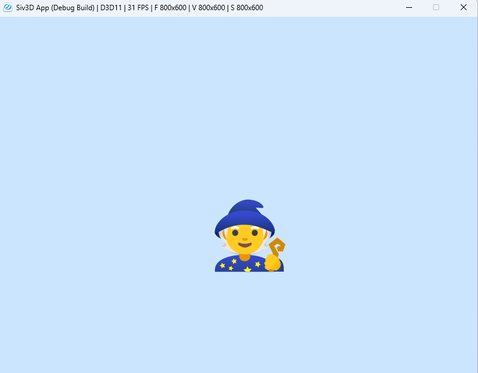
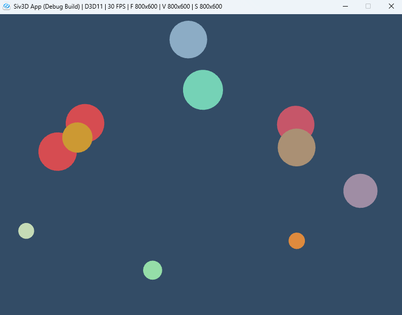
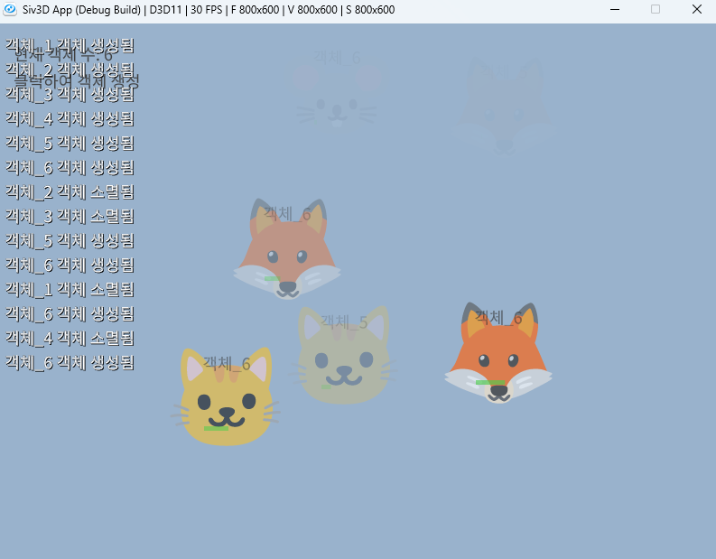
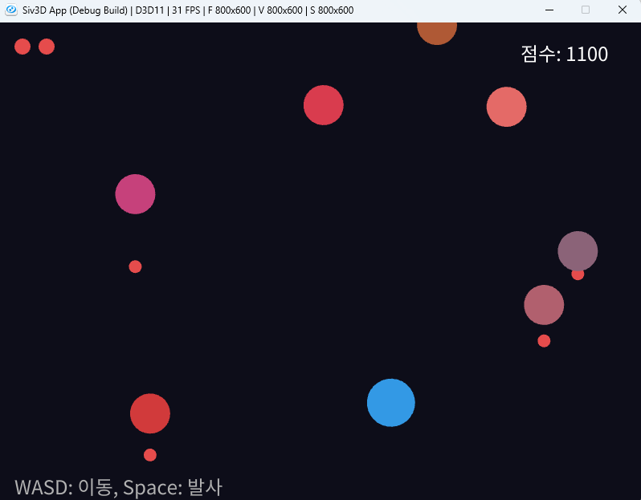
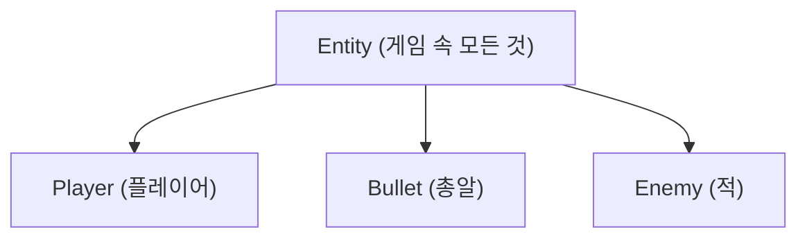

# OpenSiv3D를 이용한 C++ 프로그래밍 학습
  
저자: 최흥배, Claude AI  
  
C++ 프로그래밍 언어를 배우는 것에 중점을 두되, Siv3D 프레임워크를 활용하여 시각적으로 흥미로운 예제를 통해 학습 효과를 높이도록 설계 되었다. 단순한 콘솔 프로그램 대신 그래픽, 소리, 상호작용을 포함한 프로그램을 만들며 C++의 개념을 익힐 수 있다.  
  
필요 소프트웨어:  
- Windows 10 이상
- Visual Studio 2022 이상   
  
-----    
    
# Chapter.05: 객체지향 프로그래밍 기초

객체지향 프로그래밍(OOP)은 현대 소프트웨어 개발의 핵심 패러다임이다. C++는 이러한 객체지향 개념을 완벽하게 지원하며, Siv3D는 이러한 개념을 시각적이고 재미있게 학습할 수 있는 환경을 제공한다.
  

## 5.1 클래스와 객체

### 기본 개념
**클래스(Class)** 는 데이터와 해당 데이터를 조작하는 함수를 하나로 묶는 사용자 정의 데이터 타입이다. **객체(Object)** 는 클래스의 인스턴스이다.

```cpp
// 기본적인 클래스 정의
class Player {
public:
    String name;
    Vec2 position{0, 0};
    double speed{5.0};
    
    void move(Vec2 direction) {
        position += direction * speed;
    }
};

// 객체 생성 및 사용
Player player1;
player1.name = U"플레이어1";
player1.move(Vec2{1, 0}); // 오른쪽으로 이동
```

### Siv3D 활용 예제: 게임 캐릭터 클래스

```cpp
#include <Siv3D.hpp>

class Character 
{
public:
    String name;
    Vec2 position;
    Texture texture;
    double speed;
    
    // 캐릭터 그리기
    void draw() const {
        texture.drawAt(position);
    }
    
    // 캐릭터 이동
    void moveByKeys() {
        if (KeyW.pressed()) position.y -= speed;
        if (KeyS.pressed()) position.y += speed;
        if (KeyA.pressed()) position.x -= speed;
        if (KeyD.pressed()) position.x += speed;
    }
};

void Main() 
{
    Scene::SetBackground(ColorF{0.8, 0.9, 1.0});
    
    // 캐릭터 객체 생성
    Character player;
    player.name = U"주인공";
    player.position = Scene::Center();
    player.texture = Texture{U"🧙"_emoji};
    player.speed = 5.0;
    
    while (System::Update()) {
        // 캐릭터 이동 및 그리기
        player.moveByKeys();
        player.draw();
        
        // 현재 위치 표시
        FontAsset(U"Regular")(U"Position: ({:.1f}, {:.1f})"_fmt(player.position.x, player.position.y))
            .draw(20, 20, ColorF{0.25});
    }
}
```   
  
실행 화면: 
   
    

## 5.2 캡슐화

### 기본 개념
**캡슐화(Encapsulation)** 는 데이터(속성)와 해당 데이터를 처리하는 메서드를 하나의 단위로 묶고, 객체의 내부 상태를 외부에서 직접 접근하지 못하게 하는 것입니다.

```cpp
class BankAccount 
{
private:
    String owner;
    double balance;
    
public:
    // 생성자
    BankAccount(const String& ownerName, double initialBalance)
        : owner(ownerName), balance(initialBalance) {}
    
    // 입금
    void deposit(double amount) {
        if (amount > 0) {
            balance += amount;
        }
    }
    
    // 출금
    bool withdraw(double amount) {
        if (amount > 0 && balance >= amount) {
            balance -= amount;
            return true;
        }
        return false;
    }
    
    // 잔액 확인
    double getBalance() const {
        return balance;
    }
};
```

### Siv3D 활용 예제: 충돌 감지 기능이 있는 물체 클래스

```cpp
#include <Siv3D.hpp>

class CollisionObject 
{
private:
    Vec2 position;
    double radius;
    ColorF color;
    bool isColliding = false;
    
public:
    // 생성자
    CollisionObject(const Vec2& pos, double r, const ColorF& col)
        : position(pos), radius(r), color(col) {}
    
    // 위치 설정
    void setPosition(const Vec2& newPos) {
        position = newPos;
    }
    
    // 위치 얻기
    Vec2 getPosition() const {
        return position;
    }
    
    // 반지름 얻기
    double getRadius() const {
        return radius;
    }
    
    // 충돌 상태 설정
    void setColliding(bool state) {
        isColliding = state;
    }
    
    // 객체 그리기
    void draw() const {
        Circle{position, radius}.draw(isColliding ? ColorF{1.0, 0.3, 0.3, 0.8} : color);
    }
    
    // 다른 객체와 충돌 검사
    bool checkCollision(const CollisionObject& other) const {
        return position.distanceFrom(other.position) < (radius + other.radius);
    }
};

void Main() 
{
    Scene::SetBackground(ColorF{0.2, 0.3, 0.4});
    
    // 물체 생성
    CollisionObject player{Scene::Center(), 30, ColorF{0.8, 0.6, 0.2}};
    Array<CollisionObject> objects;
    
    // 랜덤한 위치에 물체 10개 생성
    for (int i = 0; i < 10; ++i) {
        objects << CollisionObject{
            RandomVec2(Scene::Rect().stretched(-50)),
            Random(15.0, 40.0),
            ColorF{Random(0.2, 0.9), Random(0.2, 0.9), Random(0.2, 0.9)}
        };
    }
    
    while (System::Update()) {
        // 마우스 위치로 플레이어 이동
        player.setPosition(Cursor::Pos());
        
        // 충돌 체크
        for (auto& obj : objects) {
            bool collision = player.checkCollision(obj);
            obj.setColliding(collision);
        }
        
        // 물체 그리기
        for (const auto& obj : objects) {
            obj.draw();
        }
        player.draw();
    }
}
```  
  
실행 화면: 
   
  
  
## 5.3 생성자와 소멸자

### 기본 개념
**생성자(Constructor)** 는 객체가 생성될 때 자동으로 호출되는 특별한 멤버 함수로, 객체를 초기화하는 역할을 한다.  
**소멸자(Destructor)** 는 객체가 소멸될 때 자동으로 호출되는 특별한 멤버 함수로, 객체가 사용한 자원을 정리한다.  

```cpp
class Resource 
{
private:
    String resourceName;
    bool* allocated = nullptr;
    
public:
    // 기본 생성자
    Resource() : resourceName(U"Unknown") {
        Print << U"기본 생성자 호출됨";
    }
    
    // 매개변수 있는 생성자
    Resource(const String& name) : resourceName(name) {
        Print << resourceName << U" 생성자 호출됨";
        allocated = new bool{true};
    }
    
    // 복사 생성자
    Resource(const Resource& other) : resourceName(other.resourceName + U"_copy") {
        Print << resourceName << U" 복사 생성자 호출됨";
        if (other.allocated) {
            allocated = new bool{*other.allocated};
        }
    }
    
    // 이동 생성자 (C++11 이상)
    Resource(Resource&& other) noexcept : resourceName(std::move(other.resourceName)) {
        Print << resourceName << U" 이동 생성자 호출됨";
        allocated = other.allocated;
        other.allocated = nullptr;
    }
    
    // 소멸자
    ~Resource() {
        Print << resourceName << U" 소멸자 호출됨";
        delete allocated;
    }
    
    String getName() const {
        return resourceName;
    }
};
```

### Siv3D 활용 예제: 게임 객체 생성 및 소멸

```cpp
#include <Siv3D.hpp>

class GameObject 
{
private:
    String name;
    Vec2 position;
    Texture texture;
    double lifeTime;
    double creationTime;
    
public:
    // 생성자
    GameObject(const String& objectName, const Vec2& pos, const Texture& tex, double life = 5.0)
        : name(objectName), position(pos), texture(tex), lifeTime(life), creationTime(Scene::Time()) {
        Print << name << U" 객체 생성됨";
    }
    
    // 소멸자
    ~GameObject() {
        Print << name << U" 객체 소멸됨";
    }
    
    // 객체 업데이트 및 그리기
    bool update() {
        double elapsed = Scene::Time() - creationTime;
        double alpha = 1.0 - Min(elapsed / lifeTime, 1.0);
        
        if (alpha <= 0) {
            return false; // 수명이 다하면 false 반환
        }
        
        // 객체 그리기
        texture.drawAt(position, ColorF{1.0, 1.0, 1.0, alpha});
        FontAsset(U"Regular")(name).drawAt(position.movedBy(0, -40), ColorF{0.2, 0.2, 0.2, alpha});
        
        // 남은 수명 표시
        RectF{position.x - 25, position.y + 30, 50 * (1.0 - elapsed / lifeTime), 5}
            .draw(ColorF{0.3, 0.8, 0.3, alpha});
            
        return true;
    }
};

void Main() 
{
    Scene::SetBackground(ColorF{0.6, 0.7, 0.8});
    
    FontAsset::Register(U"Regular", FontMethod::MSDF, 18, Typeface::CJK_Regular_KR);
    
    // 사용할 이모지 텍스처 미리 로드
    const Array<Texture> textures = {
        Texture{U"🐶"_emoji}, Texture{U"🐱"_emoji}, Texture{U"🐭"_emoji},
        Texture{U"🐰"_emoji}, Texture{U"🦊"_emoji}, Texture{U"🐻"_emoji}
    };
    
    // GameObject 객체를 관리할 배열
    Array<std::unique_ptr<GameObject>> gameObjects;
    
    while (System::Update()) 
    {
        // 마우스 왼쪽 버튼으로 객체 생성
        if (MouseL.down()) {
            int index = Random(textures.size() - 1);
            String name = U"객체_" + Format(gameObjects.size() + 1);
            gameObjects << std::make_unique<GameObject>(
                name, Cursor::Pos(), textures[index], Random(3.0, 8.0)
            );
        }
        
        // 모든 객체 업데이트 및 그리기
        for (auto it = gameObjects.begin(); it != gameObjects.end();) {
            if ((*it)->update()) {
                ++it; // 객체가 아직 살아있으면 다음으로
            } else {
                it = gameObjects.erase(it); // 객체 수명이 다하면 제거
            }
        }
        
        // 현재 객체 수 표시
        FontAsset(U"Regular")(U"현재 객체 수: {}"_fmt(gameObjects.size())).draw(20, 20, ColorF{0.25});
        FontAsset(U"Regular")(U"클릭하여 객체 생성").draw(20, 50, ColorF{0.25});
    }
}
```  
  
실행 화면:  
    


## 5.4 접근 제어자

### 기본 개념
C++는 세 가지 접근 제어자를 제공합니다:
- **private**: 해당 클래스 내에서만 접근 가능
- **protected**: 해당 클래스와 파생 클래스에서 접근 가능
- **public**: 어디에서나 접근 가능

```cpp
class Person 
{
private:
    String name;
    int age;
    
protected:
    void updateAge(int newAge) {
        if (newAge >= 0) {
            age = newAge;
        }
    }
    
public:
    Person(const String& personName, int personAge)
        : name(personName), age(personAge) {}
    
    String getName() const {
        return name;
    }
    
    int getAge() const {
        return age;
    }
    
    void setName(const String& newName) {
        name = newName;
    }
    
    void birthday() {
        updateAge(age + 1);
    }
};
```

### Siv3D 활용 예제: 간단한 인벤토리 시스템

```cpp
#include <Siv3D.hpp>

// 아이템 클래스
class Item 
{
private:
    String name;
    String description;
    Texture icon;
    int value;
    
public:
    Item(const String& itemName, const String& itemDesc, const Texture& itemIcon, int itemValue)
        : name(itemName), description(itemDesc), icon(itemIcon), value(itemValue) {}
    
    String getName() const { return name; }
    String getDescription() const { return description; }
    const Texture& getIcon() const { return icon; }
    int getValue() const { return value; }
};

// 인벤토리 클래스
class Inventory 
{
private:
    Array<Item> items;
    size_t capacity;
    
    // 선택된 아이템 인덱스
    Optional<size_t> selectedItemIndex;
    
public:
    Inventory(size_t maxCapacity = 20) : capacity(maxCapacity) {}
    
    // 아이템 추가
    bool addItem(const Item& item) {
        if (items.size() >= capacity) {
            return false;
        }
        items << item;
        return true;
    }
    
    // 아이템 제거
    bool removeItem(size_t index) {
        if (index >= items.size()) {
            return false;
        }
        items.erase(items.begin() + index);
        if (selectedItemIndex && *selectedItemIndex == index) {
            selectedItemIndex.reset();
        } else if (selectedItemIndex && *selectedItemIndex > index) {
            *selectedItemIndex -= 1;
        }
        return true;
    }
    
    // 인벤토리 그리기
    void draw(const Vec2& position, double itemSize = 60.0) {
        const double margin = 10.0;
        const int itemsPerRow = 5;
        
        for (size_t i = 0; i < items.size(); ++i) {
            const int row = static_cast<int>(i) / itemsPerRow;
            const int col = static_cast<int>(i) % itemsPerRow;
            
            const Vec2 itemPos{
                position.x + col * (itemSize + margin),
                position.y + row * (itemSize + margin)
            };
            
            const RectF itemRect{itemPos, itemSize, itemSize};
            
            // 아이템 슬롯 배경
            if (selectedItemIndex && *selectedItemIndex == i) {
                // 선택된 아이템은 강조 표시
                itemRect.draw(ColorF{0.3, 0.6, 0.9, 0.7});
            } else {
                // 일반 아이템 슬롯
                itemRect.draw(ColorF{0.2, 0.2, 0.2, 0.5});
            }
            
            // 아이템 아이콘
            items[i].getIcon().resized(itemSize * 0.8).drawAt(itemRect.center());
            
            // 마우스 호버 시 아이템 이름 표시
            if (itemRect.mouseOver()) {
                Tooltip::Show(items[i].getName() + U"\n" + items[i].getDescription(),
                    Cursor::Pos().movedBy(10, 10));
                
                // 클릭 시 아이템 선택
                if (MouseL.down()) {
                    if (selectedItemIndex && *selectedItemIndex == i) {
                        selectedItemIndex.reset(); // 같은 아이템 다시 클릭 시 선택 해제
                    } else {
                        selectedItemIndex = i;
                    }
                }
            }
        }
        
        // 빈 슬롯 그리기 (최대 용량까지)
        for (size_t i = items.size(); i < capacity; ++i) {
            const int row = static_cast<int>(i) / itemsPerRow;
            const int col = static_cast<int>(i) % itemsPerRow;
            
            const RectF emptySlot{
                position.x + col * (itemSize + margin),
                position.y + row * (itemSize + margin),
                itemSize, itemSize
            };
            
            emptySlot.drawFrame(1, 0, ColorF{0.5, 0.5, 0.5, 0.5});
        }
        
        // 선택된 아이템이 있으면 상세 정보 표시
        if (selectedItemIndex) {
            const Item& selectedItem = items[*selectedItemIndex];
            const RectF detailRect{
                position.x,
                position.y + ((capacity + itemsPerRow - 1) / itemsPerRow) * (itemSize + margin) + margin,
                itemsPerRow * (itemSize + margin) - margin,
                100
            };
            
            detailRect.draw(ColorF{0.1, 0.1, 0.1, 0.7});
            
            FontAsset(U"Regular")(selectedItem.getName())
                .draw(detailRect.pos.movedBy(10, 10), ColorF{1.0});
                
            FontAsset(U"Regular")(selectedItem.getDescription())
                .draw(detailRect.pos.movedBy(10, 40), ColorF{0.8});
                
            FontAsset(U"Regular")(U"가치: {}"_fmt(selectedItem.getValue()))
                .draw(detailRect.pos.movedBy(10, 70), ColorF{0.7, 0.9, 0.7});
                
            // 제거 버튼
            const RectF removeButton{
                detailRect.rightX() - 80, detailRect.bottomY() - 30,
                70, 25
            };
            
            if (removeButton.mouseOver()) {
                removeButton.draw(ColorF{0.8, 0.2, 0.2, 0.8});
                if (MouseL.down()) {
                    removeItem(*selectedItemIndex);
                }
            } else {
                removeButton.draw(ColorF{0.7, 0.2, 0.2, 0.6});
            }
            
            FontAsset(U"Regular")(U"제거").drawAt(removeButton.center(), ColorF{1.0});
        }
    }
    
    // 현재 인벤토리 아이템 수
    size_t size() const {
        return items.size();
    }
    
    // 인벤토리가 가득 찼는지 확인
    bool isFull() const {
        return items.size() >= capacity;
    }
};

void Main() 
{
    Scene::SetBackground(ColorF{0.3, 0.4, 0.5});

    FontAsset::Register(U"Regular", FontMethod::MSDF, 18, Typeface::CJK_Regular_KR);
    
    // 아이템 아이콘 텍스처
    const Array<std::pair<String, Texture>> itemIcons = {
        {U"검", Texture{U"🗡️"_emoji}},
        {U"활", Texture{U"🏹"_emoji}},
        {U"방패", Texture{U"🛡️"_emoji}},
        {U"모자", Texture{U"🎩"_emoji}},
        {U"가방", Texture{U"👜"_emoji}},
        {U"물약", Texture{U"🧪"_emoji}},
        {U"반지", Texture{U"💍"_emoji}},
        {U"책", Texture{U"📚"_emoji}},
        {U"지도", Texture{U"🗺️"_emoji}},
        {U"열쇠", Texture{U"🔑"_emoji}}
    };
    
    // 아이템 설명
    const Array<String> descriptions = {
        U"강력한 공격력을 가진 무기입니다.",
        U"원거리 공격이 가능한 장비입니다.",
        U"방어력을 높여주는 장비입니다.",
        U"마법 저항력을 높여주는 장비입니다.",
        U"아이템을 더 많이 소지할 수 있습니다.",
        U"체력을 회복시켜주는 물약입니다.",
        U"특수한 능력을 부여하는 마법 아이템입니다.",
        U"새로운 스킬을 배울 수 있는 책입니다.",
        U"미지의 영역을 표시하는 지도입니다.",
        U"특별한 문을 열 수 있는 열쇠입니다."
    };
    
    // 인벤토리 생성
    Inventory inventory{15};
    
    while (System::Update()) {
        // 인벤토리 그리기
        inventory.draw(Vec2{50, 50});
        
        // 랜덤 아이템 추가 버튼
        RectF addButton{50, 480, 180, 40};
        
        if (addButton.mouseOver()) {
            addButton.draw(ColorF{0.4, 0.6, 0.4, 0.8});
            if (MouseL.down() && !inventory.isFull()) {
                // 랜덤 아이템 생성
                int index = Random(itemIcons.size() - 1);
                Item newItem{
                    itemIcons[index].first,
                    descriptions[index],
                    itemIcons[index].second,
                    Random(10, 500)
                };
                inventory.addItem(newItem);
            }
        } else {
            addButton.draw(ColorF{0.3, 0.5, 0.3, 0.6});
        }
        
        FontAsset(U"Regular")(U"랜덤 아이템 추가").drawAt(addButton.center(), ColorF{1.0});
        
        // 인벤토리 상태 표시
        FontAsset(U"Regular")(U"인벤토리: {}/{}"_fmt(inventory.size(), 15))
            .draw(50, 540, ColorF{0.9});
    }
}
```
  

## 5.5 종합 예제: 간단한 2D 게임
객체지향 프로그래밍의 모든 핵심 개념을 활용하여 간단한 2D 슈팅 게임을 만들어 보겠다. 이 예제에서는 클래스, 상속, 캡슐화, 다형성, 생성자/소멸자를 모두 활용한다.

```cpp
#include <Siv3D.hpp>

// 게임 엔티티의 기본 클래스
class Entity 
{
protected:
    Vec2 position;
    Vec2 velocity;
    double radius;
    ColorF color;
    
public:
    Entity(const Vec2& pos, double r, const ColorF& col)
        : position(pos), velocity(Vec2{0, 0}), radius(r), color(col) {}
    
    virtual ~Entity() {}
    
    virtual void update() {
        position += velocity;
    }
    
    virtual void draw() const {
        Circle{position, radius}.draw(color);
    }
    
    Circle getCollider() const {
        return Circle{position, radius};
    }
    
    Vec2 getPosition() const {
        return position;
    }
    
    void setVelocity(const Vec2& vel) {
        velocity = vel;
    }
    
    virtual void onCollision(Entity* other) {
        // 기본 충돌 처리
    }
};

// 플레이어 클래스
class Player : public Entity 
{
private:
    double shootCooldown = 0;
    int health = 3;
    int score = 0;
    
public:
    Player(const Vec2& pos)
        : Entity(pos, 30, ColorF{0.2, 0.6, 0.9}) {}
    
    void update() override {
        // 키보드 입력으로 이동
        Vec2 direction{0, 0};
        
        if (KeyW.pressed()) direction.y -= 1;
        if (KeyS.pressed()) direction.y += 1;
        if (KeyA.pressed()) direction.x -= 1;
        if (KeyD.pressed()) direction.x += 1;
        
        if (!direction.isZero()) {
            direction = direction.normalized();
        }
        
        velocity = direction * 5.0;
        
        // 화면 경계 처리
        position += velocity;
        position.x = Clamp(position.x, radius, Scene::Width() - radius);
        position.y = Clamp(position.y, radius, Scene::Height() - radius);
        
        // 발사 쿨다운 감소
        if (shootCooldown > 0) {
            shootCooldown -= Scene::DeltaTime();
        }
    }
    
    void draw() const override {
        // 플레이어 그리기
        Circle{position, radius}.draw(color);
        
        // 체력 표시
        for (int i = 0; i < health; ++i) {
            Circle{30 + i * 30.0, 30, 10}.draw(ColorF{0.9, 0.3, 0.3});
        }
        
        // 점수 표시
        FontAsset(U"Regular")(U"점수: {}"_fmt(score)).draw(Scene::Width() - 150, 20, ColorF{1.0});
    }
    
    bool canShoot() const {
        return shootCooldown <= 0;
    }
    
    void resetShootCooldown() {
        shootCooldown = 0.2; // 0.2초 쿨다운
    }
    
    void increaseScore(int points) {
        score += points;
    }
    
    void takeDamage() {
        if (health > 0) {
            health--;
        }
    }
    
    int getHealth() const {
        return health;
    }
    
    int getScore() const {
        return score;
    }
};

// 총알 클래스
class Bullet : public Entity 
{
private:
    bool isPlayerBullet;
    double lifetime = 2.0; // 2초 후 사라짐
    
public:
    Bullet(const Vec2& pos, const Vec2& vel, bool playerBullet)
        : Entity(pos, 8, playerBullet ? ColorF{0.9, 0.9, 0.2} : ColorF{0.9, 0.3, 0.3})
        , isPlayerBullet(playerBullet) {
        setVelocity(vel);
    }
    
    void update() override {
        Entity::update();
        
        // 수명 감소
        lifetime -= Scene::DeltaTime();
    }
    
    bool isExpired() const {
        return lifetime <= 0 || 
               position.x < 0 || position.x > Scene::Width() ||
               position.y < 0 || position.y > Scene::Height();
    }
    
    bool isFromPlayer() const {
        return isPlayerBullet;
    }
};

// 적 클래스
class Enemy : public Entity 
{
private:
    double shootInterval;
    double timeSinceLastShot = 0;
    int points;
    
public:
    Enemy(const Vec2& pos, double speed, const ColorF& col, double shootRate, int pointValue)
        : Entity(pos, 25, col), shootInterval(shootRate), points(pointValue) {
        velocity = Vec2{0, speed};
    }
    
    void update() override {
        Entity::update();
        
        // 총알 발사 타이밍 업데이트
        timeSinceLastShot += Scene::DeltaTime();
    }
    
    bool canShoot() const {
        return timeSinceLastShot >= shootInterval;
    }
    
    void resetShootTimer() {
        timeSinceLastShot = 0;
    }
    
    bool isOffScreen() const {
        return position.y - radius > Scene::Height();
    }
    
    int getPoints() const {
        return points;
    }
};

// 게임 메인 함수
void Main() 
{
    Scene::SetBackground(ColorF{0.05, 0.05, 0.1});
    
    // 폰트 등록
    FontAsset::Register(U"Regular", FontMethod::MSDF, 24, Typeface::CJK_Regular_KR);
    
    // 플레이어 생성
    Player player{Vec2{Scene::Width() / 2, Scene::Height() - 100}};
    
    // 게임 오브젝트 컨테이너
    Array<std::unique_ptr<Bullet>> bullets;
    Array<std::unique_ptr<Enemy>> enemies;
    
    // 게임 상태
    bool gameOver = false;
    double lastEnemySpawnTime = 0;
    double enemySpawnInterval = 1.0; // 1초마다 적 생성
    
    while (System::Update()) {
        if (!gameOver) {
            // 플레이어 업데이트
            player.update();
            
            // 스페이스바로 총알 발사
            if (KeySpace.down() && player.canShoot()) {
                bullets << std::make_unique<Bullet>(
                    player.getPosition(), Vec2{0, -10}, true
                );
                player.resetShootCooldown();
            }
            
            // 적 생성
            if (Scene::Time() - lastEnemySpawnTime > enemySpawnInterval) {
                const double x = Random(50.0, Scene::Width() - 50.0);
                const double speed = Random(2.0, 4.0);
                const double shootRate = Random(1.0, 3.0);
                const ColorF color{Random(0.5, 0.9), Random(0.2, 0.5), Random(0.2, 0.5)};
                
                enemies << std::make_unique<Enemy>(
                    Vec2{x, -30}, speed, color, shootRate, 100
                );
                
                lastEnemySpawnTime = Scene::Time();
                enemySpawnInterval = Max(0.5, enemySpawnInterval - 0.01); // 점점 빨라짐
            }
            
            // 적 업데이트 및 총알 발사
            for (auto& enemy : enemies) {
                enemy->update();
                
                if (enemy->canShoot()) {
                    bullets << std::make_unique<Bullet>(
                        enemy->getPosition(), Vec2{0, 5}, false
                    );
                    enemy->resetShootTimer();
                }
            }
            
            // 총알 업데이트
            for (auto& bullet : bullets) {
                bullet->update();
            }
            
            // 충돌 검사: 플레이어 총알 vs 적
            for (auto itBullet = bullets.begin(); itBullet != bullets.end();) {
                bool bulletRemoved = false;
                
                if ((*itBullet)->isFromPlayer()) {
                    for (auto itEnemy = enemies.begin(); itEnemy != enemies.end();) {
                        if ((*itBullet)->getCollider().intersects((*itEnemy)->getCollider())) {
                            // 점수 증가
                            player.increaseScore((*itEnemy)->getPoints());
                            
                            // 적 제거
                            itEnemy = enemies.erase(itEnemy);
                            
                            // 총알 제거
                            itBullet = bullets.erase(itBullet);
                            bulletRemoved = true;
                            break;
                        } else {
                            ++itEnemy;
                        }
                    }
                } else { // 적 총알 vs 플레이어
                    if ((*itBullet)->getCollider().intersects(player.getCollider())) {
                        player.takeDamage();
                        itBullet = bullets.erase(itBullet);
                        bulletRemoved = true;
                        
                        // 체력이 0이 되면 게임 오버
                        if (player.getHealth() <= 0) {
                            gameOver = true;
                        }
                    }
                }
                
                if (!bulletRemoved) {
                    if ((*itBullet)->isExpired()) {
                        itBullet = bullets.erase(itBullet);
                    } else {
                        ++itBullet;
                    }
                }
            }
            
            // 화면 밖으로 나간 적 제거
            enemies.remove_if([](const std::unique_ptr<Enemy>& enemy) {
                return enemy->isOffScreen();
            });
            
            // 플레이어와 적 충돌 검사
            for (auto itEnemy = enemies.begin(); itEnemy != enemies.end();) {
                if ((*itEnemy)->getCollider().intersects(player.getCollider())) {
                    player.takeDamage();
                    itEnemy = enemies.erase(itEnemy);
                    
                    // 체력이 0이 되면 게임 오버
                    if (player.getHealth() <= 0) {
                        gameOver = true;
                    }
                } else {
                    ++itEnemy;
                }
            }
        }
        
        // 게임 오브젝트 그리기
        for (const auto& bullet : bullets) {
            bullet->draw();
        }
        
        for (const auto& enemy : enemies) {
            enemy->draw();
        }
        
        player.draw();
        
        // 게임 오버 화면
        if (gameOver) {
            const RectF gameOverRect{Scene::Center().movedBy(-200, -100), 400, 200};
            gameOverRect.draw(ColorF{0.0, 0.0, 0.0, 0.8});
            
            FontAsset(U"Regular")(U"게임 오버").drawAt(gameOverRect.center().movedBy(0, -40), ColorF{1.0});
            FontAsset(U"Regular")(U"최종 점수: {}"_fmt(player.getScore())).drawAt(gameOverRect.center(), ColorF{1.0});
            
            const RectF restartButton{Scene::Center().movedBy(-80, 40), 160, 40};
            
            if (restartButton.mouseOver()) {
                restartButton.draw(ColorF{0.4, 0.6, 0.4, 0.8});
                if (MouseL.down()) {
                    // 게임 재시작
                    player = Player{Vec2{Scene::Width() / 2, Scene::Height() - 100}};
                    bullets.clear();
                    enemies.clear();
                    gameOver = false;
                    lastEnemySpawnTime = Scene::Time();
                    enemySpawnInterval = 1.0;
                }
            } else {
                restartButton.draw(ColorF{0.3, 0.5, 0.3, 0.6});
            }
            
            FontAsset(U"Regular")(U"다시 시작").drawAt(restartButton.center(), ColorF{1.0});
        }
        
        // 조작 안내
        if (!gameOver) {
            FontAsset(U"Regular")(U"WASD: 이동, Space: 발사").draw(20, Scene::Height() - 40, ColorF{0.7});
        }
    }
}
```  
  
실행 화면:  
     


코드 설명    
  
### 1. 코드의 핵심 구조: 클래스와 상속
이 코드는 **객체 지향 프로그래밍(OOP)**이라는 방식으로 작성되었다. 어려운 말 같지만, '설계도'와 '실제 물건'의 관계로 생각하면 쉽다.  

  * **클래스(Class):** '설계도'에 해당한다. 예를 들어 '자동차 설계도'가 있다면, 여기에는 "바퀴 4개, 핸들 1개, 속도를 낸다"와 같은 정보가 들어있다.
  * **객체(Object):** '설계도'를 바탕으로 만들어진 '실제 물건'이다. '자동차 설계도'로 파란색 자동차, 빨간색 자동차를 만들 수 있는 것처럼.

이 코드에는 `Entity`, `Player`, `Bullet`, `Enemy`라는 4개의 주요 설계도(클래스)가 있다. 여기서 가장 중요한 개념은 **상속**이다.  
  
**상속(Inheritance)**이란, 기존 설계도를 물려받아 더 구체적인 설계도를 만드는 것이다. 예를 들어 '자동차 설계도'를 상속받아 '트럭 설계도'를 만들면, 트럭은 자동차의 기본 기능을 모두 가지면서 '짐을 싣는다'는 특별한 기능이 추가된다.  
  
이 코드의 상속 관계는 다음과 같다.  



`Player`, `Bullet`, `Enemy`는 모두 `Entity`라는 기본 설계도를 물려받았다. 그래서 셋 다 **위치, 속도, 크기, 색상** 같은 공통된 특징을 가지고 있다.

  
### 2. 클래스별 상세 설명 뜯어보기
이제 각 설계도(클래스)가 어떤 역할을 하는지 자세히 알아보자  

#### `Entity` 클래스: 모든 객체의 조상 👴
이 클래스는 게임에 등장하는 모든 객체(플레이어, 적, 총알)의 **기본 뼈대**이다.  

  * **주요 변수:**
      * `position`: 화면에서의 위치 (x, y 좌표)
      * `velocity`: 움직이는 속도와 방향
      * `radius`: 객체의 크기 (반지름)
      * `color`: 객체의 색상
  * **주요 함수(기능):**
      * `update()`: 매 순간 상태를 업데이트한다. 기본적으로는 `position`에 `velocity`를 더해서 움직이게 만든다.
      * `draw()`: 화면에 자기 자신(원)을 그린다.
      * `getCollider()`: 충돌 검사를 위한 범위를 알려준다.  
  
`Entity`는 "게임에 나오는 건 일단 움직이고, 화면에 그려져야 해\!"라는 기본 규칙을 정해주는 역할을 한다.

#### `Player` 클래스: 우리가 조종할 주인공 🦸‍♀️
`Entity`를 상속받아 만들어진 **플레이어**이다. `Entity`의 기본 기능에 플레이어만의 특별한 기능이 추가됐었다.  
  
  * **추가된 변수:**
      * `health`: 체력 (목숨)
      * `score`: 점수
      * `shootCooldown`: 총알을 쏜 뒤 다음 총알을 쏠 때까지의 대기 시간
  * **특별한 기능 (기존 기능 변경):**
      * `update()`: `Entity`의 단순한 움직임 대신, **키보드(W, A, S, D) 입력**을 받아 움직인다. 또 화면 밖으로 나가지 못하게 처리한다.
      * `draw()`: 자기 자신을 그리는 것 외에, 화면에 **체력과 점수**도 함께 표시한다.
  * **새로운 기능:**
      * `canShoot()`: 지금 총알을 쏠 수 있는지 확인한다.
      * `takeDamage()`: 적에게 맞았을 때 체력을 깎는다.

#### `Bullet` 클래스: 무기 🔫
역시 `Entity`를 상속받은 **총알**이다.

  * **추가된 변수:**
      * `isPlayerBullet`: **플레이어가 쏜 총알인지, 적이 쏜 총알인지** 구분한다. (색깔도 이걸로 결정!)
      * `lifetime`: 총알이 일정 시간(2초)이 지나면 저절로 사라지게 만든다.
  * **특별한 기능:**
      * `update()`: 기본 움직임에 더해 `lifetime`을 계속 줄여나간다.
      * `isExpired()`: 총알이 사라져야 할 때인지(`lifetime`이 다 됐거나 화면 밖으로 나갔을 때) 알려준다.  

#### `Enemy` 클래스: 우리의 적 👾
`Entity`를 상속받은 **적**이다.

  * **추가된 변수:**
      * `shootInterval`: 얼마나 자주 총알을 쏠지 결정하는 시간 간격이다.
      * `points`: 이 적을 물리치면 얻는 점수이다.
  * **특별한 기능:**
      * `update()`: 기본적으로 아래로만 움직이고, 총알 쏠 타이밍을 계속 계산한다.
      * `canShoot()`: 총알 쏠 때가 됐는지 알려준다.
      * `isOffScreen()`: 화면 밖으로 완전히 나갔는지 확인한다.

### 3. 게임의 실제 진행: `Main()` 함수 🎬
이곳이 바로 게임의 모든 것이 실제로 일어나는 **메인 무대**이다. `while (System::Update())` 라는 반복문 안에서 게임이 계속 진행된다.

게임은 크게 아래의 순서로 매 순간(1초에 60번) 반복된다.

```
+------------------------------------------+
|            게임 루프 (매 프레임 반복)      |
+------------------------------------------+
|                                          |
|  1. 상태 업데이트 (Update)                 |
|     - 플레이어 움직임 (키보드 입력)          |
|     - 총알 발사 (스페이스바)                |
|     - 새로운 적 생성                       |
|     - 모든 적, 총알 위치 업데이트            |
|                                          |
|  2. 충돌 검사 (Collision Check)           |
|     - 내 총알 vs 적                       |
|     - 적 총알 vs 나                       |
|     - 적 vs 나                            |
|     - (충돌 시 체력 감소, 점수 증가, 객체 삭제) |
|                                          |
|  3. 정리 (Cleanup)                        |
|     - 화면 밖으로 나간 객체들 삭제           |
|                                          |
|  4. 그리기 (Draw)                         |
|     - 배경, 플레이어, 적, 총알, UI 그리기    |
|                                          |
+------------------------------------------+
```

#### 핵심 로직 요약

  * **객체 관리:** `bullets`와 `enemies`라는 목록(배열)에 모든 총알과 적을 담아두고 한 번에 관리한다. `std::unique_ptr`는 객체가 필요 없어졌을 때 자동으로 메모리에서 지워주는 편리한 도구이다.
  * **충돌 검사:** `getCollider().intersects(...)` 함수를 사용해 두 원(객체)이 서로 겹치는지 검사한다. 겹치면 충돌한 거다!
  * **게임 오버 및 재시작:** 플레이어의 `health`가 0이 되면 `gameOver` 상태가 되고, 게임 오버 화면이 나타난다. "다시 시작" 버튼을 누르면 모든 변수와 객체 목록을 초기 상태로 되돌려 게임을 처음부터 다시 시작한다.
  
이 코드는 객체 지향의 기본 개념을 활용하여 각 요소(플레이어, 적, 총알)의 역할과 책임을 명확하게 나눈 좋은 예시이다. 이 구조를 이해하면 앞으로 더 복잡한 게임도 쉽게 만들 수 있을 것이다! 😊
    

    
## 결론
이번 튜토리얼에서는 C++의 객체지향 프로그래밍 기본 개념들을 Siv3D를 활용하여 배웠다. 클래스와 객체, 캡슐화, 생성자와 소멸자, 접근 제어자 등의 개념을 시각적이고 인터랙티브한 예제를 통해 학습했다.

이러한 객체지향 개념들은 복잡한 게임이나 애플리케이션을 구조화하고, 코드 재사용성을 높이며, 유지보수를 쉽게 만드는 데 필수적이다. Siv3D의 직관적인 API와 결합하면 창의적인 C++ 프로그래밍이 더욱 즐겁고 효율적으로 된다.  
  
다음 단계로는 상속과 다형성, 연산자 오버로딩, 템플릿 등 C++의 더 고급 객체지향 기능을 학습하고, 더 복잡한 게임이나 애플리케이션을 개발할 수 있다.    

