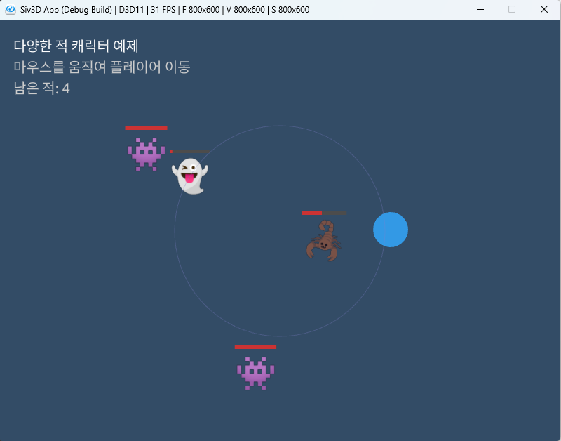
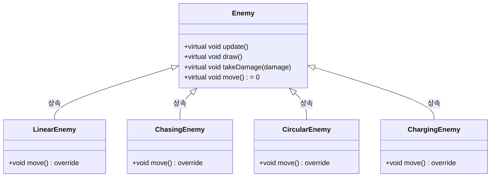
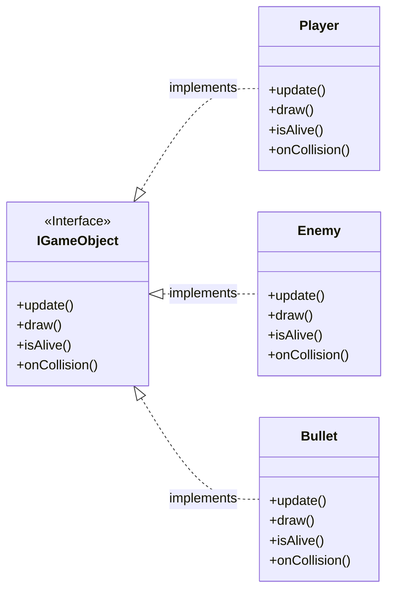

# OpenSiv3D를 이용한 C++ 프로그래밍 학습
  
저자: 최흥배, Claude AI  
  
C++ 프로그래밍 언어를 배우는 것에 중점을 두되, Siv3D 프레임워크를 활용하여 시각적으로 흥미로운 예제를 통해 학습 효과를 높이도록 설계 되었다. 단순한 콘솔 프로그램 대신 그래픽, 소리, 상호작용을 포함한 프로그램을 만들며 C++의 개념을 익힐 수 있다.  
  
필요 소프트웨어:  
- Windows 10 이상
- Visual Studio 2022 이상   
  
-----    
    
# Chapter.6: 상속과 다형성

상속과 다형성은 객체지향 프로그래밍의 핵심 개념으로, 코드 재사용성을 높이고 복잡한 시스템을 효율적으로 설계할 수 있게 해준다.  
이번 단계에서는 C++의 상속과 다형성 개념을 Siv3D 프레임워크를 활용해 시각적이고 재미있는 방식으로 배워보겠다.  
  

## 6.1 상속 기본 개념

### 상속의 개념
상속(Inheritance)은 기존 클래스의 속성과 기능을 새로운 클래스가 물려받아 사용하는 방법이다. 이를 통해 코드 중복을 줄이고 계층적 관계를 표현할 수 있다.  

```cpp
// 기본 클래스 (부모 클래스)
class GameObject 
{
protected:
    Vec2 position;
    double rotation;
    
public:
    GameObject(const Vec2& pos, double rot) 
        : position(pos), rotation(rot) {}
    
    void setPosition(const Vec2& pos) {
        position = pos;
    }
    
    Vec2 getPosition() const {
        return position;
    }
    
    void setRotation(double rot) {
        rotation = rot;
    }
    
    double getRotation() const {
        return rotation;
    }
    
    void update() {
        // 기본 업데이트 로직
    }
    
    void draw() const {
        // 기본 그리기 로직
    }
};

// 파생 클래스 (자식 클래스)
class Character : public GameObject {
private:
    String name;
    double speed;
    
public:
    Character(const Vec2& pos, double rot, const String& charName, double charSpeed)
        : GameObject(pos, rot), name(charName), speed(charSpeed) {}
    
    void move(const Vec2& direction) {
        position += direction * speed;
    }
    
    String getName() const {
        return name;
    }
    
    void draw() const {
        // 캐릭터 그리기 로직
        Circle{position, 30}.draw(ColorF{0.6, 0.8, 0.3});
        FontAsset(U"Regular")(name).drawAt(position.movedBy(0, -40));
    }
};
```

### 상속의 종류
C++에서 상속은 접근 제어자에 따라 다음과 같이 구분된다:

- **public 상속**: 부모 클래스의 public 멤버는 public으로, protected 멤버는 protected로 상속된다.
- **protected 상속**: 부모 클래스의 public, protected 멤버가 모두 protected로 상속된다.
- **private 상속**: 부모 클래스의 public, protected 멤버가 모두 private으로 상속된다.
  
```cpp
class PublicDerived : public GameObject { /* ... */ };
class ProtectedDerived : protected GameObject { /* ... */ };
class PrivateDerived : private GameObject { /* ... */ };
```
  

## 6.2 가상 함수와 다형성

### 가상 함수(Virtual Function)
가상 함수는 파생 클래스에서 재정의(override)할 수 있는 함수이다. `virtual` 키워드를 사용하여 선언한다.  

```cpp
class Shape 
{
protected:
    Vec2 position;
    ColorF color;
    
public:
    Shape(const Vec2& pos, const ColorF& col)
        : position(pos), color(col) {}
    
    // 가상 함수 선언
    virtual void draw() const {
        // 기본 도형 그리기 로직
    }
    
    virtual double getArea() const {
        return 0.0; // 기본 구현은 면적 0
    }
};

class Circle : public Shape 
{
private:
    double radius;
    
public:
    Circle(const Vec2& pos, double r, const ColorF& col)
        : Shape(pos, col), radius(r) {}
    
    // 가상 함수 재정의(오버라이드)
    void draw() const override {
        Siv3D::Circle{position, radius}.draw(color);
    }
    
    double getArea() const override {
        return Math::Pi * radius * radius;
    }
};

class Rectangle : public Shape 
{
private:
    double width;
    double height;
    
public:
    Rectangle(const Vec2& pos, double w, double h, const ColorF& col)
        : Shape(pos, col), width(w), height(h) {}
    
    // 가상 함수 재정의(오버라이드)
    void draw() const override {
        RectF{position, width, height}.draw(color);
    }
    
    double getArea() const override {
        return width * height;
    }
};
```

### 다형성(Polymorphism)
다형성은 같은 인터페이스로 다양한 객체를 다룰 수 있는 능력이다. C++에서는 베이스 클래스 포인터나 참조를 통해 파생 클래스 객체에 접근할 때 다형성이 발생한다.

```cpp
// 다형성 활용 예제
void drawShape(const Shape& shape) {
    shape.draw(); // 실제 객체의 타입에 따라 적절한 draw 함수가 호출됨
}

// 사용 예시
Circle circle{Vec2{200, 200}, 50, ColorF{0.8, 0.2, 0.2}};
Rectangle rect{Vec2{400, 200}, 80, 60, ColorF{0.2, 0.8, 0.2}};

drawShape(circle); // Circle의 draw 함수 호출
drawShape(rect); // Rectangle의 draw 함수 호출

// 포인터 배열을 통한 다형성
Array<std::unique_ptr<Shape>> shapes;
shapes << std::make_unique<Circle>(Vec2{100, 100}, 30, ColorF{0.8, 0.3, 0.3});
shapes << std::make_unique<Rectangle>(Vec2{200, 100}, 60, 40, ColorF{0.3, 0.8, 0.3});

// 모든 도형 그리기
for (const auto& shape : shapes) {
    shape->draw();
}
```
  

## 6.3 추상 클래스와 인터페이스

### 순수 가상 함수와 추상 클래스
순수 가상 함수(pure virtual function)는 구현이 없는 가상 함수로, `= 0`으로 선언한다. 하나 이상의 순수 가상 함수를 포함하는 클래스를 추상 클래스(abstract class)라고 하며, 이는 직접 인스턴스화할 수 없다.  
  
```cpp
// 추상 클래스
class Drawable 
{
public:
    // 순수 가상 함수
    virtual void draw() const = 0;
    
    // 일반 가상 함수
    virtual void update() {
        // 기본 구현
    }
    
    // 가상 소멸자
    virtual ~Drawable() = default;
};

// 추상 클래스 구현
class AnimatedSprite : public Drawable 
{
private:
    Texture texture;
    Array<RectF> frames;
    int currentFrame;
    double animationSpeed;
    Vec2 position;
    
public:
    AnimatedSprite(const Texture& tex, const Array<RectF>& frameRects, double speed, const Vec2& pos)
        : texture(tex), frames(frameRects), currentFrame(0), animationSpeed(speed), position(pos) {}
    
    // 순수 가상 함수 구현
    void draw() const override {
        texture(frames[currentFrame]).drawAt(position);
    }
    
    void update() override {
        // 프레임 업데이트
        currentFrame = (currentFrame + static_cast<int>(Scene::DeltaTime() * animationSpeed)) % frames.size();
    }
};
```

### 인터페이스 패턴
C++에는 인터페이스 키워드가 없지만, 모든 함수가 순수 가상 함수인 추상 클래스를 통해 인터페이스 패턴을 구현할 수 있다.  
  
```cpp
// 인터페이스 패턴
class Clickable 
{
public:
    virtual bool onClick(const Vec2& mousePos) = 0;
    virtual ~Clickable() = default;
};

class Hoverable 
{
public:
    virtual void onHover(const Vec2& mousePos) = 0;
    virtual ~Hoverable() = default;
};

// 여러 인터페이스 구현
class Button : public Drawable, public Clickable, public Hoverable 
{
private:
    RectF rect;
    String label;
    std::function<void()> action;
    ColorF normalColor;
    ColorF hoverColor;
    bool isHovering;
    
public:
    Button(const RectF& buttonRect, const String& buttonLabel, const std::function<void()>& buttonAction)
        : rect(buttonRect), label(buttonLabel), action(buttonAction),
          normalColor(0.3, 0.3, 0.8), hoverColor(0.4, 0.4, 0.9), isHovering(false) {}
    
    void draw() const override {
        rect.draw(isHovering ? hoverColor : normalColor);
        FontAsset(U"Regular")(label).drawAt(rect.center(), ColorF{1.0});
    }
    
    bool onClick(const Vec2& mousePos) override {
        if (rect.contains(mousePos)) {
            action();
            return true;
        }
        return false;
    }
    
    void onHover(const Vec2& mousePos) override {
        isHovering = rect.contains(mousePos);
    }
};
```
  

## 6.4 Siv3D 활용 예제: 다양한 적 캐릭터 상속 구조 만들기
이제 상속과 다형성을 활용하여 다양한 적 캐릭터 시스템을 구현해 보겠다.

```cpp
#include <Siv3D.hpp>

// 적 캐릭터의 기본 클래스
class Enemy 
{
protected:
    Vec2 position;
    double health;
    double speed;
    Texture texture;
    double radius;
    
public:
    Enemy(const Vec2& pos, double hp, double spd, const Texture& tex, double rad)
        : position(pos), health(hp), speed(spd), texture(tex), radius(rad) {}
    
    virtual ~Enemy() = default;
    
    // 가상 함수들
    virtual void update() {
        // 기본 이동 로직
        move();
    }
    
    virtual void draw() const {
        texture.resized(radius * 2).drawAt(position);
        
        // 체력바 표시
        const double barWidth = radius * 2;
        const double barHeight = 5.0;
        const Vec2 barPos = position.movedBy(0, -radius - 10);
        
        RectF{barPos.x - barWidth / 2, barPos.y, barWidth, barHeight}.draw(ColorF{0.3});
        RectF{barPos.x - barWidth / 2, barPos.y, barWidth * (health / 100.0), barHeight}.draw(ColorF{0.8, 0.2, 0.2});
    }
    
    virtual void takeDamage(double damage) {
        health = Max(0.0, health - damage);
    }
    
    virtual bool isDead() const {
        return health <= 0;
    }
    
    virtual double getCollisionRadius() const {
        return radius;
    }
    
    virtual Vec2 getPosition() const {
        return position;
    }
    
protected:
    // 각 적 타입별로 다른 이동 방식 구현
    virtual void move() = 0;
};

// 직선 이동하는 적
class LinearEnemy : public Enemy 
{
private:
    Vec2 direction;
    
public:
    LinearEnemy(const Vec2& pos, const Vec2& dir, double spd = 2.0)
        : Enemy(pos, 100, spd, Texture{U"👾"_emoji}, 30), direction(dir.normalized()) {}
    
protected:
    void move() override {
        position += direction * speed;
        
        // 화면 경계에 닿으면 방향 전환
        if (position.x < radius || position.x > Scene::Width() - radius) {
            direction.x *= -1;
            position.x = Clamp(position.x, radius, Scene::Width() - radius);
        }
        
        if (position.y < radius || position.y > Scene::Height() - radius) {
            direction.y *= -1;
            position.y = Clamp(position.y, radius, Scene::Height() - radius);
        }
    }
};

// 추적하는 적
class ChasingEnemy : public Enemy 
{
private:
    Vec2 targetPosition;
    
public:
    ChasingEnemy(const Vec2& pos, double spd = 1.5)
        : Enemy(pos, 150, spd, Texture{U"👹"_emoji}, 35), targetPosition(Scene::Center()) {}
    
    void setTarget(const Vec2& target) {
        targetPosition = target;
    }
    
protected:
    void move() override {
        Vec2 direction = (targetPosition - position);
        
        if (!direction.isZero()) {
            direction = direction.normalized();
            position += direction * speed;
        }
    }
    
public:
    void draw() const override {
        Enemy::draw();
        
        // 목표 지점까지 선 그리기
        Line{position, targetPosition}.draw(1.0, ColorF{0.8, 0.2, 0.2, 0.3});
    }
};

// 원형 패턴으로 이동하는 적
class CircularEnemy : public Enemy 
{
private:
    Vec2 center;
    double radius;
    double angle;
    double angularSpeed;
    
public:
    CircularEnemy(const Vec2& centerPos, double orbitRadius, double startAngle = 0.0, double rotationSpeed = 0.02)
        : Enemy(centerPos + Vec2{Cos(startAngle), Sin(startAngle)} * orbitRadius, 80, 0, Texture{U"👻"_emoji}, 28),
          center(centerPos), radius(orbitRadius), angle(startAngle), angularSpeed(rotationSpeed) {}
    
protected:
    void move() override {
        angle += angularSpeed;
        position = center + Vec2{Cos(angle), Sin(angle)} * radius;
    }
    
public:
    void draw() const override {
        Enemy::draw();
        
        // 원형 경로 표시
        Circle{center, radius}.drawFrame(1.0, ColorF{0.5, 0.5, 0.8, 0.3});
    }
};

// 돌진하는 적
class ChargingEnemy : public Enemy 
{
private:
    enum class State {
        Idle,
        Preparing,
        Charging,
        Cooldown
    };
    
    State state = State::Idle;
    Vec2 targetPosition;
    Vec2 chargeDirection;
    double idleTime = 0;
    double prepareTime = 0;
    double chargeTime = 0;
    double cooldownTime = 0;
    
    const double MAX_IDLE_TIME = 2.0;
    const double MAX_PREPARE_TIME = 1.0;
    const double MAX_CHARGE_TIME = 0.5;
    const double MAX_COOLDOWN_TIME = 1.5;
    const double CHARGE_SPEED_MULTIPLIER = 5.0;
    
public:
    ChargingEnemy(const Vec2& pos)
        : Enemy(pos, 120, 1.0, Texture{U"🦂"_emoji}, 32) {}
    
    void setTarget(const Vec2& target) {
        targetPosition = target;
    }
    
    void update() override {
        move();
    }
    
protected:
    void move() override {
        const double deltaTime = Scene::DeltaTime();
        
        switch (state) {
        case State::Idle:
            idleTime += deltaTime;
            if (idleTime >= MAX_IDLE_TIME) {
                state = State::Preparing;
                idleTime = 0;
                
                // 목표 방향 설정
                chargeDirection = (targetPosition - position).normalized();
            }
            break;
            
        case State::Preparing:
            prepareTime += deltaTime;
            if (prepareTime >= MAX_PREPARE_TIME) {
                state = State::Charging;
                prepareTime = 0;
            }
            break;
            
        case State::Charging:
            chargeTime += deltaTime;
            position += chargeDirection * speed * CHARGE_SPEED_MULTIPLIER;
            
            if (chargeTime >= MAX_CHARGE_TIME) {
                state = State::Cooldown;
                chargeTime = 0;
            }
            
            // 화면 경계 처리
            position.x = Clamp(position.x, radius, Scene::Width() - radius);
            position.y = Clamp(position.y, radius, Scene::Height() - radius);
            break;
            
        case State::Cooldown:
            cooldownTime += deltaTime;
            if (cooldownTime >= MAX_COOLDOWN_TIME) {
                state = State::Idle;
                cooldownTime = 0;
            }
            break;
        }
    }
    
    void draw() const override {
        ColorF overlayColor;
        
        switch (state) {
        case State::Idle:
            overlayColor = ColorF{1.0, 1.0, 1.0, 1.0};
            break;
        case State::Preparing:
            overlayColor = ColorF{1.0, 0.8, 0.3, 1.0};
            break;
        case State::Charging:
            overlayColor = ColorF{1.0, 0.2, 0.2, 1.0};
            break;
        case State::Cooldown:
            overlayColor = ColorF{0.5, 0.5, 0.8, 1.0};
            break;
        }
        
        // 상태에 따라 색상 변화
        texture.resized(radius * 2).drawAt(position, overlayColor);
        
        // 체력바
        const double barWidth = radius * 2;
        const double barHeight = 5.0;
        const Vec2 barPos = position.movedBy(0, -radius - 10);
        
        RectF{barPos.x - barWidth / 2, barPos.y, barWidth, barHeight}.draw(ColorF{0.3});
        RectF{barPos.x - barWidth / 2, barPos.y, barWidth * (health / 100.0), barHeight}.draw(ColorF{0.8, 0.2, 0.2});
        
        // 준비/쿨다운 상태 표시
        if (state == State::Preparing) {
            Circle{position, radius * (1.0 + prepareTime / MAX_PREPARE_TIME)}
                .drawFrame(2, ColorF{1.0, 0.8, 0.3, 0.7 - 0.7 * (prepareTime / MAX_PREPARE_TIME)});
        }
        else if (state == State::Charging) {
            // 돌진 방향 표시
            Line{position, position + chargeDirection * 100}
                .draw(3, ColorF{1.0, 0.2, 0.2, 0.7});
        }
    }
};

void Main() 
{
    Scene::SetBackground(ColorF{0.2, 0.3, 0.4});
    
    FontAsset::Register(U"Regular", FontMethod::MSDF, 20, Typeface::CJK_Regular_KR);
    
    // 플레이어 위치
    Vec2 playerPos = Scene::Center();
    
    // 적 캐릭터 생성
    Array<std::unique_ptr<Enemy>> enemies;
    
    // 선형 이동 적
    enemies << std::make_unique<LinearEnemy>(Vec2{100, 100}, Vec2{1, 0.5});
    enemies << std::make_unique<LinearEnemy>(Vec2{700, 100}, Vec2{-0.7, 0.7});
    
    // 추적 적
    enemies << std::make_unique<ChasingEnemy>(Vec2{100, 500});
    
    // 원형 이동 적
    enemies << std::make_unique<CircularEnemy>(Vec2{400, 300}, 150, 0);
    enemies << std::make_unique<CircularEnemy>(Vec2{400, 300}, 150, Math::Pi, -0.02);
    
    // 돌진 적
    enemies << std::make_unique<ChargingEnemy>(Vec2{600, 500});
    
    while (System::Update()) {
        // 플레이어 이동 (마우스 위치로)
        playerPos = Cursor::Pos();
        
        // 플레이어 그리기
        Circle{playerPos, 25}.draw(ColorF{0.2, 0.6, 0.9});
        
        // 적 업데이트 및 그리기
        for (auto& enemy : enemies) {
            // 특정 타입의 적에 대해 추가 설정
            if (auto chasingEnemy = dynamic_cast<ChasingEnemy*>(enemy.get())) {
                chasingEnemy->setTarget(playerPos);
            }
            else if (auto chargingEnemy = dynamic_cast<ChargingEnemy*>(enemy.get())) {
                chargingEnemy->setTarget(playerPos);
            }
            
            enemy->update();
            enemy->draw();
            
            // 충돌 검사 (플레이어와 적)
            if (Circle{playerPos, 25}.intersects(Circle{enemy->getPosition(), enemy->getCollisionRadius()})) {
                enemy->takeDamage(1.0); // 충돌 시 적에게 데미지
            }
        }
        
        // 죽은 적 제거
        enemies.remove_if([](const std::unique_ptr<Enemy>& enemy) {
            return enemy->isDead();
        });
        
        // 안내 텍스트
        FontAsset(U"Regular")(U"다양한 적 캐릭터 예제").draw(20, 20, ColorF{1.0});
        FontAsset(U"Regular")(U"마우스를 움직여 플레이어 이동").draw(20, 50, ColorF{0.8});
        FontAsset(U"Regular")(U"남은 적: {}"_fmt(enemies.size())).draw(20, 80, ColorF{0.8});
    }
}
```  
  
실행 화면:  
     
    

이 코드의 핵심은 **객체 지향 프로그래밍(OOP)**, 그중에서도 **상속**과 **다형성**이라는 개념을 활용하는 것이다. 말이 좀 어렵죠? "붕어빵 틀"을 생각하면 쉬워요.

  * **기본 붕어빵 틀 (`Enemy` 클래스)**: 모든 붕어빵이 가져야 할 기본 모양, 팥, 크기 등을 정해놓은 기본 틀이다.
  * **다양한 붕어빵 (`LinearEnemy`, `ChasingEnemy` 등)**: 기본 붕어빵 틀에서 모양은 가져오되, 속재료를 슈크림이나 피자로 바꾼 특별한 붕어빵들이다.

이 코드도 똑같다. 모든 적의 공통 기능(체력, 위치, 데미지 받기 등)은 `Enemy`라는 기본 틀에 만들어두고, 각 적의 개성 있는 움직임은 자식 클래스에서 따로 구현하는 방식이다.

### 코드 구조 한눈에 보기 (클래스 상속 관계)
먼저 전체적인 구조를 머메이드 다이어그램으로 살펴보자. `Enemy`라는 부모를 나머지 네 종류의 적들이 상속받는 구조이다.



### 📜 코드 상세 설명

#### 1. `Enemy` 클래스: 모든 적의 "부모" 👨‍👩‍👧‍👦
이 클래스는 모든 적 캐릭터가 공통으로 가질 **속성(변수)**과 **행동(함수)**을 정의한 기본 설계도이다.

  * **주요 속성 (protected):**

      * `Vec2 position`: 적의 현재 위치 (x, y 좌표)
      * `double health`: 체력
      * `double speed`: 이동 속도
      * `Texture texture`: 적의 이미지 (이모지 텍스처)
      * `double radius`: 충돌 판정을 위한 반지름 크기

  * **주요 행동 (public):**

      * `update()`: 매 프레임마다 호출되어 적의 상태를 갱신한다. 기본적으로 `move()` 함수를 호출한다.
      * `draw()`: 적의 이미지와 체력 바를 화면에 그린다.
      * `takeDamage(damage)`: 피해를 입었을 때 체력을 깎는다.
      * `isDead()`: 체력이 0 이하인지 확인하여 죽었는지 알려준다.
      * `virtual void move() = 0;`: **가장 중요한 부분이다!**
          * `virtual`: "이 함수는 자식 클래스가 마음대로 고쳐 쓸 수 있어!" 라는 뜻이다. (→ **다형성**)
          * `= 0`: "나는 `move`를 어떻게 해야 할지 몰라. 자식들이 각자 알아서 자기만의 `move` 방식을 반드시 만들어야 해!" 라는 강제적인 규칙이다. (→ **순수 가상 함수**)

이 `move()` 함수 때문에 `Enemy` 클래스는 모든 적의 움직임 방식을 하나로 통일하면서도, 실제 움직임은 각자 다르게 만들 수 있는 유연한 구조를 가지게 된다.


#### 2. `LinearEnemy`, `ChasingEnemy` 등: 개성 넘치는 "자식들"
이 클래스들은 `Enemy` 클래스를 상속받아 만들어졌다. `public Enemy` 부분이 "나는 Enemy의 자식이다!"라고 선언하는 부분이다.   덕분에 이들은 `Enemy`의 모든 기능을 물려받고, 자신만의 특별한 기능, 즉 `move()`를 구현한다.

  * **`LinearEnemy` 👾 (직선 이동 적)**

      * 정해진 방향으로 계속 직진하다가 화면 끝에 닿으면 튕겨서 방향을 바꾼다.
      * `move()` 함수 안에 이 로직이 구현되어 있다.

  * **`ChasingEnemy` 👹 (추적하는 적)**

      * `targetPosition` (주로 플레이어 위치)을 향해 계속 따라온다.
      * `move()` 함수에서 목표 지점과 자신의 위치를 계산해 그 방향으로 움직인다.

  * **`CircularEnemy` 👻 (원형 이동 적)**

      * 정해진 중심점(`center`)을 기준으로 빙글빙글 원을 그리며 돈다.
      * `move()` 함수에서 각도를 계속 바꾸며 원 위의 좌표를 계산해 이동한다.

  * **`ChargingEnemy` 🦂 (돌진하는 적)**

      * 가장 복잡한 적으로, **상태(State)** 개념을 가진다.
      * `Idle(대기)` → `Preparing(준비)` → `Charging(돌진)` → `Cooldown(휴식)` 순서로 상태가 변한다.
      * `move()` 함수 안에서 현재 자신의 `state`가 무엇인지에 따라 완전히 다른 행동을 합니다. 마치 신호등처럼 상태에 따라 행동이 바뀌는 것이다.  
  
여기서 `override` 키워드는 "부모님의 `move` 함수를 제가 새로 만들어서 덮어쓰겠다!"라는 뜻으로, 실수를 방지해주는 유용한 키워드이다.  

#### 3. `Main()` 함수: 게임의 실제 무대 🎬
이곳은 위에서 만든 적 클래스들을 실제로 생성하고 게임을 진행하는 공간이다.  
  
1.  **적 생성:**

    ```cpp
    Array<std::unique_ptr<Enemy>> enemies;
    enemies << std::make_unique<LinearEnemy>(...);
    enemies << std::make_unique<ChasingEnemy>(...);
    ```

    `enemies`라는 큰 바구니에 여러 종류의 적들을 담는다. 여기서 중요한 점은 바구니의 타입이 `Enemy`라는 것이다. `LinearEnemy`, `ChasingEnemy` 등 종류는 다르지만 모두 `Enemy`의 자식들이기 때문에 하나의 `Enemy` 바구니에 담을 수 있다. (→ **다형성의 장점**)
    (`std::unique_ptr`는 메모리를 안전하게 관리하기 위한 C++의 도구라고 생각하시면 된다.)

2.  **메인 루프 (`while (System::Update())`):**
    이 부분은 게임이 꺼지지 않는 한 계속해서 반복된다. 마치 영화 필름이 1초에 수십 장씩 지나가는 것과 같다.

      * **플레이어 이동:** 마우스 위치를 따라 플레이어가 움직인다.

      * **적 업데이트 및 그리기:**

        ```cpp
        for (auto& enemy : enemies) {
            // ...
            enemy->update();
            enemy->draw();
        }
        ```

        이 부분이 바로 **다형성**의 마법이 일어나는 곳이다! 바구니 안에 있는 적이 `LinearEnemy`인지 `ChasingEnemy`인지 신경 쓰지 않고 그냥 "움직여\!(`update`)"라고 명령만 내리면, 각 적들은 **자신에게 맞는 `move` 방식**을 알아서 수행한다. 코드가 아주 간결해진다.

      * **특정 적에게 정보 전달:**

        ```cpp
        if (auto chasingEnemy = dynamic_cast<ChasingEnemy*>(enemy.get())) {
            chasingEnemy->setTarget(playerPos);
        }
        ```

        `dynamic_cast`는 "바구니 속의 이 `Enemy`가 혹시 `ChasingEnemy` 타입이니?"라고 확인하는 과정이다. 만약 맞다면, `setTarget` 함수를 호출해 플레이어의 위치를 알려준다. 돌진하는 적도 마찬가지이다.

      * **충돌 처리 및 제거:** 플레이어와 적이 부딪히면 적의 체력을 깎고, 체력이 0이 된 적은 `enemies` 바구니에서 제거한다.

### ✨ 최종 요약
이 코드는 **상속**을 이용해 '적'이라는 공통된 개념을 `Enemy` 클래스로 묶고, **다형성**을 이용해 각기 다른 움직임을 가진 적들을 `move()`라는 하나의 함수 이름으로 통일하여 매우 효율적이고 깔끔하게 관리하는 방법을 보여준다.

이런 구조 덕분에 나중에 "순간이동하는 적"이나 "분열하는 적" 같은 새로운 종류의 적을 추가하고 싶을 때, `Enemy`를 상속받아 새로운 `move()` 함수만 만들어주면 되므로 **코드를 확장하기가 매우 쉬워진다.**    
  

## 6.5 Siv3D 활용 예제: 다형성을 활용한 게임 엔티티 시스템
이제 좀 더 일반적인 게임 엔티티 시스템을 구현해 보겠다. 이 시스템은 게임 내 모든 개체의 기본이 된다.

```cpp
#include <Siv3D.hpp>

// [핵심] 모든 게임 객체가 따라야 할 규칙(인터페이스)을 정의합니다.
// 순수 가상 함수들은 "이 클래스를 상속받는 녀석은 이 함수들을 반드시 만들어야 한다"는 뜻입니다.
struct IGameObject
{
	virtual ~IGameObject() = default;

	// 매 프레임 업데이트 로직
	virtual void update() = 0;

	// 화면에 그리는 로직
	virtual void draw() const = 0;

	// 이 객체가 여전히 살아있는지 확인
	virtual bool isAlive() const = 0;

	// 충돌 판정을 위한 원형 콜라이더 반환
	virtual Circle getCollider() const = 0;

	// 다른 객체와 충돌했을 때의 처리
	virtual void onCollision(IGameObject& other) = 0;

	// 충돌 처리 시 구분을 위한 태그
	virtual StringView getTypeTag() const = 0;
};

// ----------------------------------------------------------------
// 플레이어 구현
// ----------------------------------------------------------------
class Player : public IGameObject
{
private:
	Vec2 m_pos;
	int m_health = 3;
	Circle m_collider{ 0, 0, 30 };
	const Texture m_texture{ U"🚀"_emoji };

public:
	Player(const Vec2& pos) : m_pos{ pos } {}

	void update() override
	{
		// 키보드 입력에 따른 이동
		const Vec2 velocity = Vec2{ KeyD.pressed() - KeyA.pressed(), KeyS.pressed() - KeyW.pressed() }
		.setLength(5.0);
		m_pos += velocity;

		// 화면 밖으로 나가지 않도록 위치 보정
		m_pos.x = Clamp(m_pos.x, m_collider.r, Scene::Width() - m_collider.r);
		m_pos.y = Clamp(m_pos.y, m_collider.r, Scene::Height() - m_collider.r);

		m_collider.setPos(m_pos);
	}

	void draw() const override
	{
		m_collider.draw(ColorF{ 0.3, 0.4, 0.8, 0.3 });
		m_texture.resized(m_collider.r * 2).drawAt(m_pos);

		// 남은 체력을 화면 상단에 표시
		for (int i = 0; i < m_health; ++i)
		{
			Circle{ 30 + i * 25.0, 30, 10 }.draw(Palette::Red);
		}
	}

	bool isAlive() const override { return (m_health > 0); }
	Circle getCollider() const override { return m_collider; }
	StringView getTypeTag() const override { return U"Player"; }

	Vec2 getPos() const { return m_pos; }

	void onCollision(IGameObject& other) override
	{
		// 적과 부딪혔다면 체력 감소
		if (other.getTypeTag() == U"Enemy")
		{
			m_health = Max(0, m_health - 1);
		}
	}
};

// ----------------------------------------------------------------
// 적 구현
// ----------------------------------------------------------------
class Enemy : public IGameObject
{
private:
	Vec2 m_pos;
	Vec2 m_velocity;
	int m_health = 100;
	Circle m_collider;
	Texture m_texture;

public:
	Enemy(const Vec2& pos, const Texture& texture, double radius, double speed)
		: m_pos{ pos }
		, m_velocity{ RandomVec2() * speed }
		, m_collider{ pos, radius }
		, m_texture{ texture } {
	}

	void update() override
	{
		m_pos += m_velocity;

		// 화면 경계에 닿으면 튕기기
		if ((m_pos.x < m_collider.r && m_velocity.x < 0) || (m_pos.x > Scene::Width() - m_collider.r && m_velocity.x > 0))
		{
			m_velocity.x *= -1;
		}
		if ((m_pos.y < m_collider.r && m_velocity.y < 0) || (m_pos.y > Scene::Height() - m_collider.r && m_velocity.y > 0))
		{
			m_velocity.y *= -1;
		}

		m_collider.setPos(m_pos);
	}

	void draw() const override
	{
		m_collider.draw(ColorF{ 0.8, 0.2, 0.2, 0.3 });
		m_texture.resized(m_collider.r * 2).drawAt(m_pos);
	}

	bool isAlive() const override { return (m_health > 0); }
	Circle getCollider() const override { return m_collider; }
	StringView getTypeTag() const override { return U"Enemy"; }

	void onCollision(IGameObject& other) override
	{
		// 총알과 부딪혔다면 체력 감소
		if (other.getTypeTag() == U"Bullet")
		{
			m_health -= 50;
		}
		// 플레이어와 부딪혔다면 즉시 사라짐
		else if (other.getTypeTag() == U"Player")
		{
			m_health = 0;
		}
	}
};

// ----------------------------------------------------------------
// 총알 구현
// ----------------------------------------------------------------
class Bullet : public IGameObject
{
private:
	Vec2 m_pos;
	Vec2 m_velocity;
	Circle m_collider;
	Timer m_lifeTimer; // 수명 타이머

public:
	Bullet(const Vec2& startPos, const Vec2& targetPos)
		: m_pos{ startPos }
		, m_velocity{ (targetPos - startPos).setLength(12.0) }
		, m_collider{ startPos, 8 }
		, m_lifeTimer{ 2s, StartImmediately::Yes } {
	}

	void update() override
	{
		m_pos += m_velocity;
		m_collider.setPos(m_pos);
	}

	void draw() const override
	{
		m_collider.draw(Palette::Yellow);
	}

	// 수명이 다했거나 화면 밖으로 나가면 false
	bool isAlive() const override { return !m_lifeTimer.reachedZero() && Scene::Rect().intersects(m_collider); }
	Circle getCollider() const override { return m_collider; }
	StringView getTypeTag() const override { return U"Bullet"; }

	void onCollision(IGameObject& other) override
	{
		// 적과 부딪혔다면 총알은 사라짐
		if (other.getTypeTag() == U"Enemy")
		{
			m_lifeTimer.reset(); // 타이머를 0으로 만들어 즉시 소멸
		}
	}
};


// ----------------------------------------------------------------
// 메인 함수
// ----------------------------------------------------------------
void Main()
{
	Scene::SetBackground(ColorF{ 0.1, 0.1, 0.2 });

	// [핵심] 모든 게임 객체를 IGameObject 타입의 포인터로 일괄 관리합니다.
	Array<std::unique_ptr<IGameObject>> gameObjects;

	// 플레이어 생성 및 배열에 추가
	auto player = std::make_shared<Player>(Scene::Center());
	gameObjects << std::make_unique<Player>(Scene::Center());

	Timer enemySpawnTimer{ 2s, StartImmediately::Yes };
	const Array<Texture> enemyTextures = { Texture{U"👾"_emoji}, Texture{U"👹"_emoji}, Texture{U"👻"_emoji} };

	while (System::Update())
	{
		// ---------------------------------
		// 1. 생성 로직
		// ---------------------------------

		// 2초마다 적 생성
		if (enemySpawnTimer.reachedZero())
		{
			gameObjects << std::make_unique<Enemy>(
				RandomVec2(Scene::Rect().stretched(-50)), // 화면 가장자리를 제외한 랜덤 위치
				Sample(enemyTextures),                    // 랜덤 텍스처
				Random(20.0, 40.0),                       // 랜덤 크기
				Random(1.0, 3.0)                          // 랜덤 속도
			);
			enemySpawnTimer.restart();
		}

		// 마우스 왼쪽 클릭 시 총알 생성
		if (MouseL.down())
		{
			// Player 객체를 찾아 위치를 가져옴 (없을 수도 있으므로 안전하게 확인)
			for (const auto& obj : gameObjects)
			{
				if (obj->getTypeTag() == U"Player")
				{
					// dynamic_cast를 통해 Player의 고유 함수(getPos)에 접근
					if (auto p = dynamic_cast<Player*>(obj.get()))
					{
						gameObjects << std::make_unique<Bullet>(p->getPos(), Cursor::Pos());
					}
					break;
				}
			}
		}

		// ---------------------------------
		// 2. 업데이트 로직 (다형성 활용)
		// ---------------------------------
		for (const auto& obj : gameObjects)
		{
			obj->update();
		}

		// ---------------------------------
		// 3. 충돌 처리 로직 (다형성 활용)
		// ---------------------------------
		for (size_t i = 0; i < gameObjects.size(); ++i)
		{
			for (size_t k = i + 1; k < gameObjects.size(); ++k)
			{
				const auto& objA = gameObjects[i];
				const auto& objB = gameObjects[k];

				// 두 객체의 콜라이더가 겹쳤다면
				if (objA->getCollider().intersects(objB->getCollider()))
				{
					// 각자에게 "너, 얘랑 부딪혔어!" 라고 알려주기만 하면 끝.
					// 어떻게 행동할지는 객체 스스로 결정합니다.
					objA->onCollision(*objB);
					objB->onCollision(*objA);
				}
			}
		}

		// ---------------------------------
		// 4. 그리기 로직 (다형성 활용)
		// ---------------------------------
		for (const auto& obj : gameObjects)
		{
			obj->draw();
		}

		// ---------------------------------
		// 5. 소멸 로직
		// ---------------------------------
		// isAlive()가 false를 반환하는 모든 객체를 배열에서 제거
		gameObjects.remove_if([](const auto& obj) {
			return not obj->isAlive();
		});
	}
}
```  
  
실행 화면:   
   

### 코드 설명: 인터페이스 기반 게임 객체 관리
이 코드는 최신 OpenSiv3D를 사용하여 여러 종류의 게임 캐릭터(객체)를 **'인터페이스'**라는 매우 세련되고 효율적인 방식으로 관리하는 예제이다.

초보자의 눈높이에 맞춰 이 코드의 **구조**, **흐름**, 그리고 **동작** 방식에 대해 자세히 설명하겠다.

#### 1. 구조 (Structure)
이 코드의 구조는 마치 **"역할을 부여하는 계약"**과 같다. 모든 게임 객체는 반드시 지켜야 할 공통된 규칙을 약속하고, 각자 개성 있는 방식으로 그 규칙을 수행하는 것이다.

##### ❖ IGameObject: 모든 객체의 설계도 (인터페이스)
코드 최상단의 `struct IGameObject`는 모든 게임 객체가 가져야 할 **필수 기능 목록을 정의한 설계도**이다. 레고 블록의 위아래 돌기를 생각하면 쉽다. 어떤 모양의 레고 블록이든 다른 블록과 연결되려면 이 돌기가 반드시 있어야 하는 것과 같다.

```cpp
struct IGameObject
{
    virtual void update() = 0; // "너는 매 순간 스스로 상태를 갱신할 줄 알아야 한다!"
    virtual void draw() const = 0; // "너는 스스로 화면에 그려질 줄 알아야 한다!"
    virtual bool isAlive() const = 0; // "너는 살아있는지 죽었는지 말할 수 있어야 한다!"
    virtual Circle getCollider() const = 0; // "너의 충돌 범위를 알려줘야 한다!"
    virtual void onCollision(IGameObject& other) = 0; // "누군가와 부딪혔을 때 어떻게 행동할지 알아야 한다!"
    virtual StringView getTypeTag() const = 0; // "너의 종류가 무엇인지(플레이어, 적) 알려줘야 한다!"
};
```

여기서 `= 0`은 "이 기능의 구체적인 내용은 자식 클래스가 반드시 직접 만들어야 한다"는 강력한 규칙이다.

##### ❖ Player, Enemy, Bullet: 설계도를 구현한 실제 객체들
`Player`, `Enemy`, `Bullet` 클래스는 `public IGameObject` 라는 선언을 통해 **"IGameObject의 모든 규칙을 충실히 따르겠습니다"** 라고 계약한 실제 객체들이다.

이 관계를 다이어그램으로 표현하면 다음과 같다.



이 구조의 핵심은 `Player`, `Enemy`, `Bullet`가 서로 전혀 다른 모습을 하고 있지만, '`IGameObject` 계약을 지켰다'는 공통점 하나만으로 **하나의 그룹으로 묶어서 관리**할 수 있다는 것이다.


#### 2. 흐름 (Flow)
게임의 진행 흐름은 `Main` 함수 안의 `while (System::Update())` 루프가 전부이다. 이 루프는 1초에 수십 번씩 빙글빙글 돌면서 게임 세상을 계속해서 움직이게 만드는 심장과 같다.

##### ❖ 마법의 상자: `Array<std::unique_ptr<IGameObject>> gameObjects`
이 코드는 `gameObjects`라는 단 하나의 배열, 즉 \*\*'마법의 상자'\*\*에 모든 객체를 담아 관리한다. 이 상자는 내용물이 플레이어인지, 적인지, 총알인지 전혀 신경 쓰지 않는다. 그저 '`IGameObject` 계약을 지킨 객체'라는 사실만 보고 모두 담아주는 것이다.

**이것이 바로 다형성의 핵심이다.**

##### ❖ 게임 루프의 5단계

게임 루프는 크게 5가지 단계를 순서대로 반복 실행한다.

```
+---------------------------------------------------------------------+
|                                                                     |
|   [ 게임 루프 시작 ]                                                  |
|                                                                     |
|   1. 생성: 새로운 적이나 총알이 필요하면 만들어서 '마법 상자'에 넣는다.      |
|      (spawnEnemies, MouseL.down())                                  |
|      ↓                                                              |
|   2. 업데이트: 상자 속 모든 객체에게 "각자 알아서 움직여!" 라고 명령한다.    |
|      (obj->update())                                                |
|      ↓                                                              |
|   3. 충돌 처리: 상자 속 모든 객체를 서로 비교해서 부딪혔는지 검사한다.       |
|      부딪혔다면, 객체들에게 "너희 둘 부딪혔어!" 라고 알려준다.             |
|      (objA->onCollision(*objB))                                     |
|      ↓                                                              |
|   4. 그리기: 상자 속 모든 객체에게 "각자 알아서 화면에 나타나!" 라고 명령한다.|
|      (obj->draw())                                                  |
|      ↓                                                              |
|   5. 소멸: 상자 속 모든 객체에게 "혹시 죽었니?" 라고 물어보고,             | 
|      죽었다고 대답하는 객체는 상자에서 빼서 버린다.                       |
|      (gameObjects.remove_if(...))                                   |
|      ↓                                                              |
|   [ 다시 처음으로 ]                                                   |
|                                                                     |
+---------------------------------------------------------------------+
```

`Main` 함수는 이처럼 **전체적인 지휘**만 할 뿐, 각 객체가 어떻게 움직이고, 부딪혔을 때 어떻게 반응하는지와 같은 세부적인 행동에는 전혀 관여하지 않는다. 모든 것은 객체 스스로가 알아서 처리하는 것이다.


#### 3. 동작 (Behavior)
이 코드를 실행했을 때 화면에서 일어나는 일은 다음과 같다.

1.  **플레이어(🚀) 등장**: 화면 중앙에 플레이어가 나타나고, 사용자는 `WASD` 키를 이용해 자유롭게 움직일 수 있다.

2.  **적(👾, 👹, 👻) 생성**: 2초마다 화면의 랜덤한 위치에서 랜덤한 모습과 크기를 가진 적들이 나타나 벽에 튕기며 돌아다닌다.

3.  **총알(🟡) 발사**: 마우스 왼쪽 버튼을 클릭하면 플레이어의 위치에서 마우스 커서 방향으로 노란색 총알이 발사된다.

4.  **상호작용 (충돌)**:

      * **총알과 적**: 총알이 적에게 명중하면, `Enemy`의 `onCollision` 함수가 호출된다. 이 함수는 부딪힌 객체의 `getTypeTag()`가 "Bullet"인 것을 확인하고 스스로의 체력을 깎는다. 동시에 `Bullet`의 `onCollision` 함수도 호출되어, 부딪힌 객체가 "Enemy"임을 확인하고 스스로를 소멸시킨다.
      * **적과 플레이어**: 적이 플레이어와 부딪히면, `Player`의 `onCollision` 함수가 "Enemy"를 감지하고 자신의 체력을 깎는다. `Enemy`는 "Player"와 부딪혔음을 확인하고 즉시 소멸한다.

5.  **소멸**: 체력이 0이 된 객체나 수명을 다한 총알은 `isAlive()` 함수가 `false`를 반환하게 된다. 그러면 게임 루프의 마지막 단계에서 이들을 발견하고 `gameObjects` 배열에서 완전히 제거해버리는 것이다.


## 6.6 상속과 다형성의 주요 이점

1. **코드 재사용성 향상**
   - 기존 클래스의 기능을 확장하여 새로운 클래스를 만들 수 있다.
   - 공통 코드를 부모 클래스에 작성하여 중복을 줄일 수 있다.

2. **유지보수 용이성**
   - 기본 클래스의 수정이 모든 파생 클래스에 자동으로 적용된다.
   - 코드 구조가 더 명확해지고 모듈화된다.

3. **확장성**
   - 기존 시스템을 변경하지 않고 새로운 기능을 추가할 수 있다.
   - 개방-폐쇄 원칙(OCP)을 쉽게 구현할 수 있다.

4. **다형적 동작**
   - 같은 인터페이스로 다양한 객체를 처리할 수 있다.
   - 런타임에 적절한 메서드가 동적으로 선택된다.
  

## 6.7 C++23의 상속 및 다형성 관련 기능
C++23에서는 다음과 같은 상속 및 다형성 관련 개선 사항이 있다:

1. **가상 함수 최적화 개선**
   - 가상 함수 호출에 대한 컴파일러 최적화가 향상되었다.

2. **디폴트 템플릿 인자 상속**
   - 템플릿 상속 시 기본 인자 처리가 개선되었다.

3. **조건부 명시적 가상 오버라이드**
   - 특정 조건에서만 가상 함수를 오버라이드하는 기능이 개선되었다.

4. **개선된 개념(Concepts) 상속**
   - 템플릿 매개변수 제약 조건을 상속에 더 유연하게 적용할 수 있다.
  

## 결론
이번 단계에서는 C++의 상속과 다형성 개념을 Siv3D를 활용하여 시각적이고 재미있는 방식으로 배웠다. 이러한 개념들은 대규모 프로그램을 구성하는 데 필수적이며, 코드의 재사용성, 확장성, 유지보수성을 크게 향상시킨다.

실습에서 구현한 코드는 모두 실제 게임이나 애플리케이션 개발에서 활용되는 패턴이다. 이러한 예제를 통해 상속과 다형성의 실용적인 활용법을 익히고, 더 나아가 자신만의 창의적인 프로젝트에 적용해 보시기 바란다.


