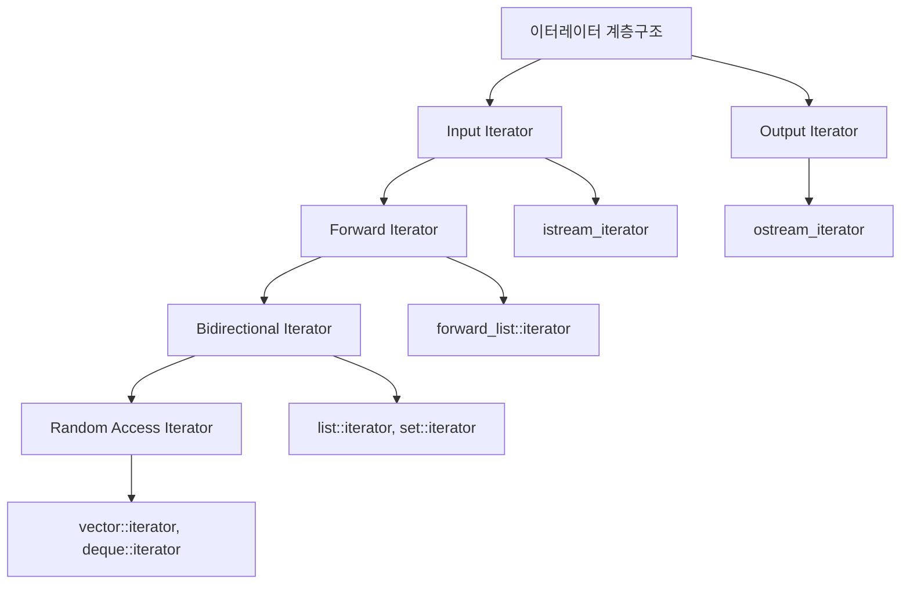

# OpenSiv3D를 이용한 C++ 프로그래밍 학습
  
저자: 최흥배, Claude AI  
  
C++ 프로그래밍 언어를 배우는 것에 중점을 두되, Siv3D 프레임워크를 활용하여 시각적으로 흥미로운 예제를 통해 학습 효과를 높이도록 설계 되었다. 단순한 콘솔 프로그램 대신 그래픽, 소리, 상호작용을 포함한 프로그램을 만들며 C++의 개념을 익힐 수 있다.  
  
필요 소프트웨어:  
- Windows 10 이상
- Visual Studio 2022 이상   
  
-----    
    
# Chapter.08: 표준 템플릿 라이브러리(STL)

## 8.1 STL 개요
STL(Standard Template Library)은 C++에서 제공하는 강력한 템플릿 기반 라이브러리다. 컨테이너, 이터레이터, 알고리즘, 함수 객체로 구성되어 있어 효율적인 프로그래밍을 가능하게 한다.

<pre>
STL 구성 요소
┌─────────────────────────────────────────────────────────┐
│                        STL                              │
├─────────────┬─────────────┬─────────────┬───────────────┤
│ Containers  │ Iterators   │ Algorithms  │ Functors      │
│ (컨테이너)   │ (이터레이터)  │ (알고리즘)   │ (함수객체)      │
└─────────────┴─────────────┴─────────────┴───────────────┘
</pre>
  

## 8.2 STL 컨테이너

### 2.1 순차 컨테이너 (Sequence Containers)

#### 2.1.1 vector
vector는 동적 배열을 구현한 컨테이너로, 가장 많이 사용되는 STL 컨테이너 중 하나다.

**주요 특징:**
- 연속된 메모리 공간에 데이터 저장
- 임의 접근(Random Access) 가능
- 끝부분에서의 삽입/삭제가 빠름 (O(1))
- 중간 삽입/삭제는 느림 (O(n))

**예제 코드:**

```cpp
#include <iostream>
#include <vector>
#include <algorithm>

int main() 
{
    // vector 선언과 초기화
    std::vector<int> numbers;
    std::vector<int> scores = {85, 90, 78, 92, 88};
    
    // 요소 추가
    numbers.push_back(10);
    numbers.push_back(20);
    numbers.push_back(30);
    
    // 요소 접근
    std::cout << "첫 번째 요소: " << numbers[0] << std::endl;
    std::cout << "두 번째 요소: " << numbers.at(1) << std::endl;  // 범위 검사
    
    // 크기 정보
    std::cout << "크기: " << numbers.size() << std::endl;
    std::cout << "용량: " << numbers.capacity() << std::endl;
    
    // 반복자를 이용한 순회
    std::cout << "모든 요소: ";
    for (auto it = numbers.begin(); it != numbers.end(); ++it) {
        std::cout << *it << " ";
    }
    std::cout << std::endl;
    
    // 범위 기반 for문 (C++11)
    std::cout << "범위 기반 for: ";
    for (const auto& num : numbers) {
        std::cout << num << " ";
    }
    std::cout << std::endl;
    
    // 요소 삭제
    numbers.pop_back();  // 마지막 요소 제거
    
    // 특정 위치에 삽입
    numbers.insert(numbers.begin() + 1, 15);  // 인덱스 1에 15 삽입
    
    // 벡터 정렬
    std::sort(scores.begin(), scores.end());
    
    return 0;
}
```

**실무 활용 예시:**

```cpp
// 게임 서버에서 플레이어 목록 관리
#include <vector>
#include <string>

struct Player {
    int id;
    std::string name;
    int level;
    
    Player(int _id, const std::string& _name, int _level) 
        : id(_id), name(_name), level(_level) {}
};

class GameRoom {
private:
    std::vector<Player> players;
    
public:
    void addPlayer(const Player& player) {
        players.push_back(player);
    }
    
    void removePlayer(int playerId) {
        players.erase(
            std::remove_if(players.begin(), players.end(),
                [playerId](const Player& p) { return p.id == playerId; }),
            players.end()
        );
    }
    
    Player* findPlayer(int playerId) {
        auto it = std::find_if(players.begin(), players.end(),
            [playerId](const Player& p) { return p.id == playerId; });
        return (it != players.end()) ? &(*it) : nullptr;
    }
};
```
 
#### 2.1.2 deque
deque(double-ended queue)는 양쪽 끝에서 빠른 삽입/삭제가 가능한 컨테이너다.

**주요 특징:**
- 양쪽 끝에서의 삽입/삭제가 빠름 (O(1))
- 임의 접근 가능
- 메모리가 연속되지 않을 수 있음
- vector보다 메모리 사용량이 클 수 있음

**예제 코드:**

```cpp
#include <iostream>
#include <deque>

int main() {
    std::deque<int> dq;
    
    // 양쪽 끝에 요소 추가
    dq.push_back(3);    // 뒤에 추가
    dq.push_back(4);
    dq.push_front(2);   // 앞에 추가
    dq.push_front(1);
    
    // 결과: [1, 2, 3, 4]
    
    // 요소 접근
    std::cout << "첫 번째: " << dq.front() << std::endl;
    std::cout << "마지막: " << dq.back() << std::endl;
    std::cout << "인덱스 2: " << dq[2] << std::endl;
    
    // 양쪽 끝에서 요소 제거
    dq.pop_front();  // 앞에서 제거
    dq.pop_back();   // 뒤에서 제거
    
    // 순회
    for (const auto& elem : dq) {
        std::cout << elem << " ";
    }
    std::cout << std::endl;
    
    return 0;
}
```

**실무 활용 예시 - 메시지 큐:**

```cpp
#include <deque>
#include <string>

class MessageQueue {
private:
    std::deque<std::string> messages;
    
public:
    // 일반 메시지는 뒤에 추가
    void addMessage(const std::string& msg) {
        messages.push_back(msg);
    }
    
    // 긴급 메시지는 앞에 추가
    void addUrgentMessage(const std::string& msg) {
        messages.push_front(msg);
    }
    
    std::string getNextMessage() {
        if (messages.empty()) return "";
        
        std::string msg = messages.front();
        messages.pop_front();
        return msg;
    }
    
    bool isEmpty() const {
        return messages.empty();
    }
};
```

#### 2.1.3 list
list는 이중 연결 리스트로 구현된 컨테이너다.

**주요 특징:**
- 어느 위치에서든 빠른 삽입/삭제 (O(1))
- 임의 접근 불가능 (순차 접근만 가능)
- 메모리가 연속되지 않음
- 각 노드가 별도의 메모리 할당

**예제 코드:**

```cpp
#include <iostream>
#include <list>
#include <algorithm>

int main() {
    std::list<int> numbers = {1, 2, 3, 4, 5};
    
    // 요소 추가
    numbers.push_front(0);    // 앞에 추가
    numbers.push_back(6);     // 뒤에 추가
    
    // 특정 위치에 삽입
    auto it = numbers.begin();
    std::advance(it, 3);  // 3번째 위치로 이동
    numbers.insert(it, 99);
    
    // 순회
    std::cout << "리스트 요소: ";
    for (const auto& num : numbers) {
        std::cout << num << " ";
    }
    std::cout << std::endl;
    
    // 특정 값 제거
    numbers.remove(99);  // 값이 99인 모든 요소 제거
    
    // 조건에 맞는 요소 제거
    numbers.remove_if([](int n) { return n % 2 == 0; });  // 짝수 제거
    
    // 정렬
    numbers.sort();
    
    // 중복 제거 (정렬된 상태에서)
    numbers.unique();
    
    std::cout << "처리 후: ";
    for (const auto& num : numbers) {
        std::cout << num << " ";
    }
    std::cout << std::endl;
    
    return 0;
}
```

**실무 활용 예시 - LRU 캐시:**

```cpp
#include <list>
#include <unordered_map>

template<typename Key, typename Value>
class LRUCache {
private:
    size_t capacity;
    std::list<std::pair<Key, Value>> items;
    std::unordered_map<Key, typename std::list<std::pair<Key, Value>>::iterator> cache;
    
public:
    LRUCache(size_t cap) : capacity(cap) {}
    
    Value get(const Key& key) {
        auto it = cache.find(key);
        if (it == cache.end()) {
            throw std::runtime_error("Key not found");
        }
        
        // 최근 사용으로 이동
        items.splice(items.begin(), items, it->second);
        return it->second->second;
    }
    
    void put(const Key& key, const Value& value) {
        auto it = cache.find(key);
        
        if (it != cache.end()) {
            // 기존 값 업데이트
            it->second->second = value;
            items.splice(items.begin(), items, it->second);
        } else {
            // 새 값 추가
            if (cache.size() >= capacity) {
                // 가장 오래된 항목 제거
                cache.erase(items.back().first);
                items.pop_back();
            }
            
            items.emplace_front(key, value);
            cache[key] = items.begin();
        }
    }
};
```

### 2.2 연관 컨테이너 (Associative Containers)

#### 2.2.1 map
map은 키-값 쌍을 저장하는 컨테이너로, 키에 따라 자동으로 정렬된다.

**주요 특징:**
- 키는 유일해야 함
- 키에 따라 자동 정렬 (기본적으로 오름차순)
- 내부적으로 균형 이진 트리 구조 (보통 Red-Black Tree)
- 검색, 삽입, 삭제: O(log n)

**예제 코드:**

```cpp
#include <iostream>
#include <map>
#include <string>

int main() {
    // map 선언과 초기화
    std::map<std::string, int> scores;
    std::map<int, std::string> students = {
        {1, "김철수"},
        {2, "이영희"},
        {3, "박민수"}
    };
    
    // 요소 삽입
    scores["김철수"] = 85;
    scores["이영희"] = 92;
    scores["박민수"] = 78;
    
    // insert 사용
    scores.insert(std::make_pair("최영수", 88));
    scores.insert({"홍길동", 95});  // C++11
    
    // 요소 접근
    std::cout << "김철수의 점수: " << scores["김철수"] << std::endl;
    
    // at() 사용 (키가 없으면 예외 발생)
    try {
        std::cout << "이영희의 점수: " << scores.at("이영희") << std::endl;
    } catch (const std::out_of_range& e) {
        std::cout << "키를 찾을 수 없음" << std::endl;
    }
    
    // 키 존재 확인
    if (scores.find("박민수") != scores.end()) {
        std::cout << "박민수 존재함" << std::endl;
    }
    
    // count로 존재 확인 (map에서는 0 또는 1)
    if (scores.count("홍길동") > 0) {
        std::cout << "홍길동 존재함" << std::endl;
    }
    
    // 순회 (키 순서로 정렬됨)
    std::cout << "\n모든 점수 (정렬됨):\n";
    for (const auto& pair : scores) {
        std::cout << pair.first << ": " << pair.second << std::endl;
    }
    
    // 반복자 사용
    std::cout << "\n반복자를 이용한 순회:\n";
    for (auto it = scores.begin(); it != scores.end(); ++it) {
        std::cout << it->first << ": " << it->second << std::endl;
    }
    
    // 요소 제거
    scores.erase("최영수");  // 키로 제거
    
    // 범위 검색
    auto lower = scores.lower_bound("김");
    auto upper = scores.upper_bound("이");
    
    std::cout << "\n'김'부터 '이' 사이:\n";
    for (auto it = lower; it != upper; ++it) {
        std::cout << it->first << ": " << it->second << std::endl;
    }
    
    return 0;
}
```

**실무 활용 예시 - 설정 관리:**

```cpp
#include <map>
#include <string>
#include <iostream>

class ConfigManager {
private:
    std::map<std::string, std::string> config;
    
public:
    void loadConfig() {
        // 실제로는 파일에서 읽어옴
        config["server_ip"] = "127.0.0.1";
        config["server_port"] = "8080";
        config["max_connections"] = "100";
        config["log_level"] = "INFO";
    }
    
    std::string getValue(const std::string& key) const {
        auto it = config.find(key);
        return (it != config.end()) ? it->second : "";
    }
    
    void setValue(const std::string& key, const std::string& value) {
        config[key] = value;
    }
    
    void printAllConfig() const {
        std::cout << "현재 설정:\n";
        for (const auto& pair : config) {
            std::cout << pair.first << " = " << pair.second << std::endl;
        }
    }
    
    bool hasKey(const std::string& key) const {
        return config.find(key) != config.end();
    }
};
```

#### 2.2.2 unordered_map
unordered_map은 해시 테이블을 기반으로 한 키-값 컨테이너다.

**주요 특징:**
- 해시 테이블 기반으로 빠른 접근 (평균 O(1))
- 키는 유일하지만 정렬되지 않음
- 메모리 사용량이 map보다 클 수 있음
- 해시 충돌 시 성능 저하 가능

**예제 코드:**

```cpp
#include <iostream>
#include <unordered_map>
#include <string>

int main() {
    std::unordered_map<std::string, int> wordCount;
    
    // 단어 카운팅
    std::string text = "apple banana apple orange banana apple";
    std::string word;
    
    // 간단한 파싱 (실제로는 더 복잡한 방법 사용)
    std::vector<std::string> words = {"apple", "banana", "apple", "orange", "banana", "apple"};
    
    for (const auto& w : words) {
        wordCount[w]++;  // 키가 없으면 0으로 초기화 후 증가
    }
    
    // 결과 출력 (순서는 보장되지 않음)
    std::cout << "단어 카운트:\n";
    for (const auto& pair : wordCount) {
        std::cout << pair.first << ": " << pair.second << std::endl;
    }
    
    // 특정 키 검색
    auto it = wordCount.find("apple");
    if (it != wordCount.end()) {
        std::cout << "\napple 횟수: " << it->second << std::endl;
    }
    
    // 해시 관련 정보
    std::cout << "\n해시 테이블 정보:\n";
    std::cout << "버킷 수: " << wordCount.bucket_count() << std::endl;
    std::cout << "로드 팩터: " << wordCount.load_factor() << std::endl;
    std::cout << "최대 로드 팩터: " << wordCount.max_load_factor() << std::endl;
    
    return 0;
}
```

**성능 비교 예시:**

```cpp
#include <map>
#include <unordered_map>
#include <chrono>
#include <random>

void performanceTest() {
    const int N = 100000;
    std::vector<int> keys(N);
    
    // 랜덤 키 생성
    std::random_device rd;
    std::mt19937 gen(rd());
    std::uniform_int_distribution<> dis(1, 1000000);
    
    for (int i = 0; i < N; ++i) {
        keys[i] = dis(gen);
    }
    
    // map 테스트
    auto start = std::chrono::high_resolution_clock::now();
    std::map<int, int> m;
    for (int key : keys) {
        m[key]++;
    }
    auto end = std::chrono::high_resolution_clock::now();
    auto map_time = std::chrono::duration_cast<std::chrono::milliseconds>(end - start);
    
    // unordered_map 테스트
    start = std::chrono::high_resolution_clock::now();
    std::unordered_map<int, int> um;
    for (int key : keys) {
        um[key]++;
    }
    end = std::chrono::high_resolution_clock::now();
    auto unordered_map_time = std::chrono::duration_cast<std::chrono::milliseconds>(end - start);
    
    std::cout << "map 시간: " << map_time.count() << "ms\n";
    std::cout << "unordered_map 시간: " << unordered_map_time.count() << "ms\n";
}
```

#### 2.2.3 set과 unordered_set
set은 유일한 값들의 집합을 저장하는 컨테이너다.

**주요 특징:**
- 모든 값이 유일함
- set: 자동 정렬 (O(log n))
- unordered_set: 해시 기반 (평균 O(1))

**예제 코드:**

```cpp
#include <iostream>
#include <set>
#include <unordered_set>
#include <vector>

int main() {
    // set 예제
    std::set<int> sortedSet = {3, 1, 4, 1, 5, 9, 2, 6};
    
    std::cout << "Set 요소 (정렬됨): ";
    for (const auto& elem : sortedSet) {
        std::cout << elem << " ";
    }
    std::cout << std::endl;
    
    // 요소 삽입
    auto result = sortedSet.insert(7);
    if (result.second) {
        std::cout << "7이 성공적으로 삽입됨\n";
    }
    
    // 중복 삽입 시도
    result = sortedSet.insert(5);  // 이미 존재
    if (!result.second) {
        std::cout << "5는 이미 존재함\n";
    }
    
    // 요소 검색
    if (sortedSet.find(4) != sortedSet.end()) {
        std::cout << "4가 존재함\n";
    }
    
    // unordered_set 예제
    std::unordered_set<std::string> uniqueWords;
    std::vector<std::string> words = {"apple", "banana", "apple", "orange", "banana"};
    
    for (const auto& word : words) {
        uniqueWords.insert(word);
    }
    
    std::cout << "\n유일한 단어들: ";
    for (const auto& word : uniqueWords) {
        std::cout << word << " ";
    }
    std::cout << std::endl;
    
    // 집합 연산 예제
    std::set<int> set1 = {1, 2, 3, 4, 5};
    std::set<int> set2 = {4, 5, 6, 7, 8};
    std::set<int> result_set;
    
    // 교집합
    std::set_intersection(set1.begin(), set1.end(),
                         set2.begin(), set2.end(),
                         std::inserter(result_set, result_set.begin()));
    
    std::cout << "\n교집합: ";
    for (const auto& elem : result_set) {
        std::cout << elem << " ";
    }
    std::cout << std::endl;
    
    return 0;
}
```

**실무 활용 예시 - 중복 제거와 멤버십 테스트:**

```cpp
#include <unordered_set>
#include <string>

class UserSession {
private:
    std::unordered_set<int> activeUsers;
    std::unordered_set<std::string> bannedIPs;
    
public:
    bool loginUser(int userId, const std::string& ip) {
        // IP 차단 확인
        if (bannedIPs.find(ip) != bannedIPs.end()) {
            return false;  // 차단된 IP
        }
        
        // 중복 로그인 확인
        if (activeUsers.find(userId) != activeUsers.end()) {
            return false;  // 이미 로그인됨
        }
        
        activeUsers.insert(userId);
        return true;
    }
    
    void logoutUser(int userId) {
        activeUsers.erase(userId);
    }
    
    bool isUserActive(int userId) const {
        return activeUsers.find(userId) != activeUsers.end();
    }
    
    void banIP(const std::string& ip) {
        bannedIPs.insert(ip);
    }
    
    size_t getActiveUserCount() const {
        return activeUsers.size();
    }
};
```

## 8.3 이터레이터(Iterators)
이터레이터는 컨테이너의 요소들을 순회하고 접근하는 일반화된 방법을 제공한다.



**이터레이터 종류와 특징:**

```cpp
#include <iostream>
#include <vector>
#include <list>
#include <iterator>
#include <algorithm>

int main() {
    std::vector<int> vec = {1, 2, 3, 4, 5};
    std::list<int> lst = {10, 20, 30, 40, 50};
    
    // 1. 기본 이터레이터 사용
    std::cout << "Vector (Random Access Iterator):\n";
    for (auto it = vec.begin(); it != vec.end(); ++it) {
        std::cout << *it << " ";
    }
    std::cout << std::endl;
    
    // 2. 역방향 이터레이터
    std::cout << "Vector 역순:\n";
    for (auto it = vec.rbegin(); it != vec.rend(); ++it) {
        std::cout << *it << " ";
    }
    std::cout << std::endl;
    
    // 3. const 이터레이터
    std::cout << "List (Bidirectional Iterator):\n";
    for (auto it = lst.cbegin(); it != lst.cend(); ++it) {
        std::cout << *it << " ";
        // *it = 100;  // 컴파일 에러 (const)
    }
    std::cout << std::endl;
    
    // 4. 이터레이터 연산
    auto it = vec.begin();
    std::advance(it, 2);  // 2칸 전진
    std::cout << "3번째 요소: " << *it << std::endl;
    
    // Random Access Iterator만 가능한 연산
    auto it2 = vec.begin() + 3;  // 직접 이동
    std::cout << "4번째 요소: " << *it2 << std::endl;
    std::cout << "거리: " << std::distance(vec.begin(), it2) << std::endl;
    
    // 5. 삽입 이터레이터
    std::vector<int> dest;
    std::copy(vec.begin(), vec.end(), std::back_inserter(dest));
    
    std::cout << "복사된 벡터: ";
    for (const auto& val : dest) {
        std::cout << val << " ";
    }
    std::cout << std::endl;
    
    return 0;
}
```

**실무 활용 예시 - 안전한 이터레이터 사용:**

```cpp
#include <vector>
#include <algorithm>
#include <iostream>

class SafeVector {
private:
    std::vector<int> data;
    
public:
    // 안전한 요소 제거
    void removeEvenNumbers() {
        // 올바른 방법: erase-remove 관용구
        data.erase(
            std::remove_if(data.begin(), data.end(),
                [](int n) { return n % 2 == 0; }),
            data.end()
        );
    }
    
    // 잘못된 방법 (참고용)
    void removeEvenNumbersWrong() {
        for (auto it = data.begin(); it != data.end(); ++it) {
            if (*it % 2 == 0) {
                data.erase(it);  // 위험! 이터레이터 무효화
                // --it;  // 이것도 위험할 수 있음
            }
        }
    }
    
    // 올바른 삭제 방법
    void removeEvenNumbersCorrect() {
        for (auto it = data.begin(); it != data.end(); ) {
            if (*it % 2 == 0) {
                it = data.erase(it);  // erase는 다음 유효한 이터레이터 반환
            } else {
                ++it;
            }
        }
    }
    
    void addNumber(int n) { data.push_back(n); }
    
    void print() const {
        for (const auto& n : data) {
            std::cout << n << " ";
        }
        std::cout << std::endl;
    }
};
```

## 8.4 STL 알고리즘
STL 알고리즘은 컨테이너에 독립적으로 작동하는 함수들의 집합이다.

**주요 알고리즘 분류:**

```
STL 알고리즘
├── 변경하지 않는 알고리즘
│   ├── find, find_if
│   ├── count, count_if
│   ├── search, binary_search
│   └── equal, mismatch
├── 변경하는 알고리즘
│   ├── copy, copy_if
│   ├── transform
│   ├── replace, replace_if
│   └── remove, remove_if
├── 정렬 알고리즘
│   ├── sort, stable_sort
│   ├── partial_sort
│   └── nth_element
└── 집합 알고리즘
    ├── set_union
    ├── set_intersection
    └── set_difference
```

**예제 코드:**

```cpp
#include <iostream>
#include <vector>
#include <algorithm>
#include <numeric>
#include <functional>

int main() {
    std::vector<int> numbers = {5, 2, 8, 1, 9, 3};
    std::vector<int> result;
    
    // 1. 검색 알고리즘
    auto it = std::find(numbers.begin(), numbers.end(), 8);
    if (it != numbers.end()) {
        std::cout << "8을 찾음, 위치: " << std::distance(numbers.begin(), it) << std::endl;
    }
    
    // 조건을 만족하는 첫 번째 요소 찾기
    auto it2 = std::find_if(numbers.begin(), numbers.end(), 
                           [](int n) { return n > 5; });
    if (it2 != numbers.end()) {
        std::cout << "5보다 큰 첫 번째 수: " << *it2 << std::endl;
    }
    
    // 2. 카운팅
    int count_greater_5 = std::count_if(numbers.begin(), numbers.end(),
                                       [](int n) { return n > 5; });
    std::cout << "5보다 큰 수의 개수: " << count_greater_5 << std::endl;
    
    // 3. 정렬
    std::vector<int> sorted_nums = numbers;
    std::sort(sorted_nums.begin(), sorted_nums.end());
    
    std::cout << "정렬된 수열: ";
    for (const auto& n : sorted_nums) {
        std::cout << n << " ";
    }
    std::cout << std::endl;
    
    // 내림차순 정렬
    std::sort(sorted_nums.begin(), sorted_nums.end(), std::greater<int>());
    
    std::cout << "내림차순 정렬: ";
    for (const auto& n : sorted_nums) {
        std::cout << n << " ";
    }
    std::cout << std::endl;
    
    // 4. 변환
    std::vector<int> doubled;
    std::transform(numbers.begin(), numbers.end(), std::back_inserter(doubled),
                  [](int n) { return n * 2; });
    
    std::cout << "두 배로 만든 수열: ";
    for (const auto& n : doubled) {
        std::cout << n << " ";
    }
    std::cout << std::endl;
    
    // 5. 누적 연산
    int sum = std::accumulate(numbers.begin(), numbers.end(), 0);
    std::cout << "합계: " << sum << std::endl;
    
    int product = std::accumulate(numbers.begin(), numbers.end(), 1, 
                                 std::multiplies<int>());
    std::cout << "곱: " << product << std::endl;
    
    // 6. 조건을 만족하는 요소 복사
    std::vector<int> evens;
    std::copy_if(numbers.begin(), numbers.end(), std::back_inserter(evens),
                [](int n) { return n % 2 == 0; });
    
    std::cout << "짝수들: ";
    for (const auto& n : evens) {
        std::cout << n << " ";
    }
    std::cout << std::endl;
    
    // 7. 모든/일부 조건 검사
    bool all_positive = std::all_of(numbers.begin(), numbers.end(),
                                   [](int n) { return n > 0; });
    std::cout << "모든 수가 양수인가? " << (all_positive ? "예" : "아니오") << std::endl;
    
    bool any_greater_7 = std::any_of(numbers.begin(), numbers.end(),
                                    [](int n) { return n > 7; });
    std::cout << "7보다 큰 수가 있는가? " << (any_greater_7 ? "예" : "아니오") << std::endl;
    
    return 0;
}
```

**실무 활용 예시 - 데이터 처리 파이프라인:**

```cpp
#include <vector>
#include <string>
#include <algorithm>
#include <numeric>

struct Player {
    int id;
    std::string name;
    int level;
    int score;
    
    Player(int _id, const std::string& _name, int _level, int _score)
        : id(_id), name(_name), level(_level), score(_score) {}
};

class PlayerAnalyzer {
private:
    std::vector<Player> players;
    
public:
    void addPlayer(const Player& player) {
        players.push_back(player);
    }
    
    // 레벨별 상위 플레이어 찾기
    std::vector<Player> getTopPlayersByLevel(int minLevel, int topN) {
        std::vector<Player> filtered;
        
        // 1. 최소 레벨 이상인 플레이어 필터링
        std::copy_if(players.begin(), players.end(), 
                    std::back_inserter(filtered),
                    [minLevel](const Player& p) { return p.level >= minLevel; });
        
        // 2. 점수 기준 내림차순 정렬
        std::sort(filtered.begin(), filtered.end(),
                 [](const Player& a, const Player& b) { 
                     return a.score > b.score; 
                 });
        
        // 3. 상위 N명만 선택
        if (filtered.size() > topN) {
            filtered.resize(topN);
        }
        
        return filtered;
    }
    
    // 통계 계산
    struct PlayerStats {
        double avgLevel;
        double avgScore;
        int maxScore;
        int minScore;
        size_t totalPlayers;
    };
    
    PlayerStats calculateStats() const {
        if (players.empty()) {
            return {0, 0, 0, 0, 0};
        }
        
        PlayerStats stats;
        
        // 평균 레벨
        stats.avgLevel = std::accumulate(players.begin(), players.end(), 0.0,
            [](double sum, const Player& p) { return sum + p.level; }) / players.size();
        
        // 평균 점수
        stats.avgScore = std::accumulate(players.begin(), players.end(), 0.0,
            [](double sum, const Player& p) { return sum + p.score; }) / players.size();
        
        // 최대/최소 점수
        auto minMaxScore = std::minmax_element(players.begin(), players.end(),
            [](const Player& a, const Player& b) { return a.score < b.score; });
        
        stats.minScore = minMaxScore.first->score;
        stats.maxScore = minMaxScore.second->score;
        stats.totalPlayers = players.size();
        
        return stats;
    }
    
    // 레벨 분포 계산
    std::map<int, int> getLevelDistribution() const {
        std::map<int, int> distribution;
        
        std::for_each(players.begin(), players.end(),
            [&distribution](const Player& p) {
                distribution[p.level]++;
            });
        
        return distribution;
    }
};
```
  

## 8.5 함수 객체(Functors)
함수 객체는 함수처럼 호출할 수 있는 객체로, operator()를 정의한 클래스나 람다 함수를 말한다.

**함수 객체의 종류:**

```cpp
#include <iostream>
#include <vector>
#include <algorithm>
#include <functional>

// 1. 함수 객체 클래스
class Multiply {
private:
    int factor;
    
public:
    Multiply(int f) : factor(f) {}
    
    int operator()(int x) const {
        return x * factor;
    }
};

// 2. 조건자(Predicate) 함수 객체
class IsEven {
public:
    bool operator()(int x) const {
        return x % 2 == 0;
    }
};

class IsGreaterThan {
private:
    int threshold;
    
public:
    IsGreaterThan(int t) : threshold(t) {}
    
    bool operator()(int x) const {
        return x > threshold;
    }
};

int main() {
    std::vector<int> numbers = {1, 2, 3, 4, 5, 6, 7, 8, 9, 10};
    
    // 1. 함수 객체 사용
    Multiply multiplyBy3(3);
    std::vector<int> tripled;
    
    std::transform(numbers.begin(), numbers.end(), 
                  std::back_inserter(tripled), multiplyBy3);
    
    std::cout << "3배 수열: ";
    for (const auto& n : tripled) {
        std::cout << n << " ";
    }
    std::cout << std::endl;
    
    // 2. 조건자 사용
    IsEven isEven;
    int evenCount = std::count_if(numbers.begin(), numbers.end(), isEven);
    std::cout << "짝수 개수: " << evenCount << std::endl;
    
    IsGreaterThan greaterThan5(5);
    int countGreater5 = std::count_if(numbers.begin(), numbers.end(), greaterThan5);
    std::cout << "5보다 큰 수 개수: " << countGreater5 << std::endl;
    
    // 3. 표준 함수 객체 사용
    std::sort(numbers.begin(), numbers.end(), std::greater<int>());
    std::cout << "내림차순 정렬: ";
    for (const auto& n : numbers) {
        std::cout << n << " ";
    }
    std::cout << std::endl;
    
    // 4. 람다 함수 (C++11)
    std::vector<int> filtered;
    std::copy_if(numbers.begin(), numbers.end(), 
                std::back_inserter(filtered),
                [](int x) { return x % 3 == 0; });  // 3의 배수만
    
    std::cout << "3의 배수: ";
    for (const auto& n : filtered) {
        std::cout << n << " ";
    }
    std::cout << std::endl;
    
    // 5. 캡처를 사용한 람다
    int multiplier = 4;
    std::vector<int> quadrupled;
    
    std::transform(numbers.begin(), numbers.end(),
                  std::back_inserter(quadrupled),
                  [multiplier](int x) { return x * multiplier; });
    
    std::cout << "4배 수열: ";
    for (const auto& n : quadrupled) {
        std::cout << n << " ";
    }
    std::cout << std::endl;
    
    return 0;
}
```

**std::function 사용:**

```cpp
#include <functional>
#include <iostream>
#include <vector>

// 다양한 함수 타입을 저장할 수 있는 컨테이너
class Calculator {
private:
    std::vector<std::function<int(int, int)>> operations;
    
public:
    void addOperation(std::function<int(int, int)> op) {
        operations.push_back(op);
    }
    
    void performOperations(int a, int b) {
        for (size_t i = 0; i < operations.size(); ++i) {
            std::cout << "연산 " << i + 1 << " 결과: " 
                      << operations[i](a, b) << std::endl;
        }
    }
};

// 일반 함수
int add(int a, int b) {
    return a + b;
}

// 함수 객체
class Multiply {
public:
    int operator()(int a, int b) const {
        return a * b;
    }
};

int main() {
    Calculator calc;
    
    // 일반 함수 추가
    calc.addOperation(add);
    
    // 함수 객체 추가
    calc.addOperation(Multiply());
    
    // 람다 함수 추가
    calc.addOperation([](int a, int b) { return a - b; });
    
    // 캡처 있는 람다 추가
    int divisor = 2;
    calc.addOperation([divisor](int a, int b) { return (a + b) / divisor; });
    
    calc.performOperations(10, 5);
    
    return 0;
}
```

**실무 활용 예시 - 이벤트 시스템:**

```cpp
#include <functional>
#include <vector>
#include <string>
#include <iostream>

class EventSystem {
public:
    using EventHandler = std::function<void(const std::string&)>;
    
private:
    std::vector<EventHandler> handlers;
    
public:
    void subscribe(EventHandler handler) {
        handlers.push_back(handler);
    }
    
    void publish(const std::string& message) {
        for (const auto& handler : handlers) {
            handler(message);
        }
    }
};

class Logger {
public:
    void log(const std::string& message) {
        std::cout << "[LOG] " << message << std::endl;
    }
};

class EmailNotifier {
private:
    std::string recipient;
    
public:
    EmailNotifier(const std::string& email) : recipient(email) {}
    
    void sendEmail(const std::string& message) {
        std::cout << "[EMAIL to " << recipient << "] " << message << std::endl;
    }
};

int main() {
    EventSystem eventSystem;
    Logger logger;
    EmailNotifier emailer("admin@game.com");
    
    // 다양한 핸들러 등록
    eventSystem.subscribe([&logger](const std::string& msg) {
        logger.log(msg);
    });
    
    eventSystem.subscribe([&emailer](const std::string& msg) {
        emailer.sendEmail(msg);
    });
    
    eventSystem.subscribe([](const std::string& msg) {
        std::cout << "[CONSOLE] " << msg << std::endl;
    });
    
    // 이벤트 발생
    eventSystem.publish("Server started successfully!");
    eventSystem.publish("Warning: High memory usage detected!");
    
    return 0;
}
```


## 8.6 실용적인 STL 활용 예제

### 6.1 STL을 활용한 게임 오브젝트 관리

```cpp
#include <vector>
#include <memory>
#include <algorithm>
#include <Siv3D.hpp>

// 게임 오브젝트 기본 클래스
class GameObject {
protected:
    Vec2 position;
    ColorF color;
    double radius;
    bool active = true;

public:
    GameObject(const Vec2& pos, const ColorF& col, double r)
        : position(pos), color(col), radius(r) {}
    
    virtual ~GameObject() = default;
    
    virtual void update() {
        // 기본 업데이트 로직
    }
    
    virtual void draw() const {
        Circle(position, radius).draw(color);
    }
    
    bool isActive() const {
        return active;
    }
    
    void setActive(bool value) {
        active = value;
    }
    
    const Vec2& getPosition() const {
        return position;
    }
    
    double getRadius() const {
        return radius;
    }
    
    bool intersects(const GameObject& other) const {
        return (position.distanceFrom(other.position) < (radius + other.radius));
    }
};

// 플레이어 클래스
class Player : public GameObject {
private:
    double speed = 3.0;

public:
    Player(const Vec2& pos)
        : GameObject(pos, ColorF(0.2, 0.6, 0.9), 20) {}
    
    void update() override {
        Vec2 direction(0, 0);
        
        if (KeyLeft.pressed()) direction.x -= 1;
        if (KeyRight.pressed()) direction.x += 1;
        if (KeyUp.pressed()) direction.y -= 1;
        if (KeyDown.pressed()) direction.y += 1;
        
        if (!direction.isZero()) {
            direction = direction.normalized();
            position += direction * speed;
        }
        
        // 화면 경계 처리
        position.x = Clamp(position.x, radius, 800 - radius);
        position.y = Clamp(position.y, radius, 600 - radius);
    }
    
    void draw() const override {
        Circle(position, radius).draw(color);
        
        // 플레이어 눈
        Circle(position.movedBy(-7, -5), 3).draw(ColorF(1.0));
        Circle(position.movedBy(7, -5), 3).draw(ColorF(1.0));        
    }
};

// 적 클래스
class Enemy : public GameObject {
private:
    Vec2 velocity;
    double speed;

public:
    Enemy(const Vec2& pos, double s)
        : GameObject(pos, ColorF(0.9, 0.3, 0.3), 15), speed(s) {
        // 랜덤 방향으로 이동
        double angle = Random(0.0, Math::TwoPi);
        velocity = Vec2(std::cos(angle), std::sin(angle)) * speed;
    }
    
    void update() override {
        position += velocity;
        
        // 화면 경계에 부딪히면 반사
        if (position.x < radius || position.x > 800 - radius) {
            velocity.x *= -1;
            position.x = Clamp(position.x, radius, 800 - radius);
        }
        
        if (position.y < radius || position.y > 600 - radius) {
            velocity.y *= -1;
            position.y = Clamp(position.y, radius, 600 - radius);
        }
    }
    
    void draw() const override {
        // 적 그리기
        Circle(position, radius).draw(color);
        
        // 눈
        Circle(position.movedBy(-5, -3), 2).draw(ColorF(1.0));
        Circle(position.movedBy(5, -3), 2).draw(ColorF(1.0));        
    }
};

// 아이템 클래스
class Item : public GameObject {
private:
    double rotationAngle = 0;

public:
    Item(const Vec2& pos)
        : GameObject(pos, ColorF(0.9, 0.9, 0.3), 10) {}
    
    void update() override {
        rotationAngle += 0.02;
    }
    
    void draw() const override {
        Circle(position, radius).draw(color);
        
        // 별 모양 표시
        for (int i = 0; i < 5; i++) {
            double angle = rotationAngle + (i * Math::TwoPi / 5);
            Vec2 starPoint = position + Vec2(std::cos(angle), std::sin(angle)) * (radius * 0.7);
            Vec2 nextPoint = position + Vec2(std::cos(angle + Math::TwoPi / 10), std::sin(angle + Math::TwoPi / 10)) * (radius * 0.3);
            
            Line(position, starPoint).draw(2, ColorF(1.0, 0.8, 0.0));
            Line(starPoint, nextPoint).draw(2, ColorF(1.0, 0.8, 0.0));
        }
    }
};

// 게임 월드 클래스
class GameWorld {
private:
    std::vector<std::unique_ptr<GameObject>> objects;
    Player* playerPtr = nullptr; // 플레이어에 대한 포인터 (소유권은 objects가 가짐)
    int score = 0;
    
public:
    GameWorld() {
        // 플레이어 생성
        auto player = std::make_unique<Player>(Scene::Center());
        playerPtr = player.get(); // 포인터 저장
        objects.push_back(std::move(player));
        
        // 초기 적 생성
        for (int i = 0; i < 5; ++i) {
            spawnEnemy();
        }
        
        // 초기 아이템 생성
        for (int i = 0; i < 3; ++i) {
            spawnItem();
        }
    }
    
    void update() {
        // 모든 오브젝트 업데이트
        for (auto& obj : objects) {
            if (obj->isActive()) {
                obj->update();
            }
        }
        
        // 충돌 검사
        for (size_t i = 1; i < objects.size(); ++i) { // 1부터 시작 (0은 플레이어)
            if (objects[i]->isActive() && playerPtr->intersects(*objects[i])) {
                if (dynamic_cast<Enemy*>(objects[i].get())) {
                    // 적과 충돌
                    objects[i]->setActive(false);
                    score -= 100;
                    
                    // 적 재생성
                    spawnEnemy();
                }
                else if (dynamic_cast<Item*>(objects[i].get())) {
                    // 아이템과 충돌
                    objects[i]->setActive(false);
                    score += 200;
                    
                    // 아이템 재생성
                    spawnItem();
                }
            }
        }
        
        // 비활성화된 오브젝트 제거
        objects.erase(
            std::remove_if(objects.begin(), objects.end(),
                          [](const std::unique_ptr<GameObject>& obj) {
                              return !obj->isActive();
                          }),
            objects.end()
        );
    }
    
    void draw() const {
        // 모든 오브젝트 그리기
        for (const auto& obj : objects) {
            if (obj->isActive()) {
                obj->draw();
            }
        }
        
        // 점수 표시
        FontAsset(U"Regular")(U"점수: {}"_fmt(score)).draw(20, 20, ColorF(1.0));
        
        // 오브젝트 통계
        int enemyCount = std::count_if(objects.begin(), objects.end(),
                                     [](const std::unique_ptr<GameObject>& obj) {
                                         return dynamic_cast<Enemy*>(obj.get()) != nullptr;
                                     });
        
        int itemCount = std::count_if(objects.begin(), objects.end(),
                                    [](const std::unique_ptr<GameObject>& obj) {
                                        return dynamic_cast<Item*>(obj.get()) != nullptr;
                                    });
        
        FontAsset(U"Regular")(U"적: {}, 아이템: {}, 총 객체: {}"_fmt(enemyCount, itemCount, objects.size()))
            .draw(20, 50, ColorF(0.7));
            
        // 조작법
        FontAsset(U"Regular")(U"방향키로 이동, 적 피하고 아이템 수집").draw(20, 580, ColorF(0.7));
    }
    
private:
    void spawnEnemy() {
        Vec2 position;
        // 플레이어에서 일정 거리 떨어진 곳에 생성
        do {
            position = RandomVec2(Rect(0, 0, 800, 600));
        } while (position.distanceFrom(playerPtr->getPosition()) < 100);
        
        objects.push_back(std::make_unique<Enemy>(position, Random(1.0, 3.0)));
    }
    
    void spawnItem() {
        Vec2 position = RandomVec2(Rect(50, 50, 700, 500));
        objects.push_back(std::make_unique<Item>(position));
    }
};

void Main()
{
    // 윈도우 설정
    Window::SetTitle(U"STL 게임 오브젝트 관리");
    Scene::SetBackground(ColorF(0.1, 0.1, 0.2));
    
    // 폰트 등록
    FontAsset::Register(U"Regular", 20, Typeface::Regular);
    
    // 게임 월드 생성
    GameWorld world;
    
    while (System::Update())
    {
        world.update();
        world.draw();
    }
}
```

### 6.2 알고리즘을 활용한 적 AI
이 코드는 다음과 같은 STL 알고리즘을 활용하여 AI 로직을 구현한다.  
- std::for_each: 모든 적의 상태를 한 번에 갱신한다.
- std::min_element: 플레이어에게 가장 가까운 적을 찾는다.
- std::count_if: 특정 상태(추격 중)에 있는 적의 수를 센다.
- std::remove_if (Erase-Remove Idiom): 체력이 0 이하인 적을 효율적으로 제거한다.  
  
  
```cpp
#include <Siv3D.hpp>
#include <algorithm> // STL 알고리즘을 사용하기 위해 포함

// 적의 상태를 나타내는 열거형
enum class EnemyState
{
	Idle,       // 대기
	Chasing,    // 추격
	Attacking,  // 공격 (이 예제에서는 사용 안 함)
};

// 적 캐릭터를 정의하는 구조체
struct Enemy
{
	Vec2 pos;
	double speed = 150.0;
	double health = 100.0;
	EnemyState state = EnemyState::Idle;
	Circle body() const { return Circle{ pos, 20 }; }

	void update(const Vec2& playerPos, double deltaTime)
	{
		if (state == EnemyState::Chasing)
		{
			// 플레이어를 향하는 방향 벡터를 계산하고 정규화
			const Vec2 direction = (playerPos - pos).normalized();
			pos += direction * speed * deltaTime;
		}
	}

	void draw() const
	{
		// 상태에 따라 색상 변경
		Color bodyColor = Palette::Gray;
		if (state == EnemyState::Chasing)
		{
			bodyColor = Palette::Orange;
		}

		body().draw(bodyColor);
		body().drawFrame(2, Palette::Black);
	}
};


void Main()
{
	// 기본 설정
	Scene::SetBackground(ColorF{ 0.2, 0.3, 0.4 });
	const Font font{ 30 };

	// 플레이어와 적 생성
	Vec2 playerPos = Scene::Center();
	Array<Enemy> enemies;
	for (int i = 0; i < 10; ++i)
	{
		enemies.push_back({ RandomVec2(Scene::Rect()), 150.0 });
	}

	while (System::Update())
	{
		// 플레이어는 마우스를 따라 이동
		playerPos = Cursor::Pos();

		// ==================================================
		// ## 1. std::for_each: 모든 적의 상태 업데이트
		//    - 플레이어와의 거리를 확인하여 추격 상태로 변경
		// ==================================================
		const double chaseDistance = 300.0;
		std::for_each(enemies.begin(), enemies.end(), [&](Enemy& enemy) {
			if (enemy.pos.distanceFrom(playerPos) < chaseDistance)
			{
				enemy.state = EnemyState::Chasing;
			}
			else
			{
				enemy.state = EnemyState::Idle;
			}
		});


		// ==================================================
		// ## 2. std::min_element: 가장 가까운 적 찾기
		//    - 람다 비교 함수를 사용하여 플레이어와의 거리가 최소인 적을 찾음
		// ==================================================
		auto closestEnemyIt = std::min_element(enemies.begin(), enemies.end(),
			[&](const Enemy& a, const Enemy& b) {
				return a.pos.distanceFrom(playerPos) < b.pos.distanceFrom(playerPos);
			}
		);


		// ==================================================
		// ## 3. std::count_if: 추격 중인 적의 수 세기
		// ==================================================
		const int chasingCount = std::count_if(enemies.begin(), enemies.end(),
			[](const Enemy& enemy) {
				return enemy.state == EnemyState::Chasing;
			}
		);


		// ==================================================
		// ## 4. Erase-Remove Idiom: 죽은 적 제거
		//    - 마우스 왼쪽 클릭으로 적에게 피해를 줌
		//    - 체력이 0 이하인 적을 배열에서 효율적으로 제거
		// ==================================================
		if (MouseL.down())
		{
			for (auto& enemy : enemies)
			{
				if (enemy.body().mouseOver())
				{
					enemy.health -= 50;
				}
			}
		}

		// std::remove_if로 체력이 0 이하인 적들을 배열의 끝으로 옮기고,
		// 그 시작 위치(이터레이터)를 반환받음
		auto toRemoveIt = std::remove_if(enemies.begin(), enemies.end(),
			[](const Enemy& enemy) {
				return enemy.health <= 0;
			}
		);

		// 배열의 끝으로 옮겨진 요소들을 실제로 삭제
		enemies.erase(toRemoveIt, enemies.end());


		// 각 적의 로직 업데이트 및 그리기
		const double deltaTime = Scene::DeltaTime();
		for (auto& enemy : enemies)
		{
			enemy.update(playerPos, deltaTime);
			enemy.draw();
		}

		// 플레이어 그리기
		Circle{ playerPos, 25 }.draw(Palette::Skyblue);

		// 가장 가까운 적 강조 표시
		if (closestEnemyIt != enemies.end())
		{
			closestEnemyIt->body().drawFrame(4, Palette::Red);
		}

		// UI 정보 출력
		font(U"STL 적 AI 예제").draw(20, 20);
		font(U"추격 중인 적: {}"_fmt(chasingCount)).draw(20, 60);
		font(U"남은 적: {}"_fmt(enemies.size())).draw(20, 100);
		font(U"적을 클릭하여 피해를 입히세요.").draw(20, Scene::Height() - 50);
	}
}
```
  
#### 1. `std::for_each`
적 전체를 순회하며 각 적의 상태를 업데이트한다. `for` 반복문과 기능적으로는 동일하지만, "모든 요소에 동일한 작업을 적용한다"는 의도를 명확하게 보여줄 수 있다. 여기서는 각 적과 플레이어의 거리를 계산하여 `Idle` 또는 `Chasing` 상태로 변경한다.

#### 2. `std::min_element`
플레이어에게 가장 가까운 적을 찾는 데 사용된다. 세 번째 인자로 전달된 람다 함수 `[&](const Enemy& a, const Enemy& b){ ... }`는 두 적 `a`와 `b` 중 누가 플레이어와 더 가까운지를 비교하는 규칙을 정의한다. 이 알고리즘은 가장 가까운 적을 가리키는 반복자(iterator)를 반환하므로, 해당 적을 특별하게(예: 빨간색 테두리) 표시할 수 있다.
  
#### 3. `std::count_if`
`Chasing` 상태인 적이 몇 명인지 계산한다. 람다 함수 `[](const Enemy& e){ return e.state == EnemyState::Chasing; }`는 "이 적이 추격 상태인가?"를 묻는 조건이며, 이 조건을 만족하는 요소의 개수를 반환한다.
  
#### 4. `std::remove_if` (Erase-Remove Idiom)
이것은 C++에서 특정 조건의 요소를 동적 배열에서 제거하는 표준적인 방법이다.
  
  * **1단계 (`std::remove_if`)**: 체력이 0 이하인 모든 적을 배열의 맨 뒤로 이동시킨다. 실제 데이터가 삭제되지는 않으며, "쓸모없는" 데이터들이 모여있는 영역의 시작점을 반환한다.
  * **2단계 (`.erase`)**: `s3d::Array` (또는 `std::vector`)의 `.erase()` 멤버 함수를 호출하여 "쓸모없는" 데이터 영역을 실제로 메모리에서 제거한다. 이 방식은 요소를 하나씩 찾아 삭제하는 것보다 훨씬 효율적이다.
  


### 6.3 map을 활용한 타일 기반 게임
OpenSiv3D에서 s3d::HashTable(C++의 std::unordered_map과 유사)을 활용하여 타일 기반 게임의 맵을 구현하는 예제 코드이다.  
  
이 예제는 HashTable을 사용해 좌표를 키(Key)로, 타일 타입을 값(Value)으로 저장한다. 이 방식은 맵의 모든 공간을 배열로 만드는 대신, 의미 있는 타일의 위치만 저장하므로 거대하거나 비정형적인 맵(Sparse Map)을 효율적으로 표현할 수 있다.  

#### HashTable을 활용한 타일맵 예제
이 코드는 다음과 같은 기능을 포함한다.
- HashTable<Point, TileType>: Point(타일 좌표)를 키로 사용하여 맵 데이터를 저장한다.
- Perlin Noise: 절차적으로 자연스러운 지형을 생성한다.
- Camera2D: 마우스 우클릭 드래그와 휠 스크롤로 맵을 탐색할 수 있다.
- 타일 편집: 마우스 좌클릭으로 맵의 타일을 변경할 수 있다.
  

```cpp
#include <Siv3D.hpp>

// 타일의 종류를 나타내는 열거형
enum class TileType : uint8
{
	Grass,
	Water,
	Sand,
	Stone,
};

// 게임 맵을 관리하는 클래스
class GameMap
{
private:
	HashTable<Point, TileType> m_tiles;
	Texture m_tileset;
	TileType m_defaultTile = TileType::Grass;

public:
	// 타일의 크기 (픽셀 단위)
	static constexpr int32 TileSize = 32;

	GameMap()
	{
		m_tileset = Texture{ U"🟩💧🏖️🪨"_emoji, TextureDesc::Mipped };
		const PerlinNoise noise{ RandomUint32() };
		for (int32 y = -50; y < 50; ++y)
		{
			for (int32 x = -50; x < 50; ++x)
			{
				const double n = noise.octave2D(x * 0.1, y * 0.1, 4);
				if (n > 0.6)
				{
					m_tiles[{x, y}] = TileType::Stone;
				}
				else if (n > 0.45)
				{
					m_tiles[{x, y}] = TileType::Sand;
				}
				else if (n < 0.2)
				{
					m_tiles[{x, y}] = TileType::Water;
				}
			}
		}
	}

	void setTile(const Point& tilePos, TileType type)
	{
		if (type == m_defaultTile)
		{
			m_tiles.erase(tilePos);
		}
		else
		{
			m_tiles[tilePos] = type;
		}
	}

	// [수정됨] 맵 그리기 함수
	void draw(const Camera2D& camera) const
	{
		// 1. 카메라의 중심 좌표를 기준으로 그릴 타일 범위를 계산
		const Point centerTile = Floor(camera.getCenter() / TileSize).asPoint();
		const int32 drawRangeX = (Scene::Width() / TileSize / 2) + 2;
		const int32 drawRangeY = (Scene::Height() / TileSize / 2) + 2;

		for (int32 y = (centerTile.y - drawRangeY); y < (centerTile.y + drawRangeY); ++y)
		{
			for (int32 x = (centerTile.x - drawRangeX); x < (centerTile.x + drawRangeX); ++x)
			{
				const Point tilePos{ x, y };
				
				// 2. HashTable에서 타일 타입을 직접 찾아오는 로직
				TileType type;
				const auto it = m_tiles.find(tilePos);

				if (it != m_tiles.end())
				{
					// 키를 찾았으면 해당 타일 타입을 사용
					type = it->second;
				}
				else
				{
					// 키를 찾지 못했으면 기본 타일 타입을 사용
					type = m_defaultTile;
				}
				
				// 타일 타입에 맞는 텍스처 영역을 화면에 그림
				m_tileset(static_cast<int32>(type) * 64, 0, 64, 64)
					.resized(TileSize)
					.draw(x * TileSize, y * TileSize);
			}
		}
	}
};

void Main()
{
	Window::Resize(1280, 720);
	const Font font{ 30 };
	Camera2D camera{ Scene::Center(), 1.0 };
	GameMap gameMap;

	while (System::Update())
	{
		camera.update();

		if (MouseL.pressed())
		{
			const Vec2 worldPos = Cursor::PosF();
			const Point tilePos = Floor(worldPos / GameMap::TileSize).asPoint();
			gameMap.setTile(tilePos, TileType::Stone);
		}

		{
			const auto t = camera.createTransformer();
			gameMap.draw(camera);
		}

		Rect{ 0, 0, 450, 120 }.draw(ColorF{ 0.0, 0.5 });
		font(U"HashTable 타일맵 예제").draw(10, 10);
		font(U"우클릭 드래그: 이동").draw(10, 45);
		font(U"마우스 휠: 줌").draw(10, 80);
	}
}
```
    
#### HashTable<Point, TileType> 의 역할
이 예제의 핵심이다. s3d::HashTable은 C++ 표준 라이브러리의 std::unordered_map과 기능적으로 매우 유사한 컨테이너이다.
  
- Key: s3d::Point를 사용하여 타일의 정수 좌표 (x, y)를 고유한 키로 사용한다.
- Value: TileType 열거형을 사용하여 해당 좌표에 어떤 종류의 타일이 있는지를 저장한다.
  
#### 왜 Grid(2D 배열) 대신 HashTable을 사용했는가?
- 메모리 효율성: Grid는 맵의 모든 (x, y) 위치에 대한 데이터를 저장해야 한다. 하지만 HashTable은 기본 타일(Grass)이 아닌 특별한 타일(Water, Stone 등)의 정보만 저장한다. 따라서 월드가 아무리 넓어져도 실제 데이터가 있는 곳만 메모리를 차지한다.
- 유연성: 맵의 크기를 미리 정할 필요가 없다. 어떤 좌표 (-1000, 5000)에도 즉시 새로운 타일을 추가하거나 삭제할 수 있어, 무한히 확장되는 맵을 구현하기에 적합하다.  
  

  
## 8.7 C++23의 STL 향상된 기능
C++23 표준에서는 STL이 더욱 향상되었다. 주요 개선 사항을 살펴보겠다.

### 7.1 ranges와 views

```cpp
#include <ranges>
#include <algorithm>
#include <vector>
#include <Siv3D.hpp>

void Main()
{
    // 데이터 준비
    std::vector<int> numbers = {1, 2, 3, 4, 5, 6, 7, 8, 9, 10};
    
    // C++23의 ranges와 views
    auto evenSquares = numbers 
        | std::views::filter([](int n) { return n % 2 == 0; }) // 짝수만 필터링
        | std::views::transform([](int n) { return n * n; });  // 제곱하기
    
    // 결과 출력
    Print << U"원본 벡터:";
    for (int n : numbers) {
        Print << n << U' ';
    }
    
    Print << U"짝수 제곱 결과:";
    for (int n : evenSquares) {
        Print << n << U' ';
    }
    
    // 고급 ranges 사용 예
    std::vector<std::string> words = {"apple", "banana", "cherry", "date", "elderberry"};
    
    // 길이가 5 이상인 단어만 대문자로 변환
    auto longWordsUpper = words
        | std::views::filter([](const std::string& s) { return s.length() >= 5; })
        | std::views::transform([](std::string s) {
              std::transform(s.begin(), s.end(), s.begin(), ::toupper);
              return s;
          });
    
    Print << U"원본 단어:";
    for (const auto& word : words) {
        Print << Unicode::Widen(word);
    }
    
    Print << U"5글자 이상 대문자 변환:";
    for (const auto& word : longWordsUpper) {
        Print << Unicode::Widen(word);
    }
    
    // 연속된 숫자 생성과 조작
    auto numberSequence = std::views::iota(1, 20)
        | std::views::filter([](int n) { return n % 3 == 0; });
    
    Print << U"3의 배수 (1-20):";
    for (int n : numberSequence) {
        Print << n << U' ';
    }

    while (System::Update())
    {
        // ranges 시각화
        FontAsset(U"Regular")(U"C++23 ranges와 views").draw(50, 50, ColorF(1.0));
        
        // 원본 벡터
        FontAsset(U"Regular")(U"원본 벡터:").draw(50, 100, ColorF(1.0));
        for (size_t i = 0; i < numbers.size(); ++i) {
            RectF rect(50 + i * 50, 150, 40, numbers[i] * 20);
            rect.draw(ColorF(0.3, 0.6, 0.9));
            FontAsset(U"Regular")(numbers[i]).drawAt(rect.center(), ColorF(1.0));
        }
        
        // 짝수 제곱 결과
        FontAsset(U"Regular")(U"짝수 제곱 결과:").draw(50, 250, ColorF(1.0));
        int i = 0;
        for (int n : evenSquares) {
            RectF rect(50 + i * 70, 300, 60, Math::Sqrt(n) * 10);
            rect.draw(ColorF(0.9, 0.3, 0.3));
            FontAsset(U"Regular")(n).drawAt(rect.center(), ColorF(1.0));
            ++i;
        }
        
        // 3의 배수 시각화
        FontAsset(U"Regular")(U"3의 배수 (1-20):").draw(50, 400, ColorF(1.0));
        i = 0;
        for (int n : numberSequence) {
            Circle(70 + i * 60, 450, 25).draw(ColorF(0.3, 0.9, 0.6));
            FontAsset(U"Regular")(n).drawAt(70 + i * 60, 450, ColorF(1.0));
            ++i;
        }
    }
}
```

### 7.2 std::expected와 std::optional

```cpp
#include <expected>
#include <optional>
#include <stdexcept>
#include <Siv3D.hpp>

// 에러 종류
enum class Error {
    DivisionByZero,
    OutOfRange,
    InvalidInput
};

// std::expected를 사용한 안전한 나누기
std::expected<double, Error> safeDivide(double a, double b) {
    if (b == 0.0) {
        return std::unexpected(Error::DivisionByZero);
    }
    return a / b;
}

// std::optional을 사용한 제곱근 계산
std::optional<double> safeSqrt(double x) {
    if (x < 0.0) {
        return std::nullopt;
    }
    return std::sqrt(x);
}

void Main()
{
    // std::expected 예제
    Print << U"std::expected 예제 (safeDivide):";
    
    auto result1 = safeDivide(10.0, 2.0);
    if (result1) {
        Print << U"10 / 2 = " << *result1;
    }
    
    auto result2 = safeDivide(10.0, 0.0);
    if (!result2) {
        Print << U"오류 발생: 0으로 나눌 수 없습니다.";
    }
    
    // std::optional 예제
    Print << U"\nstd::optional 예제 (safeSqrt):";
    
    auto sqrt1 = safeSqrt(16.0);
    if (sqrt1) {
        Print << U"√16 = " << *sqrt1;
    }
    
    auto sqrt2 = safeSqrt(-4.0);
    if (!sqrt2) {
        Print << U"오류 발생: 음수의 제곱근을 계산할 수 없습니다.";
    }
    
    // 고급 예제: 복잡한 계산 chain
    auto complexCalc = [](double x) -> std::expected<double, Error> {
        auto sqrtResult = safeSqrt(x);
        if (!sqrtResult) {
            return std::unexpected(Error::InvalidInput);
        }
        
        auto divResult = safeDivide(10.0, *sqrtResult);
        if (!divResult) {
            return divResult.error();
        }
        
        return *divResult * 2.0;
    };
    
    Print << U"\n복잡한 계산 체인:";
    
    auto result3 = complexCalc(16.0);
    if (result3) {
        Print << U"complexCalc(16.0) = " << *result3;
    }
    
    auto result4 = complexCalc(-4.0);
    if (!result4) {
        Print << U"complexCalc(-4.0)에서 오류 발생";
    }

    while (System::Update())
    {
        FontAsset(U"Regular")(U"C++23 오류 처리 기능").draw(50, 50, ColorF(1.0));
        
        // std::expected 시각화
        FontAsset(U"Regular")(U"std::expected 예제").draw(50, 100, ColorF(1.0));
        
        RectF divRect1(50, 150, 200, 60);
        divRect1.draw(result1 ? ColorF(0.3, 0.9, 0.3) : ColorF(0.9, 0.3, 0.3));
        FontAsset(U"Regular")(U"10 / 2 = {}"_fmt(result1 ? ToString(*result1) : U"오류"))
            .drawAt(divRect1.center(), ColorF(1.0));
            
        RectF divRect2(300, 150, 200, 60);
        divRect2.draw(result2 ? ColorF(0.3, 0.9, 0.3) : ColorF(0.9, 0.3, 0.3));
        FontAsset(U"Regular")(U"10 / 0 = {}"_fmt(result2 ? ToString(*result2) : U"오류"))
            .drawAt(divRect2.center(), ColorF(1.0));
            
        // std::optional 시각화
        FontAsset(U"Regular")(U"std::optional 예제").draw(50, 250, ColorF(1.0));
        
        RectF sqrtRect1(50, 300, 200, 60);
        sqrtRect1.draw(sqrt1 ? ColorF(0.3, 0.9, 0.3) : ColorF(0.9, 0.3, 0.3));
        FontAsset(U"Regular")(U"√16 = {}"_fmt(sqrt1 ? ToString(*sqrt1) : U"오류"))
            .drawAt(sqrtRect1.center(), ColorF(1.0));
            
        RectF sqrtRect2(300, 300, 200, 60);
        sqrtRect2.draw(sqrt2 ? ColorF(0.3, 0.9, 0.3) : ColorF(0.9, 0.3, 0.3));
        FontAsset(U"Regular")(U"√-4 = {}"_fmt(sqrt2 ? ToString(*sqrt2) : U"오류"))
            .drawAt(sqrtRect2.center(), ColorF(1.0));
            
        // 복잡한 계산 체인 시각화
        FontAsset(U"Regular")(U"복잡한 계산 체인").draw(50, 400, ColorF(1.0));
        
        RectF calcRect1(50, 450, 200, 60);
        calcRect1.draw(result3 ? ColorF(0.3, 0.9, 0.3) : ColorF(0.9, 0.3, 0.3));
        FontAsset(U"Regular")(U"complexCalc(16) = {}"_fmt(result3 ? ToString(*result3) : U"오류"))
            .drawAt(calcRect1.center(), ColorF(1.0));
            
        RectF calcRect2(300, 450, 200, 60);
        calcRect2.draw(result4 ? ColorF(0.3, 0.9, 0.3) : ColorF(0.9, 0.3, 0.3));
        FontAsset(U"Regular")(U"complexCalc(-4) = {}"_fmt(result4 ? ToString(*result4) : U"오류"))
            .drawAt(calcRect2.center(), ColorF(1.0));
    }
}
```
  

## 결론
STL은 C++ 프로그래밍에서 필수적인 도구다. 각 컨테이너의 특성을 이해하고 적절한 상황에서 사용하면 효율적이고 안전한 코드를 작성할 수 있다.

**선택 가이드라인:**

- **빠른 임의 접근**이 필요하면 → `vector`
- **양쪽 끝에서 삽입/삭제**가 빈번하면 → `deque`  
- **중간 삽입/삭제**가 빈번하면 → `list`
- **키-값 쌍을 정렬된 순서**로 유지하려면 → `map`
- **키-값 쌍을 빠르게 접근**하려면 → `unordered_map`
- **유일한 값들을 정렬**해서 저장하려면 → `set`
- **유일한 값들을 빠르게 검색**하려면 → `unordered_set`

  
Siv3D와 STL을 함께 사용하면 직관적이고 효율적인 게임과 애플리케이션을 개발할 수 있습니다. 이 장에서 배운 기술들은 모든 C++ 프로그래밍에 적용할 수 있으며, 특히 게임 개발에서 매우 유용합니다.

앞으로 더 깊이 있는 학습을 위해 다양한 STL 알고리즘과 컨테이너 조합을 실험해 보고, 자신만의 게임이나 애플리케이션에 적용해 보세요.


