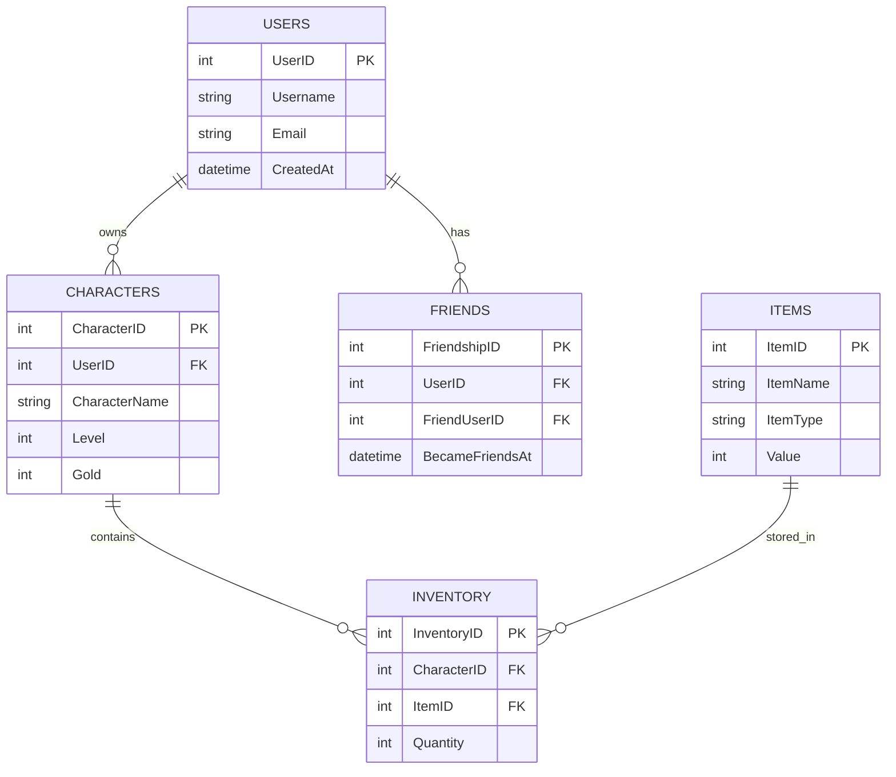
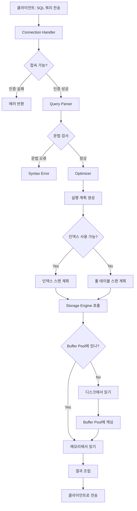

# 1주일만에 배우는 MySQL C# 프로그래밍

저자: 최흥배, AI-Assisted   
    
권장 개발 환경
- **.NET**: .NET 9 이상
- **OS**: Windows 10 이상
- **MySQL**: 8.0

-----    
  
# Day 1: 데이터베이스의 이해와 MySQL 시작

## 1.1 데이터베이스란 무엇인가?

### DBMS의 필요성과 역할
온라인 게임을 개발한다고 가정해보자. 수백만 명의 유저 정보, 캐릭터 데이터, 아이템 정보, 친구 관계, 게임 로그 등 엄청난 양의 데이터를 관리해야 한다. 이러한 데이터를 텍스트 파일이나 엑셀로 관리한다면 어떻게 될까?

```
문제 상황 예시:
┌─────────────────────────────────────────┐
│ players.txt                             │
├─────────────────────────────────────────┤
│ user1,password123,level50,gold10000     │
│ user2,pass456,level32,gold5000          │
│ user1,password123,level51,gold11000  ← 중복!│
└─────────────────────────────────────────┘
```

파일 기반으로 데이터를 관리하면 다음과 같은 문제가 발생한다:

- **데이터 중복**: 같은 유저 정보가 여러 곳에 저장되어 불일치 발생
- **동시성 문제**: 여러 사용자가 동시에 같은 파일을 수정하면 데이터 손실
- **검색 비효율**: 특정 유저를 찾으려면 파일 전체를 읽어야 함
- **데이터 무결성**: 잘못된 데이터가 들어가도 검증할 방법이 없음
- **보안 취약**: 파일에 직접 접근하면 모든 데이터 노출

DBMS(Database Management System)는 이러한 문제를 해결하기 위해 만들어졌다. DBMS는 데이터를 체계적으로 저장하고 관리하는 소프트웨어 시스템이다.

```
DBMS의 핵심 역할:

┌──────────────────────────────────────────────┐
│           애플리케이션 계층                      │
│  (게임 서버, 웹 서버, 모바일 앱 등)              │
└──────────────┬───────────────────────────────┘
               │ SQL 쿼리
               ▼
┌──────────────────────────────────────────────┐
│              DBMS (MySQL)                    │
│  ┌────────────────────────────────────────┐  │
│  │ • 쿼리 처리 및 최적화                    │  │
│  │ • 동시성 제어 (여러 요청 동시 처리)       │  │
│  │ • 트랜잭션 관리 (원자성 보장)            │  │
│  │ • 보안 및 권한 관리                      │  │
│  │ • 백업 및 복구                          │  │
│  └────────────────────────────────────────┘  │
└──────────────┬───────────────────────────────┘
               ▼
┌──────────────────────────────────────────────┐
│         물리적 저장소 (디스크)                 │
│  [데이터 파일] [인덱스 파일] [로그 파일]       │
└──────────────────────────────────────────────┘
```

### 관계형 데이터베이스(RDBMS)의 핵심 개념
MySQL은 관계형 데이터베이스(RDBMS)다. 관계형 데이터베이스는 데이터를 **테이블(Table)** 형태로 저장하고, 테이블 간의 **관계(Relationship)**를 정의한다.

**테이블의 구조:**

```
Users 테이블
┌────────┬──────────┬───────┬──────────┬─────────────────────┐
│ UserID │ Username │ Level │ Gold     │ CreatedAt           │
├────────┼──────────┼───────┼──────────┼─────────────────────┤
│ 1      │ player1  │ 50    │ 10000    │ 2025-01-01 10:00:00 │
│ 2      │ player2  │ 32    │ 5000     │ 2025-01-02 14:30:00 │
│ 3      │ player3  │ 45    │ 8500     │ 2025-01-03 09:15:00 │
└────────┴──────────┴───────┴──────────┴─────────────────────┘
  ↑         ↑          ↑        ↑             ↑
컬럼명    컬럼명     컬럼명   컬럼명        컬럼명
(Column)

각 행(Row) = 하나의 레코드(Record)
```

**핵심 용어:**

- **테이블(Table)**: 데이터를 저장하는 2차원 구조
- **행(Row/Record)**: 하나의 데이터 항목 (예: 한 명의 유저)
- **열(Column/Field)**: 데이터의 속성 (예: 유저명, 레벨, 골드)
- **기본 키(Primary Key)**: 각 행을 고유하게 식별하는 값 (예: UserID)
- **외래 키(Foreign Key)**: 다른 테이블을 참조하는 키

**테이블 간 관계 예시:**



위 다이어그램은 온라인 게임의 기본적인 데이터 구조를 보여준다:

- 한 명의 유저(USERS)는 여러 캐릭터(CHARACTERS)를 가질 수 있다 (1:N 관계)
- 한 캐릭터는 여러 아이템을 인벤토리(INVENTORY)에 보관할 수 있다 (N:M 관계)
- 유저들은 서로 친구 관계(FRIENDS)를 맺을 수 있다 (N:M 관계)

### ACID 속성의 이해
ACID는 데이터베이스 트랜잭션이 안전하게 수행되기 위한 4가지 핵심 속성이다. 온라인 게임에서 아이템 거래를 예로 들어 설명하겠다.

**게임 아이템 거래 시나리오:**
```
플레이어 A가 플레이어 B에게 '전설의 검'을 100골드에 판매

필요한 작업:
1. A의 인벤토리에서 '전설의 검' 제거
2. A의 골드 +100
3. B의 골드 -100
4. B의 인벤토리에 '전설의 검' 추가
```

#### A - Atomicity (원자성)

트랜잭션의 모든 작업이 완전히 실행되거나, 전혀 실행되지 않아야 한다.

```
성공 케이스:
┌─────────────────────────────────────┐
│ 트랜잭션 시작                        │
│ 1. A의 검 제거 ✓                    │
│ 2. A의 골드 +100 ✓                  │
│ 3. B의 골드 -100 ✓                  │
│ 4. B의 검 추가 ✓                    │
│ 트랜잭션 커밋 → 모든 변경 확정       │
└─────────────────────────────────────┘

실패 케이스:
┌─────────────────────────────────────┐
│ 트랜잭션 시작                        │
│ 1. A의 검 제거 ✓                    │
│ 2. A의 골드 +100 ✓                  │
│ 3. B의 골드 -100 ✗ (골드 부족)      │
│ 트랜잭션 롤백 → 모든 변경 취소!      │
│ (A의 검과 골드 원상복구)             │
└─────────────────────────────────────┘
```

원자성이 없다면 A는 아이템도 잃고 골드도 못 받는 상황이 발생할 수 있다.

#### C - Consistency (일관성)
트랜잭션 전후에 데이터베이스는 항상 일관된 상태를 유지해야 한다.

```
일관성 규칙 예시:
- 골드는 음수가 될 수 없다
- 인벤토리 최대 슬롯은 100개다
- 같은 아이템이 두 사람에게 동시에 존재할 수 없다

위반 시도:
┌─────────────────────────────────────┐
│ B의 현재 골드: 50                    │
│ 거래 금액: 100                       │
│                                     │
│ B의 골드 -100 = -50 ✗               │
│ → 일관성 규칙 위반!                  │
│ → 트랜잭션 거부됨                    │
└─────────────────────────────────────┘
```

#### I - Isolation (격리성)
여러 트랜잭션이 동시에 실행되어도 서로 영향을 주지 않아야 한다.

```
동시 거래 시나리오:

시간 →
트랜잭션 1: A → B 검 판매 (100골드)
트랜잭션 2: A → C 검 판매 (100골드)

격리 없이 실행:
┌──────────────────────────────────────────┐
│ T1: A의 검 확인 (있음)                    │
│ T2: A의 검 확인 (있음) ← 둘 다 있다고 봄! │
│ T1: A의 검 제거, B에게 전달 ✓             │
│ T2: A의 검 제거, C에게 전달 ✓             │
│ → 검이 복제됨! (심각한 버그)              │
└──────────────────────────────────────────┘

격리 적용:
┌──────────────────────────────────────────┐
│ T1: A의 검 확인 및 잠금 (Lock)            │
│ T2: A의 검 확인 시도 → 대기 중...        │
│ T1: 거래 완료, 잠금 해제                  │
│ T2: A의 검 확인 (없음) → 거래 실패        │
│ → 정상 동작 ✓                            │
└──────────────────────────────────────────┘
```

#### D - Durability (지속성)
트랜잭션이 성공적으로 완료되면, 그 결과는 영구적으로 저장되어야 한다.

```
시나리오: 거래 완료 직후 서버 장애 발생

지속성 보장:
┌─────────────────────────────────────┐
│ 14:30:00 거래 트랜잭션 커밋 완료     │
│ 14:30:01 변경사항 디스크에 기록      │
│ 14:30:02 서버 전원 차단! (정전)      │
│          ...                        │
│ 14:35:00 서버 재시작                 │
│ 14:35:01 데이터 복구                 │
│ → 거래 결과 유지됨 ✓                 │
│   (B는 여전히 검을 소유)             │
└─────────────────────────────────────┘
```

MySQL은 WAL(Write-Ahead Logging) 방식으로 지속성을 보장한다. 변경사항을 먼저 로그에 기록한 후 실제 데이터를 수정한다.

**ACID 정리:**

| 속성 | 의미 | 게임에서의 중요성 |
|------|------|-------------------|
| Atomicity | 전부 성공 또는 전부 실패 | 아이템 복제/손실 방지 |
| Consistency | 규칙 위반 불가 | 게임 밸런스 유지 |
| Isolation | 동시 작업 간섭 방지 | 동시 접속자 처리 |
| Durability | 영구 저장 보장 | 데이터 손실 방지 |

온라인 게임에서 ACID 속성은 필수다. 유저들의 소중한 게임 재화와 아이템을 안전하게 관리하기 위해 반드시 지켜져야 한다.
  
  
## 1.2 MySQL 아키텍처 핵심

### MySQL 8.0의 주요 구조
MySQL은 계층화된 아키텍처로 구성되어 있다. 각 계층은 명확한 역할을 가지고 독립적으로 동작한다.

```
MySQL 8.0 아키텍처:

┌─────────────────────────────────────────────────────────┐
│                    클라이언트 계층                        │
│  ┌──────────┐  ┌──────────┐  ┌──────────┐              │
│  │ 게임서버  │  │ 웹서버   │  │ 관리도구  │              │
│  │ (C#)     │  │ (PHP)    │  │(Workbench)│              │
│  └────┬─────┘  └────┬─────┘  └────┬─────┘              │
└───────┼─────────────┼─────────────┼────────────────────┘
        │             │             │
        └─────────────┴─────────────┘
                      │ TCP/IP (포트 3306)
                      ▼
┌─────────────────────────────────────────────────────────┐
│                  MySQL 서버 계층                         │
│  ┌───────────────────────────────────────────────────┐  │
│  │           Connection Pool                         │  │
│  │  [연결1] [연결2] [연결3] ... [연결N]               │  │
│  └───────────────────────────────────────────────────┘  │
│                        │                                │
│  ┌───────────────────────────────────────────────────┐  │
│  │           SQL Interface                           │  │
│  │  • SQL 명령어 파싱                                 │  │
│  │  • 권한 확인                                       │  │
│  └───────────────────────────────────────────────────┘  │
│                        │                                │
│  ┌───────────────────────────────────────────────────┐  │
│  │           Parser (구문 분석기)                     │  │
│  │  SELECT * FROM users WHERE level > 50             │  │
│  │  → 구문 트리 생성                                  │  │
│  └───────────────────────────────────────────────────┘  │
│                        │                                │
│  ┌───────────────────────────────────────────────────┐  │
│  │           Optimizer (최적화기)                     │  │
│  │  • 실행 계획 수립                                  │  │
│  │  • 인덱스 선택                                     │  │
│  │  • 조인 순서 결정                                  │  │
│  └───────────────────────────────────────────────────┘  │
│                        │                                │
│  ┌───────────────────────────────────────────────────┐  │
│  │           Query Cache (8.0에서 제거됨)             │  │
│  └───────────────────────────────────────────────────┘  │
└────────────────────────┼────────────────────────────────┘
                         ▼
┌─────────────────────────────────────────────────────────┐
│                  스토리지 엔진 계층                       │
│  ┌─────────────┐  ┌─────────────┐  ┌─────────────┐     │
│  │   InnoDB    │  │   MyISAM    │  │   Memory    │     │
│  │  (기본)     │  │  (읽기전용) │  │  (임시)     │     │
│  │  • 트랜잭션  │  │  • 빠른읽기 │  │  • 메모리   │     │
│  │  • 외래키   │  │             │  │  • 휘발성   │     │
│  │  • ACID     │  │             │  │             │     │
│  └──────┬──────┘  └──────┬──────┘  └──────┬──────┘     │
└─────────┼─────────────────┼─────────────────┼───────────┘
          │                 │                 │
          ▼                 ▼                 ▼
┌─────────────────────────────────────────────────────────┐
│                  물리적 저장소                           │
│  ┌─────────────────────────────────────────────────┐   │
│  │  /var/lib/mysql/                                │   │
│  │    ├── ibdata1 (시스템 테이블스페이스)           │   │
│  │    ├── gamedb/                                  │   │
│  │    │   ├── users.ibd (테이블 데이터)            │   │
│  │    │   └── characters.ibd                       │   │
│  │    ├── ib_logfile0 (Redo 로그)                  │   │
│  │    └── binlog.000001 (바이너리 로그)            │   │
│  └─────────────────────────────────────────────────┘   │
└─────────────────────────────────────────────────────────┘
```

**각 계층의 역할:**

1. **Connection Pool**: 클라이언트 연결을 관리하고 재사용한다
2. **SQL Interface**: SQL 명령을 받아들이고 처리한다
3. **Parser**: SQL 문법을 분석하고 내부 구조로 변환한다
4. **Optimizer**: 가장 효율적인 실행 방법을 찾는다
5. **Storage Engine**: 실제 데이터를 읽고 쓴다

### 스토리지 엔진(InnoDB)의 이해
MySQL 8.0에서는 InnoDB가 기본 스토리지 엔진이다. InnoDB는 ACID를 완벽하게 지원하는 트랜잭션 엔진이다.

**InnoDB의 핵심 구조:**

```
InnoDB 메모리 구조:

┌─────────────────────────────────────────────────────┐
│              Buffer Pool (메모리)                    │
│  ┌───────────────────────────────────────────────┐  │
│  │  자주 사용되는 데이터/인덱스 페이지 캐싱        │  │
│  │  ┌─────┐ ┌─────┐ ┌─────┐ ┌─────┐            │  │
│  │  │Page │ │Page │ │Page │ │Page │  ...       │  │
│  │  │ 1   │ │ 2   │ │ 3   │ │ 4   │            │  │
│  │  └─────┘ └─────┘ └─────┘ └─────┘            │  │
│  │  ↓ Dirty Page (수정된 페이지)                 │  │
│  └───────────────────────────────────────────────┘  │
│                                                     │
│  ┌───────────────────────────────────────────────┐  │
│  │  Change Buffer                                │  │
│  │  (인덱스 변경사항 임시 저장)                   │  │
│  └───────────────────────────────────────────────┘  │
│                                                     │
│  ┌───────────────────────────────────────────────┐  │
│  │  Adaptive Hash Index                         │  │
│  │  (자주 조회되는 데이터 해시 인덱스)            │  │
│  └───────────────────────────────────────────────┘  │
│                                                     │
│  ┌───────────────────────────────────────────────┐  │
│  │  Log Buffer                                   │  │
│  │  (Redo 로그 버퍼)                              │  │
│  └───────────────────────────────────────────────┘  │
└──────────────────────┬──────────────────────────────┘
                       │
                       ▼ Checkpoint/Flush
┌─────────────────────────────────────────────────────┐
│              디스크 저장소                           │
│  ┌───────────────────────────────────────────────┐  │
│  │  Tablespace Files (.ibd)                     │  │
│  │  실제 테이블 데이터와 인덱스                   │  │
│  └───────────────────────────────────────────────┘  │
│                                                     │
│  ┌───────────────────────────────────────────────┐  │
│  │  Redo Log Files (ib_logfile*)                │  │
│  │  크래시 복구를 위한 트랜잭션 로그              │  │
│  └───────────────────────────────────────────────┘  │
│                                                     │
│  ┌───────────────────────────────────────────────┐  │
│  │  Undo Logs                                    │  │
│  │  롤백을 위한 이전 버전 데이터                  │  │
│  └───────────────────────────────────────────────┘  │
└─────────────────────────────────────────────────────┘
```

**InnoDB의 주요 특징:**

1. **트랜잭션 지원**: COMMIT, ROLLBACK 완벽 지원
2. **행 단위 잠금**: 동시성 성능이 우수하다
3. **외래 키 지원**: 참조 무결성을 보장한다
4. **크래시 복구**: Redo 로그를 통한 자동 복구
5. **MVCC**: 다중 버전 동시성 제어로 읽기/쓰기 충돌 최소화

**데이터 저장 방식:**

```
InnoDB 페이지 구조 (16KB):

┌─────────────────────────────────────────┐
│         Page Header (38 bytes)          │
│  • 페이지 번호                           │
│  • 체크섬                                │
│  • LSN (Log Sequence Number)            │
├─────────────────────────────────────────┤
│         Infimum + Supremum              │
│  (최소/최대 레코드 마커)                 │
├─────────────────────────────────────────┤
│         User Records                    │
│  ┌───────────────────────────────────┐  │
│  │ UserID: 1, Name: "player1", ...  │  │
│  ├───────────────────────────────────┤  │
│  │ UserID: 2, Name: "player2", ...  │  │
│  ├───────────────────────────────────┤  │
│  │ UserID: 3, Name: "player3", ...  │  │
│  └───────────────────────────────────┘  │
├─────────────────────────────────────────┤
│         Free Space                      │
│  (새 레코드를 위한 여유 공간)            │
├─────────────────────────────────────────┤
│         Page Directory                  │
│  (레코드 위치 인덱스)                    │
├─────────────────────────────────────────┤
│         Page Trailer (8 bytes)          │
│  • 체크섬 (중복 검증)                    │
└─────────────────────────────────────────┘
```

모든 InnoDB 테이블은 **클러스터드 인덱스(Clustered Index)**로 저장된다. 이는 Primary Key 순서대로 데이터가 물리적으로 정렬되어 저장된다는 의미다.

```
클러스터드 인덱스 구조:

                  [Root Node]
                  PK: 50
                 /        \
               /            \
        [Branch Node]    [Branch Node]
        PK: 25           PK: 75
         /    \           /    \
        /      \         /      \
   [Leaf]   [Leaf]   [Leaf]   [Leaf]
   PK:10    PK:30    PK:60    PK:80
   [Data]   [Data]   [Data]   [Data]
   
Leaf 노드에 실제 데이터가 저장됨
(다른 DBMS와의 주요 차이점)
```

### 쿼리 실행 흐름도
MySQL에서 SQL 쿼리가 실행되는 전체 과정을 살펴보자.



**단계별 상세 설명:**

```
예시 쿼리: SELECT * FROM users WHERE level >= 50;

┌─────────────────────────────────────────────────────────┐
│ Step 1: Connection Handler (연결 관리)                  │
├─────────────────────────────────────────────────────────┤
│ • 클라이언트 인증 (사용자명/비밀번호)                    │
│ • 권한 확인 (users 테이블 SELECT 권한)                   │
│ • Connection Pool에서 연결 할당                         │
└─────────────────────────────────────────────────────────┘
                         ↓
┌─────────────────────────────────────────────────────────┐
│ Step 2: Parser (파싱)                                   │
├─────────────────────────────────────────────────────────┤
│ 입력: SELECT * FROM users WHERE level >= 50;            │
│                                                         │
│ 출력: Parse Tree (구문 트리)                             │
│   SELECT                                                │
│     ├── Columns: *                                      │
│     ├── FROM: users                                     │
│     └── WHERE                                           │
│         └── level >= 50                                 │
│                                                         │
│ • 문법 검사                                              │
│ • 테이블/컬럼 존재 여부 확인                             │
└─────────────────────────────────────────────────────────┘
                         ↓
┌─────────────────────────────────────────────────────────┐
│ Step 3: Optimizer (최적화)                              │
├─────────────────────────────────────────────────────────┤
│ 가능한 실행 계획들:                                      │
│                                                         │
│ 계획 A: Full Table Scan                                 │
│   Cost: 1000 (모든 행 읽기)                             │
│                                                         │
│ 계획 B: Index Scan (level에 인덱스 있다고 가정)          │
│   Cost: 200 (인덱스로 필터링 후 읽기)                    │
│                                                         │
│ → 계획 B 선택! (비용이 더 낮음)                          │
│                                                         │
│ 최종 실행 계획:                                          │
│   1. idx_level 인덱스 스캔 (level >= 50)                │
│   2. 조건 만족하는 행들의 데이터 페이지 읽기             │
│   3. 결과 반환                                           │
└─────────────────────────────────────────────────────────┘
                         ↓
┌─────────────────────────────────────────────────────────┐
│ Step 4: Storage Engine (InnoDB) 실행                    │
├─────────────────────────────────────────────────────────┤
│                                                         │
│ 4-1. 인덱스 탐색                                         │
│   ┌────────────────────────────────────┐               │
│   │ idx_level (B-Tree)                 │               │
│   │         [50]                       │               │
│   │        /    \                      │               │
│   │     [40]    [60]                   │               │
│   │             ↓ 여기서부터 읽기       │               │
│   └────────────────────────────────────┘               │
│                                                         │
│ 4-2. Buffer Pool 확인                                   │
│   ┌────────────────────────────────────┐               │
│   │ [Page 15] level=50 데이터 → Hit!   │               │
│   │ [Page 16] level=55 데이터 → Hit!   │               │
│   │ [Page 17] level=60 데이터 → Miss   │               │
│   └────────────────────────────────────┘               │
│                                                         │
│ 4-3. 디스크에서 읽기 (Miss된 페이지)                     │
│   Page 17을 디스크에서 읽어 Buffer Pool에 적재          │
│                                                         │
│ 4-4. 결과 수집                                           │
│   user_id=101, name="player1", level=50, ...           │
│   user_id=105, name="player5", level=55, ...           │
│   user_id=112, name="player12", level=60, ...          │
└─────────────────────────────────────────────────────────┘
                         ↓
┌─────────────────────────────────────────────────────────┐
│ Step 5: Result Set 반환                                 │
├─────────────────────────────────────────────────────────┤
│ 네트워크를 통해 클라이언트로 전송                         │
│                                                         │
│ ┌─────┬─────────┬───────┬──────┐                       │
│ │ ID  │ Name    │ Level │ Gold │                       │
│ ├─────┼─────────┼───────┼──────┤                       │
│ │ 101 │ player1 │ 50    │ 1000 │                       │
│ │ 105 │ player5 │ 55    │ 2500 │                       │
│ │ 112 │ player12│ 60    │ 5000 │                       │
│ └─────┴─────────┴───────┴──────┘                       │
└─────────────────────────────────────────────────────────┘
```

**성능에 영향을 주는 요소:**

1. **Buffer Pool 히트율**: 메모리에서 읽으면 빠르다 (디스크의 수백 배)
2. **인덱스 활용**: 인덱스가 있으면 스캔 범위가 줄어든다
3. **결과 크기**: SELECT *보다 필요한 컬럼만 조회하는 것이 좋다
  

## 1.3 MySQL 설치와 환경 설정

### Windows/Linux 설치

**Windows 설치:**

1. MySQL Community Server 다운로드
   - https://dev.mysql.com/downloads/mysql/
   - MySQL 8.0.x Windows 버전 선택

2. MySQL Installer 실행
```
설치 옵션 선택:
┌────────────────────────────────────────┐
│ • Server Only (서버만)                  │
│ • Developer Default (개발자용 - 권장)   │
│ • Full (모든 제품)                      │
└────────────────────────────────────────┘

권장: Developer Default
→ MySQL Server + Workbench + Connectors
```

3. 설정 과정
```
┌─────────────────────────────────────────┐
│ Type and Networking                     │
├─────────────────────────────────────────┤
│ Config Type: Development Computer       │
│ Port: 3306 (기본값)                     │
│ ✓ Open Windows Firewall                │
└─────────────────────────────────────────┘
         ↓
┌─────────────────────────────────────────┐
│ Authentication Method                   │
├─────────────────────────────────────────┤
│ ✓ Use Strong Password Encryption (권장) │
│   (caching_sha2_password)               │
└─────────────────────────────────────────┘
         ↓
┌─────────────────────────────────────────┐
│ Accounts and Roles                      │
├─────────────────────────────────────────┤
│ Root Password: ************             │
│ Repeat Password: ************           │
│                                         │
│ [Add User] 버튼으로 추가 계정 생성 가능  │
└─────────────────────────────────────────┘
         ↓
┌─────────────────────────────────────────┐
│ Windows Service                         │
├─────────────────────────────────────────┤
│ ✓ Configure MySQL Server as Service    │
│ Service Name: MySQL80                   │
│ ✓ Start at System Startup               │
└─────────────────────────────────────────┘
```

4. 설치 확인
```cmd
# 명령 프롬프트에서
mysql --version
mysql  Ver 8.0.35 for Win64 on x86_64 (MySQL Community Server - GPL)

# MySQL 접속
mysql -u root -p
Enter password: ************
```

**Linux (Ubuntu) 설치:**

```bash
# 1. 패키지 업데이트
sudo apt update

# 2. MySQL Server 설치
sudo apt install mysql-server

# 3. 보안 설정 스크립트 실행
sudo mysql_secure_installation

# 출력 예시:
# ┌────────────────────────────────────────┐
# │ Securing the MySQL server deployment  │
# ├────────────────────────────────────────┤
# │ Enter password for user root: ****    │
# │                                        │
# │ Remove anonymous users? [Y/n] Y        │
# │ Disallow root login remotely? [Y/n] Y  │
# │ Remove test database? [Y/n] Y          │
# │ Reload privilege tables? [Y/n] Y       │
# └────────────────────────────────────────┘

# 4. MySQL 서비스 상태 확인
sudo systemctl status mysql

# 5. MySQL 접속
sudo mysql -u root -p
```

**초기 설정 확인:**

```sql
-- MySQL 버전 확인
SELECT VERSION();
+-------------------------+
| VERSION()               |
+-------------------------+
| 8.0.35-0ubuntu0.22.04.1 |
+-------------------------+

-- 현재 데이터베이스 목록
SHOW DATABASES;
+--------------------+
| Database           |
+--------------------+
| information_schema |
| mysql              |
| performance_schema |
| sys                |
+--------------------+

-- 문자셋 확인 (한글 지원 확인)
SHOW VARIABLES LIKE 'character%';
+--------------------------+----------------------------+
| Variable_name            | Value                      |
+--------------------------+----------------------------+
| character_set_client     | utf8mb4                    |
| character_set_connection | utf8mb4                    |
| character_set_database   | utf8mb4                    |
| character_set_results    | utf8mb4                    |
| character_set_server     | utf8mb4                    |
| character_set_system     | utf8mb3                    |
+--------------------------+----------------------------+
```

### MySQL Workbench 기본 사용법
MySQL Workbench는 MySQL의 공식 GUI 도구다.

**Workbench 인터페이스 구성:**

```
┌────────────────────────────────────────────────────────────────┐
│ File  Edit  View  Database  Server  Tools  Scripting  Help    │
├────────────────────────────────────────────────────────────────┤
│ ┌──────────────────┐ ┌──────────────────────────────────────┐ │
│ │ Navigator        │ │ Query Editor                         │ │
│ ├──────────────────┤ │                                      │ │
│ │ SCHEMAS          │ │  1  SELECT * FROM users              │ │
│ │  └─ gamedb       │ │  2  WHERE level > 50;                │ │
│ │      ├─ Tables   │ │  3                                   │ │
│ │      │  ├─users  │ │  4  -- 여기에 SQL 작성               │ │
│ │      │  └─items  │ │                                      │ │
│ │      ├─ Views    │ │                                      │ │
│ │      └─ Stored   │ │                                      │ │
│ │         Proced.. │ │                                      │ │
│ │                  │ │  [▶ Execute] [⚡ Execute Current]    │ │
│ └──────────────────┘ └──────────────────────────────────────┘ │
│ ┌──────────────────────────────────────────────────────────┐   │
│ │ Result Grid                                              │   │
│ ├──────────────────────────────────────────────────────────┤   │
│ │ user_id │ username │ level │ gold │ created_at          │   │
│ ├─────────┼──────────┼───────┼──────┼─────────────────────┤   │
│ │ 1       │ player1  │ 55    │ 1000 │ 2025-01-01 10:00:00 │   │
│ │ 2       │ player2  │ 60    │ 5000 │ 2025-01-02 14:30:00 │   │
│ └──────────────────────────────────────────────────────────┘   │
│ Output: 2 rows, Time: 0.023s                                  │
└────────────────────────────────────────────────────────────────┘
```

**주요 기능:**

1. **연결 생성:**
```
Home 화면 → MySQL Connections → [+] 버튼

Connection Name: Local MySQL
Hostname: 127.0.0.1
Port: 3306
Username: root
Password: [Store in Keychain...]

[Test Connection] → 성공 확인 → [OK]
```

2. **쿼리 실행:**
   - `Ctrl + Enter`: 현재 줄 실행
   - `Ctrl + Shift + Enter`: 전체 스크립트 실행
   - `⚡` 아이콘: 선택된 쿼리만 실행

3. **테이블 조회:**
```
Navigator → SCHEMAS → gamedb → Tables → users (우클릭)
→ "Select Rows - Limit 1000" 선택

자동으로 생성되는 쿼리:
SELECT * FROM gamedb.users LIMIT 1000;
```

4. **스키마 디자이너:**
```
Database → Reverse Engineer...
→ 기존 데이터베이스의 ERD 자동 생성

또는

Database → Forward Engineer...
→ ERD를 그리면 자동으로 SQL 생성
```

### 첫 데이터베이스 생성
게임 데이터를 저장할 데이터베이스를 만들어보자.

**방법 1: SQL 명령어로 생성**

```sql
-- 1. 데이터베이스 생성
CREATE DATABASE gamedb
    CHARACTER SET utf8mb4
    COLLATE utf8mb4_unicode_ci;

-- 설명:
-- CHARACTER SET utf8mb4: 이모지 포함 모든 유니코드 지원
-- COLLATE utf8mb4_unicode_ci: 대소문자 구분 없는 정렬

-- 2. 데이터베이스 선택
USE gamedb;

-- 3. 확인
SELECT DATABASE();
+----------+
| DATABASE()|
+----------+
| gamedb   |
+----------+
```

**방법 2: Workbench GUI로 생성**

```
Navigator → SCHEMAS 영역 우클릭
→ "Create Schema..." 선택

┌─────────────────────────────────────┐
│ Create Schema                       │
├─────────────────────────────────────┤
│ Name: gamedb                        │
│ Charset: utf8mb4                    │
│ Collation: utf8mb4_unicode_ci       │
│                                     │
│ [Apply]                             │
└─────────────────────────────────────┘

→ SQL Preview 확인 후 [Apply] → [Finish]
```

**첫 테이블 생성:**

```sql
-- 유저 테이블 생성
CREATE TABLE users (
    user_id INT AUTO_INCREMENT PRIMARY KEY,
    username VARCHAR(50) NOT NULL UNIQUE,
    email VARCHAR(100) NOT NULL UNIQUE,
    password_hash VARCHAR(255) NOT NULL,
    level INT DEFAULT 1,
    gold INT DEFAULT 0,
    created_at DATETIME DEFAULT CURRENT_TIMESTAMP,
    last_login DATETIME,
    INDEX idx_username (username),
    INDEX idx_level (level)
) ENGINE=InnoDB DEFAULT CHARSET=utf8mb4 COLLATE=utf8mb4_unicode_ci;

-- 테이블 구조 확인
DESCRIBE users;
+---------------+--------------+------+-----+-------------------+
| Field         | Type         | Null | Key | Default           |
+---------------+--------------+------+-----+-------------------+
| user_id       | int          | NO   | PRI | NULL              |
| username      | varchar(50)  | NO   | UNI | NULL              |
| email         | varchar(100) | NO   | UNI | NULL              |
| password_hash | varchar(255) | NO   |     | NULL              |
| level         | int          | YES  | MUL | 1                 |
| gold          | int          | YES  |     | 0                 |
| created_at    | datetime     | YES  |     | CURRENT_TIMESTAMP |
| last_login    | datetime     | YES  |     | NULL              |
+---------------+--------------+------+-----+-------------------+
```

**샘플 데이터 입력:**

```sql
-- 테스트 유저 생성
INSERT INTO users (username, email, password_hash, level, gold)
VALUES 
    ('dragonslayer', 'dragon@game.com', 'hash1', 50, 10000),
    ('wizardking', 'wizard@game.com', 'hash2', 45, 8500),
    ('shadowhunter', 'shadow@game.com', 'hash3', 60, 15000);

-- 결과 확인
SELECT * FROM users;
+---------+---------------+------------------+---------------+-------+-------+---------------------+------------+
| user_id | username      | email            | password_hash | level | gold  | created_at          | last_login |
+---------+---------------+------------------+---------------+-------+-------+---------------------+------------+
|       1 | dragonslayer  | dragon@game.com  | hash1         |    50 | 10000 | 2025-12-26 10:00:00 | NULL       |
|       2 | wizardking    | wizard@game.com  | hash2         |    45 |  8500 | 2025-12-26 10:00:01 | NULL       |
|       3 | shadowhunter  | shadow@game.com  | hash3         |    60 | 15000 | 2025-12-26 10:00:02 | NULL       |
+---------+---------------+------------------+---------------+-------+-------+---------------------+------------+
```

**기본 조회 연습:**

```sql
-- 레벨 50 이상 유저 조회
SELECT username, level, gold
FROM users
WHERE level >= 50
ORDER BY level DESC;

+---------------+-------+-------+
| username      | level | gold  |
+---------------+-------+-------+
| shadowhunter  |    60 | 15000 |
| dragonslayer  |    50 | 10000 |
+---------------+-------+-------+

-- 골드 평균 계산
SELECT AVG(gold) as average_gold,
       MIN(gold) as min_gold,
       MAX(gold) as max_gold
FROM users;

+--------------+----------+----------+
| average_gold | min_gold | max_gold |
+--------------+----------+----------+
|  11166.6667  |  8500    |  15000   |
+--------------+----------+----------+
```

**데이터베이스 백업:**

```bash
# 명령줄에서 백업 생성
mysqldump -u root -p gamedb > gamedb_backup.sql

# 백업 복원
mysql -u root -p gamedb < gamedb_backup.sql
```

---

**Day 1 정리:**

이제 데이터베이스의 기본 개념과 MySQL의 핵심 구조를 이해했다. ACID 속성을 통해 데이터의 일관성과 안정성이 보장되는 원리를 배웠고, MySQL의 계층화된 아키텍처와 InnoDB 스토리지 엔진의 작동 방식을 살펴보았다. 또한 MySQL을 설치하고 첫 데이터베이스와 테이블을 만들어 실제로 데이터를 다루는 경험을 했다.

내일은 SQL의 기본 문법과 게임에 필요한 테이블들을 본격적으로 설계해볼 것이다. 특히 유저, 캐릭터, 아이템 등 실제 게임에서 사용되는 데이터 구조를 만들고, CRUD(생성, 조회, 수정, 삭제) 작업을 수행하는 방법을 배운다.  