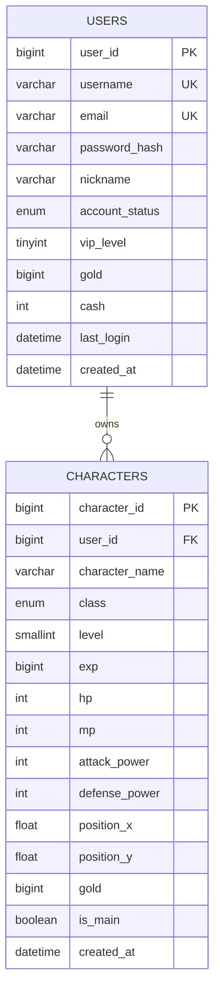
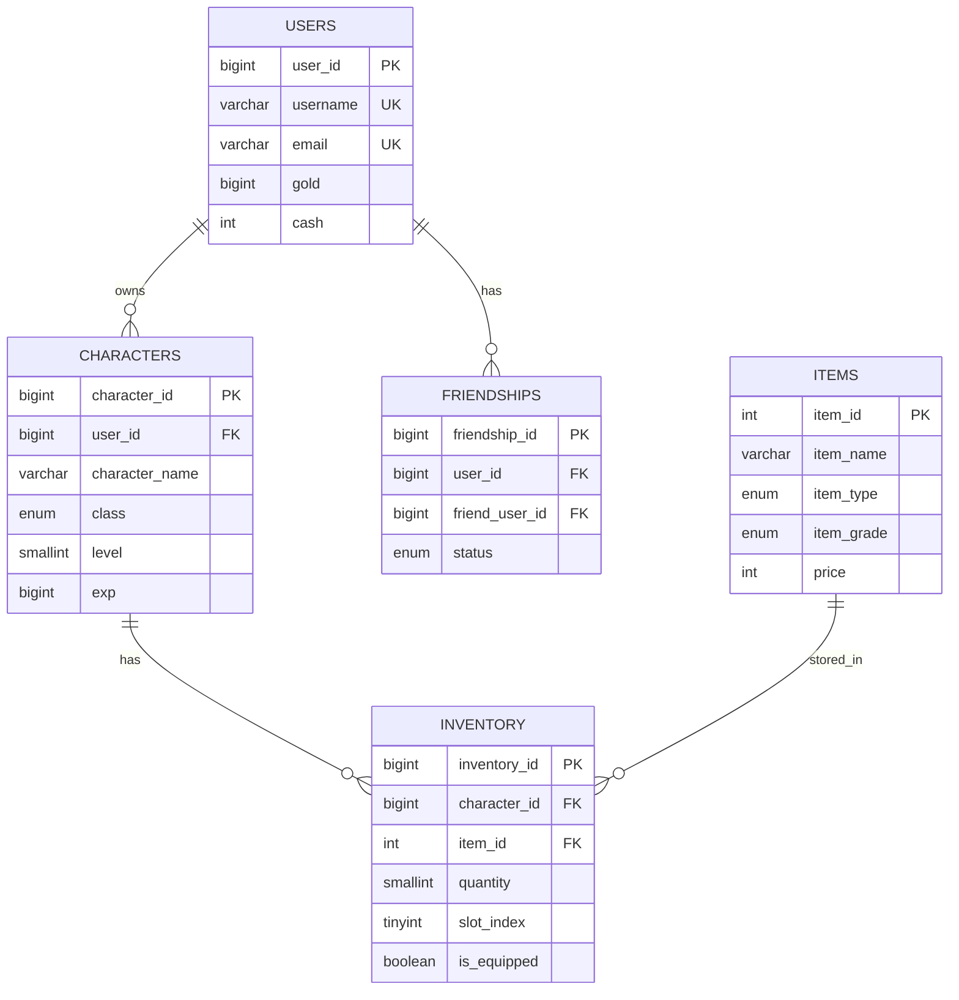

# 1주일만에 배우는 MySQL C# 프로그래밍

저자: 최흥배, AI-Assisted   
    
권장 개발 환경
- **.NET**: .NET 9 이상
- **OS**: Windows 10 이상
- **MySQL**: 8.0

-----    
  
# Day 2: SQL 기본 문법과 테이블 설계

## 2.1 데이터베이스와 테이블 생성

### CREATE DATABASE/TABLE 문법

**데이터베이스 생성:**

데이터베이스는 테이블들을 담는 최상위 컨테이너다. 게임 프로젝트마다 별도의 데이터베이스를 만드는 것이 일반적이다.

```sql
-- 기본 문법
CREATE DATABASE database_name;

-- 문자셋과 정렬 규칙 지정 (권장)
CREATE DATABASE gamedb
    CHARACTER SET utf8mb4
    COLLATE utf8mb4_unicode_ci;

-- 이미 존재하면 에러 방지
CREATE DATABASE IF NOT EXISTS gamedb
    CHARACTER SET utf8mb4
    COLLATE utf8mb4_unicode_ci;
```

**문자셋 선택 가이드:**

```
문자셋 비교:

utf8mb3 (구 utf8):
├─ 1~3바이트로 문자 표현
├─ 이모지 저장 불가 ✗
└─ 레거시 시스템 호환용

utf8mb4 (권장):
├─ 1~4바이트로 문자 표현
├─ 이모지 저장 가능 ✓
├─ 모든 유니코드 문자 지원
└─ MySQL 8.0 기본값
```

**정렬 규칙(Collation) 선택:**

```sql
-- 대소문자 구분 없음 (일반적)
COLLATE utf8mb4_unicode_ci

-- 대소문자 구분함
COLLATE utf8mb4_unicode_cs

-- 예시: 유저명 검색 시 차이
-- utf8mb4_unicode_ci 사용 시:
SELECT * FROM users WHERE username = 'Player1';
-- 'Player1', 'player1', 'PLAYER1' 모두 검색됨

-- utf8mb4_unicode_cs 사용 시:
SELECT * FROM users WHERE username = 'Player1';
-- 'Player1'만 검색됨
```

**데이터베이스 관리 명령어:**

```sql
-- 모든 데이터베이스 목록 조회
SHOW DATABASES;
+--------------------+
| Database           |
+--------------------+
| gamedb             |
| information_schema |
| mysql              |
| performance_schema |
+--------------------+

-- 데이터베이스 선택 (사용)
USE gamedb;
-- Database changed

-- 현재 선택된 데이터베이스 확인
SELECT DATABASE();
+------------+
| DATABASE() |
+------------+
| gamedb     |
+------------+

-- 데이터베이스 삭제 (주의!)
DROP DATABASE IF EXISTS old_gamedb;
```

**테이블 생성 기본 문법:**

```sql
CREATE TABLE table_name (
    column1 datatype constraints,
    column2 datatype constraints,
    ...
    table_constraints
) ENGINE=InnoDB DEFAULT CHARSET=utf8mb4;
```

**실전 예제: 게임 아이템 테이블**

```sql
CREATE TABLE items (
    -- 기본 키: 아이템 고유 ID
    item_id INT AUTO_INCREMENT PRIMARY KEY,
    
    -- 아이템 정보
    item_name VARCHAR(100) NOT NULL,
    item_type ENUM('weapon', 'armor', 'potion', 'material') NOT NULL,
    item_grade ENUM('common', 'rare', 'epic', 'legendary') DEFAULT 'common',
    
    -- 아이템 속성
    attack_power INT DEFAULT 0,
    defense_power INT DEFAULT 0,
    price INT NOT NULL DEFAULT 0,
    
    -- 설명 (긴 텍스트)
    description TEXT,
    
    -- 메타 정보
    is_tradeable BOOLEAN DEFAULT TRUE,
    max_stack INT DEFAULT 1,
    created_at TIMESTAMP DEFAULT CURRENT_TIMESTAMP,
    
    -- 인덱스
    INDEX idx_item_type (item_type),
    INDEX idx_item_grade (item_grade)
) ENGINE=InnoDB DEFAULT CHARSET=utf8mb4 COLLATE=utf8mb4_unicode_ci;
```

**테이블 구조 시각화:**

```
items 테이블 구조:

┌─────────────┬──────────────┬─────────────┬──────────────┐
│ item_id (PK)│ item_name    │ item_type   │ item_grade   │
│ INT         │ VARCHAR(100) │ ENUM        │ ENUM         │
│ AUTO_INC    │ NOT NULL     │ NOT NULL    │ DEFAULT      │
├─────────────┼──────────────┼─────────────┼──────────────┤
│ 1           │ 용의 검      │ weapon      │ legendary    │
│ 2           │ 철갑옷       │ armor       │ rare         │
│ 3           │ 체력 물약    │ potion      │ common       │
└─────────────┴──────────────┴─────────────┴──────────────┘

┌──────────────┬──────────────┬───────┬──────────────┐
│ attack_power │ defense_power│ price │ description  │
│ INT          │ INT          │ INT   │ TEXT         │
├──────────────┼──────────────┼───────┼──────────────┤
│ 150          │ 0            │ 10000 │ 전설의 검... │
│ 0            │ 80           │ 5000  │ 튼튼한 갑옷  │
│ 0            │ 0            │ 100   │ HP 50 회복   │
└──────────────┴──────────────┴───────┴──────────────┘
```

### 데이터 타입의 선택과 활용
MySQL의 데이터 타입을 올바르게 선택하는 것은 성능과 저장 공간에 큰 영향을 준다.

**숫자형 타입:**

```sql
정수형:
┌───────────┬──────────┬────────────────────┬─────────────┐
│ 타입      │ 바이트   │ 범위               │ 게임 용도    │
├───────────┼──────────┼────────────────────┼─────────────┤
│ TINYINT   │ 1        │ -128 ~ 127         │ 레벨(1~100)  │
│ SMALLINT  │ 2        │ -32768 ~ 32767     │ 체력/마나    │
│ INT       │ 4        │ -21억 ~ 21억       │ 골드, ID     │
│ BIGINT    │ 8        │ 매우 큰 범위        │ 경험치       │
└───────────┴──────────┴────────────────────┴─────────────┘

실수형:
┌───────────┬──────────┬─────────────────────┐
│ 타입      │ 정밀도   │ 게임 용도            │
├───────────┼──────────┼─────────────────────┤
│ FLOAT     │ 단정밀도 │ 위치 좌표(X, Y)      │
│ DOUBLE    │ 배정밀도 │ 정밀한 좌표          │
│ DECIMAL   │ 고정소수 │ 캐시(실제 돈) - 중요!│
└───────────┴──────────┴─────────────────────┘
```

**실전 예제:**

```sql
CREATE TABLE characters (
    character_id INT AUTO_INCREMENT PRIMARY KEY,
    
    -- 기본 스탯 (작은 범위)
    level TINYINT UNSIGNED DEFAULT 1,          -- 0~255
    hp SMALLINT UNSIGNED DEFAULT 100,          -- 0~65535
    mp SMALLINT UNSIGNED DEFAULT 50,
    
    -- 큰 숫자 (골드, 경험치)
    gold INT UNSIGNED DEFAULT 0,               -- 0~42억
    exp BIGINT UNSIGNED DEFAULT 0,             -- 매우 큰 범위
    
    -- 위치 정보
    position_x FLOAT DEFAULT 0.0,
    position_y FLOAT DEFAULT 0.0,
    
    -- 현금 아이템 (정확한 계산 필요)
    cash DECIMAL(10, 2) DEFAULT 0.00          -- 최대 99999999.99
);

-- UNSIGNED를 사용하면 양수 범위가 2배가 된다
-- TINYINT: -128~127 → UNSIGNED: 0~255
```

**문자열 타입:**

```sql
┌────────────┬──────────────┬─────────────────────────┐
│ 타입       │ 최대 길이    │ 게임 용도                │
├────────────┼──────────────┼─────────────────────────┤
│ CHAR(N)    │ 고정 N자     │ 고정길이 코드(상태코드)  │
│ VARCHAR(N) │ 가변 N자     │ 유저명, 아이템명         │
│ TEXT       │ 65,535자     │ 공지사항, 아이템 설명    │
│ MEDIUMTEXT │ 16MB         │ 긴 스토리, 패치노트      │
│ LONGTEXT   │ 4GB          │ 대량 로그 (비추천)       │
│ ENUM       │ 고정 선택지  │ 등급, 타입 (성능 좋음)   │
└────────────┴──────────────┴─────────────────────────┘
```

**CHAR vs VARCHAR 선택 기준:**

```sql
-- CHAR: 고정 길이 (공간 낭비 가능, 속도 빠름)
CREATE TABLE status_codes (
    code CHAR(4),                    -- 항상 4바이트 사용
    -- 'A001' → 'A001' (4바이트)
    -- 'B1'   → 'B1  ' (4바이트, 공백 패딩)
);

-- VARCHAR: 가변 길이 (공간 효율적, 1~2바이트 길이 정보 추가)
CREATE TABLE usernames (
    username VARCHAR(50),            -- 실제 길이만큼 사용 + 1~2바이트
    -- 'Player'   → 6바이트 + 1바이트 = 7바이트
    -- 'SuperLongName123' → 17바이트 + 1바이트 = 18바이트
);

-- 선택 가이드:
-- CHAR → 항상 같은 길이 (국가 코드, 우편번호 등)
-- VARCHAR → 길이가 다양함 (이름, 설명 등)
```

**ENUM 타입 활용:**

```sql
-- ENUM은 내부적으로 정수로 저장되어 매우 효율적이다
CREATE TABLE user_status (
    user_id INT PRIMARY KEY,
    status ENUM('online', 'offline', 'away', 'busy') DEFAULT 'offline'
);

-- 저장 방식:
-- 'online'  → 1 (1바이트)
-- 'offline' → 2 (1바이트)
-- 'away'    → 3 (1바이트)
-- 'busy'    → 4 (1바이트)

-- VARCHAR(20)을 사용했다면 각각 6~7바이트 필요
-- ENUM은 항상 1~2바이트만 사용!

-- 조회
SELECT * FROM user_status WHERE status = 'online';
-- 내부적으로 status = 1로 변환되어 빠름
```

**날짜/시간 타입:**

```sql
┌───────────┬─────────────┬──────────────────┬─────────────────────┐
│ 타입      │ 포맷        │ 범위             │ 게임 용도            │
├───────────┼─────────────┼──────────────────┼─────────────────────┤
│ DATE      │ YYYY-MM-DD  │ 1000-01-01 ~     │ 생년월일, 이벤트일자 │
│ TIME      │ HH:MM:SS    │ -838:59:59 ~     │ 플레이 시간 누적     │
│ DATETIME  │ YYYY-MM-DD  │ 1000-01-01 ~     │ 생성일시, 로그인시각 │
│           │ HH:MM:SS    │ 9999-12-31       │                     │
│ TIMESTAMP │ YYYY-MM-DD  │ 1970-01-01 ~     │ 자동 업데이트 시각   │
│           │ HH:MM:SS    │ 2038-01-19       │                     │
└───────────┴─────────────┴──────────────────┴─────────────────────┘
```

**날짜 타입 활용 예제:**

```sql
CREATE TABLE game_sessions (
    session_id INT AUTO_INCREMENT PRIMARY KEY,
    user_id INT NOT NULL,
    
    -- 세션 시작/종료 시각
    start_time DATETIME NOT NULL,
    end_time DATETIME,
    
    -- 자동 기록 (INSERT 시 자동으로 현재 시각)
    created_at TIMESTAMP DEFAULT CURRENT_TIMESTAMP,
    
    -- 자동 업데이트 (UPDATE 시 자동으로 현재 시각)
    updated_at TIMESTAMP DEFAULT CURRENT_TIMESTAMP 
               ON UPDATE CURRENT_TIMESTAMP
);

-- 데이터 삽입
INSERT INTO game_sessions (user_id, start_time)
VALUES (1, NOW());

-- 결과:
-- session_id: 1
-- user_id: 1
-- start_time: 2025-12-26 14:30:00
-- end_time: NULL
-- created_at: 2025-12-26 14:30:00 (자동)
-- updated_at: 2025-12-26 14:30:00 (자동)

-- 세션 종료 시
UPDATE game_sessions 
SET end_time = NOW() 
WHERE session_id = 1;

-- updated_at이 자동으로 현재 시각으로 변경됨!
```

**DATETIME vs TIMESTAMP 차이:**

```sql
차이점:

DATETIME:
├─ 8바이트 저장
├─ 타임존 영향 없음 (입력한 그대로 저장)
├─ 1000년~9999년 범위
└─ 전역 서비스 시 주의 필요

TIMESTAMP:
├─ 4바이트 저장
├─ UTC로 변환 저장, 조회 시 타임존 적용
├─ 1970년~2038년 범위 (2038년 문제!)
└─ 자동 업데이트 기능 사용 편리

권장:
- 로그, 기록용 → DATETIME
- 자동 업데이트 필요 → TIMESTAMP (created_at, updated_at)
- 2038년 이후 필요 → DATETIME
```

### 제약조건(Primary Key, Foreign Key, Unique, Not Null)
제약조건(Constraints)은 데이터 무결성을 보장하는 규칙이다.

**PRIMARY KEY (기본 키):**

```sql
-- 방법 1: 컬럼 정의 시 지정
CREATE TABLE users (
    user_id INT AUTO_INCREMENT PRIMARY KEY,
    username VARCHAR(50)
);

-- 방법 2: 테이블 끝에 지정
CREATE TABLE users (
    user_id INT AUTO_INCREMENT,
    username VARCHAR(50),
    PRIMARY KEY (user_id)
);

-- 방법 3: 복합 키 (여러 컬럼 조합)
CREATE TABLE friendship (
    user_id INT,
    friend_id INT,
    created_at DATETIME,
    PRIMARY KEY (user_id, friend_id)  -- 두 컬럼이 합쳐져서 고유함
);
```

**PRIMARY KEY의 특징:**

```
Primary Key 규칙:
┌─────────────────────────────────────┐
│ ✓ NULL 불가 (항상 값이 있어야 함)    │
│ ✓ 중복 불가 (각 행을 고유하게 식별)  │
│ ✓ 테이블당 1개만 가능                │
│ ✓ 자동으로 인덱스 생성 (검색 빠름)   │
│ ✓ 다른 테이블에서 Foreign Key로 참조 │
└─────────────────────────────────────┘

선택 기준:
- AUTO_INCREMENT INT → 대부분의 경우 (권장)
- UUID/GUID → 분산 시스템, 보안 필요 시
- 복합 키 → 다대다 관계 테이블
```

**AUTO_INCREMENT 동작:**

```sql
CREATE TABLE test_auto (
    id INT AUTO_INCREMENT PRIMARY KEY,
    name VARCHAR(50)
);

-- 삽입 시 id를 생략하면 자동 증가
INSERT INTO test_auto (name) VALUES ('첫번째');  -- id = 1
INSERT INTO test_auto (name) VALUES ('두번째');  -- id = 2
INSERT INTO test_auto (name) VALUES ('세번째');  -- id = 3

-- 3번 삭제
DELETE FROM test_auto WHERE id = 3;

-- 다음 삽입 시
INSERT INTO test_auto (name) VALUES ('네번째');  -- id = 4 (3이 아님!)

-- AUTO_INCREMENT는 계속 증가만 함, 삭제된 번호는 재사용 안 됨
```

**FOREIGN KEY (외래 키):**

외래 키는 다른 테이블을 참조하여 데이터 무결성을 보장한다.

```sql
-- 부모 테이블: users
CREATE TABLE users (
    user_id INT AUTO_INCREMENT PRIMARY KEY,
    username VARCHAR(50) NOT NULL
);

-- 자식 테이블: characters
CREATE TABLE characters (
    character_id INT AUTO_INCREMENT PRIMARY KEY,
    user_id INT NOT NULL,
    character_name VARCHAR(50) NOT NULL,
    
    -- 외래 키 제약조건
    FOREIGN KEY (user_id) REFERENCES users(user_id)
        ON DELETE CASCADE        -- 유저 삭제 시 캐릭터도 삭제
        ON UPDATE CASCADE        -- 유저 ID 변경 시 캐릭터도 변경
);
```

**외래 키 참조 무결성:**

```
참조 무결성 보장:

users 테이블:
┌─────────┬──────────┐
│ user_id │ username │
├─────────┼──────────┤
│ 1       │ player1  │
│ 2       │ player2  │
└─────────┴──────────┘

characters 테이블:
┌──────────────┬─────────┬────────────────┐
│ character_id │ user_id │ character_name │
├──────────────┼─────────┼────────────────┤
│ 1            │ 1       │ 전사           │
│ 2            │ 1       │ 마법사         │
│ 3            │ 2       │ 도적           │
└──────────────┴─────────┴────────────────┘
              ↑
              └─ users.user_id를 참조

시도: INSERT INTO characters (user_id, character_name) 
      VALUES (999, '해커');
결과: ✗ Error - user_id 999는 users 테이블에 없음!

시도: DELETE FROM users WHERE user_id = 1;
결과: ON DELETE CASCADE 설정으로 
      character_id 1, 2도 함께 삭제됨
```

**ON DELETE/UPDATE 옵션:**

```sql
┌──────────────┬────────────────────────────────────────┐
│ 옵션         │ 동작                                    │
├──────────────┼────────────────────────────────────────┤
│ CASCADE      │ 부모 삭제/변경 시 자식도 삭제/변경      │
│ SET NULL     │ 부모 삭제 시 자식의 FK를 NULL로 설정    │
│ RESTRICT     │ 자식이 있으면 부모 삭제/변경 불가 (기본)│
│ NO ACTION    │ RESTRICT와 동일                        │
│ SET DEFAULT  │ 부모 삭제 시 자식을 기본값으로 (미지원) │
└──────────────┴────────────────────────────────────────┘
```

**게임 시스템별 외래 키 전략:**

```sql
-- 케이스 1: CASCADE - 유저 삭제 시 모든 데이터 함께 삭제
CREATE TABLE inventory (
    inventory_id INT AUTO_INCREMENT PRIMARY KEY,
    character_id INT NOT NULL,
    item_id INT NOT NULL,
    quantity INT DEFAULT 1,
    FOREIGN KEY (character_id) REFERENCES characters(character_id)
        ON DELETE CASCADE  -- 캐릭터 삭제 시 인벤토리도 삭제
);

-- 케이스 2: SET NULL - 아이템 삭제해도 거래 기록은 유지
CREATE TABLE trade_history (
    trade_id INT AUTO_INCREMENT PRIMARY KEY,
    seller_id INT NOT NULL,
    buyer_id INT NOT NULL,
    item_id INT,  -- NULL 허용
    price INT NOT NULL,
    traded_at DATETIME DEFAULT CURRENT_TIMESTAMP,
    FOREIGN KEY (item_id) REFERENCES items(item_id)
        ON DELETE SET NULL  -- 아이템 삭제 시 NULL로 (기록은 유지)
);

-- 케이스 3: RESTRICT - 연결된 데이터가 있으면 삭제 불가
CREATE TABLE guild_members (
    member_id INT AUTO_INCREMENT PRIMARY KEY,
    guild_id INT NOT NULL,
    user_id INT NOT NULL,
    FOREIGN KEY (guild_id) REFERENCES guilds(guild_id)
        ON DELETE RESTRICT  -- 길드원이 있으면 길드 삭제 불가
);
```

**UNIQUE 제약조건:**

```sql
-- 중복을 허용하지 않는 컬럼 (NULL은 여러 개 가능)
CREATE TABLE users (
    user_id INT AUTO_INCREMENT PRIMARY KEY,
    username VARCHAR(50) NOT NULL UNIQUE,     -- 방법 1
    email VARCHAR(100) NOT NULL,
    phone VARCHAR(20),
    
    UNIQUE KEY uk_email (email),              -- 방법 2 (명시적 이름)
    UNIQUE KEY uk_phone (phone)
);

-- 복합 UNIQUE (여러 컬럼 조합이 고유)
CREATE TABLE server_characters (
    character_id INT AUTO_INCREMENT PRIMARY KEY,
    server_id INT NOT NULL,
    character_name VARCHAR(50) NOT NULL,
    
    -- 같은 서버에서 같은 이름 불가, 다른 서버는 가능
    UNIQUE KEY uk_server_name (server_id, character_name)
);

-- 사용 예:
INSERT INTO server_characters (server_id, character_name) 
VALUES (1, '드래곤');  -- ✓ 성공

INSERT INTO server_characters (server_id, character_name) 
VALUES (1, '드래곤');  -- ✗ 에러: 서버1에 '드래곤' 이미 존재

INSERT INTO server_characters (server_id, character_name) 
VALUES (2, '드래곤');  -- ✓ 성공: 서버2는 다른 서버
```

**NOT NULL 제약조건:**

```sql
CREATE TABLE characters (
    character_id INT AUTO_INCREMENT PRIMARY KEY,
    user_id INT NOT NULL,              -- 필수: 반드시 값 있어야 함
    character_name VARCHAR(50) NOT NULL,
    level INT NOT NULL DEFAULT 1,      -- NOT NULL + 기본값
    description TEXT                   -- NULL 허용 (기본값)
);

-- 삽입 시도
INSERT INTO characters (user_id, character_name) 
VALUES (1, '전사');
-- ✓ 성공: level은 자동으로 1

INSERT INTO characters (character_name) 
VALUES ('마법사');
-- ✗ 에러: user_id가 NULL일 수 없음

INSERT INTO characters (user_id, character_name, description) 
VALUES (1, '도적', NULL);
-- ✓ 성공: description은 NULL 허용
```

**DEFAULT 값 설정:**

```sql
CREATE TABLE game_config (
    config_id INT AUTO_INCREMENT PRIMARY KEY,
    
    -- 숫자 기본값
    max_level INT DEFAULT 100,
    start_gold INT DEFAULT 1000,
    
    -- 문자열 기본값
    server_status VARCHAR(20) DEFAULT 'maintenance',
    
    -- 날짜 기본값
    created_at DATETIME DEFAULT CURRENT_TIMESTAMP,
    event_end_date DATE DEFAULT '2025-12-31',
    
    -- BOOLEAN (TINYINT(1))
    is_active BOOLEAN DEFAULT TRUE,
    
    -- 표현식 (MySQL 8.0+)
    expiry_date DATETIME DEFAULT (CURRENT_TIMESTAMP + INTERVAL 30 DAY)
);
```

**CHECK 제약조건 (MySQL 8.0.16+):**

```sql
CREATE TABLE items (
    item_id INT AUTO_INCREMENT PRIMARY KEY,
    item_name VARCHAR(100) NOT NULL,
    price INT NOT NULL,
    stock INT NOT NULL,
    discount_rate DECIMAL(5,2),
    
    -- CHECK 제약조건으로 값 범위 제한
    CHECK (price >= 0),                    -- 가격은 0 이상
    CHECK (stock >= 0),                    -- 재고는 0 이상
    CHECK (discount_rate BETWEEN 0 AND 100), -- 할인율 0~100%
    
    -- 명시적 이름 지정
    CONSTRAINT chk_price_positive CHECK (price > 0),
    CONSTRAINT chk_discount_range CHECK (discount_rate >= 0 AND discount_rate <= 100)
);

-- 위반 시도
INSERT INTO items (item_name, price, stock) 
VALUES ('마법 검', -1000, 10);
-- ✗ 에러: Check constraint 'chk_price_positive' is violated
```
  

## 2.2 기본 CRUD 명령어
CRUD는 Create(생성), Read(조회), Update(수정), Delete(삭제)의 약자로 데이터베이스의 기본 작업이다.

### INSERT: 데이터 삽입

**기본 INSERT 문법:**

```sql
-- 방법 1: 컬럼명 명시 (권장)
INSERT INTO table_name (column1, column2, column3)
VALUES (value1, value2, value3);

-- 방법 2: 모든 컬럼에 순서대로 삽입
INSERT INTO table_name
VALUES (value1, value2, value3, ...);

-- 방법 3: 여러 행 한번에 삽입
INSERT INTO table_name (column1, column2)
VALUES 
    (value1_1, value1_2),
    (value2_1, value2_2),
    (value3_1, value3_2);
```

**실전 예제:**

```sql
-- 단일 유저 삽입
INSERT INTO users (username, email, password_hash, level, gold)
VALUES ('dragonknight', 'dragon@game.com', 'hash123', 1, 1000);

-- 여러 유저 한번에 삽입 (효율적)
INSERT INTO users (username, email, password_hash, level, gold)
VALUES 
    ('wizard99', 'wizard@game.com', 'hash456', 5, 2500),
    ('rogue007', 'rogue@game.com', 'hash789', 3, 1800),
    ('priest77', 'priest@game.com', 'hash321', 7, 3200);

-- AUTO_INCREMENT ID 확인
SELECT LAST_INSERT_ID();  -- 마지막으로 삽입된 ID 반환
+------------------+
| LAST_INSERT_ID() |
+------------------+
| 4                |
+------------------+
```

**INSERT 고급 기법:**

```sql
-- 1. INSERT IGNORE: 중복 시 에러 대신 무시
INSERT IGNORE INTO users (username, email, password_hash)
VALUES ('dragonknight', 'new@game.com', 'hash999');
-- username이 UNIQUE인데 중복이면 조용히 무시

-- 2. ON DUPLICATE KEY UPDATE: 중복 시 업데이트
INSERT INTO daily_login (user_id, login_date, login_count)
VALUES (1, '2025-12-26', 1)
ON DUPLICATE KEY UPDATE 
    login_count = login_count + 1;
-- 오늘 이미 로그인 기록 있으면 카운트만 증가

-- 3. INSERT ... SELECT: 다른 테이블에서 복사
INSERT INTO backup_users (user_id, username, level)
SELECT user_id, username, level
FROM users
WHERE level >= 50;
-- 레벨 50 이상 유저를 백업 테이블로 복사
```

**게임 데이터 삽입 예제:**

```sql
-- 신규 캐릭터 생성
INSERT INTO characters (user_id, character_name, class, level, hp, mp)
VALUES (1, '용사레전드', 'warrior', 1, 100, 50);

-- 초기 아이템 지급
INSERT INTO inventory (character_id, item_id, quantity)
VALUES 
    (LAST_INSERT_ID(), 1001, 1),  -- 초보자 검
    (LAST_INSERT_ID(), 1002, 1),  -- 초보자 갑옷
    (LAST_INSERT_ID(), 2001, 10); -- 체력 물약 10개

-- 시작 퀘스트 활성화
INSERT INTO character_quests (character_id, quest_id, status, started_at)
VALUES (LAST_INSERT_ID(), 1, 'active', NOW());
```

### SELECT: 데이터 조회와 WHERE 조건
SELECT는 가장 많이 사용하는 명령어로 데이터를 조회한다.

**기본 SELECT 문법:**

```sql
SELECT column1, column2, ...
FROM table_name
WHERE condition
ORDER BY column
LIMIT count;
```

**전체 조회:**

```sql
-- 모든 컬럼 조회 (개발 중에만 사용, 운영에서는 비추천)
SELECT * FROM users;

-- 특정 컬럼만 조회 (권장)
SELECT user_id, username, level, gold 
FROM users;

-- 별칭(Alias) 사용
SELECT 
    user_id AS '유저번호',
    username AS '닉네임',
    level AS '레벨',
    gold AS '보유골드'
FROM users;
```

**WHERE 조건절:**

```sql
-- 비교 연산자
SELECT * FROM users WHERE level = 50;         -- 같음
SELECT * FROM users WHERE level != 50;        -- 같지 않음
SELECT * FROM users WHERE level > 50;         -- 크다
SELECT * FROM users WHERE level >= 50;        -- 크거나 같다
SELECT * FROM users WHERE level < 50;         -- 작다
SELECT * FROM users WHERE level BETWEEN 30 AND 50;  -- 범위

-- 논리 연산자
SELECT * FROM users 
WHERE level >= 50 AND gold >= 10000;          -- 둘 다 만족

SELECT * FROM users 
WHERE level >= 50 OR gold >= 10000;           -- 하나만 만족

SELECT * FROM users 
WHERE NOT (level < 10);                       -- 부정

-- 여러 조건 조합
SELECT * FROM users 
WHERE (level >= 50 OR gold >= 100000) 
  AND username LIKE 'dragon%';
```

**문자열 검색:**

```sql
-- LIKE 패턴 매칭
SELECT * FROM users WHERE username LIKE 'dragon%';    -- dragon으로 시작
SELECT * FROM users WHERE username LIKE '%knight%';   -- knight 포함
SELECT * FROM users WHERE username LIKE '%77';        -- 77로 끝남
SELECT * FROM users WHERE username LIKE '_____';      -- 정확히 5글자

-- IN 연산자
SELECT * FROM characters 
WHERE class IN ('warrior', 'knight', 'paladin');      -- 전사 계열

-- NOT IN
SELECT * FROM characters 
WHERE class NOT IN ('mage', 'priest');                -- 마법 계열 제외

-- NULL 체크
SELECT * FROM users WHERE last_login IS NULL;         -- 한번도 로그인 안함
SELECT * FROM users WHERE last_login IS NOT NULL;     -- 로그인 이력 있음
```

**정렬과 제한:**

```sql
-- ORDER BY: 정렬
SELECT username, level, gold
FROM users
ORDER BY level DESC;                    -- 레벨 내림차순 (높은순)

SELECT username, level, gold
FROM users
ORDER BY level ASC, gold DESC;          -- 레벨 오름차순, 같으면 골드 내림차순

-- LIMIT: 결과 개수 제한
SELECT username, level
FROM users
ORDER BY level DESC
LIMIT 10;                               -- 상위 10명

-- LIMIT with OFFSET: 페이징
SELECT username, level
FROM users
ORDER BY level DESC
LIMIT 10 OFFSET 20;                     -- 21~30번째 (3페이지)

-- 간단 표현
SELECT username, level
FROM users
ORDER BY level DESC
LIMIT 20, 10;                           -- OFFSET 20, LIMIT 10과 동일
```

**집계 함수:**

```sql
-- COUNT: 개수 세기
SELECT COUNT(*) AS total_users FROM users;
SELECT COUNT(DISTINCT level) AS level_variety FROM users;

-- SUM: 합계
SELECT SUM(gold) AS total_gold FROM users;

-- AVG: 평균
SELECT AVG(level) AS average_level FROM users;

-- MAX, MIN: 최대, 최소
SELECT MAX(level) AS max_level, MIN(level) AS min_level FROM users;

-- 여러 집계를 한번에
SELECT 
    COUNT(*) AS total_users,
    AVG(level) AS avg_level,
    SUM(gold) AS total_gold,
    MAX(level) AS highest_level
FROM users;
```

**GROUP BY: 그룹별 집계:**

```sql
-- 레벨별 유저 수
SELECT level, COUNT(*) AS user_count
FROM users
GROUP BY level
ORDER BY level;

+-------+------------+
| level | user_count |
+-------+------------+
| 1     | 15         |
| 2     | 23         |
| 3     | 18         |
| ...   | ...        |
+-------+------------+

-- 직업별 평균 레벨
SELECT class, AVG(level) AS avg_level, COUNT(*) AS count
FROM characters
GROUP BY class;

+---------+-----------+-------+
| class   | avg_level | count |
+---------+-----------+-------+
| warrior | 45.5      | 120   |
| mage    | 42.3      | 95    |
| priest  | 38.7      | 78    |
+---------+-----------+-------+

-- HAVING: 그룹 필터링 (WHERE는 그룹 전, HAVING은 그룹 후)
SELECT class, AVG(level) AS avg_level
FROM characters
GROUP BY class
HAVING avg_level >= 40;     -- 평균 레벨 40 이상인 직업만
```

**서브쿼리:**

```sql
-- 평균 레벨보다 높은 유저
SELECT username, level
FROM users
WHERE level > (SELECT AVG(level) FROM users);

-- IN을 이용한 서브쿼리
SELECT character_name, level
FROM characters
WHERE user_id IN (
    SELECT user_id FROM users WHERE gold >= 100000
);

-- EXISTS를 이용한 서브쿼리 (더 빠름)
SELECT u.username
FROM users u
WHERE EXISTS (
    SELECT 1 FROM characters c 
    WHERE c.user_id = u.user_id AND c.level >= 50
);
```

### UPDATE: 데이터 수정

**기본 UPDATE 문법:**

```sql
UPDATE table_name
SET column1 = value1, column2 = value2, ...
WHERE condition;
```

**주의: WHERE 절을 빼먹으면 모든 행이 수정된다!**

```sql
-- ✗ 위험한 예제 (모든 유저의 골드가 0이 됨!)
UPDATE users SET gold = 0;

-- ✓ 안전한 예제 (WHERE 조건 사용)
UPDATE users SET gold = 0 WHERE user_id = 1;
```

**실전 UPDATE 예제:**

```sql
-- 단일 컬럼 수정
UPDATE users 
SET level = level + 1 
WHERE user_id = 1;

-- 여러 컬럼 동시 수정
UPDATE characters 
SET level = level + 1,
    exp = 0,
    gold = gold + 1000
WHERE character_id = 1;

-- 조건부 수정
UPDATE users 
SET gold = gold + 5000 
WHERE level >= 50 AND last_login >= DATE_SUB(NOW(), INTERVAL 7 DAY);
-- 레벨 50 이상이고 최근 7일 내 로그인한 유저에게 골드 지급

-- 계산식 사용
UPDATE items 
SET price = price * 0.8 
WHERE item_grade = 'common';
-- 일반 등급 아이템 20% 할인
```

**CASE WHEN을 이용한 조건부 업데이트:**

```sql
-- 레벨 구간별 차등 골드 지급
UPDATE users
SET gold = gold + CASE 
    WHEN level >= 50 THEN 10000
    WHEN level >= 30 THEN 5000
    WHEN level >= 10 THEN 2000
    ELSE 1000
END
WHERE is_active = TRUE;
```

**JOIN을 사용한 UPDATE:**

```sql
-- 캐릭터의 유저 정보 기반으로 업데이트
UPDATE characters c
INNER JOIN users u ON c.user_id = u.user_id
SET c.vip_status = TRUE
WHERE u.gold >= 1000000;
-- 골드 100만 이상 유저의 캐릭터를 VIP로 설정
```

### DELETE: 데이터 삭제

**기본 DELETE 문법:**

```sql
DELETE FROM table_name
WHERE condition;
```

**주의: WHERE 절을 빼먹으면 모든 데이터가 삭제된다!**

```sql
-- ✗ 매우 위험! (모든 유저 삭제)
DELETE FROM users;

-- ✓ 안전한 삭제
DELETE FROM users WHERE user_id = 999;
```

**실전 DELETE 예제:**

```sql
-- 특정 유저 삭제
DELETE FROM users WHERE user_id = 1;

-- 조건부 삭제
DELETE FROM users 
WHERE level < 10 
  AND last_login < DATE_SUB(NOW(), INTERVAL 1 YEAR);
-- 레벨 10 미만이고 1년간 미접속 유저 삭제

-- 오래된 로그 삭제
DELETE FROM game_logs 
WHERE created_at < DATE_SUB(NOW(), INTERVAL 90 DAY);
-- 90일 이전 로그 삭제
```

**LIMIT를 사용한 삭제:**

```sql
-- 일부만 삭제 (대량 삭제 시 서버 부하 방지)
DELETE FROM game_logs 
WHERE created_at < '2025-01-01'
ORDER BY created_at ASC
LIMIT 1000;
-- 가장 오래된 것부터 1000개만 삭제

-- 배치로 반복 실행하여 전체 삭제
-- (한번에 백만건 삭제하면 DB 락 발생 가능)
```

**TRUNCATE vs DELETE:**

```sql
-- DELETE: 행 단위로 삭제, WHERE 조건 가능, 롤백 가능
DELETE FROM temp_data WHERE user_id = 1;

-- TRUNCATE: 테이블 전체 초기화, 매우 빠름, 롤백 불가
TRUNCATE TABLE temp_data;

비교:
┌────────────┬──────────┬──────────┬──────────┬──────────┐
│ 특징       │ DELETE   │ TRUNCATE │ DROP     │          │
├────────────┼──────────┼──────────┼──────────┼──────────┤
│ 속도       │ 느림     │ 빠름     │ 빠름     │          │
│ WHERE 조건 │ 가능     │ 불가     │ N/A      │          │
│ 롤백       │ 가능     │ 불가     │ 불가     │          │
│ 트리거     │ 실행됨   │ 실행안됨 │ 실행안됨 │          │
│ AUTO_INC   │ 유지     │ 초기화   │ N/A      │          │
│ 테이블구조 │ 유지     │ 유지     │ 삭제     │          │
└────────────┴──────────┴──────────┴──────────┴──────────┘

사용 시나리오:
- DELETE: 특정 조건 데이터 삭제, 트랜잭션 필요
- TRUNCATE: 테스트 데이터 전체 초기화
- DROP: 테이블 자체를 제거
```
  

## 2.3 온라인 게임 유저 테이블 설계 실습
실제 온라인 게임에 필요한 테이블들을 설계해보자.

### 유저 정보 테이블 설계

```sql
-- 1. 유저 기본 정보 테이블
CREATE TABLE users (
    -- 기본 키
    user_id BIGINT AUTO_INCREMENT PRIMARY KEY,
    
    -- 계정 정보
    username VARCHAR(50) NOT NULL UNIQUE,
    email VARCHAR(100) NOT NULL UNIQUE,
    password_hash VARCHAR(255) NOT NULL,
    
    -- 프로필
    nickname VARCHAR(50),
    profile_image_url VARCHAR(255),
    birth_date DATE,
    country_code CHAR(2) DEFAULT 'KR',
    
    -- 계정 상태
    account_status ENUM('active', 'suspended', 'banned', 'deleted') 
        DEFAULT 'active',
    vip_level TINYINT UNSIGNED DEFAULT 0,      -- 0~10
    
    -- 게임 화폐
    gold BIGINT UNSIGNED DEFAULT 0,
    cash INT UNSIGNED DEFAULT 0,                -- 유료 재화
    
    -- 통계
    total_play_time INT UNSIGNED DEFAULT 0,     -- 초 단위
    last_login DATETIME,
    login_count INT UNSIGNED DEFAULT 0,
    
    -- 메타 정보
    created_at DATETIME DEFAULT CURRENT_TIMESTAMP,
    updated_at DATETIME DEFAULT CURRENT_TIMESTAMP 
               ON UPDATE CURRENT_TIMESTAMP,
    deleted_at DATETIME,                        -- 소프트 삭제용
    
    -- 인덱스
    INDEX idx_username (username),
    INDEX idx_email (email),
    INDEX idx_account_status (account_status),
    INDEX idx_last_login (last_login)
    
) ENGINE=InnoDB DEFAULT CHARSET=utf8mb4 COLLATE=utf8mb4_unicode_ci;
```

**테이블 설계 포인트:**

```
설계 결정 사항:

1. user_id를 BIGINT로:
   - INT는 21억까지 (서비스 성장 시 부족할 수 있음)
   - BIGINT는 900경까지 (충분함)

2. username과 email에 UNIQUE 인덱스:
   - 중복 방지
   - 빠른 로그인 조회

3. ENUM으로 account_status:
   - 제한된 값만 입력 가능
   - 1바이트만 사용 (메모리 효율)
   - 추가 테이블 불필요

4. deleted_at 컬럼 (소프트 삭제):
   - 실제로 데이터를 삭제하지 않음
   - 복구 가능, 감사 로그용
   - WHERE deleted_at IS NULL로 활성 유저만 조회

5. 인덱스 전략:
   - 로그인 시: username, email로 검색
   - 관리자 기능: account_status로 필터링
   - 통계: last_login으로 활성 유저 분석
```

**샘플 데이터 삽입:**

```sql
INSERT INTO users (
    username, email, password_hash, nickname, 
    gold, cash, account_status
) VALUES 
(
    'dragonmaster',
    'dragon@game.com',
    '$2y$10$abcdefghijklmnopqrstuvwxyz',  -- bcrypt 해시
    '드래곤마스터',
    150000,
    1000,
    'active'
),
(
    'mageking',
    'mage@game.com',
    '$2y$10$zyxwvutsrqponmlkjihgfedcba',
    '마법왕',
    85000,
    500,
    'active'
);
```

### 캐릭터 정보 테이블 설계
하나의 유저가 여러 캐릭터를 만들 수 있는 구조다.

```sql
CREATE TABLE characters (
    -- 기본 키
    character_id BIGINT AUTO_INCREMENT PRIMARY KEY,
    
    -- 외래 키
    user_id BIGINT NOT NULL,
    
    -- 캐릭터 기본 정보
    character_name VARCHAR(50) NOT NULL,
    class ENUM(
        'warrior', 'knight', 'berserker',     -- 전사 계열
        'mage', 'wizard', 'warlock',          -- 마법사 계열
        'priest', 'cleric', 'paladin',        -- 성직자 계열
        'rogue', 'assassin', 'ranger'         -- 도적 계열
    ) NOT NULL,
    
    -- 레벨과 경험치
    level SMALLINT UNSIGNED DEFAULT 1,
    exp BIGINT UNSIGNED DEFAULT 0,
    
    -- 스탯
    strength SMALLINT UNSIGNED DEFAULT 10,
    intelligence SMALLINT UNSIGNED DEFAULT 10,
    dexterity SMALLINT UNSIGNED DEFAULT 10,
    vitality SMALLINT UNSIGNED DEFAULT 10,
    luck SMALLINT UNSIGNED DEFAULT 10,
    
    -- 전투력
    hp INT UNSIGNED DEFAULT 100,
    max_hp INT UNSIGNED DEFAULT 100,
    mp INT UNSIGNED DEFAULT 50,
    max_mp INT UNSIGNED DEFAULT 50,
    attack_power INT UNSIGNED DEFAULT 10,
    defense_power INT UNSIGNED DEFAULT 5,
    
    -- 위치 정보
    map_id INT DEFAULT 1,
    position_x FLOAT DEFAULT 0.0,
    position_y FLOAT DEFAULT 0.0,
    position_z FLOAT DEFAULT 0.0,
    
    -- 소지 골드 (캐릭터별 독립)
    gold BIGINT UNSIGNED DEFAULT 1000,
    
    -- 상태
    is_main BOOLEAN DEFAULT FALSE,              -- 대표 캐릭터 여부
    is_deleted BOOLEAN DEFAULT FALSE,
    
    -- 메타 정보
    created_at DATETIME DEFAULT CURRENT_TIMESTAMP,
    updated_at DATETIME DEFAULT CURRENT_TIMESTAMP 
               ON UPDATE CURRENT_TIMESTAMP,
    last_played DATETIME,
    total_play_time INT UNSIGNED DEFAULT 0,
    
    -- 외래 키 제약조건
    FOREIGN KEY (user_id) REFERENCES users(user_id)
        ON DELETE CASCADE,
    
    -- 인덱스
    INDEX idx_user_id (user_id),
    INDEX idx_character_name (character_name),
    INDEX idx_level (level),
    INDEX idx_class (class),
    
    -- 복합 인덱스: 같은 유저의 캐릭터 이름 중복 방지
    UNIQUE KEY uk_user_character (user_id, character_name)
    
) ENGINE=InnoDB DEFAULT CHARSET=utf8mb4 COLLATE=utf8mb4_unicode_ci;
```

**ERD 다이어그램:**



**캐릭터 생성 시나리오:**

```sql
-- 1. 신규 유저의 첫 캐릭터 생성
INSERT INTO characters (
    user_id, character_name, class, is_main
) VALUES (
    1,                    -- user_id
    '용사레전드',
    'warrior',
    TRUE                  -- 첫 캐릭터는 자동으로 대표 캐릭터
);

-- 2. 같은 유저의 두번째 캐릭터 생성
INSERT INTO characters (
    user_id, character_name, class, is_main
) VALUES (
    1,
    '마법사전설',
    'mage',
    FALSE
);

-- 3. 유저의 모든 캐릭터 조회
SELECT 
    c.character_id,
    c.character_name,
    c.class,
    c.level,
    c.is_main,
    u.username
FROM characters c
INNER JOIN users u ON c.user_id = u.user_id
WHERE u.user_id = 1 AND c.is_deleted = FALSE
ORDER BY c.is_main DESC, c.created_at ASC;

-- 결과:
+---------------+--------------+---------+-------+---------+---------------+
| character_id  | character... | class   | level | is_main | username      |
+---------------+--------------+---------+-------+---------+---------------+
| 1             | 용사레전드    | warrior | 1     | 1       | dragonmaster  |
| 2             | 마법사전설    | mage    | 1     | 0       | dragonmaster  |
+---------------+--------------+---------+-------+---------+---------------+
```

### 테이블 간 관계 설정

게임에 필요한 추가 테이블들을 설계하고 관계를 맺어보자.

**1. 아이템 마스터 테이블:**

```sql
CREATE TABLE items (
    item_id INT AUTO_INCREMENT PRIMARY KEY,
    item_name VARCHAR(100) NOT NULL,
    item_type ENUM(
        'weapon', 'armor', 'accessory', 
        'potion', 'material', 'quest', 'etc'
    ) NOT NULL,
    item_grade ENUM('common', 'uncommon', 'rare', 'epic', 'legendary') 
        DEFAULT 'common',
    
    -- 아이템 속성
    required_level TINYINT UNSIGNED DEFAULT 1,
    attack_power INT DEFAULT 0,
    defense_power INT DEFAULT 0,
    hp_bonus INT DEFAULT 0,
    mp_bonus INT DEFAULT 0,
    
    -- 거래 정보
    price INT UNSIGNED DEFAULT 0,
    sell_price INT UNSIGNED DEFAULT 0,
    is_tradeable BOOLEAN DEFAULT TRUE,
    max_stack SMALLINT UNSIGNED DEFAULT 1,
    
    -- 설명
    description TEXT,
    icon_url VARCHAR(255),
    
    -- 메타
    created_at DATETIME DEFAULT CURRENT_TIMESTAMP,
    
    INDEX idx_item_type (item_type),
    INDEX idx_item_grade (item_grade)
    
) ENGINE=InnoDB DEFAULT CHARSET=utf8mb4 COLLATE=utf8mb4_unicode_ci;
```

**2. 인벤토리 테이블 (캐릭터 ↔ 아이템 연결):**

```sql
CREATE TABLE inventory (
    inventory_id BIGINT AUTO_INCREMENT PRIMARY KEY,
    character_id BIGINT NOT NULL,
    item_id INT NOT NULL,
    
    -- 소지 정보
    quantity SMALLINT UNSIGNED DEFAULT 1,
    slot_index TINYINT UNSIGNED,          -- 인벤토리 슬롯 번호
    is_equipped BOOLEAN DEFAULT FALSE,    -- 장착 여부
    
    -- 아이템 강화 정보 (같은 아이템도 강화 수치가 다를 수 있음)
    enhancement_level TINYINT UNSIGNED DEFAULT 0,
    
    -- 메타
    obtained_at DATETIME DEFAULT CURRENT_TIMESTAMP,
    
    -- 외래 키
    FOREIGN KEY (character_id) REFERENCES characters(character_id)
        ON DELETE CASCADE,
    FOREIGN KEY (item_id) REFERENCES items(item_id)
        ON DELETE RESTRICT,               -- 아이템 삭제 방지
    
    -- 인덱스
    INDEX idx_character_id (character_id),
    INDEX idx_item_id (item_id),
    
    -- 같은 슬롯에 여러 아이템 불가
    UNIQUE KEY uk_character_slot (character_id, slot_index)
    
) ENGINE=InnoDB DEFAULT CHARSET=utf8mb4 COLLATE=utf8mb4_unicode_ci;
```

**3. 친구 관계 테이블 (유저 ↔ 유저 다대다):**

```sql
CREATE TABLE friendships (
    friendship_id BIGINT AUTO_INCREMENT PRIMARY KEY,
    
    -- 양방향 관계
    user_id BIGINT NOT NULL,
    friend_user_id BIGINT NOT NULL,
    
    -- 친구 상태
    status ENUM('pending', 'accepted', 'blocked') DEFAULT 'pending',
    
    -- 메타
    requested_at DATETIME DEFAULT CURRENT_TIMESTAMP,
    accepted_at DATETIME,
    
    -- 외래 키
    FOREIGN KEY (user_id) REFERENCES users(user_id)
        ON DELETE CASCADE,
    FOREIGN KEY (friend_user_id) REFERENCES users(user_id)
        ON DELETE CASCADE,
    
    -- 인덱스
    INDEX idx_user_id (user_id),
    INDEX idx_friend_user_id (friend_user_id),
    INDEX idx_status (status),
    
    -- 중복 방지 (A→B 관계가 있으면 B→A 또는 A→B 재요청 불가)
    UNIQUE KEY uk_friendship (user_id, friend_user_id),
    
    -- 자기 자신과 친구 불가
    CHECK (user_id != friend_user_id)
    
) ENGINE=InnoDB DEFAULT CHARSET=utf8mb4 COLLATE=utf8mb4_unicode_ci;
```

**전체 ERD:**



**관계 활용 쿼리 예제:**

```sql
-- 1. 캐릭터의 전체 인벤토리 조회 (아이템 정보 포함)
SELECT 
    i.item_name,
    i.item_grade,
    inv.quantity,
    inv.is_equipped,
    inv.enhancement_level,
    i.price * inv.quantity AS total_value
FROM inventory inv
INNER JOIN items i ON inv.item_id = i.item_id
WHERE inv.character_id = 1
ORDER BY inv.slot_index;

-- 2. 유저의 친구 목록 (수락된 친구만)
SELECT 
    u.user_id,
    u.username,
    u.nickname,
    u.last_login,
    f.accepted_at
FROM friendships f
INNER JOIN users u ON f.friend_user_id = u.user_id
WHERE f.user_id = 1 
  AND f.status = 'accepted'
ORDER BY u.last_login DESC;

-- 3. 특정 아이템을 가진 모든 캐릭터
SELECT 
    c.character_name,
    c.level,
    u.username,
    inv.quantity
FROM inventory inv
INNER JOIN characters c ON inv.character_id = c.character_id
INNER JOIN users u ON c.user_id = u.user_id
WHERE inv.item_id = 1001
  AND inv.quantity > 0;

-- 4. 레벨별 평균 골드 (캐릭터 기준)
SELECT 
    FLOOR(level / 10) * 10 AS level_range,
    COUNT(*) AS character_count,
    AVG(gold) AS avg_gold,
    MAX(gold) AS max_gold
FROM characters
WHERE is_deleted = FALSE
GROUP BY level_range
ORDER BY level_range;

+-------------+------------------+-----------+-----------+
| level_range | character_count  | avg_gold  | max_gold  |
+-------------+------------------+-----------+-----------+
| 0           | 125              | 5234.50   | 15000     |
| 10          | 98               | 15890.25  | 50000     |
| 20          | 76               | 45123.75  | 150000    |
+-------------+------------------+-----------+-----------+
```

---

**Day 2 정리:**

SQL의 기본 문법을 익혔다. CREATE 문으로 데이터베이스와 테이블을 만들고, 다양한 데이터 타입과 제약조건을 활용하는 방법을 배웠다. INSERT, SELECT, UPDATE, DELETE의 CRUD 작업을 실습하며 데이터를 다루는 기본기를 다졌다.

특히 온라인 게임에 필요한 실전 테이블 설계를 통해 유저, 캐릭터, 아이템, 인벤토리, 친구 관계 등을 데이터베이스로 어떻게 표현하는지 이해했다. 테이블 간의 관계를 외래 키로 연결하고, 적절한 인덱스를 설정하여 성능을 고려한 설계 방법을 익혔다.

내일은 C#에서 이 테이블들을 실제로 조작하는 방법을 배운다. MySqlConnector 라이브러리를 사용해 데이터베이스에 연결하고, 회원가입과 로그인 같은 실전 기능을 구현해볼 것이다.  