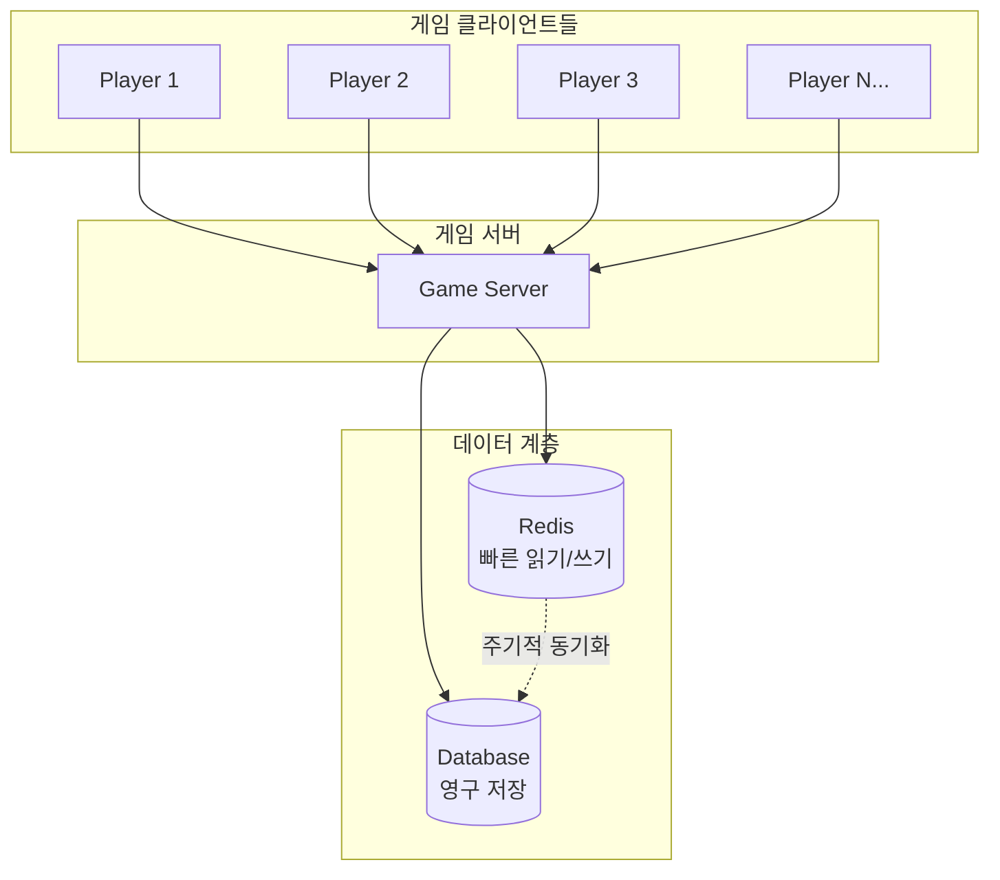

# 1주일만에 배우는 Redis 프로그래밍  

저자: 최흥배, Claude AI   
    
권장 개발 환경
- **IDE**: Visual Studio 2022 (Community 이상)
- **.NET**: 버전 9 이상
- **Redis**: 버전 6 이상

-----   

# Chapter 1. Redis 소개와 설치

## 1.1 Redis란 무엇인가?

### In-Memory 데이터 저장소의 특징
Redis(Remote Dictionary Server)는 오픈소스 기반의 인메모리 데이터 저장소다. 전통적인 데이터베이스가 하드디스크나 SSD에 데이터를 저장하는 것과 달리, Redis는 모든 데이터를 메모리(RAM)에 저장한다. 이러한 특성 덕분에 Redis는 매우 빠른 읽기/쓰기 성능을 제공한다.

```
전통적인 데이터베이스                Redis
┌─────────────────┐              ┌─────────────────┐
│   Application   │              │   Application   │
└────────┬────────┘              └────────┬────────┘
         │                                │
         ▼                                ▼
┌─────────────────┐              ┌─────────────────┐
│      DBMS       │              │      Redis      │
└────────┬────────┘              └────────┬────────┘
         │                                │
         ▼                                ▼
┌─────────────────┐              ┌─────────────────┐
│   Disk/SSD      │              │   Memory(RAM)   │
│   (느림)         │              │   (매우 빠름)    │
└─────────────────┘              └─────────────────┘
```

메모리 기반 저장소는 디스크 I/O가 필요 없기 때문에 마이크로초(µs) 단위의 응답 시간을 제공한다. 일반적으로 Redis는 초당 수십만 건의 요청을 처리할 수 있다.

Redis는 단순한 캐시 저장소를 넘어 다양한 데이터 구조를 지원한다. String, List, Set, Sorted Set, Hash, Bitmap, HyperLogLog 등 풍부한 자료구조를 제공하여 복잡한 데이터 처리도 효율적으로 수행할 수 있다.

또한 Redis는 선택적으로 데이터를 디스크에 저장(Persistence)하는 기능도 제공한다. 이를 통해 서버가 재시작되더라도 데이터를 복구할 수 있다.

### Redis의 장점과 활용 사례
Redis는 다음과 같은 주요 장점을 가진다.

**뛰어난 성능**: 메모리 기반으로 동작하여 밀리초 이하의 응답 시간을 보장한다. 데이터베이스 쿼리 결과를 캐싱하면 데이터베이스 부하를 크게 줄일 수 있다.

**다양한 데이터 구조**: 단순 키-값 저장소가 아니라 리스트, 집합, 정렬된 집합 등 고급 자료구조를 제공한다. 이를 활용하면 복잡한 비즈니스 로직을 Redis 내에서 처리할 수 있다.

**원자성 연산**: 모든 Redis 명령은 원자적(Atomic)으로 실행된다. 여러 클라이언트가 동시에 접근해도 데이터 일관성이 보장된다.

**Pub/Sub 메시징**: 발행-구독 패턴을 지원하여 실시간 메시징 시스템을 구축할 수 있다.

**클러스터링과 복제**: 수평 확장과 고가용성을 위한 클러스터링 및 마스터-슬레이브 복제를 지원한다.

Redis는 다양한 분야에서 활용된다.

- **세션 저장소**: 웹 애플리케이션의 사용자 세션을 저장하고 관리한다.
- **캐싱**: 데이터베이스 쿼리 결과, API 응답 등을 캐싱하여 성능을 향상시킨다.
- **실시간 랭킹**: 게임이나 소셜 미디어의 리더보드를 실시간으로 관리한다.
- **메시지 큐**: 작업 큐나 이벤트 스트림을 구현한다.
- **실시간 분석**: 방문자 수 집계, 클릭 스트림 분석 등을 수행한다.

### 온라인 게임에서 Redis가 필요한 이유
온라인 게임은 실시간성과 높은 동시 접속자 수를 처리해야 하는 특성을 가진다. Redis는 이러한 게임의 요구사항을 충족시키는 이상적인 솔루션이다.



**빠른 세션 관리**: 플레이어가 로그인하면 세션 정보를 Redis에 저장한다. 게임 서버가 여러 대인 경우에도 Redis를 중앙 세션 저장소로 사용하여 어느 서버에서든 플레이어 정보를 즉시 조회할 수 있다.

**실시간 랭킹 시스템**: Sorted Set 자료구조를 사용하면 수백만 명의 플레이어 점수를 관리하고 실시간으로 순위를 조회할 수 있다. 데이터베이스에서 ORDER BY 쿼리로 처리하면 느리지만, Redis는 O(log N) 시간 복잡도로 매우 빠르게 처리한다.

**인벤토리와 게임 데이터 캐싱**: 플레이어의 아이템, 캐릭터 정보 등을 Redis에 캐싱하면 데이터베이스 부하를 줄이고 응답 속도를 높일 수 있다. 자주 조회되는 게임 설정 값이나 이벤트 정보도 Redis에 저장하여 빠르게 제공한다.

**채팅 시스템**: Redis의 Pub/Sub 기능을 활용하면 실시간 채팅, 길드 채팅, 전체 공지 등을 구현할 수 있다.

**이벤트 처리**: 선착순 이벤트나 한정 수량 아이템 판매 시 Redis의 원자적 연산(INCR, DECR)을 사용하면 동시성 문제 없이 정확하게 처리할 수 있다.

**출석 체크**: Bitmap 자료구조를 사용하면 매우 적은 메모리로 수백만 사용자의 월간 출석 정보를 관리할 수 있다.

게임은 읽기 작업이 쓰기 작업보다 훨씬 많다. 플레이어 정보 조회, 랭킹 확인, 친구 목록 조회 등이 빈번하게 발생한다. Redis를 캐시 계층으로 사용하면 데이터베이스의 부담을 크게 줄이면서도 밀리초 단위의 빠른 응답을 제공할 수 있다.
  

## 1.2 Redis 설치 및 환경 설정

### Windows/Linux에 Redis 6.0+ 설치
Redis는 Linux 환경에 최적화되어 있지만 Windows에서도 실행할 수 있다. 여기서는 개발 환경 구축을 위한 설치 방법을 소개한다.

**Windows 환경 설치**

Windows에서 Redis를 실행하는 가장 간단한 방법은 WSL2(Windows Subsystem for Linux)를 사용하는 것이다.

1. WSL2 설치 (PowerShell을 관리자 권한으로 실행)
```powershell
wsl --install
```

2. Ubuntu 배포판 설치 후 WSL 터미널 실행

3. Redis 설치
```bash
sudo apt update
sudo apt install redis-server
```

4. Redis 버전 확인
```bash
redis-server --version
```

Redis 6.0 이상이 설치되었는지 확인한다.

5. Redis 서버 실행
```bash
sudo service redis-server start
```

또 다른 방법은 Memurai를 사용하는 것이다. Memurai는 Windows용 Redis 호환 서버다.

1. https://www.memurai.com/get-memurai 에서 다운로드
2. 설치 후 자동으로 서비스로 등록된다
3. Windows 서비스에서 Memurai가 실행 중인지 확인한다

**Linux 환경 설치**

Ubuntu/Debian 계열:
```bash
sudo apt update
sudo apt install redis-server

# Redis 시작
sudo systemctl start redis-server

# 부팅 시 자동 시작 설정
sudo systemctl enable redis-server
```

CentOS/RHEL 계열:
```bash
sudo yum install epel-release
sudo yum install redis

# Redis 시작
sudo systemctl start redis
sudo systemctl enable redis
```

**Docker를 사용한 설치**

개발 환경에서 가장 간편한 방법은 Docker를 사용하는 것이다.

```bash
# Redis 6.2 최신 버전 다운로드 및 실행
docker run -d \
  --name redis-dev \
  -p 6379:6379 \
  redis:6.2

# Redis CLI 접속
docker exec -it redis-dev redis-cli
```

Docker Compose를 사용하면 더 편리하다. `docker-compose.yml` 파일을 생성한다:

```yaml
version: '3.8'
services:
  redis:
    image: redis:6.2
    container_name: redis-dev
    ports:
      - "6379:6379"
    volumes:
      - redis-data:/data
    command: redis-server --appendonly yes

volumes:
  redis-data:
```

실행:
```bash
docker-compose up -d
```

### Redis CLI 기본 사용법
Redis 서버가 실행 중이면 redis-cli를 통해 접속할 수 있다.

```bash
redis-cli
```

접속에 성공하면 다음과 같은 프롬프트가 나타난다:

```
127.0.0.1:6379>
```

**기본 명령어 실습**

Redis의 가장 기본적인 명령어들을 실습해본다.

```
# 키-값 저장
127.0.0.1:6379> SET player:1001 "PlayerName"
OK

# 값 조회
127.0.0.1:6379> GET player:1001
"PlayerName"

# 숫자 증가
127.0.0.1:6379> SET score:1001 100
OK
127.0.0.1:6379> INCR score:1001
(integer) 101

# 만료 시간 설정 (초 단위)
127.0.0.1:6379> SET session:token123 "user_data" EX 3600
OK

# TTL 확인 (남은 시간)
127.0.0.1:6379> TTL session:token123
(integer) 3595

# 모든 키 조회 (개발 환경에서만 사용)
127.0.0.1:6379> KEYS *
1) "player:1001"
2) "score:1001"
3) "session:token123"

# 키 삭제
127.0.0.1:6379> DEL player:1001
(integer) 1

# 데이터베이스 전체 삭제 (주의!)
127.0.0.1:6379> FLUSHDB
OK
```

**Redis 데이터베이스 선택**

Redis는 기본적으로 16개의 논리적 데이터베이스(0~15번)를 제공한다. 기본은 0번 데이터베이스다.

```
# 1번 데이터베이스로 전환
127.0.0.1:6379> SELECT 1
OK

127.0.0.1:6379[1]> SET test "value in db 1"
OK

# 0번 데이터베이스로 복귀
127.0.0.1:6379[1]> SELECT 0
OK
```

**서버 정보 확인**

```
# Redis 서버 정보 조회
127.0.0.1:6379> INFO

# 특정 섹션만 조회
127.0.0.1:6379> INFO server
127.0.0.1:6379> INFO memory
127.0.0.1:6379> INFO stats

# 현재 연결된 클라이언트 목록
127.0.0.1:6379> CLIENT LIST

# 서버 상태 확인
127.0.0.1:6379> PING
PONG
```

### Redis 서버 설정 파일 이해하기
Redis의 동작은 `redis.conf` 설정 파일로 제어한다. 파일 위치는 운영체제와 설치 방법에 따라 다르다.

- Ubuntu: `/etc/redis/redis.conf`
- Docker: 컨테이너 내부 `/usr/local/etc/redis/redis.conf`

**주요 설정 항목**

개발 환경에서 자주 사용하는 설정들을 살펴본다.

```conf
# 바인딩 주소 (기본값: 127.0.0.1)
# 외부 접속을 허용하려면 0.0.0.0으로 변경
bind 127.0.0.1

# 포트 번호
port 6379

# 백그라운드 실행 여부
daemonize yes

# 최대 메모리 설정 (예: 2GB)
maxmemory 2gb

# 메모리 부족 시 정책
# noeviction: 쓰기 작업 거부
# allkeys-lru: 가장 오래 사용하지 않은 키 삭제
# volatile-lru: 만료 시간이 설정된 키 중 LRU 삭제
maxmemory-policy allkeys-lru

# 데이터 지속성 - RDB 스냅샷
# 900초(15분) 내에 1개 이상 변경 시 저장
save 900 1
save 300 10
save 60 10000

# RDB 파일 이름
dbfilename dump.rdb

# 데이터 저장 디렉토리
dir /var/lib/redis

# AOF (Append Only File) 활성화
appendonly yes
appendfilename "appendonly.aof"

# AOF 동기화 정책
# always: 모든 쓰기마다 동기화 (가장 안전, 느림)
# everysec: 매초 동기화 (권장)
# no: OS에 맡김 (빠름, 덜 안전)
appendfsync everysec

# 로그 레벨
# debug, verbose, notice, warning
loglevel notice

# 로그 파일 경로
logfile /var/log/redis/redis-server.log
```

**개발 환경 권장 설정**

개발 중에는 다음과 같이 설정하는 것이 편리하다.

```conf
# 로컬 개발 환경
bind 127.0.0.1
port 6379
maxmemory 1gb
maxmemory-policy allkeys-lru

# 빠른 재시작을 위해 persistence 비활성화 (선택적)
save ""
appendonly no

# 디버깅을 위한 상세 로그
loglevel debug
```

**설정 변경 방법**

설정 파일을 직접 수정한 후 Redis를 재시작한다:

```bash
# Ubuntu
sudo systemctl restart redis-server

# Docker
docker restart redis-dev
```

또는 런타임에 일부 설정을 변경할 수 있다:

```
127.0.0.1:6379> CONFIG SET maxmemory 2gb
OK

# 현재 설정 조회
127.0.0.1:6379> CONFIG GET maxmemory
1) "maxmemory"
2) "2147483648"

# 메모리에 있는 설정을 파일에 저장
127.0.0.1:6379> CONFIG REWRITE
OK
```
  

## 1.3 C# 프로젝트 설정

### CloudStructures 라이브러리 소개
C#에서 Redis를 사용할 수 있는 여러 라이브러리가 있다. 가장 널리 사용되는 것은 StackExchange.Redis이지만, CloudStructures는 StackExchange.Redis를 기반으로 더 사용하기 쉬운 고수준 API를 제공한다.

CloudStructures의 주요 특징:

**강타입 지원**: 각 Redis 데이터 타입에 대응하는 강타입 클래스를 제공한다. `RedisString<T>`, `RedisHash<T>`, `RedisList<T>` 등을 사용하여 타입 안정성을 보장한다.

**직렬화 내장**: 기본적으로 MessagePack을 사용하여 객체를 자동으로 직렬화/역직렬화한다. JSON이나 다른 직렬화 방식으로도 변경 가능하다.

**비동기 우선**: 모든 메서드가 async/await 패턴을 지원하여 현대적인 C# 개발 방식에 적합하다.

**간결한 API**: StackExchange.Redis보다 더 직관적이고 간결한 API를 제공한다.

```
CloudStructures 구조
┌─────────────────────────────────────┐
│         Your Application            │
│  (강타입 객체로 Redis 사용)          │
└──────────────┬──────────────────────┘
               │
               ▼
┌─────────────────────────────────────┐
│        CloudStructures              │
│  - RedisString<T>                   │
│  - RedisHash<T>                     │
│  - RedisList<T>                     │
│  - RedisSet<T>                      │
│  - RedisSortedSet<T>                │
└──────────────┬──────────────────────┘
               │
               ▼
┌─────────────────────────────────────┐
│      StackExchange.Redis            │
│  (Low-level Redis 클라이언트)        │
└──────────────┬──────────────────────┘
               │
               ▼
┌─────────────────────────────────────┐
│         Redis Server                │
└─────────────────────────────────────┘
```

### NuGet을 통한 CloudStructures 설치
.NET 프로젝트를 생성하고 CloudStructures를 설치한다.

**프로젝트 생성**

```bash
# 콘솔 애플리케이션 생성
dotnet new console -n RedisGameSample
cd RedisGameSample
```

**NuGet 패키지 설치**

```bash
# CloudStructures 설치
dotnet add package CloudStructures

# MessagePack (직렬화용, CloudStructures가 의존)
dotnet add package MessagePack
```

또는 Visual Studio에서 NuGet 패키지 관리자를 통해 설치할 수 있다:

1. 솔루션 탐색기에서 프로젝트 우클릭
2. "NuGet 패키지 관리" 선택
3. "찾아보기" 탭에서 "CloudStructures" 검색
4. 설치

**패키지 확인**

`csproj` 파일에 다음과 같이 추가되었는지 확인한다:

```xml
<Project Sdk="Microsoft.NET.Sdk">

  <PropertyGroup>
    <OutputType>Exe</OutputType>
    <TargetFramework>net6.0</TargetFramework>
  </PropertyGroup>

  <ItemGroup>
    <PackageReference Include="CloudStructures" Version="3.2.0" />
    <PackageReference Include="MessagePack" Version="2.5.140" />
  </ItemGroup>

</Project>
```

### Redis 연결 설정 및 테스트
CloudStructures를 사용하여 Redis에 연결하고 기본 작업을 수행해본다.

**기본 연결 설정**

`Program.cs` 파일을 다음과 같이 작성한다:

```csharp
using CloudStructures;
using CloudStructures.Structures;
using System;
using System.Threading.Tasks;

namespace RedisGameSample
{
    class Program
    {
        static async Task Main(string[] args)
        {
            // Redis 연결 설정
            var config = new RedisConfig("default", "localhost:6379");
            var connection = new RedisConnection(config);

            Console.WriteLine("Redis 연결 테스트를 시작한다.");

            // 연결 테스트
            await TestConnection(connection);
            
            // String 타입 테스트
            await TestString(connection);
            
            // Hash 타입 테스트
            await TestHash(connection);

            Console.WriteLine("모든 테스트가 완료되었다.");
        }

        static async Task TestConnection(RedisConnection connection)
        {
            try
            {
                var redis = new RedisString<string>(connection, "test:connection", null);
                await redis.SetAsync("Connection OK!");
                var value = await redis.GetAsync();
                
                Console.WriteLine($"연결 상태: {value.Value}");
            }
            catch (Exception ex)
            {
                Console.WriteLine($"연결 실패: {ex.Message}");
            }
        }

        static async Task TestString(RedisConnection connection)
        {
            Console.WriteLine("\n=== String 타입 테스트 ===");
            
            // 플레이어 이름 저장
            var playerName = new RedisString<string>(connection, "player:1001:name", null);
            await playerName.SetAsync("DragonSlayer");
            
            var name = await playerName.GetAsync();
            Console.WriteLine($"플레이어 이름: {name.Value}");
            
            // 점수 저장 및 증가
            var score = new RedisString<int>(connection, "player:1001:score", null);
            await score.SetAsync(100);
            await score.IncrementAsync(50);
            
            var currentScore = await score.GetAsync();
            Console.WriteLine($"현재 점수: {currentScore.Value}");
            
            // 만료 시간 설정 (10초)
            var session = new RedisString<string>(
                connection, 
                "session:abc123", 
                TimeSpan.FromSeconds(10)
            );
            await session.SetAsync("Session Data");
            
            var ttl = await session.TimeToLiveAsync();
            Console.WriteLine($"세션 TTL: {ttl?.TotalSeconds}초");
        }

        static async Task TestHash(RedisConnection connection)
        {
            Console.WriteLine("\n=== Hash 타입 테스트 ===");
            
            // 플레이어 정보를 Hash로 저장
            var playerInfo = new RedisHash<string>(connection, "player:1001:info", null);
            
            await playerInfo.SetAsync("Level", "10");
            await playerInfo.SetAsync("Gold", "5000");
            await playerInfo.SetAsync("Class", "Warrior");
            
            // 개별 필드 조회
            var level = await playerInfo.GetAsync("Level");
            var gold = await playerInfo.GetAsync("Gold");
            
            Console.WriteLine($"레벨: {level.Value}");
            Console.WriteLine($"골드: {gold.Value}");
            
            // 전체 필드 조회
            var allFields = await playerInfo.GetAllAsync();
            Console.WriteLine("\n전체 플레이어 정보:");
            foreach (var field in allFields.Value)
            {
                Console.WriteLine($"  {field.Key}: {field.Value}");
            }
        }
    }
}
```

**실행 결과**

프로그램을 실행하면 다음과 같은 출력을 볼 수 있다:

```
Redis 연결 테스트를 시작한다.
연결 상태: Connection OK!

=== String 타입 테스트 ===
플레이어 이름: DragonSlayer
현재 점수: 150
세션 TTL: 9.999초

=== Hash 타입 테스트 ===
레벨: 10
골드: 5000

전체 플레이어 정보:
  Level: 10
  Gold: 5000
  Class: Warrior

모든 테스트가 완료되었다.
```

**강타입 객체 사용**

CloudStructures의 강력한 기능 중 하나는 사용자 정의 클래스를 직접 저장할 수 있다는 점이다.

```csharp
using MessagePack;
using CloudStructures;
using CloudStructures.Structures;
using System;
using System.Threading.Tasks;

namespace RedisGameSample
{
    // MessagePack으로 직렬화할 수 있도록 속성 추가
    [MessagePackObject]
    public class PlayerData
    {
        [Key(0)]
        public long PlayerId { get; set; }
        
        [Key(1)]
        public string PlayerName { get; set; }
        
        [Key(2)]
        public int Level { get; set; }
        
        [Key(3)]
        public int Gold { get; set; }
        
        [Key(4)]
        public DateTime LastLoginTime { get; set; }
    }

    class Program
    {
        static async Task Main(string[] args)
        {
            var config = new RedisConfig("default", "localhost:6379");
            var connection = new RedisConnection(config);

            await TestPlayerData(connection);
        }

        static async Task TestPlayerData(RedisConnection connection)
        {
            Console.WriteLine("=== 강타입 객체 테스트 ===");
            
            // PlayerData 객체 생성
            var player = new PlayerData
            {
                PlayerId = 1001,
                PlayerName = "DragonSlayer",
                Level = 10,
                Gold = 5000,
                LastLoginTime = DateTime.Now
            };
            
            // Redis에 저장 (1시간 만료)
            var redisPlayer = new RedisString<PlayerData>(
                connection, 
                $"player:data:{player.PlayerId}", 
                TimeSpan.FromHours(1)
            );
            
            await redisPlayer.SetAsync(player);
            Console.WriteLine("플레이어 데이터를 Redis에 저장했다.");
            
            // Redis에서 조회
            var result = await redisPlayer.GetAsync();
            if (result.HasValue)
            {
                var loadedPlayer = result.Value;
                Console.WriteLine($"\n조회된 플레이어 정보:");
                Console.WriteLine($"  ID: {loadedPlayer.PlayerId}");
                Console.WriteLine($"  이름: {loadedPlayer.PlayerName}");
                Console.WriteLine($"  레벨: {loadedPlayer.Level}");
                Console.WriteLine($"  골드: {loadedPlayer.Gold}");
                Console.WriteLine($"  마지막 로그인: {loadedPlayer.LastLoginTime}");
            }
        }
    }
}
```

**연결 풀 설정**

실제 프로덕션 환경에서는 연결 풀을 적절히 설정해야 한다.

```csharp
var config = new RedisConfig("default", new RedisConfiguration
{
    Endpoints = new[] { "localhost:6379" },
    ConnectTimeout = 5000,        // 연결 타임아웃 (ms)
    SyncTimeout = 5000,            // 동기 작업 타임아웃 (ms)
    AsyncTimeout = 5000,           // 비동기 작업 타임아웃 (ms)
    AllowAdmin = false,            // 관리 명령 허용 여부
    AbortOnConnectFail = false,    // 연결 실패 시 중단 여부
});

var connection = new RedisConnection(config);
```

**다중 Redis 서버 연결**

여러 Redis 서버를 사용하는 경우 각각 다른 이름으로 연결을 관리할 수 있다.

```csharp
// 세션용 Redis
var sessionConfig = new RedisConfig("session", "redis-session:6379");
var sessionConnection = new RedisConnection(sessionConfig);

// 캐시용 Redis
var cacheConfig = new RedisConfig("cache", "redis-cache:6379");
var cacheConnection = new RedisConnection(cacheConfig);

// 사용
var sessionData = new RedisString<string>(sessionConnection, "session:123", null);
var cacheData = new RedisString<string>(cacheConnection, "cache:player:1001", null);
```

이제 Redis가 설치되고 C# 프로젝트에서 CloudStructures를 통해 Redis에 연결할 수 있게 되었다. 다음 장에서는 Redis의 내부 구조와 다양한 데이터 타입을 자세히 살펴본다.  