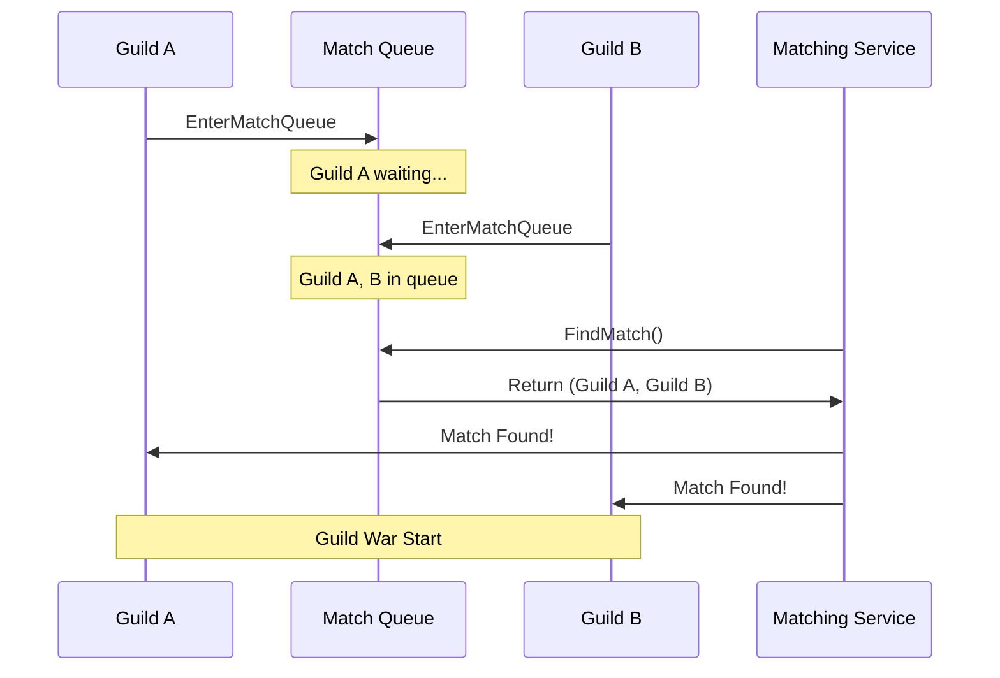

# 1주일만에 배우는 Redis 프로그래밍  

저자: 최흥배, Claude AI   
    
권장 개발 환경
- **IDE**: Visual Studio 2022 (Community 이상)
- **.NET**: 버전 9 이상
- **Redis**: 버전 6 이상

-----   

# Chapter 5. 경쟁 시스템 구축
온라인 게임에서 경쟁 시스템은 플레이어의 참여도와 재미를 높이는 핵심 요소다. 실시간으로 변화하는 랭킹을 빠르게 조회하고 업데이트해야 하므로, 관계형 데이터베이스만으로는 성능 문제가 발생한다. Redis의 Sorted Set은 이러한 랭킹 시스템을 구현하기에 최적의 자료구조다. 이번 장에서는 개인 랭킹부터 시즌별 랭킹, 길드 랭킹까지 다양한 경쟁 시스템을 Redis로 구축하는 방법을 배운다.

## 5.1 실시간 랭킹 시스템

### Sorted Set의 이해
Sorted Set은 각 멤버(member)에 점수(score)를 부여하여 자동으로 정렬을 유지하는 자료구조다. 내부적으로 Skip List와 Hash Table을 함께 사용하여 O(log N) 시간 복잡도로 삽입, 삭제, 조회가 가능하다.

```
Sorted Set 내부 구조 (개념도)

Score: 100  200  300  450  600  750
       |    |    |    |    |    |
User:  U1   U2   U3   U4   U5   U6

- 점수 순으로 자동 정렬
- 빠른 범위 조회 (상위 N명, 특정 구간)
- 개별 사용자 순위 조회 O(log N)
```

### CloudStructures로 리더보드 구현
먼저 플레이어의 점수를 저장하고 조회하는 기본적인 랭킹 시스템을 구현한다.

```csharp
using CloudStructures;
using CloudStructures.Structures;
using StackExchange.Redis;

public class RankingService
{
    private readonly RedisConnection _connection;
    private const string RANKING_KEY = "ranking:global";

    public RankingService(RedisConnection connection)
    {
        _connection = connection;
    }

    // 플레이어 점수 업데이트
    public async Task<bool> UpdateScore(string playerId, long score)
    {
        var sortedSet = new RedisSortedSet<string>(_connection, RANKING_KEY, null);
        
        // ZADD: 점수 추가/업데이트
        return await sortedSet.Add(playerId, score);
    }

    // 점수 증가 (상대값)
    public async Task<double> IncrementScore(string playerId, long increment)
    {
        var sortedSet = new RedisSortedSet<string>(_connection, RANKING_KEY, null);
        
        // ZINCRBY: 기존 점수에 더하기
        return await sortedSet.Increment(playerId, increment);
    }

    // 특정 플레이어의 점수 조회
    public async Task<double?> GetScore(string playerId)
    {
        var sortedSet = new RedisSortedSet<string>(_connection, RANKING_KEY, null);
        
        // ZSCORE: 점수 조회
        return await sortedSet.Score(playerId);
    }

    // 특정 플레이어의 순위 조회 (0부터 시작)
    public async Task<long?> GetRank(string playerId)
    {
        var sortedSet = new RedisSortedSet<string>(_connection, RANKING_KEY, null);
        
        // ZREVRANK: 높은 점수부터의 순위
        var rank = await sortedSet.ReverseRank(playerId);
        return rank;
    }

    // 전체 랭커 수 조회
    public async Task<long> GetTotalCount()
    {
        var sortedSet = new RedisSortedSet<string>(_connection, RANKING_KEY, null);
        
        // ZCARD: 전체 멤버 수
        return await sortedSet.Length();
    }
}
```

### 상위 랭커 조회
게임 로비나 랭킹 화면에서 보여줄 상위 랭커 목록을 조회한다.

```csharp
public class RankingEntry
{
    public string PlayerId { get; set; }
    public long Score { get; set; }
    public int Rank { get; set; }
}

public async Task<List<RankingEntry>> GetTopRankers(int count = 100)
{
    var sortedSet = new RedisSortedSet<string>(_connection, RANKING_KEY, null);
    
    // ZREVRANGE WITHSCORES: 상위 N명 조회 (점수 포함)
    var result = await sortedSet.RangeByRankWithScores(0, count - 1, Order.Descending);
    
    var rankings = new List<RankingEntry>();
    int rank = 1;
    
    foreach (var entry in result)
    {
        rankings.Add(new RankingEntry
        {
            PlayerId = entry.Value,
            Score = (long)entry.Score,
            Rank = rank++
        });
    }
    
    return rankings;
}

// 특정 점수 범위의 플레이어 조회
public async Task<List<RankingEntry>> GetRankersByScoreRange(long minScore, long maxScore)
{
    var sortedSet = new RedisSortedSet<string>(_connection, RANKING_KEY, null);
    
    // ZRANGEBYSCORE: 점수 범위로 조회
    var result = await sortedSet.RangeByScoreWithScores(
        minScore, maxScore, 
        order: Order.Descending
    );
    
    var rankings = new List<RankingEntry>();
    
    foreach (var entry in result)
    {
        var rank = await GetRank(entry.Value);
        rankings.Add(new RankingEntry
        {
            PlayerId = entry.Value,
            Score = (long)entry.Score,
            Rank = (int)(rank.HasValue ? rank.Value + 1 : 0)
        });
    }
    
    return rankings;
}
```

### 내 순위 주변 조회
플레이어는 자신의 순위와 함께 바로 위, 아래 순위의 경쟁자를 보고 싶어한다.

```csharp
public async Task<List<RankingEntry>> GetRankingAroundMe(string playerId, int range = 5)
{
    var sortedSet = new RedisSortedSet<string>(_connection, RANKING_KEY, null);
    
    // 내 순위 확인
    var myRank = await sortedSet.ReverseRank(playerId);
    if (!myRank.HasValue)
    {
        return new List<RankingEntry>();
    }
    
    // 내 순위 기준 위아래 range명씩 조회
    long startRank = Math.Max(0, myRank.Value - range);
    long endRank = myRank.Value + range;
    
    var result = await sortedSet.RangeByRankWithScores(
        startRank, endRank, 
        Order.Descending
    );
    
    var rankings = new List<RankingEntry>();
    int rank = (int)startRank + 1;
    
    foreach (var entry in result)
    {
        rankings.Add(new RankingEntry
        {
            PlayerId = entry.Value,
            Score = (long)entry.Score,
            Rank = rank++
        });
    }
    
    return rankings;
}
```

### 대량 점수 업데이트 최적화
많은 플레이어의 점수를 동시에 업데이트할 때는 Pipeline을 사용하여 성능을 개선한다.

```csharp
public async Task BatchUpdateScores(Dictionary<string, long> playerScores)
{
    var database = _connection.GetConnection().GetDatabase();
    var batch = database.CreateBatch();
    
    var tasks = new List<Task>();
    
    foreach (var kvp in playerScores)
    {
        // 각 ZADD 명령을 배치에 추가
        tasks.Add(batch.SortedSetAddAsync(RANKING_KEY, kvp.Key, kvp.Value));
    }
    
    // 배치 실행
    batch.Execute();
    
    // 모든 작업 완료 대기
    await Task.WhenAll(tasks);
}
```

```
Pipeline 처리 흐름

Without Pipeline:          With Pipeline:
┌─────────┐               ┌─────────┐
│ Client  │               │ Client  │
└────┬────┘               └────┬────┘
     │ ZADD player1           │ ZADD player1
     ├──────────►             │ ZADD player2
     │ ◄──────────             │ ZADD player3
     │ ZADD player2           ├──────────►
     ├──────────►             │ ◄──────────
     │ ◄──────────             │ (3개 응답 한번에)
     │ ZADD player3           │
     ├──────────►             │
     │ ◄──────────             │
┌────▼────┐               ┌────▼────┐
│  Redis  │               │  Redis  │
└─────────┘               └─────────┘

네트워크 왕복: 3회      네트워크 왕복: 1회
```

## 5.2 시즌별 랭킹 관리

### 키 네이밍 전략
게임에서는 보통 일간, 주간, 월간, 시즌별로 랭킹을 운영한다. 효율적인 키 네이밍 전략이 중요하다.

```csharp
public class SeasonalRankingService
{
    private readonly RedisConnection _connection;

    // 키 생성 전략
    private string GetRankingKey(RankingPeriod period, DateTime date)
    {
        return period switch
        {
            RankingPeriod.Daily => $"ranking:daily:{date:yyyyMMdd}",
            RankingPeriod.Weekly => $"ranking:weekly:{GetWeekOfYear(date)}",
            RankingPeriod.Monthly => $"ranking:monthly:{date:yyyyMM}",
            RankingPeriod.Season => $"ranking:season:{GetSeasonId(date)}",
            _ => "ranking:global"
        };
    }

    private string GetWeekOfYear(DateTime date)
    {
        var culture = System.Globalization.CultureInfo.CurrentCulture;
        var weekNum = culture.Calendar.GetWeekOfYear(
            date, 
            System.Globalization.CalendarWeekRule.FirstDay,
            DayOfWeek.Monday
        );
        return $"{date.Year}W{weekNum:D2}";
    }

    private string GetSeasonId(DateTime date)
    {
        // 예: 3개월 단위 시즌
        int season = ((date.Month - 1) / 3) + 1;
        return $"{date.Year}S{season}";
    }

    public async Task<bool> UpdateScore(
        string playerId, 
        long score, 
        RankingPeriod period,
        DateTime? targetDate = null)
    {
        var date = targetDate ?? DateTime.UtcNow;
        var key = GetRankingKey(period, date);
        
        var sortedSet = new RedisSortedSet<string>(_connection, key, null);
        return await sortedSet.Add(playerId, score);
    }
}

public enum RankingPeriod
{
    Daily,
    Weekly,
    Monthly,
    Season,
    Global
}
```

### 랭킹 초기화 및 보상 처리
시즌이 종료되면 랭킹을 저장하고 새 시즌을 시작한다.

```csharp
public class RankingRewardService
{
    private readonly RedisConnection _connection;
    
    // 시즌 종료 시 최종 랭킹 백업
    public async Task<List<RankingEntry>> ArchiveSeasonRanking(DateTime seasonEndDate)
    {
        var seasonKey = GetRankingKey(RankingPeriod.Season, seasonEndDate);
        var archiveKey = $"{seasonKey}:archive";
        
        var database = _connection.GetConnection().GetDatabase();
        
        // 전체 랭킹 조회
        var sortedSet = new RedisSortedSet<string>(_connection, seasonKey, null);
        var allRankers = await sortedSet.RangeByRankWithScores(
            0, -1, 
            Order.Descending
        );
        
        var rankings = new List<RankingEntry>();
        int rank = 1;
        
        foreach (var entry in allRankers)
        {
            rankings.Add(new RankingEntry
            {
                PlayerId = entry.Value,
                Score = (long)entry.Score,
                Rank = rank++
            });
        }
        
        // 아카이브 키로 복사
        await database.KeyCopyAsync(seasonKey, archiveKey);
        
        // 원본 키에 만료 시간 설정 (30일)
        await database.KeyExpireAsync(seasonKey, TimeSpan.FromDays(30));
        
        return rankings;
    }

    // 보상 등급 결정
    public RewardTier GetRewardTier(int rank, long totalPlayers)
    {
        double percentile = (double)rank / totalPlayers * 100;
        
        return percentile switch
        {
            <= 1 => RewardTier.Diamond,      // 상위 1%
            <= 5 => RewardTier.Platinum,     // 상위 5%
            <= 10 => RewardTier.Gold,        // 상위 10%
            <= 30 => RewardTier.Silver,      // 상위 30%
            _ => RewardTier.Bronze
        };
    }

    // 보상 지급 및 기록
    public async Task DistributeSeasonRewards(List<RankingEntry> rankings)
    {
        var rewardKey = $"rewards:season:{DateTime.UtcNow:yyyyMM}";
        var redisHash = new RedisHash<RewardRecord>(_connection, rewardKey, null);
        
        long totalPlayers = rankings.Count;
        
        foreach (var entry in rankings)
        {
            var tier = GetRewardTier(entry.Rank, totalPlayers);
            var reward = new RewardRecord
            {
                PlayerId = entry.PlayerId,
                Rank = entry.Rank,
                Score = entry.Score,
                Tier = tier,
                RewardedAt = DateTime.UtcNow
            };
            
            await redisHash.Set($"player:{entry.PlayerId}", reward);
            
            // 실제 보상 지급 로직은 여기서 처리
            // (게임 아이템, 재화 등을 DB에 기록)
        }
        
        // 보상 기록 7일간 보관
        await redisHash.Expire(TimeSpan.FromDays(7));
    }
}

public class RewardRecord
{
    public string PlayerId { get; set; }
    public int Rank { get; set; }
    public long Score { get; set; }
    public RewardTier Tier { get; set; }
    public DateTime RewardedAt { get; set; }
}

public enum RewardTier
{
    Bronze,
    Silver,
    Gold,
    Platinum,
    Diamond
}
```

### 페이지네이션 구현
수만 명의 랭커를 한 번에 조회하면 성능 문제가 발생한다. 페이지 단위로 나누어 조회한다.

```csharp
public class RankingPage
{
    public List<RankingEntry> Entries { get; set; }
    public int CurrentPage { get; set; }
    public int PageSize { get; set; }
    public long TotalCount { get; set; }
    public int TotalPages => (int)Math.Ceiling((double)TotalCount / PageSize);
}

public async Task<RankingPage> GetRankingPage(
    RankingPeriod period, 
    int page = 1, 
    int pageSize = 50)
{
    var key = GetRankingKey(period, DateTime.UtcNow);
    var sortedSet = new RedisSortedSet<string>(_connection, key, null);
    
    // 전체 개수 조회
    long totalCount = await sortedSet.Length();
    
    // 페이지 범위 계산
    long start = (page - 1) * pageSize;
    long end = start + pageSize - 1;
    
    // 해당 페이지 데이터 조회
    var result = await sortedSet.RangeByRankWithScores(
        start, end, 
        Order.Descending
    );
    
    var entries = new List<RankingEntry>();
    int rank = (int)start + 1;
    
    foreach (var entry in result)
    {
        entries.Add(new RankingEntry
        {
            PlayerId = entry.Value,
            Score = (long)entry.Score,
            Rank = rank++
        });
    }
    
    return new RankingPage
    {
        Entries = entries,
        CurrentPage = page,
        PageSize = pageSize,
        TotalCount = totalCount
    };
}
```

## 5.3 길드/클랜 랭킹

### 길드 점수 집계 방식
길드 랭킹은 두 가지 방식으로 구현할 수 있다.

```
방식 1: 멤버 점수 합산
┌────────────┐
│  Guild A   │  Members: 10명
│  Score: ?  │  Sum: 5000점
└────────────┘

방식 2: 길드 활동 점수
┌────────────┐
│  Guild A   │  Activities:
│  Score: ?  │  - 레이드 클리어: +100
└────────────┘  - PvP 승리: +50
```

멤버 점수를 실시간으로 합산하는 방식을 구현한다.

```csharp
public class GuildRankingService
{
    private readonly RedisConnection _connection;
    private const string GUILD_RANKING_KEY = "ranking:guild";
    private const string GUILD_MEMBERS_PREFIX = "guild:members:";

    // 길드 멤버 점수 업데이트
    public async Task UpdateMemberScore(string guildId, string playerId, long score)
    {
        var memberKey = $"{GUILD_MEMBERS_PREFIX}{guildId}";
        var memberSet = new RedisSortedSet<string>(_connection, memberKey, null);
        
        // 이전 점수 조회
        var oldScore = await memberSet.Score(playerId);
        
        // 멤버 점수 업데이트
        await memberSet.Add(playerId, score);
        
        // 길드 총점 업데이트
        var scoreDiff = score - (oldScore ?? 0);
        await IncrementGuildScore(guildId, scoreDiff);
    }

    private async Task IncrementGuildScore(string guildId, double scoreDiff)
    {
        var guildRanking = new RedisSortedSet<string>(_connection, GUILD_RANKING_KEY, null);
        await guildRanking.Increment(guildId, scoreDiff);
    }

    // 길드 전체 점수 재계산 (정합성 보장)
    public async Task RecalculateGuildScore(string guildId)
    {
        var memberKey = $"{GUILD_MEMBERS_PREFIX}{guildId}";
        var memberSet = new RedisSortedSet<string>(_connection, memberKey, null);
        
        // 모든 멤버 점수 합산
        var members = await memberSet.RangeByRankWithScores(0, -1);
        double totalScore = members.Sum(m => m.Score);
        
        // 길드 랭킹에 반영
        var guildRanking = new RedisSortedSet<string>(_connection, GUILD_RANKING_KEY, null);
        await guildRanking.Add(guildId, totalScore);
    }

    // 상위 길드 조회
    public async Task<List<GuildRankingEntry>> GetTopGuilds(int count = 100)
    {
        var guildRanking = new RedisSortedSet<string>(_connection, GUILD_RANKING_KEY, null);
        var result = await guildRanking.RangeByRankWithScores(0, count - 1, Order.Descending);
        
        var rankings = new List<GuildRankingEntry>();
        int rank = 1;
        
        foreach (var entry in result)
        {
            rankings.Add(new GuildRankingEntry
            {
                GuildId = entry.Value,
                TotalScore = (long)entry.Score,
                Rank = rank++
            });
        }
        
        return rankings;
    }
}

public class GuildRankingEntry
{
    public string GuildId { get; set; }
    public long TotalScore { get; set; }
    public int Rank { get; set; }
    public int MemberCount { get; set; }
}
```

### 멤버 기여도 추적
길드 내에서 각 멤버의 기여도를 추적하여 보상 분배에 활용한다.

```csharp
public class GuildContributionService
{
    private readonly RedisConnection _connection;

    // 길드 내 멤버 기여도 조회
    public async Task<List<MemberContribution>> GetGuildContributions(string guildId)
    {
        var memberKey = $"guild:members:{guildId}";
        var memberSet = new RedisSortedSet<string>(_connection, memberKey, null);
        
        var members = await memberSet.RangeByRankWithScores(0, -1, Order.Descending);
        
        var contributions = new List<MemberContribution>();
        int rank = 1;
        
        foreach (var member in members)
        {
            contributions.Add(new MemberContribution
            {
                PlayerId = member.Value,
                Score = (long)member.Score,
                Rank = rank++
            });
        }
        
        return contributions;
    }

    // 특정 멤버의 길드 내 순위
    public async Task<long?> GetMemberRankInGuild(string guildId, string playerId)
    {
        var memberKey = $"guild:members:{guildId}";
        var memberSet = new RedisSortedSet<string>(_connection, memberKey, null);
        
        var rank = await memberSet.ReverseRank(playerId);
        return rank.HasValue ? rank.Value + 1 : null;
    }

    // 길드 멤버 제거 시 점수 차감
    public async Task RemoveMember(string guildId, string playerId)
    {
        var memberKey = $"guild:members:{guildId}";
        var memberSet = new RedisSortedSet<string>(_connection, memberKey, null);
        
        // 멤버 점수 조회
        var memberScore = await memberSet.Score(playerId);
        
        if (memberScore.HasValue)
        {
            // 멤버 제거
            await memberSet.Remove(playerId);
            
            // 길드 총점에서 차감
            var guildRanking = new RedisSortedSet<string>(
                _connection, 
                "ranking:guild", 
                null
            );
            await guildRanking.Increment(guildId, -memberScore.Value);
        }
    }

    // 상위 기여자 보상
    public async Task<List<MemberContribution>> GetTopContributors(
        string guildId, 
        int count = 10)
    {
        var memberKey = $"guild:members:{guildId}";
        var memberSet = new RedisSortedSet<string>(_connection, memberKey, null);
        
        var topMembers = await memberSet.RangeByRankWithScores(
            0, count - 1, 
            Order.Descending
        );
        
        var contributors = new List<MemberContribution>();
        int rank = 1;
        
        foreach (var member in topMembers)
        {
            contributors.Add(new MemberContribution
            {
                PlayerId = member.Value,
                Score = (long)member.Score,
                Rank = rank++
            });
        }
        
        return contributors;
    }
}

public class MemberContribution
{
    public string PlayerId { get; set; }
    public long Score { get; set; }
    public int Rank { get; set; }
}
```

### 길드 전쟁 매칭 시스템
비슷한 수준의 길드끼리 매칭하는 시스템을 구현한다.

```csharp
public class GuildWarMatchingService
{
    private readonly RedisConnection _connection;

    // 점수대가 비슷한 길드 찾기
    public async Task<List<string>> FindMatchingGuilds(
        string guildId, 
        double scoreRange = 1000)
    {
        var guildRanking = new RedisSortedSet<string>(
            _connection, 
            "ranking:guild", 
            null
        );
        
        // 내 길드 점수 조회
        var myScore = await guildRanking.Score(guildId);
        if (!myScore.HasValue)
        {
            return new List<string>();
        }
        
        // 점수 범위 내 길드 조회
        var minScore = myScore.Value - scoreRange;
        var maxScore = myScore.Value + scoreRange;
        
        var matchingGuilds = await guildRanking.RangeByScore(
            minScore, 
            maxScore, 
            order: Order.Ascending
        );
        
        // 자기 자신 제외
        return matchingGuilds.Where(g => g != guildId).ToList();
    }

    // 매칭 대기열 등록
    public async Task<bool> EnterMatchQueue(string guildId, DateTime expireAt)
    {
        var queueKey = "guildwar:queue";
        var queue = new RedisSortedSet<string>(_connection, queueKey, null);
        
        // 등록 시간을 점수로 사용 (FIFO)
        var timestamp = DateTimeOffset.UtcNow.ToUnixTimeSeconds();
        await queue.Add(guildId, timestamp);
        
        // 만료 시간 설정
        var ttl = expireAt - DateTime.UtcNow;
        await queue.Expire(ttl);
        
        return true;
    }

    // 매칭 가능한 길드 찾기
    public async Task<(string Guild1, string Guild2)?> FindMatch()
    {
        var queueKey = "guildwar:queue";
        var queue = new RedisSortedSet<string>(_connection, queueKey, null);
        
        // 대기 중인 길드 2개 이상 필요
        var count = await queue.Length();
        if (count < 2)
        {
            return null;
        }
        
        // 가장 오래 대기한 2개 길드
        var guilds = await queue.RangeByRank(0, 1, Order.Ascending);
        
        if (guilds.Length == 2)
        {
            // 매칭 성공 시 대기열에서 제거
            await queue.Remove(guilds[0]);
            await queue.Remove(guilds[1]);
            
            return (guilds[0], guilds[1]);
        }
        
        return null;
    }
}
```



### 실전 예제: 종합 랭킹 시스템
지금까지 배운 내용을 종합하여 완전한 랭킹 시스템을 구현한다.

```csharp
public class ComprehensiveRankingService
{
    private readonly RedisConnection _connection;

    // 게임 플레이 후 점수 업데이트
    public async Task<RankingUpdateResult> OnGameComplete(
        string playerId, 
        string guildId, 
        long earnedScore)
    {
        var database = _connection.GetConnection().GetDatabase();
        var batch = database.CreateBatch();
        
        var tasks = new List<Task>();
        
        // 1. 글로벌 랭킹 업데이트
        tasks.Add(batch.SortedSetIncrementAsync(
            "ranking:global", 
            playerId, 
            earnedScore
        ));
        
        // 2. 일간 랭킹 업데이트
        var dailyKey = $"ranking:daily:{DateTime.UtcNow:yyyyMMdd}";
        tasks.Add(batch.SortedSetIncrementAsync(
            dailyKey, 
            playerId, 
            earnedScore
        ));
        tasks.Add(batch.KeyExpireAsync(dailyKey, TimeSpan.FromDays(7)));
        
        // 3. 길드 멤버 점수 업데이트
        if (!string.IsNullOrEmpty(guildId))
        {
            var memberKey = $"guild:members:{guildId}";
            tasks.Add(batch.SortedSetIncrementAsync(
                memberKey, 
                playerId, 
                earnedScore
            ));
            
            // 길드 총점 업데이트
            tasks.Add(batch.SortedSetIncrementAsync(
                "ranking:guild", 
                guildId, 
                earnedScore
            ));
        }
        
        batch.Execute();
        await Task.WhenAll(tasks);
        
        // 업데이트된 정보 조회
        var globalRank = await GetRank("ranking:global", playerId);
        var dailyRank = await GetRank(dailyKey, playerId);
        
        return new RankingUpdateResult
        {
            PlayerId = playerId,
            GlobalRank = globalRank,
            DailyRank = dailyRank,
            EarnedScore = earnedScore
        };
    }

    private async Task<long?> GetRank(string key, string member)
    {
        var sortedSet = new RedisSortedSet<string>(_connection, key, null);
        var rank = await sortedSet.ReverseRank(member);
        return rank.HasValue ? rank.Value + 1 : null;
    }
}

public class RankingUpdateResult
{
    public string PlayerId { get; set; }
    public long? GlobalRank { get; set; }
    public long? DailyRank { get; set; }
    public long EarnedScore { get; set; }
}
```

### 성능 고려사항
대규모 랭킹 시스템을 운영할 때 주의할 점들을 정리한다.

```csharp
public class RankingPerformanceTips
{
    // ✓ 좋은 예: 필요한 범위만 조회
    public async Task<List<RankingEntry>> GetTopRankersGood()
    {
        var sortedSet = new RedisSortedSet<string>(
            _connection, 
            "ranking:global", 
            null
        );
        
        // 상위 100명만 조회
        return await GetRankersByRange(0, 99);
    }

    // ✗ 나쁜 예: 전체 조회 후 필터링
    public async Task<List<RankingEntry>> GetTopRankersBad()
    {
        var sortedSet = new RedisSortedSet<string>(
            _connection, 
            "ranking:global", 
            null
        );
        
        // 전체 조회 (수백만 건이면 매우 느림)
        var all = await sortedSet.RangeByRank(0, -1, Order.Descending);
        return all.Take(100).Select((item, index) => new RankingEntry
        {
            PlayerId = item,
            Rank = index + 1
        }).ToList();
    }

    // ✓ 좋은 예: 키에 만료 시간 설정
    public async Task CreateDailyRanking()
    {
        var key = $"ranking:daily:{DateTime.UtcNow:yyyyMMdd}";
        var sortedSet = new RedisSortedSet<string>(_connection, key, null);
        
        // 7일 후 자동 삭제
        await sortedSet.Expire(TimeSpan.FromDays(7));
    }

    // ✓ 좋은 예: 점수 범위로 효율적 조회
    public async Task<long> CountPlayersInRange(long minScore, long maxScore)
    {
        var sortedSet = new RedisSortedSet<string>(
            _connection, 
            "ranking:global", 
            null
        );
        
        // ZCOUNT: O(log N) 시간 복잡도
        return await sortedSet.LengthByValue(minScore, maxScore);
    }

    private async Task<List<RankingEntry>> GetRankersByRange(long start, long end)
    {
        var sortedSet = new RedisSortedSet<string>(
            _connection, 
            "ranking:global", 
            null
        );
        var result = await sortedSet.RangeByRankWithScores(
            start, end, 
            Order.Descending
        );
        
        var rankings = new List<RankingEntry>();
        int rank = (int)start + 1;
        
        foreach (var entry in result)
        {
            rankings.Add(new RankingEntry
            {
                PlayerId = entry.Value,
                Score = (long)entry.Score,
                Rank = rank++
            });
        }
        
        return rankings;
    }

    private readonly RedisConnection _connection;
    
    public RankingPerformanceTips(RedisConnection connection)
    {
        _connection = connection;
    }
}
```

이번 장에서는 Redis Sorted Set을 활용하여 다양한 경쟁 시스템을 구축하는 방법을 배웠다. 실시간 랭킹 조회와 업데이트, 시즌별 랭킹 관리, 길드 랭킹 시스템까지 모두 Redis의 강력한 정렬 기능을 기반으로 한다. 다음 장에서는 Pub/Sub을 활용한 실시간 통신 시스템을 구현한다.  