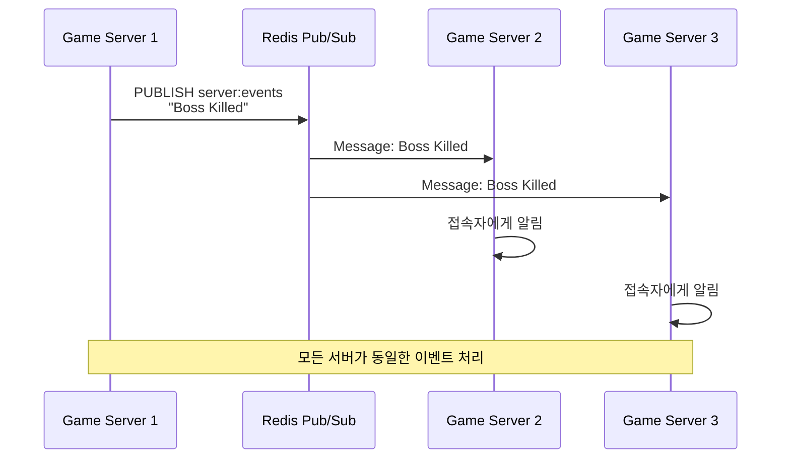
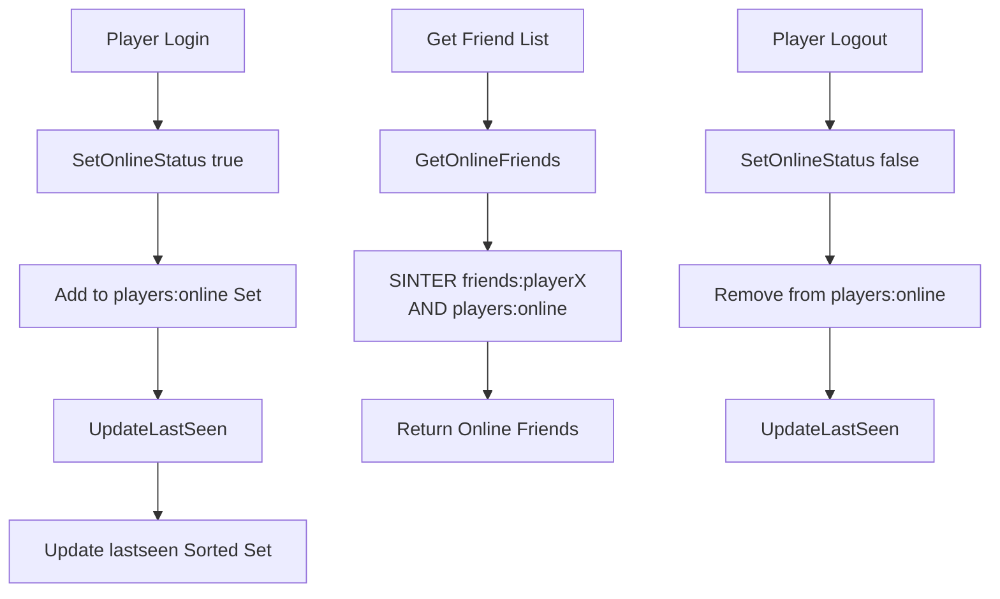

# 1주일만에 배우는 Redis 프로그래밍  

저자: 최흥배, Claude AI   
    
권장 개발 환경
- **IDE**: Visual Studio 2022 (Community 이상)
- **.NET**: 버전 9 이상
- **Redis**: 버전 6 이상

-----   

# Chapter 6. 실시간 통신 시스템
온라인 게임에서 플레이어 간의 실시간 소통은 게임 경험의 핵심이다. 채팅, 알림, 친구 시스템 등 다양한 통신 기능이 필요하며, Redis는 이러한 실시간 통신을 구현하는 데 탁월한 성능을 제공한다. 이번 장에서는 Redis의 Pub/Sub 패턴을 활용한 채팅 시스템, List를 이용한 메일함, Set 기반의 친구 시스템을 구축하는 방법을 배운다.

## 6.1 Pub/Sub 패턴

### Redis Pub/Sub 개념
Pub/Sub(발행/구독)은 메시지를 발행하는 Publisher와 메시지를 구독하는 Subscriber 간의 비동기 통신 패턴이다. Redis의 Pub/Sub은 메모리 기반으로 동작하여 매우 빠르지만, 메시지를 저장하지 않으므로 구독자가 없으면 메시지가 사라진다는 특징이 있다.

```
Pub/Sub 동작 원리

Publisher               Channel              Subscribers
┌─────────┐            ┌────────┐           ┌─────────┐
│ Server1 │───PUBLISH─→│ chat:1 │───────→  │ Player1 │
└─────────┘            └────────┘     ├───→ │ Player2 │
                                      └───→ │ Player3 │
┌─────────┐            ┌────────┐           └─────────┘
│ Server2 │───PUBLISH─→│ guild:5│───────→  ┌─────────┐
└─────────┘            └────────┘           │ Member1 │
                                            │ Member2 │
                                            └─────────┘

특징:
- 메시지는 저장되지 않음 (Fire-and-Forget)
- 구독자가 없어도 발행 가능
- 패턴 매칭 구독 지원 (chat:* 등)
```

### CloudStructures에서 Pub/Sub 사용하기
CloudStructures는 기본적으로 Pub/Sub을 직접 지원하지 않으므로, StackExchange.Redis의 API를 사용한다.

```csharp
using CloudStructures;
using StackExchange.Redis;
using System;
using System.Threading.Tasks;

public class PubSubService
{
    private readonly RedisConnection _connection;
    private ISubscriber _subscriber;

    public PubSubService(RedisConnection connection)
    {
        _connection = connection;
        _subscriber = _connection.GetConnection().GetSubscriber();
    }

    // 채널에 메시지 발행
    public async Task<long> Publish(string channel, string message)
    {
        // PUBLISH 명령: 해당 채널을 구독 중인 클라이언트 수 반환
        return await _subscriber.PublishAsync(channel, message);
    }

    // 채널 구독
    public async Task Subscribe(string channel, Action<string, string> onMessage)
    {
        await _subscriber.SubscribeAsync(channel, (ch, msg) =>
        {
            onMessage(ch, msg);
        });
    }

    // 패턴 기반 구독 (예: chat:* 형태)
    public async Task SubscribePattern(string pattern, Action<string, string> onMessage)
    {
        await _subscriber.SubscribeAsync(
            new RedisChannel(pattern, RedisChannel.PatternMode.Pattern),
            (ch, msg) =>
            {
                onMessage(ch, msg);
            }
        );
    }

    // 구독 해제
    public async Task Unsubscribe(string channel)
    {
        await _subscriber.UnsubscribeAsync(channel);
    }

    // 모든 구독 해제
    public async Task UnsubscribeAll()
    {
        await _subscriber.UnsubscribeAllAsync();
    }
}
```

### 채팅 시스템 구현
게임 내 채널별 채팅 시스템을 구축한다.

```csharp
public class ChatService
{
    private readonly PubSubService _pubSub;
    private readonly RedisConnection _connection;

    public ChatService(RedisConnection connection)
    {
        _connection = connection;
        _pubSub = new PubSubService(connection);
    }

    // 채팅 메시지 전송
    public async Task<ChatResult> SendMessage(
        ChatChannel channelType, 
        string channelId, 
        ChatMessage message)
    {
        var channel = GetChannelName(channelType, channelId);
        
        // 메시지를 JSON으로 직렬화
        var messageJson = System.Text.Json.JsonSerializer.Serialize(message);
        
        // 발행 (구독자 수 반환)
        var subscriberCount = await _pubSub.Publish(channel, messageJson);
        
        // 채팅 기록 저장 (최근 100개)
        await SaveChatHistory(channel, message);
        
        return new ChatResult
        {
            Success = true,
            ReceiverCount = (int)subscriberCount,
            Timestamp = message.Timestamp
        };
    }

    // 채널 구독
    public async Task JoinChannel(
        ChatChannel channelType, 
        string channelId, 
        Action<ChatMessage> onMessageReceived)
    {
        var channel = GetChannelName(channelType, channelId);
        
        await _pubSub.Subscribe(channel, (ch, msg) =>
        {
            try
            {
                var chatMessage = System.Text.Json.JsonSerializer
                    .Deserialize<ChatMessage>(msg);
                onMessageReceived(chatMessage);
            }
            catch (Exception ex)
            {
                Console.WriteLine($"메시지 파싱 오류: {ex.Message}");
            }
        });
    }

    // 채널 나가기
    public async Task LeaveChannel(ChatChannel channelType, string channelId)
    {
        var channel = GetChannelName(channelType, channelId);
        await _pubSub.Unsubscribe(channel);
    }

    // 채팅 히스토리 조회
    public async Task<List<ChatMessage>> GetChatHistory(
        ChatChannel channelType, 
        string channelId, 
        int count = 50)
    {
        var channel = GetChannelName(channelType, channelId);
        var historyKey = $"chat:history:{channel}";
        
        var list = new RedisList<ChatMessage>(_connection, historyKey, null);
        
        // 최근 N개 메시지 조회 (LRANGE)
        var messages = await list.Range(0, count - 1);
        return messages.ToList();
    }

    private async Task SaveChatHistory(string channel, ChatMessage message)
    {
        var historyKey = $"chat:history:{channel}";
        var list = new RedisList<ChatMessage>(_connection, historyKey, null);
        
        // 리스트 앞에 추가 (LPUSH)
        await list.LeftPush(message);
        
        // 최대 100개만 유지 (LTRIM)
        await list.Trim(0, 99);
        
        // 24시간 후 자동 삭제
        await list.Expire(TimeSpan.FromHours(24));
    }

    private string GetChannelName(ChatChannel channelType, string channelId)
    {
        return channelType switch
        {
            ChatChannel.Global => "chat:global",
            ChatChannel.Guild => $"chat:guild:{channelId}",
            ChatChannel.Party => $"chat:party:{channelId}",
            ChatChannel.Whisper => $"chat:whisper:{channelId}",
            _ => throw new ArgumentException("Invalid channel type")
        };
    }
}

public enum ChatChannel
{
    Global,      // 전체 채팅
    Guild,       // 길드 채팅
    Party,       // 파티 채팅
    Whisper      // 귓속말
}

public class ChatMessage
{
    public string SenderId { get; set; }
    public string SenderName { get; set; }
    public string Content { get; set; }
    public DateTime Timestamp { get; set; }
    public ChatMessageType Type { get; set; }
}

public enum ChatMessageType
{
    Normal,
    System,
    Announcement
}

public class ChatResult
{
    public bool Success { get; set; }
    public int ReceiverCount { get; set; }
    public DateTime Timestamp { get; set; }
}
```

### 사용 예제

```csharp
public class ChatExample
{
    public async Task RunChatExample()
    {
        var config = new RedisConfig("default", "localhost:6379");
        var connection = new RedisConnection(config);
        var chatService = new ChatService(connection);

        // 1. 길드 채팅 채널 구독
        await chatService.JoinChannel(
            ChatChannel.Guild, 
            "guild123", 
            message =>
            {
                Console.WriteLine($"[{message.SenderName}]: {message.Content}");
            }
        );

        // 2. 메시지 전송
        var chatMessage = new ChatMessage
        {
            SenderId = "player456",
            SenderName = "용사123",
            Content = "안녕하세요!",
            Timestamp = DateTime.UtcNow,
            Type = ChatMessageType.Normal
        };

        var result = await chatService.SendMessage(
            ChatChannel.Guild, 
            "guild123", 
            chatMessage
        );

        Console.WriteLine($"메시지 전달: {result.ReceiverCount}명");

        // 3. 채팅 히스토리 조회
        var history = await chatService.GetChatHistory(
            ChatChannel.Guild, 
            "guild123", 
            20
        );

        Console.WriteLine($"최근 메시지 {history.Count}개");
    }
}
```

### 서버 간 이벤트 브로드캐스팅
여러 게임 서버가 있을 때, 서버 간 이벤트를 공유한다.

```csharp
public class ServerEventService
{
    private readonly PubSubService _pubSub;
    private const string EVENT_CHANNEL = "server:events";

    public ServerEventService(RedisConnection connection)
    {
        _pubSub = new PubSubService(connection);
    }

    // 서버 이벤트 발행
    public async Task BroadcastEvent(ServerEvent evt)
    {
        var eventJson = System.Text.Json.JsonSerializer.Serialize(evt);
        await _pubSub.Publish(EVENT_CHANNEL, eventJson);
    }

    // 서버 이벤트 구독
    public async Task SubscribeEvents(Action<ServerEvent> onEventReceived)
    {
        await _pubSub.Subscribe(EVENT_CHANNEL, (ch, msg) =>
        {
            var evt = System.Text.Json.JsonSerializer
                .Deserialize<ServerEvent>(msg);
            onEventReceived(evt);
        });
    }

    // 특정 타입 이벤트만 처리
    public async Task HandleServerEvents()
    {
        await SubscribeEvents(evt =>
        {
            switch (evt.Type)
            {
                case ServerEventType.PlayerLogin:
                    Console.WriteLine($"플레이어 로그인: {evt.Data}");
                    break;
                
                case ServerEventType.GuildCreated:
                    Console.WriteLine($"길드 생성: {evt.Data}");
                    break;
                
                case ServerEventType.BossKilled:
                    Console.WriteLine($"보스 처치: {evt.Data}");
                    // 전체 공지 등 처리
                    break;
                
                case ServerEventType.MaintenanceNotice:
                    Console.WriteLine($"점검 예고: {evt.Data}");
                    // 모든 플레이어에게 알림
                    break;
            }
        });
    }
}

public class ServerEvent
{
    public string EventId { get; set; }
    public ServerEventType Type { get; set; }
    public string ServerId { get; set; }
    public string Data { get; set; }
    public DateTime Timestamp { get; set; }
}

public enum ServerEventType
{
    PlayerLogin,
    PlayerLogout,
    GuildCreated,
    GuildDisbanded,
    BossKilled,
    MaintenanceNotice,
    ServerStatusChange
}
```



## 6.2 메일함 시스템

### List를 활용한 메시지 큐
게임 내 우편함은 플레이어에게 아이템, 보상, 알림을 전달하는 중요한 시스템이다. Redis의 List를 활용하면 효율적인 메시지 큐를 구현할 수 있다.

```csharp
public class MailboxService
{
    private readonly RedisConnection _connection;

    public MailboxService(RedisConnection connection)
    {
        _connection = connection;
    }

    // 메일 전송
    public async Task<bool> SendMail(string receiverId, GameMail mail)
    {
        var mailboxKey = $"mailbox:{receiverId}";
        var list = new RedisList<GameMail>(_connection, mailboxKey, null);
        
        // 메일함 앞에 추가 (LPUSH) - 최신 메일이 앞에
        await list.LeftPush(mail);
        
        // 읽지 않은 메일 수 증가
        await IncrementUnreadCount(receiverId);
        
        return true;
    }

    // 여러 플레이어에게 동일 메일 발송 (운영자 메일)
    public async Task<int> BroadcastMail(List<string> receiverIds, GameMail mail)
    {
        var database = _connection.GetConnection().GetDatabase();
        var batch = database.CreateBatch();
        var tasks = new List<Task>();

        foreach (var receiverId in receiverIds)
        {
            var mailboxKey = $"mailbox:{receiverId}";
            tasks.Add(batch.ListLeftPushAsync(
                mailboxKey, 
                System.Text.Json.JsonSerializer.Serialize(mail)
            ));
            
            // 읽지 않은 메일 수 증가
            var unreadKey = $"mailbox:unread:{receiverId}";
            tasks.Add(batch.StringIncrementAsync(unreadKey));
        }

        batch.Execute();
        await Task.WhenAll(tasks);

        return receiverIds.Count;
    }

    // 메일 목록 조회 (페이지네이션)
    public async Task<MailboxPage> GetMails(
        string playerId, 
        int page = 1, 
        int pageSize = 20)
    {
        var mailboxKey = $"mailbox:{playerId}";
        var list = new RedisList<GameMail>(_connection, mailboxKey, null);
        
        // 전체 메일 수
        var totalCount = await list.Length();
        
        // 페이지 범위 계산
        long start = (page - 1) * pageSize;
        long end = start + pageSize - 1;
        
        // LRANGE: 특정 범위 조회
        var mails = await list.Range(start, end);
        
        return new MailboxPage
        {
            Mails = mails.ToList(),
            CurrentPage = page,
            PageSize = pageSize,
            TotalCount = totalCount,
            TotalPages = (int)Math.Ceiling((double)totalCount / pageSize)
        };
    }

    // 메일 읽기
    public async Task<GameMail?> ReadMail(string playerId, int mailIndex)
    {
        var mailboxKey = $"mailbox:{playerId}";
        var list = new RedisList<GameMail>(_connection, mailboxKey, null);
        
        // LINDEX: 특정 인덱스의 아이템 조회
        var database = _connection.GetConnection().GetDatabase();
        var mailJson = await database.ListGetByIndexAsync(mailboxKey, mailIndex);
        
        if (mailJson.IsNullOrEmpty)
        {
            return null;
        }

        var mail = System.Text.Json.JsonSerializer
            .Deserialize<GameMail>(mailJson);
        
        // 읽음 처리
        if (mail != null && !mail.IsRead)
        {
            mail.IsRead = true;
            mail.ReadAt = DateTime.UtcNow;
            
            // 업데이트 (LSET)
            var updatedJson = System.Text.Json.JsonSerializer.Serialize(mail);
            await database.ListSetByIndexAsync(mailboxKey, mailIndex, updatedJson);
            
            // 읽지 않은 메일 수 감소
            await DecrementUnreadCount(playerId);
        }

        return mail;
    }

    // 메일 삭제
    public async Task<bool> DeleteMail(string playerId, int mailIndex)
    {
        var mailboxKey = $"mailbox:{playerId}";
        var database = _connection.GetConnection().GetDatabase();
        
        // 삭제할 메일 확인
        var mailJson = await database.ListGetByIndexAsync(mailboxKey, mailIndex);
        if (mailJson.IsNullOrEmpty)
        {
            return false;
        }

        // Redis List는 직접 인덱스 삭제가 불가능하므로
        // 삭제 마커로 변경 후 제거
        var deleteMarker = "__DELETED__";
        await database.ListSetByIndexAsync(mailboxKey, mailIndex, deleteMarker);
        
        // LREM: 삭제 마커 제거 (1개만)
        await database.ListRemoveAsync(mailboxKey, deleteMarker, 1);
        
        return true;
    }

    // 전체 메일 삭제
    public async Task<bool> ClearMailbox(string playerId)
    {
        var mailboxKey = $"mailbox:{playerId}";
        var unreadKey = $"mailbox:unread:{playerId}";
        
        var database = _connection.GetConnection().GetDatabase();
        
        // 키 삭제
        await database.KeyDeleteAsync(mailboxKey);
        await database.KeyDeleteAsync(unreadKey);
        
        return true;
    }

    // 읽지 않은 메일 수 조회
    public async Task<int> GetUnreadCount(string playerId)
    {
        var unreadKey = $"mailbox:unread:{playerId}";
        var redisString = new RedisString<int>(_connection, unreadKey, null);
        
        var count = await redisString.Get();
        return count.HasValue ? count.Value : 0;
    }

    private async Task IncrementUnreadCount(string playerId)
    {
        var unreadKey = $"mailbox:unread:{playerId}";
        var redisString = new RedisString<long>(_connection, unreadKey, null);
        await redisString.Increment(1);
    }

    private async Task DecrementUnreadCount(string playerId)
    {
        var unreadKey = $"mailbox:unread:{playerId}";
        var redisString = new RedisString<long>(_connection, unreadKey, null);
        
        var current = await redisString.Get();
        if (current.HasValue && current.Value > 0)
        {
            await redisString.Increment(-1);
        }
    }
}

public class GameMail
{
    public string MailId { get; set; }
    public string SenderId { get; set; }
    public string SenderName { get; set; }
    public string Title { get; set; }
    public string Content { get; set; }
    public List<MailAttachment> Attachments { get; set; }
    public bool IsRead { get; set; }
    public DateTime SentAt { get; set; }
    public DateTime? ReadAt { get; set; }
    public DateTime ExpireAt { get; set; }
}

public class MailAttachment
{
    public string ItemId { get; set; }
    public int Quantity { get; set; }
    public bool IsClaimed { get; set; }
}

public class MailboxPage
{
    public List<GameMail> Mails { get; set; }
    public int CurrentPage { get; set; }
    public int PageSize { get; set; }
    public long TotalCount { get; set; }
    public int TotalPages { get; set; }
}
```

### 메일 보상 수령 처리
첨부된 아이템을 수령하는 기능을 구현한다.

```csharp
public class MailRewardService
{
    private readonly RedisConnection _connection;

    public MailRewardService(RedisConnection connection)
    {
        _connection = connection;
    }

    // 첨부 아이템 수령
    public async Task<ClaimResult> ClaimAttachments(
        string playerId, 
        int mailIndex)
    {
        var mailboxKey = $"mailbox:{playerId}";
        var database = _connection.GetConnection().GetDatabase();
        
        // 메일 조회
        var mailJson = await database.ListGetByIndexAsync(mailboxKey, mailIndex);
        if (mailJson.IsNullOrEmpty)
        {
            return new ClaimResult { Success = false, Message = "메일을 찾을 수 없습니다" };
        }

        var mail = System.Text.Json.JsonSerializer.Deserialize<GameMail>(mailJson);
        
        // 이미 수령했는지 확인
        if (mail.Attachments == null || mail.Attachments.Count == 0)
        {
            return new ClaimResult { Success = false, Message = "첨부 아이템이 없습니다" };
        }

        if (mail.Attachments.All(a => a.IsClaimed))
        {
            return new ClaimResult { Success = false, Message = "이미 수령한 아이템입니다" };
        }

        // 아이템 지급 (실제로는 DB 트랜잭션 필요)
        var claimedItems = new List<MailAttachment>();
        
        foreach (var attachment in mail.Attachments.Where(a => !a.IsClaimed))
        {
            // 인벤토리에 아이템 추가 로직
            await AddToInventory(playerId, attachment.ItemId, attachment.Quantity);
            
            attachment.IsClaimed = true;
            claimedItems.Add(attachment);
        }

        // 메일 업데이트
        var updatedJson = System.Text.Json.JsonSerializer.Serialize(mail);
        await database.ListSetByIndexAsync(mailboxKey, mailIndex, updatedJson);

        return new ClaimResult
        {
            Success = true,
            Message = "아이템을 수령했습니다",
            ClaimedItems = claimedItems
        };
    }

    // 모든 메일의 첨부 아이템 일괄 수령
    public async Task<ClaimResult> ClaimAllAttachments(string playerId)
    {
        var mailboxKey = $"mailbox:{playerId}";
        var list = new RedisList<GameMail>(_connection, mailboxKey, null);
        
        // 전체 메일 조회
        var allMails = await list.Range(0, -1);
        var claimedItems = new List<MailAttachment>();
        int updatedMailCount = 0;

        var database = _connection.GetConnection().GetDatabase();

        for (int i = 0; i < allMails.Length; i++)
        {
            var mail = allMails[i];
            
            if (mail.Attachments != null && mail.Attachments.Any(a => !a.IsClaimed))
            {
                foreach (var attachment in mail.Attachments.Where(a => !a.IsClaimed))
                {
                    await AddToInventory(playerId, attachment.ItemId, attachment.Quantity);
                    attachment.IsClaimed = true;
                    claimedItems.Add(attachment);
                }

                // 업데이트
                var updatedJson = System.Text.Json.JsonSerializer.Serialize(mail);
                await database.ListSetByIndexAsync(mailboxKey, i, updatedJson);
                updatedMailCount++;
            }
        }

        return new ClaimResult
        {
            Success = true,
            Message = $"{updatedMailCount}개 메일에서 아이템을 수령했습니다",
            ClaimedItems = claimedItems
        };
    }

    private async Task AddToInventory(string playerId, string itemId, int quantity)
    {
        // 실제 인벤토리 추가 로직 (Chapter 4 참조)
        var inventoryKey = $"inventory:{playerId}";
        var inventory = new RedisHash<int>(_connection, inventoryKey, null);
        await inventory.Increment(itemId, quantity);
    }
}

public class ClaimResult
{
    public bool Success { get; set; }
    public string Message { get; set; }
    public List<MailAttachment> ClaimedItems { get; set; }
}
```

### 메일 만료 처리
오래된 메일을 자동으로 삭제한다.

```csharp
public class MailExpirationService
{
    private readonly RedisConnection _connection;

    public MailExpirationService(RedisConnection connection)
    {
        _connection = connection;
    }

    // 만료된 메일 정리 (배치 작업)
    public async Task<int> CleanupExpiredMails(string playerId)
    {
        var mailboxKey = $"mailbox:{playerId}";
        var list = new RedisList<GameMail>(_connection, mailboxKey, null);
        
        var allMails = await list.Range(0, -1);
        var now = DateTime.UtcNow;
        var database = _connection.GetConnection().GetDatabase();
        int deletedCount = 0;

        // 뒤에서부터 삭제 (인덱스 변경 방지)
        for (int i = allMails.Length - 1; i >= 0; i--)
        {
            if (allMails[i].ExpireAt <= now)
            {
                var deleteMarker = "__DELETED__";
                await database.ListSetByIndexAsync(mailboxKey, i, deleteMarker);
                await database.ListRemoveAsync(mailboxKey, deleteMarker, 1);
                deletedCount++;
            }
        }

        return deletedCount;
    }

    // 메일 발송 시 자동 만료 시간 설정
    public GameMail CreateMailWithExpiry(
        string senderId,
        string senderName, 
        string title, 
        string content,
        int expiryDays = 30)
    {
        return new GameMail
        {
            MailId = Guid.NewGuid().ToString(),
            SenderId = senderId,
            SenderName = senderName,
            Title = title,
            Content = content,
            Attachments = new List<MailAttachment>(),
            IsRead = false,
            SentAt = DateTime.UtcNow,
            ExpireAt = DateTime.UtcNow.AddDays(expiryDays)
        };
    }
}
```

## 6.3 친구 시스템

### Set을 활용한 친구 목록
Redis의 Set은 중복 없는 집합 자료구조로, 친구 목록 관리에 적합하다.

```csharp
public class FriendService
{
    private readonly RedisConnection _connection;

    public FriendService(RedisConnection connection)
    {
        _connection = connection;
    }

    // 친구 추가
    public async Task<bool> AddFriend(string playerId, string friendId)
    {
        var myFriendsKey = $"friends:{playerId}";
        var friendFriendsKey = $"friends:{friendId}";
        
        var myFriends = new RedisSet<string>(_connection, myFriendsKey, null);
        var friendFriends = new RedisSet<string>(_connection, friendFriendsKey, null);
        
        // 양방향 추가 (SADD)
        await myFriends.Add(friendId);
        await friendFriends.Add(playerId);
        
        return true;
    }

    // 친구 삭제
    public async Task<bool> RemoveFriend(string playerId, string friendId)
    {
        var myFriendsKey = $"friends:{playerId}";
        var friendFriendsKey = $"friends:{friendId}";
        
        var myFriends = new RedisSet<string>(_connection, myFriendsKey, null);
        var friendFriends = new RedisSet<string>(_connection, friendFriendsKey, null);
        
        // 양방향 삭제 (SREM)
        await myFriends.Remove(friendId);
        await friendFriends.Remove(playerId);
        
        return true;
    }

    // 친구 목록 조회
    public async Task<List<string>> GetFriends(string playerId)
    {
        var friendsKey = $"friends:{playerId}";
        var friends = new RedisSet<string>(_connection, friendsKey, null);
        
        // SMEMBERS: 모든 멤버 조회
        var friendIds = await friends.Members();
        return friendIds.ToList();
    }

    // 친구 수 조회
    public async Task<long> GetFriendCount(string playerId)
    {
        var friendsKey = $"friends:{playerId}";
        var friends = new RedisSet<string>(_connection, friendsKey, null);
        
        // SCARD: 집합 크기
        return await friends.Length();
    }

    // 친구 여부 확인
    public async Task<bool> IsFriend(string playerId, string targetId)
    {
        var friendsKey = $"friends:{playerId}";
        var friends = new RedisSet<string>(_connection, friendsKey, null);
        
        // SISMEMBER: 멤버 존재 확인
        return await friends.Contains(targetId);
    }

    // 공통 친구 찾기
    public async Task<List<string>> GetMutualFriends(string playerId, string otherId)
    {
        var myFriendsKey = $"friends:{playerId}";
        var otherFriendsKey = $"friends:{otherId}";
        
        var database = _connection.GetConnection().GetDatabase();
        
        // SINTER: 교집합 (공통 친구)
        var mutualFriends = await database.SetCombineAsync(
            SetOperation.Intersect,
            myFriendsKey,
            otherFriendsKey
        );
        
        return mutualFriends.Select(f => f.ToString()).ToList();
    }

    // 친구 추천 (친구의 친구)
    public async Task<List<string>> GetRecommendedFriends(
        string playerId, 
        int maxCount = 10)
    {
        var myFriendsKey = $"friends:{playerId}";
        var myFriends = new RedisSet<string>(_connection, myFriendsKey, null);
        
        var friendIds = await myFriends.Members();
        var database = _connection.GetConnection().GetDatabase();
        
        // 친구의 친구 목록 합치기
        var allKeys = friendIds.Select(f => (RedisKey)$"friends:{f}").ToArray();
        
        if (allKeys.Length == 0)
        {
            return new List<string>();
        }

        // SUNION: 합집합
        var friendsOfFriends = await database.SetCombineAsync(
            SetOperation.Union,
            allKeys
        );
        
        // 자기 자신과 이미 친구인 사람 제외
        var recommended = friendsOfFriends
            .Select(f => f.ToString())
            .Where(f => f != playerId && !friendIds.Contains(f))
            .Take(maxCount)
            .ToList();
        
        return recommended;
    }
}
```

```
Set 연산 시각화

Player A Friends: {B, C, D}
Player B Friends: {A, C, E}

교집합 (SINTER):
A ∩ B = {C}  ← 공통 친구

합집합 (SUNION):
A ∪ B = {A, B, C, D, E}

차집합 (SDIFF):
A - B = {D}  ← A만의 친구
```

### 친구 요청 관리
친구 요청/수락/거절 시스템을 구현한다.

```csharp
public class FriendRequestService
{
    private readonly RedisConnection _connection;
    private readonly FriendService _friendService;

    public FriendRequestService(RedisConnection connection)
    {
        _connection = connection;
        _friendService = new FriendService(connection);
    }

    // 친구 요청 보내기
    public async Task<RequestResult> SendFriendRequest(
        string senderId, 
        string receiverId)
    {
        // 이미 친구인지 확인
        var isFriend = await _friendService.IsFriend(senderId, receiverId);
        if (isFriend)
        {
            return new RequestResult 
            { 
                Success = false, 
                Message = "이미 친구입니다" 
            };
        }

        // 이미 요청했는지 확인
        var sentKey = $"friend:requests:sent:{senderId}";
        var receivedKey = $"friend:requests:received:{receiverId}";
        
        var sentRequests = new RedisSet<string>(_connection, sentKey, null);
        var receivedRequests = new RedisSet<string>(_connection, receivedKey, null);
        
        var alreadyRequested = await sentRequests.Contains(receiverId);
        if (alreadyRequested)
        {
            return new RequestResult 
            { 
                Success = false, 
                Message = "이미 요청을 보냈습니다" 
            };
        }

        // 요청 저장
        await sentRequests.Add(receiverId);
        await receivedRequests.Add(senderId);
        
        // 요청 메타데이터 저장
        var requestInfo = new FriendRequest
        {
            SenderId = senderId,
            ReceiverId = receiverId,
            RequestedAt = DateTime.UtcNow,
            Status = FriendRequestStatus.Pending
        };
        
        var requestKey = $"friend:request:{senderId}:{receiverId}";
        var requestData = new RedisString<FriendRequest>(
            _connection, 
            requestKey, 
            TimeSpan.FromDays(30)
        );
        await requestData.Set(requestInfo);
        
        return new RequestResult 
        { 
            Success = true, 
            Message = "친구 요청을 보냈습니다" 
        };
    }

    // 받은 친구 요청 목록
    public async Task<List<string>> GetReceivedRequests(string playerId)
    {
        var receivedKey = $"friend:requests:received:{playerId}";
        var requests = new RedisSet<string>(_connection, receivedKey, null);
        
        var senderIds = await requests.Members();
        return senderIds.ToList();
    }

    // 보낸 친구 요청 목록
    public async Task<List<string>> GetSentRequests(string playerId)
    {
        var sentKey = $"friend:requests:sent:{playerId}";
        var requests = new RedisSet<string>(_connection, sentKey, null);
        
        var receiverIds = await requests.Members();
        return receiverIds.ToList();
    }

    // 친구 요청 수락
    public async Task<RequestResult> AcceptFriendRequest(
        string receiverId, 
        string senderId)
    {
        // 요청 존재 확인
        var receivedKey = $"friend:requests:received:{receiverId}";
        var receivedRequests = new RedisSet<string>(_connection, receivedKey, null);
        
        var hasRequest = await receivedRequests.Contains(senderId);
        if (!hasRequest)
        {
            return new RequestResult 
            { 
                Success = false, 
                Message = "요청을 찾을 수 없습니다" 
            };
        }

        // 친구 추가
        await _friendService.AddFriend(receiverId, senderId);
        
        // 요청 제거
        await RemoveFriendRequest(senderId, receiverId);
        
        // 요청 상태 업데이트
        var requestKey = $"friend:request:{senderId}:{receiverId}";
        var requestData = new RedisString<FriendRequest>(
            _connection, 
            requestKey, 
            null
        );
        
        var request = await requestData.Get();
        if (request.HasValue)
        {
            request.Value.Status = FriendRequestStatus.Accepted;
            request.Value.RespondedAt = DateTime.UtcNow;
            await requestData.Set(request.Value, TimeSpan.FromDays(7));
        }
        
        return new RequestResult 
        { 
            Success = true, 
            Message = "친구 요청을 수락했습니다" 
        };
    }

    // 친구 요청 거절
    public async Task<RequestResult> RejectFriendRequest(
        string receiverId, 
        string senderId)
    {
        var receivedKey = $"friend:requests:received:{receiverId}";
        var receivedRequests = new RedisSet<string>(_connection, receivedKey, null);
        
        var hasRequest = await receivedRequests.Contains(senderId);
        if (!hasRequest)
        {
            return new RequestResult 
            { 
                Success = false, 
                Message = "요청을 찾을 수 없습니다" 
            };
        }

        // 요청 제거
        await RemoveFriendRequest(senderId, receiverId);
        
        // 요청 상태 업데이트
        var requestKey = $"friend:request:{senderId}:{receiverId}";
        var requestData = new RedisString<FriendRequest>(
            _connection, 
            requestKey, 
            null
        );
        
        var request = await requestData.Get();
        if (request.HasValue)
        {
            request.Value.Status = FriendRequestStatus.Rejected;
            request.Value.RespondedAt = DateTime.UtcNow;
            await requestData.Set(request.Value, TimeSpan.FromDays(7));
        }
        
        return new RequestResult 
        { 
            Success = true, 
            Message = "친구 요청을 거절했습니다" 
        };
    }

    // 친구 요청 취소
    public async Task<bool> CancelFriendRequest(string senderId, string receiverId)
    {
        await RemoveFriendRequest(senderId, receiverId);
        
        var requestKey = $"friend:request:{senderId}:{receiverId}";
        var database = _connection.GetConnection().GetDatabase();
        await database.KeyDeleteAsync(requestKey);
        
        return true;
    }

    private async Task RemoveFriendRequest(string senderId, string receiverId)
    {
        var sentKey = $"friend:requests:sent:{senderId}";
        var receivedKey = $"friend:requests:received:{receiverId}";
        
        var sentRequests = new RedisSet<string>(_connection, sentKey, null);
        var receivedRequests = new RedisSet<string>(_connection, receivedKey, null);
        
        await sentRequests.Remove(receiverId);
        await receivedRequests.Remove(senderId);
    }
}

public class FriendRequest
{
    public string SenderId { get; set; }
    public string ReceiverId { get; set; }
    public DateTime RequestedAt { get; set; }
    public DateTime? RespondedAt { get; set; }
    public FriendRequestStatus Status { get; set; }
}

public enum FriendRequestStatus
{
    Pending,
    Accepted,
    Rejected
}

public class RequestResult
{
    public bool Success { get; set; }
    public string Message { get; set; }
}
```

### 온라인 친구 표시
현재 접속 중인 친구 목록을 조회한다.

```csharp
public class OnlineFriendService
{
    private readonly RedisConnection _connection;
    private readonly FriendService _friendService;

    public OnlineFriendService(RedisConnection connection)
    {
        _connection = connection;
        _friendService = new FriendService(connection);
    }

    // 플레이어 온라인 상태 설정
    public async Task SetOnlineStatus(string playerId, bool isOnline)
    {
        var onlineKey = "players:online";
        var onlineSet = new RedisSet<string>(_connection, onlineKey, null);
        
        if (isOnline)
        {
            await onlineSet.Add(playerId);
        }
        else
        {
            await onlineSet.Remove(playerId);
        }
    }

    // 온라인 친구 목록
    public async Task<List<string>> GetOnlineFriends(string playerId)
    {
        // 내 친구 목록
        var myFriendsKey = $"friends:{playerId}";
        var onlineKey = "players:online";
        
        var database = _connection.GetConnection().GetDatabase();
        
        // SINTER: 친구 목록과 온라인 목록의 교집합
        var onlineFriends = await database.SetCombineAsync(
            SetOperation.Intersect,
            myFriendsKey,
            onlineKey
        );
        
        return onlineFriends.Select(f => f.ToString()).ToList();
    }

    // 친구 온라인 상태 확인
    public async Task<bool> IsFriendOnline(string friendId)
    {
        var onlineKey = "players:online";
        var onlineSet = new RedisSet<string>(_connection, onlineKey, null);
        
        return await onlineSet.Contains(friendId);
    }

    // 온라인 친구 수
    public async Task<int> GetOnlineFriendCount(string playerId)
    {
        var onlineFriends = await GetOnlineFriends(playerId);
        return onlineFriends.Count;
    }

    // 최근 접속 시간 기록 (Sorted Set 활용)
    public async Task UpdateLastSeen(string playerId)
    {
        var lastSeenKey = "players:lastseen";
        var lastSeen = new RedisSortedSet<string>(_connection, lastSeenKey, null);
        
        var timestamp = DateTimeOffset.UtcNow.ToUnixTimeSeconds();
        await lastSeen.Add(playerId, timestamp);
    }

    // 친구들의 최근 접속 시간
    public async Task<Dictionary<string, DateTime>> GetFriendsLastSeen(
        string playerId)
    {
        var friendIds = await _friendService.GetFriends(playerId);
        var lastSeenKey = "players:lastseen";
        var database = _connection.GetConnection().GetDatabase();
        
        var result = new Dictionary<string, DateTime>();
        
        foreach (var friendId in friendIds)
        {
            var score = await database.SortedSetScoreAsync(lastSeenKey, friendId);
            if (score.HasValue)
            {
                var lastSeen = DateTimeOffset.FromUnixTimeSeconds((long)score.Value);
                result[friendId] = lastSeen.UtcDateTime;
            }
        }
        
        return result;
    }
}
```



### 친구 시스템 종합 예제

```csharp
public class FriendSystemExample
{
    public async Task RunFriendSystemDemo()
    {
        var config = new RedisConfig("default", "localhost:6379");
        var connection = new RedisConnection(config);
        
        var friendService = new FriendService(connection);
        var requestService = new FriendRequestService(connection);
        var onlineService = new OnlineFriendService(connection);

        // 1. Player A가 Player B에게 친구 요청
        var result = await requestService.SendFriendRequest("playerA", "playerB");
        Console.WriteLine(result.Message);

        // 2. Player B의 받은 요청 확인
        var receivedRequests = await requestService.GetReceivedRequests("playerB");
        Console.WriteLine($"받은 요청: {receivedRequests.Count}개");

        // 3. Player B가 요청 수락
        result = await requestService.AcceptFriendRequest("playerB", "playerA");
        Console.WriteLine(result.Message);

        // 4. 친구 목록 확인
        var friendsA = await friendService.GetFriends("playerA");
        var friendsB = await friendService.GetFriends("playerB");
        Console.WriteLine($"Player A 친구: {friendsA.Count}명");
        Console.WriteLine($"Player B 친구: {friendsB.Count}명");

        // 5. 온라인 상태 설정
        await onlineService.SetOnlineStatus("playerA", true);
        await onlineService.SetOnlineStatus("playerB", true);

        // 6. 온라인 친구 확인
        var onlineFriends = await onlineService.GetOnlineFriends("playerA");
        Console.WriteLine($"온라인 친구: {onlineFriends.Count}명");

        // 7. 친구 추천
        var recommended = await friendService.GetRecommendedFriends("playerA", 5);
        Console.WriteLine($"추천 친구: {recommended.Count}명");

        // 8. 공통 친구 찾기
        var mutualFriends = await friendService.GetMutualFriends("playerA", "playerC");
        Console.WriteLine($"공통 친구: {mutualFriends.Count}명");
    }
}
```

이번 장에서는 Redis의 Pub/Sub, List, Set을 활용하여 게임의 핵심 통신 시스템을 구축하는 방법을 배웠다. 채팅 시스템은 Pub/Sub으로 실시간 메시지를 전달하고, 메일함은 List로 메시지를 큐 형태로 관리하며, 친구 시스템은 Set의 집합 연산을 활용하여 효율적으로 구현할 수 있다. 다음 장에서는 출석 체크, 쿠폰 시스템 등 다양한 이벤트 시스템과 고급 활용 기법을 살펴본다.  