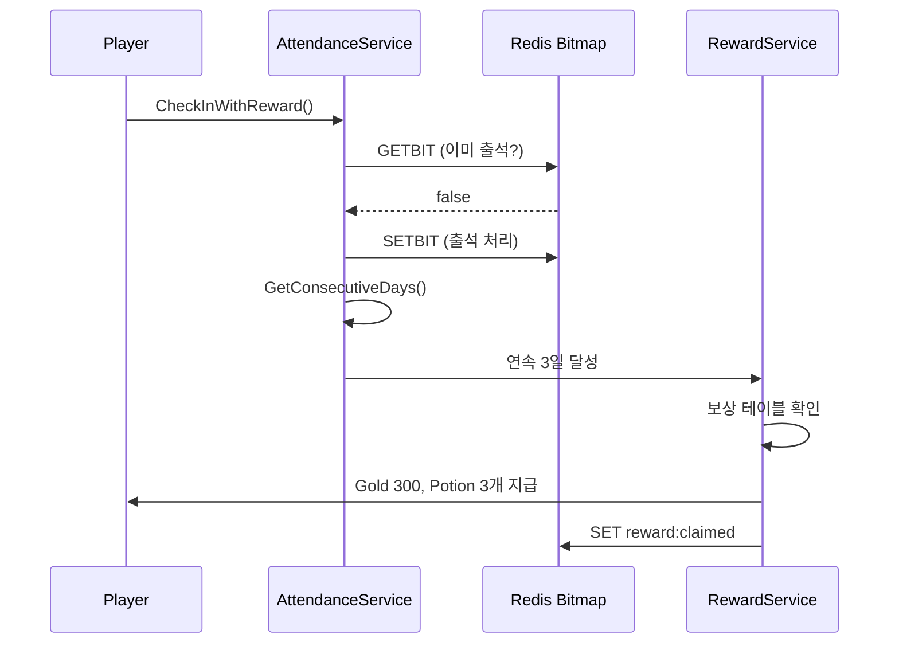
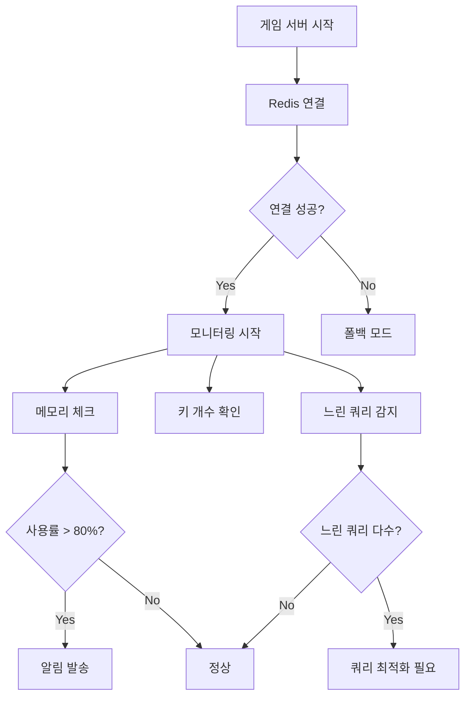

# 1주일만에 배우는 Redis 프로그래밍  

저자: 최흥배, Claude AI   
    
권장 개발 환경
- **IDE**: Visual Studio 2022 (Community 이상)
- **.NET**: 버전 9 이상
- **Redis**: 버전 6 이상

-----   

# Chapter 7. 이벤트 시스템과 고급 활용
게임 운영에서 이벤트 시스템은 플레이어의 지속적인 참여를 유도하는 핵심 요소다. 출석 체크, 쿠폰, 선착순 이벤트 등 다양한 형태의 이벤트를 효율적으로 관리해야 한다. 이번 장에서는 Redis의 고급 기능을 활용한 이벤트 시스템 구현과 성능 최적화 기법, 그리고 실제 운영에서 필요한 모니터링 방법을 배운다.

## 7.1 출석 체크 시스템

### Bitmap의 이해
Bitmap은 String 데이터 타입의 특수한 형태로, 각 비트를 개별적으로 설정하고 조회할 수 있다. 메모리 효율이 매우 높아서 대량의 boolean 데이터를 저장하는 데 적합하다.

```
Bitmap 구조 (1바이트 = 8비트)

Byte 0:  [0][1][0][1][0][0][1][1]
         일 월 화 수 목 금 토 일
         
Byte 1:  [1][0][1][0][0][0][0][0]
         월 화 수 목 금 토 일 월

- 1 = 출석함
- 0 = 출석 안 함
- 1억 사용자의 365일 출석: 약 4.5GB (매우 효율적)
```

### CloudStructures에서 Bitmap 사용하기
CloudStructures는 Bitmap을 직접 지원하지 않으므로 StackExchange.Redis API를 사용한다.

```csharp
using CloudStructures;
using StackExchange.Redis;
using System;
using System.Collections.Generic;
using System.Threading.Tasks;

public class AttendanceService
{
    private readonly RedisConnection _connection;
    private readonly IDatabase _database;

    public AttendanceService(RedisConnection connection)
    {
        _connection = connection;
        _database = connection.GetConnection().GetDatabase();
    }

    // 출석 체크
    public async Task<AttendanceResult> CheckIn(string playerId, DateTime date)
    {
        var key = GetMonthlyKey(playerId, date);
        var dayOfMonth = date.Day;
        
        // GETBIT: 이미 출석했는지 확인
        var alreadyChecked = await _database.StringGetBitAsync(key, dayOfMonth - 1);
        
        if (alreadyChecked)
        {
            return new AttendanceResult
            {
                Success = false,
                Message = "이미 출석했습니다",
                Day = dayOfMonth
            };
        }

        // SETBIT: 출석 처리
        await _database.StringSetBitAsync(key, dayOfMonth - 1, true);
        
        // 월말까지 만료 설정
        var endOfMonth = new DateTime(date.Year, date.Month, 
            DateTime.DaysInMonth(date.Year, date.Month), 23, 59, 59);
        var expiry = endOfMonth - DateTime.UtcNow;
        
        if (expiry.TotalSeconds > 0)
        {
            await _database.KeyExpireAsync(key, expiry);
        }

        // 이번 달 출석 일수 계산
        var attendanceCount = await GetMonthlyAttendanceCount(playerId, date);
        
        return new AttendanceResult
        {
            Success = true,
            Message = "출석 완료",
            Day = dayOfMonth,
            MonthlyCount = attendanceCount
        };
    }

    // 특정 날짜 출석 여부 확인
    public async Task<bool> IsCheckedIn(string playerId, DateTime date)
    {
        var key = GetMonthlyKey(playerId, date);
        var dayOfMonth = date.Day;
        
        return await _database.StringGetBitAsync(key, dayOfMonth - 1);
    }

    // 월간 출석 일수
    public async Task<long> GetMonthlyAttendanceCount(string playerId, DateTime date)
    {
        var key = GetMonthlyKey(playerId, date);
        
        // BITCOUNT: 설정된 비트 개수
        return await _database.StringBitCountAsync(key);
    }

    // 월간 출석 현황 조회
    public async Task<List<int>> GetMonthlyAttendanceDays(string playerId, DateTime date)
    {
        var key = GetMonthlyKey(playerId, date);
        var daysInMonth = DateTime.DaysInMonth(date.Year, date.Month);
        var attendedDays = new List<int>();

        for (int day = 1; day <= daysInMonth; day++)
        {
            var isAttended = await _database.StringGetBitAsync(key, day - 1);
            if (isAttended)
            {
                attendedDays.Add(day);
            }
        }

        return attendedDays;
    }

    // 연속 출석 일수 계산
    public async Task<int> GetConsecutiveDays(string playerId, DateTime endDate)
    {
        int consecutiveDays = 0;
        var currentDate = endDate.Date;

        // 최대 30일 역으로 확인
        for (int i = 0; i < 30; i++)
        {
            var isChecked = await IsCheckedIn(playerId, currentDate);
            
            if (!isChecked)
            {
                break;
            }

            consecutiveDays++;
            currentDate = currentDate.AddDays(-1);
        }

        return consecutiveDays;
    }

    private string GetMonthlyKey(string playerId, DateTime date)
    {
        return $"attendance:{playerId}:{date:yyyyMM}";
    }
}

public class AttendanceResult
{
    public bool Success { get; set; }
    public string Message { get; set; }
    public int Day { get; set; }
    public long MonthlyCount { get; set; }
}
```

### 주간 출석 패턴 분석
주간 출석 패턴을 분석하여 플레이어 참여도를 파악한다.

```csharp
public class AttendanceAnalytics
{
    private readonly RedisConnection _connection;
    private readonly IDatabase _database;

    public AttendanceAnalytics(RedisConnection connection)
    {
        _connection = connection;
        _database = connection.GetConnection().GetDatabase();
    }

    // 주간 출석 현황
    public async Task<WeeklyAttendance> GetWeeklyAttendance(
        string playerId, 
        DateTime weekStart)
    {
        var weekly = new WeeklyAttendance
        {
            WeekStart = weekStart,
            Days = new bool[7]
        };

        for (int i = 0; i < 7; i++)
        {
            var date = weekStart.AddDays(i);
            var key = $"attendance:{playerId}:{date:yyyyMM}";
            var dayOfMonth = date.Day;
            
            weekly.Days[i] = await _database.StringGetBitAsync(key, dayOfMonth - 1);
        }

        weekly.AttendanceCount = weekly.Days.Count(d => d);
        
        return weekly;
    }

    // 여러 플레이어의 특정일 출석률
    public async Task<double> GetDailyAttendanceRate(
        List<string> playerIds, 
        DateTime date)
    {
        if (playerIds.Count == 0)
        {
            return 0;
        }

        int attendedCount = 0;
        var key = $"attendance:{playerIds[0]}:{date:yyyyMM}";
        var dayOfMonth = date.Day;

        foreach (var playerId in playerIds)
        {
            key = $"attendance:{playerId}:{date:yyyyMM}";
            var isAttended = await _database.StringGetBitAsync(key, dayOfMonth - 1);
            
            if (isAttended)
            {
                attendedCount++;
            }
        }

        return (double)attendedCount / playerIds.Count * 100;
    }
}

public class WeeklyAttendance
{
    public DateTime WeekStart { get; set; }
    public bool[] Days { get; set; }
    public int AttendanceCount { get; set; }
    
    public string GetPattern()
    {
        return string.Join("", Days.Select(d => d ? "O" : "X"));
    }
}
```

### 연속 출석 보상 처리
연속 출석에 따른 보상 시스템을 구현한다.

```csharp
public class AttendanceRewardService
{
    private readonly RedisConnection _connection;
    private readonly AttendanceService _attendanceService;

    // 보상 테이블
    private readonly Dictionary<int, AttendanceReward> _rewardTable = new()
    {
        { 1, new AttendanceReward { Gold = 100, Items = new() { { "potion", 1 } } } },
        { 3, new AttendanceReward { Gold = 300, Items = new() { { "potion", 3 } } } },
        { 7, new AttendanceReward { Gold = 1000, Items = new() { { "rare_box", 1 } } } },
        { 14, new AttendanceReward { Gold = 2500, Items = new() { { "epic_box", 1 } } } },
        { 30, new AttendanceReward { Gold = 10000, Items = new() { { "legendary_box", 1 } } } }
    };

    public AttendanceRewardService(RedisConnection connection)
    {
        _connection = connection;
        _attendanceService = new AttendanceService(connection);
    }

    // 출석 체크 및 보상 지급
    public async Task<CheckInRewardResult> CheckInWithReward(
        string playerId, 
        DateTime date)
    {
        // 출석 처리
        var checkInResult = await _attendanceService.CheckIn(playerId, date);
        
        if (!checkInResult.Success)
        {
            return new CheckInRewardResult
            {
                AttendanceResult = checkInResult
            };
        }

        // 연속 출석 일수 확인
        var consecutiveDays = await _attendanceService.GetConsecutiveDays(playerId, date);
        
        // 보상 확인
        var rewards = new List<AttendanceReward>();
        
        foreach (var milestone in _rewardTable.Keys.OrderBy(k => k))
        {
            if (consecutiveDays >= milestone)
            {
                var rewardKey = $"attendance:reward:{playerId}:{milestone}";
                var rewardClaimed = new RedisString<bool>(_connection, rewardKey, null);
                
                var claimed = await rewardClaimed.Get();
                
                if (!claimed.HasValue || !claimed.Value)
                {
                    // 보상 지급
                    var reward = _rewardTable[milestone];
                    await GrantReward(playerId, reward);
                    rewards.Add(reward);
                    
                    // 보상 수령 기록
                    await rewardClaimed.Set(true, TimeSpan.FromDays(31));
                }
            }
        }

        return new CheckInRewardResult
        {
            AttendanceResult = checkInResult,
            ConsecutiveDays = consecutiveDays,
            Rewards = rewards
        };
    }

    // 다음 보상까지 남은 일수
    public async Task<NextRewardInfo> GetNextRewardInfo(
        string playerId, 
        DateTime date)
    {
        var consecutiveDays = await _attendanceService.GetConsecutiveDays(playerId, date);
        
        var nextMilestone = _rewardTable.Keys
            .Where(k => k > consecutiveDays)
            .OrderBy(k => k)
            .FirstOrDefault();

        if (nextMilestone == 0)
        {
            return new NextRewardInfo
            {
                HasNextReward = false
            };
        }

        return new NextRewardInfo
        {
            HasNextReward = true,
            DaysRemaining = nextMilestone - consecutiveDays,
            Reward = _rewardTable[nextMilestone]
        };
    }

    private async Task GrantReward(string playerId, AttendanceReward reward)
    {
        // 골드 지급
        if (reward.Gold > 0)
        {
            var goldKey = $"player:{playerId}:gold";
            var gold = new RedisString<long>(_connection, goldKey, null);
            await gold.Increment(reward.Gold);
        }

        // 아이템 지급
        if (reward.Items != null && reward.Items.Count > 0)
        {
            var inventoryKey = $"inventory:{playerId}";
            var inventory = new RedisHash<int>(_connection, inventoryKey, null);
            
            foreach (var item in reward.Items)
            {
                await inventory.Increment(item.Key, item.Value);
            }
        }
    }
}

public class AttendanceReward
{
    public int Gold { get; set; }
    public Dictionary<string, int> Items { get; set; }
}

public class CheckInRewardResult
{
    public AttendanceResult AttendanceResult { get; set; }
    public int ConsecutiveDays { get; set; }
    public List<AttendanceReward> Rewards { get; set; }
}

public class NextRewardInfo
{
    public bool HasNextReward { get; set; }
    public int DaysRemaining { get; set; }
    public AttendanceReward Reward { get; set; }
}
```



## 7.2 쿠폰과 선착순 이벤트

### String을 활용한 쿠폰 코드 관리
쿠폰 시스템은 중복 사용 방지와 사용 기한 관리가 핵심이다.

```csharp
public class CouponService
{
    private readonly RedisConnection _connection;

    public CouponService(RedisConnection connection)
    {
        _connection = connection;
    }

    // 쿠폰 생성
    public async Task<Coupon> CreateCoupon(
        string couponCode, 
        CouponReward reward,
        int maxUsage = 1,
        DateTime? expiryDate = null)
    {
        var couponKey = $"coupon:{couponCode}";
        var coupon = new Coupon
        {
            Code = couponCode,
            Reward = reward,
            MaxUsage = maxUsage,
            CurrentUsage = 0,
            ExpiryDate = expiryDate ?? DateTime.UtcNow.AddDays(30),
            CreatedAt = DateTime.UtcNow
        };

        var redisCoupon = new RedisString<Coupon>(_connection, couponKey, null);
        
        // 쿠폰 정보 저장
        var expiry = coupon.ExpiryDate - DateTime.UtcNow;
        await redisCoupon.Set(coupon, expiry);

        return coupon;
    }

    // 쿠폰 사용
    public async Task<CouponUseResult> UseCoupon(string playerId, string couponCode)
    {
        var couponKey = $"coupon:{couponCode}";
        var usageKey = $"coupon:usage:{couponCode}";
        var userUsageKey = $"coupon:user:{playerId}:{couponCode}";

        // 쿠폰 정보 조회
        var redisCoupon = new RedisString<Coupon>(_connection, couponKey, null);
        var couponData = await redisCoupon.Get();

        if (!couponData.HasValue)
        {
            return new CouponUseResult
            {
                Success = false,
                Message = "존재하지 않거나 만료된 쿠폰입니다"
            };
        }

        var coupon = couponData.Value;

        // 만료 확인
        if (coupon.ExpiryDate < DateTime.UtcNow)
        {
            return new CouponUseResult
            {
                Success = false,
                Message = "만료된 쿠폰입니다"
            };
        }

        // 이미 사용했는지 확인
        var userUsage = new RedisString<bool>(_connection, userUsageKey, null);
        var alreadyUsed = await userUsage.Get();

        if (alreadyUsed.HasValue && alreadyUsed.Value)
        {
            return new CouponUseResult
            {
                Success = false,
                Message = "이미 사용한 쿠폰입니다"
            };
        }

        // 사용 횟수 증가 (원자적 연산)
        var usageCount = new RedisString<long>(_connection, usageKey, null);
        var currentUsage = await usageCount.Increment(1);

        // 최대 사용 횟수 초과 확인
        if (currentUsage > coupon.MaxUsage)
        {
            await usageCount.Increment(-1); // 롤백
            return new CouponUseResult
            {
                Success = false,
                Message = "쿠폰 사용 가능 횟수를 초과했습니다"
            };
        }

        // 사용자별 사용 기록
        await userUsage.Set(true, TimeSpan.FromDays(365));

        // 보상 지급
        await GrantCouponReward(playerId, coupon.Reward);

        return new CouponUseResult
        {
            Success = true,
            Message = "쿠폰을 사용했습니다",
            Reward = coupon.Reward,
            RemainingUsage = coupon.MaxUsage - currentUsage
        };
    }

    // 쿠폰 사용 현황
    public async Task<CouponStatus> GetCouponStatus(string couponCode)
    {
        var couponKey = $"coupon:{couponCode}";
        var usageKey = $"coupon:usage:{couponCode}";

        var redisCoupon = new RedisString<Coupon>(_connection, couponKey, null);
        var couponData = await redisCoupon.Get();

        if (!couponData.HasValue)
        {
            return null;
        }

        var usageCount = new RedisString<long>(_connection, usageKey, null);
        var current = await usageCount.Get();

        var coupon = couponData.Value;
        
        return new CouponStatus
        {
            Code = coupon.Code,
            MaxUsage = coupon.MaxUsage,
            CurrentUsage = current.HasValue ? current.Value : 0,
            ExpiryDate = coupon.ExpiryDate,
            IsExpired = coupon.ExpiryDate < DateTime.UtcNow
        };
    }

    private async Task GrantCouponReward(string playerId, CouponReward reward)
    {
        if (reward.Gold > 0)
        {
            var goldKey = $"player:{playerId}:gold";
            var gold = new RedisString<long>(_connection, goldKey, null);
            await gold.Increment(reward.Gold);
        }

        if (reward.Items != null)
        {
            var inventoryKey = $"inventory:{playerId}";
            var inventory = new RedisHash<int>(_connection, inventoryKey, null);
            
            foreach (var item in reward.Items)
            {
                await inventory.Increment(item.Key, item.Value);
            }
        }
    }
}

public class Coupon
{
    public string Code { get; set; }
    public CouponReward Reward { get; set; }
    public int MaxUsage { get; set; }
    public long CurrentUsage { get; set; }
    public DateTime ExpiryDate { get; set; }
    public DateTime CreatedAt { get; set; }
}

public class CouponReward
{
    public int Gold { get; set; }
    public Dictionary<string, int> Items { get; set; }
}

public class CouponUseResult
{
    public bool Success { get; set; }
    public string Message { get; set; }
    public CouponReward Reward { get; set; }
    public long RemainingUsage { get; set; }
}

public class CouponStatus
{
    public string Code { get; set; }
    public int MaxUsage { get; set; }
    public long CurrentUsage { get; set; }
    public DateTime ExpiryDate { get; set; }
    public bool IsExpired { get; set; }
}
```

### 선착순 이벤트 구현
한정된 수량의 아이템을 선착순으로 지급하는 이벤트를 구현한다.

```csharp
public class LimitedEventService
{
    private readonly RedisConnection _connection;
    private readonly IDatabase _database;

    public LimitedEventService(RedisConnection connection)
    {
        _connection = connection;
        _database = connection.GetConnection().GetDatabase();
    }

    // 선착순 이벤트 생성
    public async Task<bool> CreateLimitedEvent(
        string eventId, 
        int totalQuantity,
        DateTime startTime,
        DateTime endTime)
    {
        var eventKey = $"event:limited:{eventId}";
        var eventInfo = new LimitedEvent
        {
            EventId = eventId,
            TotalQuantity = totalQuantity,
            StartTime = startTime,
            EndTime = endTime
        };

        var redisEvent = new RedisString<LimitedEvent>(_connection, eventKey, null);
        var expiry = endTime - DateTime.UtcNow;
        
        await redisEvent.Set(eventInfo, expiry);

        // 잔여 수량 초기화
        var quantityKey = $"event:limited:{eventId}:quantity";
        var quantity = new RedisString<long>(_connection, quantityKey, null);
        await quantity.Set(totalQuantity, expiry);

        return true;
    }

    // 선착순 참여
    public async Task<ParticipationResult> Participate(string playerId, string eventId)
    {
        var eventKey = $"event:limited:{eventId}";
        var quantityKey = $"event:limited:{eventId}:quantity";
        var participantsKey = $"event:limited:{eventId}:participants";

        // 이벤트 정보 조회
        var redisEvent = new RedisString<LimitedEvent>(_connection, eventKey, null);
        var eventData = await redisEvent.Get();

        if (!eventData.HasValue)
        {
            return new ParticipationResult
            {
                Success = false,
                Message = "존재하지 않는 이벤트입니다"
            };
        }

        var evt = eventData.Value;
        var now = DateTime.UtcNow;

        // 시작/종료 시간 확인
        if (now < evt.StartTime)
        {
            return new ParticipationResult
            {
                Success = false,
                Message = "아직 시작하지 않은 이벤트입니다"
            };
        }

        if (now > evt.EndTime)
        {
            return new ParticipationResult
            {
                Success = false,
                Message = "종료된 이벤트입니다"
            };
        }

        // 중복 참여 확인
        var participants = new RedisSet<string>(_connection, participantsKey, null);
        var alreadyParticipated = await participants.Contains(playerId);

        if (alreadyParticipated)
        {
            return new ParticipationResult
            {
                Success = false,
                Message = "이미 참여한 이벤트입니다"
            };
        }

        // 잔여 수량 감소 (원자적 연산)
        var quantity = new RedisString<long>(_connection, quantityKey, null);
        var remaining = await quantity.Increment(-1);

        // 수량 소진 확인
        if (remaining < 0)
        {
            await quantity.Increment(1); // 롤백
            return new ParticipationResult
            {
                Success = false,
                Message = "선착순 마감되었습니다"
            };
        }

        // 참여자 등록
        await participants.Add(playerId);

        // 보상 지급
        await GrantEventReward(playerId, eventId);

        return new ParticipationResult
        {
            Success = true,
            Message = "이벤트 참여 완료",
            RemainingQuantity = remaining,
            Rank = evt.TotalQuantity - remaining
        };
    }

    // 이벤트 현황
    public async Task<EventStatus> GetEventStatus(string eventId)
    {
        var eventKey = $"event:limited:{eventId}";
        var quantityKey = $"event:limited:{eventId}:quantity";
        var participantsKey = $"event:limited:{eventId}:participants";

        var redisEvent = new RedisString<LimitedEvent>(_connection, eventKey, null);
        var eventData = await redisEvent.Get();

        if (!eventData.HasValue)
        {
            return null;
        }

        var evt = eventData.Value;
        var quantity = new RedisString<long>(_connection, quantityKey, null);
        var remaining = await quantity.Get();

        var participants = new RedisSet<string>(_connection, participantsKey, null);
        var participantCount = await participants.Length();

        return new EventStatus
        {
            EventId = evt.EventId,
            TotalQuantity = evt.TotalQuantity,
            RemainingQuantity = remaining.HasValue ? remaining.Value : 0,
            ParticipantCount = participantCount,
            StartTime = evt.StartTime,
            EndTime = evt.EndTime,
            IsActive = DateTime.UtcNow >= evt.StartTime && DateTime.UtcNow <= evt.EndTime
        };
    }

    private async Task GrantEventReward(string playerId, string eventId)
    {
        // 이벤트별 보상 지급 로직
        var inventoryKey = $"inventory:{playerId}";
        var inventory = new RedisHash<int>(_connection, inventoryKey, null);
        
        await inventory.Increment("event_box", 1);
    }
}

public class LimitedEvent
{
    public string EventId { get; set; }
    public int TotalQuantity { get; set; }
    public DateTime StartTime { get; set; }
    public DateTime EndTime { get; set; }
}

public class ParticipationResult
{
    public bool Success { get; set; }
    public string Message { get; set; }
    public long RemainingQuantity { get; set; }
    public long Rank { get; set; }
}

public class EventStatus
{
    public string EventId { get; set; }
    public int TotalQuantity { get; set; }
    public long RemainingQuantity { get; set; }
    public long ParticipantCount { get; set; }
    public DateTime StartTime { get; set; }
    public DateTime EndTime { get; set; }
    public bool IsActive { get; set; }
}
```

```
선착순 이벤트 동시성 처리

시나리오: 1000명이 동시에 요청, 100개 한정

Player1: DECR → 99  ✓ 성공
Player2: DECR → 98  ✓ 성공
...
Player100: DECR → 0  ✓ 성공
Player101: DECR → -1 ✗ 실패 (롤백)

Redis의 DECR은 원자적(Atomic) 연산이므로
동시성 문제 없이 정확히 처리됨
```

## 7.3 Pipeline과 성능 최적화

### Pipeline의 필요성
여러 Redis 명령을 실행할 때 네트워크 왕복(RTT) 시간이 성능 병목이 된다. Pipeline을 사용하면 여러 명령을 한 번에 보내고 응답을 한 번에 받을 수 있다.

```
일반 명령 vs Pipeline

일반 명령 (100개):
Client ─GET key1──► Redis
Client ◄──value1─── Redis
Client ─GET key2──► Redis
Client ◄──value2─── Redis
...
총 시간: 100 * RTT

Pipeline (100개):
Client ─GET key1─► 
       ─GET key2─►
       ─GET key3─► Redis
       ...
Client ◄─value1──
       ◄─value2──
       ◄─value3──
총 시간: 1 * RTT
```

### CloudStructures에서 Pipeline 사용

```csharp
public class PipelineOptimization
{
    private readonly RedisConnection _connection;
    private readonly IDatabase _database;

    public PipelineOptimization(RedisConnection connection)
    {
        _connection = connection;
        _database = connection.GetConnection().GetDatabase();
    }

    // 여러 플레이어 데이터 일괄 조회
    public async Task<Dictionary<string, PlayerData>> GetMultiplePlayersData(
        List<string> playerIds)
    {
        var batch = _database.CreateBatch();
        var tasks = new Dictionary<string, Task<RedisValue>>();

        // 배치에 모든 GET 명령 추가
        foreach (var playerId in playerIds)
        {
            var key = $"player:{playerId}:data";
            tasks[playerId] = batch.StringGetAsync(key);
        }

        // 배치 실행
        batch.Execute();

        // 모든 결과 대기
        await Task.WhenAll(tasks.Values);

        // 결과 파싱
        var result = new Dictionary<string, PlayerData>();
        
        foreach (var kvp in tasks)
        {
            if (!kvp.Value.Result.IsNullOrEmpty)
            {
                var playerData = System.Text.Json.JsonSerializer
                    .Deserialize<PlayerData>(kvp.Value.Result);
                result[kvp.Key] = playerData;
            }
        }

        return result;
    }

    // 여러 플레이어의 골드 업데이트
    public async Task<Dictionary<string, long>> UpdateMultiplePlayerGold(
        Dictionary<string, long> playerGoldChanges)
    {
        var batch = _database.CreateBatch();
        var tasks = new Dictionary<string, Task<long>>();

        foreach (var kvp in playerGoldChanges)
        {
            var key = $"player:{kvp.Key}:gold";
            tasks[kvp.Key] = batch.StringIncrementAsync(key, kvp.Value);
        }

        batch.Execute();
        await Task.WhenAll(tasks.Values);

        var result = new Dictionary<string, long>();
        
        foreach (var kvp in tasks)
        {
            result[kvp.Key] = kvp.Value.Result;
        }

        return result;
    }

    // 랭킹 점수 대량 업데이트
    public async Task BatchUpdateRankingScores(
        Dictionary<string, long> playerScores)
    {
        var batch = _database.CreateBatch();
        var tasks = new List<Task>();
        var rankingKey = "ranking:global";

        foreach (var kvp in playerScores)
        {
            tasks.Add(batch.SortedSetAddAsync(rankingKey, kvp.Key, kvp.Value));
        }

        batch.Execute();
        await Task.WhenAll(tasks);
    }

    // 인벤토리 아이템 대량 추가
    public async Task BatchAddInventoryItems(
        string playerId, 
        Dictionary<string, int> items)
    {
        var batch = _database.CreateBatch();
        var tasks = new List<Task>();
        var inventoryKey = $"inventory:{playerId}";

        foreach (var item in items)
        {
            tasks.Add(batch.HashIncrementAsync(inventoryKey, item.Key, item.Value));
        }

        batch.Execute();
        await Task.WhenAll(tasks);
    }
}

public class PlayerData
{
    public string PlayerId { get; set; }
    public string Name { get; set; }
    public int Level { get; set; }
    public long Gold { get; set; }
}
```

### 대량 데이터 처리 최적화
수천, 수만 건의 데이터를 처리할 때의 최적화 기법이다.

```csharp
public class BulkDataProcessor
{
    private readonly RedisConnection _connection;
    private readonly IDatabase _database;
    private const int BATCH_SIZE = 1000;

    public BulkDataProcessor(RedisConnection connection)
    {
        _connection = connection;
        _database = connection.GetConnection().GetDatabase();
    }

    // 대량 키 조회 (SCAN 사용)
    public async Task<List<string>> GetAllKeysWithPattern(string pattern)
    {
        var keys = new List<string>();
        var server = _connection.GetConnection().GetServer(
            _connection.GetConnection().GetEndPoints()[0]
        );

        // SCAN: 커서 기반 반복 (KEYS보다 안전)
        await foreach (var key in server.KeysAsync(pattern: pattern))
        {
            keys.Add(key.ToString());
        }

        return keys;
    }

    // 대량 데이터 일괄 삽입
    public async Task BulkInsertPlayerData(
        Dictionary<string, PlayerData> players)
    {
        // BATCH_SIZE 단위로 분할 처리
        var playerList = players.ToList();
        
        for (int i = 0; i < playerList.Count; i += BATCH_SIZE)
        {
            var batch = _database.CreateBatch();
            var tasks = new List<Task>();
            var batchItems = playerList.Skip(i).Take(BATCH_SIZE);

            foreach (var kvp in batchItems)
            {
                var key = $"player:{kvp.Key}:data";
                var json = System.Text.Json.JsonSerializer.Serialize(kvp.Value);
                tasks.Add(batch.StringSetAsync(key, json));
            }

            batch.Execute();
            await Task.WhenAll(tasks);

            // 진행 상황 로그
            var processed = Math.Min(i + BATCH_SIZE, playerList.Count);
            Console.WriteLine($"처리 중: {processed}/{playerList.Count}");
        }
    }

    // 만료된 키 정리
    public async Task<int> CleanupExpiredKeys(string pattern, DateTime cutoffDate)
    {
        var server = _connection.GetConnection().GetServer(
            _connection.GetConnection().GetEndPoints()[0]
        );

        int deletedCount = 0;
        var keysToDelete = new List<RedisKey>();

        await foreach (var key in server.KeysAsync(pattern: pattern))
        {
            // TTL 확인
            var ttl = await _database.KeyTimeToLiveAsync(key);
            
            if (!ttl.HasValue || ttl.Value.TotalSeconds <= 0)
            {
                keysToDelete.Add(key);
                
                // 일정 개수마다 배치 삭제
                if (keysToDelete.Count >= BATCH_SIZE)
                {
                    await _database.KeyDeleteAsync(keysToDelete.ToArray());
                    deletedCount += keysToDelete.Count;
                    keysToDelete.Clear();
                }
            }
        }

        // 남은 키 삭제
        if (keysToDelete.Count > 0)
        {
            await _database.KeyDeleteAsync(keysToDelete.ToArray());
            deletedCount += keysToDelete.Count;
        }

        return deletedCount;
    }

    // 메모리 효율적인 대량 조회
    public async IAsyncEnumerable<PlayerData> StreamPlayerData(string pattern)
    {
        var server = _connection.GetConnection().GetServer(
            _connection.GetConnection().GetEndPoints()[0]
        );

        await foreach (var key in server.KeysAsync(pattern: pattern))
        {
            var json = await _database.StringGetAsync(key);
            
            if (!json.IsNullOrEmpty)
            {
                var playerData = System.Text.Json.JsonSerializer
                    .Deserialize<PlayerData>(json);
                yield return playerData;
            }
        }
    }
}
```

## 7.4 모니터링과 운영 팁

### 주요 명령어로 상태 확인
Redis의 상태를 모니터링하는 필수 명령어들이다.

```csharp
public class RedisMonitoring
{
    private readonly RedisConnection _connection;
    private readonly IDatabase _database;
    private readonly IServer _server;

    public RedisMonitoring(RedisConnection connection)
    {
        _connection = connection;
        _database = connection.GetConnection().GetDatabase();
        _server = connection.GetConnection().GetServer(
            connection.GetConnection().GetEndPoints()[0]
        );
    }

    // INFO 명령: 서버 정보 조회
    public async Task<Dictionary<string, string>> GetServerInfo()
    {
        var info = await _server.InfoAsync();
        var result = new Dictionary<string, string>();

        foreach (var section in info)
        {
            foreach (var item in section)
            {
                result[$"{section.Key}:{item.Key}"] = item.Value;
            }
        }

        return result;
    }

    // 메모리 사용량 확인
    public async Task<MemoryInfo> GetMemoryInfo()
    {
        var info = await _server.InfoAsync("memory");
        var memorySection = info.FirstOrDefault(s => s.Key == "Memory");

        if (memorySection.Key == null)
        {
            return null;
        }

        var usedMemory = long.Parse(
            memorySection.FirstOrDefault(i => i.Key == "used_memory").Value
        );
        var usedMemoryPeak = long.Parse(
            memorySection.FirstOrDefault(i => i.Key == "used_memory_peak").Value
        );
        var maxMemory = long.Parse(
            memorySection.FirstOrDefault(i => i.Key == "maxmemory").Value
        );

        return new MemoryInfo
        {
            UsedMemoryBytes = usedMemory,
            UsedMemoryMB = usedMemory / 1024.0 / 1024.0,
            PeakMemoryBytes = usedMemoryPeak,
            PeakMemoryMB = usedMemoryPeak / 1024.0 / 1024.0,
            MaxMemoryBytes = maxMemory,
            MaxMemoryMB = maxMemory / 1024.0 / 1024.0,
            UsagePercent = maxMemory > 0 ? (double)usedMemory / maxMemory * 100 : 0
        };
    }

    // SLOWLOG: 느린 쿼리 조회
    public async Task<List<SlowLogEntry>> GetSlowLog(int count = 10)
    {
        var slowLogs = await _server.SlowlogGetAsync(count);
        var result = new List<SlowLogEntry>();

        foreach (var log in slowLogs)
        {
            result.Add(new SlowLogEntry
            {
                Id = log.Id,
                Timestamp = log.Time,
                Duration = log.Duration,
                Command = string.Join(" ", log.Arguments.Select(a => a.ToString()))
            });
        }

        return result;
    }

    // 클라이언트 연결 정보
    public async Task<List<ClientInfo>> GetConnectedClients()
    {
        var clients = await _server.ClientListAsync();
        var result = new List<ClientInfo>();

        foreach (var client in clients)
        {
            result.Add(new ClientInfo
            {
                Id = client.Id,
                Address = client.Address,
                Name = client.Name,
                Database = client.Database,
                IdleSeconds = (int)client.IdleTime.TotalSeconds,
                Age = (int)client.Age.TotalSeconds
            });
        }

        return result;
    }

    // 데이터베이스 키 개수
    public async Task<long> GetKeyCount(int database = 0)
    {
        return await _database.ExecuteAsync("DBSIZE").ContinueWith(t =>
        {
            return (long)t.Result;
        });
    }

    // 키 통계 (패턴별 개수)
    public async Task<Dictionary<string, int>> GetKeyStatsByPattern()
    {
        var stats = new Dictionary<string, int>
        {
            { "player:*", 0 },
            { "inventory:*", 0 },
            { "ranking:*", 0 },
            { "session:*", 0 },
            { "mailbox:*", 0 }
        };

        foreach (var pattern in stats.Keys.ToList())
        {
            int count = 0;
            await foreach (var key in _server.KeysAsync(pattern: pattern))
            {
                count++;
            }
            stats[pattern] = count;
        }

        return stats;
    }
}

public class MemoryInfo
{
    public long UsedMemoryBytes { get; set; }
    public double UsedMemoryMB { get; set; }
    public long PeakMemoryBytes { get; set; }
    public double PeakMemoryMB { get; set; }
    public long MaxMemoryBytes { get; set; }
    public double MaxMemoryMB { get; set; }
    public double UsagePercent { get; set; }

    public override string ToString()
    {
        return $"메모리 사용: {UsedMemoryMB:F2}MB / {MaxMemoryMB:F2}MB ({UsagePercent:F1}%)";
    }
}

public class SlowLogEntry
{
    public long Id { get; set; }
    public DateTime Timestamp { get; set; }
    public TimeSpan Duration { get; set; }
    public string Command { get; set; }

    public override string ToString()
    {
        return $"[{Timestamp:yyyy-MM-dd HH:mm:ss}] {Duration.TotalMilliseconds}ms - {Command}";
    }
}

public class ClientInfo
{
    public long Id { get; set; }
    public string Address { get; set; }
    public string Name { get; set; }
    public int Database { get; set; }
    public int IdleSeconds { get; set; }
    public int Age { get; set; }
}
```

### 키 설계 모범 사례
효율적인 키 네이밍과 구조화 전략이다.

```csharp
public class KeyDesignBestPractices
{
    // ✓ 좋은 키 설계
    public class GoodKeyDesign
    {
        // 계층적 구조 (콜론 구분)
        public const string PLAYER_DATA = "player:{0}:data";           // player:12345:data
        public const string PLAYER_INVENTORY = "player:{0}:inventory"; // player:12345:inventory
        public const string SESSION = "session:{0}";                   // session:abc123

        // 타입 접두사
        public const string RANKING_GLOBAL = "ranking:global";
        public const string RANKING_DAILY = "ranking:daily:{0}";       // ranking:daily:20250101

        // 명확한 의미
        public const string GUILD_MEMBERS = "guild:{0}:members";
        public const string GUILD_RANKING = "guild:{0}:ranking";

        // 기간 정보 포함
        public const string ATTENDANCE = "attendance:{0}:{1}";         // attendance:player123:202501
        public const string EVENT_LIMITED = "event:limited:{0}:{1}";   // event:limited:summer:20250630
    }

    // ✗ 나쁜 키 설계
    public class BadKeyDesign
    {
        // 구분자 없음
        public const string PLAYER_DATA = "player{0}data";             // 파싱 어려움

        // 의미 불명확
        public const string DATA1 = "d1:{0}";
        public const string TEMP = "temp_{0}";

        // 너무 긴 키
        public const string VERY_LONG = "this_is_a_very_long_key_name_that_wastes_memory_{0}";

        // 동적 부분이 앞에
        public const string DYNAMIC_PREFIX = "{0}:player:data";        // 12345:player:data (패턴 검색 어려움)
    }

    // 키 유틸리티
    public static class KeyUtils
    {
        public static string GetPlayerKey(string playerId, string suffix)
        {
            return $"player:{playerId}:{suffix}";
        }

        public static string GetTimeBasedKey(string prefix, DateTime date, string format = "yyyyMMdd")
        {
            return $"{prefix}:{date.ToString(format)}";
        }

        public static string GetSeasonKey(string type, int year, int season)
        {
            return $"{type}:season:{year}S{season}";
        }
    }
}
```

### 메모리 관리 전략

```csharp
public class MemoryManagement
{
    private readonly RedisConnection _connection;
    private readonly IDatabase _database;

    public MemoryManagement(RedisConnection connection)
    {
        _connection = connection;
        _database = connection.GetConnection().GetDatabase();
    }

    // 만료 시간 설정 전략
    public async Task SetDataWithExpiry()
    {
        // 세션: 짧은 만료 시간
        var sessionKey = "session:abc123";
        var session = new RedisString<string>(_connection, sessionKey, null);
        await session.Set("sessionData", TimeSpan.FromMinutes(30));

        // 캐시: 중간 만료 시간
        var cacheKey = "cache:config";
        var cache = new RedisString<string>(_connection, cacheKey, null);
        await cache.Set("configData", TimeSpan.FromHours(1));

        // 임시 데이터: 일일 만료
        var dailyKey = $"daily:{DateTime.UtcNow:yyyyMMdd}";
        var daily = new RedisString<string>(_connection, dailyKey, null);
        await daily.Set("dailyData", TimeSpan.FromDays(1));

        // 영구 데이터: 만료 없음 (주의!)
        var permanentKey = "config:system";
        var permanent = new RedisString<string>(_connection, permanentKey, null);
        await permanent.Set("systemConfig"); // TTL 없음
    }

    // 대용량 데이터 최적화
    public async Task OptimizeLargeData()
    {
        // Hash 대신 압축된 JSON
        var playerId = "player123";
        var largeData = new
        {
            Name = "Player",
            Stats = new int[1000], // 큰 배열
            History = new List<string>()
        };

        // 압축 저장 (선택사항)
        var json = System.Text.Json.JsonSerializer.Serialize(largeData);
        var compressed = CompressString(json);
        
        var key = $"player:{playerId}:largedata";
        await _database.StringSetAsync(key, compressed);
    }

    // 메모리 정리 작업
    public async Task<CleanupResult> CleanupOldData()
    {
        var result = new CleanupResult();
        var server = _connection.GetConnection().GetServer(
            _connection.GetConnection().GetEndPoints()[0]
        );

        // 만료된 세션 정리
        await foreach (var key in server.KeysAsync(pattern: "session:*"))
        {
            var ttl = await _database.KeyTimeToLiveAsync(key);
            if (!ttl.HasValue || ttl.Value.TotalSeconds <= 0)
            {
                await _database.KeyDeleteAsync(key);
                result.DeletedSessions++;
            }
        }

        // 오래된 임시 데이터 정리
        var cutoffDate = DateTime.UtcNow.AddDays(-7);
        await foreach (var key in server.KeysAsync(pattern: "temp:*"))
        {
            await _database.KeyDeleteAsync(key);
            result.DeletedTempKeys++;
        }

        return result;
    }

    private byte[] CompressString(string text)
    {
        var bytes = System.Text.Encoding.UTF8.GetBytes(text);
        using var output = new System.IO.MemoryStream();
        using (var gzip = new System.IO.Compression.GZipStream(
            output, System.IO.Compression.CompressionMode.Compress))
        {
            gzip.Write(bytes, 0, bytes.Length);
        }
        return output.ToArray();
    }
}

public class CleanupResult
{
    public int DeletedSessions { get; set; }
    public int DeletedTempKeys { get; set; }
    public int TotalDeleted => DeletedSessions + DeletedTempKeys;
}
```

### 게임 서비스 운영 주의사항

```csharp
public class ProductionTips
{
    // ✓ 운영 환경 권장 사항
    public class RecommendedPractices
    {
        public void ConnectionPooling()
        {
            // 연결 재사용
            var config = new RedisConfig("default", "localhost:6379")
            {
                ConnectTimeout = 5000,
                SyncTimeout = 3000,
                AllowAdmin = false  // 운영에서는 false
            };
        }

        public async Task ErrorHandling(RedisConnection connection)
        {
            try
            {
                var key = "some:key";
                var redis = new RedisString<string>(connection, key, null);
                await redis.Set("value", TimeSpan.FromMinutes(10));
            }
            catch (RedisConnectionException ex)
            {
                // 연결 실패 처리
                Console.WriteLine($"Redis 연결 오류: {ex.Message}");
                // 폴백 로직 (DB 직접 조회 등)
            }
            catch (RedisTimeoutException ex)
            {
                // 타임아웃 처리
                Console.WriteLine($"Redis 타임아웃: {ex.Message}");
                // 재시도 또는 캐시 미사용
            }
        }

        public async Task AvoidBlockingCommands(IDatabase database)
        {
            // ✗ 피해야 할 명령 (프로덕션)
            // KEYS * (모든 키 스캔 - 서버 블로킹)
            // FLUSHALL (전체 삭제 - 위험)

            // ✓ 대신 사용
            var server = database.Multiplexer.GetServer(
                database.Multiplexer.GetEndPoints()[0]
            );
            
            await foreach (var key in server.KeysAsync(pattern: "specific:*", pageSize: 100))
            {
                // 페이지 단위로 안전하게 처리
            }
        }
    }

    // ✗ 흔한 실수들
    public class CommonMistakes
    {
        public async Task MistakeExamples(RedisConnection connection)
        {
            // 실수 1: TTL 없이 캐시 저장
            var cache = new RedisString<string>(connection, "cache:data", null);
            await cache.Set("data"); // ✗ 영구 저장됨 (메모리 낭비)

            // 올바른 방법
            await cache.Set("data", TimeSpan.FromHours(1)); // ✓

            // 실수 2: 루프 안에서 개별 명령
            var playerIds = new List<string> { "p1", "p2", "p3" };
            
            foreach (var id in playerIds) // ✗ N번 네트워크 왕복
            {
                var key = $"player:{id}";
                var player = new RedisString<string>(connection, key, null);
                await player.Get();
            }

            // 올바른 방법: Pipeline 사용
            var database = connection.GetConnection().GetDatabase();
            var batch = database.CreateBatch();
            var tasks = playerIds.Select(id => 
                batch.StringGetAsync($"player:{id}")
            ).ToList();
            batch.Execute();
            await Task.WhenAll(tasks); // ✓

            // 실수 3: 너무 큰 데이터 저장
            var hugeData = new string('X', 10_000_000); // 10MB
            await cache.Set(hugeData); // ✗ Redis는 작은 데이터에 최적화

            // 올바른 방법: 큰 데이터는 DB 또는 파일 스토리지에
        }
    }
}
```

### 모니터링 대시보드 예제

```csharp
public class MonitoringDashboard
{
    private readonly RedisMonitoring _monitoring;

    public MonitoringDashboard(RedisConnection connection)
    {
        _monitoring = new RedisMonitoring(connection);
    }

    public async Task DisplayDashboard()
    {
        Console.WriteLine("=== Redis 모니터링 대시보드 ===\n");

        // 1. 메모리 사용량
        var memory = await _monitoring.GetMemoryInfo();
        Console.WriteLine($"[메모리] {memory}");
        
        if (memory.UsagePercent > 80)
        {
            Console.WriteLine("⚠️  경고: 메모리 사용률 80% 초과!");
        }

        // 2. 키 통계
        var keyCount = await _monitoring.GetKeyCount();
        Console.WriteLine($"\n[키 개수] 총 {keyCount:N0}개");

        var keyStats = await _monitoring.GetKeyStatsByPattern();
        foreach (var stat in keyStats)
        {
            Console.WriteLine($"  - {stat.Key}: {stat.Value:N0}개");
        }

        // 3. 느린 쿼리
        var slowLogs = await _monitoring.GetSlowLog(5);
        if (slowLogs.Count > 0)
        {
            Console.WriteLine("\n[느린 쿼리 TOP 5]");
            foreach (var log in slowLogs)
            {
                Console.WriteLine($"  {log}");
            }
        }

        // 4. 연결된 클라이언트
        var clients = await _monitoring.GetConnectedClients();
        Console.WriteLine($"\n[클라이언트] {clients.Count}개 연결");
        
        var idleClients = clients.Count(c => c.IdleSeconds > 300);
        if (idleClients > 0)
        {
            Console.WriteLine($"  ⚠️  {idleClients}개 클라이언트가 5분 이상 유휴 상태");
        }

        Console.WriteLine("\n================================");
    }

    public async Task HealthCheck()
    {
        var issues = new List<string>();

        // 메모리 체크
        var memory = await _monitoring.GetMemoryInfo();
        if (memory.UsagePercent > 90)
        {
            issues.Add($"메모리 사용률 위험: {memory.UsagePercent:F1}%");
        }

        // 느린 쿼리 체크
        var slowLogs = await _monitoring.GetSlowLog(10);
        var recentSlow = slowLogs.Count(s => s.Duration.TotalMilliseconds > 100);
        if (recentSlow > 5)
        {
            issues.Add($"느린 쿼리 다수 발생: {recentSlow}개");
        }

        // 결과 출력
        if (issues.Count == 0)
        {
            Console.WriteLine("✓ Redis 서버 정상");
        }
        else
        {
            Console.WriteLine("✗ Redis 서버 이상 감지:");
            foreach (var issue in issues)
            {
                Console.WriteLine($"  - {issue}");
            }
        }
    }
}
```



이번 장에서는 Redis를 활용한 다양한 이벤트 시스템 구현과 성능 최적화, 운영 모니터링까지 실무에 필요한 고급 기법을 배웠다. Bitmap을 활용한 효율적인 출석 체크, 원자적 연산을 이용한 선착순 이벤트, Pipeline을 통한 성능 최적화, 그리고 실제 운영에 필요한 모니터링 방법까지 모두 Redis를 활용한 온라인 게임 서비스의 핵심 기술이다. 이제 여러분은 Redis를 활용하여 안정적이고 확장 가능한 게임 서버를 구축할 수 있다.  