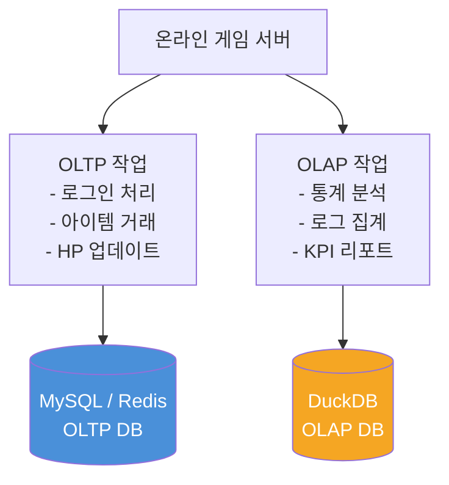
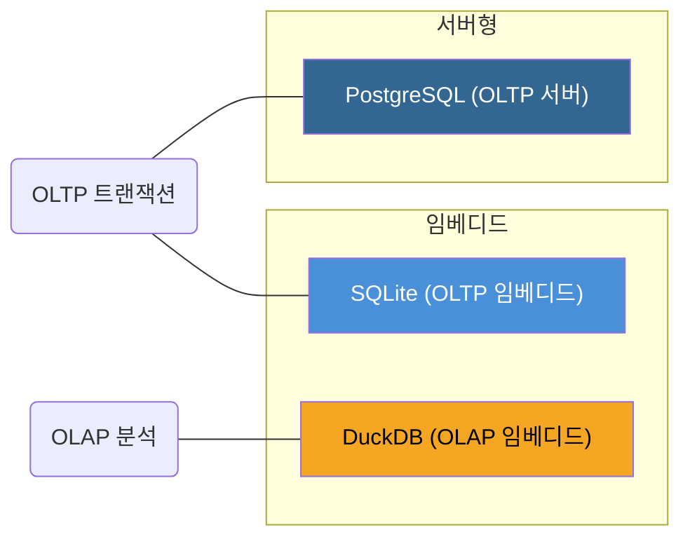
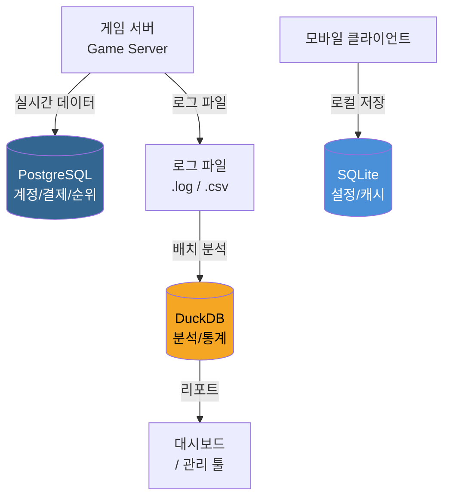

# 제1장: DuckDB란 무엇인가?

> "가장 빠른 것이 항상 좋은 것은 아니다. 하지만 빠르고 단순하며 강력하다면, 그것은 다르다."

이 장에서는 DuckDB가 무엇인지, 왜 탄생했는지, 그리고 어떤 상황에서 사용하면 좋은지를 살펴본다. 설치나 코드는 2장부터 나온다. 1장은 DuckDB를 처음 만나는 자리이므로, 개념과 철학을 충분히 이해하고 넘어가는 것이 목표다.

---

## 1.1 DuckDB의 탄생 배경과 철학

### 왜 DuckDB가 만들어졌는가?
2019년, 네덜란드 암스테르담의 CWI(Centrum Wiskunde & Informatica) 연구소에서 두 명의 연구자 — **Mark Raasveldt**와 **Hannes Mühleisen** — 가 하나의 불편함에서 출발했다. 그들은 데이터 분석 작업을 할 때마다 PostgreSQL 같은 무거운 서버형 데이터베이스를 띄우거나, Python의 pandas처럼 메모리에 전부 올려야 하는 도구를 써야 했다. 중간 어딘가에 딱 맞는 도구가 없었다.

데이터 분석 작업을 생각해보자. 게임 서버에서 수백만 건의 로그가 쌓인다. 이걸 분석하려면 어떻게 해야 할까?

- **방법 1**: MySQL/PostgreSQL 서버를 별도로 운영한다. → 서버 관리 부담, 복잡한 설정
- **방법 2**: Python + pandas로 CSV를 읽어 들인다. → 파일이 크면 메모리 부족, 느린 처리
- **방법 3**: 하둡/스파크 클러스터를 구축한다. → 오버엔지니어링, 비용과 운영 부담

이 세 가지 방법은 모두 "도구가 목적보다 크다"는 문제를 안고 있다. 단순히 **"이 파일에서 이 데이터를 빠르게 집계하고 싶다"** 는 욕구를 충족시키기에는 지나치게 무겁다.

DuckDB는 바로 이 틈새를 노렸다. SQLite처럼 서버가 필요 없고 파일 하나로 동작하면서, 분석 쿼리는 PostgreSQL 못지않게 빠른 데이터베이스. 이것이 DuckDB의 출발점이다.

### DuckDB의 철학: "분석을 위한 SQLite"
DuckDB 팀은 자신들의 프로젝트를 가리켜 종종 **"OLAP을 위한 SQLite"** 라고 부른다. SQLite가 트랜잭션 처리(OLTP)를 위한 임베디드 데이터베이스의 표준이라면, DuckDB는 분석 처리(OLAP)를 위한 임베디드 데이터베이스의 표준을 목표로 한다.

DuckDB의 핵심 철학은 세 가지로 정리된다:

| 철학 | 의미 |
|------|------|
| **심플함** | 설치가 필요 없다. 라이브러리 하나면 충분하다. |
| **이식성** | 서버 없이 프로세스 안에 내장(embed)된다. |
| **성능** | 분석 쿼리에 최적화된 컬럼 지향 엔진을 사용한다. |

오리(Duck)를 마스코트로 선택한 것도 우연이 아니다. 오리는 물(스트리밍), 땅(파일), 하늘(인메모리) 어디서든 잘 적응하는 동물이다. DuckDB도 마찬가지로 CSV, Parquet, JSON, 인메모리 데이터 등 다양한 형태의 데이터를 자유롭게 다룰 수 있다.

```
          DuckDB 철학 한눈에 보기

  ┌──────────────────────────────────┐
  │                                  │
  │   설치 없이   쿼리 한 줄로   빠르게 │
  │                                  │
  │    CSV ──┐                       │
  │  Parquet─┼──▶ DuckDB ──▶ 결과    │
  │    JSON ─┘                       │
  │                                  │
  └──────────────────────────────────┘
```

### 온라인 게임 개발자에게 DuckDB가 의미하는 것
온라인 게임 서버를 개발하다 보면 항상 마주치는 질문이 있다.

> "오늘 접속자 중에서 레벨 50 이상이면서 PvP를 10번 이상 한 유저가 몇 명이야?"

이런 질문에 답하려면 로그 파일을 열거나 분석 전용 DB에 쿼리를 날려야 한다. 실시간 게임 서버 DB(MySQL, Redis)에 이런 집계 쿼리를 던지면 서비스가 느려진다. 그렇다고 별도 데이터 웨어하우스를 구축하기엔 팀 규모가 작다.

DuckDB는 이 문제를 **C# 코드 몇 줄** 로 해결해준다. 로그 파일을 그대로 SQL로 분석하면 된다.

**핵심 포인트**
- DuckDB는 2019년 CWI 연구소에서 탄생한 오픈소스 분석용 데이터베이스다.
- 서버 없이 라이브러리 형태로 동작하는 임베디드 DB이다.
- "분석을 위한 SQLite"라는 철학 아래 단순함, 이식성, 성능을 추구한다.

---

## 1.2 OLTP vs OLAP — 왜 두 가지 DB가 필요한가?

### 두 가지 다른 세계
데이터베이스를 이야기할 때 가장 중요한 구분선이 바로 **OLTP**와 **OLAP**이다. 이 두 개념을 제대로 이해하면 왜 MySQL과 DuckDB가 공존해야 하는지 자연스럽게 납득된다.

**OLTP(Online Transaction Processing)** 는 "지금 이 순간의 데이터를 빠르게 읽고 쓰는" 작업이다. 온라인 게임에서는 다음과 같은 상황이 OLTP다:

- 플레이어가 아이템을 구매한다 → 인벤토리 DB에 INSERT
- 플레이어 HP가 줄어든다 → 캐릭터 DB를 UPDATE
- 로그인 처리 → 세션 DB를 SELECT

이런 작업은 **한 번에 소수의 행**을 다루며, **응답 속도가 밀리초** 단위여야 한다. 데이터 정확성과 동시성 처리(여러 명이 동시에 접근)가 핵심이다.

**OLAP(Online Analytical Processing)** 는 "쌓인 데이터를 집계하고 패턴을 찾는" 작업이다. 온라인 게임에서는 다음과 같은 상황이 OLAP다:

- 지난 30일간 서버별 일별 접속자 추이 분석
- 레벨 구간별 평균 플레이 시간 집계
- 특정 이벤트 기간 중 아이템 드롭률 검증
- 이탈 유저 패턴 분석

이런 작업은 **수백만~수억 행**을 스캔하며, **응답 시간이 몇 초에서 몇 분** 까지 걸려도 괜찮다. 대신 엄청난 양의 데이터를 빠르게 집계하는 능력이 핵심이다.

### 두 세계의 충돌



OLTP DB에 OLAP 쿼리를 날리면 어떻게 될까? 예를 들어 1천만 건의 로그가 쌓인 MySQL 테이블에서 이런 쿼리를 실행한다고 해보자:

```sql
SELECT
    DATE(login_time) AS day,
    COUNT(DISTINCT user_id) AS dau
FROM game_logs
WHERE server_id = 'KR-01'
  AND login_time >= '2025-01-01'
GROUP BY DATE(login_time)
ORDER BY day;
```

이 쿼리가 실행되는 동안 MySQL은 수백만 행의 데이터를 스캔한다. 그 시간 동안 같은 DB를 사용하는 게임 서버의 응답 속도가 느려진다. 최악의 경우 서버 장애로 이어진다.

반대로 DuckDB에 실시간 트랜잭션 처리를 맡기면? 동시에 수천 명의 플레이어가 초당 수천 건의 쓰기 작업을 요청하는 게임 서버 환경에서 DuckDB는 적합하지 않다. DuckDB는 그 용도로 설계되지 않았다.

### 적재적소의 원칙

```
  OLTP (트랜잭션)          OLAP (분석)
  ───────────────          ─────────────
  MySQL, PostgreSQL  vs   DuckDB, ClickHouse
  Redis, MongoDB          BigQuery, Snowflake

  빠른 쓰기/읽기             대용량 집계
  소수 행 처리               수백만 행 처리
  동시성 중요                처리량 중요
  데이터 수정 多              데이터 조회 多
```

게임 서버 아키텍처에서 두 종류의 DB는 함께 쓰인다. **MySQL은 실시간 게임 데이터를 관리하고, DuckDB는 분석과 리포팅을 담당한다.** 이 역할 분담이 잘 이루어질 때 시스템 전체가 안정적이고 효율적으로 동작한다.

**핵심 포인트**
- OLTP는 실시간 트랜잭션(INSERT/UPDATE/DELETE)에 최적화된 DB 패러다임이다.
- OLAP는 대용량 데이터 집계와 분석에 최적화된 DB 패러다임이다.
- 게임 서버에서는 OLTP(MySQL)와 OLAP(DuckDB)를 역할에 따라 함께 사용한다.

---

## 1.3 DuckDB의 핵심 특징 (임베디드, 컬럼 지향, 인메모리)

### 특징 1: 임베디드(Embedded) 데이터베이스
DuckDB의 가장 큰 특징 중 하나는 **임베디드 방식**으로 동작한다는 점이다. 임베디드 데이터베이스란, 별도의 서버 프로세스 없이 애플리케이션 프로세스 안에 직접 내장되어 실행되는 데이터베이스를 말한다.

MySQL이나 PostgreSQL은 클라이언트-서버(Client-Server) 구조다:

```
  클라이언트-서버 구조 (MySQL 방식)

  ┌─────────────────┐     TCP/IP     ┌─────────────────┐
  │   C# 게임 서버   │ ──────────── │  MySQL 서버      │
  │   (클라이언트)   │              │  (별도 프로세스)  │
  └─────────────────┘              └─────────────────┘

  임베디드 구조 (DuckDB 방식)

  ┌──────────────────────────────────┐
  │          C# 게임 분석 도구        │
  │                                  │
  │   비즈니스 로직  +  DuckDB 엔진   │
  │              (같은 프로세스)      │
  └──────────────────────────────────┘
```

임베디드 방식의 장점은 다음과 같다:

- **네트워크 오버헤드 없음**: 데이터가 프로세스 내부에서 이동하므로 TCP/IP 통신이 불필요하다.
- **설치 간편**: 서버 설치, 설정, 포트 개방, 방화벽 설정이 필요 없다. NuGet 패키지 하나면 끝이다.
- **배포 단순화**: 분석 도구를 배포할 때 DB 서버를 따로 준비할 필요가 없다.
- **단일 파일**: 데이터베이스 전체가 `.duckdb` 파일 하나에 담긴다.

C#에서 DuckDB를 사용할 때의 코드를 간단히 미리 살펴보자:

```csharp
// 서버 연결 설정? 필요 없다. 파일 경로만 있으면 된다.
using var db = new DuckDBConnection("Data Source=game_logs.duckdb");
db.Open();
// 이게 전부다.
```

### 특징 2: 컬럼 지향(Columnar) 스토리지
DuckDB를 분석에서 빠르게 만드는 핵심 기술은 **컬럼 지향 스토리지(Columnar Storage)** 다. 전통적인 OLTP 데이터베이스는 **행 지향(Row-Oriented)** 으로 데이터를 저장하는 반면, DuckDB는 열(Column) 단위로 저장한다.

게임 로그 테이블을 예로 들어보자:

```
[행 지향 저장 방식 - MySQL 스타일]

Row 1: [user_id=101, server='KR-01', level=50, play_time=3600, item_count=25]
Row 2: [user_id=102, server='KR-01', level=32, play_time=1800, item_count=10]
Row 3: [user_id=103, server='KR-02', level=78, play_time=7200, item_count=60]

→ 데이터가 행 단위로 연속 저장됨


[컬럼 지향 저장 방식 - DuckDB 스타일]

user_id  컬럼: [101, 102, 103, ...]
server   컬럼: ['KR-01', 'KR-01', 'KR-02', ...]
level    컬럼: [50, 32, 78, ...]
play_time컬럼: [3600, 1800, 7200, ...]
item_count컬럼: [25, 10, 60, ...]

→ 데이터가 열 단위로 연속 저장됨
```

이 차이가 왜 중요한가? 분석 쿼리를 생각해보자:

```sql
SELECT AVG(play_time), MAX(level)
FROM game_logs
WHERE server = 'KR-01';
```

이 쿼리는 `play_time`, `level`, `server` 세 개의 컬럼만 필요하다. **컬럼 지향 방식에서는 이 세 컬럼의 데이터만 디스크에서 읽으면 된다.** 나머지 컬럼(`user_id`, `item_count` 등)은 건드리지 않는다.

반면 행 지향 방식에서는 필요한 컬럼이 행 전체에 섞여 있기 때문에 모든 행을 통째로 읽어야 한다. 컬럼이 100개인 테이블에서 3개 컬럼만 필요해도 100개를 전부 읽는다.

추가로 컬럼 지향은 **데이터 압축**에도 유리하다. 같은 종류의 데이터가 연속으로 저장되기 때문에 압축률이 훨씬 높다. 레벨 컬럼에 50, 50, 51, 50 같은 비슷한 값이 연속되면 압축이 매우 잘 된다.

### 특징 3: 벡터화 실행 엔진(Vectorized Execution)
DuckDB는 단순히 컬럼 방식으로 저장하는 것에서 그치지 않는다. 쿼리를 실행할 때 **벡터화(Vectorized)** 방식을 사용한다. 한 번에 하나의 행을 처리하는 대신, 한 번에 수천 개의 값을 CPU의 SIMD 명령어로 병렬 처리한다.

```
  일반 실행 방식: 행 하나씩 처리

  Row 1 처리 → Row 2 처리 → Row 3 처리 → ... → Row N 처리


  벡터화 실행 방식: 블록 단위 처리

  [Row 1~1024 블록 처리] → [Row 1025~2048 블록 처리] → ...
       ↓
  CPU SIMD 명령어로 1024개 동시 연산
```

이것이 DuckDB가 동일한 하드웨어에서도 전통적인 DB보다 분석 쿼리를 수십 배 빠르게 처리할 수 있는 이유다.

### 특징 4: 인메모리와 영구 저장 모두 지원
DuckDB는 두 가지 모드로 운영할 수 있다:

- **인메모리 모드**: 데이터가 RAM에만 존재한다. 프로세스 종료 시 사라진다. 임시 분석이나 테스트에 적합하다.
- **파일 모드**: 데이터가 `.duckdb` 파일에 영구 저장된다. 일반적인 데이터베이스처럼 사용한다.

```csharp
// 인메모리 모드
var db = new DuckDBConnection(":memory:");

// 파일 모드
var db = new DuckDBConnection("Data Source=game_analytics.duckdb");
```

**핵심 포인트**
- DuckDB는 서버 없이 애플리케이션 안에 내장되는 임베디드 DB다.
- 컬럼 지향 스토리지로 분석 쿼리 시 필요한 컬럼만 읽어 성능이 높다.
- 벡터화 실행 엔진으로 CPU의 SIMD를 활용해 대용량 데이터를 빠르게 처리한다.
- 인메모리 모드와 파일 모드를 모두 지원한다.

---

## 1.4 DuckDB vs SQLite vs PostgreSQL — 언제 무엇을 쓰나?

### 세 가지 데이터베이스의 포지셔닝
이 세 가지 데이터베이스는 자주 비교된다. 각자 명확한 강점이 있고, 서로 경쟁 상대라기보다는 역할이 다른 도구다.



### 상세 비교표

| 항목 | SQLite | DuckDB | PostgreSQL |
|------|--------|--------|------------|
| **용도** | OLTP (임베디드) | OLAP (분석) | OLTP (서버) |
| **서버 필요** | 불필요 | 불필요 | 필요 |
| **저장 방식** | 행 지향 | 컬럼 지향 | 행 지향 |
| **동시 쓰기** | 제한적 | 제한적 | 우수 |
| **분석 쿼리** | 느림 | 매우 빠름 | 중간 |
| **트랜잭션 처리** | 우수 | 제한적 | 매우 우수 |
| **대용량 집계** | 느림 | 매우 빠름 | 중간 |
| **설치 복잡도** | 매우 낮음 | 매우 낮음 | 중간~높음 |
| **CSV/Parquet 직접 읽기** | 불가 | 가능 | 불가 |

### SQLite를 선택해야 할 때

- 모바일 앱, 데스크톱 앱에서 로컬 데이터를 저장하고 관리할 때
- 간단한 설정 파일 대신 구조화된 데이터가 필요할 때
- 쓰기 작업이 빈번하고 행 단위 접근이 많을 때

게임에서의 예: 클라이언트 게임 내 설정 저장, 오프라인 캐싱, 소규모 로컬 데이터 관리

### DuckDB를 선택해야 할 때

- 로그 파일, CSV, Parquet 등의 대용량 파일을 SQL로 분석할 때
- 통계 집계, KPI 대시보드, 데이터 탐색 작업을 할 때
- 별도 DB 서버를 운영하기 어려운 환경에서 분석이 필요할 때
- 데이터 파이프라인의 ETL 중간 처리 단계로 사용할 때

게임에서의 예: 일별/주별 게임 지표 분석, 이벤트 효과 측정, 유저 행동 패턴 분석, 밸런스 데이터 검증

### PostgreSQL을 선택해야 할 때

- 다수의 클라이언트가 동시에 데이터를 읽고 쓰는 환경일 때
- 데이터 무결성과 ACID 트랜잭션이 매우 중요할 때
- 복잡한 관계형 데이터 모델이 필요할 때
- 팀 전체가 공유하는 중앙 데이터베이스가 필요할 때

게임에서의 예: 게임 계정 관리, 결제 처리, 공식 순위 시스템, 다중 서버 공유 데이터

### 함께 사용하는 아키텍처

현실에서 이 세 가지는 서로 배타적이지 않다. 게임 서버에서 흔히 쓰이는 구성은 다음과 같다:



**핵심 포인트**
- SQLite는 OLTP 임베디드, DuckDB는 OLAP 임베디드, PostgreSQL은 OLTP 서버형이다.
- 세 DB는 경쟁 관계가 아니라 역할이 다른 상호 보완적 도구다.
- DuckDB는 대용량 파일을 직접 읽어 SQL로 분석하는 기능이 독보적이다.

---

## 1.5 DuckDB가 빛나는 사용 사례

### 사례 1: 게임 로그 배치 분석

가장 흔하고 강력한 DuckDB 활용 사례다. 게임 서버는 매일 수백 MB~수 GB의 로그 파일을 생성한다. 이 로그들을 분석하여 DAU(Daily Active Users), 수익, 레텐션 등의 지표를 뽑아내야 한다.

DuckDB는 CSV나 Parquet 파일을 **서버 없이 직접 SQL로 쿼리**할 수 있다. 파일을 먼저 DB에 임포트할 필요도 없다.

```sql
-- 로그 파일을 직접 쿼리! 임포트 불필요
SELECT
    strftime(login_time, '%Y-%m-%d') AS date,
    COUNT(DISTINCT user_id) AS dau,
    AVG(session_duration) AS avg_session_min
FROM read_csv('game_logs_2025_*.csv')
WHERE server_region = 'KR'
GROUP BY 1
ORDER BY 1 DESC
LIMIT 30;
```

기존에 이 작업을 Python pandas로 하려면 수십 줄의 코드와 10분 이상의 처리 시간이 필요했다. DuckDB는 이것을 단 몇 초에 해결한다.

### 사례 2: 게임 밸런스 데이터 분석

게임 디자이너는 무기별 평균 피해량, 스킬 사용 빈도, 보스 처치 시간 분포 등을 분석하여 밸런스를 조정한다. 이런 작업은 전형적인 OLAP 쿼리다.

```sql
-- 직업별, 레벨 구간별 평균 DPS 분석
SELECT
    character_class,
    FLOOR(character_level / 10) * 10 AS level_range,
    AVG(damage_per_second) AS avg_dps,
    PERCENTILE_CONT(0.5) WITHIN GROUP (ORDER BY damage_per_second) AS median_dps,
    COUNT(*) AS sample_count
FROM combat_logs
WHERE battle_type = 'boss'
  AND recorded_at >= CURRENT_DATE - INTERVAL '7 days'
GROUP BY 1, 2
ORDER BY 1, 2;
```

이런 통계 함수들을 DuckDB는 기본으로 지원하며, 수백만 행 데이터도 몇 초 내에 결과를 반환한다.

### 사례 3: 실시간에 가까운 이벤트 효과 측정

게임 이벤트를 오픈했을 때, 기획자는 몇 시간 뒤에 "이벤트 아이템 드롭률이 예상대로 나오고 있나?"를 확인하고 싶어한다. DuckDB를 활용한 분석 도구가 있으면 로그 파일을 바로 쿼리하여 답을 얻을 수 있다.

```
이벤트 오픈 후 모니터링 플로우

  게임 서버 ──▶ 로그 파일 ──▶ DuckDB 분석 ──▶ 기획자 대시보드
  (실시간 기록)  (5분 단위 갱신)  (SQL 집계)      (수치 확인)
```

### 사례 4: ETL 파이프라인의 중간 처리

데이터를 한 형식에서 다른 형식으로 변환하거나, 여러 파일을 병합하고 정제하는 ETL(Extract, Transform, Load) 작업에서도 DuckDB가 빛난다.

예를 들어 여러 서버의 로그 파일(CSV)을 읽어서 정제한 후 분석용 Parquet 파일로 저장하는 작업을 DuckDB 하나로 처리할 수 있다:

```sql
-- 여러 CSV를 읽어서 정제 후 Parquet으로 저장
COPY (
    SELECT
        user_id,
        server_id,
        DATE_TRUNC('hour', event_time) AS hour_bucket,
        event_type,
        COUNT(*) AS event_count
    FROM read_csv('logs/server_*/events_*.csv')
    WHERE event_time >= '2025-01-01'
    GROUP BY 1, 2, 3, 4
) TO 'processed/hourly_events.parquet' (FORMAT PARQUET, COMPRESSION ZSTD);
```

### 사례 5: 분석 도구 내장

게임 운영 툴이나 관리자 대시보드를 만들 때, DuckDB를 직접 C# 코드에 내장하면 별도 분석 서버 없이도 강력한 데이터 탐색 기능을 제공할 수 있다.

```
  ┌─────────────────────────────────────────┐
  │         게임 운영 관리 도구 (C#)          │
  │                                         │
  │  ┌──────────┐    ┌──────────────────┐   │
  │  │  UI 화면  │◀──│  DuckDB 내장 엔진 │   │
  │  │ (WPF/웹) │    │  (분석 쿼리 처리) │   │
  │  └──────────┘    └──────────────────┘   │
  │                         ▲               │
  │                   로그 파일 직접 읽기     │
  └─────────────────────────────────────────┘
```

이 구조에서는 별도의 분석 서버, 데이터 파이프라인, DB 관리자가 필요 없다. 운영 툴 자체가 분석 능력을 보유하게 된다.

### 사례 6: 개발/QA 환경에서 데이터 검증

개발 중이나 QA 테스트 중에 "이 기능이 DB에 올바른 데이터를 쓰고 있는가?"를 검증할 때도 DuckDB가 유용하다. 서버를 따로 세우지 않고, 저장된 파일이나 인메모리 DB를 바로 쿼리하여 검증할 수 있다.

```csharp
// 단위 테스트에서 DuckDB 활용
[Test]
public void TestGameLogWriter_ShouldSaveCorrectData()
{
    using var db = new DuckDBConnection(":memory:");
    // ... 테스트 로직
}
```

**핵심 포인트**
- DuckDB는 CSV/Parquet 파일을 임포트 없이 직접 SQL로 분석할 수 있다.
- 게임 로그 분석, 밸런스 검증, 이벤트 효과 측정 등 게임 개발 전반에 활용된다.
- C# 코드에 내장하여 별도 서버 없이 강력한 분석 기능을 구현할 수 있다.

---

## 이 장의 핵심 정리

이 장에서 배운 내용을 정리해보자.

| 주제 | 핵심 내용 |
|------|-----------|
| **DuckDB 탄생** | 2019년 CWI 연구소에서 "분석을 위한 SQLite"를 목표로 개발 시작 |
| **OLTP vs OLAP** | OLTP는 실시간 트랜잭션, OLAP는 대용량 집계 분석. 게임 서버에서 둘 다 필요 |
| **핵심 특징** | 임베디드(서버 불필요), 컬럼 지향 스토리지, 벡터화 실행 엔진 |
| **DB 비교** | SQLite(OLTP 임베디드), DuckDB(OLAP 임베디드), PostgreSQL(OLTP 서버) |
| **주요 사례** | 로그 배치 분석, 밸런스 검증, ETL 처리, 관리 도구 내장 |

DuckDB를 한 문장으로 표현하면 이렇다:

> **서버 없이, 파일 하나로, SQL 한 줄로, 수백만 행을 몇 초에 분석하는 데이터베이스.**

이것이 DuckDB가 온라인 게임 서버 개발자에게 특히 매력적인 이유다. 무거운 인프라 없이도 강력한 데이터 분석 능력을 코드에 심을 수 있다.

---

## 다음 장 예고

1장에서는 DuckDB가 무엇인지, 어떤 철학을 가지고 있는지 이해했다. 머릿속에 그림은 그려졌지만 아직 실제로 손을 대보지는 않았다.

**2장에서는 본격적으로 실습 환경을 구축한다.** Windows 11 환경에서 DuckDB CLI를 설치하고, C# (.NET 9) 프로젝트에 DuckDB NuGet 패키지를 추가하는 과정을 단계별로 진행한다. 2장을 마치면 "Hello, DuckDB!"를 출력하는 첫 번째 C# 프로그램이 동작하게 된다.

---

*저자: 최흥배, AI-Assisted*
