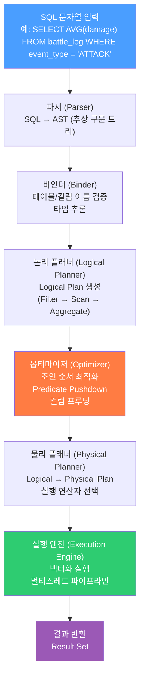

# 제3장: DuckDB 핵심 아키텍처 이해
2장에서는 DuckDB를 설치하고 CLI를 통해 첫 쿼리를 실행해보았다. 이제 "왜 DuckDB가 빠른가?"라는 질문에 답할 차례다. 이 장에서는 DuckDB 내부에서 무슨 일이 일어나는지, 어떤 설계 원칙 덕분에 대용량 분석 쿼리가 빠르게 동작하는지를 파헤친다.

원리를 이해하면 쿼리를 잘못 작성했을 때 왜 느린지, 어떤 상황에서 DuckDB가 빛을 발하는지를 스스로 판단할 수 있게 된다. 마치 자동차 엔진 구조를 알면 왜 RPM을 유지해야 하는지 이해하는 것과 같다.

---

## 3.1 컬럼 지향 스토리지(Columnar Storage)란?

### 데이터를 어떻게 저장하느냐가 성능을 결정한다
데이터베이스가 데이터를 디스크에 저장하는 방식은 크게 두 가지로 나뉜다. **행 지향(Row-Oriented)** 방식과 **컬럼 지향(Column-Oriented)** 방식이다. 이 둘의 차이는 단순해 보이지만, 실제 성능에는 엄청난 차이를 만들어낸다.

온라인 게임에서 플레이어의 전투 로그를 저장한다고 상상해보자. 테이블은 다음과 같이 생겼다.

```
┌──────────────┬──────────────┬──────────────┬──────────────┬──────────────┐
│ player_id    │ event_type   │ damage       │ target_id    │ timestamp    │
├──────────────┼──────────────┼──────────────┼──────────────┼──────────────┤
│ 1001         │ ATTACK       │ 350          │ 9001         │ 2024-01-01   │
│ 1002         │ SKILL        │ 820          │ 9002         │ 2024-01-01   │
│ 1001         │ ATTACK       │ 270          │ 9001         │ 2024-01-01   │
│ 1003         │ ITEM         │ 0            │ 1003         │ 2024-01-01   │
└──────────────┴──────────────┴──────────────┴──────────────┴──────────────┘
```

### 행 지향 스토리지 — 레코드를 통째로 묶는다
**행 지향 스토리지**는 한 레코드의 모든 컬럼 값을 연속된 메모리/디스크 공간에 함께 저장한다. MySQL, PostgreSQL 같은 전통적인 OLTP 데이터베이스가 이 방식을 쓴다.

```
행 지향 스토리지 (Row-Oriented)
━━━━━━━━━━━━━━━━━━━━━━━━━━━━━━━━━━━━━━━━━━━━━━━━━━━━━━━━━
디스크 블록 1:
  [1001│ATTACK│350│9001│2024-01-01][1002│SKILL│820│9002│2024-01-01]
디스크 블록 2:
  [1001│ATTACK│270│9001│2024-01-01][1003│ITEM│0│1003│2024-01-01]
━━━━━━━━━━━━━━━━━━━━━━━━━━━━━━━━━━━━━━━━━━━━━━━━━━━━━━━━━
  → 한 행 전체를 빠르게 읽고 쓸 수 있음
  → 특정 컬럼만 읽으려 해도 전체 행을 다 읽어야 함
```

행 지향은 "특정 플레이어(player_id=1001)의 최근 이벤트 10개를 조회하라"는 요청에 최적화되어 있다. 한 행 전체를 한 번에 읽고 쓰는 OLTP(Online Transaction Processing) 작업에 강하다.

### 컬럼 지향 스토리지 — 같은 컬럼끼리 묶는다
**컬럼 지향 스토리지**는 같은 컬럼에 속하는 값들만 모아서 연속된 공간에 저장한다. DuckDB, ClickHouse, Parquet 파일 형식이 이 방식을 쓴다.

```
컬럼 지향 스토리지 (Column-Oriented)
━━━━━━━━━━━━━━━━━━━━━━━━━━━━━━━━━━━━━━━━━━━━━━━━━━━━━━━━━
player_id 컬럼:  [1001][1002][1001][1003]
event_type 컬럼: [ATTACK][SKILL][ATTACK][ITEM]
damage 컬럼:     [350][820][270][0]
target_id 컬럼:  [9001][9002][9001][1003]
timestamp 컬럼:  [2024-01-01][2024-01-01][2024-01-01][2024-01-01]
━━━━━━━━━━━━━━━━━━━━━━━━━━━━━━━━━━━━━━━━━━━━━━━━━━━━━━━━━
  → 특정 컬럼만 읽을 때 해당 컬럼 데이터만 로드
  → 동일 타입 데이터가 연속 → 압축률이 극도로 높아짐
```

이 두 방식을 나란히 비교하면 다음과 같다.

```
┌─────────────────────────────────────────────────────────────────┐
│          행 지향 vs 컬럼 지향 — 분석 쿼리 시나리오 비교          │
├───────────────────────────┬─────────────────────────────────────┤
│  행 지향 (Row-Oriented)   │  컬럼 지향 (Column-Oriented)       │
├───────────────────────────┼─────────────────────────────────────┤
│  쿼리: SELECT AVG(damage) │  쿼리: SELECT AVG(damage)           │
│  FROM battle_log          │  FROM battle_log                    │
│                           │                                     │
│  읽는 데이터:             │  읽는 데이터:                       │
│  ████ ████ ████ ████      │  ░░░░ ░░░░ ████ ░░░░               │
│  (모든 컬럼 전부 읽음)    │  (damage 컬럼만 읽음)              │
│                           │                                     │
│  I/O 비용: 100%           │  I/O 비용: 20% (5개 컬럼 중 1개)  │
├───────────────────────────┼─────────────────────────────────────┤
│  장점: 단건 삽입/조회 빠름│  장점: 집계/분석 쿼리 압도적 빠름  │
│  단점: 분석 쿼리 시 낭비  │  단점: 단건 삽입/수정이 상대적 느림│
└───────────────────────────┴─────────────────────────────────────┘
```

### 압축의 마법
컬럼 지향 스토리지의 또 다른 강점은 **압축 효율**이다. 같은 타입의 데이터가 연속으로 놓이면 다음 기법들이 극도로 효과적으로 작동한다.

- **Run-Length Encoding(RLE)**: `[ATTACK, ATTACK, ATTACK, SKILL, SKILL]`은 `[(ATTACK, 3), (SKILL, 2)]`로 압축
- **Dictionary Encoding**: `event_type` 컬럼에서 ATTACK, SKILL, ITEM 세 종류만 있다면, 각 문자열을 숫자 코드로 대체
- **Delta Encoding**: timestamp처럼 순차적으로 증가하는 값은 차이(delta)만 저장

온라인 게임 로그처럼 같은 이벤트 타입이 수백만 번 반복되는 데이터는 컬럼 지향 + 압축 조합으로 **원본 대비 10~20배 이상** 작아지는 경우도 흔하다.

---
  

## 3.2 벡터화 실행 엔진(Vectorized Execution Engine)

### 한 번에 한 행씩? 아니면 한 번에 1024행씩?
데이터를 컬럼 형태로 저장했다면, 이제 "어떻게 계산하느냐"가 중요하다. 전통적인 실행 엔진은 **행 단위(row-at-a-time)** 로 작동한다. 반복문을 돌면서 한 행씩 꺼내와 처리하는 방식이다.

DuckDB는 **벡터화 실행(Vectorized Execution)** 방식을 사용한다. 이는 한 번에 수백~수천 행을 묶어서 처리하는 방식이다. 이 묶음을 **벡터(Vector)** 또는 **배치(Batch)** 라고 부른다. DuckDB의 기본 벡터 크기는 **2048행**이다.

```
행 단위 실행 vs 벡터화 실행 비교
━━━━━━━━━━━━━━━━━━━━━━━━━━━━━━━━━━━━━━━━━━━━━━━━━━━━━━━━━━━━━━━━━━

[행 단위 실행 — Row-at-a-Time]

  반복 1:  damage[0] = 350  → filter(damage > 200) → ✓ 통과
  반복 2:  damage[1] = 820  → filter(damage > 200) → ✓ 통과
  반복 3:  damage[2] = 270  → filter(damage > 200) → ✓ 통과
  반복 4:  damage[3] =   0  → filter(damage > 200) → ✗ 제외
  ...
  반복 N:  damage[N]        → ...

  → 함수 호출 오버헤드 N번 발생
  → CPU 파이프라인 예측 실패 빈번

━━━━━━━━━━━━━━━━━━━━━━━━━━━━━━━━━━━━━━━━━━━━━━━━━━━━━━━━━━━━━━━━━━

[벡터화 실행 — Vectorized Execution]

  벡터 입력: [350, 820, 270, 0, 450, 610, ..., 990]  (2048개)
              ↓ filter(damage > 200) — 한 번의 벡터 연산
  벡터 출력: [350, 820, 270, ─, 450, 610, ..., 990]  (조건 충족만)
              ↓ sum() — 한 번의 벡터 합산
  결과:      단일 값

  → 함수 호출 오버헤드 1번 (2048행 처리)
  → CPU SIMD 명령어 활용 가능
  → CPU 캐시 히트율 극대화

━━━━━━━━━━━━━━━━━━━━━━━━━━━━━━━━━━━━━━━━━━━━━━━━━━━━━━━━━━━━━━━━━━
```

### SIMD — CPU의 숨겨진 무기
현대 CPU는 **SIMD(Single Instruction, Multiple Data)** 명령어 세트를 지원한다. SIMD를 쓰면 하나의 명령어로 여러 데이터를 동시에 처리할 수 있다. 예를 들어 256비트 SIMD 레지스터에 32비트 정수를 8개 담아 한 번에 비교 연산을 수행할 수 있다.

벡터화 실행은 이 SIMD를 최대한 활용하도록 설계되어 있다. 전투 로그 테이블에서 `damage > 200`인 행을 필터링할 때, 이론적으로 8개씩 병렬 비교를 수행하므로 처리 속도가 최대 8배 빨라진다.

### 게임 서버에서의 실감
온라인 게임에서 "지난 1시간 동안 damage 합계가 10,000 이상인 플레이어를 찾아라"라는 분석 쿼리를 수백만 건의 로그에 실행한다고 가정하자. 행 단위 실행은 수십 초가 걸릴 수 있지만, DuckDB의 벡터화 실행은 **수백 밀리초~수 초** 이내에 결과를 낸다. 실시간 게임 운영 대시보드에서 이 차이는 사용자 경험을 완전히 바꾼다.

---

## 3.3 WAL과 ACID 트랜잭션 처리

### DuckDB도 안전하다
"DuckDB는 분석용 데이터베이스라서 데이터 안전성은 부족하지 않을까?"라는 의심을 가질 수 있다. 결론부터 말하면 DuckDB는 **완전한 ACID 트랜잭션**을 지원한다.

- **A**tomicity(원자성): 트랜잭션 내의 모든 작업이 완전히 성공하거나 완전히 실패한다.
- **C**onsistency(일관성): 트랜잭션 전후로 데이터베이스는 항상 유효한 상태를 유지한다.
- **I**solation(격리성): 동시에 실행되는 트랜잭션이 서로 간섭하지 않는다.
- **D**urability(지속성): 커밋된 트랜잭션은 시스템 장애가 발생해도 유지된다.

### WAL(Write-Ahead Logging) 메커니즘
DuckDB는 **WAL(Write-Ahead Log)** 을 사용해 내구성을 보장한다. WAL의 원칙은 간단하다: **"실제 데이터를 변경하기 전에, 변경 내용을 로그 파일에 먼저 기록한다."**

```
WAL 동작 원리
━━━━━━━━━━━━━━━━━━━━━━━━━━━━━━━━━━━━━━━━━━━━━━━━━━━━━━━━━━━━━━━━━━

  애플리케이션
      │
      ▼
  BEGIN TRANSACTION
      │
      ├──────────────────────────────────────────────────▶ WAL 파일
      │   1) "INSERT INTO battle_log ..." 기록             (wal 로그)
      │
      │   2) 메모리 버퍼에 데이터 반영
      │
      ├──────────────────────────────────────────────────▶ WAL 파일
      │   3) "COMMIT" 기록 (이 시점부터 데이터는 안전)
      │
      │   4) (백그라운드) 메모리 버퍼 → 실제 .duckdb 파일
      │
  COMMIT 완료
      │
      ▼
  클라이언트에게 성공 응답

━━━━━━━━━━━━━━━━━━━━━━━━━━━━━━━━━━━━━━━━━━━━━━━━━━━━━━━━━━━━━━━━━━
  장애 발생 시:
  - WAL에 COMMIT이 기록된 트랜잭션 → 복구 시 재실행
  - WAL에 COMMIT이 없는 트랜잭션 → 복구 시 롤백
━━━━━━━━━━━━━━━━━━━━━━━━━━━━━━━━━━━━━━━━━━━━━━━━━━━━━━━━━━━━━━━━━━
```

DuckDB를 실행하면 `.wal` 확장자 파일이 생성되는 것을 볼 수 있다. 이 파일이 바로 WAL 로그 파일이다. 정상 종료 시에는 WAL 내용이 메인 파일로 합쳐지고 WAL 파일은 삭제된다.

### 격리 수준 — MVCC
DuckDB는 **MVCC(Multi-Version Concurrency Control)** 를 통해 격리성을 구현한다. 데이터를 변경할 때 원본을 바로 덮어쓰지 않고, 새로운 버전을 만들어 둔다. 읽기 트랜잭션은 자신이 시작된 시점의 스냅샷을 기준으로 데이터를 읽기 때문에, 쓰기가 진행 중이어도 블로킹 없이 데이터를 조회할 수 있다.

게임 서버 로그를 기록하는 쓰기 작업과, 운영팀이 실시간 집계를 조회하는 읽기 작업이 서로 블로킹하지 않고 동시에 실행될 수 있는 이유가 바로 MVCC 덕분이다.

### DuckDB의 동시성 제약
단, DuckDB는 단일 프로세스에서 **단일 쓰기자(Single Writer)** 모델을 따른다. 동시에 여러 프로세스가 같은 `.duckdb` 파일에 쓰기를 수행할 수는 없다. 이 점은 MySQL이나 PostgreSQL 같은 서버형 DBMS와 다른 부분이다. 게임 서버 구조 설계 시 이 제약을 염두에 두어야 한다.

---
  

## 3.4 파일 포맷 — `.duckdb`, Parquet, Arrow

### DuckDB가 이해하는 파일들
DuckDB는 단순히 자체 파일 형식만 지원하는 것이 아니라, 여러 파일 형식을 **네이티브**로 읽고 쓸 수 있다. 이는 DuckDB의 큰 강점 중 하나다.

### .duckdb — 메인 데이터베이스 파일
`.duckdb` 확장자를 가진 파일이 DuckDB의 주요 저장소다. 내부 구조는 컬럼 지향으로 구성되어 있으며, 다음 요소들을 포함한다.

```
.duckdb 파일 내부 구조 (개념)
━━━━━━━━━━━━━━━━━━━━━━━━━━━━━━━━━━━━━━━━━━━━━━━━━━━━━━━━━━━━━━━━━━
┌─────────────────────────────────────────────┐
│               .duckdb 파일                  │
├─────────────────────────────────────────────┤
│  Header (메타데이터, 버전 정보)             │
├─────────────────────────────────────────────┤
│  Catalog (테이블, 뷰, 스키마 정의)         │
├─────────────────────────────────────────────┤
│  Row Groups (실제 데이터 블록)              │
│  ┌────────────────────────────────────────┐ │
│  │ Row Group 1 (최대 122,880행)           │ │
│  │  ├─ Column Chunk: player_id            │ │
│  │  ├─ Column Chunk: event_type           │ │
│  │  ├─ Column Chunk: damage               │ │
│  │  └─ Column Chunk: timestamp            │ │
│  ├────────────────────────────────────────┤ │
│  │ Row Group 2                            │ │
│  │  └─ ...                                │ │
│  └────────────────────────────────────────┘ │
├─────────────────────────────────────────────┤
│  Indexes (선택적)                           │
└─────────────────────────────────────────────┘
━━━━━━━━━━━━━━━━━━━━━━━━━━━━━━━━━━━━━━━━━━━━━━━━━━━━━━━━━━━━━━━━━━
```

### Parquet — 업계 표준 컬럼 파일
**Apache Parquet**는 빅데이터 생태계에서 사실상의 표준 컬럼 지향 파일 형식이다. Spark, pandas, DuckDB, Snowflake 등 대부분의 분석 도구가 Parquet를 지원한다. DuckDB는 Parquet를 마치 테이블처럼 직접 쿼리할 수 있다.

```sql
-- Parquet 파일을 바로 쿼리
SELECT player_id, SUM(damage)
FROM read_parquet('battle_log_2024_01.parquet')
GROUP BY player_id;
```

Parquet의 특징은 다음과 같다.

- **컬럼 단위 저장 + 강력한 압축**: Snappy, Zstd, LZ4 등 다양한 압축 알고리즘 지원
- **스키마 내장**: 파일 자체에 컬럼 이름과 타입 정보가 포함되어 있음
- **Predicate Pushdown**: 파일을 전부 읽지 않고 Row Group 단위로 스킵 가능 (예: `WHERE timestamp >= '2024-01-15'` 조건으로 해당 날짜 범위의 Row Group만 읽음)

게임 서버에서 일별로 `battle_log_2024_01_15.parquet`처럼 파일을 나눠 저장하면, DuckDB가 불필요한 날짜의 파일을 통째로 건너뛸 수 있어 매우 효율적이다.

### Apache Arrow — 메모리 내 컬럼 형식
**Apache Arrow**는 디스크가 아닌 **메모리** 위에서의 컬럼 지향 데이터 표현 표준이다. Parquet가 저장 형식이라면, Arrow는 프로세스 간 데이터 교환(IPC, Inter-Process Communication)에 최적화된 인메모리 형식이다.

DuckDB는 Arrow를 통해 Python의 pandas DataFrame, R의 데이터 프레임, 그리고 C# 등 다양한 환경과 제로 카피(Zero-Copy) 또는 최소 복사로 데이터를 교환할 수 있다.

```
파일 포맷 비교
━━━━━━━━━━━━━━━━━━━━━━━━━━━━━━━━━━━━━━━━━━━━━━━━━━━━━━━━━
│ 형식     │ 주 용도          │ 저장 위치 │ 특징              │
├──────────┼──────────────────┼───────────┼───────────────────┤
│ .duckdb  │ 영구 저장        │ 디스크    │ DuckDB 전용       │
│ .parquet │ 파일 교환/아카이브│ 디스크    │ 업계 표준, 고압축  │
│ Arrow    │ 빠른 데이터 전달 │ 메모리    │ 제로카피, IPC     │
│ .csv     │ 단순 교환        │ 디스크    │ 범용, 비효율적    │
│ .json    │ 반정형 데이터    │ 디스크    │ 중첩 구조 지원    │
━━━━━━━━━━━━━━━━━━━━━━━━━━━━━━━━━━━━━━━━━━━━━━━━━━━━━━━━━
```

---
  

## 3.5 DuckDB 쿼리 실행 파이프라인

### SQL 한 줄이 결과가 되기까지
사용자가 SQL을 입력하면, DuckDB 내부에서는 여러 단계의 파이프라인을 통해 최적화되고 실행된다. 이 과정을 이해하면 왜 어떤 쿼리는 느리고 어떤 쿼리는 빠른지를 이해할 수 있다.



각 단계를 하나씩 살펴보자.

### 1단계: 파서(Parser)
QL 문자열을 읽어 **AST(Abstract Syntax Tree, 추상 구문 트리)** 로 변환한다. SQL 문법 오류가 있다면 이 단계에서 에러가 발생한다. DuckDB는 PostgreSQL의 파서를 기반으로 하며, 표준 SQL과 높은 호환성을 갖는다.

### 2단계: 바인더(Binder)
AST의 테이블 이름, 컬럼 이름이 실제로 존재하는지 확인하고, 각 표현식의 데이터 타입을 결정한다. `battle_log` 테이블이 없거나 `damage` 컬럼이 없다면 이 단계에서 에러가 발생한다.

### 3단계: 논리 플래너(Logical Planner)
검증된 쿼리를 **논리 실행 계획(Logical Plan)** 으로 변환한다. 이 계획은 "무엇을" 할지를 추상적으로 표현한다. 예를 들어 `Filter → TableScan → Aggregation` 같은 연산자 트리가 만들어진다.

### 4단계: 옵티마이저(Optimizer) — 핵심!
옵티마이저는 논리 계획을 더 효율적인 동등한 계획으로 변환하는 역할을 한다. DuckDB의 옵티마이저는 다음과 같은 최적화를 수행한다.

- **Predicate Pushdown**: `WHERE event_type = 'ATTACK'` 조건을 가능한 한 데이터 소스에 가깝게 밀어 넣어 불필요한 데이터 읽기를 줄인다.
- **Column Pruning(컬럼 가지치기)**: `SELECT AVG(damage)`만 필요하다면 나머지 컬럼(`player_id`, `target_id` 등)은 아예 읽지 않는다.
- **Join Order Optimization**: 여러 테이블을 조인할 때 최적의 조인 순서를 결정한다.
- **Common Subexpression Elimination**: 동일한 계산이 여러 번 나오면 한 번만 계산하고 재사용한다.

### 5단계: 물리 플래너(Physical Planner)
논리 계획을 실제로 실행할 수 있는 **물리 계획(Physical Plan)** 으로 변환한다. 어떤 해시 알고리즘을 쓸지, 어떤 조인 방식(Hash Join vs Nested Loop Join)을 선택할지 등 구체적인 구현 방법을 결정한다.

### 6단계: 실행 엔진(Execution Engine)
물리 계획을 실제로 실행한다. 앞서 설명한 **벡터화 실행**이 이 단계에서 이루어진다. DuckDB는 멀티스레드를 활용하여 여러 CPU 코어가 동시에 데이터를 처리한다.

### EXPLAIN으로 실행 계획 확인하기
DuckDB에서 `EXPLAIN` 명령어를 사용하면 실제 실행 계획을 눈으로 볼 수 있다.

```sql
EXPLAIN SELECT AVG(damage)
FROM battle_log
WHERE event_type = 'ATTACK';
```

출력 결과에서 `FILTER`, `SEQ_SCAN`, `AGGREGATE` 같은 연산자가 어떤 순서로 실행되는지 확인할 수 있다. 느린 쿼리를 디버깅할 때 매우 유용하다.

---
  

## 3.6 메모리 관리 및 스필(Spill-to-Disk)

### DuckDB는 메모리가 부족해도 포기하지 않는다
DuckDB의 뛰어난 특징 중 하나는 처리할 데이터가 가용 메모리보다 커도 **Out of Memory 에러 없이** 작업을 완료할 수 있다는 점이다. 이를 가능하게 하는 메커니즘이 **스필(Spill-to-Disk)** 이다.

### 메모리 관리 아키텍처
DuckDB는 **버퍼 관리자(Buffer Manager)** 를 통해 메모리를 관리한다. 모든 데이터 접근은 버퍼 관리자를 통하며, 메모리가 부족할 때 자동으로 디스크에 임시 데이터를 내보낸다(스필).

```
DuckDB 메모리 관리 구조
━━━━━━━━━━━━━━━━━━━━━━━━━━━━━━━━━━━━━━━━━━━━━━━━━━━━━━━━━━━━━━━━━━

  ┌──────────────────────────────────────────────────────────┐
  │                    쿼리 실행 엔진                         │
  │  ┌──────────────┐  ┌──────────────┐  ┌──────────────┐   │
  │  │  Hash Join   │  │  Sort        │  │  Aggregate   │   │
  │  │  (대용량)    │  │  (대용량)    │  │  (중간 집계) │   │
  └──┴──────┬───────┴──┴──────┬───────┴──┴──────┬───────┴───┘
             │                │                  │
             ▼                ▼                  ▼
  ┌──────────────────────────────────────────────────────────┐
  │                  버퍼 관리자 (Buffer Manager)            │
  │                                                          │
  │  메모리 한도: memory_limit (기본: 물리 메모리의 80%)    │
  │                                                          │
  │  ┌────────────────────────────────────────────────────┐  │
  │  │                  메모리 버퍼 풀                     │  │
  │  │   [Hot Page] [Hot Page] [Warm Page] [Cold Page]   │  │
  │  └────────────────────┬───────────────────────────────┘  │
  │                       │ 메모리 부족 시 LRU 방식으로 축출  │
  └───────────────────────┼──────────────────────────────────┘
                          │
                          ▼ 스필(Spill-to-Disk)
  ┌──────────────────────────────────────────────────────────┐
  │              임시 파일 (Temp Files)                      │
  │  /tmp/duckdb_temp_XXXXX.tmp                              │
  │  (쿼리 완료 후 자동 삭제)                                │
  └──────────────────────────────────────────────────────────┘

━━━━━━━━━━━━━━━━━━━━━━━━━━━━━━━━━━━━━━━━━━━━━━━━━━━━━━━━━━━━━━━━━━
```

### 스필이 발생하는 상황
스필은 주로 다음 세 가지 연산에서 발생한다.

**1. 대용량 해시 조인(Hash Join)**
두 테이블을 조인할 때 해시 테이블을 메모리에 구성하는데, 이 해시 테이블이 메모리 한도를 초과하면 파티션 단위로 디스크에 스필한다.

**2. 대용량 정렬(Sort)**
`ORDER BY`로 수억 건의 데이터를 정렬할 때, 모든 데이터를 메모리에 올릴 수 없다면 외부 정렬(External Sort) 알고리즘을 사용하여 임시 파일에 중간 결과를 기록한다.

**3. 집계(Aggregation)**
`GROUP BY` 결과의 고유 그룹 수가 매우 많을 때 중간 집계 결과를 스필할 수 있다.

### 메모리 설정 조정하기
DuckDB에서 메모리 한도를 직접 설정할 수 있다.

```sql
-- 메모리 한도를 4GB로 설정
SET memory_limit = '4GB';

-- 임시 디렉토리 지정 (스필 파일 저장 위치)
SET temp_directory = 'C:/duckdb_temp';

-- 현재 메모리 설정 확인
SELECT current_setting('memory_limit');
```

게임 서버에서 DuckDB를 운영할 때는 서버 메모리의 50~70% 정도를 `memory_limit`으로 설정하고, 스필 디렉토리에 충분한 디스크 공간을 확보해두는 것이 좋다.

### 메모리와 성능의 트레이드오프
스필이 발생하면 디스크 I/O가 추가되므로 성능이 느려진다. 하지만 에러 없이 작업을 완료할 수 있다. 가능하다면 스필 없이 작업이 완료되도록 메모리를 충분히 할당하거나, 쿼리를 작은 단위로 나누어 실행하는 것이 좋다.

```
메모리 상황별 성능 비교 (개념도)
━━━━━━━━━━━━━━━━━━━━━━━━━━━━━━━━━━━━━━━━━━━━━━━━━━━━━━━━━━━━━━━━━━
  메모리 충분 (스필 없음):
    쿼리 1억 건 집계 ─────────────────▶ 완료  [████████░░]  2초

  메모리 부족 (스필 발생):
    쿼리 1억 건 집계 ─────────────────▶ 완료  [██████████]  12초
                          ↓ 스필 발생
                      디스크 I/O 추가

  메모리 없음 (타 DBMS — 에러):
    쿼리 1억 건 집계 ──▶ ✗ Out of Memory Error!
━━━━━━━━━━━━━━━━━━━━━━━━━━━━━━━━━━━━━━━━━━━━━━━━━━━━━━━━━━━━━━━━━━
```

DuckDB는 "느려지더라도 완료한다"는 철학을 가지고 있다. 이는 데이터 분석 환경에서 매우 실용적인 접근이다.

---
  

## 이 장의 핵심 정리
이 장에서 배운 내용을 한눈에 정리해보자.

| 개념 | 핵심 내용 |
|------|-----------|
| **컬럼 지향 스토리지** | 같은 컬럼의 데이터를 연속 저장 → 분석 쿼리 시 필요한 컬럼만 읽음 → I/O 대폭 절감 |
| **압축** | 동일 타입 연속 데이터 → RLE, Dictionary Encoding 등으로 10~20배 압축 가능 |
| **벡터화 실행** | 한 번에 2048행씩 처리 → 함수 호출 오버헤드 감소, CPU SIMD 활용 |
| **WAL** | 변경 전 로그 기록 → 장애 시에도 커밋된 데이터는 복구 가능 |
| **MVCC** | 데이터 버전 관리 → 읽기/쓰기 동시 실행, 블로킹 최소화 |
| **파일 포맷** | `.duckdb`(전용), Parquet(표준 컬럼), Arrow(인메모리 교환) |
| **쿼리 파이프라인** | Parser → Binder → Logical Plan → Optimizer → Physical Plan → 실행 |
| **스필(Spill-to-Disk)** | 메모리 부족 시 임시 파일 활용 → OOM 에러 없이 대용량 처리 |

DuckDB가 "임베디드 데이터베이스인데 왜 이렇게 빠를까?"라는 질문의 답은 이 장에 모두 담겨 있다. 컬럼 지향 스토리지가 읽어야 할 데이터를 줄이고, 벡터화 실행이 CPU를 최대로 활용하며, 스마트한 옵티마이저가 가장 효율적인 실행 계획을 선택한다. 이 세 가지가 맞물려 DuckDB의 놀라운 성능이 나온다.

---

## 다음 장 예고

3장에서는 DuckDB 내부가 어떻게 동작하는지를 이해했다. 이제 실제로 SQL을 작성해볼 차례다. **4장에서는 DuckDB의 SQL 기초를 다룬다.** 테이블 생성, 데이터 삽입, 기본 조회는 물론, DuckDB만의 독특한 SQL 확장 기능들도 살펴본다. 특히 게임 로그 분석에 자주 쓰이는 집계 함수, 윈도우 함수, 날짜/시간 처리 등을 실제 전투 로그 예제와 함께 익혀볼 것이다.  