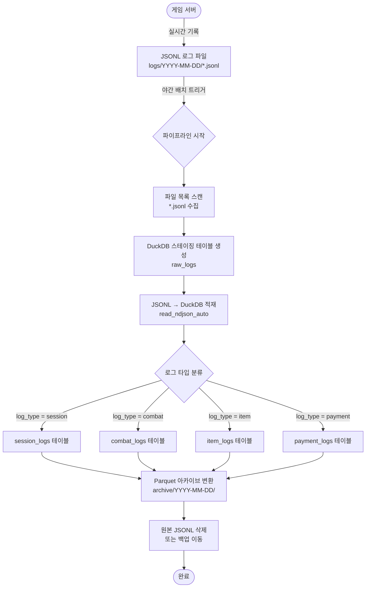

# 제7장: 온라인 게임 로그 설계와 수집
앞 장에서는 DuckDB가 CSV, Parquet, JSON 등 다양한 파일 형식을 얼마나 손쉽게 읽고 쓸 수 있는지 살펴봤다. 이번 장은 그 능력을 실전에서 제대로 활용하는 첫 번째 관문이다.

온라인 게임 서버는 24시간 쉬지 않고 방대한 양의 이벤트를 기록한다. 플레이어가 접속하는 순간부터 전투, 아이템 획득, 결제, 오류까지 — 이 모든 행위가 로그로 남는다. 이 로그는 단순한 기록이 아니다. 게임 밸런스를 조정하고, 이상 결제를 탐지하고, 플레이어 이탈 원인을 분석하는 핵심 데이터다.

이번 장에서는 어떤 로그를 어떤 형식으로 설계하고, C#으로 어떻게 기록하며, DuckDB로 어떻게 적재하는지를 단계별로 배운다.

---

## 7.1 게임 로그의 종류 — 접속, 전투, 아이템, 결제, 오류
게임 로그는 크게 다섯 가지 범주로 나뉜다. 각 범주는 분석 목적이 다르고, 따라서 스키마(필드 구성)도 다르다. 처음부터 각 로그의 목적을 명확히 이해하면 설계 실수를 줄일 수 있다.

### 접속 로그 (Session Log)
플레이어가 게임 서버에 접속하거나 접속을 종료할 때 기록된다. 동시 접속자 수(CCU), 세션 지속 시간, 지역별 접속 분포 등을 분석할 때 사용한다.

**주요 필드**
- `player_id`: 플레이어 고유 식별자
- `server_id`: 접속한 게임 서버 ID
- `timestamp`: 이벤트 발생 시각 (UTC 권장)
- `ip`: 클라이언트 IP 주소 (지역 분석용)
- `client_version`: 클라이언트 버전 (버전별 버그 추적)
- `event_type`: `login` 또는 `logout`

```json
{
  "log_type": "session",
  "event_type": "login",
  "player_id": "P001234",
  "server_id": "S-KR-01",
  "timestamp": "2026-03-28T09:15:00.000Z",
  "ip": "203.0.113.42",
  "client_version": "2.5.1"
}
```

### 전투 로그 (Combat Log)
전투 이벤트는 게임에서 가장 빈번하게 발생하는 로그다. 스킬 밸런싱, 무적 버그 탐지, 보스 공략 패턴 분석 등에 쓰인다. 발생 빈도가 높으므로 필드를 최소화하고 압축률을 고려해야 한다.

**주요 필드**
- `player_id`: 공격자 ID
- `skill_id`: 사용한 스킬 번호
- `target_id`: 피격 대상 ID (몬스터 또는 다른 플레이어)
- `damage`: 입힌 피해량
- `is_critical`: 치명타 여부 (boolean)
- `timestamp`: 이벤트 발생 시각

```json
{
  "log_type": "combat",
  "player_id": "P001234",
  "skill_id": 305,
  "target_id": "MON_0088",
  "damage": 4520,
  "is_critical": true,
  "timestamp": "2026-03-28T09:17:33.512Z"
}
```

### 아이템 로그 (Item Log)
아이템 획득, 소비, 거래를 기록한다. 이 로그를 분석하면 인기 아이템 순위, 아이템 경제 흐름, 비정상 복사(아이템 복제 버그) 탐지 등이 가능하다.

**주요 필드**
- `player_id`: 행위를 한 플레이어
- `item_id`: 아이템 고유 번호
- `item_name`: 아이템 이름 (가독성을 위해 포함)
- `action`: `acquire` / `consume` / `trade`
- `quantity`: 수량
- `timestamp`: 이벤트 발생 시각

```json
{
  "log_type": "item",
  "player_id": "P001234",
  "item_id": 10045,
  "item_name": "강화석 +7",
  "action": "acquire",
  "quantity": 1,
  "timestamp": "2026-03-28T09:18:05.200Z"
}
```

### 결제 로그 (Payment Log)
결제 로그는 보안과 감사(audit)가 최우선이다. 이상 결제, 환불, 프로모션 어뷰징 탐지에 사용된다. 개인정보 보호법 관련 규정을 준수해야 하므로 카드 번호 등 민감 정보는 절대 포함하지 않는다.

**주요 필드**
- `player_id`: 결제한 플레이어
- `product_id`: 구매 상품 ID
- `amount`: 결제 금액
- `currency`: 통화 코드 (`KRW`, `USD` 등)
- `payment_method`: 결제 수단 (`card`, `mobile`, `store`)
- `timestamp`: 결제 시각

```json
{
  "log_type": "payment",
  "player_id": "P001234",
  "product_id": "PACK_DIAMOND_100",
  "amount": 11000,
  "currency": "KRW",
  "payment_method": "mobile",
  "timestamp": "2026-03-28T10:00:00.000Z"
}
```

### 오류 로그 (Error Log)
서버 및 클라이언트에서 발생한 예외와 오류를 기록한다. 버그 추적, 서버 장애 분석, 크래시 패턴 파악에 사용된다.

**주요 필드**
- `server_id`: 오류 발생 서버
- `error_code`: 오류 코드
- `error_message`: 오류 메시지
- `stack_trace`: 스택 트레이스 (선택적)
- `severity`: `INFO` / `WARN` / `ERROR` / `FATAL`
- `timestamp`: 오류 발생 시각

```json
{
  "log_type": "error",
  "server_id": "S-KR-01",
  "error_code": "NullRef_0042",
  "error_message": "Object reference not set to an instance of an object.",
  "severity": "ERROR",
  "timestamp": "2026-03-28T09:50:10.000Z"
}
```

> **설계 팁**: 모든 로그에 `log_type` 필드를 추가하면 여러 종류의 로그를 하나의 파일에 섞어 저장할 때도 쉽게 구분할 수 있다. DuckDB에서 `WHERE log_type = 'combat'` 한 줄로 전투 로그만 골라낼 수 있다.

---
  

## 7.2 로그 파일 포맷 비교 — CSV vs JSON vs Parquet
게임 로그를 어떤 포맷으로 저장하느냐는 단순한 파일 확장자 선택이 아니다. 쓰기 성능, 저장 공간, 분석 편의성, 운영 복잡도가 모두 달라진다. 세 가지 대표 포맷을 항목별로 비교해 보자.

### 포맷 비교 표

| 비교 항목 | CSV | JSON (JSONL) | Parquet |
|-----------|-----|--------------|---------|
| **파일 크기 (압축 전)** | 중간 | 큼 (필드명 반복) | 작음 |
| **파일 크기 (압축 후)** | 중간 | 중간 | 가장 작음 |
| **쓰기 성능** | 매우 빠름 | 빠름 | 느림 (배치 필요) |
| **읽기 성능 (전체)** | 느림 | 중간 | 매우 빠름 |
| **읽기 성능 (컬럼 일부)** | 느림 (전체 파싱 필요) | 느림 (전체 파싱 필요) | 매우 빠름 (컬럼 선택 읽기) |
| **스키마 유연성** | 낮음 (고정 컬럼) | 높음 (필드 추가 자유) | 낮음 (스키마 고정) |
| **사람이 직접 읽기** | 가능 | 가능 | 불가 (바이너리) |
| **DuckDB 연동** | 쉬움 | 쉬움 | 가장 쉬움 |
| **중첩 구조 지원** | 불가 | 가능 | 가능 |
| **스트리밍 쓰기** | 가능 | 가능 | 어려움 (버퍼 필요) |
| **압축률** | 낮음 | 낮음 | 높음 (Snappy/Zstd) |
| **도구 지원** | 매우 광범위 | 광범위 | 넓어지는 중 |
| **오류 복구** | 행 단위 복구 가능 | 행 단위 복구 가능 | 파일 단위 |
| **적합한 용도** | 단순 구조, 빠른 기록 | 이벤트 로그, 스키마 변화 잦음 | 배치 분석, 장기 보관 |

### CSV의 특징
CSV는 가장 단순한 포맷이다. 모든 값이 쉼표로 구분된 텍스트이므로 엑셀, 메모장, 거의 모든 도구에서 열 수 있다. 쓰기 성능도 뛰어나다. 단점은 스키마가 고정되어 있다는 것이다. 게임 업데이트로 전투 로그에 새 필드(`combo_count` 같은)를 추가하면 기존 CSV 파일과 새 CSV 파일의 컬럼 수가 달라져 분석이 번거로워진다. 또한 중첩 데이터(예: 버프 목록)를 표현하기 어렵다.

### JSON / JSONL의 특징
JSON Lines(JSONL)은 한 줄에 JSON 객체 하나를 기록하는 방식이다. 일반 JSON 배열(`[...]`)과 달리 파일을 줄 단위로 파싱할 수 있어 스트리밍에 유리하다. 필드를 자유롭게 추가하거나 생략할 수 있어 스키마 변화에 강하다. 단점은 필드명이 매 줄마다 반복되어 파일 크기가 커진다는 것이다. 전투 로그처럼 초당 수만 건이 발생하면 스토리지 비용이 빠르게 늘어난다.

### Parquet의 특징
Parquet은 컬럼 지향(columnar) 저장 포맷이다. 같은 필드의 값들이 연속으로 저장되어 압축률이 높고, DuckDB가 필요한 컬럼만 골라 읽을 수 있다(`SELECT damage FROM combat_log` 시 `damage` 컬럼만 디스크에서 읽음). 분석 쿼리 성능이 압도적이다. 단점은 바이너리 포맷이라 사람이 직접 읽을 수 없고, 스트리밍 쓰기가 어렵다는 것이다. 일반적으로 일정량을 메모리에 모아 배치로 써야 한다.

---

## 7.3 추천 포맷 결정 — 게임 로그에는 무엇이 최선인가?
포맷마다 장단점이 있으므로 하나만 고집할 필요는 없다. 게임 로그의 생애주기(lifecycle)에 맞게 단계별로 다른 포맷을 사용하는 것이 최선이다.

### 추천 전략: 2단계 파이프라인

```
[게임 서버] → JSONL (실시간 기록) → [야간 변환 배치] → Parquet (장기 보관·분석)
```

**1단계: 실시간 수집 — JSONL**

게임 서버는 실시간으로 로그를 기록해야 한다. 이 단계에서는 다음 조건이 중요하다:

- **쓰기 속도**: 전투 로그는 초당 수만 건 발생 가능
- **안전성**: 서버가 갑자기 종료되어도 기록된 로그는 보존
- **스키마 유연성**: 핫픽스로 새 필드가 추가될 수 있음

이 조건에서 JSONL이 최적이다. 줄 단위 쓰기라 파일이 손상되어도 마지막 줄만 문제가 생기고 나머지는 복구된다. 필드를 자유롭게 추가할 수 있어 스키마 변경에도 유연하다.

**2단계: 장기 보관·분석 — Parquet**

하루가 끝나면(또는 일정 주기로) JSONL 파일을 Parquet으로 변환한다. 이 단계에서는 DuckDB 단 한 줄로 변환이 가능하다:

```sql
COPY (SELECT * FROM read_ndjson_auto('logs/2026-03-28/*.jsonl'))
TO 'archive/2026-03-28/combat.parquet' (FORMAT PARQUET, COMPRESSION ZSTD);
```

변환된 Parquet 파일은 원본 JSONL 대비 크기가 70~85% 감소하고, 분석 쿼리 속도는 수십 배 빨라진다.

### 포맷별 사용 시점 요약

| 상황 | 추천 포맷 | 이유 |
|------|-----------|------|
| 게임 서버 실시간 기록 | **JSONL** | 빠른 쓰기, 스키마 유연성, 오류 복구 |
| 단순 통계 (KPI 대시보드) | **CSV** | 엑셀 호환, 외부 팀과 공유 편리 |
| 장기 보관 (1개월 이상) | **Parquet** | 압축률, 분석 속도, DuckDB 최적화 |
| 외부 데이터 웨어하우스 연동 | **Parquet** | 사실상 표준 포맷 |
| 실시간 스트리밍 분석 | **JSONL** | 줄 단위 파싱, 스트리밍 처리 적합 |

> **결론**: 게임 서버에서는 **JSONL로 기록하고 Parquet으로 보관**한다. CSV는 보고용 데이터 내보내기(export)에만 사용한다.

---

## 7.4 C#으로 구조화된 JSON 로그 라이터 만들기
이제 실제 코드를 작성한다. JSONL 형식으로 로그를 기록하는 스레드 안전(thread-safe), 비동기 지원 로그 라이터를 만든다.

코드 파일 경로: `code/ch07/JsonLogWriter/`

### 설계 목표

- **JSONL 형식**: 한 줄에 JSON 객체 하나
- **스레드 안전**: 멀티스레드 게임 서버에서 동시에 호출되어도 로그가 섞이지 않음
- **비동기 쓰기**: `Channel<T>` 기반 생산자-소비자 패턴으로 I/O가 게임 루프를 차단하지 않음
- **이벤트 타입별 스키마**: 접속, 전투, 아이템, 결제 각각 별도 레코드로 정의

### 로그 이벤트 스키마 정의

```csharp
// code/ch07/JsonLogWriter/LogEvents.cs
using System.Text.Json.Serialization;

namespace GameLogWriter;

// 모든 로그 이벤트의 기반 클래스
public abstract record BaseLogEvent
{
    [JsonPropertyName("log_type")]
    public abstract string LogType { get; }

    [JsonPropertyName("timestamp")]
    public DateTime Timestamp { get; init; } = DateTime.UtcNow;
}

// 접속 로그
public record SessionLogEvent : BaseLogEvent
{
    public override string LogType => "session";

    [JsonPropertyName("event_type")]
    public required string EventType { get; init; }  // "login" or "logout"

    [JsonPropertyName("player_id")]
    public required string PlayerId { get; init; }

    [JsonPropertyName("server_id")]
    public required string ServerId { get; init; }

    [JsonPropertyName("ip")]
    public required string Ip { get; init; }

    [JsonPropertyName("client_version")]
    public required string ClientVersion { get; init; }
}

// 전투 로그
public record CombatLogEvent : BaseLogEvent
{
    public override string LogType => "combat";

    [JsonPropertyName("player_id")]
    public required string PlayerId { get; init; }

    [JsonPropertyName("skill_id")]
    public required int SkillId { get; init; }

    [JsonPropertyName("target_id")]
    public required string TargetId { get; init; }

    [JsonPropertyName("damage")]
    public required int Damage { get; init; }

    [JsonPropertyName("is_critical")]
    public required bool IsCritical { get; init; }
}

// 아이템 로그
public record ItemLogEvent : BaseLogEvent
{
    public override string LogType => "item";

    [JsonPropertyName("player_id")]
    public required string PlayerId { get; init; }

    [JsonPropertyName("item_id")]
    public required int ItemId { get; init; }

    [JsonPropertyName("item_name")]
    public required string ItemName { get; init; }

    [JsonPropertyName("action")]
    public required string Action { get; init; }  // "acquire", "consume", "trade"

    [JsonPropertyName("quantity")]
    public required int Quantity { get; init; }
}

// 결제 로그
public record PaymentLogEvent : BaseLogEvent
{
    public override string LogType => "payment";

    [JsonPropertyName("player_id")]
    public required string PlayerId { get; init; }

    [JsonPropertyName("product_id")]
    public required string ProductId { get; init; }

    [JsonPropertyName("amount")]
    public required decimal Amount { get; init; }

    [JsonPropertyName("currency")]
    public required string Currency { get; init; }

    [JsonPropertyName("payment_method")]
    public required string PaymentMethod { get; init; }
}
```

### 비동기 JSONL 로그 라이터

```csharp
// code/ch07/JsonLogWriter/JsonLogWriter.cs
using System.Text.Json;
using System.Threading.Channels;

namespace GameLogWriter;

/// <summary>
/// 스레드 안전, 비동기 JSONL 로그 라이터.
/// Channel&lt;T&gt; 기반 생산자-소비자 패턴 사용.
/// </summary>
public sealed class JsonLogWriter : IAsyncDisposable
{
    private readonly Channel<string> _channel;
    private readonly Task _writerTask;
    private readonly string _filePath;
    private readonly JsonSerializerOptions _jsonOptions;

    public JsonLogWriter(string filePath)
    {
        _filePath = filePath;

        // 버퍼 크기: 최대 10만 건. 초과 시 가장 오래된 항목 제거 (로그 유실 허용)
        // 게임 서버는 로그 유실보다 서버 응답 지연이 더 나쁜 상황
        _channel = Channel.CreateBounded<string>(new BoundedChannelOptions(100_000)
        {
            FullMode = BoundedChannelFullMode.DropOldest,
            SingleReader = true,   // 단일 소비자 (파일 쓰기 스레드)
            SingleWriter = false   // 다중 생산자 (여러 게임 스레드)
        });

        _jsonOptions = new JsonSerializerOptions
        {
            WriteIndented = false  // JSONL은 한 줄로
        };

        // 백그라운드 파일 쓰기 작업 시작
        _writerTask = Task.Run(WriteLoopAsync);
    }

    /// <summary>로그 이벤트를 채널에 기록한다 (논블로킹).</summary>
    public void Write<T>(T logEvent) where T : BaseLogEvent
    {
        // Serialize를 호출하는 순간 타입 정보가 사라지므로
        // 실제 타입을 전달해야 다형성 직렬화가 동작한다
        string json = JsonSerializer.Serialize(logEvent, logEvent.GetType(), _jsonOptions);
        _channel.Writer.TryWrite(json);
    }

    /// <summary>비동기 로그 이벤트 기록 (버퍼가 가득 찰 때 대기).</summary>
    public async ValueTask WriteAsync<T>(T logEvent, CancellationToken ct = default)
        where T : BaseLogEvent
    {
        string json = JsonSerializer.Serialize(logEvent, logEvent.GetType(), _jsonOptions);
        await _channel.Writer.WriteAsync(json, ct);
    }

    /// <summary>백그라운드 파일 쓰기 루프.</summary>
    private async Task WriteLoopAsync()
    {
        // 파일을 append 모드로 열고, 비동기 I/O 사용
        await using var fs = new FileStream(
            _filePath,
            FileMode.Append,
            FileAccess.Write,
            FileShare.Read,
            bufferSize: 65536,  // 64KB 버퍼
            useAsync: true);

        await using var writer = new StreamWriter(fs, System.Text.Encoding.UTF8);

        await foreach (string json in _channel.Reader.ReadAllAsync())
        {
            await writer.WriteLineAsync(json);

            // 채널이 잠시 비었을 때 플러시 (배치 플러시로 I/O 횟수 최소화)
            if (_channel.Reader.Count == 0)
            {
                await writer.FlushAsync();
            }
        }

        // 채널 닫힐 때 마지막 플러시
        await writer.FlushAsync();
    }

    public async ValueTask DisposeAsync()
    {
        _channel.Writer.Complete();
        await _writerTask;
    }
}
```

### 사용 예시

```csharp
// code/ch07/JsonLogWriter/Program.cs
using GameLogWriter;

// 로그 라이터 생성
await using var logger = new JsonLogWriter("logs/game-2026-03-28.jsonl");

// 접속 로그 기록
logger.Write(new SessionLogEvent
{
    EventType = "login",
    PlayerId  = "P001234",
    ServerId  = "S-KR-01",
    Ip        = "203.0.113.42",
    ClientVersion = "2.5.1"
});

// 전투 로그 기록 (논블로킹 — 게임 루프에서 사용)
logger.Write(new CombatLogEvent
{
    PlayerId   = "P001234",
    SkillId    = 305,
    TargetId   = "MON_0088",
    Damage     = 4520,
    IsCritical = true
});

// 결제 로그 기록
logger.Write(new PaymentLogEvent
{
    PlayerId      = "P001234",
    ProductId     = "PACK_DIAMOND_100",
    Amount        = 11000m,
    Currency      = "KRW",
    PaymentMethod = "mobile"
});

Console.WriteLine("로그 기록 완료. DisposeAsync 호출 시 버퍼 플러시.");
```

> **주의**: `await using`으로 `JsonLogWriter`를 사용해야 프로그램 종료 시 채널에 남은 로그가 모두 파일에 기록된다. `Dispose()` 없이 프로세스가 종료되면 버퍼의 마지막 일부 로그가 유실될 수 있다.

---
   

## 7.5 C#으로 CSV 로그 라이터 만들기 (고성능 버전)
CSV 로그 라이터는 주로 KPI 집계용 데이터나 외부 팀과 공유하는 보고용 데이터를 위한 것이다. 단순한 구조의 데이터를 최대한 빠르게 기록할 때 유리하다.

코드 파일 경로: `code/ch07/CsvLogWriter/`

### 설계 목표

- **고성능**: `StreamWriter` + `StringBuilder` 기반, 최소 메모리 할당
- **헤더 자동 생성**: 파일이 새로 생성될 때 컬럼 헤더를 자동으로 씀
- **특수 문자 이스케이프**: 값에 쉼표, 줄바꿈, 큰따옴표가 포함될 때 RFC 4180 규격에 맞게 처리

### CSV 이스케이프 규칙 (RFC 4180)

CSV에서 다음 경우 값을 큰따옴표(`"`)로 감싸야 한다:
- 값에 쉼표(`,`)가 포함될 때
- 값에 큰따옴표(`"`)가 포함될 때 → `""`로 이스케이프
- 값에 줄바꿈(`\n`, `\r\n`)이 포함될 때

```csharp
// code/ch07/CsvLogWriter/CsvLogWriter.cs
using System.Text;

namespace GameCsvWriter;

/// <summary>
/// 고성능 CSV 로그 라이터.
/// StreamWriter 기반, RFC 4180 이스케이프 처리.
/// </summary>
public sealed class CsvLogWriter : IDisposable
{
    private readonly StreamWriter _writer;
    private readonly object _lock = new();
    private bool _headerWritten;

    public CsvLogWriter(string filePath, bool append = true)
    {
        bool fileExists = File.Exists(filePath) && new FileInfo(filePath).Length > 0;

        _writer = new StreamWriter(
            new FileStream(filePath, append ? FileMode.Append : FileMode.Create,
                FileAccess.Write, FileShare.Read, 65536),
            Encoding.UTF8,
            leaveOpen: false);

        // 파일이 이미 존재하고 내용이 있으면 헤더를 다시 쓰지 않는다
        _headerWritten = fileExists && append;
    }

    /// <summary>헤더 행을 기록한다 (최초 1회만).</summary>
    public void WriteHeader(IEnumerable<string> columns)
    {
        lock (_lock)
        {
            if (_headerWritten) return;
            _writer.WriteLine(JoinCsvRow(columns));
            _headerWritten = true;
        }
    }

    /// <summary>데이터 행을 기록한다 (스레드 안전).</summary>
    public void WriteRow(IEnumerable<string?> values)
    {
        string line = JoinCsvRow(values.Select(v => v ?? ""));
        lock (_lock)
        {
            _writer.WriteLine(line);
        }
    }

    /// <summary>버퍼를 디스크에 즉시 쓴다.</summary>
    public void Flush()
    {
        lock (_lock) { _writer.Flush(); }
    }

    /// <summary>값들을 CSV 행으로 조합한다 (RFC 4180 이스케이프).</summary>
    private static string JoinCsvRow(IEnumerable<string> values)
    {
        var sb = new StringBuilder();
        bool first = true;
        foreach (string v in values)
        {
            if (!first) sb.Append(',');
            first = false;
            sb.Append(EscapeCsvField(v));
        }
        return sb.ToString();
    }

    /// <summary>단일 CSV 필드를 RFC 4180에 맞게 이스케이프한다.</summary>
    public static string EscapeCsvField(string value)
    {
        // 특수 문자가 없으면 그대로 반환 (가장 흔한 케이스, 빠른 경로)
        if (!value.Contains(',') && !value.Contains('"') &&
            !value.Contains('\n') && !value.Contains('\r'))
        {
            return value;
        }

        // 큰따옴표 이스케이프 후 전체를 큰따옴표로 감싼다
        return $"\"{value.Replace("\"", "\"\"")}\"";
    }

    public void Dispose() => _writer.Dispose();
}
```

### 전투 로그 CSV 라이터 사용 예시

```csharp
// code/ch07/CsvLogWriter/Program.cs
using GameCsvWriter;

string[] headers = ["timestamp", "player_id", "skill_id",
                    "target_id", "damage", "is_critical"];

using var csv = new CsvLogWriter("logs/combat-2026-03-28.csv");
csv.WriteHeader(headers);

// 전투 이벤트 기록
csv.WriteRow([
    DateTime.UtcNow.ToString("o"),
    "P001234",
    "305",
    "MON_0088",
    "4520",
    "true"
]);

// 특수 문자가 포함된 경우 (아이템 이름에 쉼표가 있는 경우)
csv.WriteRow([
    DateTime.UtcNow.ToString("o"),
    "P001234",
    "강화석, +7",   // 쉼표 포함 → 자동으로 "강화석, +7"로 이스케이프
    "acquire",
    "1",
    ""
]);

csv.Flush();
Console.WriteLine("CSV 기록 완료");
```

생성된 CSV 파일:

```
timestamp,player_id,skill_id,target_id,damage,is_critical
2026-03-28T09:17:33.512Z,P001234,305,MON_0088,4520,true
2026-03-28T09:18:05.200Z,P001234,"강화석, +7",acquire,1,
```

> **성능 팁**: CSV 라이터에서 `lock`은 행 단위로만 잡는다. `StringBuilder`로 행 문자열을 만든 뒤 한 번에 쓰므로, 행 중간에 다른 스레드의 내용이 끼어드는 일이 없다.

---

## 7.6 날짜별 로그 파일 로테이션 구현

하루 종일 하나의 파일에만 기록하면 파일이 수십 GB에 달하게 된다. 이를 방지하고 분석 편의성을 높이기 위해 로그 파일 로테이션(rotation)을 구현한다.

코드 파일 경로: `code/ch07/LogRotation/`

### 로테이션 전략

두 가지 기준으로 파일을 교체(rotate)한다:

1. **날짜별 로테이션**: 자정(UTC 00:00)이 지나면 새 파일로 교체
   - 파일명 예시: `combat-2026-03-28.jsonl` → `combat-2026-03-29.jsonl`
2. **크기별 로테이션**: 파일 크기가 한계(예: 1GB)를 초과하면 새 파일로 교체
   - 파일명 예시: `combat-2026-03-28.jsonl` → `combat-2026-03-28_001.jsonl`

두 조건 중 하나라도 만족하면 파일을 교체한다.

### 로테이션 지원 로그 라이터

```csharp
// code/ch07/LogRotation/RotatingJsonLogWriter.cs
using System.Text.Json;
using System.Threading.Channels;

namespace GameLogWriter;

/// <summary>
/// 날짜별 + 크기별 로테이션을 지원하는 JSONL 로그 라이터.
/// </summary>
public sealed class RotatingJsonLogWriter : IAsyncDisposable
{
    private readonly string _logDirectory;
    private readonly string _logPrefix;        // 예: "combat"
    private readonly long _maxFileSizeBytes;   // 예: 1GB = 1073741824L

    private readonly Channel<string> _channel;
    private readonly Task _writerTask;
    private readonly JsonSerializerOptions _jsonOptions;

    // 현재 파일 상태 (단일 소비자 스레드에서만 접근)
    private StreamWriter? _currentWriter;
    private string _currentFilePath = "";
    private DateTime _currentFileDate;
    private int _rotationIndex;
    private long _currentFileSize;

    public RotatingJsonLogWriter(
        string logDirectory,
        string logPrefix,
        long maxFileSizeBytes = 1_073_741_824L)  // 기본 1GB
    {
        _logDirectory = logDirectory;
        _logPrefix = logPrefix;
        _maxFileSizeBytes = maxFileSizeBytes;

        Directory.CreateDirectory(logDirectory);

        _channel = Channel.CreateBounded<string>(new BoundedChannelOptions(100_000)
        {
            FullMode = BoundedChannelFullMode.DropOldest,
            SingleReader = true,
            SingleWriter = false
        });

        _jsonOptions = new JsonSerializerOptions { WriteIndented = false };
        _writerTask = Task.Run(WriteLoopAsync);
    }

    public void Write<T>(T logEvent) where T : BaseLogEvent
    {
        string json = JsonSerializer.Serialize(logEvent, logEvent.GetType(), _jsonOptions);
        _channel.Writer.TryWrite(json);
    }

    private async Task WriteLoopAsync()
    {
        await foreach (string json in _channel.Reader.ReadAllAsync())
        {
            await EnsureFileOpenAsync();

            byte[] bytes = System.Text.Encoding.UTF8.GetByteCount(json) +
                           Environment.NewLine.Length is var size ? Array.Empty<byte>() : Array.Empty<byte>();
            // 실제 크기: UTF-8 인코딩 후 바이트 수 추적
            int lineBytes = System.Text.Encoding.UTF8.GetByteCount(json + Environment.NewLine);
            _currentFileSize += lineBytes;

            await _currentWriter!.WriteLineAsync(json);

            if (_channel.Reader.Count == 0)
                await _currentWriter.FlushAsync();
        }

        if (_currentWriter != null)
        {
            await _currentWriter.FlushAsync();
            await _currentWriter.DisposeAsync();
        }
    }

    /// <summary>현재 파일이 열려 있고 로테이션 조건을 충족하지 않는지 확인한다.</summary>
    private async Task EnsureFileOpenAsync()
    {
        DateTime today = DateTime.UtcNow.Date;

        bool needRotate =
            _currentWriter == null ||              // 아직 열리지 않음
            _currentFileDate != today ||            // 날짜 변경
            _currentFileSize >= _maxFileSizeBytes;  // 크기 초과

        if (!needRotate) return;

        // 기존 파일 닫기
        if (_currentWriter != null)
        {
            await _currentWriter.FlushAsync();
            await _currentWriter.DisposeAsync();
        }

        // 날짜가 바뀌면 로테이션 인덱스 초기화
        if (_currentFileDate != today)
        {
            _currentFileDate = today;
            _rotationIndex = 0;
        }
        else
        {
            _rotationIndex++;
        }

        // 파일명 결정
        string datePart = today.ToString("yyyy-MM-dd");
        string fileName = _rotationIndex == 0
            ? $"{_logPrefix}-{datePart}.jsonl"
            : $"{_logPrefix}-{datePart}_{_rotationIndex:D3}.jsonl";

        _currentFilePath = Path.Combine(_logDirectory, fileName);
        _currentFileSize = 0;

        var fs = new FileStream(_currentFilePath, FileMode.Append, FileAccess.Write,
                                FileShare.Read, 65536, useAsync: true);
        _currentWriter = new StreamWriter(fs, System.Text.Encoding.UTF8);

        Console.WriteLine($"[LogRotation] 새 파일 생성: {_currentFilePath}");
    }

    public async ValueTask DisposeAsync()
    {
        _channel.Writer.Complete();
        await _writerTask;
    }
}
```

### 파일명 예시

```
logs/
├── combat-2026-03-27.jsonl          ← 3월 27일 로그
├── combat-2026-03-28.jsonl          ← 3월 28일 로그 (당일 첫 파일)
├── combat-2026-03-28_001.jsonl      ← 3월 28일, 1GB 초과 후 두 번째 파일
├── combat-2026-03-28_002.jsonl      ← 3월 28일, 세 번째 파일
└── session-2026-03-28.jsonl         ← 접속 로그 (별도 파일)
```

### 로테이션 설정 가이드

| 로그 종류 | 권장 최대 파일 크기 | 이유 |
|-----------|---------------------|------|
| 전투 로그 | 500MB | 매우 빈번, 빠른 로테이션 |
| 아이템 로그 | 200MB | 중간 빈도 |
| 접속 로그 | 100MB | 낮은 빈도, 소용량 |
| 결제 로그 | 50MB | 감사 목적, 파일 단위 관리 편리 |
| 오류 로그 | 100MB | 평소 적음, 장애 시 급증 가능 |

---

## 7.7 DuckDB에 로그 파일 일괄 적재 파이프라인
수집된 JSONL 로그 파일을 DuckDB에 적재하는 전체 파이프라인을 설계한다.

코드 파일 경로: `code/ch07/LogPipeline/`

### 전체 파이프라인 흐름



### DuckDB 적재 C# 파이프라인

```csharp
// code/ch07/LogPipeline/LogPipeline.cs
using DuckDB.NET.Data;

namespace GameLogPipeline;

public class LogIngestionPipeline
{
    private readonly string _duckDbPath;
    private readonly string _logDirectory;
    private readonly string _archiveDirectory;

    public LogIngestionPipeline(string duckDbPath, string logDirectory, string archiveDirectory)
    {
        _duckDbPath    = duckDbPath;
        _logDirectory  = logDirectory;
        _archiveDirectory = archiveDirectory;
    }

    /// <summary>지정된 날짜의 JSONL 파일을 모두 DuckDB에 적재한다.</summary>
    public async Task RunAsync(DateOnly targetDate)
    {
        string dateStr = targetDate.ToString("yyyy-MM-dd");
        string dateDir = Path.Combine(_logDirectory, dateStr);

        if (!Directory.Exists(dateDir))
        {
            Console.WriteLine($"[Pipeline] 로그 디렉터리 없음: {dateDir}");
            return;
        }

        string[] jsonlFiles = Directory.GetFiles(dateDir, "*.jsonl");
        if (jsonlFiles.Length == 0)
        {
            Console.WriteLine($"[Pipeline] JSONL 파일 없음: {dateDir}");
            return;
        }

        Console.WriteLine($"[Pipeline] {jsonlFiles.Length}개 파일 발견. 적재 시작...");

        await using var conn = new DuckDBConnection($"Data Source={_duckDbPath}");
        await conn.OpenAsync();

        // 1단계: 테이블 초기화
        await InitializeTablesAsync(conn);

        // 2단계: 스테이징 테이블에 전체 JSONL 적재
        await LoadToStagingAsync(conn, dateDir);

        // 3단계: 로그 타입별 분류 적재
        await DistributeByLogTypeAsync(conn, dateStr);

        // 4단계: Parquet 아카이브 저장
        await ExportToParquetAsync(conn, dateStr);

        Console.WriteLine($"[Pipeline] {dateStr} 적재 완료.");
    }

    private static async Task InitializeTablesAsync(DuckDBConnection conn)
    {
        string sql = """
            -- 스테이징 테이블 (JSON 원본 보관)
            CREATE TABLE IF NOT EXISTS staging_raw (
                raw_json  VARCHAR,
                loaded_at TIMESTAMP DEFAULT now()
            );

            -- 접속 로그 테이블
            CREATE TABLE IF NOT EXISTS session_logs (
                event_type     VARCHAR,
                player_id      VARCHAR,
                server_id      VARCHAR,
                ip             VARCHAR,
                client_version VARCHAR,
                timestamp      TIMESTAMP
            );

            -- 전투 로그 테이블
            CREATE TABLE IF NOT EXISTS combat_logs (
                player_id  VARCHAR,
                skill_id   INTEGER,
                target_id  VARCHAR,
                damage     INTEGER,
                is_critical BOOLEAN,
                timestamp  TIMESTAMP
            );

            -- 아이템 로그 테이블
            CREATE TABLE IF NOT EXISTS item_logs (
                player_id VARCHAR,
                item_id   INTEGER,
                item_name VARCHAR,
                action    VARCHAR,
                quantity  INTEGER,
                timestamp TIMESTAMP
            );

            -- 결제 로그 테이블
            CREATE TABLE IF NOT EXISTS payment_logs (
                player_id      VARCHAR,
                product_id     VARCHAR,
                amount         DECIMAL(18,2),
                currency       VARCHAR,
                payment_method VARCHAR,
                timestamp      TIMESTAMP
            );
            """;

        await using var cmd = conn.CreateCommand();
        cmd.CommandText = sql;
        await cmd.ExecuteNonQueryAsync();
    }

    private static async Task LoadToStagingAsync(DuckDBConnection conn, string dateDir)
    {
        // 디렉터리 내 모든 JSONL 파일을 한 번에 읽기
        // DuckDB의 glob 패턴을 활용한다
        string pattern = Path.Combine(dateDir, "*.jsonl").Replace("\\", "/");

        string sql = $"""
            -- 스테이징 테이블을 비우고 새로 적재 (일별 실행 기준)
            DELETE FROM staging_raw;

            INSERT INTO staging_raw (raw_json)
            SELECT json::VARCHAR
            FROM read_ndjson_auto('{pattern}', ignore_errors = true);
            """;

        await using var cmd = conn.CreateCommand();
        cmd.CommandText = sql;
        await cmd.ExecuteNonQueryAsync();

        // 적재된 건수 확인
        cmd.CommandText = "SELECT COUNT(*) FROM staging_raw;";
        object? count = await cmd.ExecuteScalarAsync();
        Console.WriteLine($"[Pipeline] 스테이징 적재 완료: {count:N0}건");
    }

    private static async Task DistributeByLogTypeAsync(DuckDBConnection conn, string dateStr)
    {
        // JSON 필드를 파싱하여 각 타입별 테이블로 분류 삽입
        string sql = $"""
            -- 접속 로그
            INSERT INTO session_logs
            SELECT
                json_extract_string(raw_json, '$.event_type')     AS event_type,
                json_extract_string(raw_json, '$.player_id')      AS player_id,
                json_extract_string(raw_json, '$.server_id')      AS server_id,
                json_extract_string(raw_json, '$.ip')             AS ip,
                json_extract_string(raw_json, '$.client_version') AS client_version,
                json_extract_string(raw_json, '$.timestamp')::TIMESTAMP AS timestamp
            FROM staging_raw
            WHERE json_extract_string(raw_json, '$.log_type') = 'session';

            -- 전투 로그
            INSERT INTO combat_logs
            SELECT
                json_extract_string(raw_json, '$.player_id')       AS player_id,
                json_extract(raw_json, '$.skill_id')::INTEGER       AS skill_id,
                json_extract_string(raw_json, '$.target_id')        AS target_id,
                json_extract(raw_json, '$.damage')::INTEGER         AS damage,
                json_extract(raw_json, '$.is_critical')::BOOLEAN    AS is_critical,
                json_extract_string(raw_json, '$.timestamp')::TIMESTAMP AS timestamp
            FROM staging_raw
            WHERE json_extract_string(raw_json, '$.log_type') = 'combat';

            -- 아이템 로그
            INSERT INTO item_logs
            SELECT
                json_extract_string(raw_json, '$.player_id') AS player_id,
                json_extract(raw_json, '$.item_id')::INTEGER AS item_id,
                json_extract_string(raw_json, '$.item_name') AS item_name,
                json_extract_string(raw_json, '$.action')    AS action,
                json_extract(raw_json, '$.quantity')::INTEGER AS quantity,
                json_extract_string(raw_json, '$.timestamp')::TIMESTAMP AS timestamp
            FROM staging_raw
            WHERE json_extract_string(raw_json, '$.log_type') = 'item';

            -- 결제 로그
            INSERT INTO payment_logs
            SELECT
                json_extract_string(raw_json, '$.player_id')      AS player_id,
                json_extract_string(raw_json, '$.product_id')     AS product_id,
                json_extract(raw_json, '$.amount')::DECIMAL(18,2) AS amount,
                json_extract_string(raw_json, '$.currency')       AS currency,
                json_extract_string(raw_json, '$.payment_method') AS payment_method,
                json_extract_string(raw_json, '$.timestamp')::TIMESTAMP AS timestamp
            FROM staging_raw
            WHERE json_extract_string(raw_json, '$.log_type') = 'payment';
            """;

        await using var cmd = conn.CreateCommand();
        cmd.CommandText = sql;
        await cmd.ExecuteNonQueryAsync();

        // 분류 결과 출력
        foreach (string table in new[] { "session_logs", "combat_logs", "item_logs", "payment_logs" })
        {
            cmd.CommandText = $"SELECT COUNT(*) FROM {table};";
            object? count = await cmd.ExecuteScalarAsync();
            Console.WriteLine($"  [{table}] {count:N0}건");
        }
    }

    private async Task ExportToParquetAsync(DuckDBConnection conn, string dateStr)
    {
        string archivePath = Path.Combine(_archiveDirectory, dateStr).Replace("\\", "/");
        Directory.CreateDirectory(Path.Combine(_archiveDirectory, dateStr));

        var tables = new[]
        {
            ("session_logs",  "session"),
            ("combat_logs",   "combat"),
            ("item_logs",     "item"),
            ("payment_logs",  "payment")
        };

        await using var cmd = conn.CreateCommand();

        foreach (var (table, prefix) in tables)
        {
            string parquetPath = $"{archivePath}/{prefix}-{dateStr}.parquet";
            cmd.CommandText = $"""
                COPY (SELECT * FROM {table})
                TO '{parquetPath}'
                (FORMAT PARQUET, COMPRESSION ZSTD, ROW_GROUP_SIZE 100000);
                """;
            await cmd.ExecuteNonQueryAsync();
            Console.WriteLine($"[Pipeline] Parquet 저장: {parquetPath}");
        }
    }
}
```

### 파이프라인 실행

```csharp
// code/ch07/LogPipeline/Program.cs
using GameLogPipeline;

var pipeline = new LogIngestionPipeline(
    duckDbPath:       "data/gamelogs.duckdb",
    logDirectory:     "logs",
    archiveDirectory: "archive"
);

// 어제 날짜 로그 처리 (매일 자정 이후 실행 기준)
DateOnly yesterday = DateOnly.FromDateTime(DateTime.UtcNow.AddDays(-1));
await pipeline.RunAsync(yesterday);
```

### 최종 디렉터리 구조

```
project/
├── data/
│   └── gamelogs.duckdb          ← DuckDB 데이터베이스 파일
├── logs/
│   ├── 2026-03-27/
│   │   ├── combat-2026-03-27.jsonl
│   │   └── session-2026-03-27.jsonl
│   └── 2026-03-28/
│       ├── combat-2026-03-28.jsonl
│       └── session-2026-03-28.jsonl
└── archive/
    ├── 2026-03-27/
    │   ├── combat-2026-03-27.parquet
    │   └── session-2026-03-27.parquet
    └── 2026-03-28/
        ├── combat-2026-03-28.parquet
        └── session-2026-03-28.parquet
```

### Parquet 아카이브 쿼리 예시

적재가 완료된 후, DuckDB에서 바로 분석 쿼리를 실행할 수 있다.

```sql
-- 오늘의 상위 10명 전투 딜러
SELECT
    player_id,
    SUM(damage)        AS total_damage,
    COUNT(*)           AS attack_count,
    AVG(damage)        AS avg_damage,
    SUM(CASE WHEN is_critical THEN 1 ELSE 0 END) AS crit_count
FROM combat_logs
WHERE timestamp::DATE = CURRENT_DATE
GROUP BY player_id
ORDER BY total_damage DESC
LIMIT 10;

-- 오늘 결제 총액 (통화별)
SELECT
    currency,
    COUNT(*)           AS payment_count,
    SUM(amount)        AS total_amount
FROM payment_logs
WHERE timestamp::DATE = CURRENT_DATE
GROUP BY currency
ORDER BY total_amount DESC;

-- Parquet 파일 직접 쿼리 (DuckDB 테이블 불필요)
SELECT player_id, SUM(damage) AS total_damage
FROM read_parquet('archive/2026-03-28/combat-2026-03-28.parquet')
GROUP BY player_id
ORDER BY total_damage DESC
LIMIT 5;
```

---
  

## 이 장의 핵심 정리
이번 장에서 배운 내용을 정리한다.

| 주제 | 핵심 내용 |
|------|-----------|
| 게임 로그 종류 | 접속, 전투, 아이템, 결제, 오류 5가지로 분류, 각각 목적과 스키마가 다름 |
| 포맷 비교 | CSV는 단순·빠름, JSONL은 유연·스트리밍 적합, Parquet은 압축·분석 최적 |
| 추천 전략 | 실시간은 JSONL, 장기 보관·분석은 Parquet, CSV는 보고용 내보내기 |
| JSON 로그 라이터 | `Channel<T>` 기반 비동기, 스레드 안전, 버퍼 플러시 지원 |
| CSV 로그 라이터 | RFC 4180 이스케이프, 헤더 자동 생성, `StreamWriter` 고성능 |
| 로그 로테이션 | 날짜별 + 크기별 이중 로테이션으로 파일 관리 용이성 확보 |
| 적재 파이프라인 | JSONL → 스테이징 → 타입별 분류 → Parquet 아카이브 4단계 처리 |

**기억해야 할 핵심 원칙**

1. 게임 서버는 I/O를 절대 차단하면 안 된다. `Channel<T>` 기반 비동기 라이터를 사용한다.
2. JSONL은 한 줄이 하나의 완결된 레코드다. 파일이 중간에 깨져도 손상된 줄만 버리면 나머지를 살릴 수 있다.
3. DuckDB의 `read_ndjson_auto()`는 glob 패턴을 지원하므로 폴더 전체를 한 줄 SQL로 적재할 수 있다.
4. Parquet + ZSTD 압축은 JSONL 대비 파일 크기를 70~85% 줄이면서 쿼리 속도는 수십 배 빠르게 만든다.

---

## 다음 장 예고
이제 게임 로그가 체계적으로 수집되고 DuckDB에 저장된다. **8장: 온라인 게임 콘텐츠별 DuckDB 활용**에서는 이 데이터를 바탕으로 실제 게임 운영에 사용되는 분석을 수행한다.

- 전투 로그로 스킬 밸런스 분석하기
- 아이템 로그로 경제 흐름 시각화하기
- 결제 로그로 이상 결제 탐지 쿼리 작성하기
- 접속 로그로 플레이어 이탈(Churn) 패턴 찾기

적재한 데이터를 실제 가치로 전환하는 방법을 다음 장에서 배운다.  