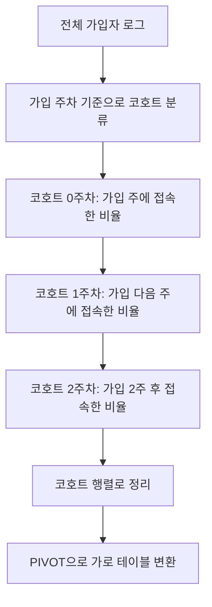
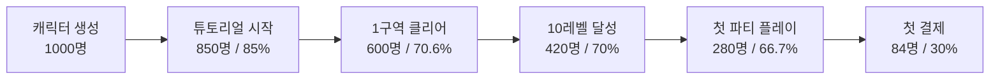

# 제9장: 통계 분석 실전
8장에서는 온라인 게임 콘텐츠별로 데이터를 분류하고 기본적인 집계 쿼리를 작성하는 방법을 배웠다. 이제 한 단계 더 나아가, 수집된 데이터에서 의미 있는 인사이트를 추출하는 **통계 분석**을 다룬다.

게임 운영팀이 자주 받는 질문을 생각해 보자.

- "오늘 접속한 유저 중 상위 10%는 얼마나 오래 플레이했나?"
- "지난달 가입한 유저들이 한 달 뒤에도 남아 있을 확률은?"
- "튜토리얼을 시작한 유저가 최종 보스를 잡기까지 각 단계에서 몇 %가 이탈하나?"

이런 질문에 답하려면 단순 집계를 넘어서, **통계 함수**, **윈도우 함수**, **시계열 분석**, **코호트 분석**, **퍼널 분석** 같은 고급 기법이 필요하다. DuckDB는 이 모든 기능을 내장하고 있어서 외부 라이브러리 없이도 데이터베이스 쿼리만으로 분석을 완료할 수 있다.

이 장에서 다루는 모든 예제 코드는 `code/ch09/` 디렉토리에 저장되어 있다.

---

## 9.1 DuckDB 내장 통계 함수 총람
통계 분석의 출발점은 데이터의 기본 특성을 파악하는 **기술 통계(Descriptive Statistics)**다. DuckDB는 데이터베이스 수준에서 풍부한 통계 함수를 제공하므로, Python이나 R 같은 외부 도구 없이도 핵심 지표를 바로 계산할 수 있다.

### 기술 통계 함수
아래 표는 DuckDB에서 자주 쓰이는 기술 통계 함수들을 정리한 것이다.

| 함수 | 설명 | NULL 처리 |
|------|------|-----------|
| `avg(x)` | 산술 평균 | NULL 제외 |
| `median(x)` | 중앙값 (50번째 백분위수) | NULL 제외 |
| `stddev_pop(x)` | 모집단 표준편차 | NULL 제외 |
| `stddev_samp(x)` | 표본 표준편차 | NULL 제외 |
| `var_pop(x)` | 모집단 분산 | NULL 제외 |
| `var_samp(x)` | 표본 분산 | NULL 제외 |
| `sem(x)` | 표준 오차(Standard Error of Mean) | NULL 제외 |
| `skewness(x)` | 왜도(분포의 비대칭 정도) | NULL 제외 |
| `kurtosis(x)` | 첨도(분포의 뾰족한 정도) | NULL 제외 |

**예제: 유저 세션 시간의 기술 통계**

게임 세션 로그 테이블이 아래와 같다고 가정한다.

```sql
-- 테스트용 세션 데이터 생성
CREATE OR REPLACE TABLE session_log AS
SELECT
    user_id,
    session_start,
    session_end,
    epoch(session_end - session_start) / 60.0 AS duration_min  -- 분 단위
FROM (
    VALUES
        (1001, TIMESTAMP '2025-06-01 10:00:00', TIMESTAMP '2025-06-01 10:35:00'),
        (1002, TIMESTAMP '2025-06-01 11:00:00', TIMESTAMP '2025-06-01 12:10:00'),
        (1003, TIMESTAMP '2025-06-01 09:30:00', TIMESTAMP '2025-06-01 09:45:00'),
        (1004, TIMESTAMP '2025-06-01 14:00:00', TIMESTAMP '2025-06-01 16:30:00'),
        (1005, TIMESTAMP '2025-06-01 20:00:00', TIMESTAMP '2025-06-01 20:20:00'),
        (1006, TIMESTAMP '2025-06-01 22:00:00', TIMESTAMP '2025-06-02 00:15:00')
    ) t(user_id, session_start, session_end)
;

-- 기술 통계 한 번에 계산
SELECT
    count(*)             AS total_sessions,
    round(avg(duration_min), 2)          AS avg_min,
    round(median(duration_min), 2)       AS median_min,
    round(stddev_samp(duration_min), 2)  AS stddev_min,
    round(var_samp(duration_min), 2)     AS variance,
    round(sem(duration_min), 2)          AS std_error,
    min(duration_min)                    AS min_min,
    max(duration_min)                    AS max_min
FROM session_log;
```

`avg`는 극단값(outlier)에 민감하다. 한 명이 150분을 플레이하면 평균이 크게 왜곡된다. 반면 `median`은 중간에 있는 값을 그대로 반환하므로 게임 세션 분석처럼 분포가 치우친 데이터에서는 `median`이 실질적인 중심 경향을 더 잘 나타낸다.

---

### 분위수 함수

| 함수 | 설명 |
|------|------|
| `percentile_cont(frac) WITHIN GROUP (ORDER BY x)` | 연속 분위수(보간 적용) |
| `percentile_disc(frac) WITHIN GROUP (ORDER BY x)` | 이산 분위수(실제 값 반환) |
| `quantile_cont(x, frac)` | 집계 형태의 연속 분위수 |
| `quantile_disc(x, frac)` | 집계 형태의 이산 분위수 |
| `quantile_cont(x, [0.25, 0.5, 0.75])` | 배열로 여러 분위수 동시 계산 |

```sql
-- 플레이 시간의 사분위수(Q1, Q2, Q3) 및 90 · 99 백분위수
SELECT
    percentile_cont(0.25) WITHIN GROUP (ORDER BY duration_min) AS q1,
    percentile_cont(0.50) WITHIN GROUP (ORDER BY duration_min) AS q2_median,
    percentile_cont(0.75) WITHIN GROUP (ORDER BY duration_min) AS q3,
    percentile_cont(0.90) WITHIN GROUP (ORDER BY duration_min) AS p90,
    percentile_cont(0.99) WITHIN GROUP (ORDER BY duration_min) AS p99
FROM session_log;

-- 배열 문법으로 한 번에 계산 (DuckDB 편의 기능)
SELECT quantile_cont(duration_min, [0.25, 0.50, 0.75, 0.90, 0.99])
FROM session_log;
```

P90, P99 같은 상위 백분위수는 게임 성능 분석에서 특히 중요하다. 평균 로딩 시간이 1초라도 P99가 10초라면 100명 중 1명은 매우 나쁜 경험을 하고 있다는 뜻이다.

---

### 빈도 및 범위 함수

| 함수 | 설명 |
|------|------|
| `mode()` | 최빈값(가장 자주 등장하는 값) |
| `count(x)` | NULL이 아닌 행 수 |
| `count(*)` | 전체 행 수 |
| `count(DISTINCT x)` | 고유값 수(DAU 계산에 필수) |
| `min(x)` | 최솟값 |
| `max(x)` | 최댓값 |
| `range(x)` | max - min (범위) |
| `first(x)` | 첫 번째 값 |
| `last(x)` | 마지막 값 |
| `list(x)` | 모든 값을 배열로 수집 |
| `string_agg(x, sep)` | 문자열로 연결 |

```sql
-- 게임 접속 로그에서 DAU, 신규 vs 복귀 유저, 최다 접속 직업 분석
CREATE OR REPLACE TABLE login_log AS
SELECT * FROM (
    VALUES
        (1001, '전사',  DATE '2025-06-01'),
        (1002, '마법사',DATE '2025-06-01'),
        (1003, '전사',  DATE '2025-06-01'),
        (1001, '전사',  DATE '2025-06-02'),
        (1004, '궁수',  DATE '2025-06-02'),
        (1002, '마법사',DATE '2025-06-02'),
        (1005, '전사',  DATE '2025-06-02')
) t(user_id, job_class, login_date);

SELECT
    login_date,
    count(DISTINCT user_id)  AS dau,       -- 일별 접속 유저 수
    mode(job_class)          AS top_class,  -- 가장 많이 접속한 직업
    min(user_id)             AS first_user,
    max(user_id)             AS last_user
FROM login_log
GROUP BY login_date
ORDER BY login_date;
```

---

## 9.2 윈도우 함수(Window Function)로 순위·누적·이동 평균 계산

윈도우 함수는 일반 집계 함수와 달리 **행을 그룹으로 합치지 않고도** 행마다 집계 결과를 붙여 준다. 결과 행 수가 원본 그대로 유지되면서, 각 행에 "이 행이 속한 그룹 내 순위", "누적 합계" 같은 맥락 정보가 추가된다.

기본 문법은 다음과 같다.

```sql
함수명() OVER (
    [PARTITION BY 그룹_컬럼]
    [ORDER BY 정렬_컬럼]
    [ROWS/RANGE BETWEEN 시작 AND 끝]
)
```

`PARTITION BY`는 "이 기준으로 나눠서 계산하라"는 뜻이고, `ORDER BY`는 창 안에서의 정렬 순서를 결정한다. `ROWS BETWEEN`은 창의 크기를 제한할 때 쓴다.

---

### 순위 함수

```sql
CREATE OR REPLACE TABLE player_score AS
SELECT * FROM (
    VALUES
        (1001, '검사', 9800),
        (1002, '마법사', 12400),
        (1003, '궁수', 9800),
        (1004, '힐러', 7200),
        (1005, '검사', 15000),
        (1006, '마법사', 9800)
) t(user_id, job_class, score);

-- 전체 순위와 직업별 순위를 한 번에
SELECT
    user_id,
    job_class,
    score,
    ROW_NUMBER() OVER (ORDER BY score DESC)                          AS row_num,   -- 동점 없이 고유 번호
    RANK()       OVER (ORDER BY score DESC)                          AS rank_all,  -- 동점자 같은 순위, 다음 순위 건너뜀
    DENSE_RANK() OVER (ORDER BY score DESC)                          AS dense_rank,-- 동점자 같은 순위, 순위 연속
    NTILE(4)     OVER (ORDER BY score DESC)                          AS quartile,  -- 4등분 그룹
    RANK()       OVER (PARTITION BY job_class ORDER BY score DESC)   AS rank_job   -- 직업별 순위
FROM player_score
ORDER BY score DESC;
```

`RANK`와 `DENSE_RANK`의 차이는 동점 처리 방식이다. 9800점이 세 명이면 `RANK`는 2위가 세 명이고 다음은 5위지만, `DENSE_RANK`는 2위가 세 명이고 다음은 3위다. 게임 랭킹 시스템에서는 보통 `RANK`를 사용해 점수 구간의 빈칸을 그대로 둔다.

---

### 누적 집계

```sql
-- 날짜별 매출과 누적 매출
CREATE OR REPLACE TABLE daily_revenue AS
SELECT * FROM (
    VALUES
        (DATE '2025-06-01', 1200000),
        (DATE '2025-06-02', 980000),
        (DATE '2025-06-03', 1540000),
        (DATE '2025-06-04', 870000),
        (DATE '2025-06-05', 1350000),
        (DATE '2025-06-06', 1100000),
        (DATE '2025-06-07', 1620000)
) t(log_date, revenue);

SELECT
    log_date,
    revenue,
    SUM(revenue)   OVER (ORDER BY log_date ROWS BETWEEN UNBOUNDED PRECEDING AND CURRENT ROW) AS cumulative_revenue,
    AVG(revenue)   OVER (ORDER BY log_date ROWS BETWEEN UNBOUNDED PRECEDING AND CURRENT ROW) AS cumulative_avg,
    COUNT(*)       OVER (ORDER BY log_date ROWS BETWEEN UNBOUNDED PRECEDING AND CURRENT ROW) AS days_passed
FROM daily_revenue
ORDER BY log_date;
```

`UNBOUNDED PRECEDING AND CURRENT ROW`는 "첫 행부터 현재 행까지"를 의미한다. 이 구문이 없으면 DuckDB는 기본적으로 파티션 전체를 창으로 사용한다.

---

### 이동 평균 (Moving Average)

이동 평균은 노이즈를 줄이고 추세를 파악하는 데 유용하다. 게임 DAU 그래프에서 일별 등락이 심할 때 7일 이동 평균을 그리면 전체 추세가 더 명확하게 보인다.

```sql
SELECT
    log_date,
    revenue,
    -- 3일 이동 평균 (현재 포함 이전 2일)
    round(AVG(revenue) OVER (
        ORDER BY log_date
        ROWS BETWEEN 2 PRECEDING AND CURRENT ROW
    ), 0) AS ma3,
    -- 7일 이동 평균
    round(AVG(revenue) OVER (
        ORDER BY log_date
        ROWS BETWEEN 6 PRECEDING AND CURRENT ROW
    ), 0) AS ma7
FROM daily_revenue
ORDER BY log_date;
```

---

### LAG / LEAD — 이전·다음 행 참조

```sql
-- 전날 대비 매출 증감률
SELECT
    log_date,
    revenue,
    LAG(revenue, 1) OVER (ORDER BY log_date)  AS prev_revenue,
    LEAD(revenue, 1) OVER (ORDER BY log_date) AS next_revenue,
    round(
        (revenue - LAG(revenue, 1) OVER (ORDER BY log_date))
        / LAG(revenue, 1) OVER (ORDER BY log_date) * 100.0
    , 2) AS growth_rate_pct
FROM daily_revenue
ORDER BY log_date;
```

`LAG(x, n)`은 n행 앞의 값을 가져온다. 기본값은 1이다. `LEAD(x, n)`은 n행 뒤 값을 가져온다. 세 번째 인수로 NULL 대신 사용할 기본값도 지정할 수 있다(`LAG(revenue, 1, 0)`).

---

### CUME_DIST / PERCENT_RANK

```sql
-- 점수 분포에서 유저의 상대적 위치
SELECT
    user_id,
    score,
    round(PERCENT_RANK() OVER (ORDER BY score) * 100, 1) AS percent_rank,
    round(CUME_DIST()    OVER (ORDER BY score) * 100, 1) AS cume_dist_pct
FROM player_score
ORDER BY score;
```

`PERCENT_RANK()`는 "나보다 점수가 낮은 유저 비율"을 0~1로 나타내고, `CUME_DIST()`는 "나보다 점수가 낮거나 같은 유저 비율"을 나타낸다. 유저 프로필 화면에서 "상위 X%"를 표시할 때 사용하면 된다.

---

## 9.3 시계열 분석 — 날짜/시간 함수 활용

게임 데이터는 대부분 타임스탬프가 붙어 있다. 로그인 시각, 구매 시각, 퀘스트 완료 시각 — 이 시간 정보를 잘 활용하면 "언제" 유저가 가장 활발한지, "언제" 이탈이 급증하는지를 파악할 수 있다.

### date_trunc으로 시간 집계

`date_trunc(단위, 타임스탬프)`는 타임스탬프를 지정한 단위로 잘라낸다. 시간별 집계, 일별 집계, 주별 집계, 월별 집계가 한 함수로 해결된다.

```sql
CREATE OR REPLACE TABLE event_log AS
SELECT
    user_id,
    event_type,
    event_time
FROM (
    VALUES
        (1001, 'login',    TIMESTAMP '2025-06-01 09:12:00'),
        (1002, 'login',    TIMESTAMP '2025-06-01 09:45:00'),
        (1001, 'purchase', TIMESTAMP '2025-06-01 10:30:00'),
        (1003, 'login',    TIMESTAMP '2025-06-01 14:00:00'),
        (1002, 'purchase', TIMESTAMP '2025-06-02 11:00:00'),
        (1004, 'login',    TIMESTAMP '2025-06-02 20:30:00'),
        (1001, 'login',    TIMESTAMP '2025-06-08 09:00:00'),
        (1005, 'login',    TIMESTAMP '2025-06-08 15:00:00')
) t(user_id, event_type, event_time);

-- 시간별 접속 수 (분 단위 노이즈 제거)
SELECT
    date_trunc('hour', event_time)  AS hour_slot,
    count(*)                        AS event_count
FROM event_log
WHERE event_type = 'login'
GROUP BY hour_slot
ORDER BY hour_slot;

-- 일별 접속 유저 수
SELECT
    date_trunc('day',  event_time) AS day_slot,
    count(DISTINCT user_id)        AS dau
FROM event_log
WHERE event_type = 'login'
GROUP BY day_slot
ORDER BY day_slot;

-- 주별 수익
SELECT
    date_trunc('week', event_time) AS week_start,
    count(*)                       AS purchase_count
FROM event_log
WHERE event_type = 'purchase'
GROUP BY week_start
ORDER BY week_start;

-- 월별 집계
SELECT
    date_trunc('month', event_time) AS month_slot,
    count(DISTINCT user_id)         AS mau
FROM event_log
GROUP BY month_slot
ORDER BY month_slot;
```

---

### 날짜 범위 생성과 결측 채우기

집계를 하다 보면 데이터가 없는 날짜가 빠져 버린다. 예를 들어 6월 3일에 아무도 접속하지 않았다면 3일 행이 아예 없어서 그래프에 구멍이 생긴다. 이 문제를 `generate_series`와 `LEFT JOIN`으로 해결한다.

```sql
-- 6월 1일 ~ 6월 10일까지 날짜 시리즈 생성
SELECT unnest(generate_series(
    DATE '2025-06-01',
    DATE '2025-06-10',
    INTERVAL '1 day'
))::DATE AS day_slot;

-- 결측 날짜를 0으로 채운 DAU 시계열
WITH date_series AS (
    SELECT unnest(generate_series(
        DATE '2025-06-01',
        DATE '2025-06-10',
        INTERVAL '1 day'
    ))::DATE AS day_slot
),
daily_active AS (
    SELECT
        date_trunc('day', event_time)::DATE AS day_slot,
        count(DISTINCT user_id)             AS dau
    FROM event_log
    WHERE event_type = 'login'
    GROUP BY 1
)
SELECT
    ds.day_slot,
    coalesce(da.dau, 0) AS dau
FROM date_series ds
LEFT JOIN daily_active da ON ds.day_slot = da.day_slot
ORDER BY ds.day_slot;
```

`coalesce(da.dau, 0)`은 JOIN이 매칭되지 않은 날(데이터 없는 날)의 NULL을 0으로 바꿔 준다. 이렇게 하면 10일치 행이 모두 채워진 깔끔한 시계열 데이터를 얻는다.

---

### 요일·시간대별 분석

유저 행동 패턴을 분석할 때 요일과 시간대는 매우 중요한 변수다. 직장인 게이머는 주중 저녁과 주말에 집중되고, 학생 게이머는 오후 늦게 몰리는 경향이 있다.

```sql
-- 요일별 평균 DAU (0=일요일, 1=월요일, ... 6=토요일)
SELECT
    dayofweek(event_time)  AS dow,
    CASE dayofweek(event_time)
        WHEN 0 THEN '일'
        WHEN 1 THEN '월'
        WHEN 2 THEN '화'
        WHEN 3 THEN '수'
        WHEN 4 THEN '목'
        WHEN 5 THEN '금'
        WHEN 6 THEN '토'
    END                    AS dow_name,
    count(DISTINCT user_id) AS active_users
FROM event_log
WHERE event_type = 'login'
GROUP BY dow, dow_name
ORDER BY dow;

-- 시간대별 접속 분포 (피크 타임 파악)
SELECT
    hour(event_time)       AS hour_of_day,
    count(DISTINCT user_id) AS active_users
FROM event_log
WHERE event_type = 'login'
GROUP BY hour_of_day
ORDER BY hour_of_day;
```

DuckDB는 `dayofweek()`, `dayofyear()`, `hour()`, `minute()`, `second()`, `monthname()` 등 날짜/시간 추출 함수를 풍부하게 제공한다. `strftime('%Y-%m', event_time)` 같은 포맷 문자열 방식도 지원한다.

---

## 9.4 코호트 분석 — 특정 날짜 가입자 그룹 추적
**코호트(Cohort)**란 같은 기간에 동일한 행동을 한 유저 집단이다. 게임에서는 보통 "같은 주에 가입한 유저 그룹"으로 정의한다. 코호트 분석의 핵심 질문은 "이 그룹은 시간이 지나면서 얼마나 남아 있는가?"다. 이것이 **리텐션(Retention)** 지표다.



### 코호트 행렬 만들기

```sql
-- 유저 가입 정보
CREATE OR REPLACE TABLE user_register AS
SELECT * FROM (
    VALUES
        (1001, DATE '2025-06-01'),
        (1002, DATE '2025-06-01'),
        (1003, DATE '2025-06-02'),
        (1004, DATE '2025-06-08'),
        (1005, DATE '2025-06-08'),
        (1006, DATE '2025-06-09'),
        (1007, DATE '2025-06-15'),
        (1008, DATE '2025-06-15')
) t(user_id, register_date);

-- 로그인 로그 (위 event_log에 행 추가)
CREATE OR REPLACE TABLE login_history AS
SELECT * FROM (
    VALUES
        (1001, DATE '2025-06-01'),
        (1002, DATE '2025-06-01'),
        (1003, DATE '2025-06-02'),
        (1001, DATE '2025-06-08'),
        (1003, DATE '2025-06-09'),
        (1004, DATE '2025-06-08'),
        (1005, DATE '2025-06-08'),
        (1001, DATE '2025-06-15'),
        (1004, DATE '2025-06-16'),
        (1006, DATE '2025-06-15'),
        (1007, DATE '2025-06-15'),
        (1008, DATE '2025-06-15'),
        (1001, DATE '2025-06-22'),
        (1007, DATE '2025-06-22'),
        (1008, DATE '2025-06-23')
) t(user_id, login_date);

-- 코호트 행렬 계산
WITH cohort_base AS (
    -- 각 유저의 코호트 주차(가입 주 시작일)
    SELECT
        u.user_id,
        date_trunc('week', u.register_date)::DATE AS cohort_week
    FROM user_register u
),
activity AS (
    -- 각 로그인이 가입 후 몇 주차인지 계산
    SELECT
        cb.user_id,
        cb.cohort_week,
        floor(
            datediff('day', cb.cohort_week, l.login_date) / 7
        )::INT AS weeks_since_register
    FROM cohort_base cb
    JOIN login_history l ON cb.user_id = l.user_id
),
cohort_size AS (
    -- 코호트별 초기 유저 수
    SELECT cohort_week, count(DISTINCT user_id) AS cohort_users
    FROM cohort_base
    GROUP BY cohort_week
),
retention_raw AS (
    -- 코호트 × 주차별 잔존 유저 수
    SELECT
        a.cohort_week,
        a.weeks_since_register,
        count(DISTINCT a.user_id) AS active_users
    FROM activity a
    GROUP BY a.cohort_week, a.weeks_since_register
)
SELECT
    r.cohort_week,
    cs.cohort_users,
    r.weeks_since_register                                        AS week_num,
    r.active_users,
    round(r.active_users * 100.0 / cs.cohort_users, 1)           AS retention_pct
FROM retention_raw r
JOIN cohort_size cs ON r.cohort_week = cs.cohort_week
ORDER BY r.cohort_week, r.weeks_since_register;
```

---

### PIVOT으로 코호트 행렬 가로 변환

세로로 나열된 결과를 행렬 형태로 보면 리텐션 추세가 한눈에 보인다.

```sql
-- PIVOT으로 가로 전환 (Week 0 ~ Week 3)
PIVOT (
    SELECT
        r.cohort_week,
        cs.cohort_users,
        r.weeks_since_register AS week_num,
        round(r.active_users * 100.0 / cs.cohort_users, 1) AS retention_pct
    FROM (
        WITH cohort_base AS (
            SELECT user_id, date_trunc('week', register_date)::DATE AS cohort_week
            FROM user_register
        ),
        activity AS (
            SELECT cb.user_id, cb.cohort_week,
                   floor(datediff('day', cb.cohort_week, l.login_date) / 7)::INT AS weeks_since_register
            FROM cohort_base cb JOIN login_history l ON cb.user_id = l.user_id
        ),
        cohort_size AS (
            SELECT cohort_week, count(DISTINCT user_id) AS cohort_users
            FROM cohort_base GROUP BY cohort_week
        ),
        retention_raw AS (
            SELECT cohort_week, weeks_since_register, count(DISTINCT user_id) AS active_users
            FROM activity GROUP BY cohort_week, weeks_since_register
        )
        SELECT r.cohort_week, cs.cohort_users, r.weeks_since_register,
               round(r.active_users * 100.0 / cs.cohort_users, 1) AS retention_pct
        FROM retention_raw r JOIN cohort_size cs ON r.cohort_week = cs.cohort_week
    ) sub
    ON week_num
    USING first(retention_pct)
    GROUP BY cohort_week, cohort_users
)
ORDER BY cohort_week;
```

결과는 다음과 같은 형태로 나온다.

```
cohort_week | cohort_users | 0     | 1     | 2     | 3
------------+--------------+-------+-------+-------+------
2025-06-02  |     3        | 100.0 | 66.7  | 33.3  | 33.3
2025-06-09  |     3        | 100.0 | 33.3  | NULL  | NULL
2025-06-16  |     2        | 100.0 | NULL  | NULL  | NULL
```

0주차는 항상 100%다(가입한 주에 게임을 했으니까). 1주차 리텐션이 높을수록 신규 유저 경험(FTUE, First Time User Experience)이 좋다는 신호다.

---

## 9.5 퍼널(Funnel) 분석 — 단계별 전환율

**퍼널 분석**은 유저가 특정 목표를 달성하기까지의 단계별 통과율을 측정한다. 마케팅에서 구매 퍼널을 분석하듯, 게임에서는 튜토리얼 퍼널, 결제 퍼널, 레벨업 퍼널 등을 분석한다.



### 튜토리얼 완료 퍼널

```sql
CREATE OR REPLACE TABLE funnel_events AS
SELECT * FROM (
    VALUES
        -- (user_id, step, event_time)
        (1001, 'create_character', TIMESTAMP '2025-06-01 10:00:00'),
        (1002, 'create_character', TIMESTAMP '2025-06-01 10:05:00'),
        (1003, 'create_character', TIMESTAMP '2025-06-01 10:10:00'),
        (1004, 'create_character', TIMESTAMP '2025-06-01 10:15:00'),
        (1005, 'create_character', TIMESTAMP '2025-06-01 10:20:00'),
        (1001, 'tutorial_start',  TIMESTAMP '2025-06-01 10:02:00'),
        (1002, 'tutorial_start',  TIMESTAMP '2025-06-01 10:07:00'),
        (1003, 'tutorial_start',  TIMESTAMP '2025-06-01 10:12:00'),
        (1004, 'tutorial_start',  TIMESTAMP '2025-06-01 10:17:00'),
        (1001, 'zone1_clear',     TIMESTAMP '2025-06-01 10:40:00'),
        (1002, 'zone1_clear',     TIMESTAMP '2025-06-01 11:00:00'),
        (1003, 'zone1_clear',     TIMESTAMP '2025-06-01 10:55:00'),
        (1001, 'level10',         TIMESTAMP '2025-06-01 12:00:00'),
        (1002, 'level10',         TIMESTAMP '2025-06-01 12:30:00'),
        (1001, 'first_party',     TIMESTAMP '2025-06-01 13:00:00'),
        (1001, 'first_purchase',  TIMESTAMP '2025-06-01 14:00:00')
) t(user_id, step, event_time);

-- 퍼널 단계별 유저 수 집계
WITH funnel_steps AS (
    SELECT
        step,
        count(DISTINCT user_id) AS users,
        CASE step
            WHEN 'create_character' THEN 1
            WHEN 'tutorial_start'   THEN 2
            WHEN 'zone1_clear'      THEN 3
            WHEN 'level10'          THEN 4
            WHEN 'first_party'      THEN 5
            WHEN 'first_purchase'   THEN 6
        END AS step_order
    FROM funnel_events
    GROUP BY step
)
SELECT
    step_order,
    step,
    users,
    -- 첫 단계 대비 전환율
    round(users * 100.0 / first_value(users) OVER (ORDER BY step_order), 1) AS overall_cvr,
    -- 직전 단계 대비 전환율
    round(users * 100.0 / lag(users, 1, users) OVER (ORDER BY step_order), 1) AS step_cvr
FROM funnel_steps
ORDER BY step_order;
```

---

### 결제 퍼널

결제는 게임 수익화의 핵심이다. 어느 단계에서 유저가 지갑을 닫는지 파악하면 결제 UX 개선 포인트를 찾을 수 있다.

```sql
CREATE OR REPLACE TABLE purchase_funnel AS
SELECT * FROM (
    VALUES
        (2001, 'shop_open',      TIMESTAMP '2025-06-05 20:00:00'),
        (2002, 'shop_open',      TIMESTAMP '2025-06-05 20:05:00'),
        (2003, 'shop_open',      TIMESTAMP '2025-06-05 20:10:00'),
        (2004, 'shop_open',      TIMESTAMP '2025-06-05 20:15:00'),
        (2005, 'shop_open',      TIMESTAMP '2025-06-05 20:20:00'),
        (2001, 'item_select',    TIMESTAMP '2025-06-05 20:02:00'),
        (2002, 'item_select',    TIMESTAMP '2025-06-05 20:08:00'),
        (2003, 'item_select',    TIMESTAMP '2025-06-05 20:13:00'),
        (2004, 'item_select',    TIMESTAMP '2025-06-05 20:18:00'),
        (2001, 'payment_page',   TIMESTAMP '2025-06-05 20:03:00'),
        (2002, 'payment_page',   TIMESTAMP '2025-06-05 20:09:00'),
        (2003, 'payment_page',   TIMESTAMP '2025-06-05 20:14:00'),
        (2001, 'payment_submit', TIMESTAMP '2025-06-05 20:04:00'),
        (2002, 'payment_submit', TIMESTAMP '2025-06-05 20:10:00'),
        (2001, 'payment_done',   TIMESTAMP '2025-06-05 20:05:00')
) t(user_id, step, event_time);

WITH step_counts AS (
    SELECT
        step,
        count(DISTINCT user_id) AS users,
        CASE step
            WHEN 'shop_open'      THEN 1
            WHEN 'item_select'    THEN 2
            WHEN 'payment_page'   THEN 3
            WHEN 'payment_submit' THEN 4
            WHEN 'payment_done'   THEN 5
        END AS step_order
    FROM purchase_funnel
    GROUP BY step
)
SELECT
    step_order,
    step                                                                             AS funnel_step,
    users,
    round(users * 100.0 / first_value(users) OVER (ORDER BY step_order), 1)        AS total_cvr_pct,
    round(users * 100.0 / lag(users, 1, users) OVER (ORDER BY step_order), 1)      AS prev_step_cvr_pct,
    lag(users, 1, users) OVER (ORDER BY step_order) - users                        AS drop_off
FROM step_counts
ORDER BY step_order;
```

`drop_off` 컬럼은 각 단계에서 빠져나간 유저 수다. `drop_off`가 가장 큰 단계가 결제 흐름의 병목 지점이다. 예를 들어 `payment_submit` 단계에서 이탈이 많다면 결제 폼이 너무 복잡하거나 오류가 잦다는 신호다.

---

## 9.6 실전 대시보드용 리포트 SQL 작성
이제 실제 운영 대시보드에서 쓸 수 있는 리포트 SQL을 만든다. 좋은 리포트 SQL은 단일 쿼리로 여러 지표를 함께 계산하고, 날짜 파라미터만 바꿔도 재사용할 수 있어야 한다.

### 일일 KPI 리포트 SQL
DAU(Daily Active Users), 신규 가입자, 수익, 결제 전환율을 하나의 쿼리로 계산한다.

```sql
-- 리포트 대상 날짜 (파라미터화 가능)
SET VARIABLE report_date = DATE '2025-06-05';

WITH
-- 1) 기준일 접속 유저
daily_logins AS (
    SELECT DISTINCT user_id
    FROM login_history
    WHERE login_date = getvariable('report_date')
),
-- 2) 신규 가입자
new_registrations AS (
    SELECT count(*) AS new_users
    FROM user_register
    WHERE register_date = getvariable('report_date')
),
-- 3) 결제 유저 (purchase_funnel 테이블 재활용)
payers AS (
    SELECT count(DISTINCT user_id) AS paying_users
    FROM purchase_funnel
    WHERE step = 'payment_done'
      AND event_time::DATE = getvariable('report_date')
),
-- 4) DAU
dau AS (
    SELECT count(*) AS dau FROM daily_logins
)
SELECT
    getvariable('report_date')                             AS report_date,
    dau.dau                                                AS dau,
    nr.new_users                                           AS new_users,
    round(nr.new_users * 100.0 / nullif(dau.dau, 0), 2)  AS new_user_ratio_pct,
    p.paying_users                                         AS paying_users,
    round(p.paying_users * 100.0 / nullif(dau.dau, 0), 2) AS payment_cvr_pct
FROM dau, new_registrations nr, payers p;
```

---

### 주간 게임 밸런스 리포트 SQL
직업별 평균 플레이 시간, 상위 1% 점수 기준, 클리어율을 일주일 단위로 집계한다.

```sql
-- 주간 리포트: 직업별 세션 통계 + 순위 기준점
WITH week_sessions AS (
    SELECT
        s.user_id,
        'unknown' AS job_class,  -- 실제 환경에서는 users 테이블 JOIN
        s.duration_min
    FROM session_log s
    -- WHERE session_start BETWEEN @week_start AND @week_end
),
job_stats AS (
    SELECT
        job_class,
        count(*)                                              AS session_count,
        round(avg(duration_min), 1)                          AS avg_duration,
        round(median(duration_min), 1)                       AS median_duration,
        round(stddev_samp(duration_min), 1)                  AS stddev_duration,
        round(percentile_cont(0.99) WITHIN GROUP
              (ORDER BY duration_min), 1)                    AS p99_duration
    FROM week_sessions
    GROUP BY job_class
)
SELECT * FROM job_stats ORDER BY avg_duration DESC;
```

---

### C#으로 HTML 리포트 생성

DuckDB에서 계산한 통계를 C#으로 읽어 간단한 HTML 파일로 저장하는 예제다.

```csharp
// code/ch09/DailyReportGenerator/Program.cs
using DuckDB.NET.Data;
using System.Text;

class DailyReportGenerator
{
    static async Task Main(string[] args)
    {
        var reportDate = args.Length > 0 ? args[0] : DateTime.Today.ToString("yyyy-MM-dd");
        var outputPath = args.Length > 1 ? args[1] : $"report_{reportDate}.html";

        using var connection = new DuckDBConnection("Data Source=game_analytics.db");
        await connection.OpenAsync();

        // 일일 KPI 조회
        var kpi = await FetchKpiAsync(connection, reportDate);

        // 직업별 세션 통계 조회
        var jobStats = await FetchJobStatsAsync(connection, reportDate);

        // HTML 생성
        var html = BuildHtmlReport(reportDate, kpi, jobStats);
        await File.WriteAllTextAsync(outputPath, html, Encoding.UTF8);

        Console.WriteLine($"리포트 저장 완료: {outputPath}");
    }

    record KpiRow(
        string ReportDate,
        int Dau,
        int NewUsers,
        double NewUserRatioPct,
        int PayingUsers,
        double PaymentCvrPct
    );

    record JobStatRow(
        string JobClass,
        int SessionCount,
        double AvgDuration,
        double MedianDuration,
        double StddevDuration,
        double P99Duration
    );

    static async Task<KpiRow?> FetchKpiAsync(DuckDBConnection conn, string reportDate)
    {
        var sql = $"""
            WITH
            daily_logins AS (
                SELECT DISTINCT user_id FROM login_history
                WHERE login_date = DATE '{reportDate}'
            ),
            new_registrations AS (
                SELECT count(*) AS new_users FROM user_register
                WHERE register_date = DATE '{reportDate}'
            ),
            payers AS (
                SELECT count(DISTINCT user_id) AS paying_users
                FROM purchase_funnel
                WHERE step = 'payment_done'
                  AND event_time::DATE = DATE '{reportDate}'
            ),
            dau AS (SELECT count(*) AS dau FROM daily_logins)
            SELECT
                '{reportDate}'                                              AS report_date,
                dau.dau,
                nr.new_users,
                round(nr.new_users * 100.0 / nullif(dau.dau, 0), 2)       AS new_user_ratio_pct,
                p.paying_users,
                round(p.paying_users * 100.0 / nullif(dau.dau, 0), 2)     AS payment_cvr_pct
            FROM dau, new_registrations nr, payers p
            """;

        using var cmd = conn.CreateCommand();
        cmd.CommandText = sql;
        using var reader = await cmd.ExecuteReaderAsync();

        if (await reader.ReadAsync())
        {
            return new KpiRow(
                reader.GetString(0),
                reader.GetInt32(1),
                reader.GetInt32(2),
                reader.IsDBNull(3) ? 0 : reader.GetDouble(3),
                reader.GetInt32(4),
                reader.IsDBNull(5) ? 0 : reader.GetDouble(5)
            );
        }
        return null;
    }

    static async Task<List<JobStatRow>> FetchJobStatsAsync(DuckDBConnection conn, string date)
    {
        var sql = $"""
            SELECT
                job_class,
                count(*)                                              AS session_count,
                round(avg(duration_min), 1)                          AS avg_duration,
                round(median(duration_min), 1)                       AS median_duration,
                round(stddev_samp(duration_min), 1)                  AS stddev_duration,
                round(percentile_cont(0.99) WITHIN GROUP
                      (ORDER BY duration_min), 1)                    AS p99_duration
            FROM session_log
            GROUP BY job_class
            ORDER BY avg_duration DESC
            """;

        var result = new List<JobStatRow>();
        using var cmd = conn.CreateCommand();
        cmd.CommandText = sql;
        using var reader = await cmd.ExecuteReaderAsync();

        while (await reader.ReadAsync())
        {
            result.Add(new JobStatRow(
                reader.IsDBNull(0) ? "Unknown" : reader.GetString(0),
                reader.GetInt32(1),
                reader.IsDBNull(2) ? 0 : reader.GetDouble(2),
                reader.IsDBNull(3) ? 0 : reader.GetDouble(3),
                reader.IsDBNull(4) ? 0 : reader.GetDouble(4),
                reader.IsDBNull(5) ? 0 : reader.GetDouble(5)
            ));
        }
        return result;
    }

    static string BuildHtmlReport(string date, KpiRow? kpi, List<JobStatRow> jobStats)
    {
        var sb = new StringBuilder();
        sb.AppendLine($"""
            <!DOCTYPE html>
            <html lang="ko">
            <head>
                <meta charset="UTF-8">
                <title>일일 KPI 리포트 - {date}</title>
                <style>
                    body {{ font-family: 'Malgun Gothic', sans-serif; margin: 40px; background: #f5f5f5; }}
                    h1 {{ color: #333; }}
                    .kpi-grid {{ display: grid; grid-template-columns: repeat(5, 1fr); gap: 16px; margin: 24px 0; }}
                    .kpi-card {{ background: white; border-radius: 8px; padding: 20px; box-shadow: 0 2px 4px rgba(0,0,0,.1); text-align: center; }}
                    .kpi-label {{ font-size: 13px; color: #888; margin-bottom: 8px; }}
                    .kpi-value {{ font-size: 28px; font-weight: bold; color: #2c7be5; }}
                    table {{ border-collapse: collapse; width: 100%; background: white; border-radius: 8px; overflow: hidden; box-shadow: 0 2px 4px rgba(0,0,0,.1); }}
                    th {{ background: #2c7be5; color: white; padding: 12px 16px; text-align: left; }}
                    td {{ padding: 10px 16px; border-bottom: 1px solid #eee; }}
                    tr:last-child td {{ border-bottom: none; }}
                </style>
            </head>
            <body>
                <h1>일일 KPI 리포트 — {date}</h1>
            """);

        if (kpi != null)
        {
            sb.AppendLine($"""
                <div class="kpi-grid">
                    <div class="kpi-card"><div class="kpi-label">DAU</div><div class="kpi-value">{kpi.Dau:N0}</div></div>
                    <div class="kpi-card"><div class="kpi-label">신규 가입</div><div class="kpi-value">{kpi.NewUsers:N0}</div></div>
                    <div class="kpi-card"><div class="kpi-label">신규 비율</div><div class="kpi-value">{kpi.NewUserRatioPct:F1}%</div></div>
                    <div class="kpi-card"><div class="kpi-label">결제 유저</div><div class="kpi-value">{kpi.PayingUsers:N0}</div></div>
                    <div class="kpi-card"><div class="kpi-label">결제 전환율</div><div class="kpi-value">{kpi.PaymentCvrPct:F1}%</div></div>
                </div>
                """);
        }

        sb.AppendLine("""
            <h2>직업별 세션 통계</h2>
            <table>
                <thead>
                    <tr>
                        <th>직업</th>
                        <th>세션 수</th>
                        <th>평균 플레이(분)</th>
                        <th>중앙값(분)</th>
                        <th>표준편차</th>
                        <th>P99(분)</th>
                    </tr>
                </thead>
                <tbody>
            """);

        foreach (var row in jobStats)
        {
            sb.AppendLine($"""
                    <tr>
                        <td>{row.JobClass}</td>
                        <td>{row.SessionCount:N0}</td>
                        <td>{row.AvgDuration:F1}</td>
                        <td>{row.MedianDuration:F1}</td>
                        <td>{row.StddevDuration:F1}</td>
                        <td>{row.P99Duration:F1}</td>
                    </tr>
                """);
        }

        sb.AppendLine("""
                </tbody>
            </table>
            </body>
            </html>
            """);

        return sb.ToString();
    }
}
```

C# 프로젝트는 `code/ch09/DailyReportGenerator/` 디렉토리에 저장한다. 실행 방법은 다음과 같다.

```bash
dotnet run -- 2025-06-05 output/kpi_2025-06-05.html
```

날짜 인수를 생략하면 오늘 날짜로 실행된다.

---

## 이 장의 핵심 정리

이 장에서는 DuckDB의 통계·분석 기능을 게임 데이터에 적용하는 방법을 처음부터 끝까지 다뤘다.

| 주제 | 핵심 내용 |
|------|-----------|
| **기술 통계** | `avg`, `median`, `stddev_samp`, `percentile_cont` 등으로 데이터 분포를 수치화한다 |
| **윈도우 함수** | `RANK`, `DENSE_RANK`, `SUM OVER`, `AVG OVER`, `LAG`, `LEAD`로 행 간 관계를 분석한다 |
| **시계열 분석** | `date_trunc`로 집계 단위를 조정하고, `generate_series`로 결측 날짜를 채운다 |
| **코호트 분석** | 가입 주차별 그룹을 만들고 `PIVOT`으로 리텐션 행렬을 시각화한다 |
| **퍼널 분석** | 단계별 통과 유저를 집계하고 `LAG`로 직전 단계 대비 전환율을 계산한다 |
| **대시보드 리포트** | CTE로 여러 지표를 단일 쿼리로 묶고, C#으로 HTML 리포트를 자동 생성한다 |

통계 분석의 목표는 숫자를 만드는 것이 아니라, **숫자가 가리키는 문제를 찾아 행동으로 연결하는 것**이다. 리텐션이 낮다면 온보딩을 개선하고, 특정 퍼널 단계의 이탈이 크다면 그 단계의 UX를 재검토한다. DuckDB는 이 분석 사이클을 SQL 한 줄로 빠르게 돌릴 수 있게 해 준다.

---

## 다음 장 예고
9장까지 DuckDB의 분석 기능을 충분히 익혔다. 그런데 데이터가 수억 건이 되면 쿼리가 느려질 수 있다. **10장: 성능 최적화**에서는 DuckDB가 대용량 데이터를 어떻게 처리하는지, 파티셔닝과 인덱스를 어떻게 활용하는지, 그리고 쿼리 실행 계획을 읽는 방법을 자세히 다룬다. 더 많은 데이터를 더 빠르게 처리하고 싶다면 10장으로 넘어가자.  