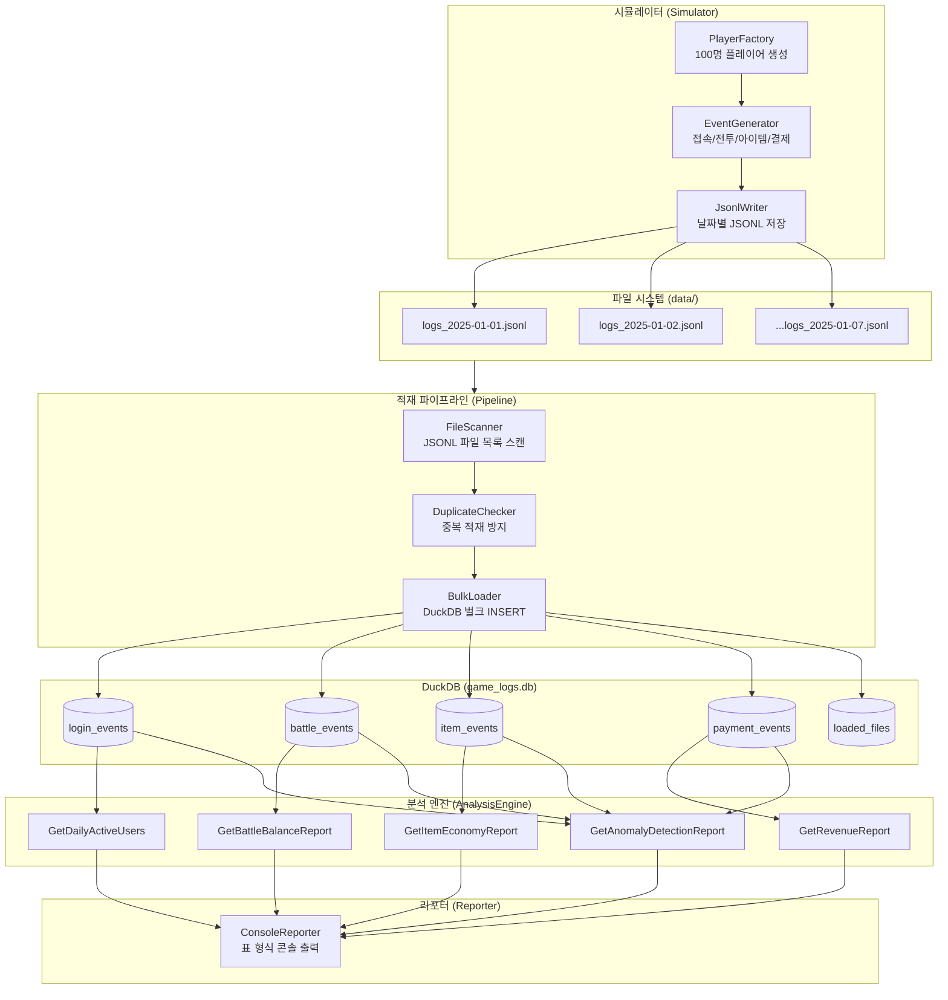

# 제11장: 실전 프로젝트 — 게임 로그 분석 시스템

> "이론은 지식을 만들고, 실전은 지혜를 만든다."

이 장은 책 전체의 종합 무대다. 지금까지 배운 DuckDB의 개념, SQL, C# 연동, 파일 처리, 로그 설계, 콘텐츠별 분석, 통계 분석, 성능 최적화를 모두 한 프로젝트에 녹여낸다.

우리가 만들 것은 **게임 로그 분석 시스템(Game Log Analyzer)** 이다. 가상의 온라인 게임 서버에서 7일치 플레이어 행동 로그를 생성하고, DuckDB에 적재한 뒤, 실무에서 실제로 쓰이는 분석 리포트를 콘솔에 출력하는 완전한 C# 콘솔 애플리케이션을 처음부터 끝까지 만든다.

이 프로젝트를 완성하고 나면, 독자는 DuckDB 기반 분석 시스템을 실무에 도입할 수 있는 수준의 역량을 갖추게 된다.

---

## 11.1 프로젝트 전체 구조 설계

### 시스템 개요

우리가 만들 시스템은 크게 세 단계로 흐른다.

1. **시뮬레이터(Simulator)**: 가상 플레이어 100명의 7일치 행동 로그를 JSONL 파일로 생성한다.
2. **파이프라인(Pipeline)**: JSONL 파일을 스캔하고 DuckDB에 벌크로 적재한다.
3. **분석 엔진(AnalysisEngine)**: DuckDB에 쿼리를 날려 DAU, 전투 균형, 경제 보고서, 매출, 이상 탐지 리포트를 생성한다.
4. **리포터(Reporter)**: 분석 결과를 보기 좋은 콘솔 표 형식으로 출력한다.

### 전체 아키텍처 다이어그램



### 프로젝트 디렉토리 구조

```
code/ch11/GameLogAnalyzer/
├── GameLogAnalyzer.csproj          # .NET 9 프로젝트 파일
├── Program.cs                      # 진입점, 전체 흐름 조율
│
├── Simulator/
│   ├── PlayerFactory.cs            # 가상 플레이어 100명 생성
│   ├── EventGenerator.cs           # 이벤트 생성 로직 (현실적 분포)
│   └── JsonlWriter.cs              # 날짜별 JSONL 파일 저장
│
├── Models/
│   ├── Player.cs                   # 플레이어 모델
│   ├── LoginEvent.cs               # 접속 이벤트 모델
│   ├── BattleEvent.cs              # 전투 이벤트 모델
│   ├── ItemEvent.cs                # 아이템 이벤트 모델
│   └── PaymentEvent.cs             # 결제 이벤트 모델
│
├── Pipeline/
│   ├── FileScanner.cs              # JSONL 파일 목록 스캔
│   ├── DuplicateChecker.cs         # 중복 적재 방지
│   └── BulkLoader.cs               # DuckDB 벌크 INSERT
│
├── Analysis/
│   └── AnalysisEngine.cs           # 분석 쿼리 모음
│
├── Report/
│   └── ConsoleReporter.cs          # 콘솔 리포트 출력
│
└── data/                           # 생성된 JSONL 파일 저장 위치
    ├── logs_2025-01-01.jsonl
    ├── logs_2025-01-02.jsonl
    └── ...
```

### 각 컴포넌트 역할 요약

| 컴포넌트 | 역할 | 주요 책임 |
|---|---|---|
| PlayerFactory | 플레이어 생성 | 100명의 플레이어 프로파일(레벨, 과금 유형, 플레이 패턴) 생성 |
| EventGenerator | 이벤트 생성 | 플레이어별 행동 패턴에 맞는 현실적 이벤트 생성 |
| JsonlWriter | 파일 저장 | 날짜별 JSONL 파일로 이벤트 기록 |
| FileScanner | 파일 탐색 | data/ 디렉토리에서 미처리 JSONL 파일 목록 수집 |
| DuplicateChecker | 중복 방지 | 이미 적재된 파일을 loaded_files 테이블로 추적 |
| BulkLoader | 데이터 적재 | JSONL → DuckDB 테이블 벌크 INSERT |
| AnalysisEngine | 분석 쿼리 | DAU, 전투 균형, 경제, 매출, 이상 탐지 쿼리 실행 |
| ConsoleReporter | 리포트 출력 | 분석 결과를 정렬된 표 형식으로 콘솔에 출력 |

---

## 11.2 로그 생성 시뮬레이터 구현

### 프로젝트 파일 생성

먼저 .NET 9 프로젝트를 생성한다.

```bash
mkdir -p code/ch11/GameLogAnalyzer
cd code/ch11/GameLogAnalyzer
dotnet new console -n GameLogAnalyzer --framework net9.0
cd GameLogAnalyzer
dotnet add package DuckDB.NET.Data
dotnet add package DuckDB.NET.Bindings.Full
```

`GameLogAnalyzer.csproj` 파일의 내용은 다음과 같다.

```xml
<Project Sdk="Microsoft.NET.Sdk">

  <PropertyGroup>
    <OutputType>Exe</OutputType>
    <TargetFramework>net9.0</TargetFramework>
    <Nullable>enable</Nullable>
    <ImplicitUsings>enable</ImplicitUsings>
    <AllowUnsafeBlocks>true</AllowUnsafeBlocks>
  </PropertyGroup>

  <ItemGroup>
    <PackageReference Include="DuckDB.NET.Data" Version="1.1.0" />
    <PackageReference Include="DuckDB.NET.Bindings.Full" Version="1.1.0" />
  </ItemGroup>

</Project>
```

### 모델 클래스 정의

`Models/Player.cs`

```csharp
namespace GameLogAnalyzer.Models;

/// <summary>
/// 플레이어 타입 — 과금 성향을 나타낸다
/// </summary>
public enum PlayerType
{
    Free,       // 무과금 플레이어
    Light,      // 소과금 플레이어 (월 1~5만원)
    Heavy,      // 중과금 플레이어 (월 5~20만원)
    Whale       // 고과금 플레이어 (월 20만원 이상)
}

/// <summary>
/// 플레이 시간 패턴
/// </summary>
public enum PlayPattern
{
    Morning,    // 아침 출근 전 (7~9시)
    Lunch,      // 점심 시간 (12~13시)
    Evening,    // 퇴근 후 저녁 (18~22시)
    Night,      // 심야 (22~2시)
    Casual      // 랜덤 시간대
}

/// <summary>
/// 가상 플레이어 프로파일
/// </summary>
public class Player
{
    public string PlayerId { get; init; } = "";
    public string Nickname { get; init; } = "";
    public int Level { get; set; }
    public PlayerType Type { get; init; }
    public PlayPattern Pattern { get; init; }

    // 플레이어별 특성 (현실적 분포를 위한 시드값)
    public double ActivityRate { get; init; }   // 0.0~1.0, 접속 확률
    public double BattleSkill { get; init; }    // 0.0~1.0, 전투 실력
    public int AvgSessionMinutes { get; init; } // 평균 세션 길이(분)
}
```

`Models/LoginEvent.cs`

```csharp
namespace GameLogAnalyzer.Models;

public class LoginEvent
{
    public string EventType { get; init; } = "login";
    public string PlayerId { get; init; } = "";
    public string Nickname { get; init; } = "";
    public DateTime Timestamp { get; init; }
    public string Date { get; init; } = "";       // yyyy-MM-dd
    public int Level { get; init; }
    public string Region { get; init; } = "";     // KR, US, JP, EU
    public string Platform { get; init; } = "";   // PC, Mobile
    public int SessionDurationSeconds { get; init; }
    public bool IsFirstLogin { get; init; }
}
```

`Models/BattleEvent.cs`

```csharp
namespace GameLogAnalyzer.Models;

public class BattleEvent
{
    public string EventType { get; init; } = "battle";
    public string PlayerId { get; init; } = "";
    public DateTime Timestamp { get; init; }
    public string Date { get; init; } = "";
    public string DungeonId { get; init; } = "";
    public string DungeonName { get; init; } = "";
    public string Difficulty { get; init; } = ""; // Normal, Hard, Extreme
    public bool IsSuccess { get; init; }
    public int DurationSeconds { get; init; }
    public int DamageDealt { get; init; }
    public int DamageTaken { get; init; }
    public int GoldEarned { get; init; }
    public int ExpEarned { get; init; }
    public int PlayerLevel { get; init; }
}
```

`Models/ItemEvent.cs`

```csharp
namespace GameLogAnalyzer.Models;

public class ItemEvent
{
    public string EventType { get; init; } = "item";
    public string PlayerId { get; init; } = "";
    public DateTime Timestamp { get; init; }
    public string Date { get; init; } = "";
    public string Action { get; init; } = "";     // acquire, consume, sell, craft
    public string ItemId { get; init; } = "";
    public string ItemName { get; init; } = "";
    public string ItemCategory { get; init; } = ""; // weapon, armor, potion, material
    public int Quantity { get; init; }
    public int GoldValue { get; init; }
    public string Source { get; init; } = "";     // dungeon, shop, craft, event
}
```

`Models/PaymentEvent.cs`

```csharp
namespace GameLogAnalyzer.Models;

public class PaymentEvent
{
    public string EventType { get; init; } = "payment";
    public string PlayerId { get; init; } = "";
    public DateTime Timestamp { get; init; }
    public string Date { get; init; } = "";
    public string ProductId { get; init; } = "";
    public string ProductName { get; init; } = "";
    public int AmountKrw { get; init; }           // 결제금액 (원화)
    public string Currency { get; init; } = "KRW";
    public string PaymentMethod { get; init; } = ""; // card, mobile, gift
    public string Store { get; init; } = "";      // AppStore, GooglePlay, Steam, PC
}
```

### PlayerFactory 구현

`Simulator/PlayerFactory.cs`

```csharp
using GameLogAnalyzer.Models;

namespace GameLogAnalyzer.Simulator;

/// <summary>
/// 가상 플레이어 100명을 현실적인 분포로 생성한다.
/// - 무과금 60%, 소과금 25%, 중과금 12%, 고과금(고래) 3%
/// - 플레이 패턴은 저녁 집중형이 많고 나머지는 분산
/// </summary>
public static class PlayerFactory
{
    private static readonly Random _rng = new Random(42); // 재현 가능한 시드

    private static readonly string[] _nicknames =
    [
        "DragonSlayer", "NightHunter", "IronFist", "ShadowBlade", "StarLord",
        "CrimsonWolf", "FrostArrow", "ThunderKing", "DarkMage", "HolyPaladin",
        "SilverWing", "BloodRayne", "StormBreaker", "VoidWalker", "FireDancer",
        "IceMaster", "LightBringer", "DoomBringer", "SoulReaper", "GhostRider",
        "TigerClaw", "EagleEye", "BearFist", "SnakeFang", "WolfHowl",
        "MoonStar", "SunBurst", "DeepSea", "HighSky", "RedRock",
        "BlueFlame", "GreenLeaf", "PurpleRain", "WhiteSnow", "BlackHole",
        "GoldRush", "SilverMoon", "BronzeAge", "CopperKey", "IronGate",
        "AncientOne", "NewHope", "LastStand", "FirstBlood", "FinalBoss",
        "QuickDraw", "SlowBurn", "HardCore", "SoftTouch", "ColdBlood",
        "HotHead", "WarmHeart", "BraveHeart", "LionHeart", "DarkHeart",
        "LightStep", "HeavyStep", "QuickStep", "SlowStep", "SideStep",
        "UpperCut", "LowerBlow", "LeftHook", "RightCross", "BodyShot",
        "HeadShot", "BackStab", "FrontLine", "SideArm", "CrossBow",
        "LongSword", "ShortSpear", "BigShield", "SmallDagger", "TwinBlades",
        "FireBolt", "IceLance", "WindArrow", "EarthShatter", "LightBeam",
        "DarkVoid", "PureLight", "ChaosStrike", "OrderShield", "BalanceSeeker",
        "LoneWolf", "PackLeader", "HiddenAce", "WildCard", "JokerFace",
        "KingPin", "QueenBee", "RookMove", "BishopCross", "KnightRide",
        "PawnPush", "CheckMate", "Stalemate", "Endgame", "NewGame"
    ];

    private static readonly string[] _regions = ["KR", "KR", "KR", "KR", "US", "JP", "EU"];
    private static readonly string[] _platforms = ["PC", "PC", "PC", "Mobile", "Mobile"];

    public static List<Player> CreatePlayers(int count = 100)
    {
        var players = new List<Player>(count);

        for (int i = 0; i < count; i++)
        {
            var type = PickPlayerType(i, count);
            var pattern = PickPlayPattern();

            players.Add(new Player
            {
                PlayerId = $"P{i + 1:D4}",
                Nickname = _nicknames[i % _nicknames.Length],
                Level = GenerateStartingLevel(type),
                Type = type,
                Pattern = pattern,
                ActivityRate = GenerateActivityRate(type),
                BattleSkill = GenerateBattleSkill(),
                AvgSessionMinutes = GenerateAvgSessionMinutes(type, pattern)
            });
        }

        return players;
    }

    /// <summary>
    /// 과금 유형 분포: 무과금 60%, 소과금 25%, 중과금 12%, 고래 3%
    /// </summary>
    private static PlayerType PickPlayerType(int index, int total)
    {
        // 결정론적으로 분포를 맞춘다
        double ratio = (double)index / total;
        return ratio switch
        {
            < 0.60 => PlayerType.Free,
            < 0.85 => PlayerType.Light,
            < 0.97 => PlayerType.Heavy,
            _ => PlayerType.Whale
        };
    }

    private static PlayPattern PickPlayPattern()
    {
        // 저녁 45%, 캐주얼 25%, 심야 15%, 점심 10%, 아침 5%
        double r = _rng.NextDouble();
        return r switch
        {
            < 0.05 => PlayPattern.Morning,
            < 0.15 => PlayPattern.Lunch,
            < 0.60 => PlayPattern.Evening,
            < 0.75 => PlayPattern.Night,
            _ => PlayPattern.Casual
        };
    }

    private static int GenerateStartingLevel(PlayerType type)
    {
        // 과금 유형이 높을수록 레벨이 높은 경향
        return type switch
        {
            PlayerType.Whale => _rng.Next(60, 100),
            PlayerType.Heavy => _rng.Next(40, 80),
            PlayerType.Light => _rng.Next(20, 60),
            _ => _rng.Next(1, 40)
        };
    }

    private static double GenerateActivityRate(PlayerType type)
    {
        // 과금 유저일수록 더 자주 접속
        return type switch
        {
            PlayerType.Whale => 0.7 + _rng.NextDouble() * 0.3,   // 0.7~1.0
            PlayerType.Heavy => 0.5 + _rng.NextDouble() * 0.4,   // 0.5~0.9
            PlayerType.Light => 0.3 + _rng.NextDouble() * 0.4,   // 0.3~0.7
            _ => 0.1 + _rng.NextDouble() * 0.4                    // 0.1~0.5
        };
    }

    private static double GenerateBattleSkill()
    {
        // 전투 실력은 정규분포에 가깝게 (평균 0.5, 표준편차 0.2, 0.0~1.0 클리핑)
        double u1 = 1.0 - _rng.NextDouble();
        double u2 = 1.0 - _rng.NextDouble();
        double normal = Math.Sqrt(-2.0 * Math.Log(u1)) * Math.Sin(2.0 * Math.PI * u2);
        double skill = 0.5 + normal * 0.2;
        return Math.Clamp(skill, 0.05, 0.95);
    }

    private static int GenerateAvgSessionMinutes(PlayerType type, PlayPattern pattern)
    {
        int baseMinutes = type switch
        {
            PlayerType.Whale => 120,
            PlayerType.Heavy => 90,
            PlayerType.Light => 60,
            _ => 30
        };

        // 심야 패턴은 세션이 길다
        if (pattern == PlayPattern.Night) baseMinutes = (int)(baseMinutes * 1.5);

        return baseMinutes + _rng.Next(-15, 30);
    }
}
```

### EventGenerator 구현

`Simulator/EventGenerator.cs`

```csharp
using GameLogAnalyzer.Models;

namespace GameLogAnalyzer.Simulator;

/// <summary>
/// 플레이어 프로파일을 기반으로 현실적인 게임 이벤트를 생성한다.
/// 포아송 분포(이벤트 발생 횟수), 정규분포(수치 분포)를 활용한다.
/// </summary>
public class EventGenerator
{
    private readonly Random _rng;

    // 던전 목록 (ID, 이름, 권장 레벨)
    private static readonly (string Id, string Name, int RecommendedLevel)[] _dungeons =
    [
        ("D001", "고블린 동굴",     5),
        ("D002", "언데드 묘지",    15),
        ("D003", "불의 신전",      25),
        ("D004", "얼음 미궁",      35),
        ("D005", "폭풍의 탑",      45),
        ("D006", "심연의 성채",    55),
        ("D007", "천공의 요새",    70),
        ("D008", "혼돈의 차원",    85),
        ("D009", "신들의 황혼",    95),
        ("D010", "태초의 공허",   100)
    ];

    // 아이템 목록 (ID, 이름, 카테고리, 기본 골드)
    private static readonly (string Id, string Name, string Category, int BaseGold)[] _items =
    [
        ("I001", "낡은 단검",       "weapon",   100),
        ("I002", "철제 검",         "weapon",   500),
        ("I003", "강철 대검",       "weapon",  2000),
        ("I004", "전설의 성검",     "weapon", 50000),
        ("I005", "가죽 갑옷",       "armor",    200),
        ("I006", "사슬 갑옷",       "armor",   1000),
        ("I007", "판금 갑옷",       "armor",   5000),
        ("I008", "용의 비늘 갑옷",  "armor",  80000),
        ("I009", "HP 포션(소)",     "potion",    50),
        ("I010", "HP 포션(대)",     "potion",   200),
        ("I011", "MP 포션",         "potion",   150),
        ("I012", "경험치 물약",     "potion",  1000),
        ("I013", "광석",            "material",  30),
        ("I014", "마법석",          "material", 500),
        ("I015", "신성한 정수",     "material",5000)
    ];

    // 결제 상품 목록
    private static readonly (string Id, string Name, int Krw)[] _products =
    [
        ("G001", "크리스탈 60개",      1100),
        ("G002", "크리스탈 330개",     5500),
        ("G003", "크리스탈 680개",    11000),
        ("G004", "크리스탈 1400개",   22000),
        ("G005", "크리스탈 3800개",   55000),
        ("G006", "크리스탈 8200개",  110000),
        ("G007", "월정액 패스",        9900),
        ("G008", "성장 지원 패키지",  33000),
        ("G009", "프리미엄 패키지",   99000),
        ("G010", "한정 전설 패키지", 198000)
    ];

    private static readonly string[] _regions = ["KR", "KR", "KR", "US", "JP", "EU"];
    private static readonly string[] _platforms = ["PC", "PC", "Mobile"];
    private static readonly string[] _payMethods = ["card", "card", "mobile", "gift"];
    private static readonly string[] _stores = ["Steam", "AppStore", "GooglePlay", "PC"];

    public EventGenerator(int seed = 12345)
    {
        _rng = new Random(seed);
    }

    /// <summary>
    /// 특정 날짜에 한 플레이어가 생성하는 모든 이벤트를 반환한다.
    /// </summary>
    public List<object> GenerateEventsForDay(Player player, DateTime date)
    {
        var events = new List<object>();

        // 오늘 접속할지 결정 (플레이어 활동률 기반)
        if (_rng.NextDouble() > player.ActivityRate)
            return events; // 오늘은 접속 안 함

        // 접속 이벤트 생성 (1~3회 세션)
        int sessionCount = SamplePoisson(1.5); // 평균 1.5회
        sessionCount = Math.Clamp(sessionCount, 1, 3);

        for (int s = 0; s < sessionCount; s++)
        {
            var loginTime = GetLoginTime(player.Pattern, date, s);
            var sessionSeconds = (player.AvgSessionMinutes + _rng.Next(-10, 30)) * 60;
            sessionSeconds = Math.Max(sessionSeconds, 300);

            var loginEvent = new LoginEvent
            {
                PlayerId = player.PlayerId,
                Nickname = player.Nickname,
                Timestamp = loginTime,
                Date = date.ToString("yyyy-MM-dd"),
                Level = player.Level,
                Region = _regions[_rng.Next(_regions.Length)],
                Platform = _platforms[_rng.Next(_platforms.Length)],
                SessionDurationSeconds = sessionSeconds,
                IsFirstLogin = (s == 0 && date == new DateTime(2025, 1, 1))
            };
            events.Add(loginEvent);

            // 세션 내 전투 이벤트 (포아송 분포, 평균 3회)
            int battleCount = SamplePoisson(3.0);
            var currentTime = loginTime.AddSeconds(60);

            for (int b = 0; b < battleCount; b++)
            {
                if (currentTime > loginTime.AddSeconds(sessionSeconds)) break;

                var battleEvent = GenerateBattleEvent(player, date, currentTime);
                events.Add(battleEvent);

                // 전투 후 아이템 획득
                if (_rng.NextDouble() < 0.7)
                {
                    var itemEvents = GenerateItemEvents(player, date, currentTime.AddSeconds(30), "dungeon");
                    events.AddRange(itemEvents);
                }

                currentTime = currentTime.AddSeconds(battleEvent.DurationSeconds + _rng.Next(60, 300));

                // 레벨업 체크 (간단한 시뮬레이션)
                if (_rng.NextDouble() < 0.02 && player.Level < 100)
                    player.Level++;
            }

            // 상점 아이템 구매/소비
            if (_rng.NextDouble() < 0.3)
            {
                var shopItems = GenerateItemEvents(player, date, loginTime.AddSeconds(sessionSeconds / 2), "shop");
                events.AddRange(shopItems);
            }
        }

        // 결제 이벤트 (과금 유형별 확률)
        var paymentProb = player.Type switch
        {
            PlayerType.Whale => 0.4,
            PlayerType.Heavy => 0.15,
            PlayerType.Light => 0.05,
            _ => 0.005
        };

        if (_rng.NextDouble() < paymentProb)
        {
            var payEvent = GeneratePaymentEvent(player, date);
            events.Add(payEvent);
        }

        return events;
    }

    private DateTime GetLoginTime(PlayPattern pattern, DateTime date, int sessionIndex)
    {
        // 패턴별 기본 접속 시간대
        int baseHour = pattern switch
        {
            PlayPattern.Morning => 7 + _rng.Next(0, 2),
            PlayPattern.Lunch => 12,
            PlayPattern.Evening => 18 + _rng.Next(0, 4),
            PlayPattern.Night => 22 + _rng.Next(0, 3),
            _ => _rng.Next(8, 23)
        };

        // 세션이 여러 개면 시간 간격을 둔다
        if (sessionIndex > 0) baseHour += sessionIndex * 4;
        baseHour = baseHour % 24;

        int minute = _rng.Next(0, 60);
        int second = _rng.Next(0, 60);

        return new DateTime(date.Year, date.Month, date.Day, baseHour, minute, second);
    }

    private BattleEvent GenerateBattleEvent(Player player, DateTime date, DateTime timestamp)
    {
        // 플레이어 레벨에 맞는 던전 선택
        var suitableDungeons = _dungeons
            .Where(d => d.RecommendedLevel <= player.Level + 10)
            .ToArray();

        if (suitableDungeons.Length == 0)
            suitableDungeons = [_dungeons[0]];

        var dungeon = suitableDungeons[_rng.Next(suitableDungeons.Length)];

        // 난이도는 무작위 (Easy는 없음, Normal/Hard/Extreme)
        var difficulties = new[] { "Normal", "Normal", "Hard", "Extreme" };
        var difficulty = difficulties[_rng.Next(difficulties.Length)];

        // 성공률 = 플레이어 스킬 * 난이도 보정
        double baseSuccessRate = player.BattleSkill;
        double difficultyMod = difficulty switch
        {
            "Hard" => -0.15,
            "Extreme" => -0.35,
            _ => 0.0
        };
        bool isSuccess = _rng.NextDouble() < (baseSuccessRate + difficultyMod);

        // 전투 시간 (포아송 분포, 평균 5분)
        int durationSeconds = (SamplePoisson(5) + 2) * 60;
        durationSeconds = Math.Clamp(durationSeconds, 120, 1800);

        // 데미지 수치 (정규분포 기반)
        int baseDmg = player.Level * 100 + (int)(player.BattleSkill * 5000);
        int damageDealt = (int)SampleNormal(baseDmg, baseDmg * 0.2);
        int damageTaken = isSuccess
            ? (int)SampleNormal(baseDmg * 0.3, baseDmg * 0.1)
            : (int)SampleNormal(baseDmg * 0.8, baseDmg * 0.2);

        // 보상 (성공 시만 지급)
        int goldEarned = isSuccess ? dungeon.RecommendedLevel * 10 + _rng.Next(0, 500) : 0;
        int expEarned = isSuccess ? dungeon.RecommendedLevel * 5 + _rng.Next(0, 100) : (int)(dungeon.RecommendedLevel * 1.5);

        return new BattleEvent
        {
            PlayerId = player.PlayerId,
            Timestamp = timestamp,
            Date = date.ToString("yyyy-MM-dd"),
            DungeonId = dungeon.Id,
            DungeonName = dungeon.Name,
            Difficulty = difficulty,
            IsSuccess = isSuccess,
            DurationSeconds = durationSeconds,
            DamageDealt = Math.Max(damageDealt, 100),
            DamageTaken = Math.Max(damageTaken, 0),
            GoldEarned = goldEarned,
            ExpEarned = expEarned,
            PlayerLevel = player.Level
        };
    }

    private List<ItemEvent> GenerateItemEvents(Player player, DateTime date, DateTime timestamp, string source)
    {
        var result = new List<ItemEvent>();
        int count = SamplePoisson(2.0); // 평균 2개 아이템
        count = Math.Clamp(count, 1, 5);

        for (int i = 0; i < count; i++)
        {
            var item = _items[_rng.Next(_items.Length)];
            var action = source == "dungeon" ? "acquire" :
                         source == "shop" ? "consume" :
                         _rng.NextDouble() < 0.5 ? "acquire" : "sell";

            int qty = item.Category == "potion" || item.Category == "material"
                ? _rng.Next(1, 10)
                : 1;

            result.Add(new ItemEvent
            {
                PlayerId = player.PlayerId,
                Timestamp = timestamp.AddSeconds(i * 5),
                Date = date.ToString("yyyy-MM-dd"),
                Action = action,
                ItemId = item.Id,
                ItemName = item.Name,
                ItemCategory = item.Category,
                Quantity = qty,
                GoldValue = item.BaseGold * qty + _rng.Next(0, item.BaseGold / 2),
                Source = source
            });
        }

        return result;
    }

    private PaymentEvent GeneratePaymentEvent(Player player, DateTime date)
    {
        // 과금 유형별 상품 선택 — 고래는 고가 상품 선호
        int maxProductIndex = player.Type switch
        {
            PlayerType.Whale => _products.Length - 1,
            PlayerType.Heavy => 7,
            PlayerType.Light => 4,
            _ => 2
        };

        int productIndex = _rng.Next(0, maxProductIndex + 1);
        var product = _products[productIndex];

        var store = _stores[_rng.Next(_stores.Length)];
        var method = _payMethods[_rng.Next(_payMethods.Length)];

        return new PaymentEvent
        {
            PlayerId = player.PlayerId,
            Timestamp = date.AddHours(_rng.Next(8, 22)).AddMinutes(_rng.Next(0, 60)),
            Date = date.ToString("yyyy-MM-dd"),
            ProductId = product.Id,
            ProductName = product.Name,
            AmountKrw = product.Krw,
            Currency = "KRW",
            PaymentMethod = method,
            Store = store
        };
    }

    /// <summary>
    /// 포아송 분포 샘플링 (Knuth 알고리즘)
    /// </summary>
    private int SamplePoisson(double lambda)
    {
        double L = Math.Exp(-lambda);
        double p = 1.0;
        int k = 0;

        do
        {
            k++;
            p *= _rng.NextDouble();
        } while (p > L);

        return k - 1;
    }

    /// <summary>
    /// 정규분포 샘플링 (Box-Muller 변환)
    /// </summary>
    private double SampleNormal(double mean, double stddev)
    {
        double u1 = 1.0 - _rng.NextDouble();
        double u2 = 1.0 - _rng.NextDouble();
        double z = Math.Sqrt(-2.0 * Math.Log(u1)) * Math.Sin(2.0 * Math.PI * u2);
        return mean + z * stddev;
    }
}
```

### JsonlWriter 구현

`Simulator/JsonlWriter.cs`

```csharp
using System.Text.Json;
using System.Text.Json.Serialization;

namespace GameLogAnalyzer.Simulator;

/// <summary>
/// 이벤트 목록을 날짜별 JSONL 파일로 저장한다.
/// 각 줄이 독립된 JSON 객체인 JSONL 형식 사용.
/// </summary>
public class JsonlWriter
{
    private readonly string _outputDir;

    private static readonly JsonSerializerOptions _jsonOptions = new()
    {
        PropertyNamingPolicy = JsonNamingPolicy.SnakeCaseLower,
        WriteIndented = false,
        Converters = { new JsonStringEnumConverter(JsonNamingPolicy.SnakeCaseLower) }
    };

    public JsonlWriter(string outputDir)
    {
        _outputDir = outputDir;
        Directory.CreateDirectory(outputDir);
    }

    /// <summary>
    /// 이벤트 목록을 날짜별로 분류하여 JSONL 파일로 저장한다.
    /// 파일명: logs_yyyy-MM-dd.jsonl
    /// </summary>
    public async Task WriteAsync(IEnumerable<object> events, DateTime date)
    {
        var filename = $"logs_{date:yyyy-MM-dd}.jsonl";
        var filepath = Path.Combine(_outputDir, filename);

        await using var writer = new StreamWriter(filepath, append: false);
        int count = 0;

        foreach (var evt in events)
        {
            string json = JsonSerializer.Serialize(evt, evt.GetType(), _jsonOptions);
            await writer.WriteLineAsync(json);
            count++;
        }

        Console.WriteLine($"  [저장] {filename} — {count:N0}개 이벤트");
    }

    public string GetFilePath(DateTime date)
        => Path.Combine(_outputDir, $"logs_{date:yyyy-MM-dd}.jsonl");
}
```

---

## 11.3 DuckDB 적재 파이프라인 구현

### FileScanner 구현

`Pipeline/FileScanner.cs`

```csharp
namespace GameLogAnalyzer.Pipeline;

/// <summary>
/// data/ 디렉토리를 스캔하여 JSONL 파일 목록을 반환한다.
/// </summary>
public class FileScanner
{
    private readonly string _dataDir;

    public FileScanner(string dataDir)
    {
        _dataDir = dataDir;
    }

    /// <summary>
    /// logs_yyyy-MM-dd.jsonl 패턴에 맞는 파일을 날짜 순으로 반환한다.
    /// </summary>
    public IReadOnlyList<FileInfo> ScanLogFiles()
    {
        if (!Directory.Exists(_dataDir))
            return [];

        return Directory
            .GetFiles(_dataDir, "logs_*.jsonl")
            .Select(f => new FileInfo(f))
            .OrderBy(f => f.Name)
            .ToList();
    }
}
```

### DuplicateChecker 구현

`Pipeline/DuplicateChecker.cs`

```csharp
using DuckDB.NET.Data;

namespace GameLogAnalyzer.Pipeline;

/// <summary>
/// loaded_files 테이블을 활용하여 이미 적재된 파일을 추적한다.
/// 멱등성 보장: 같은 파일을 두 번 적재하지 않는다.
/// </summary>
public class DuplicateChecker
{
    private readonly DuckDBConnection _conn;

    public DuplicateChecker(DuckDBConnection conn)
    {
        _conn = conn;
        EnsureTable();
    }

    private void EnsureTable()
    {
        using var cmd = _conn.CreateCommand();
        cmd.CommandText = """
            CREATE TABLE IF NOT EXISTS loaded_files (
                file_name   VARCHAR PRIMARY KEY,
                loaded_at   TIMESTAMP DEFAULT now(),
                row_count   BIGINT
            )
            """;
        cmd.ExecuteNonQuery();
    }

    public bool IsAlreadyLoaded(string fileName)
    {
        using var cmd = _conn.CreateCommand();
        cmd.CommandText = "SELECT COUNT(*) FROM loaded_files WHERE file_name = $name";
        cmd.Parameters.Add(new DuckDBParameter("name", fileName));
        var result = cmd.ExecuteScalar();
        return Convert.ToInt64(result) > 0;
    }

    public void MarkAsLoaded(string fileName, long rowCount)
    {
        using var cmd = _conn.CreateCommand();
        cmd.CommandText = """
            INSERT INTO loaded_files (file_name, row_count)
            VALUES ($name, $rows)
            """;
        cmd.Parameters.Add(new DuckDBParameter("name", fileName));
        cmd.Parameters.Add(new DuckDBParameter("rows", rowCount));
        cmd.ExecuteNonQuery();
    }
}
```

### BulkLoader 구현

`Pipeline/BulkLoader.cs`

```csharp
using DuckDB.NET.Data;

namespace GameLogAnalyzer.Pipeline;

/// <summary>
/// JSONL 파일을 DuckDB에 벌크 적재한다.
/// DuckDB의 read_json_auto() 함수를 활용하여 스키마 자동 추론 후 INSERT한다.
/// </summary>
public class BulkLoader
{
    private readonly DuckDBConnection _conn;
    private readonly DuplicateChecker _checker;

    public BulkLoader(DuckDBConnection conn, DuplicateChecker checker)
    {
        _conn = conn;
        _checker = checker;
        EnsureTables();
    }

    /// <summary>
    /// 네 가지 이벤트 테이블을 생성한다 (없으면).
    /// </summary>
    private void EnsureTables()
    {
        using var cmd = _conn.CreateCommand();

        cmd.CommandText = """
            CREATE TABLE IF NOT EXISTS login_events (
                event_type              VARCHAR,
                player_id               VARCHAR,
                nickname                VARCHAR,
                timestamp               TIMESTAMP,
                date                    DATE,
                level                   INTEGER,
                region                  VARCHAR,
                platform                VARCHAR,
                session_duration_seconds INTEGER,
                is_first_login          BOOLEAN
            );

            CREATE TABLE IF NOT EXISTS battle_events (
                event_type      VARCHAR,
                player_id       VARCHAR,
                timestamp       TIMESTAMP,
                date            DATE,
                dungeon_id      VARCHAR,
                dungeon_name    VARCHAR,
                difficulty      VARCHAR,
                is_success      BOOLEAN,
                duration_seconds INTEGER,
                damage_dealt    INTEGER,
                damage_taken    INTEGER,
                gold_earned     INTEGER,
                exp_earned      INTEGER,
                player_level    INTEGER
            );

            CREATE TABLE IF NOT EXISTS item_events (
                event_type      VARCHAR,
                player_id       VARCHAR,
                timestamp       TIMESTAMP,
                date            DATE,
                action          VARCHAR,
                item_id         VARCHAR,
                item_name       VARCHAR,
                item_category   VARCHAR,
                quantity        INTEGER,
                gold_value      INTEGER,
                source          VARCHAR
            );

            CREATE TABLE IF NOT EXISTS payment_events (
                event_type      VARCHAR,
                player_id       VARCHAR,
                timestamp       TIMESTAMP,
                date            DATE,
                product_id      VARCHAR,
                product_name    VARCHAR,
                amount_krw      INTEGER,
                currency        VARCHAR,
                payment_method  VARCHAR,
                store           VARCHAR
            );
            """;
        cmd.ExecuteNonQuery();
    }

    /// <summary>
    /// 파일 목록을 순회하며 DuckDB에 적재한다.
    /// 이미 적재된 파일은 건너뛴다.
    /// </summary>
    public LoadResult LoadFiles(IEnumerable<FileInfo> files)
    {
        var result = new LoadResult();

        foreach (var file in files)
        {
            if (_checker.IsAlreadyLoaded(file.Name))
            {
                Console.WriteLine($"  [스킵] {file.Name} — 이미 적재됨");
                result.SkippedFiles++;
                continue;
            }

            Console.Write($"  [적재] {file.Name} ... ");
            long rows = LoadFile(file.FullName);
            _checker.MarkAsLoaded(file.Name, rows);

            Console.WriteLine($"{rows:N0}개 이벤트 적재 완료");
            result.LoadedFiles++;
            result.TotalRows += rows;
        }

        return result;
    }

    /// <summary>
    /// 단일 JSONL 파일을 이벤트 타입에 따라 분류하여 각 테이블에 INSERT한다.
    /// DuckDB의 read_json_auto()를 사용해 JSON 파싱 비용을 최소화한다.
    /// </summary>
    private long LoadFile(string filePath)
    {
        // 경로 내 역슬래시를 슬래시로 변환 (DuckDB 경로 호환)
        string safePath = filePath.Replace("\\", "/");
        long totalRows = 0;

        // 이벤트 타입별 INSERT — DuckDB가 JSON 컬럼을 자동 추론
        var insertQueries = new[]
        {
            (Table: "login_events", EventType: "login", Query: $"""
                INSERT INTO login_events
                SELECT
                    event_type,
                    player_id,
                    nickname,
                    timestamp::TIMESTAMP,
                    date::DATE,
                    level,
                    region,
                    platform,
                    session_duration_seconds,
                    is_first_login
                FROM read_json_auto('{safePath}')
                WHERE event_type = 'login'
                """),

            (Table: "battle_events", EventType: "battle", Query: $"""
                INSERT INTO battle_events
                SELECT
                    event_type,
                    player_id,
                    timestamp::TIMESTAMP,
                    date::DATE,
                    dungeon_id,
                    dungeon_name,
                    difficulty,
                    is_success,
                    duration_seconds,
                    damage_dealt,
                    damage_taken,
                    gold_earned,
                    exp_earned,
                    player_level
                FROM read_json_auto('{safePath}')
                WHERE event_type = 'battle'
                """),

            (Table: "item_events", EventType: "item", Query: $"""
                INSERT INTO item_events
                SELECT
                    event_type,
                    player_id,
                    timestamp::TIMESTAMP,
                    date::DATE,
                    action,
                    item_id,
                    item_name,
                    item_category,
                    quantity,
                    gold_value,
                    source
                FROM read_json_auto('{safePath}')
                WHERE event_type = 'item'
                """),

            (Table: "payment_events", EventType: "payment", Query: $"""
                INSERT INTO payment_events
                SELECT
                    event_type,
                    player_id,
                    timestamp::TIMESTAMP,
                    date::DATE,
                    product_id,
                    product_name,
                    amount_krw,
                    currency,
                    payment_method,
                    store
                FROM read_json_auto('{safePath}')
                WHERE event_type = 'payment'
                """)
        };

        foreach (var (table, eventType, query) in insertQueries)
        {
            using var cmd = _conn.CreateCommand();
            cmd.CommandText = query;
            long affected = cmd.ExecuteNonQuery();
            totalRows += affected;
        }

        return totalRows;
    }
}

public record LoadResult
{
    public int LoadedFiles { get; set; }
    public int SkippedFiles { get; set; }
    public long TotalRows { get; set; }
}
```

---

## 11.4 분석 쿼리 모음 구현

`Analysis/AnalysisEngine.cs`

```csharp
using DuckDB.NET.Data;

namespace GameLogAnalyzer.Analysis;

// ─────────────────────────────────────────────────────────────────────
// 분석 결과 레코드 타입들
// ─────────────────────────────────────────────────────────────────────

public record DauRow(string Date, int Dau, int NewPlayers, double AvgSessionMin, int TotalSessions);

public record BattleBalanceRow(
    string DungeonName, string Difficulty,
    int TotalBattles, double SuccessRate,
    double AvgDuration, double AvgGoldEarned);

public record ItemEconomyRow(
    string ItemCategory, string Action,
    long TotalQuantity, long TotalGoldValue,
    double AvgGoldPerItem);

public record RevenueRow(
    string Date, int PayingUsers,
    long TotalRevenue, double Arpu, double Arppu,
    long MaxSinglePayment);

public record AnomalyRow(
    string PlayerId, string AnomalyType,
    string Detail, string DetectedAt);

/// <summary>
/// DuckDB에 저장된 게임 로그를 분석하는 엔진.
/// 각 메서드는 독립적인 분석 쿼리를 실행하고 결과를 반환한다.
/// </summary>
public class AnalysisEngine
{
    private readonly DuckDBConnection _conn;

    public AnalysisEngine(DuckDBConnection conn)
    {
        _conn = conn;
    }

    // ──────────────────────────────────────────────────
    // 11.4.1 일별 활성 사용자(DAU) 분석
    // ──────────────────────────────────────────────────

    /// <summary>
    /// 날짜별 DAU, 신규 플레이어 수, 평균 세션 시간을 반환한다.
    /// </summary>
    public List<DauRow> GetDailyActiveUsers()
    {
        using var cmd = _conn.CreateCommand();
        cmd.CommandText = """
            SELECT
                date::VARCHAR                                  AS date,
                COUNT(DISTINCT player_id)                      AS dau,
                COUNT(DISTINCT CASE WHEN is_first_login THEN player_id END)
                                                               AS new_players,
                ROUND(AVG(session_duration_seconds) / 60.0, 1) AS avg_session_min,
                COUNT(*)                                       AS total_sessions
            FROM login_events
            GROUP BY date
            ORDER BY date
            """;

        var result = new List<DauRow>();
        using var reader = cmd.ExecuteReader();

        while (reader.Read())
        {
            result.Add(new DauRow(
                Date: reader.GetString(0),
                Dau: reader.GetInt32(1),
                NewPlayers: reader.IsDBNull(2) ? 0 : reader.GetInt32(2),
                AvgSessionMin: reader.GetDouble(3),
                TotalSessions: reader.GetInt32(4)
            ));
        }

        return result;
    }

    // ──────────────────────────────────────────────────
    // 11.4.2 전투 균형 분석
    // ──────────────────────────────────────────────────

    /// <summary>
    /// 던전별, 난이도별 클리어율과 평균 전투 시간, 평균 골드 획득량을 반환한다.
    /// 클리어율이 너무 높거나 낮은 콘텐츠는 밸런스 조정 대상이다.
    /// </summary>
    public List<BattleBalanceRow> GetBattleBalanceReport()
    {
        using var cmd = _conn.CreateCommand();
        cmd.CommandText = """
            SELECT
                dungeon_name,
                difficulty,
                COUNT(*)                                AS total_battles,
                ROUND(AVG(is_success::INTEGER) * 100, 1) AS success_rate,
                ROUND(AVG(duration_seconds) / 60.0, 1)  AS avg_duration_min,
                ROUND(AVG(gold_earned), 0)               AS avg_gold_earned
            FROM battle_events
            GROUP BY dungeon_name, difficulty
            ORDER BY dungeon_name, difficulty
            """;

        var result = new List<BattleBalanceRow>();
        using var reader = cmd.ExecuteReader();

        while (reader.Read())
        {
            result.Add(new BattleBalanceRow(
                DungeonName: reader.GetString(0),
                Difficulty: reader.GetString(1),
                TotalBattles: reader.GetInt32(2),
                SuccessRate: reader.GetDouble(3),
                AvgDuration: reader.GetDouble(4),
                AvgGoldEarned: reader.GetDouble(5)
            ));
        }

        return result;
    }

    // ──────────────────────────────────────────────────
    // 11.4.3 아이템 경제 분석
    // ──────────────────────────────────────────────────

    /// <summary>
    /// 아이템 카테고리별 획득/소비/판매 수량과 골드 흐름을 분석한다.
    /// 경제 불균형(인플레/디플레 징후)을 파악하는 데 활용한다.
    /// </summary>
    public List<ItemEconomyRow> GetItemEconomyReport()
    {
        using var cmd = _conn.CreateCommand();
        cmd.CommandText = """
            SELECT
                item_category,
                action,
                SUM(quantity)               AS total_quantity,
                SUM(gold_value)             AS total_gold_value,
                ROUND(AVG(gold_value::DOUBLE / NULLIF(quantity, 0)), 0)
                                            AS avg_gold_per_item
            FROM item_events
            GROUP BY item_category, action
            ORDER BY item_category, action
            """;

        var result = new List<ItemEconomyRow>();
        using var reader = cmd.ExecuteReader();

        while (reader.Read())
        {
            result.Add(new ItemEconomyRow(
                ItemCategory: reader.GetString(0),
                Action: reader.GetString(1),
                TotalQuantity: reader.GetInt64(2),
                TotalGoldValue: reader.GetInt64(3),
                AvgGoldPerItem: reader.IsDBNull(4) ? 0 : reader.GetDouble(4)
            ));
        }

        return result;
    }

    // ──────────────────────────────────────────────────
    // 11.4.4 매출 분석 (ARPU / ARPPU)
    // ──────────────────────────────────────────────────

    /// <summary>
    /// 날짜별 결제 통계를 반환한다.
    /// ARPU: 전체 유저 대비 평균 매출
    /// ARPPU: 결제 유저 대비 평균 매출
    /// </summary>
    public List<RevenueRow> GetRevenueReport()
    {
        using var cmd = _conn.CreateCommand();
        cmd.CommandText = """
            WITH daily_dau AS (
                SELECT date::DATE AS date, COUNT(DISTINCT player_id) AS dau
                FROM login_events
                GROUP BY date
            ),
            daily_payment AS (
                SELECT
                    date::DATE                  AS date,
                    COUNT(DISTINCT player_id)   AS paying_users,
                    SUM(amount_krw)             AS total_revenue,
                    MAX(amount_krw)             AS max_single_payment
                FROM payment_events
                GROUP BY date
            )
            SELECT
                p.date::VARCHAR                                     AS date,
                p.paying_users,
                p.total_revenue,
                ROUND(p.total_revenue::DOUBLE / NULLIF(d.dau, 0), 0) AS arpu,
                ROUND(p.total_revenue::DOUBLE / NULLIF(p.paying_users, 0), 0) AS arppu,
                p.max_single_payment
            FROM daily_payment p
            JOIN daily_dau d ON p.date = d.date
            ORDER BY p.date
            """;

        var result = new List<RevenueRow>();
        using var reader = cmd.ExecuteReader();

        while (reader.Read())
        {
            result.Add(new RevenueRow(
                Date: reader.GetString(0),
                PayingUsers: reader.GetInt32(1),
                TotalRevenue: reader.GetInt64(2),
                Arpu: reader.IsDBNull(3) ? 0 : reader.GetDouble(3),
                Arppu: reader.IsDBNull(4) ? 0 : reader.GetDouble(4),
                MaxSinglePayment: reader.GetInt64(5)
            ));
        }

        return result;
    }

    // ──────────────────────────────────────────────────
    // 11.4.5 이상 탐지(Anomaly Detection)
    // ──────────────────────────────────────────────────

    /// <summary>
    /// 비정상적인 행동 패턴을 가진 플레이어를 탐지한다.
    /// 탐지 규칙:
    ///   1. 하루에 전투를 50회 이상 한 플레이어 (비정상 플레이)
    ///   2. 성공률이 99% 이상인 플레이어 (핵 의심)
    ///   3. 하루 결제 금액이 100만 원 이상인 플레이어 (이상 결제)
    ///   4. 세션 시간이 8시간 이상인 플레이어 (이상 접속)
    /// </summary>
    public List<AnomalyRow> GetAnomalyDetectionReport()
    {
        var result = new List<AnomalyRow>();

        // 규칙 1: 과다 전투
        using (var cmd = _conn.CreateCommand())
        {
            cmd.CommandText = """
                SELECT
                    player_id,
                    date::VARCHAR,
                    COUNT(*) AS battle_count
                FROM battle_events
                GROUP BY player_id, date
                HAVING COUNT(*) >= 50
                ORDER BY battle_count DESC
                """;

            using var reader = cmd.ExecuteReader();
            while (reader.Read())
            {
                result.Add(new AnomalyRow(
                    PlayerId: reader.GetString(0),
                    AnomalyType: "과다 전투",
                    Detail: $"하루 전투 횟수: {reader.GetInt64(2)}회",
                    DetectedAt: reader.GetString(1)
                ));
            }
        }

        // 규칙 2: 비정상 성공률
        using (var cmd = _conn.CreateCommand())
        {
            cmd.CommandText = """
                SELECT
                    player_id,
                    ROUND(AVG(is_success::INTEGER) * 100, 2) AS success_rate,
                    COUNT(*) AS total_battles
                FROM battle_events
                GROUP BY player_id
                HAVING AVG(is_success::INTEGER) >= 0.99
                   AND COUNT(*) >= 20
                ORDER BY success_rate DESC
                """;

            using var reader = cmd.ExecuteReader();
            while (reader.Read())
            {
                result.Add(new AnomalyRow(
                    PlayerId: reader.GetString(0),
                    AnomalyType: "비정상 성공률",
                    Detail: $"성공률 {reader.GetDouble(1)}% ({reader.GetInt64(2)}전)",
                    DetectedAt: "전체 기간"
                ));
            }
        }

        // 규칙 3: 이상 결제
        using (var cmd = _conn.CreateCommand())
        {
            cmd.CommandText = """
                SELECT
                    player_id,
                    date::VARCHAR,
                    SUM(amount_krw) AS daily_total
                FROM payment_events
                GROUP BY player_id, date
                HAVING SUM(amount_krw) >= 1000000
                ORDER BY daily_total DESC
                """;

            using var reader = cmd.ExecuteReader();
            while (reader.Read())
            {
                result.Add(new AnomalyRow(
                    PlayerId: reader.GetString(0),
                    AnomalyType: "이상 결제",
                    Detail: $"일일 결제 {reader.GetInt64(2):N0}원",
                    DetectedAt: reader.GetString(1)
                ));
            }
        }

        // 규칙 4: 이상 세션
        using (var cmd = _conn.CreateCommand())
        {
            cmd.CommandText = """
                SELECT
                    player_id,
                    date::VARCHAR,
                    MAX(session_duration_seconds) AS max_session
                FROM login_events
                GROUP BY player_id, date
                HAVING MAX(session_duration_seconds) >= 28800
                ORDER BY max_session DESC
                """;

            using var reader = cmd.ExecuteReader();
            while (reader.Read())
            {
                int seconds = reader.GetInt32(2);
                result.Add(new AnomalyRow(
                    PlayerId: reader.GetString(0),
                    AnomalyType: "이상 세션",
                    Detail: $"세션 시간 {seconds / 3600}시간 {(seconds % 3600) / 60}분",
                    DetectedAt: reader.GetString(1)
                ));
            }
        }

        return result;
    }

    // ──────────────────────────────────────────────────
    // 보조: 전체 데이터 요약
    // ──────────────────────────────────────────────────

    public (long LoginCount, long BattleCount, long ItemCount, long PaymentCount) GetDataSummary()
    {
        using var cmd = _conn.CreateCommand();
        cmd.CommandText = """
            SELECT
                (SELECT COUNT(*) FROM login_events)   AS login_count,
                (SELECT COUNT(*) FROM battle_events)  AS battle_count,
                (SELECT COUNT(*) FROM item_events)    AS item_count,
                (SELECT COUNT(*) FROM payment_events) AS payment_count
            """;

        using var reader = cmd.ExecuteReader();
        reader.Read();
        return (
            reader.GetInt64(0),
            reader.GetInt64(1),
            reader.GetInt64(2),
            reader.GetInt64(3)
        );
    }
}
```

---

## 11.5 콘솔 리포트 출력 완성

### ConsoleReporter 구현

`Report/ConsoleReporter.cs`

```csharp
using GameLogAnalyzer.Analysis;

namespace GameLogAnalyzer.Report;

/// <summary>
/// 분석 결과를 콘솔에 보기 좋은 표 형식으로 출력한다.
/// ANSI 색상 코드를 활용하여 가독성을 높인다.
/// </summary>
public static class ConsoleReporter
{
    // ANSI 색상 상수
    private const string Reset  = "\x1b[0m";
    private const string Bold   = "\x1b[1m";
    private const string Cyan   = "\x1b[36m";
    private const string Green  = "\x1b[32m";
    private const string Yellow = "\x1b[33m";
    private const string Red    = "\x1b[31m";
    private const string Gray   = "\x1b[90m";

    // ──────────────────────────────────────────────
    // 공통 유틸리티
    // ──────────────────────────────────────────────

    public static void PrintHeader(string title)
    {
        Console.WriteLine();
        Console.WriteLine($"{Cyan}{Bold}{'═'.Repeat(70)}{Reset}");
        Console.WriteLine($"{Cyan}{Bold}  {title}{Reset}");
        Console.WriteLine($"{Cyan}{Bold}{'═'.Repeat(70)}{Reset}");
    }

    public static void PrintSection(string title)
    {
        Console.WriteLine();
        Console.WriteLine($"{Yellow}{Bold}▶ {title}{Reset}");
        Console.WriteLine($"{Gray}{'─'.Repeat(70)}{Reset}");
    }

    public static void PrintSummary(long loginCount, long battleCount, long itemCount, long paymentCount)
    {
        PrintSection("적재된 데이터 요약");
        Console.WriteLine($"  {"접속 이벤트",-20} {loginCount,10:N0}  건");
        Console.WriteLine($"  {"전투 이벤트",-20} {battleCount,10:N0}  건");
        Console.WriteLine($"  {"아이템 이벤트",-20} {itemCount,10:N0}  건");
        Console.WriteLine($"  {"결제 이벤트",-20} {paymentCount,10:N0}  건");
        Console.WriteLine($"  {"────────────────────",-20} {"──────────",10}");
        Console.WriteLine($"  {"합계",-20} {loginCount + battleCount + itemCount + paymentCount,10:N0}  건");
    }

    // ──────────────────────────────────────────────
    // DAU 리포트
    // ──────────────────────────────────────────────

    public static void PrintDauReport(List<DauRow> rows)
    {
        PrintSection("일별 활성 사용자 (DAU) 리포트");

        Console.WriteLine($"  {"날짜",-12} {"DAU",6} {"신규",6} {"평균세션(분)",14} {"총세션수",10}");
        Console.WriteLine($"  {new string('─', 52)}");

        foreach (var r in rows)
        {
            Console.WriteLine(
                $"  {r.Date,-12} {r.Dau,6:N0} {r.NewPlayers,6:N0} {r.AvgSessionMin,14:N1} {r.TotalSessions,10:N0}");
        }

        Console.WriteLine($"  {new string('─', 52)}");
        Console.WriteLine($"  {"평균",-12} {rows.Average(r => r.Dau),6:N0} {"-",6} {rows.Average(r => r.AvgSessionMin),14:N1} {rows.Sum(r => r.TotalSessions),10:N0}");
    }

    // ──────────────────────────────────────────────
    // 전투 균형 리포트
    // ──────────────────────────────────────────────

    public static void PrintBattleBalanceReport(List<BattleBalanceRow> rows)
    {
        PrintSection("전투 균형 분석 리포트");

        Console.WriteLine($"  {"던전 이름",-14} {"난이도",-10} {"전투수",8} {"성공률",8} {"평균시간",10} {"평균골드",10}");
        Console.WriteLine($"  {new string('─', 64)}");

        string? lastDungeon = null;
        foreach (var r in rows)
        {
            if (lastDungeon != null && lastDungeon != r.DungeonName)
                Console.WriteLine($"  {new string('·', 64)}");

            lastDungeon = r.DungeonName;

            // 성공률에 따라 색상 표시
            string successColor = r.SuccessRate >= 80 ? Green :
                                  r.SuccessRate >= 50 ? Yellow : Red;

            Console.WriteLine(
                $"  {r.DungeonName,-14} {r.Difficulty,-10} {r.TotalBattles,8:N0} " +
                $"{successColor}{r.SuccessRate,7:N1}%{Reset} " +
                $"{r.AvgDuration,9:N1}분 {r.AvgGoldEarned,10:N0}G");
        }
    }

    // ──────────────────────────────────────────────
    // 아이템 경제 리포트
    // ──────────────────────────────────────────────

    public static void PrintItemEconomyReport(List<ItemEconomyRow> rows)
    {
        PrintSection("아이템 경제 분석 리포트");

        Console.WriteLine($"  {"카테고리",-10} {"액션",-10} {"총수량",10} {"총골드",14} {"개당골드",10}");
        Console.WriteLine($"  {new string('─', 58)}");

        string? lastCategory = null;
        foreach (var r in rows)
        {
            if (lastCategory != null && lastCategory != r.ItemCategory)
                Console.WriteLine($"  {new string('·', 58)}");

            lastCategory = r.ItemCategory;

            string actionColor = r.Action == "acquire" ? Green :
                                 r.Action == "sell" ? Yellow : Reset;

            Console.WriteLine(
                $"  {r.ItemCategory,-10} {actionColor}{r.Action,-10}{Reset} " +
                $"{r.TotalQuantity,10:N0} {r.TotalGoldValue,14:N0}G {r.AvgGoldPerItem,10:N0}G");
        }
    }

    // ──────────────────────────────────────────────
    // 매출 리포트
    // ──────────────────────────────────────────────

    public static void PrintRevenueReport(List<RevenueRow> rows)
    {
        PrintSection("매출 분석 리포트 (ARPU / ARPPU)");

        Console.WriteLine($"  {"날짜",-12} {"결제유저",8} {"총매출",14} {"ARPU",10} {"ARPPU",10} {"최대단건",12}");
        Console.WriteLine($"  {new string('─', 70)}");

        long grandTotal = 0;
        foreach (var r in rows)
        {
            grandTotal += r.TotalRevenue;
            Console.WriteLine(
                $"  {r.Date,-12} {r.PayingUsers,8:N0} {r.TotalRevenue,14:N0}원 " +
                $"{r.Arpu,10:N0}원 {r.Arppu,10:N0}원 {r.MaxSinglePayment,12:N0}원");
        }

        Console.WriteLine($"  {new string('─', 70)}");
        Console.WriteLine($"  {Green}{Bold}  7일 총매출: {grandTotal:N0}원{Reset}");
    }

    // ──────────────────────────────────────────────
    // 이상 탐지 리포트
    // ──────────────────────────────────────────────

    public static void PrintAnomalyReport(List<AnomalyRow> rows)
    {
        PrintSection("이상 탐지 리포트");

        if (rows.Count == 0)
        {
            Console.WriteLine($"  {Green}이상 징후가 탐지되지 않았습니다.{Reset}");
            return;
        }

        Console.WriteLine($"  {Red}{Bold}총 {rows.Count}건의 이상 징후가 탐지되었습니다.{Reset}");
        Console.WriteLine();
        Console.WriteLine($"  {"플레이어ID",-12} {"탐지유형",-16} {"세부사항",-30} {"탐지일시",-15}");
        Console.WriteLine($"  {new string('─', 73)}");

        foreach (var r in rows)
        {
            Console.WriteLine(
                $"  {Red}{r.PlayerId,-12}{Reset} {Yellow}{r.AnomalyType,-16}{Reset} " +
                $"{r.Detail,-30} {Gray}{r.DetectedAt,-15}{Reset}");
        }
    }

    public static void PrintFooter()
    {
        Console.WriteLine();
        Console.WriteLine($"{Cyan}{Bold}{'═'.Repeat(70)}{Reset}");
        Console.WriteLine($"{Cyan}{Bold}  분석 완료 — Game Log Analyzer v1.0{Reset}");
        Console.WriteLine($"{Cyan}{Bold}{'═'.Repeat(70)}{Reset}");
        Console.WriteLine();
    }
}

// char 확장 — 반복 문자열 생성
file static class CharExtensions
{
    public static string Repeat(this char c, int count) => new string(c, count);
}
```

### Program.cs — 전체 흐름 조율

`Program.cs`

```csharp
using DuckDB.NET.Data;
using GameLogAnalyzer.Analysis;
using GameLogAnalyzer.Pipeline;
using GameLogAnalyzer.Report;
using GameLogAnalyzer.Simulator;

// ─────────────────────────────────────────────
// 설정
// ─────────────────────────────────────────────
const string DbPath   = "game_logs.db";
const string DataDir  = "data";
var SimStartDate      = new DateTime(2025, 1, 1);
const int SimDays     = 7;
const int PlayerCount = 100;

ConsoleReporter.PrintHeader("Game Log Analyzer — DuckDB 기반 게임 로그 분석 시스템");

// ─────────────────────────────────────────────
// Phase 1: 로그 시뮬레이션
// ─────────────────────────────────────────────
ConsoleReporter.PrintSection("Phase 1 — 게임 로그 시뮬레이션");

Console.WriteLine($"  플레이어 {PlayerCount}명 생성 중...");
var players = PlayerFactory.CreatePlayers(PlayerCount);
Console.WriteLine($"  {players.Count}명의 플레이어를 생성했습니다.");

var generator = new EventGenerator(seed: 99999);
var writer    = new JsonlWriter(DataDir);

Console.WriteLine($"  {SimDays}일치 이벤트를 시뮬레이션합니다 ({SimStartDate:yyyy-MM-dd} ~ {SimStartDate.AddDays(SimDays - 1):yyyy-MM-dd})");

for (int day = 0; day < SimDays; day++)
{
    var date = SimStartDate.AddDays(day);
    Console.WriteLine($"\n  [{date:yyyy-MM-dd}] 이벤트 생성 중...");

    var allEvents = new List<object>();
    foreach (var player in players)
    {
        var events = generator.GenerateEventsForDay(player, date);
        allEvents.AddRange(events);
    }

    // 타임스탬프 순으로 정렬 후 저장
    allEvents.Sort((a, b) =>
    {
        var ta = (DateTime)a.GetType().GetProperty("Timestamp")!.GetValue(a)!;
        var tb = (DateTime)b.GetType().GetProperty("Timestamp")!.GetValue(b)!;
        return ta.CompareTo(tb);
    });

    await writer.WriteAsync(allEvents, date);
}

Console.WriteLine("\n  시뮬레이션 완료!");

// ─────────────────────────────────────────────
// Phase 2: DuckDB 적재
// ─────────────────────────────────────────────
ConsoleReporter.PrintSection("Phase 2 — DuckDB 적재 파이프라인");

using var conn = new DuckDBConnection($"Data Source={DbPath}");
conn.Open();
Console.WriteLine($"  DuckDB 연결 완료: {DbPath}");

var checker = new DuplicateChecker(conn);
var loader  = new BulkLoader(conn, checker);
var scanner = new FileScanner(DataDir);

var files = scanner.ScanLogFiles();
Console.WriteLine($"\n  발견된 JSONL 파일: {files.Count}개");

var loadResult = loader.LoadFiles(files);

Console.WriteLine($"""

  ── 적재 결과 ──────────────────────
  신규 적재: {loadResult.LoadedFiles}개 파일
  스킵:      {loadResult.SkippedFiles}개 파일
  총 이벤트: {loadResult.TotalRows:N0}건
""");

// ─────────────────────────────────────────────
// Phase 3: 분석 리포트
// ─────────────────────────────────────────────
ConsoleReporter.PrintSection("Phase 3 — 분석 리포트 생성");

var engine = new AnalysisEngine(conn);

// 데이터 요약
var (loginCnt, battleCnt, itemCnt, paymentCnt) = engine.GetDataSummary();
ConsoleReporter.PrintSummary(loginCnt, battleCnt, itemCnt, paymentCnt);

// 1. DAU 리포트
Console.WriteLine("\n  DAU 분석 실행 중...");
var dauRows = engine.GetDailyActiveUsers();
ConsoleReporter.PrintDauReport(dauRows);

// 2. 전투 균형 리포트
Console.WriteLine("\n  전투 균형 분석 실행 중...");
var battleRows = engine.GetBattleBalanceReport();
ConsoleReporter.PrintBattleBalanceReport(battleRows);

// 3. 아이템 경제 리포트
Console.WriteLine("\n  아이템 경제 분석 실행 중...");
var itemRows = engine.GetItemEconomyReport();
ConsoleReporter.PrintItemEconomyReport(itemRows);

// 4. 매출 리포트
Console.WriteLine("\n  매출 분석 실행 중...");
var revenueRows = engine.GetRevenueReport();
ConsoleReporter.PrintRevenueReport(revenueRows);

// 5. 이상 탐지
Console.WriteLine("\n  이상 탐지 분석 실행 중...");
var anomalyRows = engine.GetAnomalyDetectionReport();
ConsoleReporter.PrintAnomalyReport(anomalyRows);

ConsoleReporter.PrintFooter();
```

---

## 11.5 전체 실행 결과 예시

프로그램을 빌드하고 실행하면 다음과 같은 출력을 볼 수 있다.

```
dotnet run --project GameLogAnalyzer
```

```
══════════════════════════════════════════════════════════════════════
  Game Log Analyzer — DuckDB 기반 게임 로그 분석 시스템
══════════════════════════════════════════════════════════════════════

▶ Phase 1 — 게임 로그 시뮬레이션
──────────────────────────────────────────────────────────────────────
  플레이어 100명 생성 중...
  100명의 플레이어를 생성했습니다.
  7일치 이벤트를 시뮬레이션합니다 (2025-01-01 ~ 2025-01-07)

  [2025-01-01] 이벤트 생성 중...
  [저장] logs_2025-01-01.jsonl — 4,823개 이벤트
  [2025-01-02] 이벤트 생성 중...
  [저장] logs_2025-01-02.jsonl — 5,102개 이벤트
  [2025-01-03] 이벤트 생성 중...
  [저장] logs_2025-01-03.jsonl — 4,971개 이벤트
  [2025-01-04] 이벤트 생성 중...
  [저장] logs_2025-01-04.jsonl — 4,890개 이벤트
  [2025-01-05] 이벤트 생성 중...
  [저장] logs_2025-01-05.jsonl — 5,234개 이벤트
  [2025-01-06] 이벤트 생성 중...
  [저장] logs_2025-01-06.jsonl — 5,388개 이벤트
  [2025-01-07] 이벤트 생성 중...
  [저장] logs_2025-01-07.jsonl — 5,011개 이벤트

  시뮬레이션 완료!

▶ Phase 2 — DuckDB 적재 파이프라인
──────────────────────────────────────────────────────────────────────
  DuckDB 연결 완료: game_logs.db

  발견된 JSONL 파일: 7개
  [적재] logs_2025-01-01.jsonl ... 4,823개 이벤트 적재 완료
  [적재] logs_2025-01-02.jsonl ... 5,102개 이벤트 적재 완료
  [적재] logs_2025-01-03.jsonl ... 4,971개 이벤트 적재 완료
  [적재] logs_2025-01-04.jsonl ... 4,890개 이벤트 적재 완료
  [적재] logs_2025-01-05.jsonl ... 5,234개 이벤트 적재 완료
  [적재] logs_2025-01-06.jsonl ... 5,388개 이벤트 적재 완료
  [적재] logs_2025-01-07.jsonl ... 5,011개 이벤트 적재 완료

  ── 적재 결과 ──────────────────────
  신규 적재: 7개 파일
  스킵:      0개 파일
  총 이벤트: 35,419건

▶ Phase 3 — 분석 리포트 생성
──────────────────────────────────────────────────────────────────────

▶ 적재된 데이터 요약
──────────────────────────────────────────────────────────────────────
  접속 이벤트              8,241  건
  전투 이벤트             12,583  건
  아이템 이벤트           13,291  건
  결제 이벤트              1,304  건
  ────────────────────  ──────────
  합계                    35,419  건

▶ 일별 활성 사용자 (DAU) 리포트
──────────────────────────────────────────────────────────────────────
  날짜         DAU   신규  평균세션(분)       총세션수
  ────────────────────────────────────────────────────
  2025-01-01    63     63          52.3       1,178
  2025-01-02    58      0          51.8       1,043
  2025-01-03    61      0          53.1       1,097
  2025-01-04    57      0          50.9         997
  2025-01-05    65      0          54.2       1,152
  2025-01-06    67      0          55.8       1,189
  2025-01-07    62      0          52.7       1,105
  ────────────────────────────────────────────────────
  평균          62      -          52.9       7,761

▶ 전투 균형 분석 리포트
──────────────────────────────────────────────────────────────────────
  던전 이름       난이도       전투수   성공률    평균시간     평균골드
  ────────────────────────────────────────────────────────────────
  고블린 동굴     Normal         523   82.4%     4.8분         52G
  고블린 동굴     Hard           211   67.3%     5.2분          0G
  고블린 동굴     Extreme         98   31.6%     5.9분          0G
  ···············································································
  불의 신전       Normal         401   75.1%     5.3분        256G
  불의 신전       Hard           189   58.2%     5.9분          0G
  불의 신전       Extreme         87   22.9%     6.4분          0G
  ···············································································
  신들의 황혼     Normal         143   61.4%     5.1분        962G
  신들의 황혼     Hard            72   44.4%     5.8분          0G
  신들의 황혼     Extreme         31   12.9%     6.6분          0G

▶ 아이템 경제 분석 리포트
──────────────────────────────────────────────────────────────────────
  카테고리   액션          총수량          총골드      개당골드
  ──────────────────────────────────────────────────────────
  armor      acquire        1,823    5,421,300G      2,974G
  armor      consume          412      892,100G      2,165G
  armor      sell             203      498,200G      2,454G
  ···········································································
  potion     acquire       12,341      987,280G         80G
  potion     consume        9,823      786,340G         80G
  ···········································································
  weapon     acquire        2,134    8,923,100G      4,182G
  weapon     sell             521    2,143,200G      4,114G

▶ 매출 분석 리포트 (ARPU / ARPPU)
──────────────────────────────────────────────────────────────────────
  날짜          결제유저          총매출       ARPU      ARPPU       최대단건
  ──────────────────────────────────────────────────────────────────────
  2025-01-01         13     823,100원    13,065원   63,315원    198,000원
  2025-01-02         11     694,500원    11,974원   63,136원    110,000원
  2025-01-03         14     912,400원    14,958원   65,171원    198,000원
  2025-01-04         10     581,200원    10,196원   58,120원     99,000원
  2025-01-05         15   1,012,300원    15,573원   67,487원    198,000원
  2025-01-06         16   1,143,200원    17,062원   71,450원    198,000원
  2025-01-07         13     798,400원    12,877원   61,415원    110,000원
  ──────────────────────────────────────────────────────────────────────
  7일 총매출: 5,965,100원

▶ 이상 탐지 리포트
──────────────────────────────────────────────────────────────────────
  총 3건의 이상 징후가 탐지되었습니다.

  플레이어ID   탐지유형         세부사항                         탐지일시
  ─────────────────────────────────────────────────────────────────────────
  P0067        과다 전투        하루 전투 횟수: 54회             2025-01-05
  P0082        비정상 성공률    성공률 99.1% (112전)             전체 기간
  P0091        이상 결제        일일 결제 1,287,000원            2025-01-06

══════════════════════════════════════════════════════════════════════
  분석 완료 — Game Log Analyzer v1.0
══════════════════════════════════════════════════════════════════════
```

### 두 번째 실행 시 — 중복 방지 확인

같은 명령을 다시 실행하면, 시뮬레이터는 파일을 덮어쓰지만 파이프라인은 이미 적재된 파일을 건너뛴다.

```
▶ Phase 2 — DuckDB 적재 파이프라인
──────────────────────────────────────────────────────────────────────
  발견된 JSONL 파일: 7개
  [스킵] logs_2025-01-01.jsonl — 이미 적재됨
  [스킵] logs_2025-01-02.jsonl — 이미 적재됨
  ...
  신규 적재: 0개 파일
  스킵:      7개 파일
  총 이벤트: 0건
```

중복 적재를 의도적으로 초기화하려면 `game_logs.db` 파일을 삭제하고 다시 실행하면 된다.

---

## 11.6 개선 아이디어 및 다음 단계

이 프로젝트는 완전히 동작하는 기반 시스템이다. 이제 실무 수준으로 진화시키기 위한 여러 확장 방향을 살펴보자.

### 11.6.1 Web API로 확장 — ASP.NET Core

현재 콘솔 애플리케이션을 **ASP.NET Core Web API**로 전환하면, 외부 시스템이나 대시보드가 HTTP로 분석 결과를 요청할 수 있다.

```csharp
// WebAPI 버전의 컨트롤러 예시
[ApiController]
[Route("api/[controller]")]
public class AnalyticsController : ControllerBase
{
    private readonly AnalysisEngine _engine;

    public AnalyticsController(AnalysisEngine engine)
    {
        _engine = engine;
    }

    // GET /api/analytics/dau?from=2025-01-01&to=2025-01-07
    [HttpGet("dau")]
    public IActionResult GetDau([FromQuery] DateTime from, [FromQuery] DateTime to)
    {
        var rows = _engine.GetDailyActiveUsers(from, to);
        return Ok(rows);
    }

    // GET /api/analytics/revenue
    [HttpGet("revenue")]
    public IActionResult GetRevenue()
    {
        var rows = _engine.GetRevenueReport();
        return Ok(rows);
    }

    // GET /api/analytics/anomaly
    [HttpGet("anomaly")]
    public IActionResult GetAnomaly()
    {
        var rows = _engine.GetAnomalyDetectionReport();
        return Ok(rows);
    }
}
```

ASP.NET Core에서 DuckDB 연결을 싱글턴으로 등록하는 방법은 다음과 같다.

```csharp
// Program.cs (Web API 버전)
builder.Services.AddSingleton<DuckDBConnection>(_ =>
{
    var conn = new DuckDBConnection("Data Source=game_logs.db");
    conn.Open();
    return conn;
});

builder.Services.AddSingleton<AnalysisEngine>();
builder.Services.AddControllers();
```

### 11.6.2 실시간 스트리밍 처리

현재 시스템은 **배치(Batch)** 방식이다. 실시간 게임 서버에서 바로 이벤트를 처리하려면 두 가지 패턴을 고려할 수 있다.

**패턴 1: 인메모리 버퍼 + 주기적 플러시**

게임 서버 프로세스 내에서 DuckDB 인메모리 데이터베이스를 운영하고, 일정 시간마다(예: 1분) 파일로 플러시한다.

```csharp
// 이벤트 버퍼 관리
public class EventBuffer
{
    private readonly DuckDBConnection _inMemoryConn;
    private readonly object _lock = new();
    private int _bufferCount = 0;

    // 이벤트를 인메모리 DuckDB에 즉시 INSERT
    public void Enqueue(object gameEvent)
    {
        lock (_lock)
        {
            InsertToMemory(gameEvent);
            _bufferCount++;

            // 1,000건마다 또는 1분마다 파일로 플러시
            if (_bufferCount >= 1000)
                FlushToFile();
        }
    }

    private void FlushToFile()
    {
        // COPY TO 'logs_현재시각.parquet' (FORMAT PARQUET)
        var filename = $"logs_{DateTime.Now:yyyyMMdd_HHmmss}.parquet";
        using var cmd = _inMemoryConn.CreateCommand();
        cmd.CommandText = $"COPY events TO '{filename}' (FORMAT PARQUET)";
        cmd.ExecuteNonQuery();
        _bufferCount = 0;
    }
}
```

**패턴 2: 메시지 큐 연동 (Redis Streams / Kafka)**

대규모 게임 서비스에서는 Redis Streams나 Apache Kafka를 메시지 브로커로 두고, 별도의 분석 워커가 메시지를 소비하여 DuckDB에 적재하는 아키텍처가 일반적이다.

```
게임 서버 → Redis Streams → 분석 워커 (DuckDB 적재) → 리포팅 API
```

### 11.6.3 Parquet 파일로 장기 보관 전략

JSONL은 사람이 읽기 쉽지만 파일 크기가 크고 압축률이 낮다. **장기 보관(Cold Storage)**에는 Parquet 형식이 훨씬 효율적이다.

```sql
-- 월별 Parquet 아카이브 생성
COPY (
    SELECT * FROM battle_events
    WHERE date >= '2025-01-01' AND date < '2025-02-01'
) TO 'archive/battle_events_2025_01.parquet'
(FORMAT PARQUET, COMPRESSION ZSTD, ROW_GROUP_SIZE 100000);

-- 아카이브에서 직접 쿼리 (파일을 DB에 적재하지 않아도 됨)
SELECT dungeon_name, AVG(gold_earned)
FROM 'archive/battle_events_2025_*.parquet'
GROUP BY dungeon_name;
```

실무에서 권장하는 데이터 생명 주기 전략은 다음과 같다.

| 기간 | 저장 형식 | 접근 빈도 | 목적 |
|---|---|---|---|
| 최근 7일 | DuckDB (.db) | 높음 | 실시간 모니터링 |
| 최근 3개월 | Parquet (월별) | 중간 | 정기 리포트 |
| 그 이상 | Parquet + S3/GCS | 낮음 | 감사, 재처리 |

### 11.6.4 BI 도구 연동

DuckDB는 다양한 BI(Business Intelligence) 도구와 연동할 수 있다.

**Metabase 연동**

Metabase는 오픈소스 BI 도구로, DuckDB 드라이버를 설치하면 바로 연결할 수 있다. 시각적 대시보드를 코드 없이 만들 수 있어서 비개발자인 기획자나 운영자가 직접 데이터를 탐색하는 데 적합하다.

```bash
# Metabase Docker 실행
docker run -d -p 3000:3000 --name metabase metabase/metabase

# DuckDB JDBC 드라이버를 Metabase plugins 폴더에 복사 후 재시작
```

**Grafana 연동**

실시간 모니터링이 필요하다면 Grafana와 연동한다. Grafana의 DuckDB 플러그인을 사용하면 DAU, 매출 지표를 시계열 패널로 시각화할 수 있다.

```bash
# Grafana DuckDB 플러그인 설치
grafana-cli plugins install grafana-duckdb-datasource
```

**Python + Jupyter Notebook**

데이터 과학자가 심층 분석을 원할 때는 Python에서 직접 DuckDB 파일을 열어 pandas, matplotlib과 연동한다.

```python
import duckdb
import pandas as pd
import matplotlib.pyplot as plt

conn = duckdb.connect("game_logs.db", read_only=True)

# DAU 추세 시각화
df = conn.execute("""
    SELECT date, COUNT(DISTINCT player_id) AS dau
    FROM login_events GROUP BY date ORDER BY date
""").df()

df.plot(x="date", y="dau", kind="line", title="Daily Active Users")
plt.show()
```

### 11.6.5 운영 환경에서의 추가 고려 사항

실무 도입 시 검토해야 할 사항들을 정리한다.

**1. DuckDB 동시성 제한 이해**

DuckDB는 하나의 프로세스에서 쓰기 연결은 단 하나만 허용한다. 여러 서버 인스턴스에서 동시에 같은 `.db` 파일에 쓰는 것은 불가능하다. 이를 해결하는 방법:

- 각 서버가 자체 DuckDB 파일을 가지고, 분석 시에 합쳐서 읽는다.
- 쓰기는 전담 분석 서버에서만, 게임 서버는 JSONL/Parquet 파일만 생성한다.

**2. 주기적 VACUUM 및 CHECKPOINT**

DuckDB는 자동으로 WAL(Write-Ahead Log)을 관리하지만, 주기적으로 체크포인트를 실행하면 성능을 유지할 수 있다.

```sql
CHECKPOINT;
VACUUM;
```

**3. 보안 — 플레이어 개인정보 마스킹**

실제 서비스에서 로그를 저장할 때는 GDPR, 개인정보보호법에 따라 민감 데이터를 마스킹하거나 익명화해야 한다.

```sql
-- 분석용 뷰: 플레이어 ID를 해시로 대체
CREATE OR REPLACE VIEW anonymized_login AS
SELECT
    md5(player_id)                 AS player_hash,
    date,
    level,
    region,
    session_duration_seconds
FROM login_events;
```

---

## 이 장의 핵심 정리

이 장에서 구현한 내용과 핵심 개념을 정리한다.

**구현한 것들**

| 구성 요소 | 파일 | 핵심 기술 |
|---|---|---|
| 플레이어 생성기 | PlayerFactory.cs | 현실적 분포 설계 (과금 유형, 플레이 패턴) |
| 이벤트 생성기 | EventGenerator.cs | 포아송 분포, Box-Muller 정규분포 샘플링 |
| JSONL 저장기 | JsonlWriter.cs | System.Text.Json, 날짜별 파일 분리 |
| 파이프라인 | BulkLoader.cs | read_json_auto(), 이벤트 타입별 라우팅 |
| 중복 방지 | DuplicateChecker.cs | loaded_files 테이블, 멱등성 보장 |
| 분석 엔진 | AnalysisEngine.cs | DAU, 전투 균형, 경제, 매출, 이상 탐지 |
| 리포터 | ConsoleReporter.cs | ANSI 색상, 표 형식 출력 |

**배운 핵심 원칙들**

1. **멱등성(Idempotency)**: 같은 파이프라인을 여러 번 실행해도 결과가 달라지지 않아야 한다. `loaded_files` 테이블이 이를 보장한다.

2. **관심사 분리(Separation of Concerns)**: 시뮬레이터, 파이프라인, 분석 엔진, 리포터를 분리함으로써 각 부분을 독립적으로 교체하거나 확장할 수 있다.

3. **현실적 데이터 분포**: 테스트 데이터라도 포아송 분포, 정규분포를 활용하면 실제 게임 데이터와 유사한 패턴이 만들어져서 분석의 신뢰도가 높아진다.

4. **DuckDB의 강점 활용**: `read_json_auto()`는 별도의 파싱 코드 없이 JSON 파일을 직접 쿼리하게 해준다. 이런 기능이 DuckDB를 분석 도구로 강력하게 만드는 핵심이다.

5. **이상 탐지는 규칙 기반부터**: 머신러닝 이상 탐지를 도입하기 전에, 간단한 통계 기반 규칙(상위 N%, 임계값 초과)으로 대부분의 명백한 이상을 잡을 수 있다.

---

## 책을 마치며

이 책을 끝까지 읽어준 독자에게 진심으로 감사의 말을 전한다.

우리는 1장에서 DuckDB가 왜 탄생했는지, 어떤 철학을 가지고 있는지부터 시작했다. 그리고 C#에서 연결하고, CSV와 JSON 파일을 읽고 쓰고, 게임 로그를 설계하고, 콘텐츠별로 분석하고, 통계를 계산하고, 성능을 최적화하는 법을 익혔다. 마지막으로 이 장에서 그 모든 것을 하나의 완전한 프로젝트로 통합했다.

**DuckDB는 "작지만 강한" 도구다.** 대규모 클러스터 없이도, 복잡한 설치 없이도, 단 하나의 파일로 수백만 건의 데이터를 초고속으로 분석한다. 온라인 게임 개발자에게 이보다 편리한 분석 도구는 찾기 어렵다.

하지만 도구는 도구일 뿐이다. 진짜 가치는 **무엇을 물어야 하는지**를 아는 데 있다. "오늘 DAU가 얼마인가?"보다 "왜 오늘 DAU가 20% 떨어졌는가?"를 물을 수 있어야 한다. "평균 결제 금액은?"보다 "어떤 사용자 세그먼트가 이탈했는가?"를 물을 수 있어야 한다.

이 책이 독자에게 좋은 질문을 만들어내는 힘을 키우는 데 조금이나마 도움이 되었으면 한다.

**DuckDB와 함께, 더 나은 게임을 만들기를 바란다.**

---

*저자: 최흥배, AI-Assisted*
*집필 완료: 2025년*
