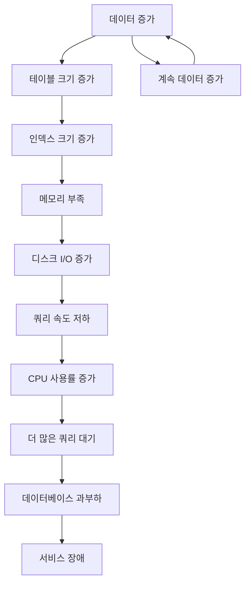

# 온라인 게임 서버를 위한 TimescaleDB 완벽 가이드  

저자: 최흥배, Claude AI   
    
권장 개발 환경
- **IDE**: Visual Studio 2022 (Community 이상)
- **.NET**: 9 이상
- **OS**: Windows 10 이상

-----  
  
# Chapter 1: 온라인 게임 서버, 무엇이 문제인가?

## **들어가며**
당신은 지금 출시 6개월 차 MMORPG "던전 크로니클"의 백엔드 개발자다. 출시 초반에는 모든 것이 순조로웠다. 게임은 성공적으로 론칭되었고, 플레이어들의 반응도 뜨거웠다. 하지만 시간이 지나면서 이상한 징후들이 나타나기 시작했다.

월요일 오전 10시, 당신은 운영팀으로부터 긴급 전화를 받았다. "관리자 대시보드가 열리지 않습니다. 어제부터 계속 로딩만 되고 있어요." 서버실로 달려가 모니터를 확인하니 데이터베이스 CPU 사용률이 95%를 넘나들고 있었다. 도대체 무슨 일이 벌어진 것일까?

이번 장에서는 실제 게임 서버 운영에서 마주치게 되는 데이터 관리 문제들을 살펴보고, 왜 TimescaleDB와 같은 시계열 데이터베이스가 필요한지 이해한다. 이론적인 설명보다는 실제 현장에서 겪을 수 있는 생생한 사례를 통해 문제의 본질을 파악한다.

---

## **1.1 실제 사례: 갑자기 느려진 게임 서버**

### **출시 초기: 모든 것이 완벽했던 시절**
게임 출시 첫 달, 당신의 팀은 MySQL을 사용하여 모든 로그 데이터를 저장했다. 플레이어 로그인 기록, 아이템 사용 로그, 전투 기록, 채팅 메시지 등 게임에서 발생하는 모든 이벤트를 하나의 `game_events` 테이블에 저장했다. 초기에는 동시 접속자가 5,000명 정도였고, 하루에 약 1,000만 건의 이벤트가 발생했다.

```
[출시 첫 달 상황]
━━━━━━━━━━━━━━━━━━━━━━━━━━━━━━━━━━━━━━
동시 접속자: 5,000명
일일 이벤트: 1,000만 건
데이터베이스 크기: 8GB
평균 쿼리 응답 시간: 0.05초
━━━━━━━━━━━━━━━━━━━━━━━━━━━━━━━━━━━━━━
상태: ✓ 정상
```

대시보드에서 "최근 1시간 동안의 로그인 사용자 수"를 조회하는 쿼리는 0.05초 만에 결과를 반환했다. 운영팀은 만족했고, 개발팀도 자신감에 차 있었다. "우리의 설계는 완벽해!"

### **3개월 후: 균열의 시작**
게임이 인기를 끌면서 동시 접속자가 15,000명으로 증가했다. 하루 이벤트 수는 3,000만 건으로 늘어났다. 데이터베이스 크기는 120GB에 달했다. 이때부터 이상한 증상들이 나타나기 시작했다.

```
[3개월 차 상황]
━━━━━━━━━━━━━━━━━━━━━━━━━━━━━━━━━━━━━━
동시 접속자: 15,000명 (300% ↑)
일일 이벤트: 3,000만 건 (300% ↑)
데이터베이스 크기: 120GB (1,500% ↑)
평균 쿼리 응답 시간: 2.3초 (4,600% ↑)
━━━━━━━━━━━━━━━━━━━━━━━━━━━━━━━━━━━━━━
상태: ⚠ 주의
```

같은 대시보드 쿼리가 이제 2.3초가 걸렸다. "조금 느려졌지만 견딜만하네"라고 생각했다. 하지만 이것은 시작에 불과했다.

### **6개월 후: 재앙**
현재, 게임은 대성공을 거두었다. 동시 접속자는 50,000명을 넘어섰고, 하루에 1억 건 이상의 이벤트가 발생한다. 데이터베이스는 580GB로 비대해졌다.

```
[6개월 차 상황 - 현재]
━━━━━━━━━━━━━━━━━━━━━━━━━━━━━━━━━━━━━━
동시 접속자: 50,000명 (1,000% ↑)
일일 이벤트: 1억 건 (1,000% ↑)
데이터베이스 크기: 580GB (7,250% ↑)
평균 쿼리 응답 시간: 45초 (90,000% ↑)
━━━━━━━━━━━━━━━━━━━━━━━━━━━━━━━━━━━━━━
상태: ✗ 심각
```

이제 대시보드는 사실상 사용 불가능하다. 간단한 조회 쿼리조차 45초 이상 걸린다. 더 심각한 것은 데이터베이스가 너무 느려져서 게임 서버 자체에도 영향을 미치기 시작했다는 점이다.

### **실제로 발생한 문제들**
**문제 1: 대시보드 타임아웃**

운영팀이 가장 자주 사용하는 "오늘 시간대별 동접자 수" 차트를 로딩하는데 3분 이상 걸리다가 결국 타임아웃이 발생한다.

```sql
-- 운영팀이 사용하는 쿼리 (MySQL)
SELECT 
    DATE_FORMAT(event_time, '%Y-%m-%d %H:00:00') as hour,
    COUNT(DISTINCT user_id) as concurrent_users
FROM game_events
WHERE event_type = 'login'
  AND event_time >= DATE_SUB(NOW(), INTERVAL 24 HOUR)
GROUP BY DATE_FORMAT(event_time, '%Y-%m-%d %H:00:00')
ORDER BY hour;
```

이 쿼리는 5억 8천만 건의 레코드를 스캔해야 한다. 인덱스가 있어도 효과가 미미하다.

**문제 2: 디스크 공간 폭발**

매일 약 3GB씩 데이터가 증가한다. 이 속도라면 1년 후에는 1TB를 넘어선다. 스토리지 비용이 기하급수적으로 증가하고 있다.

```
[디스크 사용량 추이]

1개월:   ▓░░░░░░░░░░░░░░░░░░░   8GB
3개월:   ▓▓▓▓▓░░░░░░░░░░░░░░  120GB
6개월:   ▓▓▓▓▓▓▓▓▓▓▓▓░░░░░░  580GB
1년 예상: ▓▓▓▓▓▓▓▓▓▓▓▓▓▓▓▓▓▓ 1.2TB
```

**문제 3: 인덱스 유지 비용**

시간 범위 조회를 빠르게 하기 위해 `event_time` 컬럼에 인덱스를 걸었다. 하지만 데이터가 많아질수록 인덱스 자체의 크기도 거대해진다. 현재 인덱스만 150GB를 차지한다. 새로운 데이터를 삽입할 때마다 인덱스를 업데이트해야 하므로 삽입 속도도 느려진다.

**문제 4: 특정 플레이어 추적 불가능**

고객지원팀에서 어뷰징 의심 플레이어의 최근 7일간 활동을 조회하려고 하는데, 쿼리가 완료되지 않는다.

```sql
-- 특정 플레이어의 최근 7일 활동 조회
SELECT *
FROM game_events
WHERE user_id = 12345
  AND event_time >= DATE_SUB(NOW(), INTERVAL 7 DAY)
ORDER BY event_time DESC;
```

이 쿼리도 전체 테이블을 스캔하게 되어 수십 초가 걸린다.

**문제 5: 보고서 생성 실패**

매주 월요일 아침, 경영진에게 전달할 주간 리포트를 생성해야 한다. "지난주 신규 가입자 수", "일별 매출 추이", "시간대별 플레이 패턴" 등의 통계를 뽑아야 하는데, 각 쿼리마다 몇 분씩 걸린다. 보고서를 완성하는데 2시간 이상 소요되며, 그나마도 데이터베이스 서버에 과부하를 일으킨다.

### **임시방편들의 실패**
팀은 문제를 해결하기 위해 여러 시도를 했다.

**시도 1: 오래된 데이터 삭제**

3개월 이상 된 데이터를 삭제하기로 결정했다. 하지만 DELETE 쿼리를 실행하자 데이터베이스가 락에 걸려 게임 서버가 멈췄다. 긴급하게 쿼리를 중단했다.

```sql
-- 위험한 DELETE 쿼리
DELETE FROM game_events
WHERE event_time < DATE_SUB(NOW(), INTERVAL 90 DAY);
-- 결과: 데이터베이스 락, 서비스 장애
```

**시도 2: 테이블 파티셔닝**

MySQL의 파티셔닝 기능을 사용하여 월별로 테이블을 나누기로 했다. 하지만 이미 쌓인 580GB 데이터를 파티션으로 재구성하는 것은 며칠이 걸리는 작업이었다. 게다가 파티션 수가 너무 많아지면 관리가 복잡해진다.

**시도 3: 읽기 전용 복제본 생성**

대시보드 조회는 읽기 전용 복제본에서 하도록 분리했다. 하지만 근본적인 문제는 해결되지 않았다. 복제본에서도 쿼리가 여전히 느렸다.

**시도 4: 데이터 웨어하우스 도입 검토**

BigQuery나 Redshift 같은 데이터 웨어하우스를 검토했다. 하지만 실시간 데이터를 ETL로 옮기는 과정이 복잡하고, 비용도 만만치 않았다. 무엇보다 실시간성이 떨어진다는 것이 큰 단점이었다.

### **근본 원인 분석**
밤을 새워 문제를 분석한 결과, 당신은 핵심 원인을 파악했다.

```
[문제의 본질]

┌────────────────────────────────────────┐
│ 시계열 데이터의 특성                   │
├────────────────────────────────────────┤
│ • 데이터가 시간 순서로 계속 쌓임       │
│ • 최근 데이터를 자주 조회함            │
│ • 오래된 데이터는 거의 조회하지 않음   │
│ • 시간 범위 쿼리가 대부분             │
│ • 데이터 수정이 거의 없음 (Append Only)│
└────────────────────────────────────────┘
         ↓
┌────────────────────────────────────────┐
│ 전통적인 RDBMS의 문제                  │
├────────────────────────────────────────┤
│ • 모든 데이터를 동일하게 취급          │
│ • 시간 기반 최적화가 없음              │
│ • 파티셔닝이 수동이고 복잡함           │
│ • 인덱스 유지 비용이 높음              │
│ • 압축 기능이 제한적                   │
└────────────────────────────────────────┘
```

게임 서버의 로그와 메트릭 데이터는 전형적인 **시계열 데이터**다. 하지만 일반적인 관계형 데이터베이스는 시계열 데이터를 효율적으로 다루도록 설계되지 않았다. 이것이 모든 문제의 근본 원인이다.

---

## **1.2 시계열 데이터란 무엇인가?**

### **시계열 데이터의 정의**
시계열 데이터는 시간 순서로 기록된 데이터의 연속이다. 각 데이터 포인트는 특정 시점의 이벤트나 측정값을 나타낸다.

```
[시계열 데이터의 구조]

시간축 ──────────────────────────────────▶

2024-12-31 10:00:00 → [Player 1234 logged in]
2024-12-31 10:00:01 → [Server CPU: 45%]
2024-12-31 10:00:02 → [Player 5678 bought item]
2024-12-31 10:00:03 → [Player 1234 entered dungeon]
2024-12-31 10:00:04 → [Server Memory: 8.2GB]
...
```

### **게임 서버의 시계열 데이터 종류**
온라인 게임 서버에서 발생하는 시계열 데이터는 크게 세 가지로 분류할 수 있다.

**1. 시스템 메트릭 (System Metrics)**

서버의 하드웨어 및 소프트웨어 상태를 나타내는 수치들이다.

```
┌─────────────────────────────────────────────┐
│ 시스템 메트릭 예시                           │
├─────────────────────────────────────────────┤
│ • CPU 사용률: 45.2% (1초마다 수집)         │
│ • 메모리 사용량: 8.5GB / 16GB               │
│ • 네트워크 트래픽: 125 Mbps                 │
│ • 디스크 I/O: 350 IOPS                      │
│ • 프로세스 수: 2,345개                      │
│ • 데이터베이스 커넥션: 120/200              │
└─────────────────────────────────────────────┘
```

**2. 애플리케이션 로그 (Application Logs)**

게임 서버 애플리케이션에서 발생하는 이벤트 기록이다.

```
┌─────────────────────────────────────────────┐
│ 애플리케이션 로그 예시                       │
├─────────────────────────────────────────────┤
│ • 플레이어 로그인/로그아웃                   │
│ • API 요청/응답 시간                         │
│ • 에러 및 예외 발생                          │
│ • 데이터베이스 쿼리 실행 시간                │
│ • 게임 로직 처리 시간                        │
└─────────────────────────────────────────────┘
```

**3. 비즈니스 이벤트 (Business Events)**

게임 내에서 플레이어가 수행하는 행동과 비즈니스 로직 관련 이벤트다.

```
┌─────────────────────────────────────────────┐
│ 비즈니스 이벤트 예시                         │
├─────────────────────────────────────────────┤
│ • 캐릭터 생성/삭제                           │
│ • 아이템 획득/사용/거래                      │
│ • 던전 입장/클리어                           │
│ • 몬스터 처치                                │
│ • 경험치/골드 획득                           │
│ • 파티/길드 활동                             │
│ • 채팅 메시지                                │
│ • 결제 및 구매                               │
└─────────────────────────────────────────────┘
```

### **시계열 데이터의 특징**
시계열 데이터는 일반 데이터와 구별되는 독특한 특징을 가진다.

**특징 1: 시간 순서로 계속 추가된다 (Append-Only)**

새로운 데이터는 항상 시간 순서대로 끝에 추가된다. 과거 데이터를 수정하는 일은 거의 없다.

```
[일반 데이터]              [시계열 데이터]

CREATE                     ─┬─ INSERT (계속 추가만)
READ                        │
UPDATE (자주 발생)          │
DELETE (가끔 발생)          └─ DELETE (오래된 데이터만)
```

**특징 2: 최근 데이터가 가장 중요하다**

조회의 80% 이상이 최근 데이터에 집중된다. 1년 전 로그보다 1시간 전 로그가 훨씬 중요하다.

```
[데이터 조회 패턴]

최근 1시간:  ████████████████████ 60%
최근 1일:    ████████ 20%
최근 1주:    ████ 10%
최근 1개월:  ██ 5%
그 이상:     █ 5%
```

**특징 3: 시간 범위 쿼리가 대부분이다**

"특정 시점" 조회보다 "시간 범위" 조회가 압도적으로 많다.

```sql
-- 전형적인 시계열 쿼리 패턴

-- ✓ 시간 범위 조회 (90%)
WHERE timestamp >= '2024-12-31 00:00:00' 
  AND timestamp < '2024-12-31 23:59:59'

-- ✓ 최근 데이터 조회
WHERE timestamp >= NOW() - INTERVAL '1 hour'

-- ✗ 특정 시점 조회 (거의 없음)
WHERE timestamp = '2024-12-31 10:30:15'
```

**특징 4: 데이터 양이 시간에 비례하여 무한히 증가한다**

일반 데이터베이스는 데이터가 어느 정도 포화 상태에 도달한다. 하지만 시계열 데이터는 서비스가 운영되는 한 계속 증가한다.

```
[데이터 증가 패턴 비교]

일반 데이터베이스:
크기 │     ╱─────────────
    │   ╱
    │ ╱
    └────────────────── 시간
     (포화 상태 도달)

시계열 데이터베이스:
크기 │           ╱
    │         ╱
    │       ╱
    │     ╱
    │   ╱
    │ ╱
    └──────────────── 시간
     (계속 증가)
```

**특징 5: 집계 쿼리가 빈번하다**

개별 레코드보다 집계된 통계가 더 유용하다.

```sql
-- 전형적인 시계열 집계 쿼리

-- 5분 단위 평균 CPU 사용률
SELECT 
    time_bucket('5 minutes', timestamp) as bucket,
    AVG(cpu_usage) as avg_cpu
FROM server_metrics
WHERE timestamp >= NOW() - INTERVAL '24 hours'
GROUP BY bucket;

-- 시간대별 동시 접속자 수
SELECT 
    date_trunc('hour', login_time) as hour,
    COUNT(DISTINCT user_id) as users
FROM login_log
WHERE login_time >= CURRENT_DATE
GROUP BY hour;
```

### **게임 서버 데이터 흐름 예시**
실제 게임 서버에서 1분 동안 발생하는 데이터의 흐름을 시각화하면 다음과 같다.

```
[1분간 발생하는 데이터]

┌─────────────────┐
│  게임 클라이언트 │
│  (50,000명)     │
└────────┬────────┘
         │ 플레이어 액션
         ↓
┌─────────────────┐
│   게임 서버      │ → 초당 5,000건의 이벤트 발생
│   (10대)        │
└────────┬────────┘
         │
         ├─→ 플레이어 이벤트 로그: 300,000건/분
         ├─→ 서버 메트릭: 600건/분 (10대 × 60초)
         ├─→ API 로그: 150,000건/분
         └─→ 에러 로그: 500건/분
                │
                ↓
         ┌──────────────┐
         │ 데이터베이스 │
         │ (삽입 필요)  │
         └──────────────┘
```

하루 단위로 계산하면 다음과 같다.

```
[하루 발생 데이터량]

플레이어 이벤트:  300,000 × 60 × 24 = 432,000,000건
서버 메트릭:          600 × 60 × 24 =     864,000건
API 로그:         150,000 × 60 × 24 = 216,000,000건
에러 로그:            500 × 60 × 24 =     720,000건
──────────────────────────────────────────────────
총합:                                 649,584,000건/일

≈ 6억 5천만 건/일
```

이런 규모의 데이터를 효율적으로 저장하고 조회하려면 특별한 데이터베이스 설계가 필요하다.

---

## **1.3 전통적인 RDBMS의 한계**

### **왜 MySQL과 PostgreSQL만으로는 부족한가?**
MySQL과 PostgreSQL은 훌륭한 관계형 데이터베이스다. 하지만 시계열 데이터를 다루는 데는 근본적인 한계가 있다.

**한계 1: 모든 데이터를 동등하게 취급한다**

전통적인 RDBMS는 10년 전 데이터나 10초 전 데이터나 동일하게 취급한다. 하지만 실제로는 최근 데이터가 훨씬 중요하다.

```
[RDBMS의 관점]

모든 행이 동일한 중요도
┌──────────────────────┐
│ 10년 전 데이터        │ ← 거의 조회 안 함
│ 5년 전 데이터         │
│ 1년 전 데이터         │
│ 1개월 전 데이터       │
│ 1주 전 데이터         │
│ 어제 데이터           │
│ 최근 1시간 데이터     │ ← 가장 자주 조회
└──────────────────────┘

모두 같은 테이블에 저장
→ 최적화 불가능
```

**한계 2: 인덱스 비용이 지나치게 높다**

시간 범위 조회를 빠르게 하려면 타임스탬프 컬럼에 인덱스를 걸어야 한다. 하지만 데이터가 많아질수록 인덱스 크기도 커지고, 유지 비용도 증가한다.

```
[인덱스 크기 증가]

데이터 100GB → 인덱스 30GB
데이터 500GB → 인덱스 150GB
데이터 1TB   → 인덱스 300GB

문제:
• 인덱스가 메모리에 다 들어가지 않음
• 디스크 I/O 증가
• INSERT 속도 저하
```

**한계 3: 파티셔닝이 수동이고 복잡하다**

MySQL과 PostgreSQL도 파티셔닝 기능을 제공한다. 하지만 모든 것을 수동으로 관리해야 한다.

```sql
-- MySQL 수동 파티셔닝 예시

CREATE TABLE game_events (
    id BIGINT AUTO_INCREMENT,
    event_time TIMESTAMP,
    user_id INT,
    event_type VARCHAR(50),
    event_data JSON,
    PRIMARY KEY (id, event_time)
)
PARTITION BY RANGE (UNIX_TIMESTAMP(event_time)) (
    PARTITION p202401 VALUES LESS THAN (UNIX_TIMESTAMP('2024-02-01')),
    PARTITION p202402 VALUES LESS THAN (UNIX_TIMESTAMP('2024-03-01')),
    PARTITION p202403 VALUES LESS THAN (UNIX_TIMESTAMP('2024-04-01')),
    -- 매달 수동으로 파티션 추가해야 함!
);

-- 문제점:
-- 1. 매달 새 파티션을 수동으로 추가해야 함
-- 2. 오래된 파티션 삭제도 수동
-- 3. 파티션 키 변경이 어려움
-- 4. 파티션 수가 많아지면 관리 복잡도 증가
```

**한계 4: 압축 기능이 제한적이다**

오래된 데이터는 조회 빈도가 낮으므로 압축하여 저장하는 것이 효율적이다. 하지만 전통적인 RDBMS의 압축 기능은 제한적이다.

```
[전통적인 RDBMS 압축]

• 테이블 전체를 압축하거나 압축하지 않음
• 부분 압축 불가능
• 압축된 데이터 조회 시 전체 압축 해제
• 압축률이 낮음 (30~50%)
```

**한계 5: 시간 기반 쿼리 최적화가 없다**

전통적인 RDBMS는 시간 기반 쿼리를 특별하게 최적화하지 않는다.

```sql
-- 이런 쿼리가 매우 느리다
SELECT 
    DATE_TRUNC('hour', timestamp) as hour,
    COUNT(*) as event_count
FROM game_events
WHERE timestamp >= NOW() - INTERVAL '7 days'
GROUP BY DATE_TRUNC('hour', timestamp);

-- 문제:
-- 1. 7일치 데이터를 모두 스캔해야 함
-- 2. DATE_TRUNC 함수를 모든 행에 적용
-- 3. GROUP BY 연산 비용이 높음
```

### **성능 저하의 악순환**
시간이 지날수록 성능이 더욱 나빠지는 악순환이 발생한다.



### **실제 성능 벤치마크**
같은 쿼리를 데이터 양에 따라 실행한 결과다. (MySQL 8.0 기준)

```
[시간 범위 조회 성능 비교]

데이터량: 1천만 건 (1GB)
쿼리 시간: 0.05초 ✓

데이터량: 1억 건 (10GB)
쿼리 시간: 0.8초 ⚠

데이터량: 5억 건 (50GB)
쿼리 시간: 5.2초 ⚠

데이터량: 10억 건 (100GB)
쿼리 시간: 15.3초 ✗

데이터량: 50억 건 (500GB)
쿼리 시간: 78초 또는 타임아웃 ✗
```

데이터가 50배 증가하면 쿼리 시간은 1,560배 증가한다. 선형적으로 증가하지 않는다는 것이 핵심 문제다.

---

## **1.4 TimescaleDB가 해결하는 문제들**

### **TimescaleDB란 무엇인가?**
TimescaleDB는 PostgreSQL을 확장한 오픈소스 시계열 데이터베이스다. PostgreSQL의 모든 기능을 그대로 사용하면서, 시계열 데이터를 위한 특별한 최적화를 제공한다.  

```
[TimescaleDB 구조]

┌─────────────────────────────────────┐
│        TimescaleDB Extension        │
│   (시계열 데이터 최적화 기능)       │
│                                     │
│  • Hypertable (자동 파티셔닝)       │
│  • 시간 기반 인덱싱                 │
│  • 자동 압축                         │
│  • 연속 집계                         │
│  • 데이터 보관 정책                 │
└─────────────────────────────────────┘
          ↓ 확장 (Extension)
┌─────────────────────────────────────┐
│          PostgreSQL                 │
│   (검증된 RDBMS 기능)               │
│                                     │
│  • SQL 호환성                        │
│  • 트랜잭션                          │
│  • 제약조건                          │
│  • 조인                              │
│  • JSON 지원                         │
│  • 풍부한 생태계                     │
└─────────────────────────────────────┘
```

### **TimescaleDB가 해결하는 5가지 핵심 문제**

**해결 1: 자동 파티셔닝 (Hypertable)**

TimescaleDB는 테이블을 시간 기반으로 자동 파티셔닝한다. 개발자가 신경 쓸 필요가 없다.

```
[Hypertable 자동 파티셔닝]

일반 테이블 생성:
CREATE TABLE game_events (
    timestamp TIMESTAMPTZ NOT NULL,
    user_id INT,
    event_type TEXT,
    event_data JSONB
);

Hypertable로 변환 (단 한 줄!):
SELECT create_hypertable('game_events', 'timestamp');

→ 자동으로 시간 기반 파티셔닝 시작
→ 새로운 chunk가 자동 생성됨
→ 오래된 chunk는 자동 관리됨
```

내부적으로는 이렇게 동작한다.

```
[Hypertable 내부 구조]

game_events (논리적 테이블 - 개발자가 보는 뷰)
    │
    ├─ chunk_1: 2024-12-01 ~ 2024-12-07
    ├─ chunk_2: 2024-12-08 ~ 2024-12-14
    ├─ chunk_3: 2024-12-15 ~ 2024-12-21
    ├─ chunk_4: 2024-12-22 ~ 2024-12-28
    └─ chunk_5: 2024-12-29 ~ 2025-01-04

쿼리:
SELECT * FROM game_events 
WHERE timestamp >= '2024-12-25';

→ chunk_4와 chunk_5만 스캔 (chunk pruning)
→ 다른 chunk는 아예 접근하지 않음
```

**해결 2: 놀라운 쿼리 성능**

같은 쿼리를 TimescaleDB에서 실행하면 성능이 극적으로 향상된다.

```
[성능 비교: 최근 7일 시간대별 이벤트 수 집계]

MySQL (5억 건):
쿼리 시간: 45초 ✗

TimescaleDB (5억 건):
쿼리 시간: 0.3초 ✓

→ 150배 빠름!
```

왜 이렇게 빠를까?

```
[TimescaleDB 쿼리 최적화]

1. Chunk Pruning
   └─ 필요한 시간 범위의 chunk만 스캔

2. 시간 기반 인덱싱
   └─ 시간 범위 조회에 최적화된 인덱스

3. Parallel Query Execution
   └─ 여러 chunk를 병렬로 처리

4. Continuous Aggregates
   └─ 집계 결과를 미리 계산하여 저장
```

**해결 3: 자동 데이터 압축**

오래된 데이터는 자동으로 압축된다. 스토리지 비용이 90% 절감된다.

```
[압축 효과]

압축 전: 580GB (6개월치 데이터)
압축 후:  58GB (10:1 압축률)

절감 효과:
• 디스크 공간: 522GB 절약
• 스토리지 비용: 월 $50 → $5
• I/O 성능: 오히려 향상 (읽어야 할 데이터가 적음)
```

압축 설정은 간단하다.

```sql
-- 7일이 지난 데이터 자동 압축
ALTER TABLE game_events 
SET (
    timescaledb.compress,
    timescaledb.compress_segmentby = 'user_id',
    timescaledb.compress_orderby = 'timestamp DESC'
);

SELECT add_compression_policy('game_events', INTERVAL '7 days');
```

**해결 4: 연속 집계 (Continuous Aggregates)**

실시간 대시보드를 위한 집계 쿼리가 항상 빠르다.

```
[연속 집계 작동 원리]

원본 데이터:
6억 건의 로그 → 조회 시 45초 소요

연속 집계 뷰:
시간대별로 미리 집계 → 조회 시 0.1초 소요

┌────────────────┐
│  원본 테이블    │ (6억 건)
│  game_events   │
└────────┬───────┘
         │ 자동 집계
         ↓
┌────────────────┐
│  집계 뷰       │ (720건 - 시간당 1건 × 30일)
│  hourly_stats  │
└────────────────┘
```

생성 방법:

```sql
-- 시간대별 동접자 통계 자동 집계
CREATE MATERIALIZED VIEW hourly_concurrent_users
WITH (timescaledb.continuous) AS
SELECT 
    time_bucket('1 hour', timestamp) AS hour,
    COUNT(DISTINCT user_id) AS concurrent_users
FROM game_events
WHERE event_type = 'login'
GROUP BY hour;

-- 5분마다 자동 갱신
SELECT add_continuous_aggregate_policy('hourly_concurrent_users',
    start_offset => INTERVAL '3 hours',
    end_offset => INTERVAL '1 hour',
    schedule_interval => INTERVAL '5 minutes');
```

**해결 5: 데이터 보관 정책**

오래된 데이터는 자동으로 삭제되어 디스크 공간을 확보한다.

```sql
-- 90일이 지난 데이터 자동 삭제
SELECT add_retention_policy('game_events', INTERVAL '90 days');

-- 더 이상 수동 DELETE 불필요!
```

### **TimescaleDB vs 전통적인 RDBMS 최종 비교**

```
┌──────────────────────┬──────────────┬──────────────┐
│      항목            │  MySQL/PG    │ TimescaleDB  │
├──────────────────────┼──────────────┼──────────────┤
│ 시간 범위 쿼리 속도   │      ✗       │      ✓✓✓     │
│ 대용량 집계 쿼리      │      ✗       │      ✓✓✓     │
│ 자동 파티셔닝        │      ✗       │      ✓✓✓     │
│ 데이터 압축          │      △       │      ✓✓✓     │
│ 스토리지 비용        │      ✗       │      ✓✓✓     │
│ INSERT 성능          │      ✓       │      ✓✓      │
│ SQL 호환성           │      ✓✓✓     │      ✓✓✓     │
│ 관리 복잡도          │      ✓       │      ✓✓      │
│ 실시간 대시보드      │      ✗       │      ✓✓✓     │
│ 운영 자동화          │      ✗       │      ✓✓✓     │
└──────────────────────┴──────────────┴──────────────┘
```

---

## **1.5 이 책에서 만들 실전 프로젝트 소개**

### **프로젝트 개요: "던전 크로니클" 모니터링 시스템**
이 책에서는 실제 온라인 게임 "던전 크로니클"의 완전한 모니터링 및 로그 분석 시스템을 단계별로 구축한다. 이론만 배우는 것이 아니라, 실무에 바로 적용할 수 있는 실전 시스템을 만든다.

```
[프로젝트 아키텍처 전체 구조]

┌─────────────────────────────────────────────────┐
│          게임 클라이언트 (플레이어)              │
│              (50,000명 동시 접속)               │
└──────────────────┬──────────────────────────────┘
                   │ HTTPS
                   ↓
┌─────────────────────────────────────────────────┐
│          게임 서버 (C# / ASP.NET Core)          │
│                  (10대 서버)                     │
│                                                 │
│  • API 서버                                     │
│  • 게임 로직                                    │
│  • 인증/인가                                    │
└───────┬─────────────────────────────────────────┘
        │
        ├─→ [메트릭 수집 Agent (C#)]
        │   • CPU/메모리/네트워크 모니터링
        │   • 1초마다 수집
        │
        ├─→ [이벤트 로거 (C# + SQLKata)]
        │   • 플레이어 행동 로깅
        │   • 배치 삽입 (1000건 단위)
        │
        └─→ [API 로거 (Middleware)]
            • 모든 API 요청/응답 기록
            │
            ↓
┌─────────────────────────────────────────────────┐
│          TimescaleDB (PostgreSQL 16)            │
│                                                 │
│  📊 Hypertables:                                │
│    • server_metrics (시스템 메트릭)             │
│    • player_events (플레이어 이벤트)            │
│    • api_logs (API 로그)                        │
│    • error_logs (에러 로그)                     │
│                                                 │
│  ⚡ Continuous Aggregates:                      │
│    • hourly_concurrent_users                   │
│    • daily_revenue_stats                       │
│    • server_performance_summary                │
└───────────────┬─────────────────────────────────┘
                │
                ↓
┌─────────────────────────────────────────────────┐
│        대시보드 & 분석 (ASP.NET Core)            │
│                                                 │
│  • 실시간 모니터링 대시보드                      │
│  • 플레이어 행동 분석                            │
│  • 이상 징후 알림                                │
│  • 자동 리포트 생성                              │
└─────────────────────────────────────────────────┘
```

### **Phase 1: 기초 구축 (Chapter 2-5)**
먼저 개발 환경을 구축하고 기본 개념을 익힌다.

```
[Phase 1 목표]

✓ Windows 11에 TimescaleDB 설치
✓ C# + SQLKata로 연결
✓ 첫 Hypertable 생성
✓ 기본 CRUD 작업
✓ 시간 함수 활용

결과물:
└─ GameMonitoring.Core
   ├─ Database
   │  └─ TimescaleConnection.cs
   ├─ Models
   │  └─ ServerMetric.cs
   └─ Repositories
      └─ MetricRepository.cs
```

### **Phase 2: 메트릭 수집 시스템 (Chapter 6)**
실시간으로 서버 성능을 모니터링하는 시스템을 만든다.

```
[수집할 메트릭]

┌────────────────────────────────┐
│ 시스템 메트릭 (1초마다)       │
├────────────────────────────────┤
│ • CPU 사용률                   │
│ • 메모리 사용량                │
│ • 네트워크 송수신               │
│ • 디스크 I/O                   │
│ • 프로세스 수                   │
└────────────────────────────────┘

┌────────────────────────────────┐
│ 애플리케이션 메트릭 (실시간)   │
├────────────────────────────────┤
│ • API 요청 수                   │
│ • 평균 응답 시간                │
│ • 에러 발생 수                  │
│ • 데이터베이스 커넥션 수        │
└────────────────────────────────┘

결과물:
└─ GameMonitoring.Agent
   ├─ Collectors
   │  ├─ CpuCollector.cs
   │  ├─ MemoryCollector.cs
   │  └─ NetworkCollector.cs
   ├─ MetricBatcher.cs
   └─ MetricAgent.cs (메인 실행)
```

### **Phase 3: 게임 로그 시스템 (Chapter 7)**
플레이어의 모든 행동을 기록하고 분석한다.

```
[로깅할 이벤트]

플레이어 생애주기:
├─ 회원가입
├─ 로그인/로그아웃
├─ 캐릭터 생성/삭제
└─ 계정 휴면/탈퇴

게임 플레이:
├─ 던전 입장/클리어
├─ 몬스터 처치
├─ 아이템 획득/사용
├─ 퀘스트 진행
└─ 레벨업

경제 활동:
├─ 아이템 거래
├─ 경매장 이용
├─ 상점 구매
└─ 결제 (인앱 결제)

소셜 활동:
├─ 파티 구성
├─ 길드 가입
├─ 채팅 발송
└─ 친구 추가

결과물:
└─ GameMonitoring.EventLogger
   ├─ Events
   │  ├─ PlayerEvent.cs
   │  ├─ ItemEvent.cs
   │  └─ DungeonEvent.cs
   ├─ EventBatcher.cs
   └─ EventLogger.cs
```

### **Phase 4: 실시간 대시보드 (Chapter 8, 15)**
연속 집계를 활용한 실시간 모니터링 대시보드를 구축한다.

```
[대시보드 기능]

┌─────────────────────────────────────────┐
│   🎮 던전 크로니클 실시간 모니터링       │
├─────────────────────────────────────────┤
│                                         │
│  📈 동시 접속자: 47,532명               │
│     ▲ 전일 대비 +12.3%                  │
│                                         │
│  🖥️ 평균 서버 CPU: 62%                  │
│     [서버1: 58%] [서버2: 71%] ...       │
│                                         │
│  💾 메모리 사용: 12.3GB / 16GB          │
│                                         │
│  ⚡ 평균 API 응답: 45ms                  │
│                                         │
│  ❌ 최근 1시간 에러: 3건                │
│                                         │
├─────────────────────────────────────────┤
│  📊 실시간 그래프                        │
│                                         │
│  • 시간대별 동접자 추이                  │
│  • 서버별 CPU/메모리 사용률             │
│  • API 응답 시간 분포                   │
│  • 에러 발생 추이                       │
└─────────────────────────────────────────┘

기술 스택:
• ASP.NET Core Web API
• SignalR (실시간 업데이트)
• Chart.js (시각화)
• SQLKata (쿼리 빌더)
```

### **Phase 5: 플레이어 분석 시스템 (Chapter 16)**
비즈니스 인사이트를 도출하는 분석 시스템을 만든다.

```
[분석 지표]

코호트 분석:
└─ 가입 월별 사용자 리텐션 추적
   • D1, D7, D30 리텐션
   • 코호트별 ARPU
   • 이탈 패턴 분석

플레이어 세그멘테이션:
├─ 고래 (Whale): 월 $100+ 결제
├─ 돌고래 (Dolphin): 월 $10-100 결제
├─ 일반 (Regular): 월 $1-10 결제
└─ 무과금 (Free): 결제 없음

퍼널 분석:
튜토리얼 → 첫 던전 → 레벨 10 → 첫 결제
   100%       85%      62%      15%

AB 테스트:
• 신규 던전 난이도 테스트
• UI 개선 효과 측정
• 프로모션 효과 분석
```

### **Phase 6: 운영 자동화 (Chapter 9-12)**
자동 압축, 보관 정책, 이상 탐지 등 운영을 자동화한다.

```
[자동화 기능]

데이터 관리:
├─ 7일 후 자동 압축 (90% 용량 절감)
├─ 90일 후 자동 삭제 (콜드 데이터)
└─ 연속 집계 자동 갱신

이상 탐지 & 알림:
├─ CPU 사용률 80% 초과 → Slack 알림
├─ 에러율 급증 → Discord 알림
├─ API 응답 시간 급증 → 이메일 알림
└─ 동접자 급감 → 긴급 전화 알림

자동 리포트:
├─ 일일 리포트 (매일 오전 9시)
├─ 주간 리포트 (매주 월요일)
└─ 월간 리포트 (매월 1일)
```

### **최종 결과물**
이 책을 완료하면 다음과 같은 완전한 시스템을 갖추게 된다.

```
[프로젝트 구조]

GameMonitoringSolution/
│
├─ GameMonitoring.Core/              # 핵심 라이브러리
│  ├─ Database/
│  │  ├─ TimescaleConnection.cs
│  │  └─ HypertableManager.cs
│  ├─ Models/
│  │  ├─ ServerMetric.cs
│  │  ├─ PlayerEvent.cs
│  │  └─ ApiLog.cs
│  └─ Repositories/
│     ├─ MetricRepository.cs
│     └─ EventRepository.cs
│
├─ GameMonitoring.Agent/              # 메트릭 수집 에이전트
│  ├─ Collectors/
│  ├─ MetricBatcher.cs
│  └─ Program.cs
│
├─ GameMonitoring.EventLogger/        # 이벤트 로거
│  ├─ EventBatcher.cs
│  └─ EventLogger.cs
│
├─ GameMonitoring.API/                # 대시보드 API
│  ├─ Controllers/
│  │  ├─ MetricsController.cs
│  │  ├─ EventsController.cs
│  │  └─ AnalyticsController.cs
│  ├─ Hubs/
│  │  └─ MonitoringHub.cs (SignalR)
│  └─ Program.cs
│
├─ GameMonitoring.Dashboard/          # 웹 대시보드
│  ├─ wwwroot/
│  │  ├─ js/
│  │  │  ├─ dashboard.js
│  │  │  └─ charts.js
│  │  └─ css/
│  └─ Pages/
│     ├─ Index.cshtml
│     ├─ Metrics.cshtml
│     └─ Analytics.cshtml
│
├─ GameMonitoring.AlertSystem/        # 알림 시스템
│  ├─ Detectors/
│  │  ├─ CpuAnomalyDetector.cs
│  │  └─ ErrorRateDetector.cs
│  ├─ Notifiers/
│  │  ├─ SlackNotifier.cs
│  │  └─ DiscordNotifier.cs
│  └─ Program.cs
│
└─ GameMonitoring.Tests/              # 테스트
   ├─ Unit/
   └─ Integration/
```

### **이 책을 마치면 할 수 있는 것들**

```
✓ TimescaleDB를 Windows 11에서 능숙하게 사용
✓ C#과 SQLKata로 시계열 데이터 다루기
✓ 초당 수천 건의 데이터를 효율적으로 저장
✓ 수억 건의 데이터에서 빠른 조회
✓ 실시간 모니터링 대시보드 구축
✓ 플레이어 행동 분석 및 인사이트 도출
✓ 자동화된 운영 시스템 구축
✓ 이상 징후 자동 감지 및 알림
✓ 스토리지 비용 90% 절감
✓ 실무에 바로 적용 가능한 실전 능력
```

---

## **마치며**
이 장에서는 온라인 게임 서버 운영에서 마주치는 실제 문제들을 살펴보았다. 데이터가 증가할수록 성능이 저하되고, 관리가 복잡해지며, 비용이 증가하는 악순환을 경험했다. 전통적인 RDBMS만으로는 시계열 데이터를 효율적으로 다룰 수 없다는 것을 이해했다.

TimescaleDB는 이 모든 문제를 해결한다. 자동 파티셔닝, 데이터 압축, 연속 집계, 보관 정책 등 시계열 데이터를 위한 특화된 기능을 제공한다. 무엇보다 PostgreSQL 기반이므로 익숙한 SQL을 그대로 사용할 수 있고, C#과 SQLKata를 통해 쉽게 통합할 수 있다.

다음 장에서는 Windows 11 환경에서 TimescaleDB를 설치하고, Visual Studio로 C# 프로젝트를 구성하는 과정을 단계별로 진행한다. 이론은 이제 충분하다. 직접 손으로 타이핑하면서 실전 개발을 시작해보자.

```
┌─────────────────────────────────────────┐
│  "데이터는 새로운 석유다.               │
│   하지만 정제하지 않으면 쓸모없다."     │
│                                         │
│  이제 TimescaleDB로 데이터를 정제하고,  │
│  가치 있는 인사이트를 만들어내자.       │
└─────────────────────────────────────────┘
```

**다음 장 예고: Chapter 2 - 개발 환경 구축하기**

Docker Desktop으로 TimescaleDB를 몇 분 만에 설치하고, Visual Studio에서 첫 연결 테스트를 성공시킨다. "Hello TimescaleDB!"를 출력하는 순간의 짜릿함을 경험하게 될 것이다.  