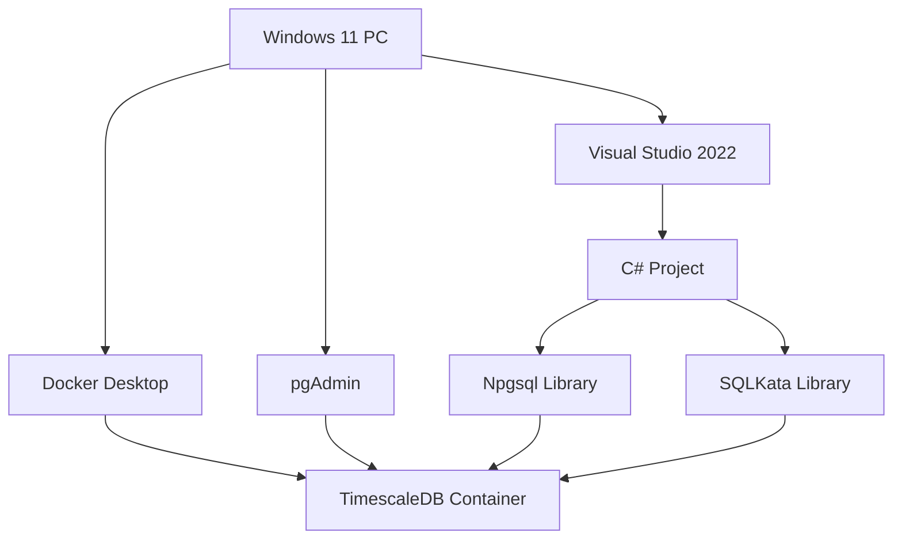

# 온라인 게임 서버를 위한 TimescaleDB 완벽 가이드  

저자: 최흥배, Claude AI   
    
권장 개발 환경
- **IDE**: Visual Studio 2022 (Community 이상)
- **.NET**: 9 이상
- **OS**: Windows 10 이상

-----  
  
# Chapter 2: 개발 환경 구축하기 (Windows 11 + C#)

## **들어가며**
이제 본격적으로 TimescaleDB를 사용할 준비를 한다. 이 장에서는 Windows 11 환경에서 TimescaleDB를 설치하고, C# 개발 환경을 구축하는 모든 과정을 단계별로 진행한다. 복잡하게 느껴질 수 있지만, 각 단계를 차근차근 따라하면 30분 안에 완벽한 개발 환경을 갖출 수 있다.

커피 한 잔을 준비하고, 편안한 자세로 시작해보자. 이 장을 마치면 "Hello TimescaleDB!"라는 메시지와 함께 첫 연결에 성공하는 짜릿한 순간을 경험하게 될 것이다.

---

## **2.1 필요한 도구들 살펴보기**

### **전체 구성도**
먼저 우리가 구축할 개발 환경의 전체 그림을 살펴본다.



### **필요한 도구 목록**
다음 도구들을 순서대로 설치한다. 각 도구의 역할을 명확히 이해하고 진행한다.

```
┌─────────────────────────────────────────────────────┐
│ 도구 목록 및 역할                                    │
├─────────────────────────────────────────────────────┤
│ 1. Docker Desktop for Windows                       │
│    → TimescaleDB를 컨테이너로 실행                  │
│    → 설치/삭제가 쉽고 깔끔함                        │
│    → 버전: 최신 안정 버전                           │
│                                                     │
│ 2. TimescaleDB Docker Image                         │
│    → PostgreSQL + TimescaleDB 확장                  │
│    → 버전: timescale/timescaledb:latest-pg16        │
│                                                     │
│ 3. pgAdmin 4                                        │
│    → PostgreSQL/TimescaleDB GUI 관리 도구           │
│    → 쿼리 실행, 데이터 확인, 스키마 관리             │
│    → 버전: 최신 안정 버전                           │
│                                                     │
│ 4. Visual Studio 2022 Community                     │
│    → C# 개발 IDE                                    │
│    → 무료 버전으로 충분                             │
│    → 워크로드: .NET 데스크톱 개발                   │
│                                                     │
│ 5. NuGet 패키지                                     │
│    ├─ Npgsql (PostgreSQL 클라이언트)                │
│    ├─ SqlKata (쿼리 빌더)                           │
│    └─ SqlKata.Execution (실행 엔진)                 │
└─────────────────────────────────────────────────────┘
```

### **시스템 요구사항**
개발 환경 구축 전에 시스템이 다음 요구사항을 만족하는지 확인한다.

```
최소 사양:
├─ OS: Windows 11 (64-bit)
├─ CPU: 4코어 이상
├─ RAM: 8GB 이상
├─ 디스크: 20GB 여유 공간
└─ 인터넷: 설치 파일 다운로드용

권장 사양:
├─ OS: Windows 11 Pro (64-bit)
├─ CPU: 8코어 이상
├─ RAM: 16GB 이상
├─ 디스크: SSD 50GB 여유 공간
└─ 인터넷: 안정적인 연결
```

### **설치 예상 시간**
각 단계별 소요 시간을 미리 파악하고 진행한다.

```
[설치 단계별 예상 시간]

Docker Desktop 설치:          5분
TimescaleDB 컨테이너 실행:    3분
pgAdmin 설치:                 5분
Visual Studio 설치:          15분 (이미 설치되어 있다면 생략)
프로젝트 생성 및 NuGet:       3분
첫 연결 테스트:               2분
━━━━━━━━━━━━━━━━━━━━━━━━━━━━━━
총 예상 시간:             약 30분
```

---

## **2.2 Docker Desktop 설치 및 TimescaleDB 컨테이너 실행**

### **Docker Desktop이 필요한 이유**
TimescaleDB를 Windows에 직접 설치하는 것보다 Docker를 사용하는 것이 훨씬 편리하다. 이유는 다음과 같다.

```
Docker 사용의 장점:

✓ 설치/삭제가 간단
  └─ 컨테이너만 삭제하면 완전 제거

✓ 여러 버전 테스트 가능
  └─ 다른 버전의 TimescaleDB를 쉽게 실행

✓ 개발 환경 일관성 유지
  └─ 모든 팀원이 동일한 환경 사용

✓ 프로덕션 환경과 유사
  └─ 실제 배포 환경도 Docker 사용 가능

✓ Windows 시스템과 격리
  └─ 시스템 환경을 오염시키지 않음
```

### **Step 1: Docker Desktop 다운로드**
Docker Desktop 공식 웹사이트에서 설치 파일을 다운로드한다.

```
다운로드 URL:
https://www.docker.com/products/docker-desktop/

1. 웹사이트 접속
2. "Download for Windows" 버튼 클릭
3. Docker Desktop Installer.exe 다운로드
```

### **Step 2: Docker Desktop 설치**
다운로드한 설치 파일을 실행한다.

```
설치 과정:

1. Docker Desktop Installer.exe 실행

2. "Use WSL 2 instead of Hyper-V" 옵션 체크
   ┌─────────────────────────────────────┐
   │ Configuration                       │
   │                                     │
   │ ☑ Use WSL 2 instead of Hyper-V     │
   │   (recommended)                     │
   │                                     │
   │ ☐ Add shortcut to desktop          │
   └─────────────────────────────────────┘

3. Install 버튼 클릭

4. 설치 완료 후 컴퓨터 재시작
```

### **Step 3: Docker Desktop 실행 및 확인**
재시작 후 Docker Desktop을 실행한다.

```
실행 확인:

1. Windows 시작 메뉴에서 "Docker Desktop" 검색 및 실행

2. Docker가 시작될 때까지 대기 (약 1분)
   
   상태 표시:
   Starting... → Running ✓

3. PowerShell 또는 명령 프롬프트를 열고 버전 확인:
```

```powershell
# Docker 버전 확인
docker --version

# 예상 출력:
# Docker version 24.0.7, build afdd53b
```

### **Step 4: TimescaleDB 컨테이너 실행**
이제 TimescaleDB를 Docker 컨테이너로 실행한다. PowerShell 또는 명령 프롬프트를 관리자 권한으로 연다.

```powershell
# TimescaleDB 컨테이너 실행
docker run -d `
  --name timescaledb `
  -p 5432:5432 `
  -e POSTGRES_PASSWORD=mypassword `
  -e POSTGRES_DB=gamedb `
  -v timescaledb-data:/var/lib/postgresql/data `
  timescale/timescaledb:latest-pg16
```

명령어 설명:

```
docker run -d                          → 백그라운드로 실행
--name timescaledb                     → 컨테이너 이름 지정
-p 5432:5432                           → 포트 매핑 (호스트:컨테이너)
-e POSTGRES_PASSWORD=mypassword        → 슈퍼유저 비밀번호 설정
-e POSTGRES_DB=gamedb                  → 기본 데이터베이스 이름
-v timescaledb-data:/var/lib/...      → 데이터 영구 저장 볼륨
timescale/timescaledb:latest-pg16      → 사용할 이미지
```

실행 결과:

```
Unable to find image 'timescale/timescaledb:latest-pg16' locally
latest-pg16: Pulling from timescale/timescaledb
a2abf6c4d29d: Pull complete
...
Status: Downloaded newer image for timescale/timescaledb:latest-pg16
9a8f7c4e5d6b3a2c1f0e8d7c6b5a4e3d2c1b0a9f8e7d6c5b4a3e2d1c0b

→ 컨테이너 ID가 출력되면 성공!
```

### **Step 5: 컨테이너 상태 확인**
컨테이너가 정상적으로 실행되고 있는지 확인한다.

```powershell
# 실행 중인 컨테이너 확인
docker ps
```

예상 출력:

```
CONTAINER ID   IMAGE                                 STATUS         PORTS                    NAMES
9a8f7c4e5d6b   timescale/timescaledb:latest-pg16     Up 2 minutes   0.0.0.0:5432->5432/tcp   timescaledb
```

### **Step 6: TimescaleDB 확장 확인**
컨테이너 내부에 접속하여 TimescaleDB 확장이 설치되었는지 확인한다.

```powershell
# 컨테이너 내부 PostgreSQL 접속
docker exec -it timescaledb psql -U postgres -d gamedb
```

PostgreSQL 프롬프트에서 다음 명령어를 실행한다.

```sql
-- TimescaleDB 확장 생성
CREATE EXTENSION IF NOT EXISTS timescaledb;

-- 버전 확인
SELECT extversion FROM pg_extension WHERE extname = 'timescaledb';
```

예상 출력:

```
 extversion 
------------
 2.13.0
(1 row)
```

확장이 정상적으로 설치되었다. `\q`를 입력하여 PostgreSQL 프롬프트를 종료한다.

### **컨테이너 관리 명령어 정리**
앞으로 자주 사용할 Docker 명령어들을 정리한다.

```powershell
# 컨테이너 시작
docker start timescaledb

# 컨테이너 중지
docker stop timescaledb

# 컨테이너 재시작
docker restart timescaledb

# 컨테이너 로그 확인
docker logs timescaledb

# 실시간 로그 확인 (Ctrl+C로 종료)
docker logs -f timescaledb

# 컨테이너 삭제 (데이터는 볼륨에 보존됨)
docker rm -f timescaledb

# 볼륨까지 완전 삭제 (주의!)
docker volume rm timescaledb-data
```

### **트러블슈팅**
흔히 발생하는 문제와 해결 방법이다.

**문제 1: 포트 5432가 이미 사용 중**

```
Error: Bind for 0.0.0.0:5432 failed: port is already allocated
```

해결:

```powershell
# 5432 포트를 사용하는 프로세스 확인
netstat -ano | findstr :5432

# 다른 포트로 실행 (예: 5433)
docker run -d `
  --name timescaledb `
  -p 5433:5432 `
  ...
```

**문제 2: WSL 2가 설치되지 않음**

```
Error: WSL 2 installation is incomplete
```

해결:

```powershell
# 관리자 권한 PowerShell에서 WSL 설치
wsl --install

# 재부팅 후 다시 시도
```

**문제 3: Docker Desktop이 시작되지 않음**

```
Docker Desktop starting...
```

해결:

```
1. Docker Desktop 완전 종료
2. Windows 재시작
3. Docker Desktop 다시 시작
4. 여전히 문제 시 재설치
```

---

## **2.3 pgAdmin 설치 및 데이터베이스 접속**

### **pgAdmin이 필요한 이유**
pgAdmin은 PostgreSQL과 TimescaleDB를 관리할 수 있는 강력한 GUI 도구다.

```
pgAdmin의 주요 기능:

📊 데이터베이스 관리
├─ 데이터베이스 생성/삭제
├─ 테이블 스키마 확인
└─ 데이터 브라우징

📝 쿼리 실행
├─ SQL 쿼리 작성 및 실행
├─ 쿼리 히스토리 관리
└─ 실행 계획 분석

🔍 데이터 탐색
├─ 테이블 데이터 검색
├─ 필터링 및 정렬
└─ CSV 내보내기

⚙️ 관리 작업
├─ 백업/복원
├─ 사용자 관리
└─ 성능 모니터링
```

### **Step 1: pgAdmin 다운로드**
pgAdmin 공식 웹사이트에서 설치 파일을 다운로드한다.

```
다운로드 URL:
https://www.pgadmin.org/download/pgadmin-4-windows/

1. 웹사이트 접속
2. 최신 버전의 installer 다운로드
   예: pgadmin4-8.0-x64.exe
```

### **Step 2: pgAdmin 설치**
다운로드한 설치 파일을 실행한다.

```
설치 과정:

1. pgadmin4-x.x-x64.exe 실행

2. 설치 마법사 따라가기
   ├─ Welcome → Next
   ├─ License Agreement → I Agree
   ├─ Installation Directory → 기본값 사용
   └─ Install → 설치 시작

3. 설치 완료 후 Launch 체크 → Finish
```

### **Step 3: pgAdmin 초기 설정**
처음 실행하면 마스터 비밀번호를 설정한다.

```
┌─────────────────────────────────────┐
│ Set Master Password                 │
│                                     │
│ Master Password: **********         │
│ Retype Password: **********         │
│                                     │
│ 이 비밀번호는 pgAdmin 자체를 보호   │
│ 합니다. (DB 비밀번호와 다름)        │
└─────────────────────────────────────┘

권장 비밀번호: admin123 (개발 환경용)
```

### **Step 4: TimescaleDB 서버 등록**
pgAdmin에서 TimescaleDB 컨테이너에 연결한다.

```
서버 등록 절차:

1. 좌측 패널에서 "Servers" 우클릭
   → Register → Server

2. General 탭:
   ┌─────────────────────────────────┐
   │ Name: TimescaleDB Local         │
   └─────────────────────────────────┘

3. Connection 탭:
   ┌─────────────────────────────────┐
   │ Host: localhost                 │
   │ Port: 5432                      │
   │ Maintenance DB: gamedb          │
   │ Username: postgres              │
   │ Password: mypassword            │
   │ ☑ Save password                 │
   └─────────────────────────────────┘

4. Save 버튼 클릭
```

연결에 성공하면 좌측 패널에 서버가 표시된다.

```
Servers
└─ TimescaleDB Local
   └─ Databases (2)
      ├─ gamedb
      │  ├─ Schemas
      │  │  └─ public
      │  │     ├─ Tables
      │  │     ├─ Views
      │  │     └─ Functions
      │  └─ Extensions
      │     └─ timescaledb (2.13.0)
      └─ postgres
```

### **Step 5: 첫 쿼리 실행**
Query Tool을 열어 첫 쿼리를 실행한다.

```
Query Tool 실행:

1. gamedb 데이터베이스 우클릭
   → Query Tool

2. 다음 쿼리 입력:
```

```sql
-- TimescaleDB 버전 확인
SELECT extversion FROM pg_extension WHERE extname = 'timescaledb';

-- 현재 시간 조회
SELECT now();

-- 간단한 테이블 생성 테스트
CREATE TABLE test_table (
    id SERIAL PRIMARY KEY,
    name TEXT,
    created_at TIMESTAMPTZ DEFAULT now()
);

-- 데이터 삽입
INSERT INTO test_table (name) VALUES ('Hello TimescaleDB');

-- 데이터 조회
SELECT * FROM test_table;
```

실행 방법:

```
1. 쿼리 입력 후 F5 또는 실행 버튼(▶) 클릭
2. 하단에 결과 표시됨

예상 출력:
id | name               | created_at
---+--------------------+---------------------------
 1 | Hello TimescaleDB  | 2024-12-31 12:34:56.789+00
(1 row)
```

### **pgAdmin 주요 기능 둘러보기**
자주 사용할 pgAdmin 기능들을 익힌다.

**기능 1: 데이터 브라우징**

```
Tables → test_table 우클릭 → View/Edit Data → All Rows

→ 스프레드시트처럼 데이터 확인 가능
→ 필터, 정렬, 편집 가능
```

**기능 2: 테이블 스키마 확인**

```
Tables → test_table 우클릭 → Properties

Columns 탭에서 컬럼 정보 확인:
├─ id: integer, NOT NULL, PRIMARY KEY
├─ name: text
└─ created_at: timestamp with time zone, DEFAULT now()
```

**기능 3: ERD (Entity Relationship Diagram) 보기**

```
gamedb 우클릭 → ERD For Database

→ 테이블 간 관계를 시각적으로 확인
→ 나중에 복잡한 스키마 설계 시 유용
```

**기능 4: 쿼리 히스토리**

```
Query Tool 상단 메뉴 → View → Query History

→ 이전에 실행한 모든 쿼리 확인
→ 쿼리 재사용 가능
```

---

## **2.4 Visual Studio 프로젝트 생성**

### **Visual Studio 2022 설치 확인**
Visual Studio 2022가 설치되어 있지 않다면 먼저 설치한다.

```
다운로드 URL:
https://visualstudio.microsoft.com/vs/community/

필수 워크로드:
☑ .NET 데스크톱 개발
☑ ASP.NET 및 웹 개발 (나중을 위해)
```

이미 설치되어 있다면 다음 단계로 진행한다.

### **Step 1: 새 프로젝트 생성**
Visual Studio 2022를 실행한다.

```
프로젝트 생성 절차:

1. Visual Studio 시작 화면
   → "새 프로젝트 만들기" 클릭

2. 프로젝트 템플릿 검색
   ┌─────────────────────────────────────┐
   │ 검색: console                        │
   └─────────────────────────────────────┘
   
   선택: "콘솔 앱" (C#)
   설명: .NET용 명령줄 애플리케이션

3. 다음 클릭

4. 프로젝트 구성:
   ┌─────────────────────────────────────┐
   │ 프로젝트 이름: GameMonitoring        │
   │ 위치: C:\Projects\                   │
   │ 솔루션 이름: GameMonitoring          │
   └─────────────────────────────────────┘

5. 다음 클릭

6. 추가 정보:
   ┌─────────────────────────────────────┐
   │ 프레임워크: .NET 8.0 (장기 지원)    │
   │ ☐ 최상위 문 사용 안 함              │
   └─────────────────────────────────────┘

7. 만들기 클릭
```

### **Step 2: 프로젝트 구조 확인**
프로젝트가 생성되면 다음과 같은 구조가 만들어진다.

```
GameMonitoring/
├─ GameMonitoring.csproj    (프로젝트 파일)
├─ Program.cs               (진입점)
└─ obj/                     (빌드 중간 파일)
```

Program.cs의 기본 내용:

```csharp
// See https://aka.ms/new-console-template for more information
Console.WriteLine("Hello, World!");
```

### **Step 3: 프로젝트 구조 개선**
실전 프로젝트를 위해 폴더 구조를 만든다.

```
솔루션 탐색기에서 우클릭하여 폴더 추가:

GameMonitoring/
├─ Database/            (데이터베이스 관련)
├─ Models/              (데이터 모델)
├─ Repositories/        (데이터 액세스)
├─ Services/            (비즈니스 로직)
└─ Program.cs           (진입점)
```

폴더 추가 방법:

```
1. 솔루션 탐색기에서 "GameMonitoring" 프로젝트 우클릭
2. 추가 → 새 폴더
3. 폴더 이름 입력 (예: Database)
4. 나머지 폴더도 동일하게 생성
```

---

## **2.5 NuGet으로 SQLKata 및 Npgsql 설치**

### **NuGet 패키지 관리자란?**
NuGet은 .NET의 패키지 관리 시스템이다. 필요한 라이브러리를 쉽게 설치하고 관리할 수 있다.

```
NuGet의 장점:

✓ 의존성 자동 해결
  └─ 필요한 패키지를 자동으로 함께 설치

✓ 버전 관리
  └─ 패키지 버전을 명시하고 업데이트 관리

✓ 중앙 저장소
  └─ nuget.org에서 수십만 개의 패키지 제공
```

### **Step 1: NuGet 패키지 관리자 열기**
두 가지 방법이 있다.

**방법 1: GUI 방식 (초보자 권장)**

```
1. 솔루션 탐색기에서 프로젝트 우클릭
2. NuGet 패키지 관리 클릭
3. 찾아보기 탭 선택
```

**방법 2: 패키지 관리자 콘솔 (명령어 방식)**

```
1. 도구 → NuGet 패키지 관리자 → 패키지 관리자 콘솔
2. 하단에 PowerShell 콘솔 표시됨
```

### **Step 2: Npgsql 설치**
Npgsql은 PostgreSQL(TimescaleDB)의 .NET 클라이언트 라이브러리다.

**GUI 방식:**

```
1. NuGet 패키지 관리자에서 "Npgsql" 검색

2. Npgsql 패키지 선택
   제작자: Npgsql Development Team
   다운로드: 100M+

3. 버전: 최신 안정 버전 (예: 8.0.1)

4. 설치 클릭

5. 라이선스 동의 → 확인
```

**콘솔 방식:**

```powershell
Install-Package Npgsql
```

설치 완료 메시지:

```
Successfully installed 'Npgsql 8.0.1' to GameMonitoring
```

### **Step 3: SqlKata 설치**
SqlKata는 Fluent API 스타일의 SQL 쿼리 빌더다.

**GUI 방식:**

```
1. NuGet 패키지 관리자에서 "SqlKata" 검색

2. SqlKata 패키지 선택
   제작자: Ahmad Mousavi
   
3. 설치 클릭
```

**콘솔 방식:**

```powershell
Install-Package SqlKata
```

### **Step 4: SqlKata.Execution 설치**
SqlKata.Execution은 쿼리 실행 기능을 제공한다.

**콘솔 방식 (권장):**

```powershell
Install-Package SqlKata.Execution
```

이 패키지는 SqlKata와 데이터베이스 드라이버를 연결하는 역할을 한다.

### **Step 5: 설치된 패키지 확인**
모든 패키지가 정상적으로 설치되었는지 확인한다.

**방법 1: NuGet 패키지 관리자**

```
설치됨 탭에서 확인:

설치된 패키지:
├─ Npgsql (8.0.1)
├─ SqlKata (2.4.0)
└─ SqlKata.Execution (2.4.0)

의존성으로 자동 설치된 패키지:
├─ Microsoft.Extensions.Logging.Abstractions
├─ System.Collections.Immutable
└─ 기타 의존성 패키지들
```

**방법 2: 프로젝트 파일 확인**

GameMonitoring.csproj 파일을 열어 확인한다.

```xml
<Project Sdk="Microsoft.NET.Sdk">

  <PropertyGroup>
    <OutputType>Exe</OutputType>
    <TargetFramework>net8.0</TargetFramework>
    <Nullable>enable</Nullable>
  </PropertyGroup>

  <ItemGroup>
    <PackageReference Include="Npgsql" Version="8.0.1" />
    <PackageReference Include="SqlKata" Version="2.4.0" />
    <PackageReference Include="SqlKata.Execution" Version="2.4.0" />
  </ItemGroup>

</Project>
```

### **패키지 버전 관리 팁**

```
버전 지정 방법:

정확한 버전:
<PackageReference Include="Npgsql" Version="8.0.1" />
→ 8.0.1만 사용

마이너 업데이트 허용:
<PackageReference Include="Npgsql" Version="8.0.*" />
→ 8.0.x 버전 자동 업데이트

메이저 버전 고정:
<PackageReference Include="Npgsql" Version="8.*" />
→ 8.x.x 버전 자동 업데이트

최신 버전 (비권장):
<PackageReference Include="Npgsql" Version="*" />
→ 모든 버전 업데이트
```

개발 초기에는 정확한 버전을 지정하는 것이 안전하다.

---

## **2.6 첫 연결 테스트 - Hello TimescaleDB!**
드디어 모든 준비가 끝났다. 이제 C# 코드로 TimescaleDB에 연결하고 첫 쿼리를 실행한다.

### **Step 1: Database 폴더에 연결 클래스 생성**
Database 폴더에 새 클래스 파일을 추가한다.

```
1. Database 폴더 우클릭
2. 추가 → 클래스
3. 이름: TimescaleConnection.cs
4. 추가 클릭
```

### **Step 2: 연결 클래스 작성**
TimescaleConnection.cs 파일을 다음과 같이 작성한다.

```csharp
using Npgsql;
using SqlKata.Compilers;
using SqlKata.Execution;

namespace GameMonitoring.Database
{
    /// <summary>
    /// TimescaleDB 연결을 관리하는 클래스
    /// </summary>
    public class TimescaleConnection
    {
        private readonly string _connectionString;

        public TimescaleConnection(string host, int port, string database, 
                                   string username, string password)
        {
            // 연결 문자열 생성
            _connectionString = $"Host={host};Port={port};Database={database};" +
                              $"Username={username};Password={password};" +
                              $"Pooling=true;MinPoolSize=1;MaxPoolSize=20;";
        }

        /// <summary>
        /// QueryFactory 생성 (SQLKata 사용)
        /// </summary>
        public QueryFactory CreateQueryFactory()
        {
            var connection = new NpgsqlConnection(_connectionString);
            var compiler = new PostgresCompiler();
            return new QueryFactory(connection, compiler);
        }

        /// <summary>
        /// 직접 연결 객체 반환 (고급 작업용)
        /// </summary>
        public NpgsqlConnection CreateConnection()
        {
            return new NpgsqlConnection(_connectionString);
        }

        /// <summary>
        /// 연결 테스트
        /// </summary>
        public bool TestConnection()
        {
            try
            {
                using var connection = CreateConnection();
                connection.Open();
                return connection.State == System.Data.ConnectionState.Open;
            }
            catch
            {
                return false;
            }
        }
    }
}
```

### **Step 3: Program.cs 수정**
Program.cs 파일을 다음과 같이 수정한다.

```csharp
using GameMonitoring.Database;
using System;

namespace GameMonitoring
{
    class Program
    {
        static async Task Main(string[] args)
        {
            Console.WriteLine("===========================================");
            Console.WriteLine("  TimescaleDB 연결 테스트");
            Console.WriteLine("===========================================\n");

            // TimescaleDB 연결 정보
            var dbConnection = new TimescaleConnection(
                host: "localhost",
                port: 5432,
                database: "gamedb",
                username: "postgres",
                password: "mypassword"
            );

            // 1. 연결 테스트
            Console.Write("연결 테스트 중... ");
            if (dbConnection.TestConnection())
            {
                Console.WriteLine("✓ 성공\n");
            }
            else
            {
                Console.WriteLine("✗ 실패");
                Console.WriteLine("Docker 컨테이너가 실행 중인지 확인하세요.");
                return;
            }

            // 2. SQLKata로 쿼리 실행
            using var db = dbConnection.CreateQueryFactory();

            try
            {
                Console.WriteLine("쿼리 실행 중...\n");

                // TimescaleDB 버전 확인
                var version = await db.Query("pg_extension")
                    .Where("extname", "timescaledb")
                    .Select("extversion")
                    .FirstOrDefaultAsync<dynamic>();

                Console.WriteLine($"✓ TimescaleDB 버전: {version?.extversion}\n");

                // 현재 시간 조회
                var currentTime = await db.Query()
                    .SelectRaw("NOW() as current_time")
                    .FirstOrDefaultAsync<dynamic>();

                Console.WriteLine($"✓ 현재 시간: {currentTime?.current_time}\n");

                // 간단한 테스트 쿼리
                var testResult = await db.Query()
                    .SelectRaw("'Hello TimescaleDB!' as message")
                    .FirstOrDefaultAsync<dynamic>();

                Console.WriteLine($"✓ 메시지: {testResult?.message}\n");

                Console.WriteLine("===========================================");
                Console.WriteLine("  모든 테스트 성공! ✓");
                Console.WriteLine("===========================================");
            }
            catch (Exception ex)
            {
                Console.WriteLine($"\n✗ 오류 발생: {ex.Message}");
                Console.WriteLine($"상세: {ex.StackTrace}");
            }

            Console.WriteLine("\n아무 키나 눌러 종료...");
            Console.ReadKey();
        }
    }
}
```

### **Step 4: 프로그램 실행**
Visual Studio에서 F5를 누르거나 상단의 시작 버튼(▶)을 클릭한다.

**예상 출력:**

```
===========================================
  TimescaleDB 연결 테스트
===========================================

연결 테스트 중... ✓ 성공

쿼리 실행 중...

✓ TimescaleDB 버전: 2.13.0

✓ 현재 시간: 2024-12-31 12:34:56.789012+00

✓ 메시지: Hello TimescaleDB!

===========================================
  모든 테스트 성공! ✓
===========================================

아무 키나 눌러 종료...
```

### **성공! 🎉**
축하한다! Windows 11 환경에서 TimescaleDB와 C#을 사용한 개발 환경이 완벽하게 구축되었다.

```
┌─────────────────────────────────────────┐
│  🎊 환경 구축 완료!                      │
├─────────────────────────────────────────┤
│  ✓ Docker Desktop 설치 완료             │
│  ✓ TimescaleDB 컨테이너 실행 중         │
│  ✓ pgAdmin 설치 및 연결 완료            │
│  ✓ Visual Studio 프로젝트 생성          │
│  ✓ NuGet 패키지 설치 완료               │
│  ✓ 첫 연결 테스트 성공                  │
└─────────────────────────────────────────┘
```

### **트러블슈팅: 연결 실패 시**
연결 테스트가 실패한다면 다음을 확인한다.

**체크리스트:**

```
☐ Docker Desktop이 실행 중인가?
  → 작업 표시줄에서 Docker 아이콘 확인

☐ TimescaleDB 컨테이너가 실행 중인가?
  → PowerShell: docker ps

☐ 포트가 올바른가?
  → 5432 포트를 다른 포트로 매핑했다면 코드 수정

☐ 비밀번호가 일치하는가?
  → Docker 실행 시 설정한 비밀번호 확인

☐ 방화벽이 차단하고 있지 않은가?
  → Windows 방화벽 설정 확인
```

**일반적인 오류 메시지:**

```
오류 1: "No connection could be made"
해결: Docker 컨테이너 실행 확인

오류 2: "password authentication failed"
해결: 비밀번호 확인 및 수정

오류 3: "database 'gamedb' does not exist"
해결: Docker 실행 시 -e POSTGRES_DB=gamedb 확인
```

---

## **개발 환경 점검 체크리스트**
모든 설치가 완료되었다면 최종 점검을 수행한다.

```
□ Docker Desktop
  ├─ □ 설치 완료
  ├─ □ 정상 실행 중
  └─ □ WSL 2 활성화됨

□ TimescaleDB
  ├─ □ 컨테이너 실행 중
  ├─ □ 포트 5432 매핑
  ├─ □ timescaledb 확장 설치
  └─ □ gamedb 데이터베이스 생성

□ pgAdmin
  ├─ □ 설치 완료
  ├─ □ 서버 등록 완료
  ├─ □ 쿼리 실행 가능
  └─ □ 데이터 조회 가능

□ Visual Studio
  ├─ □ 프로젝트 생성 완료
  ├─ □ 폴더 구조 구성
  ├─ □ NuGet 패키지 설치
  └─ □ 빌드 성공

□ 연결 테스트
  ├─ □ C# 코드 실행 성공
  ├─ □ TimescaleDB 버전 조회
  ├─ □ SQLKata 쿼리 실행
  └─ □ "Hello TimescaleDB!" 출력
```

모든 항목이 체크되었다면 완벽하다!

---

## **마치며**
이 장에서는 Windows 11 환경에서 TimescaleDB 개발을 위한 완전한 환경을 구축했다. Docker를 사용하여 TimescaleDB를 깔끔하게 설치하고, pgAdmin으로 데이터베이스를 관리하며, Visual Studio와 C#으로 첫 연결에 성공했다.

특히 SQLKata를 사용하면 복잡한 SQL 문자열을 작성하지 않고도 Fluent API 스타일로 쿼리를 작성할 수 있다. 이는 코드의 가독성과 유지보수성을 크게 향상시킨다.

```
[지금까지의 여정]

Chapter 1: 문제 인식
├─ 시계열 데이터의 중요성 이해
└─ TimescaleDB의 필요성 공감

Chapter 2: 환경 구축 ← 현재 위치
├─ Docker + TimescaleDB 설치
├─ pgAdmin 설정
├─ Visual Studio 프로젝트 생성
└─ 첫 연결 성공!

Next: Chapter 3
└─ Hypertable의 마법 체험
```

다음 장에서는 TimescaleDB의 핵심 기능인 Hypertable을 직접 만들고 사용해본다. 일반 테이블과 Hypertable의 성능 차이를 직접 눈으로 확인하면서 "아, 이래서 TimescaleDB를 쓰는구나!"라는 감탄을 하게 될 것이다.

개발 환경이 준비되었으니, 이제 본격적으로 코드를 작성할 시간이다. 다음 장에서 만나자!

**다음 장 예고: Chapter 3 - Hypertable의 이해**

첫 Hypertable을 생성하고, 수백만 건의 데이터를 삽입한 후, 일반 테이블과 성능을 비교한다. 자동 파티셔닝의 마법을 직접 체험하는 흥미진진한 여정이 기다리고 있다.

```
┌─────────────────────────────────────────┐
│  "첫 걸음을 떼는 것이 가장 어렵다.      │
│   하지만 당신은 이미 그 걸음을 떼었다." │
│                                         │
│   환경 구축 완료 - 여기서부터가 진짜다! │
└─────────────────────────────────────────┘
```  