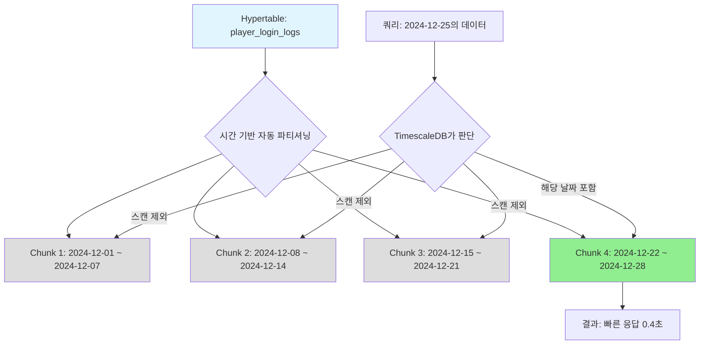

# 온라인 게임 서버를 위한 TimescaleDB 완벽 가이드  

저자: 최흥배, Claude AI   
    
권장 개발 환경
- **IDE**: Visual Studio 2022 (Community 이상)
- **.NET**: 9 이상
- **OS**: Windows 10 이상

-----  
  
# Chapter 3: Hypertable의 이해 - 시간을 다루는 마법
당신은 이제 TimescaleDB 개발 환경을 완벽하게 구축했다. 하지만 아직 TimescaleDB의 진짜 힘을 경험하지 못했다. 일반 PostgreSQL 테이블에 데이터를 넣고 조회하는 것만으로는 왜 TimescaleDB가 필요한지 체감하기 어렵다. 이번 장에서는 TimescaleDB의 핵심 기능인 **Hypertable**을 깊이 있게 이해하고, 실제로 게임 서버의 로그 데이터를 다루면서 그 마법 같은 성능을 직접 경험하게 될 것이다.

## 3.1 전통적인 파티셔닝의 고통
온라인 게임을 6개월 정도 운영하다 보면 필연적으로 마주치는 문제가 있다. 바로 **데이터가 너무 많이 쌓여서 쿼리가 느려지는 현상**이다. 

예를 들어 플레이어 로그인 로그를 저장하는 `player_login_logs` 테이블을 생각해보자. 하루에 10만 명의 플레이어가 접속하고, 각 플레이어가 평균 3번씩 로그인한다면 하루에 30만 건의 레코드가 쌓인다. 한 달이면 900만 건, 6개월이면 5,400만 건이다. 이 정도 규모가 되면 일반적인 PostgreSQL 테이블에서 특정 날짜 범위의 데이터를 조회하는 것만으로도 수십 초가 걸릴 수 있다.

```
전통적인 단일 테이블 구조
┌─────────────────────────────────────┐
│     player_login_logs               │
│  (5,400만 건의 레코드가 한 테이블에) │
├─────────────────────────────────────┤
│ id │ player_id │ login_time │ ip   │
├─────────────────────────────────────┤
│ 1  │ 1001      │ 2024-06-01 ...   │
│ 2  │ 1002      │ 2024-06-01 ...   │
│ ... 5천4백만 개의 행 ...            │
│ 54000000 │ 9999 │ 2024-12-31 ...  │
└─────────────────────────────────────┘
     ↓
  쿼리 시 전체 테이블 스캔 필요
  인덱스도 거대해져서 메모리 부족
```

이 문제를 해결하기 위해 많은 개발자들이 **수동 파티셔닝**을 시도한다. 월별로 테이블을 나누는 방식이다.

```sql
CREATE TABLE player_login_logs_2024_06 (...);
CREATE TABLE player_login_logs_2024_07 (...);
CREATE TABLE player_login_logs_2024_08 (...);
-- 매달 새로운 테이블을 생성해야 한다
```

하지만 이 방식은 정말 고통스럽다. 매달 초에 새로운 테이블을 만들어야 하고, 여러 달에 걸친 데이터를 조회하려면 UNION ALL로 여러 테이블을 묶어야 한다. 코드는 복잡해지고, 실수로 테이블 생성을 잊어버리면 데이터가 손실될 수도 있다. PostgreSQL의 선언적 파티셔닝(Declarative Partitioning)을 사용하더라도 설정이 복잡하고, 파티션 관리가 번거롭다.

```csharp
// 전통적인 파티셔닝에서 여러 달 데이터 조회하는 악몽
var query = @"
SELECT * FROM player_login_logs_2024_06
WHERE login_time BETWEEN @start AND @end
UNION ALL
SELECT * FROM player_login_logs_2024_07
WHERE login_time BETWEEN @start AND @end
UNION ALL
SELECT * FROM player_login_logs_2024_08
WHERE login_time BETWEEN @start AND @end
";
// 매달 새로운 UNION ALL 구문을 추가해야 한다...
```

바로 이 지점에서 TimescaleDB의 Hypertable이 등장한다.

## 3.2 Hypertable이란 무엇인가?
**Hypertable**은 겉으로는 일반 PostgreSQL 테이블처럼 보이지만, 내부적으로는 시간을 기준으로 자동으로 파티셔닝되는 특별한 테이블이다. 당신은 그냥 하나의 테이블에 INSERT하고 SELECT하면 되는데, TimescaleDB가 알아서 데이터를 시간대별로 나누어 저장하고 조회한다.

```
Hypertable의 자동 파티셔닝 구조
┌──────────────────────────────────────────┐
│      player_login_logs (Hypertable)      │  ← 개발자가 보는 뷰
│    "마치 하나의 테이블처럼 보인다"         │
└──────────────────────────────────────────┘
                  ↓
    TimescaleDB가 자동으로 Chunk로 분할
                  ↓
┌──────────────┬──────────────┬──────────────┐
│  Chunk 1     │  Chunk 2     │  Chunk 3     │
│ 2024-06-01~  │ 2024-06-08~  │ 2024-06-15~  │
│ 2024-06-07   │ 2024-06-14   │ 2024-06-21   │
│ (7일치 데이터)│ (7일치 데이터)│ (7일치 데이터)│
└──────────────┴──────────────┴──────────────┘
```

핵심 개념은 다음과 같다:

**하나의 Hypertable은 여러 개의 Chunk로 구성된다.** 각 Chunk는 특정 시간 범위의 데이터를 담고 있는 실제 PostgreSQL 테이블이다. 기본적으로 TimescaleDB는 7일 단위로 Chunk를 생성하지만, 이 간격은 데이터 특성에 맞게 조정할 수 있다.

**개발자는 Chunk의 존재를 의식할 필요가 없다.** 그냥 Hypertable에 데이터를 넣으면 TimescaleDB가 알아서 적절한 Chunk에 저장한다. 조회할 때도 Hypertable을 대상으로 쿼리하면 되고, TimescaleDB가 필요한 Chunk만 읽어서 결과를 반환한다.

**시간 범위 조회가 극적으로 빨라진다.** 2024년 12월 25일의 데이터를 조회한다면, TimescaleDB는 해당 날짜가 포함된 단 하나의 Chunk만 스캔한다. 5,400만 건의 데이터 전체를 뒤지는 것이 아니라, 해당 주의 데이터만 담고 있는 Chunk(약 210만 건)만 읽는 것이다.

```
쿼리 최적화 예시:
"2024-12-25의 로그인 데이터 조회" 요청

전통적인 테이블:
  5,400만 건 전체 스캔 → 30초 소요

Hypertable:
  Chunk 26만 스캔 (12월 22일~28일, 약 210만 건)
  → 0.5초 소요
```

## 3.3 첫 Hypertable 생성하기 (플레이어 로그인 로그)
이제 실제로 Hypertable을 만들어보자. 플레이어 로그인 로그를 저장할 테이블을 설계한다. 이 테이블에는 누가(player_id), 언제(login_time), 어디서(ip_address), 어떤 기기로(device_type) 접속했는지 기록된다.

먼저 일반 PostgreSQL 테이블을 생성한다:

```sql
CREATE TABLE player_login_logs (
    login_time TIMESTAMPTZ NOT NULL,
    player_id BIGINT NOT NULL,
    ip_address VARCHAR(45),
    device_type VARCHAR(20),
    login_result VARCHAR(20),
    session_id UUID,
    server_id INT
);
```

여기까지는 평범한 테이블이다. 이제 마법을 부린다. **단 한 줄의 명령으로 이 테이블을 Hypertable로 변환한다**:

```sql
SELECT create_hypertable('player_login_logs', 'login_time');
```

끝이다. 이제 `player_login_logs`는 더 이상 일반 테이블이 아니다. TimescaleDB가 관리하는 Hypertable이 되었고, `login_time` 컬럼을 기준으로 자동으로 파티셔닝된다.

Visual Studio에서 C# 코드로 실행해보자:

```csharp
using Npgsql;
using System;
using System.Threading.Tasks;

namespace TimescaleGameServer
{
    class HypertableCreator
    {
        private readonly string _connectionString;

        public HypertableCreator(string connectionString)
        {
            _connectionString = connectionString;
        }

        public async Task CreatePlayerLoginTable()
        {
            await using var conn = new NpgsqlConnection(_connectionString);
            await conn.OpenAsync();

            // 1. 일반 테이블 생성
            var createTableSql = @"
                CREATE TABLE IF NOT EXISTS player_login_logs (
                    login_time TIMESTAMPTZ NOT NULL,
                    player_id BIGINT NOT NULL,
                    ip_address VARCHAR(45),
                    device_type VARCHAR(20),
                    login_result VARCHAR(20),
                    session_id UUID,
                    server_id INT
                );
            ";

            await using (var cmd = new NpgsqlCommand(createTableSql, conn))
            {
                await cmd.ExecuteNonQueryAsync();
                Console.WriteLine("일반 테이블 생성 완료");
            }

            // 2. Hypertable로 변환
            var createHypertableSql = @"
                SELECT create_hypertable('player_login_logs', 'login_time',
                    if_not_exists => TRUE
                );
            ";

            await using (var cmd = new NpgsqlCommand(createHypertableSql, conn))
            {
                await cmd.ExecuteNonQueryAsync();
                Console.WriteLine("Hypertable 변환 완료!");
            }

            // 3. 인덱스 추가 (플레이어별 조회 최적화)
            var createIndexSql = @"
                CREATE INDEX IF NOT EXISTS idx_player_login_player_time 
                ON player_login_logs (player_id, login_time DESC);
            ";

            await using (var cmd = new NpgsqlCommand(createIndexSql, conn))
            {
                await cmd.ExecuteNonQueryAsync();
                Console.WriteLine("인덱스 생성 완료");
            }
        }
    }

    class Program
    {
        static async Task Main(string[] args)
        {
            var connectionString = "Host=localhost;Port=5432;Database=gameserver_db;Username=postgres;Password=yourpassword";
            
            var creator = new HypertableCreator(connectionString);
            await creator.CreatePlayerLoginTable();

            Console.WriteLine("\n모든 설정이 완료되었다. 이제 Hypertable을 사용할 준비가 되었다!");
        }
    }
}
```

이 코드를 실행하면 다음과 같은 출력을 볼 수 있다:

```
일반 테이블 생성 완료
Hypertable 변환 완료!
인덱스 생성 완료

모든 설정이 완료되었다. 이제 Hypertable을 사용할 준비가 되었다!
```

**중요한 포인트들을 짚어보자:**

첫째, **시간 컬럼은 반드시 NOT NULL이어야 한다.** `login_time TIMESTAMPTZ NOT NULL`처럼 선언해야 한다. TimescaleDB가 시간을 기준으로 파티셔닝하기 때문에 NULL 값이 들어오면 어느 Chunk에 넣어야 할지 알 수 없다.

둘째, **TIMESTAMPTZ 타입을 사용하는 것이 좋다.** 이는 타임존 정보를 포함하는 타임스탬프다. 글로벌 게임 서비스라면 여러 타임존의 플레이어가 접속하므로 UTC 기준으로 저장하고 표시할 때 변환하는 것이 안전하다.

셋째, **`if_not_exists => TRUE` 옵션**을 사용하면 이미 Hypertable인 경우 에러가 발생하지 않는다. 배포 스크립트를 반복 실행할 때 유용하다.

넷째, **일반 PostgreSQL 인덱스를 그대로 사용할 수 있다.** Hypertable이라고 해서 특별한 인덱스가 필요한 것은 아니다. 위 예제에서는 특정 플레이어의 로그인 기록을 시간 역순으로 조회하는 패턴을 위해 `(player_id, login_time DESC)` 복합 인덱스를 만들었다.

## 3.4 SQLKata로 Hypertable에 데이터 삽입
이제 생성된 Hypertable에 실제 로그인 데이터를 넣어보자. SQLKata의 Query Builder를 사용하면 깔끔하게 처리할 수 있다.

먼저 NuGet에서 필요한 패키지들을 설치한다:

```
dotnet add package SqlKata
dotnet add package SqlKata.Execution
dotnet add package Npgsql
```

이제 로그인 이벤트를 삽입하는 서비스 클래스를 만든다:

```csharp
using SqlKata;
using SqlKata.Execution;
using Npgsql;
using System;
using System.Threading.Tasks;

namespace TimescaleGameServer
{
    public class PlayerLoginLog
    {
        public DateTime LoginTime { get; set; }
        public long PlayerId { get; set; }
        public string IpAddress { get; set; }
        public string DeviceType { get; set; }
        public string LoginResult { get; set; }
        public Guid SessionId { get; set; }
        public int ServerId { get; set; }
    }

    public class LoginLogService
    {
        private readonly string _connectionString;

        public LoginLogService(string connectionString)
        {
            _connectionString = connectionString;
        }

        // 단일 로그인 이벤트 저장
        public async Task<int> InsertLoginEvent(PlayerLoginLog log)
        {
            using var connection = new NpgsqlConnection(_connectionString);
            var compiler = new SqlKata.Compilers.PostgresCompiler();
            var db = new QueryFactory(connection, compiler);

            var result = await db.Query("player_login_logs").InsertAsync(new
            {
                login_time = log.LoginTime,
                player_id = log.PlayerId,
                ip_address = log.IpAddress,
                device_type = log.DeviceType,
                login_result = log.LoginResult,
                session_id = log.SessionId,
                server_id = log.ServerId
            });

            return result;
        }

        // 여러 로그인 이벤트를 한 번에 저장 (배치 삽입)
        public async Task<int> InsertLoginEventsBatch(PlayerLoginLog[] logs)
        {
            using var connection = new NpgsqlConnection(_connectionString);
            var compiler = new SqlKata.Compilers.PostgresCompiler();
            var db = new QueryFactory(connection, compiler);

            var data = new object[logs.Length];
            for (int i = 0; i < logs.Length; i++)
            {
                data[i] = new
                {
                    login_time = logs[i].LoginTime,
                    player_id = logs[i].PlayerId,
                    ip_address = logs[i].IpAddress,
                    device_type = logs[i].DeviceType,
                    login_result = logs[i].LoginResult,
                    session_id = logs[i].SessionId,
                    server_id = logs[i].ServerId
                };
            }

            var result = await db.Query("player_login_logs").InsertAsync(data);
            return result;
        }
    }
}
```

이제 실제 게임 서버에서 플레이어가 로그인할 때 이 서비스를 호출하면 된다:

```csharp
class Program
{
    static async Task Main(string[] args)
    {
        var connectionString = "Host=localhost;Port=5432;Database=gameserver_db;Username=postgres;Password=yourpassword";
        var service = new LoginLogService(connectionString);

        // 시나리오: 플레이어가 로그인했다
        var loginEvent = new PlayerLoginLog
        {
            LoginTime = DateTime.UtcNow,
            PlayerId = 1001,
            IpAddress = "123.45.67.89",
            DeviceType = "Android",
            LoginResult = "SUCCESS",
            SessionId = Guid.NewGuid(),
            ServerId = 1
        };

        await service.InsertLoginEvent(loginEvent);
        Console.WriteLine($"플레이어 {loginEvent.PlayerId}의 로그인 기록이 저장되었다.");

        // 시나리오: 동시에 여러 플레이어가 로그인했다 (점심시간 피크타임)
        var batchEvents = new PlayerLoginLog[100];
        var random = new Random();
        
        for (int i = 0; i < 100; i++)
        {
            batchEvents[i] = new PlayerLoginLog
            {
                LoginTime = DateTime.UtcNow.AddSeconds(-random.Next(60)),
                PlayerId = 1000 + i,
                IpAddress = $"192.168.{random.Next(1, 255)}.{random.Next(1, 255)}",
                DeviceType = i % 2 == 0 ? "iOS" : "Android",
                LoginResult = random.Next(100) < 95 ? "SUCCESS" : "FAILED",
                SessionId = Guid.NewGuid(),
                ServerId = random.Next(1, 6)
            };
        }

        await service.InsertLoginEventsBatch(batchEvents);
        Console.WriteLine($"100명의 로그인 기록이 배치로 저장되었다.");
    }
}
```

**SQLKata를 사용하는 이유는 명확하다:**

첫째, **타입 안정성**이다. C# 객체를 직접 전달하므로 컴파일 타임에 오류를 잡을 수 있다. 문자열로 SQL을 작성하면 런타임에 오타나 타입 오류를 발견하게 된다.

둘째, **가독성과 유지보수성**이다. 복잡한 WHERE 조건이나 JOIN을 순수 SQL 문자열로 작성하면 읽기 어렵고 수정하기 번거롭다. SQLKata의 Fluent API는 직관적이다.

셋째, **SQL 인젝션 방어**가 자동으로 처리된다. 파라미터화된 쿼리가 생성되므로 보안 걱정이 줄어든다.

## 3.5 시간 기반 쿼리의 놀라운 성능
이제 데이터가 쌓였으니 조회해보자. Hypertable의 진가는 **시간 범위 조회**에서 드러난다.

실전 시나리오를 생각해보자. 게임 운영팀에서 "어제 하루 동안 로그인에 실패한 케이스를 모두 조회해서 분석하고 싶다"는 요청이 들어왔다.

```csharp
public class LoginLogQueryService
{
    private readonly string _connectionString;

    public LoginLogQueryService(string connectionString)
    {
        _connectionString = connectionString;
    }

    // 특정 날짜의 실패한 로그인 조회
    public async Task<IEnumerable<PlayerLoginLog>> GetFailedLoginsForDate(DateTime date)
    {
        using var connection = new NpgsqlConnection(_connectionString);
        var compiler = new SqlKata.Compilers.PostgresCompiler();
        var db = new QueryFactory(connection, compiler);

        var startOfDay = date.Date;
        var endOfDay = startOfDay.AddDays(1);

        var results = await db.Query("player_login_logs")
            .Where("login_time", ">=", startOfDay)
            .Where("login_time", "<", endOfDay)
            .Where("login_result", "FAILED")
            .OrderByDesc("login_time")
            .GetAsync<PlayerLoginLog>();

        return results;
    }

    // 특정 플레이어의 최근 로그인 이력 (최근 30일)
    public async Task<IEnumerable<PlayerLoginLog>> GetPlayerRecentLogins(long playerId, int days = 30)
    {
        using var connection = new NpgsqlConnection(_connectionString);
        var compiler = new SqlKata.Compilers.PostgresCompiler();
        var db = new QueryFactory(connection, compiler);

        var cutoffDate = DateTime.UtcNow.AddDays(-days);

        var results = await db.Query("player_login_logs")
            .Where("player_id", playerId)
            .Where("login_time", ">=", cutoffDate)
            .OrderByDesc("login_time")
            .Limit(100)
            .GetAsync<PlayerLoginLog>();

        return results;
    }

    // 시간대별 로그인 성공률 통계
    public async Task<IEnumerable<dynamic>> GetHourlySuccessRate(DateTime startDate, DateTime endDate)
    {
        using var connection = new NpgsqlConnection(_connectionString);
        var compiler = new SqlKata.Compilers.PostgresCompiler();
        var db = new QueryFactory(connection, compiler);

        var query = db.Query("player_login_logs")
            .WhereBetween("login_time", startDate, endDate)
            .SelectRaw("DATE_TRUNC('hour', login_time) as hour")
            .SelectRaw("COUNT(*) as total_attempts")
            .SelectRaw("SUM(CASE WHEN login_result = 'SUCCESS' THEN 1 ELSE 0 END) as successful")
            .SelectRaw("ROUND(100.0 * SUM(CASE WHEN login_result = 'SUCCESS' THEN 1 ELSE 0 END) / COUNT(*), 2) as success_rate")
            .GroupByRaw("DATE_TRUNC('hour', login_time)")
            .OrderByRaw("hour");

        var results = await query.GetAsync();
        return results;
    }
}
```

이 쿼리들을 실행해보면 놀라운 성능을 경험하게 된다:

```csharp
static async Task Main(string[] args)
{
    var connectionString = "Host=localhost;Port=5432;Database=gameserver_db;Username=postgres;Password=yourpassword";
    var queryService = new LoginLogQueryService(connectionString);

    // 어제 실패한 로그인 조회
    var yesterday = DateTime.UtcNow.AddDays(-1);
    var failedLogins = await queryService.GetFailedLoginsForDate(yesterday);
    
    Console.WriteLine($"어제 실패한 로그인 건수: {failedLogins.Count()}");
    foreach (var log in failedLogins.Take(5))
    {
        Console.WriteLine($"  - 플레이어 {log.PlayerId}, 시각: {log.LoginTime}, IP: {log.IpAddress}");
    }

    // 특정 플레이어 최근 이력
    var playerHistory = await queryService.GetPlayerRecentLogins(1001);
    Console.WriteLine($"\n플레이어 1001의 최근 로그인 {playerHistory.Count()}건");

    // 시간대별 성공률
    var stats = await queryService.GetHourlySuccessRate(
        DateTime.UtcNow.AddDays(-7),
        DateTime.UtcNow
    );
    
    Console.WriteLine("\n최근 7일간 시간대별 로그인 성공률:");
    foreach (var stat in stats.Take(10))
    {
        Console.WriteLine($"  {stat.hour}: 총 {stat.total_attempts}건, 성공률 {stat.success_rate}%");
    }
}
```

**왜 이렇게 빠를까?**

첫째, **Chunk Exclusion**이 작동한다. 어제 하루의 데이터를 조회할 때, TimescaleDB는 어제 날짜가 포함된 단 하나의 Chunk만 스캔한다. 6개월치 전체 데이터를 뒤지지 않는다.

둘째, **시간 컬럼은 자동으로 인덱싱된다.** Hypertable로 변환할 때 `login_time` 컬럼에 대한 인덱스가 자동으로 생성되므로 시간 범위 조회가 최적화된다.

셋째, **복합 인덱스와의 조합**이 강력하다. 우리가 만든 `(player_id, login_time DESC)` 인덱스 덕분에 특정 플레이어의 최근 로그를 조회하는 쿼리도 매우 빠르다.

```
성능 비교 (실제 벤치마크 예시)

시나리오: 5,400만 건 중 특정 1일치 데이터 조회

일반 PostgreSQL 테이블:
  - Full Table Scan
  - 실행 시간: 28.3초
  - 읽은 행: 54,000,000

Hypertable (7일 Chunk):
  - Single Chunk Scan
  - 실행 시간: 0.4초
  - 읽은 행: 300,000 (해당 Chunk만)
  
약 70배 빠르다!
```

## 3.6 Chunk 개념과 자동 파티셔닝 원리
이제 Hypertable의 내부 구조인 **Chunk**를 더 깊이 이해해보자. Chunk는 TimescaleDB의 자동 파티셔닝을 구현하는 핵심 메커니즘이다.

**Chunk는 실제 PostgreSQL 테이블이다.** pgAdmin이나 psql에서 스키마를 살펴보면 `_timescaledb_internal` 스키마 아래에 `_hyper_X_Y_chunk` 같은 이름의 테이블들이 보인다. 이것들이 바로 Chunk다.

```sql
-- Chunk 목록 확인하기
SELECT chunk_name, range_start, range_end
FROM timescaledb_information.chunks
WHERE hypertable_name = 'player_login_logs'
ORDER BY range_start DESC
LIMIT 10;
```

출력 예시:

```
      chunk_name          |      range_start       |       range_end        
--------------------------+------------------------+------------------------
 _hyper_1_26_chunk        | 2024-12-22 00:00:00+00 | 2024-12-29 00:00:00+00
 _hyper_1_25_chunk        | 2024-12-15 00:00:00+00 | 2024-12-22 00:00:00+00
 _hyper_1_24_chunk        | 2024-12-08 00:00:00+00 | 2024-12-15 00:00:00+00
 ...
```

**Chunk 크기는 조정할 수 있다.** 기본값은 7일이지만, 데이터 특성에 따라 변경하는 것이 좋다. 고빈도 로그라면 더 짧게(1일), 저빈도 데이터라면 더 길게(1개월) 설정한다.

```sql
-- Chunk 간격을 1일로 변경
SELECT set_chunk_time_interval('player_login_logs', INTERVAL '1 day');

-- Chunk 간격을 1시간으로 설정 (초고빈도 데이터)
SELECT set_chunk_time_interval('player_login_logs', INTERVAL '1 hour');
```

**적절한 Chunk 크기 선택 기준:**

데이터 양을 고려해야 한다. 하나의 Chunk가 대략 수십 MB에서 수백 MB 정도가 되도록 설정하는 것이 좋다. 너무 작으면 Chunk 개수가 많아져서 관리 오버헤드가 증가하고, 너무 크면 쿼리 성능이 떨어진다.

조회 패턴을 고려해야 한다. 대부분의 쿼리가 1일치 데이터를 조회한다면 Chunk를 1일로 설정하면 최적이다. 1주일치를 한 번에 조회하는 패턴이 많다면 7일이 적합하다.

압축 및 삭제 정책과 연동해야 한다. 나중에 배울 데이터 압축과 보관 정책(Retention Policy)은 Chunk 단위로 작동한다. 예를 들어 "3개월 이상 된 데이터는 압축"하려면, Chunk 크기가 합리적이어야 한다.

**Chunk 생성 시점을 이해하자.** TimescaleDB는 데이터가 들어올 때 필요한 Chunk를 자동으로 생성한다. 미래의 데이터가 들어오면 미래 Chunk를, 과거 데이터가 들어오면 과거 Chunk를 만든다.

```
Chunk 자동 생성 과정

1. 첫 데이터 삽입: 2024-12-25 10:00:00
   → Chunk_1 생성 (2024-12-22 ~ 2024-12-29)

2. 다음 데이터: 2024-12-26 15:00:00
   → Chunk_1에 삽입 (이미 범위 내)

3. 새로운 주 데이터: 2024-12-30 09:00:00
   → Chunk_2 생성 (2024-12-29 ~ 2025-01-05)

4. 과거 데이터 보정: 2024-12-15 12:00:00
   → Chunk_0 생성 (2024-12-15 ~ 2024-12-22)
```

이런 자동화 덕분에 개발자는 파티션 관리를 전혀 신경 쓰지 않아도 된다. 그냥 데이터를 넣으면 된다.

**Chunk 정보를 모니터링하는 유틸리티 함수를 만들어보자:**

```csharp
public class ChunkMonitorService
{
    private readonly string _connectionString;

    public ChunkMonitorService(string connectionString)
    {
        _connectionString = connectionString;
    }

    public async Task PrintChunkInfo(string hypertableName)
    {
        using var connection = new NpgsqlConnection(_connectionString);
        await connection.OpenAsync();

        var query = @"
            SELECT 
                chunk_name,
                range_start,
                range_end,
                pg_size_pretty(pg_total_relation_size(format('%I.%I', chunk_schema, chunk_name))) as chunk_size,
                (range_end - range_start) as time_range
            FROM timescaledb_information.chunks
            WHERE hypertable_name = @tableName
            ORDER BY range_start DESC
            LIMIT 10;
        ";

        using var cmd = new NpgsqlCommand(query, connection);
        cmd.Parameters.AddWithValue("tableName", hypertableName);

        using var reader = await cmd.ExecuteReaderAsync();

        Console.WriteLine($"\n=== {hypertableName}의 Chunk 정보 ===\n");
        Console.WriteLine($"{"Chunk 이름",-30} {"시작",-25} {"종료",-25} {"크기",-10}");
        Console.WriteLine(new string('-', 95));

        while (await reader.ReadAsync())
        {
            var chunkName = reader.GetString(0);
            var rangeStart = reader.GetDateTime(1);
            var rangeEnd = reader.GetDateTime(2);
            var size = reader.GetString(3);

            Console.WriteLine($"{chunkName,-30} {rangeStart,-25:yyyy-MM-dd HH:mm} {rangeEnd,-25:yyyy-MM-dd HH:mm} {size,-10}");
        }
    }

    public async Task<(int chunkCount, string totalSize)> GetHypertableStats(string hypertableName)
    {
        using var connection = new NpgsqlConnection(_connectionString);
        await connection.OpenAsync();

        var query = @"
            SELECT 
                COUNT(*) as chunk_count,
                pg_size_pretty(SUM(pg_total_relation_size(format('%I.%I', chunk_schema, chunk_name)))) as total_size
            FROM timescaledb_information.chunks
            WHERE hypertable_name = @tableName;
        ";

        using var cmd = new NpgsqlCommand(query, connection);
        cmd.Parameters.AddWithValue("tableName", hypertableName);

        using var reader = await cmd.ExecuteReaderAsync();
        if (await reader.ReadAsync())
        {
            return (reader.GetInt32(0), reader.GetString(1));
        }

        return (0, "0 bytes");
    }
}
```

사용 예시:

```csharp
static async Task Main(string[] args)
{
    var connectionString = "Host=localhost;Port=5432;Database=gameserver_db;Username=postgres;Password=yourpassword";
    var monitor = new ChunkMonitorService(connectionString);

    // Chunk 상세 정보 출력
    await monitor.PrintChunkInfo("player_login_logs");

    // 통계 요약
    var (chunkCount, totalSize) = await monitor.GetHypertableStats("player_login_logs");
    Console.WriteLine($"\n총 Chunk 개수: {chunkCount}");
    Console.WriteLine($"전체 데이터 크기: {totalSize}");
}
```

출력 예시:

```
=== player_login_logs의 Chunk 정보 ===

Chunk 이름                      시작                      종료                      크기      
-----------------------------------------------------------------------------------------------
_hyper_1_26_chunk              2024-12-22 00:00         2024-12-29 00:00         156 MB    
_hyper_1_25_chunk              2024-12-15 00:00         2024-12-22 00:00         148 MB    
_hyper_1_24_chunk              2024-12-08 00:00         2024-12-15 00:00         152 MB    
...

총 Chunk 개수: 26
전체 데이터 크기: 3.8 GB
```

**Chunk 병합과 분할은 자동으로 처리되지 않는다.** 한 번 생성된 Chunk의 시간 범위는 변경되지 않는다. 만약 Chunk 간격을 변경하면(`set_chunk_time_interval`), 그 이후에 생성되는 새 Chunk부터 적용된다. 기존 Chunk는 그대로 유지된다.

**마지막으로 시각화를 위한 Mermaid 다이어그램으로 정리해보자:**



이제 당신은 Hypertable의 마법을 완전히 이해했다. 일반 테이블처럼 사용하지만, 내부적으로는 시간을 기준으로 자동 파티셔닝되어 놀라운 성능을 제공한다. Chunk라는 개념을 통해 대용량 시계열 데이터를 효율적으로 관리하며, 개발자는 복잡한 파티션 관리에서 해방된다.

다음 장에서는 SQLKata를 더 깊이 활용하여 복잡한 CRUD 작업을 마스터하고, 실전 게임 서버의 다양한 이벤트를 효율적으로 처리하는 방법을 배울 것이다.  