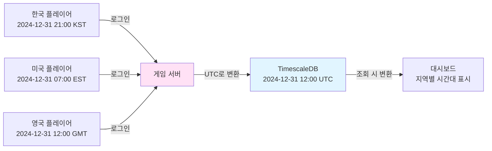

# 온라인 게임 서버를 위한 TimescaleDB 완벽 가이드  

저자: 최흥배, Claude AI   
    
권장 개발 환경
- **IDE**: Visual Studio 2022 (Community 이상)
- **.NET**: 9 이상
- **OS**: Windows 10 이상

-----  
  
# Chapter 5: 시간 함수의 모든 것
이제 TimescaleDB의 진정한 힘을 발휘할 시간이다. 일반 PostgreSQL에도 날짜와 시간을 다루는 함수들이 있지만, TimescaleDB는 시계열 데이터 분석에 특화된 강력한 시간 함수들을 제공한다. 특히 `time_bucket` 함수는 게임 서버 운영에서 없어서는 안 될 도구다. 이번 장에서는 5분 단위 동시 접속자 추이, 시간대별 매출 분석, 서버 CPU 사용률 모니터링 등 실전 대시보드에서 즉시 사용할 수 있는 쿼리들을 마스터한다.

## 5.1 time_bucket: 시간 단위로 그룹화하기
게임 운영팀에서 가장 자주 요청하는 리포트는 "시간대별 통계"다. "오늘 시간대별 동접자 수를 보여달라", "지난주 일별 매출 추이를 알려달라"와 같은 요청이 매일 들어온다. 일반 SQL의 `DATE_TRUNC`로도 가능하지만, TimescaleDB의 `time_bucket`은 훨씬 직관적이고 강력하다.

**time_bucket의 기본 개념을 이해하자.** 이 함수는 시간 축을 동일한 간격의 버킷(bucket)으로 나누고, 각 타임스탬프가 어느 버킷에 속하는지 계산한다. 예를 들어 5분 단위로 버킷을 만들면, 14:03:27도 14:05:00 버킷에, 14:07:52도 14:10:00 버킷에 속하게 된다.

```
시간 축을 5분 단위 버킷으로 분할

원본 타임스탬프:
14:03:27 ─┐
14:04:15 ─┤→ 14:00:00 버킷
14:05:42 ─┐
14:07:18 ─┤→ 14:05:00 버킷
14:09:33 ─┘
14:10:01 ─┐
14:12:44 ─┤→ 14:10:00 버킷
14:14:59 ─┘
```

**time_bucket의 기본 문법:**

```sql
time_bucket(bucket_width INTERVAL, time TIMESTAMPTZ)
```

bucket_width는 버킷의 크기를 나타낸다. `'5 minutes'`, `'1 hour'`, `'1 day'` 등으로 지정한다. time은 그룹화할 타임스탬프 컬럼이다.

**SQLKata에서 time_bucket을 사용하려면 SelectRaw를 활용해야 한다.** time_bucket은 TimescaleDB 전용 함수이므로 SQLKata의 일반 메서드로는 표현할 수 없다.

```csharp
public class TimeBucketService
{
    private readonly string _connectionString;

    public TimeBucketService(string connectionString)
    {
        _connectionString = connectionString;
    }

    private QueryFactory CreateQueryFactory()
    {
        var connection = new NpgsqlConnection(_connectionString);
        var compiler = new PostgresCompiler();
        return new QueryFactory(connection, compiler);
    }

    // 5분 단위로 로그인 횟수 집계
    public async Task<IEnumerable<dynamic>> GetLoginCountBy5Minutes(
        DateTime startTime, DateTime endTime)
    {
        using var db = CreateQueryFactory();

        var results = await db.Query("player_login_logs")
            .WhereBetween("login_time", startTime, endTime)
            .SelectRaw("time_bucket('5 minutes', login_time) as bucket")
            .SelectRaw("COUNT(*) as login_count")
            .GroupByRaw("bucket")
            .OrderByRaw("bucket")
            .GetAsync();

        return results;
    }

    // 1시간 단위로 집계
    public async Task<IEnumerable<dynamic>> GetLoginCountByHour(
        DateTime startTime, DateTime endTime)
    {
        using var db = CreateQueryFactory();

        var results = await db.Query("player_login_logs")
            .WhereBetween("login_time", startTime, endTime)
            .SelectRaw("time_bucket('1 hour', login_time) as bucket")
            .SelectRaw("COUNT(*) as login_count")
            .SelectRaw("COUNT(DISTINCT player_id) as unique_players")
            .GroupByRaw("bucket")
            .OrderByRaw("bucket")
            .GetAsync();

        return results;
    }

    // 1일 단위로 집계 (일별 DAU)
    public async Task<IEnumerable<dynamic>> GetDailyActiveUsers(
        DateTime startDate, DateTime endDate)
    {
        using var db = CreateQueryFactory();

        var results = await db.Query("player_login_logs")
            .WhereBetween("login_time", startDate, endDate)
            .Where("login_result", "SUCCESS")
            .SelectRaw("time_bucket('1 day', login_time) as day")
            .SelectRaw("COUNT(DISTINCT player_id) as dau")
            .SelectRaw("COUNT(*) as total_logins")
            .GroupByRaw("day")
            .OrderByRaw("day")
            .GetAsync();

        return results;
    }

    // 다양한 간격 비교 (15분, 30분, 1시간)
    public async Task CompareVariousBuckets(DateTime startTime, DateTime endTime)
    {
        using var db = CreateQueryFactory();

        Console.WriteLine("=== 15분 단위 ===");
        var results15min = await db.Query("player_login_logs")
            .WhereBetween("login_time", startTime, endTime)
            .SelectRaw("time_bucket('15 minutes', login_time) as bucket")
            .SelectRaw("COUNT(*) as count")
            .GroupByRaw("bucket")
            .OrderByRaw("bucket")
            .GetAsync();

        foreach (var row in results15min.Take(5))
        {
            Console.WriteLine($"{row.bucket:yyyy-MM-dd HH:mm}: {row.count}건");
        }

        Console.WriteLine("\n=== 30분 단위 ===");
        var results30min = await db.Query("player_login_logs")
            .WhereBetween("login_time", startTime, endTime)
            .SelectRaw("time_bucket('30 minutes', login_time) as bucket")
            .SelectRaw("COUNT(*) as count")
            .GroupByRaw("bucket")
            .OrderByRaw("bucket")
            .GetAsync();

        foreach (var row in results30min.Take(5))
        {
            Console.WriteLine($"{row.bucket:yyyy-MM-dd HH:mm}: {row.count}건");
        }

        Console.WriteLine("\n=== 1시간 단위 ===");
        var results1hour = await db.Query("player_login_logs")
            .WhereBetween("login_time", startTime, endTime)
            .SelectRaw("time_bucket('1 hour', login_time) as bucket")
            .SelectRaw("COUNT(*) as count")
            .GroupByRaw("bucket")
            .OrderByRaw("bucket")
            .GetAsync();

        foreach (var row in results1hour.Take(5))
        {
            Console.WriteLine($"{row.bucket:yyyy-MM-dd HH:mm}: {row.count}건");
        }
    }
}
```

**실전 사용 예제:**

```csharp
static async Task Main(string[] args)
{
    var connectionString = "Host=localhost;Port=5432;Database=gameserver_db;Username=postgres;Password=yourpassword";
    var timeBucketService = new TimeBucketService(connectionString);

    var today = DateTime.UtcNow.Date;
    var tomorrow = today.AddDays(1);

    // 오늘 하루 5분 단위 로그인 추이
    var loginTrend = await timeBucketService.GetLoginCountBy5Minutes(today, tomorrow);

    Console.WriteLine("=== 오늘 5분 단위 로그인 추이 ===");
    foreach (var point in loginTrend.Take(20))
    {
        Console.WriteLine($"{point.bucket:HH:mm}: {point.login_count}건");
    }

    // 최근 7일 일별 DAU
    var weekAgo = today.AddDays(-7);
    var dailyStats = await timeBucketService.GetDailyActiveUsers(weekAgo, tomorrow);

    Console.WriteLine("\n=== 최근 7일 DAU ===");
    foreach (var day in dailyStats)
    {
        Console.WriteLine($"{day.day:yyyy-MM-dd}: DAU {day.dau}명, 총 로그인 {day.total_logins}건");
    }
}
```

출력 예시:

```
=== 오늘 5분 단위 로그인 추이 ===
00:00: 45건
00:05: 32건
00:10: 28건
...
12:00: 234건  ← 점심시간 피크
12:05: 312건
12:10: 278건
...

=== 최근 7일 DAU ===
2024-12-24: DAU 11,230명, 총 로그인 38,456건
2024-12-25: DAU 15,670명, 총 로그인 52,134건  ← 크리스마스
2024-12-26: DAU 12,890명, 총 로그인 41,234건
...
```

**time_bucket의 정렬 기준을 이해하자.** 기본적으로 time_bucket은 에포크(1970-01-01 00:00:00 UTC)를 기준으로 버킷을 정렬한다. 즉, 항상 정각 또는 정확한 간격으로 버킷이 생성된다.

```
5분 버킷의 시작 시각:
00:00:00, 00:05:00, 00:10:00, 00:15:00, ...

1시간 버킷의 시작 시각:
00:00:00, 01:00:00, 02:00:00, 03:00:00, ...

1일 버킷의 시작 시각:
2024-12-25 00:00:00, 2024-12-26 00:00:00, ...
```

## 5.2 실전: 5분 단위 동시 접속자 통계
게임 서버 운영에서 가장 중요한 지표 중 하나가 **동시 접속자 수(CCU, Concurrent Users)**다. 서버가 감당할 수 있는 최대 동접을 파악하고, 피크 타임을 예측하며, 서버 확장 시점을 결정하는 데 필수적이다.

**동시 접속자를 추적하는 방법은 두 가지다.** 첫째는 접속 시작과 종료 이벤트를 모두 기록하는 방법이고, 둘째는 주기적으로 현재 접속자를 스냅샷으로 기록하는 방법이다. 여기서는 첫 번째 방법을 사용한다.

**세션 로그 테이블을 설계하자:**

```csharp
public class SessionTracker
{
    private readonly string _connectionString;

    public SessionTracker(string connectionString)
    {
        _connectionString = connectionString;
    }

    // 세션 로그 테이블 생성
    public async Task CreateSessionTable()
    {
        using var connection = new NpgsqlConnection(_connectionString);
        await connection.OpenAsync();

        var createTableSql = @"
            CREATE TABLE IF NOT EXISTS player_sessions (
                session_id UUID NOT NULL,
                player_id BIGINT NOT NULL,
                server_id INT NOT NULL,
                login_time TIMESTAMPTZ NOT NULL,
                logout_time TIMESTAMPTZ,
                device_type VARCHAR(20),
                session_duration_seconds INT
            );
        ";

        await using (var cmd = new NpgsqlCommand(createTableSql, connection))
        {
            await cmd.ExecuteNonQueryAsync();
        }

        // Hypertable 변환
        var createHypertableSql = @"
            SELECT create_hypertable('player_sessions', 'login_time',
                if_not_exists => TRUE
            );
        ";

        await using (var cmd = new NpgsqlCommand(createHypertableSql, connection))
        {
            await cmd.ExecuteNonQueryAsync();
        }

        // 인덱스 추가
        var createIndexSql = @"
            CREATE INDEX IF NOT EXISTS idx_player_sessions_logout 
            ON player_sessions (logout_time) 
            WHERE logout_time IS NOT NULL;
        ";

        await using (var cmd = new NpgsqlCommand(createIndexSql, connection))
        {
            await cmd.ExecuteNonQueryAsync();
        }

        Console.WriteLine("세션 추적 테이블 준비 완료");
    }

    private QueryFactory CreateQueryFactory()
    {
        var connection = new NpgsqlConnection(_connectionString);
        var compiler = new PostgresCompiler();
        return new QueryFactory(connection, compiler);
    }

    // 로그인 이벤트 기록
    public async Task RecordLogin(long playerId, int serverId, string deviceType)
    {
        using var db = CreateQueryFactory();

        await db.Query("player_sessions").InsertAsync(new
        {
            session_id = Guid.NewGuid(),
            player_id = playerId,
            server_id = serverId,
            login_time = DateTime.UtcNow,
            logout_time = (DateTime?)null,
            device_type = deviceType,
            session_duration_seconds = (int?)null
        });
    }

    // 로그아웃 이벤트 기록
    public async Task RecordLogout(Guid sessionId)
    {
        using var db = CreateQueryFactory();

        var loginTime = await db.Query("player_sessions")
            .Where("session_id", sessionId)
            .Select("login_time")
            .FirstOrDefaultAsync<DateTime>();

        var logoutTime = DateTime.UtcNow;
        var duration = (int)(logoutTime - loginTime).TotalSeconds;

        await db.Query("player_sessions")
            .Where("session_id", sessionId)
            .UpdateAsync(new
            {
                logout_time = logoutTime,
                session_duration_seconds = duration
            });
    }
}
```

**5분 단위 동시 접속자 통계를 계산하는 고급 쿼리:**

```csharp
public class ConcurrentUserService
{
    private readonly string _connectionString;

    public ConcurrentUserService(string connectionString)
    {
        _connectionString = connectionString;
    }

    private QueryFactory CreateQueryFactory()
    {
        var connection = new NpgsqlConnection(_connectionString);
        var compiler = new PostgresCompiler();
        return new QueryFactory(connection, compiler);
    }

    // 5분 단위 동시 접속자 수 계산
    public async Task<IEnumerable<dynamic>> GetConcurrentUsers5Min(
        DateTime startTime, DateTime endTime)
    {
        using var connection = new NpgsqlConnection(_connectionString);
        await connection.OpenAsync();

        // 복잡한 쿼리는 직접 SQL로 작성하는 것이 명확하다
        var sql = @"
            WITH time_buckets AS (
                SELECT time_bucket('5 minutes', time) as bucket
                FROM generate_series($1, $2, INTERVAL '5 minutes') as time
            ),
            active_sessions AS (
                SELECT 
                    tb.bucket,
                    COUNT(DISTINCT ps.player_id) as concurrent_users
                FROM time_buckets tb
                LEFT JOIN player_sessions ps ON
                    ps.login_time <= tb.bucket AND
                    (ps.logout_time IS NULL OR ps.logout_time > tb.bucket)
                GROUP BY tb.bucket
            )
            SELECT 
                bucket,
                concurrent_users,
                LAG(concurrent_users) OVER (ORDER BY bucket) as prev_count,
                concurrent_users - LAG(concurrent_users) OVER (ORDER BY bucket) as change
            FROM active_sessions
            ORDER BY bucket;
        ";

        using var cmd = new NpgsqlCommand(sql, connection);
        cmd.Parameters.AddWithValue("$1", startTime);
        cmd.Parameters.AddWithValue("$2", endTime);

        var results = new List<dynamic>();
        using var reader = await cmd.ExecuteReaderAsync();

        while (await reader.ReadAsync())
        {
            results.Add(new
            {
                bucket = reader.GetDateTime(0),
                concurrent_users = reader.GetInt64(1),
                prev_count = reader.IsDBNull(2) ? (long?)null : reader.GetInt64(2),
                change = reader.IsDBNull(3) ? (long?)null : reader.GetInt64(3)
            });
        }

        return results;
    }

    // 서버별 동시 접속자 비교
    public async Task<IEnumerable<dynamic>> GetConcurrentUsersByServer(
        DateTime startTime, DateTime endTime)
    {
        using var connection = new NpgsqlConnection(_connectionString);
        await connection.OpenAsync();

        var sql = @"
            WITH time_buckets AS (
                SELECT time_bucket('5 minutes', time) as bucket
                FROM generate_series($1, $2, INTERVAL '5 minutes') as time
            )
            SELECT 
                tb.bucket,
                ps.server_id,
                COUNT(DISTINCT ps.player_id) as concurrent_users
            FROM time_buckets tb
            LEFT JOIN player_sessions ps ON
                ps.login_time <= tb.bucket AND
                (ps.logout_time IS NULL OR ps.logout_time > tb.bucket)
            GROUP BY tb.bucket, ps.server_id
            ORDER BY tb.bucket, ps.server_id;
        ";

        using var cmd = new NpgsqlCommand(sql, connection);
        cmd.Parameters.AddWithValue("$1", startTime);
        cmd.Parameters.AddWithValue("$2", endTime);

        var results = new List<dynamic>();
        using var reader = await cmd.ExecuteReaderAsync();

        while (await reader.ReadAsync())
        {
            results.Add(new
            {
                bucket = reader.GetDateTime(0),
                server_id = reader.IsDBNull(1) ? (int?)null : reader.GetInt32(1),
                concurrent_users = reader.GetInt64(2)
            });
        }

        return results;
    }

    // 피크 타임 자동 감지
    public async Task<dynamic> DetectPeakTime(DateTime date)
    {
        using var connection = new NpgsqlConnection(_connectionString);
        await connection.OpenAsync();

        var startOfDay = date.Date;
        var endOfDay = startOfDay.AddDays(1);

        var sql = @"
            WITH hourly_ccu AS (
                SELECT 
                    time_bucket('1 hour', tb.time) as hour,
                    COUNT(DISTINCT ps.player_id) as concurrent_users
                FROM generate_series($1, $2, INTERVAL '1 hour') as tb(time)
                LEFT JOIN player_sessions ps ON
                    ps.login_time <= tb.time AND
                    (ps.logout_time IS NULL OR ps.logout_time > tb.time)
                GROUP BY hour
            )
            SELECT 
                hour as peak_time,
                concurrent_users as peak_ccu
            FROM hourly_ccu
            ORDER BY concurrent_users DESC
            LIMIT 1;
        ";

        using var cmd = new NpgsqlCommand(sql, connection);
        cmd.Parameters.AddWithValue("$1", startOfDay);
        cmd.Parameters.AddWithValue("$2", endOfDay);

        using var reader = await cmd.ExecuteReaderAsync();

        if (await reader.ReadAsync())
        {
            return new
            {
                peak_time = reader.GetDateTime(0),
                peak_ccu = reader.GetInt64(1)
            };
        }

        return null;
    }
}
```

**실전 대시보드 출력:**

```csharp
static async Task Main(string[] args)
{
    var connectionString = "Host=localhost;Port=5432;Database=gameserver_db;Username=postgres;Password=yourpassword";
    var ccuService = new ConcurrentUserService(connectionString);

    var now = DateTime.UtcNow;
    var startTime = now.AddHours(-3);  // 최근 3시간

    // 5분 단위 동접 추이
    var ccuTrend = await ccuService.GetConcurrentUsers5Min(startTime, now);

    Console.WriteLine("=== 최근 3시간 동시 접속자 추이 (5분 단위) ===\n");
    foreach (var point in ccuTrend.Take(20))
    {
        var changeSymbol = point.change > 0 ? "▲" : point.change < 0 ? "▼" : "─";
        var changeValue = point.change != null ? $"{changeSymbol} {Math.Abs((long)point.change)}" : "";
        
        Console.WriteLine($"{point.bucket:HH:mm} | {point.concurrent_users,5}명 | {changeValue}");
    }

    // 오늘 피크 타임
    var peakInfo = await ccuService.DetectPeakTime(DateTime.UtcNow.Date);
    if (peakInfo != null)
    {
        Console.WriteLine($"\n=== 오늘 피크 타임 ===");
        Console.WriteLine($"시각: {peakInfo.peak_time:HH:00}");
        Console.WriteLine($"최대 동접: {peakInfo.peak_ccu}명");
    }
}
```

출력 예시:

```
=== 최근 3시간 동시 접속자 추이 (5분 단위) ===

10:00 | 3,234명 | 
10:05 | 3,298명 | ▲ 64
10:10 | 3,401명 | ▲ 103
10:15 | 3,556명 | ▲ 155
...
12:00 | 5,678명 | ▲ 234  ← 점심시간 급증
12:05 | 6,123명 | ▲ 445
12:10 | 6,234명 | ▲ 111
12:15 | 6,089명 | ▼ 145
...

=== 오늘 피크 타임 ===
시각: 12:00
최대 동접: 6,234명
```

## 5.3 시간대별 매출 분석 쿼리
게임 비즈니스에서 가장 중요한 지표는 매출이다. 시간대별, 일별, 주별 매출 추이를 분석하여 프로모션 효과를 측정하고 비즈니스 의사결정을 내린다.

**매출 로그 테이블을 준비하자:**

```csharp
public class RevenueTracker
{
    private readonly string _connectionString;

    public RevenueTracker(string connectionString)
    {
        _connectionString = connectionString;
    }

    public async Task CreateRevenueTable()
    {
        using var connection = new NpgsqlConnection(_connectionString);
        await connection.OpenAsync();

        var createTableSql = @"
            CREATE TABLE IF NOT EXISTS revenue_logs (
                purchase_time TIMESTAMPTZ NOT NULL,
                transaction_id UUID NOT NULL,
                player_id BIGINT NOT NULL,
                item_id INT NOT NULL,
                item_name VARCHAR(100),
                item_type VARCHAR(50),
                quantity INT,
                unit_price DECIMAL(10,2),
                total_amount DECIMAL(10,2),
                currency VARCHAR(3),
                payment_method VARCHAR(20),
                server_id INT
            );
        ";

        await using (var cmd = new NpgsqlCommand(createTableSql, connection))
        {
            await cmd.ExecuteNonQueryAsync();
        }

        var createHypertableSql = @"
            SELECT create_hypertable('revenue_logs', 'purchase_time',
                if_not_exists => TRUE
            );
        ";

        await using (var cmd = new NpgsqlCommand(createHypertableSql, connection))
        {
            await cmd.ExecuteNonQueryAsync();
        }

        Console.WriteLine("매출 로그 테이블 준비 완료");
    }

    private QueryFactory CreateQueryFactory()
    {
        var connection = new NpgsqlConnection(_connectionString);
        var compiler = new PostgresCompiler();
        return new QueryFactory(connection, compiler);
    }

    // 구매 이벤트 기록
    public async Task RecordPurchase(long playerId, int itemId, string itemName,
        string itemType, int quantity, decimal unitPrice, string currency = "USD")
    {
        using var db = CreateQueryFactory();

        await db.Query("revenue_logs").InsertAsync(new
        {
            purchase_time = DateTime.UtcNow,
            transaction_id = Guid.NewGuid(),
            player_id = playerId,
            item_id = itemId,
            item_name = itemName,
            item_type = itemType,
            quantity = quantity,
            unit_price = unitPrice,
            total_amount = quantity * unitPrice,
            currency = currency,
            payment_method = "CreditCard",
            server_id = 1
        });
    }

    // 샘플 매출 데이터 생성
    public async Task GenerateSampleRevenue(int days = 7)
    {
        var random = new Random();
        var itemTypes = new[] { "골드팩", "경험치부스터", "스킨", "캐릭터", "시즌패스" };
        var prices = new[] { 0.99m, 4.99m, 9.99m, 19.99m, 29.99m };

        for (int day = 0; day < days; day++)
        {
            var baseDate = DateTime.UtcNow.Date.AddDays(-day);

            // 하루에 100~500건의 구매
            var purchaseCount = random.Next(100, 500);

            for (int i = 0; i < purchaseCount; i++)
            {
                var hour = random.Next(24);
                var minute = random.Next(60);
                var purchaseTime = baseDate.AddHours(hour).AddMinutes(minute);

                var itemTypeIdx = random.Next(itemTypes.Length);
                var itemType = itemTypes[itemTypeIdx];
                var price = prices[random.Next(prices.Length)];

                using var db = CreateQueryFactory();
                await db.Query("revenue_logs").InsertAsync(new
                {
                    purchase_time = purchaseTime,
                    transaction_id = Guid.NewGuid(),
                    player_id = random.Next(1000, 10000),
                    item_id = random.Next(100, 200),
                    item_name = $"{itemType}_{random.Next(1, 10)}",
                    item_type = itemType,
                    quantity = 1,
                    unit_price = price,
                    total_amount = price,
                    currency = "USD",
                    payment_method = "CreditCard",
                    server_id = random.Next(1, 6)
                });
            }
        }

        Console.WriteLine($"{days}일치 샘플 매출 데이터 생성 완료");
    }
}
```

**시간대별 매출 분석 쿼리:**

```csharp
public class RevenueAnalytics
{
    private readonly string _connectionString;

    public RevenueAnalytics(string connectionString)
    {
        _connectionString = connectionString;
    }

    private QueryFactory CreateQueryFactory()
    {
        var connection = new NpgsqlConnection(_connectionString);
        var compiler = new PostgresCompiler();
        return new QueryFactory(connection, compiler);
    }

    // 시간대별 매출 (1시간 단위)
    public async Task<IEnumerable<dynamic>> GetHourlyRevenue(
        DateTime startTime, DateTime endTime)
    {
        using var db = CreateQueryFactory();

        var results = await db.Query("revenue_logs")
            .WhereBetween("purchase_time", startTime, endTime)
            .SelectRaw("time_bucket('1 hour', purchase_time) as hour")
            .SelectRaw("SUM(total_amount) as revenue")
            .SelectRaw("COUNT(*) as transaction_count")
            .SelectRaw("COUNT(DISTINCT player_id) as paying_users")
            .SelectRaw("AVG(total_amount) as avg_transaction")
            .GroupByRaw("hour")
            .OrderByRaw("hour")
            .GetAsync();

        return results;
    }

    // 일별 매출 추이
    public async Task<IEnumerable<dynamic>> GetDailyRevenue(
        DateTime startDate, DateTime endDate)
    {
        using var db = CreateQueryFactory();

        var results = await db.Query("revenue_logs")
            .WhereBetween("purchase_time", startDate, endDate)
            .SelectRaw("time_bucket('1 day', purchase_time) as day")
            .SelectRaw("SUM(total_amount) as revenue")
            .SelectRaw("COUNT(*) as transaction_count")
            .SelectRaw("COUNT(DISTINCT player_id) as paying_users")
            .SelectRaw("MAX(total_amount) as max_transaction")
            .SelectRaw("MIN(total_amount) as min_transaction")
            .GroupByRaw("day")
            .OrderByRaw("day")
            .GetAsync();

        return results;
    }

    // 아이템 타입별 매출 (시간대별)
    public async Task<IEnumerable<dynamic>> GetRevenueByItemType(
        DateTime startTime, DateTime endTime)
    {
        using var db = CreateQueryFactory();

        var results = await db.Query("revenue_logs")
            .WhereBetween("purchase_time", startTime, endTime)
            .SelectRaw("time_bucket('1 day', purchase_time) as day")
            .Select("item_type")
            .SelectRaw("SUM(total_amount) as revenue")
            .SelectRaw("COUNT(*) as sales_count")
            .GroupByRaw("day, item_type")
            .OrderByRaw("day, revenue DESC")
            .GetAsync();

        return results;
    }

    // ARPU (Average Revenue Per User) 계산
    public async Task<IEnumerable<dynamic>> CalculateARPU(
        DateTime startDate, DateTime endDate)
    {
        using var connection = new NpgsqlConnection(_connectionString);
        await connection.OpenAsync();

        // ARPU = 총 매출 / 전체 활성 유저 수
        var sql = @"
            WITH daily_revenue AS (
                SELECT 
                    time_bucket('1 day', purchase_time) as day,
                    SUM(total_amount) as total_revenue,
                    COUNT(DISTINCT player_id) as paying_users
                FROM revenue_logs
                WHERE purchase_time BETWEEN $1 AND $2
                GROUP BY day
            ),
            daily_active_users AS (
                SELECT 
                    time_bucket('1 day', login_time) as day,
                    COUNT(DISTINCT player_id) as dau
                FROM player_login_logs
                WHERE login_time BETWEEN $1 AND $2
                    AND login_result = 'SUCCESS'
                GROUP BY day
            )
            SELECT 
                dr.day,
                dr.total_revenue,
                dr.paying_users,
                dau.dau as total_users,
                ROUND(dr.total_revenue / dau.dau, 2) as arpu,
                ROUND(100.0 * dr.paying_users / dau.dau, 2) as conversion_rate
            FROM daily_revenue dr
            JOIN daily_active_users dau ON dr.day = dau.day
            ORDER BY dr.day;
        ";

        using var cmd = new NpgsqlCommand(sql, connection);
        cmd.Parameters.AddWithValue("$1", startDate);
        cmd.Parameters.AddWithValue("$2", endDate);

        var results = new List<dynamic>();
        using var reader = await cmd.ExecuteReaderAsync();

        while (await reader.ReadAsync())
        {
            results.Add(new
            {
                day = reader.GetDateTime(0),
                total_revenue = reader.GetDecimal(1),
                paying_users = reader.GetInt64(2),
                total_users = reader.GetInt64(3),
                arpu = reader.GetDecimal(4),
                conversion_rate = reader.GetDecimal(5)
            });
        }

        return results;
    }

    // 매출 대시보드 리포트 생성
    public async Task GenerateRevenueDashboard(DateTime date)
    {
        var startOfDay = date.Date;
        var endOfDay = startOfDay.AddDays(1);

        Console.WriteLine($"\n========== {date:yyyy-MM-dd} 매출 대시보드 ==========\n");

        // 일일 총 매출
        using var db = CreateQueryFactory();
        var dailyTotal = await db.Query("revenue_logs")
            .WhereBetween("purchase_time", startOfDay, endOfDay)
            .SelectRaw("SUM(total_amount) as total")
            .SelectRaw("COUNT(*) as transactions")
            .SelectRaw("COUNT(DISTINCT player_id) as paying_users")
            .FirstOrDefaultAsync<dynamic>();

        Console.WriteLine($"총 매출: ${dailyTotal.total:N2}");
        Console.WriteLine($"거래 건수: {dailyTotal.transactions:N0}");
        Console.WriteLine($"결제 유저: {dailyTotal.paying_users:N0}명");
        Console.WriteLine($"평균 거래액: ${(dailyTotal.total / dailyTotal.transactions):N2}\n");

        // 시간대별 매출
        var hourlyRevenue = await GetHourlyRevenue(startOfDay, endOfDay);
        Console.WriteLine("--- 시간대별 매출 ---");
        foreach (var hour in hourlyRevenue)
        {
            var bar = new string('█', (int)(hour.revenue / 100));  // 시각화
            Console.WriteLine($"{hour.hour:HH:00} | ${hour.revenue,7:N2} | {bar}");
        }

        // 아이템 타입별 매출
        var itemRevenue = await GetRevenueByItemType(startOfDay, endOfDay);
        Console.WriteLine("\n--- 아이템 타입별 매출 ---");
        foreach (var item in itemRevenue)
        {
            Console.WriteLine($"{item.item_type,-15} ${item.revenue,7:N2} ({item.sales_count}건)");
        }
    }
}
```

**실전 매출 분석 실행:**

```csharp
static async Task Main(string[] args)
{
    var connectionString = "Host=localhost;Port=5432;Database=gameserver_db;Username=postgres;Password=yourpassword";
    
    // 샘플 데이터 생성 (최초 1회)
    var revenueTracker = new RevenueTracker(connectionString);
    // await revenueTracker.CreateRevenueTable();
    // await revenueTracker.GenerateSampleRevenue(7);

    // 매출 분석
    var analytics = new RevenueAnalytics(connectionString);

    // 어제 매출 대시보드
    var yesterday = DateTime.UtcNow.Date.AddDays(-1);
    await analytics.GenerateRevenueDashboard(yesterday);

    // 최근 7일 ARPU
    var weekAgo = DateTime.UtcNow.Date.AddDays(-7);
    var today = DateTime.UtcNow.Date;
    var arpuData = await analytics.CalculateARPU(weekAgo, today);

    Console.WriteLine("\n========== 최근 7일 ARPU 추이 ==========\n");
    foreach (var day in arpuData)
    {
        Console.WriteLine($"{day.day:yyyy-MM-dd} | " +
                        $"매출: ${day.total_revenue,8:N2} | " +
                        $"DAU: {day.total_users,5}명 | " +
                        $"ARPU: ${day.arpu,5:N2} | " +
                        $"전환율: {day.conversion_rate,4:N2}%");
    }
}
```

출력 예시:

```
========== 2024-12-30 매출 대시보드 ==========

총 매출: $3,456.78
거래 건수: 234
결제 유저: 187명
평균 거래액: $14.77

--- 시간대별 매출 ---
00:00 | $ 123.45 | █
01:00 | $  89.23 | 
02:00 | $  67.89 | 
...
12:00 | $ 345.67 | ███
13:00 | $ 412.34 | ████
14:00 | $ 389.12 | ███
...

--- 아이템 타입별 매출 ---
골드팩          $  890.23 (89건)
시즌패스        $  749.70 (25건)
스킨            $  612.45 (61건)
경험치부스터    $  534.12 (107건)
캐릭터          $  670.28 (34건)

========== 최근 7일 ARPU 추이 ==========

2024-12-24 | 매출: $2,456.78 | DAU: 11,230명 | ARPU: $0.22 | 전환율: 1.45%
2024-12-25 | 매출: $4,123.56 | DAU: 15,670명 | ARPU: $0.26 | 전환율: 1.89%
2024-12-26 | 매출: $3,234.12 | DAU: 12,890명 | ARPU: $0.25 | 전환율: 1.67%
...
```

## 5.4 first(), last() 함수 활용

TimescaleDB는 시계열 데이터에서 특정 그룹의 첫 번째와 마지막 값을 효율적으로 가져오는 `first()`와 `last()` 함수를 제공한다. 이 함수들은 일반 SQL의 `MIN()`, `MAX()`와 유사하지만, 시간 순서를 고려한다는 점이 다르다.

**first()와 last()의 개념:**

```
시간 순서대로 정렬된 데이터:

10:00 → value: 100
10:05 → value: 120
10:10 → value: 90   ← first()는 시간상 첫 값(100)을 반환
10:15 → value: 150  ← last()는 시간상 마지막 값(150)을 반환

MIN()은 90을 반환 (최소값)
MAX()는 150을 반환 (최대값)
first()는 100을 반환 (시간상 첫 값)
last()는 150을 반환 (시간상 마지막 값)
```

**실전 활용 예제 - 서버 상태 추적:**

```csharp
public class ServerMetricsService
{
    private readonly string _connectionString;

    public ServerMetricsService(string connectionString)
    {
        _connectionString = connectionString;
    }

    // 서버 메트릭 테이블 생성
    public async Task CreateServerMetricsTable()
    {
        using var connection = new NpgsqlConnection(_connectionString);
        await connection.OpenAsync();

        var createTableSql = @"
            CREATE TABLE IF NOT EXISTS server_metrics (
                metric_time TIMESTAMPTZ NOT NULL,
                server_id INT NOT NULL,
                cpu_usage DECIMAL(5,2),
                memory_usage DECIMAL(5,2),
                active_connections INT,
                response_time_ms INT
            );
        ";

        await using (var cmd = new NpgsqlCommand(createTableSql, connection))
        {
            await cmd.ExecuteNonQueryAsync();
        }

        var createHypertableSql = @"
            SELECT create_hypertable('server_metrics', 'metric_time',
                if_not_exists => TRUE
            );
        ";

        await using (var cmd = new NpgsqlCommand(createHypertableSql, connection))
        {
            await cmd.ExecuteNonQueryAsync();
        }

        Console.WriteLine("서버 메트릭 테이블 준비 완료");
    }

    // first()와 last()를 사용한 시간대별 변화 추적
    public async Task<IEnumerable<dynamic>> GetMetricChanges(
        int serverId, DateTime startTime, DateTime endTime)
    {
        using var connection = new NpgsqlConnection(_connectionString);
        await connection.OpenAsync();

        var sql = @"
            SELECT 
                time_bucket('5 minutes', metric_time) as bucket,
                first(cpu_usage, metric_time) as start_cpu,
                last(cpu_usage, metric_time) as end_cpu,
                last(cpu_usage, metric_time) - first(cpu_usage, metric_time) as cpu_change,
                AVG(cpu_usage) as avg_cpu,
                first(memory_usage, metric_time) as start_memory,
                last(memory_usage, metric_time) as end_memory,
                AVG(active_connections) as avg_connections
            FROM server_metrics
            WHERE server_id = $1 
                AND metric_time BETWEEN $2 AND $3
            GROUP BY bucket
            ORDER BY bucket;
        ";

        using var cmd = new NpgsqlCommand(sql, connection);
        cmd.Parameters.AddWithValue("$1", serverId);
        cmd.Parameters.AddWithValue("$2", startTime);
        cmd.Parameters.AddWithValue("$3", endTime);

        var results = new List<dynamic>();
        using var reader = await cmd.ExecuteReaderAsync();

        while (await reader.ReadAsync())
        {
            results.Add(new
            {
                bucket = reader.GetDateTime(0),
                start_cpu = reader.GetDecimal(1),
                end_cpu = reader.GetDecimal(2),
                cpu_change = reader.GetDecimal(3),
                avg_cpu = reader.GetDecimal(4),
                start_memory = reader.GetDecimal(5),
                end_memory = reader.GetDecimal(6),
                avg_connections = reader.GetDecimal(7)
            });
        }

        return results;
    }

    // 각 시간대의 시작/종료 상태 비교
    public async Task<IEnumerable<dynamic>> GetSessionStartEnd(DateTime date)
    {
        using var connection = new NpgsqlConnection(_connectionString);
        await connection.OpenAsync();

        var startOfDay = date.Date;
        var endOfDay = startOfDay.AddDays(1);

        var sql = @"
            SELECT 
                time_bucket('1 hour', login_time) as hour,
                first(player_id, login_time) as first_login_player,
                last(player_id, login_time) as last_login_player,
                COUNT(*) as total_logins
            FROM player_login_logs
            WHERE login_time BETWEEN $1 AND $2
                AND login_result = 'SUCCESS'
            GROUP BY hour
            ORDER BY hour;
        ";

        using var cmd = new NpgsqlCommand(sql, connection);
        cmd.Parameters.AddWithValue("$1", startOfDay);
        cmd.Parameters.AddWithValue("$2", endOfDay);

        var results = new List<dynamic>();
        using var reader = await cmd.ExecuteReaderAsync();

        while (await reader.ReadAsync())
        {
            results.Add(new
            {
                hour = reader.GetDateTime(0),
                first_login_player = reader.GetInt64(1),
                last_login_player = reader.GetInt64(2),
                total_logins = reader.GetInt64(3)
            });
        }

        return results;
    }
}
```

**first()와 last()의 실전 활용 시나리오:**

```csharp
static async Task Main(string[] args)
{
    var connectionString = "Host=localhost;Port=5432;Database=gameserver_db;Username=postgres;Password=yourpassword";
    var metricsService = new ServerMetricsService(connectionString);

    var now = DateTime.UtcNow;
    var oneHourAgo = now.AddHours(-1);

    // 서버 메트릭 변화 추적
    var changes = await metricsService.GetMetricChanges(1, oneHourAgo, now);

    Console.WriteLine("=== 서버 1번 최근 1시간 메트릭 변화 (5분 단위) ===\n");
    foreach (var change in changes.Take(10))
    {
        var cpuTrend = change.cpu_change > 0 ? "▲" : change.cpu_change < 0 ? "▼" : "─";
        Console.WriteLine($"{change.bucket:HH:mm} | " +
                        $"CPU: {change.start_cpu:F1}% → {change.end_cpu:F1}% {cpuTrend} | " +
                        $"평균: {change.avg_cpu:F1}% | " +
                        $"메모리: {change.start_memory:F1}% → {change.end_memory:F1}%");
    }
}
```

출력 예시:

```
=== 서버 1번 최근 1시간 메트릭 변화 (5분 단위) ===

12:00 | CPU: 45.2% → 48.7% ▲ | 평균: 46.8% | 메모리: 67.3% → 68.1%
12:05 | CPU: 48.9% → 52.1% ▲ | 평균: 50.3% | 메모리: 68.2% → 69.4%
12:10 | CPU: 52.3% → 54.8% ▲ | 평균: 53.2% | 메모리: 69.5% → 70.8%
12:15 | CPU: 54.6% → 53.2% ▼ | 평균: 53.9% | 메모리: 70.9% → 71.2%
...
```

## 5.5 시간 간격 계산과 비교

게임 운영에서 "플레이어가 마지막 로그인 이후 얼마나 지났는가", "세션 길이는 얼마인가"와 같은 시간 간격 계산이 자주 필요하다.

**시간 간격 계산 함수들:**

```csharp
public class TimeIntervalService
{
    private readonly string _connectionString;

    public TimeIntervalService(string connectionString)
    {
        _connectionString = connectionString;
    }

    private QueryFactory CreateQueryFactory()
    {
        var connection = new NpgsqlConnection(_connectionString);
        var compiler = new PostgresCompiler();
        return new QueryFactory(connection, compiler);
    }

    // 플레이어별 평균 세션 길이
    public async Task<IEnumerable<dynamic>> GetAverageSessionDuration()
    {
        using var db = CreateQueryFactory();

        var results = await db.Query("player_sessions")
            .WhereNotNull("logout_time")
            .Where("login_time", ">=", DateTime.UtcNow.AddDays(-7))
            .Select("player_id")
            .SelectRaw("COUNT(*) as session_count")
            .SelectRaw("AVG(session_duration_seconds) as avg_duration_seconds")
            .SelectRaw("MAX(session_duration_seconds) as max_duration_seconds")
            .SelectRaw("MIN(session_duration_seconds) as min_duration_seconds")
            .GroupBy("player_id")
            .Having("COUNT(*)", ">", 5)  // 5회 이상 접속한 플레이어만
            .OrderByDesc("avg_duration_seconds")
            .Limit(20)
            .GetAsync();

        return results;
    }

    // 마지막 로그인 이후 경과 시간
    public async Task<IEnumerable<dynamic>> GetPlayerInactivity()
    {
        using var connection = new NpgsqlConnection(_connectionString);
        await connection.OpenAsync();

        var sql = @"
            WITH last_login AS (
                SELECT 
                    player_id,
                    MAX(login_time) as last_login_time
                FROM player_login_logs
                WHERE login_result = 'SUCCESS'
                GROUP BY player_id
            )
            SELECT 
                player_id,
                last_login_time,
                EXTRACT(EPOCH FROM (NOW() - last_login_time)) / 3600 as hours_since_login,
                CASE 
                    WHEN NOW() - last_login_time < INTERVAL '24 hours' THEN '활성'
                    WHEN NOW() - last_login_time < INTERVAL '7 days' THEN '휴면위험'
                    WHEN NOW() - last_login_time < INTERVAL '30 days' THEN '휴면'
                    ELSE '이탈'
                END as status
            FROM last_login
            ORDER BY last_login_time DESC
            LIMIT 100;
        ";

        using var cmd = new NpgsqlCommand(sql, connection);
        var results = new List<dynamic>();
        using var reader = await cmd.ExecuteReaderAsync();

        while (await reader.ReadAsync())
        {
            results.Add(new
            {
                player_id = reader.GetInt64(0),
                last_login_time = reader.GetDateTime(1),
                hours_since_login = reader.GetDouble(2),
                status = reader.GetString(3)
            });
        }

        return results;
    }

    // 로그인 간격 패턴 분석
    public async Task<IEnumerable<dynamic>> AnalyzeLoginIntervals(long playerId)
    {
        using var connection = new NpgsqlConnection(_connectionString);
        await connection.OpenAsync();

        var sql = @"
            WITH login_sequence AS (
                SELECT 
                    login_time,
                    LAG(login_time) OVER (ORDER BY login_time) as prev_login_time
                FROM player_login_logs
                WHERE player_id = $1 
                    AND login_result = 'SUCCESS'
                    AND login_time >= NOW() - INTERVAL '30 days'
                ORDER BY login_time
            )
            SELECT 
                login_time,
                prev_login_time,
                EXTRACT(EPOCH FROM (login_time - prev_login_time)) / 3600 as hours_between_logins
            FROM login_sequence
            WHERE prev_login_time IS NOT NULL
            ORDER BY login_time DESC;
        ";

        using var cmd = new NpgsqlCommand(sql, connection);
        cmd.Parameters.AddWithValue("$1", playerId);

        var results = new List<dynamic>();
        using var reader = await cmd.ExecuteReaderAsync();

        while (await reader.ReadAsync())
        {
            results.Add(new
            {
                login_time = reader.GetDateTime(0),
                prev_login_time = reader.GetDateTime(1),
                hours_between_logins = reader.GetDouble(2)
            });
        }

        return results;
    }

    // 시간대별 평균 응답 시간
    public async Task<IEnumerable<dynamic>> GetResponseTimeByHour(DateTime date)
    {
        using var connection = new NpgsqlConnection(_connectionString);
        await connection.OpenAsync();

        var startOfDay = date.Date;
        var endOfDay = startOfDay.AddDays(1);

        var sql = @"
            SELECT 
                time_bucket('1 hour', metric_time) as hour,
                AVG(response_time_ms) as avg_response_time,
                MAX(response_time_ms) as max_response_time,
                MIN(response_time_ms) as min_response_time,
                PERCENTILE_CONT(0.95) WITHIN GROUP (ORDER BY response_time_ms) as p95_response_time
            FROM server_metrics
            WHERE metric_time BETWEEN $1 AND $2
            GROUP BY hour
            ORDER BY hour;
        ";

        using var cmd = new NpgsqlCommand(sql, connection);
        cmd.Parameters.AddWithValue("$1", startOfDay);
        cmd.Parameters.AddWithValue("$2", endOfDay);

        var results = new List<dynamic>();
        using var reader = await cmd.ExecuteReaderAsync();

        while (await reader.ReadAsync())
        {
            results.Add(new
            {
                hour = reader.GetDateTime(0),
                avg_response_time = reader.GetDecimal(1),
                max_response_time = reader.GetInt32(2),
                min_response_time = reader.GetInt32(3),
                p95_response_time = reader.GetDouble(4)
            });
        }

        return results;
    }
}
```

**실전 활용:**

```csharp
static async Task Main(string[] args)
{
    var connectionString = "Host=localhost;Port=5432;Database=gameserver_db;Username=postgres;Password=yourpassword";
    var intervalService = new TimeIntervalService(connectionString);

    // 평균 세션 길이 TOP 20
    var avgSessions = await intervalService.GetAverageSessionDuration();

    Console.WriteLine("=== 평균 세션 길이 TOP 20 (최근 7일) ===\n");
    foreach (var session in avgSessions)
    {
        var avgMinutes = session.avg_duration_seconds / 60.0;
        var maxMinutes = session.max_duration_seconds / 60.0;
        Console.WriteLine($"플레이어 {session.player_id} | " +
                        $"세션 {session.session_count}회 | " +
                        $"평균 {avgMinutes:F1}분 | " +
                        $"최대 {maxMinutes:F1}분");
    }

    // 플레이어 비활성 상태
    var inactivity = await intervalService.GetPlayerInactivity();

    Console.WriteLine("\n=== 플레이어 비활성 상태 분석 ===\n");
    var statusGroups = inactivity.GroupBy(p => p.status);
    foreach (var group in statusGroups)
    {
        Console.WriteLine($"{group.Key}: {group.Count()}명");
    }

    Console.WriteLine("\n최근 로그인:");
    foreach (var player in inactivity.Take(10))
    {
        Console.WriteLine($"플레이어 {player.player_id} | " +
                        $"마지막 로그인: {player.hours_since_login:F1}시간 전 | " +
                        $"상태: {player.status}");
    }
}
```

## 5.6 타임존 처리하기

글로벌 게임 서비스에서는 타임존 처리가 필수다. 한국, 미국, 유럽 플레이어들이 각자의 시간대로 게임을 플레이하므로, 데이터는 UTC로 저장하고 표시할 때 지역 시간으로 변환해야 한다.

**타임존 변환 함수:**

```csharp
public class TimezoneService
{
    private readonly string _connectionString;

    public TimezoneService(string connectionString)
    {
        _connectionString = connectionString;
    }

    // 지역별 시간대 로그인 통계
    public async Task<IEnumerable<dynamic>> GetLoginsByRegionalTime(
        string timezone, DateTime startDate, DateTime endDate)
    {
        using var connection = new NpgsqlConnection(_connectionString);
        await connection.OpenAsync();

        // 지역 시간대로 변환하여 집계
        var sql = @"
            SELECT 
                time_bucket('1 hour', login_time AT TIME ZONE $1) as local_hour,
                COUNT(*) as login_count,
                COUNT(DISTINCT player_id) as unique_players
            FROM player_login_logs
            WHERE login_time BETWEEN $2 AND $3
                AND login_result = 'SUCCESS'
            GROUP BY local_hour
            ORDER BY local_hour;
        ";

        using var cmd = new NpgsqlCommand(sql, connection);
        cmd.Parameters.AddWithValue("$1", timezone);  // 예: 'Asia/Seoul', 'America/New_York'
        cmd.Parameters.AddWithValue("$2", startDate);
        cmd.Parameters.AddWithValue("$3", endDate);

        var results = new List<dynamic>();
        using var reader = await cmd.ExecuteReaderAsync();

        while (await reader.ReadAsync())
        {
            results.Add(new
            {
                local_hour = reader.GetDateTime(0),
                login_count = reader.GetInt64(1),
                unique_players = reader.GetInt64(2)
            });
        }

        return results;
    }

    // 여러 지역의 피크 타임 비교
    public async Task CompareRegionalPeakTimes(DateTime date)
    {
        var timezones = new[] 
        { 
            ("Asia/Seoul", "한국"),
            ("America/New_York", "미국 동부"),
            ("Europe/London", "영국")
        };

        Console.WriteLine($"=== {date:yyyy-MM-dd} 지역별 피크 타임 비교 ===\n");

        foreach (var (tz, name) in timezones)
        {
            var stats = await GetLoginsByRegionalTime(tz, date, date.AddDays(1));
            
            var peak = stats.OrderByDescending(s => s.login_count).FirstOrDefault();
            if (peak != null)
            {
                Console.WriteLine($"{name} ({tz}):");
                Console.WriteLine($"  피크 시각: {peak.local_hour:HH:00} (현지 시간)");
                Console.WriteLine($"  피크 로그인: {peak.login_count}건");
                Console.WriteLine($"  피크 유저: {peak.unique_players}명\n");
            }
        }
    }

    // C#에서 타임존 변환
    public void DemonstrateTimezoneConversion()
    {
        var utcNow = DateTime.UtcNow;
        
        Console.WriteLine("=== 타임존 변환 예제 ===\n");
        Console.WriteLine($"UTC 시간: {utcNow:yyyy-MM-dd HH:mm:ss}");
        
        // TimeZoneInfo를 사용한 변환
        var koreaTime = TimeZoneInfo.ConvertTimeFromUtc(utcNow, 
            TimeZoneInfo.FindSystemTimeZoneById("Korea Standard Time"));
        Console.WriteLine($"한국 시간: {koreaTime:yyyy-MM-dd HH:mm:ss}");
        
        var estTime = TimeZoneInfo.ConvertTimeFromUtc(utcNow,
            TimeZoneInfo.FindSystemTimeZoneById("Eastern Standard Time"));
        Console.WriteLine($"미국 동부 시간: {estTime:yyyy-MM-dd HH:mm:ss}");
        
        var gmtTime = TimeZoneInfo.ConvertTimeFromUtc(utcNow,
            TimeZoneInfo.FindSystemTimeZoneById("GMT Standard Time"));
        Console.WriteLine($"영국 시간: {gmtTime:yyyy-MM-dd HH:mm:ss}");
    }
}
```

**타임존을 고려한 데이터 저장 모범 사례:**

```csharp
public class GlobalGameEventLogger
{
    private readonly string _connectionString;

    public GlobalGameEventLogger(string connectionString)
    {
        _connectionString = connectionString;
    }

    private QueryFactory CreateQueryFactory()
    {
        var connection = new NpgsqlConnection(_connectionString);
        var compiler = new PostgresCompiler();
        return new QueryFactory(connection, compiler);
    }

    // 항상 UTC로 저장
    public async Task LogGlobalEvent(long playerId, string eventType, string playerTimezone)
    {
        using var db = CreateQueryFactory();

        // 클라이언트가 보낸 로컬 시간을 UTC로 변환하여 저장
        var utcTime = DateTime.UtcNow;  // 서버 시간 기준

        await db.Query("player_login_logs").InsertAsync(new
        {
            login_time = utcTime,  // 항상 UTC로 저장
            player_id = playerId,
            device_type = eventType,
            // 플레이어의 타임존 정보도 함께 저장 (선택사항)
            ip_address = playerTimezone
        });
    }

    // 조회할 때 지역 시간으로 변환
    public async Task<IEnumerable<dynamic>> GetEventsInLocalTime(
        long playerId, string targetTimezone)
    {
        using var connection = new NpgsqlConnection(_connectionString);
        await connection.OpenAsync();

        var sql = @"
            SELECT 
                login_time AT TIME ZONE 'UTC' AT TIME ZONE $2 as local_time,
                player_id,
                device_type
            FROM player_login_logs
            WHERE player_id = $1
                AND login_time >= NOW() - INTERVAL '7 days'
            ORDER BY login_time DESC
            LIMIT 50;
        ";

        using var cmd = new NpgsqlCommand(sql, connection);
        cmd.Parameters.AddWithValue("$1", playerId);
        cmd.Parameters.AddWithValue("$2", targetTimezone);

        var results = new List<dynamic>();
        using var reader = await cmd.ExecuteReaderAsync();

        while (await reader.ReadAsync())
        {
            results.Add(new
            {
                local_time = reader.GetDateTime(0),
                player_id = reader.GetInt64(1),
                device_type = reader.GetString(2)
            });
        }

        return results;
    }
}
```

**타임존 처리 다이어그램:**



이제 당신은 TimescaleDB의 강력한 시간 함수들을 모두 마스터했다. `time_bucket`으로 시간대별 집계를 자유자재로 수행하고, `first()`와 `last()`로 시계열 데이터의 변화를 추적하며, 타임존을 올바르게 처리하여 글로벌 서비스를 운영할 수 있다. 다음 장에서는 이러한 기법들을 활용하여 실제 게임 서버의 성능 메트릭을 수집하고 분석하는 완전한 시스템을 구축할 것이다.  