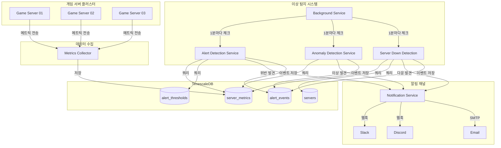
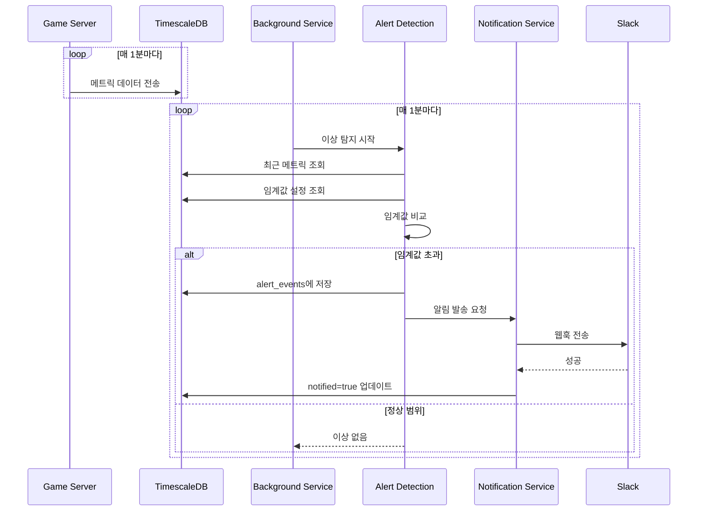

# 온라인 게임 서버를 위한 TimescaleDB 완벽 가이드  

저자: 최흥배, Claude AI   
    
권장 개발 환경
- **IDE**: Visual Studio 2022 (Community 이상)
- **.NET**: 9 이상
- **OS**: Windows 10 이상

-----  
  
# Chapter 12: 실시간 이상 탐지 시스템

게임 서버를 운영하다 보면 예상치 못한 순간에 문제가 발생한다. 갑자기 접속자가 폭증하거나, API 오류율이 급증하거나, 특정 지역의 서버 응답 시간이 느려지는 등 다양한 이상 징후가 나타난다. 이런 문제를 사람이 24시간 모니터링하며 발견하기는 불가능하다. 바로 이때 필요한 것이 **실시간 이상 탐지 시스템(Anomaly Detection System)**이다.

이 장에서는 TimescaleDB의 시계열 분석 기능과 C#을 결합하여, 게임 서버의 이상 징후를 자동으로 감지하고 즉시 알림을 보내는 시스템을 구축한다. 단순한 임계값 비교부터 통계적 분석 기법까지, 실전에서 바로 사용할 수 있는 다양한 패턴을 배운다.

---

## 12.1 이상 탐지 패턴

이상 탐지는 정상 범위를 벗어난 데이터를 찾는 것이다. 게임 서버 모니터링에서 자주 사용하는 이상 탐지 패턴은 크게 세 가지로 나눌 수 있다.

**정적 임계값 탐지(Static Threshold Detection)**는 가장 단순하지만 효과적인 방법이다. CPU 사용률이 90%를 넘거나, 메모리 사용량이 8GB를 초과하는 등 미리 정의한 고정된 기준값을 넘으면 이상으로 판단한다. 구현이 쉽고 이해하기 직관적이지만, 서버의 정상적인 부하 변동 패턴을 고려하지 못한다는 단점이 있다.

**동적 임계값 탐지(Dynamic Threshold Detection)**는 과거 데이터의 패턴을 학습하여 임계값을 자동으로 조정한다. 예를 들어 평일 낮 시간대와 주말 밤 시간대의 접속자 수는 크게 다르다. 이동 평균(Moving Average)이나 표준편차를 활용하여, 시간대별로 다른 기준을 적용할 수 있다. 평소 패턴에서 크게 벗어난 경우에만 알림을 보내므로 오탐(False Positive)을 줄일 수 있다.

**변화율 탐지(Rate of Change Detection)**는 값 자체보다 변화 속도에 주목한다. API 응답 시간이 평소 50ms에서 500ms로 급격히 증가했다면, 절대값보다는 10배라는 변화율이 더 의미 있는 지표다. 오류 건수가 분당 5건에서 50건으로 급증하는 것도 마찬가지다. 이 방식은 시스템의 갑작스러운 상태 변화를 빠르게 포착한다.

실전에서는 이 세 가지 패턴을 조합하여 사용한다. 예를 들어 CPU 사용률은 정적 임계값으로, 접속자 수는 동적 임계값으로, 오류율은 변화율로 감시하는 식이다.

---

## 12.2 임계값 기반 알림

가장 기본적인 이상 탐지 시스템을 구축해보자. 서버 성능 메트릭을 실시간으로 체크하여 임계값을 초과하면 알림을 발생시킨다.

먼저 임계값 설정 테이블을 생성한다. 이 테이블에는 각 메트릭별로 어떤 조건에서 알림을 보낼지 정의한다.

```sql
-- 임계값 설정 테이블
CREATE TABLE alert_thresholds (
    id SERIAL PRIMARY KEY,
    metric_name TEXT NOT NULL,
    comparison_operator TEXT NOT NULL, -- '>', '<', '>=', '<=', '='
    threshold_value DOUBLE PRECISION NOT NULL,
    severity TEXT NOT NULL, -- 'critical', 'warning', 'info'
    message_template TEXT NOT NULL,
    enabled BOOLEAN DEFAULT true,
    created_at TIMESTAMPTZ DEFAULT NOW()
);

-- 초기 임계값 설정
INSERT INTO alert_thresholds (metric_name, comparison_operator, threshold_value, severity, message_template)
VALUES 
    ('cpu_usage', '>', 90.0, 'critical', 'CPU 사용률이 {value}%로 임계값 {threshold}%를 초과했습니다.'),
    ('memory_usage_gb', '>', 7.5, 'warning', '메모리 사용량이 {value}GB로 임계값 {threshold}GB를 초과했습니다.'),
    ('api_error_rate', '>', 5.0, 'critical', 'API 오류율이 {value}%로 임계값 {threshold}%를 초과했습니다.'),
    ('response_time_ms', '>', 1000, 'warning', 'API 응답 시간이 {value}ms로 임계값 {threshold}ms를 초과했습니다.');
```

알림 이벤트를 저장할 테이블도 생성한다. 발생한 모든 알림을 기록하여 나중에 분석할 수 있다.

```sql
-- 알림 이벤트 테이블
CREATE TABLE alert_events (
    id BIGSERIAL PRIMARY KEY,
    occurred_at TIMESTAMPTZ NOT NULL,
    metric_name TEXT NOT NULL,
    server_id TEXT NOT NULL,
    threshold_value DOUBLE PRECISION NOT NULL,
    actual_value DOUBLE PRECISION NOT NULL,
    severity TEXT NOT NULL,
    message TEXT NOT NULL,
    is_resolved BOOLEAN DEFAULT false,
    resolved_at TIMESTAMPTZ,
    notified BOOLEAN DEFAULT false
);

-- Hypertable로 변환
SELECT create_hypertable('alert_events', 'occurred_at');

-- 인덱스 생성
CREATE INDEX idx_alert_events_server_metric ON alert_events (server_id, metric_name, occurred_at DESC);
CREATE INDEX idx_alert_events_unresolved ON alert_events (is_resolved, occurred_at DESC) WHERE is_resolved = false;
```

이제 실시간으로 임계값을 체크하는 쿼리를 작성한다. 최근 5분간의 평균값을 계산하여 임계값과 비교한다.

```sql
-- 최근 5분간 임계값 초과 체크
WITH recent_metrics AS (
    SELECT 
        server_id,
        'cpu_usage' as metric_name,
        AVG(cpu_usage) as avg_value,
        MAX(timestamp) as last_timestamp
    FROM server_metrics
    WHERE timestamp > NOW() - INTERVAL '5 minutes'
    GROUP BY server_id
),
threshold_violations AS (
    SELECT 
        rm.server_id,
        rm.metric_name,
        rm.avg_value as actual_value,
        at.threshold_value,
        at.severity,
        at.message_template,
        rm.last_timestamp
    FROM recent_metrics rm
    INNER JOIN alert_thresholds at ON at.metric_name = rm.metric_name
    WHERE at.enabled = true
        AND (
            (at.comparison_operator = '>' AND rm.avg_value > at.threshold_value) OR
            (at.comparison_operator = '<' AND rm.avg_value < at.threshold_value) OR
            (at.comparison_operator = '>=' AND rm.avg_value >= at.threshold_value) OR
            (at.comparison_operator = '<=' AND rm.avg_value <= at.threshold_value)
        )
        -- 중복 알림 방지: 최근 10분 이내 동일 알림이 없는 경우만
        AND NOT EXISTS (
            SELECT 1 
            FROM alert_events ae 
            WHERE ae.server_id = rm.server_id 
                AND ae.metric_name = rm.metric_name
                AND ae.is_resolved = false
                AND ae.occurred_at > NOW() - INTERVAL '10 minutes'
        )
)
SELECT * FROM threshold_violations;
```

이 쿼리는 중복 알림을 방지하는 로직도 포함한다. 같은 서버의 같은 메트릭에 대해 10분 이내에 이미 미해결 알림이 있으면 새 알림을 생성하지 않는다.

C#으로 이 로직을 구현해보자. SQLKata를 사용하여 임계값 체크 쿼리를 작성한다.

```csharp
using SqlKata;
using SqlKata.Execution;
using Npgsql;
using System;
using System.Collections.Generic;
using System.Linq;
using System.Threading.Tasks;

public class AlertThreshold
{
    public int Id { get; set; }
    public string MetricName { get; set; }
    public string ComparisonOperator { get; set; }
    public double ThresholdValue { get; set; }
    public string Severity { get; set; }
    public string MessageTemplate { get; set; }
    public bool Enabled { get; set; }
}

public class AlertEvent
{
    public long Id { get; set; }
    public DateTime OccurredAt { get; set; }
    public string MetricName { get; set; }
    public string ServerId { get; set; }
    public double ThresholdValue { get; set; }
    public double ActualValue { get; set; }
    public string Severity { get; set; }
    public string Message { get; set; }
    public bool IsResolved { get; set; }
    public DateTime? ResolvedAt { get; set; }
    public bool Notified { get; set; }
}

public class AlertDetectionService
{
    private readonly QueryFactory _db;

    public AlertDetectionService(QueryFactory db)
    {
        _db = db;
    }

    // CPU 사용률 임계값 체크
    public async Task<List<AlertEvent>> CheckCpuUsageThresholdsAsync()
    {
        var violations = new List<AlertEvent>();

        // 임계값 설정 조회
        var thresholds = await _db.Query("alert_thresholds")
            .Where("metric_name", "cpu_usage")
            .Where("enabled", true)
            .GetAsync<AlertThreshold>();

        foreach (var threshold in thresholds)
        {
            // 최근 5분간 서버별 평균 CPU 사용률 계산
            var query = _db.Query("server_metrics")
                .Select("server_id")
                .SelectRaw("AVG(cpu_usage) as avg_value")
                .SelectRaw("MAX(timestamp) as last_timestamp")
                .Where("timestamp", ">", DateTime.UtcNow.AddMinutes(-5))
                .GroupBy("server_id");

            // 임계값 조건 적용
            query = ApplyThresholdCondition(query, "AVG(cpu_usage)", 
                threshold.ComparisonOperator, threshold.ThresholdValue);

            var results = await query.GetAsync();

            foreach (var result in results)
            {
                var serverId = result.server_id;
                var avgValue = (double)result.avg_value;
                var lastTimestamp = (DateTime)result.last_timestamp;

                // 중복 알림 체크
                var existingAlert = await _db.Query("alert_events")
                    .Where("server_id", serverId)
                    .Where("metric_name", "cpu_usage")
                    .Where("is_resolved", false)
                    .Where("occurred_at", ">", DateTime.UtcNow.AddMinutes(-10))
                    .FirstOrDefaultAsync();

                if (existingAlert == null)
                {
                    // 알림 메시지 생성
                    var message = threshold.MessageTemplate
                        .Replace("{value}", avgValue.ToString("F2"))
                        .Replace("{threshold}", threshold.ThresholdValue.ToString("F2"));

                    var alertEvent = new AlertEvent
                    {
                        OccurredAt = lastTimestamp,
                        MetricName = "cpu_usage",
                        ServerId = serverId,
                        ThresholdValue = threshold.ThresholdValue,
                        ActualValue = avgValue,
                        Severity = threshold.Severity,
                        Message = message,
                        IsResolved = false,
                        Notified = false
                    };

                    violations.Add(alertEvent);
                }
            }
        }

        return violations;
    }

    // 임계값 조건을 쿼리에 적용
    private Query ApplyThresholdCondition(Query query, string column, 
        string comparisonOperator, double threshold)
    {
        return comparisonOperator switch
        {
            ">" => query.Having(column, ">", threshold),
            "<" => query.Having(column, "<", threshold),
            ">=" => query.Having(column, ">=", threshold),
            "<=" => query.Having(column, "<=", threshold),
            "=" => query.Having(column, "=", threshold),
            _ => query
        };
    }

    // 알림 이벤트 저장
    public async Task<long> SaveAlertEventAsync(AlertEvent alertEvent)
    {
        var id = await _db.Query("alert_events").InsertGetIdAsync<long>(new
        {
            occurred_at = alertEvent.OccurredAt,
            metric_name = alertEvent.MetricName,
            server_id = alertEvent.ServerId,
            threshold_value = alertEvent.ThresholdValue,
            actual_value = alertEvent.ActualValue,
            severity = alertEvent.Severity,
            message = alertEvent.Message,
            is_resolved = alertEvent.IsResolved,
            notified = alertEvent.Notified
        });

        return id;
    }

    // 알림 해결 처리
    public async Task ResolveAlertAsync(long alertId)
    {
        await _db.Query("alert_events")
            .Where("id", alertId)
            .UpdateAsync(new
            {
                is_resolved = true,
                resolved_at = DateTime.UtcNow
            });
    }
}
```

이 서비스를 주기적으로 실행하는 백그라운드 작업을 만든다.

```csharp
using System;
using System.Threading;
using System.Threading.Tasks;
using Microsoft.Extensions.Hosting;
using Microsoft.Extensions.Logging;

public class AlertMonitoringBackgroundService : BackgroundService
{
    private readonly ILogger<AlertMonitoringBackgroundService> _logger;
    private readonly AlertDetectionService _alertService;
    private readonly AlertNotificationService _notificationService;
    private readonly TimeSpan _checkInterval = TimeSpan.FromMinutes(1);

    public AlertMonitoringBackgroundService(
        ILogger<AlertMonitoringBackgroundService> logger,
        AlertDetectionService alertService,
        AlertNotificationService notificationService)
    {
        _logger = logger;
        _alertService = alertService;
        _notificationService = notificationService;
    }

    protected override async Task ExecuteAsync(CancellationToken stoppingToken)
    {
        _logger.LogInformation("Alert Monitoring Service 시작");

        while (!stoppingToken.IsCancellationRequested)
        {
            try
            {
                await CheckAlertsAsync();
            }
            catch (Exception ex)
            {
                _logger.LogError(ex, "알림 체크 중 오류 발생");
            }

            await Task.Delay(_checkInterval, stoppingToken);
        }

        _logger.LogInformation("Alert Monitoring Service 종료");
    }

    private async Task CheckAlertsAsync()
    {
        _logger.LogDebug("임계값 체크 시작");

        // CPU 사용률 체크
        var cpuViolations = await _alertService.CheckCpuUsageThresholdsAsync();
        
        foreach (var violation in cpuViolations)
        {
            // 알림 이벤트 저장
            var alertId = await _alertService.SaveAlertEventAsync(violation);
            violation.Id = alertId;

            // 알림 발송
            await _notificationService.SendAlertAsync(violation);

            _logger.LogWarning(
                "알림 발생 - 서버: {ServerId}, 메트릭: {MetricName}, 값: {ActualValue}, 임계값: {ThresholdValue}",
                violation.ServerId, violation.MetricName, 
                violation.ActualValue, violation.ThresholdValue);
        }

        _logger.LogDebug("임계값 체크 완료 - {Count}건의 알림 발생", cpuViolations.Count);
    }
}
```

---

## 12.3 이동 평균을 활용한 동적 임계값

정적 임계값은 간단하지만, 시간대별 부하 패턴이 다른 게임 서버에는 적합하지 않다. 주말 저녁에는 접속자가 10,000명이 정상이지만 평일 새벽에는 1,000명이 정상일 수 있다. 이럴 때는 **이동 평균(Moving Average)**과 **표준편차(Standard Deviation)**를 활용한 동적 임계값이 효과적이다.

동적 임계값의 기본 아이디어는 "평소와 얼마나 다른가"를 판단하는 것이다. 최근 7일간 같은 시간대의 평균값과 표준편차를 계산한 뒤, 현재 값이 평균에서 표준편차의 N배 이상 벗어났으면 이상으로 판단한다. 이를 Z-Score라고 한다.

$$\text{Z-Score} = \frac{\text{현재값} - \text{평균}}{\text{표준편차}}$$

Z-Score의 절대값이 2보다 크면 상위/하위 5% 수준으로 드문 일이고, 3보다 크면 상위/하위 0.3% 수준으로 매우 드문 일이다.

TimescaleDB에서 이동 평균과 표준편차를 계산하는 쿼리를 작성해보자.

```sql
-- 최근 7일간 같은 시간대의 통계 계산 및 이상 탐지
WITH current_metrics AS (
    -- 현재 시점(최근 5분)의 메트릭
    SELECT 
        server_id,
        AVG(cpu_usage) as current_cpu,
        AVG(memory_usage_gb) as current_memory,
        AVG(active_connections) as current_connections
    FROM server_metrics
    WHERE timestamp > NOW() - INTERVAL '5 minutes'
    GROUP BY server_id
),
historical_stats AS (
    -- 최근 7일간 같은 시간대(±30분)의 통계
    SELECT 
        server_id,
        AVG(cpu_usage) as avg_cpu,
        STDDEV(cpu_usage) as stddev_cpu,
        AVG(memory_usage_gb) as avg_memory,
        STDDEV(memory_usage_gb) as stddev_memory,
        AVG(active_connections) as avg_connections,
        STDDEV(active_connections) as stddev_connections
    FROM server_metrics
    WHERE timestamp > NOW() - INTERVAL '7 days'
        AND timestamp < NOW() - INTERVAL '5 minutes'
        -- 같은 시간대 필터링: 현재 시각 ± 30분
        AND EXTRACT(HOUR FROM timestamp) * 60 + EXTRACT(MINUTE FROM timestamp)
            BETWEEN 
                EXTRACT(HOUR FROM NOW()) * 60 + EXTRACT(MINUTE FROM NOW()) - 30
                AND
                EXTRACT(HOUR FROM NOW()) * 60 + EXTRACT(MINUTE FROM NOW()) + 30
    GROUP BY server_id
),
anomaly_scores AS (
    SELECT 
        cm.server_id,
        cm.current_cpu,
        hs.avg_cpu,
        hs.stddev_cpu,
        -- CPU Z-Score 계산 (표준편차가 0이 아닐 때만)
        CASE 
            WHEN hs.stddev_cpu > 0 THEN (cm.current_cpu - hs.avg_cpu) / hs.stddev_cpu
            ELSE 0
        END as cpu_zscore,
        cm.current_memory,
        hs.avg_memory,
        hs.stddev_memory,
        CASE 
            WHEN hs.stddev_memory > 0 THEN (cm.current_memory - hs.avg_memory) / hs.stddev_memory
            ELSE 0
        END as memory_zscore,
        cm.current_connections,
        hs.avg_connections,
        hs.stddev_connections,
        CASE 
            WHEN hs.stddev_connections > 0 THEN (cm.current_connections - hs.avg_connections) / hs.stddev_connections
            ELSE 0
        END as connections_zscore
    FROM current_metrics cm
    INNER JOIN historical_stats hs ON cm.server_id = hs.server_id
)
SELECT 
    server_id,
    current_cpu,
    avg_cpu,
    cpu_zscore,
    CASE 
        WHEN ABS(cpu_zscore) > 3 THEN 'critical'
        WHEN ABS(cpu_zscore) > 2 THEN 'warning'
        ELSE 'normal'
    END as cpu_status,
    current_memory,
    avg_memory,
    memory_zscore,
    CASE 
        WHEN ABS(memory_zscore) > 3 THEN 'critical'
        WHEN ABS(memory_zscore) > 2 THEN 'warning'
        ELSE 'normal'
    END as memory_status,
    current_connections,
    avg_connections,
    connections_zscore,
    CASE 
        WHEN ABS(connections_zscore) > 3 THEN 'critical'
        WHEN ABS(connections_zscore) > 2 THEN 'warning'
        ELSE 'normal'
    END as connections_status
FROM anomaly_scores
WHERE ABS(cpu_zscore) > 2 
    OR ABS(memory_zscore) > 2 
    OR ABS(connections_zscore) > 2
ORDER BY server_id;
```

이 쿼리는 최근 7일간 같은 시간대의 데이터를 기준으로 현재 값이 얼마나 비정상적인지 판단한다. 예를 들어 평소 이 시간대에 CPU 사용률이 평균 50%, 표준편차 10%였는데 현재 80%라면 Z-Score는 3.0으로 매우 이상한 수준이다.

C#으로 이를 구현해보자.

```csharp
public class AnomalyScore
{
    public string ServerId { get; set; }
    public double CurrentValue { get; set; }
    public double AvgValue { get; set; }
    public double StddevValue { get; set; }
    public double ZScore { get; set; }
    public string Status { get; set; }
}

public class DynamicAnomalyDetectionService
{
    private readonly QueryFactory _db;

    public DynamicAnomalyDetectionService(QueryFactory db)
    {
        _db = db;
    }

    // CPU 사용률 이상 탐지 (동적 임계값)
    public async Task<List<AnomalyScore>> DetectCpuAnomaliesAsync()
    {
        var sql = @"
WITH current_metrics AS (
    SELECT 
        server_id,
        AVG(cpu_usage) as current_cpu
    FROM server_metrics
    WHERE timestamp > NOW() - INTERVAL '5 minutes'
    GROUP BY server_id
),
historical_stats AS (
    SELECT 
        server_id,
        AVG(cpu_usage) as avg_cpu,
        STDDEV(cpu_usage) as stddev_cpu
    FROM server_metrics
    WHERE timestamp > NOW() - INTERVAL '7 days'
        AND timestamp < NOW() - INTERVAL '5 minutes'
        AND EXTRACT(HOUR FROM timestamp) * 60 + EXTRACT(MINUTE FROM timestamp)
            BETWEEN 
                EXTRACT(HOUR FROM NOW()) * 60 + EXTRACT(MINUTE FROM NOW()) - 30
                AND
                EXTRACT(HOUR FROM NOW()) * 60 + EXTRACT(MINUTE FROM NOW()) + 30
    GROUP BY server_id
),
anomaly_scores AS (
    SELECT 
        cm.server_id,
        cm.current_cpu as current_value,
        hs.avg_cpu as avg_value,
        hs.stddev_cpu as stddev_value,
        CASE 
            WHEN hs.stddev_cpu > 0 THEN (cm.current_cpu - hs.avg_cpu) / hs.stddev_cpu
            ELSE 0
        END as zscore
    FROM current_metrics cm
    INNER JOIN historical_stats hs ON cm.server_id = hs.server_id
)
SELECT 
    server_id,
    current_value,
    avg_value,
    stddev_value,
    zscore,
    CASE 
        WHEN ABS(zscore) > 3 THEN 'critical'
        WHEN ABS(zscore) > 2 THEN 'warning'
        ELSE 'normal'
    END as status
FROM anomaly_scores
WHERE ABS(zscore) > 2
ORDER BY ABS(zscore) DESC";

        var results = await _db.StatementAsync<AnomalyScore>(sql);
        return results.ToList();
    }

    // 여러 메트릭을 한 번에 체크
    public async Task<Dictionary<string, List<AnomalyScore>>> DetectAllAnomaliesAsync()
    {
        var results = new Dictionary<string, List<AnomalyScore>>();

        // CPU, 메모리, 연결 수 등 여러 메트릭 체크
        results["cpu_usage"] = await DetectMetricAnomaliesAsync("cpu_usage");
        results["memory_usage_gb"] = await DetectMetricAnomaliesAsync("memory_usage_gb");
        results["active_connections"] = await DetectMetricAnomaliesAsync("active_connections");
        results["api_response_time_ms"] = await DetectMetricAnomaliesAsync("api_response_time_ms");

        return results;
    }

    // 범용 메트릭 이상 탐지
    private async Task<List<AnomalyScore>> DetectMetricAnomaliesAsync(string metricColumn)
    {
        var sql = $@"
WITH current_metrics AS (
    SELECT 
        server_id,
        AVG({metricColumn}) as current_value
    FROM server_metrics
    WHERE timestamp > NOW() - INTERVAL '5 minutes'
    GROUP BY server_id
),
historical_stats AS (
    SELECT 
        server_id,
        AVG({metricColumn}) as avg_value,
        STDDEV({metricColumn}) as stddev_value
    FROM server_metrics
    WHERE timestamp > NOW() - INTERVAL '7 days'
        AND timestamp < NOW() - INTERVAL '5 minutes'
        AND EXTRACT(HOUR FROM timestamp) * 60 + EXTRACT(MINUTE FROM timestamp)
            BETWEEN 
                EXTRACT(HOUR FROM NOW()) * 60 + EXTRACT(MINUTE FROM NOW()) - 30
                AND
                EXTRACT(HOUR FROM NOW()) * 60 + EXTRACT(MINUTE FROM NOW()) + 30
    GROUP BY server_id
    HAVING STDDEV({metricColumn}) > 0
),
anomaly_scores AS (
    SELECT 
        cm.server_id,
        cm.current_value,
        hs.avg_value,
        hs.stddev_value,
        (cm.current_value - hs.avg_value) / hs.stddev_value as zscore
    FROM current_metrics cm
    INNER JOIN historical_stats hs ON cm.server_id = hs.server_id
)
SELECT 
    server_id,
    current_value,
    avg_value,
    stddev_value,
    zscore,
    CASE 
        WHEN ABS(zscore) > 3 THEN 'critical'
        WHEN ABS(zscore) > 2 THEN 'warning'
        ELSE 'normal'
    END as status
FROM anomaly_scores
WHERE ABS(zscore) > 2
ORDER BY ABS(zscore) DESC";

        var results = await _db.StatementAsync<AnomalyScore>(sql);
        return results.ToList();
    }
}
```

동적 임계값은 계절성이나 주기적 패턴이 있는 데이터에 특히 효과적이다. 주말과 평일, 낮과 밤의 차이가 큰 게임 서버 환경에서 오탐을 크게 줄일 수 있다.

---

## 12.4 C#으로 알림 시스템 구현

이상을 감지했으면 담당자에게 즉시 알려야 한다. 이메일, SMS, Slack, Discord 등 다양한 채널로 알림을 보낼 수 있지만, 여기서는 가장 실용적인 방법인 Slack과 Discord 웹훅을 다룬다.

먼저 알림 서비스의 인터페이스를 정의한다.

```csharp
public interface INotificationChannel
{
    Task SendAsync(AlertEvent alertEvent);
}

public class AlertNotificationService
{
    private readonly List<INotificationChannel> _channels;
    private readonly ILogger<AlertNotificationService> _logger;
    private readonly QueryFactory _db;

    public AlertNotificationService(
        IEnumerable<INotificationChannel> channels,
        ILogger<AlertNotificationService> logger,
        QueryFactory db)
    {
        _channels = channels.ToList();
        _logger = logger;
        _db = db;
    }

    public async Task SendAlertAsync(AlertEvent alertEvent)
    {
        try
        {
            // 모든 채널로 알림 발송
            var tasks = _channels.Select(channel => channel.SendAsync(alertEvent));
            await Task.WhenAll(tasks);

            // 알림 발송 완료 표시
            await _db.Query("alert_events")
                .Where("id", alertEvent.Id)
                .UpdateAsync(new { notified = true });

            _logger.LogInformation(
                "알림 발송 완료 - ID: {AlertId}, 채널 수: {ChannelCount}",
                alertEvent.Id, _channels.Count);
        }
        catch (Exception ex)
        {
            _logger.LogError(ex, "알림 발송 실패 - ID: {AlertId}", alertEvent.Id);
            throw;
        }
    }
}
```

콘솔 로그로 알림을 출력하는 간단한 채널을 만들어보자.

```csharp
public class ConsoleNotificationChannel : INotificationChannel
{
    private readonly ILogger<ConsoleNotificationChannel> _logger;

    public ConsoleNotificationChannel(ILogger<ConsoleNotificationChannel> logger)
    {
        _logger = logger;
    }

    public Task SendAsync(AlertEvent alertEvent)
    {
        var severityColor = alertEvent.Severity switch
        {
            "critical" => ConsoleColor.Red,
            "warning" => ConsoleColor.Yellow,
            "info" => ConsoleColor.Cyan,
            _ => ConsoleColor.White
        };

        var originalColor = Console.ForegroundColor;
        Console.ForegroundColor = severityColor;

        Console.WriteLine("═══════════════════════════════════════");
        Console.WriteLine($"🚨 알림 발생 [{alertEvent.Severity.ToUpper()}]");
        Console.WriteLine($"시간: {alertEvent.OccurredAt:yyyy-MM-dd HH:mm:ss}");
        Console.WriteLine($"서버: {alertEvent.ServerId}");
        Console.WriteLine($"메트릭: {alertEvent.MetricName}");
        Console.WriteLine($"메시지: {alertEvent.Message}");
        Console.WriteLine("═══════════════════════════════════════");

        Console.ForegroundColor = originalColor;

        return Task.CompletedTask;
    }
}
```

이제 실전에서 많이 사용하는 이메일 알림 채널을 구현한다.

```csharp
using System.Net;
using System.Net.Mail;

public class EmailNotificationChannel : INotificationChannel
{
    private readonly ILogger<EmailNotificationChannel> _logger;
    private readonly SmtpClient _smtpClient;
    private readonly string _fromEmail;
    private readonly string _toEmail;

    public EmailNotificationChannel(
        ILogger<EmailNotificationChannel> logger,
        string smtpHost,
        int smtpPort,
        string username,
        string password,
        string fromEmail,
        string toEmail)
    {
        _logger = logger;
        _fromEmail = fromEmail;
        _toEmail = toEmail;

        _smtpClient = new SmtpClient(smtpHost, smtpPort)
        {
            EnableSsl = true,
            Credentials = new NetworkCredential(username, password)
        };
    }

    public async Task SendAsync(AlertEvent alertEvent)
    {
        try
        {
            var subject = $"[{alertEvent.Severity.ToUpper()}] {alertEvent.ServerId} - {alertEvent.MetricName}";
            var body = $@"
<html>
<body>
    <h2 style='color: {GetSeverityColor(alertEvent.Severity)};'>알림 발생</h2>
    <table style='border-collapse: collapse; width: 100%;'>
        <tr>
            <td style='border: 1px solid #ddd; padding: 8px; font-weight: bold;'>발생 시간</td>
            <td style='border: 1px solid #ddd; padding: 8px;'>{alertEvent.OccurredAt:yyyy-MM-dd HH:mm:ss}</td>
        </tr>
        <tr>
            <td style='border: 1px solid #ddd; padding: 8px; font-weight: bold;'>서버 ID</td>
            <td style='border: 1px solid #ddd; padding: 8px;'>{alertEvent.ServerId}</td>
        </tr>
        <tr>
            <td style='border: 1px solid #ddd; padding: 8px; font-weight: bold;'>메트릭</td>
            <td style='border: 1px solid #ddd; padding: 8px;'>{alertEvent.MetricName}</td>
        </tr>
        <tr>
            <td style='border: 1px solid #ddd; padding: 8px; font-weight: bold;'>현재 값</td>
            <td style='border: 1px solid #ddd; padding: 8px;'>{alertEvent.ActualValue:F2}</td>
        </tr>
        <tr>
            <td style='border: 1px solid #ddd; padding: 8px; font-weight: bold;'>임계값</td>
            <td style='border: 1px solid #ddd; padding: 8px;'>{alertEvent.ThresholdValue:F2}</td>
        </tr>
        <tr>
            <td style='border: 1px solid #ddd; padding: 8px; font-weight: bold;'>메시지</td>
            <td style='border: 1px solid #ddd; padding: 8px;'>{alertEvent.Message}</td>
        </tr>
    </table>
</body>
</html>";

            var mailMessage = new MailMessage(_fromEmail, _toEmail, subject, body)
            {
                IsBodyHtml = true
            };

            await _smtpClient.SendMailAsync(mailMessage);

            _logger.LogInformation("이메일 알림 발송 완료 - {To}", _toEmail);
        }
        catch (Exception ex)
        {
            _logger.LogError(ex, "이메일 발송 실패");
            throw;
        }
    }

    private string GetSeverityColor(string severity)
    {
        return severity switch
        {
            "critical" => "#dc3545",
            "warning" => "#ffc107",
            "info" => "#17a2b8",
            _ => "#6c757d"
        };
    }
}
```

---

## 12.5 Slack/Discord 웹훅 연동

실시간 알림에는 이메일보다 Slack이나 Discord가 더 효과적이다. 팀원들이 항상 켜놓은 메신저로 즉시 알림을 받을 수 있고, 대화형으로 문제를 논의할 수 있기 때문이다.

**Slack 웹훅 설정하기**

먼저 Slack에서 Incoming Webhook을 생성한다.

```
1. Slack 워크스페이스에 로그인
2. https://api.slack.com/apps 에서 'Create New App' 클릭
3. 'From scratch' 선택하고 앱 이름 입력 (예: Game Server Alerts)
4. Workspace 선택
5. 좌측 메뉴에서 'Incoming Webhooks' 선택
6. 'Activate Incoming Webhooks' 토글 켜기
7. 'Add New Webhook to Workspace' 클릭
8. 알림을 받을 채널 선택 (예: #server-alerts)
9. Webhook URL 복사 (예: https://hooks.slack.com/services/T00000000/B00000000/XXXXXXXXXXXX)
```

이제 C#으로 Slack 알림 채널을 구현한다.

```csharp
using System.Net.Http;
using System.Text;
using System.Text.Json;

public class SlackNotificationChannel : INotificationChannel
{
    private readonly HttpClient _httpClient;
    private readonly string _webhookUrl;
    private readonly ILogger<SlackNotificationChannel> _logger;

    public SlackNotificationChannel(
        HttpClient httpClient,
        string webhookUrl,
        ILogger<SlackNotificationChannel> logger)
    {
        _httpClient = httpClient;
        _webhookUrl = webhookUrl;
        _logger = logger;
    }

    public async Task SendAsync(AlertEvent alertEvent)
    {
        try
        {
            var payload = new
            {
                username = "Game Server Monitor",
                icon_emoji = GetSeverityEmoji(alertEvent.Severity),
                attachments = new[]
                {
                    new
                    {
                        color = GetSeverityColor(alertEvent.Severity),
                        title = $"🚨 {alertEvent.Severity.ToUpper()} Alert",
                        fields = new[]
                        {
                            new { title = "서버", value = alertEvent.ServerId, @short = true },
                            new { title = "메트릭", value = alertEvent.MetricName, @short = true },
                            new { title = "현재 값", value = $"{alertEvent.ActualValue:F2}", @short = true },
                            new { title = "임계값", value = $"{alertEvent.ThresholdValue:F2}", @short = true },
                            new { title = "메시지", value = alertEvent.Message, @short = false }
                        },
                        footer = "TimescaleDB Alert System",
                        ts = ((DateTimeOffset)alertEvent.OccurredAt).ToUnixTimeSeconds()
                    }
                }
            };

            var json = JsonSerializer.Serialize(payload);
            var content = new StringContent(json, Encoding.UTF8, "application/json");

            var response = await _httpClient.PostAsync(_webhookUrl, content);
            response.EnsureSuccessStatusCode();

            _logger.LogInformation("Slack 알림 발송 완료");
        }
        catch (Exception ex)
        {
            _logger.LogError(ex, "Slack 알림 발송 실패");
            throw;
        }
    }

    private string GetSeverityEmoji(string severity)
    {
        return severity switch
        {
            "critical" => ":rotating_light:",
            "warning" => ":warning:",
            "info" => ":information_source:",
            _ => ":bell:"
        };
    }

    private string GetSeverityColor(string severity)
    {
        return severity switch
        {
            "critical" => "danger",
            "warning" => "warning",
            "info" => "good",
            _ => "#808080"
        };
    }
}
```

**Discord 웹훅 설정하기**

Discord도 유사하게 웹훅을 생성한다.

```
1. Discord 서버의 채널 설정 클릭
2. '연동' 메뉴 선택
3. '웹후크 보기' 클릭
4. '새 웹후크' 버튼 클릭
5. 웹후크 이름 입력 (예: Game Server Alerts)
6. '웹후크 URL 복사' 클릭
```

Discord 알림 채널을 구현한다.

```csharp
public class DiscordNotificationChannel : INotificationChannel
{
    private readonly HttpClient _httpClient;
    private readonly string _webhookUrl;
    private readonly ILogger<DiscordNotificationChannel> _logger;

    public DiscordNotificationChannel(
        HttpClient httpClient,
        string webhookUrl,
        ILogger<DiscordNotificationChannel> logger)
    {
        _httpClient = httpClient;
        _webhookUrl = webhookUrl;
        _logger = logger;
    }

    public async Task SendAsync(AlertEvent alertEvent)
    {
        try
        {
            var payload = new
            {
                username = "Game Server Monitor",
                avatar_url = "https://example.com/bot-avatar.png",
                embeds = new[]
                {
                    new
                    {
                        title = $"🚨 {alertEvent.Severity.ToUpper()} Alert",
                        description = alertEvent.Message,
                        color = GetSeverityColorCode(alertEvent.Severity),
                        fields = new[]
                        {
                            new { name = "서버", value = alertEvent.ServerId, inline = true },
                            new { name = "메트릭", value = alertEvent.MetricName, inline = true },
                            new { name = "현재 값", value = $"{alertEvent.ActualValue:F2}", inline = true },
                            new { name = "임계값", value = $"{alertEvent.ThresholdValue:F2}", inline = true }
                        },
                        footer = new
                        {
                            text = "TimescaleDB Alert System"
                        },
                        timestamp = alertEvent.OccurredAt.ToString("o")
                    }
                }
            };

            var json = JsonSerializer.Serialize(payload);
            var content = new StringContent(json, Encoding.UTF8, "application/json");

            var response = await _httpClient.PostAsync(_webhookUrl, content);
            response.EnsureSuccessStatusCode();

            _logger.LogInformation("Discord 알림 발송 완료");
        }
        catch (Exception ex)
        {
            _logger.LogError(ex, "Discord 알림 발송 실패");
            throw;
        }
    }

    private int GetSeverityColorCode(string severity)
    {
        // Discord 색상은 10진수 정수로 표현 (RGB를 합친 값)
        return severity switch
        {
            "critical" => 15158332, // 빨강 #dc3545
            "warning" => 16776960,  // 노랑 #ffff00
            "info" => 5814783,      // 파랑 #17a2b8
            _ => 8421504            // 회색 #808080
        };
    }
}
```

**알림 채널 등록하기**

`Program.cs` 또는 `Startup.cs`에서 알림 채널을 등록한다.

```csharp
using Microsoft.Extensions.DependencyInjection;
using Microsoft.Extensions.Configuration;

// appsettings.json에서 설정 읽기
var slackWebhookUrl = builder.Configuration["Notifications:Slack:WebhookUrl"];
var discordWebhookUrl = builder.Configuration["Notifications:Discord:WebhookUrl"];

// 알림 채널 등록
builder.Services.AddSingleton<INotificationChannel>(sp =>
    new ConsoleNotificationChannel(
        sp.GetRequiredService<ILogger<ConsoleNotificationChannel>>()));

if (!string.IsNullOrEmpty(slackWebhookUrl))
{
    builder.Services.AddSingleton<INotificationChannel>(sp =>
        new SlackNotificationChannel(
            sp.GetRequiredService<HttpClient>(),
            slackWebhookUrl,
            sp.GetRequiredService<ILogger<SlackNotificationChannel>>()));
}

if (!string.IsNullOrEmpty(discordWebhookUrl))
{
    builder.Services.AddSingleton<INotificationChannel>(sp =>
        new DiscordNotificationChannel(
            sp.GetRequiredService<HttpClient>(),
            discordWebhookUrl,
            sp.GetRequiredService<ILogger<DiscordNotificationChannel>>()));
}

// 알림 서비스 등록
builder.Services.AddSingleton<AlertNotificationService>();
builder.Services.AddSingleton<AlertDetectionService>();
builder.Services.AddSingleton<DynamicAnomalyDetectionService>();

// 백그라운드 서비스 등록
builder.Services.AddHostedService<AlertMonitoringBackgroundService>();
```

`appsettings.json`에 설정을 추가한다.

```json
{
  "Notifications": {
    "Slack": {
      "WebhookUrl": "https://hooks.slack.com/services/YOUR/WEBHOOK/URL"
    },
    "Discord": {
      "WebhookUrl": "https://discord.com/api/webhooks/YOUR/WEBHOOK/URL"
    },
    "Email": {
      "SmtpHost": "smtp.gmail.com",
      "SmtpPort": 587,
      "Username": "your-email@gmail.com",
      "Password": "your-app-password",
      "FromEmail": "alerts@yourcompany.com",
      "ToEmail": "admin@yourcompany.com"
    }
  }
}
```

---

## 12.6 실전: 서버 다운 자동 감지

이제 실전 시나리오를 구현해보자. 게임 서버가 다운되면 더 이상 메트릭 데이터가 수집되지 않는다. 이를 감지하여 즉시 알림을 보내는 시스템을 만든다.

서버가 살아있는지 확인하는 쿼리를 작성한다.

```sql
-- 최근 5분 이내에 데이터를 보낸 서버 목록
WITH recent_servers AS (
    SELECT DISTINCT server_id
    FROM server_metrics
    WHERE timestamp > NOW() - INTERVAL '5 minutes'
),
all_servers AS (
    -- 시스템에 등록된 모든 서버 (별도 테이블로 관리 필요)
    SELECT server_id FROM servers WHERE enabled = true
),
down_servers AS (
    SELECT 
        a.server_id,
        NOW() as checked_at,
        'Server is not sending metrics' as reason
    FROM all_servers a
    LEFT JOIN recent_servers r ON a.server_id = r.server_id
    WHERE r.server_id IS NULL
)
SELECT * FROM down_servers;
```

서버 목록을 관리하는 테이블을 생성한다.

```sql
-- 서버 등록 테이블
CREATE TABLE servers (
    server_id TEXT PRIMARY KEY,
    server_name TEXT NOT NULL,
    server_type TEXT NOT NULL, -- 'game', 'api', 'db', etc.
    region TEXT NOT NULL,
    enabled BOOLEAN DEFAULT true,
    expected_metric_interval_seconds INT DEFAULT 60,
    registered_at TIMESTAMPTZ DEFAULT NOW(),
    last_seen_at TIMESTAMPTZ
);

-- 샘플 데이터
INSERT INTO servers (server_id, server_name, server_type, region, expected_metric_interval_seconds)
VALUES 
    ('game-01', 'Game Server 01', 'game', 'us-west', 60),
    ('game-02', 'Game Server 02', 'game', 'us-east', 60),
    ('api-01', 'API Server 01', 'api', 'us-west', 30);

-- 마지막 확인 시각 업데이트 함수
CREATE OR REPLACE FUNCTION update_server_last_seen()
RETURNS TRIGGER AS $$
BEGIN
    UPDATE servers
    SET last_seen_at = NEW.timestamp
    WHERE server_id = NEW.server_id;
    RETURN NEW;
END;
$$ LANGUAGE plpgsql;

-- 트리거 생성 (메트릭이 들어올 때마다 last_seen_at 업데이트)
CREATE TRIGGER trigger_update_server_last_seen
AFTER INSERT ON server_metrics
FOR EACH ROW
EXECUTE FUNCTION update_server_last_seen();
```

C#으로 서버 다운 감지 서비스를 구현한다.

```csharp
public class ServerDownAlert
{
    public string ServerId { get; set; }
    public string ServerName { get; set; }
    public string ServerType { get; set; }
    public string Region { get; set; }
    public DateTime? LastSeenAt { get; set; }
    public int ExpectedIntervalSeconds { get; set; }
    public string Reason { get; set; }
}

public class ServerDownDetectionService
{
    private readonly QueryFactory _db;
    private readonly ILogger<ServerDownDetectionService> _logger;

    public ServerDownDetectionService(QueryFactory db, ILogger<ServerDownDetectionService> logger)
    {
        _db = db;
        _logger = logger;
    }

    public async Task<List<ServerDownAlert>> DetectDownServersAsync()
    {
        var downServers = new List<ServerDownAlert>();

        // 등록된 모든 활성 서버 조회
        var servers = await _db.Query("servers")
            .Where("enabled", true)
            .GetAsync();

        foreach (var server in servers)
        {
            var serverId = (string)server.server_id;
            var expectedInterval = (int)server.expected_metric_interval_seconds;
            var threshold = DateTime.UtcNow.AddSeconds(-expectedInterval * 2); // 2배 여유

            // 최근 메트릭 확인
            var recentMetric = await _db.Query("server_metrics")
                .Where("server_id", serverId)
                .Where("timestamp", ">", threshold)
                .OrderByDesc("timestamp")
                .FirstOrDefaultAsync();

            if (recentMetric == null)
            {
                // 서버가 다운된 것으로 판단
                var lastSeenAt = server.last_seen_at != null 
                    ? (DateTime?)server.last_seen_at 
                    : null;

                var downAlert = new ServerDownAlert
                {
                    ServerId = serverId,
                    ServerName = server.server_name,
                    ServerType = server.server_type,
                    Region = server.region,
                    LastSeenAt = lastSeenAt,
                    ExpectedIntervalSeconds = expectedInterval,
                    Reason = lastSeenAt.HasValue
                        ? $"마지막 확인: {lastSeenAt.Value:yyyy-MM-dd HH:mm:ss} (약 {(DateTime.UtcNow - lastSeenAt.Value).TotalMinutes:F0}분 전)"
                        : "메트릭 수신 기록 없음"
                };

                downServers.Add(downAlert);
            }
        }

        return downServers;
    }

    public async Task SendDownServerAlertsAsync()
    {
        var downServers = await DetectDownServersAsync();

        if (downServers.Count == 0)
        {
            _logger.LogDebug("모든 서버 정상 작동 중");
            return;
        }

        _logger.LogWarning("서버 다운 감지: {Count}대", downServers.Count);

        foreach (var downServer in downServers)
        {
            // 중복 알림 방지: 최근 30분 이내 동일 알림 확인
            var existingAlert = await _db.Query("alert_events")
                .Where("server_id", downServer.ServerId)
                .Where("metric_name", "server_down")
                .Where("is_resolved", false)
                .Where("occurred_at", ">", DateTime.UtcNow.AddMinutes(-30))
                .FirstOrDefaultAsync();

            if (existingAlert != null)
            {
                _logger.LogDebug("서버 {ServerId} 다운 알림 이미 발송됨", downServer.ServerId);
                continue;
            }

            // 알림 이벤트 생성
            var alertEvent = new AlertEvent
            {
                OccurredAt = DateTime.UtcNow,
                MetricName = "server_down",
                ServerId = downServer.ServerId,
                ThresholdValue = downServer.ExpectedIntervalSeconds,
                ActualValue = downServer.LastSeenAt.HasValue 
                    ? (DateTime.UtcNow - downServer.LastSeenAt.Value).TotalSeconds
                    : 0,
                Severity = "critical",
                Message = $"[{downServer.ServerType.ToUpper()}] {downServer.ServerName} ({downServer.Region}) 서버가 응답하지 않습니다. {downServer.Reason}",
                IsResolved = false,
                Notified = false
            };

            // 알림 저장 및 발송은 기존 AlertNotificationService 활용
            _logger.LogCritical(
                "서버 다운: {ServerName} ({ServerId}) - {Reason}",
                downServer.ServerName, downServer.ServerId, downServer.Reason);
        }
    }
}
```

백그라운드 서비스에 서버 다운 감지 추가한다.

```csharp
public class AlertMonitoringBackgroundService : BackgroundService
{
    private readonly ILogger<AlertMonitoringBackgroundService> _logger;
    private readonly AlertDetectionService _alertService;
    private readonly DynamicAnomalyDetectionService _anomalyService;
    private readonly ServerDownDetectionService _downDetectionService;
    private readonly AlertNotificationService _notificationService;
    private readonly TimeSpan _checkInterval = TimeSpan.FromMinutes(1);

    public AlertMonitoringBackgroundService(
        ILogger<AlertMonitoringBackgroundService> logger,
        AlertDetectionService alertService,
        DynamicAnomalyDetectionService anomalyService,
        ServerDownDetectionService downDetectionService,
        AlertNotificationService notificationService)
    {
        _logger = logger;
        _alertService = alertService;
        _anomalyService = anomalyService;
        _downDetectionService = downDetectionService;
        _notificationService = notificationService;
    }

    protected override async Task ExecuteAsync(CancellationToken stoppingToken)
    {
        _logger.LogInformation("Alert Monitoring Service 시작");

        while (!stoppingToken.IsCancellationRequested)
        {
            try
            {
                // 서버 다운 감지 (최우선)
                await _downDetectionService.SendDownServerAlertsAsync();

                // 임계값 기반 알림
                var cpuViolations = await _alertService.CheckCpuUsageThresholdsAsync();
                foreach (var violation in cpuViolations)
                {
                    var alertId = await _alertService.SaveAlertEventAsync(violation);
                    violation.Id = alertId;
                    await _notificationService.SendAlertAsync(violation);
                }

                // 동적 이상 탐지
                var anomalies = await _anomalyService.DetectAllAnomaliesAsync();
                foreach (var metricAnomalies in anomalies.Values)
                {
                    foreach (var anomaly in metricAnomalies)
                    {
                        var alertEvent = new AlertEvent
                        {
                            OccurredAt = DateTime.UtcNow,
                            MetricName = "anomaly_detected",
                            ServerId = anomaly.ServerId,
                            ThresholdValue = anomaly.AvgValue,
                            ActualValue = anomaly.CurrentValue,
                            Severity = anomaly.Status,
                            Message = $"이상 패턴 감지: 현재 {anomaly.CurrentValue:F2}, 평균 {anomaly.AvgValue:F2}, Z-Score {anomaly.ZScore:F2}",
                            IsResolved = false,
                            Notified = false
                        };

                        var alertId = await _alertService.SaveAlertEventAsync(alertEvent);
                        alertEvent.Id = alertId;
                        await _notificationService.SendAlertAsync(alertEvent);
                    }
                }
            }
            catch (Exception ex)
            {
                _logger.LogError(ex, "알림 체크 중 오류 발생");
            }

            await Task.Delay(_checkInterval, stoppingToken);
        }

        _logger.LogInformation("Alert Monitoring Service 종료");
    }
}
```

**시스템 아키텍처 시각화**

전체 이상 탐지 시스템의 구조를 머메이드 다이어그램으로 표현하면 다음과 같다.



**데이터 흐름 다이어그램**



---

**알림 대시보드 쿼리**

운영자가 발생한 알림을 확인할 수 있는 대시보드 쿼리를 작성한다.

```sql
-- 최근 24시간 알림 통계
SELECT 
    severity,
    COUNT(*) as alert_count,
    COUNT(DISTINCT server_id) as affected_servers,
    AVG(EXTRACT(EPOCH FROM (resolved_at - occurred_at))) as avg_resolution_time_seconds
FROM alert_events
WHERE occurred_at > NOW() - INTERVAL '24 hours'
GROUP BY severity
ORDER BY 
    CASE severity
        WHEN 'critical' THEN 1
        WHEN 'warning' THEN 2
        WHEN 'info' THEN 3
        ELSE 4
    END;

-- 미해결 알림 목록
SELECT 
    id,
    occurred_at,
    server_id,
    metric_name,
    severity,
    message,
    EXTRACT(EPOCH FROM (NOW() - occurred_at)) / 60 as minutes_since_occurred
FROM alert_events
WHERE is_resolved = false
ORDER BY 
    CASE severity
        WHEN 'critical' THEN 1
        WHEN 'warning' THEN 2
        WHEN 'info' THEN 3
        ELSE 4
    END,
    occurred_at ASC;

-- 서버별 알림 빈도 (문제 많은 서버 찾기)
SELECT 
    server_id,
    COUNT(*) as total_alerts,
    SUM(CASE WHEN severity = 'critical' THEN 1 ELSE 0 END) as critical_count,
    SUM(CASE WHEN severity = 'warning' THEN 1 ELSE 0 END) as warning_count,
    MAX(occurred_at) as last_alert_at
FROM alert_events
WHERE occurred_at > NOW() - INTERVAL '7 days'
GROUP BY server_id
ORDER BY total_alerts DESC
LIMIT 10;

-- 시간대별 알림 패턴 (언제 문제가 많이 발생하나?)
SELECT 
    EXTRACT(HOUR FROM occurred_at) as hour_of_day,
    COUNT(*) as alert_count,
    AVG(actual_value) as avg_value
FROM alert_events
WHERE occurred_at > NOW() - INTERVAL '7 days'
    AND metric_name = 'cpu_usage'
GROUP BY hour_of_day
ORDER BY hour_of_day;
```

---

**성능 최적화 팁**

이상 탐지 시스템은 1분마다 실행되므로 쿼리 성능이 매우 중요하다. 다음 최적화 기법을 적용한다.

첫째, 최근 데이터만 스캔하도록 시간 범위를 제한한다. TimescaleDB의 Hypertable은 시간 기반 파티셔닝을 자동으로 수행하므로, WHERE 절에 timestamp 조건을 반드시 포함해야 한다.

둘째, 자주 조회하는 조건에 복합 인덱스를 생성한다. server_id와 metric_name을 함께 조회하는 경우가 많으므로 복합 인덱스가 효과적이다.

```sql
CREATE INDEX idx_server_metrics_server_metric_time 
ON server_metrics (server_id, metric_name, timestamp DESC);
```

셋째, 연속 집계(Continuous Aggregate)를 활용하여 통계 계산을 미리 수행한다. 동적 임계값 계산에 사용하는 평균과 표준편차를 1시간 단위로 미리 계산해둔다.

```sql
-- 시간별 메트릭 통계 Continuous Aggregate
CREATE MATERIALIZED VIEW hourly_metric_stats
WITH (timescaledb.continuous) AS
SELECT 
    time_bucket('1 hour', timestamp) as bucket,
    server_id,
    AVG(cpu_usage) as avg_cpu,
    STDDEV(cpu_usage) as stddev_cpu,
    AVG(memory_usage_gb) as avg_memory,
    STDDEV(memory_usage_gb) as stddev_memory,
    AVG(active_connections) as avg_connections,
    STDDEV(active_connections) as stddev_connections
FROM server_metrics
GROUP BY bucket, server_id;

-- 자동 갱신 정책 (5분마다)
SELECT add_continuous_aggregate_policy('hourly_metric_stats',
    start_offset => INTERVAL '3 hours',
    end_offset => INTERVAL '5 minutes',
    schedule_interval => INTERVAL '5 minutes');
```

이제 동적 임계값 계산 쿼리를 이 Continuous Aggregate를 사용하도록 개선한다.

```sql
-- 최적화된 동적 임계값 쿼리
WITH current_metrics AS (
    SELECT 
        server_id,
        AVG(cpu_usage) as current_cpu
    FROM server_metrics
    WHERE timestamp > NOW() - INTERVAL '5 minutes'
    GROUP BY server_id
),
historical_stats AS (
    SELECT 
        server_id,
        AVG(avg_cpu) as avg_cpu,
        AVG(stddev_cpu) as stddev_cpu
    FROM hourly_metric_stats
    WHERE bucket > NOW() - INTERVAL '7 days'
        AND bucket < NOW() - INTERVAL '1 hour'
        AND EXTRACT(HOUR FROM bucket) 
            BETWEEN EXTRACT(HOUR FROM NOW()) - 1 
            AND EXTRACT(HOUR FROM NOW()) + 1
    GROUP BY server_id
    HAVING AVG(stddev_cpu) > 0
)
SELECT 
    cm.server_id,
    cm.current_cpu,
    hs.avg_cpu,
    hs.stddev_cpu,
    (cm.current_cpu - hs.avg_cpu) / hs.stddev_cpu as zscore
FROM current_metrics cm
INNER JOIN historical_stats hs ON cm.server_id = hs.server_id
WHERE ABS((cm.current_cpu - hs.avg_cpu) / hs.stddev_cpu) > 2;
```

이 최적화로 수백만 행을 스캔하던 쿼리가 미리 집계된 수천 행만 스캔하게 되어 성능이 크게 향상된다.

---

**정리**

이 장에서는 TimescaleDB와 C#을 활용하여 실시간 이상 탐지 시스템을 구축했다. 정적 임계값, 동적 임계값, 변화율 감지 등 다양한 패턴을 배웠고, Slack과 Discord 웹훅을 통해 즉시 알림을 받을 수 있게 되었다. 서버 다운을 자동으로 감지하는 로직까지 구현하여 완전한 모니터링 시스템을 완성했다.

다음 장에서는 기존 시스템의 데이터를 TimescaleDB로 안전하게 마이그레이션하는 방법을 배운다. MySQL이나 MongoDB에 쌓인 수억 건의 로그를 무중단으로 이전하는 실전 기법을 다룬다.  