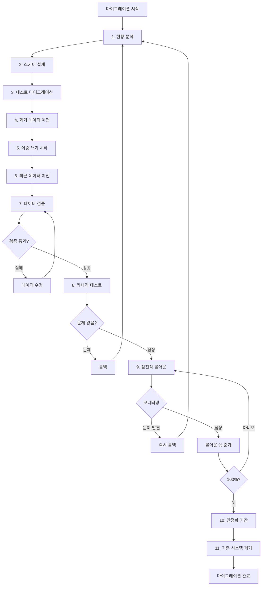

# 온라인 게임 서버를 위한 TimescaleDB 완벽 가이드  

저자: 최흥배, Claude AI   
    
권장 개발 환경
- **IDE**: Visual Studio 2022 (Community 이상)
- **.NET**: 9 이상
- **OS**: Windows 10 이상

-----  
  
# Chapter 13: 대용량 데이터 마이그레이션

게임 서비스를 운영하다 보면 초기에 선택한 데이터베이스가 시간이 지나면서 한계를 드러낸다. MySQL에 쌓인 수억 건의 로그 데이터 때문에 쿼리가 느려지거나, MongoDB의 시계열 데이터 분석이 비효율적이라는 것을 깨닫게 된다. 이때 TimescaleDB로의 마이그레이션을 고려하게 되지만, 라이브 서비스 중인 게임의 데이터를 옮기는 것은 매우 신중해야 하는 작업이다. 데이터 손실이나 서비스 중단 없이 안전하게 이전하는 방법을 배워보자.

이 장에서는 기존 데이터베이스에서 TimescaleDB로 대용량 데이터를 마이그레이션하는 전체 과정을 다룬다. 계획 수립부터 실제 이전, 검증, 무중단 전환까지 실전에서 바로 적용할 수 있는 구체적인 방법을 배운다.

---

## 13.1 마이그레이션 계획 수립

데이터 마이그레이션은 철저한 계획 없이 시작하면 반드시 문제가 발생한다. 먼저 현재 상황을 정확히 파악하고, 목표를 명확히 하며, 리스크를 사전에 식별해야 한다.

**현황 분석 체크리스트**

마이그레이션을 시작하기 전에 다음 질문에 답할 수 있어야 한다. 현재 시스템에서 사용하는 데이터베이스는 무엇인가? MySQL인가, MongoDB인가, 아니면 다른 시스템인가? 이전해야 할 데이터의 총량은 얼마나 되는가? 테이블 개수, 총 행 수, 디스크 사용량을 정확히 파악한다. 데이터 증가 속도는 어떤가? 하루에 몇 건의 새 데이터가 추가되는지, 이 속도가 마이그레이션 기간에 영향을 미치는지 확인한다.

현재 시스템의 성능 병목은 무엇인가? 쿼리 속도, 디스크 I/O, 메모리 부족 등 구체적인 문제점을 문서화한다. 서비스 중단 가능 시간은 얼마나 되는가? 완전 무중단이 필요한가, 아니면 새벽 시간대에 짧은 중단이 허용되는가? 이는 마이그레이션 전략을 결정하는 핵심 요소다.

**마이그레이션 전략 선택**

세 가지 주요 전략이 있으며, 각각 장단점이 다르다.

**전체 마이그레이션(Big Bang Migration)**은 특정 시점에 서비스를 중단하고 모든 데이터를 한 번에 이전한다. 구현이 단순하고 데이터 정합성 보장이 쉽지만, 서비스 중단 시간이 필요하다는 치명적인 단점이 있다. 데이터량이 적거나(수백만 건 이하), 서비스 중단이 허용되는 경우에 적합하다.

**점진적 마이그레이션(Incremental Migration)**은 과거 데이터부터 순차적으로 이전하면서 동시에 신규 데이터는 양쪽 시스템에 동시 저장한다. 서비스 중단 없이 진행할 수 있고, 문제 발생 시 롤백이 쉽다. 하지만 이중 쓰기 로직 구현이 필요하고, 데이터 정합성 관리가 복잡하다. 수억 건 이상의 대용량 데이터에 적합하다.

**하이브리드 마이그레이션(Hybrid Migration)**은 과거 데이터는 배치로 이전하고, 최근 데이터만 이중 쓰기한다. 두 방식의 장점을 결합하여 현실적인 절충안을 제시한다. 대부분의 라이브 게임 서비스에 추천하는 방식이다.

**마이그레이션 일정 예시**

실제 프로젝트 일정을 수립해보자.

```
Week 1-2: 준비 단계
- 현황 분석 및 데이터 모델링
- TimescaleDB 환경 구축
- 마이그레이션 도구 개발

Week 3-4: 테스트 마이그레이션
- 샘플 데이터로 전체 프로세스 검증
- 성능 측정 및 병목 지점 파악
- 롤백 시나리오 테스트

Week 5-6: 과거 데이터 이전
- 1년 전 ~ 3개월 전 데이터 배치 이전
- 데이터 검증 및 무결성 확인

Week 7: 이중 쓰기 전환
- 최근 3개월 데이터 이전
- 신규 데이터 이중 쓰기 시작
- 실시간 동기화 모니터링

Week 8: 완전 전환
- 읽기 트래픽을 TimescaleDB로 전환
- 기존 시스템 쓰기 중단
- 최종 검증 및 모니터링

Week 9-10: 안정화
- 성능 튜닝 및 최적화
- 기존 시스템 백업 유지 (롤백 대비)

Week 11-12: 기존 시스템 폐기
- 충분한 안정화 후 기존 시스템 종료
```

**리스크 관리**

마이그레이션에서 발생할 수 있는 주요 리스크와 대응 방안을 사전에 준비한다.

데이터 손실 리스크는 마이그레이션 과정에서 일부 데이터가 누락될 수 있다. 대응 방안으로 전체 건수 비교, 체크섬 검증, 샘플 데이터 상세 비교를 수행한다. 마이그레이션 전후로 기존 시스템의 백업을 반드시 유지한다.

성능 저하 리스크는 마이그레이션 중 기존 시스템의 부하가 증가할 수 있다. 대응 방안으로 배치 작업을 저부하 시간대에 수행하고, 읽기 복제본에서 데이터를 추출하며, 네트워크 대역폭을 모니터링한다.

정합성 문제 리스크는 이중 쓰기 중 두 시스템 간 데이터 불일치가 발생할 수 있다. 대응 방안으로 트랜잭션 로그 기반 동기화를 구현하고, 주기적인 정합성 체크를 수행하며, 불일치 발견 시 자동 재동기화 메커니즘을 준비한다.

롤백 실패 리스크는 문제 발생 시 기존 시스템으로 복귀가 어려울 수 있다. 대응 방안으로 각 단계마다 롤백 시나리오를 문서화하고, 롤백 스크립트를 미리 작성 및 테스트하며, 전환 전 최소 2주간 기존 시스템을 유지한다.

---

## 13.2 기존 데이터 분석 및 모델링

마이그레이션 전에 기존 데이터의 구조와 특성을 정확히 이해해야 한다. MySQL과 MongoDB에서 데이터를 분석하고, TimescaleDB에 적합한 스키마로 변환하는 과정을 살펴보자.

**MySQL에서 데이터 분석하기**

기존 MySQL 데이터베이스의 구조를 파악하는 SQL 쿼리를 작성한다.

```sql
-- 테이블별 데이터 건수 및 크기
SELECT 
    table_name,
    table_rows as estimated_rows,
    ROUND(((data_length + index_length) / 1024 / 1024), 2) as size_mb,
    ROUND((data_length / 1024 / 1024), 2) as data_mb,
    ROUND((index_length / 1024 / 1024), 2) as index_mb
FROM information_schema.TABLES
WHERE table_schema = 'game_logs'
ORDER BY (data_length + index_length) DESC;

-- 특정 테이블의 날짜 범위 및 분포
SELECT 
    DATE(created_at) as date,
    COUNT(*) as count,
    MIN(created_at) as first_record,
    MAX(created_at) as last_record
FROM game_logs.player_actions
GROUP BY DATE(created_at)
ORDER BY date DESC
LIMIT 30;

-- 인덱스 정보 확인
SHOW INDEX FROM game_logs.player_actions;

-- 샘플 데이터 확인
SELECT * FROM game_logs.player_actions 
ORDER BY created_at DESC 
LIMIT 10;
```

C#으로 MySQL 데이터 분석 도구를 만든다.

```csharp
using MySql.Data.MySqlClient;
using System;
using System.Collections.Generic;
using System.Threading.Tasks;

public class MySqlDataAnalyzer
{
    private readonly string _connectionString;

    public MySqlDataAnalyzer(string connectionString)
    {
        _connectionString = connectionString;
    }

    // 테이블별 통계 조회
    public async Task<List<TableStatistics>> AnalyzeTablesAsync(string databaseName)
    {
        var statistics = new List<TableStatistics>();

        using var connection = new MySqlConnection(_connectionString);
        await connection.OpenAsync();

        var query = @"
            SELECT 
                table_name,
                table_rows,
                ROUND(((data_length + index_length) / 1024 / 1024), 2) as size_mb,
                ROUND((data_length / 1024 / 1024), 2) as data_mb,
                ROUND((index_length / 1024 / 1024), 2) as index_mb,
                create_time,
                update_time
            FROM information_schema.TABLES
            WHERE table_schema = @databaseName
            ORDER BY (data_length + index_length) DESC";

        using var command = new MySqlCommand(query, connection);
        command.Parameters.AddWithValue("@databaseName", databaseName);

        using var reader = await command.ExecuteReaderAsync();
        while (await reader.ReadAsync())
        {
            statistics.Add(new TableStatistics
            {
                TableName = reader.GetString("table_name"),
                EstimatedRows = reader.GetInt64("table_rows"),
                SizeMB = reader.GetDecimal("size_mb"),
                DataMB = reader.GetDecimal("data_mb"),
                IndexMB = reader.GetDecimal("index_mb"),
                CreateTime = reader.IsDBNull(reader.GetOrdinal("create_time")) 
                    ? null 
                    : reader.GetDateTime("create_time"),
                UpdateTime = reader.IsDBNull(reader.GetOrdinal("update_time")) 
                    ? null 
                    : reader.GetDateTime("update_time")
            });
        }

        return statistics;
    }

    // 날짜별 데이터 분포 분석
    public async Task<List<DateDistribution>> AnalyzeDateDistributionAsync(
        string tableName, 
        string dateColumn)
    {
        var distribution = new List<DateDistribution>();

        using var connection = new MySqlConnection(_connectionString);
        await connection.OpenAsync();

        var query = $@"
            SELECT 
                DATE({dateColumn}) as date,
                COUNT(*) as count,
                MIN({dateColumn}) as first_record,
                MAX({dateColumn}) as last_record
            FROM {tableName}
            GROUP BY DATE({dateColumn})
            ORDER BY date DESC
            LIMIT 90";

        using var command = new MySqlCommand(query, connection);
        using var reader = await command.ExecuteReaderAsync();

        while (await reader.ReadAsync())
        {
            distribution.Add(new DateDistribution
            {
                Date = reader.GetDateTime("date"),
                Count = reader.GetInt64("count"),
                FirstRecord = reader.GetDateTime("first_record"),
                LastRecord = reader.GetDateTime("last_record")
            });
        }

        return distribution;
    }

    // 정확한 행 수 계산 (느리지만 정확함)
    public async Task<long> GetExactRowCountAsync(string tableName)
    {
        using var connection = new MySqlConnection(_connectionString);
        await connection.OpenAsync();

        var query = $"SELECT COUNT(*) FROM {tableName}";
        using var command = new MySqlCommand(query, connection);
        
        var result = await command.ExecuteScalarAsync();
        return Convert.ToInt64(result);
    }
}

public class TableStatistics
{
    public string TableName { get; set; }
    public long EstimatedRows { get; set; }
    public decimal SizeMB { get; set; }
    public decimal DataMB { get; set; }
    public decimal IndexMB { get; set; }
    public DateTime? CreateTime { get; set; }
    public DateTime? UpdateTime { get; set; }
}

public class DateDistribution
{
    public DateTime Date { get; set; }
    public long Count { get; set; }
    public DateTime FirstRecord { get; set; }
    public DateTime LastRecord { get; set; }
}
```

**MongoDB에서 데이터 분석하기**

MongoDB의 경우 C# 드라이버를 사용하여 분석한다.

```csharp
using MongoDB.Driver;
using MongoDB.Bson;
using System;
using System.Collections.Generic;
using System.Linq;
using System.Threading.Tasks;

public class MongoDataAnalyzer
{
    private readonly IMongoDatabase _database;

    public MongoDataAnalyzer(string connectionString, string databaseName)
    {
        var client = new MongoClient(connectionString);
        _database = client.GetDatabase(databaseName);
    }

    // 컬렉션별 통계
    public async Task<List<CollectionStatistics>> AnalyzeCollectionsAsync()
    {
        var statistics = new List<CollectionStatistics>();
        var collectionNames = await _database.ListCollectionNamesAsync();

        await collectionNames.ForEachAsync(async collectionName =>
        {
            var collection = _database.GetCollection<BsonDocument>(collectionName);
            
            // 문서 개수
            var count = await collection.CountDocumentsAsync(FilterDefinition<BsonDocument>.Empty);
            
            // 컬렉션 통계
            var statsCommand = new BsonDocument { { "collStats", collectionName } };
            var stats = await _database.RunCommandAsync<BsonDocument>(statsCommand);

            statistics.Add(new CollectionStatistics
            {
                CollectionName = collectionName,
                DocumentCount = count,
                SizeMB = stats["size"].ToDouble() / 1024 / 1024,
                StorageSizeMB = stats["storageSize"].ToDouble() / 1024 / 1024,
                IndexSizeMB = stats["totalIndexSize"].ToDouble() / 1024 / 1024,
                AvgDocumentSizeBytes = stats["avgObjSize"].ToDouble()
            });
        });

        return statistics.OrderByDescending(s => s.SizeMB).ToList();
    }

    // 날짜 필드 분포 분석
    public async Task<List<DateDistribution>> AnalyzeDateFieldAsync(
        string collectionName, 
        string dateField)
    {
        var collection = _database.GetCollection<BsonDocument>(collectionName);

        var pipeline = new[]
        {
            new BsonDocument("$group", new BsonDocument
            {
                { "_id", new BsonDocument("$dateToString", new BsonDocument
                    {
                        { "format", "%Y-%m-%d" },
                        { "date", $"${dateField}" }
                    })
                },
                { "count", new BsonDocument("$sum", 1) },
                { "firstRecord", new BsonDocument("$min", $"${dateField}") },
                { "lastRecord", new BsonDocument("$max", $"${dateField}") }
            }),
            new BsonDocument("$sort", new BsonDocument("_id", -1)),
            new BsonDocument("$limit", 90)
        };

        var results = await collection.Aggregate<BsonDocument>(pipeline).ToListAsync();

        return results.Select(doc => new DateDistribution
        {
            Date = DateTime.Parse(doc["_id"].AsString),
            Count = doc["count"].ToInt64(),
            FirstRecord = doc["firstRecord"].ToUniversalTime(),
            LastRecord = doc["lastRecord"].ToUniversalTime()
        }).ToList();
    }

    // 샘플 문서 조회
    public async Task<List<BsonDocument>> GetSampleDocumentsAsync(
        string collectionName, 
        int sampleSize = 10)
    {
        var collection = _database.GetCollection<BsonDocument>(collectionName);
        
        var pipeline = new[]
        {
            new BsonDocument("$sample", new BsonDocument("size", sampleSize))
        };

        return await collection.Aggregate<BsonDocument>(pipeline).ToListAsync();
    }
}

public class CollectionStatistics
{
    public string CollectionName { get; set; }
    public long DocumentCount { get; set; }
    public double SizeMB { get; set; }
    public double StorageSizeMB { get; set; }
    public double IndexSizeMB { get; set; }
    public double AvgDocumentSizeBytes { get; set; }
}
```

**TimescaleDB 스키마 설계**

기존 데이터 구조를 분석한 후 TimescaleDB에 적합한 스키마로 변환한다. 예를 들어 MySQL의 player_actions 테이블을 마이그레이션한다고 가정하자.

```sql
-- 기존 MySQL 스키마
CREATE TABLE player_actions (
    id BIGINT AUTO_INCREMENT PRIMARY KEY,
    player_id VARCHAR(50) NOT NULL,
    action_type VARCHAR(50) NOT NULL,
    action_data JSON,
    created_at DATETIME NOT NULL,
    INDEX idx_player_created (player_id, created_at),
    INDEX idx_action_type (action_type)
);
```

TimescaleDB용 스키마로 변환한다.

```sql
-- TimescaleDB 스키마
CREATE TABLE player_actions (
    id BIGINT NOT NULL,
    player_id TEXT NOT NULL,
    action_type TEXT NOT NULL,
    action_data JSONB, -- JSON 대신 JSONB 사용 (성능 향상)
    created_at TIMESTAMPTZ NOT NULL, -- DATETIME 대신 TIMESTAMPTZ
    PRIMARY KEY (id, created_at) -- Hypertable을 위한 복합 키
);

-- Hypertable로 변환
SELECT create_hypertable('player_actions', 'created_at');

-- 인덱스 생성
CREATE INDEX idx_player_actions_player_id ON player_actions (player_id, created_at DESC);
CREATE INDEX idx_player_actions_action_type ON player_actions (action_type, created_at DESC);
CREATE INDEX idx_player_actions_data ON player_actions USING GIN (action_data); -- JSONB 검색용
```

**스키마 변환 규칙**

MySQL에서 TimescaleDB로 변환 시 주의할 점을 정리한다.

데이터 타입 변환은 다음과 같다. `DATETIME`은 `TIMESTAMPTZ`로 변환하여 시간대 정보를 포함한다. `VARCHAR`는 `TEXT`로 변환하며 PostgreSQL에서는 성능 차이가 없다. `JSON`은 `JSONB`로 변환하여 인덱싱과 검색 성능을 향상시킨다. `AUTO_INCREMENT`는 `SERIAL` 또는 `BIGSERIAL`로 변환하지만, Hypertable에서는 복합 키를 사용한다.

PRIMARY KEY 설정은 Hypertable의 파티셔닝 컬럼(시간 컬럼)을 반드시 포함해야 한다. 기존 단일 ID 키에 시간 컬럼을 추가하여 복합 키로 만든다.

인덱스 전략은 시간 범위 쿼리가 많으므로 시간 컬럼을 DESC로 정렬한다. 복합 인덱스의 순서를 쿼리 패턴에 맞게 조정한다. JSONB 컬럼은 GIN 인덱스를 사용한다.

---

## 13.3 C# 마이그레이션 도구 개발

이제 실제로 데이터를 이전하는 C# 애플리케이션을 만든다. 범용적으로 사용할 수 있는 마이그레이션 프레임워크를 구축한다.

**마이그레이션 도구 아키텍처**

```
┌─────────────────────────────────────────────────────┐
│         Migration Orchestrator                       │
│  (전체 프로세스 조율, 진행상황 관리)                  │
└────────────────┬────────────────────────────────────┘
                 │
    ┌────────────┼────────────┐
    │            │            │
┌───▼────┐  ┌───▼────┐  ┌───▼────┐
│ Source │  │Transform│  │ Target │
│ Reader │  │Processor│  │ Writer │
└───┬────┘  └───┬────┘  └───┬────┘
    │            │            │
┌───▼────────────▼────────────▼───┐
│     Data Validator               │
│  (무결성 검증, 건수 비교)         │
└──────────────────────────────────┘
```

**기본 인터페이스 정의**

```csharp
using System;
using System.Collections.Generic;
using System.Threading.Tasks;

// 데이터 레코드 추상화
public class DataRecord
{
    public Dictionary<string, object> Fields { get; set; } = new();
    
    public T GetValue<T>(string fieldName)
    {
        if (Fields.TryGetValue(fieldName, out var value))
        {
            if (value is T typedValue)
                return typedValue;
            
            return (T)Convert.ChangeType(value, typeof(T));
        }
        
        return default;
    }
}

// 소스 데이터 읽기 인터페이스
public interface IDataSource
{
    Task<long> GetTotalCountAsync();
    IAsyncEnumerable<DataRecord> ReadAsync(long offset, int batchSize);
    Task CloseAsync();
}

// 데이터 변환 인터페이스
public interface IDataTransformer
{
    DataRecord Transform(DataRecord source);
}

// 타겟 데이터 쓰기 인터페이스
public interface IDataTarget
{
    Task WriteAsync(IEnumerable<DataRecord> records);
    Task<long> GetCurrentCountAsync();
    Task CloseAsync();
}

// 진행상황 보고
public class MigrationProgress
{
    public long TotalRecords { get; set; }
    public long ProcessedRecords { get; set; }
    public long SuccessCount { get; set; }
    public long ErrorCount { get; set; }
    public DateTime StartTime { get; set; }
    public DateTime? EndTime { get; set; }
    public TimeSpan ElapsedTime => (EndTime ?? DateTime.UtcNow) - StartTime;
    public double ProgressPercentage => TotalRecords > 0 
        ? (ProcessedRecords * 100.0 / TotalRecords) 
        : 0;
    public double RecordsPerSecond => ElapsedTime.TotalSeconds > 0 
        ? ProcessedRecords / ElapsedTime.TotalSeconds 
        : 0;
    public TimeSpan EstimatedTimeRemaining => RecordsPerSecond > 0 
        ? TimeSpan.FromSeconds((TotalRecords - ProcessedRecords) / RecordsPerSecond) 
        : TimeSpan.Zero;
}

public delegate void ProgressReportHandler(MigrationProgress progress);
```

**MySQL 소스 구현**

```csharp
using MySql.Data.MySqlClient;
using System.Collections.Generic;
using System.Runtime.CompilerServices;
using System.Threading.Tasks;

public class MySqlDataSource : IDataSource
{
    private readonly string _connectionString;
    private readonly string _tableName;
    private readonly string _orderByColumn;
    private MySqlConnection _connection;

    public MySqlDataSource(
        string connectionString, 
        string tableName, 
        string orderByColumn = "id")
    {
        _connectionString = connectionString;
        _tableName = tableName;
        _orderByColumn = orderByColumn;
    }

    public async Task<long> GetTotalCountAsync()
    {
        using var connection = new MySqlConnection(_connectionString);
        await connection.OpenAsync();

        var query = $"SELECT COUNT(*) FROM {_tableName}";
        using var command = new MySqlCommand(query, connection);
        
        var result = await command.ExecuteScalarAsync();
        return Convert.ToInt64(result);
    }

    public async IAsyncEnumerable<DataRecord> ReadAsync(
        long offset, 
        int batchSize,
        [EnumeratorCancellation] CancellationToken cancellationToken = default)
    {
        _connection ??= new MySqlConnection(_connectionString);
        
        if (_connection.State != System.Data.ConnectionState.Open)
            await _connection.OpenAsync(cancellationToken);

        var query = $@"
            SELECT * FROM {_tableName} 
            ORDER BY {_orderByColumn} 
            LIMIT @offset, @batchSize";

        using var command = new MySqlCommand(query, _connection);
        command.Parameters.AddWithValue("@offset", offset);
        command.Parameters.AddWithValue("@batchSize", batchSize);

        using var reader = await command.ExecuteReaderAsync(cancellationToken);
        
        while (await reader.ReadAsync(cancellationToken))
        {
            var record = new DataRecord();
            
            for (int i = 0; i < reader.FieldCount; i++)
            {
                var fieldName = reader.GetName(i);
                var value = reader.IsDBNull(i) ? null : reader.GetValue(i);
                record.Fields[fieldName] = value;
            }
            
            yield return record;
        }
    }

    public async Task CloseAsync()
    {
        if (_connection != null)
        {
            await _connection.CloseAsync();
            await _connection.DisposeAsync();
            _connection = null;
        }
    }
}
```

**TimescaleDB 타겟 구현**

```csharp
using Npgsql;
using SqlKata.Execution;
using System.Collections.Generic;
using System.Linq;
using System.Text;
using System.Threading.Tasks;

public class TimescaleDbDataTarget : IDataTarget
{
    private readonly QueryFactory _db;
    private readonly string _tableName;
    private readonly string _connectionString;

    public TimescaleDbDataTarget(
        QueryFactory db, 
        string tableName,
        string connectionString)
    {
        _db = db;
        _tableName = tableName;
        _connectionString = connectionString;
    }

    public async Task WriteAsync(IEnumerable<DataRecord> records)
    {
        var recordsList = records.ToList();
        if (recordsList.Count == 0) return;

        // 대량 삽입을 위해 COPY 명령 사용 (가장 빠름)
        await BulkCopyAsync(recordsList);
    }

    private async Task BulkCopyAsync(List<DataRecord> records)
    {
        using var connection = new NpgsqlConnection(_connectionString);
        await connection.OpenAsync();

        // 첫 번째 레코드에서 컬럼 목록 추출
        var columns = records[0].Fields.Keys.ToList();
        var columnList = string.Join(", ", columns);

        // COPY 명령 시작
        using var writer = await connection.BeginBinaryImportAsync(
            $"COPY {_tableName} ({columnList}) FROM STDIN (FORMAT BINARY)");

        foreach (var record in records)
        {
            await writer.StartRowAsync();
            
            foreach (var column in columns)
            {
                var value = record.Fields[column];
                
                if (value == null)
                {
                    await writer.WriteNullAsync();
                }
                else
                {
                    // 데이터 타입에 따라 적절히 변환
                    await writer.WriteAsync(value, GetNpgsqlDbType(value));
                }
            }
        }

        await writer.CompleteAsync();
    }

    // 일반 INSERT 방식 (COPY보다 느리지만 간단함)
    private async Task BulkInsertAsync(List<DataRecord> records)
    {
        var values = records.Select(r => r.Fields).ToList();
        await _db.Query(_tableName).InsertAsync(values);
    }

    private NpgsqlTypes.NpgsqlDbType GetNpgsqlDbType(object value)
    {
        return value switch
        {
            int => NpgsqlTypes.NpgsqlDbType.Integer,
            long => NpgsqlTypes.NpgsqlDbType.Bigint,
            string => NpgsqlTypes.NpgsqlDbType.Text,
            DateTime => NpgsqlTypes.NpgsqlDbType.TimestampTz,
            bool => NpgsqlTypes.NpgsqlDbType.Boolean,
            double => NpgsqlTypes.NpgsqlDbType.Double,
            decimal => NpgsqlTypes.NpgsqlDbType.Numeric,
            _ => NpgsqlTypes.NpgsqlDbType.Text
        };
    }

    public async Task<long> GetCurrentCountAsync()
    {
        return await _db.Query(_tableName).CountAsync<long>();
    }

    public Task CloseAsync()
    {
        return Task.CompletedTask;
    }
}
```

**데이터 변환 구현**

```csharp
public class PlayerActionTransformer : IDataTransformer
{
    public DataRecord Transform(DataRecord source)
    {
        var target = new DataRecord();

        // ID 복사
        target.Fields["id"] = source.GetValue<long>("id");
        target.Fields["player_id"] = source.GetValue<string>("player_id");
        target.Fields["action_type"] = source.GetValue<string>("action_type");

        // JSON을 JSONB로 변환 (문자열 그대로 전달)
        var actionData = source.GetValue<string>("action_data");
        target.Fields["action_data"] = actionData;

        // DATETIME을 TIMESTAMPTZ로 변환
        var createdAt = source.GetValue<DateTime>("created_at");
        target.Fields["created_at"] = DateTime.SpecifyKind(createdAt, DateTimeKind.Utc);

        return target;
    }
}
```

**마이그레이션 오케스트레이터**

```csharp
using Microsoft.Extensions.Logging;
using System;
using System.Diagnostics;
using System.Threading.Tasks;

public class MigrationOrchestrator
{
    private readonly IDataSource _source;
    private readonly IDataTarget _target;
    private readonly IDataTransformer _transformer;
    private readonly ILogger<MigrationOrchestrator> _logger;
    private readonly int _batchSize;

    public event ProgressReportHandler OnProgressReport;

    public MigrationOrchestrator(
        IDataSource source,
        IDataTarget target,
        IDataTransformer transformer,
        ILogger<MigrationOrchestrator> logger,
        int batchSize = 10000)
    {
        _source = source;
        _target = target;
        _transformer = transformer;
        _logger = logger;
        _batchSize = batchSize;
    }

    public async Task<MigrationProgress> ExecuteAsync()
    {
        var progress = new MigrationProgress
        {
            StartTime = DateTime.UtcNow
        };

        try
        {
            // 총 레코드 수 조회
            progress.TotalRecords = await _source.GetTotalCountAsync();
            _logger.LogInformation("마이그레이션 시작: 총 {TotalRecords:N0}건", progress.TotalRecords);

            long offset = 0;
            var stopwatch = Stopwatch.StartNew();

            while (offset < progress.TotalRecords)
            {
                var batch = new List<DataRecord>();

                // 소스에서 배치 읽기
                await foreach (var record in _source.ReadAsync(offset, _batchSize))
                {
                    // 데이터 변환
                    var transformed = _transformer.Transform(record);
                    batch.Add(transformed);
                }

                if (batch.Count == 0) break;

                try
                {
                    // 타겟에 쓰기
                    await _target.WriteAsync(batch);
                    
                    progress.ProcessedRecords += batch.Count;
                    progress.SuccessCount += batch.Count;
                }
                catch (Exception ex)
                {
                    _logger.LogError(ex, "배치 처리 실패: offset={Offset}", offset);
                    progress.ErrorCount += batch.Count;
                }

                offset += _batchSize;

                // 진행상황 보고 (매 배치마다)
                OnProgressReport?.Invoke(progress);

                // 1초마다 로그 출력
                if (stopwatch.ElapsedMilliseconds >= 1000)
                {
                    _logger.LogInformation(
                        "진행률: {Progress:F2}% ({Processed:N0}/{Total:N0}) - " +
                        "속도: {Speed:N0} records/sec - 남은 시간: {Remaining}",
                        progress.ProgressPercentage,
                        progress.ProcessedRecords,
                        progress.TotalRecords,
                        progress.RecordsPerSecond,
                        progress.EstimatedTimeRemaining.ToString(@"hh\:mm\:ss"));
                    
                    stopwatch.Restart();
                }
            }

            progress.EndTime = DateTime.UtcNow;
            
            _logger.LogInformation(
                "마이그레이션 완료: {Success:N0}건 성공, {Error:N0}건 실패, " +
                "소요 시간: {Elapsed}, 평균 속도: {Speed:N0} records/sec",
                progress.SuccessCount,
                progress.ErrorCount,
                progress.ElapsedTime.ToString(@"hh\:mm\:ss"),
                progress.RecordsPerSecond);
        }
        catch (Exception ex)
        {
            _logger.LogError(ex, "마이그레이션 중 치명적 오류 발생");
            progress.EndTime = DateTime.UtcNow;
            throw;
        }
        finally
        {
            await _source.CloseAsync();
            await _target.CloseAsync();
        }

        return progress;
    }
}
```

---

## 13.4 배치 처리로 성능 최적화

마이그레이션 도구의 성능을 최적화하여 수억 건의 데이터를 빠르게 이전하는 방법을 배운다.

**병렬 처리 구현**

여러 배치를 동시에 처리하여 성능을 향상시킨다.

```csharp
using System.Threading.Tasks.Dataflow;
using System.Threading.Tasks;
using System.Collections.Generic;
using System.Linq;

public class ParallelMigrationOrchestrator
{
    private readonly IDataSource _source;
    private readonly IDataTarget _target;
    private readonly IDataTransformer _transformer;
    private readonly ILogger<ParallelMigrationOrchestrator> _logger;
    private readonly int _batchSize;
    private readonly int _maxDegreeOfParallelism;

    public event ProgressReportHandler OnProgressReport;

    public ParallelMigrationOrchestrator(
        IDataSource source,
        IDataTarget target,
        IDataTransformer transformer,
        ILogger<ParallelMigrationOrchestrator> logger,
        int batchSize = 10000,
        int maxDegreeOfParallelism = 4)
    {
        _source = source;
        _target = target;
        _transformer = transformer;
        _logger = logger;
        _batchSize = batchSize;
        _maxDegreeOfParallelism = maxDegreeOfParallelism;
    }

    public async Task<MigrationProgress> ExecuteAsync()
    {
        var progress = new MigrationProgress
        {
            StartTime = DateTime.UtcNow,
            TotalRecords = await _source.GetTotalCountAsync()
        };

        _logger.LogInformation(
            "병렬 마이그레이션 시작: 총 {TotalRecords:N0}건, 병렬도: {Parallelism}",
            progress.TotalRecords, _maxDegreeOfParallelism);

        // Dataflow 파이프라인 구성
        var readBlock = new TransformBlock<long, List<DataRecord>>(
            async offset => await ReadBatchAsync(offset),
            new ExecutionDataflowBlockOptions
            {
                MaxDegreeOfParallelism = 1, // 순차 읽기
                BoundedCapacity = _maxDegreeOfParallelism * 2
            });

        var transformBlock = new TransformBlock<List<DataRecord>, List<DataRecord>>(
            batch => TransformBatch(batch),
            new ExecutionDataflowBlockOptions
            {
                MaxDegreeOfParallelism = _maxDegreeOfParallelism,
                BoundedCapacity = _maxDegreeOfParallelism * 2
            });

        var writeBlock = new ActionBlock<List<DataRecord>>(
            async batch => await WriteBatchAsync(batch, progress),
            new ExecutionDataflowBlockOptions
            {
                MaxDegreeOfParallelism = 1, // 순차 쓰기 (DB 부하 관리)
                BoundedCapacity = _maxDegreeOfParallelism * 2
            });

        // 파이프라인 연결
        var linkOptions = new DataflowLinkOptions { PropagateCompletion = true };
        readBlock.LinkTo(transformBlock, linkOptions);
        transformBlock.LinkTo(writeBlock, linkOptions);

        // 데이터 공급
        for (long offset = 0; offset < progress.TotalRecords; offset += _batchSize)
        {
            await readBlock.SendAsync(offset);
        }

        readBlock.Complete();
        await writeBlock.Completion;

        progress.EndTime = DateTime.UtcNow;

        _logger.LogInformation(
            "병렬 마이그레이션 완료: {Success:N0}건 성공, 소요 시간: {Elapsed}",
            progress.SuccessCount,
            progress.ElapsedTime.ToString(@"hh\:mm\:ss"));

        return progress;
    }

    private async Task<List<DataRecord>> ReadBatchAsync(long offset)
    {
        var batch = new List<DataRecord>();
        await foreach (var record in _source.ReadAsync(offset, _batchSize))
        {
            batch.Add(record);
        }
        return batch;
    }

    private List<DataRecord> TransformBatch(List<DataRecord> batch)
    {
        return batch.Select(r => _transformer.Transform(r)).ToList();
    }

    private async Task WriteBatchAsync(List<DataRecord> batch, MigrationProgress progress)
    {
        try
        {
            await _target.WriteAsync(batch);
            
            lock (progress)
            {
                progress.ProcessedRecords += batch.Count;
                progress.SuccessCount += batch.Count;
            }

            OnProgressReport?.Invoke(progress);
        }
        catch (Exception ex)
        {
            _logger.LogError(ex, "배치 쓰기 실패: {Count}건", batch.Count);
            
            lock (progress)
            {
                progress.ErrorCount += batch.Count;
            }
        }
    }
}
```

**메모리 효율적인 스트리밍**

대용량 데이터를 메모리에 모두 적재하지 않고 스트리밍 방식으로 처리한다.

```csharp
public class StreamingMigrationOrchestrator
{
    private readonly IDataSource _source;
    private readonly IDataTarget _target;
    private readonly IDataTransformer _transformer;
    private readonly ILogger<StreamingMigrationOrchestrator> _logger;
    private readonly int _batchSize;
    private readonly int _bufferSize;

    public StreamingMigrationOrchestrator(
        IDataSource source,
        IDataTarget target,
        IDataTransformer transformer,
        ILogger<StreamingMigrationOrchestrator> logger,
        int batchSize = 10000,
        int bufferSize = 3)
    {
        _source = source;
        _target = target;
        _transformer = transformer;
        _logger = logger;
        _batchSize = batchSize;
        _bufferSize = bufferSize;
    }

    public async Task<MigrationProgress> ExecuteAsync()
    {
        var progress = new MigrationProgress
        {
            StartTime = DateTime.UtcNow,
            TotalRecords = await _source.GetTotalCountAsync()
        };

        var buffer = new List<DataRecord>(_batchSize);
        long offset = 0;

        _logger.LogInformation("스트리밍 마이그레이션 시작: 총 {TotalRecords:N0}건", progress.TotalRecords);

        await foreach (var record in ReadAllRecordsAsync())
        {
            // 변환 후 버퍼에 추가
            var transformed = _transformer.Transform(record);
            buffer.Add(transformed);

            // 버퍼가 가득 차면 쓰기
            if (buffer.Count >= _batchSize)
            {
                await FlushBufferAsync(buffer, progress);
                buffer.Clear();
            }
        }

        // 남은 데이터 쓰기
        if (buffer.Count > 0)
        {
            await FlushBufferAsync(buffer, progress);
        }

        progress.EndTime = DateTime.UtcNow;

        _logger.LogInformation(
            "스트리밍 마이그레이션 완료: {Success:N0}건, 소요 시간: {Elapsed}",
            progress.SuccessCount,
            progress.ElapsedTime.ToString(@"hh\:mm\:ss"));

        return progress;
    }

    private async IAsyncEnumerable<DataRecord> ReadAllRecordsAsync()
    {
        long offset = 0;
        var totalRecords = await _source.GetTotalCountAsync();

        while (offset < totalRecords)
        {
            await foreach (var record in _source.ReadAsync(offset, _batchSize))
            {
                yield return record;
            }
            offset += _batchSize;
        }
    }

    private async Task FlushBufferAsync(List<DataRecord> buffer, MigrationProgress progress)
    {
        try
        {
            await _target.WriteAsync(buffer);
            
            progress.ProcessedRecords += buffer.Count;
            progress.SuccessCount += buffer.Count;

            _logger.LogDebug("배치 완료: {Count}건 처리", buffer.Count);
        }
        catch (Exception ex)
        {
            _logger.LogError(ex, "배치 쓰기 실패");
            progress.ErrorCount += buffer.Count;
        }
    }
}
```

**성능 튜닝 팁**

마이그레이션 성능을 극대화하는 실전 팁을 정리한다.

배치 크기 최적화는 너무 작으면 네트워크 오버헤드가 크고, 너무 크면 메모리 부족이 발생한다. 일반적으로 10,000~50,000 레코드가 적당하며, 레코드 크기에 따라 조정한다.

PostgreSQL의 COPY 명령을 사용하면 일반 INSERT보다 10~20배 빠르다. 대량 데이터 이전 시 필수다.

인덱스와 제약조건은 마이그레이션 전에 제거하고 완료 후 재생성한다. 데이터 삽입 속도가 크게 향상된다.

```csharp
public async Task MigrateWithIndexManagementAsync()
{
    _logger.LogInformation("인덱스 제거 시작");
    
    // 인덱스 목록 저장
    var indexes = await GetIndexListAsync();
    
    // 인덱스 제거
    foreach (var index in indexes)
    {
        await DropIndexAsync(index);
    }

    _logger.LogInformation("데이터 마이그레이션 시작");
    
    // 마이그레이션 실행
    var progress = await ExecuteAsync();

    _logger.LogInformation("인덱스 재생성 시작");
    
    // 인덱스 재생성
    foreach (var index in indexes)
    {
        await CreateIndexAsync(index);
    }

    _logger.LogInformation("완료");
}
```

병렬 처리 시 데이터베이스 연결 수를 고려한다. PostgreSQL의 `max_connections` 설정을 확인하고, 병렬도를 적절히 조정한다.

네트워크 대역폭도 병목이 될 수 있다. 가능하면 소스와 타겟이 같은 네트워크에 있도록 한다. 클라우드 환경이라면 같은 리전에 배치한다.

---

## 13.5 데이터 검증 및 무결성 확인

마이그레이션 후 데이터가 정확히 이전되었는지 검증하는 것은 필수다. 여러 단계의 검증 전략을 수립한다.

**기본 건수 비교**

가장 먼저 수행할 검증은 전체 건수 비교다.

```csharp
public class DataValidator
{
    private readonly IDataSource _source;
    private readonly IDataTarget _target;
    private readonly ILogger<DataValidator> _logger;

    public DataValidator(
        IDataSource source,
        IDataTarget target,
        ILogger<DataValidator> logger)
    {
        _source = source;
        _target = target;
        _logger = logger;
    }

    public async Task<ValidationResult> ValidateCountAsync()
    {
        _logger.LogInformation("전체 건수 검증 시작");

        var sourceCount = await _source.GetTotalCountAsync();
        var targetCount = await _target.GetCurrentCountAsync();

        var result = new ValidationResult
        {
            ValidationType = "Count",
            SourceCount = sourceCount,
            TargetCount = targetCount,
            IsValid = sourceCount == targetCount
        };

        if (result.IsValid)
        {
            _logger.LogInformation("건수 검증 성공: {Count:N0}건", sourceCount);
        }
        else
        {
            _logger.LogWarning(
                "건수 불일치: 소스 {SourceCount:N0}건, 타겟 {TargetCount:N0}건, 차이 {Diff:N0}건",
                sourceCount, targetCount, Math.Abs(sourceCount - targetCount));
        }

        return result;
    }

    // 날짜 범위별 건수 비교
    public async Task<List<ValidationResult>> ValidateCountByDateRangeAsync(
        string dateColumn,
        DateTime startDate,
        DateTime endDate,
        TimeSpan interval)
    {
        var results = new List<ValidationResult>();
        var currentDate = startDate;

        _logger.LogInformation(
            "날짜별 건수 검증 시작: {Start} ~ {End}",
            startDate.ToString("yyyy-MM-dd"),
            endDate.ToString("yyyy-MM-dd"));

        while (currentDate < endDate)
        {
            var nextDate = currentDate.Add(interval);
            if (nextDate > endDate) nextDate = endDate;

            var result = await ValidateDateRangeAsync(dateColumn, currentDate, nextDate);
            results.Add(result);

            if (!result.IsValid)
            {
                _logger.LogWarning(
                    "불일치 발견: {Date}, 소스 {Source:N0}, 타겟 {Target:N0}",
                    currentDate.ToString("yyyy-MM-dd"),
                    result.SourceCount,
                    result.TargetCount);
            }

            currentDate = nextDate;
        }

        var totalValid = results.Count(r => r.IsValid);
        _logger.LogInformation(
            "날짜별 검증 완료: {Valid}/{Total} 일치",
            totalValid, results.Count);

        return results;
    }

    private async Task<ValidationResult> ValidateDateRangeAsync(
        string dateColumn,
        DateTime startDate,
        DateTime endDate)
    {
        // 구현은 데이터 소스에 따라 다름
        // 여기서는 예시로 간략화
        return new ValidationResult
        {
            ValidationType = "DateRange",
            DateRange = $"{startDate:yyyy-MM-dd} ~ {endDate:yyyy-MM-dd}",
            IsValid = true
        };
    }
}

public class ValidationResult
{
    public string ValidationType { get; set; }
    public long SourceCount { get; set; }
    public long TargetCount { get; set; }
    public bool IsValid { get; set; }
    public string DateRange { get; set; }
    public string ErrorMessage { get; set; }
}
```

**체크섬 기반 검증**

샘플 데이터의 체크섬을 비교하여 데이터 내용이 정확한지 확인한다.

```csharp
using System.Security.Cryptography;
using System.Text;
using System.Text.Json;

public class ChecksumValidator
{
    private readonly ILogger<ChecksumValidator> _logger;

    public ChecksumValidator(ILogger<ChecksumValidator> logger)
    {
        _logger = logger;
    }

    // 샘플 레코드의 체크섬 비교
    public async Task<bool> ValidateSampleRecordsAsync(
        IDataSource source,
        IDataTarget target,
        int sampleSize = 1000)
    {
        _logger.LogInformation("샘플 레코드 체크섬 검증 시작: {SampleSize}건", sampleSize);

        var sourceRecords = new List<DataRecord>();
        await foreach (var record in source.ReadAsync(0, sampleSize))
        {
            sourceRecords.Add(record);
        }

        var sourceChecksums = sourceRecords
            .Select(r => CalculateChecksum(r))
            .OrderBy(c => c)
            .ToList();

        // 타겟에서도 동일한 레코드 조회 (ID 기반)
        // 실제 구현은 데이터 소스에 따라 다름
        var targetChecksums = new List<string>(); // 실제로는 타겟에서 조회

        var missingCount = sourceChecksums.Except(targetChecksums).Count();
        var extraCount = targetChecksums.Except(sourceChecksums).Count();

        var isValid = missingCount == 0 && extraCount == 0;

        if (isValid)
        {
            _logger.LogInformation("체크섬 검증 성공: {SampleSize}건 일치", sampleSize);
        }
        else
        {
            _logger.LogWarning(
                "체크섬 불일치: 누락 {Missing}건, 추가 {Extra}건",
                missingCount, extraCount);
        }

        return isValid;
    }

    private string CalculateChecksum(DataRecord record)
    {
        // 레코드를 JSON으로 직렬화한 후 해시 계산
        var json = JsonSerializer.Serialize(record.Fields, new JsonSerializerOptions
        {
            PropertyNamingPolicy = JsonNamingPolicy.CamelCase
        });

        using var sha256 = SHA256.Create();
        var hashBytes = sha256.ComputeHash(Encoding.UTF8.GetBytes(json));
        return Convert.ToBase64String(hashBytes);
    }
}
```

**상세 필드 비교**

특정 레코드의 모든 필드를 비교하여 데이터 변환이 정확한지 확인한다.

```csharp
public class DetailedFieldValidator
{
    private readonly ILogger<DetailedFieldValidator> _logger;

    public DetailedFieldValidator(ILogger<DetailedFieldValidator> logger)
    {
        _logger = logger;
    }

    public ValidationResult CompareRecords(DataRecord source, DataRecord target, string idField)
    {
        var result = new ValidationResult
        {
            ValidationType = "FieldComparison",
            IsValid = true
        };

        var sourceId = source.GetValue<object>(idField);
        var targetId = target.GetValue<object>(idField);

        if (!Equals(sourceId, targetId))
        {
            result.IsValid = false;
            result.ErrorMessage = $"ID 불일치: 소스 {sourceId}, 타겟 {targetId}";
            return result;
        }

        // 모든 필드 비교
        var allFields = source.Fields.Keys.Union(target.Fields.Keys).ToList();

        foreach (var field in allFields)
        {
            if (!CompareFieldValue(source, target, field))
            {
                result.IsValid = false;
                result.ErrorMessage += $"\n필드 '{field}' 불일치: " +
                    $"소스 '{source.Fields.GetValueOrDefault(field)}', " +
                    $"타겟 '{target.Fields.GetValueOrDefault(field)}'";
            }
        }

        return result;
    }

    private bool CompareFieldValue(DataRecord source, DataRecord target, string field)
    {
        var sourceValue = source.Fields.GetValueOrDefault(field);
        var targetValue = target.Fields.GetValueOrDefault(field);

        // null 처리
        if (sourceValue == null && targetValue == null) return true;
        if (sourceValue == null || targetValue == null) return false;

        // DateTime 비교 (시간대 차이 고려)
        if (sourceValue is DateTime sourceDt && targetValue is DateTime targetDt)
        {
            return Math.Abs((sourceDt - targetDt).TotalSeconds) < 1;
        }

        // 숫자 비교 (부동소수점 오차 고려)
        if (sourceValue is double sourceDbl && targetValue is double targetDbl)
        {
            return Math.Abs(sourceDbl - targetDbl) < 0.0001;
        }

        // 기본 비교
        return Equals(sourceValue, targetValue);
    }
}
```

**검증 보고서 생성**

검증 결과를 종합하여 보고서를 생성한다.

```csharp
public class ValidationReportGenerator
{
    public string GenerateReport(List<ValidationResult> results)
    {
        var sb = new StringBuilder();
        sb.AppendLine("═══════════════════════════════════════════════════");
        sb.AppendLine("           데이터 마이그레이션 검증 보고서           ");
        sb.AppendLine("═══════════════════════════════════════════════════");
        sb.AppendLine();

        var totalTests = results.Count;
        var passedTests = results.Count(r => r.IsValid);
        var failedTests = totalTests - passedTests;
        var successRate = totalTests > 0 ? (passedTests * 100.0 / totalTests) : 0;

        sb.AppendLine($"검증 일시: {DateTime.Now:yyyy-MM-dd HH:mm:ss}");
        sb.AppendLine($"총 검증 항목: {totalTests}");
        sb.AppendLine($"성공: {passedTests}");
        sb.AppendLine($"실패: {failedTests}");
        sb.AppendLine($"성공률: {successRate:F2}%");
        sb.AppendLine();

        if (failedTests > 0)
        {
            sb.AppendLine("───────────────────────────────────────────────────");
            sb.AppendLine("실패 항목 상세:");
            sb.AppendLine("───────────────────────────────────────────────────");
            
            foreach (var failed in results.Where(r => !r.IsValid))
            {
                sb.AppendLine($"[{failed.ValidationType}] {failed.DateRange ?? ""}");
                sb.AppendLine($"  소스: {failed.SourceCount:N0}건");
                sb.AppendLine($"  타겟: {failed.TargetCount:N0}건");
                sb.AppendLine($"  차이: {Math.Abs(failed.SourceCount - failed.TargetCount):N0}건");
                if (!string.IsNullOrEmpty(failed.ErrorMessage))
                {
                    sb.AppendLine($"  오류: {failed.ErrorMessage}");
                }
                sb.AppendLine();
            }
        }

        sb.AppendLine("═══════════════════════════════════════════════════");

        return sb.ToString();
    }

    public async Task SaveReportAsync(string report, string filePath)
    {
        await File.WriteAllTextAsync(filePath, report);
    }
}
```

---

## 13.6 무중단 전환 전략

라이브 서비스를 중단하지 않고 새 시스템으로 전환하는 전략을 배운다. 이중 쓰기(Dual Write)와 단계적 전환이 핵심이다.

**이중 쓰기 패턴 구현**

신규 데이터를 기존 시스템과 새 시스템 양쪽에 동시에 저장한다.

```csharp
public interface IGameLogRepository
{
    Task SavePlayerActionAsync(PlayerAction action);
}

// 기존 MySQL 리포지토리
public class MySqlGameLogRepository : IGameLogRepository
{
    private readonly string _connectionString;

    public MySqlGameLogRepository(string connectionString)
    {
        _connectionString = connectionString;
    }

    public async Task SavePlayerActionAsync(PlayerAction action)
    {
        using var connection = new MySqlConnection(_connectionString);
        await connection.OpenAsync();

        var query = @"
            INSERT INTO player_actions (player_id, action_type, action_data, created_at)
            VALUES (@PlayerId, @ActionType, @ActionData, @CreatedAt)";

        using var command = new MySqlCommand(query, connection);
        command.Parameters.AddWithValue("@PlayerId", action.PlayerId);
        command.Parameters.AddWithValue("@ActionType", action.ActionType);
        command.Parameters.AddWithValue("@ActionData", JsonSerializer.Serialize(action.ActionData));
        command.Parameters.AddWithValue("@CreatedAt", action.CreatedAt);

        await command.ExecuteNonQueryAsync();
    }
}

// 새 TimescaleDB 리포지토리
public class TimescaleDbGameLogRepository : IGameLogRepository
{
    private readonly QueryFactory _db;

    public TimescaleDbGameLogRepository(QueryFactory db)
    {
        _db = db;
    }

    public async Task SavePlayerActionAsync(PlayerAction action)
    {
        await _db.Query("player_actions").InsertAsync(new
        {
            player_id = action.PlayerId,
            action_type = action.ActionType,
            action_data = JsonSerializer.Serialize(action.ActionData),
            created_at = action.CreatedAt
        });
    }
}

// 이중 쓰기 리포지토리
public class DualWriteGameLogRepository : IGameLogRepository
{
    private readonly IGameLogRepository _primary;
    private readonly IGameLogRepository _secondary;
    private readonly ILogger<DualWriteGameLogRepository> _logger;
    private readonly bool _failOnSecondaryError;

    public DualWriteGameLogRepository(
        IGameLogRepository primary,
        IGameLogRepository secondary,
        ILogger<DualWriteGameLogRepository> logger,
        bool failOnSecondaryError = false)
    {
        _primary = primary;
        _secondary = secondary;
        _logger = logger;
        _failOnSecondaryError = failOnSecondaryError;
    }

    public async Task SavePlayerActionAsync(PlayerAction action)
    {
        // Primary(기존 시스템)에 먼저 저장
        await _primary.SavePlayerActionAsync(action);

        // Secondary(새 시스템)에 저장 시도
        try
        {
            await _secondary.SavePlayerActionAsync(action);
        }
        catch (Exception ex)
        {
            _logger.LogError(ex, 
                "Secondary 저장 실패: PlayerId={PlayerId}, ActionType={ActionType}",
                action.PlayerId, action.ActionType);

            if (_failOnSecondaryError)
            {
                throw;
            }
            // 에러를 무시하고 계속 (Primary는 성공했으므로)
        }
    }
}
```

**Feature Flag를 활용한 점진적 전환**

Feature Flag를 사용하여 읽기 트래픽을 점진적으로 새 시스템으로 전환한다.

```csharp
public class FeatureFlagService
{
    private readonly IConfiguration _configuration;
    private readonly ILogger<FeatureFlagService> _logger;

    public FeatureFlagService(IConfiguration configuration, ILogger<FeatureFlagService> logger)
    {
        _configuration = configuration;
        _logger = logger;
    }

    // 사용자별로 새 시스템 사용 여부 결정
    public bool ShouldUseTimescaleDb(string playerId)
    {
        // 설정에서 롤아웃 비율 읽기 (0~100)
        var rolloutPercentage = _configuration.GetValue<int>("Migration:TimescaleDbRolloutPercentage", 0);

        if (rolloutPercentage >= 100)
        {
            return true; // 100% 롤아웃
        }

        if (rolloutPercentage <= 0)
        {
            return false; // 롤아웃 안 함
        }

        // PlayerId 해시를 사용하여 일관된 결과 반환
        var hash = GetConsistentHash(playerId);
        return (hash % 100) < rolloutPercentage;
    }

    private int GetConsistentHash(string value)
    {
        using var md5 = MD5.Create();
        var hashBytes = md5.ComputeHash(Encoding.UTF8.GetBytes(value));
        return Math.Abs(BitConverter.ToInt32(hashBytes, 0));
    }
}

public class SmartGameLogRepository : IGameLogRepository
{
    private readonly IGameLogRepository _mysqlRepo;
    private readonly IGameLogRepository _timescaleRepo;
    private readonly FeatureFlagService _featureFlag;
    private readonly ILogger<SmartGameLogRepository> _logger;

    public SmartGameLogRepository(
        IGameLogRepository mysqlRepo,
        IGameLogRepository timescaleRepo,
        FeatureFlagService featureFlag,
        ILogger<SmartGameLogRepository> logger)
    {
        _mysqlRepo = mysqlRepo;
        _timescaleRepo = timescaleRepo;
        _featureFlag = featureFlag;
        _logger = logger;
    }

    // 쓰기는 항상 양쪽에
    public async Task SavePlayerActionAsync(PlayerAction action)
    {
        await _mysqlRepo.SavePlayerActionAsync(action);
        
        try
        {
            await _timescaleRepo.SavePlayerActionAsync(action);
        }
        catch (Exception ex)
        {
            _logger.LogError(ex, "TimescaleDB 저장 실패");
            // 실패해도 계속 (MySQL은 성공)
        }
    }

    // 읽기는 Feature Flag에 따라 선택
    public async Task<List<PlayerAction>> GetPlayerActionsAsync(string playerId, DateTime from, DateTime to)
    {
        if (_featureFlag.ShouldUseTimescaleDb(playerId))
        {
            _logger.LogDebug("PlayerId {PlayerId}: TimescaleDB 사용", playerId);
            return await GetFromTimescaleDbAsync(playerId, from, to);
        }
        else
        {
            _logger.LogDebug("PlayerId {PlayerId}: MySQL 사용", playerId);
            return await GetFromMySqlAsync(playerId, from, to);
        }
    }

    private async Task<List<PlayerAction>> GetFromTimescaleDbAsync(string playerId, DateTime from, DateTime to)
    {
        // TimescaleDB 조회 구현
        return new List<PlayerAction>();
    }

    private async Task<List<PlayerAction>> GetFromMySqlAsync(string playerId, DateTime from, DateTime to)
    {
        // MySQL 조회 구현
        return new List<PlayerAction>();
    }
}
```

**단계적 전환 시나리오**

```
Phase 1: 이중 쓰기 시작 (Week 1)
- 신규 데이터만 양쪽에 저장
- 읽기는 100% 기존 시스템
- 롤아웃: 0%

Phase 2: 과거 데이터 마이그레이션 (Week 2-6)
- 배치 작업으로 과거 데이터 이전
- 여전히 읽기는 100% 기존 시스템
- 롤아웃: 0%

Phase 3: 카나리 테스트 (Week 7)
- 내부 직원 계정만 새 시스템 사용
- 롤아웃: 1%

Phase 4: 점진적 롤아웃 (Week 8-9)
- 매일 10%씩 증가
- Day 1: 10%, Day 2: 20%, ..., Day 10: 100%
- 문제 발생 시 즉시 롤백 가능

Phase 5: 완전 전환 (Week 10)
- 읽기 100% 새 시스템
- 기존 시스템은 쓰기만 유지 (롤백 대비)

Phase 6: 이중 쓰기 종료 (Week 11-12)
- 2주간 안정화 후
- 기존 시스템 쓰기 중단
- 기존 시스템 백업 후 폐기
```

**롤백 전략**

문제 발생 시 즉시 기존 시스템으로 복귀하는 메커니즘을 준비한다.

```csharp
public class RollbackManager
{
    private readonly IConfiguration _configuration;
    private readonly ILogger<RollbackManager> _logger;

    public RollbackManager(IConfiguration configuration, ILogger<RollbackManager> logger)
    {
        _configuration = configuration;
        _logger = logger;
    }

    // 긴급 롤백 (읽기 트래픽을 즉시 기존 시스템으로)
    public async Task ExecuteEmergencyRollbackAsync()
    {
        _logger.LogCritical("긴급 롤백 시작!");

        // Feature Flag를 0%로 설정
        await UpdateFeatureFlagAsync("Migration:TimescaleDbRolloutPercentage", 0);

        _logger.LogCritical("롤백 완료: 모든 트래픽이 기존 시스템으로 전환됨");
    }

    private async Task UpdateFeatureFlagAsync(string key, int value)
    {
        // 실제로는 설정 관리 시스템(예: Azure App Configuration, AWS Parameter Store)에 저장
        // 여기서는 간략화
        await Task.CompletedTask;
    }
}
```

**모니터링 대시보드**

전환 과정을 실시간으로 모니터링한다.

```csharp
public class MigrationMonitoringService
{
    private readonly IGameLogRepository _repository;
    private readonly ILogger<MigrationMonitoringService> _logger;

    public MigrationMonitoringService(
        IGameLogRepository repository,
        ILogger<MigrationMonitoringService> logger)
    {
        _repository = repository;
        _logger = logger;
    }

    public async Task<MigrationMetrics> GetCurrentMetricsAsync()
    {
        // 양쪽 시스템의 최근 1시간 쓰기 건수 비교
        var metrics = new MigrationMetrics
        {
            Timestamp = DateTime.UtcNow,
            MySqlWriteCount = await GetMySqlWriteCountAsync(),
            TimescaleDbWriteCount = await GetTimescaleDbWriteCountAsync(),
            DataLagSeconds = await CalculateDataLagAsync(),
            ErrorRate = await CalculateErrorRateAsync()
        };

        // 임계값 초과 시 경고
        if (metrics.DataLagSeconds > 300) // 5분 이상 지연
        {
            _logger.LogWarning("데이터 동기화 지연: {Lag}초", metrics.DataLagSeconds);
        }

        if (metrics.ErrorRate > 0.01) // 1% 이상 에러
        {
            _logger.LogWarning("에러율 높음: {ErrorRate:P2}", metrics.ErrorRate);
        }

        return metrics;
    }

    private async Task<long> GetMySqlWriteCountAsync()
    {
        // 구현
        return 0;
    }

    private async Task<long> GetTimescaleDbWriteCountAsync()
    {
        // 구현
        return 0;
    }

    private async Task<double> CalculateDataLagAsync()
    {
        // 양쪽 시스템의 최신 타임스탬프 차이 계산
        return 0;
    }

    private async Task<double> CalculateErrorRateAsync()
    {
        // 최근 에러 비율 계산
        return 0;
    }
}

public class MigrationMetrics
{
    public DateTime Timestamp { get; set; }
    public long MySqlWriteCount { get; set; }
    public long TimescaleDbWriteCount { get; set; }
    public double DataLagSeconds { get; set; }
    public double ErrorRate { get; set; }
}
```

**전체 마이그레이션 프로세스 다이어그램**



---

**정리**

이 장에서는 대용량 데이터를 안전하게 TimescaleDB로 마이그레이션하는 전체 과정을 배웠다. 계획 수립부터 데이터 분석, 마이그레이션 도구 개발, 성능 최적화, 검증, 무중단 전환까지 실전에서 바로 사용할 수 있는 구체적인 방법을 익혔다. 특히 이중 쓰기와 Feature Flag를 활용한 점진적 전환 전략은 라이브 서비스의 안정성을 보장하면서도 새 시스템으로 이전할 수 있는 핵심 기법이다.

다음 장에서는 글로벌 서비스로 확장할 때 필요한 멀티 리전 아키텍처와 확장성 전략을 배운다. 여러 지역에 TimescaleDB를 배포하고, 복제와 샤딩을 통해 대규모 트래픽을 처리하는 방법을 다룬다.  