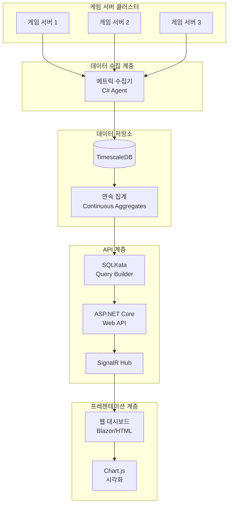

# 온라인 게임 서버를 위한 TimescaleDB 완벽 가이드  

저자: 최흥배, Claude AI   
    
권장 개발 환경
- **IDE**: Visual Studio 2022 (Community 이상)
- **.NET**: 9 이상
- **OS**: Windows 10 이상

-----  
  
# Chapter 15: 종합 프로젝트 1 - 실시간 게임 서버 대시보드

지금까지 배운 TimescaleDB의 모든 기술을 결합하여 실제로 동작하는 실시간 게임 서버 모니터링 대시보드를 만들어본다. 이 프로젝트는 단순한 예제가 아니라 실제 운영 환경에 바로 적용할 수 있는 수준의 완성도를 목표로 한다. 우리는 ASP.NET Core로 견고한 백엔드 API를 구축하고, SQLKata로 효율적인 쿼리를 작성하며, SignalR을 통해 실시간으로 데이터를 갱신하는 웹 대시보드를 완성할 것이다.

이 장에서 만들 대시보드는 실제 온라인 게임 서버의 상태를 한눈에 파악할 수 있는 통합 모니터링 시스템이다. 동시 접속자 수, 서버 응답 시간, 에러 발생률, 데이터베이스 성능 지표 등을 실시간으로 시각화하여 문제가 발생하기 전에 미리 대응할 수 있도록 돕는다.

## 15.1 프로젝트 아키텍처 설계

실시간 게임 서버 대시보드는 여러 컴포넌트가 유기적으로 연결된 시스템이다. 먼저 전체적인 아키텍처를 이해하고 각 컴포넌트의 역할을 명확히 정의해야 한다.

**시스템 전체 구조**

우리가 만들 대시보드 시스템은 크게 세 가지 계층으로 구성된다. 첫 번째는 데이터 수집 계층으로, 실제 게임 서버에서 발생하는 다양한 메트릭과 로그를 TimescaleDB에 저장하는 역할을 한다. 두 번째는 API 계층으로, ASP.NET Core Web API가 TimescaleDB에서 데이터를 조회하고 가공하여 클라이언트에게 제공한다. 세 번째는 프레젠테이션 계층으로, Blazor 또는 일반 웹 페이지에서 Chart.js를 사용해 데이터를 시각화한다.



**데이터 모델 설계**

대시보드가 표시할 주요 메트릭을 정의하고 이에 맞는 데이터 모델을 설계한다. 우리는 서버 성능, 플레이어 활동, 에러 추적, 데이터베이스 성능이라는 네 가지 영역을 모니터링할 것이다.

```sql
-- 서버 성능 메트릭 테이블 (1초 단위 수집)
CREATE TABLE server_metrics (
    time TIMESTAMPTZ NOT NULL,
    server_id TEXT NOT NULL,
    cpu_usage DOUBLE PRECISION,
    memory_usage DOUBLE PRECISION,
    network_in BIGINT,
    network_out BIGINT,
    active_connections INTEGER,
    request_count INTEGER,
    avg_response_time DOUBLE PRECISION
);

SELECT create_hypertable('server_metrics', 'time');

-- 1분 단위 연속 집계
CREATE MATERIALIZED VIEW server_metrics_1min
WITH (timescaledb.continuous) AS
SELECT 
    time_bucket('1 minute', time) AS bucket,
    server_id,
    AVG(cpu_usage) as avg_cpu,
    MAX(cpu_usage) as max_cpu,
    AVG(memory_usage) as avg_memory,
    MAX(memory_usage) as max_memory,
    SUM(network_in) as total_network_in,
    SUM(network_out) as total_network_out,
    AVG(active_connections) as avg_connections,
    SUM(request_count) as total_requests,
    AVG(avg_response_time) as avg_response_time,
    MAX(avg_response_time) as max_response_time
FROM server_metrics
GROUP BY bucket, server_id;

-- 플레이어 활동 메트릭
CREATE TABLE player_activity (
    time TIMESTAMPTZ NOT NULL,
    server_id TEXT NOT NULL,
    concurrent_users INTEGER,
    new_logins INTEGER,
    logouts INTEGER,
    active_battles INTEGER,
    items_traded INTEGER
);

SELECT create_hypertable('player_activity', 'time');

-- 에러 로그 테이블
CREATE TABLE error_logs (
    time TIMESTAMPTZ NOT NULL,
    server_id TEXT NOT NULL,
    error_level TEXT,
    error_code TEXT,
    error_message TEXT,
    stack_trace TEXT,
    user_id TEXT
);

SELECT create_hypertable('error_logs', 'time');
CREATE INDEX idx_error_logs_level ON error_logs(error_level, time DESC);
CREATE INDEX idx_error_logs_code ON error_logs(error_code, time DESC);
```

**프로젝트 구조**

ASP.NET Core 프로젝트의 구조를 명확하게 정의한다. 클린 아키텍처 원칙을 따라 각 계층의 책임을 분리하여 유지보수가 쉬운 구조를 만든다.

```
GameServerDashboard/
├── GameServerDashboard.API/           # Web API 프로젝트
│   ├── Controllers/
│   │   ├── MetricsController.cs       # 메트릭 조회 API
│   │   ├── PlayersController.cs       # 플레이어 데이터 API
│   │   └── ErrorsController.cs        # 에러 로그 API
│   ├── Hubs/
│   │   └── DashboardHub.cs            # SignalR 실시간 통신
│   ├── Program.cs
│   └── appsettings.json
├── GameServerDashboard.Core/          # 비즈니스 로직 & 도메인
│   ├── Models/
│   │   ├── ServerMetric.cs
│   │   ├── PlayerActivity.cs
│   │   └── ErrorLog.cs
│   ├── Interfaces/
│   │   └── IMetricsRepository.cs
│   └── Services/
│       └── DashboardService.cs
├── GameServerDashboard.Infrastructure/ # 데이터 액세스
│   ├── Data/
│   │   └── TimescaleDbContext.cs
│   ├── Repositories/
│   │   └── MetricsRepository.cs
│   └── QueryBuilders/
│       └── MetricsQueryBuilder.cs     # SQLKata 쿼리들
└── GameServerDashboard.Web/           # Blazor 프론트엔드
    ├── Pages/
    │   ├── Index.razor
    │   └── ServerDetails.razor
    └── wwwroot/
        ├── js/
        │   └── dashboard.js           # Chart.js 초기화
        └── css/
            └── dashboard.css
```

**핵심 기능 정의**

대시보드가 제공해야 할 핵심 기능들을 명확히 정의한다. 각 기능은 실제 운영에서 즉시 사용할 수 있는 실용적인 것들이다.

**실시간 서버 상태 모니터링:** 모든 게임 서버의 CPU, 메모리, 네트워크 사용량을 실시간으로 표시한다. 임계값을 초과하면 빨간색으로 강조 표시하여 즉각적인 대응이 가능하도록 한다.

**동시 접속자 추이 그래프:** 시간대별 동시 접속자 수를 라인 차트로 표시한다. 전일 동시간대 비교 기능을 제공하여 트래픽 패턴의 변화를 파악할 수 있다.

**에러율 모니터링:** 분당 발생하는 에러의 수와 종류를 실시간으로 표시한다. 특정 에러가 급증하는 경우 자동으로 알림을 표시한다.

**서버별 성능 비교:** 여러 게임 서버의 성능 지표를 나란히 비교하여 특정 서버에 문제가 있는지 쉽게 파악할 수 있다.

**과거 데이터 조회:** 시간 범위를 선택하여 과거의 데이터를 조회하고 분석할 수 있다. 문제가 발생했을 때 그 시점의 상황을 재현하여 원인을 분석하는 데 사용한다.

## 15.2 ASP.NET Core Web API 구축

이제 실제로 코드를 작성할 차례다. ASP.NET Core Web API 프로젝트를 생성하고 TimescaleDB와 연결하는 기본 구조를 만든다.

**프로젝트 생성 및 패키지 설치**

Visual Studio 2022 또는 VS Code를 사용하여 새 ASP.NET Core Web API 프로젝트를 생성한다. 먼저 필요한 NuGet 패키지들을 설치한다.

```bash
# 프로젝트 생성
dotnet new webapi -n GameServerDashboard.API
cd GameServerDashboard.API

# 필요한 패키지 설치
dotnet add package Npgsql
dotnet add package SqlKata
dotnet add package SqlKata.Execution
dotnet add package Microsoft.AspNetCore.SignalR
dotnet add package Dapper
```

**데이터베이스 연결 설정**

`appsettings.json` 파일에 TimescaleDB 연결 문자열을 설정한다.

```json
{
  "ConnectionStrings": {
    "TimescaleDB": "Host=localhost;Port=5432;Database=game_monitoring;Username=postgres;Password=your_password;Pooling=true;Minimum Pool Size=5;Maximum Pool Size=100;"
  },
  "DashboardSettings": {
    "RefreshIntervalSeconds": 5,
    "MetricRetentionDays": 30,
    "EnableRealTimeUpdates": true
  },
  "Logging": {
    "LogLevel": {
      "Default": "Information",
      "Microsoft.AspNetCore": "Warning"
    }
  },
  "AllowedHosts": "*"
}
```

**데이터 모델 정의**

Core 프로젝트에 도메인 모델들을 정의한다.

```csharp
// GameServerDashboard.Core/Models/ServerMetric.cs
namespace GameServerDashboard.Core.Models
{
    public class ServerMetric
    {
        public DateTime Time { get; set; }
        public string ServerId { get; set; }
        public double CpuUsage { get; set; }
        public double MemoryUsage { get; set; }
        public long NetworkIn { get; set; }
        public long NetworkOut { get; set; }
        public int ActiveConnections { get; set; }
        public int RequestCount { get; set; }
        public double AvgResponseTime { get; set; }
        
        // 계산된 속성: 서버 상태 판단
        public ServerHealthStatus HealthStatus 
        {
            get
            {
                if (CpuUsage > 90 || MemoryUsage > 90 || AvgResponseTime > 1000)
                    return ServerHealthStatus.Critical;
                if (CpuUsage > 70 || MemoryUsage > 70 || AvgResponseTime > 500)
                    return ServerHealthStatus.Warning;
                return ServerHealthStatus.Healthy;
            }
        }
    }
    
    public enum ServerHealthStatus
    {
        Healthy,
        Warning,
        Critical
    }
}
```

```csharp
// GameServerDashboard.Core/Models/PlayerActivity.cs
namespace GameServerDashboard.Core.Models
{
    public class PlayerActivity
    {
        public DateTime Time { get; set; }
        public string ServerId { get; set; }
        public int ConcurrentUsers { get; set; }
        public int NewLogins { get; set; }
        public int Logouts { get; set; }
        public int ActiveBattles { get; set; }
        public int ItemsTraded { get; set; }
    }
    
    // 대시보드용 집계 데이터
    public class PlayerActivitySummary
    {
        public DateTime TimeWindow { get; set; }
        public int TotalConcurrentUsers { get; set; }
        public int PeakConcurrentUsers { get; set; }
        public int TotalNewLogins { get; set; }
        public double AvgSessionDuration { get; set; }
        public Dictionary<string, int> UsersByServer { get; set; }
    }
}
```

```csharp
// GameServerDashboard.Core/Models/ErrorLog.cs
namespace GameServerDashboard.Core.Models
{
    public class ErrorLog
    {
        public DateTime Time { get; set; }
        public string ServerId { get; set; }
        public string ErrorLevel { get; set; }
        public string ErrorCode { get; set; }
        public string ErrorMessage { get; set; }
        public string StackTrace { get; set; }
        public string UserId { get; set; }
    }
    
    // 에러 통계
    public class ErrorStatistics
    {
        public DateTime TimeWindow { get; set; }
        public int TotalErrors { get; set; }
        public int CriticalErrors { get; set; }
        public int WarningErrors { get; set; }
        public Dictionary<string, int> ErrorsByCode { get; set; }
        public List<TopError> TopErrors { get; set; }
    }
    
    public class TopError
    {
        public string ErrorCode { get; set; }
        public string ErrorMessage { get; set; }
        public int Count { get; set; }
        public DateTime LastOccurrence { get; set; }
    }
}
```

**Repository 인터페이스 정의**

데이터 접근 계층의 인터페이스를 정의한다.

```csharp
// GameServerDashboard.Core/Interfaces/IMetricsRepository.cs
namespace GameServerDashboard.Core.Interfaces
{
    public interface IMetricsRepository
    {
        // 서버 메트릭 조회
        Task<List<ServerMetric>> GetRecentMetricsAsync(
            string serverId, 
            DateTime startTime, 
            DateTime endTime);
        
        Task<List<ServerMetric>> GetLatestMetricsAllServersAsync();
        
        Task<Dictionary<string, double>> GetAverageMetricsAsync(
            string serverId, 
            DateTime startTime, 
            DateTime endTime);
        
        // 플레이어 활동 조회
        Task<List<PlayerActivity>> GetPlayerActivityAsync(
            DateTime startTime, 
            DateTime endTime);
        
        Task<PlayerActivitySummary> GetPlayerActivitySummaryAsync(
            DateTime startTime, 
            DateTime endTime);
        
        Task<Dictionary<DateTime, int>> GetConcurrentUsersTimeSeriesAsync(
            DateTime startTime, 
            DateTime endTime, 
            string interval = "5 minutes");
        
        // 에러 로그 조회
        Task<List<ErrorLog>> GetRecentErrorsAsync(
            int limit = 100, 
            string errorLevel = null);
        
        Task<ErrorStatistics> GetErrorStatisticsAsync(
            DateTime startTime, 
            DateTime endTime);
        
        Task<Dictionary<DateTime, int>> GetErrorRateTimeSeriesAsync(
            DateTime startTime, 
            DateTime endTime, 
            string interval = "1 minute");
    }
}
```

## 15.3 SQLKata로 대시보드 쿼리 작성

이제 SQLKata를 사용하여 실제 쿼리를 작성한다. 복잡한 집계 쿼리도 SQLKata를 사용하면 깔끔하고 유지보수하기 쉬운 코드로 작성할 수 있다.

**Repository 구현**

```csharp
// GameServerDashboard.Infrastructure/Repositories/MetricsRepository.cs
using Npgsql;
using SqlKata;
using SqlKata.Execution;
using SqlKata.Compilers;
using Dapper;
using GameServerDashboard.Core.Interfaces;
using GameServerDashboard.Core.Models;

namespace GameServerDashboard.Infrastructure.Repositories
{
    public class MetricsRepository : IMetricsRepository
    {
        private readonly string _connectionString;
        private readonly PostgresCompiler _compiler;
        
        public MetricsRepository(string connectionString)
        {
            _connectionString = connectionString;
            _compiler = new PostgresCompiler();
        }
        
        private NpgsqlConnection GetConnection()
        {
            return new NpgsqlConnection(_connectionString);
        }
        
        private QueryFactory GetQueryFactory()
        {
            var connection = GetConnection();
            return new QueryFactory(connection, _compiler);
        }
        
        public async Task<List<ServerMetric>> GetRecentMetricsAsync(
            string serverId, 
            DateTime startTime, 
            DateTime endTime)
        {
            using var db = GetQueryFactory();
            
            var query = new Query("server_metrics")
                .Select("time", "server_id", "cpu_usage", "memory_usage", 
                        "network_in", "network_out", "active_connections", 
                        "request_count", "avg_response_time")
                .Where("server_id", serverId)
                .WhereBetween("time", startTime, endTime)
                .OrderByDesc("time");
            
            var results = await query.GetAsync<ServerMetric>();
            return results.ToList();
        }
        
        public async Task<List<ServerMetric>> GetLatestMetricsAllServersAsync()
        {
            using var connection = GetConnection();
            
            // DISTINCT ON을 사용하여 각 서버의 최신 메트릭 조회
            // SQLKata는 DISTINCT ON을 직접 지원하지 않으므로 Raw SQL 사용
            var sql = @"
                SELECT DISTINCT ON (server_id) 
                    time, 
                    server_id, 
                    cpu_usage, 
                    memory_usage,
                    network_in, 
                    network_out, 
                    active_connections, 
                    request_count,
                    avg_response_time
                FROM server_metrics
                WHERE time > NOW() - INTERVAL '5 minutes'
                ORDER BY server_id, time DESC";
            
            var results = await connection.QueryAsync<ServerMetric>(sql);
            return results.ToList();
        }
        
        public async Task<Dictionary<string, double>> GetAverageMetricsAsync(
            string serverId, 
            DateTime startTime, 
            DateTime endTime)
        {
            using var db = GetQueryFactory();
            
            var query = new Query("server_metrics")
                .Select(
                    Query.Raw("AVG(cpu_usage) as avg_cpu"),
                    Query.Raw("AVG(memory_usage) as avg_memory"),
                    Query.Raw("AVG(active_connections) as avg_connections"),
                    Query.Raw("AVG(avg_response_time) as avg_response_time")
                )
                .Where("server_id", serverId)
                .WhereBetween("time", startTime, endTime);
            
            var result = await query.FirstOrDefaultAsync<dynamic>();
            
            return new Dictionary<string, double>
            {
                ["avg_cpu"] = result?.avg_cpu ?? 0,
                ["avg_memory"] = result?.avg_memory ?? 0,
                ["avg_connections"] = result?.avg_connections ?? 0,
                ["avg_response_time"] = result?.avg_response_time ?? 0
            };
        }
        
        public async Task<Dictionary<DateTime, int>> GetConcurrentUsersTimeSeriesAsync(
            DateTime startTime, 
            DateTime endTime, 
            string interval = "5 minutes")
        {
            using var connection = GetConnection();
            
            // TimescaleDB의 time_bucket 함수 사용
            var sql = $@"
                SELECT 
                    time_bucket('{interval}', time) as time_window,
                    SUM(concurrent_users) as total_users
                FROM player_activity
                WHERE time BETWEEN @StartTime AND @EndTime
                GROUP BY time_window
                ORDER BY time_window";
            
            var results = await connection.QueryAsync<dynamic>(
                sql, 
                new { StartTime = startTime, EndTime = endTime });
            
            return results.ToDictionary(
                r => (DateTime)r.time_window,
                r => (int)r.total_users
            );
        }
        
        public async Task<PlayerActivitySummary> GetPlayerActivitySummaryAsync(
            DateTime startTime, 
            DateTime endTime)
        {
            using var connection = GetConnection();
            
            var sql = @"
                SELECT 
                    time_bucket('1 hour', time) as time_window,
                    SUM(concurrent_users) as total_concurrent,
                    MAX(concurrent_users) as peak_concurrent,
                    SUM(new_logins) as total_logins
                FROM player_activity
                WHERE time BETWEEN @StartTime AND @EndTime
                GROUP BY time_window
                ORDER BY time_window DESC
                LIMIT 1";
            
            var mainStats = await connection.QueryFirstOrDefaultAsync<dynamic>(
                sql, 
                new { StartTime = startTime, EndTime = endTime });
            
            // 서버별 사용자 수
            var serverSql = @"
                SELECT 
                    server_id,
                    AVG(concurrent_users)::int as avg_users
                FROM player_activity
                WHERE time BETWEEN @StartTime AND @EndTime
                GROUP BY server_id";
            
            var serverStats = await connection.QueryAsync<dynamic>(
                serverSql, 
                new { StartTime = startTime, EndTime = endTime });
            
            return new PlayerActivitySummary
            {
                TimeWindow = mainStats?.time_window ?? DateTime.UtcNow,
                TotalConcurrentUsers = mainStats?.total_concurrent ?? 0,
                PeakConcurrentUsers = mainStats?.peak_concurrent ?? 0,
                TotalNewLogins = mainStats?.total_logins ?? 0,
                UsersByServer = serverStats.ToDictionary(
                    s => (string)s.server_id,
                    s => (int)s.avg_users
                )
            };
        }
        
        public async Task<ErrorStatistics> GetErrorStatisticsAsync(
            DateTime startTime, 
            DateTime endTime)
        {
            using var connection = GetConnection();
            
            // 전체 에러 통계
            var totalSql = @"
                SELECT 
                    COUNT(*) as total_errors,
                    COUNT(*) FILTER (WHERE error_level = 'Critical') as critical_errors,
                    COUNT(*) FILTER (WHERE error_level = 'Warning') as warning_errors
                FROM error_logs
                WHERE time BETWEEN @StartTime AND @EndTime";
            
            var totalStats = await connection.QueryFirstAsync<dynamic>(
                totalSql, 
                new { StartTime = startTime, EndTime = endTime });
            
            // 에러 코드별 통계
            var codeSql = @"
                SELECT 
                    error_code,
                    COUNT(*) as count
                FROM error_logs
                WHERE time BETWEEN @StartTime AND @EndTime
                GROUP BY error_code
                ORDER BY count DESC";
            
            var codeStats = await connection.QueryAsync<dynamic>(
                codeSql, 
                new { StartTime = startTime, EndTime = endTime });
            
            // 상위 에러들
            var topSql = @"
                SELECT 
                    error_code,
                    error_message,
                    COUNT(*) as count,
                    MAX(time) as last_occurrence
                FROM error_logs
                WHERE time BETWEEN @StartTime AND @EndTime
                GROUP BY error_code, error_message
                ORDER BY count DESC
                LIMIT 10";
            
            var topErrors = await connection.QueryAsync<TopError>(
                topSql, 
                new { StartTime = startTime, EndTime = endTime });
            
            return new ErrorStatistics
            {
                TimeWindow = startTime,
                TotalErrors = totalStats.total_errors,
                CriticalErrors = totalStats.critical_errors,
                WarningErrors = totalStats.warning_errors,
                ErrorsByCode = codeStats.ToDictionary(
                    c => (string)c.error_code,
                    c => (int)c.count
                ),
                TopErrors = topErrors.ToList()
            };
        }
        
        public async Task<Dictionary<DateTime, int>> GetErrorRateTimeSeriesAsync(
            DateTime startTime, 
            DateTime endTime, 
            string interval = "1 minute")
        {
            using var connection = GetConnection();
            
            var sql = $@"
                SELECT 
                    time_bucket('{interval}', time) as time_window,
                    COUNT(*) as error_count
                FROM error_logs
                WHERE time BETWEEN @StartTime AND @EndTime
                GROUP BY time_window
                ORDER BY time_window";
            
            var results = await connection.QueryAsync<dynamic>(
                sql, 
                new { StartTime = startTime, EndTime = endTime });
            
            return results.ToDictionary(
                r => (DateTime)r.time_window,
                r => (int)r.error_count
            );
        }
        
        public async Task<List<ErrorLog>> GetRecentErrorsAsync(
            int limit = 100, 
            string errorLevel = null)
        {
            using var db = GetQueryFactory();
            
            var query = new Query("error_logs")
                .Select("time", "server_id", "error_level", "error_code", 
                        "error_message", "stack_trace", "user_id")
                .OrderByDesc("time")
                .Limit(limit);
            
            if (!string.IsNullOrEmpty(errorLevel))
            {
                query.Where("error_level", errorLevel);
            }
            
            var results = await query.GetAsync<ErrorLog>();
            return results.ToList();
        }
    }
}
```

**최적화된 쿼리 빌더**

복잡한 쿼리를 재사용 가능한 빌더 패턴으로 구현한다.

```csharp
// GameServerDashboard.Infrastructure/QueryBuilders/MetricsQueryBuilder.cs
using SqlKata;

namespace GameServerDashboard.Infrastructure.QueryBuilders
{
    public static class MetricsQueryBuilder
    {
        // 시계열 데이터 조회를 위한 기본 쿼리 빌더
        public static Query BuildTimeSeriesQuery(
            string tableName,
            string timeColumn,
            DateTime startTime,
            DateTime endTime,
            string bucketInterval,
            params string[] aggregations)
        {
            var query = new Query(tableName)
                .WhereBetween(timeColumn, startTime, endTime);
            
            // time_bucket 사용
            query.Select(Query.Raw($"time_bucket('{bucketInterval}', {timeColumn}) as time_window"));
            
            // 집계 함수들 추가
            foreach (var agg in aggregations)
            {
                query.Select(Query.Raw(agg));
            }
            
            return query
                .GroupBy(Query.Raw("time_window"))
                .OrderBy(Query.Raw("time_window"));
        }
        
        // 서버 비교를 위한 쿼리
        public static Query BuildServerComparisonQuery(
            DateTime startTime,
            DateTime endTime,
            params string[] serverIds)
        {
            var query = new Query("server_metrics")
                .Select(
                    "server_id",
                    Query.Raw("AVG(cpu_usage) as avg_cpu"),
                    Query.Raw("AVG(memory_usage) as avg_memory"),
                    Query.Raw("AVG(avg_response_time) as avg_response"),
                    Query.Raw("SUM(request_count) as total_requests")
                )
                .WhereBetween("time", startTime, endTime)
                .GroupBy("server_id");
            
            if (serverIds?.Length > 0)
            {
                query.WhereIn("server_id", serverIds);
            }
            
            return query;
        }
        
        // 이상치 탐지 쿼리
        public static Query BuildAnomalyDetectionQuery(
            string serverId,
            DateTime startTime,
            double cpuThreshold,
            double memoryThreshold,
            double responseTimeThreshold)
        {
            return new Query("server_metrics")
                .Select("time", "server_id", "cpu_usage", "memory_usage", "avg_response_time")
                .Where("server_id", serverId)
                .Where("time", ">", startTime)
                .Where(q => q
                    .Where("cpu_usage", ">", cpuThreshold)
                    .OrWhere("memory_usage", ">", memoryThreshold)
                    .OrWhere("avg_response_time", ">", responseTimeThreshold)
                )
                .OrderByDesc("time");
        }
    }
}
```

## 15.4 실시간 데이터 갱신 (SignalR)

대시보드의 가장 중요한 기능은 실시간으로 데이터가 업데이트되는 것이다. SignalR을 사용하여 서버에서 클라이언트로 자동으로 데이터를 푸시하는 기능을 구현한다.

**SignalR Hub 구현**

```csharp
// GameServerDashboard.API/Hubs/DashboardHub.cs
using Microsoft.AspNetCore.SignalR;
using GameServerDashboard.Core.Interfaces;
using GameServerDashboard.Core.Models;

namespace GameServerDashboard.API.Hubs
{
    public class DashboardHub : Hub
    {
        private readonly IMetricsRepository _metricsRepository;
        private readonly ILogger<DashboardHub> _logger;
        
        public DashboardHub(
            IMetricsRepository metricsRepository,
            ILogger<DashboardHub> logger)
        {
            _metricsRepository = metricsRepository;
            _logger = logger;
        }
        
        // 클라이언트가 연결되었을 때
        public override async Task OnConnectedAsync()
        {
            _logger.LogInformation($"Client connected: {Context.ConnectionId}");
            
            // 초기 데이터 전송
            await SendInitialData();
            
            await base.OnConnectedAsync();
        }
        
        // 클라이언트가 연결 해제되었을 때
        public override async Task OnDisconnectedAsync(Exception exception)
        {
            _logger.LogInformation($"Client disconnected: {Context.ConnectionId}");
            await base.OnDisconnectedAsync(exception);
        }
        
        // 초기 데이터 전송
        private async Task SendInitialData()
        {
            try
            {
                var latestMetrics = await _metricsRepository.GetLatestMetricsAllServersAsync();
                await Clients.Caller.SendAsync("ReceiveInitialMetrics", latestMetrics);
                
                var endTime = DateTime.UtcNow;
                var startTime = endTime.AddHours(-1);
                var playerSummary = await _metricsRepository.GetPlayerActivitySummaryAsync(startTime, endTime);
                await Clients.Caller.SendAsync("ReceivePlayerSummary", playerSummary);
            }
            catch (Exception ex)
            {
                _logger.LogError(ex, "Error sending initial data");
            }
        }
        
        // 특정 서버 구독
        public async Task SubscribeToServer(string serverId)
        {
            await Groups.AddToGroupAsync(Context.ConnectionId, $"server_{serverId}");
            _logger.LogInformation($"Client {Context.ConnectionId} subscribed to server {serverId}");
        }
        
        // 특정 서버 구독 해제
        public async Task UnsubscribeFromServer(string serverId)
        {
            await Groups.RemoveFromGroupAsync(Context.ConnectionId, $"server_{serverId}");
            _logger.LogInformation($"Client {Context.ConnectionId} unsubscribed from server {serverId}");
        }
        
        // 시간 범위 변경 요청
        public async Task RequestTimeRangeData(DateTime startTime, DateTime endTime)
        {
            try
            {
                var concurrentUsers = await _metricsRepository.GetConcurrentUsersTimeSeriesAsync(
                    startTime, endTime, "5 minutes");
                
                await Clients.Caller.SendAsync("ReceiveTimeRangeData", new
                {
                    startTime,
                    endTime,
                    concurrentUsers
                });
            }
            catch (Exception ex)
            {
                _logger.LogError(ex, "Error requesting time range data");
                await Clients.Caller.SendAsync("Error", "Failed to load time range data");
            }
        }
    }
}
```

**백그라운드 데이터 푸시 서비스**

주기적으로 최신 데이터를 조회하여 연결된 모든 클라이언트에게 푸시하는 백그라운드 서비스를 구현한다.

```csharp
// GameServerDashboard.API/Services/DashboardUpdateService.cs
using Microsoft.AspNetCore.SignalR;
using GameServerDashboard.API.Hubs;
using GameServerDashboard.Core.Interfaces;

namespace GameServerDashboard.API.Services
{
    public class DashboardUpdateService : BackgroundService
    {
        private readonly IServiceProvider _serviceProvider;
        private readonly IHubContext<DashboardHub> _hubContext;
        private readonly ILogger<DashboardUpdateService> _logger;
        private readonly int _updateIntervalSeconds;
        
        public DashboardUpdateService(
            IServiceProvider serviceProvider,
            IHubContext<DashboardHub> hubContext,
            IConfiguration configuration,
            ILogger<DashboardUpdateService> logger)
        {
            _serviceProvider = serviceProvider;
            _hubContext = hubContext;
            _logger = logger;
            _updateIntervalSeconds = configuration.GetValue<int>("DashboardSettings:RefreshIntervalSeconds", 5);
        }
        
        protected override async Task ExecuteAsync(CancellationToken stoppingToken)
        {
            _logger.LogInformation("Dashboard Update Service started");
            
            while (!stoppingToken.IsCancellationRequested)
            {
                try
                {
                    await UpdateDashboardData();
                    await Task.Delay(TimeSpan.FromSeconds(_updateIntervalSeconds), stoppingToken);
                }
                catch (Exception ex)
                {
                    _logger.LogError(ex, "Error in dashboard update cycle");
                    await Task.Delay(TimeSpan.FromSeconds(10), stoppingToken);
                }
            }
            
            _logger.LogInformation("Dashboard Update Service stopped");
        }
        
        private async Task UpdateDashboardData()
        {
            using var scope = _serviceProvider.CreateScope();
            var metricsRepository = scope.ServiceProvider.GetRequiredService<IMetricsRepository>();
            
            // 최신 서버 메트릭 조회 및 전송
            var latestMetrics = await metricsRepository.GetLatestMetricsAllServersAsync();
            if (latestMetrics.Any())
            {
                await _hubContext.Clients.All.SendAsync("ReceiveMetricsUpdate", latestMetrics);
                
                // 경고 상태인 서버 체크
                var criticalServers = latestMetrics
                    .Where(m => m.HealthStatus == ServerHealthStatus.Critical)
                    .ToList();
                
                if (criticalServers.Any())
                {
                    await _hubContext.Clients.All.SendAsync("ReceiveAlert", new
                    {
                        Level = "critical",
                        Message = $"{criticalServers.Count} server(s) in critical state",
                        Servers = criticalServers.Select(s => s.ServerId).ToList(),
                        Timestamp = DateTime.UtcNow
                    });
                }
            }
            
            // 최근 에러율 조회
            var endTime = DateTime.UtcNow;
            var startTime = endTime.AddMinutes(-5);
            var errorRate = await metricsRepository.GetErrorRateTimeSeriesAsync(
                startTime, endTime, "1 minute");
            
            if (errorRate.Any())
            {
                var recentErrorCount = errorRate.Values.Sum();
                if (recentErrorCount > 100) // 5분간 100개 이상 에러 발생
                {
                    await _hubContext.Clients.All.SendAsync("ReceiveAlert", new
                    {
                        Level = "warning",
                        Message = $"High error rate detected: {recentErrorCount} errors in last 5 minutes",
                        Timestamp = DateTime.UtcNow
                    });
                }
                
                await _hubContext.Clients.All.SendAsync("ReceiveErrorRateUpdate", errorRate);
            }
        }
    }
}
```

**Program.cs 설정**

모든 서비스를 등록하고 SignalR을 활성화한다.

```csharp
// GameServerDashboard.API/Program.cs
using GameServerDashboard.API.Hubs;
using GameServerDashboard.API.Services;
using GameServerDashboard.Core.Interfaces;
using GameServerDashboard.Infrastructure.Repositories;

var builder = WebApplication.CreateBuilder(args);

// 서비스 등록
builder.Services.AddControllers();
builder.Services.AddEndpointsApiExplorer();
builder.Services.AddSwaggerGen();

// SignalR 등록
builder.Services.AddSignalR(options =>
{
    options.EnableDetailedErrors = true;
    options.KeepAliveInterval = TimeSpan.FromSeconds(10);
    options.ClientTimeoutInterval = TimeSpan.FromSeconds(30);
});

// CORS 설정 (개발 환경)
builder.Services.AddCors(options =>
{
    options.AddDefaultPolicy(policy =>
    {
        policy.WithOrigins("http://localhost:5173", "https://localhost:5001")
              .AllowAnyHeader()
              .AllowAnyMethod()
              .AllowCredentials();
    });
});

// Repository 등록
var connectionString = builder.Configuration.GetConnectionString("TimescaleDB");
builder.Services.AddScoped<IMetricsRepository>(sp => 
    new MetricsRepository(connectionString));

// 백그라운드 서비스 등록
builder.Services.AddHostedService<DashboardUpdateService>();

// 로깅 설정
builder.Logging.ClearProviders();
builder.Logging.AddConsole();
builder.Logging.AddDebug();

var app = builder.Build();

// 미들웨어 파이프라인 구성
if (app.Environment.IsDevelopment())
{
    app.UseSwagger();
    app.UseSwaggerUI();
}

app.UseHttpsRedirection();
app.UseCors();
app.UseAuthorization();
app.MapControllers();

// SignalR Hub 매핑
app.MapHub<DashboardHub>("/dashboardHub");

app.Run();
```

## 15.5 Chart.js 시각화

데이터를 효과적으로 시각화하기 위해 Chart.js를 사용한다. 다양한 차트 유형을 활용하여 직관적인 대시보드를 만든다.

**HTML 대시보드 구조**

```html
<!-- GameServerDashboard.Web/wwwroot/index.html -->
<!DOCTYPE html>
<html lang="ko">
<head>
    <meta charset="UTF-8">
    <meta name="viewport" content="width=device-width, initial-scale=1.0">
    <title>게임 서버 대시보드</title>
    <link rel="stylesheet" href="css/dashboard.css">
    <script src="https://cdn.jsdelivr.net/npm/chart.js@4.4.0/dist/chart.umd.min.js"></script>
    <script src="https://cdn.jsdelivr.net/npm/@microsoft/signalr@7.0.0/dist/browser/signalr.min.js"></script>
</head>
<body>
    <div class="dashboard-container">
        <!-- 헤더 -->
        <header class="dashboard-header">
            <h1>🎮 게임 서버 모니터링 대시보드</h1>
            <div class="header-info">
                <span id="connectionStatus" class="status-connected">● 연결됨</span>
                <span id="lastUpdate">마지막 업데이트: -</span>
            </div>
        </header>
        
        <!-- 알림 영역 -->
        <div id="alertContainer" class="alert-container"></div>
        
        <!-- 주요 지표 카드 -->
        <section class="metrics-cards">
            <div class="metric-card">
                <h3>전체 동접자</h3>
                <div class="metric-value" id="totalConcurrentUsers">-</div>
                <div class="metric-change" id="userChange">-</div>
            </div>
            <div class="metric-card">
                <h3>활성 서버</h3>
                <div class="metric-value" id="activeServers">-</div>
                <div class="metric-detail" id="serverHealth">-</div>
            </div>
            <div class="metric-card">
                <h3>평균 응답시간</h3>
                <div class="metric-value" id="avgResponseTime">- ms</div>
                <div class="metric-change" id="responseChange">-</div>
            </div>
            <div class="metric-card">
                <h3>에러율</h3>
                <div class="metric-value" id="errorRate">-</div>
                <div class="metric-change" id="errorChange">-</div>
            </div>
        </section>
        
        <!-- 차트 그리드 -->
        <section class="charts-grid">
            <!-- 동접자 추이 -->
            <div class="chart-container">
                <h3>동시 접속자 추이 (최근 1시간)</h3>
                <canvas id="concurrentUsersChart"></canvas>
            </div>
            
            <!-- 서버별 CPU 사용률 -->
            <div class="chart-container">
                <h3>서버별 CPU 사용률</h3>
                <canvas id="cpuUsageChart"></canvas>
            </div>
            
            <!-- 메모리 사용률 -->
            <div class="chart-container">
                <h3>서버별 메모리 사용률</h3>
                <canvas id="memoryUsageChart"></canvas>
            </div>
            
            <!-- 에러 발생 추이 -->
            <div class="chart-container">
                <h3>에러 발생 추이 (최근 30분)</h3>
                <canvas id="errorRateChart"></canvas>
            </div>
        </section>
        
        <!-- 서버 상세 테이블 -->
        <section class="server-details">
            <h3>서버 상세 현황</h3>
            <table id="serverTable">
                <thead>
                    <tr>
                        <th>서버 ID</th>
                        <th>상태</th>
                        <th>CPU</th>
                        <th>메모리</th>
                        <th>활성 연결</th>
                        <th>응답시간</th>
                        <th>요청 수</th>
                    </tr>
                </thead>
                <tbody id="serverTableBody">
                    <!-- 동적으로 채워짐 -->
                </tbody>
            </table>
        </section>
        
        <!-- 최근 에러 로그 -->
        <section class="recent-errors">
            <h3>최근 에러 로그</h3>
            <div id="errorLogContainer">
                <!-- 동적으로 채워짐 -->
            </div>
        </section>
    </div>
    
    <script src="js/dashboard.js"></script>
</body>
</html>
```

**CSS 스타일**

```css
/* GameServerDashboard.Web/wwwroot/css/dashboard.css */
:root {
    --primary-color: #3498db;
    --success-color: #2ecc71;
    --warning-color: #f39c12;
    --danger-color: #e74c3c;
    --bg-dark: #2c3e50;
    --bg-light: #ecf0f1;
    --text-dark: #2c3e50;
    --text-light: #ecf0f1;
}

* {
    margin: 0;
    padding: 0;
    box-sizing: border-box;
}

body {
    font-family: 'Segoe UI', Tahoma, Geneva, Verdana, sans-serif;
    background-color: var(--bg-light);
    color: var(--text-dark);
}

.dashboard-container {
    max-width: 1400px;
    margin: 0 auto;
    padding: 20px;
}

.dashboard-header {
    background: linear-gradient(135deg, #667eea 0%, #764ba2 100%);
    color: white;
    padding: 30px;
    border-radius: 10px;
    margin-bottom: 20px;
    display: flex;
    justify-content: space-between;
    align-items: center;
    box-shadow: 0 4px 6px rgba(0, 0, 0, 0.1);
}

.dashboard-header h1 {
    font-size: 2em;
    font-weight: 600;
}

.header-info {
    display: flex;
    flex-direction: column;
    align-items: flex-end;
    gap: 5px;
}

.status-connected {
    color: var(--success-color);
    font-weight: bold;
}

.status-disconnected {
    color: var(--danger-color);
    font-weight: bold;
}

/* 알림 영역 */
.alert-container {
    margin-bottom: 20px;
}

.alert {
    padding: 15px 20px;
    border-radius: 8px;
    margin-bottom: 10px;
    display: flex;
    align-items: center;
    gap: 10px;
    animation: slideIn 0.3s ease-out;
}

@keyframes slideIn {
    from {
        transform: translateX(100%);
        opacity: 0;
    }
    to {
        transform: translateX(0);
        opacity: 1;
    }
}

.alert-critical {
    background-color: #fee;
    border-left: 4px solid var(--danger-color);
    color: var(--danger-color);
}

.alert-warning {
    background-color: #fff3cd;
    border-left: 4px solid var(--warning-color);
    color: #856404;
}

/* 메트릭 카드 */
.metrics-cards {
    display: grid;
    grid-template-columns: repeat(auto-fit, minmax(250px, 1fr));
    gap: 20px;
    margin-bottom: 30px;
}

.metric-card {
    background: white;
    padding: 25px;
    border-radius: 10px;
    box-shadow: 0 2px 4px rgba(0, 0, 0, 0.1);
    transition: transform 0.2s, box-shadow 0.2s;
}

.metric-card:hover {
    transform: translateY(-5px);
    box-shadow: 0 4px 12px rgba(0, 0, 0, 0.15);
}

.metric-card h3 {
    font-size: 0.9em;
    color: #7f8c8d;
    margin-bottom: 10px;
    text-transform: uppercase;
    letter-spacing: 0.5px;
}

.metric-value {
    font-size: 2.5em;
    font-weight: bold;
    color: var(--primary-color);
    margin-bottom: 5px;
}

.metric-change {
    font-size: 0.9em;
    color: #95a5a6;
}

.metric-change.positive {
    color: var(--success-color);
}

.metric-change.negative {
    color: var(--danger-color);
}

/* 차트 그리드 */
.charts-grid {
    display: grid;
    grid-template-columns: repeat(auto-fit, minmax(500px, 1fr));
    gap: 20px;
    margin-bottom: 30px;
}

.chart-container {
    background: white;
    padding: 20px;
    border-radius: 10px;
    box-shadow: 0 2px 4px rgba(0, 0, 0, 0.1);
}

.chart-container h3 {
    margin-bottom: 15px;
    color: var(--text-dark);
    font-size: 1.1em;
}

.chart-container canvas {
    max-height: 300px;
}

/* 서버 테이블 */
.server-details {
    background: white;
    padding: 20px;
    border-radius: 10px;
    box-shadow: 0 2px 4px rgba(0, 0, 0, 0.1);
    margin-bottom: 30px;
}

.server-details h3 {
    margin-bottom: 15px;
    color: var(--text-dark);
}

#serverTable {
    width: 100%;
    border-collapse: collapse;
}

#serverTable th {
    background-color: var(--bg-dark);
    color: white;
    padding: 12px;
    text-align: left;
    font-weight: 600;
}

#serverTable td {
    padding: 12px;
    border-bottom: 1px solid #ecf0f1;
}

#serverTable tbody tr:hover {
    background-color: #f8f9fa;
}

.health-badge {
    display: inline-block;
    padding: 4px 12px;
    border-radius: 20px;
    font-size: 0.85em;
    font-weight: bold;
}

.health-healthy {
    background-color: #d4edda;
    color: #155724;
}

.health-warning {
    background-color: #fff3cd;
    color: #856404;
}

.health-critical {
    background-color: #f8d7da;
    color: #721c24;
}

/* 에러 로그 */
.recent-errors {
    background: white;
    padding: 20px;
    border-radius: 10px;
    box-shadow: 0 2px 4px rgba(0, 0, 0, 0.1);
}

.recent-errors h3 {
    margin-bottom: 15px;
    color: var(--text-dark);
}

.error-log-item {
    padding: 12px;
    border-left: 3px solid var(--danger-color);
    background-color: #f8f9fa;
    margin-bottom: 10px;
    border-radius: 4px;
}

.error-log-header {
    display: flex;
    justify-content: space-between;
    margin-bottom: 5px;
}

.error-code {
    font-weight: bold;
    color: var(--danger-color);
}

.error-time {
    color: #7f8c8d;
    font-size: 0.9em;
}

.error-message {
    color: var(--text-dark);
    font-size: 0.95em;
}
```

**JavaScript 대시보드 로직**

```javascript
// GameServerDashboard.Web/wwwroot/js/dashboard.js

// SignalR 연결 설정
const connection = new signalR.HubConnectionBuilder()
    .withUrl("https://localhost:7001/dashboardHub")
    .withAutomaticReconnect()
    .configureLogging(signalR.LogLevel.Information)
    .build();

// 차트 인스턴스 저장
let charts = {};

// 차트 초기화
function initializeCharts() {
    // 동접자 추이 차트
    const concurrentUsersCtx = document.getElementById('concurrentUsersChart').getContext('2d');
    charts.concurrentUsers = new Chart(concurrentUsersCtx, {
        type: 'line',
        data: {
            labels: [],
            datasets: [{
                label: '동시 접속자',
                data: [],
                borderColor: 'rgb(75, 192, 192)',
                backgroundColor: 'rgba(75, 192, 192, 0.2)',
                tension: 0.4,
                fill: true
            }]
        },
        options: {
            responsive: true,
            maintainAspectRatio: false,
            scales: {
                y: {
                    beginAtZero: true
                }
            },
            plugins: {
                legend: {
                    display: true,
                    position: 'top'
                }
            }
        }
    });
    
    // CPU 사용률 차트
    const cpuCtx = document.getElementById('cpuUsageChart').getContext('2d');
    charts.cpuUsage = new Chart(cpuCtx, {
        type: 'bar',
        data: {
            labels: [],
            datasets: [{
                label: 'CPU 사용률 (%)',
                data: [],
                backgroundColor: 'rgba(255, 99, 132, 0.6)',
                borderColor: 'rgb(255, 99, 132)',
                borderWidth: 1
            }]
        },
        options: {
            responsive: true,
            maintainAspectRatio: false,
            scales: {
                y: {
                    beginAtZero: true,
                    max: 100
                }
            }
        }
    });
    
    // 메모리 사용률 차트
    const memoryCtx = document.getElementById('memoryUsageChart').getContext('2d');
    charts.memoryUsage = new Chart(memoryCtx, {
        type: 'bar',
        data: {
            labels: [],
            datasets: [{
                label: '메모리 사용률 (%)',
                data: [],
                backgroundColor: 'rgba(54, 162, 235, 0.6)',
                borderColor: 'rgb(54, 162, 235)',
                borderWidth: 1
            }]
        },
        options: {
            responsive: true,
            maintainAspectRatio: false,
            scales: {
                y: {
                    beginAtZero: true,
                    max: 100
                }
            }
        }
    });
    
    // 에러율 차트
    const errorCtx = document.getElementById('errorRateChart').getContext('2d');
    charts.errorRate = new Chart(errorCtx, {
        type: 'line',
        data: {
            labels: [],
            datasets: [{
                label: '분당 에러 수',
                data: [],
                borderColor: 'rgb(255, 99, 132)',
                backgroundColor: 'rgba(255, 99, 132, 0.2)',
                tension: 0.4,
                fill: true
            }]
        },
        options: {
            responsive: true,
            maintainAspectRatio: false,
            scales: {
                y: {
                    beginAtZero: true
                }
            }
        }
    });
}

// SignalR 이벤트 핸들러 등록
function setupSignalRHandlers() {
    // 초기 메트릭 수신
    connection.on("ReceiveInitialMetrics", (metrics) => {
        console.log("Initial metrics received:", metrics);
        updateMetricsDisplay(metrics);
        updateServerTable(metrics);
    });
    
    // 메트릭 업데이트 수신
    connection.on("ReceiveMetricsUpdate", (metrics) => {
        console.log("Metrics update received:", metrics);
        updateMetricsDisplay(metrics);
        updateServerTable(metrics);
        updateLastUpdateTime();
    });
    
    // 플레이어 요약 수신
    connection.on("ReceivePlayerSummary", (summary) => {
        console.log("Player summary received:", summary);
        updatePlayerMetrics(summary);
    });
    
    // 에러율 업데이트 수신
    connection.on("ReceiveErrorRateUpdate", (errorData) => {
        console.log("Error rate update received:", errorData);
        updateErrorRateChart(errorData);
    });
    
    // 알림 수신
    connection.on("ReceiveAlert", (alert) => {
        console.log("Alert received:", alert);
        showAlert(alert);
    });
    
    // 연결 상태 변경
    connection.onreconnecting(() => {
        updateConnectionStatus(false);
    });
    
    connection.onreconnected(() => {
        updateConnectionStatus(true);
    });
    
    connection.onclose(() => {
        updateConnectionStatus(false);
    });
}

// 메트릭 표시 업데이트
function updateMetricsDisplay(metrics) {
    if (!metrics || metrics.length === 0) return;
    
    // 전체 동접자 계산
    const totalConnections = metrics.reduce((sum, m) => sum + m.activeConnections, 0);
    document.getElementById('totalConcurrentUsers').textContent = totalConnections.toLocaleString();
    
    // 활성 서버 수
    document.getElementById('activeServers').textContent = metrics.length;
    
    const healthyCount = metrics.filter(m => m.healthStatus === 0).length;
    const warningCount = metrics.filter(m => m.healthStatus === 1).length;
    const criticalCount = metrics.filter(m => m.healthStatus === 2).length;
    
    document.getElementById('serverHealth').textContent = 
        `정상: ${healthyCount}, 경고: ${warningCount}, 위험: ${criticalCount}`;
    
    // 평균 응답시간
    const avgResponse = metrics.reduce((sum, m) => sum + m.avgResponseTime, 0) / metrics.length;
    document.getElementById('avgResponseTime').textContent = avgResponse.toFixed(2) + ' ms';
    
    // CPU/메모리 차트 업데이트
    updateResourceCharts(metrics);
}

// 리소스 차트 업데이트
function updateResourceCharts(metrics) {
    const serverIds = metrics.map(m => m.serverId);
    const cpuUsages = metrics.map(m => m.cpuUsage);
    const memoryUsages = metrics.map(m => m.memoryUsage);
    
    charts.cpuUsage.data.labels = serverIds;
    charts.cpuUsage.data.datasets[0].data = cpuUsages;
    charts.cpuUsage.update();
    
    charts.memoryUsage.data.labels = serverIds;
    charts.memoryUsage.data.datasets[0].data = memoryUsages;
    charts.memoryUsage.update();
}

// 서버 테이블 업데이트
function updateServerTable(metrics) {
    const tbody = document.getElementById('serverTableBody');
    tbody.innerHTML = '';
    
    metrics.forEach(metric => {
        const row = tbody.insertRow();
        
        // 서버 ID
        row.insertCell(0).textContent = metric.serverId;
        
        // 상태
        const statusCell = row.insertCell(1);
        const healthClass = ['health-healthy', 'health-warning', 'health-critical'][metric.healthStatus];
        const healthText = ['정상', '경고', '위험'][metric.healthStatus];
        statusCell.innerHTML = `<span class="health-badge ${healthClass}">${healthText}</span>`;
        
        // CPU
        row.insertCell(2).textContent = metric.cpuUsage.toFixed(1) + '%';
        
        // 메모리
        row.insertCell(3).textContent = metric.memoryUsage.toFixed(1) + '%';
        
        // 활성 연결
        row.insertCell(4).textContent = metric.activeConnections.toLocaleString();
        
        // 응답시간
        row.insertCell(5).textContent = metric.avgResponseTime.toFixed(2) + ' ms';
        
        // 요청 수
        row.insertCell(6).textContent = metric.requestCount.toLocaleString();
    });
}

// 에러율 차트 업데이트
function updateErrorRateChart(errorData) {
    const labels = Object.keys(errorData).map(time => {
        const date = new Date(time);
        return date.toLocaleTimeString('ko-KR', { hour: '2-digit', minute: '2-digit' });
    });
    const data = Object.values(errorData);
    
    charts.errorRate.data.labels = labels;
    charts.errorRate.data.datasets[0].data = data;
    charts.errorRate.update();
    
    // 에러율 지표 업데이트
    const totalErrors = data.reduce((sum, count) => sum + count, 0);
    const avgErrorRate = (totalErrors / data.length).toFixed(1);
    document.getElementById('errorRate').textContent = avgErrorRate + ' /분';
}

// 플레이어 메트릭 업데이트
function updatePlayerMetrics(summary) {
    // 동접자 추이 차트 업데이트 로직은 별도 API 호출로 처리
    document.getElementById('totalConcurrentUsers').textContent = 
        summary.totalConcurrentUsers.toLocaleString();
}

// 알림 표시
function showAlert(alert) {
    const container = document.getElementById('alertContainer');
    const alertDiv = document.createElement('div');
    alertDiv.className = `alert alert-${alert.level}`;
    
    const time = new Date(alert.timestamp).toLocaleTimeString('ko-KR');
    alertDiv.innerHTML = `
        <strong>${alert.level.toUpperCase()}:</strong> ${alert.message}
        <span style="margin-left: auto; font-size: 0.9em;">${time}</span>
    `;
    
    container.insertBefore(alertDiv, container.firstChild);
    
    // 5초 후 자동 제거
    setTimeout(() => {
        alertDiv.style.opacity = '0';
        setTimeout(() => alertDiv.remove(), 300);
    }, 5000);
}

// 연결 상태 업데이트
function updateConnectionStatus(connected) {
    const statusElement = document.getElementById('connectionStatus');
    if (connected) {
        statusElement.textContent = '● 연결됨';
        statusElement.className = 'status-connected';
    } else {
        statusElement.textContent = '● 연결 끊김';
        statusElement.className = 'status-disconnected';
    }
}

// 마지막 업데이트 시간 표시
function updateLastUpdateTime() {
    const now = new Date();
    document.getElementById('lastUpdate').textContent = 
        `마지막 업데이트: ${now.toLocaleTimeString('ko-KR')}`;
}

// SignalR 연결 시작
async function startConnection() {
    try {
        await connection.start();
        console.log("SignalR Connected");
        updateConnectionStatus(true);
    } catch (err) {
        console.error("SignalR Connection Error:", err);
        updateConnectionStatus(false);
        setTimeout(startConnection, 5000);
    }
}

// 초기화
document.addEventListener('DOMContentLoaded', () => {
    initializeCharts();
    setupSignalRHandlers();
    startConnection();
});
```

## 15.6 배포 및 운영

완성된 대시보드를 실제 운영 환경에 배포하고 관리하는 방법을 다룬다.

**배포 준비**

프로덕션 환경을 위한 설정 파일을 작성한다.

```json
// appsettings.Production.json
{
  "ConnectionStrings": {
    "TimescaleDB": "Host=production-db.example.com;Port=5432;Database=game_monitoring;Username=dashboard_user;Password=강력한비밀번호;SSL Mode=Require;Trust Server Certificate=false;"
  },
  "DashboardSettings": {
    "RefreshIntervalSeconds": 5,
    "MetricRetentionDays": 90,
    "EnableRealTimeUpdates": true
  },
  "Logging": {
    "LogLevel": {
      "Default": "Warning",
      "Microsoft.AspNetCore": "Warning",
      "GameServerDashboard": "Information"
    }
  },
  "AllowedHosts": "dashboard.yourgame.com"
}
```

**Docker 배포**

Docker를 사용하여 일관된 환경에서 애플리케이션을 실행한다.

```dockerfile
# Dockerfile
FROM mcr.microsoft.com/dotnet/aspnet:8.0 AS base
WORKDIR /app
EXPOSE 80
EXPOSE 443

FROM mcr.microsoft.com/dotnet/sdk:8.0 AS build
WORKDIR /src
COPY ["GameServerDashboard.API/GameServerDashboard.API.csproj", "GameServerDashboard.API/"]
COPY ["GameServerDashboard.Core/GameServerDashboard.Core.csproj", "GameServerDashboard.Core/"]
COPY ["GameServerDashboard.Infrastructure/GameServerDashboard.Infrastructure.csproj", "GameServerDashboard.Infrastructure/"]
RUN dotnet restore "GameServerDashboard.API/GameServerDashboard.API.csproj"
COPY . .
WORKDIR "/src/GameServerDashboard.API"
RUN dotnet build "GameServerDashboard.API.csproj" -c Release -o /app/build

FROM build AS publish
RUN dotnet publish "GameServerDashboard.API.csproj" -c Release -o /app/publish

FROM base AS final
WORKDIR /app
COPY --from=publish /app/publish .
ENTRYPOINT ["dotnet", "GameServerDashboard.API.dll"]
```

```yaml
# docker-compose.yml
version: '3.8'

services:
  dashboard-api:
    build:
      context: .
      dockerfile: Dockerfile
    ports:
      - "5000:80"
      - "5001:443"
    environment:
      - ASPNETCORE_ENVIRONMENT=Production
      - ConnectionStrings__TimescaleDB=Host=timescaledb;Port=5432;Database=game_monitoring;Username=postgres;Password=your_password
    depends_on:
      - timescaledb
    restart: unless-stopped
    networks:
      - dashboard-network
  
  timescaledb:
    image: timescale/timescaledb:latest-pg16
    ports:
      - "5432:5432"
    environment:
      - POSTGRES_PASSWORD=your_password
      - POSTGRES_DB=game_monitoring
    volumes:
      - timescale-data:/var/lib/postgresql/data
    restart: unless-stopped
    networks:
      - dashboard-network
  
  nginx:
    image: nginx:alpine
    ports:
      - "80:80"
      - "443:443"
    volumes:
      - ./nginx.conf:/etc/nginx/nginx.conf
      - ./GameServerDashboard.Web/wwwroot:/usr/share/nginx/html
      - ./certs:/etc/nginx/certs
    depends_on:
      - dashboard-api
    restart: unless-stopped
    networks:
      - dashboard-network

volumes:
  timescale-data:

networks:
  dashboard-network:
    driver: bridge
```

**Nginx 리버스 프록시 설정**

```nginx
# nginx.conf
events {
    worker_connections 1024;
}

http {
    include mime.types;
    default_type application/octet-stream;
    
    upstream dashboard_api {
        server dashboard-api:80;
    }
    
    # HTTP to HTTPS 리다이렉트
    server {
        listen 80;
        server_name dashboard.yourgame.com;
        return 301 https://$server_name$request_uri;
    }
    
    # HTTPS 서버
    server {
        listen 443 ssl http2;
        server_name dashboard.yourgame.com;
        
        ssl_certificate /etc/nginx/certs/cert.pem;
        ssl_certificate_key /etc/nginx/certs/key.pem;
        ssl_protocols TLSv1.2 TLSv1.3;
        ssl_ciphers HIGH:!aNULL:!MD5;
        
        # 정적 파일 서빙
        location / {
            root /usr/share/nginx/html;
            index index.html;
            try_files $uri $uri/ /index.html;
        }
        
        # API 프록시
        location /api/ {
            proxy_pass http://dashboard_api/;
            proxy_http_version 1.1;
            proxy_set_header Upgrade $http_upgrade;
            proxy_set_header Connection keep-alive;
            proxy_set_header Host $host;
            proxy_cache_bypass $http_upgrade;
            proxy_set_header X-Forwarded-For $proxy_add_x_forwarded_for;
            proxy_set_header X-Forwarded-Proto $scheme;
        }
        
        # SignalR WebSocket 프록시
        location /dashboardHub {
            proxy_pass http://dashboard_api/dashboardHub;
            proxy_http_version 1.1;
            proxy_set_header Upgrade $http_upgrade;
            proxy_set_header Connection "upgrade";
            proxy_set_header Host $host;
            proxy_cache_bypass $http_upgrade;
            proxy_set_header X-Forwarded-For $proxy_add_x_forwarded_for;
            proxy_set_header X-Forwarded-Proto $scheme;
            proxy_read_timeout 86400;
        }
    }
}
```

**운영 체크리스트**

실제 운영 환경에서 대시보드를 안정적으로 유지하기 위한 체크리스트다.

**데이터베이스 최적화:** 정기적으로 VACUUM ANALYZE를 실행하여 쿼리 성능을 유지한다. 연속 집계를 활성화하여 실시간 쿼리 부하를 줄인다. 오래된 데이터는 데이터 보관 정책을 통해 자동으로 삭제한다.

**모니터링 및 알림:** 대시보드 자체의 상태를 모니터링하는 헬스체크 엔드포인트를 구현한다. SignalR 연결 수를 모니터링하여 과부하를 방지한다. API 응답 시간을 추적하여 성능 저하를 조기에 감지한다.

**보안 강화:** HTTPS를 필수로 사용하고 SSL 인증서를 주기적으로 갱신한다. API 엔드포인트에 인증 및 권한 부여를 구현한다. SQL 인젝션 방지를 위해 파라미터화된 쿼리만 사용한다. CORS 정책을 엄격하게 설정한다.

**백업 전략:** TimescaleDB 데이터를 매일 자동으로 백업한다. 애플리케이션 설정 파일을 버전 관리한다. 장애 복구 시나리오를 정기적으로 테스트한다.

**성능 튜닝:** 연결 풀 크기를 적절히 조정한다. 자주 사용되는 쿼리 결과를 Redis에 캐싱한다. SignalR의 메시지 크기를 최소화한다. 클라이언트 측에서 불필요한 차트 업데이트를 방지한다.

이제 우리는 완전히 동작하는 실시간 게임 서버 모니터링 대시보드를 완성했다. 이 대시보드는 지금까지 배운 TimescaleDB의 하이퍼테이블, 연속 집계, 시간 함수, SQLKata를 통한 효율적인 쿼리 작성, 그리고 SignalR을 통한 실시간 통신을 모두 활용한다. 실제 운영 환경에서 이 대시보드를 사용하면 게임 서버의 상태를 실시간으로 파악하고 문제가 발생하기 전에 선제적으로 대응할 수 있다. 다음 장에서는 플레이어 행동 분석 시스템을 구축하여 게임 운영에 필요한 인사이트를 도출하는 방법을 배운다.   