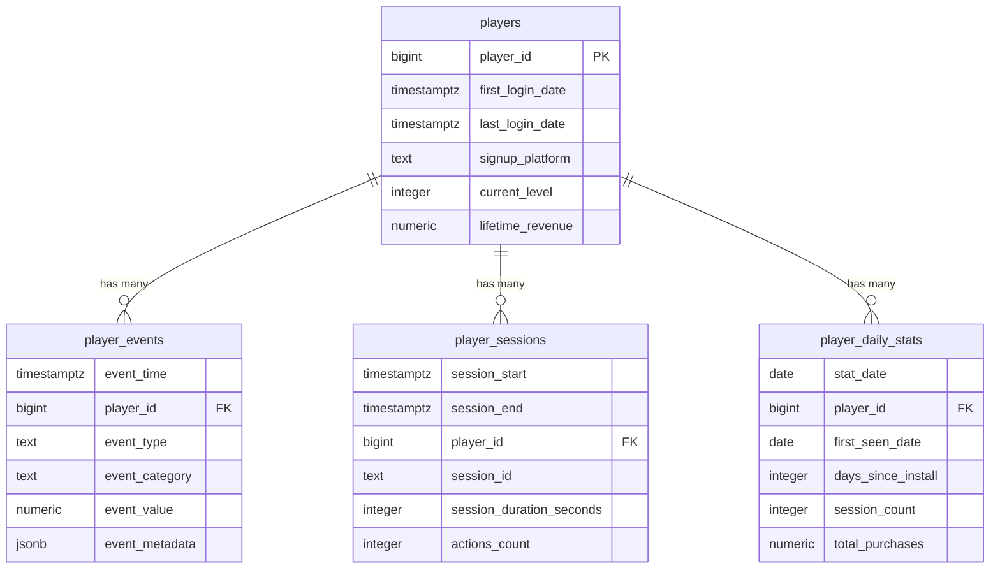

# 온라인 게임 서버를 위한 TimescaleDB 완벽 가이드  

저자: 최흥배, Claude AI   
    
권장 개발 환경
- **IDE**: Visual Studio 2022 (Community 이상)
- **.NET**: 9 이상
- **OS**: Windows 10 이상

-----  
  
# Chapter 16: 종합 프로젝트 2 - 플레이어 행동 분석 시스템

게임 운영에서 가장 중요한 것은 플레이어를 이해하는 것이다. 플레이어들이 언제 게임에 접속하고, 어떤 콘텐츠를 즐기며, 언제 이탈하는지를 정확히 파악해야 게임을 개선하고 수익을 늘릴 수 있다. 이번 장에서는 TimescaleDB를 활용하여 플레이어의 행동 패턴을 분석하는 완전한 시스템을 구축한다. 코호트 분석으로 사용자 그룹별 특성을 파악하고, 리텐션 지표로 게임의 생명력을 측정하며, 퍼널 분석으로 플레이어 여정의 병목 구간을 찾아낸다.

이 시스템은 단순히 데이터를 보여주는 것을 넘어서 실제 의사결정에 필요한 인사이트를 자동으로 생성한다. 예를 들어 "이번 주에 가입한 신규 유저 중 7일 후에도 게임을 플레이하는 비율이 얼마인가?", "특정 이벤트 이후 매출 기여도가 높아진 코호트는 어느 그룹인가?", "튜토리얼의 어느 단계에서 가장 많은 플레이어가 이탈하는가?"와 같은 질문에 즉시 답할 수 있다.

## 16.1 플레이어 분석 데이터 모델

플레이어 행동 분석을 위해서는 다양한 이벤트와 상태를 추적할 수 있는 체계적인 데이터 모델이 필요하다. 게임의 특성에 따라 필요한 데이터가 다르지만, 대부분의 온라인 게임에서 공통적으로 추적해야 하는 핵심 데이터들이 있다.

**플레이어 이벤트 로그 테이블**

모든 플레이어의 행동을 이벤트 단위로 기록하는 것이 분석의 시작점이다. 이벤트 로그는 플레이어가 게임에서 수행하는 모든 의미 있는 행동을 시간순으로 기록한다.

```sql
-- 플레이어 이벤트 로그 테이블
CREATE TABLE player_events (
    event_time TIMESTAMPTZ NOT NULL,
    player_id BIGINT NOT NULL,
    event_type TEXT NOT NULL,  -- 'login', 'logout', 'level_up', 'purchase', 'tutorial_complete' 등
    event_category TEXT,       -- 'engagement', 'monetization', 'progression' 등
    event_value NUMERIC,       -- 이벤트와 관련된 수치 (레벨, 금액 등)
    event_metadata JSONB,      -- 추가 정보 (아이템 ID, 위치 정보 등)
    session_id TEXT,
    platform TEXT,             -- 'iOS', 'Android', 'PC'
    app_version TEXT,
    country TEXT,
    device_type TEXT
);

SELECT create_hypertable('player_events', 'event_time');

-- 자주 사용되는 쿼리를 위한 인덱스
CREATE INDEX idx_player_events_player_id ON player_events(player_id, event_time DESC);
CREATE INDEX idx_player_events_type ON player_events(event_type, event_time DESC);
CREATE INDEX idx_player_events_category ON player_events(event_category, event_time DESC);

-- 압축 정책 (7일 이상 된 데이터)
ALTER TABLE player_events SET (
    timescaledb.compress,
    timescaledb.compress_segmentby = 'player_id, event_type'
);

SELECT add_compression_policy('player_events', INTERVAL '7 days');
```

**플레이어 세션 테이블**

플레이어의 게임 플레이 세션을 추적하는 테이블이다. 세션 길이, 빈도, 패턴은 플레이어 참여도를 측정하는 핵심 지표다.

```sql
-- 플레이어 세션 테이블
CREATE TABLE player_sessions (
    session_start TIMESTAMPTZ NOT NULL,
    session_end TIMESTAMPTZ,
    player_id BIGINT NOT NULL,
    session_id TEXT NOT NULL,
    session_duration_seconds INTEGER,
    actions_count INTEGER DEFAULT 0,
    levels_completed INTEGER DEFAULT 0,
    items_collected INTEGER DEFAULT 0,
    battles_fought INTEGER DEFAULT 0,
    currency_earned INTEGER DEFAULT 0,
    currency_spent INTEGER DEFAULT 0,
    platform TEXT,
    country TEXT,
    is_completed BOOLEAN DEFAULT false  -- 정상 종료 여부
);

SELECT create_hypertable('player_sessions', 'session_start');

CREATE INDEX idx_player_sessions_player ON player_sessions(player_id, session_start DESC);
CREATE INDEX idx_player_sessions_duration ON player_sessions(session_duration_seconds, session_start DESC);

-- 세션 종료 시 duration 자동 계산을 위한 트리거
CREATE OR REPLACE FUNCTION calculate_session_duration()
RETURNS TRIGGER AS $$
BEGIN
    IF NEW.session_end IS NOT NULL AND NEW.session_start IS NOT NULL THEN
        NEW.session_duration_seconds = EXTRACT(EPOCH FROM (NEW.session_end - NEW.session_start))::INTEGER;
    END IF;
    RETURN NEW;
END;
$$ LANGUAGE plpgsql;

CREATE TRIGGER trg_calculate_session_duration
    BEFORE INSERT OR UPDATE ON player_sessions
    FOR EACH ROW
    EXECUTE FUNCTION calculate_session_duration();
```

**플레이어 일일 통계 테이블**

매일 각 플레이어의 활동을 요약한 테이블이다. 일별 분석과 코호트 분석의 기반이 된다.

```sql
-- 플레이어 일일 통계 테이블
CREATE TABLE player_daily_stats (
    stat_date DATE NOT NULL,
    player_id BIGINT NOT NULL,
    first_seen_date DATE,          -- 플레이어가 처음 게임을 시작한 날짜 (코호트 식별)
    days_since_install INTEGER,    -- 설치 후 경과 일수
    login_count INTEGER DEFAULT 0,
    session_count INTEGER DEFAULT 0,
    total_playtime_seconds INTEGER DEFAULT 0,
    total_purchases NUMERIC DEFAULT 0,
    purchase_count INTEGER DEFAULT 0,
    level_start INTEGER,
    level_end INTEGER,
    levels_gained INTEGER DEFAULT 0,
    achievements_unlocked INTEGER DEFAULT 0,
    social_interactions INTEGER DEFAULT 0,
    is_active BOOLEAN DEFAULT true,
    is_paying BOOLEAN DEFAULT false,
    PRIMARY KEY (stat_date, player_id)
);

SELECT create_hypertable('player_daily_stats', 'stat_date');

CREATE INDEX idx_player_daily_stats_player ON player_daily_stats(player_id, stat_date DESC);
CREATE INDEX idx_player_daily_stats_cohort ON player_daily_stats(first_seen_date, stat_date);
CREATE INDEX idx_player_daily_stats_days_since ON player_daily_stats(days_since_install, stat_date);
```

**플레이어 마스터 테이블**

각 플레이어의 기본 정보와 누적 통계를 저장하는 일반 테이블이다. 시계열 데이터는 아니지만 분석 시 조인하여 사용한다.

```sql
-- 플레이어 마스터 테이블 (일반 테이블)
CREATE TABLE players (
    player_id BIGINT PRIMARY KEY,
    first_login_date TIMESTAMPTZ NOT NULL,
    last_login_date TIMESTAMPTZ,
    signup_platform TEXT,
    signup_country TEXT,
    total_sessions INTEGER DEFAULT 0,
    total_playtime_seconds BIGINT DEFAULT 0,
    current_level INTEGER DEFAULT 1,
    lifetime_revenue NUMERIC DEFAULT 0,
    total_purchases INTEGER DEFAULT 0,
    is_active BOOLEAN DEFAULT true,
    last_updated TIMESTAMPTZ DEFAULT NOW()
);

CREATE INDEX idx_players_first_login ON players(first_login_date);
CREATE INDEX idx_players_last_login ON players(last_login_date);
CREATE INDEX idx_players_active ON players(is_active, last_login_date DESC);
```

**데이터 모델 관계도**



**C# 데이터 모델 클래스**

```csharp
// GameAnalytics.Core/Models/PlayerEvent.cs
namespace GameAnalytics.Core.Models
{
    public class PlayerEvent
    {
        public DateTime EventTime { get; set; }
        public long PlayerId { get; set; }
        public string EventType { get; set; }
        public string EventCategory { get; set; }
        public decimal? EventValue { get; set; }
        public Dictionary<string, object> EventMetadata { get; set; }
        public string SessionId { get; set; }
        public string Platform { get; set; }
        public string AppVersion { get; set; }
        public string Country { get; set; }
        public string DeviceType { get; set; }
    }
    
    // 일반적인 이벤트 타입 상수
    public static class EventTypes
    {
        public const string Login = "login";
        public const string Logout = "logout";
        public const string LevelUp = "level_up";
        public const string Purchase = "purchase";
        public const string TutorialStart = "tutorial_start";
        public const string TutorialComplete = "tutorial_complete";
        public const string BattleStart = "battle_start";
        public const string BattleComplete = "battle_complete";
        public const string ItemPurchase = "item_purchase";
        public const string SocialShare = "social_share";
    }
    
    public static class EventCategories
    {
        public const string Engagement = "engagement";
        public const string Monetization = "monetization";
        public const string Progression = "progression";
        public const string Social = "social";
        public const string Tutorial = "tutorial";
    }
}
```

```csharp
// GameAnalytics.Core/Models/PlayerSession.cs
namespace GameAnalytics.Core.Models
{
    public class PlayerSession
    {
        public DateTime SessionStart { get; set; }
        public DateTime? SessionEnd { get; set; }
        public long PlayerId { get; set; }
        public string SessionId { get; set; }
        public int? SessionDurationSeconds { get; set; }
        public int ActionsCount { get; set; }
        public int LevelsCompleted { get; set; }
        public int ItemsCollected { get; set; }
        public int BattlesFought { get; set; }
        public int CurrencyEarned { get; set; }
        public int CurrencySpent { get; set; }
        public string Platform { get; set; }
        public string Country { get; set; }
        public bool IsCompleted { get; set; }
        
        // 계산된 속성
        public TimeSpan? Duration => SessionEnd.HasValue 
            ? SessionEnd.Value - SessionStart 
            : null;
    }
}
```

```csharp
// GameAnalytics.Core/Models/PlayerDailyStat.cs
namespace GameAnalytics.Core.Models
{
    public class PlayerDailyStat
    {
        public DateTime StatDate { get; set; }
        public long PlayerId { get; set; }
        public DateTime? FirstSeenDate { get; set; }
        public int? DaysSinceInstall { get; set; }
        public int LoginCount { get; set; }
        public int SessionCount { get; set; }
        public int TotalPlaytimeSeconds { get; set; }
        public decimal TotalPurchases { get; set; }
        public int PurchaseCount { get; set; }
        public int? LevelStart { get; set; }
        public int? LevelEnd { get; set; }
        public int LevelsGained { get; set; }
        public int AchievementsUnlocked { get; set; }
        public int SocialInteractions { get; set; }
        public bool IsActive { get; set; }
        public bool IsPaying { get; set; }
        
        // 계산된 속성
        public TimeSpan TotalPlaytime => TimeSpan.FromSeconds(TotalPlaytimeSeconds);
        public decimal AverageRevenuePerSession => SessionCount > 0 
            ? TotalPurchases / SessionCount 
            : 0;
    }
}
```

**샘플 데이터 생성 스크립트**

분석 시스템을 테스트하기 위한 샘플 데이터를 생성한다.

```csharp
// GameAnalytics.Infrastructure/DataGenerator/SampleDataGenerator.cs
using Npgsql;
using GameAnalytics.Core.Models;

namespace GameAnalytics.Infrastructure.DataGenerator
{
    public class SampleDataGenerator
    {
        private readonly string _connectionString;
        private readonly Random _random = new Random();
        
        public SampleDataGenerator(string connectionString)
        {
            _connectionString = connectionString;
        }
        
        public async Task GenerateSampleDataAsync(
            int playerCount = 10000, 
            int daysBack = 90)
        {
            Console.WriteLine($"Generating sample data for {playerCount} players over {daysBack} days...");
            
            var startDate = DateTime.UtcNow.Date.AddDays(-daysBack);
            var endDate = DateTime.UtcNow.Date;
            
            // 플레이어 생성
            await GeneratePlayersAsync(playerCount, startDate, endDate);
            
            // 일별 이벤트 및 세션 생성
            for (var date = startDate; date <= endDate; date = date.AddDays(1))
            {
                Console.WriteLine($"Generating data for {date:yyyy-MM-dd}...");
                await GenerateDailyDataAsync(date, playerCount);
            }
            
            Console.WriteLine("Sample data generation completed!");
        }
        
        private async Task GeneratePlayersAsync(int count, DateTime startDate, DateTime endDate)
        {
            using var connection = new NpgsqlConnection(_connectionString);
            await connection.OpenAsync();
            
            var platforms = new[] { "iOS", "Android", "PC" };
            var countries = new[] { "KR", "US", "JP", "CN", "DE", "FR", "BR" };
            
            for (int i = 1; i <= count; i++)
            {
                var firstLogin = GenerateRandomDate(startDate, endDate);
                
                var sql = @"
                    INSERT INTO players (
                        player_id, first_login_date, last_login_date, 
                        signup_platform, signup_country, current_level
                    ) VALUES (
                        @PlayerId, @FirstLogin, @LastLogin, 
                        @Platform, @Country, @Level
                    ) ON CONFLICT (player_id) DO NOTHING";
                
                using var cmd = new NpgsqlCommand(sql, connection);
                cmd.Parameters.AddWithValue("PlayerId", i);
                cmd.Parameters.AddWithValue("FirstLogin", firstLogin);
                cmd.Parameters.AddWithValue("LastLogin", firstLogin.AddDays(_random.Next(1, 30)));
                cmd.Parameters.AddWithValue("Platform", platforms[_random.Next(platforms.Length)]);
                cmd.Parameters.AddWithValue("Country", countries[_random.Next(countries.Length)]);
                cmd.Parameters.AddWithValue("Level", _random.Next(1, 50));
                
                await cmd.ExecuteNonQueryAsync();
                
                if (i % 1000 == 0)
                {
                    Console.WriteLine($"Created {i} players...");
                }
            }
        }
        
        private async Task GenerateDailyDataAsync(DateTime date, int totalPlayers)
        {
            using var connection = new NpgsqlConnection(_connectionString);
            await connection.OpenAsync();
            
            // 활성 플레이어 비율 (신규일수록 높음)
            var activePlayers = new List<int>();
            for (int playerId = 1; playerId <= totalPlayers; playerId++)
            {
                // 신규 플레이어일수록 높은 활동성
                var daysSinceJoin = (date - DateTime.UtcNow.Date.AddDays(-90)).Days;
                var activityProbability = Math.Max(0.1, 0.8 - (daysSinceJoin * 0.01));
                
                if (_random.NextDouble() < activityProbability)
                {
                    activePlayers.Add(playerId);
                }
            }
            
            Console.WriteLine($"  Active players: {activePlayers.Count}");
            
            foreach (var playerId in activePlayers)
            {
                await GeneratePlayerDailyActivityAsync(connection, playerId, date);
            }
        }
        
        private async Task GeneratePlayerDailyActivityAsync(
            NpgsqlConnection connection, 
            int playerId, 
            DateTime date)
        {
            var sessionCount = _random.Next(1, 6); // 1-5 세션
            var totalPlaytime = 0;
            var totalPurchases = 0m;
            var purchaseCount = 0;
            
            for (int session = 0; session < sessionCount; session++)
            {
                var sessionId = Guid.NewGuid().ToString();
                var sessionStart = date.AddHours(_random.Next(0, 24))
                                       .AddMinutes(_random.Next(0, 60));
                var sessionDuration = _random.Next(300, 7200); // 5분 ~ 2시간
                var sessionEnd = sessionStart.AddSeconds(sessionDuration);
                
                totalPlaytime += sessionDuration;
                
                // 세션 기록
                var sessionSql = @"
                    INSERT INTO player_sessions (
                        session_start, session_end, player_id, session_id,
                        session_duration_seconds, actions_count, platform, is_completed
                    ) VALUES (
                        @Start, @End, @PlayerId, @SessionId,
                        @Duration, @Actions, @Platform, @IsCompleted
                    )";
                
                using var sessionCmd = new NpgsqlCommand(sessionSql, connection);
                sessionCmd.Parameters.AddWithValue("Start", sessionStart);
                sessionCmd.Parameters.AddWithValue("End", sessionEnd);
                sessionCmd.Parameters.AddWithValue("PlayerId", playerId);
                sessionCmd.Parameters.AddWithValue("SessionId", sessionId);
                sessionCmd.Parameters.AddWithValue("Duration", sessionDuration);
                sessionCmd.Parameters.AddWithValue("Actions", _random.Next(10, 200));
                sessionCmd.Parameters.AddWithValue("Platform", "PC");
                sessionCmd.Parameters.AddWithValue("IsCompleted", true);
                
                await sessionCmd.ExecuteNonQueryAsync();
                
                // 이벤트 생성 (로그인, 레벨업, 구매 등)
                await GenerateSessionEventsAsync(
                    connection, playerId, sessionId, sessionStart, sessionDuration);
                
                // 10% 확률로 구매
                if (_random.NextDouble() < 0.1)
                {
                    var purchaseAmount = (decimal)(_random.Next(1, 100) * 0.99);
                    totalPurchases += purchaseAmount;
                    purchaseCount++;
                    
                    await RecordPurchaseEventAsync(
                        connection, playerId, sessionId, sessionStart, purchaseAmount);
                }
            }
            
            // 일일 통계 기록
            await RecordDailyStatsAsync(
                connection, playerId, date, sessionCount, 
                totalPlaytime, totalPurchases, purchaseCount);
        }
        
        private async Task GenerateSessionEventsAsync(
            NpgsqlConnection connection,
            int playerId,
            string sessionId,
            DateTime sessionStart,
            int durationSeconds)
        {
            // 로그인 이벤트
            await InsertEventAsync(connection, playerId, sessionId, 
                sessionStart, EventTypes.Login, EventCategories.Engagement);
            
            // 세션 중 랜덤 이벤트들
            var eventCount = _random.Next(5, 20);
            for (int i = 0; i < eventCount; i++)
            {
                var eventTime = sessionStart.AddSeconds(_random.Next(0, durationSeconds));
                var eventType = GetRandomEventType();
                var category = GetEventCategory(eventType);
                
                await InsertEventAsync(connection, playerId, sessionId, 
                    eventTime, eventType, category);
            }
            
            // 로그아웃 이벤트
            await InsertEventAsync(connection, playerId, sessionId,
                sessionStart.AddSeconds(durationSeconds), 
                EventTypes.Logout, EventCategories.Engagement);
        }
        
        private async Task InsertEventAsync(
            NpgsqlConnection connection,
            int playerId,
            string sessionId,
            DateTime eventTime,
            string eventType,
            string category,
            decimal? value = null)
        {
            var sql = @"
                INSERT INTO player_events (
                    event_time, player_id, session_id, event_type, 
                    event_category, event_value, platform
                ) VALUES (
                    @Time, @PlayerId, @SessionId, @Type, 
                    @Category, @Value, @Platform
                )";
            
            using var cmd = new NpgsqlCommand(sql, connection);
            cmd.Parameters.AddWithValue("Time", eventTime);
            cmd.Parameters.AddWithValue("PlayerId", playerId);
            cmd.Parameters.AddWithValue("SessionId", sessionId);
            cmd.Parameters.AddWithValue("Type", eventType);
            cmd.Parameters.AddWithValue("Category", category);
            cmd.Parameters.AddWithValue("Value", (object)value ?? DBNull.Value);
            cmd.Parameters.AddWithValue("Platform", "PC");
            
            await cmd.ExecuteNonQueryAsync();
        }
        
        private async Task RecordPurchaseEventAsync(
            NpgsqlConnection connection,
            int playerId,
            string sessionId,
            DateTime time,
            decimal amount)
        {
            await InsertEventAsync(connection, playerId, sessionId, 
                time, EventTypes.Purchase, EventCategories.Monetization, amount);
        }
        
        private async Task RecordDailyStatsAsync(
            NpgsqlConnection connection,
            int playerId,
            DateTime date,
            int sessionCount,
            int totalPlaytime,
            decimal totalPurchases,
            int purchaseCount)
        {
            var sql = @"
                INSERT INTO player_daily_stats (
                    stat_date, player_id, session_count, 
                    total_playtime_seconds, total_purchases, purchase_count,
                    is_active, is_paying
                ) VALUES (
                    @Date, @PlayerId, @SessionCount,
                    @Playtime, @Purchases, @PurchaseCount,
                    @IsActive, @IsPaying
                ) ON CONFLICT (stat_date, player_id) 
                DO UPDATE SET
                    session_count = EXCLUDED.session_count,
                    total_playtime_seconds = EXCLUDED.total_playtime_seconds,
                    total_purchases = EXCLUDED.total_purchases,
                    purchase_count = EXCLUDED.purchase_count,
                    is_paying = EXCLUDED.is_paying";
            
            using var cmd = new NpgsqlCommand(sql, connection);
            cmd.Parameters.AddWithValue("Date", date);
            cmd.Parameters.AddWithValue("PlayerId", playerId);
            cmd.Parameters.AddWithValue("SessionCount", sessionCount);
            cmd.Parameters.AddWithValue("Playtime", totalPlaytime);
            cmd.Parameters.AddWithValue("Purchases", totalPurchases);
            cmd.Parameters.AddWithValue("PurchaseCount", purchaseCount);
            cmd.Parameters.AddWithValue("IsActive", true);
            cmd.Parameters.AddWithValue("IsPaying", purchaseCount > 0);
            
            await cmd.ExecuteNonQueryAsync();
        }
        
        private DateTime GenerateRandomDate(DateTime start, DateTime end)
        {
            var range = (end - start).Days;
            return start.AddDays(_random.Next(range));
        }
        
        private string GetRandomEventType()
        {
            var types = new[] 
            { 
                EventTypes.LevelUp, 
                EventTypes.BattleStart, 
                EventTypes.BattleComplete,
                EventTypes.ItemPurchase,
                EventTypes.SocialShare
            };
            return types[_random.Next(types.Length)];
        }
        
        private string GetEventCategory(string eventType)
        {
            return eventType switch
            {
                EventTypes.Purchase or EventTypes.ItemPurchase => EventCategories.Monetization,
                EventTypes.LevelUp => EventCategories.Progression,
                EventTypes.SocialShare => EventCategories.Social,
                _ => EventCategories.Engagement
            };
        }
    }
}
```

## 16.2 코호트 분석 구현

코호트 분석은 특정 시점에 게임을 시작한 플레이어 그룹의 행동을 시간에 따라 추적하는 강력한 분석 기법이다. "2025년 1월 첫째 주에 가입한 플레이어들은 2주 후에도 50%가 활동 중이지만, 같은 해 2월 첫째 주에 가입한 플레이어들은 30%만 활동 중이다"와 같은 인사이트를 얻을 수 있다.

**코호트 정의 및 분류**

먼저 플레이어를 코호트로 분류하는 기준을 정의한다. 가장 일반적인 것은 가입 주차별 코호트다.

```sql
-- 플레이어의 코호트(가입 주차) 식별
CREATE OR REPLACE VIEW player_cohorts AS
SELECT 
    player_id,
    first_login_date,
    DATE_TRUNC('week', first_login_date) as cohort_week,
    DATE_TRUNC('month', first_login_date) as cohort_month,
    signup_platform,
    signup_country
FROM players;

-- 코호트별 규모
SELECT 
    cohort_week,
    COUNT(*) as cohort_size,
    COUNT(DISTINCT signup_platform) as platforms,
    COUNT(DISTINCT signup_country) as countries
FROM player_cohorts
GROUP BY cohort_week
ORDER BY cohort_week DESC;
```

**주차별 코호트 활동 분석**

각 코호트가 시간이 지남에 따라 얼마나 활동하는지 추적한다.

```sql
-- 코호트별 주차 활동률
CREATE MATERIALIZED VIEW cohort_weekly_activity AS
SELECT 
    pc.cohort_week,
    DATE_TRUNC('week', pds.stat_date) as activity_week,
    EXTRACT(WEEK FROM pds.stat_date - pc.first_login_date) as weeks_since_install,
    COUNT(DISTINCT pds.player_id) as active_users,
    COUNT(DISTINCT pc.player_id) as cohort_size,
    ROUND(COUNT(DISTINCT pds.player_id)::NUMERIC / 
          COUNT(DISTINCT pc.player_id) * 100, 2) as activity_rate,
    SUM(pds.session_count) as total_sessions,
    SUM(pds.total_playtime_seconds) as total_playtime,
    SUM(pds.total_purchases) as total_revenue,
    COUNT(DISTINCT CASE WHEN pds.is_paying THEN pds.player_id END) as paying_users
FROM player_cohorts pc
INNER JOIN player_daily_stats pds ON pc.player_id = pds.player_id
WHERE pds.is_active = true
GROUP BY pc.cohort_week, activity_week, weeks_since_install;

-- 정기적으로 갱신
CREATE INDEX idx_cohort_weekly_activity ON cohort_weekly_activity(cohort_week, weeks_since_install);

-- 자동 갱신 정책 (매일 새벽 3시)
SELECT add_continuous_aggregate_policy('cohort_weekly_activity',
    start_offset => INTERVAL '1 month',
    end_offset => INTERVAL '1 day',
    schedule_interval => INTERVAL '1 day');
```

**C# 코호트 분석 Repository**

```csharp
// GameAnalytics.Infrastructure/Repositories/CohortAnalysisRepository.cs
using Npgsql;
using SqlKata;
using SqlKata.Execution;
using SqlKata.Compilers;
using Dapper;
using GameAnalytics.Core.Models.Analytics;

namespace GameAnalytics.Infrastructure.Repositories
{
    public class CohortAnalysisRepository
    {
        private readonly string _connectionString;
        private readonly PostgresCompiler _compiler;
        
        public CohortAnalysisRepository(string connectionString)
        {
            _connectionString = connectionString;
            _compiler = new PostgresCompiler();
        }
        
        private QueryFactory GetQueryFactory()
        {
            var connection = new NpgsqlConnection(_connectionString);
            return new QueryFactory(connection, _compiler);
        }
        
        // 코호트 목록 조회
        public async Task<List<CohortInfo>> GetCohortsAsync(
            DateTime startDate, 
            DateTime endDate)
        {
            using var db = GetQueryFactory();
            
            var query = new Query("player_cohorts")
                .Select(
                    Query.Raw("cohort_week"),
                    Query.Raw("COUNT(*) as cohort_size"),
                    Query.Raw("COUNT(DISTINCT signup_platform) as platform_count"),
                    Query.Raw("COUNT(DISTINCT signup_country) as country_count")
                )
                .WhereBetween("cohort_week", startDate, endDate)
                .GroupBy("cohort_week")
                .OrderByDesc("cohort_week");
            
            var results = await query.GetAsync<CohortInfo>();
            return results.ToList();
        }
        
        // 코호트별 주차 활동률 조회
        public async Task<List<CohortWeeklyActivity>> GetCohortActivityAsync(
            DateTime cohortStart, 
            DateTime cohortEnd,
            int maxWeeks = 12)
        {
            using var connection = new NpgsqlConnection(_connectionString);
            
            var sql = @"
                SELECT 
                    cohort_week,
                    weeks_since_install,
                    active_users,
                    cohort_size,
                    activity_rate,
                    total_sessions,
                    total_playtime,
                    total_revenue,
                    paying_users,
                    ROUND(paying_users::NUMERIC / cohort_size * 100, 2) as conversion_rate
                FROM cohort_weekly_activity
                WHERE cohort_week BETWEEN @CohortStart AND @CohortEnd
                    AND weeks_since_install <= @MaxWeeks
                ORDER BY cohort_week, weeks_since_install";
            
            var results = await connection.QueryAsync<CohortWeeklyActivity>(
                sql,
                new { CohortStart = cohortStart, CohortEnd = cohortEnd, MaxWeeks = maxWeeks }
            );
            
            return results.ToList();
        }
        
        // 코호트 비교 (여러 코호트의 같은 주차 비교)
        public async Task<Dictionary<DateTime, List<CohortWeeklyActivity>>> 
            GetCohortComparisonAsync(List<DateTime> cohortWeeks, int maxWeeks = 12)
        {
            using var connection = new NpgsqlConnection(_connectionString);
            
            var sql = @"
                SELECT 
                    cohort_week,
                    weeks_since_install,
                    active_users,
                    cohort_size,
                    activity_rate,
                    total_revenue
                FROM cohort_weekly_activity
                WHERE cohort_week = ANY(@CohortWeeks)
                    AND weeks_since_install <= @MaxWeeks
                ORDER BY cohort_week, weeks_since_install";
            
            var results = await connection.QueryAsync<CohortWeeklyActivity>(
                sql,
                new { CohortWeeks = cohortWeeks.ToArray(), MaxWeeks = maxWeeks }
            );
            
            return results.GroupBy(r => r.CohortWeek)
                         .ToDictionary(g => g.Key, g => g.ToList());
        }
        
        // 코호트 히트맵 데이터 (시각화용)
        public async Task<CohortHeatmapData> GetCohortHeatmapDataAsync(
            DateTime startDate,
            DateTime endDate,
            int maxWeeks = 12,
            string metric = "activity_rate")
        {
            using var connection = new NpgsqlConnection(_connectionString);
            
            var sql = $@"
                SELECT 
                    cohort_week,
                    weeks_since_install,
                    {metric} as value
                FROM cohort_weekly_activity
                WHERE cohort_week BETWEEN @StartDate AND @EndDate
                    AND weeks_since_install <= @MaxWeeks
                ORDER BY cohort_week DESC, weeks_since_install";
            
            var results = await connection.QueryAsync<dynamic>(
                sql,
                new { StartDate = startDate, EndDate = endDate, MaxWeeks = maxWeeks }
            );
            
            // 히트맵 데이터 구조로 변환
            var cohorts = results.Select(r => (DateTime)r.cohort_week).Distinct().ToList();
            var matrix = new List<List<decimal?>>();
            
            foreach (var cohort in cohorts)
            {
                var row = new List<decimal?>();
                for (int week = 0; week <= maxWeeks; week++)
                {
                    var dataPoint = results.FirstOrDefault(r => 
                        (DateTime)r.cohort_week == cohort && 
                        (long)r.weeks_since_install == week);
                    
                    row.Add(dataPoint != null ? (decimal?)dataPoint.value : null);
                }
                matrix.Add(row);
            }
            
            return new CohortHeatmapData
            {
                CohortLabels = cohorts.Select(c => c.ToString("yyyy-MM-dd")).ToList(),
                WeekLabels = Enumerable.Range(0, maxWeeks + 1)
                                      .Select(w => $"Week {w}")
                                      .ToList(),
                Values = matrix,
                Metric = metric
            };
        }
    }
}
```

**코호트 분석 모델 클래스**

```csharp
// GameAnalytics.Core/Models/Analytics/CohortModels.cs
namespace GameAnalytics.Core.Models.Analytics
{
    public class CohortInfo
    {
        public DateTime CohortWeek { get; set; }
        public int CohortSize { get; set; }
        public int PlatformCount { get; set; }
        public int CountryCount { get; set; }
    }
    
    public class CohortWeeklyActivity
    {
        public DateTime CohortWeek { get; set; }
        public long WeeksSinceInstall { get; set; }
        public int ActiveUsers { get; set; }
        public int CohortSize { get; set; }
        public decimal ActivityRate { get; set; }
        public long TotalSessions { get; set; }
        public long TotalPlaytime { get; set; }
        public decimal TotalRevenue { get; set; }
        public int PayingUsers { get; set; }
        public decimal ConversionRate { get; set; }
        
        // 계산된 속성
        public decimal RevenuePerUser => CohortSize > 0 
            ? TotalRevenue / CohortSize 
            : 0;
        
        public decimal AverageSessionsPerUser => ActiveUsers > 0
            ? (decimal)TotalSessions / ActiveUsers
            : 0;
    }
    
    public class CohortHeatmapData
    {
        public List<string> CohortLabels { get; set; }
        public List<string> WeekLabels { get; set; }
        public List<List<decimal?>> Values { get; set; }
        public string Metric { get; set; }
        
        // 색상 범위 계산 (시각화용)
        public (decimal min, decimal max) GetValueRange()
        {
            var allValues = Values.SelectMany(row => row)
                                 .Where(v => v.HasValue)
                                 .Select(v => v.Value)
                                 .ToList();
            
            if (!allValues.Any())
                return (0, 0);
            
            return (allValues.Min(), allValues.Max());
        }
    }
}
```

## 16.3 리텐션 계산 쿼리

리텐션(Retention)은 플레이어가 게임에 얼마나 오래 머무르는지를 측정하는 핵심 지표다. D1(1일), D7(7일), D30(30일) 리텐션은 게임의 건강성을 나타내는 가장 중요한 KPI다.

**일별 리텐션 계산**

```sql
-- N일차 리텐션 계산 함수
CREATE OR REPLACE FUNCTION calculate_retention(
    cohort_date DATE,
    day_n INTEGER
) RETURNS TABLE (
    cohort DATE,
    day INTEGER,
    cohort_size BIGINT,
    returned_users BIGINT,
    retention_rate NUMERIC
) AS $$
BEGIN
    RETURN QUERY
    WITH cohort_players AS (
        -- 특정 날짜에 가입한 플레이어들
        SELECT DISTINCT player_id
        FROM players
        WHERE DATE(first_login_date) = cohort_date
    ),
    returned_players AS (
        -- N일 후에 활동한 플레이어들
        SELECT DISTINCT pds.player_id
        FROM player_daily_stats pds
        INNER JOIN cohort_players cp ON pds.player_id = cp.player_id
        WHERE pds.stat_date = cohort_date + day_n
            AND pds.is_active = true
    )
    SELECT 
        cohort_date as cohort,
        day_n as day,
        COUNT(DISTINCT cp.player_id) as cohort_size,
        COUNT(DISTINCT rp.player_id) as returned_users,
        ROUND(
            COUNT(DISTINCT rp.player_id)::NUMERIC / 
            NULLIF(COUNT(DISTINCT cp.player_id), 0) * 100, 
            2
        ) as retention_rate
    FROM cohort_players cp
    LEFT JOIN returned_players rp ON cp.player_id = rp.player_id;
END;
$$ LANGUAGE plpgsql;

-- 사용 예시
SELECT * FROM calculate_retention('2025-01-01', 1);  -- D1 리텐션
SELECT * FROM calculate_retention('2025-01-01', 7);  -- D7 리텐션
SELECT * FROM calculate_retention('2025-01-01', 30); -- D30 리텐션
```

**클래식 리텐션 vs 롤링 리텐션**

```sql
-- 클래식 리텐션: 정확히 N일차에 활동한 플레이어
-- 롤링 리텐션: N일차 이후 한 번이라도 활동한 플레이어

CREATE OR REPLACE FUNCTION calculate_rolling_retention(
    cohort_date DATE,
    day_n INTEGER
) RETURNS TABLE (
    cohort DATE,
    day INTEGER,
    cohort_size BIGINT,
    classic_returned BIGINT,
    classic_retention NUMERIC,
    rolling_returned BIGINT,
    rolling_retention NUMERIC
) AS $$
BEGIN
    RETURN QUERY
    WITH cohort_players AS (
        SELECT DISTINCT player_id
        FROM players
        WHERE DATE(first_login_date) = cohort_date
    ),
    classic_returned AS (
        -- 정확히 N일차에 활동
        SELECT DISTINCT pds.player_id
        FROM player_daily_stats pds
        INNER JOIN cohort_players cp ON pds.player_id = cp.player_id
        WHERE pds.stat_date = cohort_date + day_n
            AND pds.is_active = true
    ),
    rolling_returned AS (
        -- N일차 이후 한 번이라도 활동
        SELECT DISTINCT pds.player_id
        FROM player_daily_stats pds
        INNER JOIN cohort_players cp ON pds.player_id = cp.player_id
        WHERE pds.stat_date >= cohort_date + day_n
            AND pds.is_active = true
    )
    SELECT 
        cohort_date,
        day_n,
        COUNT(DISTINCT cp.player_id) as cohort_size,
        COUNT(DISTINCT cr.player_id) as classic_returned,
        ROUND(COUNT(DISTINCT cr.player_id)::NUMERIC / 
              NULLIF(COUNT(DISTINCT cp.player_id), 0) * 100, 2) as classic_retention,
        COUNT(DISTINCT rr.player_id) as rolling_returned,
        ROUND(COUNT(DISTINCT rr.player_id)::NUMERIC / 
              NULLIF(COUNT(DISTINCT cp.player_id), 0) * 100, 2) as rolling_retention
    FROM cohort_players cp
    LEFT JOIN classic_returned cr ON cp.player_id = cr.player_id
    LEFT JOIN rolling_returned rr ON cp.player_id = rr.player_id;
END;
$$ LANGUAGE plpgsql;
```

**리텐션 곡선 생성**

```sql
-- 특정 코호트의 리텐션 곡선 (0일~30일)
CREATE MATERIALIZED VIEW retention_curves AS
SELECT 
    pc.cohort_week,
    days.day_offset,
    COUNT(DISTINCT pc.player_id) as cohort_size,
    COUNT(DISTINCT CASE 
        WHEN pds.stat_date = DATE(pc.first_login_date) + days.day_offset 
             AND pds.is_active = true
        THEN pds.player_id 
    END) as active_on_day,
    ROUND(
        COUNT(DISTINCT CASE 
            WHEN pds.stat_date = DATE(pc.first_login_date) + days.day_offset 
                 AND pds.is_active = true
            THEN pds.player_id 
        END)::NUMERIC / NULLIF(COUNT(DISTINCT pc.player_id), 0) * 100,
        2
    ) as retention_rate
FROM player_cohorts pc
CROSS JOIN generate_series(0, 30) AS days(day_offset)
LEFT JOIN player_daily_stats pds ON 
    pc.player_id = pds.player_id AND
    pds.stat_date = DATE(pc.first_login_date) + days.day_offset
WHERE pc.cohort_week >= CURRENT_DATE - INTERVAL '90 days'
GROUP BY pc.cohort_week, days.day_offset;

CREATE INDEX idx_retention_curves ON retention_curves(cohort_week, day_offset);
```

**C# 리텐션 분석 Repository**

```csharp
// GameAnalytics.Infrastructure/Repositories/RetentionAnalysisRepository.cs
using Npgsql;
using Dapper;
using GameAnalytics.Core.Models.Analytics;

namespace GameAnalytics.Infrastructure.Repositories
{
    public class RetentionAnalysisRepository
    {
        private readonly string _connectionString;
        
        public RetentionAnalysisRepository(string connectionString)
        {
            _connectionString = connectionString;
        }
        
        // 단일 코호트의 N일차 리텐션
        public async Task<RetentionData> GetRetentionAsync(
            DateTime cohortDate, 
            int dayN)
        {
            using var connection = new NpgsqlConnection(_connectionString);
            
            var sql = "SELECT * FROM calculate_retention(@CohortDate, @DayN)";
            
            var result = await connection.QueryFirstOrDefaultAsync<RetentionData>(
                sql,
                new { CohortDate = cohortDate, DayN = dayN }
            );
            
            return result;
        }
        
        // 여러 코호트의 리텐션 비교
        public async Task<List<RetentionData>> GetRetentionComparisonAsync(
            List<DateTime> cohortDates,
            List<int> days)
        {
            using var connection = new NpgsqlConnection(_connectionString);
            
            var results = new List<RetentionData>();
            
            foreach (var cohortDate in cohortDates)
            {
                foreach (var day in days)
                {
                    var sql = "SELECT * FROM calculate_retention(@CohortDate, @DayN)";
                    var result = await connection.QueryFirstOrDefaultAsync<RetentionData>(
                        sql,
                        new { CohortDate = cohortDate, DayN = day }
                    );
                    
                    if (result != null)
                    {
                        results.Add(result);
                    }
                }
            }
            
            return results;
        }
        
        // 클래식 vs 롤링 리텐션
        public async Task<RollingRetentionData> GetRollingRetentionAsync(
            DateTime cohortDate,
            int dayN)
        {
            using var connection = new NpgsqlConnection(_connectionString);
            
            var sql = "SELECT * FROM calculate_rolling_retention(@CohortDate, @DayN)";
            
            var result = await connection.QueryFirstOrDefaultAsync<RollingRetentionData>(
                sql,
                new { CohortDate = cohortDate, DayN = dayN }
            );
            
            return result;
        }
        
        // 리텐션 곡선 데이터
        public async Task<List<RetentionCurvePoint>> GetRetentionCurveAsync(
            DateTime cohortWeek,
            int maxDays = 30)
        {
            using var connection = new NpgsqlConnection(_connectionString);
            
            var sql = @"
                SELECT 
                    day_offset,
                    cohort_size,
                    active_on_day,
                    retention_rate
                FROM retention_curves
                WHERE cohort_week = @CohortWeek
                    AND day_offset <= @MaxDays
                ORDER BY day_offset";
            
            var results = await connection.QueryAsync<RetentionCurvePoint>(
                sql,
                new { CohortWeek = cohortWeek, MaxDays = maxDays }
            );
            
            return results.ToList();
        }
        
        // 여러 코호트의 리텐션 곡선 비교
        public async Task<Dictionary<DateTime, List<RetentionCurvePoint>>> 
            GetRetentionCurvesComparisonAsync(
                List<DateTime> cohortWeeks,
                int maxDays = 30)
        {
            using var connection = new NpgsqlConnection(_connectionString);
            
            var sql = @"
                SELECT 
                    cohort_week,
                    day_offset,
                    cohort_size,
                    active_on_day,
                    retention_rate
                FROM retention_curves
                WHERE cohort_week = ANY(@CohortWeeks)
                    AND day_offset <= @MaxDays
                ORDER BY cohort_week, day_offset";
            
            var results = await connection.QueryAsync<dynamic>(
                sql,
                new { CohortWeeks = cohortWeeks.ToArray(), MaxDays = maxDays }
            );
            
            return results.GroupBy(r => (DateTime)r.cohort_week)
                         .ToDictionary(
                             g => g.Key,
                             g => g.Select(r => new RetentionCurvePoint
                             {
                                 DayOffset = (int)r.day_offset,
                                 CohortSize = (long)r.cohort_size,
                                 ActiveOnDay = (long)r.active_on_day,
                                 RetentionRate = (decimal)r.retention_rate
                             }).ToList()
                         );
        }
        
        // 평균 리텐션 (여러 코호트의 평균)
        public async Task<List<RetentionCurvePoint>> GetAverageRetentionCurveAsync(
            DateTime startDate,
            DateTime endDate,
            int maxDays = 30)
        {
            using var connection = new NpgsqlConnection(_connectionString);
            
            var sql = @"
                SELECT 
                    day_offset,
                    AVG(cohort_size) as cohort_size,
                    AVG(active_on_day) as active_on_day,
                    AVG(retention_rate) as retention_rate
                FROM retention_curves
                WHERE cohort_week BETWEEN @StartDate AND @EndDate
                    AND day_offset <= @MaxDays
                GROUP BY day_offset
                ORDER BY day_offset";
            
            var results = await connection.QueryAsync<RetentionCurvePoint>(
                sql,
                new { StartDate = startDate, EndDate = endDate, MaxDays = maxDays }
            );
            
            return results.ToList();
        }
    }
}
```

**리텐션 분석 모델**

```csharp
// GameAnalytics.Core/Models/Analytics/RetentionModels.cs
namespace GameAnalytics.Core.Models.Analytics
{
    public class RetentionData
    {
        public DateTime Cohort { get; set; }
        public int Day { get; set; }
        public long CohortSize { get; set; }
        public long ReturnedUsers { get; set; }
        public decimal RetentionRate { get; set; }
        
        // 계산된 속성
        public long ChurnedUsers => CohortSize - ReturnedUsers;
        public decimal ChurnRate => 100 - RetentionRate;
    }
    
    public class RollingRetentionData
    {
        public DateTime Cohort { get; set; }
        public int Day { get; set; }
        public long CohortSize { get; set; }
        public long ClassicReturned { get; set; }
        public decimal ClassicRetention { get; set; }
        public long RollingReturned { get; set; }
        public decimal RollingRetention { get; set; }
        
        // 클래식 vs 롤링 차이
        public decimal RetentionDifference => RollingRetention - ClassicRetention;
    }
    
    public class RetentionCurvePoint
    {
        public int DayOffset { get; set; }
        public long CohortSize { get; set; }
        public long ActiveOnDay { get; set; }
        public decimal RetentionRate { get; set; }
        
        // Day 레이블
        public string DayLabel => DayOffset == 0 ? "D0" : 
                                 DayOffset == 1 ? "D1" : 
                                 DayOffset == 7 ? "D7" : 
                                 DayOffset == 30 ? "D30" : 
                                 $"D{DayOffset}";
    }
}
```

## 16.4 이탈 예측 모델 데이터 준비

플레이어가 게임을 그만둘 것인지를 미리 예측할 수 있다면 선제적으로 대응할 수 있다. 머신러닝 모델을 학습시키기 위한 피처(feature) 데이터를 TimescaleDB에서 효율적으로 추출한다.

**이탈 정의**

먼저 "이탈"을 명확히 정의해야 한다. 일반적으로 N일 동안 접속하지 않은 플레이어를 이탈로 간주한다.

```sql
-- 이탈 플레이어 식별 (최근 14일간 활동 없음)
CREATE OR REPLACE VIEW churned_players AS
SELECT 
    p.player_id,
    p.last_login_date,
    CURRENT_DATE - DATE(p.last_login_date) as days_since_last_login,
    p.total_sessions,
    p.total_playtime_seconds,
    p.lifetime_revenue,
    CASE 
        WHEN CURRENT_DATE - DATE(p.last_login_date) >= 14 THEN true
        ELSE false
    END as is_churned
FROM players p;
```

**이탈 예측을 위한 피처 추출**

플레이어의 최근 행동 패턴에서 이탈을 예측할 수 있는 피처들을 추출한다.

```sql
-- 이탈 예측 피처 테이블
CREATE TABLE churn_prediction_features (
    feature_date DATE NOT NULL,
    player_id BIGINT NOT NULL,
    
    -- 인구통계학적 피처
    days_since_install INTEGER,
    signup_platform TEXT,
    signup_country TEXT,
    
    -- 활동 패턴 피처 (최근 7일)
    sessions_last_7days INTEGER,
    playtime_last_7days INTEGER,
    avg_session_length_last_7days NUMERIC,
    days_active_last_7days INTEGER,
    
    -- 활동 패턴 피처 (최근 14일)
    sessions_last_14days INTEGER,
    playtime_last_14days INTEGER,
    days_active_last_14days INTEGER,
    
    -- 추세 피처
    session_trend NUMERIC,  -- 최근 7일 vs 이전 7일 세션 수 변화율
    playtime_trend NUMERIC,
    
    -- 참여도 피처
    achievement_progress NUMERIC,
    social_engagement_score NUMERIC,
    content_variety_score NUMERIC,  -- 다양한 콘텐츠 플레이 정도
    
    -- 수익화 피처
    total_purchases NUMERIC,
    purchase_count INTEGER,
    days_since_last_purchase INTEGER,
    avg_purchase_value NUMERIC,
    
    -- 레벨 및 진행도
    current_level INTEGER,
    level_progress_last_7days INTEGER,
    
    -- 타겟 변수 (14일 후 이탈 여부)
    churned_after_14days BOOLEAN,
    
    PRIMARY KEY (feature_date, player_id)
);

SELECT create_hypertable('churn_prediction_features', 'feature_date');
```

**피처 생성 프로시저**

```sql
-- 이탈 예측 피처 생성
CREATE OR REPLACE PROCEDURE generate_churn_features(
    target_date DATE
) LANGUAGE plpgsql AS $$
BEGIN
    -- 기존 데이터 삭제
    DELETE FROM churn_prediction_features WHERE feature_date = target_date;
    
    -- 피처 생성
    INSERT INTO churn_prediction_features
    WITH player_base AS (
        SELECT 
            player_id,
            first_login_date,
            signup_platform,
            signup_country,
            current_level,
            lifetime_revenue,
            total_purchases
        FROM players
        WHERE DATE(first_login_date) <= target_date - 14  -- 최소 14일 이상 된 플레이어
    ),
    recent_7days AS (
        SELECT 
            player_id,
            COUNT(*) as sessions,
            SUM(total_playtime_seconds) as playtime,
            AVG(CASE WHEN session_count > 0 
                THEN total_playtime_seconds::NUMERIC / session_count 
                ELSE 0 END) as avg_session_length,
            COUNT(DISTINCT stat_date) as active_days
        FROM player_daily_stats
        WHERE stat_date BETWEEN target_date - 6 AND target_date
        GROUP BY player_id
    ),
    recent_14days AS (
        SELECT 
            player_id,
            COUNT(*) as sessions,
            SUM(total_playtime_seconds) as playtime,
            COUNT(DISTINCT stat_date) as active_days
        FROM player_daily_stats
        WHERE stat_date BETWEEN target_date - 13 AND target_date
        GROUP BY player_id
    ),
    previous_7days AS (
        SELECT 
            player_id,
            COUNT(*) as sessions,
            SUM(total_playtime_seconds) as playtime
        FROM player_daily_stats
        WHERE stat_date BETWEEN target_date - 13 AND target_date - 7
        GROUP BY player_id
    ),
    future_activity AS (
        -- 14일 후의 활동 여부 (타겟 변수)
        SELECT 
            player_id,
            CASE WHEN COUNT(*) > 0 THEN false ELSE true END as churned
        FROM player_daily_stats
        WHERE stat_date BETWEEN target_date + 1 AND target_date + 14
            AND is_active = true
        GROUP BY player_id
    )
    SELECT 
        target_date as feature_date,
        pb.player_id,
        
        -- 인구통계학적
        target_date - DATE(pb.first_login_date) as days_since_install,
        pb.signup_platform,
        pb.signup_country,
        
        -- 최근 7일 활동
        COALESCE(r7.sessions, 0) as sessions_last_7days,
        COALESCE(r7.playtime, 0) as playtime_last_7days,
        COALESCE(r7.avg_session_length, 0) as avg_session_length_last_7days,
        COALESCE(r7.active_days, 0) as days_active_last_7days,
        
        -- 최근 14일 활동
        COALESCE(r14.sessions, 0) as sessions_last_14days,
        COALESCE(r14.playtime, 0) as playtime_last_14days,
        COALESCE(r14.active_days, 0) as days_active_last_14days,
        
        -- 추세
        CASE 
            WHEN COALESCE(p7.sessions, 0) > 0 
            THEN (COALESCE(r7.sessions, 0)::NUMERIC - COALESCE(p7.sessions, 0)) / p7.sessions * 100
            ELSE 0 
        END as session_trend,
        CASE 
            WHEN COALESCE(p7.playtime, 0) > 0 
            THEN (COALESCE(r7.playtime, 0)::NUMERIC - COALESCE(p7.playtime, 0)) / p7.playtime * 100
            ELSE 0 
        END as playtime_trend,
        
        -- 참여도 (간단한 계산, 실제로는 더 복잡할 수 있음)
        0 as achievement_progress,  -- 실제 데이터 필요
        0 as social_engagement_score,  -- 실제 데이터 필요
        0 as content_variety_score,  -- 실제 데이터 필요
        
        -- 수익화
        pb.lifetime_revenue as total_purchases,
        pb.total_purchases as purchase_count,
        0 as days_since_last_purchase,  -- 계산 필요
        CASE 
            WHEN pb.total_purchases > 0 
            THEN pb.lifetime_revenue / pb.total_purchases 
            ELSE 0 
        END as avg_purchase_value,
        
        -- 레벨
        pb.current_level,
        0 as level_progress_last_7days,  -- 계산 필요
        
        -- 타겟
        COALESCE(fa.churned, true) as churned_after_14days
        
    FROM player_base pb
    LEFT JOIN recent_7days r7 ON pb.player_id = r7.player_id
    LEFT JOIN recent_14days r14 ON pb.player_id = r14.player_id
    LEFT JOIN previous_7days p7 ON pb.player_id = p7.player_id
    LEFT JOIN future_activity fa ON pb.player_id = fa.player_id;
    
    RAISE NOTICE 'Churn features generated for %', target_date;
END;
$$;

-- 사용 예시
CALL generate_churn_features('2025-01-01');
```

**C# 이탈 예측 데이터 준비**

```csharp
// GameAnalytics.Infrastructure/Repositories/ChurnPredictionRepository.cs
using Npgsql;
using Dapper;
using System.Data;
using GameAnalytics.Core.Models.Analytics;

namespace GameAnalytics.Infrastructure.Repositories
{
    public class ChurnPredictionRepository
    {
        private readonly string _connectionString;
        
        public ChurnPredictionRepository(string connectionString)
        {
            _connectionString = connectionString;
        }
        
        // 특정 날짜의 피처 생성
        public async Task GenerateFeaturesAsync(DateTime targetDate)
        {
            using var connection = new NpgsqlConnection(_connectionString);
            
            var sql = "CALL generate_churn_features(@TargetDate)";
            
            await connection.ExecuteAsync(
                sql,
                new { TargetDate = targetDate.Date },
                commandTimeout: 300  // 5분 타임아웃
            );
        }
        
        // 범위의 피처 생성 (배치)
        public async Task GenerateFeaturesRangeAsync(
            DateTime startDate,
            DateTime endDate)
        {
            var currentDate = startDate.Date;
            var end = endDate.Date;
            
            while (currentDate <= end)
            {
                Console.WriteLine($"Generating features for {currentDate:yyyy-MM-dd}...");
                await GenerateFeaturesAsync(currentDate);
                currentDate = currentDate.AddDays(1);
            }
        }
        
        // ML 학습용 데이터셋 추출
        public async Task<List<ChurnFeature>> GetTrainingDataAsync(
            DateTime startDate,
            DateTime endDate,
            bool balanceDataset = true)
        {
            using var connection = new NpgsqlConnection(_connectionString);
            
            var sql = @"
                SELECT 
                    feature_date,
                    player_id,
                    days_since_install,
                    signup_platform,
                    sessions_last_7days,
                    playtime_last_7days,
                    avg_session_length_last_7days,
                    days_active_last_7days,
                    sessions_last_14days,
                    session_trend,
                    playtime_trend,
                    total_purchases,
                    purchase_count,
                    current_level,
                    churned_after_14days
                FROM churn_prediction_features
                WHERE feature_date BETWEEN @StartDate AND @EndDate";
            
            if (balanceDataset)
            {
                // 이탈/비이탈 균형 맞추기 (언더샘플링)
                sql = @"
                    WITH churned AS (
                        SELECT * FROM churn_prediction_features
                        WHERE feature_date BETWEEN @StartDate AND @EndDate
                            AND churned_after_14days = true
                    ),
                    not_churned AS (
                        SELECT * FROM churn_prediction_features
                        WHERE feature_date BETWEEN @StartDate AND @EndDate
                            AND churned_after_14days = false
                        ORDER BY RANDOM()
                        LIMIT (SELECT COUNT(*) FROM churned)
                    )
                    SELECT * FROM churned
                    UNION ALL
                    SELECT * FROM not_churned";
            }
            
            var results = await connection.QueryAsync<ChurnFeature>(
                sql,
                new { StartDate = startDate, EndDate = endDate }
            );
            
            return results.ToList();
        }
        
        // CSV로 내보내기 (Python ML 라이브러리 연동용)
        public async Task ExportToCsvAsync(
            DateTime startDate,
            DateTime endDate,
            string outputPath)
        {
            var data = await GetTrainingDataAsync(startDate, endDate, balanceDataset: true);
            
            using var writer = new StreamWriter(outputPath);
            
            // 헤더
            await writer.WriteLineAsync(
                "feature_date,player_id,days_since_install,signup_platform," +
                "sessions_last_7days,playtime_last_7days,avg_session_length_last_7days," +
                "days_active_last_7days,sessions_last_14days,session_trend,playtime_trend," +
                "total_purchases,purchase_count,current_level,churned_after_14days"
            );
            
            // 데이터
            foreach (var row in data)
            {
                await writer.WriteLineAsync(
                    $"{row.FeatureDate:yyyy-MM-dd},{row.PlayerId},{row.DaysSinceInstall}," +
                    $"{row.SignupPlatform},{row.SessionsLast7Days},{row.PlaytimeLast7Days}," +
                    $"{row.AvgSessionLengthLast7Days},{row.DaysActiveLast7Days}," +
                    $"{row.SessionsLast14Days},{row.SessionTrend},{row.PlaytimeTrend}," +
                    $"{row.TotalPurchases},{row.PurchaseCount},{row.CurrentLevel}," +
                    $"{(row.ChurnedAfter14Days ? 1 : 0)}"
                );
            }
            
            Console.WriteLine($"Exported {data.Count} rows to {outputPath}");
        }
        
        // 이탈 위험 플레이어 식별
        public async Task<List<ChurnRiskPlayer>> GetChurnRiskPlayersAsync(
            DateTime asOfDate,
            decimal riskThreshold = 0.7m)
        {
            using var connection = new NpgsqlConnection(_connectionString);
            
            // 간단한 규칙 기반 이탈 위험 점수
            // 실제로는 ML 모델 예측값을 사용
            var sql = @"
                SELECT 
                    player_id,
                    sessions_last_7days,
                    playtime_last_7days,
                    days_active_last_7days,
                    session_trend,
                    total_purchases,
                    CASE 
                        WHEN days_active_last_7days = 0 THEN 0.9
                        WHEN days_active_last_7days = 1 THEN 0.7
                        WHEN session_trend < -50 THEN 0.6
                        WHEN sessions_last_7days < 3 THEN 0.5
                        ELSE 0.3
                    END as churn_risk_score
                FROM churn_prediction_features
                WHERE feature_date = @AsOfDate
                HAVING churn_risk_score >= @Threshold
                ORDER BY churn_risk_score DESC";
            
            var results = await connection.QueryAsync<ChurnRiskPlayer>(
                sql,
                new { AsOfDate = asOfDate, Threshold = riskThreshold }
            );
            
            return results.ToList();
        }
    }
}
```

## 16.5 매출 기여도 분석

플레이어 세그먼트별, 기능별, 시간대별 매출 기여도를 분석하여 수익 최적화 전략을 수립한다.

**매출 분석 기본 쿼리**

```sql
-- 일별 매출 요약
CREATE MATERIALIZED VIEW daily_revenue_summary AS
SELECT 
    stat_date,
    SUM(total_purchases) as total_revenue,
    COUNT(DISTINCT CASE WHEN is_paying THEN player_id END) as paying_users,
    COUNT(DISTINCT player_id) as total_active_users,
    ROUND(
        COUNT(DISTINCT CASE WHEN is_paying THEN player_id END)::NUMERIC / 
        NULLIF(COUNT(DISTINCT player_id), 0) * 100, 
        2
    ) as conversion_rate,
    ROUND(
        SUM(total_purchases) / NULLIF(COUNT(DISTINCT player_id), 0),
        2
    ) as arpu,  -- Average Revenue Per User
    ROUND(
        SUM(total_purchases) / NULLIF(COUNT(DISTINCT CASE WHEN is_paying THEN player_id END), 0),
        2
    ) as arppu  -- Average Revenue Per Paying User
FROM player_daily_stats
GROUP BY stat_date;

-- 코호트별 LTV (Lifetime Value) 추정
CREATE MATERIALIZED VIEW cohort_ltv AS
SELECT 
    pc.cohort_week,
    EXTRACT(WEEK FROM pds.stat_date - pc.first_login_date) as weeks_since_install,
    COUNT(DISTINCT pds.player_id) as active_users,
    SUM(pds.total_purchases) as cumulative_revenue,
    ROUND(
        SUM(pds.total_purchases) / NULLIF(COUNT(DISTINCT pc.player_id), 0),
        2
    ) as ltv_per_user
FROM player_cohorts pc
LEFT JOIN player_daily_stats pds ON 
    pc.player_id = pds.player_id AND
    pds.stat_date >= DATE(pc.first_login_date)
GROUP BY pc.cohort_week, weeks_since_install;
```

**플레이어 세그먼트별 매출 분석**

```sql
-- 플레이어를 매출 세그먼트로 분류
CREATE OR REPLACE VIEW player_revenue_segments AS
WITH player_revenue AS (
    SELECT 
        player_id,
        lifetime_revenue,
        total_purchases as purchase_count,
        CASE 
            WHEN lifetime_revenue >= 100 THEN 'Whale'
            WHEN lifetime_revenue >= 10 THEN 'Dolphin'
            WHEN lifetime_revenue > 0 THEN 'Minnow'
            ELSE 'Non-Payer'
        END as revenue_segment
    FROM players
)
SELECT 
    revenue_segment,
    COUNT(*) as player_count,
    SUM(lifetime_revenue) as total_revenue,
    AVG(lifetime_revenue) as avg_revenue,
    AVG(purchase_count) as avg_purchases,
    ROUND(
        SUM(lifetime_revenue) / (SELECT SUM(lifetime_revenue) FROM players) * 100,
        2
    ) as revenue_contribution_pct
FROM player_revenue
GROUP BY revenue_segment
ORDER BY 
    CASE revenue_segment
        WHEN 'Whale' THEN 1
        WHEN 'Dolphin' THEN 2
        WHEN 'Minnow' THEN 3
        ELSE 4
    END;
```

**구매 패턴 분석**

```sql
-- 구매 아이템별 매출 분석
CREATE TABLE purchase_transactions (
    purchase_time TIMESTAMPTZ NOT NULL,
    player_id BIGINT NOT NULL,
    item_id TEXT NOT NULL,
    item_category TEXT,
    item_name TEXT,
    price NUMERIC NOT NULL,
    currency TEXT DEFAULT 'USD',
    platform TEXT,
    is_first_purchase BOOLEAN DEFAULT false
);

SELECT create_hypertable('purchase_transactions', 'purchase_time');

-- 아이템별 매출
CREATE MATERIALIZED VIEW item_revenue_analysis AS
SELECT 
    item_id,
    item_category,
    item_name,
    COUNT(*) as purchase_count,
    COUNT(DISTINCT player_id) as unique_buyers,
    SUM(price) as total_revenue,
    AVG(price) as avg_price,
    ROUND(
        SUM(price) / (SELECT SUM(price) FROM purchase_transactions) * 100,
        2
    ) as revenue_share_pct
FROM purchase_transactions
WHERE purchase_time >= CURRENT_DATE - INTERVAL '30 days'
GROUP BY item_id, item_category, item_name
ORDER BY total_revenue DESC;
```

**C# 매출 분석 Repository**

```csharp
// GameAnalytics.Infrastructure/Repositories/RevenueAnalysisRepository.cs
using Npgsql;
using SqlKata;
using SqlKata.Execution;
using SqlKata.Compilers;
using Dapper;
using GameAnalytics.Core.Models.Analytics;

namespace GameAnalytics.Infrastructure.Repositories
{
    public class RevenueAnalysisRepository
    {
        private readonly string _connectionString;
        private readonly PostgresCompiler _compiler;
        
        public RevenueAnalysisRepository(string connectionString)
        {
            _connectionString = connectionString;
            _compiler = new PostgresCompiler();
        }
        
        // 일별 매출 요약
        public async Task<List<DailyRevenueSummary>> GetDailyRevenueSummaryAsync(
            DateTime startDate,
            DateTime endDate)
        {
            using var connection = new NpgsqlConnection(_connectionString);
            
            var sql = @"
                SELECT 
                    stat_date,
                    total_revenue,
                    paying_users,
                    total_active_users,
                    conversion_rate,
                    arpu,
                    arppu
                FROM daily_revenue_summary
                WHERE stat_date BETWEEN @StartDate AND @EndDate
                ORDER BY stat_date";
            
            var results = await connection.QueryAsync<DailyRevenueSummary>(
                sql,
                new { StartDate = startDate, EndDate = endDate }
            );
            
            return results.ToList();
        }
        
        // 플레이어 세그먼트별 매출
        public async Task<List<RevenueSegment>> GetRevenueSegmentsAsync()
        {
            using var connection = new NpgsqlConnection(_connectionString);
            
            var sql = "SELECT * FROM player_revenue_segments ORDER BY total_revenue DESC";
            
            var results = await connection.QueryAsync<RevenueSegment>(sql);
            return results.ToList();
        }
        
        // 코호트 LTV
        public async Task<List<CohortLtv>> GetCohortLtvAsync(
            DateTime cohortWeek,
            int maxWeeks = 12)
        {
            using var connection = new NpgsqlConnection(_connectionString);
            
            var sql = @"
                SELECT 
                    cohort_week,
                    weeks_since_install,
                    active_users,
                    cumulative_revenue,
                    ltv_per_user
                FROM cohort_ltv
                WHERE cohort_week = @CohortWeek
                    AND weeks_since_install <= @MaxWeeks
                ORDER BY weeks_since_install";
            
            var results = await connection.QueryAsync<CohortLtv>(
                sql,
                new { CohortWeek = cohortWeek, MaxWeeks = maxWeeks }
            );
            
            return results.ToList();
        }
        
        // 여러 코호트의 LTV 비교
        public async Task<Dictionary<DateTime, List<CohortLtv>>> GetCohortLtvComparisonAsync(
            List<DateTime> cohortWeeks,
            int maxWeeks = 12)
        {
            using var connection = new NpgsqlConnection(_connectionString);
            
            var sql = @"
                SELECT 
                    cohort_week,
                    weeks_since_install,
                    active_users,
                    cumulative_revenue,
                    ltv_per_user
                FROM cohort_ltv
                WHERE cohort_week = ANY(@CohortWeeks)
                    AND weeks_since_install <= @MaxWeeks
                ORDER BY cohort_week, weeks_since_install";
            
            var results = await connection.QueryAsync<CohortLtv>(
                sql,
                new { CohortWeeks = cohortWeeks.ToArray(), MaxWeeks = maxWeeks }
            );
            
            return results.GroupBy(r => r.CohortWeek)
                         .ToDictionary(g => g.Key, g => g.ToList());
        }
        
        // 아이템별 매출 분석
        public async Task<List<ItemRevenue>> GetItemRevenueAnalysisAsync(
            DateTime startDate,
            DateTime endDate)
        {
            using var connection = new NpgsqlConnection(_connectionString);
            
            var sql = @"
                SELECT 
                    item_id,
                    item_category,
                    item_name,
                    COUNT(*) as purchase_count,
                    COUNT(DISTINCT player_id) as unique_buyers,
                    SUM(price) as total_revenue,
                    AVG(price) as avg_price
                FROM purchase_transactions
                WHERE purchase_time BETWEEN @StartDate AND @EndDate
                GROUP BY item_id, item_category, item_name
                ORDER BY total_revenue DESC
                LIMIT 100";
            
            var results = await connection.QueryAsync<ItemRevenue>(
                sql,
                new { StartDate = startDate, EndDate = endDate }
            );
            
            return results.ToList();
        }
        
        // 매출 기여도 Top N 플레이어
        public async Task<List<TopRevenuePlayer>> GetTopRevenuePlayersAsync(
            DateTime startDate,
            DateTime endDate,
            int topN = 100)
        {
            using var connection = new NpgsqlConnection(_connectionString);
            
            var sql = @"
                SELECT 
                    p.player_id,
                    p.signup_platform,
                    p.signup_country,
                    p.current_level,
                    SUM(pds.total_purchases) as period_revenue,
                    p.lifetime_revenue as total_lifetime_revenue,
                    COUNT(DISTINCT pds.stat_date) as active_days,
                    SUM(pds.purchase_count) as purchase_count
                FROM players p
                INNER JOIN player_daily_stats pds ON p.player_id = pds.player_id
                WHERE pds.stat_date BETWEEN @StartDate AND @EndDate
                    AND pds.total_purchases > 0
                GROUP BY p.player_id, p.signup_platform, p.signup_country, 
                         p.current_level, p.lifetime_revenue
                ORDER BY period_revenue DESC
                LIMIT @TopN";
            
            var results = await connection.QueryAsync<TopRevenuePlayer>(
                sql,
                new { StartDate = startDate, EndDate = endDate, TopN = topN }
            );
            
            return results.ToList();
        }
    }
}
```

## 16.6 자동 리포트 생성

분석 결과를 정기적으로 자동 생성하여 이메일이나 Slack으로 전송하는 시스템을 구축한다.

**리포트 생성 서비스**

```csharp
// GameAnalytics.Infrastructure/Services/ReportGenerationService.cs
using GameAnalytics.Infrastructure.Repositories;
using System.Text;

namespace GameAnalytics.Infrastructure.Services
{
    public class ReportGenerationService
    {
        private readonly CohortAnalysisRepository _cohortRepo;
        private readonly RetentionAnalysisRepository _retentionRepo;
        private readonly RevenueAnalysisRepository _revenueRepo;
        private readonly ChurnPredictionRepository _churnRepo;
        
        public ReportGenerationService(
            string connectionString)
        {
            _cohortRepo = new CohortAnalysisRepository(connectionString);
            _retentionRepo = new RetentionAnalysisRepository(connectionString);
            _revenueRepo = new RevenueAnalysisRepository(connectionString);
            _churnRepo = new ChurnPredictionRepository(connectionString);
        }
        
        // 일일 요약 리포트 생성
        public async Task<string> GenerateDailySummaryReportAsync(DateTime reportDate)
        {
            var sb = new StringBuilder();
            
            sb.AppendLine($"# 게임 분석 일일 리포트");
            sb.AppendLine($"**날짜:** {reportDate:yyyy-MM-dd}");
            sb.AppendLine();
            
            // 매출 요약
            sb.AppendLine("## 📊 매출 현황");
            var revenue = await _revenueRepo.GetDailyRevenueSummaryAsync(
                reportDate, reportDate);
            
            if (revenue.Any())
            {
                var today = revenue.First();
                sb.AppendLine($"- **총 매출:** ${today.TotalRevenue:N2}");
                sb.AppendLine($"- **결제 유저:** {today.PayingUsers:N0}명");
                sb.AppendLine($"- **ARPU:** ${today.Arpu:N2}");
                sb.AppendLine($"- **ARPPU:** ${today.Arppu:N2}");
                sb.AppendLine($"- **전환율:** {today.ConversionRate:N2}%");
            }
            sb.AppendLine();
            
            // 플레이어 세그먼트
            sb.AppendLine("## 👥 플레이어 세그먼트");
            var segments = await _revenueRepo.GetRevenueSegmentsAsync();
            foreach (var segment in segments)
            {
                sb.AppendLine($"- **{segment.RevenueSegment}:** " +
                             $"{segment.PlayerCount:N0}명, " +
                             $"${segment.TotalRevenue:N2} ({segment.RevenueContributionPct:N1}%)");
            }
            sb.AppendLine();
            
            // 이탈 위험 플레이어
            sb.AppendLine("## ⚠️ 이탈 위험 플레이어");
            var churnRisk = await _churnRepo.GetChurnRiskPlayersAsync(reportDate, 0.7m);
            sb.AppendLine($"고위험 플레이어: {churnRisk.Count}명");
            if (churnRisk.Any())
            {
                sb.AppendLine("상위 10명:");
                foreach (var player in churnRisk.Take(10))
                {
                    sb.AppendLine($"- Player {player.PlayerId}: " +
                                 $"위험도 {player.ChurnRiskScore:P0}, " +
                                 $"최근 7일 {player.DaysActiveLast7Days}일 활동");
                }
            }
            sb.AppendLine();
            
            return sb.ToString();
        }
        
        // 주간 코호트 리포트
        public async Task<string> GenerateWeeklyCohortReportAsync(DateTime weekStart)
        {
            var sb = new StringBuilder();
            var weekEnd = weekStart.AddDays(6);
            
            sb.AppendLine($"# 주간 코호트 분석 리포트");
            sb.AppendLine($"**기간:** {weekStart:yyyy-MM-dd} ~ {weekEnd:yyyy-MM-dd}");
            sb.AppendLine();
            
            // 신규 코호트 현황
            var cohorts = await _cohortRepo.GetCohortsAsync(weekStart, weekEnd);
            sb.AppendLine($"## 신규 가입자: {cohorts.Sum(c => c.CohortSize):N0}명");
            sb.AppendLine();
            
            // 최근 4주 코호트 비교
            var recentCohorts = Enumerable.Range(0, 4)
                .Select(i => weekStart.AddDays(-7 * i))
                .ToList();
            
            sb.AppendLine("## 최근 4주 코호트 리텐션 비교");
            var comparison = await _cohortRepo.GetCohortComparisonAsync(recentCohorts, 4);
            
            foreach (var cohort in recentCohorts.OrderByDescending(c => c))
            {
                if (comparison.TryGetValue(cohort, out var activities))
                {
                    var week0 = activities.FirstOrDefault(a => a.WeeksSinceInstall == 0);
                    var week1 = activities.FirstOrDefault(a => a.WeeksSinceInstall == 1);
                    
                    sb.AppendLine($"### {cohort:yyyy-MM-dd}");
                    sb.AppendLine($"- 코호트 규모: {week0?.CohortSize ?? 0:N0}명");
                    sb.AppendLine($"- Week 1 리텐션: {week1?.ActivityRate ?? 0:N1}%");
                    sb.AppendLine($"- Week 1 매출: ${week1?.TotalRevenue ?? 0:N2}");
                }
            }
            sb.AppendLine();
            
            return sb.ToString();
        }
        
        // 월간 종합 리포트
        public async Task<string> GenerateMonthlyReportAsync(int year, int month)
        {
            var sb = new StringBuilder();
            var startDate = new DateTime(year, month, 1);
            var endDate = startDate.AddMonths(1).AddDays(-1);
            
            sb.AppendLine($"# 월간 종합 리포트");
            sb.AppendLine($"**기간:** {year}년 {month}월");
            sb.AppendLine();
            
            // 매출 요약
            var revenue = await _revenueRepo.GetDailyRevenueSummaryAsync(startDate, endDate);
            var totalRevenue = revenue.Sum(r => r.TotalRevenue);
            var avgDailyRevenue = revenue.Average(r => r.TotalRevenue);
            var totalPayingUsers = revenue.Sum(r => r.PayingUsers);
            
            sb.AppendLine("## 💰 매출 요약");
            sb.AppendLine($"- **월 총 매출:** ${totalRevenue:N2}");
            sb.AppendLine($"- **일 평균 매출:** ${avgDailyRevenue:N2}");
            sb.AppendLine($"- **총 결제 유저 수:** {totalPayingUsers:N0}명");
            sb.AppendLine($"- **평균 ARPU:** ${revenue.Average(r => r.Arpu):N2}");
            sb.AppendLine($"- **평균 ARPPU:** ${revenue.Average(r => r.Arppu):N2}");
            sb.AppendLine();
            
            // Top 매출 아이템
            var items = await _revenueRepo.GetItemRevenueAnalysisAsync(startDate, endDate);
            sb.AppendLine("## 🏆 Top 10 매출 아이템");
            foreach (var item in items.Take(10))
            {
                sb.AppendLine($"{items.IndexOf(item) + 1}. **{item.ItemName}** " +
                             $"(${item.TotalRevenue:N2}, {item.PurchaseCount}회 구매)");
            }
            sb.AppendLine();
            
            // Top 고래 플레이어
            var topPlayers = await _revenueRepo.GetTopRevenuePlayersAsync(
                startDate, endDate, 20);
            sb.AppendLine("## 🐋 Top 20 고래 플레이어");
            sb.AppendLine($"상위 20명 매출: ${topPlayers.Sum(p => p.PeriodRevenue):N2} " +
                         $"({topPlayers.Sum(p => p.PeriodRevenue) / totalRevenue:P1})");
            sb.AppendLine();
            
            return sb.ToString();
        }
        
        // 리포트를 파일로 저장
        public async Task SaveReportToFileAsync(string content, string filePath)
        {
            await File.WriteAllTextAsync(filePath, content);
            Console.WriteLine($"Report saved to: {filePath}");
        }
        
        // 리포트를 Markdown 파일로 저장하고 HTML로 변환 (옵션)
        public async Task<string> SaveReportAsHtmlAsync(string markdownContent, string outputPath)
        {
            // Markdig 같은 라이브러리를 사용하여 Markdown을 HTML로 변환
            // 여기서는 간단한 구현만 제시
            
            var html = $@"
<!DOCTYPE html>
<html>
<head>
    <meta charset='utf-8'>
    <title>Game Analytics Report</title>
    <style>
        body {{ font-family: Arial, sans-serif; max-width: 1200px; margin: 0 auto; padding: 20px; }}
        h1 {{ color: #2c3e50; border-bottom: 2px solid #3498db; }}
        h2 {{ color: #34495e; margin-top: 30px; }}
        pre {{ background: #f8f9fa; padding: 15px; border-radius: 5px; }}
    </style>
</head>
<body>
    <pre>{System.Web.HttpUtility.HtmlEncode(markdownContent)}</pre>
</body>
</html>";
            
            await File.WriteAllTextAsync(outputPath, html);
            return outputPath;
        }
    }
}
```

**자동 리포트 스케줄러**

```csharp
// GameAnalytics.API/Services/ReportSchedulerService.cs
using GameAnalytics.Infrastructure.Services;

namespace GameAnalytics.API.Services
{
    public class ReportSchedulerService : BackgroundService
    {
        private readonly IServiceProvider _serviceProvider;
        private readonly IConfiguration _configuration;
        private readonly ILogger<ReportSchedulerService> _logger;
        
        public ReportSchedulerService(
            IServiceProvider serviceProvider,
            IConfiguration configuration,
            ILogger<ReportSchedulerService> logger)
        {
            _serviceProvider = serviceProvider;
            _configuration = configuration;
            _logger = logger;
        }
        
        protected override async Task ExecuteAsync(CancellationToken stoppingToken)
        {
            _logger.LogInformation("Report Scheduler Service started");
            
            while (!stoppingToken.IsCancellationRequested)
            {
                try
                {
                    var now = DateTime.UtcNow;
                    
                    // 매일 오전 9시에 일일 리포트 생성
                    if (now.Hour == 9 && now.Minute == 0)
                    {
                        await GenerateDailyReportAsync(now.AddDays(-1).Date);
                    }
                    
                    // 매주 월요일 오전 10시에 주간 리포트 생성
                    if (now.DayOfWeek == DayOfWeek.Monday && now.Hour == 10 && now.Minute == 0)
                    {
                        var weekStart = now.AddDays(-7).Date;
                        await GenerateWeeklyReportAsync(weekStart);
                    }
                    
                    // 매월 1일 오전 11시에 월간 리포트 생성
                    if (now.Day == 1 && now.Hour == 11 && now.Minute == 0)
                    {
                        var lastMonth = now.AddMonths(-1);
                        await GenerateMonthlyReportAsync(lastMonth.Year, lastMonth.Month);
                    }
                    
                    // 1분마다 체크
                    await Task.Delay(TimeSpan.FromMinutes(1), stoppingToken);
                }
                catch (Exception ex)
                {
                    _logger.LogError(ex, "Error in report scheduler");
                    await Task.Delay(TimeSpan.FromMinutes(5), stoppingToken);
                }
            }
        }
        
        private async Task GenerateDailyReportAsync(DateTime reportDate)
        {
            using var scope = _serviceProvider.CreateScope();
            var connectionString = _configuration.GetConnectionString("TimescaleDB");
            var reportService = new ReportGenerationService(connectionString);
            
            _logger.LogInformation($"Generating daily report for {reportDate:yyyy-MM-dd}");
            
            var report = await reportService.GenerateDailySummaryReportAsync(reportDate);
            var outputPath = Path.Combine("Reports", $"daily_{reportDate:yyyyMMdd}.md");
            
            Directory.CreateDirectory("Reports");
            await reportService.SaveReportToFileAsync(report, outputPath);
            
            // 이메일 또는 Slack으로 전송 (구현 필요)
            await SendReportNotificationAsync("일일 리포트", report);
            
            _logger.LogInformation($"Daily report saved to {outputPath}");
        }
        
        private async Task GenerateWeeklyReportAsync(DateTime weekStart)
        {
            using var scope = _serviceProvider.CreateScope();
            var connectionString = _configuration.GetConnectionString("TimescaleDB");
            var reportService = new ReportGenerationService(connectionString);
            
            _logger.LogInformation($"Generating weekly report for week starting {weekStart:yyyy-MM-dd}");
            
            var report = await reportService.GenerateWeeklyCohortReportAsync(weekStart);
            var outputPath = Path.Combine("Reports", $"weekly_{weekStart:yyyyMMdd}.md");
            
            Directory.CreateDirectory("Reports");
            await reportService.SaveReportToFileAsync(report, outputPath);
            
            await SendReportNotificationAsync("주간 리포트", report);
            
            _logger.LogInformation($"Weekly report saved to {outputPath}");
        }
        
        private async Task GenerateMonthlyReportAsync(int year, int month)
        {
            using var scope = _serviceProvider.CreateScope();
            var connectionString = _configuration.GetConnectionString("TimescaleDB");
            var reportService = new ReportGenerationService(connectionString);
            
            _logger.LogInformation($"Generating monthly report for {year}-{month:D2}");
            
            var report = await reportService.GenerateMonthlyReportAsync(year, month);
            var outputPath = Path.Combine("Reports", $"monthly_{year}{month:D2}.md");
            
            Directory.CreateDirectory("Reports");
            await reportService.SaveReportToFileAsync(report, outputPath);
            
            await SendReportNotificationAsync("월간 리포트", report);
            
            _logger.LogInformation($"Monthly report saved to {outputPath}");
        }
        
        private async Task SendReportNotificationAsync(string title, string content)
        {
            // Slack, Discord, 이메일 등으로 리포트 전송
            // 여기서는 로그만 남김
            _logger.LogInformation($"Report notification sent: {title}");
            await Task.CompletedTask;
        }
    }
}
```

이제 완전한 플레이어 행동 분석 시스템을 구축했다. 이 시스템은 플레이어의 모든 행동을 추적하고, 코호트별로 분류하며, 리텐션을 측정하고, 이탈을 예측하며, 매출을 분석하고, 자동으로 리포트를 생성한다. TimescaleDB의 강력한 시계열 기능과 C#의 유연한 처리 능력을 결합하여 게임 운영에 필요한 모든 인사이트를 실시간으로 얻을 수 있다. 이 분석 시스템을 통해 데이터 기반의 의사결정을 내리고 게임의 성공을 이끌어낼 수 있다.  