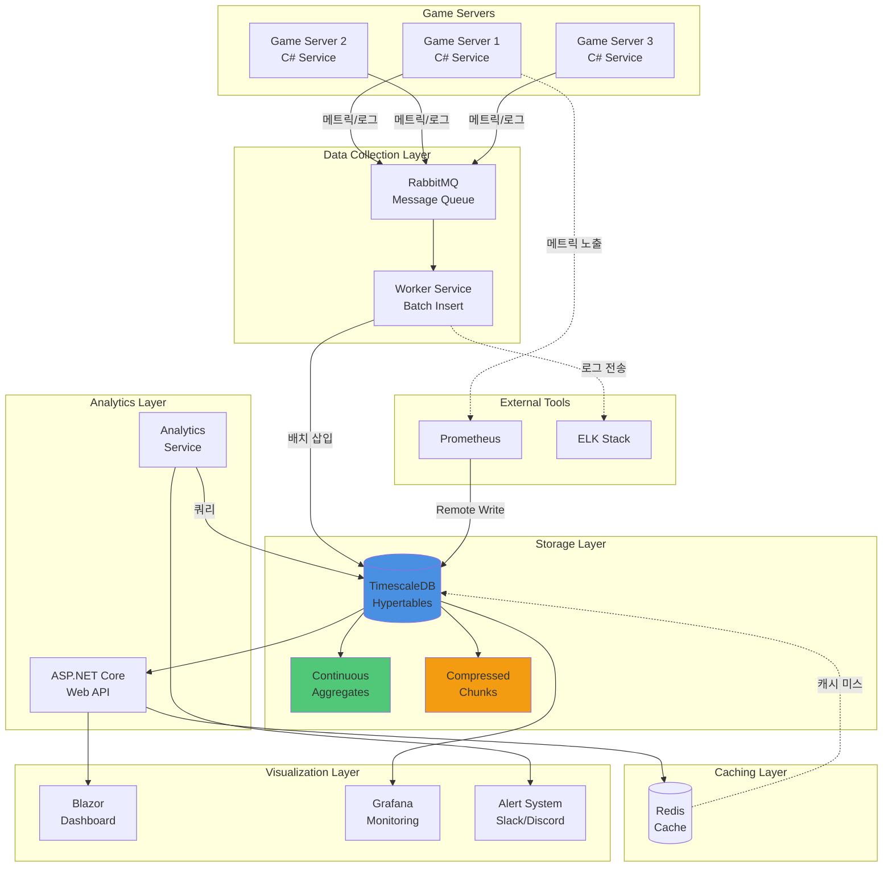

# 온라인 게임 서버를 위한 TimescaleDB 완벽 가이드  

저자: 최흥배, Claude AI   
    
권장 개발 환경
- **IDE**: Visual Studio 2022 (Community 이상)
- **.NET**: 9 이상
- **OS**: Windows 10 이상

-----  
  
# Chapter 20: 다음 단계로 - 당신만의 시스템 구축하기

이 책을 시작했을 때 당신은 아마도 게임 서버의 모니터링과 로그 분석에 어려움을 겪고 있었을 것이다. 데이터가 쌓이기만 하고 제대로 활용하지 못하거나, 느린 쿼리로 대시보드가 제대로 동작하지 않거나, 서버 장애를 뒤늦게 발견하는 문제들이 있었을 것이다. 하지만 이제는 다르다. 당신은 TimescaleDB의 Hypertable을 이해하고, C#과 SQLKata로 효율적인 쿼리를 작성할 수 있으며, 연속 집계로 실시간 대시보드를 만들고, 데이터 압축과 보관 정책으로 비용을 절감하는 방법을 알게 되었다.

이 마지막 장에서는 지금까지 배운 내용을 정리하고, 실제 프로젝트에 적용하는 로드맵을 제시하며, 계속 성장할 수 있는 학습 리소스를 소개한다. 이 책은 끝이 아니라 시작이다. 당신만의 강력한 모니터링 시스템을 구축하는 여정이 이제 본격적으로 시작된다.

## 20.1 이 책의 핵심 요약

**왜 TimescaleDB인가?**

온라인 게임 서버는 매 순간 엄청난 양의 시계열 데이터를 생성한다. 서버 메트릭, 플레이어 행동 로그, 게임 이벤트, 결제 기록 등이 끊임없이 쌓인다. 일반 RDBMS로는 이런 데이터를 효율적으로 저장하고 분석하기 어렵다. 인덱스가 비대해지고, 쿼리가 느려지며, 디스크 공간이 빠르게 소진된다.

TimescaleDB는 PostgreSQL을 기반으로 시계열 데이터에 최적화된 기능을 제공한다. Hypertable은 자동으로 시간 기반 파티셔닝을 해주고, 연속 집계는 복잡한 집계 쿼리를 실시간으로 처리하며, 압축 기능은 저장 공간을 최대 90%까지 절약한다. 게다가 PostgreSQL의 모든 기능을 그대로 사용할 수 있어 학습 곡선이 낮고, 기존 도구들과도 쉽게 통합된다.

**핵심 개념 정리**

이 책에서 다룬 핵심 개념을 간단히 복습한다:

```
┌─────────────────────────────────────────────────────────┐
│                    TimescaleDB 핵심 개념                │
├─────────────────────────────────────────────────────────┤
│                                                         │
│  1. Hypertable                                          │
│     - 시간 기반 자동 파티셔닝                            │
│     - 투명한 청크 관리                                   │
│     - 일반 테이블처럼 사용 가능                          │
│                                                         │
│  2. Continuous Aggregates (연속 집계)                   │
│     - 증분 업데이트로 실시간 집계                        │
│     - 복잡한 쿼리를 사전 계산                            │
│     - 대시보드 성능 극대화                               │
│                                                         │
│  3. Compression (압축)                                  │
│     - 시간이 지난 데이터 자동 압축                       │
│     - 스토리지 비용 90% 절감                             │
│     - 쿼리 성능은 유지                                   │
│                                                         │
│  4. Retention Policies (보관 정책)                      │
│     - 오래된 데이터 자동 삭제                            │
│     - 규제 준수 및 비용 관리                             │
│     - DROP vs DELETE 성능 차이                          │
│                                                         │
│  5. Time-bucket Functions (시간 버킷 함수)              │
│     - 유연한 시간 단위 집계                              │
│     - 타임존 처리                                        │
│     - 갭 채우기 (gapfill)                               │
│                                                         │
└─────────────────────────────────────────────────────────┘
```

**C#과 SQLKata의 역할**

이 책에서는 단순히 SQL만 다루지 않았다. C# 애플리케이션에서 SQLKata 라이브러리를 사용하여 타입 안전하고 유지보수하기 쉬운 쿼리를 작성하는 방법을 배웠다. SQLKata는 다음과 같은 장점을 제공한다:

- 컴파일 타임에 오류 발견
- 동적 쿼리 구성의 용이성
- 코드 재사용성 향상
- SQL Injection 방어

실제 게임 서버 환경에서는 쿼리 조건이 동적으로 변하는 경우가 많다. 사용자가 선택한 서버, 기간, 필터에 따라 쿼리가 달라져야 한다. SQLKata를 사용하면 이런 복잡한 로직을 깔끔하게 처리할 수 있다.

**실전 프로젝트에서 배운 것**

Chapter 15와 16의 종합 프로젝트를 통해 다음을 구현했다:

- ASP.NET Core Web API로 RESTful 서비스 구축
- SignalR을 사용한 실시간 데이터 푸시
- Blazor로 인터랙티브 대시보드 제작
- 복잡한 분석 쿼리 (코호트, 리텐션, 퍼널)
- 이상 탐지 및 자동 알림 시스템

이런 프로젝트는 단순히 기술을 배우는 것을 넘어서, 실제로 게임 운영에 필요한 시스템을 만드는 경험을 제공했다.

**아키텍처 전체 그림**

이 책에서 구축한 시스템의 전체 아키텍처를 다시 한번 살펴본다:



이 아키텍처는 다음 원칙을 따른다:

- **분리된 책임**: 데이터 수집, 저장, 분석, 시각화가 각각 독립적인 컴포넌트로 구성됨
- **확장성**: 각 레이어를 독립적으로 스케일 가능
- **안정성**: 메시지 큐가 버퍼 역할을 하여 데이터 유실 방지
- **성능**: 캐싱과 연속 집계로 응답 속도 최적화
- **유연성**: 다양한 도구와 통합 가능

## 20.2 실무 적용 로드맵

이제 배운 내용을 실제 프로젝트에 적용할 차례다. 단계별로 진행하면 위험을 최소화하면서 안정적으로 시스템을 구축할 수 있다.

**Phase 1: 파일럿 프로젝트 (2-4주)**

먼저 작은 범위에서 시작한다. 프로덕션 환경이 아닌 개발 또는 스테이징 환경에서 핵심 기능을 검증한다.

**목표:**
- TimescaleDB 설치 및 기본 설정
- 한 가지 메트릭(예: 서버 CPU 사용률)만 수집
- 간단한 대시보드 구축
- 팀원들에게 시연

**체크리스트:**

```csharp
// Phase 1 구현 체크리스트
public class Phase1Checklist
{
    public static readonly Dictionary<string, bool> Tasks = new()
    {
        // 환경 구축
        { "Docker로 TimescaleDB 설치", false },
        { "C# 프로젝트 생성 및 Npgsql, SQLKata 설치", false },
        { "데이터베이스 연결 테스트", false },
        
        // 데이터 수집
        { "서버 메트릭 수집 서비스 구현", false },
        { "Hypertable 생성", false },
        { "메트릭 데이터 삽입 코드 작성", false },
        { "10분간 데이터 수집 테스트", false },
        
        // 데이터 조회
        { "시간 범위 조회 쿼리 작성", false },
        { "time_bucket으로 집계 쿼리 작성", false },
        { "SQLKata 쿼리 동작 확인", false },
        
        // 시각화
        { "간단한 콘솔 출력 프로그램 작성", false },
        { "Chart.js로 그래프 표시", false },
        { "팀에 시연 및 피드백 수집", false }
    };

    public static void PrintProgress()
    {
        var completed = Tasks.Count(t => t.Value);
        var total = Tasks.Count;
        var percentage = (completed * 100.0 / total);

        Console.WriteLine($"Phase 1 Progress: {completed}/{total} ({percentage:F1}%)");
        Console.WriteLine();

        foreach (var task in Tasks)
        {
            var status = task.Value ? "✓" : "○";
            Console.WriteLine($"{status} {task.Key}");
        }
    }
}
```

**Phase 2: 핵심 기능 구축 (1-2개월)**

파일럿이 성공했다면 본격적으로 핵심 기능을 구축한다. 여러 종류의 메트릭과 로그를 수집하고, 연속 집계와 압축을 적용한다.

**목표:**
- 모든 주요 메트릭 수집 (CPU, 메모리, 네트워크, 디스크, 애플리케이션 메트릭)
- 게임 로그 수집 (로그인, 게임플레이, 에러)
- 연속 집계 설정
- 압축 및 보관 정책 적용
- 기본 알림 시스템

**권장 순서:**

1주차: 데이터 모델 설계
- 수집할 메트릭과 로그 정의
- 테이블 스키마 설계
- Hypertable 생성 및 인덱스 설계

2주차: 데이터 수집 파이프라인
- 메트릭 수집 서비스 구현
- 로그 수집 서비스 구현
- 배치 삽입 최적화
- 에러 처리 및 재시도 로직

3주차: 연속 집계 및 최적화
- 자주 사용하는 쿼리 식별
- 연속 집계 뷰 생성
- 리프레시 정책 설정
- 쿼리 성능 측정 및 비교

4주차: 자동화 및 정책
- 압축 정책 적용
- 보관 정책 설정
- 백업 스크립트 작성
- 모니터링 대시보드 구축

5-8주차: 테스트 및 개선
- 부하 테스트
- 장애 시나리오 테스트
- 성능 튜닝
- 문서화

**Phase 3: 프로덕션 배포 (1개월)**

스테이징에서 충분히 검증되었다면 프로덕션에 배포한다. 무중단 전환을 위해 신중하게 계획한다.

**배포 전 체크리스트:**

```markdown
## 인프라
- [ ] 프로덕션 서버 스펙 확인 (CPU, 메모리, 디스크)
- [ ] 네트워크 보안 설정 (방화벽, Security Group)
- [ ] SSL/TLS 인증서 발급 및 설정
- [ ] 도메인 및 DNS 설정
- [ ] 백업 스토리지 준비

## 데이터베이스
- [ ] TimescaleDB 설치 및 설정
- [ ] postgresql.conf 튜닝 (메모리, 연결 수 등)
- [ ] pg_hba.conf 보안 설정
- [ ] 사용자 및 권한 설정
- [ ] 암호화 설정 (SSL, 컬럼 암호화)

## 애플리케이션
- [ ] 연결 문자열 환경 변수로 분리
- [ ] 로깅 레벨 설정
- [ ] 에러 처리 강화
- [ ] 헬스 체크 엔드포인트 구현
- [ ] 성능 모니터링 코드 추가

## 모니터링
- [ ] Grafana 대시보드 설정
- [ ] 알림 채널 설정 (Slack, 이메일)
- [ ] 디스크 사용량 알림
- [ ] 쿼리 성능 모니터링
- [ ] 애플리케이션 로그 수집

## 백업 및 복구
- [ ] 백업 스크립트 작성
- [ ] 자동 백업 스케줄 설정
- [ ] 백업 검증 프로세스
- [ ] 복구 절차 문서화
- [ ] 복구 테스트 수행

## 보안
- [ ] 암호 강도 정책 설정
- [ ] 감사 로그 활성화
- [ ] 최소 권한 원칙 적용
- [ ] 침투 테스트 수행
- [ ] 보안 취약점 스캔

## 문서화
- [ ] 아키텍처 다이어그램
- [ ] 운영 매뉴얼
- [ ] 장애 대응 플레이북
- [ ] API 문서
- [ ] 쿼리 최적화 가이드
```

**무중단 전환 전략:**

기존 시스템이 있다면 점진적으로 전환한다:

```csharp
public class GradualMigrationService
{
    private readonly ILogger<GradualMigrationService> _logger;
    private readonly OldSystemClient _oldSystem;
    private readonly TimescaleDbService _newSystem;
    private double _trafficPercentageToNewSystem = 0.0;

    // 단계적으로 트래픽을 새 시스템으로 이동
    public async Task RecordMetric(ServerMetric metric)
    {
        var random = new Random().NextDouble();

        // 일정 비율의 트래픽만 새 시스템으로
        if (random < _trafficPercentageToNewSystem)
        {
            try
            {
                await _newSystem.InsertMetric(metric);
                _logger.LogInformation("Metric sent to new system");
            }
            catch (Exception ex)
            {
                _logger.LogError(ex, "Failed to insert to new system, falling back to old");
                await _oldSystem.InsertMetric(metric);
            }
        }
        else
        {
            await _oldSystem.InsertMetric(metric);
        }

        // 두 시스템 모두에 쓰기 (검증 기간)
        if (_trafficPercentageToNewSystem > 0 && _trafficPercentageToNewSystem < 100)
        {
            await CompareResults(metric);
        }
    }

    // 점진적으로 트래픽 비율 증가
    public void IncreaseTraffic(double percentage)
    {
        _trafficPercentageToNewSystem = Math.Min(100, _trafficPercentageToNewSystem + percentage);
        _logger.LogInformation($"New system traffic: {_trafficPercentageToNewSystem}%");
    }

    // 두 시스템의 결과 비교 (검증)
    private async Task CompareResults(ServerMetric metric)
    {
        // 검증 로직
        var oldResult = await _oldSystem.QueryMetric(metric.ServerId);
        var newResult = await _newSystem.QueryMetric(metric.ServerId);

        if (!AreResultsEqual(oldResult, newResult))
        {
            _logger.LogWarning("Results differ between old and new system!");
            // 알림 발송
        }
    }
}
```

전환 일정 예시:
- Week 1: 5% 트래픽, 결과 비교 및 검증
- Week 2: 20% 트래픽, 성능 모니터링
- Week 3: 50% 트래픽, 부하 테스트
- Week 4: 100% 트래픽, 구 시스템은 백업으로 유지
- Week 5: 구 시스템 종료

**Phase 4: 고도화 (지속적)**

기본 시스템이 안정화되면 추가 기능을 구축한다.

**우선순위별 추가 기능:**

**높음 (즉시 구현):**
- 실시간 이상 탐지 시스템
- 자동 알림 및 에스컬레이션
- 주요 KPI 대시보드
- 일일/주간 리포트 자동 생성

**중간 (3-6개월 내):**
- 플레이어 행동 분석
- 코호트 및 리텐션 분석
- A/B 테스트 결과 분석
- 예측 모델 (이탈, 결제 등)

**낮음 (필요시):**
- 멀티 리전 배포
- 고급 머신러닝 모델
- 커스텀 시각화
- 외부 시스템 통합

## 20.3 추가 학습 리소스

TimescaleDB와 시계열 데이터 분석을 더 깊이 공부하고 싶다면 다음 리소스를 활용한다.

**공식 문서 및 튜토리얼**

TimescaleDB 공식 문서는 가장 신뢰할 수 있는 학습 자료다:

- **TimescaleDB 공식 문서**: https://docs.timescale.com/
  - Getting Started 가이드
  - Best Practices
  - API Reference
  - 튜토리얼 및 예제

- **PostgreSQL 공식 문서**: https://www.postgresql.org/docs/
  - TimescaleDB는 PostgreSQL 기반이므로 PostgreSQL 문서도 필수
  - Performance Tips
  - SQL 언어 레퍼런스

**온라인 강의 및 코스**

- **Timescale Learn**: https://learn.timescale.com/
  - 무료 온라인 코스
  - 실습 환경 제공
  - 수료증 발급

- **PostgreSQL 튜닝 강의**
  - Udemy, Coursera 등에서 PostgreSQL 성능 튜닝 강의 검색
  - 특히 인덱싱, 쿼리 최적화 부분이 중요

**블로그 및 아티클**

정기적으로 읽어야 할 블로그:

- **Timescale Blog**: https://www.timescale.com/blog
  - 새 기능 소개
  - 사용 사례 연구
  - 성능 벤치마크

- **PostgreSQL Planet**: https://planet.postgresql.org/
  - 전 세계 PostgreSQL 전문가들의 블로그 집합
  - 최신 트렌드 및 팁

**오픈소스 프로젝트**

실제 코드를 읽고 배우는 것도 좋은 방법이다:

- **TimescaleDB GitHub**: https://github.com/timescale/timescaledb
  - 소스 코드 및 이슈 트래커
  - 기여 방법 문서

- **샘플 애플리케이션**
  - Timescale의 공식 샘플 앱
  - 커뮤니티에서 만든 예제 프로젝트

**C# 및 .NET 리소스**

- **Npgsql 문서**: https://www.npgsql.org/doc/
  - PostgreSQL용 .NET 드라이버
  - 고급 기능 및 성능 튜닝

- **SQLKata 문서**: https://sqlkata.com/docs
  - 쿼리 빌더 사용법
  - 고급 패턴

- **ASP.NET Core 문서**: https://docs.microsoft.com/aspnet/core/
  - Web API 구축
  - SignalR 실시간 통신

**도서**

추가로 읽으면 좋은 책:

- **"PostgreSQL: Up and Running"** by Regina Obe and Leo Hsu
  - PostgreSQL 기초부터 고급까지

- **"High Performance PostgreSQL for Rails"** by Andrew Atkinson
  - 성능 최적화 기법 (Rails 중심이지만 일반적으로 적용 가능)

- **"Designing Data-Intensive Applications"** by Martin Kleppmann
  - 시계열 데이터베이스의 이론적 배경
  - 분산 시스템 개념

**연습 프로젝트 아이디어**

책에서 다룬 내용을 응용하여 다음 프로젝트를 만들어본다:

```csharp
// 프로젝트 아이디어 목록
public class ProjectIdeas
{
    public static readonly List<ProjectIdea> Ideas = new()
    {
        new ProjectIdea
        {
            Title = "개인 건강 트래커",
            Description = "스마트워치 데이터를 TimescaleDB에 저장하고 분석",
            Difficulty = "초급",
            Skills = new[] { "Hypertable", "time_bucket", "기본 CRUD" },
            EstimatedTime = "1-2주"
        },
        new ProjectIdea
        {
            Title = "IoT 센서 모니터링",
            Description = "여러 센서의 온도, 습도 데이터 수집 및 시각화",
            Difficulty = "초급-중급",
            Skills = new[] { "연속 집계", "압축", "Grafana 연동" },
            EstimatedTime = "2-3주"
        },
        new ProjectIdea
        {
            Title = "주식 거래 분석 시스템",
            Description = "주식 가격 데이터를 수집하고 기술적 지표 계산",
            Difficulty = "중급",
            Skills = new[] { "Window Functions", "고급 쿼리", "실시간 알림" },
            EstimatedTime = "3-4주"
        },
        new ProjectIdea
        {
            Title = "웹사이트 분석 플랫폼",
            Description = "Google Analytics 같은 웹 분석 도구",
            Difficulty = "중급-고급",
            Skills = new[] { "대용량 데이터 처리", "세션 분석", "퍼널 분석" },
            EstimatedTime = "1-2개월"
        },
        new ProjectIdea
        {
            Title = "분산 로그 수집 시스템",
            Description = "여러 서버의 로그를 중앙 집중식으로 수집 및 분석",
            Difficulty = "고급",
            Skills = new[] { "메시지 큐", "배치 처리", "전문 검색" },
            EstimatedTime = "2-3개월"
        }
    };
}

public class ProjectIdea
{
    public string Title { get; set; }
    public string Description { get; set; }
    public string Difficulty { get; set; }
    public string[] Skills { get; set; }
    public string EstimatedTime { get; set; }
}
```

## 20.4 커뮤니티 및 지원

혼자 공부하다 막힐 때 도움을 받을 수 있는 커뮤니티를 소개한다.

**온라인 커뮤니티**

**Timescale Community Slack**
- URL: https://timescaledb.slack.com
- 가장 활발한 TimescaleDB 커뮤니티
- 공식 팀원들도 참여하여 질문에 답변
- 채널별로 주제 구분 (general, help, cloud 등)

**Timescale Community Forum**
- URL: https://www.timescale.com/forum
- 긴 형식의 질문과 답변
- 검색 가능한 지식 베이스

**Stack Overflow**
- 태그: `timescaledb`, `postgresql`, `c#`, `sqlkata`
- 영어로 질문하면 전 세계 개발자들의 답변을 받을 수 있음
- 기존 질문을 검색하면 대부분의 문제 해결 가능

**Reddit**
- r/PostgreSQL: https://www.reddit.com/r/PostgreSQL/
- r/dotnet: https://www.reddit.com/r/dotnet/
- 최신 뉴스 및 토론

**한국 커뮤니티**

한국어로 소통할 수 있는 커뮤니티:

- **OKKY**: https://okky.kr/ (데이터베이스 게시판)
- **생활코딩 커뮤니티**: https://community.cooding.life/
- **Facebook 그룹**: "PostgreSQL Korea", ".NET Korea"
- **카카오톡 오픈채팅**: 검색으로 .NET 또는 DB 관련 방 찾기

**질문하는 법**

효과적으로 질문하면 더 빨리 답변을 받을 수 있다:

```csharp
// 나쁜 질문 예시
"TimescaleDB가 안 됩니다. 도와주세요."

// 좋은 질문 예시
public class GoodQuestionExample
{
    public static string CreateQuestion()
    {
        return @"
# TimescaleDB 연속 집계 리프레시 에러

## 환경
- OS: Windows 11
- TimescaleDB: 2.13.0
- PostgreSQL: 15
- .NET: 8.0
- SQLKata: 3.0.0

## 문제 상황
게임 서버 메트릭을 1분 단위로 집계하는 연속 집계를 생성했습니다.
리프레시 정책을 설정했는데 다음 에러가 발생합니다:

```
ERROR: continuous aggregate refresh failed
DETAIL: invalid range for refresh
```

## 재현 코드
```csharp
var query = @""
CREATE MATERIALIZED VIEW server_metrics_1min
WITH (timescaledb.continuous) AS
SELECT
    time_bucket('1 minute', timestamp) AS bucket,
    server_id,
    AVG(cpu_percent) AS avg_cpu
FROM server_metrics
GROUP BY bucket, server_id;

SELECT add_continuous_aggregate_policy('server_metrics_1min',
    start_offset => INTERVAL '1 hour',
    end_offset => INTERVAL '1 minute',
    schedule_interval => INTERVAL '1 minute');
"";

await db.StatementAsync(query);
```

## 시도한 것
1. start_offset과 end_offset을 다양하게 변경
2. 수동으로 CALL refresh_continuous_aggregate() 실행 -> 같은 에러
3. 기존 데이터가 있는지 확인 -> 최근 1시간 데이터 존재함

## 기대하는 결과
리프레시 정책이 1분마다 자동 실행되어 최신 데이터를 집계

## 추가 정보
- server_metrics 테이블 구조: [스키마 첨부]
- PostgreSQL 로그: [관련 부분 첨부]

도움 부탁드립니다!
        "";
    }
}
```

**상용 지원**

회사에서 사용한다면 상용 지원도 고려할 수 있다:

- **Timescale Support Plans**
  - Standard, Premium, Enterprise 플랜
  - SLA 보장
  - 전문가의 직접 지원

- **Timescale Cloud**
  - 완전 관리형 서비스
  - 자동 백업, 업그레이드
  - 24/7 모니터링

## 20.5 자주 묻는 질문 (FAQ)

실무에서 자주 받는 질문과 답변을 정리했다.

**Q1: TimescaleDB와 InfluxDB 중 어떤 것을 선택해야 하나?**

A: 두 데이터베이스 모두 시계열 데이터에 최적화되어 있지만, 다음과 같은 차이가 있다:

**TimescaleDB 선택 기준:**
- SQL을 사용하고 싶음
- 복잡한 JOIN이 필요함
- 관계형 데이터와 시계열 데이터를 함께 저장
- PostgreSQL 생태계를 활용하고 싶음
- 트랜잭션 지원이 필요함

**InfluxDB 선택 기준:**
- 단순한 메트릭 수집에 집중
- 매우 높은 쓰기 처리량이 필요 (초당 수백만 건)
- IoT 센서 데이터 같은 단순한 구조

게임 서버 모니터링처럼 복잡한 분석이 필요한 경우 TimescaleDB가 더 적합하다.

**Q2: 얼마나 많은 데이터를 저장할 수 있나?**

A: TimescaleDB는 페타바이트 규모까지 확장 가능하다. 실제로는 다음 요인에 따라 달라진다:

- 하드웨어 스펙 (디스크, 메모리)
- 쿼리 패턴
- 압축 설정
- 보관 정책

예를 들어 다음과 같은 규모를 처리할 수 있다:

```
게임 서버 100대 × 초당 10개 메트릭 × 86,400초/일 = 일일 8,640만 행

압축 전: 약 8GB/일 (행당 100바이트 가정)
압축 후: 약 800MB/일 (10:1 압축비)

1년 저장: 약 300GB (압축 적용 시)
```

일반적인 게임 서비스 규모라면 단일 서버로도 충분하며, 더 큰 규모에서는 읽기 복제본이나 분산 설정을 고려한다.

**Q3: 기존 PostgreSQL에서 TimescaleDB로 마이그레이션이 어렵나?**

A: 어렵지 않다. TimescaleDB는 PostgreSQL 확장이므로 기존 데이터와 쿼리를 그대로 사용할 수 있다.

마이그레이션 단계:
1. TimescaleDB 확장 설치: `CREATE EXTENSION timescaledb;`
2. 기존 테이블을 Hypertable로 변환: `SELECT create_hypertable('table_name', 'time_column');`
3. 애플리케이션 코드는 수정 불필요

주의사항:
- Hypertable로 변환 시 기존 인덱스는 유지되나 재생성 권장
- 외래 키는 제약이 있음 (시간 컬럼에는 불가)
- 기존 데이터가 많다면 변환에 시간이 걸릴 수 있음

**Q4: C# 외에 다른 언어도 사용할 수 있나?**

A: 물론이다. TimescaleDB는 PostgreSQL 프로토콜을 사용하므로 모든 언어에서 접근 가능하다:

- **Python**: psycopg2, SQLAlchemy
- **Java**: JDBC, JPA
- **JavaScript/Node.js**: node-postgres, TypeORM
- **Go**: pgx, GORM
- **Ruby**: pg gem, ActiveRecord
- **PHP**: PDO, Laravel

이 책에서는 게임 서버가 주로 C#으로 개발되는 점을 고려하여 C#을 사용했지만, 개념은 모든 언어에 동일하게 적용된다.

**Q5: 압축을 적용하면 쿼리 성능이 떨어지나?**

A: 놀랍게도 많은 경우 오히려 빨라진다. 이유는:

- 디스크에서 읽어야 할 데이터가 줄어듦
- I/O 병목이 감소
- 더 많은 데이터가 메모리에 캐시됨

단, 압축된 데이터를 개별 행 단위로 조회하면 압축 해제 비용이 발생한다. 집계 쿼리에서는 대부분 성능 향상을 경험한다.

**Q6: 실시간 대시보드를 만들 때 최소 딜레이는 얼마나 되나?**

A: 연속 집계의 리프레시 정책을 1분 단위로 설정할 수 있으므로 이론적으로는 1분 딜레이다. 더 실시간이 필요하다면:

- 연속 집계 없이 직접 쿼리 (초 단위 가능하지만 부하 증가)
- Redis 캐싱 활용
- SignalR로 클라이언트에 푸시
- 최근 N분 데이터만 실시간, 나머지는 연속 집계 사용

게임 모니터링에서는 1-5분 딜레이가 일반적으로 허용 가능하다.

**Q7: 비용은 얼마나 드나?**

A: TimescaleDB는 오픈소스이므로 소프트웨어 자체는 무료다. 비용은 인프라에서 발생한다:

**셀프 호스팅:**
- 서버 비용: AWS t3.large (2 vCPU, 8GB RAM) = 월 $60-70
- 스토리지: 100GB SSD = 월 $10
- 백업 스토리지: 추가 $5-10
- 총 월 $75-90

**Timescale Cloud (관리형):**
- Starter: 월 $50 (25 GB 스토리지, 1 GB RAM)
- Growth: 월 $150-500 (규모에 따라)
- Enterprise: 협의

개인 프로젝트나 소규모 게임은 셀프 호스팅, 중규모 이상이나 운영 부담을 줄이고 싶다면 Timescale Cloud 추천.

**Q8: 장애가 발생하면 어떻게 하나?**

A: Chapter 11의 백업/복구 전략을 참고하되, 기본적으로:

1. **예방:**
   - 자동 백업 설정 (pg_dump 또는 pg_basebackup)
   - 디스크/메모리 모니터링
   - 슬로우 쿼리 로그 확인

2. **탐지:**
   - 헬스 체크 엔드포인트
   - Grafana 알림
   - 외부 모니터링 서비스 (Uptime Robot 등)

3. **복구:**
   - 읽기 전용 모드로 전환하여 서비스 유지
   - 백업에서 복구
   - 트래픽을 복제본으로 전환

4. **사후 분석:**
   - 로그 분석
   - 원인 파악
   - 재발 방지 대책

**Q9: 개발 환경과 프로덕션 환경을 어떻게 분리하나?**

A: 연결 문자열을 환경 변수로 관리하고, appsettings.json을 환경별로 분리한다:

```csharp
// appsettings.Development.json
{
  "ConnectionStrings": {
    "TimescaleDB": "Host=localhost;Port=5432;Database=game_monitoring_dev;Username=dev_user;Password=dev_pass"
  },
  "Logging": {
    "LogLevel": {
      "Default": "Debug"
    }
  }
}

// appsettings.Production.json
{
  "ConnectionStrings": {
    "TimescaleDB": "Host=prod-db.internal;Port=5432;Database=game_monitoring;Username=app_user;Password=${DB_PASSWORD};SSL Mode=Require"
  },
  "Logging": {
    "LogLevel": {
      "Default": "Warning"
    }
  }
}

// Startup.cs
services.AddSingleton(provider =>
{
    var config = provider.GetRequiredService<IConfiguration>();
    var connectionString = config.GetConnectionString("TimescaleDB");
    var connection = new NpgsqlConnection(connectionString);
    var compiler = new PostgresCompiler();
    return new QueryFactory(connection, compiler);
});
```

프로덕션 환경의 민감한 정보는 Azure Key Vault, AWS Secrets Manager 등을 사용한다.

**Q10: 이 책의 예제 코드는 어디서 다운로드할 수 있나?**

A: (실제 책이라면 여기에 GitHub 저장소 링크를 제공)

예제 코드에는 다음이 포함된다:
- 각 장의 완성된 코드
- Docker Compose 설정 파일
- 샘플 데이터 생성 스크립트
- 유용한 SQL 쿼리 모음
- 프로덕션 체크리스트

## 20.6 마치며

이 책을 시작하면서 우리는 온라인 게임 서버의 모니터링과 로그 분석 문제를 다루었다. 서버가 다운되어도 몇 시간 뒤에야 알아차리거나, 플레이어 불만이 쌓여도 원인을 파악할 수 없거나, 데이터는 쌓이지만 의미 있는 인사이트를 얻지 못하는 상황이 있었다.

이제 당신은 다르다. TimescaleDB로 효율적으로 시계열 데이터를 저장하고, SQLKata로 깔끔한 쿼리를 작성하며, 연속 집계로 실시간 대시보드를 만들고, 이상 탐지 시스템으로 문제를 조기에 발견하는 능력을 갖추었다. 단순히 도구를 사용하는 것을 넘어서, 왜 이런 기술이 필요한지, 어떤 문제를 해결하는지, 어떻게 최적화하는지를 이해하게 되었다.

**기술은 도구일 뿐이다**

TimescaleDB든, C#이든, SQLKata든 모두 도구일 뿐이다. 중요한 것은 이 도구들을 사용하여 실제 문제를 해결하는 것이다. 플레이어들이 더 나은 게임 경험을 할 수 있도록 서버를 안정적으로 운영하고, 데이터를 통해 게임을 개선하며, 팀이 더 빠르게 의사결정을 할 수 있도록 인사이트를 제공하는 것이다.

**실패해도 괜찮다**

이 책의 예제를 따라 하다가 에러가 발생할 수도 있고, 실제 프로젝트에 적용하다가 예상치 못한 문제를 만날 수도 있다. 그것은 정상이다. 모든 개발자가 겪는 과정이다. 중요한 것은 포기하지 않고 문제를 하나씩 해결해 나가는 것이다. 에러 메시지를 읽고, 로그를 분석하고, 커뮤니티에 질문하고, 다시 시도하는 과정에서 진짜 실력이 생긴다.

**지속적인 학습**

기술은 계속 발전한다. TimescaleDB도 새 버전이 나오면서 더 강력한 기능이 추가되고, C#도 새 언어 기능이 생기며, 새로운 도구와 라이브러리가 등장한다. 이 책에서 배운 기초를 바탕으로 계속 학습하고 실험하면서 성장하기 바란다.

**커뮤니티에 기여하기**

어느 정도 익숙해지면 당신의 지식을 다른 사람들과 공유하는 것도 고려해본다. 블로그 글을 쓰거나, Stack Overflow에 답변을 달거나, 오픈소스 프로젝트에 기여하거나, 후배 개발자를 멘토링하는 것이다. 가르치는 과정에서 자신도 더 깊이 이해하게 되고, 커뮤니티 전체가 함께 성장한다.

**당신만의 시스템을 만들어라**

이 책은 게임 서버 모니터링이라는 특정 분야에 초점을 맞추었지만, 여기서 배운 원리는 다양한 분야에 적용할 수 있다. IoT, 금융, 헬스케어, 소셜 미디어 등 시계열 데이터가 있는 곳이라면 어디서든 TimescaleDB를 활용할 수 있다. 이 책을 발판 삼아 당신만의 독특한 시스템을 만들어보기 바란다.

**마지막 격려**

```
┌─────────────────────────────────────────────────────────┐
│                                                         │
│   "모든 전문가도 처음에는 초보자였다"                     │
│                                                         │
│   당신은 이 책을 끝까지 읽었다.                          │
│   이미 많은 개발자들이 포기하는 지점을 통과했다.          │
│                                                         │
│   이제 직접 만들어볼 차례다.                             │
│   작은 프로젝트부터 시작해서,                            │
│   하나씩 기능을 추가하고,                                │
│   문제를 해결하면서,                                     │
│   당신만의 전문성을 쌓아가라.                            │
│                                                         │
│   언젠가 당신도 다른 사람에게 가르치는                    │
│   입장이 될 것이다.                                      │
│                                                         │
│   행운을 빈다!                                           │
│                                                         │
│                                           - 저자 일동    │
└─────────────────────────────────────────────────────────┘
```

**다음 단계**

이 책을 덮고 나면:

1. 오늘 당장 작은 프로젝트를 시작한다
2. Chapter 2의 환경 설정부터 다시 따라 해본다
3. 자신의 아이디어를 하나 정한다
4. 한 줄의 코드를 작성한다
5. 작동하는지 확인한다
6. 다음 한 줄을 작성한다
7. 반복한다

천 리 길도 한 걸음부터다. 완벽한 시스템을 한 번에 만들려고 하지 말고, 작동하는 최소한의 기능부터 만들어서 점진적으로 개선해 나간다. 그것이 모든 성공적인 소프트웨어가 만들어진 방법이다.

**감사의 말**

이 책을 끝까지 읽어준 당신에게 감사한다. 당신의 시간과 노력에 경의를 표한다. 이 책이 당신의 개발자로서의 여정에 작은 도움이 되었기를 바란다.

TimescaleDB 커뮤니티에도 감사한다. 훌륭한 오픈소스 프로젝트를 만들고 유지해주는 모든 기여자들, 질문에 답변해주는 커뮤니티 멤버들, 그리고 이 기술을 발전시키기 위해 노력하는 모든 사람들에게 감사한다.

**연락하기**

이 책에 대한 피드백, 질문, 또는 당신이 만든 프로젝트를 공유하고 싶다면 언제든 연락하기 바란다:

- 이메일: (저자 이메일)
- GitHub: (저자 GitHub)
- Twitter: (저자 Twitter)
- 블로그: (저자 블로그)

당신의 성공 스토리를 듣기를 기대한다!

**자, 이제 시작이다!**

책을 덮고, 에디터를 열고, 첫 번째 프로젝트를 시작하라. 당신의 게임 서버가 더 안정적으로 운영되고, 플레이어들이 더 나은 경험을 하며, 당신의 팀이 데이터 기반으로 더 나은 의사결정을 하는 그 날을 상상하며.

**Happy Coding! 🚀**

---

**P.S.** 막히면 Section 20.4의 커뮤니티를 활용하는 것을 잊지 말라. 혼자 고민하지 말고, 질문하라. 누군가는 반드시 답을 알고 있다.

**P.P.S.** 성공하면 꼭 커뮤니티에 공유하라. 당신의 경험이 다음 초보자에게 큰 도움이 될 것이다.

**P.P.P.S.** 이 책이 도움이 되었다면 동료들에게 추천해주기 바란다. 함께 성장하는 것이 가장 즐거운 일이다.   