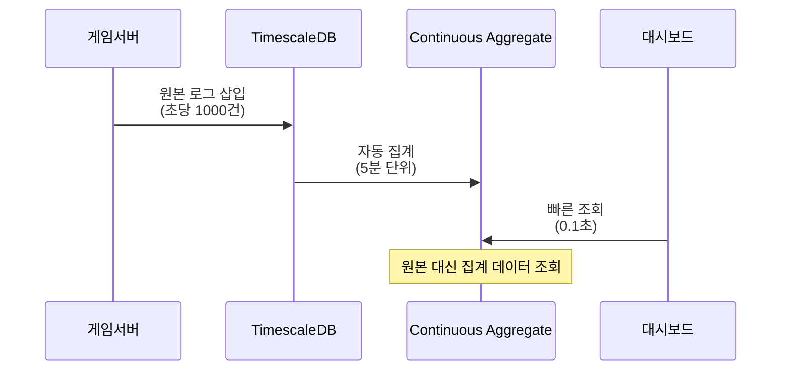
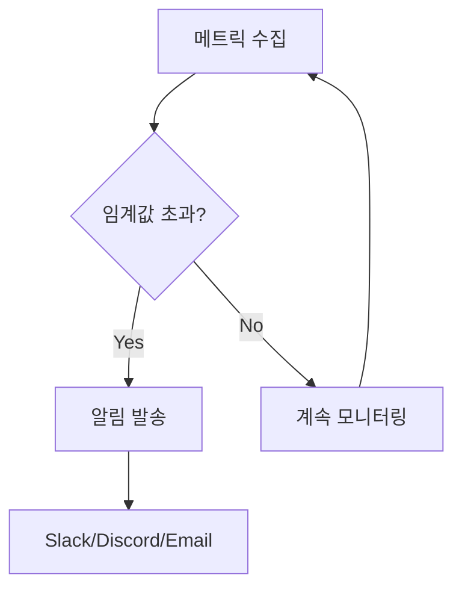

# 온라인 게임 서버를 위한 TimescaleDB 완벽 가이드  

저자: 최흥배, Claude AI   
    
권장 개발 환경
- **IDE**: Visual Studio 2022 (Community 이상)
- **.NET**: 9 이상
- **OS**: Windows 10 이상

---  
    
## **목차**

### **PART 1: 시작하기 - 왜 TimescaleDB인가?**

#### **Chapter 1: 온라인 게임 서버, 무엇이 문제인가?**
당신은 지금 출시 6개월 차 온라인 게임의 백엔드 개발자입니다. 매일 발생하는 문제들을 살펴보면서 시계열 데이터베이스의 필요성을 이해합니다. 실제 게임 서버에서 발생하는 초당 수천 건의 로그 데이터, 플레이어 행동 추적, 서버 성능 지표들이 어떻게 쌓이고 관리되는지 살펴봅니다. 일반 관계형 데이터베이스로는 시간이 지날수록 쿼리 속도가 느려지고, 디스크 용량이 폭발적으로 증가하며, 특정 시간대의 데이터를 조회하는데 수십 초가 걸리는 문제를 경험하게 됩니다.

```
[게임 서버 데이터 폭발 시나리오]
첫 달: 100GB → 쿼리 속도 빠름 ✓
3개월: 500GB → 쿼리 속도 느림 ⚠
6개월: 1.2TB → 쿼리 타임아웃 ✗
```

- **1.1 실제 사례: 갑자기 느려진 게임 서버**
- **1.2 시계열 데이터란 무엇인가?**
- **1.3 전통적인 RDBMS의 한계**
- **1.4 TimescaleDB가 해결하는 문제들**
- **1.5 이 책에서 만들 실전 프로젝트 소개**

#### **Chapter 2: 개발 환경 구축하기 (Windows 11 + C#)**
Windows 11 환경에서 TimescaleDB를 설치하고, Visual Studio와 C# 프로젝트를 구성하는 모든 과정을 단계별로 진행합니다. Docker Desktop을 사용하여 TimescaleDB 컨테이너를 실행하고, pgAdmin을 통해 데이터베이스에 접속하는 방법을 배웁니다. 또한 SQLKata와 Npgsql 라이브러리를 NuGet으로 설치하여 C# 프로젝트에서 TimescaleDB를 사용할 준비를 완료합니다.

- **2.1 필요한 도구들 살펴보기**
- **2.2 Docker Desktop 설치 및 TimescaleDB 컨테이너 실행**
- **2.3 pgAdmin 설치 및 데이터베이스 접속**
- **2.4 Visual Studio 프로젝트 생성**
- **2.5 NuGet으로 SQLKata 및 Npgsql 설치**
- **2.6 첫 연결 테스트 - Hello TimescaleDB!**

```csharp
// 첫 연결 성공 코드 미리보기
var connection = new NpgsqlConnection(connectionString);
var db = new QueryFactory(connection, new PostgresCompiler());
Console.WriteLine("TimescaleDB 연결 성공!");
```

---

### **PART 2: TimescaleDB 핵심 개념 마스터하기**

#### **Chapter 3: Hypertable의 이해 - 시간을 다루는 마법**
TimescaleDB의 핵심인 Hypertable이 일반 PostgreSQL 테이블과 어떻게 다른지 이해합니다. 시간 기반 자동 파티셔닝이 어떻게 작동하는지, 왜 대용량 데이터 조회가 빠른지를 그림과 함께 설명합니다. 게임 서버의 플레이어 접속 로그 테이블을 Hypertable로 변환하면서 실제로 성능 차이를 체감해봅니다.

```
[일반 테이블 vs Hypertable]

일반 테이블:
┌──────────────────────────────────┐
│  모든 데이터가 하나의 덩어리     │
│  (2억 건의 로그가 한 곳에)      │
└──────────────────────────────────┘
   ↓ 조회 시간: 45초

Hypertable (자동 파티셔닝):
┌──────┬──────┬──────┬──────┐
│ 1월  │ 2월  │ 3월  │ 4월  │
└──────┴──────┴──────┴──────┘
   ↓ 조회 시간: 0.3초
```

- **3.1 전통적인 파티셔닝의 고통**
- **3.2 Hypertable이란 무엇인가?**
- **3.3 첫 Hypertable 생성하기 (플레이어 로그인 로그)**
- **3.4 SQLKata로 Hypertable에 데이터 삽입**
- **3.5 시간 기반 쿼리의 놀라운 성능**
- **3.6 Chunk 개념과 자동 파티셔닝 원리**

#### **Chapter 4: C#과 SQLKata로 기본 CRUD 마스터하기**
SQLKata의 Fluent API를 사용하여 TimescaleDB에 데이터를 삽입, 조회, 수정, 삭제하는 모든 기본 작업을 배웁니다. 게임 서버에서 발생하는 실제 이벤트들을 로깅하는 코드를 작성하면서 자연스럽게 익힙니다. 플레이어 접속 이벤트, 아이템 사용 로그, 전투 기록 등 다양한 실전 예제를 다룹니다.

- **4.1 SQLKata 기본 문법 익히기**
- **4.2 INSERT: 플레이어 이벤트 로깅하기**
- **4.3 SELECT: 시간 범위로 데이터 조회하기**
- **4.4 WHERE 조건: 특정 플레이어 행동 추적**
- **4.5 JOIN: 여러 테이블 연결하기**
- **4.6 집계 함수: COUNT, SUM, AVG 활용**
- **4.7 비동기 처리: async/await 패턴**

```csharp
// SQLKata로 최근 1시간 로그인 조회
var recentLogins = await db.Query("player_login_log")
    .Where("login_time", ">=", DateTime.UtcNow.AddHours(-1))
    .OrderByDesc("login_time")
    .GetAsync();
```

#### **Chapter 5: 시간 함수의 모든 것**
TimescaleDB의 강력한 시간 함수들을 마스터합니다. time_bucket으로 데이터를 5분, 1시간, 1일 단위로 그룹화하여 집계하는 방법을 배웁니다. 게임 서버의 동시 접속자 수 추이, 시간대별 매출 분석, 서버 CPU 사용률 모니터링 등 실전 대시보드 쿼리를 작성합니다.


- **5.1 time_bucket: 시간 단위로 그룹화하기**
- **5.2 실전: 5분 단위 동시 접속자 통계**
- **5.3 시간대별 매출 분석 쿼리**
- **5.4 first(), last() 함수 활용**
- **5.5 시간 간격 계산과 비교**
- **5.6 타임존 처리하기**

---

### **PART 3: 실전 게임 서버 모니터링 시스템 구축**

#### **Chapter 6: 서버 성능 메트릭 수집 시스템**
게임 서버의 CPU, 메모리, 네트워크, 디스크 사용률을 실시간으로 수집하여 TimescaleDB에 저장하는 시스템을 구축합니다. C#으로 메트릭 수집 에이전트를 만들고, SQLKata로 효율적으로 데이터를 저장합니다. 배치 삽입과 트랜잭션 처리를 통해 성능을 최적화하는 방법도 배웁니다.

```
[모니터링 아키텍처]

┌─────────────┐     ┌──────────────┐     ┌─────────────┐
│ 게임 서버   │────▶│ 메트릭 수집  │────▶│ TimescaleDB │
│ (다중 인스턴스)│     │ 에이전트(C#) │     │             │
└─────────────┘     └──────────────┘     └─────────────┘
                            │
                            ▼
                    ┌──────────────┐
                    │ 실시간       │
                    │ 대시보드     │
                    └──────────────┘
```

- **6.1 메트릭 데이터 모델 설계**
- **6.2 C# 성능 카운터로 시스템 메트릭 수집**
- **6.3 배치 삽입으로 성능 최적화**
- **6.4 실시간 CPU/메모리 사용률 저장**
- **6.5 서버별 메트릭 조회 및 비교**
- **6.6 이상 징후 감지 쿼리 작성**

#### **Chapter 7: 게임 로그 수집 및 분석**
게임 내에서 발생하는 다양한 이벤트 로그를 체계적으로 수집하고 분석합니다. 플레이어 행동 로그, 아이템 거래 로그, 던전 클리어 로그, 채팅 로그 등을 효율적으로 저장하고 의미 있는 인사이트를 도출하는 방법을 배웁니다. JSON 타입을 활용하여 유연한 로그 구조를 설계합니다.

- **7.1 게임 로그의 종류와 중요성**
- **7.2 구조화된 로그 설계하기**
- **7.3 JSON 컬럼으로 유연한 로그 저장**
- **7.4 플레이어 행동 패턴 분석**
- **7.5 아이템 경제 추적 및 분석**
- **7.6 어뷰징 탐지 쿼리**

```csharp
// JSON 로그 삽입 예제
var logData = new {
    timestamp = DateTime.UtcNow,
    player_id = 12345,
    event_type = "item_purchase",
    event_data = JsonSerializer.Serialize(new {
        item_id = 999,
        price = 5000,
        currency = "gold"
    })
};
await db.Query("game_event_log").InsertAsync(logData);
```

#### **Chapter 8: 연속 집계(Continuous Aggregates) - 실시간 대시보드의 비밀**
TimescaleDB의 연속 집계 기능을 사용하여 실시간 대시보드를 구현합니다. 원본 데이터는 계속 쌓이지만, 집계된 뷰는 자동으로 갱신되어 대시보드 조회가 항상 빠르게 유지됩니다. 시간대별 DAU, 매출 통계, 서버 평균 응답 시간 등의 실시간 지표를 만듭니다.



- **8.1 연속 집계란 무엇인가?**
- **8.2 첫 연속 집계 뷰 생성하기**
- **8.3 시간대별 동접자 통계 자동화**
- **8.4 매출 집계 실시간 대시보드**
- **8.5 리프레시 정책 설정**
- **8.6 SQLKata로 연속 집계 조회하기**

---

### **PART 4: 대규모 운영을 위한 고급 기능**

#### **Chapter 9: 데이터 압축과 보관 정책**
시간이 지난 오래된 데이터는 압축하여 저장 공간을 10분의 1로 줄이고, 필요 없는 데이터는 자동으로 삭제하는 정책을 설정합니다. 라이브 게임 서버에서 스토리지 비용을 절감하면서도 필요한 데이터는 보존하는 전략을 배웁니다.

```
[압축 효과]

압축 전:    1.2TB (최근 6개월 로그)
압축 후:    120GB (90% 절감!)
조회 속도:  오히려 더 빠름 ✓
```

- **9.1 데이터 압축의 원리와 이점**
- **9.2 압축 정책 설정하기**
- **9.3 자동 데이터 삭제 정책 (Retention Policy)**
- **9.4 콜드 스토리지 전략**
- **9.5 압축된 데이터 조회하기**
- **9.6 실전: 3개월 이상 데이터 자동 압축**

#### **Chapter 10: 고급 쿼리 최적화**
복잡한 분석 쿼리를 빠르게 실행하는 방법을 배웅니다. 인덱스 전략, 쿼리 플랜 분석, 파티션 프루닝을 활용하여 수억 건의 데이터에서도 빠른 응답을 얻습니다. EXPLAIN ANALYZE로 쿼리 성능을 진단하고 개선하는 실전 기법을 다룹니다.

- **10.1 EXPLAIN ANALYZE로 쿼리 분석하기**
- **10.2 효과적인 인덱스 전략**
- **10.3 복합 조건 최적화**
- **10.4 윈도우 함수 활용**
- **10.5 파티션 프루닝 이해하기**
- **10.6 느린 쿼리 개선 사례 연구**

#### **Chapter 11: 백업과 복구 전략**
라이브 게임 서버의 데이터를 안전하게 백업하고, 장애 발생 시 빠르게 복구하는 방법을 배웁니다. pg_dump, 연속 아카이빙, PITR(Point-In-Time Recovery)을 활용한 완벽한 백업 전략을 수립합니다.

- **11.1 백업의 중요성과 전략**
- **11.2 pg_dump로 백업하기**
- **11.3 자동화된 백업 스크립트 작성**
- **11.4 Point-In-Time Recovery**
- **11.5 복구 시나리오 실습**
- **11.6 클라우드 백업 연동**

---

### **PART 5: 라이브 게임 서버 운영 실전**

#### **Chapter 12: 실시간 이상 탐지 시스템**
게임 서버의 이상 징후를 실시간으로 감지하는 시스템을 구축합니다. 갑작스러운 트래픽 증가, 오류율 급증, 비정상적인 플레이어 행동 등을 자동으로 감지하고 알림을 보내는 C# 애플리케이션을 만듭니다.



- **12.1 이상 탐지 패턴**
- **12.2 임계값 기반 알림**
- **12.3 이동 평균을 활용한 동적 임계값**
- **12.4 C#으로 알림 시스템 구현**
- **12.5 Slack/Discord 웹훅 연동**
- **12.6 실전: 서버 다운 자동 감지**

#### **Chapter 13: 대용량 데이터 마이그레이션**
기존 MySQL이나 MongoDB에 쌓인 게임 로그를 TimescaleDB로 안전하게 이전하는 방법을 배웁니다. C#으로 효율적인 마이그레이션 도구를 만들고, 무중단 전환 전략을 수립합니다.

- **13.1 마이그레이션 계획 수립**
- **13.2 기존 데이터 분석 및 모델링**
- **13.3 C# 마이그레이션 도구 개발**
- **13.4 배치 처리로 성능 최적화**
- **13.5 데이터 검증 및 무결성 확인**
- **13.6 무중단 전환 전략**

#### **Chapter 14: 멀티 리전 및 확장성**
게임이 글로벌로 확장될 때 여러 지역에 TimescaleDB를 배포하고 관리하는 방법을 배웁니다. 읽기 복제본, 샤딩, 클라우드 배포 옵션을 살펴봅니다.

- **14.1 복제(Replication) 설정**
- **14.2 읽기 부하 분산**
- **14.3 멀티 리전 아키텍처**
- **14.4 Timescale Cloud 활용**
- **14.5 Docker Compose로 클러스터 구성**
- **14.6 모니터링과 장애 대응**

---

### **PART 6: 실전 프로젝트 - 완성형 모니터링 시스템**

#### **Chapter 15: 종합 프로젝트 1 - 실시간 게임 서버 대시보드**
지금까지 배운 모든 내용을 종합하여 완전한 실시간 게임 서버 모니터링 대시보드를 만듭니다. C# ASP.NET Core로 웹 API를 구축하고, SQLKata로 복잡한 쿼리를 작성하며, Chart.js로 시각화합니다.

```
[대시보드 기능]
✓ 실시간 동접자 추이 그래프
✓ 서버별 성능 메트릭 (CPU/메모리/네트워크)
✓ 최근 오류 로그 목록
✓ 시간대별 매출 통계
✓ 플레이어 행동 히트맵
✓ 이상 징후 알림
```

- **15.1 프로젝트 아키텍처 설계**
- **15.2 ASP.NET Core Web API 구축**
- **15.3 SQLKata로 대시보드 쿼리 작성**
- **15.4 실시간 데이터 갱신 (SignalR)**
- **15.5 Chart.js 시각화**
- **15.6 배포 및 운영**

#### **Chapter 16: 종합 프로젝트 2 - 플레이어 행동 분석 시스템**
플레이어의 게임 플레이 패턴을 분석하여 인사이트를 도출하는 시스템을 만듭니다. 코호트 분석, 리텐션 계산, 퍼널 분석 등 게임 운영에 필요한 핵심 지표를 자동으로 계산합니다.

- **16.1 플레이어 분석 데이터 모델**
- **16.2 코호트 분석 구현**
- **16.3 리텐션 계산 쿼리**
- **16.4 이탈 예측 모델 데이터 준비**
- **16.5 매출 기여도 분석**
- **16.6 자동 리포트 생성**

#### **Chapter 17: 성능 튜닝 실전 케이스 스터디**
실제 라이브 게임 서버에서 발생했던 성능 문제와 해결 과정을 상세히 다룹니다. 느린 쿼리, 디스크 풀, 메모리 부족 등 다양한 시나리오와 해결책을 배웁니다.

- **17.1 사례 1: 갑자기 느려진 대시보드**
- **17.2 사례 2: 디스크 공간 부족 긴급 대응**
- **17.3 사례 3: 복잡한 JOIN 쿼리 최적화**
- **17.4 사례 4: 배치 작업 성능 개선**
- **17.5 성능 튜닝 체크리스트**
- **17.6 운영 팁과 베스트 프랙티스**

---

### **PART 7: 한 단계 더 나아가기**

#### **Chapter 18: TimescaleDB와 다른 도구 연동**
Grafana로 전문적인 모니터링 대시보드를 만들고, Prometheus와 연동하며, ELK 스택과 함께 사용하는 방법을 배웁니다.

- **18.1 Grafana 대시보드 구축**
- **18.2 Prometheus 메트릭 연동**
- **18.3 ELK 스택과 함께 사용하기**
- **18.4 Redis 캐싱 전략**
- **18.5 메시지 큐 (RabbitMQ/Kafka) 연동**

#### **Chapter 19: 보안과 권한 관리**
프로덕션 환경에서 TimescaleDB를 안전하게 운영하기 위한 보안 설정, 사용자 권한 관리, 암호화, 감사 로그를 다룹니다.

- **19.1 PostgreSQL 보안 기초**
- **19.2 사용자 및 역할 관리**
- **19.3 연결 암호화 (SSL/TLS)**
- **19.4 컬럼 수준 암호화**
- **19.5 감사 로그 설정**
- **19.6 보안 체크리스트**

#### **Chapter 20: 다음 단계로 - 당신만의 시스템 구축하기**
이 책에서 배운 내용을 바탕으로 자신의 프로젝트에 적용하는 방법과 계속 학습할 수 있는 리소스를 소개합니다.

- **20.1 이 책의 핵심 요약**
- **20.2 실무 적용 로드맵**
- **20.3 추가 학습 리소스**
- **20.4 커뮤니티 및 지원**
- **20.5 자주 묻는 질문 (FAQ)**
- **20.6 마치며**

---

### **부록**

#### **Appendix A: SQLKata 레퍼런스**
SQLKata의 주요 메서드와 패턴을 빠르게 참조할 수 있는 치트시트입니다.

#### **Appendix B: TimescaleDB 함수 레퍼런스**
자주 사용하는 TimescaleDB 전용 함수들의 문법과 예제를 정리했습니다.

---    