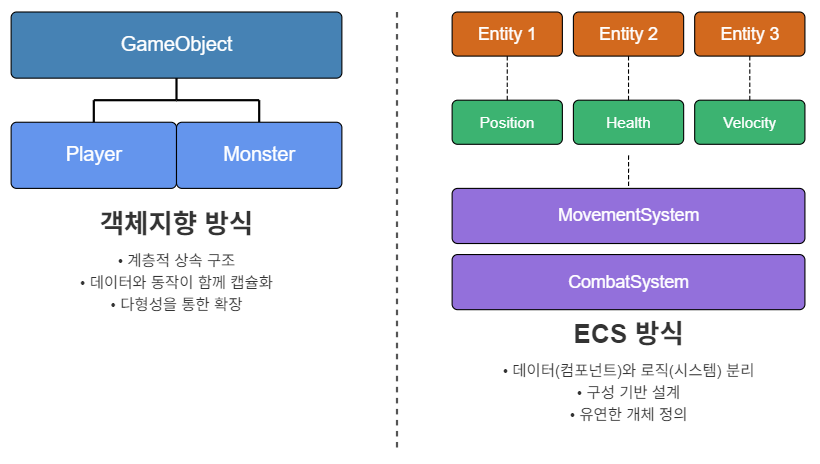
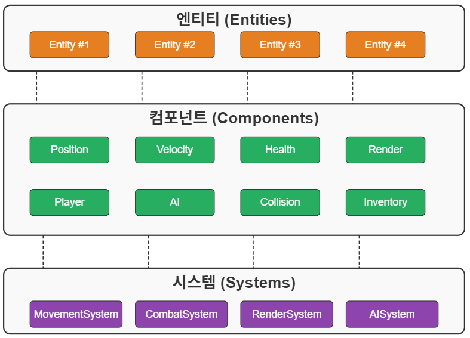
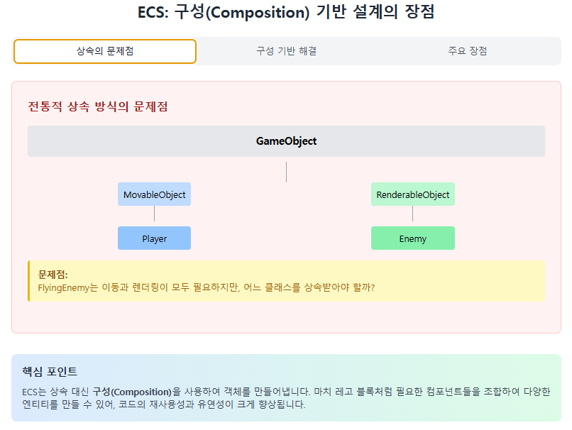
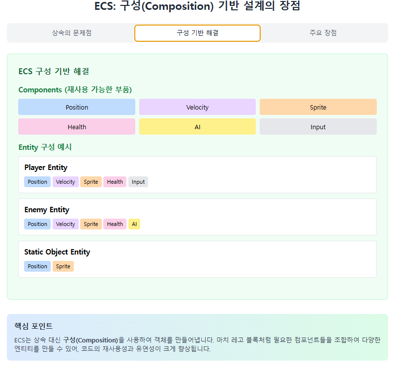
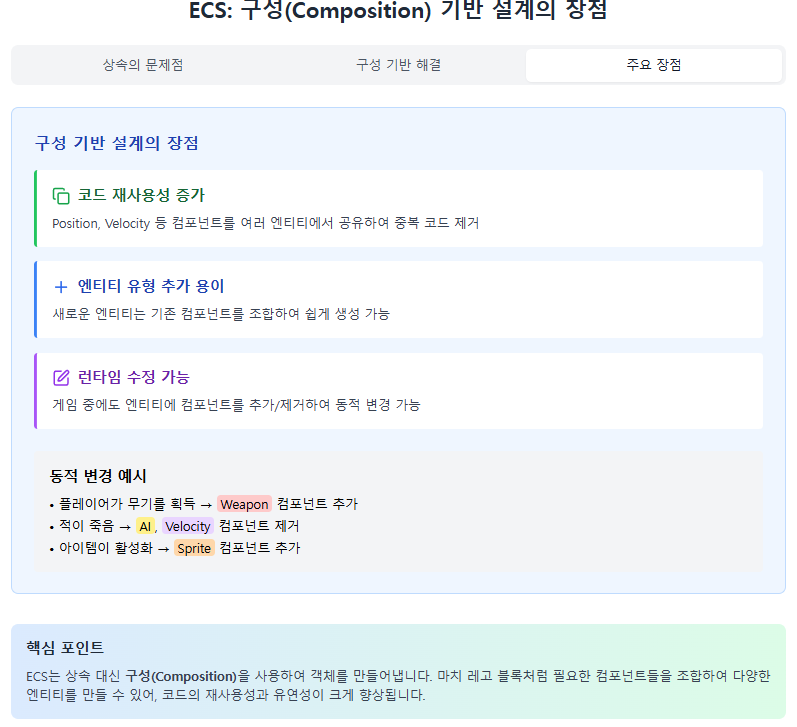
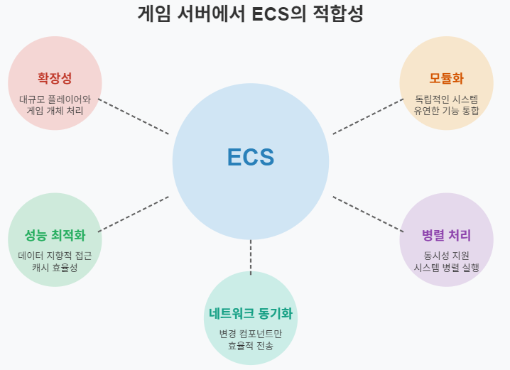

# ECS(Entity-Component-System) 기반 온라인 게임 서버

저자: 최흥배, Claude AI   
    
권장 개발 환경
- **IDE**: Visual Studio 2022 (Community 이상)
- **컴파일러**: .NET 9 이상
- **OS**: Windows 10 이상  
-----    
  
# 1. ECS 아키텍처 소개
  
## 1.1. 기존 객체지향 방식과 ECS 비교

### 객체지향 프로그래밍(OOP) 방식
객체지향 프로그래밍에서는 게임 개체를 클래스 계층 구조로 표현한다. 예를 들어 다음과 같은 구조가 일반적이다:

```csharp
// 기본 게임 개체
public class GameObject
{
    public Vector2 Position { get; set; }
    public Vector2 Velocity { get; set; }
    public float Rotation { get; set; }
    
    public virtual void Update(float deltaTime) { /* ... */ }
    public virtual void Render() { /* ... */ }
}

// 플레이어 클래스
public class Player : GameObject
{
    public int Health { get; set; }
    public int Mana { get; set; }
    public Inventory Inventory { get; set; }
    
    public override void Update(float deltaTime)
    {
        base.Update(deltaTime);
        // 플레이어 특화 업데이트 로직
    }
}

// 몬스터 클래스
public class Monster : GameObject
{
    public int Health { get; set; }
    public AIBehavior Behavior { get; set; }
    
    public override void Update(float deltaTime)
    {
        base.Update(deltaTime);
        // 몬스터 특화 업데이트 로직
    }
}
```

### ECS 방식
ECS에서는 게임 개체의 데이터와 동작을 분리한다:

- **엔티티(Entity)**: 고유 ID만 가진 빈 컨테이너
- **컴포넌트(Component)**: 순수 데이터 컨테이너
- **시스템(System)**: 특정 컴포넌트를 가진 엔티티들에 대한 로직 처리

```csharp
// 컴포넌트 - 순수 데이터
public struct PositionComponent
{
    public float X;
    public float Y;
}

public struct HealthComponent
{
    public int CurrentHealth;
    public int MaxHealth;
}

public struct PlayerComponent
{
    public int PlayerID;
    // 플레이어 특화 데이터
}

// 시스템 - 로직 처리
public class MovementSystem
{
    public void Update(float deltaTime, 
                      IEnumerable<Entity> entities)
    {
        foreach (var entity in entities)
        {
            if (entity.HasComponent<PositionComponent>() && 
                entity.HasComponent<VelocityComponent>())
            {
                var position = entity.GetComponent<PositionComponent>();
                var velocity = entity.GetComponent<VelocityComponent>();
                
                position.X += velocity.X * deltaTime;
                position.Y += velocity.Y * deltaTime;
                
                entity.SetComponent(position);
            }
        }
    }
}
```
  
     
위 그림은 객체지향 방식과 ECS 방식의 핵심 구조적 차이를 보여준다.
  

## 1.2. ECS의 핵심 개념: 엔티티, 컴포넌트, 시스템

### 엔티티(Entity)
엔티티는 게임 내 개체를 표현하지만, 자체적으로는 데이터나 동작을 포함하지 않는다. 단지 고유 식별자로서 컴포넌트들의 모음을 참조하는 역할을 한다.

```csharp
public class Entity
{
    // 고유 식별자
    public readonly uint ID;
    
    // 컴포넌트 저장소 (컴포넌트 타입 -> 컴포넌트 인스턴스)
    private Dictionary<Type, IComponent> components = new();
    
    public Entity(uint id)
    {
        ID = id;
    }
    
    // 컴포넌트 추가
    public void AddComponent<T>(T component) where T : IComponent
    {
        components[typeof(T)] = component;
    }
    
    // 컴포넌트 제거
    public void RemoveComponent<T>() where T : IComponent
    {
        components.Remove(typeof(T));
    }
    
    // 컴포넌트 가져오기
    public T GetComponent<T>() where T : IComponent
    {
        return (T)components[typeof(T)];
    }
    
    // 컴포넌트 보유 여부 확인
    public bool HasComponent<T>() where T : IComponent
    {
        return components.ContainsKey(typeof(T));
    }
}
```

### 컴포넌트(Component)
컴포넌트는 순수한 데이터 컨테이너다. 동작을 포함하지 않으며, 특정 기능에 필요한 상태만 정의한다.  

```csharp
// 컴포넌트 인터페이스
public interface IComponent { }

// 위치 컴포넌트
public struct PositionComponent : IComponent
{
    public float X;
    public float Y;
    
    public PositionComponent(float x, float y)
    {
        X = x;
        Y = y;
    }
}

// 속도 컴포넌트
public struct VelocityComponent : IComponent
{
    public float X;
    public float Y;
    
    public VelocityComponent(float x, float y)
    {
        X = x;
        Y = y;
    }
}

// 체력 컴포넌트
public struct HealthComponent : IComponent
{
    public int Current;
    public int Maximum;
    
    public HealthComponent(int current, int maximum)
    {
        Current = current;
        Maximum = maximum;
    }
}
```

### 시스템(System)
시스템은 특정 컴포넌트를 가진 엔티티들에 대한 동작을 정의한다. 각 시스템은 하나의 책임만 가지며, 관련 엔티티에 대해 로직을 실행한다.  

```csharp
// 시스템 인터페이스
public interface ISystem
{
    void Update(float deltaTime);
}

// 이동 시스템
public class MovementSystem : ISystem
{
    private readonly ECSWorld world;
    
    public MovementSystem(ECSWorld world)
    {
        this.world = world;
    }
    
    public void Update(float deltaTime)
    {
        // 위치와 속도 컴포넌트를 모두 가진 엔티티들 처리
        var entities = world.GetEntitiesWithComponents<PositionComponent, VelocityComponent>();
        
        foreach (var entity in entities)
        {
            var position = entity.GetComponent<PositionComponent>();
            var velocity = entity.GetComponent<VelocityComponent>();
            
            // 위치 업데이트
            position.X += velocity.X * deltaTime;
            position.Y += velocity.Y * deltaTime;
            
            // 변경된 컴포넌트 설정
            entity.AddComponent(position);
        }
    }
}

// 체력 시스템
public class HealthSystem : ISystem
{
    private readonly ECSWorld world;
    
    public HealthSystem(ECSWorld world)
    {
        this.world = world;
    }
    
    public void Update(float deltaTime)
    {
        var entities = world.GetEntitiesWithComponents<HealthComponent>();
        
        foreach (var entity in entities)
        {
            var health = entity.GetComponent<HealthComponent>();
            
            // 체력이 0 이하면 엔티티 제거
            if (health.Current <= 0)
            {
                world.DestroyEntity(entity.ID);
            }
        }
    }
}
```
  
   
  

## 1.3. ECS의 장단점

### 장점
**1. 데이터 지향적 설계 (Data-Oriented Design)**
- 데이터와 로직의 분리로 캐시 효율성 향상
- 메모리 접근 패턴 최적화 가능

**2. 구성(Composition) 기반 설계**
- 다중 상속 문제 해결
- 코드 재사용성 증가
- 엔티티 유형 추가/수정이 용이

**3. 병렬 처리 용이**
- 시스템 단위로 병렬 실행 가능
- 데이터와 로직의 분리로 경쟁 상태 관리 용이

**4. 유연성**
- 런타임에 컴포넌트 추가/제거 가능
- 동적 게임 개체 구성 용이  
  
   
   
     
 

### 단점
**1. 직관성 문제**
- 객체지향 방식에 익숙한 개발자에게 학습 곡선 존재
- 코드 흐름 추적이 어려울 수 있음

**2. 복잡한 설계**
- 기본 프레임워크 구현 비용 발생
- 인프라 코드의 복잡성 증가

**3. 컴포넌트 간 통신 문제**
- 컴포넌트 간 직접 통신이 어려움
- 이벤트 시스템 등 추가 메커니즘 필요

**4. 디버깅 어려움**
- 분산된 로직으로 디버깅이 복잡해질 수 있음
- 데이터 추적이 어려울 수 있음
  

## 1.4. 게임 서버에서 ECS가 적합한 이유

### 1. 확장성
온라인 게임 서버는 많은 플레이어와 게임 개체를 처리해야 한다. ECS는 개체 수에 관계없이 효율적으로 확장할 수 있는 구조를 제공한다.

```csharp
// 수천 개의 엔티티에 대해 동일한 시스템 로직 적용
public void UpdateAllEntities(float deltaTime)
{
    foreach (var system in systems)
    {
        system.Update(deltaTime);
    }
}
```

### 2. 성능 최적화
게임 서버는 빠른 응답 시간이 중요하다. ECS의 데이터 지향적 접근은 캐시 효율성과 메모리 레이아웃 최적화를 통해 성능을 향상시킨다.

```csharp
// 컴포넌트 배열 데이터 구조 예시
public class OptimizedComponentStorage<T> where T : struct, IComponent
{
    private T[] components;
    private Dictionary<uint, int> entityToIndex;
    private Dictionary<int, uint> indexToEntity;
    private Stack<int> freeIndices;
    
    // 엔티티의 컴포넌트 배열 인덱스에 빠르게 접근
    public T Get(uint entityId)
    {
        return components[entityToIndex[entityId]];
    }
    
    // 캐시 효율적인 시스템 처리
    public void ProcessAll(Action<T> action)
    {
        // 컴포넌트 배열을 순차적으로 처리하여 캐시 적중률 향상
        for (int i = 0; i < components.Length; i++)
        {
            if (indexToEntity.ContainsKey(i))
            {
                action(components[i]);
            }
        }
    }
}
```

### 3. 서버 로직의 모듈화
게임 서버는 다양한 시스템(전투, 아이템, 퀘스트, 채팅 등)을 관리해야 한다. ECS는 각 시스템을 독립적으로 개발하고 통합할 수 있는 구조를 제공한다.

```csharp
// 모듈식 시스템 등록
public class GameServer
{
    private ECSWorld world;
    private List<ISystem> systems = new();
    
    public GameServer()
    {
        world = new ECSWorld();
        
        // 필요한 시스템만 등록
        RegisterSystem(new NetworkSystem(world));
        RegisterSystem(new MovementSystem(world));
        RegisterSystem(new CombatSystem(world));
        RegisterSystem(new QuestSystem(world));
        RegisterSystem(new ChatSystem(world));
    }
    
    public void RegisterSystem(ISystem system)
    {
        systems.Add(system);
    }
    
    public void Update(float deltaTime)
    {
        foreach (var system in systems)
        {
            system.Update(deltaTime);
        }
    }
}
```

### 4. 동시성 및 병렬 처리
온라인 게임 서버는 여러 클라이언트 요청을 동시에 처리해야 하는 경우가 많다. ECS는 시스템 단위의 병렬 처리를 자연스럽게 지원한다.

```csharp
// 병렬 시스템 처리 예시
public void UpdateSystemsInParallel(float deltaTime)
{
    Parallel.ForEach(systems, system =>
    {
        // 독립적인 시스템은 병렬로 실행 가능
        if (system.IsIndependent)
        {
            system.Update(deltaTime);
        }
    });
    
    // 의존성이 있는 시스템은 순차적으로 실행
    foreach (var system in systems.Where(s => !s.IsIndependent))
    {
        system.Update(deltaTime);
    }
}
```

### 5. 네트워크 동기화 용이
분산된 컴포넌트 구조는 변경된 데이터만 효율적으로 네트워크를 통해 동기화할 수 있게 한다.

```csharp
// 변경된 컴포넌트만 네트워크로 전송
public class NetworkSyncSystem : ISystem
{
    private readonly ECSWorld world;
    private readonly ComponentChangeTracker changeTracker;
    
    public void Update(float deltaTime)
    {
        // 변경된 컴포넌트만 가져오기
        var changedComponents = changeTracker.GetChangedComponents();
        
        foreach (var (entityId, componentType, component) in changedComponents)
        {
            // 변경된 컴포넌트만 클라이언트에 전송
            SendToClients(entityId, componentType, component);
        }
        
        // 변경 내역 초기화
        changeTracker.Reset();
    }
}
```
  
   
  

## 1.5. 간단한 ECS 프레임워크 구현
이제 C#으로 간단한 ECS 프레임워크를 구현해보자. 이 예제는 실제 게임 서버에서 사용할 기본 구조를 제공한다.    
`coded\SimpleECSGameServer`
  
### 기본 프레임워크 코드

```csharp
using System;
using System.Collections.Generic;
using System.Linq;

namespace ECSGameServer
{
    // --------------------------------
    // 컴포넌트 인터페이스
    // --------------------------------
    public interface IComponent { }

    // --------------------------------
    // 기본 컴포넌트 정의
    // --------------------------------
    public struct PositionComponent : IComponent
    {
        public float X;
        public float Y;
        
        public PositionComponent(float x, float y)
        {
            X = x;
            Y = y;
        }
    }
    
    public struct VelocityComponent : IComponent
    {
        public float X;
        public float Y;
        
        public VelocityComponent(float x, float y)
        {
            X = x;
            Y = y;
        }
    }
    
    public struct HealthComponent : IComponent
    {
        public int Current;
        public int Maximum;
        
        public HealthComponent(int current, int maximum)
        {
            Current = current;
            Maximum = maximum;
        }
    }
    
    public struct PlayerComponent : IComponent
    {
        public uint ClientId;
        public string Name;
        
        public PlayerComponent(uint clientId, string name)
        {
            ClientId = clientId;
            Name = name;
        }
    }
    
    // --------------------------------
    // 엔티티 클래스
    // --------------------------------
    public class Entity
    {
        public readonly uint ID;
        private Dictionary<Type, IComponent> components = new();
        
        public Entity(uint id)
        {
            ID = id;
        }
        
        public void AddComponent<T>(T component) where T : IComponent
        {
            components[typeof(T)] = component;
        }
        
        public void RemoveComponent<T>() where T : IComponent
        {
            components.Remove(typeof(T));
        }
        
        public T GetComponent<T>() where T : IComponent
        {
            return (T)components[typeof(T)];
        }
        
        public bool HasComponent<T>() where T : IComponent
        {
            return components.ContainsKey(typeof(T));
        }
        
        public bool HasComponents(Type[] types)
        {
            return types.All(t => components.ContainsKey(t));
        }
    }
    
    // --------------------------------
    // 시스템 인터페이스
    // --------------------------------
    public interface ISystem
    {
        void Update(float deltaTime);
    }
    
    // --------------------------------
    // 이동 시스템 구현
    // --------------------------------
    public class MovementSystem : ISystem
    {
        private readonly ECSWorld world;
        
        public MovementSystem(ECSWorld world)
        {
            this.world = world;
        }
        
        public void Update(float deltaTime)
        {
            var entities = world.GetEntitiesWithComponents<PositionComponent, VelocityComponent>();
            
            foreach (var entity in entities)
            {
                var position = entity.GetComponent<PositionComponent>();
                var velocity = entity.GetComponent<VelocityComponent>();
                
                position.X += velocity.X * deltaTime;
                position.Y += velocity.Y * deltaTime;
                
                entity.AddComponent(position);
            }
        }
    }
    
    // --------------------------------
    // 체력 시스템 구현
    // --------------------------------
    public class HealthSystem : ISystem
    {
        private readonly ECSWorld world;
        private readonly Action<uint, int, int> onHealthChanged;
        
        public HealthSystem(ECSWorld world, Action<uint, int, int> onHealthChanged = null)
        {
            this.world = world;
            this.onHealthChanged = onHealthChanged;
        }
        
        public void Update(float deltaTime)
        {
            var entities = world.GetEntitiesWithComponents<HealthComponent>();
            
            foreach (var entity in entities)
            {
                var health = entity.GetComponent<HealthComponent>();
                
                // 체력 관련 로직
                if (health.Current <= 0)
                {
                    world.DestroyEntity(entity.ID);
                }
                
                // 체력 변경 알림
                onHealthChanged?.Invoke(entity.ID, health.Current, health.Maximum);
            }
        }
        
        public void DamageEntity(uint entityId, int damage)
        {
            if (world.TryGetEntity(entityId, out var entity) && entity.HasComponent<HealthComponent>())
            {
                var health = entity.GetComponent<HealthComponent>();
                health.Current = Math.Max(0, health.Current - damage);
                entity.AddComponent(health);
            }
        }
        
        public void HealEntity(uint entityId, int amount)
        {
            if (world.TryGetEntity(entityId, out var entity) && entity.HasComponent<HealthComponent>())
            {
                var health = entity.GetComponent<HealthComponent>();
                health.Current = Math.Min(health.Maximum, health.Current + amount);
                entity.AddComponent(health);
            }
        }
    }
    
    // --------------------------------
    // ECS 월드 클래스
    // --------------------------------
    public class ECSWorld
    {
        private uint nextEntityId = 1;
        private Dictionary<uint, Entity> entities = new();
        private List<ISystem> systems = new();
        
        // 엔티티 생성
        public Entity CreateEntity()
        {
            var id = nextEntityId++;
            var entity = new Entity(id);
            entities[id] = entity;
            return entity;
        }
        
        // 엔티티 제거
        public void DestroyEntity(uint entityId)
        {
            if (entities.ContainsKey(entityId))
            {
                entities.Remove(entityId);
            }
        }
        
        // 엔티티 가져오기
        public bool TryGetEntity(uint entityId, out Entity entity)
        {
            return entities.TryGetValue(entityId, out entity);
        }
        
        // 특정 컴포넌트를 가진 엔티티들 가져오기
        public IEnumerable<Entity> GetEntitiesWithComponents<T>() where T : IComponent
        {
            return entities.Values.Where(e => e.HasComponent<T>());
        }
        
        // 여러 컴포넌트를 가진 엔티티들 가져오기
        public IEnumerable<Entity> GetEntitiesWithComponents<T1, T2>() 
            where T1 : IComponent 
            where T2 : IComponent
        {
            var types = new Type[] { typeof(T1), typeof(T2) };
            return entities.Values.Where(e => e.HasComponents(types));
        }
        
        // 시스템 등록
        public void RegisterSystem(ISystem system)
        {
            systems.Add(system);
        }
        
        // 모든 시스템 업데이트
        public void Update(float deltaTime)
        {
            foreach (var system in systems)
            {
                system.Update(deltaTime);
            }
        }
        
        // 엔티티 수 반환
        public int EntityCount => entities.Count;
    }
}
```

### 간단한 게임 서버 예제
위에서 구현한 ECS 프레임워크를 사용하여 간단한 게임 서버를 만들어보자:

```csharp
using System;
using System.Collections.Generic;
using System.Threading;
using System.Threading.Tasks;

namespace ECSGameServer
{
    // 네트워크 인터페이스 (간단한 구현)
    public interface INetworkManager
    {
        void SendMessageToClient(uint clientId, string message);
        void BroadcastMessage(string message);
        event Action<uint, string> OnMessageReceived;
    }
    
    // 간단한 네트워크 매니저 구현
    public class SimpleNetworkManager : INetworkManager
    {
        public void SendMessageToClient(uint clientId, string message)
        {
            Console.WriteLine($"[서버 -> 클라이언트 {clientId}] {message}");
        }
        
        public void BroadcastMessage(string message)
        {
            Console.WriteLine($"[서버 -> 모든 클라이언트] {message}");
        }
        
        public event Action<uint, string> OnMessageReceived;
        
        // 클라이언트 메시지 시뮬레이션
        public void SimulateClientMessage(uint clientId, string message)
        {
            OnMessageReceived?.Invoke(clientId, message);
        }
    }
    
    // 네트워크 컴포넌트
    public struct NetworkComponent : IComponent
    {
        public uint ClientId;
        
        public NetworkComponent(uint clientId)
        {
            ClientId = clientId;
        }
    }
    
    // 네트워크 시스템
    public class NetworkSystem : ISystem
    {
        private readonly ECSWorld world;
        private readonly INetworkManager networkManager;
        
        public NetworkSystem(ECSWorld world, INetworkManager networkManager)
        {
            this.world = world;
            this.networkManager = networkManager;
            
            // 클라이언트 메시지 수신 이벤트 등록
            networkManager.OnMessageReceived += HandleClientMessage;
        }
        
        public void Update(float deltaTime)
        {
            // 엔티티 상태 동기화 등 네트워크 관련 처리
            var entities = world.GetEntitiesWithComponents<NetworkComponent, PositionComponent>();
            
            foreach (var entity in entities)
            {
                var network = entity.GetComponent<NetworkComponent>();
                var position = entity.GetComponent<PositionComponent>();
                
                // 위치 정보 전송
                networkManager.SendMessageToClient(
                    network.ClientId, 
                    $"POS:{entity.ID}:{position.X}:{position.Y}"
                );
            }
        }
        
        private void HandleClientMessage(uint clientId, string message)
        {
            // 간단한, 메시지 처리 로직
            var parts = message.Split(':');
            
            if (parts.Length < 1) return;
            
            switch (parts[0])
            {
                case "MOVE":
                    if (parts.Length >= 3 && 
                        float.TryParse(parts[1], out float x) && 
                        float.TryParse(parts[2], out float y))
                    {
                        HandleMoveCommand(clientId, x, y);
                    }
                    break;
                    
                case "ATTACK":
                    if (parts.Length >= 2 && 
                        uint.TryParse(parts[1], out uint targetId))
                    {
                        HandleAttackCommand(clientId, targetId);
                    }
                    break;
            }
        }
        
        private void HandleMoveCommand(uint clientId, float x, float y)
        {
            // 클라이언트 엔티티 찾기
            var playerEntity = FindPlayerEntityByClientId(clientId);
            
            if (playerEntity != null && playerEntity.HasComponent<VelocityComponent>())
            {
                // 속도 컴포넌트 업데이트
                var velocity = new VelocityComponent(x, y);
                playerEntity.AddComponent(velocity);
            }
        }
        
        private void HandleAttackCommand(uint clientId, uint targetId)
        {
            // 간단한 공격 처리 로직
            var playerEntity = FindPlayerEntityByClientId(clientId);
            
            if (playerEntity != null && 
                world.TryGetEntity(targetId, out var targetEntity) && 
                targetEntity.HasComponent<HealthComponent>())
            {
                // 공격 로직 (체력 시스템을 통해 데미지 처리)
                var healthSystem = world.GetSystem<HealthSystem>();
                healthSystem?.DamageEntity(targetId, 10);
                
                // 공격 결과 알림
                networkManager.BroadcastMessage($"ATTACK:{playerEntity.ID}:{targetId}:10");
            }
        }
        
        private Entity FindPlayerEntityByClientId(uint clientId)
        {
            var entities = world.GetEntitiesWithComponents<NetworkComponent, PlayerComponent>();
            
            foreach (var entity in entities)
            {
                var network = entity.GetComponent<NetworkComponent>();
                if (network.ClientId == clientId)
                {
                    return entity;
                }
            }
            
            return null;
        }
    }
    
    // 확장 메서드
    public static class ECSWorldExtensions
    {
        public static T GetSystem<T>(this ECSWorld world) where T : class, ISystem
        {
            // 실제 구현에서는 시스템 저장소에서 검색하도록 구현 필요
            return null;
        }
    }
    
    // 게임 서버 클래스
    public class GameServer
    {
        private readonly ECSWorld world;
        private readonly INetworkManager networkManager;
        private readonly CancellationTokenSource cts;
        private bool isRunning;
        
        public GameServer()
        {
            world = new ECSWorld();
            networkManager = new SimpleNetworkManager();
            cts = new CancellationTokenSource();
            
            // 시스템 등록
            world.RegisterSystem(new MovementSystem(world));
            world.RegisterSystem(new HealthSystem(world, OnHealthChanged));
            world.RegisterSystem(new NetworkSystem(world, networkManager));
        }
        
        public void Start()
        {
            if (isRunning) return;
            
            isRunning = true;
            Console.WriteLine("게임 서버 시작...");
            
            // 게임 루프 시작
            Task.Run(() => GameLoop(cts.Token));
        }
        
        public void Stop()
        {
            if (!isRunning) return;
            
            cts.Cancel();
            isRunning = false;
            Console.WriteLine("게임 서버 종료...");
        }
        
        private async Task GameLoop(CancellationToken token)
        {
            const float targetFrameTime = 1.0f / 30.0f; // 30 FPS
            DateTime lastUpdateTime = DateTime.Now;
            
            while (!token.IsCancellationRequested)
            {
                // 델타 타임 계산
                var currentTime = DateTime.Now;
                float deltaTime = (float)(currentTime - lastUpdateTime).TotalSeconds;
                lastUpdateTime = currentTime;
                
                // ECS 업데이트
                world.Update(deltaTime);
                
                // 프레임 레이트 유지
                float sleepTime = targetFrameTime - (float)(DateTime.Now - currentTime).TotalSeconds;
                if (sleepTime > 0)
                {
                    await Task.Delay((int)(sleepTime * 1000), token);
                }
            }
        }
        
        // 플레이어 연결 처리
        public uint ConnectPlayer(string playerName)
        {
            // 클라이언트 ID 생성 (실제로는 네트워크 연결에서 얻음)
            uint clientId = (uint)new Random().Next(1000, 10000);
            
            // 플레이어 엔티티 생성
            var playerEntity = world.CreateEntity();
            playerEntity.AddComponent(new PlayerComponent(clientId, playerName));
            playerEntity.AddComponent(new PositionComponent(0, 0));
            playerEntity.AddComponent(new VelocityComponent(0, 0));
            playerEntity.AddComponent(new HealthComponent(100, 100));
            playerEntity.AddComponent(new NetworkComponent(clientId));
            
            Console.WriteLine($"플레이어 연결: {playerName} (ID: {playerEntity.ID}, ClientID: {clientId})");
            
            // 클라이언트에게 초기 정보 전송
            networkManager.SendMessageToClient(clientId, $"INIT:{playerEntity.ID}");
            
            return clientId;
        }
        
        // 플레이어 연결 해제 처리
        public void DisconnectPlayer(uint clientId)
        {
            var entities = world.GetEntitiesWithComponents<NetworkComponent, PlayerComponent>();
            
            foreach (var entity in entities)
            {
                var network = entity.GetComponent<NetworkComponent>();
                if (network.ClientId == clientId)
                {
                    var player = entity.GetComponent<PlayerComponent>();
                    Console.WriteLine($"플레이어 연결 해제: {player.Name} (ID: {entity.ID}, ClientID: {clientId})");
                    
                    world.DestroyEntity(entity.ID);
                    break;
                }
            }
        }
        
        // 클라이언트 명령 시뮬레이션
        public void SimulateClientCommand(uint clientId, string command)
        {
            ((SimpleNetworkManager)networkManager).SimulateClientMessage(clientId, command);
        }
        
        // 체력 변경 이벤트 처리
        private void OnHealthChanged(uint entityId, int current, int maximum)
        {
            // 클라이언트에 체력 변경 알림
            networkManager.BroadcastMessage($"HEALTH:{entityId}:{current}:{maximum}");
        }
    }
    
    // 메인 프로그램
    public class Program
    {
        public static void Main(string[] args)
        {
            // 게임 서버 생성 및 시작
            var server = new GameServer();
            server.Start();
            
            // 테스트 플레이어 연결
            uint player1Id = server.ConnectPlayer("플레이어1");
            uint player2Id = server.ConnectPlayer("플레이어2");
            
            // 테스트 명령어 시뮬레이션
            Task.Run(async () =>
            {
                // 간단한 테스트 시나리오
                await Task.Delay(1000);
                server.SimulateClientCommand(player1Id, "MOVE:1:0");
                
                await Task.Delay(2000);
                server.SimulateClientCommand(player2Id, "MOVE:0:1");
                
                await Task.Delay(2000);
                server.SimulateClientCommand(player1Id, $"ATTACK:{player2Id}");
                
                await Task.Delay(5000);
                server.DisconnectPlayer(player1Id);
            });
            
            // 종료 대기
            Console.WriteLine("서버를 종료하려면 아무 키나 누르세요...");
            Console.ReadKey();
            
            server.Stop();
        }
    }
}
```

이 코드는 ECS 아키텍처를 활용한 간단한 게임 서버의 기본 구조를 보여준다. 실제 게임 서버를 개발할 때는 더 복잡한 컴포넌트와 시스템이 필요하겠지만, 이 예제를 통해 ECS가 게임 서버 개발에 어떻게 적용될 수 있는지 이해할 수 있다.  
    