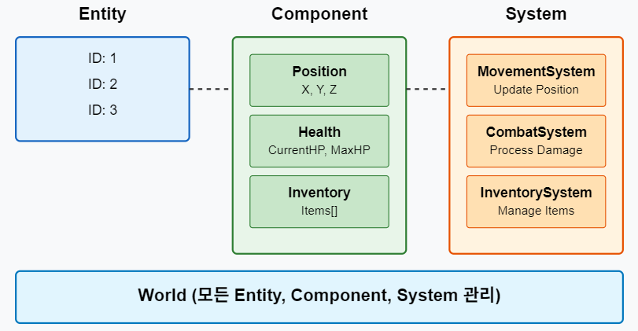
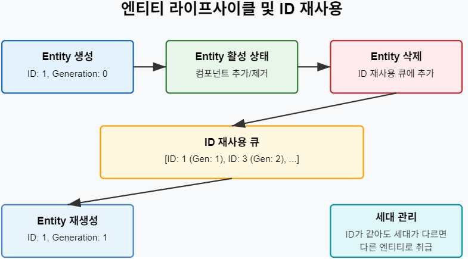
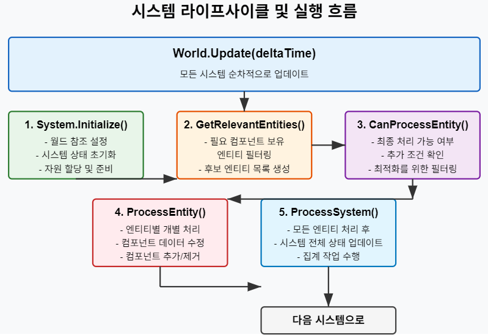
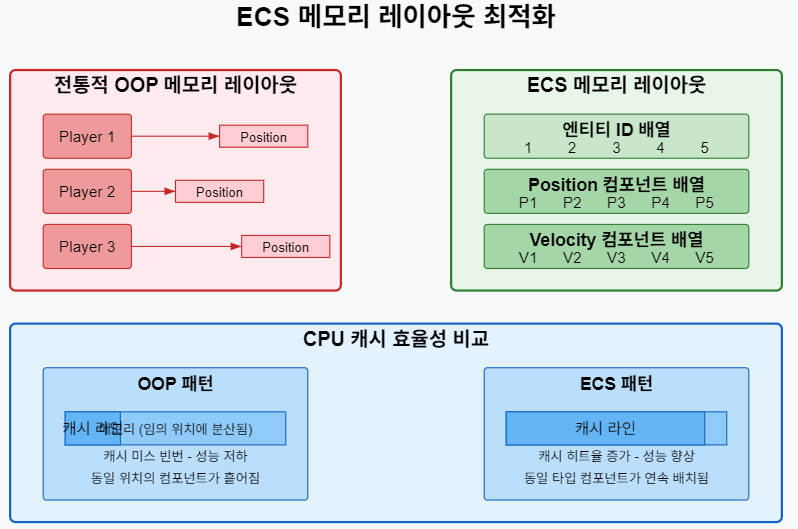

# ECS(Entity-Component-System) 기반 온라인 게임 서버

저자: 최흥배, Claude AI   
    
권장 개발 환경
- **IDE**: Visual Studio 2022 (Community 이상)
- **컴파일러**: .NET 9 이상
- **OS**: Windows 10 이상  
-----    
  
# 2. C#으로 ECS 구현하기
  
## 기본 구조 설계

### ECS 아키텍처 개요
ECS(Entity-Component-System)는 게임 개발에서 자주 사용되는 아키텍처 패턴이다. 이 패턴의 특징은 다음과 같다:

1. **엔티티(Entity)**: 게임 내 객체를 나타내는 고유 식별자
2. **컴포넌트(Component)**: 데이터만 포함하는 순수한 데이터 컨테이너
3. **시스템(System)**: 컴포넌트를 가진 엔티티에 대한 로직을 처리

이 구조는 다음과 같은 이점을 제공한다:

- **높은 유연성**: 런타임에 컴포넌트를 추가/제거하여 동적으로 객체 동작 변경 가능
- **코드 재사용성**: 컴포넌트와 시스템을 다양한 엔티티에 재사용 가능
- **병렬 처리 최적화**: 데이터 지향적 설계로 캐시 효율성과 병렬 처리에 유리
- **명확한 관심사 분리**: 데이터(컴포넌트)와 로직(시스템)의 분리
  
   
  

### 기본 인터페이스 설계
ECS 구현을 위한 기본 인터페이스를 설계해보자. 먼저 필요한 주요 요소들의 인터페이스를 정의한다.

```csharp
// 모든 컴포넌트의 기본 인터페이스
public interface IComponent
{
    // 컴포넌트 식별을 위한 타입 정보
    Type ComponentType { get; }
}

// 시스템 인터페이스
public interface ISystem
{
    // 시스템이 필요로 하는 컴포넌트 타입들
    IEnumerable<Type> RequiredComponents { get; }
    
    // 시스템 초기화
    void Initialize();
    
    // 시스템 업데이트
    void Update(float deltaTime);
    
    // 시스템이 엔티티를 처리할 수 있는지 확인
    bool CanProcessEntity(Entity entity);
    
    // 엔티티 처리
    void ProcessEntity(Entity entity, float deltaTime);
}

// 엔티티 인터페이스 (실제로는 단순 식별자로 구현됨)
public struct Entity
{
    public int Id { get; }
}

// 월드 인터페이스 (ECS 전체 관리)
public interface IWorld
{
    // 새 엔티티 생성
    Entity CreateEntity();
    
    // 엔티티 삭제
    void DestroyEntity(Entity entity);
    
    // 컴포넌트 추가
    void AddComponent<T>(Entity entity, T component) where T : IComponent;
    
    // 컴포넌트 제거
    void RemoveComponent<T>(Entity entity) where T : IComponent;
    
    // 컴포넌트 조회
    T GetComponent<T>(Entity entity) where T : IComponent;
    
    // 시스템 추가
    void AddSystem(ISystem system);
    
    // 월드 업데이트 (모든 시스템 업데이트)
    void Update(float deltaTime);
}
```
  

## 엔티티 관리자 구현
엔티티 관리자는 게임 내의 모든 엔티티를 생성, 추적, 삭제하는 역할을 담당한다. 효율적인 메모리 관리와 빠른 접근을 위해 다양한 최적화 기법을 적용할 수 있다.

```csharp
public class EntityManager
{
    private int _nextEntityId = 0;
    private HashSet<int> _activeEntities = new HashSet<int>();
    private Queue<int> _reusableIds = new Queue<int>();
    
    // 새 엔티티 생성
    public Entity CreateEntity()
    {
        int id;
        
        // 재사용 가능한 ID가 있으면 사용
        if (_reusableIds.Count > 0)
        {
            id = _reusableIds.Dequeue();
        }
        else
        {
            id = _nextEntityId++;
        }
        
        _activeEntities.Add(id);
        return new Entity { Id = id };
    }
    
    // 엔티티 삭제
    public void DestroyEntity(Entity entity)
    {
        if (_activeEntities.Remove(entity.Id))
        {
            _reusableIds.Enqueue(entity.Id);
        }
    }
    
    // 엔티티 존재 여부 확인
    public bool IsEntityActive(Entity entity)
    {
        return _activeEntities.Contains(entity.Id);
    }
    
    // 활성 엔티티 수 조회
    public int ActiveEntityCount => _activeEntities.Count;
    
    // 모든 활성 엔티티 조회
    public IEnumerable<Entity> GetAllEntities()
    {
        foreach (var id in _activeEntities)
        {
            yield return new Entity { Id = id };
        }
    }
}
```
  
   
### 엔티티 식별 및 관리 최적화
엔티티를 효율적으로 관리하기 위해 몇 가지 중요한 최적화 기법을 적용할 수 있다:  
  
1. **ID 재사용**: 삭제된 엔티티의 ID를 재사용하여 메모리 사용량 최적화
2. **세대 카운터**: ID 재사용 시 발생할 수 있는 문제를 방지하기 위한 세대 번호 사용
3. **엔티티 비트마스크**: 엔티티가 가진 컴포넌트를 빠르게 확인하기 위한 비트마스크 사용
  
다음은 세대 카운터를 적용한 엔티티 구현이다:
  
```csharp
public struct Entity : IEquatable<Entity>
{
    public int Id { get; }
    public int Generation { get; }
    
    public Entity(int id, int generation)
    {
        Id = id;
        Generation = generation;
    }
    
    public bool Equals(Entity other)
    {
        return Id == other.Id && Generation == other.Generation;
    }
    
    public override bool Equals(object? obj)
    {
        return obj is Entity entity && Equals(entity);
    }
    
    public override int GetHashCode()
    {
        return HashCode.Combine(Id, Generation);
    }
    
    public static bool operator ==(Entity left, Entity right)
    {
        return left.Equals(right);
    }
    
    public static bool operator !=(Entity left, Entity right)
    {
        return !left.Equals(right);
    }
}
```

그리고 세대 관리를 포함한 엔티티 매니저:

```csharp
public class EntityManager
{
    private int _nextEntityId = 0;
    private Dictionary<int, int> _generations = new Dictionary<int, int>();
    private HashSet<int> _activeEntities = new HashSet<int>();
    private Queue<int> _reusableIds = new Queue<int>();
    
    public Entity CreateEntity()
    {
        int id;
        
        if (_reusableIds.Count > 0)
        {
            id = _reusableIds.Dequeue();
        }
        else
        {
            id = _nextEntityId++;
            _generations[id] = 0;
        }
        
        _activeEntities.Add(id);
        return new Entity(id, _generations[id]);
    }
    
    public void DestroyEntity(Entity entity)
    {
        if (_activeEntities.Remove(entity.Id) && entity.Generation == _generations[entity.Id])
        {
            // 세대 증가
            _generations[entity.Id]++;
            _reusableIds.Enqueue(entity.Id);
        }
    }
    
    public bool IsEntityActive(Entity entity)
    {
        return _activeEntities.Contains(entity.Id) && 
               entity.Generation == _generations[entity.Id];
    }
    
    // 나머지 메서드는 동일
}
```
  
   


## 컴포넌트 설계 패턴
컴포넌트는 게임 객체의 특성과 상태를 정의하는 데이터 컨테이너다. 효율적인 컴포넌트 설계가 ECS의 성능과 확장성에 큰 영향을 미친다.  

### 컴포넌트 설계 원칙
1. **단일 책임 원칙**: 각 컴포넌트는 하나의 기능/특성만 담당
2. **불변성 권장**: 가능한 불변 데이터 구조 사용
3. **최소한의 의존성**: 다른 컴포넌트에 대한 참조 지양
4. **가벼운 구조체 선호**: 메모리 효율성을 위해 클래스보다 구조체 사용
    
### 컴포넌트 예제

```csharp
// 위치 컴포넌트
public struct PositionComponent : IComponent
{
    public float X { get; set; }
    public float Y { get; set; }
    public float Z { get; set; }
    
    public Type ComponentType => typeof(PositionComponent);
    
    public PositionComponent(float x, float y, float z)
    {
        X = x;
        Y = y;
        Z = z;
    }
}

// 속도 컴포넌트
public struct VelocityComponent : IComponent
{
    public float X { get; set; }
    public float Y { get; set; }
    public float Z { get; set; }
    
    public Type ComponentType => typeof(VelocityComponent);
    
    public VelocityComponent(float x, float y, float z)
    {
        X = x;
        Y = y;
        Z = z;
    }
}

// 체력 컴포넌트
public struct HealthComponent : IComponent
{
    public int CurrentHealth { get; set; }
    public int MaxHealth { get; set; }
    
    public Type ComponentType => typeof(HealthComponent);
    
    public HealthComponent(int maxHealth)
    {
        MaxHealth = maxHealth;
        CurrentHealth = maxHealth;
    }
    
    public bool IsDead => CurrentHealth <= 0;
}

// 플레이어 컴포넌트 (태그 역할)
public struct PlayerComponent : IComponent
{
    public string Username { get; set; }
    public Type ComponentType => typeof(PlayerComponent);
    
    public PlayerComponent(string username)
    {
        Username = username;
    }
}

// 네트워크 컴포넌트
public struct NetworkComponent : IComponent
{
    public long ConnectionId { get; set; }
    public Type ComponentType => typeof(NetworkComponent);
    
    public NetworkComponent(long connectionId)
    {
        ConnectionId = connectionId;
    }
}
```

### 컴포넌트 저장소 구현
컴포넌트를 효율적으로 저장하고 액세스하기 위한 컴포넌트 저장소를 구현해보자.  

```csharp
public class ComponentStorage
{
    // 컴포넌트 타입별 저장소
    private Dictionary<Type, Dictionary<int, IComponent>> _componentStores = 
        new Dictionary<Type, Dictionary<int, IComponent>>();
    
    // 엔티티별 컴포넌트 타입 인덱스
    private Dictionary<int, HashSet<Type>> _entityComponentTypes = 
        new Dictionary<int, HashSet<Type>>();
    
    // 컴포넌트 추가
    public void AddComponent<T>(Entity entity, T component) where T : IComponent
    {
        var type = typeof(T);
        
        // 컴포넌트 타입 저장소 확인, 없으면 생성
        if (!_componentStores.TryGetValue(type, out var store))
        {
            store = new Dictionary<int, IComponent>();
            _componentStores[type] = store;
        }
        
        // 엔티티에 컴포넌트 저장
        store[entity.Id] = component;
        
        // 엔티티 컴포넌트 인덱스 업데이트
        if (!_entityComponentTypes.TryGetValue(entity.Id, out var types))
        {
            types = new HashSet<Type>();
            _entityComponentTypes[entity.Id] = types;
        }
        
        types.Add(type);
    }
    
    // 컴포넌트 제거
    public void RemoveComponent<T>(Entity entity) where T : IComponent
    {
        var type = typeof(T);
        
        // 해당 타입의 컴포넌트 저장소가 없으면 무시
        if (!_componentStores.TryGetValue(type, out var store))
            return;
        
        // 엔티티의 컴포넌트 제거
        store.Remove(entity.Id);
        
        // 엔티티 컴포넌트 인덱스 업데이트
        if (_entityComponentTypes.TryGetValue(entity.Id, out var types))
        {
            types.Remove(type);
            
            // 컴포넌트가 없으면 인덱스에서 엔티티 제거
            if (types.Count == 0)
                _entityComponentTypes.Remove(entity.Id);
        }
    }
    
    // 컴포넌트 조회
    public T GetComponent<T>(Entity entity) where T : IComponent
    {
        var type = typeof(T);
        
        if (_componentStores.TryGetValue(type, out var store) && 
            store.TryGetValue(entity.Id, out var component))
        {
            return (T)component;
        }
        
        throw new KeyNotFoundException($"Entity {entity.Id} does not have component of type {type.Name}");
    }
    
    // 컴포넌트 존재 여부 확인
    public bool HasComponent<T>(Entity entity) where T : IComponent
    {
        var type = typeof(T);
        
        return _componentStores.TryGetValue(type, out var store) && 
               store.ContainsKey(entity.Id);
    }
    
    // 엔티티가 가진 모든 컴포넌트 타입 조회
    public IEnumerable<Type> GetComponentTypes(Entity entity)
    {
        if (_entityComponentTypes.TryGetValue(entity.Id, out var types))
            return types;
        
        return Enumerable.Empty<Type>();
    }
    
    // 특정 타입의 컴포넌트를 가진 모든 엔티티 조회
    public IEnumerable<Entity> GetEntitiesWithComponent<T>() where T : IComponent
    {
        var type = typeof(T);
        
        if (_componentStores.TryGetValue(type, out var store))
        {
            foreach (var entityId in store.Keys)
            {
                yield return new Entity(entityId, 0); // 세대 관리 필요
            }
        }
    }
    
    // 엔티티의 모든 컴포넌트 제거
    public void RemoveAllComponents(Entity entity)
    {
        if (!_entityComponentTypes.TryGetValue(entity.Id, out var types))
            return;
        
        foreach (var type in types.ToArray())
        {
            if (_componentStores.TryGetValue(type, out var store))
            {
                store.Remove(entity.Id);
            }
        }
        
        _entityComponentTypes.Remove(entity.Id);
    }
}
```

### 아키타입(Archetype) 기반 컴포넌트 저장소
더 효율적인 쿼리와 데이터 지역성을 위해 아키타입(특정 컴포넌트 집합) 기반의 저장 방식을 사용할 수 있다.  

```csharp
public class ArchetypeComponentStorage
{
    // 아키타입 클래스 (컴포넌트 타입 집합)
    private class Archetype
    {
        // 아키타입에 포함된 컴포넌트 타입들
        public HashSet<Type> ComponentTypes { get; }
        
        // 컴포넌트 타입별 배열 (데이터 지역성)
        public Dictionary<Type, IComponent[]> ComponentArrays { get; }
        
        // 엔티티 ID -> 배열 인덱스 매핑
        public Dictionary<int, int> EntityToIndex { get; }
        
        // 인덱스 -> 엔티티 ID 매핑
        public Dictionary<int, int> IndexToEntity { get; }
        
        // 현재 엔티티 수
        public int Count { get; private set; }
        
        // 배열 용량
        private const int InitialCapacity = 16;
        private int _capacity;
        
        public Archetype(IEnumerable<Type> componentTypes)
        {
            ComponentTypes = new HashSet<Type>(componentTypes);
            ComponentArrays = new Dictionary<Type, IComponent[]>();
            EntityToIndex = new Dictionary<int, int>();
            IndexToEntity = new Dictionary<int, int>();
            _capacity = InitialCapacity;
            Count = 0;
            
            // 각 컴포넌트 타입별 배열 초기화
            foreach (var type in ComponentTypes)
            {
                ComponentArrays[type] = new IComponent[InitialCapacity];
            }
        }
        
        // 엔티티 추가
        public void AddEntity(int entityId, Dictionary<Type, IComponent> components)
        {
            // 공간이 부족하면 확장
            if (Count >= _capacity)
                Resize(_capacity * 2);
            
            // 엔티티를 마지막 위치에 추가
            int index = Count;
            EntityToIndex[entityId] = index;
            IndexToEntity[index] = entityId;
            
            // 컴포넌트 저장
            foreach (var type in ComponentTypes)
            {
                ComponentArrays[type][index] = components[type];
            }
            
            Count++;
        }
        
        // 엔티티 제거
        public void RemoveEntity(int entityId)
        {
            if (!EntityToIndex.TryGetValue(entityId, out int index))
                return;
            
            // 마지막 엔티티를 삭제된 위치로 이동
            int lastIndex = Count - 1;
            int lastEntityId = IndexToEntity[lastIndex];
            
            // 마지막 엔티티가 아니면 빈 자리를 채움
            if (index < lastIndex)
            {
                foreach (var type in ComponentTypes)
                {
                    ComponentArrays[type][index] = ComponentArrays[type][lastIndex];
                }
                
                EntityToIndex[lastEntityId] = index;
                IndexToEntity[index] = lastEntityId;
            }
            
            // 마지막 위치 정리
            EntityToIndex.Remove(entityId);
            IndexToEntity.Remove(lastIndex);
            Count--;
        }
        
        // 배열 크기 조정
        private void Resize(int newCapacity)
        {
            foreach (var type in ComponentTypes)
            {
                var oldArray = ComponentArrays[type];
                var newArray = new IComponent[newCapacity];
                Array.Copy(oldArray, 0, newArray, 0, Count);
                ComponentArrays[type] = newArray;
            }
            
            _capacity = newCapacity;
        }
    }
    
    // 아키타입 해시 -> 아키타입 매핑
    private Dictionary<string, Archetype> _archetypes = new Dictionary<string, Archetype>();
    
    // 엔티티 -> 아키타입 매핑
    private Dictionary<int, string> _entityArchetypes = new Dictionary<int, string>();
    
    // 아키타입 해시 생성
    private string GetArchetypeHash(IEnumerable<Type> types)
    {
        var sortedTypes = types.OrderBy(t => t.FullName).ToArray();
        return string.Join(":", sortedTypes.Select(t => t.FullName));
    }
    
    // 엔티티 컴포넌트 추가
    public void AddComponents(int entityId, Dictionary<Type, IComponent> components)
    {
        // 이전 아키타입에서 제거
        if (_entityArchetypes.TryGetValue(entityId, out var oldHash))
        {
            _archetypes[oldHash].RemoveEntity(entityId);
        }
        
        var types = components.Keys;
        var hash = GetArchetypeHash(types);
        
        // 아키타입이 없으면 생성
        if (!_archetypes.TryGetValue(hash, out var archetype))
        {
            archetype = new Archetype(types);
            _archetypes[hash] = archetype;
        }
        
        // 엔티티 추가
        archetype.AddEntity(entityId, components);
        _entityArchetypes[entityId] = hash;
    }
    
    // 특정 컴포넌트 타입 조합을 가진 모든 엔티티 쿼리
    public IEnumerable<int> QueryEntities(params Type[] requiredTypes)
    {
        var requiredSet = new HashSet<Type>(requiredTypes);
        
        foreach (var archetype in _archetypes.Values)
        {
            // 아키타입이 필요한 모든 컴포넌트 타입을 포함하는지 확인
            if (requiredSet.IsSubsetOf(archetype.ComponentTypes))
            {
                // 해당 아키타입의 모든 엔티티 반환
                for (int i = 0; i < archetype.Count; i++)
                {
                    yield return archetype.IndexToEntity[i];
                }
            }
        }
    }
}
```
  

## 시스템 인터페이스와 라이프사이클
시스템은 특정 컴포넌트를 가진 엔티티에 대한 로직을 처리한다. 시스템의 라이프사이클과 인터페이스를 정의해보자.  

### 시스템 기본 구현

```csharp
public abstract class SystemBase : ISystem
{
    protected IWorld World { get; private set; }
    public abstract IEnumerable<Type> RequiredComponents { get; }
    
    public virtual void Initialize(IWorld world)
    {
        World = world;
    }
    
    public void Update(float deltaTime)
    {
        // 시스템이 처리할 모든 엔티티에 대해 로직 실행
        foreach (var entity in GetRelevantEntities())
        {
            if (CanProcessEntity(entity))
            {
                ProcessEntity(entity, deltaTime);
            }
        }
        
        // 시스템 전체 로직 실행
        ProcessSystem(deltaTime);
    }
    
    // 시스템 레벨 처리 (모든 관련 엔티티를 처리한 후)
    protected virtual void ProcessSystem(float deltaTime) { }
    
    // 시스템이 처리할 엔티티 조회
    protected virtual IEnumerable<Entity> GetRelevantEntities()
    {
        return World.GetEntitiesWithComponents(RequiredComponents.ToArray());
    }
    
    // 엔티티 처리 가능 여부 확인
    public virtual bool CanProcessEntity(Entity entity)
    {
        // 기본적으로 모든 필수 컴포넌트를 가진 엔티티만 처리
        foreach (var type in RequiredComponents)
        {
            if (!World.HasComponent(entity, type))
                return false;
        }
        
        return true;
    }
    
    // 개별 엔티티 처리 로직
    public abstract void ProcessEntity(Entity entity, float deltaTime);
}
```

### 시스템 예제 구현

```csharp
// 움직임 시스템 구현
public class MovementSystem : SystemBase
{
    public override IEnumerable<Type> RequiredComponents => 
        new[] { typeof(PositionComponent), typeof(VelocityComponent) };
    
    public override void ProcessEntity(Entity entity, float deltaTime)
    {
        var position = World.GetComponent<PositionComponent>(entity);
        var velocity = World.GetComponent<VelocityComponent>(entity);
        
        // 위치 업데이트
        position.X += velocity.X * deltaTime;
        position.Y += velocity.Y * deltaTime;
        position.Z += velocity.Z * deltaTime;
        
        // 변경된 컴포넌트 업데이트
        World.AddComponent(entity, position);
    }
}

// 네트워크 동기화 시스템
public class NetworkSyncSystem : SystemBase
{
    private Dictionary<int, DateTime> _lastSyncTimes = new Dictionary<int, DateTime>();
    private TimeSpan _syncInterval = TimeSpan.FromMilliseconds(100); // 10Hz
    
    public override IEnumerable<Type> RequiredComponents => 
        new[] { typeof(NetworkComponent), typeof(PositionComponent) };
    
    public override void ProcessEntity(Entity entity, float deltaTime)
    {
        // 동기화 시간 확인
        var now = DateTime.UtcNow;
        
        if (!_lastSyncTimes.TryGetValue(entity.Id, out var lastSync) || 
            now - lastSync >= _syncInterval)
        {
            var network = World.GetComponent<NetworkComponent>(entity);
            var position = World.GetComponent<PositionComponent>(entity);
            
            // 위치 데이터 네트워크 전송 (실제 구현은 네트워크 계층에 따라 다름)
            SendPositionUpdate(network.ConnectionId, position);
            
            // 마지막 동기화 시간 업데이트
            _lastSyncTimes[entity.Id] = now;
        }
    }
    
    private void SendPositionUpdate(long connectionId, PositionComponent position)
    {
        // 실제 네트워크 전송 로직 구현
        // 이 예제에서는 단순히 콘솔에 출력
        Console.WriteLine($"Sending position update to client {connectionId}: " +
                          $"X={position.X}, Y={position.Y}, Z={position.Z}");
    }
}

// 체력 시스템
public class HealthSystem : SystemBase
{
    public override IEnumerable<Type> RequiredComponents => 
        new[] { typeof(HealthComponent) };
    
    // 체력 회복 간격
    private TimeSpan _regenerationInterval = TimeSpan.FromSeconds(5);
    private Dictionary<int, DateTime> _lastRegenTimes = new Dictionary<int, DateTime>();
    
    public override void ProcessEntity(Entity entity, float deltaTime)
    {
        var health = World.GetComponent<HealthComponent>(entity);
        
        // 이미 최대 체력이면 무시
        if (health.CurrentHealth >= health.MaxHealth)
            return;
        
        var now = DateTime.UtcNow;
        
        // 회복 시간 확인
        if (!_lastRegenTimes.TryGetValue(entity.Id, out var lastRegen) || 
            now - lastRegen >= _regenerationInterval)
        {
            // 체력 회복
            health.CurrentHealth = Math.Min(health.CurrentHealth + 1, health.MaxHealth);
            
            // 변경된 컴포넌트 업데이트
            World.AddComponent(entity, health);
            
            // 마지막 회복 시간 업데이트
            _lastRegenTimes[entity.Id] = now;
        }
    }
}
```
  
   
  

## 간단한 ECS 프레임워크 만들기
지금까지 설명한 개념을 종합하여 간단한 ECS 프레임워크를 구현해보자.

### World 클래스 구현

```csharp
public class World : IWorld
{
    private EntityManager _entityManager;
    private ComponentStorage _componentStorage;
    private List<ISystem> _systems;
    
    public World()
    {
        _entityManager = new EntityManager();
        _componentStorage = new ComponentStorage();
        _systems = new List<ISystem>();
    }
    
    public Entity CreateEntity()
    {
        return _entityManager.CreateEntity();
    }
    
    public void DestroyEntity(Entity entity)
    {
        if (_entityManager.IsEntityActive(entity))
        {
            _componentStorage.RemoveAllComponents(entity);
            _entityManager.DestroyEntity(entity);
        }
    }
    
    public void AddComponent<T>(Entity entity, T component) where T : IComponent
    {
        if (_entityManager.IsEntityActive(entity))
        {
            _componentStorage.AddComponent(entity, component);
        }
        else
        {
            throw new ArgumentException($"Entity {entity.Id} is not active");
        }
    }
    
    public void RemoveComponent<T>(Entity entity) where T : IComponent
    {
        if (_entityManager.IsEntityActive(entity))
        {
            _componentStorage.RemoveComponent<T>(entity);
        }
    }
    
    public T GetComponent<T>(Entity entity) where T : IComponent
    {
        if (_entityManager.IsEntityActive(entity))
        {
            return _componentStorage.GetComponent<T>(entity);
        }
        
        throw new ArgumentException($"Entity {entity.Id} is not active");
    }
    
    public bool HasComponent<T>(Entity entity) where T : IComponent
    {
        return _entityManager.IsEntityActive(entity) && 
               _componentStorage.HasComponent<T>(entity);
    }
    
    public bool HasComponent(Entity entity, Type componentType)
    {
        return _entityManager.IsEntityActive(entity) && 
               _componentStorage.GetComponentTypes(entity).Contains(componentType);
    }
    
    public void AddSystem(ISystem system)
    {
        _systems.Add(system);
        system.Initialize(this);
    }
    
    public void RemoveSystem(ISystem system)
    {
        _systems.Remove(system);
    }
    
    public void Update(float deltaTime)
    {
        foreach (var system in _systems)
        {
            system.Update(deltaTime);
        }
    }
    
    public IEnumerable<Entity> GetEntitiesWithComponents(params Type[] componentTypes)
    {
        if (componentTypes.Length == 0)
            return _entityManager.GetAllEntities();
        
        // 첫 번째 컴포넌트 타입으로 시작
        var firstType = componentTypes[0];
        var entities = new HashSet<Entity>();
        
        // 컴포넌트 타입이 하나면 단순 쿼리
        if (componentTypes.Length == 1)
        {
            foreach (var entity in _componentStorage.GetEntitiesWithComponent(firstType))
            {
                if (_entityManager.IsEntityActive(entity))
                {
                    entities.Add(entity);
                }
            }
            
            return entities;
        }
        
        // 여러 컴포넌트 타입으로 필터링
        foreach (var entity in _componentStorage.GetEntitiesWithComponent(firstType))
        {
            if (_entityManager.IsEntityActive(entity))
            {
                bool hasAllComponents = true;
                
                for (int i = 1; i < componentTypes.Length; i++)
                {
                    if (!HasComponent(entity, componentTypes[i]))
                    {
                        hasAllComponents = false;
                        break;
                    }
                }
                
                if (hasAllComponents)
                {
                    entities.Add(entity);
                }
            }
        }
        
        return entities;
    }
}
```

### 실제 사용 예제

```csharp
// 게임 엔진 클래스
public class GameEngine
{
    private World _world;
    private Stopwatch _stopwatch;
    private float _previousTime;
    
    public GameEngine()
    {
        _world = new World();
        _stopwatch = new Stopwatch();
    }
    
    public void Initialize()
    {
        // 시스템 등록
        _world.AddSystem(new MovementSystem());
        _world.AddSystem(new HealthSystem());
        _world.AddSystem(new NetworkSyncSystem());
        
        // 기타 초기화 작업
        _stopwatch.Start();
        _previousTime = 0;
    }
    
    public void Update()
    {
        // 델타 타임 계산 (초 단위)
        float currentTime = (float)_stopwatch.Elapsed.TotalSeconds;
        float deltaTime = currentTime - _previousTime;
        _previousTime = currentTime;
        
        // 월드 업데이트
        _world.Update(deltaTime);
    }
    
    public Entity CreatePlayer(string username, long connectionId)
    {
        var entity = _world.CreateEntity();
        
        // 기본 컴포넌트 추가
        _world.AddComponent(entity, new PositionComponent(0, 0, 0));
        _world.AddComponent(entity, new VelocityComponent(0, 0, 0));
        _world.AddComponent(entity, new HealthComponent(100));
        _world.AddComponent(entity, new PlayerComponent(username));
        _world.AddComponent(entity, new NetworkComponent(connectionId));
        
        return entity;
    }
    
    public void MovePlayer(Entity player, float x, float y, float z)
    {
        if (_world.HasComponent<VelocityComponent>(player))
        {
            _world.AddComponent(player, new VelocityComponent(x, y, z));
        }
    }
    
    public void DamagePlayer(Entity player, int amount)
    {
        if (_world.HasComponent<HealthComponent>(player))
        {
            var health = _world.GetComponent<HealthComponent>(player);
            health.CurrentHealth = Math.Max(0, health.CurrentHealth - amount);
            _world.AddComponent(player, health);
            
            // 플레이어가 죽었는지 확인
            if (health.IsDead)
            {
                HandlePlayerDeath(player);
            }
        }
    }
    
    private void HandlePlayerDeath(Entity player)
    {
        // 죽은 플레이어 처리 로직
        Console.WriteLine($"Player {_world.GetComponent<PlayerComponent>(player).Username} died!");
        
        // 위치 리셋
        _world.AddComponent(player, new PositionComponent(0, 0, 0));
        
        // 체력 회복
        var health = _world.GetComponent<HealthComponent>(player);
        health.CurrentHealth = health.MaxHealth;
        _world.AddComponent(player, health);
    }
}
```

### 네트워크 인터페이스 구현
여기에서는 네트워크 구현은 중요한 것이 아니라서 네트워크 통신 부분은 간단한 인터페이스만 구현한다.   
  
```csharp
// 네트워크 메시지 인터페이스
public interface INetworkMessage
{
    byte[] Serialize();
    void Deserialize(byte[] data);
}

// 위치 업데이트 메시지
public class PositionUpdateMessage : INetworkMessage
{
    public int EntityId { get; set; }
    public float X { get; set; }
    public float Y { get; set; }
    public float Z { get; set; }
    
    public byte[] Serialize()
    {
        // 간단한 직렬화 구현
        using (var ms = new MemoryStream())
        using (var bw = new BinaryWriter(ms))
        {
            bw.Write(EntityId);
            bw.Write(X);
            bw.Write(Y);
            bw.Write(Z);
            return ms.ToArray();
        }
    }
    
    public void Deserialize(byte[] data)
    {
        // 간단한 역직렬화 구현
        using (var ms = new MemoryStream(data))
        using (var br = new BinaryReader(ms))
        {
            EntityId = br.ReadInt32();
            X = br.ReadSingle();
            Y = br.ReadSingle();
            Z = br.ReadSingle();
        }
    }
}

// 간단한 네트워크 서비스 인터페이스
public interface INetworkService
{
    void Start(int port);
    void Stop();
    void SendToClient(long clientId, INetworkMessage message);
    void SendToAllClients(INetworkMessage message);
    void RegisterMessageHandler<T>(Action<long, T> handler) where T : INetworkMessage, new();
}

// 콘솔 테스트용 더미 네트워크 서비스
public class DummyNetworkService : INetworkService
{
    private bool _isRunning;
    private Dictionary<Type, object> _handlers = new Dictionary<Type, object>();
    
    public void Start(int port)
    {
        _isRunning = true;
        Console.WriteLine($"Network service started on port {port}");
    }
    
    public void Stop()
    {
        _isRunning = false;
        Console.WriteLine("Network service stopped");
    }
    
    public void SendToClient(long clientId, INetworkMessage message)
    {
        if (!_isRunning) return;
        
        Console.WriteLine($"Sending message to client {clientId}: {message.GetType().Name}");
        
        // 더미이므로 실제로 전송하지 않고 로그만 출력
        if (message is PositionUpdateMessage pos)
        {
            Console.WriteLine($"  Position: ({pos.X}, {pos.Y}, {pos.Z})");
        }
    }
    
    public void SendToAllClients(INetworkMessage message)
    {
        if (!_isRunning) return;
        
        Console.WriteLine($"Broadcasting message to all clients: {message.GetType().Name}");
    }
    
    public void RegisterMessageHandler<T>(Action<long, T> handler) where T : INetworkMessage, new()
    {
        _handlers[typeof(T)] = handler;
        Console.WriteLine($"Registered handler for message type: {typeof(T).Name}");
    }
    
    // 테스트용 메시지 시뮬레이션
    public void SimulateClientMessage<T>(long clientId, T message) where T : INetworkMessage
    {
        if (!_isRunning) return;
        
        if (_handlers.TryGetValue(typeof(T), out var handlerObj))
        {
            var handler = (Action<long, T>)handlerObj;
            handler(clientId, message);
        }
    }
}
```

### 간단한 콘솔 클라이언트 구현

```csharp
public class SimpleGameClient
{
    private long _clientId;
    private DummyNetworkService _networkService;
    
    public SimpleGameClient(long clientId, DummyNetworkService networkService)
    {
        _clientId = clientId;
        _networkService = networkService;
    }
    
    public void SendMoveCommand(float x, float y, float z)
    {
        // 실제 구현에서는 이동 명령을 직렬화하여 서버로 전송
        Console.WriteLine($"Client {_clientId} sending move command: ({x}, {y}, {z})");
        
        // 더미 네트워크 서비스를 통해 서버 측 핸들러 직접 호출 (테스트용)
        _networkService.SimulateClientMessage(_clientId, new MoveCommandMessage
        {
            X = x,
            Y = y,
            Z = z
        });
    }
    
    public void ProcessPositionUpdate(int entityId, float x, float y, float z)
    {
        // 실제 클라이언트에서는 이 정보로 화면 업데이트
        Console.WriteLine($"Client {_clientId} received position update for entity {entityId}: ({x}, {y}, {z})");
    }
}

// 이동 명령 메시지
public class MoveCommandMessage : INetworkMessage
{
    public float X { get; set; }
    public float Y { get; set; }
    public float Z { get; set; }
    
    public byte[] Serialize()
    {
        using (var ms = new MemoryStream())
        using (var bw = new BinaryWriter(ms))
        {
            bw.Write(X);
            bw.Write(Y);
            bw.Write(Z);
            return ms.ToArray();
        }
    }
    
    public void Deserialize(byte[] data)
    {
        using (var ms = new MemoryStream(data))
        using (var br = new BinaryReader(ms))
        {
            X = br.ReadSingle();
            Y = br.ReadSingle();
            Z = br.ReadSingle();
        }
    }
}
```

### 전체 프로그램 구현

```csharp
public class Program
{
    public static void Main(string[] args)
    {
        Console.WriteLine("Starting ECS Game Server...");
        
        // 게임 엔진 생성 및 초기화
        var engine = new GameEngine();
        engine.Initialize();
        
        // 네트워크 서비스 생성
        var networkService = new DummyNetworkService();
        networkService.Start(12345);
        
        // 이동 명령 핸들러 등록
        networkService.RegisterMessageHandler<MoveCommandMessage>((clientId, message) =>
        {
            Console.WriteLine($"Server received move command from client {clientId}: ({message.X}, {message.Y}, {message.Z})");
            
            // 클라이언트 ID에 해당하는 플레이어 엔티티 찾기 (실제 구현에서는 더 복잡)
            var playerEntity = engine.CreatePlayer($"Player_{clientId}", clientId);
            
            // 이동 명령 처리
            engine.MovePlayer(playerEntity, message.X, message.Y, message.Z);
        });
        
        // 테스트용 클라이언트 생성
        var client = new SimpleGameClient(1, networkService);
        
        // 게임 루프 시뮬레이션
        var running = true;
        var timer = new System.Timers.Timer(100); // 10Hz 업데이트
        
        timer.Elapsed += (sender, e) =>
        {
            engine.Update();
        };
        
        timer.Start();
        
        // 테스트 이동 명령
        client.SendMoveCommand(1.0f, 0.0f, 0.0f);
        
        Console.WriteLine("Press Enter to stop the server...");
        Console.ReadLine();
        
        timer.Stop();
        networkService.Stop();
        
        Console.WriteLine("Server stopped.");
    }
}
```
  

## 최적화 전략
ECS 시스템 최적화를 위한 몇 가지 중요한 전략을 소개한다.

### 1. 데이터 지역성 최적화
컴포넌트 데이터를 메모리 상에서 연속적으로 배치하면 캐시 히트율을 높여 성능이 향상된다.

```csharp
// 아키타입 기반 저장소 구현
public class ComponentArray<T> where T : struct, IComponent
{
    private T[] _components;
    private Dictionary<int, int> _entityToIndex;
    private Dictionary<int, int> _indexToEntity;
    private int _size;
    
    public ComponentArray(int capacity = 100)
    {
        _components = new T[capacity];
        _entityToIndex = new Dictionary<int, int>();
        _indexToEntity = new Dictionary<int, int>();
        _size = 0;
    }
    
    public void Add(int entityId, T component)
    {
        if (_entityToIndex.ContainsKey(entityId))
        {
            _components[_entityToIndex[entityId]] = component;
            return;
        }
        
        // 필요시 배열 크기 확장
        if (_size >= _components.Length)
        {
            Array.Resize(ref _components, _components.Length * 2);
        }
        
        _entityToIndex[entityId] = _size;
        _indexToEntity[_size] = entityId;
        _components[_size] = component;
        _size++;
    }
    
    public void Remove(int entityId)
    {
        if (!_entityToIndex.TryGetValue(entityId, out int removeIndex))
            return;
        
        // 마지막 요소를 삭제된 위치로 이동
        _size--;
        if (removeIndex < _size)
        {
            int lastEntityId = _indexToEntity[_size];
            _components[removeIndex] = _components[_size];
            _entityToIndex[lastEntityId] = removeIndex;
            _indexToEntity[removeIndex] = lastEntityId;
        }
        
        _entityToIndex.Remove(entityId);
        _indexToEntity.Remove(_size);
    }
    
    public ref T Get(int entityId)
    {
        return ref _components[_entityToIndex[entityId]];
    }
    
    public bool Has(int entityId)
    {
        return _entityToIndex.ContainsKey(entityId);
    }
    
    // SIMD 처리를 위한 Span 반환
    public Span<T> AsSpan()
    {
        return new Span<T>(_components, 0, _size);
    }
}
```

### 2. 병렬 처리 최적화
독립적인 시스템을 병렬로 실행하여 멀티코어 활용도를 높인다.

```csharp
public class ParallelSystemExecutor
{
    private List<ISystem> _systems = new List<ISystem>();
    private Dictionary<ISystem, HashSet<ISystem>> _dependencies = new Dictionary<ISystem, HashSet<ISystem>>();
    
    public void AddSystem(ISystem system)
    {
        _systems.Add(system);
        _dependencies[system] = new HashSet<ISystem>();
    }
    
    public void AddDependency(ISystem dependent, ISystem dependency)
    {
        if (!_systems.Contains(dependent) || !_systems.Contains(dependency))
            throw new ArgumentException("Both systems must be added to the executor");
        
        _dependencies[dependent].Add(dependency);
    }
    
    public void ExecuteSystems(float deltaTime)
    {
        var executed = new HashSet<ISystem>();
        var readyToExecute = new ConcurrentQueue<ISystem>();
        
        // 의존성 없는 시스템 찾기
        foreach (var system in _systems)
        {
            if (_dependencies[system].Count == 0)
            {
                readyToExecute.Enqueue(system);
            }
        }
        
        // 모든 시스템이 실행될 때까지 반복
        while (executed.Count < _systems.Count)
        {
            var tasks = new List<Task>();
            
            // 실행 가능한 시스템 병렬로 처리
            while (readyToExecute.TryDequeue(out var system))
            {
                tasks.Add(Task.Run(() =>
                {
                    system.Update(deltaTime);
                    
                    lock (executed)
                    {
                        executed.Add(system);
                        
                        // 이 시스템에 의존하는 다른 시스템 확인
                        foreach (var other in _systems)
                        {
                            if (!executed.Contains(other) && _dependencies[other].Contains(system))
                            {
                                // 모든 의존성이 실행됐는지 확인
                                bool allDependenciesExecuted = true;
                                foreach (var dep in _dependencies[other])
                                {
                                    if (!executed.Contains(dep))
                                    {
                                        allDependenciesExecuted = false;
                                        break;
                                    }
                                }
                                
                                if (allDependenciesExecuted)
                                {
                                    readyToExecute.Enqueue(other);
                                }
                            }
                        }
                    }
                }));
            }
            
            // 현재 배치의 모든 작업이 완료될 때까지 대기
            Task.WaitAll(tasks.ToArray());
            
            // 더 이상 실행할 시스템이 없고, 아직 모든 시스템을 실행하지 않았다면 순환 의존성 오류
            if (readyToExecute.IsEmpty && executed.Count < _systems.Count)
            {
                throw new InvalidOperationException("Circular dependency detected in systems");
            }
        }
    }
}
```

### 3. SIMD 연산 활용
동일한 연산을 여러 데이터에 동시에 적용하는 SIMD(Single Instruction Multiple Data) 연산을 활용한다.

```csharp
// SIMD를 활용한 위치 업데이트 시스템
public class SIMDMovementSystem : SystemBase
{
    public override IEnumerable<Type> RequiredComponents => 
        new[] { typeof(PositionComponent), typeof(VelocityComponent) };
    
    public override void ProcessEntity(Entity entity, float deltaTime)
    {
        // 개별 엔티티 처리용 메서드 (실제 처리는 ProcessSystem에서 일괄 수행)
    }
    
    protected override void ProcessSystem(float deltaTime)
    {
        // 예시: ComponentArray를 이용한 SIMD 최적화 (실제 구현은 더 복잡)
        var positions = World.GetComponentArray<PositionComponent>();
        var velocities = World.GetComponentArray<VelocityComponent>();
        
        var posSpan = positions.AsSpan();
        var velSpan = velocities.AsSpan();
        
        // Vector<float>를 사용한 SIMD 연산
        for (int i = 0; i < posSpan.Length; i += Vector<float>.Count)
        {
            int count = Math.Min(Vector<float>.Count, posSpan.Length - i);
            
            for (int j = 0; j < count; j++)
            {
                ref var pos = ref posSpan[i + j];
                ref var vel = ref velSpan[i + j];
                
                pos.X += vel.X * deltaTime;
                pos.Y += vel.Y * deltaTime;
                pos.Z += vel.Z * deltaTime;
            }
        }
    }
}
```
  
   


## 결론
이 장에서는 C#을 사용하여 ECS 아키텍처를 구현하는 방법을 살펴봤다. 주요 내용은 다음과 같다:

1. **기본 구조 설계**: ECS의 핵심 요소인 엔티티, 컴포넌트, 시스템의 관계와 인터페이스 설계
2. **엔티티 관리자 구현**: 효율적인 엔티티 생성, 추적, 삭제를 위한 메모리 최적화 기법
3. **컴포넌트 설계 패턴**: 데이터 중심 설계를 위한 컴포넌트 구현 및 저장소 설계
4. **시스템 인터페이스와 라이프사이클**: 시스템의 초기화, 업데이트, 엔티티 처리 단계 구현
5. **ECS 프레임워크 구현**: 실제 활용 가능한 통합 프레임워크 설계

ECS 아키텍처는.NET 9.0의 향상된 성능과 결합하여 고성능 게임 서버 개발에 적합한 패턴이다. 특히 데이터 지역성, 병렬 처리, SIMD 연산 등의 최적화 기법을 통해 대규모 온라인 게임에서 요구되는 성능을 확보할 수 있다.
     
    
     