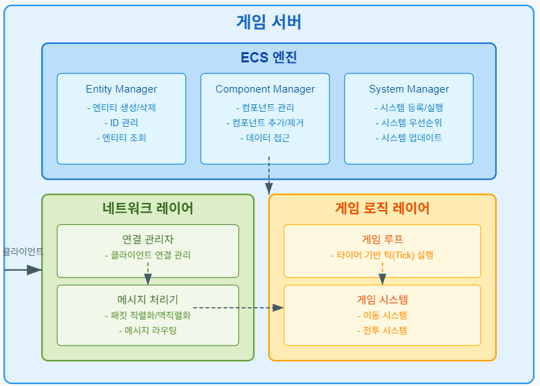
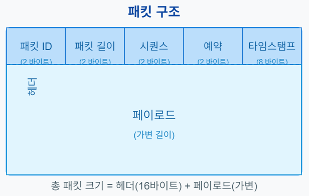
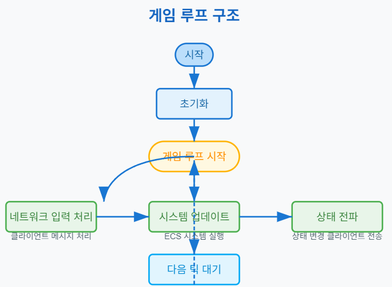

# ECS(Entity-Component-System) 기반 온라인 게임 서버

저자: 최흥배, Claude AI   
    
권장 개발 환경
- **IDE**: Visual Studio 2022 (Community 이상)
- **컴파일러**: .NET 9 이상
- **OS**: Windows 10 이상  
-----    
  
# 3. 기본 서버 아키텍처
 
## 서버 구조 설계
ECS 기반 게임 서버 아키텍처는 전통적인 객체지향 설계와 다른 접근 방식을 취한다. 이 구조는 데이터와 로직을 분리하여 유연성과 성능을 극대화하는 데 중점을 둔다.

### ECS 패턴 소개
ECS는 다음 세 가지 주요 요소로 구성된다:

1. **Entity(엔티티)**: 게임 세계의 객체 (플레이어, 몬스터, 아이템 등)를 나타내는 고유 식별자
2. **Component(컴포넌트)**: 순수한 데이터를 포함하는 구조체
3. **System(시스템)**: 특정 컴포넌트를 가진 엔티티들에 대해 로직을 실행하는 프로세서

### 서버 아키텍처 다이어그램
   
  
  
### 핵심 구성 요소 설명
1. **ECS 엔진**: 게임 로직의 핵심이 되는 부분으로 엔티티, 컴포넌트, 시스템을 관리한다.
   - Entity Manager: 엔티티의 생성, 삭제 및 조회를 담당
   - Component Manager: 컴포넌트 데이터 관리 및 접근 제공
   - System Manager: 게임 시스템 등록 및 실행 순서 관리

2. **네트워크 레이어**: 클라이언트-서버 통신을 담당하는 부분
   - 연결 관리자: 클라이언트 연결 관리
   - 메시지 처리기: 데이터 직렬화/역직렬화 및 메시지 라우팅

3. **게임 로직 레이어**: 실제 게임 규칙을 구현하는 부분
   - 게임 루프: 일정 간격으로 게임 상태 업데이트
   - 게임 시스템: 이동, 전투 등 특정 기능 담당
  

## 네트워크 인터페이스 구현
네트워크 부분은 간단한 인터페이스만 구현하여 샘플 프로그램이 동작할 수 있도록 한다.

```csharp
namespace GameServer.Network
{
    // 네트워크 연결을 나타내는 인터페이스
    public interface IConnection
    {
        string ConnectionId { get; }
        bool IsConnected { get; }
        Task SendAsync(byte[] data);
        void Close();
    }

    // 패킷 처리를 위한 인터페이스
    public interface IPacketHandler
    {
        void HandlePacket(IConnection connection, byte[] packetData);
    }

    // 서버 리스너 인터페이스
    public interface INetworkListener
    {
        Task StartAsync(int port);
        Task StopAsync();
        event Action<IConnection> OnClientConnected;
        event Action<IConnection, byte[]> OnDataReceived;
        event Action<IConnection> OnClientDisconnected;
    }

    // 네트워크 매니저 - 서버의 네트워크 작업 관리
    public class NetworkManager
    {
        private INetworkListener _listener;
        private Dictionary<string, IConnection> _connections;
        private Dictionary<int, IPacketHandler> _packetHandlers;

        public NetworkManager(INetworkListener listener)
        {
            _listener = listener;
            _connections = new Dictionary<string, IConnection>();
            _packetHandlers = new Dictionary<int, IPacketHandler>();
            
            // 이벤트 등록
            _listener.OnClientConnected += OnClientConnected;
            _listener.OnDataReceived += OnDataReceived;
            _listener.OnClientDisconnected += OnClientDisconnected;
        }

        public async Task StartAsync(int port)
        {
            await _listener.StartAsync(port);
            Console.WriteLine($"서버가 포트 {port}에서 시작되었습니다.");
        }

        public void RegisterPacketHandler(int packetId, IPacketHandler handler)
        {
            _packetHandlers[packetId] = handler;
        }

        private void OnClientConnected(IConnection connection)
        {
            _connections[connection.ConnectionId] = connection;
            Console.WriteLine($"클라이언트 연결: {connection.ConnectionId}");
        }

        private void OnDataReceived(IConnection connection, byte[] data)
        {
            // 실제 구현에서는 패킷 헤더에서 packetId를 추출해야 함
            // 간단한 예시를 위해 첫 번째 바이트를 packetId로 가정
            if (data.Length > 0)
            {
                int packetId = data[0];
                if (_packetHandlers.TryGetValue(packetId, out var handler))
                {
                    handler.HandlePacket(connection, data);
                }
            }
        }

        private void OnClientDisconnected(IConnection connection)
        {
            _connections.Remove(connection.ConnectionId);
            Console.WriteLine($"클라이언트 연결 해제: {connection.ConnectionId}");
        }

        public async Task BroadcastAsync(byte[] data)
        {
            foreach (var connection in _connections.Values)
            {
                if (connection.IsConnected)
                {
                    await connection.SendAsync(data);
                }
            }
        }
    }
}
```

### 간단한 TCP 리스너 구현

```csharp
using System.Net;
using System.Net.Sockets;

namespace GameServer.Network
{
    // TCP 기반 네트워크 리스너 구현
    public class TcpNetworkListener : INetworkListener
    {
        private TcpListener _tcpListener;
        private bool _isRunning;
        private readonly List<TcpConnection> _activeConnections = new();

        public event Action<IConnection> OnClientConnected;
        public event Action<IConnection, byte[]> OnDataReceived;
        public event Action<IConnection> OnClientDisconnected;

        public async Task StartAsync(int port)
        {
            _tcpListener = new TcpListener(IPAddress.Any, port);
            _tcpListener.Start();
            _isRunning = true;

            while (_isRunning)
            {
                try
                {
                    var client = await _tcpListener.AcceptTcpClientAsync();
                    _ = HandleClientAsync(client);
                }
                catch (Exception ex) when (_isRunning)
                {
                    Console.WriteLine($"리스너 오류: {ex.Message}");
                }
            }
        }

        private async Task HandleClientAsync(TcpClient client)
        {
            var connection = new TcpConnection(client);
            _activeConnections.Add(connection);
            
            OnClientConnected?.Invoke(connection);

            var buffer = new byte[4096];

            try
            {
                var stream = client.GetStream();
                
                while (client.Connected)
                {
                    var bytesRead = await stream.ReadAsync(buffer);
                    if (bytesRead == 0) break; // 연결 종료됨
                    
                    var data = new byte[bytesRead];
                    Array.Copy(buffer, data, bytesRead);
                    
                    OnDataReceived?.Invoke(connection, data);
                }
            }
            catch (Exception ex)
            {
                Console.WriteLine($"클라이언트 처리 오류: {ex.Message}");
            }
            finally
            {
                _activeConnections.Remove(connection);
                OnClientDisconnected?.Invoke(connection);
                client.Close();
            }
        }

        public Task StopAsync()
        {
            _isRunning = false;
            _tcpListener?.Stop();
            
            foreach (var connection in _activeConnections.ToList())
            {
                connection.Close();
            }
            
            _activeConnections.Clear();
            return Task.CompletedTask;
        }

        private class TcpConnection : IConnection
        {
            private readonly TcpClient _client;
            
            public TcpConnection(TcpClient client)
            {
                _client = client;
                ConnectionId = Guid.NewGuid().ToString();
            }

            public string ConnectionId { get; }
            
            public bool IsConnected => _client.Connected;

            public async Task SendAsync(byte[] data)
            {
                if (!IsConnected) return;
                
                try
                {
                    var stream = _client.GetStream();
                    await stream.WriteAsync(data);
                }
                catch (Exception ex)
                {
                    Console.WriteLine($"데이터 전송 오류: {ex.Message}");
                    Close();
                }
            }

            public void Close()
            {
                _client.Close();
            }
        }
    }
}
```
  

## 메시지 처리 시스템
게임 서버에서는 클라이언트와의 통신을 위해 메시지 처리 시스템이 필요하다. 이 시스템은 패킷의 직렬화/역직렬화와 메시지 라우팅을 담당한다.

### 메시지 구조
     


### 메시지 직렬화/역직렬화 구현

```csharp
using System.Buffers.Binary;
using System.Text.Json;

namespace GameServer.Network
{
    // 패킷 헤더 구조체
    public readonly struct PacketHeader
    {
        public const int HeaderSize = 16;
        
        public readonly ushort PacketId;
        public readonly ushort PacketLength;
        public readonly ushort SequenceNumber;
        public readonly ushort Reserved;
        public readonly long Timestamp;
        
        public PacketHeader(ushort packetId, ushort packetLength, ushort sequenceNumber, long timestamp)
        {
            PacketId = packetId;
            PacketLength = packetLength;
            SequenceNumber = sequenceNumber;
            Reserved = 0;
            Timestamp = timestamp;
        }
        
        // 헤더를 바이트 배열로 직렬화
        public byte[] Serialize()
        {
            var headerBuffer = new byte[HeaderSize];
            
            BinaryPrimitives.WriteUInt16LittleEndian(headerBuffer.AsSpan(0, 2), PacketId);
            BinaryPrimitives.WriteUInt16LittleEndian(headerBuffer.AsSpan(2, 2), PacketLength);
            BinaryPrimitives.WriteUInt16LittleEndian(headerBuffer.AsSpan(4, 2), SequenceNumber);
            BinaryPrimitives.WriteUInt16LittleEndian(headerBuffer.AsSpan(6, 2), Reserved);
            BinaryPrimitives.WriteInt64LittleEndian(headerBuffer.AsSpan(8, 8), Timestamp);
            
            return headerBuffer;
        }
        
        // 바이트 배열에서 헤더 역직렬화
        public static PacketHeader Deserialize(ReadOnlySpan<byte> buffer)
        {
            var packetId = BinaryPrimitives.ReadUInt16LittleEndian(buffer.Slice(0, 2));
            var packetLength = BinaryPrimitives.ReadUInt16LittleEndian(buffer.Slice(2, 2));
            var sequenceNumber = BinaryPrimitives.ReadUInt16LittleEndian(buffer.Slice(4, 2));
            var timestamp = BinaryPrimitives.ReadInt64LittleEndian(buffer.Slice(8, 8));
            
            return new PacketHeader(packetId, packetLength, sequenceNumber, timestamp);
        }
    }
    
    // 기본 패킷 클래스
    public abstract class Packet
    {
        private static ushort _nextSequence = 0;
        
        public abstract ushort PacketId { get; }
        
        // 패킷을 바이트 배열로 직렬화
        public byte[] Serialize()
        {
            var payload = SerializePayload();
            var packetLength = (ushort)(PacketHeader.HeaderSize + payload.Length);
            var sequenceNumber = GetNextSequence();
            var timestamp = DateTimeOffset.UtcNow.ToUnixTimeMilliseconds();
            
            var header = new PacketHeader(PacketId, packetLength, sequenceNumber, timestamp);
            var headerBytes = header.Serialize();
            
            var packet = new byte[packetLength];
            Array.Copy(headerBytes, 0, packet, 0, headerBytes.Length);
            Array.Copy(payload, 0, packet, headerBytes.Length, payload.Length);
            
            return packet;
        }
        
        // 패킷 페이로드 직렬화 (자식 클래스에서 구현)
        protected abstract byte[] SerializePayload();
        
        // 다음 시퀀스 번호 가져오기
        private static ushort GetNextSequence()
        {
            return _nextSequence++;
        }
    }
    
    // JSON 기반 패킷 베이스 클래스
    public abstract class JsonPacket : Packet
    {
        // JSON으로 페이로드 직렬화
        protected override byte[] SerializePayload()
        {
            return JsonSerializer.SerializeToUtf8Bytes(this);
        }
        
        // JSON에서 패킷 역직렬화
        public static T Deserialize<T>(ReadOnlySpan<byte> data) where T : JsonPacket
        {
            return JsonSerializer.Deserialize<T>(data.Slice(PacketHeader.HeaderSize));
        }
    }
    
    // 예시: 로그인 요청 패킷
    public class LoginRequestPacket : JsonPacket
    {
        public override ushort PacketId => 1001;
        public string Username { get; set; }
        public string Password { get; set; }
    }
    
    // 예시: 로그인 응답 패킷
    public class LoginResponsePacket : JsonPacket
    {
        public override ushort PacketId => 1002;
        public bool Success { get; set; }
        public string Message { get; set; }
        public int PlayerId { get; set; }
    }
    
    // 패킷 처리기 팩토리
    public class PacketHandlerFactory
    {
        private readonly Dictionary<ushort, Func<byte[], IPacketHandler>> _handlerFactories = new();
        
        public void RegisterHandler<T>(Func<T, IPacketHandler> factory) where T : JsonPacket
        {
            var packetInstance = Activator.CreateInstance<T>();
            _handlerFactories[packetInstance.PacketId] = (data) =>
            {
                var packet = JsonPacket.Deserialize<T>(data);
                return factory(packet);
            };
        }
        
        public IPacketHandler CreateHandler(byte[] packetData)
        {
            var header = PacketHeader.Deserialize(packetData);
            
            if (_handlerFactories.TryGetValue(header.PacketId, out var factory))
            {
                return factory(packetData);
            }
            
            return null;
        }
    }
}
```
  
  
## 게임 루프 구현
게임 루프는 서버의 핵심 부분으로 일정한 간격으로 게임 상태를 업데이트한다. ECS 패턴에서는 각 시스템이 자신이 관심 있는 컴포넌트를 가진 엔티티에 대해 처리를 수행한다.

### 게임 루프 구조
     


### 게임 루프 구현 코드

```csharp
using System.Diagnostics;

namespace GameServer.Core
{
    public class GameServer
    {
        private readonly GameWorld _world;
        private readonly SystemManager _systemManager;
        private readonly Network.NetworkManager _networkManager;
        private readonly ILogger _logger;
        
        private bool _isRunning;
        private int _targetTickRate;
        private TimeSpan _targetTickTime;
        private long _currentTick;
        
        public GameServer(
            GameWorld world, 
            SystemManager systemManager, 
            Network.NetworkManager networkManager, 
            ILogger logger)
        {
            _world = world;
            _systemManager = systemManager;
            _networkManager = networkManager;
            _logger = logger;
            _targetTickRate = 20; // 기본 20 TPS (틱/초)
            _targetTickTime = TimeSpan.FromMilliseconds(1000.0 / _targetTickRate);
            _currentTick = 0;
        }
        
        public void SetTickRate(int ticksPerSecond)
        {
            _targetTickRate = ticksPerSecond;
            _targetTickTime = TimeSpan.FromMilliseconds(1000.0 / _targetTickRate);
            _logger.LogInfo($"틱 레이트 설정: {_targetTickRate} TPS ({_targetTickTime.TotalMilliseconds}ms/틱)");
        }
        
        public async Task StartAsync(int port)
        {
            if (_isRunning)
            {
                _logger.LogWarning("서버가 이미 실행 중입니다.");
                return;
            }
            
            try
            {
                // 네트워크 리스너 시작
                await _networkManager.StartAsync(port);
                
                // 게임 월드 초기화
                _world.Initialize();
                
                // 시스템 초기화
                _systemManager.Initialize();
                
                _isRunning = true;
                _logger.LogInfo($"게임 서버 시작됨 (포트: {port}, 틱 레이트: {_targetTickRate})");
                
                // 게임 루프 시작
                _ = GameLoopAsync();
            }
            catch (Exception ex)
            {
                _logger.LogError($"서버 시작 오류: {ex.Message}");
                throw;
            }
        }
        
        public async Task StopAsync()
        {
            if (!_isRunning) return;
            
            _isRunning = false;
            // 게임 루프가 완전히 종료될 때까지 잠시 대기
            await Task.Delay(100);
            
            _logger.LogInfo("서버 종료 중...");
        }
        
        private async Task GameLoopAsync()
        {
            var stopwatch = new Stopwatch();
            var lastTime = DateTime.UtcNow;
            
            while (_isRunning)
            {
                stopwatch.Restart();
                
                var currentTime = DateTime.UtcNow;
                var deltaTime = (float)(currentTime - lastTime).TotalSeconds;
                lastTime = currentTime;
                
                // 틱 컨텍스트 생성
                var tickContext = new TickContext
                {
                    DeltaTime = deltaTime,
                    CurrentTick = _currentTick,
                    CurrentTime = currentTime
                };
                
                try
                {
                    // 1. 시스템 업데이트
                    _systemManager.Update(tickContext);
                    
                    // 2. 틱 카운터 증가
                    _currentTick++;
                    
                    // 3. 월드 상태 정리 (필요한 경우)
                    _world.CleanUp();
                }
                catch (Exception ex)
                {
                    _logger.LogError($"게임 루프 오류: {ex.Message}");
                }
                
                // 프레임 시간 측정 및 대기
                stopwatch.Stop();
                var elapsedTime = stopwatch.Elapsed;
                var remainingTime = _targetTickTime - elapsedTime;
                
                if (remainingTime > TimeSpan.Zero)
                {
                    await Task.Delay(remainingTime);
                }
                else
                {
                    _logger.LogWarning($"틱 지연 발생: {Math.Abs(remainingTime.TotalMilliseconds):F2}ms");
                }
            }
            
            _logger.LogInfo("게임 루프 종료됨");
        }
    }
    
    public class TickContext
    {
        public float DeltaTime { get; set; }
        public long CurrentTick { get; set; }
        public DateTime CurrentTime { get; set; }
    }
    
    public interface ILogger
    {
        void LogInfo(string message);
        void LogWarning(string message);
        void LogError(string message);
    }
    
    // 간단한 콘솔 로거 구현
    public class ConsoleLogger : ILogger
    {
        public void LogInfo(string message)
        {
            Console.ForegroundColor = ConsoleColor.White;
            Console.WriteLine($"[INFO] {DateTime.Now:HH:mm:ss.fff} - {message}");
            Console.ResetColor();
        }
        
        public void LogWarning(string message)
        {
            Console.ForegroundColor = ConsoleColor.Yellow;
            Console.WriteLine($"[WARN] {DateTime.Now:HH:mm:ss.fff} - {message}");
            Console.ResetColor();
        }
        
        public void LogError(string message)
        {
            Console.ForegroundColor = ConsoleColor.Red;
            Console.WriteLine($"[ERROR] {DateTime.Now:HH:mm:ss.fff} - {message}");
            Console.ResetColor();
        }
    }
}
```

### ECS 핵심 구현

```csharp
namespace GameServer.ECS
{
    // 엔티티 ID 타입
    public readonly struct EntityId : IEquatable<EntityId>
    {
        public readonly int Id;
        
        public EntityId(int id)
        {
            Id = id;
        }
        
        public bool Equals(EntityId other) => Id == other.Id;
        public override bool Equals(object obj) => obj is EntityId other && Equals(other);
        public override int GetHashCode() => Id;
        public static bool operator ==(EntityId left, EntityId right) => left.Equals(right);
        public static bool operator !=(EntityId left, EntityId right) => !left.Equals(right);
        
        public override string ToString() => $"Entity_{Id}";
    }
    
    // 컴포넌트 인터페이스
    public interface IComponent
    {
    }
    
    // 시스템 인터페이스
    public interface ISystem
    {
        void Initialize();
        void Update(Core.TickContext context);
    }
    
    // 엔티티 매니저
    public class EntityManager
    {
        private int _nextEntityId = 1;
        private readonly HashSet<EntityId> _entities = new();
        
        public EntityId CreateEntity()
        {
            var entityId = new EntityId(_nextEntityId++);
            _entities.Add(entityId);
            return entityId;
        }
        
        public bool DestroyEntity(EntityId entityId)
        {
            return _entities.Remove(entityId);
        }
        
        public bool EntityExists(EntityId entityId)
        {
            return _entities.Contains(entityId);
        }
        
        public IEnumerable<EntityId> GetAllEntities()
        {
            return _entities;
        }
    }
    
    // 컴포넌트 매니저
    public class ComponentManager
    {
        // 엔티티별 컴포넌트 저장 (타입별)
        private readonly Dictionary<Type, Dictionary<EntityId, IComponent>> _components = new();
        
        // 컴포넌트 추가
        public void AddComponent<T>(EntityId entityId, T component) where T : IComponent
        {
            var type = typeof(T);
            
            if (!_components.TryGetValue(type, out var componentsOfType))
            {
                componentsOfType = new Dictionary<EntityId, IComponent>();
                _components[type] = componentsOfType;
            }
            
            componentsOfType[entityId] = component;
        }
        
        // 컴포넌트 가져오기
        public T GetComponent<T>(EntityId entityId) where T : IComponent
        {
            var type = typeof(T);
            
            if (_components.TryGetValue(type, out var componentsOfType) &&
                componentsOfType.TryGetValue(entityId, out var component))
            {
                return (T)component;
            }
            
            return default;
        }
        
        // 컴포넌트 제거
        public bool RemoveComponent<T>(EntityId entityId) where T : IComponent
        {
            var type = typeof(T);
            
            if (_components.TryGetValue(type, out var componentsOfType))
            {
                return componentsOfType.Remove(entityId);
            }
            
            return false;
        }
        
        // 엔티티가 컴포넌트를 가지고 있는지 확인
        public bool HasComponent<T>(EntityId entityId) where T : IComponent
        {
            var type = typeof(T);
            
            return _components.TryGetValue(type, out var componentsOfType) &&
                   componentsOfType.ContainsKey(entityId);
        }
        
        // 특정 타입의 컴포넌트를 가진 모든 엔티티 가져오기
        public IEnumerable<EntityId> GetEntitiesWithComponent<T>() where T : IComponent
        {
            var type = typeof(T);
            
            if (_components.TryGetValue(type, out var componentsOfType))
            {
                return componentsOfType.Keys;
            }
            
            return Enumerable.Empty<EntityId>();
        }
        
        // 여러 컴포넌트를 모두 가진 엔티티 가져오기
        public IEnumerable<EntityId> GetEntitiesWithComponents(Type[] componentTypes)
        {
            if (componentTypes == null || componentTypes.Length == 0)
            {
                return Enumerable.Empty<EntityId>();
            }
            
            // 첫 번째 컴포넌트 타입으로 시작
            if (!_components.TryGetValue(componentTypes[0], out var firstComponentDict))
            {
                return Enumerable.Empty<EntityId>();
            }
            
            var result = new HashSet<EntityId>(firstComponentDict.Keys);
            
            // 나머지 컴포넌트 타입에 대해 교집합 구하기
            for (int i = 1; i < componentTypes.Length; i++)
            {
                if (!_components.TryGetValue(componentTypes[i], out var nextComponentDict))
                {
                    return Enumerable.Empty<EntityId>();
                }
                
                result.IntersectWith(nextComponentDict.Keys);
                
                if (result.Count == 0)
                {
                    break;
                }
            }
            
            return result;
        }
        
        // 엔티티의 모든 컴포넌트 제거
        public void RemoveAllComponents(EntityId entityId)
        {
            foreach (var componentsOfType in _components.Values)
            {
                componentsOfType.Remove(entityId);
            }
        }
    }
    
    // 시스템 매니저
    public class SystemManager
    {
        private readonly List<ISystem> _systems = new();
        private readonly Core.ILogger _logger;
        
        public SystemManager(Core.ILogger logger)
        {
            _logger = logger;
        }
        
        // 시스템 등록
        public void RegisterSystem(ISystem system)
        {
            _systems.Add(system);
            _logger.LogInfo($"시스템 등록됨: {system.GetType().Name}");
        }
        
        // 모든 시스템 초기화
        public void Initialize()
        {
            foreach (var system in _systems)
            {
                try
                {
                    system.Initialize();
                }
                catch (Exception ex)
                {
                    _logger.LogError($"시스템 초기화 오류 ({system.GetType().Name}): {ex.Message}");
                }
            }
        }
        
        // 모든 시스템 업데이트
        public void Update(Core.TickContext context)
        {
            foreach (var system in _systems)
            {
                try
                {
                    system.Update(context);
                }
                catch (Exception ex)
                {
                    _logger.LogError($"시스템 업데이트 오류 ({system.GetType().Name}): {ex.Message}");
                }
            }
        }
    }
    
    // 게임 월드 클래스
    public class GameWorld
    {
        public EntityManager EntityManager { get; }
        public ComponentManager ComponentManager { get; }
        
        private readonly Core.ILogger _logger;
        private readonly List<EntityId> _entitiesToDestroy = new();
        
        public GameWorld(Core.ILogger logger)
        {
            EntityManager = new EntityManager();
            ComponentManager = new ComponentManager();
            _logger = logger;
        }
        
        public void Initialize()
        {
            _logger.LogInfo("게임 월드 초기화됨");
        }
        
        public EntityId CreateEntity()
        {
            return EntityManager.CreateEntity();
        }
        
        public void DestroyEntity(EntityId entityId)
        {
            // 엔티티 제거를 다음 클린업 시점으로 지연
            _entitiesToDestroy.Add(entityId);
        }
        
        public void CleanUp()
        {
            // 제거 예약된 엔티티들 처리
            foreach (var entityId in _entitiesToDestroy)
            {
                // 엔티티의 모든 컴포넌트 제거
                ComponentManager.RemoveAllComponents(entityId);
                
                // 엔티티 제거
                EntityManager.DestroyEntity(entityId);
            }
            
            if (_entitiesToDestroy.Count > 0)
            {
                _logger.LogInfo($"{_entitiesToDestroy.Count}개의 엔티티가 제거됨");
                _entitiesToDestroy.Clear();
            }
        }
    }
}
```

### 간단한 게임 컴포넌트 및 시스템 예제

```csharp
namespace GameServer.Components
{
    // 위치 컴포넌트
    public struct PositionComponent : ECS.IComponent
    {
        public float X;
        public float Y;
        
        public PositionComponent(float x, float y)
        {
            X = x;
            Y = y;
        }
        
        public override string ToString() => $"Pos({X}, {Y})";
    }
    
    // 속도 컴포넌트
    public struct VelocityComponent : ECS.IComponent
    {
        public float VX;
        public float VY;
        
        public VelocityComponent(float vx, float vy)
        {
            VX = vx;
            VY = vy;
        }
        
        public override string ToString() => $"Vel({VX}, {VY})";
    }
    
    // 플레이어 컴포넌트
    public struct PlayerComponent : ECS.IComponent
    {
        public string Username;
        public int Score;
        
        public PlayerComponent(string username)
        {
            Username = username;
            Score = 0;
        }
    }
    
    // 네트워크 컴포넌트
    public struct NetworkComponent : ECS.IComponent
    {
        public string ConnectionId;
        
        public NetworkComponent(string connectionId)
        {
            ConnectionId = connectionId;
        }
    }
}

namespace GameServer.Systems
{
    // 이동 시스템
    public class MovementSystem : ECS.ISystem
    {
        private readonly ECS.GameWorld _world;
        private readonly Core.ILogger _logger;
        
        public MovementSystem(ECS.GameWorld world, Core.ILogger logger)
        {
            _world = world;
            _logger = logger;
        }
        
        public void Initialize()
        {
            _logger.LogInfo("이동 시스템 초기화됨");
        }
        
        public void Update(Core.TickContext context)
        {
            // 위치와 속도 컴포넌트를 모두 가진 엔티티를 찾는다
            var componentTypes = new[] 
            { 
                typeof(Components.PositionComponent),
                typeof(Components.VelocityComponent)
            };
            
            var entities = _world.ComponentManager.GetEntitiesWithComponents(componentTypes);
            
            foreach (var entity in entities)
            {
                var position = _world.ComponentManager.GetComponent<Components.PositionComponent>(entity);
                var velocity = _world.ComponentManager.GetComponent<Components.VelocityComponent>(entity);
                
                // 위치 업데이트
                var newPosition = new Components.PositionComponent(
                    position.X + velocity.VX * context.DeltaTime,
                    position.Y + velocity.VY * context.DeltaTime
                );
                
                // 업데이트된 위치 저장
                _world.ComponentManager.AddComponent(entity, newPosition);
            }
        }
    }
    
    // 네트워크 상태 전파 시스템
    public class NetworkSyncSystem : ECS.ISystem
    {
        private readonly ECS.GameWorld _world;
        private readonly Network.NetworkManager _networkManager;
        private readonly Core.ILogger _logger;
        
        // 다음 상태 동기화 틱
        private long _nextSyncTick = 0;
        // 동기화 간격 (틱)
        private const int SyncInterval = 5;
        
        public NetworkSyncSystem(
            ECS.GameWorld world, 
            Network.NetworkManager networkManager, 
            Core.ILogger logger)
        {
            _world = world;
            _networkManager = networkManager;
            _logger = logger;
        }
        
        public void Initialize()
        {
            _logger.LogInfo("네트워크 동기화 시스템 초기화됨");
        }
        
        public void Update(Core.TickContext context)
        {
            // 설정된 간격마다 상태 동기화
            if (context.CurrentTick >= _nextSyncTick)
            {
                SyncGameState();
                _nextSyncTick = context.CurrentTick + SyncInterval;
            }
        }
        
        private void SyncGameState()
        {
            // 위치와 네트워크 컴포넌트를 모두 가진 엔티티를 찾는다
            var componentTypes = new[] 
            { 
                typeof(Components.PositionComponent),
                typeof(Components.NetworkComponent)
            };
            
            var entities = _world.ComponentManager.GetEntitiesWithComponents(componentTypes);
            
            foreach (var entity in entities)
            {
                var position = _world.ComponentManager.GetComponent<Components.PositionComponent>(entity);
                var network = _world.ComponentManager.GetComponent<Components.NetworkComponent>(entity);
                
                // 여기서는 간단한 예시만 구현
                // 실제로는 위치 정보를 담은 패킷을 생성하여 전송해야 함
                var positionUpdatePacket = new Network.Packets.PositionUpdatePacket
                {
                    EntityId = entity.Id,
                    X = position.X,
                    Y = position.Y
                };
                
                // 패킷 직렬화 및 전송
                var packetData = positionUpdatePacket.Serialize();
                
                // 실제 구현에서는 브로드캐스트 대신 관련 클라이언트에게만 전송
                _networkManager.BroadcastAsync(packetData).ContinueWith(t =>
                {
                    if (t.IsFaulted)
                    {
                        _logger.LogError($"패킷 전송 오류: {t.Exception?.InnerException?.Message}");
                    }
                });
            }
        }
    }
}

namespace GameServer.Network.Packets
{
    // 위치 업데이트 패킷
    public class PositionUpdatePacket : JsonPacket
    {
        public override ushort PacketId => 2001;
        public int EntityId { get; set; }
        public float X { get; set; }
        public float Y { get; set; }
    }
}
```

### 서버 프로그램의 메인 클래스

```csharp
class Program
{
    static async Task Main(string[] args)
    {
        // 로거 생성
        var logger = new GameServer.Core.ConsoleLogger();
        
        // 네트워크 리스너 생성
        var listener = new GameServer.Network.TcpNetworkListener();
        var networkManager = new GameServer.Network.NetworkManager(listener);
        
        // 게임 월드 생성
        var world = new GameServer.ECS.GameWorld(logger);
        
        // 시스템 매니저 생성
        var systemManager = new GameServer.ECS.SystemManager(logger);
        
        // 게임 시스템 등록
        systemManager.RegisterSystem(new GameServer.Systems.MovementSystem(world, logger));
        systemManager.RegisterSystem(new GameServer.Systems.NetworkSyncSystem(world, networkManager, logger));
        
        // 게임 서버 생성
        var gameServer = new GameServer.Core.GameServer(world, systemManager, networkManager, logger);
        
        // 서버 시작
        int port = 7777;
        await gameServer.StartAsync(port);
        
        Console.WriteLine("서버가 시작되었습니다. 종료하려면 아무 키나 누르세요...");
        Console.ReadKey();
        
        // 서버 종료
        await gameServer.StopAsync();
    }
}
```
  

## 정리
ECS 패턴을 기반으로 한 게임 서버 아키텍처를 설계하고 구현해 보았다. 이 구조의 핵심은 다음과 같다:

1. **엔티티(Entity)**: 고유 식별자로, 게임 세계의 객체를 나타낸다.
2. **컴포넌트(Component)**: 순수한 데이터 구조체로, 엔티티의 속성을 정의한다.
3. **시스템(System)**: 특정 컴포넌트 조합을 가진 엔티티에 대해 로직을 실행한다.

서버 구조는 크게 세 부분으로 나뉜다:
- **ECS 엔진**: 엔티티, 컴포넌트, 시스템 관리
- **네트워크 레이어**: 클라이언트 연결 및 메시지 처리
- **게임 로직 레이어**: 게임 루프 및 구체적인 게임 시스템

이러한 구조는 데이터와 로직을 분리해 유연성과 확장성을 높이며, 시스템 간에 명확한 책임 분리가 가능하다.

게임 서버 개발 시 다음을 고려해야 한다:
- 성능 최적화: 고성능 데이터 구조 사용
- 네트워크 지연 처리: 클라이언트 예측 및 서버 조정
- 확장성: 필요에 따라 수평적 확장이 가능한 설계

이 예제는 기본적인 구조만 제공하며, 실제 게임 개발 시에는 게임 특성에 맞게 다양한 컴포넌트와 시스템을 추가 구현해야 한다.  
  


  