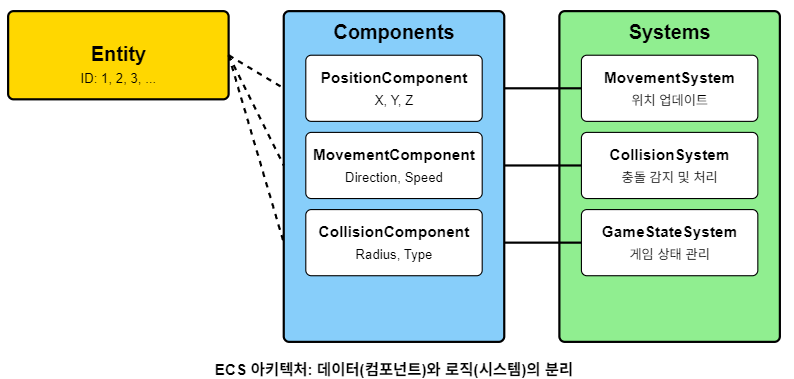
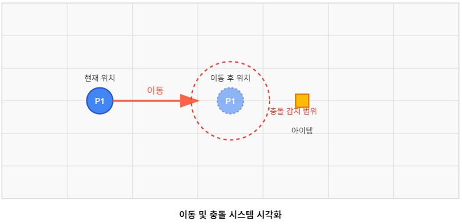
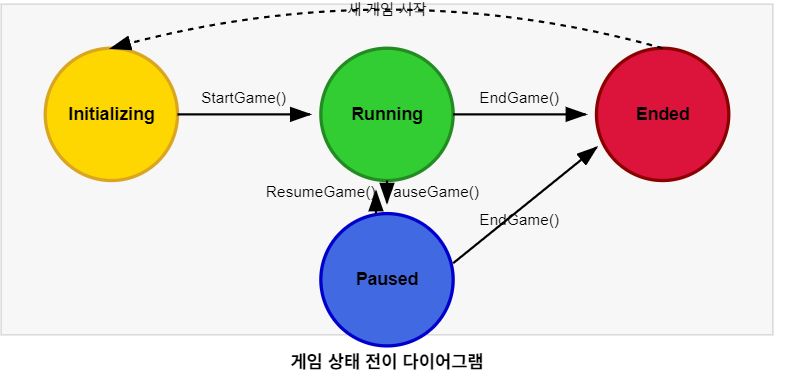

# ECS(Entity-Component-System) 기반 온라인 게임 서버

저자: 최흥배, Claude AI   
    
권장 개발 환경
- **IDE**: Visual Studio 2022 (Community 이상)
- **컴파일러**: .NET 9 이상
- **OS**: Windows 10 이상  
-----    
  
# 4. 간단한 게임 로직 구현
  
## 4.1 ECS 아키텍처 개요
ECS(Entity-Component-System) 아키텍처는 게임 로직을 구조화하는 방법으로, 데이터와 로직을 명확히 분리한다. 이 접근 방식을 통해 확장성과 유지보수성이 향상된다.

ECS 핵심 요소:
- **Entity(엔티티)**: 게임 내 객체의 고유 식별자
- **Component(컴포넌트)**: 순수 데이터 구조로, 엔티티의 특성을 정의
- **System(시스템)**: 특정 컴포넌트를 가진 엔티티들에 대한 로직 처리
  
   
  

## 4.2 플레이어 엔티티 설계
플레이어 엔티티는 여러 컴포넌트로 구성된다. 각 컴포넌트는 플레이어의 특정 측면을 담당한다.

```csharp
// 엔티티 인터페이스
public interface IEntity
{
    Guid Id { get; }
    bool HasComponent<T>() where T : IComponent;
    T GetComponent<T>() where T : IComponent;
    void AddComponent(IComponent component);
    void RemoveComponent<T>() where T : IComponent;
}

// 플레이어 엔티티 구현
public class PlayerEntity : IEntity
{
    private readonly Dictionary<Type, IComponent> _components = new();
    
    public Guid Id { get; }
    
    public PlayerEntity()
    {
        Id = Guid.NewGuid();
    }
    
    public bool HasComponent<T>() where T : IComponent
    {
        return _components.ContainsKey(typeof(T));
    }
    
    public T GetComponent<T>() where T : IComponent
    {
        if (_components.TryGetValue(typeof(T), out var component))
        {
            return (T)component;
        }
        
        throw new KeyNotFoundException($"Component of type {typeof(T).Name} not found");
    }
    
    public void AddComponent(IComponent component)
    {
        _components[component.GetType()] = component;
        component.Entity = this;
    }
    
    public void RemoveComponent<T>() where T : IComponent
    {
        if (_components.TryGetValue(typeof(T), out var component))
        {
            component.Entity = null;
            _components.Remove(typeof(T));
        }
    }
}
```
  

## 4.3 컴포넌트 설계

### 4.3.1 기본 컴포넌트 인터페이스

```csharp
// 컴포넌트 인터페이스
public interface IComponent
{
    IEntity Entity { get; set; }
}
```

### 4.3.2 위치 컴포넌트

```csharp
public class PositionComponent : IComponent
{
    public IEntity Entity { get; set; }
    
    public float X { get; set; }
    public float Y { get; set; }
    
    public PositionComponent(float x = 0, float y = 0)
    {
        X = x;
        Y = y;
    }
    
    public (float X, float Y) GetPosition() => (X, Y);
    
    public void SetPosition(float x, float y)
    {
        X = x;
        Y = y;
    }
    
    public float DistanceTo(PositionComponent other)
    {
        float dx = X - other.X;
        float dy = Y - other.Y;
        return MathF.Sqrt(dx * dx + dy * dy);
    }
}
```

### 4.3.3 이동 컴포넌트

```csharp
public enum Direction
{
    None,
    Up,
    Down,
    Left,
    Right
}

public class MovementComponent : IComponent
{
    public IEntity Entity { get; set; }
    
    public Direction CurrentDirection { get; set; } = Direction.None;
    public float Speed { get; set; }
    public bool IsMoving { get; set; }
    
    public MovementComponent(float speed = 1.0f)
    {
        Speed = speed;
        IsMoving = false;
    }
    
    public void StartMoving(Direction direction)
    {
        CurrentDirection = direction;
        IsMoving = true;
    }
    
    public void StopMoving()
    {
        IsMoving = false;
        CurrentDirection = Direction.None;
    }
}
```

### 4.3.4 충돌 컴포넌트

```csharp
public enum CollisionType
{
    Player,
    Wall,
    Item,
    Enemy
}

public class CollisionComponent : IComponent
{
    public IEntity Entity { get; set; }
    
    public float Radius { get; set; }
    public CollisionType Type { get; set; }
    public bool IsCollisionEnabled { get; set; } = true;
    
    public CollisionComponent(float radius, CollisionType type)
    {
        Radius = radius;
        Type = type;
    }
}
```
  

## 4.4 시스템 설계

### 4.4.1 기본 시스템 인터페이스

```csharp
public interface ISystem
{
    void Update(float deltaTime);
}
```

### 4.4.2 이동 시스템

```csharp
public class MovementSystem : ISystem
{
    private readonly List<IEntity> _entities;
    
    public MovementSystem(List<IEntity> entities)
    {
        _entities = entities;
    }
    
    public void Update(float deltaTime)
    {
        foreach (var entity in _entities)
        {
            if (!entity.HasComponent<MovementComponent>() || !entity.HasComponent<PositionComponent>())
                continue;
                
            var movement = entity.GetComponent<MovementComponent>();
            var position = entity.GetComponent<PositionComponent>();
            
            if (!movement.IsMoving)
                continue;
                
            float distance = movement.Speed * deltaTime;
            
            switch (movement.CurrentDirection)
            {
                case Direction.Up:
                    position.Y += distance;
                    break;
                case Direction.Down:
                    position.Y -= distance;
                    break;
                case Direction.Left:
                    position.X -= distance;
                    break;
                case Direction.Right:
                    position.X += distance;
                    break;
            }
        }
    }
}
```
  
   
  

### 4.4.3 충돌 시스템

```csharp
public class CollisionSystem : ISystem
{
    private readonly List<IEntity> _entities;
    private readonly Action<IEntity, IEntity> _onCollision;
    
    public CollisionSystem(List<IEntity> entities, Action<IEntity, IEntity> onCollision = null)
    {
        _entities = entities;
        _onCollision = onCollision ?? ((e1, e2) => { });
    }
    
    public void Update(float deltaTime)
    {
        // 충돌 가능한 엔티티들 필터링
        var collidableEntities = _entities.Where(e => 
            e.HasComponent<PositionComponent>() && 
            e.HasComponent<CollisionComponent>() &&
            e.GetComponent<CollisionComponent>().IsCollisionEnabled
        ).ToList();
        
        // O(n²) 충돌 검사 - 실제 서버에서는 공간 분할 등으로 최적화 필요
        for (int i = 0; i < collidableEntities.Count; i++)
        {
            var entityA = collidableEntities[i];
            var positionA = entityA.GetComponent<PositionComponent>();
            var collisionA = entityA.GetComponent<CollisionComponent>();
            
            for (int j = i + 1; j < collidableEntities.Count; j++)
            {
                var entityB = collidableEntities[j];
                var positionB = entityB.GetComponent<PositionComponent>();
                var collisionB = entityB.GetComponent<CollisionComponent>();
                
                float distance = positionA.DistanceTo(positionB);
                float minDistance = collisionA.Radius + collisionB.Radius;
                
                if (distance < minDistance)
                {
                    // 충돌 발생!
                    _onCollision(entityA, entityB);
                }
            }
        }
    }
}
```
  

## 4.5 게임 상태 관리

게임 상태를 관리하기 위한 시스템을 구현해본다.

```csharp
public enum GameState
{
    Initializing,
    Running,
    Paused,
    Ended
}

public class GameStateSystem : ISystem
{
    private readonly List<IEntity> _entities;
    private GameState _currentState;
    
    public GameState CurrentState
    {
        get => _currentState;
        set
        {
            if (_currentState != value)
            {
                var oldState = _currentState;
                _currentState = value;
                OnGameStateChanged?.Invoke(oldState, _currentState);
            }
        }
    }
    
    public event Action<GameState, GameState> OnGameStateChanged;
    
    public GameStateSystem(List<IEntity> entities)
    {
        _entities = entities;
        _currentState = GameState.Initializing;
    }
    
    public void StartGame()
    {
        if (_currentState == GameState.Initializing || _currentState == GameState.Ended)
        {
            CurrentState = GameState.Running;
        }
    }
    
    public void PauseGame()
    {
        if (_currentState == GameState.Running)
        {
            CurrentState = GameState.Paused;
        }
    }
    
    public void ResumeGame()
    {
        if (_currentState == GameState.Paused)
        {
            CurrentState = GameState.Running;
        }
    }
    
    public void EndGame()
    {
        if (_currentState == GameState.Running || _currentState == GameState.Paused)
        {
            CurrentState = GameState.Ended;
        }
    }
    
    public void Update(float deltaTime)
    {
        // 게임 상태에 따른 로직
        switch (_currentState)
        {
            case GameState.Initializing:
                // 초기화 로직
                break;
                
            case GameState.Running:
                // 게임 실행 중 로직
                // 예: 시간 기반 이벤트 처리
                break;
                
            case GameState.Paused:
                // 게임 일시 정지 상태 - 대부분의 업데이트 스킵
                break;
                
            case GameState.Ended:
                // 게임 종료 로직
                break;
        }
    }
}
```
  
   

  

## 4.6 네트워크 인터페이스
네트워크 통신을 위한 최소한의 인터페이스만 구현한다.

```csharp
public interface INetworkManager
{
    void Connect(string host, int port);
    void Disconnect();
    bool IsConnected { get; }
    
    void SendMessage(NetworkMessage message);
    event Action<NetworkMessage> OnMessageReceived;
}

public enum MessageType
{
    PlayerJoin,
    PlayerLeave,
    PlayerMove,
    GameStateChange,
    Collision
}

public class NetworkMessage
{
    public MessageType Type { get; set; }
    public Dictionary<string, object> Data { get; set; } = new();
}

// 간단한 네트워크 매니저 구현
public class SimpleNetworkManager : INetworkManager
{
    private bool _isConnected;
    
    public bool IsConnected => _isConnected;
    
    public event Action<NetworkMessage> OnMessageReceived;
    
    public void Connect(string host, int port)
    {
        // 실제 연결 로직 대신 간단한 구현
        Console.WriteLine($"네트워크 연결: {host}:{port}");
        _isConnected = true;
    }
    
    public void Disconnect()
    {
        Console.WriteLine("네트워크 연결 해제");
        _isConnected = false;
    }
    
    public void SendMessage(NetworkMessage message)
    {
        // 실제로는 네트워크를 통해 전송
        Console.WriteLine($"메시지 전송: {message.Type}");
        
        // 테스트를 위해 에코백
        OnMessageReceived?.Invoke(message);
    }
    
    // 테스트용 메시지 시뮬레이션
    public void SimulateIncomingMessage(NetworkMessage message)
    {
        OnMessageReceived?.Invoke(message);
    }
}
```
  

## 4.7 게임 엔진 및 전체 시스템 통합

모든 구성 요소를 통합하는 게임 엔진 클래스를 구현한다.

```csharp
public class GameEngine
{
    private readonly List<IEntity> _entities = new();
    private readonly List<ISystem> _systems = new();
    private readonly INetworkManager _networkManager;
    private GameStateSystem _gameStateSystem;
    
    private bool _isRunning;
    private float _tickRate = 60; // 초당 틱 수
    
    public GameEngine(INetworkManager networkManager = null)
    {
        _networkManager = networkManager ?? new SimpleNetworkManager();
        Initialize();
    }
    
    private void Initialize()
    {
        // 기본 시스템 설정
        var movementSystem = new MovementSystem(_entities);
        var collisionSystem = new CollisionSystem(_entities, HandleCollision);
        _gameStateSystem = new GameStateSystem(_entities);
        
        _systems.Add(movementSystem);
        _systems.Add(collisionSystem);
        _systems.Add(_gameStateSystem);
        
        // 네트워크 이벤트 구독
        _networkManager.OnMessageReceived += HandleNetworkMessage;
    }
    
    public void Start()
    {
        if (_isRunning)
            return;
            
        _isRunning = true;
        _gameStateSystem.StartGame();
        
        // 게임 루프 시작
        Task.Run(GameLoop);
    }
    
    public void Stop()
    {
        _isRunning = false;
        _gameStateSystem.EndGame();
    }
    
    private async Task GameLoop()
    {
        float deltaTime = 1.0f / _tickRate;
        
        while (_isRunning)
        {
            // 모든 시스템 업데이트
            if (_gameStateSystem.CurrentState == GameState.Running)
            {
                foreach (var system in _systems)
                {
                    system.Update(deltaTime);
                }
            }
            
            // 다음 틱까지 대기
            await Task.Delay((int)(1000 / _tickRate));
        }
    }
    
    public IEntity CreatePlayerEntity(float x, float y, float speed = 1.0f, float radius = 1.0f)
    {
        var entity = new PlayerEntity();
        
        // 필요한 컴포넌트 추가
        entity.AddComponent(new PositionComponent(x, y));
        entity.AddComponent(new MovementComponent(speed));
        entity.AddComponent(new CollisionComponent(radius, CollisionType.Player));
        
        _entities.Add(entity);
        return entity;
    }
    
    private void HandleCollision(IEntity entityA, IEntity entityB)
    {
        Console.WriteLine($"충돌 발생: Entity {entityA.Id} <-> Entity {entityB.Id}");
        
        // 충돌 이벤트 네트워크 전송
        var message = new NetworkMessage
        {
            Type = MessageType.Collision,
            Data = new Dictionary<string, object>
            {
                ["EntityIdA"] = entityA.Id,
                ["EntityIdB"] = entityB.Id
            }
        };
        
        _networkManager.SendMessage(message);
    }
    
    private void HandleNetworkMessage(NetworkMessage message)
    {
        switch (message.Type)
        {
            case MessageType.PlayerMove:
                HandlePlayerMoveMessage(message);
                break;
                
            case MessageType.GameStateChange:
                HandleGameStateChangeMessage(message);
                break;
                
            // 기타 메시지 처리
        }
    }
    
    private void HandlePlayerMoveMessage(NetworkMessage message)
    {
        if (message.Data.TryGetValue("EntityId", out var entityIdObj) &&
            message.Data.TryGetValue("Direction", out var directionObj))
        {
            var entityId = (Guid)entityIdObj;
            var direction = (Direction)directionObj;
            
            var entity = _entities.FirstOrDefault(e => e.Id == entityId);
            if (entity != null && entity.HasComponent<MovementComponent>())
            {
                var movement = entity.GetComponent<MovementComponent>();
                movement.StartMoving(direction);
            }
        }
    }
    
    private void HandleGameStateChangeMessage(NetworkMessage message)
    {
        if (message.Data.TryGetValue("NewState", out var stateObj))
        {
            var newState = (GameState)stateObj;
            
            switch (newState)
            {
                case GameState.Running:
                    _gameStateSystem.StartGame();
                    break;
                case GameState.Paused:
                    _gameStateSystem.PauseGame();
                    break;
                case GameState.Ended:
                    _gameStateSystem.EndGame();
                    break;
            }
        }
    }
}
```
  

## 4.8 간단한 클라이언트 구현

콘솔 기반의 간단한 클라이언트를 구현해본다.

```csharp
public class SimpleGameClient
{
    private readonly INetworkManager _networkManager;
    private Guid _playerId;
    
    public SimpleGameClient()
    {
        _networkManager = new SimpleNetworkManager();
        _networkManager.OnMessageReceived += HandleNetworkMessage;
    }
    
    public void Connect(string host, int port)
    {
        _networkManager.Connect(host, port);
        Console.WriteLine("서버에 연결되었습니다.");
    }
    
    public void StartGame()
    {
        // 게임 시작 요청
        var message = new NetworkMessage
        {
            Type = MessageType.GameStateChange,
            Data = new Dictionary<string, object>
            {
                ["NewState"] = GameState.Running
            }
        };
        
        _networkManager.SendMessage(message);
    }
    
    public void MovePlayer(Direction direction)
    {
        if (!_networkManager.IsConnected)
        {
            Console.WriteLine("서버에 연결되어 있지 않습니다.");
            return;
        }
        
        var message = new NetworkMessage
        {
            Type = MessageType.PlayerMove,
            Data = new Dictionary<string, object>
            {
                ["EntityId"] = _playerId,
                ["Direction"] = direction
            }
        };
        
        _networkManager.SendMessage(message);
    }
    
    private void HandleNetworkMessage(NetworkMessage message)
    {
        switch (message.Type)
        {
            case MessageType.PlayerJoin:
                if (message.Data.TryGetValue("EntityId", out var entityIdObj))
                {
                    _playerId = (Guid)entityIdObj;
                    Console.WriteLine($"게임에 참가했습니다. 플레이어 ID: {_playerId}");
                }
                break;
                
            case MessageType.Collision:
                Console.WriteLine("충돌이 발생했습니다!");
                break;
                
            case MessageType.GameStateChange:
                if (message.Data.TryGetValue("NewState", out var stateObj))
                {
                    var state = (GameState)stateObj;
                    Console.WriteLine($"게임 상태 변경: {state}");
                }
                break;
        }
    }
    
    public void Run()
    {
        Console.WriteLine("간단한 게임 클라이언트 시작");
        Console.WriteLine("명령어: [wasd] - 이동, p - 게임 일시정지, r - 게임 재개, q - 종료");
        
        bool isRunning = true;
        
        while (isRunning)
        {
            var key = Console.ReadKey(true);
            
            switch (key.KeyChar)
            {
                case 'w':
                    MovePlayer(Direction.Up);
                    break;
                case 'a':
                    MovePlayer(Direction.Left);
                    break;
                case 's':
                    MovePlayer(Direction.Down);
                    break;
                case 'd':
                    MovePlayer(Direction.Right);
                    break;
                case 'p':
                    SendGameStateChange(GameState.Paused);
                    break;
                case 'r':
                    SendGameStateChange(GameState.Running);
                    break;
                case 'q':
                    isRunning = false;
                    break;
            }
        }
        
        _networkManager.Disconnect();
    }
    
    private void SendGameStateChange(GameState newState)
    {
        var message = new NetworkMessage
        {
            Type = MessageType.GameStateChange,
            Data = new Dictionary<string, object>
            {
                ["NewState"] = newState
            }
        };
        
        _networkManager.SendMessage(message);
    }
}
```
  


## 4.9 전체 시스템 통합 및 실행 예제

최종적으로 서버와 클라이언트를 통합하여 실행하는 예제 코드다.

```csharp
using System;
using System.Collections.Generic;
using System.Linq;
using System.Threading.Tasks;

class Program
{
    static async Task Main(string[] args)
    {
        Console.WriteLine("ECS 기반 게임 서버 예제 실행");
        
        // 1. 서버 인스턴스 생성
        var networkManager = new SimpleNetworkManager();
        var gameEngine = new GameEngine(networkManager);
        
        // 2. 초기 게임 엔티티 생성
        var player1 = gameEngine.CreatePlayerEntity(0, 0, 2.0f, 1.0f);
        
        // 3. 게임 엔진 시작
        gameEngine.Start();
        Console.WriteLine("게임 서버가 시작되었습니다.");
        
        // 4. 클라이언트 시뮬레이션
        var client = new SimpleGameClient();
        client.Connect("localhost", 8080);
        
        // 플레이어 참가 시뮬레이션
        var joinMessage = new NetworkMessage
        {
            Type = MessageType.PlayerJoin,
            Data = new Dictionary<string, object>
            {
                ["EntityId"] = player1.Id
            }
        };
        
        ((SimpleNetworkManager)networkManager).SimulateIncomingMessage(joinMessage);
        
        // 5. 클라이언트 실행
        await Task.Run(() => client.Run());
        
        // 6. 종료
        gameEngine.Stop();
        Console.WriteLine("게임 서버가 종료되었습니다.");
    }
}
```
  

  
## 4.10 마무리

ECS 아키텍처를 활용한 간단한 게임 로직을 구현해보았다. 구현 내용은 다음과 같다:

1. **엔티티 설계**: 플레이어 엔티티를 정의하고 다양한 컴포넌트 부착 가능
2. **컴포넌트 구현**: 위치, 이동, 충돌 컴포넌트 구현
3. **시스템 구현**: 이동, 충돌, 게임 상태 관리 시스템 구현
4. **네트워크 인터페이스**: 간단한 네트워크 통신 인터페이스 제공
5. **게임 엔진**: 위 요소들을 통합하는 엔진 구현
6. **클라이언트**: 간단한 콘솔 기반 클라이언트 구현

실제 서버 개발 시에는 다음 사항을 고려해 확장해야 한다:

- **최적화**: 충돌 감지를 위한 공간 분할 기법 적용
- **동시성 처리**: 다중 스레드 환경에서의 안전한 데이터 접근
- **네트워크 코드 강화**: 실제 네트워크 통신 구현 및 에러 처리
- **확장성**: 더 많은 컴포넌트와 시스템 추가

이 장에서 구현한 내용은 기본적인 ECS 패턴을 보여주는 것으로, 실제 게임 서버 개발 시에는 더 많은 최적화와 기능 구현이 필요하다. 
  
  
  