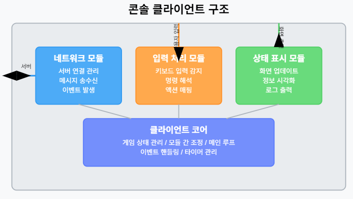
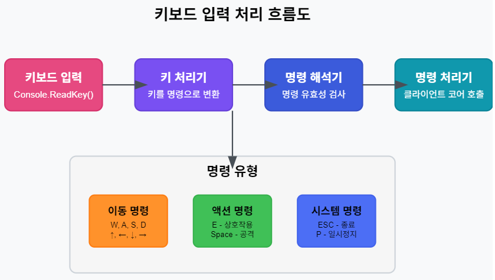
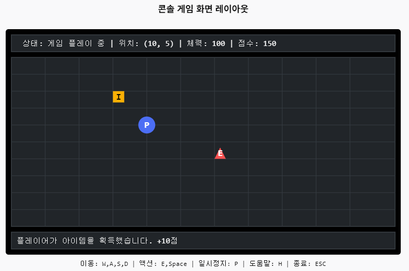

# ECS(Entity-Component-System) 기반 온라인 게임 서버

저자: 최흥배, Claude AI   
    
권장 개발 환경
- **IDE**: Visual Studio 2022 (Community 이상)
- **컴파일러**: .NET 9 이상
- **OS**: Windows 10 이상  
-----    
  
# 5. 콘솔 클라이언트 구현

## 5.1 콘솔 클라이언트 구조 개요
콘솔 기반 클라이언트는 서버와 통신하면서 게임 상태를 텍스트로 표시하고 키보드 입력을 통해 사용자의 명령을 처리한다. 콘솔 환경의 제약에도 불구하고 잘 설계된 클라이언트는 게임 흐름을 명확히 표현할 수 있다.  
     
  
콘솔 클라이언트는 다음 네 가지 핵심 모듈로 구성된다:

1. **네트워크 모듈**: 서버와의 통신을 담당하며 메시지 송수신과 이벤트 발생을 처리
2. **입력 처리 모듈**: 사용자 키보드 입력을 감지하고 명령으로 변환
3. **상태 표시 모듈**: 게임 상태와 이벤트를 화면에 시각화
4. **클라이언트 코어**: 위 모듈들을 조정하고 전체 게임 흐름 관리

이러한 모듈화 설계는 코드 유지보수와 확장성을 높인다.
  

## 5.2 클라이언트 코어 클래스 설계
먼저 클라이언트의 핵심 역할을 담당할 코어 클래스를 설계한다.

```csharp
using System;
using System.Threading;
using System.Threading.Tasks;

namespace GameClient
{
    public class GameClient
    {
        private readonly INetworkClient _networkClient;
        private readonly IInputHandler _inputHandler;
        private readonly IGameRenderer _renderer;
        
        private GameState _gameState;
        private bool _isRunning;
        private CancellationTokenSource _cts;
        
        // 플레이어 정보
        private Guid _playerId;
        private PlayerInfo _playerInfo;
        
        // 이벤트 핸들러
        public event Action<GameEvent> OnGameEvent;
        
        public GameClient(INetworkClient networkClient, IInputHandler inputHandler, IGameRenderer renderer)
        {
            _networkClient = networkClient;
            _inputHandler = inputHandler;
            _renderer = renderer;
            
            _gameState = GameState.Disconnected;
            _playerInfo = new PlayerInfo { Position = new Vector2(0, 0) };
            
            // 이벤트 등록
            _networkClient.OnMessageReceived += HandleNetworkMessage;
            _inputHandler.OnCommandReceived += HandleCommand;
        }
        
        public async Task Start()
        {
            if (_isRunning)
                return;
                
            _isRunning = true;
            _cts = new CancellationTokenSource();
            
            // 렌더링 루프와 입력 처리 루프 시작
            Task renderTask = StartRenderingLoop(_cts.Token);
            Task inputTask = _inputHandler.StartListening(_cts.Token);
            
            // 병렬로 두 태스크 실행
            await Task.WhenAll(renderTask, inputTask);
        }
        
        public void Stop()
        {
            if (!_isRunning)
                return;
                
            _isRunning = false;
            _cts?.Cancel();
            _networkClient.Disconnect();
        }
        
        public async Task Connect(string host, int port)
        {
            UpdateGameState(GameState.Connecting);
            bool connected = await _networkClient.ConnectAsync(host, port);
            
            if (connected)
            {
                UpdateGameState(GameState.Connected);
                // 플레이어 정보 요청
                await RequestPlayerInfo();
            }
            else
            {
                UpdateGameState(GameState.Disconnected);
            }
        }
        
        private async Task RequestPlayerInfo()
        {
            var message = new NetworkMessage
            {
                Type = MessageType.PlayerInfoRequest,
                Data = new Dictionary<string, object>()
            };
            
            await _networkClient.SendMessageAsync(message);
        }
        
        private void HandleNetworkMessage(NetworkMessage message)
        {
            switch (message.Type)
            {
                case MessageType.PlayerInfo:
                    HandlePlayerInfoMessage(message);
                    break;
                    
                case MessageType.GameStateUpdate:
                    HandleGameStateUpdateMessage(message);
                    break;
                    
                case MessageType.EntityUpdate:
                    HandleEntityUpdateMessage(message);
                    break;
                    
                case MessageType.GameEvent:
                    HandleGameEventMessage(message);
                    break;
            }
        }
        
        private void HandlePlayerInfoMessage(NetworkMessage message)
        {
            if (message.Data.TryGetValue("PlayerId", out var playerIdObj) &&
                playerIdObj is Guid playerId)
            {
                _playerId = playerId;
                
                if (message.Data.TryGetValue("Position", out var posObj) &&
                    posObj is Dictionary<string, object> posDict)
                {
                    if (posDict.TryGetValue("X", out var xObj) && posDict.TryGetValue("Y", out var yObj))
                    {
                        _playerInfo.Position = new Vector2(
                            Convert.ToSingle(xObj),
                            Convert.ToSingle(yObj)
                        );
                    }
                }
                
                UpdateGameState(GameState.Playing);
                
                // 게임 이벤트 발생
                OnGameEvent?.Invoke(new GameEvent
                {
                    Type = GameEventType.PlayerJoined,
                    Data = new Dictionary<string, object>
                    {
                        ["PlayerId"] = _playerId
                    }
                });
            }
        }
        
        private void HandleGameStateUpdateMessage(NetworkMessage message)
        {
            if (message.Data.TryGetValue("State", out var stateObj) &&
                stateObj is GameState state)
            {
                UpdateGameState(state);
            }
        }
        
        private void HandleEntityUpdateMessage(NetworkMessage message)
        {
            // 엔티티 업데이트 처리
            // 이 예제에서는 플레이어 위치만 업데이트
            if (message.Data.TryGetValue("EntityId", out var entityIdObj) &&
                entityIdObj is Guid entityId &&
                entityId == _playerId &&
                message.Data.TryGetValue("Position", out var posObj) &&
                posObj is Dictionary<string, object> posDict)
            {
                if (posDict.TryGetValue("X", out var xObj) && posDict.TryGetValue("Y", out var yObj))
                {
                    _playerInfo.Position = new Vector2(
                        Convert.ToSingle(xObj),
                        Convert.ToSingle(yObj)
                    );
                }
            }
        }
        
        private void HandleGameEventMessage(NetworkMessage message)
        {
            if (message.Data.TryGetValue("EventType", out var eventTypeObj) &&
                eventTypeObj is GameEventType eventType)
            {
                var gameEvent = new GameEvent
                {
                    Type = eventType,
                    Data = message.Data
                };
                
                OnGameEvent?.Invoke(gameEvent);
            }
        }
        
        private void HandleCommand(GameCommand command)
        {
            switch (command.Type)
            {
                case CommandType.Move:
                    HandleMoveCommand(command);
                    break;
                    
                case CommandType.Action:
                    HandleActionCommand(command);
                    break;
                    
                case CommandType.System:
                    HandleSystemCommand(command);
                    break;
            }
        }
        
        private async void HandleMoveCommand(GameCommand command)
        {
            if (_gameState != GameState.Playing)
                return;
                
            if (command.Data.TryGetValue("Direction", out var dirObj) &&
                dirObj is Direction direction)
            {
                // 서버에 이동 명령 전송
                var message = new NetworkMessage
                {
                    Type = MessageType.PlayerMove,
                    Data = new Dictionary<string, object>
                    {
                        ["PlayerId"] = _playerId,
                        ["Direction"] = direction
                    }
                };
                
                await _networkClient.SendMessageAsync(message);
            }
        }
        
        private async void HandleActionCommand(GameCommand command)
        {
            if (_gameState != GameState.Playing)
                return;
                
            if (command.Data.TryGetValue("ActionType", out var actionTypeObj) &&
                actionTypeObj is ActionType actionType)
            {
                // 서버에 액션 명령 전송
                var message = new NetworkMessage
                {
                    Type = MessageType.PlayerAction,
                    Data = new Dictionary<string, object>
                    {
                        ["PlayerId"] = _playerId,
                        ["ActionType"] = actionType
                    }
                };
                
                await _networkClient.SendMessageAsync(message);
            }
        }
        
        private void HandleSystemCommand(GameCommand command)
        {
            if (command.Data.TryGetValue("SystemCommandType", out var cmdTypeObj) &&
                cmdTypeObj is SystemCommandType cmdType)
            {
                switch (cmdType)
                {
                    case SystemCommandType.Quit:
                        Stop();
                        break;
                        
                    case SystemCommandType.TogglePause:
                        TogglePauseGame();
                        break;
                        
                    case SystemCommandType.Help:
                        ShowHelp();
                        break;
                }
            }
        }
        
        private async void TogglePauseGame()
        {
            if (_gameState == GameState.Playing)
            {
                await SendGameStateRequest(GameState.Paused);
            }
            else if (_gameState == GameState.Paused)
            {
                await SendGameStateRequest(GameState.Playing);
            }
        }
        
        private async Task SendGameStateRequest(GameState state)
        {
            var message = new NetworkMessage
            {
                Type = MessageType.GameStateChange,
                Data = new Dictionary<string, object>
                {
                    ["State"] = state
                }
            };
            
            await _networkClient.SendMessageAsync(message);
        }
        
        private void ShowHelp()
        {
            // 도움말 표시 이벤트 발생
            OnGameEvent?.Invoke(new GameEvent
            {
                Type = GameEventType.ShowHelp,
                Data = null
            });
        }
        
        private void UpdateGameState(GameState newState)
        {
            if (_gameState != newState)
            {
                var oldState = _gameState;
                _gameState = newState;
                
                // 게임 상태 변경 이벤트 발생
                OnGameEvent?.Invoke(new GameEvent
                {
                    Type = GameEventType.GameStateChanged,
                    Data = new Dictionary<string, object>
                    {
                        ["OldState"] = oldState,
                        ["NewState"] = newState
                    }
                });
            }
        }
        
        private async Task StartRenderingLoop(CancellationToken token)
        {
            const int FrameTimeMs = 100; // 화면 갱신 간격 (10 FPS)
            
            while (!token.IsCancellationRequested)
            {
                // 현재 게임 상태 렌더링
                _renderer.Render(new GameView
                {
                    CurrentState = _gameState,
                    PlayerInfo = _playerInfo
                });
                
                // 다음 프레임까지 대기
                await Task.Delay(FrameTimeMs, token);
            }
        }
    }
    
    // 데이터 구조
    public struct Vector2
    {
        public float X { get; set; }
        public float Y { get; set; }
        
        public Vector2(float x, float y)
        {
            X = x;
            Y = y;
        }
        
        public override string ToString() => $"({X}, {Y})";
    }
    
    public class PlayerInfo
    {
        public Vector2 Position { get; set; }
        public float Health { get; set; } = 100;
        public int Score { get; set; } = 0;
    }
    
    public class GameView
    {
        public GameState CurrentState { get; set; }
        public PlayerInfo PlayerInfo { get; set; }
    }
    
    public class GameEvent
    {
        public GameEventType Type { get; set; }
        public Dictionary<string, object> Data { get; set; }
    }
    
    // 열거형
    public enum GameState
    {
        Disconnected,
        Connecting,
        Connected,
        Playing,
        Paused,
        GameOver
    }
    
    public enum GameEventType
    {
        PlayerJoined,
        GameStateChanged,
        EntityCollision,
        ScoreChanged,
        ShowHelp
    }
    
    public enum Direction
    {
        None,
        Up,
        Down,
        Left,
        Right
    }
    
    public enum ActionType
    {
        Interact,
        Attack,
        UseItem
    }
    
    public enum SystemCommandType
    {
        Quit,
        TogglePause,
        Help
    }
}
```

## 5.3 네트워크 인터페이스 및 구현

클라이언트와 서버 간 통신을 처리하기 위한 네트워크 인터페이스와 간단한 구현을 제공한다.

```csharp
using System;
using System.Collections.Generic;
using System.Threading.Tasks;

namespace GameClient
{
    // 네트워크 메시지 정의
    public enum MessageType
    {
        PlayerInfoRequest,
        PlayerInfo,
        PlayerMove,
        PlayerAction,
        GameStateChange,
        GameStateUpdate,
        EntityUpdate,
        GameEvent
    }
    
    public class NetworkMessage
    {
        public MessageType Type { get; set; }
        public Dictionary<string, object> Data { get; set; } = new();
    }
    
    // 네트워크 클라이언트 인터페이스
    public interface INetworkClient
    {
        bool IsConnected { get; }
        
        Task<bool> ConnectAsync(string host, int port);
        void Disconnect();
        
        Task SendMessageAsync(NetworkMessage message);
        
        event Action<NetworkMessage> OnMessageReceived;
        event Action<Exception> OnError;
    }
    
    // 간단한 네트워크 클라이언트 구현 (실제 통신 없이 테스트용)
    public class MockNetworkClient : INetworkClient
    {
        private bool _isConnected;
        private Random _random = new Random();
        
        public bool IsConnected => _isConnected;
        
        public event Action<NetworkMessage> OnMessageReceived;
        public event Action<Exception> OnError;
        
        public async Task<bool> ConnectAsync(string host, int port)
        {
            // 연결 지연 시뮬레이션
            await Task.Delay(500);
            
            _isConnected = true;
            Console.WriteLine($"서버에 연결됨: {host}:{port}");
            
            return true;
        }
        
        public void Disconnect()
        {
            if (_isConnected)
            {
                _isConnected = false;
                Console.WriteLine("서버 연결 해제됨");
            }
        }
        
        public async Task SendMessageAsync(NetworkMessage message)
        {
            if (!_isConnected)
            {
                OnError?.Invoke(new InvalidOperationException("서버에 연결되어 있지 않습니다."));
                return;
            }
            
            // 메시지 전송 지연 시뮬레이션
            await Task.Delay(50);
            
            Console.WriteLine($"메시지 전송: {message.Type}");
            
            // 메시지에 따른 응답 시뮬레이션
            switch (message.Type)
            {
                case MessageType.PlayerInfoRequest:
                    SimulatePlayerInfoResponse();
                    break;
                    
                case MessageType.PlayerMove:
                    SimulateMovementResponse(message);
                    break;
                    
                case MessageType.GameStateChange:
                    SimulateGameStateResponse(message);
                    break;
            }
        }
        
        private void SimulatePlayerInfoResponse()
        {
            var response = new NetworkMessage
            {
                Type = MessageType.PlayerInfo,
                Data = new Dictionary<string, object>
                {
                    ["PlayerId"] = Guid.NewGuid(),
                    ["Position"] = new Dictionary<string, object>
                    {
                        ["X"] = 0f,
                        ["Y"] = 0f
                    }
                }
            };
            
            OnMessageReceived?.Invoke(response);
        }
        
        private void SimulateMovementResponse(NetworkMessage message)
        {
            if (message.Data.TryGetValue("PlayerId", out var playerIdObj) &&
                message.Data.TryGetValue("Direction", out var directionObj))
            {
                var playerId = (Guid)playerIdObj;
                var direction = (Direction)directionObj;
                
                // 새 위치 계산
                float deltaX = 0, deltaY = 0;
                switch (direction)
                {
                    case Direction.Up:
                        deltaY = 1f;
                        break;
                    case Direction.Down:
                        deltaY = -1f;
                        break;
                    case Direction.Left:
                        deltaX = -1f;
                        break;
                    case Direction.Right:
                        deltaX = 1f;
                        break;
                }
                
                // 엔티티 업데이트 응답
                var response = new NetworkMessage
                {
                    Type = MessageType.EntityUpdate,
                    Data = new Dictionary<string, object>
                    {
                        ["EntityId"] = playerId,
                        ["Position"] = new Dictionary<string, object>
                        {
                            ["X"] = deltaX,
                            ["Y"] = deltaY
                        }
                    }
                };
                
                OnMessageReceived?.Invoke(response);
                
                // 랜덤하게 충돌 이벤트 발생시킴
                if (_random.Next(10) == 0)
                {
                    SimulateCollisionEvent(playerId);
                }
            }
        }
        
        private void SimulateGameStateResponse(NetworkMessage message)
        {
            if (message.Data.TryGetValue("State", out var stateObj))
            {
                var state = (GameState)stateObj;
                
                var response = new NetworkMessage
                {
                    Type = MessageType.GameStateUpdate,
                    Data = new Dictionary<string, object>
                    {
                        ["State"] = state
                    }
                };
                
                OnMessageReceived?.Invoke(response);
            }
        }
        
        private void SimulateCollisionEvent(Guid playerId)
        {
            var response = new NetworkMessage
            {
                Type = MessageType.GameEvent,
                Data = new Dictionary<string, object>
                {
                    ["EventType"] = GameEventType.EntityCollision,
                    ["EntityId"] = playerId,
                    ["CollidedWith"] = "Item" + _random.Next(1, 5)
                }
            };
            
            OnMessageReceived?.Invoke(response);
        }
    }
}
```

## 5.4 사용자 입력 처리 시스템
키보드 입력을 게임 명령으로 변환하는 시스템을 구현한다.  
  
     

```csharp
using System;
using System.Collections.Generic;
using System.Threading;
using System.Threading.Tasks;

namespace GameClient
{
    // 명령 정의
    public enum CommandType
    {
        Move,
        Action,
        System
    }
    
    public class GameCommand
    {
        public CommandType Type { get; set; }
        public Dictionary<string, object> Data { get; set; } = new();
    }
    
    // 입력 처리기 인터페이스
    public interface IInputHandler
    {
        Task StartListening(CancellationToken token);
        void StopListening();
        
        event Action<GameCommand> OnCommandReceived;
    }
    
    // 콘솔 기반 입력 처리기 구현
    public class ConsoleInputHandler : IInputHandler
    {
        private bool _isListening;
        
        public event Action<GameCommand> OnCommandReceived;
        
        public async Task StartListening(CancellationToken token)
        {
            if (_isListening)
                return;
                
            _isListening = true;
            
            await Task.Run(() => InputLoop(token), token);
        }
        
        public void StopListening()
        {
            _isListening = false;
        }
        
        private void InputLoop(CancellationToken token)
        {
            while (_isListening && !token.IsCancellationRequested)
            {
                if (Console.KeyAvailable)
                {
                    var key = Console.ReadKey(true);
                    ProcessKeyPress(key);
                }
                
                // CPU 사용률 최적화를 위한 짧은 대기
                Thread.Sleep(10);
            }
        }
        
        private void ProcessKeyPress(ConsoleKeyInfo keyInfo)
        {
            GameCommand command = null;
            
            // 키 입력을 명령으로 변환
            switch (keyInfo.Key)
            {
                // 이동 명령
                case ConsoleKey.W:
                case ConsoleKey.UpArrow:
                    command = CreateMoveCommand(Direction.Up);
                    break;
                    
                case ConsoleKey.S:
                case ConsoleKey.DownArrow:
                    command = CreateMoveCommand(Direction.Down);
                    break;
                    
                case ConsoleKey.A:
                case ConsoleKey.LeftArrow:
                    command = CreateMoveCommand(Direction.Left);
                    break;
                    
                case ConsoleKey.D:
                case ConsoleKey.RightArrow:
                    command = CreateMoveCommand(Direction.Right);
                    break;
                    
                // 액션 명령
                case ConsoleKey.E:
                    command = CreateActionCommand(ActionType.Interact);
                    break;
                    
                case ConsoleKey.Spacebar:
                    command = CreateActionCommand(ActionType.Attack);
                    break;
                    
                // 시스템 명령
                case ConsoleKey.Escape:
                    command = CreateSystemCommand(SystemCommandType.Quit);
                    break;
                    
                case ConsoleKey.P:
                    command = CreateSystemCommand(SystemCommandType.TogglePause);
                    break;
                    
                case ConsoleKey.H:
                case ConsoleKey.F1:
                    command = CreateSystemCommand(SystemCommandType.Help);
                    break;
            }
            
            if (command != null)
            {
                OnCommandReceived?.Invoke(command);
            }
        }
        
        private GameCommand CreateMoveCommand(Direction direction)
        {
            return new GameCommand
            {
                Type = CommandType.Move,
                Data = new Dictionary<string, object>
                {
                    ["Direction"] = direction
                }
            };
        }
        
        private GameCommand CreateActionCommand(ActionType actionType)
        {
            return new GameCommand
            {
                Type = CommandType.Action,
                Data = new Dictionary<string, object>
                {
                    ["ActionType"] = actionType
                }
            };
        }
        
        private GameCommand CreateSystemCommand(SystemCommandType cmdType)
        {
            return new GameCommand
            {
                Type = CommandType.System,
                Data = new Dictionary<string, object>
                {
                    ["SystemCommandType"] = cmdType
                }
            };
        }
    }
}
```

## 5.5 게임 상태 표시 시스템
콘솔에 게임 상태를 시각적으로 표현하는 렌더러를 구현한다.
  
   

```csharp
using System;
using System.Collections.Generic;
using System.Threading;

namespace GameClient
{
    // 게임 렌더러 인터페이스
    public interface IGameRenderer
    {
        void Render(GameView gameView);
        void AddLogMessage(string message);
    }
    
    // 콘솔 기반 게임 렌더러 구현
    public class ConsoleGameRenderer : IGameRenderer
    {
        private const int MapWidth = 20;
        private const int MapHeight = 10;
        private const int MaxLogMessages = 5;
        
        private readonly Queue<string> _logMessages = new();
        private readonly object _consoleLock = new object();
        
        // 캐릭터 및 심볼 정의
        private const char PlayerSymbol = 'P';
        private const char ItemSymbol = 'I';
        private const char EnemySymbol = 'E';
        private const char EmptySymbol = '.';
        
        public ConsoleGameRenderer()
        {
            InitializeConsole();
        }
        
        private void InitializeConsole()
        {
            Console.CursorVisible = false;
            Console.Clear();
            
            try
            {
                // 콘솔 크기 설정 (일부 환경에서는 작동하지 않을 수 있음)
                Console.SetWindowSize(Math.Max(Console.WindowWidth, MapWidth + 5), 
                                     Math.Max(Console.WindowHeight, MapHeight + 10));
            }
            catch (Exception)
            {
                // 일부 환경에서는 콘솔 크기를 변경할 수 없으므로 예외 무시
            }
        }
        
        public void Render(GameView gameView)
        {
            // 여러 스레드에서 동시에 콘솔에 접근하는 것을 방지
            lock (_consoleLock)
            {
                Console.Clear();
                
                // 상태 표시줄 렌더링
                RenderStatusBar(gameView);
                
                // 게임 맵 렌더링
                RenderGameMap(gameView);
                
                // 로그 메시지 렌더링
                RenderLogMessages();
                
                // 조작 안내 렌더링
                RenderControlsHelp();
            }
        }
        
        public void AddLogMessage(string message)
        {
            _logMessages.Enqueue(message);
            
            // 최대 로그 메시지 수 유지
            while (_logMessages.Count > MaxLogMessages)
            {
                _logMessages.Dequeue();
            }
        }
        
        private void RenderStatusBar(GameView gameView)
        {
            Console.SetCursorPosition(0, 0);
            Console.ForegroundColor = ConsoleColor.White;
            Console.BackgroundColor = ConsoleColor.DarkBlue;
            
            string statusText = $" 상태: {GetGameStateText(gameView.CurrentState)} | " +
                               $"위치: {gameView.PlayerInfo.Position} | " +
                               $"체력: {gameView.PlayerInfo.Health} | " +
                               $"점수: {gameView.PlayerInfo.Score} ";
            
            Console.Write(statusText.PadRight(Console.WindowWidth));
            
            // 색상 초기화
            Console.ResetColor();
        }
        
        private string GetGameStateText(GameState state)
        {
            return state switch
            {
                GameState.Disconnected => "연결 끊김",
                GameState.Connecting => "연결 중...",
                GameState.Connected => "연결됨",
                GameState.Playing => "게임 플레이 중",
                GameState.Paused => "일시 정지",
                GameState.GameOver => "게임 종료",
                _ => state.ToString()
            };
        }
        
        private void RenderGameMap(GameView gameView)
        {
            // 맵 테두리 그리기
            DrawMapBorder();
            
            // 플레이어 위치 계산 및 렌더링
            int playerX = Math.Clamp((int)gameView.PlayerInfo.Position.X, 0, MapWidth - 1);
            int playerY = Math.Clamp((int)gameView.PlayerInfo.Position.Y, 0, MapHeight - 1);
            
            // 빈 맵 채우기
            for (int y = 0; y < MapHeight; y++)
            {
                for (int x = 0; x < MapWidth; x++)
                {
                    Console.SetCursorPosition(x + 2, y + 2);
                    Console.Write(EmptySymbol);
                }
            }
            
            // 예시용 아이템 몇 개 배치
            PlaceSymbol(5, 3, ItemSymbol, ConsoleColor.Yellow);
            PlaceSymbol(10, 7, ItemSymbol, ConsoleColor.Yellow);
            PlaceSymbol(15, 4, ItemSymbol, ConsoleColor.Yellow);
            
            // 예시용 적 몇 개 배치
            PlaceSymbol(8, 5, EnemySymbol, ConsoleColor.Red);
            PlaceSymbol(12, 2, EnemySymbol, ConsoleColor.Red);
            
            // 플레이어 배치
            PlaceSymbol(playerX, playerY, PlayerSymbol, ConsoleColor.Cyan);
        }
        
        private void DrawMapBorder()
        {
            Console.ForegroundColor = ConsoleColor.White;
            
            // 상단 테두리
            Console.SetCursorPosition(1, 1);
            Console.Write('+');
            for (int x = 0; x < MapWidth; x++)
                Console.Write('-');
            Console.Write('+');
            
            // 측면 테두리
            for (int y = 0; y < MapHeight; y++)
            {
                Console.SetCursorPosition(1, y + 2);
                Console.Write('|');
                Console.SetCursorPosition(MapWidth + 2, y + 2);
                Console.Write('|');
            }
            
            // 하단 테두리
            Console.SetCursorPosition(1, MapHeight + 2);
            Console.Write('+');
            for (int x = 0; x < MapWidth; x++)
                Console.Write('-');
            Console.Write('+');
            
            Console.ResetColor();
        }
        
        private void PlaceSymbol(int x, int y, char symbol, ConsoleColor color)
        {
            Console.SetCursorPosition(x + 2, y + 2);
            Console.ForegroundColor = color;
            Console.Write(symbol);
            Console.ResetColor();
        }
        
        private void RenderLogMessages()
        {
            Console.SetCursorPosition(0, MapHeight + 4);
            Console.ForegroundColor = ConsoleColor.White;
            Console.BackgroundColor = ConsoleColor.DarkGray;
            Console.Write(" 로그 메시지 ".PadRight(Console.WindowWidth));
            Console.ResetColor();
            
            Console.ForegroundColor = ConsoleColor.Gray;
            int logY = MapHeight + 5;
            
            if (_logMessages.Count == 0)
            {
                Console.SetCursorPosition(2, logY);
                Console.WriteLine("로그 메시지가 없습니다.");
            }
            else
            {
                foreach (var message in _logMessages)
                {
                    Console.SetCursorPosition(2, logY++);
                    Console.WriteLine(message);
                }
            }
            
            Console.ResetColor();
        }
        
        private void RenderControlsHelp()
        {
            int controlsY = MapHeight + 5 + MaxLogMessages + 2;
            
            Console.SetCursorPosition(0, controlsY);
            Console.ForegroundColor = ConsoleColor.White;
            Console.BackgroundColor = ConsoleColor.DarkGreen;
            Console.Write(" 조작 방법 ".PadRight(Console.WindowWidth));
            Console.ResetColor();
            
            Console.ForegroundColor = ConsoleColor.Green;
            Console.SetCursorPosition(2, controlsY + 1);
            Console.Write("이동: W,A,S,D 또는 방향키 | 상호작용: E | 공격: Space | 일시정지: P | 도움말: H | 종료: ESC");
            Console.ResetColor();
        }
    }
}
```

## 5.6 프로그램 진입점 및 전체 통합

마지막으로 모든 클래스를 통합하고 프로그램 진입점을 작성한다.

```csharp
using System;
using System.Threading.Tasks;

namespace GameClient
{
    class Program
    {
        static async Task Main(string[] args)
        {
            Console.Title = "ECS 기반 온라인 게임 클라이언트";
            
            // 네트워크 클라이언트 생성
            var networkClient = new MockNetworkClient();
            
            // 입력 처리기 생성
            var inputHandler = new ConsoleInputHandler();
            
            // 렌더러 생성
            var renderer = new ConsoleGameRenderer();
            
            // 클라이언트 인스턴스 생성
            var gameClient = new GameClient(networkClient, inputHandler, renderer);
            
            // 이벤트 핸들러 등록
            gameClient.OnGameEvent += (gameEvent) => HandleGameEvent(gameEvent, renderer);
            
            try
            {
                // 클라이언트 시작
                Console.WriteLine("게임 클라이언트를 시작합니다...");
                await gameClient.Start();
                
                // 서버 연결
                Console.WriteLine("서버에 연결 중...");
                await gameClient.Connect("localhost", 7777);
                
                // 메인 스레드가 종료되지 않도록 대기
                await Task.Delay(-1);
            }
            catch (TaskCanceledException)
            {
                // 정상적인 종료
            }
            catch (Exception ex)
            {
                Console.WriteLine($"오류 발생: {ex.Message}");
            }
            finally
            {
                // 종료 메시지
                Console.Clear();
                Console.WriteLine("게임 클라이언트가 종료되었습니다.");
                Console.WriteLine("아무 키나 누르면 프로그램이 종료됩니다...");
                Console.ReadKey(true);
            }
        }
        
        static void HandleGameEvent(GameEvent gameEvent, IGameRenderer renderer)
        {
            switch (gameEvent.Type)
            {
                case GameEventType.PlayerJoined:
                    if (gameEvent.Data.TryGetValue("PlayerId", out var playerIdObj))
                    {
                        var playerId = (Guid)playerIdObj;
                        renderer.AddLogMessage($"게임에 입장했습니다. 플레이어 ID: {playerId}");
                    }
                    break;
                    
                case GameEventType.GameStateChanged:
                    if (gameEvent.Data.TryGetValue("NewState", out var newStateObj))
                    {
                        var newState = (GameState)newStateObj;
                        renderer.AddLogMessage($"게임 상태가 변경되었습니다: {newState}");
                    }
                    break;
                    
                case GameEventType.EntityCollision:
                    if (gameEvent.Data.TryGetValue("CollidedWith", out var collidedWithObj))
                    {
                        string collidedWith = collidedWithObj.ToString();
                        renderer.AddLogMessage($"충돌 발생: {collidedWith}와 충돌했습니다!");
                    }
                    break;
                    
                case GameEventType.ScoreChanged:
                    if (gameEvent.Data.TryGetValue("NewScore", out var scoreObj))
                    {
                        int score = Convert.ToInt32(scoreObj);
                        renderer.AddLogMessage($"점수가 변경되었습니다: {score}");
                    }
                    break;
                    
                case GameEventType.ShowHelp:
                    ShowHelpScreen(renderer);
                    break;
            }
        }
        
        static void ShowHelpScreen(IGameRenderer renderer)
        {
            renderer.AddLogMessage("===== 도움말 =====");
            renderer.AddLogMessage("이동: W,A,S,D 또는 방향키");
            renderer.AddLogMessage("상호작용: E, 공격: 스페이스바");
            renderer.AddLogMessage("일시정지: P, 종료: ESC");
        }
    }
}
```
   
   
## 5.7 마무리
이 장에서는 간단한 콘솔 기반 클라이언트를 구현해보았다. 주요 내용은 다음과 같다:

1. **클라이언트 아키텍처 설계**: 모듈화된 구조로 네트워크, 입력 처리, 상태 표시를 분리하여 유지보수성과 확장성을 높임
2. **네트워크 통신**: 서버와 메시지를 주고받는 간결한 인터페이스 구현
3. **사용자 입력 처리**: 키보드 입력을 감지하고 게임 명령으로 변환하는 시스템 구현
4. **게임 상태 표시**: 콘솔에 게임 맵과 상태를 시각적으로 표시하는 렌더러 구현

이 클라이언트는 간단하지만, 실제 게임의 기초적인 구조를 갖추고 있어 더 복잡한 게임으로 확장할 수 있는 기반이 된다. 다음 장에서는 이 클라이언트를 서버와 통합하여 완전한 게임 시스템을 구현할 것이다.

실제 게임 개발 시에는 다음 사항을 고려하여 확장할 수 있다:

- **더 나은 시각적 표현**: ASCII 아트나 유니코드 문자를 활용한 개선된 시각적 표현
- **사운드 효과**: 간단한 소리 효과 추가
- **게임 로직 강화**: 더 복잡한 게임 규칙과 메커니즘 구현
- **멀티플레이어 기능**: 다른 플레이어 표시 및 상호작용 구현

콘솔 환경의 제약에도 불구하고, 잘 설계된 클라이언트는 게임의 핵심 경험을 충분히 전달할 수 있다.  
    
  
  