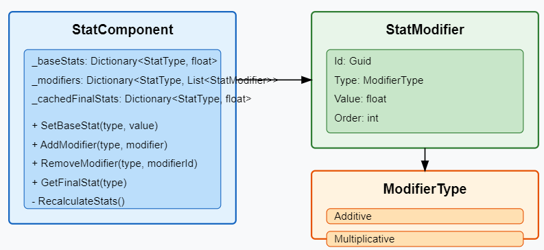
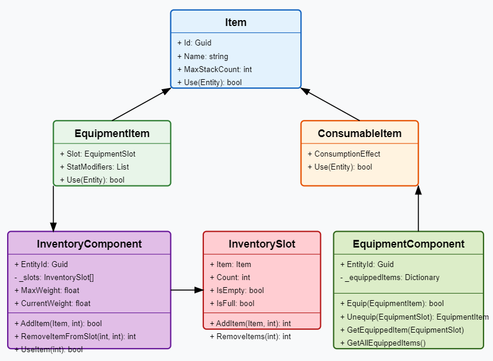
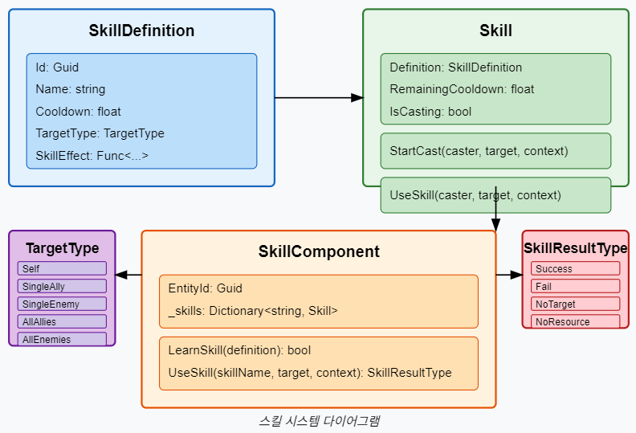
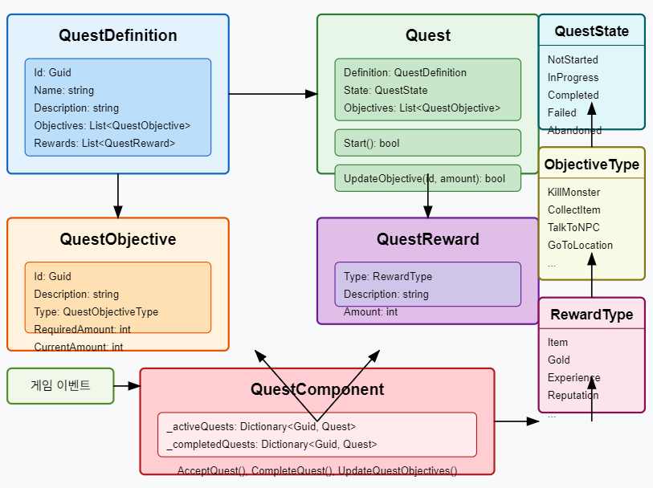
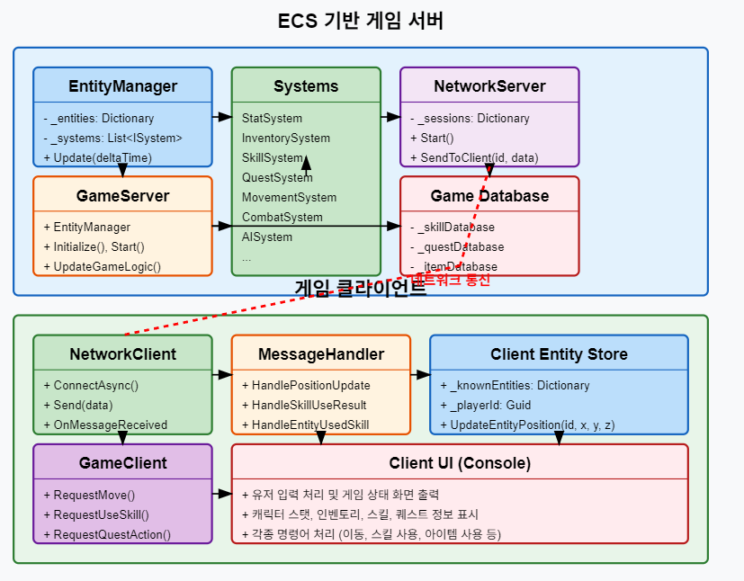

# ECS(Entity-Component-System) 기반 온라인 게임 서버

저자: 최흥배, Claude AI   
    
권장 개발 환경
- **IDE**: Visual Studio 2022 (Community 이상)
- **컴파일러**: .NET 9 이상
- **OS**: Windows 10 이상  
-----    
  
# 제3부: 게임 서버 확장하기  


# 6. 컴포넌트 확장
ECS 기반 게임 서버에서 컴포넌트를 확장하여 게임의 다양한 요소를 구현하는 방법을 설명한다. 먼저 기본적인 ECS 프레임워크를 간략히 살펴본 후, 각 컴포넌트를 구현해본다.

## 기본 ECS 구조
ECS 아키텍처의 기본 인터페이스와 클래스부터 구현한다.

```csharp
// 컴포넌트 인터페이스
public interface IComponent
{
    Guid EntityId { get; set; }
}

// 엔티티 클래스
public class Entity
{
    public Guid Id { get; private set; } = Guid.NewGuid();
    private Dictionary<Type, IComponent> _components = new();

    public T AddComponent<T>() where T : class, IComponent, new()
    {
        var component = new T { EntityId = Id };
        _components[typeof(T)] = component;
        return component;
    }

    public T GetComponent<T>() where T : class, IComponent
    {
        if (_components.TryGetValue(typeof(T), out var component))
            return component as T;
        return null;
    }

    public bool HasComponent<T>() where T : class, IComponent
    {
        return _components.ContainsKey(typeof(T));
    }

    public bool RemoveComponent<T>() where T : class, IComponent
    {
        return _components.Remove(typeof(T));
    }
}

// 기본 시스템 인터페이스
public interface ISystem
{
    void Update(float deltaTime);
}

// 엔티티 관리자
public class EntityManager
{
    private Dictionary<Guid, Entity> _entities = new();
    private List<ISystem> _systems = new();

    public Entity CreateEntity()
    {
        var entity = new Entity();
        _entities[entity.Id] = entity;
        return entity;
    }

    public bool DestroyEntity(Guid entityId)
    {
        return _entities.Remove(entityId);
    }

    public Entity GetEntity(Guid entityId)
    {
        if (_entities.TryGetValue(entityId, out var entity))
            return entity;
        return null;
    }

    public void AddSystem(ISystem system)
    {
        _systems.Add(system);
    }

    public void Update(float deltaTime)
    {
        foreach (var system in _systems)
        {
            system.Update(deltaTime);
        }
    }

    public IEnumerable<Entity> GetEntitiesWith<T>() where T : class, IComponent
    {
        return _entities.Values.Where(e => e.HasComponent<T>());
    }
}
```

## 6.1 캐릭터 스탯 컴포넌트
캐릭터의 기본 능력치를 정의하는 컴포넌트다.

```csharp
// 스탯 타입 열거형
public enum StatType
{
    Health,
    Mana,
    Attack,
    Defense,
    Speed,
    Intelligence,
    Strength,
    Dexterity
}

// 스탯 컴포넌트
public class StatComponent : IComponent
{
    public Guid EntityId { get; set; }
    
    // 기본 스탯 값
    private Dictionary<StatType, float> _baseStats = new();
    
    // 수정자 (장비, 버프 등으로 인한 보너스)
    private Dictionary<StatType, List<StatModifier>> _modifiers = new();
    
    // 계산된 최종 스탯 값 캐시
    private Dictionary<StatType, float> _cachedFinalStats = new();
    
    // 스탯이 변경되었는지 여부
    private bool _isDirty = true;

    public StatComponent()
    {
        // 기본 스탯 초기화
        foreach (StatType stat in Enum.GetValues(typeof(StatType)))
        {
            _baseStats[stat] = 0;
            _modifiers[stat] = new List<StatModifier>();
            _cachedFinalStats[stat] = 0;
        }
    }

    // 기본 스탯 설정
    public void SetBaseStat(StatType type, float value)
    {
        _baseStats[type] = value;
        _isDirty = true;
    }

    // 스탯 수정자 추가
    public void AddModifier(StatType type, StatModifier modifier)
    {
        _modifiers[type].Add(modifier);
        _isDirty = true;
    }

    // 스탯 수정자 제거
    public bool RemoveModifier(StatType type, Guid modifierId)
    {
        bool removed = _modifiers[type].RemoveAll(m => m.Id == modifierId) > 0;
        if (removed)
            _isDirty = true;
        return removed;
    }

    // 최종 스탯 값 계산
    public float GetFinalStat(StatType type)
    {
        if (_isDirty)
            RecalculateStats();
        
        return _cachedFinalStats[type];
    }

    // 모든 스탯 재계산
    private void RecalculateStats()
    {
        foreach (StatType stat in Enum.GetValues(typeof(StatType)))
        {
            float baseValue = _baseStats[stat];
            float additive = 0;
            float multiplicative = 1.0f;
            
            // 수정자 정렬 (값과 우선순위 기준)
            var sortedMods = _modifiers[stat].OrderBy(m => m.Order).ToList();
            
            // 수정자 적용
            foreach (var mod in sortedMods)
            {
                if (mod.Type == ModifierType.Additive)
                    additive += mod.Value;
                else if (mod.Type == ModifierType.Multiplicative)
                    multiplicative *= (1.0f + mod.Value);
            }
            
            // 최종 값 계산
            _cachedFinalStats[stat] = (baseValue + additive) * multiplicative;
        }
        
        _isDirty = false;
    }
}

// 수정자 타입
public enum ModifierType
{
    Additive,       // 더하기 (예: +10 공격력)
    Multiplicative  // 곱하기 (예: 공격력 30% 증가)
}

// 스탯 수정자 클래스
public class StatModifier
{
    public Guid Id { get; private set; } = Guid.NewGuid();
    public ModifierType Type { get; set; }
    public float Value { get; set; }
    public int Order { get; set; }  // 적용 우선순위
    public string Source { get; set; }  // 수정자 출처 (장비, 스킬 등)
    
    public StatModifier(ModifierType type, float value, int order, string source)
    {
        Type = type;
        Value = value;
        Order = order;
        Source = source;
    }
}

// 스탯 시스템
public class StatSystem : ISystem
{
    private readonly EntityManager _entityManager;
    
    public StatSystem(EntityManager entityManager)
    {
        _entityManager = entityManager;
    }
    
    public void Update(float deltaTime)
    {
        // 필요한 경우 여기서 스탯 관련 로직 처리
        // 예: 시간에 따른 HP/MP 재생, 버프 지속시간 감소 등
    }
}
```
  
      
이 StatComponent는 다양한 게임 스탯을 관리하는 강력한 시스템을 제공한다. 기본 스탯과 함께 장비, 스킬, 버프 등에서 오는 추가 수정자를 관리할 수 있다. 특히 수정자는 가산(Additive)과 승산(Multiplicative) 두 가지 방식을 지원하여 다양한 게임 시스템을 구현할 수 있다.
  

## 6.2 인벤토리 시스템
게임에서 아이템을 관리하는 인벤토리 시스템을 구현한다.

```csharp
// 아이템 기본 클래스
public class Item
{
    public Guid Id { get; private set; } = Guid.NewGuid();
    public string Name { get; set; }
    public string Description { get; set; }
    public int MaxStackCount { get; set; } = 1;  // 최대 겹침 수 (기본값: 겹치지 않음)
    public float Weight { get; set; } = 0.0f;
    public Dictionary<string, object> Properties { get; set; } = new();  // 확장 가능한 속성

    // 아이템 사용 메서드 (오버라이드 가능)
    public virtual bool Use(Entity user)
    {
        return false;  // 기본적으로 사용할 수 없음
    }

    // 아이템 복제 메서드
    public virtual Item Clone()
    {
        var clone = new Item
        {
            Name = this.Name,
            Description = this.Description,
            MaxStackCount = this.MaxStackCount,
            Weight = this.Weight
        };

        // 속성 복사
        foreach (var prop in Properties)
        {
            clone.Properties[prop.Key] = prop.Value;
        }

        return clone;
    }
}

// 장비 아이템
public class EquipmentItem : Item
{
    public EquipmentSlot Slot { get; set; }
    public List<StatModifier> StatModifiers { get; set; } = new();

    public override Item Clone()
    {
        var clone = new EquipmentItem
        {
            Name = this.Name,
            Description = this.Description,
            MaxStackCount = 1,  // 장비는 항상 겹치지 않음
            Weight = this.Weight,
            Slot = this.Slot
        };

        // 속성 복사
        foreach (var prop in Properties)
        {
            clone.Properties[prop.Key] = prop.Value;
        }

        // 스탯 수정자 복사
        foreach (var mod in StatModifiers)
        {
            clone.StatModifiers.Add(new StatModifier(
                mod.Type, mod.Value, mod.Order, mod.Source));
        }

        return clone;
    }

    public override bool Use(Entity user)
    {
        // 장비 착용 로직
        var equipComponent = user.GetComponent<EquipmentComponent>();
        if (equipComponent == null)
            return false;

        return equipComponent.Equip(this);
    }
}

// 소비 아이템
public class ConsumableItem : Item
{
    public Action<Entity> ConsumptionEffect { get; set; }

    public override Item Clone()
    {
        var clone = new ConsumableItem
        {
            Name = this.Name,
            Description = this.Description,
            MaxStackCount = this.MaxStackCount,
            Weight = this.Weight,
            ConsumptionEffect = this.ConsumptionEffect
        };

        // 속성 복사
        foreach (var prop in Properties)
        {
            clone.Properties[prop.Key] = prop.Value;
        }

        return clone;
    }

    public override bool Use(Entity user)
    {
        ConsumptionEffect?.Invoke(user);
        return true;
    }
}

// 장비 슬롯 정의
public enum EquipmentSlot
{
    Head,
    Chest,
    Legs,
    Feet,
    Hands,
    MainHand,
    OffHand,
    Neck,
    Ring1,
    Ring2
}

// 인벤토리 슬롯 클래스
public class InventorySlot
{
    public Item Item { get; private set; }
    public int Count { get; private set; }

    public bool IsEmpty => Item == null || Count <= 0;
    public bool IsFull => !IsEmpty && Count >= Item.MaxStackCount;

    // 아이템 추가
    public int AddItem(Item item, int count = 1)
    {
        if (IsEmpty)
        {
            Item = item;
            Count = Math.Min(count, item.MaxStackCount);
            return count - Count;  // 넘치는 양 반환
        }
        else if (Item.Id == item.Id && !IsFull)
        {
            int spaceLeft = Item.MaxStackCount - Count;
            int added = Math.Min(count, spaceLeft);
            Count += added;
            return count - added;  // 넘치는 양 반환
        }
        
        return count;  // 추가 실패, 모두 넘침
    }

    // 아이템 제거
    public int RemoveItems(int count)
    {
        if (IsEmpty)
            return 0;

        int removed = Math.Min(Count, count);
        Count -= removed;

        if (Count <= 0)
            Item = null;  // 아이템이 없어지면 슬롯 비움

        return removed;
    }

    // 아이템 모두 제거
    public void Clear()
    {
        Item = null;
        Count = 0;
    }
}

// 인벤토리 컴포넌트
public class InventoryComponent : IComponent
{
    public Guid EntityId { get; set; }
    
    private InventorySlot[] _slots;
    public float MaxWeight { get; set; } = 100.0f;  // 최대 무게
    public float CurrentWeight { get; private set; }
    
    public int SlotCount => _slots.Length;

    // 이벤트
    public event Action<int, Item, int> OnItemAdded;  // 슬롯, 아이템, 개수
    public event Action<int, Item, int> OnItemRemoved;  // 슬롯, 아이템, 개수
    public event Action<float> OnWeightChanged;  // 현재 무게

    public InventoryComponent(int slotCount = 20)
    {
        _slots = new InventorySlot[slotCount];
        for (int i = 0; i < slotCount; i++)
        {
            _slots[i] = new InventorySlot();
        }
    }

    // 슬롯 가져오기
    public InventorySlot GetSlot(int index)
    {
        if (index < 0 || index >= _slots.Length)
            return null;
        
        return _slots[index];
    }

    // 아이템 추가 (자동 슬롯 찾기)
    public bool AddItem(Item item, int count = 1)
    {
        if (item == null || count <= 0)
            return false;

        // 무게 확인
        if (CurrentWeight + (item.Weight * count) > MaxWeight)
            return false;

        int remaining = count;
        
        // 1단계: 같은 아이템이 있는 슬롯에 먼저 채우기
        for (int i = 0; i < _slots.Length && remaining > 0; i++)
        {
            if (!_slots[i].IsEmpty && _slots[i].Item.Id == item.Id && !_slots[i].IsFull)
            {
                int before = remaining;
                remaining = _slots[i].AddItem(item, remaining);
                int added = before - remaining;
                
                if (added > 0)
                {
                    CurrentWeight += item.Weight * added;
                    OnItemAdded?.Invoke(i, item, added);
                    OnWeightChanged?.Invoke(CurrentWeight);
                }
            }
        }
        
        // 2단계: 빈 슬롯에 채우기
        for (int i = 0; i < _slots.Length && remaining > 0; i++)
        {
            if (_slots[i].IsEmpty)
            {
                // 새 아이템 인스턴스 생성 (원본 참조 방지)
                Item newItem = item.Clone();
                
                int before = remaining;
                remaining = _slots[i].AddItem(newItem, remaining);
                int added = before - remaining;
                
                if (added > 0)
                {
                    CurrentWeight += item.Weight * added;
                    OnItemAdded?.Invoke(i, newItem, added);
                    OnWeightChanged?.Invoke(CurrentWeight);
                }
            }
        }
        
        return remaining < count;  // 하나라도 추가됐으면 성공
    }

    // 특정 슬롯에서 아이템 제거
    public int RemoveItemFromSlot(int slotIndex, int count = 1)
    {
        if (slotIndex < 0 || slotIndex >= _slots.Length)
            return 0;
        
        var slot = _slots[slotIndex];
        if (slot.IsEmpty)
            return 0;
        
        Item item = slot.Item;
        int removed = slot.RemoveItems(count);
        
        if (removed > 0)
        {
            CurrentWeight -= item.Weight * removed;
            OnItemRemoved?.Invoke(slotIndex, item, removed);
            OnWeightChanged?.Invoke(CurrentWeight);
        }
        
        return removed;
    }

    // 아이템 사용
    public bool UseItem(int slotIndex)
    {
        if (slotIndex < 0 || slotIndex >= _slots.Length)
            return false;
        
        var slot = _slots[slotIndex];
        if (slot.IsEmpty)
            return false;
        
        Entity entity = null;  // 엔티티 가져오기
        var entityManager = GameServer.Instance.EntityManager;  // 샘플용 싱글톤 참조
        entity = entityManager.GetEntity(EntityId);
        
        if (entity == null)
            return false;
        
        bool used = slot.Item.Use(entity);
        
        if (used)
        {
            // 소비 아이템이라면 개수 감소
            if (slot.Item is ConsumableItem)
            {
                RemoveItemFromSlot(slotIndex, 1);
            }
        }
        
        return used;
    }
}

// 장비 컴포넌트
public class EquipmentComponent : IComponent
{
    public Guid EntityId { get; set; }
    
    private Dictionary<EquipmentSlot, EquipmentItem> _equippedItems = new();
    
    // 이벤트
    public event Action<EquipmentSlot, EquipmentItem> OnItemEquipped;
    public event Action<EquipmentSlot, EquipmentItem> OnItemUnequipped;

    // 장비 착용
    public bool Equip(EquipmentItem item)
    {
        if (item == null)
            return false;
        
        // 이미 같은 슬롯에 장비가 있으면 해제
        if (_equippedItems.TryGetValue(item.Slot, out var oldItem))
        {
            Unequip(item.Slot);
        }
        
        _equippedItems[item.Slot] = item;
        
        // 엔티티의 스탯 컴포넌트에 수정자 적용
        Entity entity = null;
        var entityManager = GameServer.Instance.EntityManager;  // 샘플용 싱글톤 참조
        entity = entityManager.GetEntity(EntityId);
        
        if (entity != null)
        {
            var statComponent = entity.GetComponent<StatComponent>();
            if (statComponent != null)
            {
                foreach (var mod in item.StatModifiers)
                {
                    // 스탯 종류와 수정자 설정
                    // (예시: 여기서는 하드코딩된 StatType.Attack 사용)
                    statComponent.AddModifier(StatType.Attack, mod);
                }
            }
        }
        
        OnItemEquipped?.Invoke(item.Slot, item);
        return true;
    }

    // 장비 해제
    public EquipmentItem Unequip(EquipmentSlot slot)
    {
        if (!_equippedItems.TryGetValue(slot, out var item))
            return null;
        
        _equippedItems.Remove(slot);
        
        // 엔티티의 스탯 컴포넌트에서 수정자 제거
        Entity entity = null;
        var entityManager = GameServer.Instance.EntityManager;
        entity = entityManager.GetEntity(EntityId);
        
        if (entity != null)
        {
            var statComponent = entity.GetComponent<StatComponent>();
            if (statComponent != null)
            {
                foreach (var mod in item.StatModifiers)
                {
                    // 스탯 종류와 수정자 ID로 제거
                    // (예시: 여기서는 하드코딩된 StatType.Attack 사용)
                    statComponent.RemoveModifier(StatType.Attack, mod.Id);
                }
            }
        }
        
        OnItemUnequipped?.Invoke(slot, item);
        return item;
    }

    // 착용 중인 장비 가져오기
    public EquipmentItem GetEquippedItem(EquipmentSlot slot)
    {
        _equippedItems.TryGetValue(slot, out var item);
        return item;
    }

    // 모든 착용 장비 가져오기
    public IReadOnlyDictionary<EquipmentSlot, EquipmentItem> GetAllEquippedItems()
    {
        return _equippedItems;
    }
}
```
  
     
인벤토리 시스템은 게임에서 아이템을 관리하는 핵심 기능이다. 위 구현에서는 아이템의 기본 클래스를 정의하고, 이를 상속하여 장비와 소비 아이템을 구현했다. 인벤토리 컴포넌트는 슬롯 기반으로 아이템을 관리하며, 무게 제한과 같은 현실적인 제약사항도 포함했다.

이벤트 시스템을 통해 아이템 추가/제거 등의 변경사항을 다른 시스템에 알릴 수 있어, UI 업데이트나 성취 시스템과 같은 외부 시스템과의 연동이 용이하다.
  

## 6.3 스킬 시스템
캐릭터가 사용할 수 있는 스킬 시스템을 구현한다.

```csharp
// 스킬 타겟 타입
public enum TargetType
{
    Self,       // 자기 자신
    SingleAlly, // 단일 아군
    SingleEnemy,// 단일 적
    AllAllies,  // 모든 아군
    AllEnemies, // 모든 적
    Area        // 지정 영역
}

// 스킬 사용 결과
public enum SkillResultType
{
    Success,    // 성공
    Fail,       // 실패 (조건 불만족, 쿨타임 등)
    NoTarget,   // 타겟 없음
    NoResource  // 자원 부족 (마나 등)
}

// 스킬 정의 클래스
public class SkillDefinition
{
    public Guid Id { get; private set; } = Guid.NewGuid();
    public string Name { get; set; }
    public string Description { get; set; }
    public int Level { get; set; } = 1;
    public float Cooldown { get; set; } = 0.0f;  // 재사용 대기시간 (초)
    public float CastTime { get; set; } = 0.0f;  // 시전 시간 (초)
    public TargetType TargetType { get; set; } = TargetType.Self;
    public float Range { get; set; } = 0.0f;     // 사정거리
    public float AreaRadius { get; set; } = 0.0f; // 범위 공격 시 반경
    
    // 비용 (예: 마나, 분노 등)
    public Dictionary<StatType, float> Costs { get; set; } = new();
    
    // 스킬 효과 (델리게이트)
    public Func<Entity, Entity, SkillContext, SkillResultType> SkillEffect { get; set; }
    
    // 스킬 효과 데이터
    public Dictionary<string, object> EffectData { get; set; } = new();
    
    // 스킬 아이콘, 이펙트 등 (클라이언트용)
    public string IconPath { get; set; }
    public string EffectPath { get; set; }
    
    // 요구 조건 (레벨, 다른 스킬 등)
    public Dictionary<string, object> Requirements { get; set; } = new();
}

// 스킬 인스턴스 클래스
public class Skill
{
    private readonly SkillDefinition _definition;
    
    public Guid Id { get; private set; } = Guid.NewGuid();
    public SkillDefinition Definition => _definition;
    public float RemainingCooldown { get; private set; } = 0.0f;
    public bool IsOnCooldown => RemainingCooldown > 0.0f;
    public bool IsCasting { get; private set; } = false;
    public float RemainingCastTime { get; private set; } = 0.0f;
    
    public Skill(SkillDefinition definition)
    {
        _definition = definition;
    }
    
    // 쿨다운 업데이트
    public void UpdateCooldown(float deltaTime)
    {
        if (RemainingCooldown > 0)
        {
            RemainingCooldown = Math.Max(0, RemainingCooldown - deltaTime);
        }
        
        if (IsCasting)
        {
            RemainingCastTime = Math.Max(0, RemainingCastTime - deltaTime);
            if (RemainingCastTime <= 0)
            {
                IsCasting = false;
                // 캐스팅 완료 시 로직 (이벤트 발생 등)
            }
        }
    }
    
    // 스킬 사용 시작
    public SkillResultType StartCast(Entity caster, Entity target, SkillContext context)
    {
        // 쿨다운 확인
        if (IsOnCooldown)
            return SkillResultType.Fail;
        
        // 비용 확인
        var statComponent = caster.GetComponent<StatComponent>();
        if (statComponent != null)
        {
            foreach (var cost in Definition.Costs)
            {
                float currentValue = statComponent.GetFinalStat(cost.Key);
                if (currentValue < cost.Value)
                {
                    return SkillResultType.NoResource;
                }
            }
        }
        
        // 캐스팅 시작
        if (Definition.CastTime > 0)
        {
            IsCasting = true;
            RemainingCastTime = Definition.CastTime;
            // 캐스팅 시작 이벤트 발생 등
            return SkillResultType.Success;
        }
        
        // 즉시 시전 스킬은 바로 효과 적용
        return UseSkill(caster, target, context);
    }
    
    // 캐스팅 취소
    public void CancelCast()
    {
        if (IsCasting)
        {
            IsCasting = false;
            RemainingCastTime = 0;
            // 캐스팅 취소 이벤트 발생 등
        }
    }
    
    // 스킬 효과 적용
    public SkillResultType UseSkill(Entity caster, Entity target, SkillContext context)
    {
        // 비용 소모
        var statComponent = caster.GetComponent<StatComponent>();
        if (statComponent != null)
        {
            foreach (var cost in Definition.Costs)
            {
                // 임시 구현: 단순히 스탯 값을 감소
                // 실제로는 스탯별 특수 처리 필요
                float currentValue = statComponent.GetFinalStat(cost.Key);
                // 감소 로직 (예시)
                // statComponent.SetBaseStat(cost.Key, currentValue - cost.Value);
            }
        }
        
        // 스킬 효과 적용
        SkillResultType result = SkillResultType.Fail;
        if (Definition.SkillEffect != null)
        {
            result = Definition.SkillEffect(caster, target, context);
        }
        
        // 성공한 경우 쿨다운 적용
        if (result == SkillResultType.Success)
        {
            RemainingCooldown = Definition.Cooldown;
        }
        
        return result;
    }
}

// 스킬 사용 컨텍스트
public class SkillContext
{
    public Vector3 TargetPosition { get; set; }  // 목표 위치 (범위 스킬용)
    public List<Entity> AdditionalTargets { get; set; } = new();  // 추가 타겟
    public Dictionary<string, object> Parameters { get; set; } = new();  // 추가 파라미터
}

// 스킬 컴포넌트
public class SkillComponent : IComponent
{
    public Guid EntityId { get; set; }
    
    private Dictionary<string, Skill> _skills = new();
    private Skill _currentCastingSkill;
    
    // 이벤트
    public event Action<Skill> OnSkillLearned;
    public event Action<Skill, SkillResultType> OnSkillUsed;
    public event Action<Skill> OnCastingStarted;
    public event Action<Skill> OnCastingCompleted;
    public event Action<Skill> OnCastingCancelled;
    
    // 스킬 학습
    public bool LearnSkill(SkillDefinition definition)
    {
        if (definition == null || _skills.ContainsKey(definition.Name))
            return false;
        
        // 요구 조건 확인 로직
        // ...
        
        var skill = new Skill(definition);
        _skills[definition.Name] = skill;
        
        OnSkillLearned?.Invoke(skill);
        return true;
    }
    
    // 스킬 사용
    public SkillResultType UseSkill(string skillName, Entity target, SkillContext context = null)
    {
        if (!_skills.TryGetValue(skillName, out var skill))
            return SkillResultType.Fail;
        
        if (skill.IsOnCooldown)
            return SkillResultType.Fail;
        
        if (context == null)
            context = new SkillContext();
        
        Entity caster = null;
        var entityManager = GameServer.Instance.EntityManager;
        caster = entityManager.GetEntity(EntityId);
        
        if (caster == null)
            return SkillResultType.Fail;
        
        // 시전 시작
        SkillResultType result = skill.StartCast(caster, target, context);
        
        if (result == SkillResultType.Success)
        {
            if (skill.IsCasting)
            {
                _currentCastingSkill = skill;
                OnCastingStarted?.Invoke(skill);
            }
            else
            {
                OnSkillUsed?.Invoke(skill, result);
            }
        }
        
        return result;
    }
    
    // 시전 중인 스킬 취소
    public void CancelCasting()
    {
        if (_currentCastingSkill != null && _currentCastingSkill.IsCasting)
        {
            _currentCastingSkill.CancelCast();
            OnCastingCancelled?.Invoke(_currentCastingSkill);
            _currentCastingSkill = null;
        }
    }
    
    // 스킬 업데이트 (쿨다운 등)
    public void Update(float deltaTime)
    {
        foreach (var skill in _skills.Values)
        {
            skill.UpdateCooldown(deltaTime);
            
            // 캐스팅 완료 확인
            if (_currentCastingSkill == skill && skill.IsCasting == false && _currentCastingSkill != null)
            {
                // 캐스팅 완료, 스킬 효과 적용
                Entity caster = null;
                Entity target = null;  // 타겟 정보는 별도로 저장되어야 함
                
                var entityManager = GameServer.Instance.EntityManager;
                caster = entityManager.GetEntity(EntityId);
                
                if (caster != null)
                {
                    SkillContext context = new SkillContext();  // 컨텍스트 정보도 별도 저장 필요
                    SkillResultType result = skill.UseSkill(caster, target, context);
                    OnSkillUsed?.Invoke(skill, result);
                }
                
                OnCastingCompleted?.Invoke(skill);
                _currentCastingSkill = null;
            }
        }
    }
    
    // 스킬 가져오기
    public Skill GetSkill(string skillName)
    {
        _skills.TryGetValue(skillName, out var skill);
        return skill;
    }
    
    // 모든 스킬 가져오기
    public IReadOnlyCollection<Skill> GetAllSkills()
    {
        return _skills.Values;
    }
}

// 스킬 시스템
public class SkillSystem : ISystem
{
    private readonly EntityManager _entityManager;
    
    public SkillSystem(EntityManager entityManager)
    {
        _entityManager = entityManager;
    }
    
    public void Update(float deltaTime)
    {
        // 모든 스킬 컴포넌트 업데이트
        foreach (var entity in _entityManager.GetEntitiesWith<SkillComponent>())
        {
            var skillComponent = entity.GetComponent<SkillComponent>();
            skillComponent.Update(deltaTime);
        }
    }
}
```
  
   

스킬 시스템은 게임 캐릭터의 능력을 다양하게 확장할 수 있는 중요한 컴포넌트다. 위 구현에서는 스킬의 정의(SkillDefinition)와 인스턴스(Skill)를 분리하여, 동일한 스킬을 여러 캐릭터가 사용할 수 있게 했다.

주요 특징:
1. 다양한 타겟 타입 지원 (자신, 단일 적, 범위 등)
2. 캐스팅 시스템 (즉시 시전 및 시전 시간)
3. 쿨다운 관리
4. 스킬 비용 시스템
5. 이벤트 기반 알림 (스킬 사용, 캐스팅 시작/완료 등)

스킬 효과는 델리게이트(Func)를 통해 구현하므로, 게임에 맞는 다양한 효과를 쉽게 추가할 수 있다.

## 6.4 퀘스트 컴포넌트

게임에서 퀘스트를 관리하는 컴포넌트를 구현한다.

```csharp
// 퀘스트 상태
public enum QuestState
{
    NotStarted,
    InProgress,
    Completed,
    Failed,
    Abandoned
}

// 퀘스트 목표 타입
public enum QuestObjectiveType
{
    KillMonster,
    CollectItem,
    TalkToNPC,
    GoToLocation,
    EscortNPC,
    DefendLocation,
    UseSkill,
    CompleteQuest,  // 다른 퀘스트 완료
    Custom          // 사용자 정의 목표
}

// 퀘스트 목표
public class QuestObjective
{
    public Guid Id { get; private set; } = Guid.NewGuid();
    public string Description { get; set; }
    public QuestObjectiveType Type { get; set; }
    public int RequiredAmount { get; set; } = 1;
    public int CurrentAmount { get; set; } = 0;
    public bool IsOptional { get; set; } = false;
    public bool IsCompleted => CurrentAmount >= RequiredAmount;
    
    // 목표 관련 데이터 (몬스터 ID, 아이템 ID 등)
    public Dictionary<string, object> ObjectiveData { get; set; } = new();
    
    // 목표 진행 메서드
    public bool UpdateProgress(int amount = 1)
    {
        CurrentAmount = Math.Min(RequiredAmount, CurrentAmount + amount);
        return IsCompleted;
    }
    
    // 목표 리셋
    public void Reset()
    {
        CurrentAmount = 0;
    }
}

// 퀘스트 보상 타입
public enum RewardType
{
    Item,
    Gold,
    Experience,
    Reputation,
    Skill,
    Stat,
    Custom
}

// 퀘스트 보상
public class QuestReward
{
    public RewardType Type { get; set; }
    public string Description { get; set; }
    public int Amount { get; set; }
    
    // 보상 관련 데이터 (아이템 ID 등)
    public Dictionary<string, object> RewardData { get; set; } = new();
}

// 퀘스트 정의
public class QuestDefinition
{
    public Guid Id { get; private set; } = Guid.NewGuid();
    public string Name { get; set; }
    public string Description { get; set; }
    public int MinLevel { get; set; } = 1;
    public bool IsRepeatable { get; set; } = false;
    public List<QuestObjective> Objectives { get; set; } = new();
    public List<QuestReward> Rewards { get; set; } = new();
    
    // 선행 퀘스트 요구사항
    public List<Guid> PrerequisiteQuests { get; set; } = new();
    
    // 후속 퀘스트
    public List<Guid> FollowUpQuests { get; set; } = new();
    
    // 시작/완료 NPC
    public Guid StartNpcId { get; set; }
    public Guid CompleteNpcId { get; set; }
    
    // 퀘스트 시작 이벤트
    public Action<Quest> OnQuestStarted { get; set; }
    
    // 퀘스트 완료 이벤트
    public Action<Quest> OnQuestCompleted { get; set; }
    
    // 퀘스트 실패 이벤트
    public Action<Quest> OnQuestFailed { get; set; }
}

// 퀘스트 인스턴스
public class Quest
{
    private readonly QuestDefinition _definition;
    
    public Guid Id { get; private set; } = Guid.NewGuid();
    public QuestDefinition Definition => _definition;
    public QuestState State { get; private set; } = QuestState.NotStarted;
    public DateTime StartTime { get; private set; }
    public DateTime? CompleteTime { get; private set; }
    public List<QuestObjective> Objectives { get; private set; } = new();
    
    // 이벤트
    public event Action<Quest> OnStarted;
    public event Action<Quest> OnCompleted;
    public event Action<Quest> OnFailed;
    public event Action<Quest> OnAbandoned;
    public event Action<Quest, QuestObjective> OnObjectiveCompleted;
    public event Action<Quest, QuestObjective, int> OnObjectiveUpdated;
    
    public Quest(QuestDefinition definition)
    {
        _definition = definition;
        
        // 목표 복사
        foreach (var sourceObjective in definition.Objectives)
        {
            var objective = new QuestObjective
            {
                Description = sourceObjective.Description,
                Type = sourceObjective.Type,
                RequiredAmount = sourceObjective.RequiredAmount,
                IsOptional = sourceObjective.IsOptional
            };
            
            // 목표 데이터 복사
            foreach (var data in sourceObjective.ObjectiveData)
            {
                objective.ObjectiveData[data.Key] = data.Value;
            }
            
            Objectives.Add(objective);
        }
    }
    
    // 퀘스트 시작
    public bool Start()
    {
        if (State != QuestState.NotStarted)
            return false;
        
        State = QuestState.InProgress;
        StartTime = DateTime.UtcNow;
        
        Definition.OnQuestStarted?.Invoke(this);
        OnStarted?.Invoke(this);
        
        return true;
    }
    
    // 목표 진행 업데이트
    public bool UpdateObjective(Guid objectiveId, int amount = 1)
    {
        if (State != QuestState.InProgress)
            return false;
        
        var objective = Objectives.FirstOrDefault(o => o.Id == objectiveId);
        if (objective == null)
            return false;
        
        int oldAmount = objective.CurrentAmount;
        bool completed = objective.UpdateProgress(amount);
        
        OnObjectiveUpdated?.Invoke(this, objective, objective.CurrentAmount - oldAmount);
        
        if (completed)
        {
            OnObjectiveCompleted?.Invoke(this, objective);
            CheckQuestCompletion();
        }
        
        return true;
    }
    
    // 퀘스트 완료 조건 확인
    private void CheckQuestCompletion()
    {
        // 필수 목표가 모두 완료되었는지 확인
        bool allRequiredCompleted = Objectives
            .Where(o => !o.IsOptional)
            .All(o => o.IsCompleted);
        
        if (allRequiredCompleted)
        {
            Complete();
        }
    }
    
    // 퀘스트 완료
    public bool Complete()
    {
        if (State != QuestState.InProgress)
            return false;
        
        State = QuestState.Completed;
        CompleteTime = DateTime.UtcNow;
        
        Definition.OnQuestCompleted?.Invoke(this);
        OnCompleted?.Invoke(this);
        
        return true;
    }
    
    // 퀘스트 실패
    public bool Fail()
    {
        if (State != QuestState.InProgress)
            return false;
        
        State = QuestState.Failed;
        
        Definition.OnQuestFailed?.Invoke(this);
        OnFailed?.Invoke(this);
        
        return true;
    }
    
    // 퀘스트 포기
    public bool Abandon()
    {
        if (State != QuestState.InProgress)
            return false;
        
        State = QuestState.Abandoned;
        
        OnAbandoned?.Invoke(this);
        
        return true;
    }
    
    // 퀘스트 리셋 (재시작 가능한 퀘스트용)
    public bool Reset()
    {
        if (!Definition.IsRepeatable)
            return false;
        
        foreach (var objective in Objectives)
        {
            objective.Reset();
        }
        
        State = QuestState.NotStarted;
        StartTime = default;
        CompleteTime = null;
        
        return true;
    }
}

// 퀘스트 컴포넌트
public class QuestComponent : IComponent
{
    public Guid EntityId { get; set; }
    
    private Dictionary<Guid, Quest> _activeQuests = new();
    private Dictionary<Guid, Quest> _completedQuests = new();
    private Dictionary<Guid, Quest> _failedQuests = new();
    
    // 이벤트
    public event Action<Quest> OnQuestAccepted;
    public event Action<Quest> OnQuestCompleted;
    public event Action<Quest> OnQuestFailed;
    public event Action<Quest> OnQuestAbandoned;
    public event Action<Quest, QuestObjective> OnObjectiveCompleted;
    
    // 퀘스트 수락
    public bool AcceptQuest(QuestDefinition definition)
    {
        if (definition == null)
            return false;
        
        // 이미 진행 중이거나 완료한 퀘스트인지 확인
        if (_activeQuests.ContainsKey(definition.Id) || 
            (_completedQuests.ContainsKey(definition.Id) && !definition.IsRepeatable))
        {
            return false;
        }
        
        // 레벨 요구사항 확인
        Entity entity = null;
        var entityManager = GameServer.Instance.EntityManager;
        entity = entityManager.GetEntity(EntityId);
        
        if (entity != null)
        {
            // 예시: 레벨 확인 로직
            // var statComponent = entity.GetComponent<StatComponent>();
            // if (statComponent != null && statComponent.Level < definition.MinLevel)
            //     return false;
        }
        
        // 선행 퀘스트 완료 여부 확인
        foreach (var prerequisiteId in definition.PrerequisiteQuests)
        {
            if (!_completedQuests.ContainsKey(prerequisiteId))
                return false;
        }
        
        // 새 퀘스트 생성 및 시작
        var quest = new Quest(definition);
        
        // 이벤트 연결
        quest.OnCompleted += OnQuestCompletedHandler;
        quest.OnFailed += OnQuestFailedHandler;
        quest.OnAbandoned += OnQuestAbandonedHandler;
        quest.OnObjectiveCompleted += OnObjectiveCompletedHandler;
        
        if (quest.Start())
        {
            _activeQuests[definition.Id] = quest;
            OnQuestAccepted?.Invoke(quest);
            return true;
        }
        
        return false;
    }
    
    // 퀘스트 완료 처리
    public bool CompleteQuest(Guid questId)
    {
        if (!_activeQuests.TryGetValue(questId, out var quest))
            return false;
        
        // 퀘스트 완료 조건 확인
        bool allRequiredCompleted = quest.Objectives
            .Where(o => !o.IsOptional)
            .All(o => o.IsCompleted);
        
        if (!allRequiredCompleted)
            return false;
        
        // 보상 지급
        GiveRewards(quest);
        
        // 퀘스트 완료 처리
        if (quest.Complete())
        {
            _activeQuests.Remove(questId);
            _completedQuests[questId] = quest;
            return true;
        }
        
        return false;
    }
    
    // 퀘스트 포기
    public bool AbandonQuest(Guid questId)
    {
        if (!_activeQuests.TryGetValue(questId, out var quest))
            return false;
        
        if (quest.Abandon())
        {
            _activeQuests.Remove(questId);
            return true;
        }
        
        return false;
    }
    
    // 퀘스트 목표 업데이트
    public void UpdateQuestObjectives(QuestObjectiveType type, Dictionary<string, object> data, int amount = 1)
    {
        foreach (var quest in _activeQuests.Values)
        {
            foreach (var objective in quest.Objectives)
            {
                if (objective.Type == type && !objective.IsCompleted)
                {
                    // 목표 데이터 확인
                    bool dataMatches = true;
                    foreach (var requiredData in objective.ObjectiveData)
                    {
                        if (!data.TryGetValue(requiredData.Key, out var value) || 
                            !Equals(value, requiredData.Value))
                        {
                            dataMatches = false;
                            break;
                        }
                    }
                    
                    if (dataMatches)
                    {
                        quest.UpdateObjective(objective.Id, amount);
                    }
                }
            }
        }
    }
    
    // 보상 지급
    private void GiveRewards(Quest quest)
    {
        Entity entity = null;
        var entityManager = GameServer.Instance.EntityManager;
        entity = entityManager.GetEntity(EntityId);
        
        if (entity == null)
            return;
        
        foreach (var reward in quest.Definition.Rewards)
        {
            switch (reward.Type)
            {
                case RewardType.Item:
                    // 아이템 지급
                    if (reward.RewardData.TryGetValue("ItemId", out var itemIdObj) && 
                        itemIdObj is Guid itemId)
                    {
                        var inventoryComponent = entity.GetComponent<InventoryComponent>();
                        if (inventoryComponent != null)
                        {
                            // 예시: 아이템 생성 및 지급
                            // var item = ItemDatabase.GetItem(itemId);
                            // if (item != null)
                            //    inventoryComponent.AddItem(item, reward.Amount);
                        }
                    }
                    break;
                
                case RewardType.Experience:
                    // 경험치 지급
                    // ...
                    break;
                
                case RewardType.Gold:
                    // 골드 지급
                    // ...
                    break;
                
                // 기타 보상 처리
                // ...
            }
        }
    }
    
    // 이벤트 핸들러
    private void OnQuestCompletedHandler(Quest quest)
    {
        OnQuestCompleted?.Invoke(quest);
        
        // 후속 퀘스트 자동 수락 (옵션)
        foreach (var followUpId in quest.Definition.FollowUpQuests)
        {
            // 퀘스트 정의 가져오기
            // var followUpDefinition = QuestDatabase.GetQuest(followUpId);
            // if (followUpDefinition != null)
            //    AcceptQuest(followUpDefinition);
        }
    }
    
    private void OnQuestFailedHandler(Quest quest)
    {
        _activeQuests.Remove(quest.Definition.Id);
        _failedQuests[quest.Definition.Id] = quest;
        OnQuestFailed?.Invoke(quest);
    }
    
    private void OnQuestAbandonedHandler(Quest quest)
    {
        _activeQuests.Remove(quest.Definition.Id);
        OnQuestAbandoned?.Invoke(quest);
    }
    
    private void OnObjectiveCompletedHandler(Quest quest, QuestObjective objective)
    {
        OnObjectiveCompleted?.Invoke(quest, objective);
    }
    
    // 퀘스트 데이터 가져오기
    public Quest GetQuest(Guid questId)
    {
        if (_activeQuests.TryGetValue(questId, out var activeQuest))
            return activeQuest;
        
        if (_completedQuests.TryGetValue(questId, out var completedQuest))
            return completedQuest;
        
        if (_failedQuests.TryGetValue(questId, out var failedQuest))
            return failedQuest;
        
        return null;
    }
    
    // 활성 퀘스트 목록
    public IReadOnlyCollection<Quest> GetActiveQuests()
    {
        return _activeQuests.Values;
    }
    
    // 완료 퀘스트 목록
    public IReadOnlyCollection<Quest> GetCompletedQuests()
    {
        return _completedQuests.Values;
    }
}

// 퀘스트 시스템
public class QuestSystem : ISystem
{
    private readonly EntityManager _entityManager;
    
    public QuestSystem(EntityManager entityManager)
    {
        _entityManager = entityManager;
    }
    
    public void Update(float deltaTime)
    {
        // 필요한 경우 여기서 퀘스트 관련 로직 처리
        // 예: 시간 제한 퀘스트 체크, 자동 실패 조건 확인 등
    }
    
    // 게임 이벤트 발생 시 모든 관련 퀘스트 업데이트
    public void NotifyEvent(QuestObjectiveType type, Dictionary<string, object> data, int amount = 1)
    {
        foreach (var entity in _entityManager.GetEntitiesWith<QuestComponent>())
        {
            var questComponent = entity.GetComponent<QuestComponent>();
            questComponent.UpdateQuestObjectives(type, data, amount);
        }
    }
}
```
  
     
퀘스트 시스템은 게임에서 플레이어에게 목표를 제공하고 스토리라인을 진행시키는 핵심 요소다. 위 구현은 유연한 퀘스트 시스템을 제공하며, 다양한 목표 타입과 보상을 지원한다.
  

## 7. 컴포넌트 통합과 실제 사용 예제
지금까지 구현한 여러 컴포넌트를 통합하여 실제 게임 서버에서 활용하는 방법을 살펴본다.

### 7.1 게임 서버 초기화

```csharp
using System;
using System.Collections.Generic;
using System.Net;
using System.Threading;
using System.Threading.Tasks;

// 게임 서버 클래스
public class GameServer
{
    private static GameServer _instance;
    public static GameServer Instance => _instance ??= new GameServer();

    // ECS 관련
    public EntityManager EntityManager { get; private set; }
    private List<ISystem> _systems = new();
    
    // 네트워크 관련 (인터페이스만 구현)
    private INetworkServer _networkServer;
    private Dictionary<Guid, NetworkSession> _sessions = new();
    
    // 데이터베이스 (간단한 인메모리 구현)
    private Dictionary<Guid, SkillDefinition> _skillDatabase = new();
    private Dictionary<Guid, QuestDefinition> _questDatabase = new();
    private Dictionary<Guid, Item> _itemDatabase = new();
    
    // 게임 로직 업데이트 타이머
    private Timer _updateTimer;
    private long _lastUpdateTimeTicks;
    private float _deltaTime;
    
    // 서버 상태
    private bool _isRunning;
    
    private GameServer()
    {
        // 싱글턴 패턴
    }
    
    // 서버 초기화
    public void Initialize(IPEndPoint endpoint, int maxConnections)
    {
        Console.WriteLine("게임 서버 초기화 중...");
        
        // ECS 초기화
        EntityManager = new EntityManager();
        
        // 시스템 등록
        RegisterSystems();
        
        // 게임 데이터 로드
        LoadGameData();
        
        // 네트워크 초기화 (간단한 더미 구현)
        _networkServer = new NetworkServerImpl(endpoint, maxConnections);
        _networkServer.OnClientConnected += OnClientConnected;
        _networkServer.OnClientDisconnected += OnClientDisconnected;
        _networkServer.OnMessageReceived += OnMessageReceived;
        
        Console.WriteLine("게임 서버 초기화 완료!");
    }
    
    // 시스템 등록
    private void RegisterSystems()
    {
        // 기본 시스템 등록
        var statSystem = new StatSystem(EntityManager);
        _systems.Add(statSystem);
        EntityManager.AddSystem(statSystem);
        
        var skillSystem = new SkillSystem(EntityManager);
        _systems.Add(skillSystem);
        EntityManager.AddSystem(skillSystem);
        
        var questSystem = new QuestSystem(EntityManager);
        _systems.Add(questSystem);
        EntityManager.AddSystem(questSystem);
        
        // 추가 시스템 등록 가능
    }
    
    // 게임 데이터 로드 (예시)
    private void LoadGameData()
    {
        Console.WriteLine("게임 데이터 로드 중...");
        
        // 스킬 데이터 로드 예시
        var fireball = new SkillDefinition
        {
            Name = "파이어볼",
            Description = "대상에게 불의 구체를 발사한다.",
            Cooldown = 5.0f,
            CastTime = 1.5f,
            TargetType = TargetType.SingleEnemy,
            Range = 10.0f
        };
        fireball.Costs[StatType.Mana] = 25.0f;
        fireball.SkillEffect = (caster, target, context) =>
        {
            // 실제 구현에서는 여기에 스킬 효과 로직이 들어감
            Console.WriteLine($"{caster.Id}가 {target.Id}에게 파이어볼 사용!");
            return SkillResultType.Success;
        };
        _skillDatabase[fireball.Id] = fireball;
        
        // 퀘스트 데이터 로드 예시
        var goblinSlayer = new QuestDefinition
        {
            Name = "고블린 사냥꾼",
            Description = "마을 주변의 고블린을 처치하라.",
            MinLevel = 1,
            IsRepeatable = true
        };
        var objective = new QuestObjective
        {
            Description = "고블린 처치",
            Type = QuestObjectiveType.KillMonster,
            RequiredAmount = 5
        };
        objective.ObjectiveData["MonsterId"] = "goblin";
        goblinSlayer.Objectives.Add(objective);
        
        var reward = new QuestReward
        {
            Type = RewardType.Experience,
            Description = "경험치",
            Amount = 100
        };
        goblinSlayer.Rewards.Add(reward);
        
        var goldReward = new QuestReward
        {
            Type = RewardType.Gold,
            Description = "골드",
            Amount = 50
        };
        goblinSlayer.Rewards.Add(goldReward);
        
        _questDatabase[goblinSlayer.Id] = goblinSlayer;
        
        // 아이템 데이터 로드 예시
        var sword = new EquipmentItem
        {
            Name = "강철 검",
            Description = "단단한 강철로 만들어진 검",
            Slot = EquipmentSlot.MainHand,
            Weight = 3.5f
        };
        var attackMod = new StatModifier(ModifierType.Additive, 10.0f, 0, "장비");
        sword.StatModifiers.Add(attackMod);
        _itemDatabase[sword.Id] = sword;
        
        var potion = new ConsumableItem
        {
            Name = "체력 물약",
            Description = "체력을 50 회복시킨다.",
            MaxStackCount = 20,
            Weight = 0.2f
        };
        potion.ConsumptionEffect = (user) =>
        {
            // 실제 구현에서는 여기에 물약 효과 로직이 들어감
            var statComp = user.GetComponent<StatComponent>();
            if (statComp != null)
            {
                Console.WriteLine($"{user.Id}가 체력 물약 사용!");
                // statComp.SetBaseStat(StatType.Health, statComp.GetFinalStat(StatType.Health) + 50);
            }
        };
        _itemDatabase[potion.Id] = potion;
        
        Console.WriteLine("게임 데이터 로드 완료!");
    }
    
    // 서버 시작
    public void Start()
    {
        if (_isRunning)
            return;
        
        Console.WriteLine("게임 서버 시작 중...");
        
        // 네트워크 시작
        _networkServer.Start();
        
        // 게임 로직 업데이트 타이머 시작
        _lastUpdateTimeTicks = DateTime.UtcNow.Ticks;
        _updateTimer = new Timer(UpdateGameLogic, null, 0, 16); // 약 60FPS
        
        _isRunning = true;
        Console.WriteLine("게임 서버 실행 중!");
    }
    
    // 서버 중지
    public void Stop()
    {
        if (!_isRunning)
            return;
        
        Console.WriteLine("게임 서버 종료 중...");
        
        // 타이머 중지
        _updateTimer?.Dispose();
        
        // 네트워크 중지
        _networkServer.Stop();
        
        _isRunning = false;
        Console.WriteLine("게임 서버 종료됨.");
    }
    
    // 게임 로직 업데이트
    private void UpdateGameLogic(object state)
    {
        long currentTimeTicks = DateTime.UtcNow.Ticks;
        _deltaTime = (float)(currentTimeTicks - _lastUpdateTimeTicks) / TimeSpan.TicksPerSecond;
        _lastUpdateTimeTicks = currentTimeTicks;
        
        // 모든 시스템 업데이트
        foreach (var system in _systems)
        {
            system.Update(_deltaTime);
        }
    }
    
    // 클라이언트 연결 이벤트 처리
    private void OnClientConnected(Guid sessionId, IPEndPoint remoteEndpoint)
    {
        Console.WriteLine($"클라이언트 연결됨: {sessionId} from {remoteEndpoint}");
        
        // 세션 생성
        var session = new NetworkSession(sessionId, remoteEndpoint);
        _sessions[sessionId] = session;
        
        // 플레이어 엔티티 생성
        var playerEntity = CreatePlayerEntity(sessionId);
        session.PlayerId = playerEntity.Id;
        
        // 환영 메시지 전송
        var welcomeMsg = new NetworkMessage
        {
            Type = MessageType.Welcome,
            Data = new Dictionary<string, object>
            {
                ["PlayerId"] = playerEntity.Id.ToString(),
                ["Message"] = "게임 서버에 오신 것을 환영합니다!"
            }
        };
        SendMessageToClient(sessionId, welcomeMsg);
    }
    
    // 클라이언트 연결 해제 이벤트 처리
    private void OnClientDisconnected(Guid sessionId)
    {
        Console.WriteLine($"클라이언트 연결 해제됨: {sessionId}");
        
        if (_sessions.TryGetValue(sessionId, out var session))
        {
            // 플레이어 엔티티 제거
            EntityManager.DestroyEntity(session.PlayerId);
            
            // 세션 제거
            _sessions.Remove(sessionId);
        }
    }
    
    // 메시지 수신 이벤트 처리
    private void OnMessageReceived(Guid sessionId, byte[] data)
    {
        if (!_sessions.TryGetValue(sessionId, out var session))
            return;
        
        // 데이터를 NetworkMessage로 역직렬화 (실제 구현에서는 바이너리 직렬화 등이 필요)
        var message = DeserializeMessage(data);
        
        // 메시지 타입별 처리
        switch (message.Type)
        {
            case MessageType.MoveRequest:
                HandleMoveRequest(session, message);
                break;
            
            case MessageType.SkillUseRequest:
                HandleSkillUseRequest(session, message);
                break;
            
            case MessageType.ItemUseRequest:
                HandleItemUseRequest(session, message);
                break;
            
            case MessageType.QuestActionRequest:
                HandleQuestActionRequest(session, message);
                break;
            
            // 기타 메시지 타입 처리
            
            default:
                Console.WriteLine($"처리되지 않은 메시지 타입: {message.Type}");
                break;
        }
    }
    
    // 클라이언트에게 메시지 전송
    public void SendMessageToClient(Guid sessionId, NetworkMessage message)
    {
        // 메시지 직렬화 (실제 구현에서는 바이너리 직렬화 등이 필요)
        byte[] data = SerializeMessage(message);
        
        // 네트워크 전송
        _networkServer.SendToClient(sessionId, data);
    }
    
    // 플레이어 엔티티 생성
    private Entity CreatePlayerEntity(Guid sessionId)
    {
        var entity = EntityManager.CreateEntity();
        
        // 기본 컴포넌트 추가
        var statComponent = entity.AddComponent<StatComponent>();
        
        // 기본 스탯 설정
        statComponent.SetBaseStat(StatType.Health, 100);
        statComponent.SetBaseStat(StatType.Mana, 50);
        statComponent.SetBaseStat(StatType.Attack, 10);
        statComponent.SetBaseStat(StatType.Defense, 5);
        statComponent.SetBaseStat(StatType.Speed, 5);
        
        // 인벤토리 컴포넌트 추가
        var inventoryComponent = entity.AddComponent<InventoryComponent>();
        
        // 장비 컴포넌트 추가
        var equipmentComponent = entity.AddComponent<EquipmentComponent>();
        
        // 스킬 컴포넌트 추가
        var skillComponent = entity.AddComponent<SkillComponent>();
        
        // 기본 스킬 추가
        if (_skillDatabase.TryGetValue(Guid.Parse("00000000-0000-0000-0000-000000000001"), out var basicAttack))
        {
            skillComponent.LearnSkill(basicAttack);
        }
        
        // 퀘스트 컴포넌트 추가
        var questComponent = entity.AddComponent<QuestComponent>();
        
        // 위치 컴포넌트 추가 (간단한 구현)
        var positionComponent = entity.AddComponent<PositionComponent>();
        positionComponent.X = 0;
        positionComponent.Y = 0;
        positionComponent.Z = 0;
        
        return entity;
    }
    
    // 이동 요청 처리
    private void HandleMoveRequest(NetworkSession session, NetworkMessage message)
    {
        if (!message.Data.TryGetValue("X", out var xObj) || !(xObj is float x) ||
            !message.Data.TryGetValue("Y", out var yObj) || !(yObj is float y) ||
            !message.Data.TryGetValue("Z", out var zObj) || !(zObj is float z))
        {
            return;
        }
        
        var entity = EntityManager.GetEntity(session.PlayerId);
        if (entity == null)
            return;
        
        var posComponent = entity.GetComponent<PositionComponent>();
        if (posComponent == null)
            return;
        
        // 간단한 위치 업데이트 (실제로는 충돌 체크 등이 필요)
        posComponent.X = x;
        posComponent.Y = y;
        posComponent.Z = z;
        
        // 위치 업데이트 브로드캐스트
        var updateMsg = new NetworkMessage
        {
            Type = MessageType.EntityPositionUpdate,
            Data = new Dictionary<string, object>
            {
                ["EntityId"] = entity.Id.ToString(),
                ["X"] = x,
                ["Y"] = y,
                ["Z"] = z
            }
        };
        
        // 모든 클라이언트에게 브로드캐스트 (실제 구현에서는 Area of Interest 등을 고려해야 함)
        foreach (var kvp in _sessions)
        {
            SendMessageToClient(kvp.Key, updateMsg);
        }
    }
    
    // 스킬 사용 요청 처리
    private void HandleSkillUseRequest(NetworkSession session, NetworkMessage message)
    {
        if (!message.Data.TryGetValue("SkillName", out var skillNameObj) || !(skillNameObj is string skillName) ||
            !message.Data.TryGetValue("TargetId", out var targetIdObj) || !(targetIdObj is string targetIdStr))
        {
            return;
        }
        
        Guid targetId;
        if (!Guid.TryParse(targetIdStr, out targetId))
            return;
        
        var playerEntity = EntityManager.GetEntity(session.PlayerId);
        if (playerEntity == null)
            return;
        
        var targetEntity = EntityManager.GetEntity(targetId);
        if (targetEntity == null)
            return;
        
        var skillComponent = playerEntity.GetComponent<SkillComponent>();
        if (skillComponent == null)
            return;
        
        // 스킬 사용
        SkillResultType result = skillComponent.UseSkill(skillName, targetEntity);
        
        // 결과 전송
        var resultMsg = new NetworkMessage
        {
            Type = MessageType.SkillUseResult,
            Data = new Dictionary<string, object>
            {
                ["SkillName"] = skillName,
                ["Result"] = result.ToString(),
                ["TargetId"] = targetId.ToString()
            }
        };
        SendMessageToClient(session.Id, resultMsg);
        
        // 성공한 경우 다른 클라이언트에게도 알림
        if (result == SkillResultType.Success)
        {
            var broadcastMsg = new NetworkMessage
            {
                Type = MessageType.EntityUsedSkill,
                Data = new Dictionary<string, object>
                {
                    ["EntityId"] = playerEntity.Id.ToString(),
                    ["SkillName"] = skillName,
                    ["TargetId"] = targetId.ToString()
                }
            };
            
            foreach (var kvp in _sessions)
            {
                if (kvp.Key != session.Id)  // 사용자 자신은 제외
                {
                    SendMessageToClient(kvp.Key, broadcastMsg);
                }
            }
        }
    }
    
    // 아이템 사용 요청 처리
    private void HandleItemUseRequest(NetworkSession session, NetworkMessage message)
    {
        if (!message.Data.TryGetValue("SlotIndex", out var slotIndexObj) || !(slotIndexObj is int slotIndex))
        {
            return;
        }
        
        var playerEntity = EntityManager.GetEntity(session.PlayerId);
        if (playerEntity == null)
            return;
        
        var inventoryComponent = playerEntity.GetComponent<InventoryComponent>();
        if (inventoryComponent == null)
            return;
        
        // 아이템 사용
        bool success = inventoryComponent.UseItem(slotIndex);
        
        // 결과 전송
        var resultMsg = new NetworkMessage
        {
            Type = MessageType.ItemUseResult,
            Data = new Dictionary<string, object>
            {
                ["SlotIndex"] = slotIndex,
                ["Success"] = success
            }
        };
        SendMessageToClient(session.Id, resultMsg);
    }
    
    // 퀘스트 액션 요청 처리
    private void HandleQuestActionRequest(NetworkSession session, NetworkMessage message)
    {
        if (!message.Data.TryGetValue("Action", out var actionObj) || !(actionObj is string action) ||
            !message.Data.TryGetValue("QuestId", out var questIdObj) || !(questIdObj is string questIdStr))
        {
            return;
        }
        
        Guid questId;
        if (!Guid.TryParse(questIdStr, out questId))
            return;
        
        var playerEntity = EntityManager.GetEntity(session.PlayerId);
        if (playerEntity == null)
            return;
        
        var questComponent = playerEntity.GetComponent<QuestComponent>();
        if (questComponent == null)
            return;
        
        bool success = false;
        
        // 액션 타입별 처리
        switch (action)
        {
            case "Accept":
                if (_questDatabase.TryGetValue(questId, out var questDef))
                {
                    success = questComponent.AcceptQuest(questDef);
                }
                break;
            
            case "Complete":
                success = questComponent.CompleteQuest(questId);
                break;
            
            case "Abandon":
                success = questComponent.AbandonQuest(questId);
                break;
        }
        
        // 결과 전송
        var resultMsg = new NetworkMessage
        {
            Type = MessageType.QuestActionResult,
            Data = new Dictionary<string, object>
            {
                ["Action"] = action,
                ["QuestId"] = questId.ToString(),
                ["Success"] = success
            }
        };
        SendMessageToClient(session.Id, resultMsg);
    }
    
    // 네트워크 메시지 역직렬화 (더미 구현)
    private NetworkMessage DeserializeMessage(byte[] data)
    {
        // 실제 구현에서는 바이너리 직렬화 등이 필요
        return new NetworkMessage();
    }
    
    // 네트워크 메시지 직렬화 (더미 구현)
    private byte[] SerializeMessage(NetworkMessage message)
    {
        // 실제 구현에서는 바이너리 직렬화 등이 필요
        return new byte[0];
    }
    
    // 스킬 가져오기
    public SkillDefinition GetSkill(Guid skillId)
    {
        _skillDatabase.TryGetValue(skillId, out var skill);
        return skill;
    }
    
    // 퀘스트 가져오기
    public QuestDefinition GetQuest(Guid questId)
    {
        _questDatabase.TryGetValue(questId, out var quest);
        return quest;
    }
    
    // 아이템 가져오기
    public Item GetItem(Guid itemId)
    {
        _itemDatabase.TryGetValue(itemId, out var item);
        return item;
    }
}

// 위치 컴포넌트 (간단한 구현)
public class PositionComponent : IComponent
{
    public Guid EntityId { get; set; }
    public float X { get; set; }
    public float Y { get; set; }
    public float Z { get; set; }
}

// 네트워크 관련 인터페이스와 클래스
public enum MessageType
{
    Welcome,
    MoveRequest,
    EntityPositionUpdate,
    SkillUseRequest,
    SkillUseResult,
    EntityUsedSkill,
    ItemUseRequest,
    ItemUseResult,
    QuestActionRequest,
    QuestActionResult
}

public class NetworkMessage
{
    public MessageType Type { get; set; }
    public Dictionary<string, object> Data { get; set; } = new();
}

public class NetworkSession
{
    public Guid Id { get; }
    public IPEndPoint RemoteEndpoint { get; }
    public Guid PlayerId { get; set; }
    
    public NetworkSession(Guid id, IPEndPoint remoteEndpoint)
    {
        Id = id;
        RemoteEndpoint = remoteEndpoint;
    }
}

public interface INetworkServer
{
    void Start();
    void Stop();
    void SendToClient(Guid clientId, byte[] data);
    
    event Action<Guid, IPEndPoint> OnClientConnected;
    event Action<Guid> OnClientDisconnected;
    event Action<Guid, byte[]> OnMessageReceived;
}

// 네트워크 서버 더미 구현
public class NetworkServerImpl : INetworkServer
{
    private IPEndPoint _endpoint;
    private int _maxConnections;
    
    public event Action<Guid, IPEndPoint> OnClientConnected;
    public event Action<Guid> OnClientDisconnected;
    public event Action<Guid, byte[]> OnMessageReceived;
    
    public NetworkServerImpl(IPEndPoint endpoint, int maxConnections)
    {
        _endpoint = endpoint;
        _maxConnections = maxConnections;
    }
    
    public void Start()
    {
        Console.WriteLine($"네트워크 서버 시작: {_endpoint}, 최대 연결: {_maxConnections}");
    }
    
    public void Stop()
    {
        Console.WriteLine("네트워크 서버 종료");
    }
    
    public void SendToClient(Guid clientId, byte[] data)
    {
        // 더미 구현
        Console.WriteLine($"클라이언트 {clientId}에게 {data.Length}바이트 전송");
    }
}
```

### 7.2 클라이언트 예제

```csharp
using System;
using System.Collections.Generic;
using System.Net;
using System.Threading;
using System.Threading.Tasks;

// 간단한 콘솔 클라이언트 예제
public class GameClient
{
    private Guid _clientId = Guid.NewGuid();
    private Guid _playerId;
    private INetworkClient _networkClient;
    private bool _isConnected;
    private Dictionary<Guid, Entity> _knownEntities = new();
    
    // 클라이언트 초기화
    public void Initialize(string host, int port)
    {
        Console.WriteLine("게임 클라이언트 초기화 중...");
        
        // 네트워크 클라이언트 초기화
        var endpoint = new IPEndPoint(IPAddress.Parse(host), port);
        _networkClient = new NetworkClientImpl(endpoint);
        _networkClient.OnConnected += OnConnected;
        _networkClient.OnDisconnected += OnDisconnected;
        _networkClient.OnMessageReceived += OnMessageReceived;
        
        Console.WriteLine("게임 클라이언트 초기화 완료!");
    }
    
    // 서버에 연결
    public async Task Connect()
    {
        if (_isConnected)
            return;
        
        Console.WriteLine("서버에 연결 중...");
        
        try
        {
            await _networkClient.ConnectAsync();
        }
        catch (Exception ex)
        {
            Console.WriteLine($"연결 실패: {ex.Message}");
        }
    }
    
    // 연결 해제
    public void Disconnect()
    {
        if (!_isConnected)
            return;
        
        Console.WriteLine("서버와 연결 해제 중...");
        _networkClient.Disconnect();
    }
    
    // 메시지 전송
    public void SendMessage(NetworkMessage message)
    {
        if (!_isConnected)
            return;
        
        // 메시지 직렬화 (실제 구현에서는 바이너리 직렬화 등이 필요)
        byte[] data = SerializeMessage(message);
        
        // 네트워크 전송
        _networkClient.Send(data);
    }
    
    // 이동 요청
    public void RequestMove(float x, float y, float z)
    {
        var moveMsg = new NetworkMessage
        {
            Type = MessageType.MoveRequest,
            Data = new Dictionary<string, object>
            {
                ["X"] = x,
                ["Y"] = y,
                ["Z"] = z
            }
        };
        
        SendMessage(moveMsg);
    }
    
    // 스킬 사용 요청
    public void RequestUseSkill(string skillName, Guid targetId)
    {
        var skillMsg = new NetworkMessage
        {
            Type = MessageType.SkillUseRequest,
            Data = new Dictionary<string, object>
            {
                ["SkillName"] = skillName,
                ["TargetId"] = targetId.ToString()
            }
        };
        
        SendMessage(skillMsg);
    }
    
    // 아이템 사용 요청
    public void RequestUseItem(int slotIndex)
    {
        var itemMsg = new NetworkMessage
        {
            Type = MessageType.ItemUseRequest,
            Data = new Dictionary<string, object>
            {
                ["SlotIndex"] = slotIndex
            }
        };
        
        SendMessage(itemMsg);
    }
    
    // 퀘스트 액션 요청
    public void RequestQuestAction(string action, Guid questId)
    {
        var questMsg = new NetworkMessage
        {
            Type = MessageType.QuestActionRequest,
            Data = new Dictionary<string, object>
            {
                ["Action"] = action,
                ["QuestId"] = questId.ToString()
            }
        };
        
        SendMessage(questMsg);
    }
    
    // 연결 이벤트 처리
    private void OnConnected()
    {
        Console.WriteLine("서버에 연결됨!");
        _isConnected = true;
    }
    
    // 연결 해제 이벤트 처리
    private void OnDisconnected()
    {
        Console.WriteLine("서버와 연결 해제됨.");
        _isConnected = false;
    }
    
    // 메시지 수신 이벤트 처리
    private void OnMessageReceived(byte[] data)
    {
        // 데이터를 NetworkMessage로 역직렬화 (실제 구현에서는 바이너리 직렬화 등이 필요)
        var message = DeserializeMessage(data);
        
        // 메시지 타입별 처리
        switch (message.Type)
        {
            case MessageType.Welcome:
                HandleWelcomeMessage(message);
                break;
            
            case MessageType.EntityPositionUpdate:
                HandleEntityPositionUpdate(message);
                break;
            
            case MessageType.SkillUseResult:
                HandleSkillUseResult(message);
                break;
            
            case MessageType.EntityUsedSkill:
                HandleEntityUsedSkill(message);
                break;
            
            case MessageType.ItemUseResult:
                HandleItemUseResult(message);
                break;
            
            case MessageType.QuestActionResult:
                HandleQuestActionResult(message);
                break;
            
            // 기타 메시지 타입 처리
            
            default:
                Console.WriteLine($"처리되지 않은 메시지 타입: {message.Type}");
                break;
        }
    }
    
    // 환영 메시지 처리
    private void HandleWelcomeMessage(NetworkMessage message)
    {
        if (message.Data.TryGetValue("PlayerId", out var playerIdObj) && playerIdObj is string playerIdStr &&
            message.Data.TryGetValue("Message", out var welcomeMsg) && welcomeMsg is string welcomeText)
        {
            if (Guid.TryParse(playerIdStr, out var playerId))
            {
                _playerId = playerId;
                Console.WriteLine($"환영합니다! 플레이어 ID: {_playerId}");
                Console.WriteLine($"서버 메시지: {welcomeText}");
            }
        }
    }
    
    // 엔티티 위치 업데이트 처리
    private void HandleEntityPositionUpdate(NetworkMessage message)
    {
        if (message.Data.TryGetValue("EntityId", out var entityIdObj) && entityIdObj is string entityIdStr &&
            message.Data.TryGetValue("X", out var xObj) && xObj is float x &&
            message.Data.TryGetValue("Y", out var yObj) && yObj is float y &&
            message.Data.TryGetValue("Z", out var zObj) && zObj is float z)
        {
            if (Guid.TryParse(entityIdStr, out var entityId))
            {
                // 엔티티가 없으면 생성
                if (!_knownEntities.TryGetValue(entityId, out var entity))
                {
                    entity = new Entity { Id = entityId };
                    var posComponent = entity.AddComponent<PositionComponent>();
                    _knownEntities[entityId] = entity;
                }
                
                // 위치 업데이트
                var posComponent = entity.GetComponent<PositionComponent>();
                if (posComponent != null)
                {
                    posComponent.X = x;
                    posComponent.Y = y;
                    posComponent.Z = z;
                    
                    Console.WriteLine($"엔티티 {entityId} 위치 업데이트: ({x}, {y}, {z})");
                }
            }
        }
    }
    
    // 스킬 사용 결과 처리
    private void HandleSkillUseResult(NetworkMessage message)
    {
        if (message.Data.TryGetValue("SkillName", out var skillNameObj) && skillNameObj is string skillName &&
            message.Data.TryGetValue("Result", out var resultObj) && resultObj is string resultStr)
        {
            Console.WriteLine($"스킬 '{skillName}' 사용 결과: {resultStr}");
        }
    }
    
    // 다른 엔티티의 스킬 사용 처리
    private void HandleEntityUsedSkill(NetworkMessage message)
    {
        if (message.Data.TryGetValue("EntityId", out var entityIdObj) && entityIdObj is string entityIdStr &&
            message.Data.TryGetValue("SkillName", out var skillNameObj) && skillNameObj is string skillName &&
            message.Data.TryGetValue("TargetId", out var targetIdObj) && targetIdObj is string targetIdStr)
        {
            Console.WriteLine($"엔티티 {entityIdStr}가 {targetIdStr}에게 스킬 '{skillName}'을 사용했습니다.");
        }
    }
    
    // 아이템 사용 결과 처리
    private void HandleItemUseResult(NetworkMessage message)
    {
        if (message.Data.TryGetValue("SlotIndex", out var slotIndexObj) && slotIndexObj is int slotIndex &&
            message.Data.TryGetValue("Success", out var successObj) && successObj is bool success)
        {
            Console.WriteLine($"슬롯 {slotIndex}의 아이템 사용 " + (success ? "성공" : "실패"));
        }
    }
    
    // 퀘스트 액션 결과 처리
    private void HandleQuestActionResult(NetworkMessage message)
    {
        if (message.Data.TryGetValue("Action", out var actionObj) && actionObj is string action &&
            message.Data.TryGetValue("QuestId", out var questIdObj) && questIdObj is string questIdStr &&
            message.Data.TryGetValue("Success", out var successObj) && successObj is bool success)
        {
            Console.WriteLine($"퀘스트 {questIdStr}에 대한 '{action}' 액션 " + (success ? "성공" : "실패"));
        }
    }
    
    // 네트워크 메시지 역직렬화 (더미 구현)
    private NetworkMessage DeserializeMessage(byte[] data)
    {
        // 실제 구현에서는 바이너리 직렬화 등이 필요
        return new NetworkMessage();
    }
    
    // 네트워크 메시지 직렬화 (더미 구현)
    private byte[] SerializeMessage(NetworkMessage message)
    {
        // 실제 구현에서는 바이너리 직렬화 등이 필요
        return new byte[0];
    }
}

// 네트워크 클라이언트 인터페이스
public interface INetworkClient
{
    Task ConnectAsync();
    void Disconnect();
    void Send(byte[] data);
    
    event Action OnConnected;
    event Action OnDisconnected;
    event Action<byte[]> OnMessageReceived;
}

// 네트워크 클라이언트 더미 구현
public class NetworkClientImpl : INetworkClient
{
    private IPEndPoint _serverEndpoint;
    
    public event Action OnConnected;
    public event Action OnDisconnected;
    public event Action<byte[]> OnMessageReceived;
    
    public NetworkClientImpl(IPEndPoint serverEndpoint)
    {
        _serverEndpoint = serverEndpoint;
    }
    
    public async Task ConnectAsync()
    {
        // 더미 구현
        Console.WriteLine($"서버 {_serverEndpoint}에 연결 시도...");
        
        // 연결 시뮬레이션을 위한 지연
        await Task.Delay(500);
        
        // 연결 성공 이벤트 발생
        OnConnected?.Invoke();
    }
    
    public void Disconnect()
    {
        // 더미 구현
        Console.WriteLine("서버 연결 해제");
        
        // 연결 해제 이벤트 발생
        OnDisconnected?.Invoke();
    }
    
    public void Send(byte[] data)
    {
        // 더미 구현
        Console.WriteLine($"서버에 {data.Length}바이트 전송");
    }
}
```
  

### 7.3 전체 시스템 설명
   
  
위 다이어그램과 코드는 ECS 아키텍처를 기반으로 한 온라인 게임 서버의 전체 구조를 보여준다. 주요 구성 요소는 다음과 같다:

1. **EntityManager**: 모든 게임 객체(엔티티)를 관리하고, 컴포넌트 추가/제거 기능을 제공한다.

2. **시스템들**: 각 기능별 로직을 담당하는 시스템들이 EntityManager와 함께 동작한다.
   - StatSystem: 캐릭터 스탯 관리
   - SkillSystem: 스킬 사용 및 쿨다운 관리
   - QuestSystem: 퀘스트 진행 상황 추적
   - 기타 게임 시스템들

3. **GameServer**: 서버의 핵심 클래스로, EntityManager와 시스템들을 초기화하고 관리한다.
   - 게임 데이터 로드 (스킬, 퀘스트, 아이템 등)
   - 클라이언트 연결 관리
   - 메시지 처리
   - 게임 로직 업데이트 실행

4. **네트워크 관련 클래스**: 클라이언트와의 통신을 담당한다.
   - NetworkServer: 서버 측 네트워크 처리
   - NetworkClient: 클라이언트 측 네트워크 처리
   - NetworkMessage: 메시지 형식 정의

5. **클라이언트**: 간단한 콘솔 클라이언트 구현으로, 서버와 통신하고 게임 상태를 표시한다.

## 8. 성능 최적화 팁

ECS 아키텍처 기반 게임 서버를 운영할 때 성능 최적화를 위한 몇 가지 팁을 소개한다.

### 8.1 엔티티 및 컴포넌트 관리

1. **오브젝트 풀링**: 자주 생성/삭제되는 엔티티나 컴포넌트는 오브젝트 풀링을 사용하여 GC 부하를 줄인다.

```csharp
// 간단한 오브젝트 풀 구현
public class ObjectPool<T> where T : class, new()
{
    private readonly Stack<T> _pool = new();
    private readonly Action<T> _resetAction;
    private readonly int _maxSize;
    
    public ObjectPool(int initialSize = 32, int maxSize = 1000, Action<T> resetAction = null)
    {
        _maxSize = maxSize;
        _resetAction = resetAction;
        
        // 초기 풀 채우기
        for (int i = 0; i < initialSize; i++)
        {
            _pool.Push(new T());
        }
    }
    
    public T Get()
    {
        T item = _pool.Count > 0 ? _pool.Pop() : new T();
        return item;
    }
    
    public void Return(T item)
    {
        if (item == null || _pool.Count >= _maxSize)
            return;
        
        _resetAction?.Invoke(item);
        _pool.Push(item);
    }
}
```

2. **컴포넌트 아카이빙**: 자주 사용되지 않는 컴포넌트는 아카이빙하여 메모리 사용을 최적화한다.

```csharp
// 컴포넌트 아카이빙 예시
public class ComponentArchive<T> where T : class, IComponent
{
    private Dictionary<Guid, byte[]> _archivedComponents = new();
    
    // 컴포넌트 아카이빙
    public void ArchiveComponent(Entity entity)
    {
        var component = entity.GetComponent<T>();
        if (component == null)
            return;
        
        // 컴포넌트 직렬화
        byte[] data = SerializeComponent(component);
        _archivedComponents[entity.Id] = data;
        
        // 엔티티에서 컴포넌트 제거
        entity.RemoveComponent<T>();
    }
    
    // 아카이브에서 컴포넌트 복원
    public T RestoreComponent(Entity entity)
    {
        if (!_archivedComponents.TryGetValue(entity.Id, out var data))
            return null;
        
        // 컴포넌트 역직렬화 및 추가
        T component = DeserializeComponent(data);
        component.EntityId = entity.Id;
        
        // 아카이브에서 제거
        _archivedComponents.Remove(entity.Id);
        
        return component;
    }
    
    // 직렬화/역직렬화 메서드 (실제 구현에서는 바이너리 직렬화 등이 필요)
    private byte[] SerializeComponent(T component)
    {
        // 컴포넌트 직렬화 구현
        return new byte[0];
    }
    
    private T DeserializeComponent(byte[] data)
    {
        // 컴포넌트 역직렬화 구현
        return new T();
    }
}
```

### 8.2 시스템 최적화

1. **영역 기반 처리**: 게임 월드를 영역으로 나누어 관련 엔티티만 처리한다.

```csharp
// 영역 관리 시스템
public class ZoneSystem : ISystem
{
    private readonly EntityManager _entityManager;
    private readonly Dictionary<int, List<Entity>> _zoneEntities = new();
    private readonly float _zoneSize = 100.0f; // 영역 크기
    
    public ZoneSystem(EntityManager entityManager, float zoneSize = 100.0f)
    {
        _entityManager = entityManager;
        _zoneSize = zoneSize;
    }
    
    public void Update(float deltaTime)
    {
        // 영역별 엔티티 정리
        _zoneEntities.Clear();
        
        // 위치 컴포넌트가 있는 모든 엔티티 처리
        foreach (var entity in _entityManager.GetEntitiesWith<PositionComponent>())
        {
            var posComponent = entity.GetComponent<PositionComponent>();
            
            // 엔티티의 영역 계산
            int zoneId = CalculateZoneId(posComponent.X, posComponent.Y);
            
            // 영역에 엔티티 추가
            if (!_zoneEntities.TryGetValue(zoneId, out var entities))
            {
                entities = new List<Entity>();
                _zoneEntities[zoneId] = entities;
            }
            
            entities.Add(entity);
        }
    }
    
    // 위치로부터 영역 ID 계산
    private int CalculateZoneId(float x, float y)
    {
        int zoneX = (int)(x / _zoneSize);
        int zoneY = (int)(y / _zoneSize);
        
        // 간단한 해싱
        return zoneX * 1000 + zoneY;
    }
    
    // 특정 영역의 엔티티 가져오기
    public IReadOnlyList<Entity> GetEntitiesInZone(int zoneId)
    {
        if (_zoneEntities.TryGetValue(zoneId, out var entities))
            return entities;
        
        return Array.Empty<Entity>();
    }
    
    // 특정 위치 주변 영역의 엔티티 가져오기
    public IEnumerable<Entity> GetEntitiesNearPosition(float x, float y, float radius)
    {
        // 중심 영역
        int centerZoneId = CalculateZoneId(x, y);
        
        // 영역 범위 계산
        int zoneRadius = (int)Math.Ceiling(radius / _zoneSize);
        
        // 결과 집합
        HashSet<Entity> result = new();
        
        // 주변 영역 모두 검사
        for (int zx = -zoneRadius; zx <= zoneRadius; zx++)
        {
            for (int zy = -zoneRadius; zy <= zoneRadius; zy++)
            {
                int zoneX = (int)(x / _zoneSize) + zx;
                int zoneY = (int)(y / _zoneSize) + zy;
                int zoneId = zoneX * 1000 + zoneY;
                
                if (_zoneEntities.TryGetValue(zoneId, out var entities))
                {
                    foreach (var entity in entities)
                    {
                        var posComponent = entity.GetComponent<PositionComponent>();
                        
                        // 실제 거리 계산
                        float dx = posComponent.X - x;
                        float dy = posComponent.Y - y;
                        float distanceSq = dx * dx + dy * dy;
                        
                        if (distanceSq <= radius * radius)
                        {
                            result.Add(entity);
                        }
                    }
                }
            }
        }
        
        return result;
    }
}
```

2. **병렬 처리**: 독립적인 시스템은 병렬로 처리하여 성능을 높인다.

```csharp
// 병렬 시스템 업데이트 예시
public void UpdateSystemsParallel(float deltaTime)
{
    // 병렬로 처리할 수 있는 시스템들
    var parallelSystems = _systems.Where(s => s.CanRunParallel).ToList();
    
    // 병렬 처리
    Parallel.ForEach(parallelSystems, system =>
    {
        system.Update(deltaTime);
    });
    
    // 직렬로 처리해야 하는 시스템들
    foreach (var system in _systems.Where(s => !s.CanRunParallel))
    {
        system.Update(deltaTime);
    }
}
```

### 8.3 네트워크 최적화

1. **관심 영역 필터링**: 클라이언트에게 필요한 정보만 전송한다.

```csharp
// 관심 영역 기반 메시지 전송
public void BroadcastPositionUpdates(Entity entity, float x, float y, float z)
{
    var message = new NetworkMessage
    {
        Type = MessageType.EntityPositionUpdate,
        Data = new Dictionary<string, object>
        {
            ["EntityId"] = entity.Id.ToString(),
            ["X"] = x,
            ["Y"] = y,
            ["Z"] = z
        }
    };
    
    // 관심 영역 내 세션만 추출
    var nearSessions = _sessions.Values
        .Where(session => 
        {
            var playerEntity = _entityManager.GetEntity(session.PlayerId);
            if (playerEntity == null)
                return false;
            
            var posComponent = playerEntity.GetComponent<PositionComponent>();
            if (posComponent == null)
                return false;
            
            // 거리 계산
            float dx = posComponent.X - x;
            float dy = posComponent.Y - y;
            float distanceSq = dx * dx + dy * dy;
            
            // 관심 거리 내에 있는지 확인 (예: 100 유닛)
            return distanceSq <= 100 * 100;
        })
        .ToList();
    
    // 관심 영역 내 세션에만 브로드캐스트
    foreach (var session in nearSessions)
    {
        SendMessageToClient(session.Id, message);
    }
}
```

2. **델타 압축**: 변경된 데이터만 전송하여 대역폭을 줄인다.

```csharp
// 델타 압축 예시
public class DeltaCompressor
{
    private Dictionary<Guid, Dictionary<string, object>> _lastSentValues = new();
    
    // 델타 압축된 메시지 생성
    public NetworkMessage CreateDeltaMessage(Guid entityId, Dictionary<string, object> currentValues)
    {
        // 이전에 전송한 값이 없으면 전체 메시지 반환
        if (!_lastSentValues.TryGetValue(entityId, out var lastValues))
        {
            _lastSentValues[entityId] = new Dictionary<string, object>(currentValues);
            return new NetworkMessage
            {
                Type = MessageType.EntityFullUpdate,
                Data = currentValues
            };
        }
        
        // 변경된 값만 추출
        var deltaValues = new Dictionary<string, object>();
        
        foreach (var kvp in currentValues)
        {
            if (!lastValues.TryGetValue(kvp.Key, out var lastValue) || !Equals(lastValue, kvp.Value))
            {
                deltaValues[kvp.Key] = kvp.Value;
                lastValues[kvp.Key] = kvp.Value;  // 마지막 값 업데이트
            }
        }
        
        // 변경이 없으면 null 반환
        if (deltaValues.Count == 0)
            return null;
        
        // 델타 메시지 반환
        return new NetworkMessage
        {
            Type = MessageType.EntityDeltaUpdate,
            Data = new Dictionary<string, object>
            {
                ["EntityId"] = entityId.ToString(),
                ["Delta"] = deltaValues
            }
        };
    }
    
    // 엔티티의 마지막 전송 상태 제거 (엔티티가 삭제될 때 등)
    public void RemoveEntityState(Guid entityId)
    {
        _lastSentValues.Remove(entityId);
    }
}
```

## 9. 결론 및 추가 확장 가능성
ECS 아키텍처 기반의 게임 서버는 확장성과 유연성이 뛰어나다. 지금까지 구현한 기본 컴포넌트들을 바탕으로 다양한 게임 시스템을 추가할 수 있다.

추가 확장 가능성:
1. **전투 시스템**: 공격, 방어, 크리티컬 등의 전투 메커니즘
2. **팀/길드 시스템**: 플레이어 협력 기능
3. **거래 시스템**: 플레이어 간 아이템 교환
4. **랭킹 시스템**: 플레이어 성취 추적
5. **AI 시스템**: NPC 행동 패턴 구현

이 책에서 다룬 컴포넌트 확장 방법을 활용하면, 이러한 기능들을 기존 시스템과 잘 통합하여 구현할 수 있다. ECS 패턴의 강점은 새로운 기능 추가가 기존 코드에 미치는 영향을 최소화할 수 있다는 점이다.
  
