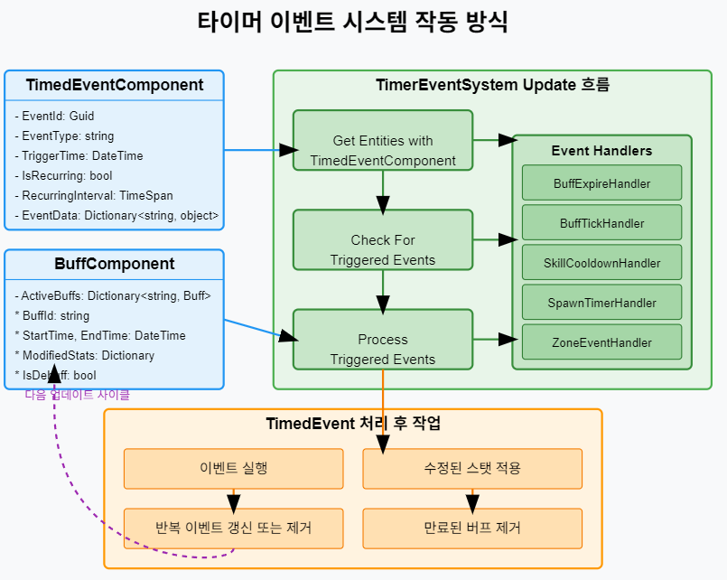

# ECS(Entity-Component-System) 기반 온라인 게임 서버

저자: 최흥배, Claude AI   
    
권장 개발 환경
- **IDE**: Visual Studio 2022 (Community 이상)
- **컴파일러**: .NET 9 이상
- **OS**: Windows 10 이상  
-----    
  
# 7. 시스템 확장
ECS(Entity-Component-System) 아키텍처를 사용한 온라인 게임 서버의 시스템 확장에 대해 설명하겠다. 먼저 간략한 아키텍처 리마인드 후 각 시스템별 구현 방법을 살펴본다.
  
## ECS 아키텍처 기본 개념
- **Entity**: 게임 내 객체의 고유 식별자
- **Component**: 순수 데이터만 포함하는 객체의 특성
- **System**: 특정 컴포넌트 조합을 가진 엔티티에 대한 로직 처리
  

## 7.1 전투 시스템
전투 시스템은 게임의 핵심 요소로, 캐릭터 간 상호작용과 데미지 계산을 담당한다.

### 필요한 컴포넌트

```csharp
// 전투 관련 컴포넌트들
public struct HealthComponent
{
    public int CurrentHealth;
    public int MaxHealth;
    public bool IsDead => CurrentHealth <= 0;
}

public struct AttackComponent
{
    public int AttackPower;
    public float AttackRange;
    public float AttackSpeed;
    public DateTime LastAttackTime;
}

public struct DefenseComponent
{
    public int Defense;
    public float DamageReduction;
}

public struct CombatTargetComponent
{
    public int TargetEntityId;
    public bool HasTarget => TargetEntityId != 0;
}

public struct CombatStateComponent
{
    public enum State { Idle, Attacking, TakingDamage, Dead }
    public State CurrentState;
    public DateTime StateStartTime;
}
```

### 전투 시스템 구현

```csharp
public class CombatSystem : ISystem
{
    private readonly IEntityManager _entityManager;
    private readonly IEventManager _eventManager;
    private readonly INetworkManager _networkManager;
    
    public CombatSystem(IEntityManager entityManager, IEventManager eventManager, INetworkManager networkManager)
    {
        _entityManager = entityManager;
        _eventManager = eventManager;
        _networkManager = networkManager;
    }
    
    public void Update(float deltaTime)
    {
        // 전투 상태인 엔티티 검색
        var combatEntities = _entityManager.GetEntitiesWithComponents<HealthComponent, AttackComponent, CombatTargetComponent>();
        
        foreach (var entity in combatEntities)
        {
            if (!TryProcessCombat(entity, deltaTime))
            {
                // 전투 실패(타겟 소실 등)시 상태 초기화
                ResetCombatState(entity);
            }
        }
        
        // 죽은 엔티티 처리
        ProcessDeadEntities();
    }
    
    private bool TryProcessCombat(int entityId, float deltaTime)
    {
        // 컴포넌트 가져오기
        var attackComp = _entityManager.GetComponent<AttackComponent>(entityId);
        var targetComp = _entityManager.GetComponent<CombatTargetComponent>(entityId);
        var stateComp = _entityManager.GetComponent<CombatStateComponent>(entityId);
        
        // 타겟이 유효한지 확인
        if (!targetComp.HasTarget)
            return false;
            
        // 타겟 엔티티 유효성 확인
        if (!_entityManager.HasEntity(targetComp.TargetEntityId))
            return false;
            
        // 타겟의 체력 컴포넌트 확인
        if (!_entityManager.HasComponent<HealthComponent>(targetComp.TargetEntityId))
            return false;
            
        var targetHealth = _entityManager.GetComponent<HealthComponent>(targetComp.TargetEntityId);
        if (targetHealth.IsDead)
            return false;
            
        // 공격 간격 확인
        if ((DateTime.UtcNow - attackComp.LastAttackTime).TotalSeconds < 1.0 / attackComp.AttackSpeed)
            return true; // 아직 공격 가능 시간이 아니지만, 전투 상태는 유효
            
        // 공격 실행
        PerformAttack(entityId, targetComp.TargetEntityId);
        
        // 마지막 공격 시간 갱신
        attackComp.LastAttackTime = DateTime.UtcNow;
        _entityManager.UpdateComponent(entityId, attackComp);
        
        return true;
    }
    
    private void PerformAttack(int attackerId, int defenderId)
    {
        var attackerAttack = _entityManager.GetComponent<AttackComponent>(attackerId);
        var defenderDefense = _entityManager.TryGetComponent<DefenseComponent>(defenderId, out var defense) 
            ? defense 
            : new DefenseComponent();
        var defenderHealth = _entityManager.GetComponent<HealthComponent>(defenderId);
        
        // 데미지 계산
        int rawDamage = attackerAttack.AttackPower;
        int finalDamage = Math.Max(1, (int)(rawDamage * (1 - defenderDefense.DamageReduction) - defenderDefense.Defense));
        
        // 체력 감소
        defenderHealth.CurrentHealth = Math.Max(0, defenderHealth.CurrentHealth - finalDamage);
        _entityManager.UpdateComponent(defenderId, defenderHealth);
        
        // 데미지 이벤트 발생
        _eventManager.Publish(new DamageEvent 
        { 
            AttackerId = attackerId,
            TargetId = defenderId,
            Damage = finalDamage,
            IsCritical = false, // 추가 로직으로 확장 가능
            Timestamp = DateTime.UtcNow
        });
        
        // 네트워크 알림
        _networkManager.SendToInterestedClients(new CombatNotification
        {
            Type = CombatNotificationType.Damage,
            AttackerId = attackerId,
            TargetId = defenderId,
            Value = finalDamage
        });
        
        // 사망 체크
        if (defenderHealth.IsDead)
        {
            HandleEntityDeath(defenderId, attackerId);
        }
    }
    
    private void HandleEntityDeath(int deadEntityId, int killerId)
    {
        // 사망 상태로 변경
        var stateComp = _entityManager.GetComponent<CombatStateComponent>(deadEntityId);
        stateComp.CurrentState = CombatStateComponent.State.Dead;
        stateComp.StateStartTime = DateTime.UtcNow;
        _entityManager.UpdateComponent(deadEntityId, stateComp);
        
        // 사망 이벤트 발생
        _eventManager.Publish(new EntityDeathEvent
        {
            EntityId = deadEntityId,
            KillerId = killerId,
            Timestamp = DateTime.UtcNow
        });
        
        // 네트워크 알림
        _networkManager.SendToInterestedClients(new CombatNotification
        {
            Type = CombatNotificationType.Death,
            AttackerId = killerId,
            TargetId = deadEntityId,
            Value = 0
        });
    }
    
    private void ResetCombatState(int entityId)
    {
        var targetComp = _entityManager.GetComponent<CombatTargetComponent>(entityId);
        targetComp.TargetEntityId = 0;
        _entityManager.UpdateComponent(entityId, targetComp);
        
        var stateComp = _entityManager.GetComponent<CombatStateComponent>(entityId);
        stateComp.CurrentState = CombatStateComponent.State.Idle;
        stateComp.StateStartTime = DateTime.UtcNow;
        _entityManager.UpdateComponent(entityId, stateComp);
    }
    
    private void ProcessDeadEntities()
    {
        // 사망 상태의 엔티티 처리 (리스폰 등)
        var deadEntities = _entityManager.GetEntitiesWithComponents<HealthComponent, CombatStateComponent>()
            .Where(e => 
            {
                var stateComp = _entityManager.GetComponent<CombatStateComponent>(e);
                return stateComp.CurrentState == CombatStateComponent.State.Dead;
            });
            
        foreach (var entity in deadEntities)
        {
            // 부활 로직 구현
            // ...
        }
    }
}
```

  
## 7.2 AI 시스템
AI 시스템은 NPC의 행동을 결정하고 자율적으로 움직이게 한다.

### 필요한 컴포넌트

```csharp
public struct AIComponent
{
    public enum AIType { Idle, Aggressive, Defensive, Passive, Pet }
    
    public AIType Type;
    public float AggroRange;
    public float ChaseRange;
    public float WanderRadius;
    public int OwnerId; // 팻 등의 소유자 ID
}

public struct AIStateComponent
{
    public enum State { Idle, Wander, Chase, Attack, Flee, Return, Follow }
    
    public State CurrentState;
    public DateTime StateStartTime;
    public DateTime LastStateChangeTime;
    public Vector3 HomePosition; // 초기 위치
    public Vector3 TargetPosition; // 이동 목표
    public int TargetEntityId; // 타겟팅 중인 엔티티
}

public struct AIBehaviorTreeComponent
{
    public string BehaviorTreeId; // 행동 트리 식별자
    public Dictionary<string, object> Blackboard; // 행동 트리 데이터
}
```

### AI 시스템 구현

```csharp
public class AISystem : ISystem
{
    private readonly IEntityManager _entityManager;
    private readonly IPathfinder _pathfinder;
    private readonly ISpatialMap _spatialMap;
    private readonly IBehaviorTreeManager _behaviorTreeManager;
    
    public AISystem(
        IEntityManager entityManager, 
        IPathfinder pathfinder,
        ISpatialMap spatialMap,
        IBehaviorTreeManager behaviorTreeManager)
    {
        _entityManager = entityManager;
        _pathfinder = pathfinder;
        _spatialMap = spatialMap;
        _behaviorTreeManager = behaviorTreeManager;
    }
    
    public void Update(float deltaTime)
    {
        var aiEntities = _entityManager.GetEntitiesWithComponents<AIComponent, AIStateComponent, PositionComponent>();
        
        foreach (var entityId in aiEntities)
        {
            UpdateAI(entityId, deltaTime);
        }
    }
    
    private void UpdateAI(int entityId, float deltaTime)
    {
        var aiComp = _entityManager.GetComponent<AIComponent>(entityId);
        var aiStateComp = _entityManager.GetComponent<AIStateComponent>(entityId);
        var posComp = _entityManager.GetComponent<PositionComponent>(entityId);
        
        // 행동 트리가 있다면 실행
        if (_entityManager.HasComponent<AIBehaviorTreeComponent>(entityId))
        {
            UpdateWithBehaviorTree(entityId, deltaTime);
            return;
        }
        
        // 기본 상태 기반 AI 처리
        switch (aiStateComp.CurrentState)
        {
            case AIStateComponent.State.Idle:
                HandleIdleState(entityId, aiComp, aiStateComp, posComp, deltaTime);
                break;
                
            case AIStateComponent.State.Wander:
                HandleWanderState(entityId, aiComp, aiStateComp, posComp, deltaTime);
                break;
                
            case AIStateComponent.State.Chase:
                HandleChaseState(entityId, aiComp, aiStateComp, posComp, deltaTime);
                break;
                
            case AIStateComponent.State.Attack:
                HandleAttackState(entityId, aiComp, aiStateComp, posComp, deltaTime);
                break;
                
            case AIStateComponent.State.Flee:
                HandleFleeState(entityId, aiComp, aiStateComp, posComp, deltaTime);
                break;
                
            case AIStateComponent.State.Return:
                HandleReturnState(entityId, aiComp, aiStateComp, posComp, deltaTime);
                break;
                
            case AIStateComponent.State.Follow:
                HandleFollowState(entityId, aiComp, aiStateComp, posComp, deltaTime);
                break;
        }
        
        // AI 타입별 특별 행동
        switch (aiComp.Type)
        {
            case AIComponent.AIType.Aggressive:
                CheckForTargets(entityId, aiComp, aiStateComp, posComp);
                break;
                
            case AIComponent.AIType.Pet:
                FollowOwner(entityId, aiComp, aiStateComp, posComp);
                break;
        }
    }
    
    private void UpdateWithBehaviorTree(int entityId, float deltaTime)
    {
        var btComp = _entityManager.GetComponent<AIBehaviorTreeComponent>(entityId);
        
        // 블랙보드 갱신
        UpdateBlackboard(entityId, btComp.Blackboard);
        
        // 행동 트리 실행
        var result = _behaviorTreeManager.ExecuteTree(btComp.BehaviorTreeId, btComp.Blackboard);
        
        // 결과에 따른 엔티티 업데이트
        ProcessBehaviorTreeResult(entityId, result, btComp.Blackboard);
        
        // 업데이트된 블랙보드 저장
        _entityManager.UpdateComponent(entityId, btComp);
    }
    
    private void UpdateBlackboard(int entityId, Dictionary<string, object> blackboard)
    {
        var posComp = _entityManager.GetComponent<PositionComponent>(entityId);
        var aiStateComp = _entityManager.GetComponent<AIStateComponent>(entityId);
        
        // 블랙보드에 현재 상태 정보 갱신
        blackboard["CurrentPosition"] = posComp.Position;
        blackboard["CurrentState"] = aiStateComp.CurrentState;
        blackboard["HomePosition"] = aiStateComp.HomePosition;
        
        // 주변 엔티티 정보 갱신
        var nearbyEntities = _spatialMap.GetEntitiesInRadius(posComp.Position, 20.0f);
        blackboard["NearbyEntities"] = nearbyEntities;
        
        // 체력 정보 갱신
        if (_entityManager.HasComponent<HealthComponent>(entityId))
        {
            var healthComp = _entityManager.GetComponent<HealthComponent>(entityId);
            blackboard["CurrentHealth"] = healthComp.CurrentHealth;
            blackboard["MaxHealth"] = healthComp.MaxHealth;
            blackboard["HealthPercentage"] = (float)healthComp.CurrentHealth / healthComp.MaxHealth;
        }
    }
    
    private void ProcessBehaviorTreeResult(int entityId, BehaviorTreeResult result, Dictionary<string, object> blackboard)
    {
        if (!result.IsSuccess)
            return;
            
        // 행동 트리 결과 처리
        if (blackboard.TryGetValue("TargetPosition", out var targetPos) && targetPos is Vector3 position)
        {
            // 이동 명령 처리
            var moveComp = _entityManager.GetComponent<MovementComponent>(entityId);
            moveComp.TargetPosition = position;
            moveComp.IsMoving = true;
            _entityManager.UpdateComponent(entityId, moveComp);
        }
        
        if (blackboard.TryGetValue("TargetEntity", out var targetEntity) && targetEntity is int targetId)
        {
            // 타겟팅 처리
            var combatTargetComp = new CombatTargetComponent { TargetEntityId = targetId };
            _entityManager.AddOrUpdateComponent(entityId, combatTargetComp);
            
            // AI 상태 갱신
            var aiStateComp = _entityManager.GetComponent<AIStateComponent>(entityId);
            aiStateComp.TargetEntityId = targetId;
            aiStateComp.CurrentState = AIStateComponent.State.Attack;
            _entityManager.UpdateComponent(entityId, aiStateComp);
        }
    }
    
    // 다양한 AI 상태 처리 메서드들
    private void HandleIdleState(int entityId, AIComponent aiComp, AIStateComponent aiStateComp, PositionComponent posComp, float deltaTime)
    {
        // Idle 시간이 지났으면 Wander 상태로 전환
        if ((DateTime.UtcNow - aiStateComp.StateStartTime).TotalSeconds > 3.0f)
        {
            // 랜덤 방향으로 이동 목표 설정
            ChangeToWanderState(entityId, aiComp, aiStateComp, posComp);
        }
    }
    
    private void HandleWanderState(int entityId, AIComponent aiComp, AIStateComponent aiStateComp, PositionComponent posComp, float deltaTime)
    {
        // 목적지에 도착했거나 이동 시간이 길어지면 Idle 상태로 전환
        var distToTarget = Vector3.Distance(posComp.Position, aiStateComp.TargetPosition);
        if (distToTarget < 0.5f || (DateTime.UtcNow - aiStateComp.StateStartTime).TotalSeconds > 10.0f)
        {
            ChangeToIdleState(entityId, aiStateComp);
        }
    }
    
    private void HandleChaseState(int entityId, AIComponent aiComp, AIStateComponent aiStateComp, PositionComponent posComp, float deltaTime)
    {
        // 타겟이 유효한지 확인
        if (!_entityManager.HasEntity(aiStateComp.TargetEntityId))
        {
            ChangeToReturnState(entityId, aiStateComp);
            return;
        }
        
        // 타겟 위치 가져오기
        var targetPosComp = _entityManager.GetComponent<PositionComponent>(aiStateComp.TargetEntityId);
        
        // 타겟까지의 거리 계산
        var distToTarget = Vector3.Distance(posComp.Position, targetPosComp.Position);
        
        // 공격 범위 안에 들어왔으면 공격 상태로 전환
        if (_entityManager.HasComponent<AttackComponent>(entityId))
        {
            var attackComp = _entityManager.GetComponent<AttackComponent>(entityId);
            if (distToTarget <= attackComp.AttackRange)
            {
                ChangeToAttackState(entityId, aiStateComp);
                return;
            }
        }
        
        // 타겟이 너무 멀어지면 귀환
        if (distToTarget > aiComp.ChaseRange)
        {
            ChangeToReturnState(entityId, aiStateComp);
            return;
        }
        
        // 타겟을 향해 이동
        var moveComp = _entityManager.GetComponent<MovementComponent>(entityId);
        moveComp.TargetPosition = targetPosComp.Position;
        moveComp.IsMoving = true;
        _entityManager.UpdateComponent(entityId, moveComp);
        
        // 경로 업데이트 (주기적)
        if ((DateTime.UtcNow - aiStateComp.LastStateChangeTime).TotalSeconds > 1.0f)
        {
            var path = _pathfinder.FindPath(posComp.Position, targetPosComp.Position);
            if (path != null && path.Count > 0)
            {
                var pathComp = new PathComponent { Path = path, CurrentPathIndex = 0 };
                _entityManager.AddOrUpdateComponent(entityId, pathComp);
            }
            
            aiStateComp.LastStateChangeTime = DateTime.UtcNow;
            _entityManager.UpdateComponent(entityId, aiStateComp);
        }
    }
    
    // 기타 AI 상태 처리 메서드 (생략)
    
    private void CheckForTargets(int entityId, AIComponent aiComp, AIStateComponent aiStateComp, PositionComponent posComp)
    {
        // 이미 타겟이 있으면 스킵
        if (aiStateComp.CurrentState == AIStateComponent.State.Chase || 
            aiStateComp.CurrentState == AIStateComponent.State.Attack)
            return;
            
        // 주변 엔티티 검색
        var nearbyEntities = _spatialMap.GetEntitiesInRadius(posComp.Position, aiComp.AggroRange);
        
        // 플레이어 또는 적대적 엔티티 찾기
        foreach (var nearby in nearbyEntities)
        {
            // 자기 자신은 스킵
            if (nearby == entityId)
                continue;
                
            // 팻의 경우 주인은 타겟팅하지 않음
            if (aiComp.Type == AIComponent.AIType.Pet && nearby == aiComp.OwnerId)
                continue;
                
            // 공격 가능한 대상인지 확인 (팩션 체크 등)
            if (IsValidTarget(entityId, nearby))
            {
                // 타겟 설정 및 추적 상태로 전환
                aiStateComp.TargetEntityId = nearby;
                aiStateComp.CurrentState = AIStateComponent.State.Chase;
                aiStateComp.StateStartTime = DateTime.UtcNow;
                aiStateComp.LastStateChangeTime = DateTime.UtcNow;
                _entityManager.UpdateComponent(entityId, aiStateComp);
                
                // 전투 타겟 컴포넌트 추가/갱신
                var combatTargetComp = new CombatTargetComponent { TargetEntityId = nearby };
                _entityManager.AddOrUpdateComponent(entityId, combatTargetComp);
                
                break;
            }
        }
    }
    
    // 상태 전환 헬퍼 메서드들
    private void ChangeToIdleState(int entityId, AIStateComponent aiStateComp)
    {
        aiStateComp.CurrentState = AIStateComponent.State.Idle;
        aiStateComp.StateStartTime = DateTime.UtcNow;
        aiStateComp.LastStateChangeTime = DateTime.UtcNow;
        aiStateComp.TargetPosition = Vector3.Zero;
        _entityManager.UpdateComponent(entityId, aiStateComp);
        
        // 이동 중지
        if (_entityManager.HasComponent<MovementComponent>(entityId))
        {
            var moveComp = _entityManager.GetComponent<MovementComponent>(entityId);
            moveComp.IsMoving = false;
            _entityManager.UpdateComponent(entityId, moveComp);
        }
    }
    
    private void ChangeToWanderState(int entityId, AIComponent aiComp, AIStateComponent aiStateComp, PositionComponent posComp)
    {
        // 랜덤 방향으로 이동 목표 설정
        var randomAngle = new Random().NextDouble() * Math.PI * 2;
        var randomDistance = new Random().NextDouble() * aiComp.WanderRadius;
        var offsetX = (float)(Math.Cos(randomAngle) * randomDistance);
        var offsetZ = (float)(Math.Sin(randomAngle) * randomDistance);
        
        var targetPos = new Vector3(
            aiStateComp.HomePosition.X + offsetX,
            aiStateComp.HomePosition.Y,
            aiStateComp.HomePosition.Z + offsetZ);
            
        // 목표 위치 유효성 검사 및 경로 찾기
        var path = _pathfinder.FindPath(posComp.Position, targetPos);
        if (path == null || path.Count == 0)
        {
            // 경로를 찾을 수 없으면 다시 시도
            ChangeToIdleState(entityId, aiStateComp);
            return;
        }
        
        // 상태 변경
        aiStateComp.CurrentState = AIStateComponent.State.Wander;
        aiStateComp.StateStartTime = DateTime.UtcNow;
        aiStateComp.LastStateChangeTime = DateTime.UtcNow;
        aiStateComp.TargetPosition = targetPos;
        _entityManager.UpdateComponent(entityId, aiStateComp);
        
        // 경로 및 이동 컴포넌트 설정
        var pathComp = new PathComponent { Path = path, CurrentPathIndex = 0 };
        _entityManager.AddOrUpdateComponent(entityId, pathComp);
        
        var moveComp = _entityManager.GetComponent<MovementComponent>(entityId);
        moveComp.TargetPosition = path[0];
        moveComp.IsMoving = true;
        _entityManager.UpdateComponent(entityId, moveComp);
    }
    
    // 기타 상태 전환 메서드들 (생략)
    
    private bool IsValidTarget(int sourceEntityId, int targetEntityId)
    {
        // 대상이 플레이어인지 확인
        if (_entityManager.HasComponent<PlayerComponent>(targetEntityId))
            return true;
            
        // 팩션 기반 적대 관계 확인
        if (_entityManager.HasComponent<FactionComponent>(sourceEntityId) && 
            _entityManager.HasComponent<FactionComponent>(targetEntityId))
        {
            var sourceFaction = _entityManager.GetComponent<FactionComponent>(sourceEntityId);
            var targetFaction = _entityManager.GetComponent<FactionComponent>(targetEntityId);
            
            // 팩션 관계 확인 로직
            return sourceFaction.Faction != targetFaction.Faction;
        }
        
        return false;
    }
}
```

### 행동 트리 구현

```csharp
public class BehaviorTreeManager : IBehaviorTreeManager
{
    private Dictionary<string, BehaviorTree> _trees = new();
    
    public BehaviorTreeManager()
    {
        InitializeTrees();
    }
    
    private void InitializeTrees()
    {
        // 공격적 몬스터 AI 트리
        _trees["aggressive_monster"] = new BehaviorTree(
            new Selector(
                // 체력이 낮으면 도망
                new Sequence(
                    new CheckHealth(0.3f), // 체력이 30% 이하인지 확인
                    new Flee()
                ),
                // 공격 가능한 타겟이 있으면 공격
                new Sequence(
                    new FindTarget(15.0f), // 15미터 내 타겟 찾기
                    new Selector(
                        // 공격 범위 내에 있으면 공격
                        new Sequence(
                            new IsTargetInRange(2.0f),
                            new Attack()
                        ),
                        // 범위 밖이면 추적
                        new Chase()
                    )
                ),
                // 홈 위치에서 너무 멀어졌으면 귀환
                new Sequence(
                    new IsFarFromHome(30.0f),
                    new ReturnHome()
                ),
                // 기본 배회
                new Sequence(
                    new RandomProbability(0.3f), // 30% 확률로 배회
                    new Wander(10.0f)
                ),
                // 아무것도 안함 (기본)
                new Idle()
            )
        );
        
        // 방어적 NPC AI 트리
        _trees["defensive_npc"] = new BehaviorTree(
            new Selector(
                // 공격받으면 반격
                new Sequence(
                    new WasAttacked(),
                    new Sequence(
                        new FindAttacker(),
                        new Selector(
                            new Sequence(
                                new IsTargetInRange(2.0f),
                                new Attack()
                            ),
                            new Chase()
                        )
                    )
                ),
                // 홈 위치에서 너무 멀어졌으면 귀환
                new Sequence(
                    new IsFarFromHome(10.0f),
                    new ReturnHome()
                ),
                // 기본 배회
                new Sequence(
                    new RandomProbability(0.2f),
                    new Wander(5.0f)
                ),
                // 아무것도 안함 (기본)
                new Idle()
            )
        );
        
        // 팻 AI 트리
        _trees["pet"] = new BehaviorTree(
            new Selector(
                // 주인이 공격받으면 공격자 공격
                new Sequence(
                    new IsOwnerAttacked(),
                    new Sequence(
                        new FindOwnerAttacker(),
                        new Selector(
                            new Sequence(
                                new IsTargetInRange(2.0f),
                                new Attack()
                            ),
                            new Chase()
                        )
                    )
                ),
                // 주인과 멀어지면 따라감
                new Sequence(
                    new IsFarFromOwner(8.0f),
                    new FollowOwner()
                ),
                // 주인 근처에서 배회
                new Sequence(
                    new RandomProbability(0.2f),
                    new WanderNearOwner(5.0f)
                ),
                // 아무것도 안함 (기본)
                new Idle()
            )
        );
    }
    
    public BehaviorTreeResult ExecuteTree(string treeId, Dictionary<string, object> blackboard)
    {
        if (!_trees.TryGetValue(treeId, out var tree))
        {
            return new BehaviorTreeResult { IsSuccess = false, Message = $"Tree '{treeId}' not found" };
        }
        
        return tree.Execute(blackboard);
    }
}

// 행동 트리 노드 구현 (간략화)
public abstract class Node
{
    public abstract NodeResult Execute(Dictionary<string, object> blackboard);
}

public class Selector : Node
{
    private readonly Node[] _children;
    
    public Selector(params Node[] children)
    {
        _children = children;
    }
    
    public override NodeResult Execute(Dictionary<string, object> blackboard)
    {
        foreach (var child in _children)
        {
            var result = child.Execute(blackboard);
            if (result.Status == NodeStatus.Success)
                return result;
                
            if (result.Status == NodeStatus.Running)
                return result;
        }
        
        return new NodeResult { Status = NodeStatus.Failure };
    }
}

public class Sequence : Node
{
    private readonly Node[] _children;
    
    public Sequence(params Node[] children)
    {
        _children = children;
    }
    
    public override NodeResult Execute(Dictionary<string, object> blackboard)
    {
        foreach (var child in _children)
        {
            var result = child.Execute(blackboard);
            if (result.Status != NodeStatus.Success)
                return result;
        }
        
        return new NodeResult { Status = NodeStatus.Success };
    }
}

// 행동 및 조건 노드 구현 생략
```

  
## 7.3 파티/그룹 시스템
파티 시스템은 여러 플레이어가 함께 게임을 진행할 수 있게 한다.

### 필요한 컴포넌트

```csharp
public struct PartyComponent
{
    public int PartyId;
    public bool IsLeader;
    public DateTime JoinTime;
}

public struct PartyInfoComponent
{
    public int PartyId;
    public string PartyName;
    public int LeaderId;
    public HashSet<int> MemberIds;
    public int MaxMembers;
    public DateTime CreationTime;
    
    public enum LootMethod { FreeForAll, RoundRobin, LeaderLoot }
    public LootMethod CurrentLootMethod;
    
    public enum ExperienceSharingMethod { Equal, LevelBased }
    public ExperienceSharingMethod ExpSharingMethod;
}
```

### 파티 시스템 구현

```csharp
public class PartySystem : ISystem
{
    private readonly IEntityManager _entityManager;
    private readonly IEventManager _eventManager;
    private readonly INetworkManager _networkManager;
    private int _nextPartyId = 1;
    
    public PartySystem(IEntityManager entityManager, IEventManager eventManager, INetworkManager networkManager)
    {
        _entityManager = entityManager;
        _eventManager = eventManager;
        _networkManager = networkManager;
        
        // 이벤트 구독
        _eventManager.Subscribe<PartyInviteEvent>(HandlePartyInvite);
        _eventManager.Subscribe<PartyInviteResponseEvent>(HandlePartyInviteResponse);
        _eventManager.Subscribe<PartyLeaveEvent>(HandlePartyLeave);
        _eventManager.Subscribe<PartyKickEvent>(HandlePartyKick);
        _eventManager.Subscribe<PartyDisbandEvent>(HandlePartyDisband);
        _eventManager.Subscribe<PartyLeaderChangeEvent>(HandlePartyLeaderChange);
        _eventManager.Subscribe<PartyLootMethodChangeEvent>(HandlePartyLootMethodChange);
    }
    
    public void Update(float deltaTime)
    {
        // 파티 상태 업데이트 (위치 공유, 체력 공유 등)
        var parties = _entityManager.GetEntitiesWithComponent<PartyInfoComponent>();
        
        foreach (var partyEntity in parties)
        {
            UpdatePartyState(partyEntity);
        }
    }
    
    private void UpdatePartyState(int partyEntity)
    {
        var partyInfo = _entityManager.GetComponent<PartyInfoComponent>(partyEntity);
        
        // 파티원 상태 수집
        var memberStates = new List<PartyMemberState>();
        
        foreach (var memberId in partyInfo.MemberIds)
        {
            if (!_entityManager.HasEntity(memberId))
                continue;
                
            var memberState = new PartyMemberState
            {
                EntityId = memberId,
                IsLeader = memberId == partyInfo.LeaderId
            };
            
            // 위치 정보
            if (_entityManager.HasComponent<PositionComponent>(memberId))
            {
                var posComp = _entityManager.GetComponent<PositionComponent>(memberId);
                memberState.Position = posComp.Position;
            }
            
            // 체력 정보
            if (_entityManager.HasComponent<HealthComponent>(memberId))
            {
                var healthComp = _entityManager.GetComponent<HealthComponent>(memberId);
                memberState.CurrentHealth = healthComp.CurrentHealth;
                memberState.MaxHealth = healthComp.MaxHealth;
            }
            
            // 추가 정보 수집
            if (_entityManager.HasComponent<PlayerComponent>(memberId))
            {
                var playerComp = _entityManager.GetComponent<PlayerComponent>(memberId);
                memberState.Name = playerComp.Name;
                memberState.Level = playerComp.Level;
                memberState.Class = playerComp.Class;
            }
            
            memberStates.Add(memberState);
        }
        
        // 파티원들에게 상태 전송
        foreach (var memberId in partyInfo.MemberIds)
        {
            if (!_entityManager.HasComponent<NetworkConnectionComponent>(memberId))
                continue;
                
            var connComp = _entityManager.GetComponent<NetworkConnectionComponent>(memberId);
            
            _networkManager.SendToClient(connComp.ConnectionId, new PartyStateUpdate
            {
                PartyId = partyInfo.PartyId,
                PartyName = partyInfo.PartyName,
                LeaderId = partyInfo.LeaderId,
                LootMethod = (int)partyInfo.CurrentLootMethod,
                ExpSharingMethod = (int)partyInfo.ExpSharingMethod,
                Members = memberStates
            });
        }
    }
    
    // 파티 관련 메서드 구현
    public int CreateParty(int leaderId, string partyName)
    {
        // 이미 파티에 가입되어 있는지 확인
        if (_entityManager.HasComponent<PartyComponent>(leaderId))
        {
            return -1;
        }
        
        // 파티 정보 엔티티 생성
        int partyId = _nextPartyId++;
        int partyEntity = _entityManager.CreateEntity();
        
        var partyInfo = new PartyInfoComponent
        {
            PartyId = partyId,
            PartyName = partyName,
            LeaderId = leaderId,
            MemberIds = new HashSet<int> { leaderId },
            MaxMembers = 5,
            CreationTime = DateTime.UtcNow,
            CurrentLootMethod = PartyInfoComponent.LootMethod.FreeForAll,
            ExpSharingMethod = PartyInfoComponent.ExperienceSharingMethod.Equal
        };
        
        _entityManager.AddComponent(partyEntity, partyInfo);
        
        // 리더에게 파티 컴포넌트 추가
        var partyComp = new PartyComponent
        {
            PartyId = partyId,
            IsLeader = true,
            JoinTime = DateTime.UtcNow
        };
        
        _entityManager.AddComponent(leaderId, partyComp);
        
        // 이벤트 발생
        _eventManager.Publish(new PartyCreatedEvent
        {
            PartyId = partyId,
            LeaderId = leaderId,
            PartyName = partyName
        });
        
        return partyId;
    }
    
    public bool InviteToParty(int inviterId, int inviteeId)
    {
        // 초대자가 파티 리더인지 확인
        if (!_entityManager.HasComponent<PartyComponent>(inviterId))
            return false;
            
        var inviterParty = _entityManager.GetComponent<PartyComponent>(inviterId);
        if (!inviterParty.IsLeader)
            return false;
            
        // 초대 대상이 이미 파티에 있는지 확인
        if (_entityManager.HasComponent<PartyComponent>(inviteeId))
            return false;
            
        // 파티 정보 가져오기
        var partyInfoEntity = FindPartyEntityById(inviterParty.PartyId);
        if (partyInfoEntity == 0)
            return false;
            
        var partyInfo = _entityManager.GetComponent<PartyInfoComponent>(partyInfoEntity);
        
        // 파티가 꽉 찼는지 확인
        if (partyInfo.MemberIds.Count >= partyInfo.MaxMembers)
            return false;
            
        // 초대 이벤트 발생 및 네트워크 전송
        _eventManager.Publish(new PartyInviteEvent
        {
            PartyId = partyInfo.PartyId,
            InviterId = inviterId,
            InviteeId = inviteeId,
            Timestamp = DateTime.UtcNow
        });
        
        // 초대 대상에게 초대 메시지 전송
        if (_entityManager.HasComponent<NetworkConnectionComponent>(inviteeId))
        {
            var connComp = _entityManager.GetComponent<NetworkConnectionComponent>(inviteeId);
            _networkManager.SendToClient(connComp.ConnectionId, new PartyInviteNotification
            {
                PartyId = partyInfo.PartyId,
                PartyName = partyInfo.PartyName,
                InviterId = inviterId,
                InviterName = GetEntityName(inviterId)
            });
        }
        
        return true;
    }
    
    public bool JoinParty(int partyId, int playerId)
    {
        // 이미 파티에 가입되어 있는지 확인
        if (_entityManager.HasComponent<PartyComponent>(playerId))
            return false;
            
        // 파티 정보 엔티티 찾기
        var partyInfoEntity = FindPartyEntityById(partyId);
        if (partyInfoEntity == 0)
            return false;
            
        var partyInfo = _entityManager.GetComponent<PartyInfoComponent>(partyInfoEntity);
        
        // 파티가 꽉 찼는지 확인
        if (partyInfo.MemberIds.Count >= partyInfo.MaxMembers)
            return false;
            
        // 파티원 추가
        partyInfo.MemberIds.Add(playerId);
        _entityManager.UpdateComponent(partyInfoEntity, partyInfo);
        
        // 플레이어에게 파티 컴포넌트 추가
        var partyComp = new PartyComponent
        {
            PartyId = partyId,
            IsLeader = false,
            JoinTime = DateTime.UtcNow
        };
        
        _entityManager.AddComponent(playerId, partyComp);
        
        // 파티원들에게 알림
        NotifyPartyMembersOfChange(partyId, $"{GetEntityName(playerId)}님이 파티에 참가했습니다.");
        
        return true;
    }
    
    public bool LeaveParty(int playerId)
    {
        // 파티에 가입되어 있는지 확인
        if (!_entityManager.HasComponent<PartyComponent>(playerId))
            return false;
            
        var partyComp = _entityManager.GetComponent<PartyComponent>(playerId);
        int partyId = partyComp.PartyId;
        
        // 파티 정보 엔티티 찾기
        var partyInfoEntity = FindPartyEntityById(partyId);
        if (partyInfoEntity == 0)
            return false;
            
        var partyInfo = _entityManager.GetComponent<PartyInfoComponent>(partyInfoEntity);
        
        // 파티원 목록에서 제거
        partyInfo.MemberIds.Remove(playerId);
        
        // 리더가 나간 경우 새 리더 지정
        if (playerId == partyInfo.LeaderId && partyInfo.MemberIds.Count > 0)
        {
            partyInfo.LeaderId = partyInfo.MemberIds.First();
            
            // 새 리더 컴포넌트 업데이트
            if (_entityManager.HasComponent<PartyComponent>(partyInfo.LeaderId))
            {
                var newLeaderComp = _entityManager.GetComponent<PartyComponent>(partyInfo.LeaderId);
                newLeaderComp.IsLeader = true;
                _entityManager.UpdateComponent(partyInfo.LeaderId, newLeaderComp);
            }
        }
        
        // 파티에 아무도 없으면 파티 제거
        if (partyInfo.MemberIds.Count == 0)
        {
            _entityManager.DestroyEntity(partyInfoEntity);
        }
        else
        {
            _entityManager.UpdateComponent(partyInfoEntity, partyInfo);
            
            // 파티원들에게 알림
            NotifyPartyMembersOfChange(partyId, $"{GetEntityName(playerId)}님이 파티를 떠났습니다.");
        }
        
        // 플레이어에게서 파티 컴포넌트 제거
        _entityManager.RemoveComponent<PartyComponent>(playerId);
        
        return true;
    }
    
    // 기타 파티 관련 메서드 (생략)
    
    // 이벤트 핸들러
    private void HandlePartyInvite(PartyInviteEvent evt)
    {
        // 초대 처리 로직
    }
    
    private void HandlePartyInviteResponse(PartyInviteResponseEvent evt)
    {
        if (evt.IsAccepted)
        {
            JoinParty(evt.PartyId, evt.PlayerId);
        }
    }
    
    private void HandlePartyLeave(PartyLeaveEvent evt)
    {
        LeaveParty(evt.PlayerId);
    }
    
    private void HandlePartyKick(PartyKickEvent evt)
    {
        // 강퇴 요청자가 리더인지 확인
        if (!IsPartyLeader(evt.RequesterId))
            return;
            
        LeaveParty(evt.TargetId);
        
        // 강퇴 당한 플레이어에게 알림
        if (_entityManager.HasComponent<NetworkConnectionComponent>(evt.TargetId))
        {
            var connComp = _entityManager.GetComponent<NetworkConnectionComponent>(evt.TargetId);
            _networkManager.SendToClient(connComp.ConnectionId, new PartyKickNotification());
        }
    }
    
    private void HandlePartyDisband(PartyDisbandEvent evt)
    {
        // 파티 해체 요청자가 리더인지 확인
        if (!IsPartyLeader(evt.LeaderId))
            return;
            
        int partyId = GetPlayerPartyId(evt.LeaderId);
        if (partyId == 0)
            return;
            
        // 파티 정보 엔티티 찾기
        var partyInfoEntity = FindPartyEntityById(partyId);
        if (partyInfoEntity == 0)
            return;
            
        var partyInfo = _entityManager.GetComponent<PartyInfoComponent>(partyInfoEntity);
        
        // 모든 파티원에게 알림
        foreach (var memberId in partyInfo.MemberIds)
        {
            if (_entityManager.HasComponent<NetworkConnectionComponent>(memberId))
            {
                var connComp = _entityManager.GetComponent<NetworkConnectionComponent>(memberId);
                _networkManager.SendToClient(connComp.ConnectionId, new PartyDisbandNotification());
            }
            
            // 파티 컴포넌트 제거
            _entityManager.RemoveComponent<PartyComponent>(memberId);
        }
        
        // 파티 정보 엔티티 제거
        _entityManager.DestroyEntity(partyInfoEntity);
    }
    
    private void HandlePartyLeaderChange(PartyLeaderChangeEvent evt)
    {
        // 리더 변경 요청자가 현재 리더인지 확인
        if (!IsPartyLeader(evt.CurrentLeaderId))
            return;
            
        int partyId = GetPlayerPartyId(evt.CurrentLeaderId);
        if (partyId == 0)
            return;
            
        // 새 리더가 같은 파티에 있는지 확인
        if (GetPlayerPartyId(evt.NewLeaderId) != partyId)
            return;
            
        // 파티 정보 엔티티 찾기
        var partyInfoEntity = FindPartyEntityById(partyId);
        if (partyInfoEntity == 0)
            return;
            
        var partyInfo = _entityManager.GetComponent<PartyInfoComponent>(partyInfoEntity);
        
        // 이전 리더 업데이트
        if (_entityManager.HasComponent<PartyComponent>(evt.CurrentLeaderId))
        {
            var oldLeaderComp = _entityManager.GetComponent<PartyComponent>(evt.CurrentLeaderId);
            oldLeaderComp.IsLeader = false;
            _entityManager.UpdateComponent(evt.CurrentLeaderId, oldLeaderComp);
        }
        
        // 새 리더 업데이트
        if (_entityManager.HasComponent<PartyComponent>(evt.NewLeaderId))
        {
            var newLeaderComp = _entityManager.GetComponent<PartyComponent>(evt.NewLeaderId);
            newLeaderComp.IsLeader = true;
            _entityManager.UpdateComponent(evt.NewLeaderId, newLeaderComp);
        }
        
        // 파티 정보 업데이트
        partyInfo.LeaderId = evt.NewLeaderId;
        _entityManager.UpdateComponent(partyInfoEntity, partyInfo);
        
        // 파티원들에게 알림
        NotifyPartyMembersOfChange(partyId, $"{GetEntityName(evt.NewLeaderId)}님이 새로운 파티장이 되었습니다.");
    }
    
    // 헬퍼 메서드
    private int FindPartyEntityById(int partyId)
    {
        var partyEntities = _entityManager.GetEntitiesWithComponent<PartyInfoComponent>();
        
        foreach (var entity in partyEntities)
        {
            var partyInfo = _entityManager.GetComponent<PartyInfoComponent>(entity);
            if (partyInfo.PartyId == partyId)
                return entity;
        }
        
        return 0;
    }
    
    private bool IsPartyLeader(int playerId)
    {
        if (!_entityManager.HasComponent<PartyComponent>(playerId))
            return false;
            
        var partyComp = _entityManager.GetComponent<PartyComponent>(playerId);
        return partyComp.IsLeader;
    }
    
    private int GetPlayerPartyId(int playerId)
    {
        if (!_entityManager.HasComponent<PartyComponent>(playerId))
            return 0;
            
        var partyComp = _entityManager.GetComponent<PartyComponent>(playerId);
        return partyComp.PartyId;
    }
    
    private string GetEntityName(int entityId)
    {
        if (_entityManager.HasComponent<PlayerComponent>(entityId))
        {
            var playerComp = _entityManager.GetComponent<PlayerComponent>(entityId);
            return playerComp.Name;
        }
        
        return $"Entity {entityId}";
    }
    
    private void NotifyPartyMembersOfChange(int partyId, string message)
    {
        var partyInfoEntity = FindPartyEntityById(partyId);
        if (partyInfoEntity == 0)
            return;
            
        var partyInfo = _entityManager.GetComponent<PartyInfoComponent>(partyInfoEntity);
        
        foreach (var memberId in partyInfo.MemberIds)
        {
            if (_entityManager.HasComponent<NetworkConnectionComponent>(memberId))
            {
                var connComp = _entityManager.GetComponent<NetworkConnectionComponent>(memberId);
                _networkManager.SendToClient(connComp.ConnectionId, new ChatMessage
                {
                    Channel = ChatChannel.Party,
                    Sender = "시스템",
                    Message = message,
                    Timestamp = DateTime.UtcNow
                });
            }
        }
    }
}
```

  
## 7.4 타이머 기반 이벤트 시스템
타이머 기반 이벤트 시스템은 스킬 쿨다운, 버프/디버프, 시간 제한 이벤트 등을 관리한다.

### 필요한 컴포넌트

```csharp
public struct TimedEventComponent
{
    public Guid EventId;
    public string EventType;
    public DateTime TriggerTime;
    public bool IsRecurring;
    public TimeSpan RecurringInterval;
    public int MaxTriggerCount;
    public int CurrentTriggerCount;
    public Dictionary<string, object> EventData;
}

public struct BuffComponent
{
    public Dictionary<string, Buff> ActiveBuffs;
    
    public struct Buff
    {
        public string BuffId;
        public string Name;
        public string Description;
        public DateTime StartTime;
        public DateTime EndTime;
        public Dictionary<string, float> ModifiedStats;
        public bool IsDebuff;
        public int SourceEntityId;
    }
}
```

### 타이머 이벤트 시스템 구현

```csharp
public class TimerEventSystem : ISystem
{
    private readonly IEntityManager _entityManager;
    private readonly IEventManager _eventManager;
    private readonly Dictionary<string, ITimedEventHandler> _eventHandlers = new();
    
    public TimerEventSystem(IEntityManager entityManager, IEventManager eventManager)
    {
        _entityManager = entityManager;
        _eventManager = eventManager;
        
        RegisterEventHandlers();
    }
    
    private void RegisterEventHandlers()
    {
        // 버프/디버프 처리기
        _eventHandlers["buff.expire"] = new BuffExpireHandler(_entityManager, _eventManager);
        _eventHandlers["buff.tick"] = new BuffTickHandler(_entityManager, _eventManager);
        
        // 스킬 쿨다운 처리기
        _eventHandlers["skill.cooldown"] = new SkillCooldownHandler(_entityManager, _eventManager);
        
        // 퀘스트 타이머 처리기
        _eventHandlers["quest.timer"] = new QuestTimerHandler(_entityManager, _eventManager);
        
        // 스폰 타이머 처리기
        _eventHandlers["spawn.timer"] = new SpawnTimerHandler(_entityManager, _eventManager);
        
        // 지역 이벤트 처리기
        _eventHandlers["zone.event"] = new ZoneEventHandler(_entityManager, _eventManager);
    }
    
    public void Update(float deltaTime)
    {
        var currentTime = DateTime.UtcNow;
        var timedEventEntities = _entityManager.GetEntitiesWithComponent<TimedEventComponent>();
        
        foreach (var entityId in timedEventEntities)
        {
            var eventsToProcess = new List<TimedEventComponent>();
            
            // 하나의 엔티티에 여러 이벤트가 있을 수 있음
            if (_entityManager.HasComponent<TimedEventComponent>(entityId))
            {
                var timedEvent = _entityManager.GetComponent<TimedEventComponent>(entityId);
                
                // 트리거 시간이 되었는지 확인
                if (timedEvent.TriggerTime <= currentTime)
                {
                    eventsToProcess.Add(timedEvent);
                }
            }
            
            // 발생한 이벤트 처리
            foreach (var eventComp in eventsToProcess)
            {
                ProcessTimedEvent(entityId, eventComp);
            }
        }
        
        // 버프 상태 업데이트
        ProcessBuffs(deltaTime);
    }
    
    private void ProcessTimedEvent(int entityId, TimedEventComponent eventComp)
    {
        // 이벤트 처리기 가져오기
        if (_eventHandlers.TryGetValue(eventComp.EventType, out var handler))
        {
            // 이벤트 처리
            handler.HandleEvent(entityId, eventComp);
        }
        else
        {
            Console.WriteLine($"Warning: No handler registered for event type '{eventComp.EventType}'");
        }
        
        // 재발생 이벤트 처리
        if (eventComp.IsRecurring && (eventComp.MaxTriggerCount == 0 || eventComp.CurrentTriggerCount < eventComp.MaxTriggerCount))
        {
            // 다음 트리거 시간 설정
            eventComp.TriggerTime = DateTime.UtcNow.Add(eventComp.RecurringInterval);
            eventComp.CurrentTriggerCount++;
            
            // 컴포넌트 업데이트
            _entityManager.UpdateComponent(entityId, eventComp);
        }
        else
        {
            // 일회성 또는 최대 트리거 횟수에 도달한 이벤트 제거
            _entityManager.RemoveComponent<TimedEventComponent>(entityId);
        }
    }
    
    private void ProcessBuffs(float deltaTime)
    {
        var buffEntities = _entityManager.GetEntitiesWithComponent<BuffComponent>();
        
        foreach (var entityId in buffEntities)
        {
            var buffComp = _entityManager.GetComponent<BuffComponent>(entityId);
            var currentTime = DateTime.UtcNow;
            var expiredBuffs = new List<string>();
            
            foreach (var buffEntry in buffComp.ActiveBuffs)
            {
                var buffId = buffEntry.Key;
                var buff = buffEntry.Value;
                
                // 버프 만료 확인
                if (buff.EndTime <= currentTime)
                {
                    expiredBuffs.Add(buffId);
                    
                    // 버프 만료 이벤트 발생
                    _eventManager.Publish(new BuffExpiredEvent
                    {
                        EntityId = entityId,
                        BuffId = buffId,
                        BuffName = buff.Name
                    });
                }
            }
            
            // 만료된 버프 제거
            foreach (var buffId in expiredBuffs)
            {
                buffComp.ActiveBuffs.Remove(buffId);
            }
            
            // 버프가 변경되었으면 컴포넌트 업데이트
            if (expiredBuffs.Count > 0)
            {
                _entityManager.UpdateComponent(entityId, buffComp);
            }
        }
    }
    
    // 타이머 이벤트 생성 메서드
    public Guid CreateTimedEvent(int entityId, string eventType, TimeSpan delay, Dictionary<string, object> eventData = null)
    {
        var eventId = Guid.NewGuid();
        var timedEvent = new TimedEventComponent
        {
            EventId = eventId,
            EventType = eventType,
            TriggerTime = DateTime.UtcNow.Add(delay),
            IsRecurring = false,
            EventData = eventData ?? new Dictionary<string, object>()
        };
        
        _entityManager.AddComponent(entityId, timedEvent);
        
        return eventId;
    }
    
    public Guid CreateRecurringEvent(int entityId, string eventType, TimeSpan delay, TimeSpan interval, 
        int maxTriggerCount = 0, Dictionary<string, object> eventData = null)
    {
        var eventId = Guid.NewGuid();
        var timedEvent = new TimedEventComponent
        {
            EventId = eventId,
            EventType = eventType,
            TriggerTime = DateTime.UtcNow.Add(delay),
            IsRecurring = true,
            RecurringInterval = interval,
            MaxTriggerCount = maxTriggerCount,
            CurrentTriggerCount = 0,
            EventData = eventData ?? new Dictionary<string, object>()
        };
        
        _entityManager.AddComponent(entityId, timedEvent);
        
        return eventId;
    }
    
    public bool CancelTimedEvent(int entityId, Guid eventId)
    {
        if (!_entityManager.HasComponent<TimedEventComponent>(entityId))
            return false;
            
        var timedEvent = _entityManager.GetComponent<TimedEventComponent>(entityId);
        if (timedEvent.EventId == eventId)
        {
            _entityManager.RemoveComponent<TimedEventComponent>(entityId);
            return true;
        }
        
        return false;
    }
    
    // 버프 관리 메서드
    public bool AddBuff(int targetEntityId, string buffId, string name, string description, 
        TimeSpan duration, Dictionary<string, float> statModifiers, bool isDebuff = false, int sourceEntityId = 0)
    {
        // 기존 버프 컴포넌트 가져오기 또는 생성
        BuffComponent buffComp;
        if (_entityManager.HasComponent<BuffComponent>(targetEntityId))
        {
            buffComp = _entityManager.GetComponent<BuffComponent>(targetEntityId);
        }
        else
        {
            buffComp = new BuffComponent
            {
                ActiveBuffs = new Dictionary<string, BuffComponent.Buff>()
            };
        }
        
        // 같은 버프가 이미 존재하면 갱신(스택 등 추가 기능 구현 가능)
        var currentTime = DateTime.UtcNow;
        var buff = new BuffComponent.Buff
        {
            BuffId = buffId,
            Name = name,
            Description = description,
            StartTime = currentTime,
            EndTime = currentTime.Add(duration),
            ModifiedStats = statModifiers,
            IsDebuff = isDebuff,
            SourceEntityId = sourceEntityId
        };
        
        buffComp.ActiveBuffs[buffId] = buff;
        
        // 컴포넌트 업데이트
        _entityManager.AddOrUpdateComponent(targetEntityId, buffComp);
        
        // 버프 적용 이벤트 발생
        _eventManager.Publish(new BuffAppliedEvent
        {
            EntityId = targetEntityId,
            BuffId = buffId,
            BuffName = name,
            SourceEntityId = sourceEntityId,
            Duration = duration
        });
        
        // 필요하다면 틱 이벤트 생성
        if (buffId.Contains("dot") || buffId.Contains("hot"))
        {
            // 매 초마다 효과 적용
            CreateRecurringEvent(targetEntityId, "buff.tick", TimeSpan.FromSeconds(1), TimeSpan.FromSeconds(1), 
                (int)duration.TotalSeconds, new Dictionary<string, object>
                {
                    ["buffId"] = buffId
                });
        }
        
        return true;
    }
    
    public bool RemoveBuff(int targetEntityId, string buffId)
    {
        if (!_entityManager.HasComponent<BuffComponent>(targetEntityId))
            return false;
            
        var buffComp = _entityManager.GetComponent<BuffComponent>(targetEntityId);
        
        if (!buffComp.ActiveBuffs.TryGetValue(buffId, out var buff))
            return false;
            
        // 버프 제거
        buffComp.ActiveBuffs.Remove(buffId);
        
        // 컴포넌트 업데이트
        _entityManager.UpdateComponent(targetEntityId, buffComp);
        
        // 버프 제거 이벤트 발생
        _eventManager.Publish(new BuffRemovedEvent
        {
            EntityId = targetEntityId,
            BuffId = buffId,
            BuffName = buff.Name
        });
        
        return true;
    }
}

// 이벤트 핸들러 인터페이스
public interface ITimedEventHandler
{
    void HandleEvent(int entityId, TimedEventComponent eventComponent);
}

// 버프 만료 핸들러
public class BuffExpireHandler : ITimedEventHandler
{
    private readonly IEntityManager _entityManager;
    private readonly IEventManager _eventManager;
    
    public BuffExpireHandler(IEntityManager entityManager, IEventManager eventManager)
    {
        _entityManager = entityManager;
        _eventManager = eventManager;
    }
    
    public void HandleEvent(int entityId, TimedEventComponent eventComponent)
    {
        if (!eventComponent.EventData.TryGetValue("buffId", out var buffIdObj) || buffIdObj is not string buffId)
            return;
            
        // 버프 컴포넌트 확인
        if (!_entityManager.HasComponent<BuffComponent>(entityId))
            return;
            
        var buffComp = _entityManager.GetComponent<BuffComponent>(entityId);
        
        // 해당 버프 확인
        if (!buffComp.ActiveBuffs.TryGetValue(buffId, out var buff))
            return;
            
        // 버프 제거
        buffComp.ActiveBuffs.Remove(buffId);
        
        // 컴포넌트 업데이트
        _entityManager.UpdateComponent(entityId, buffComp);
        
        // 버프 만료 이벤트 발생
        _eventManager.Publish(new BuffExpiredEvent
        {
            EntityId = entityId,
            BuffId = buffId,
            BuffName = buff.Name
        });
    }
}

// 버프 틱 핸들러
public class BuffTickHandler : ITimedEventHandler
{
    private readonly IEntityManager _entityManager;
    private readonly IEventManager _eventManager;
    
    public BuffTickHandler(IEntityManager entityManager, IEventManager eventManager)
    {
        _entityManager = entityManager;
        _eventManager = eventManager;
    }
    
    public void HandleEvent(int entityId, TimedEventComponent eventComponent)
    {
        if (!eventComponent.EventData.TryGetValue("buffId", out var buffIdObj) || buffIdObj is not string buffId)
            return;
            
        // 버프 컴포넌트 확인
        if (!_entityManager.HasComponent<BuffComponent>(entityId))
            return;
            
        var buffComp = _entityManager.GetComponent<BuffComponent>(entityId);
        
        // 해당 버프 확인
        if (!buffComp.ActiveBuffs.TryGetValue(buffId, out var buff))
            return;
            
        // 버프 유형 확인 및 처리
        if (buffId.Contains("dot")) // 시간당 데미지
        {
            // 피해량 계산
            float damageAmount = 0;
            if (buff.ModifiedStats.TryGetValue("damagePerTick", out var dmgPerTick))
            {
                damageAmount = dmgPerTick;
            }
            
            // 체력 감소
            if (_entityManager.HasComponent<HealthComponent>(entityId))
            {
                var healthComp = _entityManager.GetComponent<HealthComponent>(entityId);
                healthComp.CurrentHealth = Math.Max(0, healthComp.CurrentHealth - (int)damageAmount);
                _entityManager.UpdateComponent(entityId, healthComp);
                
                // 데미지 이벤트 발생
                _eventManager.Publish(new DamageEvent
                {
                    AttackerId = buff.SourceEntityId,
                    TargetId = entityId,
                    Damage = (int)damageAmount,
                    IsCritical = false,
                    Timestamp = DateTime.UtcNow
                });
                
                // 사망 체크
                if (healthComp.CurrentHealth <= 0)
                {
                    // 사망 처리
                    HandleEntityDeath(entityId, buff.SourceEntityId);
                }
            }
        }
        else if (buffId.Contains("hot")) // 시간당 회복
        {
            // 회복량 계산
            float healAmount = 0;
            if (buff.ModifiedStats.TryGetValue("healPerTick", out var healPerTick))
            {
                healAmount = healPerTick;
            }
            
            // 체력 회복
            if (_entityManager.HasComponent<HealthComponent>(entityId))
            {
                var healthComp = _entityManager.GetComponent<HealthComponent>(entityId);
                healthComp.CurrentHealth = Math.Min(healthComp.MaxHealth, healthComp.CurrentHealth + (int)healAmount);
                _entityManager.UpdateComponent(entityId, healthComp);
                
                // 회복 이벤트 발생
                _eventManager.Publish(new HealEvent
                {
                    HealerId = buff.SourceEntityId,
                    TargetId = entityId,
                    Amount = (int)healAmount,
                    Timestamp = DateTime.UtcNow
                });
            }
        }
        
        // 버프 틱 이벤트 발생
        _eventManager.Publish(new BuffTickEvent
        {
            EntityId = entityId,
            BuffId = buffId,
            BuffName = buff.Name,
            TickCount = eventComponent.CurrentTriggerCount
        });
    }
    
    private void HandleEntityDeath(int entityId, int killerId)
    {
        // 사망 처리 로직
        _eventManager.Publish(new EntityDeathEvent
        {
            EntityId = entityId,
            KillerId = killerId,
            Timestamp = DateTime.UtcNow
        });
    }
}

// 다른 이벤트 핸들러 구현 (생략)
```

### 타이머 이벤트 시스템 작동 방식
![타이머 이벤트 시스템]   
  
  
## 7.5 시스템 통합 및 상호작용
위 네 가지 시스템을 통합하면 다양한 게임 메커니즘을 구현할 수 있다. 다음은 시스템 간 상호작용의 예시다.

### 통합 예시: 그룹 사냥

```csharp
// 파티원이 함께 몬스터를 사냥하는 시나리오
public class GroupHuntingSystem : ISystem
{
    private readonly IEntityManager _entityManager;
    private readonly IEventManager _eventManager;
    private readonly ICombatSystem _combatSystem;
    private readonly IPartySystem _partySystem;
    private readonly ITimerEventSystem _timerSystem;
    
    public GroupHuntingSystem(
        IEntityManager entityManager, 
        IEventManager eventManager,
        ICombatSystem combatSystem,
        IPartySystem partySystem,
        ITimerEventSystem timerSystem)
    {
        _entityManager = entityManager;
        _eventManager = eventManager;
        _combatSystem = combatSystem;
        _partySystem = partySystem;
        _timerSystem = timerSystem;
        
        // 이벤트 구독
        _eventManager.Subscribe<EntityDeathEvent>(HandleEntityDeath);
    }
    
    public void Update(float deltaTime)
    {
        // 구현 로직
    }
    
    private void HandleEntityDeath(EntityDeathEvent evt)
    {
        // 몬스터가 죽었을 때의 처리
        if (_entityManager.HasComponent<MonsterComponent>(evt.EntityId))
        {
            // 킬러가 파티에 속해 있는지 확인
            if (_entityManager.HasComponent<PartyComponent>(evt.KillerId))
            {
                // 파티 전체에 경험치 분배
                DistributePartyExperience(evt.KillerId, evt.EntityId);
                
                // 전리품 분배 (파티 설정에 따라)
                DistributePartyLoot(evt.KillerId, evt.EntityId);
            }
        }
    }
    
    private void DistributePartyExperience(int killerId, int monsterId)
    {
        var partyComp = _entityManager.GetComponent<PartyComponent>(killerId);
        var partyInfoEntity = _partySystem.FindPartyEntityById(partyComp.PartyId);
        
        if (partyInfoEntity == 0)
            return;
            
        var partyInfo = _entityManager.GetComponent<PartyInfoComponent>(partyInfoEntity);
        
        // 몬스터의 경험치 값 가져오기
        int monsterExp = 0;
        if (_entityManager.HasComponent<MonsterComponent>(monsterId))
        {
            var monsterComp = _entityManager.GetComponent<MonsterComponent>(monsterId);
            monsterExp = monsterComp.ExperienceValue;
        }
        
        // 범위 내 파티원 수 확인
        var killerPos = _entityManager.GetComponent<PositionComponent>(killerId);
        var nearbyPartyMembers = new List<int>();
        
        foreach (var memberId in partyInfo.MemberIds)
        {
            // 자신도 포함
            if (memberId == killerId)
            {
                nearbyPartyMembers.Add(memberId);
                continue;
            }
            
            // 범위 내에 있는지 확인
            if (_entityManager.HasComponent<PositionComponent>(memberId))
            {
                var memberPos = _entityManager.GetComponent<PositionComponent>(memberId);
                var distance = Vector3.Distance(killerPos.Position, memberPos.Position);
                
                // 50미터 이내에 있으면 경험치 공유
                if (distance <= 50.0f)
                {
                    nearbyPartyMembers.Add(memberId);
                }
            }
        }
        
        // 경험치 분배 방식에 따라 처리
        switch (partyInfo.ExpSharingMethod)
        {
            case PartyInfoComponent.ExperienceSharingMethod.Equal:
                // 균등 분배
                int expPerMember = monsterExp / nearbyPartyMembers.Count;
                
                foreach (var memberId in nearbyPartyMembers)
                {
                    AddExperienceToPlayer(memberId, expPerMember);
                }
                break;
                
            case PartyInfoComponent.ExperienceSharingMethod.LevelBased:
                // 레벨 기반 분배 (고레벨 캐릭터가 더 많이 받음)
                // 구현 생략
                break;
        }
    }
    
    private void DistributePartyLoot(int killerId, int monsterId)
    {
        // 전리품 분배 로직
        // 구현 생략
    }
    
    private void AddExperienceToPlayer(int playerId, int amount)
    {
        if (!_entityManager.HasComponent<PlayerComponent>(playerId))
            return;
            
        var playerComp = _entityManager.GetComponent<PlayerComponent>(playerId);
        
        // 경험치 추가
        playerComp.Experience += amount;
        
        // 레벨업 체크
        while (playerComp.Experience >= GetRequiredExpForNextLevel(playerComp.Level))
        {
            playerComp.Experience -= GetRequiredExpForNextLevel(playerComp.Level);
            playerComp.Level++;
            
            // 레벨업 이벤트 발생
            _eventManager.Publish(new PlayerLevelUpEvent
            {
                PlayerId = playerId,
                NewLevel = playerComp.Level,
                Timestamp = DateTime.UtcNow
            });
            
            // 레벨업 효과 (체력 회복 등)
            if (_entityManager.HasComponent<HealthComponent>(playerId))
            {
                var healthComp = _entityManager.GetComponent<HealthComponent>(playerId);
                healthComp.MaxHealth = CalculateMaxHealth(playerComp.Level, playerComp.Class);
                healthComp.CurrentHealth = healthComp.MaxHealth; // 완전 회복
                _entityManager.UpdateComponent(playerId, healthComp);
            }
            
            // 레벨업 버프 적용
            _timerSystem.AddBuff(
                playerId,
                "buff.levelup",
                "레벨업 버프",
                "신체가 빛나며 능력치가 일시적으로 상승합니다.",
                TimeSpan.FromMinutes(10),
                new Dictionary<string, float>
                {
                    ["attackPower"] = 10.0f,
                    ["defense"] = 10.0f,
                    ["moveSpeed"] = 1.2f
                }
            );
        }
        
        // 플레이어 컴포넌트 업데이트
        _entityManager.UpdateComponent(playerId, playerComp);
    }
    
    private int GetRequiredExpForNextLevel(int currentLevel)
    {
        // 레벨별 필요 경험치 계산
        return (int)(100 * Math.Pow(1.5, currentLevel - 1));
    }
    
    private int CalculateMaxHealth(int level, string playerClass)
    {
        // 직업과 레벨에 따른 최대 체력 계산
        int baseHealth = 100;
        
        switch (playerClass.ToLower())
        {
            case "warrior":
                return baseHealth + (level * 20);
            case "mage":
                return baseHealth + (level * 10);
            case "ranger":
                return baseHealth + (level * 15);
            default:
                return baseHealth + (level * 15);
        }
    }
}
```

## 7.6 전체 시스템 구조
  

## 결론
ECS 아키텍처를 활용하면 각 시스템을 모듈화하여 확장성 높은 게임 서버를 구축할 수 있다. 위 구현 예제에서는 전투, AI, 파티, 타이머 기반 이벤트 시스템을 개별적으로 구현하고 이들을 통합하여 복잡한 게임 메커니즘을 구현하는 방법을 보여주었다.

ECS의 장점은 컴포넌트 조합을 통해 다양한 게임 객체를 쉽게 생성할 수 있고, 시스템 간 결합도를 낮추어 유지보수성과 확장성을 높인다는 점이다. 또한 각 시스템이 특정 기능에만 집중하여 개발 및 디버깅이 용이하다.

다음 챕터에서는 이러한 시스템을 기반으로 실제 게임 로직을 구현하는 방법에 대해 더 자세히 살펴볼 것이다.  


  