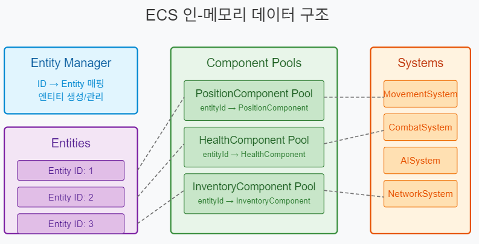
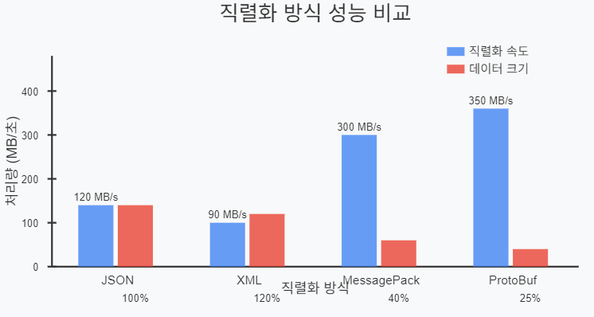
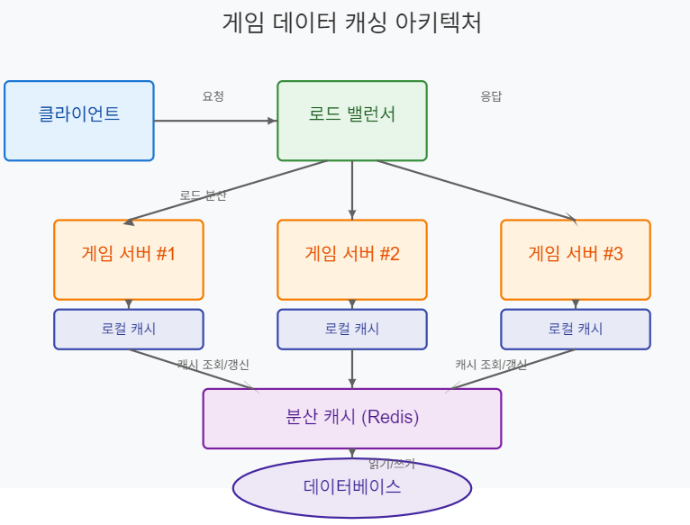

# ECS(Entity-Component-System) 기반 온라인 게임 서버

저자: 최흥배, Claude AI   
    
권장 개발 환경
- **IDE**: Visual Studio 2022 (Community 이상)
- **컴파일러**: .NET 9 이상
- **OS**: Windows 10 이상  
-----    
  
# 8. 데이터 관리
ECS 기반 온라인 게임 서버에서 데이터 관리는 성능과 확장성에 매우 중요한 역할을 한다. 이 챕터에서는 메모리 내 데이터 관리부터 데이터베이스 연동까지 게임 서버에 필요한 데이터 처리 방법을 다룬다.

## 8.1 인-메모리 데이터 관리

### ECS에서의 데이터 구조
ECS 아키텍처는 데이터(컴포넌트)와 로직(시스템)을 분리하는 패턴이다. 인-메모리 데이터 관리는 이 중 컴포넌트 데이터를 효율적으로 저장하고 접근하는 방법에 초점을 맞춘다.

```csharp
// ECS의 핵심 인터페이스
public interface IEntity
{
    int Id { get; }
    bool HasComponent<T>() where T : IComponent;
    T GetComponent<T>() where T : IComponent;
    void AddComponent<T>(T component) where T : IComponent;
    void RemoveComponent<T>() where T : IComponent;
}

public interface IComponent
{
    int EntityId { get; set; }
}

public interface ISystem
{
    void Update(float deltaTime);
}
```

### 데이터 컨테이너 설계
ECS에서 효율적인 데이터 접근을 위해 컴포넌트를 저장하는 방법은 중요하다. 다음은 메모리 효율성과 캐시 지역성을 고려한 컴포넌트 컨테이너다.

```csharp
public class ComponentPool<T> where T : IComponent, new()
{
    private readonly Dictionary<int, T> _components = new();
    
    public T Create(int entityId)
    {
        var component = new T { EntityId = entityId };
        _components[entityId] = component;
        return component;
    }
    
    public T Get(int entityId)
    {
        return _components.TryGetValue(entityId, out var component) ? component : default;
    }
    
    public bool Remove(int entityId)
    {
        return _components.Remove(entityId);
    }
    
    public IReadOnlyCollection<T> GetAll() => _components.Values;
}
```

### 메모리 최적화
게임 서버에서는 수만 개의 엔티티를 다루기 때문에 메모리 최적화가 중요하다. 다음은 객체 풀링을 사용한 메모리 최적화 예제다.

```csharp
public class EntityPool
{
    private readonly Stack<Entity> _pool = new();
    private readonly HashSet<int> _activeEntities = new();
    private int _nextId = 1;
    
    public Entity CreateEntity()
    {
        if (_pool.Count > 0)
        {
            var entity = _pool.Pop();
            _activeEntities.Add(entity.Id);
            return entity;
        }
        
        var newEntity = new Entity(_nextId++);
        _activeEntities.Add(newEntity.Id);
        return newEntity;
    }
    
    public void ReturnEntity(Entity entity)
    {
        if (_activeEntities.Remove(entity.Id))
        {
            entity.Reset();
            _pool.Push(entity);
        }
    }
}
```
  
   
  

### 메모리 관리 구현
위 그림에서 볼 수 있듯이 ECS 아키텍처에서는 각 컴포넌트 타입마다 별도의 풀을 사용해 메모리를 관리한다. 이런 구조는 다음과 같은 이점이 있다:

1. 캐시 지역성 향상 - 같은 타입의 컴포넌트가 메모리에 인접하게 배치됨
2. 반복 처리 성능 향상 - 특정 컴포넌트에 대한 시스템 연산이 더 효율적
3. 메모리 단편화 감소 - 같은 크기의 객체를 관리하기 때문

다음은 이러한 개념을 구현한 ECS 프레임워크의 기본 코드다:

```csharp
public class World
{
    private readonly Dictionary<Type, object> _componentPools = new();
    private readonly EntityPool _entityPool = new();
    private readonly List<ISystem> _systems = new();
    
    public Entity CreateEntity()
    {
        return _entityPool.CreateEntity();
    }
    
    public void DestroyEntity(Entity entity)
    {
        // 모든 컴포넌트 풀에서 엔티티 컴포넌트 제거
        foreach (var pool in _componentPools.Values)
        {
            var removeMethod = pool.GetType().GetMethod("Remove");
            removeMethod?.Invoke(pool, [entity.Id]);
        }
        
        _entityPool.ReturnEntity(entity);
    }
    
    public ComponentPool<T> GetComponentPool<T>() where T : IComponent, new()
    {
        var type = typeof(T);
        if (!_componentPools.TryGetValue(type, out var pool))
        {
            pool = new ComponentPool<T>();
            _componentPools[type] = pool;
        }
        
        return (ComponentPool<T>)pool;
    }
    
    public void AddSystem(ISystem system)
    {
        _systems.Add(system);
    }
    
    public void Update(float deltaTime)
    {
        foreach (var system in _systems)
        {
            system.Update(deltaTime);
        }
    }
}
```
  

## 8.2 데이터 직렬화
게임 서버에서 데이터 직렬화는 두 가지 주요 목적으로 사용된다:
1. 네트워크 통신 - 클라이언트-서버 간 데이터 전송
2. 영구 저장 - 데이터베이스 저장 또는 파일로 저장

### C#의 직렬화 옵션
C#에서는 여러 직렬화 방법을 제공한다:

```csharp
// System.Text.Json 사용 예제
public static class JsonSerializer
{
    public static string Serialize<T>(T obj)
    {
        return System.Text.Json.JsonSerializer.Serialize(obj);
    }
    
    public static T Deserialize<T>(string json)
    {
        return System.Text.Json.JsonSerializer.Deserialize<T>(json);
    }
}

// 바이너리 직렬화 예제
public static class BinarySerializer
{
    public static byte[] Serialize<T>(T obj)
    {
        using var stream = new MemoryStream();
        var formatter = new System.Runtime.Serialization.Formatters.Binary.BinaryFormatter();
#pragma warning disable SYSLIB0011 // 오래된 API 경고 무시
        formatter.Serialize(stream, obj);
#pragma warning restore SYSLIB0011
        return stream.ToArray();
    }
    
    public static T Deserialize<T>(byte[] data)
    {
        using var stream = new MemoryStream(data);
        var formatter = new System.Runtime.Serialization.Formatters.Binary.BinaryFormatter();
#pragma warning disable SYSLIB0011 // 오래된 API 경고 무시
        return (T)formatter.Deserialize(stream);
#pragma warning restore SYSLIB0011
    }
}
```

> 참고: BinaryFormatter는 .NET 9에서 보안 이슈로 권장되지 않는다. 실제 프로젝트에서는 MessagePack이나 ProtoBuf 같은 대안을 고려해야 한다.

### ECS 컴포넌트 직렬화
ECS 아키텍처에서는 컴포넌트 직렬화가 중요하다. 다음은 MessagePack을 사용한 직렬화 예제다:

```csharp
// MessagePack 패키지 참조 필요: dotnet add package MessagePack
using MessagePack;

// 직렬화 가능한 컴포넌트 정의
[MessagePackObject]
public class PositionComponent : IComponent
{
    [Key(0)]
    public int EntityId { get; set; }
    
    [Key(1)]
    public float X { get; set; }
    
    [Key(2)]
    public float Y { get; set; }
    
    [Key(3)]
    public float Z { get; set; }
}

// MessagePack 직렬화 유틸리티
public static class MessagePackSerializer
{
    public static byte[] Serialize<T>(T obj)
    {
        return MessagePack.MessagePackSerializer.Serialize(obj);
    }
    
    public static T Deserialize<T>(byte[] data)
    {
        return MessagePack.MessagePackSerializer.Deserialize<T>(data);
    }
    
    // 컴포넌트 풀 직렬화
    public static byte[] SerializeComponentPool<T>(ComponentPool<T> pool) where T : IComponent
    {
        return Serialize(pool.GetAll().ToArray());
    }
    
    // 컴포넌트 풀 역직렬화
    public static void DeserializeComponentPool<T>(byte[] data, ComponentPool<T> pool) where T : IComponent, new()
    {
        var components = Deserialize<T[]>(data);
        foreach (var component in components)
        {
            pool.Create(component.EntityId);
        }
    }
}
```

### 직렬화 성능 비교
       

위 그래프에서 볼 수 있듯이, MessagePack과 ProtoBuf 같은 바이너리 직렬화 방식이 JSON이나 XML보다 속도와 크기 측면에서 훨씬 효율적이다. 온라인 게임 서버와 같이 많은 데이터를 빠르게 처리해야 하는 환경에서는 이러한 성능 차이가 중요하다.

### 네트워크 메시지 직렬화
게임 서버와 클라이언트 간 통신을 위한 메시지 직렬화 구현이다:

```csharp
// 메시지 기본 인터페이스
public interface INetworkMessage
{
    MessageType MessageType { get; }
}

public enum MessageType
{
    PlayerJoin,
    PlayerMove,
    EntityCreate,
    EntityDestroy,
    ComponentUpdate
}

// 컴포넌트 업데이트 메시지
[MessagePackObject]
public class ComponentUpdateMessage : INetworkMessage
{
    [Key(0)]
    public MessageType MessageType => MessageType.ComponentUpdate;
    
    [Key(1)]
    public int EntityId { get; set; }
    
    [Key(2)]
    public string ComponentType { get; set; }
    
    [Key(3)]
    public byte[] ComponentData { get; set; }
}

// 네트워크 메시지 송수신 처리
public class NetworkSystem : ISystem
{
    private readonly World _world;
    
    public NetworkSystem(World world)
    {
        _world = world;
    }
    
    public void Update(float deltaTime)
    {
        // 메시지 수신 및 처리
        ProcessIncomingMessages();
        
        // 컴포넌트 변경사항 감지 및 메시지 전송
        SendComponentUpdates();
    }
    
    private void ProcessIncomingMessages()
    {
        // 실제 구현에서는 네트워크 라이브러리 사용
        // 여기서는 인터페이스만 정의
    }
    
    private void SendComponentUpdates()
    {
        // 변경된 컴포넌트만 클라이언트에 전송
        // 실제 구현에서는 네트워크 라이브러리 사용
    }
}
```
  

## 8.3 데이터베이스 연동
온라인 게임 서버는 플레이어 정보, 게임 상태, 아이템 등의 데이터를 영구 저장할 데이터베이스가 필요하다.

### 관계형 데이터베이스 연동
Entity Framework Core를 사용한 관계형 데이터베이스 연동 예제다:

```csharp
// NuGet 패키지 필요: Microsoft.EntityFrameworkCore.SqlServer
using Microsoft.EntityFrameworkCore;

// 데이터베이스 모델
public class Player
{
    public int Id { get; set; }
    public string Username { get; set; }
    public int Level { get; set; }
    public long Experience { get; set; }
    public DateTime LastLogin { get; set; }
    
    public virtual ICollection<PlayerItem> Items { get; set; }
}

public class PlayerItem
{
    public int Id { get; set; }
    public int PlayerId { get; set; }
    public int ItemTemplateId { get; set; }
    public int Quantity { get; set; }
    
    public virtual Player Player { get; set; }
}

// EF Core 데이터베이스 컨텍스트
public class GameDbContext : DbContext
{
    public DbSet<Player> Players { get; set; }
    public DbSet<PlayerItem> PlayerItems { get; set; }
    
    public GameDbContext(DbContextOptions<GameDbContext> options) : base(options)
    {
    }
    
    protected override void OnModelCreating(ModelBuilder modelBuilder)
    {
        modelBuilder.Entity<Player>()
            .HasKey(p => p.Id);
        
        modelBuilder.Entity<PlayerItem>()
            .HasKey(i => i.Id);
        
        modelBuilder.Entity<PlayerItem>()
            .HasOne(i => i.Player)
            .WithMany(p => p.Items)
            .HasForeignKey(i => i.PlayerId);
    }
}
```

### 비동기 데이터베이스 접근
게임 서버는 데이터베이스 작업으로 인한 지연을 최소화해야 한다. 다음은 비동기 데이터베이스 접근 예제다:

```csharp
// 비동기 데이터베이스 리포지토리
public class PlayerRepository
{
    private readonly GameDbContext _dbContext;
    
    public PlayerRepository(GameDbContext dbContext)
    {
        _dbContext = dbContext;
    }
    
    public async Task<Player> GetPlayerAsync(int playerId)
    {
        return await _dbContext.Players
            .Include(p => p.Items)
            .FirstOrDefaultAsync(p => p.Id == playerId);
    }
    
    public async Task SavePlayerAsync(Player player)
    {
        var existingPlayer = await _dbContext.Players
            .FirstOrDefaultAsync(p => p.Id == player.Id);
        
        if (existingPlayer == null)
        {
            _dbContext.Players.Add(player);
        }
        else
        {
            _dbContext.Entry(existingPlayer).CurrentValues.SetValues(player);
        }
        
        await _dbContext.SaveChangesAsync();
    }
}
```

### ECS와 데이터베이스 통합
ECS 아키텍처와 데이터베이스를 연동하는 서비스 구현이다:

```csharp
// 플레이어 엔티티와 데이터베이스 연동 서비스
public class PlayerPersistenceService
{
    private readonly World _world;
    private readonly PlayerRepository _playerRepository;
    
    public PlayerPersistenceService(World world, PlayerRepository playerRepository)
    {
        _world = world;
        _playerRepository = playerRepository;
    }
    
    // 플레이어 로드 - DB에서 엔티티로 변환
    public async Task<Entity> LoadPlayerAsync(int playerId)
    {
        var playerData = await _playerRepository.GetPlayerAsync(playerId);
        if (playerData == null)
        {
            return null;
        }
        
        var entity = _world.CreateEntity();
        
        // 플레이어 컴포넌트 추가
        var playerComponent = _world.GetComponentPool<PlayerComponent>().Create(entity.Id);
        playerComponent.PlayerId = playerData.Id;
        playerComponent.Username = playerData.Username;
        playerComponent.Level = playerData.Level;
        playerComponent.Experience = playerData.Experience;
        
        // 인벤토리 컴포넌트 추가
        var inventoryComponent = _world.GetComponentPool<InventoryComponent>().Create(entity.Id);
        foreach (var item in playerData.Items)
        {
            inventoryComponent.AddItem(item.ItemTemplateId, item.Quantity);
        }
        
        return entity;
    }
    
    // 플레이어 저장 - 엔티티에서 DB로 변환
    public async Task SavePlayerAsync(Entity entity)
    {
        var playerPool = _world.GetComponentPool<PlayerComponent>();
        var playerComponent = playerPool.Get(entity.Id);
        
        if (playerComponent == null)
        {
            return;
        }
        
        var playerData = await _playerRepository.GetPlayerAsync(playerComponent.PlayerId) 
                       ?? new Player { Id = playerComponent.PlayerId };
        
        // 플레이어 데이터 업데이트
        playerData.Username = playerComponent.Username;
        playerData.Level = playerComponent.Level;
        playerData.Experience = playerComponent.Experience;
        playerData.LastLogin = DateTime.UtcNow;
        
        // 인벤토리 데이터 업데이트
        var inventoryPool = _world.GetComponentPool<InventoryComponent>();
        var inventoryComponent = inventoryPool.Get(entity.Id);
        
        if (inventoryComponent != null)
        {
            playerData.Items ??= new List<PlayerItem>();
            
            // 기존 아이템 제거
            playerData.Items.Clear();
            
            // 새 아이템 추가
            foreach (var item in inventoryComponent.Items)
            {
                playerData.Items.Add(new PlayerItem
                {
                    PlayerId = playerData.Id,
                    ItemTemplateId = item.TemplateId,
                    Quantity = item.Quantity
                });
            }
        }
        
        await _playerRepository.SavePlayerAsync(playerData);
    }
}
```

### NoSQL 데이터베이스 연동
대규모 게임에서는 MongoDB 같은 NoSQL 데이터베이스가 유용할 수 있다:

```csharp
// NuGet 패키지 필요: MongoDB.Driver
using MongoDB.Bson;
using MongoDB.Bson.Serialization.Attributes;
using MongoDB.Driver;

// MongoDB 문서 모델
public class PlayerDocument
{
    [BsonId]
    public ObjectId Id { get; set; }
    
    public int PlayerId { get; set; }
    public string Username { get; set; }
    public int Level { get; set; }
    public long Experience { get; set; }
    public DateTime LastLogin { get; set; }
    public List<PlayerItemDocument> Items { get; set; } = new();
}

public class PlayerItemDocument
{
    public int ItemTemplateId { get; set; }
    public int Quantity { get; set; }
}

// MongoDB 리포지토리
public class MongoPlayerRepository
{
    private readonly IMongoCollection<PlayerDocument> _players;
    
    public MongoPlayerRepository(string connectionString, string databaseName)
    {
        var client = new MongoClient(connectionString);
        var database = client.GetDatabase(databaseName);
        _players = database.GetCollection<PlayerDocument>("players");
    }
    
    public async Task<PlayerDocument> GetPlayerAsync(int playerId)
    {
        return await _players.Find(p => p.PlayerId == playerId).FirstOrDefaultAsync();
    }
    
    public async Task SavePlayerAsync(PlayerDocument player)
    {
        await _players.ReplaceOneAsync(
            p => p.PlayerId == player.PlayerId,
            player,
            new ReplaceOptions { IsUpsert = true }
        );
    }
}
```
  

## 8.4 게임 데이터 캐싱 전략
온라인 게임 서버에서는 데이터베이스 접근을 최소화하고 응답 시간을 개선하기 위해 캐싱이 필수적이다.
  
   

### 인메모리 캐싱
가장 간단한 형태의 캐싱은 메모리 내 캐시다. C#에서 `MemoryCache`를 사용한 예제다:

```csharp
// NuGet 패키지 필요: Microsoft.Extensions.Caching.Memory
using Microsoft.Extensions.Caching.Memory;

public class MemoryCacheService
{
    private readonly IMemoryCache _cache;
    private readonly TimeSpan _defaultExpiration = TimeSpan.FromMinutes(10);
    
    public MemoryCacheService(IMemoryCache cache)
    {
        _cache = cache;
    }
    
    public T Get<T>(string key)
    {
        return _cache.TryGetValue(key, out T value) ? value : default;
    }
    
    public void Set<T>(string key, T value, TimeSpan? expiration = null)
    {
        var cacheOptions = new MemoryCacheEntryOptions
        {
            AbsoluteExpirationRelativeToNow = expiration ?? _defaultExpiration
        };
        
        _cache.Set(key, value, cacheOptions);
    }
    
    public void Remove(string key)
    {
        _cache.Remove(key);
    }
}
```

### 분산 캐싱 (Redis)
멀티 서버 환경에서는 Redis와 같은 분산 캐시가 필요하다:

```csharp
// NuGet 패키지 필요: StackExchange.Redis
using StackExchange.Redis;
using System.Text.Json;

public class RedisCacheService
{
    private readonly IConnectionMultiplexer _redis;
    private readonly IDatabase _db;
    private readonly TimeSpan _defaultExpiration = TimeSpan.FromMinutes(10);
    
    public RedisCacheService(string redisConnectionString)
    {
        _redis = ConnectionMultiplexer.Connect(redisConnectionString);
        _db = _redis.GetDatabase();
    }
    
    public async Task<T> GetAsync<T>(string key)
    {
        var value = await _db.StringGetAsync(key);
        
        if (value.IsNullOrEmpty)
        {
            return default;
        }
        
        return JsonSerializer.Deserialize<T>(value);
    }
    
    public async Task SetAsync<T>(string key, T value, TimeSpan? expiration = null)
    {
        var serializedValue = JsonSerializer.Serialize(value);
        await _db.StringSetAsync(key, serializedValue, expiration ?? _defaultExpiration);
    }
    
    public async Task RemoveAsync(string key)
    {
        await _db.KeyDeleteAsync(key);
    }
}
```

### 게임 데이터 캐싱 전략 구현
실제 게임 서버에서 사용할 수 있는 다단계 캐싱 전략 구현이다:

```csharp
public class PlayerCacheService
{
    private readonly MemoryCacheService _localCache;
    private readonly RedisCacheService _distributedCache;
    private readonly PlayerRepository _playerRepository;
    
    public PlayerCacheService(
        MemoryCacheService localCache,
        RedisCacheService distributedCache,
        PlayerRepository playerRepository)
    {
        _localCache = localCache;
        _distributedCache = distributedCache;
        _playerRepository = playerRepository;
    }
    
    public async Task<Player> GetPlayerAsync(int playerId)
    {
        // 1. 로컬 캐시 확인
        var cacheKey = $"player:{playerId}";
        var player = _localCache.Get<Player>(cacheKey);
        
        if (player != null)
        {
            return player;
        }
        
        // 2. 분산 캐시 확인
        player = await _distributedCache.GetAsync<Player>(cacheKey);
        
        if (player != null)
        {
            // 로컬 캐시에 저장 (짧은 만료 시간)
            _localCache.Set(cacheKey, player, TimeSpan.FromMinutes(5));
            return player;
        }
        
        // 3. 데이터베이스에서 조회
        player = await _playerRepository.GetPlayerAsync(playerId);
        
        if (player != null)
        {
            // 분산 캐시에 저장 (긴 만료 시간)
            await _distributedCache.SetAsync(cacheKey, player, TimeSpan.FromHours(1));
            
            // 로컬 캐시에도 저장 (짧은 만료 시간)
            _localCache.Set(cacheKey, player, TimeSpan.FromMinutes(5));
        }
        
        return player;
    }
    
    public async Task UpdatePlayerAsync(Player player)
    {
        var cacheKey = $"player:{player.Id}";
        
        // 1. 데이터베이스 업데이트
        await _playerRepository.SavePlayerAsync(player);
        
        // 2. 분산 캐시 업데이트 
        await _distributedCache.SetAsync(cacheKey, player, TimeSpan.FromHours(1));
        
        // 3. 로컬 캐시 업데이트
        _localCache.Set(cacheKey, player, TimeSpan.FromMinutes(5));
    }
    
    public async Task InvalidatePlayerCacheAsync(int playerId)
    {
        var cacheKey = $"player:{playerId}";
        
        // 분산 캐시 및 로컬 캐시에서 제거
        await _distributedCache.RemoveAsync(cacheKey);
        _localCache.Remove(cacheKey);
    }
}
```

### 쓰기 지연(Write-Behind) 전략
게임 서버에서는 지속적인 데이터베이스 쓰기 작업이 성능 병목이 될 수 있다. 다음은 이를 해결하기 위한 쓰기 지연 패턴 구현이다:

```csharp
public class WriteBehindCacheService<T> where T : class
{
    private readonly RedisCacheService _cache;
    private readonly Func<T, Task> _saveFunction;
    private readonly ConcurrentQueue<T> _pendingWrites = new();
    private readonly Timer _flushTimer;
    
    public WriteBehindCacheService(
        RedisCacheService cache,
        Func<T, Task> saveFunction,
        TimeSpan flushInterval)
    {
        _cache = cache;
        _saveFunction = saveFunction;
        _flushTimer = new Timer(async _ => await FlushPendingWritesAsync(), null, flushInterval, flushInterval);
    }
    
    public async Task WriteAsync(string key, T item)
    {
        // 캐시 업데이트
        await _cache.SetAsync(key, item);
        
        // 쓰기 대기열에 추가
        _pendingWrites.Enqueue(item);
    }
    
    private async Task FlushPendingWritesAsync()
    {
        // 대기 중인 쓰기 작업이 없으면 종료
        if (_pendingWrites.IsEmpty)
        {
            return;
        }
        
        // 대기 중인 모든 쓰기 작업 처리
        var tasks = new List<Task>();
        while (_pendingWrites.TryDequeue(out var item))
        {
            tasks.Add(_saveFunction(item));
        }
        
        // 모든 쓰기 작업 완료 대기
        await Task.WhenAll(tasks);
    }
    
    public void Dispose()
    {
        _flushTimer?.Dispose();
    }
}
```

### 읽기 전용 캐싱 (게임 상수 데이터)
게임 데이터 중 아이템, 스킬 등 변경되지 않는 정적 데이터는 읽기 전용 캐시로 관리하면 효율적이다:

```csharp
public class GameConstantsCache
{
    private readonly Dictionary<int, ItemTemplate> _itemTemplates = new();
    private readonly Dictionary<int, SkillTemplate> _skillTemplates = new();
    
    // 싱글톤 패턴
    private static GameConstantsCache _instance;
    public static GameConstantsCache Instance => _instance ??= new GameConstantsCache();
    
    private GameConstantsCache()
    {
        // 초기화시 모든 상수 데이터 로드
        LoadAllData();
    }
    
    private void LoadAllData()
    {
        // 아이템 데이터 로드
        LoadItemTemplates();
        
        // 스킬 데이터 로드
        LoadSkillTemplates();
    }
    
    private void LoadItemTemplates()
    {
        // 실제 구현에서는 데이터베이스나 파일에서 로드
        // 예시 데이터
        _itemTemplates[1] = new ItemTemplate { Id = 1, Name = "칼", Type = ItemType.Weapon, Power = 10 };
        _itemTemplates[2] = new ItemTemplate { Id = 2, Name = "방패", Type = ItemType.Shield, Defense = 5 };
        // ... 추가 아이템
    }
    
    private void LoadSkillTemplates()
    {
        // 실제 구현에서는 데이터베이스나 파일에서 로드
        // 예시 데이터
        _skillTemplates[1] = new SkillTemplate { Id = 1, Name = "불꽃 공격", Damage = 20, CooldownSeconds = 5 };
        _skillTemplates[2] = new SkillTemplate { Id = 2, Name = "얼음 화살", Damage = 15, CooldownSeconds = 3 };
        // ... 추가 스킬
    }
    
    public ItemTemplate GetItemTemplate(int id) => _itemTemplates.TryGetValue(id, out var template) ? template : null;
    
    public SkillTemplate GetSkillTemplate(int id) => _skillTemplates.TryGetValue(id, out var template) ? template : null;
    
    public IReadOnlyCollection<ItemTemplate> GetAllItemTemplates() => _itemTemplates.Values;
    
    public IReadOnlyCollection<SkillTemplate> GetAllSkillTemplates() => _skillTemplates.Values;
}

// 아이템 템플릿 클래스
public class ItemTemplate
{
    public int Id { get; set; }
    public string Name { get; set; }
    public ItemType Type { get; set; }
    public int Power { get; set; }
    public int Defense { get; set; }
}

public enum ItemType
{
    Weapon,
    Shield,
    Armor,
    Potion,
    Material
}

// 스킬 템플릿 클래스
public class SkillTemplate
{
    public int Id { get; set; }
    public string Name { get; set; }
    public int Damage { get; set; }
    public int CooldownSeconds { get; set; }
}
```
  

  
## 요약
ECS 기반 온라인 게임 서버에서 데이터 관리는 메모리 효율성, 직렬화 방식, 데이터베이스 연동, 그리고 효과적인 캐싱 전략까지 여러 측면을 고려해야 한다. 이 챕터에서는 다음 내용을 다뤘다:

1. **인-메모리 데이터 관리**: ECS 아키텍처에 맞는 컴포넌트 풀 설계와 메모리 최적화 기법
2. **데이터 직렬화**: 다양한 직렬화 방식과 성능 비교, 네트워크 메시지 직렬화 구현
3. **데이터베이스 연동**: 관계형/NoSQL 데이터베이스 연동 방법과 ECS와의 통합 기법
4. **게임 데이터 캐싱 전략**: 다단계 캐싱, 쓰기 지연, 읽기 전용 캐싱 등 게임 서버에 최적화된 캐싱 방법

이러한 기술을 적절히 조합하면 대규모 플레이어를 지원하는 고성능 게임 서버를 구축할 수 있다.  
    

  