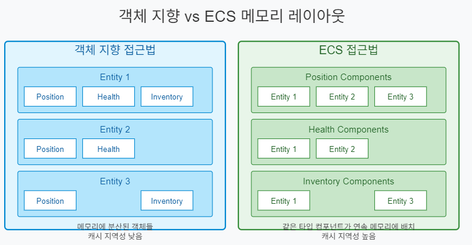
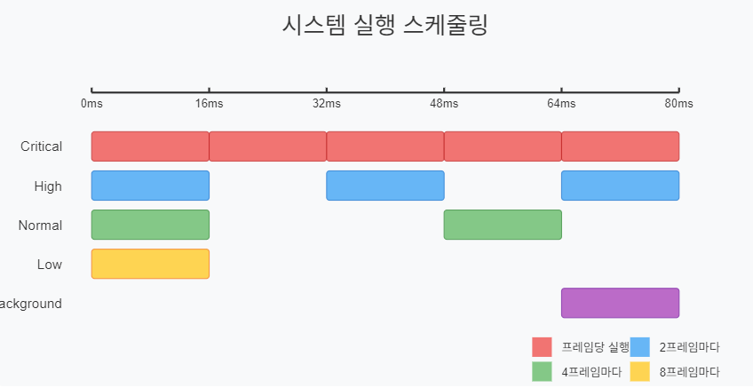
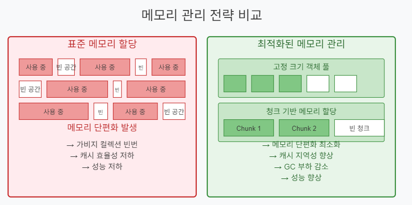
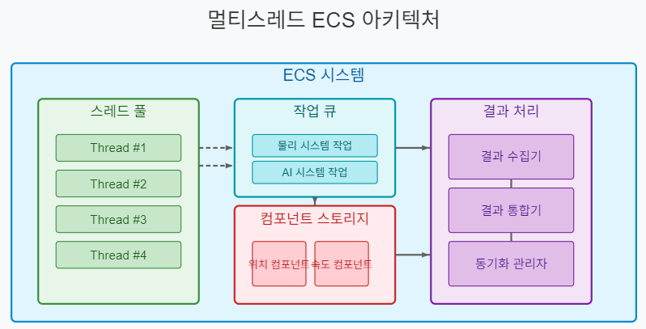

# ECS(Entity-Component-System) 기반 온라인 게임 서버

저자: 최흥배, Claude AI   
    
권장 개발 환경
- **IDE**: Visual Studio 2022 (Community 이상)
- **컴파일러**: .NET 9 이상
- **OS**: Windows 10 이상  
-----    
  
# 제4부: 고급 주제와 최적화  


# 9. 성능 최적화
ECS 기반 온라인 게임 서버에서 성능 최적화는 대규모 플레이어를 지원하기 위한 핵심 요소다. 이 챕터에서는 컴포넌트 접근부터 멀티스레딩까지 게임 서버의 성능을 극대화하는 방법을 알아본다.

## 9.1 컴포넌트 접근 최적화
ECS 아키텍처에서 컴포넌트 접근 방식은 전체 시스템 성능에 큰 영향을 미친다. 게임 서버에서는 수천, 수만 개의 엔티티를 처리해야 하므로 컴포넌트 접근 최적화가 필수적이다.

### 9.1.1 캐시 효율적인 컴포넌트 저장 구조
전통적인 객체 지향 방식과 ECS의 데이터 레이아웃 차이를 살펴보자.

   
위 그림에서 볼 수 있듯이, 객체 지향 방식에서는 각 엔티티가 자신의 모든 컴포넌트를 포함하고 있다. 반면 ECS에서는 같은 타입의 컴포넌트가 연속된 메모리에 저장된다. 이는 다음과 같은 성능 이점을 제공한다:

1. **캐시 지역성 향상**: 같은 타입의 컴포넌트가 메모리에 인접하게 배치되어 CPU 캐시 적중률이 높아짐
2. **벡터화 연산 활용**: SIMD(Single Instruction Multiple Data) 명령어로 여러 컴포넌트를 동시에 처리 가능
3. **데이터 지향 설계**: 데이터와 로직을 분리하여 데이터 흐름 최적화

### 9.1.2 배열 기반 컴포넌트 저장소
딕셔너리 대신 배열을 사용하면 컴포넌트 접근 속도를 크게 개선할 수 있다. 다음은 최적화된 컴포넌트 저장소 구현이다:

```csharp
public class ComponentArray<T> where T : struct, IComponent
{
    private readonly T[] _components;
    private readonly int[] _entityToIndexMap;
    private readonly int[] _indexToEntityMap;
    private int _size;
    
    public ComponentArray(int maxEntities)
    {
        _components = new T[maxEntities];
        _entityToIndexMap = new int[maxEntities];
        _indexToEntityMap = new int[maxEntities];
        
        // 초기화: -1은 매핑되지 않은 상태를 의미
        Array.Fill(_entityToIndexMap, -1);
    }
    
    public void Add(int entityId, T component)
    {
        if (_entityToIndexMap[entityId] != -1)
        {
            throw new InvalidOperationException($"이미 컴포넌트가 존재합니다: {typeof(T).Name}");
        }
        
        // 컴포넌트 배열의 끝에 새 컴포넌트 추가
        int newIndex = _size;
        _entityToIndexMap[entityId] = newIndex;
        _indexToEntityMap[newIndex] = entityId;
        _components[newIndex] = component;
        _size++;
    }
    
    public void Remove(int entityId)
    {
        if (_entityToIndexMap[entityId] == -1)
        {
            return;
        }
        
        // 마지막 컴포넌트를 삭제된 요소 위치로 이동하여 배열 압축
        int indexOfRemovedEntity = _entityToIndexMap[entityId];
        int indexOfLastElement = _size - 1;
        _components[indexOfRemovedEntity] = _components[indexOfLastElement];
        
        // 마지막 요소였던 엔티티의 매핑 업데이트
        int entityOfLastElement = _indexToEntityMap[indexOfLastElement];
        _entityToIndexMap[entityOfLastElement] = indexOfRemovedEntity;
        _indexToEntityMap[indexOfRemovedEntity] = entityOfLastElement;
        
        // 삭제된 엔티티의 매핑 제거
        _entityToIndexMap[entityId] = -1;
        _size--;
    }
    
    public ref T Get(int entityId)
    {
        if (_entityToIndexMap[entityId] == -1)
        {
            throw new KeyNotFoundException($"컴포넌트를 찾을 수 없습니다: {typeof(T).Name}");
        }
        
        // ref 반환으로 불필요한 복사 방지
        return ref _components[_entityToIndexMap[entityId]];
    }
    
    public bool Has(int entityId)
    {
        return _entityToIndexMap[entityId] != -1;
    }
    
    // 모든 컴포넌트에 대해 함수 실행 (캐시 효율적)
    public void ForEach(Action<int, ref T> action)
    {
        for (int i = 0; i < _size; i++)
        {
            action(_indexToEntityMap[i], ref _components[i]);
        }
    }
    
    // 배열에 대한 직접 접근 제공
    public Span<T> GetRawArray() => new Span<T>(_components, 0, _size);
    public ReadOnlySpan<int> GetEntityIds() => new ReadOnlySpan<int>(_indexToEntityMap, 0, _size);
}
```

위 코드의 주요 최적화 포인트:

1. **연속 메모리 사용**: 배열은 연속된 메모리 공간을 사용하여 캐시 효율성 증가
2. **O(1) 접근 시간**: 엔티티 ID에서 컴포넌트 인덱스로의 직접 매핑으로 빠른 조회
3. **압축 저장**: 중간에 컴포넌트가 제거되어도 배열이 압축되어 메모리 낭비 최소화
4. **ref 반환**: 컴포넌트를 복사하지 않고 참조로 반환하여 성능 향상
5. **Span 활용**: .NET 9.0의 Span<T>를 사용해 메모리 효율적인 컬렉션 접근

### 9.1.3 아키타입(Archetype) 기반 컴포넌트 접근
대규모 ECS 시스템에서는 아키타입 기반 접근이 효율적이다. 아키타입은 동일한 컴포넌트 구성을 가진 엔티티 그룹을 의미한다.

```csharp
// 아키타입 정의
public class Archetype
{
    private readonly HashSet<Type> _componentTypes = new();
    private readonly Dictionary<Type, IComponentArray> _componentArrays = new();
    private readonly List<int> _entities = new();
    
    public Archetype(params Type[] componentTypes)
    {
        foreach (var type in componentTypes)
        {
            _componentTypes.Add(type);
        }
    }
    
    public bool MatchesComponentTypes(HashSet<Type> types)
    {
        return _componentTypes.SetEquals(types);
    }
    
    public void RegisterComponentArray<T>(ComponentArray<T> array) where T : struct, IComponent
    {
        _componentArrays[typeof(T)] = array;
    }
    
    public void AddEntity(int entityId)
    {
        _entities.Add(entityId);
    }
    
    public void RemoveEntity(int entityId)
    {
        _entities.Remove(entityId);
    }
    
    public bool HasEntity(int entityId)
    {
        return _entities.Contains(entityId);
    }
    
    // 특정 타입의 컴포넌트 배열 가져오기
    public ComponentArray<T> GetComponentArray<T>() where T : struct, IComponent
    {
        if (_componentArrays.TryGetValue(typeof(T), out var array))
        {
            return (ComponentArray<T>)array;
        }
        
        return null;
    }
    
    // 아키타입이 시스템이 필요로 하는 모든 컴포넌트를 포함하는지 확인
    public bool MatchesSystem(HashSet<Type> systemRequiredTypes)
    {
        return systemRequiredTypes.IsSubsetOf(_componentTypes);
    }
}

// 아키타입 관리자
public class ArchetypeManager
{
    private readonly List<Archetype> _archetypes = new();
    private readonly Dictionary<int, Archetype> _entityToArchetype = new();
    
    // 엔티티와 컴포넌트 추가
    public void AddComponent<T>(int entityId, T component) where T : struct, IComponent
    {
        // 엔티티의 현재 아키타입 찾기
        var currentArchetype = _entityToArchetype.GetValueOrDefault(entityId);
        
        // 컴포넌트 타입 집합 생성
        var componentTypes = new HashSet<Type>();
        if (currentArchetype != null)
        {
            componentTypes = GetComponentTypes(currentArchetype);
        }
        
        // 새 컴포넌트 타입 추가
        componentTypes.Add(typeof(T));
        
        // 적합한 아키타입 찾거나 생성
        var newArchetype = FindOrCreateArchetype(componentTypes);
        
        // 이전 아키타입에서 엔티티 제거
        if (currentArchetype != null)
        {
            // 컴포넌트 데이터 저장
            var componentData = new Dictionary<Type, object>();
            foreach (var type in componentTypes.Where(t => t != typeof(T)))
            {
                // 구현 생략 - 컴포넌트 데이터 복사
            }
            
            currentArchetype.RemoveEntity(entityId);
            
            // 컴포넌트 데이터 복구
            // 구현 생략
        }
        
        // 새 아키타입에 엔티티 추가
        newArchetype.AddEntity(entityId);
        
        // 새 컴포넌트 추가
        var componentArray = newArchetype.GetComponentArray<T>();
        componentArray.Add(entityId, component);
        
        _entityToArchetype[entityId] = newArchetype;
    }
    
    // 구현 생략 - 나머지 메소드들...
    private HashSet<Type> GetComponentTypes(Archetype archetype)
    {
        // 구현 생략
        return new HashSet<Type>();
    }
    
    private Archetype FindOrCreateArchetype(HashSet<Type> componentTypes)
    {
        // 구현 생략
        return new Archetype();
    }
}
```

아키타입 기반 접근법은 다음과 같은 이점이 있다:

1. **효율적인 컴포넌트 필터링**: 필요한 컴포넌트 조합을 가진 엔티티만 빠르게 필터링
2. **컴포넌트 그룹 처리**: 동일한 구성의 엔티티를 함께 처리하여 캐시 효율성 향상
3. **시스템 매칭 최적화**: 시스템이 필요로 하는 컴포넌트를 가진 아키타입만 처리

### 9.1.4 컴포넌트 쿼리 최적화
시스템에서 필요한 컴포넌트만 효율적으로 찾을 수 있는 쿼리 시스템 구현이다:

```csharp
public class ComponentQuery<T> where T : struct, IComponent
{
    private readonly World _world;
    
    public ComponentQuery(World world)
    {
        _world = world;
    }
    
    // 특정 컴포넌트 타입을 가진 모든 엔티티에 대해 작업 수행
    public void ForEach(Action<int, ref T> action)
    {
        var componentArray = _world.GetComponentArray<T>();
        componentArray.ForEach(action);
    }
}

// 여러 컴포넌트 타입에 대한 쿼리 예시 (제네릭 제약으로 인해 간략화)
public class ComponentQuery<T1, T2> 
    where T1 : struct, IComponent
    where T2 : struct, IComponent
{
    private readonly World _world;
    
    public ComponentQuery(World world)
    {
        _world = world;
    }
    
    // 두 가지 컴포넌트 타입을 모두 가진 엔티티에 대해 작업 수행
    public void ForEach(Action<int, ref T1, ref T2> action)
    {
        var array1 = _world.GetComponentArray<T1>();
        var array2 = _world.GetComponentArray<T2>();
        
        // 첫 번째 배열 기준으로 순회하되, 두 번째 컴포넌트도 있는 엔티티만 처리
        array1.ForEach((entityId, ref component1) =>
        {
            if (array2.Has(entityId))
            {
                ref var component2 = ref array2.Get(entityId);
                action(entityId, ref component1, ref component2);
            }
        });
    }
}
```

더 효율적인 접근을 위해 비트 마스크 기반 필터링을 사용할 수 있다:

```csharp
public class ComponentMask
{
    private readonly BitArray _mask;
    private readonly Dictionary<Type, int> _componentTypeToIndex;
    
    public ComponentMask(Dictionary<Type, int> componentTypeToIndex)
    {
        _componentTypeToIndex = componentTypeToIndex;
        _mask = new BitArray(componentTypeToIndex.Count);
    }
    
    public void Set<T>() where T : IComponent
    {
        if (_componentTypeToIndex.TryGetValue(typeof(T), out int index))
        {
            _mask[index] = true;
        }
    }
    
    public bool Matches(ComponentMask other)
    {
        // this가 other의 부분집합인지 확인
        for (int i = 0; i < _mask.Length; i++)
        {
            if (_mask[i] && !other._mask[i])
            {
                return false;
            }
        }
        
        return true;
    }
}

// 비트 마스크를 사용한 시스템 매칭
public abstract class System
{
    protected readonly ComponentMask RequiredComponents;
    
    protected System(World world)
    {
        RequiredComponents = new ComponentMask(world.ComponentTypeToIndex);
    }
    
    public bool MatchesEntity(ComponentMask entityMask)
    {
        return RequiredComponents.Matches(entityMask);
    }
    
    public abstract void Update(float deltaTime);
}
```
  

## 9.2 시스템 실행 스케줄링
효율적인 시스템 실행 스케줄링은 게임 서버의 성능과 반응성을 크게 향상시킨다.

### 9.2.1 시스템 우선순위 관리
모든 시스템이 같은 빈도로 실행될 필요는 없다. 중요도와 빈도에 따라 시스템을 분류하고 스케줄링하는 방법이다:

```csharp
public enum SystemPriority
{
    Critical = 0,  // 매 프레임 반드시 실행 (플레이어 입력, 물리)
    High = 1,      // 거의 매 프레임 실행 (이동, 충돌)
    Normal = 2,    // 보통 빈도로 실행 (AI, 게임 로직)
    Low = 3,       // 가끔 실행 (시각 효과, 애니메이션)
    Background = 4 // 백그라운드 작업 (데이터 저장, 정리)
}

public class SystemScheduler
{
    private readonly Dictionary<SystemPriority, List<ISystem>> _systemsByPriority = new();
    private readonly Dictionary<ISystem, SystemConfig> _systemConfigs = new();
    
    public SystemScheduler()
    {
        foreach (SystemPriority priority in Enum.GetValues(typeof(SystemPriority)))
        {
            _systemsByPriority[priority] = new List<ISystem>();
        }
    }
    
    // 시스템 등록
    public void RegisterSystem(ISystem system, SystemPriority priority, float executionInterval = 0)
    {
        _systemsByPriority[priority].Add(system);
        _systemConfigs[system] = new SystemConfig
        {
            Priority = priority,
            ExecutionInterval = executionInterval,
            LastExecutionTime = 0
        };
    }
    
    // 모든 시스템 업데이트
    public void UpdateSystems(float deltaTime, float currentTime)
    {
        foreach (SystemPriority priority in Enum.GetValues(typeof(SystemPriority)))
        {
            foreach (var system in _systemsByPriority[priority])
            {
                var config = _systemConfigs[system];
                
                // 실행 간격 체크
                if (currentTime - config.LastExecutionTime >= config.ExecutionInterval)
                {
                    system.Update(deltaTime);
                    config.LastExecutionTime = currentTime;
                }
            }
        }
    }
}

public class SystemConfig
{
    public SystemPriority Priority { get; set; }
    public float ExecutionInterval { get; set; } // 실행 간격 (초)
    public float LastExecutionTime { get; set; } // 마지막 실행 시간
}
```

### 9.2.2 시간 기반 스케줄링
실행 빈도에 따라 시스템을 그룹화하고 시간 기반으로 실행하는 방법이다:  
     
  
```csharp
public class TimeBasedSystemScheduler
{
    public class SystemGroup
    {
        public string Name { get; set; }
        public float UpdateInterval { get; set; } // 초 단위
        public List<ISystem> Systems { get; } = new();
        public float LastUpdateTime { get; set; }
        
        public bool ShouldUpdate(float currentTime)
        {
            return currentTime - LastUpdateTime >= UpdateInterval;
        }
    }
    
    private readonly List<SystemGroup> _systemGroups = new();
    private float _fixedTimeStep = 1.0f / 60.0f; // 60Hz 기본 타임스텝
    
    public void AddSystemGroup(string name, float updateInterval)
    {
        _systemGroups.Add(new SystemGroup
        {
            Name = name,
            UpdateInterval = updateInterval
        });
    }
    
    public void AddSystem(string groupName, ISystem system)
    {
        var group = _systemGroups.Find(g => g.Name == groupName);
        if (group != null)
        {
            group.Systems.Add(system);
        }
    }
    
    // 고정 타임스텝 업데이트 (물리 등에 적합)
    public void FixedUpdate(float deltaTime)
    {
        float currentTime = (float)DateTime.UtcNow.TimeOfDay.TotalSeconds;
        
        // 고정 간격으로 그룹 업데이트
        foreach (var group in _systemGroups)
        {
            if (group.ShouldUpdate(currentTime))
            {
                foreach (var system in group.Systems)
                {
                    system.Update(_fixedTimeStep); // 항상 고정된 델타 타임 전달
                }
                
                group.LastUpdateTime = currentTime;
            }
        }
    }
    
    // 가변 타임스텝 업데이트
    public void Update(float deltaTime)
    {
        float currentTime = (float)DateTime.UtcNow.TimeOfDay.TotalSeconds;
        
        foreach (var group in _systemGroups)
        {
            if (group.ShouldUpdate(currentTime))
            {
                foreach (var system in group.Systems)
                {
                    system.Update(deltaTime); // 실제 경과 시간 전달
                }
                
                group.LastUpdateTime = currentTime;
            }
        }
    }
}
```

### 9.2.3 종속성 기반 스케줄링
시스템 간 종속성을 고려한 스케줄링은 데이터 흐름의 일관성을 보장한다:

```csharp
public class DependencyBasedSystemScheduler
{
    public class SystemNode
    {
        public ISystem System { get; set; }
        public List<SystemNode> Dependencies { get; } = new();
        public List<SystemNode> DependentSystems { get; } = new();
        public bool Visited { get; set; }
        public bool InProgress { get; set; }
    }
    
    private readonly Dictionary<ISystem, SystemNode> _systemNodes = new();
    private readonly List<SystemNode> _sortedSystems = new();
    private bool _dirty = true;
    
    // 시스템 추가
    public void AddSystem(ISystem system)
    {
        if (!_systemNodes.ContainsKey(system))
        {
            _systemNodes[system] = new SystemNode { System = system };
            _dirty = true;
        }
    }
    
    // 종속성 추가 (dependent는 dependency가 실행된 후에 실행됨)
    public void AddDependency(ISystem dependent, ISystem dependency)
    {
        if (!_systemNodes.TryGetValue(dependent, out var dependentNode))
        {
            dependentNode = new SystemNode { System = dependent };
            _systemNodes[dependent] = dependentNode;
        }
        
        if (!_systemNodes.TryGetValue(dependency, out var dependencyNode))
        {
            dependencyNode = new SystemNode { System = dependency };
            _systemNodes[dependency] = dependencyNode;
        }
        
        dependentNode.Dependencies.Add(dependencyNode);
        dependencyNode.DependentSystems.Add(dependentNode);
        _dirty = true;
    }
    
    // 위상 정렬 수행
    private void TopologicalSort()
    {
        if (!_dirty)
        {
            return;
        }
        
        _sortedSystems.Clear();
        
        foreach (var node in _systemNodes.Values)
        {
            node.Visited = false;
            node.InProgress = false;
        }
        
        foreach (var node in _systemNodes.Values)
        {
            if (!node.Visited)
            {
                VisitNode(node);
            }
        }
        
        _dirty = false;
    }
    
    private void VisitNode(SystemNode node)
    {
        node.InProgress = true;
        
        foreach (var dependency in node.Dependencies)
        {
            if (dependency.InProgress)
            {
                throw new InvalidOperationException("순환 종속성 발견: 시스템 간 순환 참조가 있습니다.");
            }
            
            if (!dependency.Visited)
            {
                VisitNode(dependency);
            }
        }
        
        node.Visited = true;
        node.InProgress = false;
        _sortedSystems.Add(node);
    }
    
    // 정렬된 순서로 시스템 업데이트
    public void UpdateSystems(float deltaTime)
    {
        TopologicalSort();
        
        foreach (var node in _sortedSystems)
        {
            node.System.Update(deltaTime);
        }
    }
}
```

### 9.2.4 조건부 시스템 실행
모든 시스템을 항상 실행할 필요는 없다. 조건부 시스템 실행으로 불필요한 처리를 줄일 수 있다:

```csharp
public interface IConditionalSystem : ISystem
{
    bool ShouldExecute();
}

public class SystemExecutor
{
    private readonly List<ISystem> _unconditionalSystems = new();
    private readonly List<IConditionalSystem> _conditionalSystems = new();
    
    public void RegisterSystem(ISystem system)
    {
        if (system is IConditionalSystem conditionalSystem)
        {
            _conditionalSystems.Add(conditionalSystem);
        }
        else
        {
            _unconditionalSystems.Add(system);
        }
    }
    
    public void ExecuteSystems(float deltaTime)
    {
        // 무조건 실행되는 시스템
        foreach (var system in _unconditionalSystems)
        {
            system.Update(deltaTime);
        }
        
        // 조건부 시스템
        foreach (var system in _conditionalSystems)
        {
            if (system.ShouldExecute())
            {
                system.Update(deltaTime);
            }
        }
    }
}

// 구현 예시
public class CombatSystem : IConditionalSystem
{
    private readonly World _world;
    
    public CombatSystem(World world)
    {
        _world = world;
    }
    
    public bool ShouldExecute()
    {
        // 전투 중인 엔티티가 있는지 확인
        var query = _world.CreateQuery<CombatComponent>();
        return query.Count() > 0;
    }
    
    public void Update(float deltaTime)
    {
        // 전투 로직
    }
}
```
  

## 9.3 메모리 관리 전략
게임 서버에서 효율적인 메모리 관리는 성능과 안정성에 중요한 영향을 미친다.

### 9.3.1 객체 풀링
새 객체를 생성하고 삭제하는 대신 재사용하여 가비지 컬렉션 부하를 줄이는 방법이다:

```csharp
public class ObjectPool<T> where T : class, new()
{
    private readonly Stack<T> _pool = new();
    private readonly Action<T> _resetAction;
    private readonly int _initialCapacity;
    private readonly int _maxCapacity;
    
    public ObjectPool(int initialCapacity = 100, int maxCapacity = 1000, Action<T> resetAction = null)
    {
        _initialCapacity = initialCapacity;
        _maxCapacity = maxCapacity;
        _resetAction = resetAction;
        
        // 초기 용량만큼 객체 생성
        for (int i = 0; i < initialCapacity; i++)
        {
            _pool.Push(new T());
        }
    }
    
    public T Get()
    {
        if (_pool.Count == 0)
        {
            return new T(); // 풀이 비었으면 새로 생성
        }
        
        return _pool.Pop();
    }
    
    public void Return(T obj)
    {
        if (obj == null) return;
        
        // 객체 초기화
        _resetAction?.Invoke(obj);
        
        // 최대 용량 체크
        if (_pool.Count < _maxCapacity)
        {
            _pool.Push(obj);
        }
    }
    
    // 보다 효율적인 다중 객체 획득
    public T[] GetMultiple(int count)
    {
        var result = new T[count];
        for (int i = 0; i < count; i++)
        {
            result[i] = Get();
        }
        return result;
    }
    
    // 다중 객체 반환
    public void ReturnMultiple(IEnumerable<T> objects)
    {
        foreach (var obj in objects)
        {
            Return(obj);
        }
    }
}

// 메시지 객체 풀링 예시
public class MessagePool
{
    private readonly ObjectPool<NetworkMessage> _messagePool;
    
    public MessagePool()
    {
        _messagePool = new ObjectPool<NetworkMessage>(
            initialCapacity: 1000,
            maxCapacity: 10000,
            resetAction: (msg) => msg.Reset()
        );
    }
    
    public NetworkMessage GetMessage()
    {
        return _messagePool.Get();
    }
    
    public void ReturnMessage(NetworkMessage message)
    {
        _messagePool.Return(message);
    }
}
```

### 9.3.2 메모리 단편화 방지
메모리 단편화는 성능을 저하시키는 주요 원인이다. 이를 방지하는 기법을 살펴보자:   
     
  
```csharp
// 고정 크기 청크 기반 메모리 할당기
public class ChunkMemoryAllocator<T> where T : struct
{
    private readonly List<T[]> _chunks = new();
    private readonly int _chunkSize;
    private readonly Stack<(int ChunkIndex, int ElementIndex)> _freeSlots = new();
    
    public ChunkMemoryAllocator(int chunkSize = 1024)
    {
        _chunkSize = chunkSize;
        AddChunk(); // 초기 청크 생성
    }
    
    private void AddChunk()
    {
        int chunkIndex = _chunks.Count;
        var newChunk = new T[_chunkSize];
        _chunks.Add(newChunk);
        
        // 새 청크의 모든 슬롯을 빈 슬롯으로 등록
        for (int i = _chunkSize - 1; i >= 0; i--)
        {
            _freeSlots.Push((chunkIndex, i));
        }
    }
    
    public (int ChunkIndex, int ElementIndex) Allocate()
    {
        if (_freeSlots.Count == 0)
        {
            AddChunk();
        }
        
        return _freeSlots.Pop();
    }
    
    public ref T Get(int chunkIndex, int elementIndex)
    {
        return ref _chunks[chunkIndex][elementIndex];
    }
    
    public void Free(int chunkIndex, int elementIndex)
    {
        _freeSlots.Push((chunkIndex, elementIndex));
    }
    
    // 특정 컴포넌트 타입에 대한 모든 인스턴스 순회
    public void ForEach(Action<ref T> action)
    {
        foreach (var chunk in _chunks)
        {
            for (int i = 0; i < _chunkSize; i++)
            {
                action(ref chunk[i]);
            }
        }
    }
    
    // 청크 단위로 병렬 처리에 효율적
    public void ParallelForEach(Action<T[]> chunkAction)
    {
        Parallel.ForEach(_chunks, chunkAction);
    }
}

// 컴포넌트 저장을 위한 최적화된 메모리 관리자
public class ComponentMemoryManager
{
    private readonly Dictionary<Type, object> _allocators = new();
    
    // 컴포넌트 타입별 할당기 가져오기
    public ChunkMemoryAllocator<T> GetAllocator<T>() where T : struct, IComponent
    {
        var type = typeof(T);
        if (!_allocators.TryGetValue(type, out var allocator))
        {
            allocator = new ChunkMemoryAllocator<T>();
            _allocators[type] = allocator;
        }
        
        return (ChunkMemoryAllocator<T>)allocator;
    }
    
    // 컴포넌트 할당
    public (int ChunkIndex, int ElementIndex) AllocateComponent<T>() where T : struct, IComponent
    {
        return GetAllocator<T>().Allocate();
    }
    
    // 컴포넌트 접근
    public ref T GetComponent<T>(int chunkIndex, int elementIndex) where T : struct, IComponent
    {
        return ref GetAllocator<T>().Get(chunkIndex, elementIndex);
    }
    
    // 컴포넌트 해제
    public void FreeComponent<T>(int chunkIndex, int elementIndex) where T : struct, IComponent
    {
        GetAllocator<T>().Free(chunkIndex, elementIndex);
    }
}
```

### 9.3.3 값 타입 활용
C#에서는 참조 타입 대신 값 타입(struct)을 사용하여 가비지 컬렉션 오버헤드를 줄일 수 있다:

```csharp
// 값 타입 컴포넌트
public struct PositionComponent : IComponent
{
    public int EntityId { get; set; }
    public float X;
    public float Y;
    public float Z;
}

public struct VelocityComponent : IComponent
{
    public int EntityId { get; set; }
    public float X;
    public float Y;
    public float Z;
}

// 값 타입 활용 예시
public class MovementSystem : ISystem
{
    private readonly ComponentArray<PositionComponent> _positions;
    private readonly ComponentArray<VelocityComponent> _velocities;
    private readonly HashSet<int> _entities = new();
    
    public MovementSystem(World world)
    {
        _positions = world.GetComponentArray<PositionComponent>();
        _velocities = world.GetComponentArray<VelocityComponent>();
        
        // 두 컴포넌트를 모두 가진 엔티티 찾기
        _positions.ForEach((entityId, ref _) =>
        {
            if (_velocities.Has(entityId))
            {
                _entities.Add(entityId);
            }
        });
    }
    
    public void Update(float deltaTime)
    {
        foreach (var entityId in _entities)
        {
            ref var position = ref _positions.Get(entityId);
            ref var velocity = ref _velocities.Get(entityId);
            
            // ref로 직접 접근하여 불필요한 복사 없이 업데이트
            position.X += velocity.X * deltaTime;
            position.Y += velocity.Y * deltaTime;
            position.Z += velocity.Z * deltaTime;
        }
    }
}
```

### 9.3.4 가비지 컬렉션 최적화
.NET의 가비지 컬렉션은 자동으로 메모리를 관리하지만, 최적화를 통해 성능을 개선할 수 있다:

```csharp
public class GCOptimizer
{
    private long _lastCollectionTime;
    private readonly TimeSpan _collectionInterval = TimeSpan.FromMinutes(5);
    
    // 가비지 컬렉션 최적화 옵션 설정
    public void Initialize()
    {
        // 서버에서는 배경 GC가 적합
        GCSettings.LatencyMode = GCLatencyMode.Batch;
        
        // 대규모 객체 힙(LOH) 압축 활성화
        GCSettings.LargeObjectHeapCompactionMode = GCLargeObjectHeapCompactionMode.CompactOnce;
    }
    
    // 주기적인 계획된 가비지 컬렉션
    public void ScheduledCollection()
    {
        long now = DateTime.UtcNow.Ticks;
        if (now - _lastCollectionTime > _collectionInterval.Ticks)
        {
            // 서버 부하가 적을 때 수동으로 GC 실행
            GC.Collect(2, GCCollectionMode.Optimized, false, true);
            _lastCollectionTime = now;
        }
    }
    
    // 메모리 사용량 모니터링
    public long GetMemoryUsage()
    {
        return GC.GetTotalMemory(false);
    }
    
    // 위험 수준에 도달하면 긴급 가비지 컬렉션
    public void EmergencyGCIfNeeded(long thresholdBytes)
    {
        if (GetMemoryUsage() > thresholdBytes)
        {
            GC.Collect(2, GCCollectionMode.Forced, true, true);
        }
    }
}
```

## 9.4 병렬 처리와 멀티스레딩
현대 서버 하드웨어의 다중 코어를 활용하기 위해서는 효율적인 멀티스레딩 구현이 필요하다.

### 9.4.1 작업 병렬화
독립적인 작업을 병렬로 처리하여 성능을 향상시킬 수 있다:

```csharp
public class ParallelSystemExecutor
{
    private readonly List<ISystem> _systems = new();
    private readonly ParallelOptions _parallelOptions = new();
    
    public ParallelSystemExecutor(int maxDegreeOfParallelism = -1)
    {
        // -1은 사용 가능한 모든 프로세서 사용
        _parallelOptions.MaxDegreeOfParallelism = maxDegreeOfParallelism;
    }
    
    public void AddSystem(ISystem system)
    {
        _systems.Add(system);
    }
    
    // 모든 시스템을 병렬로 실행
    public void ExecuteAll(float deltaTime)
    {
        Parallel.ForEach(_systems, _parallelOptions, system =>
        {
            system.Update(deltaTime);
        });
    }
    
    // 시스템을 그룹으로 나누어 단계별 실행
    public void ExecuteInGroups(float deltaTime, List<List<ISystem>> systemGroups)
    {
        foreach (var group in systemGroups)
        {
            Parallel.ForEach(group, _parallelOptions, system =>
            {
                system.Update(deltaTime);
            });
        }
    }
}
```

### 9.4.2 데이터 병렬화
대량의 엔티티 데이터를 병렬로 처리하여 성능을 향상시킬 수 있다:

```csharp
public class ParallelComponentProcessor
{
    // 컴포넌트 배열 병렬 처리
    public void ProcessComponentsInParallel<T>(ComponentArray<T> components, Action<int, ref T> action)
        where T : struct, IComponent
    {
        var entityIds = components.GetEntityIds();
        var rawArray = components.GetRawArray();
        
        Parallel.For(0, entityIds.Length, i =>
        {
            action(entityIds[i], ref rawArray[i]);
        });
    }
    
    // 청크 기반 병렬 처리
    public void ProcessChunksInParallel<T>(ChunkMemoryAllocator<T> allocator, Action<Span<T>> chunkAction)
        where T : struct, IComponent
    {
        allocator.ParallelForEach(chunk =>
        {
            chunkAction(new Span<T>(chunk));
        });
    }
}

// 병렬 물리 시스템 예시
public class ParallelPhysicsSystem : ISystem
{
    private readonly World _world;
    private readonly ParallelComponentProcessor _processor;
    
    public ParallelPhysicsSystem(World world, ParallelComponentProcessor processor)
    {
        _world = world;
        _processor = processor;
    }
    
    public void Update(float deltaTime)
    {
        var positions = _world.GetComponentArray<PositionComponent>();
        var velocities = _world.GetComponentArray<VelocityComponent>();
        var accelerations = _world.GetComponentArray<AccelerationComponent>();
        
        // 가속도 기반 속도 업데이트
        _processor.ProcessComponentsInParallel(
            velocities,
            (entityId, ref VelocityComponent velocity) =>
            {
                if (accelerations.Has(entityId))
                {
                    ref var acceleration = ref accelerations.Get(entityId);
                    velocity.X += acceleration.X * deltaTime;
                    velocity.Y += acceleration.Y * deltaTime;
                    velocity.Z += acceleration.Z * deltaTime;
                }
            }
        );
        
        // 속도 기반 위치 업데이트
        _processor.ProcessComponentsInParallel(
            positions,
            (entityId, ref PositionComponent position) =>
            {
                if (velocities.Has(entityId))
                {
                    ref var velocity = ref velocities.Get(entityId);
                    position.X += velocity.X * deltaTime;
                    position.Y += velocity.Y * deltaTime;
                    position.Z += velocity.Z * deltaTime;
                }
            }
        );
    }
}
```

### 9.4.3 스레드 안전한 컴포넌트 접근
멀티스레드 환경에서는 동시성 제어가 필요하다. 다음은 스레드 안전한 컴포넌트 접근 구현이다:  
     
  
```csharp
// 스레드 안전한 컴포넌트 접근을 위한 읽기/쓰기 잠금
public class ThreadSafeComponentAccess<T> where T : struct, IComponent
{
    private readonly ComponentArray<T> _components;
    private readonly ReaderWriterLockSlim _lock = new();
    
    public ThreadSafeComponentAccess(ComponentArray<T> components)
    {
        _components = components;
    }
    
    // 읽기 전용 접근 (여러 스레드에서 동시에 가능)
    public T Read(int entityId)
    {
        try
        {
            _lock.EnterReadLock();
            return _components.Get(entityId);
        }
        finally
        {
            _lock.ExitReadLock();
        }
    }
    
    // 쓰기 접근 (한 번에 하나의 스레드만 가능)
    public void Write(int entityId, T component)
    {
        try
        {
            _lock.EnterWriteLock();
            if (_components.Has(entityId))
            {
                ref var comp = ref _components.Get(entityId);
                comp = component;
            }
            else
            {
                _components.Add(entityId, component);
            }
        }
        finally
        {
            _lock.ExitWriteLock();
        }
    }
    
    // 읽기-수정-쓰기 패턴
    public void Update(int entityId, Action<ref T> updateAction)
    {
        try
        {
            _lock.EnterWriteLock();
            if (_components.Has(entityId))
            {
                ref var component = ref _components.Get(entityId);
                updateAction(ref component);
            }
        }
        finally
        {
            _lock.ExitWriteLock();
        }
    }
    
    // 읽기 작업 일괄 처리
    public void ForEachRead(Action<int, T> action)
    {
        try
        {
            _lock.EnterReadLock();
            _components.ForEach((entityId, ref component) =>
            {
                action(entityId, component);
            });
        }
        finally
        {
            _lock.ExitReadLock();
        }
    }
}
```

### 9.4.4 작업 기반 비동기 처리
긴 작업을 비동기로 처리하여 메인 스레드 차단을 방지할 수 있다:

```csharp
public class AsyncSystemExecutor
{
    private readonly Dictionary<Type, Task> _runningTasks = new();
    private readonly CancellationTokenSource _cancellationTokenSource = new();
    
    // 비동기 시스템 인터페이스
    public interface IAsyncSystem
    {
        Task ExecuteAsync(float deltaTime, CancellationToken cancellationToken);
    }
    
    // 비동기 시스템 실행
    public async Task ExecuteSystemAsync<T>(T system, float deltaTime) where T : IAsyncSystem
    {
        var systemType = system.GetType();
        
        // 이미 실행 중인 작업이 있으면 취소
        if (_runningTasks.TryGetValue(systemType, out var runningTask) && !runningTask.IsCompleted)
        {
            // 취소하고 완료 대기
            _cancellationTokenSource.Cancel();
            try
            {
                await runningTask;
            }
            catch (OperationCanceledException)
            {
                // 취소 예외 무시
            }
            _cancellationTokenSource.Dispose();
            _cancellationTokenSource = new CancellationTokenSource();
        }
        
        // 새 작업 시작
        var task = system.ExecuteAsync(deltaTime, _cancellationTokenSource.Token);
        _runningTasks[systemType] = task;
        
        // 작업 완료 대기
        await task;
    }
    
    // 모든 시스템 종료
    public async Task ShutdownAllAsync()
    {
        _cancellationTokenSource.Cancel();
        
        try
        {
            await Task.WhenAll(_runningTasks.Values);
        }
        catch (OperationCanceledException)
        {
            // 취소 예외 무시
        }
    }
}

// 비동기 AI 시스템 예시
public class AsyncAISystem : AsyncSystemExecutor.IAsyncSystem
{
    private readonly World _world;
    
    public AsyncAISystem(World world)
    {
        _world = world;
    }
    
    public async Task ExecuteAsync(float deltaTime, CancellationToken cancellationToken)
    {
        var aiComponents = _world.GetComponentArray<AIComponent>();
        
        // 이 작업은 백그라운드 스레드에서 실행
        await Task.Run(() =>
        {
            aiComponents.ForEach((entityId, ref AIComponent aiComponent) =>
            {
                if (cancellationToken.IsCancellationRequested)
                {
                    return;
                }
                
                UpdateAI(entityId, ref aiComponent, deltaTime);
            });
        }, cancellationToken);
    }
    
    private void UpdateAI(int entityId, ref AIComponent aiComponent, float deltaTime)
    {
        // AI 로직 구현 (경로 탐색, 의사 결정 등)
    }
}
```

### 9.4.5 스레드 안전한 이벤트 시스템
멀티스레드 환경에서 이벤트를 안전하게 처리하는 방법이다:

```csharp
public class ThreadSafeEventSystem
{
    private readonly ConcurrentQueue<GameEvent> _eventQueue = new();
    private readonly ConcurrentDictionary<Type, List<Action<GameEvent>>> _handlers = new();
    private readonly ConcurrentDictionary<Guid, EventSubscription> _subscriptions = new();
    
    // 이벤트 기본 클래스
    public abstract class GameEvent
    {
        public Guid Id { get; } = Guid.NewGuid();
        public DateTime Timestamp { get; } = DateTime.UtcNow;
    }
    
    // 이벤트 구독 관리
    public class EventSubscription
    {
        public Guid Id { get; } = Guid.NewGuid();
        public Type EventType { get; set; }
        public Action<GameEvent> Handler { get; set; }
    }
    
    // 이벤트 발행
    public void Publish<T>(T gameEvent) where T : GameEvent
    {
        _eventQueue.Enqueue(gameEvent);
    }
    
    // 이벤트 구독
    public Guid Subscribe<T>(Action<T> handler) where T : GameEvent
    {
        var eventType = typeof(T);
        
        var handlers = _handlers.GetOrAdd(eventType, _ => new List<Action<GameEvent>>());
        
        var wrappedHandler = new Action<GameEvent>(e => handler((T)e));
        
        var subscription = new EventSubscription
        {
            EventType = eventType,
            Handler = wrappedHandler
        };
        
        _subscriptions[subscription.Id] = subscription;
        
        lock (handlers)
        {
            handlers.Add(wrappedHandler);
        }
        
        return subscription.Id;
    }
    
    // 구독 취소
    public bool Unsubscribe(Guid subscriptionId)
    {
        if (_subscriptions.TryRemove(subscriptionId, out var subscription))
        {
            var handlers = _handlers.GetOrAdd(subscription.EventType, _ => new List<Action<GameEvent>>());
            
            lock (handlers)
            {
                handlers.Remove(subscription.Handler);
            }
            
            return true;
        }
        
        return false;
    }
    
    // 이벤트 처리
    public void ProcessEvents(int maxEventsPerUpdate = 100)
    {
        int processedCount = 0;
        
        while (processedCount < maxEventsPerUpdate && _eventQueue.TryDequeue(out var gameEvent))
        {
            var eventType = gameEvent.GetType();
            
            if (_handlers.TryGetValue(eventType, out var handlers))
            {
                // 핸들러 목록의 스냅샷을 만들어 스레드 안전하게 처리
                Action<GameEvent>[] handlersSnapshot;
                lock (handlers)
                {
                    handlersSnapshot = handlers.ToArray();
                }
                
                // 모든 핸들러에게 이벤트 전달
                foreach (var handler in handlersSnapshot)
                {
                    handler(gameEvent);
                }
            }
            
            processedCount++;
        }
    }
}
```
  

  
## 요약
ECS 기반 온라인 게임 서버의 성능을 최적화하는 다양한 기법을 살펴봤다:

1. **컴포넌트 접근 최적화**
   - 캐시 효율적인 데이터 레이아웃
   - 배열 기반 컴포넌트 저장소
   - 아키타입 기반 구조
   - 효율적인 컴포넌트 쿼리

2. **시스템 실행 스케줄링**
   - 우선순위 기반 스케줄링
   - 시간 기반 실행
   - 종속성 관리
   - 조건부 실행

3. **메모리 관리 전략**
   - 객체 풀링
   - 단편화 방지
   - 값 타입 활용
   - 가비지 컬렉션 최적화

4. **병렬 처리와 멀티스레딩**
   - 작업 병렬화
   - 데이터 병렬화
   - 스레드 안전한 접근
   - 비동기 처리

이러한 최적화 기법을 적용하면 수천 또는 수만 명의 동시 접속자를 처리할 수 있는 고성능 게임 서버를 구축할 수 있다. 성능 최적화는 지속적인 과정으로, 벤치마킹과 프로파일링을 통해 병목 지점을 찾고 개선해 나가는 것이 중요하다.
  
  
