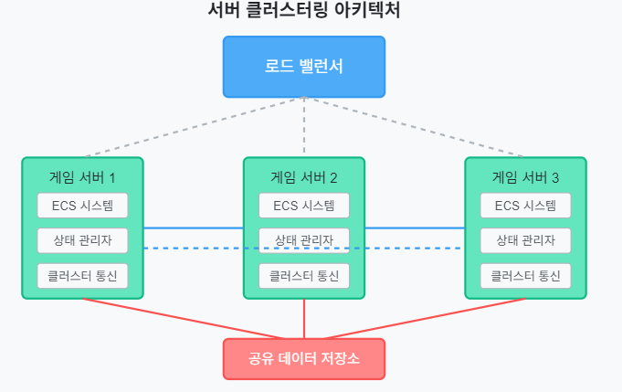
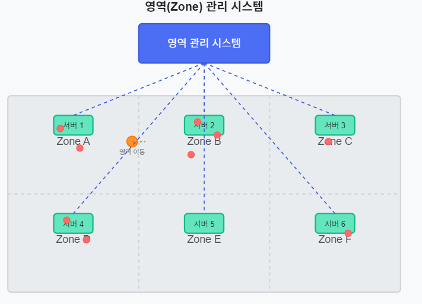
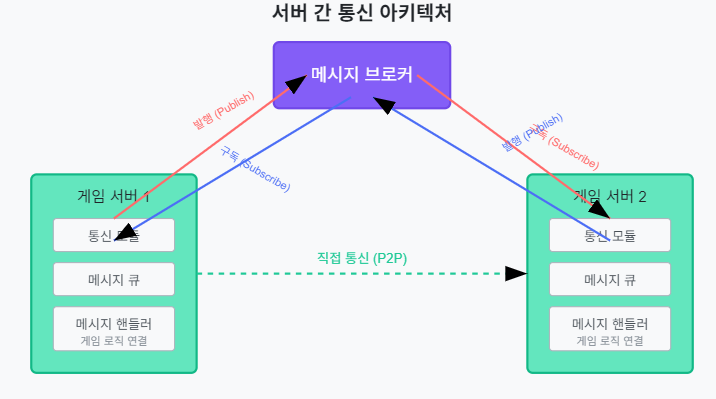
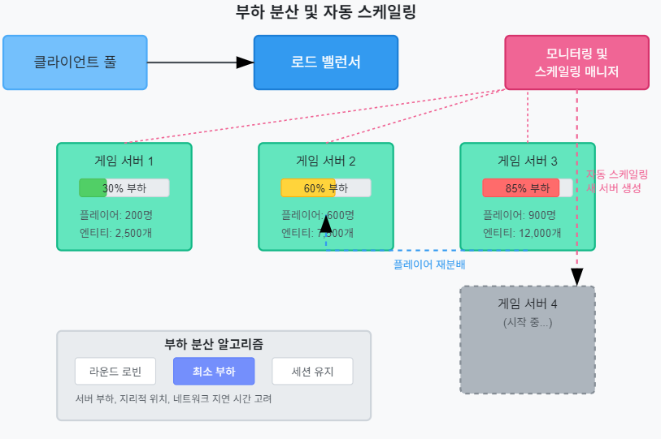

# ECS(Entity-Component-System) 기반 온라인 게임 서버

저자: 최흥배, Claude AI   
    
권장 개발 환경
- **IDE**: Visual Studio 2022 (Community 이상)
- **컴파일러**: .NET 9 이상
- **OS**: Windows 10 이상  
-----    
  
# 10. 확장성 있는 서버 구조
온라인 게임 서버는 대규모 사용자를 지원하기 위해 확장성 있는 아키텍처가 필수적이다. 이 장에서는 ECS 패턴을 기반으로 한 확장 가능한 서버 구조를 설계하고 구현하는 방법을 다룬다.

## 10.1 서버 클러스터링
서버 클러스터링은 여러 서버 인스턴스를 하나의 논리적 단위로 묶어 관리하는 기술이다. 이를 통해 부하 분산, 고가용성, 장애 대응 능력을 향상시킬 수 있다.

### 서버 클러스터링의 기본 개념
   
클러스터링 환경에서는 각 서버 인스턴스가 독립적으로 작동하면서도 서로 협력하여 하나의 논리적 시스템으로 작동한다. ECS 기반 게임 서버에서 클러스터링을 적용할 때는 다음 요소를 고려해야 한다:

1. **인스턴스 관리**: 각 서버 인스턴스의 생성, 종료, 상태 모니터링
2. **상태 공유**: 서버 간 필요한 상태 정보 공유
3. **서비스 발견**: 클러스터 내 서비스 위치 자동 탐색
4. **장애 감지 및 복구**: 서버 장애 시 자동 감지 및 복구

### 클러스터 노드 구현
클러스터의 각 노드(서버 인스턴스)는 다음과 같은 구성 요소를 가진다:

```csharp
namespace GameServer.Clustering
{
    public class ClusterNode
    {
        private readonly string _nodeId;
        private readonly ClusterConfig _config;
        private readonly IClusterCommunicator _communicator;
        private readonly IServiceDiscovery _serviceDiscovery;
        private readonly Dictionary<string, NodeInfo> _nodeRegistry = new();
        private readonly ILogger<ClusterNode> _logger;
        private Timer _heartbeatTimer;
        private bool _isRunning;

        public string NodeId => _nodeId;
        public NodeState State { get; private set; }

        public ClusterNode(
            string nodeId,
            ClusterConfig config,
            IClusterCommunicator communicator,
            IServiceDiscovery serviceDiscovery,
            ILogger<ClusterNode> logger)
        {
            _nodeId = nodeId;
            _config = config;
            _communicator = communicator;
            _serviceDiscovery = serviceDiscovery;
            _logger = logger;
            State = NodeState.Initializing;
        }

        public async Task StartAsync()
        {
            if (_isRunning)
                return;

            _logger.LogInformation("노드 {NodeId} 시작 중...", _nodeId);
            
            // 서비스 디스커버리에 등록
            await _serviceDiscovery.RegisterNodeAsync(new NodeInfo
            {
                Id = _nodeId,
                Endpoint = _config.NodeEndpoint,
                State = NodeState.Starting,
                StartTime = DateTime.UtcNow,
                Tags = _config.Tags
            });

            // 클러스터 통신 초기화
            await _communicator.InitializeAsync(_nodeId, MessageHandlerAsync);

            // 하트비트 타이머 시작
            _heartbeatTimer = new Timer(SendHeartbeat, null, 
                TimeSpan.Zero, TimeSpan.FromSeconds(_config.HeartbeatIntervalSeconds));

            State = NodeState.Running;
            _isRunning = true;
            
            _logger.LogInformation("노드 {NodeId} 시작됨", _nodeId);
            
            // 다른 노드 정보 요청
            await RequestClusterStateAsync();
        }

        public async Task StopAsync()
        {
            if (!_isRunning)
                return;

            _logger.LogInformation("노드 {NodeId} 종료 중...", _nodeId);
            
            State = NodeState.Stopping;
            
            // 하트비트 타이머 중지
            _heartbeatTimer?.Change(Timeout.Infinite, 0);
            _heartbeatTimer?.Dispose();
            
            // 종료 메시지 브로드캐스트
            await _communicator.BroadcastAsync(new ClusterMessage
            {
                Type = MessageType.NodeShutdown,
                SenderId = _nodeId,
                Timestamp = DateTime.UtcNow
            });
            
            // 서비스 디스커버리에서 등록 해제
            await _serviceDiscovery.UnregisterNodeAsync(_nodeId);
            
            // 통신 종료
            await _communicator.ShutdownAsync();
            
            _isRunning = false;
            State = NodeState.Stopped;
            
            _logger.LogInformation("노드 {NodeId} 종료됨", _nodeId);
        }

        private async void SendHeartbeat(object state)
        {
            try
            {
                await _communicator.BroadcastAsync(new ClusterMessage
                {
                    Type = MessageType.Heartbeat,
                    SenderId = _nodeId,
                    Timestamp = DateTime.UtcNow,
                    Data = new HeartbeatData
                    {
                        State = State,
                        LoadInfo = GetCurrentLoadInfo()
                    }
                });
                
                // 서비스 디스커버리 정보 업데이트
                await _serviceDiscovery.UpdateNodeStatusAsync(_nodeId, State);
            }
            catch (Exception ex)
            {
                _logger.LogError(ex, "하트비트 전송 중 오류 발생");
            }
        }

        private async Task MessageHandlerAsync(ClusterMessage message)
        {
            switch (message.Type)
            {
                case MessageType.Heartbeat:
                    UpdateNodeStatus(message);
                    break;
                    
                case MessageType.NodeJoined:
                    await HandleNodeJoinedAsync(message);
                    break;
                    
                case MessageType.NodeShutdown:
                    RemoveNode(message.SenderId);
                    break;
                    
                case MessageType.ClusterStateRequest:
                    await SendClusterStateAsync(message.SenderId);
                    break;
                    
                case MessageType.ClusterStateResponse:
                    UpdateClusterState(message);
                    break;
                
                // 기타 메시지 타입 처리...
                default:
                    _logger.LogWarning("알 수 없는 메시지 타입: {MessageType}", message.Type);
                    break;
            }
        }

        // 나머지 구현...
    }

    public enum NodeState
    {
        Initializing,
        Starting,
        Running,
        Degraded,
        Stopping,
        Stopped,
        Failed
    }
}
```

### 서비스 디스커버리 인터페이스
클러스터 내 서비스를 발견하기 위한 인터페이스:

```csharp
public interface IServiceDiscovery
{
    Task RegisterNodeAsync(NodeInfo nodeInfo);
    Task UnregisterNodeAsync(string nodeId);
    Task UpdateNodeStatusAsync(string nodeId, NodeState state);
    Task<IEnumerable<NodeInfo>> GetAllNodesAsync();
    Task<NodeInfo> GetNodeAsync(string nodeId);
    Task<IEnumerable<NodeInfo>> FindNodesByTagsAsync(string[] tags);
}

public class NodeInfo
{
    public string Id { get; set; }
    public string Endpoint { get; set; }
    public NodeState State { get; set; }
    public DateTime StartTime { get; set; }
    public string[] Tags { get; set; }
}
```

### Redis 기반 서비스 디스커버리 구현
Redis를 활용한 서비스 디스커버리 구현 예:

```csharp
public class RedisServiceDiscovery : IServiceDiscovery
{
    private readonly ConnectionMultiplexer _redis;
    private readonly IDatabase _db;
    private readonly string _keyPrefix;
    private readonly ILogger<RedisServiceDiscovery> _logger;

    public RedisServiceDiscovery(string connectionString, string keyPrefix, ILogger<RedisServiceDiscovery> logger)
    {
        _redis = ConnectionMultiplexer.Connect(connectionString);
        _db = _redis.GetDatabase();
        _keyPrefix = keyPrefix;
        _logger = logger;
    }

    public async Task RegisterNodeAsync(NodeInfo nodeInfo)
    {
        string key = $"{_keyPrefix}:node:{nodeInfo.Id}";
        string value = JsonSerializer.Serialize(nodeInfo);
        
        await _db.StringSetAsync(key, value);
        await _db.SetAddAsync($"{_keyPrefix}:nodes", nodeInfo.Id);
        
        foreach (var tag in nodeInfo.Tags)
        {
            await _db.SetAddAsync($"{_keyPrefix}:tag:{tag}", nodeInfo.Id);
        }
        
        _logger.LogInformation("노드 {NodeId} 등록됨", nodeInfo.Id);
    }

    public async Task UnregisterNodeAsync(string nodeId)
    {
        string key = $"{_keyPrefix}:node:{nodeId}";
        
        // 노드 정보 가져오기
        var nodeInfoJson = await _db.StringGetAsync(key);
        if (nodeInfoJson.IsNullOrEmpty)
            return;
            
        var nodeInfo = JsonSerializer.Deserialize<NodeInfo>(nodeInfoJson);
        
        // 태그에서 노드 제거
        foreach (var tag in nodeInfo.Tags)
        {
            await _db.SetRemoveAsync($"{_keyPrefix}:tag:{tag}", nodeId);
        }
        
        // 노드 등록 정보 제거
        await _db.KeyDeleteAsync(key);
        await _db.SetRemoveAsync($"{_keyPrefix}:nodes", nodeId);
        
        _logger.LogInformation("노드 {NodeId} 등록 해제됨", nodeId);
    }

    // 나머지 인터페이스 구현...
}
```

## 10.2 영역(Zone) 관리
대규모 게임 세계를 효율적으로 관리하기 위해 영역(Zone) 개념을 도입하여 서버 부하를 분산시킬 수 있다. 

### 영역 관리 시스템 구조
     

### 영역 관리 시스템 설계

영역 관리의 핵심 요소:

1. **영역 정의**: 게임 세계를 논리적 영역으로 분할
2. **영역 할당**: 서버 인스턴스에 영역 할당
3. **영역 간 전환**: 플레이어가 영역 간 이동 시 처리
4. **영역 로드 밸런싱**: 영역별 부하에 따른 재분배

### 영역 관리자 구현

```csharp
namespace GameServer.Zoning
{
    public class ZoneManager
    {
        private readonly Dictionary<string, Zone> _zones = new();
        private readonly Dictionary<string, string> _entityZoneMap = new();
        private readonly IClusterNode _clusterNode;
        private readonly IZoneRepository _zoneRepository;
        private readonly ILogger<ZoneManager> _logger;

        public ZoneManager(
            IClusterNode clusterNode, 
            IZoneRepository zoneRepository,
            ILogger<ZoneManager> logger)
        {
            _clusterNode = clusterNode;
            _zoneRepository = zoneRepository;
            _logger = logger;
        }

        public async Task InitializeAsync()
        {
            // 담당 영역 로드
            var assignedZones = await _zoneRepository.GetZonesForNodeAsync(_clusterNode.NodeId);
            
            foreach (var zoneInfo in assignedZones)
            {
                var zone = new Zone(zoneInfo.Id, zoneInfo.Bounds, _clusterNode.NodeId);
                _zones.Add(zoneInfo.Id, zone);
                
                _logger.LogInformation("영역 {ZoneId} 로드됨", zoneInfo.Id);
            }
            
            // 영역 변경 이벤트 구독
            _clusterNode.SubscribeToMessage(MessageType.ZoneAssignment, HandleZoneAssignmentAsync);
            _clusterNode.SubscribeToMessage(MessageType.EntityTransfer, HandleEntityTransferAsync);
        }

        public bool TryGetZone(string zoneId, out Zone zone)
        {
            return _zones.TryGetValue(zoneId, out zone);
        }

        public string GetEntityZone(string entityId)
        {
            return _entityZoneMap.TryGetValue(entityId, out var zoneId) ? zoneId : null;
        }

        public async Task AddEntityToZoneAsync(string zoneId, string entityId, EntityData entityData)
        {
            if (!_zones.TryGetValue(zoneId, out var zone))
            {
                _logger.LogWarning("엔티티 {EntityId}를 추가할 수 없음: 영역 {ZoneId} 찾을 수 없음", entityId, zoneId);
                return;
            }

            zone.AddEntity(entityId, entityData);
            _entityZoneMap[entityId] = zoneId;
            
            await _zoneRepository.UpdateZoneEntityCountAsync(zoneId, zone.EntityCount);
            _logger.LogInformation("엔티티 {EntityId} 영역 {ZoneId}에 추가됨", entityId, zoneId);
        }

        public async Task MoveEntityBetweenZonesAsync(string entityId, string sourceZoneId, string targetZoneId, Vector2 position)
        {
            // 두 영역이 모두 이 노드에 있는 경우
            if (_zones.ContainsKey(sourceZoneId) && _zones.ContainsKey(targetZoneId))
            {
                if (_zones[sourceZoneId].TryRemoveEntity(entityId, out var entityData))
                {
                    entityData.Position = position;
                    _zones[targetZoneId].AddEntity(entityId, entityData);
                    _entityZoneMap[entityId] = targetZoneId;
                    
                    _logger.LogInformation("엔티티 {EntityId} 영역 간 이동: {SourceZone} -> {TargetZone}", 
                        entityId, sourceZoneId, targetZoneId);
                    
                    await _zoneRepository.UpdateZoneEntityCountAsync(sourceZoneId, _zones[sourceZoneId].EntityCount);
                    await _zoneRepository.UpdateZoneEntityCountAsync(targetZoneId, _zones[targetZoneId].EntityCount);
                }
            }
            // 타겟 영역이 다른 노드에 있는 경우
            else if (_zones.ContainsKey(sourceZoneId) && !_zones.ContainsKey(targetZoneId))
            {
                // 영역 소유 노드 조회
                var targetNodeId = await _zoneRepository.GetZoneNodeAsync(targetZoneId);
                if (string.IsNullOrEmpty(targetNodeId))
                {
                    _logger.LogWarning("타겟 영역 {ZoneId}의 노드 정보를 찾을 수 없음", targetZoneId);
                    return;
                }
                
                if (_zones[sourceZoneId].TryRemoveEntity(entityId, out var entityData))
                {
                    // 엔티티 전송 메시지 생성
                    var transferMessage = new ClusterMessage
                    {
                        Type = MessageType.EntityTransfer,
                        SenderId = _clusterNode.NodeId,
                        TargetId = targetNodeId,
                        Data = new EntityTransferData
                        {
                            EntityId = entityId,
                            TargetZoneId = targetZoneId,
                            Position = position,
                            EntityData = entityData
                        }
                    };
                    
                    // 타겟 노드로 전송
                    await _clusterNode.SendMessageAsync(targetNodeId, transferMessage);
                    
                    _entityZoneMap.Remove(entityId);
                    
                    _logger.LogInformation("엔티티 {EntityId} 노드 간 전송: {SourceZone} -> 노드 {TargetNode}의 {TargetZone}", 
                        entityId, sourceZoneId, targetNodeId, targetZoneId);
                    
                    await _zoneRepository.UpdateZoneEntityCountAsync(sourceZoneId, _zones[sourceZoneId].EntityCount);
                }
            }
        }

        private async Task HandleZoneAssignmentAsync(ClusterMessage message)
        {
            var assignmentData = (ZoneAssignmentData)message.Data;
            
            // 영역 할당 처리
            if (assignmentData.TargetNodeId == _clusterNode.NodeId)
            {
                // 새 영역 로드
                var zoneInfo = await _zoneRepository.GetZoneAsync(assignmentData.ZoneId);
                var zone = new Zone(zoneInfo.Id, zoneInfo.Bounds, _clusterNode.NodeId);
                _zones[zoneInfo.Id] = zone;
                
                _logger.LogInformation("새 영역 {ZoneId} 할당됨", zoneInfo.Id);
                
                // 필요한 경우 엔티티 로드
                if (assignmentData.EntityTransfers != null)
                {
                    foreach (var transfer in assignmentData.EntityTransfers)
                    {
                        zone.AddEntity(transfer.EntityId, transfer.EntityData);
                        _entityZoneMap[transfer.EntityId] = zoneInfo.Id;
                        
                        _logger.LogInformation("영역 할당 중 엔티티 {EntityId} 추가됨", transfer.EntityId);
                    }
                }
                
                await _zoneRepository.UpdateZoneEntityCountAsync(zoneInfo.Id, zone.EntityCount);
            }
            // 영역 할당 해제 처리
            else if (assignmentData.SourceNodeId == _clusterNode.NodeId)
            {
                if (_zones.TryGetValue(assignmentData.ZoneId, out var zone))
                {
                    _zones.Remove(assignmentData.ZoneId);
                    
                    // 이 영역의 모든 엔티티 ID 제거
                    var entityIds = zone.GetAllEntityIds().ToList();
                    foreach (var entityId in entityIds)
                    {
                        _entityZoneMap.Remove(entityId);
                    }
                    
                    _logger.LogInformation("영역 {ZoneId} 할당 해제됨, 엔티티 {EntityCount}개 제거됨", 
                        assignmentData.ZoneId, entityIds.Count);
                }
            }
        }

        private async Task HandleEntityTransferAsync(ClusterMessage message)
        {
            var transferData = (EntityTransferData)message.Data;
            
            // 타겟 영역이 이 노드에 있는지 확인
            if (_zones.TryGetValue(transferData.TargetZoneId, out var zone))
            {
                // 엔티티 추가
                zone.AddEntity(transferData.EntityId, transferData.EntityData);
                _entityZoneMap[transferData.EntityId] = transferData.TargetZoneId;
                
                _logger.LogInformation("전송된 엔티티 {EntityId} 영역 {ZoneId}에 추가됨", 
                    transferData.EntityId, transferData.TargetZoneId);
                
                await _zoneRepository.UpdateZoneEntityCountAsync(transferData.TargetZoneId, zone.EntityCount);
                
                // 확인 메시지 전송
                await _clusterNode.SendMessageAsync(message.SenderId, new ClusterMessage
                {
                    Type = MessageType.EntityTransferAck,
                    SenderId = _clusterNode.NodeId,
                    TargetId = message.SenderId,
                    Data = new EntityTransferAckData
                    {
                        EntityId = transferData.EntityId,
                        Success = true
                    }
                });
            }
            else
            {
                _logger.LogWarning("전송된 엔티티 {EntityId}를 추가할 수 없음: 영역 {ZoneId} 찾을 수 없음", 
                    transferData.EntityId, transferData.TargetZoneId);
                
                // 실패 메시지 전송
                await _clusterNode.SendMessageAsync(message.SenderId, new ClusterMessage
                {
                    Type = MessageType.EntityTransferAck,
                    SenderId = _clusterNode.NodeId,
                    TargetId = message.SenderId,
                    Data = new EntityTransferAckData
                    {
                        EntityId = transferData.EntityId,
                        Success = false,
                        ErrorMessage = $"영역 {transferData.TargetZoneId}를 찾을 수 없음"
                    }
                });
            }
        }
    }
}
```

### 영역 클래스 구현

```csharp
public class Zone
{
    private readonly string _id;
    private readonly Bounds2D _bounds;
    private readonly string _nodeId;
    private readonly Dictionary<string, EntityData> _entities = new();
    private readonly object _syncLock = new();

    public string Id => _id;
    public Bounds2D Bounds => _bounds;
    public string NodeId => _nodeId;
    public int EntityCount => _entities.Count;

    public Zone(string id, Bounds2D bounds, string nodeId)
    {
        _id = id;
        _bounds = bounds;
        _nodeId = nodeId;
    }

    public void AddEntity(string entityId, EntityData data)
    {
        lock (_syncLock)
        {
            _entities[entityId] = data;
        }
    }

    public bool TryGetEntity(string entityId, out EntityData data)
    {
        lock (_syncLock)
        {
            return _entities.TryGetValue(entityId, out data);
        }
    }

    public bool TryRemoveEntity(string entityId, out EntityData data)
    {
        lock (_syncLock)
        {
            if (_entities.TryGetValue(entityId, out data))
            {
                _entities.Remove(entityId);
                return true;
            }
            return false;
        }
    }

    public IEnumerable<string> GetAllEntityIds()
    {
        lock (_syncLock)
        {
            return _entities.Keys.ToList();
        }
    }

    public IEnumerable<KeyValuePair<string, EntityData>> GetEntitiesInArea(Bounds2D area)
    {
        lock (_syncLock)
        {
            return _entities
                .Where(kvp => area.Contains(kvp.Value.Position))
                .ToList();
        }
    }
}

public class Bounds2D
{
    public Vector2 Min { get; }
    public Vector2 Max { get; }

    public Bounds2D(Vector2 min, Vector2 max)
    {
        Min = min;
        Max = max;
    }

    public bool Contains(Vector2 position)
    {
        return position.X >= Min.X && position.X <= Max.X &&
               position.Y >= Min.Y && position.Y <= Max.Y;
    }

    public bool Overlaps(Bounds2D other)
    {
        return Min.X <= other.Max.X && Max.X >= other.Min.X &&
               Min.Y <= other.Max.Y && Max.Y >= other.Min.Y;
    }
}
```

### 영역 경계 이동 처리
플레이어가 영역 경계를 넘어갈 때 처리하는 ECS 시스템:

```csharp
public class ZoneBoundaryCrossingSystem : ISystem
{
    private readonly IZoneManager _zoneManager;
    private readonly IComponentManager _componentManager;
    private readonly IEntityManager _entityManager;
    private readonly ILogger<ZoneBoundaryCrossingSystem> _logger;

    public ZoneBoundaryCrossingSystem(
        IZoneManager zoneManager,
        IComponentManager componentManager,
        IEntityManager entityManager,
        ILogger<ZoneBoundaryCrossingSystem> logger)
    {
        _zoneManager = zoneManager;
        _componentManager = componentManager;
        _entityManager = entityManager;
        _logger = logger;
    }

    public void Initialize()
    {
        // 시스템 초기화
    }

    public void Update(float deltaTime)
    {
        var positionComponents = _componentManager.GetAllComponentsOfType<PositionComponent>();
        
        foreach (var (entityId, positionComponent) in positionComponents)
        {
            // 현재 엔티티의
            var currentZoneId = _zoneManager.GetEntityZone(entityId);
            if (currentZoneId == null)
                continue;
                
            if (_zoneManager.TryGetZone(currentZoneId, out var currentZone))
            {
                // 현재 위치가 현재 영역 내에 있는지 확인
                var position = new Vector2(positionComponent.X, positionComponent.Y);
                if (!currentZone.Bounds.Contains(position))
                {
                    // 현재 위치를 포함하는 새 영역 찾기
                    var newZoneId = FindZoneForPosition(position);
                    if (newZoneId != null && newZoneId != currentZoneId)
                    {
                        // 영역 간 이동 처리
                        _logger.LogInformation("엔티티 {EntityId}의 영역 경계 이동 감지: {CurrentZone} -> {NewZone}", 
                            entityId, currentZoneId, newZoneId);
                            
                        _zoneManager.MoveEntityBetweenZonesAsync(entityId, currentZoneId, newZoneId, position).Wait();
                        
                        // 영역 변경 이벤트 발생
                        _entityManager.TriggerEvent(new ZoneCrossingEvent
                        {
                            EntityId = entityId,
                            OldZoneId = currentZoneId,
                            NewZoneId = newZoneId,
                            Position = position
                        });
                    }
                }
            }
        }
    }

    private string FindZoneForPosition(Vector2 position)
    {
        // 모든 영역 중에서 이 위치를 포함하는 영역 찾기
        // 실제 구현에서는 공간 분할 구조(예: 쿼드트리) 등을 사용해
        // 효율적으로 검색할 수 있음
        return _zoneManager.FindZoneIdForPosition(position);
    }
}
```
  

## 10.3 서버 간 통신
분산 환경에서 서버 간 효율적인 통신은 게임 시스템의 성능과 확장성에 큰 영향을 미친다.

### 서버 간 통신 아키텍처
     

### 메시지 기반 통신 구현
서버 간 통신은 메시지 기반 아키텍처를 통해 구현할 수 있다. 이는 비동기 처리와 느슨한 결합을 가능하게 한다.

#### 통신 인터페이스

```csharp
public interface IServerCommunicator
{
    Task InitializeAsync(string serverId, Func<ServerMessage, Task> messageHandler);
    Task ShutdownAsync();
    Task SendMessageAsync(string targetServerId, ServerMessage message);
    Task BroadcastAsync(ServerMessage message, string[] targetGroups = null);
    Task JoinGroupAsync(string groupName);
    Task LeaveGroupAsync(string groupName);
    event Func<ServerMessage, Task> OnMessageReceived;
}
```

#### RabbitMQ를 사용한 구현

```csharp
public class RabbitMqServerCommunicator : IServerCommunicator, IDisposable
{
    private readonly RabbitMqConfig _config;
    private readonly ILogger<RabbitMqServerCommunicator> _logger;
    private IConnection _connection;
    private IModel _channel;
    private string _serverId;
    private readonly Dictionary<string, IModel> _subscriptionChannels = new();
    private readonly Dictionary<string, string> _groupQueues = new();
    
    public event Func<ServerMessage, Task> OnMessageReceived;

    public RabbitMqServerCommunicator(RabbitMqConfig config, ILogger<RabbitMqServerCommunicator> logger)
    {
        _config = config;
        _logger = logger;
    }

    public async Task InitializeAsync(string serverId, Func<ServerMessage, Task> messageHandler)
    {
        _serverId = serverId;
        OnMessageReceived += messageHandler;
        
        // 연결 설정
        var factory = new ConnectionFactory
        {
            HostName = _config.HostName,
            UserName = _config.UserName,
            Password = _config.Password,
            VirtualHost = _config.VirtualHost,
            Port = _config.Port,
            DispatchConsumersAsync = true
        };
        
        _connection = factory.CreateConnection();
        _channel = _connection.CreateModel();
        
        // 서버 고유 큐 선언
        var queueName = $"server.{_serverId}";
        _channel.QueueDeclare(
            queue: queueName,
            durable: true,
            exclusive: false,
            autoDelete: false);
        
        // 직접 메시지 교환기 선언
        _channel.ExchangeDeclare(
            exchange: "direct.servers",
            type: ExchangeType.Direct,
            durable: true);
        
        // 브로드캐스트 교환기 선언
        _channel.ExchangeDeclare(
            exchange: "fanout.broadcast",
            type: ExchangeType.Fanout,
            durable: true);
        
        // 그룹 교환기 선언
        _channel.ExchangeDeclare(
            exchange: "topic.groups",
            type: ExchangeType.Topic,
            durable: true);
        
        // 직접 메시지 큐 바인딩
        _channel.QueueBind(
            queue: queueName,
            exchange: "direct.servers",
            routingKey: _serverId);
        
        // 브로드캐스트 큐 바인딩
        _channel.QueueBind(
            queue: queueName,
            exchange: "fanout.broadcast",
            routingKey: "");
        
        // 메시지 소비자 등록
        var consumer = new AsyncEventingBasicConsumer(_channel);
        consumer.Received += async (model, ea) =>
        {
            try
            {
                var body = ea.Body.ToArray();
                var message = Deserialize<ServerMessage>(body);
                
                _logger.LogDebug("메시지 수신: 타입={MessageType}, 송신자={SenderId}", 
                    message.Type, message.SenderId);
                
                if (OnMessageReceived != null)
                {
                    await OnMessageReceived(message);
                }
                
                _channel.BasicAck(ea.DeliveryTag, false);
            }
            catch (Exception ex)
            {
                _logger.LogError(ex, "메시지 처리 중 오류 발생");
                _channel.BasicNack(ea.DeliveryTag, false, true);
            }
        };
        
        _channel.BasicConsume(
            queue: queueName,
            autoAck: false,
            consumer: consumer);
        
        _logger.LogInformation("RabbitMQ 서버 통신 초기화됨, 서버 ID: {ServerId}", _serverId);
    }

    public Task ShutdownAsync()
    {
        foreach (var channel in _subscriptionChannels.Values)
        {
            try { channel.Close(); } catch { }
        }
        
        try { _channel?.Close(); } catch { }
        try { _connection?.Close(); } catch { }
        
        _logger.LogInformation("RabbitMQ 서버 통신 종료됨");
        return Task.CompletedTask;
    }

    public Task SendMessageAsync(string targetServerId, ServerMessage message)
    {
        message.SenderId = _serverId;
        message.Timestamp = DateTime.UtcNow;
        
        var body = Serialize(message);
        
        _channel.BasicPublish(
            exchange: "direct.servers",
            routingKey: targetServerId,
            basicProperties: GetPersistentProperties(),
            body: body);
        
        _logger.LogDebug("메시지 전송: 타입={MessageType}, 대상={TargetId}", 
            message.Type, targetServerId);
            
        return Task.CompletedTask;
    }

    public Task BroadcastAsync(ServerMessage message, string[] targetGroups = null)
    {
        message.SenderId = _serverId;
        message.Timestamp = DateTime.UtcNow;
        
        var body = Serialize(message);
        
        if (targetGroups == null || targetGroups.Length == 0)
        {
            // 전체 브로드캐스트
            _channel.BasicPublish(
                exchange: "fanout.broadcast",
                routingKey: "",
                basicProperties: GetPersistentProperties(),
                body: body);
                
            _logger.LogDebug("브로드캐스트 메시지 전송: 타입={MessageType}", message.Type);
        }
        else
        {
            // 특정 그룹에 브로드캐스트
            foreach (var group in targetGroups)
            {
                _channel.BasicPublish(
                    exchange: "topic.groups",
                    routingKey: $"group.{group}",
                    basicProperties: GetPersistentProperties(),
                    body: body);
                    
                _logger.LogDebug("그룹 메시지 전송: 타입={MessageType}, 그룹={Group}", 
                    message.Type, group);
            }
        }
        
        return Task.CompletedTask;
    }

    public async Task JoinGroupAsync(string groupName)
    {
        if (_groupQueues.ContainsKey(groupName))
            return;
            
        var queueName = $"group.{groupName}.{_serverId}";
        
        // 새로운 채널 생성
        var groupChannel = _connection.CreateModel();
        
        // 그룹 큐 선언
        groupChannel.QueueDeclare(
            queue: queueName,
            durable: true,
            exclusive: false,
            autoDelete: true);
            
        // 그룹 큐를 토픽 교환기에 바인딩
        groupChannel.QueueBind(
            queue: queueName,
            exchange: "topic.groups",
            routingKey: $"group.{groupName}");
            
        // 소비자 등록
        var consumer = new AsyncEventingBasicConsumer(groupChannel);
        consumer.Received += async (model, ea) =>
        {
            try
            {
                var body = ea.Body.ToArray();
                var message = Deserialize<ServerMessage>(body);
                
                // 자신이 보낸 메시지는 무시
                if (message.SenderId == _serverId)
                {
                    groupChannel.BasicAck(ea.DeliveryTag, false);
                    return;
                }
                
                _logger.LogDebug("그룹 메시지 수신: 타입={MessageType}, 그룹={Group}, 송신자={SenderId}", 
                    message.Type, groupName, message.SenderId);
                
                if (OnMessageReceived != null)
                {
                    await OnMessageReceived(message);
                }
                
                groupChannel.BasicAck(ea.DeliveryTag, false);
            }
            catch (Exception ex)
            {
                _logger.LogError(ex, "그룹 메시지 처리 중 오류 발생");
                groupChannel.BasicNack(ea.DeliveryTag, false, true);
            }
        };
        
        groupChannel.BasicConsume(
            queue: queueName,
            autoAck: false,
            consumer: consumer);
            
        _groupQueues[groupName] = queueName;
        _subscriptionChannels[queueName] = groupChannel;
        
        _logger.LogInformation("그룹 {Group}에 가입됨", groupName);
    }

    public Task LeaveGroupAsync(string groupName)
    {
        if (_groupQueues.TryGetValue(groupName, out var queueName))
        {
            if (_subscriptionChannels.TryGetValue(queueName, out var channel))
            {
                try
                {
                    channel.Close();
                    _subscriptionChannels.Remove(queueName);
                }
                catch (Exception ex)
                {
                    _logger.LogError(ex, "채널 종료 중 오류 발생");
                }
            }
            
            _groupQueues.Remove(groupName);
            _logger.LogInformation("그룹 {Group}에서 탈퇴함", groupName);
        }
        
        return Task.CompletedTask;
    }
    
    // 직렬화/역직렬화 및 유틸리티 메서드...
    
    public void Dispose()
    {
        try { ShutdownAsync().Wait(); } catch { }
    }
}
```

### RPC(원격 프로시저 호출) 구현
일부 작업에서는 요청-응답 패턴이 필요할 수 있다. 이를 위한 RPC 구현:

```csharp
public class ServerRpcClient
{
    private readonly IServerCommunicator _communicator;
    private readonly Dictionary<string, TaskCompletionSource<ServerMessage>> _pendingRequests = new();
    private readonly ILogger<ServerRpcClient> _logger;
    private readonly object _syncLock = new object();
    private readonly Timer _timeoutTimer;
    private readonly TimeSpan _defaultTimeout;

    public ServerRpcClient(
        IServerCommunicator communicator, 
        TimeSpan defaultTimeout,
        ILogger<ServerRpcClient> logger)
    {
        _communicator = communicator;
        _defaultTimeout = defaultTimeout;
        _logger = logger;
        
        _communicator.OnMessageReceived += HandleResponseMessageAsync;
        _timeoutTimer = new Timer(CheckTimeouts, null, TimeSpan.FromSeconds(1), TimeSpan.FromSeconds(1));
    }

    public async Task<TResponse> CallAsync<TResponse>(
        string targetServerId, 
        ServerMessage request,
        TimeSpan? timeout = null)
        where TResponse : class
    {
        var requestId = Guid.NewGuid().ToString();
        request.RequestId = requestId;
        request.Type = MessageType.RpcRequest;
        
        var tcs = new TaskCompletionSource<ServerMessage>();
        
        lock (_syncLock)
        {
            _pendingRequests[requestId] = tcs;
        }
        
        try
        {
            // 요청 메시지 전송
            await _communicator.SendMessageAsync(targetServerId, request);
            
            // 응답 대기
            var timeoutTask = Task.Delay(timeout ?? _defaultTimeout);
            var responseTask = tcs.Task;
            
            var completedTask = await Task.WhenAny(responseTask, timeoutTask);
            
            if (completedTask == timeoutTask)
            {
                throw new TimeoutException($"서버 {targetServerId}로부터 응답을 받지 못했습니다.");
            }
            
            var response = await responseTask;
            
            if (response.Error != null)
            {
                throw new RpcException(response.Error);
            }
            
            return response.Data as TResponse;
        }
        finally
        {
            lock (_syncLock)
            {
                _pendingRequests.Remove(requestId);
            }
        }
    }

    private Task HandleResponseMessageAsync(ServerMessage message)
    {
        if (message.Type != MessageType.RpcResponse || string.IsNullOrEmpty(message.RequestId))
            return Task.CompletedTask;
            
        lock (_syncLock)
        {
            if (_pendingRequests.TryGetValue(message.RequestId, out var tcs))
            {
                _pendingRequests.Remove(message.RequestId);
                tcs.TrySetResult(message);
            }
        }
        
        return Task.CompletedTask;
    }

    private void CheckTimeouts(object state)
    {
        var now = DateTime.UtcNow;
        
        lock (_syncLock)
        {
            foreach (var request in _pendingRequests)
            {
                // 타임아웃 처리 로직...
            }
        }
    }
}
```
  

## 10.4 부하 분산 전략
대규모 플레이어 수를 지원하기 위해서는 효과적인 부하 분산 전략이 필요하다.

### 부하 분산 아키텍처
     

### 부하 모니터링 시스템
서버 부하를 모니터링하고 이에 따라 조치를 취하는 시스템:

```csharp
public class LoadMonitoringSystem : IHostedService
{
    private readonly IClusterNode _clusterNode;
    private readonly ILoadBalancer _loadBalancer;
    private readonly LoadMonitoringOptions _options;
    private readonly ILogger<LoadMonitoringSystem> _logger;
    private Timer _monitoringTimer;
    private LoadInfo _currentLoad;
    
    public LoadMonitoringSystem(
        IClusterNode clusterNode,
        ILoadBalancer loadBalancer,
        IOptions<LoadMonitoringOptions> options,
        ILogger<LoadMonitoringSystem> logger)
    {
        _clusterNode = clusterNode;
        _loadBalancer = loadBalancer;
        _options = options.Value;
        _logger = logger;
        _currentLoad = new LoadInfo();
    }

    public Task StartAsync(CancellationToken cancellationToken)
    {
        _logger.LogInformation("부하 모니터링 시스템 시작");
        
        _monitoringTimer = new Timer(
            MonitorLoad, 
            null, 
            TimeSpan.Zero, 
            TimeSpan.FromSeconds(_options.MonitoringIntervalSeconds));
            
        return Task.CompletedTask;
    }

    public Task StopAsync(CancellationToken cancellationToken)
    {
        _logger.LogInformation("부하 모니터링 시스템 중지");
        
        _monitoringTimer?.Change(Timeout.Infinite, 0);
        _monitoringTimer?.Dispose();
        
        return Task.CompletedTask;
    }

    private async void MonitorLoad(object state)
    {
        try
        {
            // 시스템 리소스 측정
            var cpuUsage = GetCpuUsage();
            var memoryUsage = GetMemoryUsage();
            var networkUsage = GetNetworkUsage();
            
            // 게임 서버 측정 항목
            var playerCount = GetPlayerCount();
            var entityCount = GetEntityCount();
            var transactionsPerSecond = GetTransactionsPerSecond();
            
            // 부하 정보 업데이트
            _currentLoad = new LoadInfo
            {
                CpuUsage = cpuUsage,
                MemoryUsage = memoryUsage,
                NetworkUsage = networkUsage,
                PlayerCount = playerCount,
                EntityCount = entityCount,
                TransactionsPerSecond = transactionsPerSecond,
                Timestamp = DateTime.UtcNow
            };
            
            // 부하 정보 전파
            await _clusterNode.BroadcastAsync(new ClusterMessage
            {
                Type = MessageType.LoadInfo,
                Data = _currentLoad
            });
            
            // 부하 임계값 검사
            CheckLoadThresholds();
            
            _logger.LogDebug("부하 정보 업데이트: CPU {CpuUsage}%, 메모리 {MemoryUsage}%, 플레이어 {PlayerCount}명",
                cpuUsage, memoryUsage, playerCount);
        }
        catch (Exception ex)
        {
            _logger.LogError(ex, "부하 모니터링 중 오류 발생");
        }
    }

    private void CheckLoadThresholds()
    {
        // CPU 과부하 검사
        if (_currentLoad.CpuUsage > _options.CpuHighThreshold)
        {
            _logger.LogWarning("CPU 사용량 임계값 초과: {CpuUsage}%", _currentLoad.CpuUsage);
            
            if (_currentLoad.CpuUsage > _options.CpuCriticalThreshold)
            {
                _logger.LogError("CPU 사용량 위험 수준: {CpuUsage}%", _currentLoad.CpuUsage);
                TriggerEmergencyLoadReduction();
            }
            else
            {
                RequestLoadReduction();
            }
        }
        
        // 메모리 과부하 검사
        if (_currentLoad.MemoryUsage > _options.MemoryHighThreshold)
        {
            _logger.LogWarning("메모리 사용량 임계값 초과: {MemoryUsage}%", _currentLoad.MemoryUsage);
            
            if (_currentLoad.MemoryUsage > _options.MemoryCriticalThreshold)
            {
                _logger.LogError("메모리 사용량 위험 수준: {MemoryUsage}%", _currentLoad.MemoryUsage);
                TriggerEmergencyLoadReduction();
            }
            else
            {
                RequestLoadReduction();
            }
        }
        
        // 플레이어 수 임계값 검사
        if (_currentLoad.PlayerCount > _options.PlayerCountHighThreshold)
        {
            _logger.LogWarning("플레이어 수 임계값 초과: {PlayerCount}명", _currentLoad.PlayerCount);
            RequestLoadReduction();
        }
    }

    private void RequestLoadReduction()
    {
        // 부하 밸런서에 부하 감소 요청
        _loadBalancer.RequestLoadReduction(_clusterNode.NodeId, _currentLoad);
    }

    private void TriggerEmergencyLoadReduction()
    {
        // 긴급 부하 감소 조치
        _loadBalancer.TriggerEmergencyLoadReduction(_clusterNode.NodeId, _currentLoad);
    }
    
    // 부하 측정 메서드...
}
```

### 동적 부하 분산 로드 밸런서
부하 상태에 따라 동적으로 트래픽을 분산시키는 로드 밸런서:

```csharp
public class DynamicLoadBalancer : ILoadBalancer
{
    private readonly Dictionary<string, LoadInfo> _serverLoads = new();
    private readonly Dictionary<string, List<string>> _playerServerMap = new();
    private readonly object _syncLock = new object();
    private readonly IZoneManager _zoneManager;
    private readonly IScalingManager _scalingManager;
    private readonly LoadBalancerOptions _options;
    private readonly ILogger<DynamicLoadBalancer> _logger;

    public DynamicLoadBalancer(
        IZoneManager zoneManager,
        IScalingManager scalingManager,
        IOptions<LoadBalancerOptions> options,
        ILogger<DynamicLoadBalancer> logger)
    {
        _zoneManager = zoneManager;
        _scalingManager = scalingManager;
        _options = options.Value;
        _logger = logger;
    }

    public void UpdateServerLoad(string serverId, LoadInfo loadInfo)
    {
        lock (_syncLock)
        {
            _serverLoads[serverId] = loadInfo;
        }
    }

    public string GetOptimalServerForNewPlayer(string playerId, string preferredServer = null)
    {
        lock (_syncLock)
        {
            // 서버가 없는 경우
            if (_serverLoads.Count == 0)
            {
                _logger.LogWarning("사용 가능한 서버가 없음");
                return null;
            }
            
            // 이미 할당된 서버가 있는 경우
            if (_playerServerMap.TryGetValue(playerId, out var existingServer) && 
                existingServer.Count > 0 &&
                _serverLoads.ContainsKey(existingServer[0]))
            {
                return existingServer[0];
            }
            
            // 선호하는 서버가 있고 부하가 허용 범위 내인 경우
            if (!string.IsNullOrEmpty(preferredServer) && 
                _serverLoads.TryGetValue(preferredServer, out var preferredLoad) &&
                preferredLoad.CpuUsage < _options.MaxServerLoadThreshold)
            {
                AssignPlayerToServer(playerId, preferredServer);
                return preferredServer;
            }
            
            // 최소 부하 서버 찾기
            var optimalServer = FindMinLoadServer();
            
            if (optimalServer != null)
            {
                AssignPlayerToServer(playerId, optimalServer);
                return optimalServer;
            }
            
            // 모든 서버가 과부하 상태인 경우
            _logger.LogWarning("모든 서버가 과부하 상태, 새 서버 시작 요청");
            _scalingManager.RequestNewServer();
            
            // 어쩔 수 없이 가장 부하가 적은 서버 반환
            optimalServer = _serverLoads.OrderBy(kv => kv.Value.GetOverallLoad()).First().Key;
            AssignPlayerToServer(playerId, optimalServer);
            return optimalServer;
        }
    }

    public void RequestLoadReduction(string serverId, LoadInfo loadInfo)
    {
        lock (_syncLock)
        {
            _logger.LogInformation("서버 {ServerId}에서 부하 감소 요청", serverId);
            
            // 서버 부하 업데이트
            _serverLoads[serverId] = loadInfo;
            
            // 부하 재분배 필요성 판단
            if (ShouldRebalanceLoad(serverId))
            {
                RebalanceServerLoad(serverId);
            }
            
            // 새 서버 필요성 판단
            if (ShouldAddNewServer())
            {
                _scalingManager.RequestNewServer();
            }
        }
    }

    public void TriggerEmergencyLoadReduction(string serverId, LoadInfo loadInfo)
    {
        lock (_syncLock)
        {
            _logger.LogWarning("서버 {ServerId}에서 긴급 부하 감소 요청", serverId);
            
            // 서버 부하 업데이트
            _serverLoads[serverId] = loadInfo;
            
            // 긴급 부하 재분배
            EmergencyRebalance(serverId);
            
            // 새 서버 요청
            _scalingManager.RequestNewServerWithPriority();
        }
    }

    private string FindMinLoadServer()
    {
        var minLoadServers = _serverLoads
            .Where(kv => kv.Value.CpuUsage < _options.MaxServerLoadThreshold)
            .OrderBy(kv => kv.Value.GetOverallLoad())
            .ToList();
            
        return minLoadServers.Count > 0 ? minLoadServers[0].Key : null;
    }

    private void AssignPlayerToServer(string playerId, string serverId)
    {
        if (!_playerServerMap.TryGetValue(playerId, out var serverList))
        {
            serverList = new List<string>();
            _playerServerMap[playerId] = serverList;
        }
        
        // 새 서버를 목록 맨 앞에 추가
        serverList.Insert(0, serverId);
        
        // 최대 기록 개수 유지
        if (serverList.Count > _options.MaxServerHistoryPerPlayer)
        {
            serverList.RemoveAt(serverList.Count - 1);
        }
    }

    private bool ShouldRebalanceLoad(string serverId)
    {
        if (!_serverLoads.TryGetValue(serverId, out var load))
            return false;
            
        // CPU 또는 메모리 부하가 임계값을 초과하는 경우
        return load.CpuUsage > _options.RebalanceThreshold ||
               load.MemoryUsage > _options.RebalanceThreshold;
    }

    private bool ShouldAddNewServer()
    {
        // 모든 서버의 평균 부하가 임계값을 초과하는 경우
        var avgCpuLoad = _serverLoads.Values.Average(l => l.CpuUsage);
        var avgMemoryLoad = _serverLoads.Values.Average(l => l.MemoryUsage);
        
        return avgCpuLoad > _options.NewServerThreshold ||
               avgMemoryLoad > _options.NewServerThreshold;
    }

    private void RebalanceServerLoad(string highLoadServerId)
    {
        _logger.LogInformation("서버 {ServerId} 부하 재분배 시작", highLoadServerId);
        
        // 부하가 낮은 서버 찾기
        var lowLoadServers = _serverLoads
            .Where(kv => kv.Key != highLoadServerId && 
                   kv.Value.CpuUsage < _options.LowLoadThreshold)
            .OrderBy(kv => kv.Value.GetOverallLoad())
            .ToList();
            
        if (lowLoadServers.Count == 0)
        {
            _logger.LogWarning("부하를 재분배할 서버가 없음");
            return;
        }
        
        // 이 서버의 영역 일부를 부하가 낮은 서버로 이동
        var zonesToRebalance = _zoneManager.GetZonesForServer(highLoadServerId)
            .OrderByDescending(z => z.EntityCount)
            .Take(_options.MaxZonesToRebalance)
            .ToList();
            
        if (zonesToRebalance.Count == 0)
        {
            _logger.LogWarning("재분배할 영역이 없음");
            return;
        }
        
        // 각 영역을 부하가 낮은 서버로 이동
        int zoneIndex = 0;
        foreach (var zone in zonesToRebalance)
        {
            if (zoneIndex >= lowLoadServers.Count)
                zoneIndex = 0;
                
            var targetServerId = lowLoadServers[zoneIndex].Key;
            
            _logger.LogInformation("영역 {ZoneId}를 서버 {SourceId}에서 서버 {TargetId}로 이동",
                zone.Id, highLoadServerId, targetServerId);
                
            _zoneManager.ReassignZoneAsync(zone.Id, highLoadServerId, targetServerId).Wait();
            
            zoneIndex++;
        }
    }

    private void EmergencyRebalance(string criticalServerId)
    {
        // 긴급 부하 재분배 로직
        // 모든 가능한 서버에 부하 분산
        RebalanceServerLoad(criticalServerId);
        
        // 부하 분산이 충분하지 않으면 일부 플레이어 연결 종료를 고려할 수도 있음
        if (_serverLoads.TryGetValue(criticalServerId, out var load) && 
            load.CpuUsage > _options.CriticalThreshold)
        {
            _logger.LogError("서버 {ServerId} 여전히 위험 상태, 긴급 조치 필요", criticalServerId);
            
            // 필요한 경우 추가 조치...
        }
    }
}
```

### 자동 확장(Auto-scaling) 관리자
서버 수요에 따라 자동으로 서버 인스턴스를 확장하거나 축소하는 관리자:

```csharp
public class AutoScalingManager : IScalingManager
{
    private readonly IServerInstanceFactory _instanceFactory;
    private readonly IServiceDiscovery _serviceDiscovery;
    private readonly ILoadBalancer _loadBalancer;
    private readonly AutoScalingOptions _options;
    private readonly Dictionary<string, ServerInstanceInfo> _managedInstances = new();
    private readonly Timer _cleanupTimer;
    private readonly SemaphoreSlim _scalingLock = new SemaphoreSlim(1, 1);
    private readonly ILogger<AutoScalingManager> _logger;

    public AutoScalingManager(
        IServerInstanceFactory instanceFactory,
        IServiceDiscovery serviceDiscovery,
        ILoadBalancer loadBalancer,
        IOptions<AutoScalingOptions> options,
        ILogger<AutoScalingManager> logger)
    {
        _instanceFactory = instanceFactory;
        _serviceDiscovery = serviceDiscovery;
        _loadBalancer = loadBalancer;
        _options = options.Value;
        _logger = logger;
        
        _cleanupTimer = new Timer(
            CleanupUnusedInstances, 
            null, 
            TimeSpan.FromMinutes(5), 
            TimeSpan.FromMinutes(_options.CleanupIntervalMinutes));
    }

    public async Task<bool> RequestNewServer()
    {
        // 일반 우선순위로 새 서버 요청
        return await StartNewServerInstanceAsync(false);
    }

    public async Task<bool> RequestNewServerWithPriority()
    {
        // 높은 우선순위로 새 서버 요청
        return await StartNewServerInstanceAsync(true);
    }

    public async Task ShutdownServerAsync(string serverId)
    {
        await _scalingLock.WaitAsync();
        try
        {
            if (_managedInstances.TryGetValue(serverId, out var instanceInfo))
            {
                _logger.LogInformation("서버 인스턴스 {ServerId} 종료 시작", serverId);
                
                // 서버에서 플레이어 데이터 마이그레이션
                await MigratePlayersFromServerAsync(serverId);
                
                // 인스턴스 종료
                await _instanceFactory.StopInstanceAsync(instanceInfo.InstanceId);
                
                _managedInstances.Remove(serverId);
                
                _logger.LogInformation("서버 인스턴스 {ServerId} 종료 완료", serverId);
            }
            else
            {
                _logger.LogWarning("종료할 서버 인스턴스 {ServerId}를 찾을 수 없음", serverId);
            }
        }
        catch (Exception ex)
        {
            _logger.LogError(ex, "서버 인스턴스 {ServerId} 종료 중 오류 발생", serverId);
        }
        finally
        {
            _scalingLock.Release();
        }
    }

    private async Task<bool> StartNewServerInstanceAsync(bool highPriority)
    {
        await _scalingLock.WaitAsync();
        try
        {
            // 현재 서버 수 확인
            var currentServerCount = _managedInstances.Count;
            
            // 최대 서버 수 제한 확인
            if (currentServerCount >= _options.MaxServerInstances)
            {
                _logger.LogWarning("최대 서버 인스턴스 수 {Max}에 도달함", _options.MaxServerInstances);
                return false;
            }
            
            // 시작 중인 서버가 있는지 확인
            var startingServers = _managedInstances.Values.Count(i => i.Status == ServerInstanceStatus.Starting);
            if (startingServers >= _options.MaxStartingInstances && !highPriority)
            {
                _logger.LogWarning("이미 {Count}개의 서버가 시작 중", startingServers);
                return false;
            }
            
            _logger.LogInformation("새 서버 인스턴스 시작 중... (우선순위: {Priority})", highPriority ? "높음" : "일반");
            
            // 새 인스턴스 구성
            var instanceConfig = new ServerInstanceConfig
            {
                InstanceType = highPriority ? _options.HighPriorityInstanceType : _options.StandardInstanceType,
                Tags = new Dictionary<string, string>
                {
                    ["Type"] = "GameServer",
                    ["Managed"] = "AutoScaling",
                    ["Priority"] = highPriority ? "High" : "Normal"
                }
            };
            
            // 인스턴스 시작
            var instanceId = await _instanceFactory.StartInstanceAsync(instanceConfig);
            
            // 인스턴스 정보 등록
            var serverInfo = new ServerInstanceInfo
            {
                ServerId = $"auto-{Guid.NewGuid():N}",
                InstanceId = instanceId,
                StartTime = DateTime.UtcNow,
                Status = ServerInstanceStatus.Starting,
                Priority = highPriority ? ServerPriority.High : ServerPriority.Normal
            };
            
            _managedInstances[serverInfo.ServerId] = serverInfo;
            
            _logger.LogInformation("새 서버 인스턴스 시작됨: {ServerId}, 인스턴스 ID: {InstanceId}", 
                serverInfo.ServerId, instanceId);
                
            // 상태 모니터링 작업 시작
            _ = MonitorServerStartupAsync(serverInfo);
            
            return true;
        }
        catch (Exception ex)
        {
            _logger.LogError(ex, "새 서버 인스턴스 시작 중 오류 발생");
            return false;
        }
        finally
        {
            _scalingLock.Release();
        }
    }

    private async Task MonitorServerStartupAsync(ServerInstanceInfo serverInfo)
    {
        try
        {
            var timeout = TimeSpan.FromMinutes(_options.ServerStartupTimeoutMinutes);
            var startTime = DateTime.UtcNow;
            var success = false;
            
            while (DateTime.UtcNow - startTime < timeout)
            {
                // 서버 상태 확인
                var nodeInfo = await _serviceDiscovery.GetNodeAsync(serverInfo.ServerId);
                
                if (nodeInfo != null && nodeInfo.State == NodeState.Running)
                {
                    // 서버가 실행 중이면 상태 업데이트
                    serverInfo.Status = ServerInstanceStatus.Running;
                    serverInfo.Endpoint = nodeInfo.Endpoint;
                    
                    _logger.LogInformation("서버 {ServerId} 실행 중, 로드 밸런서에 등록", serverInfo.ServerId);
                    
                    // 로드 밸런서에 등록
                    _loadBalancer.RegisterServer(serverInfo.ServerId, new LoadInfo
                    {
                        CpuUsage = 0,
                        MemoryUsage = 0,
                        PlayerCount = 0,
                        EntityCount = 0,
                        Timestamp = DateTime.UtcNow
                    });
                    
                    success = true;
                    break;
                }
                
                await Task.Delay(5000); // 5초마다 확인
            }
            
            if (!success)
            {
                _logger.LogError("서버 {ServerId} 시작 시간 초과, 인스턴스 종료", serverInfo.ServerId);
                
                // 시간 초과로 인한 인스턴스 종료
                await _instanceFactory.StopInstanceAsync(serverInfo.InstanceId);
                
                _managedInstances.Remove(serverInfo.ServerId);
            }
        }
        catch (Exception ex)
        {
            _logger.LogError(ex, "서버 {ServerId} 시작 모니터링 중 오류 발생", serverInfo.ServerId);
        }
    }

    private async void CleanupUnusedInstances(object state)
    {
        try
        {
            await _scalingLock.WaitAsync();
            
            _logger.LogInformation("사용하지 않는 서버 인스턴스 정리 시작");
            
            // 현재 서버 부하 가져오기
            var serverLoads = await GetAllServerLoadsAsync();
            
            // 평균 부하 계산
            var avgLoad = CalculateAverageLoad(serverLoads);
            
            // 부하가 낮고 오래 실행된 서버 후보 찾기
            var shutdownCandidates = FindShutdownCandidates(serverLoads, avgLoad);
            
            _logger.LogInformation("서버 평균 부하: CPU {AvgCpu}%, 메모리 {AvgMemory}%, 종료 후보: {CandidateCount}개",
                avgLoad.CpuUsage, avgLoad.MemoryUsage, shutdownCandidates.Count);
                
            // 서버 수가 최소 수보다 많고, 평균 부하가 임계값보다 낮은 경우에만 종료
            if (_managedInstances.Count > _options.MinServerInstances &&
                avgLoad.CpuUsage < _options.ScaleInThreshold &&
                shutdownCandidates.Count > 0)
            {
                // 가장 부하가 낮은 서버 선택
                var target = shutdownCandidates.OrderBy(s => s.Load.GetOverallLoad()).First();
                
                _logger.LogInformation("사용량이 적은 서버 {ServerId} 종료 (부하: CPU {CpuUsage}%, 메모리 {MemoryUsage}%)",
                    target.ServerId, target.Load.CpuUsage, target.Load.MemoryUsage);
                    
                // 서버 종료
                await ShutdownServerAsync(target.ServerId);
            }
        }
        catch (Exception ex)
        {
            _logger.LogError(ex, "서버 인스턴스 정리 중 오류 발생");
        }
        finally
        {
            _scalingLock.Release();
        }
    }

    private async Task MigratePlayersFromServerAsync(string serverId)
    {
        try
        {
            _logger.LogInformation("서버 {ServerId}에서 플레이어 마이그레이션 시작", serverId);
            
            // 마이그레이션 로직 구현...
            
            // 예: 이 서버의 모든 영역을 다른 서버로 재할당
            var zones = await _zoneManager.GetZonesForServerAsync(serverId);
            
            foreach (var zone in zones)
            {
                // 이 영역을 담당할 최적의 서버 찾기
                var targetServerId = await _loadBalancer.GetOptimalServerForZoneAsync(zone.Id, serverId);
                
                if (!string.IsNullOrEmpty(targetServerId))
                {
                    _logger.LogInformation("영역 {ZoneId}를 서버 {SourceId}에서 서버 {TargetId}로 마이그레이션",
                        zone.Id, serverId, targetServerId);
                        
                    await _zoneManager.ReassignZoneAsync(zone.Id, serverId, targetServerId);
                }
                else
                {
                    _logger.LogWarning("영역 {ZoneId}를 마이그레이션할 대상 서버를 찾을 수 없음", zone.Id);
                }
            }
            
            _logger.LogInformation("서버 {ServerId}에서 플레이어 마이그레이션 완료", serverId);
        }
        catch (Exception ex)
        {
            _logger.LogError(ex, "서버 {ServerId}에서 플레이어 마이그레이션 중 오류 발생", serverId);
            throw;
        }
    }
    
    // 기타 유틸리티 메서드...
}
```
  

## 10.5 종합 예제: 확장 가능한 게임 서버 부트스트래핑
지금까지 설명한 모든 요소를 조합하여 확장 가능한 게임 서버의 시작 과정을 구현:

```csharp
public class GameServerBootstrapper
{
    private readonly IHostApplicationLifetime _appLifetime;
    private readonly IServiceProvider _serviceProvider;
    private readonly ILogger<GameServerBootstrapper> _logger;
    private readonly IConfiguration _configuration;
    private readonly ServerOptions _options;
    private ClusterNode _clusterNode;
    private ZoneManager _zoneManager;
    private ServerCommunicator _communicator;
    private EntityComponentSystem _ecs;

    public GameServerBootstrapper(
        IConfiguration configuration,
        IHostApplicationLifetime appLifetime,
        IServiceProvider serviceProvider,
        IOptions<ServerOptions> options,
        ILogger<GameServerBootstrapper> logger)
    {
        _configuration = configuration;
        _appLifetime = appLifetime;
        _serviceProvider = serviceProvider;
        _options = options.Value;
        _logger = logger;
    }

    public async Task StartAsync()
    {
        try
        {
            _logger.LogInformation("게임 서버 부트스트래핑 시작");
            
            // 서버 ID 생성 또는 구성에서 로드
            var serverId = _options.ServerId ?? $"server-{Guid.NewGuid():N}";
            _logger.LogInformation("서버 ID: {ServerId}", serverId);
            
            // 클러스터 노드 초기화
            _clusterNode = _serviceProvider.GetRequiredService<ClusterNode>();
            await _clusterNode.StartAsync(serverId);
            
            // 서버 간 통신 초기화
            _communicator = _serviceProvider.GetRequiredService<ServerCommunicator>();
            await _communicator.InitializeAsync(serverId, HandleServerMessageAsync);
            
            // 영역 관리자 초기화
            _zoneManager = _serviceProvider.GetRequiredService<ZoneManager>();
            await _zoneManager.InitializeAsync();
            
            // 담당 영역 로드
            await LoadAssignedZonesAsync();
            
            // ECS 시스템 초기화
            _ecs = _serviceProvider.GetRequiredService<EntityComponentSystem>();
            RegisterGameSystems(_ecs);
            _ecs.Initialize();
            
            // 게임 루프 시작
            StartGameLoop();
            
            // 서버 준비 완료
            await _clusterNode.UpdateNodeStatusAsync(NodeState.Running);
            _logger.LogInformation("게임 서버 시작 완료, 정상 작동 중");
            
            // 애플리케이션 종료 시 정리 작업 등록
            _appLifetime.ApplicationStopping.Register(async () =>
            {
                await ShutdownAsync();
            });
        }
        catch (Exception ex)
        {
            _logger.LogError(ex, "게임 서버 부트스트래핑 중 오류 발생");
            
            // 부트스트래핑 실패 시 애플리케이션 종료
            _appLifetime.StopApplication();
        }
    }

    private async Task LoadAssignedZonesAsync()
    {
        try
        {
            _logger.LogInformation("할당된 영역 로드 중");
            
            // 서비스 디스커버리에서 영역 할당 정보 가져오기
            var serviceDiscovery = _serviceProvider.GetRequiredService<IServiceDiscovery>();
            var nodeInfo = await serviceDiscovery.GetNodeAsync(_clusterNode.NodeId);
            
            if (nodeInfo?.Tags?.Contains("auto-assigned") == true)
            {
                // 자동 할당 모드: 부하 분산 시스템에서 영역 할당 요청
                _logger.LogInformation("자동 영역 할당 모드");
                var loadBalancer = _serviceProvider.GetRequiredService<ILoadBalancer>();
                await loadBalancer.RequestZoneAssignmentAsync(_clusterNode.NodeId);
            }
            else
            {
                // 구성 파일에서 영역 할당 정보 로드
                var assignedZoneIds = _options.ZoneIds;
                if (assignedZoneIds?.Length > 0)
                {
                    _logger.LogInformation("{Count}개의 영역 로드 중", assignedZoneIds.Length);
                    
                    foreach (var zoneId in assignedZoneIds)
                    {
                        await _zoneManager.LoadZoneAsync(zoneId);
                    }
                }
                else
                {
                    _logger.LogWarning("할당된 영역이 없음");
                }
            }
        }
        catch (Exception ex)
        {
            _logger.LogError(ex, "영역 로드 중 오류 발생");
            throw;
        }
    }

    private void RegisterGameSystems(EntityComponentSystem ecs)
    {
        // ECS 시스템 등록
        ecs.RegisterSystem(_serviceProvider.GetRequiredService<MovementSystem>());
        ecs.RegisterSystem(_serviceProvider.GetRequiredService<CombatSystem>());
        ecs.RegisterSystem(_serviceProvider.GetRequiredService<AISystem>());
        ecs.RegisterSystem(_serviceProvider.GetRequiredService<ZoneBoundaryCrossingSystem>());
        ecs.RegisterSystem(_serviceProvider.GetRequiredService<NetworkSyncSystem>());
        
        // 추가 게임 시스템...
        
        _logger.LogInformation("모든 게임 시스템 등록 완료");
    }

    private void StartGameLoop()
    {
        var gameLoop = _serviceProvider.GetRequiredService<GameLoop>();
        gameLoop.Start();
        _logger.LogInformation("게임 루프 시작됨");
    }

    private async Task HandleServerMessageAsync(ServerMessage message)
    {
        try
        {
            _logger.LogDebug("서버 메시지 수신: 타입={MessageType}", message.Type);
            
            // 메시지 타입에 따른 처리
            switch (message.Type)
            {
                case MessageType.ZoneAssignment:
                    await HandleZoneAssignmentAsync(message.Data as ZoneAssignmentData);
                    break;
                    
                case MessageType.EntityTransfer:
                    await HandleEntityTransferAsync(message.Data as EntityTransferData);
                    break;
                    
                case MessageType.ServerStatusRequest:
                    await SendServerStatusAsync(message.SenderId);
                    break;
                    
                // 기타 메시지 타입 처리...
                
                default:
                    _logger.LogWarning("처리되지 않은 메시지 타입: {MessageType}", message.Type);
                    break;
            }
        }
        catch (Exception ex)
        {
            _logger.LogError(ex, "서버 메시지 처리 중 오류 발생: 타입={MessageType}", message.Type);
        }
    }

    private async Task ShutdownAsync()
    {
        _logger.LogInformation("게임 서버 종료 중...");
        
        try
        {
            // 게임 루프 중지
            var gameLoop = _serviceProvider.GetRequiredService<GameLoop>();
            gameLoop.Stop();
            
            // 영역 언로드
            await _zoneManager.UnloadAllZonesAsync();
            
            // 통신 종료
            await _communicator.ShutdownAsync();
            
            // 클러스터 노드 종료
            await _clusterNode.StopAsync();
            
            _logger.LogInformation("게임 서버 정상 종료됨");
        }
        catch (Exception ex)
        {
            _logger.LogError(ex, "게임 서버 종료 중 오류 발생");
        }
    }
    
    // 기타 메시지 핸들러...
}
```
  
  
## 10.6 결론 및 향후 발전 방향
ECS 기반 확장성 있는 게임 서버 아키텍처는 다음과 같은 장점을 제공한다:

1. **수평적 확장성**: 서버 인스턴스를 필요에 따라 추가하여 플레이어 수 증가에 대응
2. **효율적인 리소스 활용**: 영역 관리를 통한 서버 부하 분산
3. **장애 대응 능력**: 클러스터링을 통한 서버 장애 시 자동 복구
4. **유연한 구성**: 게임 특성에 맞게 시스템을 조합하여 확장

향후 발전 방향:

1. **AI 기반 부하 예측**: 사용자 패턴을 분석하여 부하를 예측하고 선제적으로 대응
2. **컨테이너 오케스트레이션**: Kubernetes 등을 활용한 자동화된 배포 및 관리
3. **멀티 리전 지원**: 전 세계적인 서비스를 위한 지역별 서버 클러스터 구성
4. **하이브리드 클라우드**: 온프레미스와 클라우드를 결합한 유연한 인프라 구성

이러한 아키텍처를 기반으로 대규모 온라인 게임을 안정적으로 서비스할 수 있으며, 게임의 성장에 따라 자연스럽게 확장할 수 있다.

  
  