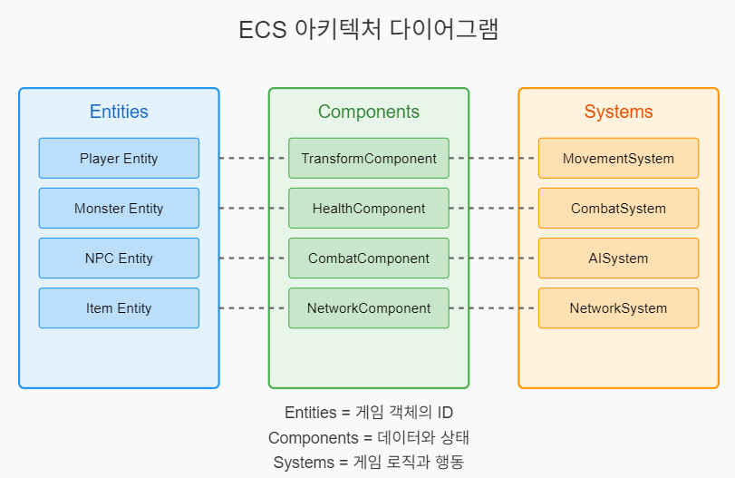
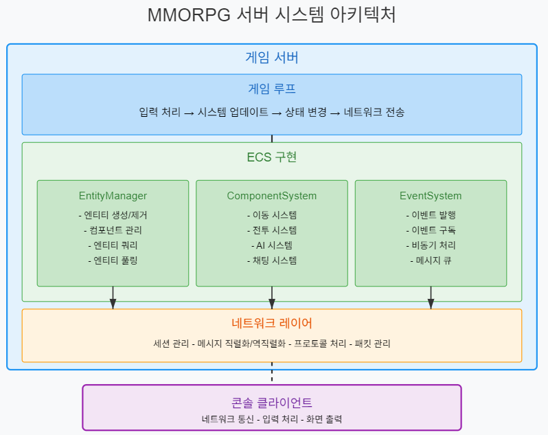
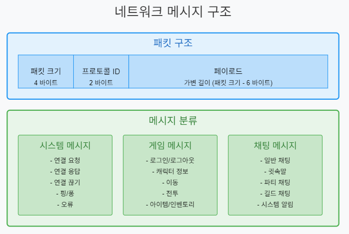

# ECS(Entity-Component-System) 기반 온라인 게임 서버

저자: 최흥배, Claude AI   
    
권장 개발 환경
- **IDE**: Visual Studio 2022 (Community 이상)
- **컴파일러**: .NET 9 이상
- **OS**: Windows 10 이상  
-----    
  
# 제5부: 실전 프로젝트  


# 11. MMORPG 미니 프로젝트
MMORPG 미니 프로젝트를 ECS(Entity-Component-System) 기반으로 개발하는 방법에 대해 설명하겠다. C# .NET 9.0을 기준으로 한다.

## 목차
1. 요구사항 정의
2. 시스템 설계
3. 컴포넌트 구현
4. 네트워크 메시지 설계
5. 구현 예제

## 1. 요구사항 정의
MMORPG 미니 프로젝트의 주요 요구사항은 다음과 같다:

- **다중 사용자 지원**: 여러 플레이어가 동시에 접속하여 상호작용할 수 있어야 한다.
- **지속적인 세계**: 플레이어가 접속하지 않아도 게임 세계는 계속 존재한다.
- **캐릭터 관리**: 플레이어는 자신의 캐릭터를 생성하고 관리할 수 있다.
- **이동 시스템**: 캐릭터를 세계 내에서 이동시킬 수 있다.
- **전투 시스템**: 기본적인 공격과 방어가 가능하다.
- **채팅 기능**: 플레이어 간 대화가 가능하다.
- **몬스터 AI**: 간단한 몬스터 AI를 구현한다.
  

## 2. 시스템 설계
ECS 패턴에 기반한 시스템 설계를 진행하자.
    
### ECS 아키텍처 개요
     

### 전체 시스템 아키텍처
ECS를 기반으로 한 MMORPG 서버 시스템의 전체 아키텍처는 다음과 같다:  
     

### 주요 시스템 설계

#### 1. 엔티티 시스템
- 모든 게임 객체(플레이어, 몬스터, NPC, 아이템 등)는 고유 ID를 가진 엔티티로 표현
- 엔티티 자체는 빈 컨테이너로, 데이터가 아닌 ID만 보유

#### 2. 컴포넌트 시스템
- 모든 데이터와 상태는 컴포넌트에 저장
- 컴포넌트는 단일 책임 원칙을 따르며 특정 기능에 관련된 데이터만 보유
- 주요 컴포넌트: Transform, Health, Combat, Network, Inventory 등

#### 3. 시스템
- 모든 게임 로직과 동작은 시스템에서 처리
- 시스템은 특정 컴포넌트 조합을 가진 엔티티에 대해 동작
- 주요 시스템: Movement, Combat, AI, Chat, Network 등

#### 4. 이벤트 시스템
- 시스템 간 결합도를 낮추기 위한 메시지 중개자
- 이벤트 발행-구독 모델 사용

#### 5. 네트워크 시스템
- 클라이언트-서버 통신 관리
- 패킷 직렬화/역직렬화
- 세션 관리
  


## 3. 컴포넌트 구현

### 기본 컴포넌트 인터페이스

```csharp
public interface IComponent
{
    uint EntityId { get; set; }
    void Initialize();
    void Reset();
}
```

### 주요 컴포넌트 구현

#### TransformComponent

```csharp
public class TransformComponent : IComponent
{
    public uint EntityId { get; set; }
    public float X { get; set; }
    public float Y { get; set; }
    public float Z { get; set; }
    public float RotationY { get; set; }

    public void Initialize()
    {
        X = 0;
        Y = 0;
        Z = 0;
        RotationY = 0;
    }

    public void Reset()
    {
        X = 0;
        Y = 0;
        Z = 0;
        RotationY = 0;
    }
}
```

#### HealthComponent

```csharp
public class HealthComponent : IComponent
{
    public uint EntityId { get; set; }
    public int MaxHealth { get; set; }
    public int CurrentHealth { get; set; }
    public bool IsDead => CurrentHealth <= 0;

    public void Initialize()
    {
        MaxHealth = 100;
        CurrentHealth = MaxHealth;
    }

    public void Reset()
    {
        CurrentHealth = MaxHealth;
    }

    public void TakeDamage(int damage)
    {
        CurrentHealth = Math.Max(0, CurrentHealth - damage);
    }

    public void Heal(int amount)
    {
        CurrentHealth = Math.Min(MaxHealth, CurrentHealth + amount);
    }
}
```

#### CombatComponent

```csharp
public class CombatComponent : IComponent
{
    public uint EntityId { get; set; }
    public int AttackPower { get; set; }
    public int DefensePower { get; set; }
    public float AttackRange { get; set; }
    public float AttackSpeed { get; set; }
    public float LastAttackTime { get; set; }

    public void Initialize()
    {
        AttackPower = 10;
        DefensePower = 5;
        AttackRange = 2.0f;
        AttackSpeed = 1.0f;
        LastAttackTime = 0;
    }

    public void Reset()
    {
        LastAttackTime = 0;
    }

    public bool CanAttack(float currentTime)
    {
        return currentTime - LastAttackTime >= 1.0f / AttackSpeed;
    }
}
```

#### NetworkComponent

```csharp
public class NetworkComponent : IComponent
{
    public uint EntityId { get; set; }
    public uint SessionId { get; set; }
    public bool IsConnected { get; set; }
    public Queue<object> MessageQueue { get; private set; }

    public void Initialize()
    {
        SessionId = 0;
        IsConnected = false;
        MessageQueue = new Queue<object>();
    }

    public void Reset()
    {
        SessionId = 0;
        IsConnected = false;
        MessageQueue.Clear();
    }

    public void EnqueueMessage(object message)
    {
        MessageQueue.Enqueue(message);
    }

    public object DequeueMessage()
    {
        return MessageQueue.Count > 0 ? MessageQueue.Dequeue() : null;
    }
}
```
  

## 4. 네트워크 메시지 설계

### 메시지 구조
     
  
### 메시지 직렬화/역직렬화 구현

```csharp
// 메시지 기본 인터페이스
public interface IMessage
{
    ushort ProtocolId { get; }
    byte[] Serialize();
    void Deserialize(byte[] data);
}

// 예시: 이동 메시지
public class MoveMessage : IMessage
{
    public ushort ProtocolId => 1001;
    public uint EntityId { get; set; }
    public float X { get; set; }
    public float Y { get; set; }
    public float Z { get; set; }
    public float RotationY { get; set; }

    public byte[] Serialize()
    {
        using (MemoryStream ms = new MemoryStream())
        using (BinaryWriter writer = new BinaryWriter(ms))
        {
            writer.Write(EntityId);
            writer.Write(X);
            writer.Write(Y);
            writer.Write(Z);
            writer.Write(RotationY);
            return ms.ToArray();
        }
    }

    public void Deserialize(byte[] data)
    {
        using (MemoryStream ms = new MemoryStream(data))
        using (BinaryReader reader = new BinaryReader(ms))
        {
            EntityId = reader.ReadUInt32();
            X = reader.ReadSingle();
            Y = reader.ReadSingle();
            Z = reader.ReadSingle();
            RotationY = reader.ReadSingle();
        }
    }
}

// 예시: 채팅 메시지
public class ChatMessage : IMessage
{
    public ushort ProtocolId => 2001;
    public uint SenderEntityId { get; set; }
    public string SenderName { get; set; }
    public byte ChatType { get; set; } // 0: 일반, 1: 귓속말, 2: 파티, 3: 길드
    public uint ReceiverEntityId { get; set; } // 귓속말인 경우 사용
    public string Message { get; set; }

    public byte[] Serialize()
    {
        using (MemoryStream ms = new MemoryStream())
        using (BinaryWriter writer = new BinaryWriter(ms))
        {
            writer.Write(SenderEntityId);
            writer.Write(SenderName);
            writer.Write(ChatType);
            writer.Write(ReceiverEntityId);
            writer.Write(Message);
            return ms.ToArray();
        }
    }

    public void Deserialize(byte[] data)
    {
        using (MemoryStream ms = new MemoryStream(data))
        using (BinaryReader reader = new BinaryReader(ms))
        {
            SenderEntityId = reader.ReadUInt32();
            SenderName = reader.ReadString();
            ChatType = reader.ReadByte();
            ReceiverEntityId = reader.ReadUInt32();
            Message = reader.ReadString();
        }
    }
}
```
  

### 패킷 처리 시스템

```csharp
public class PacketProcessor
{
    private readonly Dictionary<ushort, Type> _messageTypes = new Dictionary<ushort, Type>();
    private readonly Dictionary<ushort, Action<IMessage>> _messageHandlers = new Dictionary<ushort, Action<IMessage>>();

    public void RegisterMessageType(ushort protocolId, Type messageType)
    {
        if (!typeof(IMessage).IsAssignableFrom(messageType))
        {
            throw new ArgumentException($"Type {messageType.Name} does not implement IMessage");
        }

        _messageTypes[protocolId] = messageType;
    }

    public void RegisterMessageHandler(ushort protocolId, Action<IMessage> handler)
    {
        _messageHandlers[protocolId] = handler;
    }

    public void ProcessPacket(byte[] packetData)
    {
        // 헤더 확인 (패킷 크기 및 프로토콜 ID)
        if (packetData.Length < 6) // 최소 패킷 크기: 4(패킷 크기) + 2(프로토콜 ID)
        {
            throw new ArgumentException("Invalid packet data: too small");
        }

        using (MemoryStream ms = new MemoryStream(packetData))
        using (BinaryReader reader = new BinaryReader(ms))
        {
            // 패킷 크기 읽기
            int packetSize = reader.ReadInt32();
            
            // 프로토콜 ID 읽기
            ushort protocolId = reader.ReadUInt16();
            
            // 페이로드 읽기
            byte[] payload = new byte[packetSize - 6];
            reader.Read(payload, 0, payload.Length);
            
            // 메시지 생성 및 처리
            if (_messageTypes.TryGetValue(protocolId, out Type messageType) && 
                _messageHandlers.TryGetValue(protocolId, out Action<IMessage> handler))
            {
                IMessage message = (IMessage)Activator.CreateInstance(messageType);
                message.Deserialize(payload);
                handler(message);
            }
        }
    }

    public byte[] CreatePacket(IMessage message)
    {
        byte[] payload = message.Serialize();
        
        using (MemoryStream ms = new MemoryStream())
        using (BinaryWriter writer = new BinaryWriter(ms))
        {
            // 패킷 크기 (헤더 + 페이로드)
            writer.Write(6 + payload.Length);
            
            // 프로토콜 ID
            writer.Write(message.ProtocolId);
            
            // 페이로드
            writer.Write(payload);
            
            return ms.ToArray();
        }
    }
}
```
  

## 5. 구현 예제

### EntityManager 구현

```csharp
public class EntityManager
{
    private uint _nextEntityId = 1;
    private Dictionary<uint, Dictionary<Type, IComponent>> _entities = new Dictionary<uint, Dictionary<Type, IComponent>>();
    private Dictionary<Type, Dictionary<uint, IComponent>> _componentsByType = new Dictionary<Type, Dictionary<uint, IComponent>>();
    
    // 엔티티 생성
    public uint CreateEntity()
    {
        uint entityId = _nextEntityId++;
        _entities[entityId] = new Dictionary<Type, IComponent>();
        return entityId;
    }
    
    // 엔티티 제거
    public void DestroyEntity(uint entityId)
    {
        if (!_entities.ContainsKey(entityId))
            return;
        
        // 모든 컴포넌트 제거
        foreach (var component in _entities[entityId].Values)
        {
            var componentType = component.GetType();
            if (_componentsByType.ContainsKey(componentType))
            {
                _componentsByType[componentType].Remove(entityId);
            }
        }
        
        _entities.Remove(entityId);
    }
    
    // 컴포넌트 추가
    public T AddComponent<T>(uint entityId) where T : IComponent, new()
    {
        if (!_entities.ContainsKey(entityId))
            throw new KeyNotFoundException($"Entity {entityId} not found");
        
        Type componentType = typeof(T);
        
        // 이미 존재하는 컴포넌트 타입이면 반환
        if (_entities[entityId].ContainsKey(componentType))
            return (T)_entities[entityId][componentType];
        
        // 새 컴포넌트 생성
        T component = new T();
        component.EntityId = entityId;
        component.Initialize();
        
        // 엔티티에 컴포넌트 추가
        _entities[entityId][componentType] = component;
        
        // 타입별 컴포넌트 맵에 추가
        if (!_componentsByType.ContainsKey(componentType))
            _componentsByType[componentType] = new Dictionary<uint, IComponent>();
        
        _componentsByType[componentType][entityId] = component;
        
        return component;
    }
    
    // 컴포넌트 가져오기
    public T GetComponent<T>(uint entityId) where T : IComponent
    {
        Type componentType = typeof(T);
        
        if (!_entities.ContainsKey(entityId) || !_entities[entityId].ContainsKey(componentType))
            return default;
        
        return (T)_entities[entityId][componentType];
    }
    
    // 컴포넌트 제거
    public void RemoveComponent<T>(uint entityId) where T : IComponent
    {
        Type componentType = typeof(T);
        
        if (!_entities.ContainsKey(entityId) || !_entities[entityId].ContainsKey(componentType))
            return;
        
        // 엔티티에서 컴포넌트 제거
        _entities[entityId].Remove(componentType);
        
        // 타입별 컴포넌트 맵에서 제거
        if (_componentsByType.ContainsKey(componentType))
        {
            _componentsByType[componentType].Remove(entityId);
        }
    }
    
    // 특정 타입의 모든 컴포넌트 가져오기
    public IEnumerable<T> GetAllComponentsOfType<T>() where T : IComponent
    {
        Type componentType = typeof(T);
        
        if (!_componentsByType.ContainsKey(componentType))
            yield break;
        
        foreach (var component in _componentsByType[componentType].Values)
        {
            yield return (T)component;
        }
    }
    
    // 컴포넌트 조합을 가진 모든 엔티티 ID 가져오기
    public IEnumerable<uint> GetEntitiesWithComponents(params Type[] componentTypes)
    {
        if (componentTypes.Length == 0)
            yield break;
        
        // 첫 번째 컴포넌트 타입의 엔티티들
        Type firstType = componentTypes[0];
        if (!_componentsByType.ContainsKey(firstType))
            yield break;
        
        foreach (uint entityId in _componentsByType[firstType].Keys)
        {
            bool hasAllComponents = true;
            
            // 나머지 컴포넌트 타입도 확인
            for (int i = 1; i < componentTypes.Length; i++)
            {
                Type type = componentTypes[i];
                if (!_componentsByType.ContainsKey(type) || !_componentsByType[type].ContainsKey(entityId))
                {
                    hasAllComponents = false;
                    break;
                }
            }
            
            if (hasAllComponents)
                yield return entityId;
        }
    }
}
```

### 시스템 구현 예시 - MovementSystem

```csharp
public class MovementSystem
{
    private readonly EntityManager _entityManager;
    private readonly EventSystem _eventSystem;
    
    public MovementSystem(EntityManager entityManager, EventSystem eventSystem)
    {
        _entityManager = entityManager;
        _eventSystem = eventSystem;
    }
    
    public void Update(float deltaTime)
    {
        // TransformComponent와 MovementComponent를 가진 모든 엔티티 처리
        var entityIds = _entityManager.GetEntitiesWithComponents(typeof(TransformComponent), typeof(MovementComponent));
        
        foreach (var entityId in entityIds)
        {
            var transform = _entityManager.GetComponent<TransformComponent>(entityId);
            var movement = _entityManager.GetComponent<MovementComponent>(entityId);
            
            if (movement.IsMoving)
            {
                // 목표 위치로 이동
                Vector3 currentPos = new Vector3(transform.X, transform.Y, transform.Z);
                Vector3 targetPos = new Vector3(movement.TargetX, movement.TargetY, movement.TargetZ);
                Vector3 direction = Vector3.Normalize(targetPos - currentPos);
                
                // 이동 속도 계산
                float distance = Vector3.Distance(currentPos, targetPos);
                float moveDistance = movement.Speed * deltaTime;
                
                if (moveDistance >= distance)
                {
                    // 목표 위치에 도달
                    transform.X = movement.TargetX;
                    transform.Y = movement.TargetY;
                    transform.Z = movement.TargetZ;
                    movement.IsMoving = false;
                    
                    // 이동 완료 이벤트 발생
                    _eventSystem.Publish(new EntityMovedEvent 
                    { 
                        EntityId = entityId,
                        X = transform.X,
                        Y = transform.Y,
                        Z = transform.Z,
                        RotationY = transform.RotationY
                    });
                }
                else
                {
                    // 목표 위치를 향해 이동
                    transform.X += direction.X * moveDistance;
                    transform.Y += direction.Y * moveDistance;
                    transform.Z += direction.Z * moveDistance;
                    
                    // 회전 방향 업데이트
                    if (direction.X != 0 || direction.Z != 0)
                    {
                        transform.RotationY = (float)Math.Atan2(direction.X, direction.Z);
                    }
                }
            }
        }
    }
    
    public void MoveEntity(uint entityId, float targetX, float targetY, float targetZ)
    {
        var transform = _entityManager.GetComponent<TransformComponent>(entityId);
        if (transform == null)
            return;
        
        var movement = _entityManager.GetComponent<MovementComponent>(entityId);
        if (movement == null)
            movement = _entityManager.AddComponent<MovementComponent>(entityId);
        
        movement.TargetX = targetX;
        movement.TargetY = targetY;
        movement.TargetZ = targetZ;
        movement.IsMoving = true;
        
        // 이동 시작 이벤트 발생
        _eventSystem.Publish(new EntityStartMovingEvent 
        { 
            EntityId = entityId,
            StartX = transform.X,
            StartY = transform.Y,
            StartZ = transform.Z,
            TargetX = targetX,
            TargetY = targetY,
            TargetZ = targetZ
        });
    }
}

// MovementComponent 정의
public class MovementComponent : IComponent
{
    public uint EntityId { get; set; }
    public float Speed { get; set; }
    public bool IsMoving { get; set; }
    public float TargetX { get; set; }
    public float TargetY { get; set; }
    public float TargetZ { get; set; }
    
    public void Initialize()
    {
        Speed = 5.0f;
        IsMoving = false;
        TargetX = 0;
        TargetY = 0;
        TargetZ = 0;
    }
    
    public void Reset()
    {
        IsMoving = false;
    }
}

// 이벤트 정의
public class EntityStartMovingEvent
{
    public uint EntityId { get; set; }
    public float StartX { get; set; }
    public float StartY { get; set; }
    public float StartZ { get; set; }
    public float TargetX { get; set; }
    public float TargetY { get; set; }
    public float TargetZ { get; set; }
}

public class EntityMovedEvent
{
    public uint EntityId { get; set; }
    public float X { get; set; }
    public float Y { get; set; }
    public float Z { get; set; }
    public float RotationY { get; set; }
}
```

### 이벤트 시스템 구현

```csharp
public class EventSystem
{
    private readonly Dictionary<Type, List<Action<object>>> _subscribers = new Dictionary<Type, List<Action<object>>>();
    
    public void Subscribe<T>(Action<T> handler)
    {
        Type eventType = typeof(T);
        
        if (!_subscribers.ContainsKey(eventType))
            _subscribers[eventType] = new List<Action<object>>();
        
        _subscribers[eventType].Add(obj => handler((T)obj));
    }
    
    public void Unsubscribe<T>(Action<T> handler)
    {
        Type eventType = typeof(T);
        
        if (!_subscribers.ContainsKey(eventType))
            return;
        
        // 해당 핸들러를 찾아 제거하는 로직 (간단화를 위해 생략)
    }
    
    public void Publish<T>(T eventData)
    {
        Type eventType = typeof(T);
        
        if (!_subscribers.ContainsKey(eventType))
            return;
        
        foreach (var handler in _subscribers[eventType])
        {
            handler(eventData);
        }
    }
}
```

### 네트워크 인터페이스 구현

```csharp
// 간단한 네트워크 세션 인터페이스
public interface INetworkSession
{
    uint SessionId { get; }
    bool IsConnected { get; }
    void Send(byte[] data);
    void Disconnect();
}

// 간단한 네트워크 서버 인터페이스
public interface INetworkServer
{
    void Start(int port);
    void Stop();
    void BroadcastToAll(byte[] data);
    void BroadcastToAll(byte[] data, uint excludeSessionId);
    void SendTo(uint sessionId, byte[] data);
    event Action<uint> OnClientConnected;
    event Action<uint> OnClientDisconnected;
    event Action<uint, byte[]> OnDataReceived;
}

// 콘솔 클라이언트용 간단한 네트워크 클라이언트 인터페이스
public interface INetworkClient
{
    void Connect(string host, int port);
    void Disconnect();
    void Send(byte[] data);
    event Action OnConnected;
    event Action OnDisconnected;
    event Action<byte[]> OnDataReceived;
}
```

### 게임 서버 메인 클래스

```csharp
public class GameServer
{
    private readonly EntityManager _entityManager;
    private readonly EventSystem _eventSystem;
    private readonly PacketProcessor _packetProcessor;
    private readonly INetworkServer _networkServer;
    
    // 시스템들
    private readonly MovementSystem _movementSystem;
    private readonly CombatSystem _combatSystem;
    private readonly AISystem _aiSystem;
    private readonly ChatSystem _chatSystem;
    
    // 세션 관리
    private readonly Dictionary<uint, uint> _sessionToEntityMap = new Dictionary<uint, uint>();
    
    private bool _isRunning = false;
    private readonly int _tickRate = 30; // 초당 30틱
    private readonly double _tickInterval; // 밀리초 단위의 틱 간격
    
    public GameServer(INetworkServer networkServer)
    {
        _networkServer = networkServer;
        _entityManager = new EntityManager();
        _eventSystem = new EventSystem();
        _packetProcessor = new PacketProcessor();
        
        // 시스템 초기화
        _movementSystem = new MovementSystem(_entityManager, _eventSystem);
        _combatSystem = new CombatSystem(_entityManager, _eventSystem);
        _aiSystem = new AISystem(_entityManager, _eventSystem);
        _chatSystem = new ChatSystem(_entityManager, _eventSystem);
        
        // 틱 간격 계산 (밀리초)
        _tickInterval = 1000.0 / _tickRate;
        
        // 네트워크 이벤트 핸들러 등록
        _networkServer.OnClientConnected += OnClientConnected;
        _networkServer.OnClientDisconnected += OnClientDisconnected;
        _networkServer.OnDataReceived += OnDataReceived;
        
        // 메시지 타입 및 핸들러 등록
        RegisterMessageHandlers();
        
        // 이벤트 구독
        SubscribeToEvents();
    }
    
    private void RegisterMessageHandlers()
    {
        // 시스템 메시지
        _packetProcessor.RegisterMessageType(1, typeof(ConnectMessage));
        _packetProcessor.RegisterMessageHandler(1, HandleConnectMessage);
        
        // 게임 메시지
        _packetProcessor.RegisterMessageType(1001, typeof(MoveMessage));
        _packetProcessor.RegisterMessageHandler(1001, HandleMoveMessage);
        
        _packetProcessor.RegisterMessageType(1002, typeof(AttackMessage));
        _packetProcessor.RegisterMessageHandler(1002, HandleAttackMessage);
        
        // 채팅 메시지
        _packetProcessor.RegisterMessageType(2001, typeof(ChatMessage));
        _packetProcessor.RegisterMessageHandler(2001, HandleChatMessage);
    }
    
    private void SubscribeToEvents()
    {
        // 엔티티 이동 시작 이벤트 구독
        _eventSystem.Subscribe<EntityStartMovingEvent>(OnEntityStartMoving);
        
        // 엔티티 이동 완료 이벤트 구독
        _eventSystem.Subscribe<EntityMovedEvent>(OnEntityMoved);
        
        // 전투 이벤트 구독
        _eventSystem.Subscribe<EntityAttackEvent>(OnEntityAttack);
        _eventSystem.Subscribe<EntityDamagedEvent>(OnEntityDamaged);
        _eventSystem.Subscribe<EntityDeathEvent>(OnEntityDeath);
    }
    
    public void Start(int port)
    {
        if (_isRunning)
            return;
        
        _isRunning = true;
        
        // 네트워크 서버 시작
        _networkServer.Start(port);
        
        // 게임 루프 시작
        Task.Run(GameLoop);
        
        Console.WriteLine($"Game server started on port {port}...");
    }
    
    public void Stop()
    {
        if (!_isRunning)
            return;
        
        _isRunning = false;
        
        // 네트워크 서버 중지
        _networkServer.Stop();
        
        Console.WriteLine("Game server stopped.");
    }
    
    private async Task GameLoop()
    {
        var stopwatch = new Stopwatch();
        long lastTickTime = 0;
        
        while (_isRunning)
        {
            stopwatch.Start();
            
            // 델타 타임 계산 (초 단위)
            float deltaTime = (stopwatch.ElapsedMilliseconds - lastTickTime) / 1000.0f;
            lastTickTime = stopwatch.ElapsedMilliseconds;
            
            // 시스템 업데이트
            _movementSystem.Update(deltaTime);
            _combatSystem.Update(deltaTime);
            _aiSystem.Update(deltaTime);
            
            // 다음 틱까지 대기
            long elapsedMilliseconds = stopwatch.ElapsedMilliseconds;
            long nextTickTime = (long)(Math.Floor(elapsedMilliseconds / _tickInterval) + 1) * (long)_tickInterval;
            long waitTime = nextTickTime - elapsedMilliseconds;
            
            if (waitTime > 0)
            {
                await Task.Delay((int)waitTime);
            }
        }
    }
    
    #region 네트워크 이벤트 핸들러
    
    private void OnClientConnected(uint sessionId)
    {
        Console.WriteLine($"Client connected: {sessionId}");
    }
    
    private void OnClientDisconnected(uint sessionId)
    {
        Console.WriteLine($"Client disconnected: {sessionId}");
        
        // 세션에 연결된 엔티티가 있으면 제거
        if (_sessionToEntityMap.TryGetValue(sessionId, out uint entityId))
        {
            _entityManager.DestroyEntity(entityId);
            _sessionToEntityMap.Remove(sessionId);
            
            // 다른 클라이언트에게 알림
            var disconnectMsg = new EntityDisconnectMessage { EntityId = entityId };
            byte[] packet = _packetProcessor.CreatePacket(disconnectMsg);
            _networkServer.BroadcastToAll(packet, sessionId);
        }
    }
    
    private void OnDataReceived(uint sessionId, byte[] data)
    {
        try
        {
            _packetProcessor.ProcessPacket(data);
        }
        catch (Exception ex)
        {
            Console.WriteLine($"Error processing packet: {ex.Message}");
        }
    }
    
    #endregion
    
    #region 메시지 핸들러
    
    private void HandleConnectMessage(IMessage msg)
    {
        var connectMsg = (ConnectMessage)msg;
        uint sessionId = connectMsg.SessionId;
        
        // 플레이어 엔티티 생성
        uint entityId = _entityManager.CreateEntity();
        
        // 기본 컴포넌트 추가
        var transform = _entityManager.AddComponent<TransformComponent>(entityId);
        var health = _entityManager.AddComponent<HealthComponent>(entityId);
        var combat = _entityManager.AddComponent<CombatComponent>(entityId);
        var network = _entityManager.AddComponent<NetworkComponent>(entityId);
        
        // 네트워크 컴포넌트 설정
        network.SessionId = sessionId;
        network.IsConnected = true;
        
        // 세션-엔티티 매핑 저장
        _sessionToEntityMap[sessionId] = entityId;
        
        // 연결 응답 메시지
        var connectResponse = new ConnectResponseMessage
        {
            EntityId = entityId,
            X = transform.X,
            Y = transform.Y,
            Z = transform.Z
        };
        
        byte[] packet = _packetProcessor.CreatePacket(connectResponse);
        _networkServer.SendTo(sessionId, packet);
        
        // 새 플레이어 알림 메시지
        var newPlayerMsg = new NewPlayerMessage
        {
            EntityId = entityId,
            X = transform.X,
            Y = transform.Y,
            Z = transform.Z
        };
        
        packet = _packetProcessor.CreatePacket(newPlayerMsg);
        _networkServer.BroadcastToAll(packet, sessionId);
        
        Console.WriteLine($"Player connected: SessionId={sessionId}, EntityId={entityId}");
    }
    
    private void HandleMoveMessage(IMessage msg)
    {
        var moveMsg = (MoveMessage)msg;
        
        // 이동 시스템을 통해 엔티티 이동
        _movementSystem.MoveEntity(moveMsg.EntityId, moveMsg.X, moveMsg.Y, moveMsg.Z);
    }
    
    private void HandleAttackMessage(IMessage msg)
    {
        var attackMsg = (AttackMessage)msg;
        
        // 전투 시스템을 통해 공격 처리
        _combatSystem.Attack(attackMsg.AttackerEntityId, attackMsg.TargetEntityId);
    }
    
    private void HandleChatMessage(IMessage msg)
    {
        var chatMsg = (ChatMessage)msg;
        
        // 채팅 시스템을 통해 메시지 처리
        _chatSystem.SendMessage(chatMsg.SenderEntityId, chatMsg.SenderName, chatMsg.ChatType, chatMsg.ReceiverEntityId, chatMsg.Message);
    }
    
    #endregion
    
    #region 이벤트 핸들러
    
    private void OnEntityStartMoving(EntityStartMovingEvent evt)
    {
        // 다른 클라이언트에게 이동 시작 알림
        var moveStartMsg = new EntityStartMoveMessage
        {
            EntityId = evt.EntityId,
            StartX = evt.StartX,
            StartY = evt.StartY,
            StartZ = evt.StartZ,
            TargetX = evt.TargetX,
            TargetY = evt.TargetY,
            TargetZ = evt.TargetZ
        };
        
        byte[] packet = _packetProcessor.CreatePacket(moveStartMsg);
        
        // 이동하는 엔티티의 세션 ID 찾기
        NetworkComponent network = _entityManager.GetComponent<NetworkComponent>(evt.EntityId);
        if (network != null)
        {
            _networkServer.BroadcastToAll(packet, network.SessionId);
        }
        else
        {
            _networkServer.BroadcastToAll(packet);
        }
    }
    
    private void OnEntityMoved(EntityMovedEvent evt)
    {
        // 다른 클라이언트에게 이동 완료 알림
        var moveMsg = new EntityMoveMessage
        {
            EntityId = evt.EntityId,
            X = evt.X,
            Y = evt.Y,
            Z = evt.Z,
            RotationY = evt.RotationY
        };
        
        byte[] packet = _packetProcessor.CreatePacket(moveMsg);
        
        // 이동하는 엔티티의 세션 ID 찾기
        NetworkComponent network = _entityManager.GetComponent<NetworkComponent>(evt.EntityId);
        if (network != null)
        {
            _networkServer.BroadcastToAll(packet, network.SessionId);
        }
        else
        {
            _networkServer.BroadcastToAll(packet);
        }
    }
    
    private void OnEntityAttack(EntityAttackEvent evt)
    {
        // 다른 클라이언트에게 공격 알림
        var attackMsg = new EntityAttackMessage
        {
            AttackerEntityId = evt.AttackerEntityId,
            TargetEntityId = evt.TargetEntityId
        };
        
        byte[] packet = _packetProcessor.CreatePacket(attackMsg);
        _networkServer.BroadcastToAll(packet);
    }
    
    private void OnEntityDamaged(EntityDamagedEvent evt)
    {
        // 다른 클라이언트에게 데미지 알림
        var damageMsg = new EntityDamageMessage
        {
            EntityId = evt.EntityId,
            Damage = evt.Damage,
            CurrentHealth = evt.CurrentHealth
        };
        
        byte[] packet = _packetProcessor.CreatePacket(damageMsg);
        _networkServer.BroadcastToAll(packet);
    }
    
    private void OnEntityDeath(EntityDeathEvent evt)
    {
        // 다른 클라이언트에게 사망 알림
        var deathMsg = new EntityDeathMessage
        {
            EntityId = evt.EntityId,
            KillerEntityId = evt.KillerEntityId
        };
        
        byte[] packet = _packetProcessor.CreatePacket(deathMsg);
        _networkServer.BroadcastToAll(packet);
    }
    
    #endregion
}
```
  
### 콘솔 클라이언트 예제

```csharp
public class ConsoleClient
{
    private readonly INetworkClient _networkClient;
    private readonly PacketProcessor _packetProcessor;
    private uint _playerEntityId;
    private readonly Dictionary<uint, PlayerInfo> _otherPlayers = new Dictionary<uint, PlayerInfo>();
    
    public ConsoleClient(INetworkClient networkClient)
    {
        _networkClient = networkClient;
        _packetProcessor = new PacketProcessor();
        
        // 네트워크 이벤트 핸들러 등록
        _networkClient.OnConnected += OnConnected;
        _networkClient.OnDisconnected += OnDisconnected;
        _networkClient.OnDataReceived += OnDataReceived;
        
        // 메시지 타입 및 핸들러 등록
        RegisterMessageHandlers();
    }
    
    private void RegisterMessageHandlers()
    {
        // 시스템 메시지
        _packetProcessor.RegisterMessageType(101, typeof(ConnectResponseMessage));
        _packetProcessor.RegisterMessageHandler(101, HandleConnectResponseMessage);
        
        // 게임 메시지
        _packetProcessor.RegisterMessageType(1101, typeof(NewPlayerMessage));
        _packetProcessor.RegisterMessageHandler(1101, HandleNewPlayerMessage);
        
        _packetProcessor.RegisterMessageType(1102, typeof(EntityDisconnectMessage));
        _packetProcessor.RegisterMessageHandler(1102, HandleEntityDisconnectMessage);
        
        _packetProcessor.RegisterMessageType(1103, typeof(EntityStartMoveMessage));
        _packetProcessor.RegisterMessageHandler(1103, HandleEntityStartMoveMessage);
        
        _packetProcessor.RegisterMessageType(1104, typeof(EntityMoveMessage));
        _packetProcessor.RegisterMessageHandler(1104, HandleEntityMoveMessage);
        
        // 채팅 메시지
        _packetProcessor.RegisterMessageType(2001, typeof(ChatMessage));
        _packetProcessor.RegisterMessageHandler(2001, HandleChatMessage);
    }
    
    public void Connect(string host, int port)
    {
        _networkClient.Connect(host, port);
    }
    
    public void Disconnect()
    {
        _networkClient.Disconnect();
    }
    
    public void MovePlayer(float x, float y, float z)
    {
        var moveMsg = new MoveMessage
        {
            EntityId = _playerEntityId,
            X = x,
            Y = y,
            Z = z
        };
        
        byte[] packet = _packetProcessor.CreatePacket(moveMsg);
        _networkClient.Send(packet);
    }
    
    public void SendChatMessage(string message)
    {
        var chatMsg = new ChatMessage
        {
            SenderEntityId = _playerEntityId,
            SenderName = "Player",
            ChatType = 0, // 일반 채팅
            ReceiverEntityId = 0,
            Message = message
        };
        
        byte[] packet = _packetProcessor.CreatePacket(chatMsg);
        _networkClient.Send(packet);
    }
    
    #region 네트워크 이벤트 핸들러
    
    private void OnConnected()
    {
        Console.WriteLine("Connected to server!");
        
        // 연결 메시지 전송
        var connectMsg = new ConnectMessage { SessionId = 0 }; // 서버에서 세션 ID 할당
        byte[] packet = _packetProcessor.CreatePacket(connectMsg);
        _networkClient.Send(packet);
    }
    
    private void OnDisconnected()
    {
        Console.WriteLine("Disconnected from server!");
        _otherPlayers.Clear();
    }
    
    private void OnDataReceived(byte[] data)
    {
        try
        {
            _packetProcessor.ProcessPacket(data);
        }
        catch (Exception ex)
        {
            Console.WriteLine($"Error processing packet: {ex.Message}");
        }
    }
    
    #endregion
    
    #region 메시지 핸들러
    
    private void HandleConnectResponseMessage(IMessage msg)
    {
        var response = (ConnectResponseMessage)msg;
        _playerEntityId = response.EntityId;
        
        Console.WriteLine($"Connected as entity {_playerEntityId} at position ({response.X}, {response.Y}, {response.Z})");
    }
    
    private void HandleNewPlayerMessage(IMessage msg)
    {
        var newPlayerMsg = (NewPlayerMessage)msg;
        
        if (newPlayerMsg.EntityId != _playerEntityId)
        {
            _otherPlayers[newPlayerMsg.EntityId] = new PlayerInfo
            {
                EntityId = newPlayerMsg.EntityId,
                X = newPlayerMsg.X,
                Y = newPlayerMsg.Y,
                Z = newPlayerMsg.Z
            };
            
            Console.WriteLine($"New player connected: Entity {newPlayerMsg.EntityId} at position ({newPlayerMsg.X}, {newPlayerMsg.Y}, {newPlayerMsg.Z})");
        }
    }
    
    private void HandleEntityDisconnectMessage(IMessage msg)
    {
        var disconnectMsg = (EntityDisconnectMessage)msg;
        
        if (_otherPlayers.ContainsKey(disconnectMsg.EntityId))
        {
            Console.WriteLine($"Player disconnected: Entity {disconnectMsg.EntityId}");
            _otherPlayers.Remove(disconnectMsg.EntityId);
        }
    }
    
    private void HandleEntityStartMoveMessage(IMessage msg)
    {
        var moveStartMsg = (EntityStartMoveMessage)msg;
        
        if (_otherPlayers.ContainsKey(moveStartMsg.EntityId))
        {
            var player = _otherPlayers[moveStartMsg.EntityId];
            player.X = moveStartMsg.StartX;
            player.Y = moveStartMsg.StartY;
            player.Z = moveStartMsg.StartZ;
            player.TargetX = moveStartMsg.TargetX;
            player.TargetY = moveStartMsg.TargetY;
            player.TargetZ = moveStartMsg.TargetZ;
            player.IsMoving = true;
            
            Console.WriteLine($"Player {moveStartMsg.EntityId} started moving from ({moveStartMsg.StartX}, {moveStartMsg.StartY}, {moveStartMsg.StartZ}) to ({moveStartMsg.TargetX}, {moveStartMsg.TargetY}, {moveStartMsg.TargetZ})");
        }
    }
    
    private void HandleEntityMoveMessage(IMessage msg)
    {
        var moveMsg = (EntityMoveMessage)msg;
        
        if (_otherPlayers.ContainsKey(moveMsg.EntityId))
        {
            var player = _otherPlayers[moveMsg.EntityId];
            player.X = moveMsg.X;
            player.Y = moveMsg.Y;
            player.Z = moveMsg.Z;
            player.RotationY = moveMsg.RotationY;
            player.IsMoving = false;
            
            Console.WriteLine($"Player {moveMsg.EntityId} moved to ({moveMsg.X}, {moveMsg.Y}, {moveMsg.Z})");
        }
    }
    
    private void HandleChatMessage(IMessage msg)
    {
        var chatMsg = (ChatMessage)msg;
        
        if (chatMsg.SenderEntityId != _playerEntityId)
        {
            Console.WriteLine($"[{chatMsg.SenderName}]: {chatMsg.Message}");
        }
    }
    
    #endregion
    
    private class PlayerInfo
    {
        public uint EntityId { get; set; }
        public float X { get; set; }
        public float Y { get; set; }
        public float Z { get; set; }
        public float RotationY { get; set; }
        public bool IsMoving { get; set; }
        public float TargetX { get; set; }
        public float TargetY { get; set; }
        public float TargetZ { get; set; }
    }
}
```
  
  
## 결론
이 MMORPG 미니 프로젝트는 ECS 아키텍처를 사용하여 확장 가능하고 유지 보수가 용이한 온라인 게임 서버를 구현하는 방법을 보여준다. 주요 이점:

1. **모듈성**: 각 시스템과 컴포넌트는 독립적으로 동작하여 유지 보수 및 확장이 용이하다.
2. **성능**: 데이터 지향 설계로 캐시 효율성이 높고, 필요한 데이터만 처리하여 성능이 향상된다.
3. **재사용성**: 컴포넌트와 시스템은 다양한 게임 객체에 재사용할 수 있다.
4. **유연성**: 새로운 기능은 새 컴포넌트나 시스템을 추가하여 쉽게 구현할 수 있다.

이 미니 프로젝트를 확장하려면 아이템 시스템, 퀘스트 시스템, 파티/길드 시스템, 관리자 도구 등을 추가할 수 있다. 또한 데이터베이스 연동, 부하 분산, 보안 강화와 같은 기능을 추가하여 상용 수준의 MMORPG 서버로 발전시킬 수 있다.

