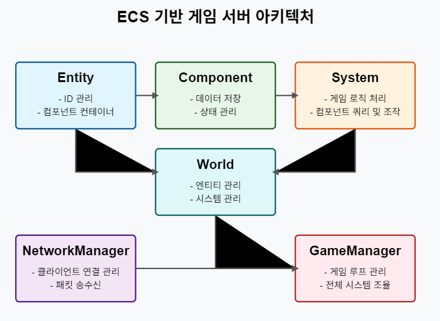
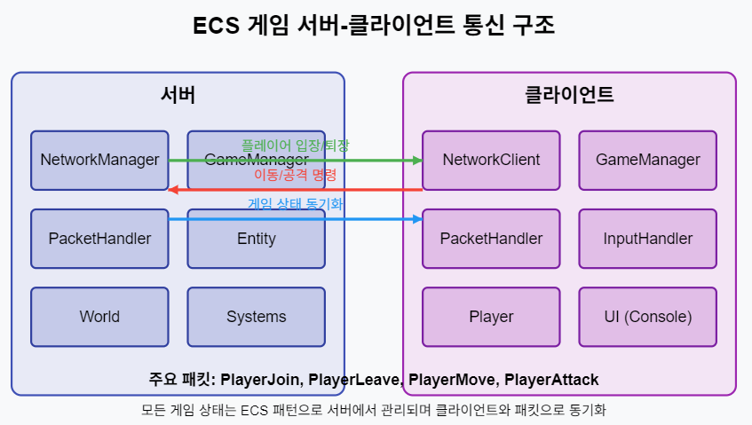

# ECS(Entity-Component-System) 기반 온라인 게임 서버

저자: 최흥배, Claude AI   
    
권장 개발 환경
- **IDE**: Visual Studio 2022 (Community 이상)
- **컴파일러**: .NET 9 이상
- **OS**: Windows 10 이상  
-----    
  
# 12. 프로젝트 구현
ECS(Entity-Component-System) 기반 온라인 게임 서버 구현 프로젝트를 C#과 .NET 9.0을 사용해 단계별로 설명하겠다.

## 12.1 서버 코드 구현
ECS 아키텍처를 사용한 게임 서버를 구현하기 위해 다음 구조로 진행한다:

### 12.1.1 프로젝트 구조

```
GameServer/
├── Core/
│   ├── ECS/
│   │   ├── Entity.cs
│   │   ├── Component.cs
│   │   ├── System.cs
│   │   └── World.cs
│   ├── Network/
│   │   ├── INetworkManager.cs
│   │   ├── NetworkManager.cs
│   │   ├── PacketHandler.cs
│   │   └── PacketStructure.cs
│   └── Utils/
│       ├── Logger.cs
│       └── Config.cs
├── Game/
│   ├── Components/
│   │   ├── PositionComponent.cs
│   │   ├── PlayerComponent.cs
│   │   └── HealthComponent.cs
│   ├── Systems/
│   │   ├── MovementSystem.cs
│   │   ├── CombatSystem.cs
│   │   └── PlayerSystem.cs
│   └── GameManager.cs
└── Program.cs
```

### 12.1.2 ECS 코어 구현
먼저 ECS 핵심 클래스를 구현한다:

#### Entity.cs
```csharp
using System;
using System.Collections.Generic;

namespace GameServer.Core.ECS
{
    public class Entity
    {
        private static int _nextId = 0;
        public int Id { get; private set; }
        private readonly Dictionary<Type, Component> _components = new();
        
        public Entity()
        {
            Id = _nextId++;
        }

        public Entity AddComponent<T>(T component) where T : Component
        {
            component.Owner = this;
            _components[typeof(T)] = component;
            return this;
        }

        public T GetComponent<T>() where T : Component
        {
            if (_components.TryGetValue(typeof(T), out var component))
            {
                return (T)component;
            }
            return null;
        }

        public bool HasComponent<T>() where T : Component
        {
            return _components.ContainsKey(typeof(T));
        }

        public Entity RemoveComponent<T>() where T : Component
        {
            _components.Remove(typeof(T));
            return this;
        }
    }
}
```

#### Component.cs
```csharp
namespace GameServer.Core.ECS
{
    public abstract class Component
    {
        public Entity Owner { get; internal set; }
        public bool IsEnabled { get; set; } = true;

        public virtual void Initialize() { }
        public virtual void Update(float deltaTime) { }
    }
}
```

#### System.cs
```csharp
using System.Collections.Generic;
using System.Linq;

namespace GameServer.Core.ECS
{
    public abstract class System
    {
        protected World World;
        public bool IsEnabled { get; set; } = true;

        public System(World world)
        {
            World = world;
        }

        public abstract void Update(float deltaTime);

        // 특정 컴포넌트를 가진 모든 엔티티 찾기
        protected IEnumerable<Entity> GetEntitiesWithComponents<T>() where T : Component
        {
            return World.Entities.Where(e => e.HasComponent<T>());
        }

        // 여러 컴포넌트를 동시에 가진 엔티티 찾기
        protected IEnumerable<Entity> GetEntitiesWithComponents<T1, T2>() 
            where T1 : Component 
            where T2 : Component
        {
            return World.Entities.Where(e => e.HasComponent<T1>() && e.HasComponent<T2>());
        }
    }
}
```

#### World.cs
```csharp
using System;
using System.Collections.Generic;
using System.Diagnostics;

namespace GameServer.Core.ECS
{
    public class World
    {
        private readonly List<Entity> _entities = new();
        private readonly List<System> _systems = new();
        private Stopwatch _stopwatch = new();
        private long _lastFrameTime;

        public IReadOnlyList<Entity> Entities => _entities;

        public World()
        {
            _stopwatch.Start();
            _lastFrameTime = _stopwatch.ElapsedMilliseconds;
        }

        public Entity CreateEntity()
        {
            var entity = new Entity();
            _entities.Add(entity);
            return entity;
        }

        public void RemoveEntity(Entity entity)
        {
            _entities.Remove(entity);
        }

        public void AddSystem(System system)
        {
            _systems.Add(system);
        }

        public void RemoveSystem(System system)
        {
            _systems.Remove(system);
        }

        public void Update()
        {
            var currentTime = _stopwatch.ElapsedMilliseconds;
            float deltaTime = (currentTime - _lastFrameTime) / 1000.0f;
            _lastFrameTime = currentTime;

            foreach (var system in _systems)
            {
                if (system.IsEnabled)
                {
                    system.Update(deltaTime);
                }
            }
        }
    }
}
```

### 12.1.3 네트워크 인터페이스 구현
네트워크 통신을 위한 간단한 인터페이스를 구현한다:

#### INetworkManager.cs
```csharp
using System;
using System.Net;

namespace GameServer.Core.Network
{
    public interface INetworkManager
    {
        void Initialize(IPEndPoint endpoint);
        void Start();
        void Stop();
        void SendToClient(int clientId, byte[] data);
        void SendToAll(byte[] data, int except = -1);
        void RegisterPacketHandler(byte packetId, Action<int, byte[]> handler);
    }
}
```

#### NetworkManager.cs
```csharp
using System;
using System.Collections.Generic;
using System.Net;
using GameServer.Core.Utils;

namespace GameServer.Core.Network
{
    public class NetworkManager : INetworkManager
    {
        private readonly Dictionary<byte, Action<int, byte[]>> _packetHandlers = new();
        private readonly Dictionary<int, ClientSession> _clients = new();
        private bool _isRunning = false;
        
        // 실제로는 여기서 SuperSocketLite 등의 네트워크 라이브러리를 사용할 것
        // 여기서는 인터페이스 구현으로 대체
        
        public void Initialize(IPEndPoint endpoint)
        {
            Logger.Log($"네트워크 매니저 초기화: {endpoint}");
        }

        public void Start()
        {
            _isRunning = true;
            Logger.Log("네트워크 매니저 시작");
        }

        public void Stop()
        {
            _isRunning = false;
            Logger.Log("네트워크 매니저 종료");
        }

        public void SendToClient(int clientId, byte[] data)
        {
            if (_clients.TryGetValue(clientId, out var client))
            {
                Logger.Log($"클라이언트 {clientId}에 데이터 전송: {data.Length} 바이트");
                // client.Send(data);
            }
        }

        public void SendToAll(byte[] data, int except = -1)
        {
            foreach (var client in _clients)
            {
                if (client.Key != except)
                {
                    SendToClient(client.Key, data);
                }
            }
        }

        public void RegisterPacketHandler(byte packetId, Action<int, byte[]> handler)
        {
            _packetHandlers[packetId] = handler;
            Logger.Log($"패킷 핸들러 등록: {packetId}");
        }

        // 내부 클래스: 클라이언트 세션 관리
        private class ClientSession
        {
            public int Id { get; }
            
            public ClientSession(int id)
            {
                Id = id;
            }

            public void Send(byte[] data)
            {
                // 실제 전송 구현
            }
        }
    }
}
```

#### PacketHandler.cs
```csharp
using System;
using GameServer.Core.ECS;

namespace GameServer.Core.Network
{
    public class PacketHandler
    {
        private readonly INetworkManager _networkManager;
        private readonly World _world;
        
        public PacketHandler(INetworkManager networkManager, World world)
        {
            _networkManager = networkManager;
            _world = world;
            
            RegisterAllHandlers();
        }
        
        private void RegisterAllHandlers()
        {
            // 패킷 ID에 따른 핸들러 등록
            _networkManager.RegisterPacketHandler(PacketStructure.PlayerJoin, HandlePlayerJoin);
            _networkManager.RegisterPacketHandler(PacketStructure.PlayerMove, HandlePlayerMove);
            _networkManager.RegisterPacketHandler(PacketStructure.PlayerAttack, HandlePlayerAttack);
            _networkManager.RegisterPacketHandler(PacketStructure.PlayerLeave, HandlePlayerLeave);
        }
        
        private void HandlePlayerJoin(int clientId, byte[] data)
        {
            // 플레이어 입장 처리
            string username = PacketStructure.DecodeString(data, 1);
            
            var entity = _world.CreateEntity();
            entity.AddComponent(new Game.Components.PlayerComponent { ClientId = clientId, Username = username })
                 .AddComponent(new Game.Components.PositionComponent { X = 0, Y = 0, Z = 0 })
                 .AddComponent(new Game.Components.HealthComponent { CurrentHealth = 100, MaxHealth = 100 });
            
            // 다른 플레이어들에게 새 플레이어 입장 알림
            byte[] response = PacketStructure.CreatePlayerJoinPacket(entity.Id, username, 0, 0, 0);
            _networkManager.SendToAll(response, clientId);
        }
        
        private void HandlePlayerMove(int clientId, byte[] data)
        {
            // 플레이어 이동 처리
            int entityId = BitConverter.ToInt32(data, 1);
            float x = BitConverter.ToSingle(data, 5);
            float y = BitConverter.ToSingle(data, 9);
            float z = BitConverter.ToSingle(data, 13);
            
            // 엔티티 찾기
            Entity playerEntity = _world.Entities.Find(e => 
                e.HasComponent<Game.Components.PlayerComponent>() && 
                e.GetComponent<Game.Components.PlayerComponent>().ClientId == clientId);
            
            if (playerEntity != null)
            {
                var positionComponent = playerEntity.GetComponent<Game.Components.PositionComponent>();
                positionComponent.X = x;
                positionComponent.Y = y;
                positionComponent.Z = z;
                
                // 다른 플레이어들에게 이동 정보 전달
                byte[] response = PacketStructure.CreatePlayerMovePacket(playerEntity.Id, x, y, z);
                _networkManager.SendToAll(response, clientId);
            }
        }
        
        private void HandlePlayerAttack(int clientId, byte[] data)
        {
            // 플레이어 공격 처리
            int attackerId = BitConverter.ToInt32(data, 1);
            int targetId = BitConverter.ToInt32(data, 5);
            
            // 공격 로직 구현
            // ...
        }
        
        private void HandlePlayerLeave(int clientId, byte[] data)
        {
            // 플레이어 퇴장 처리
            Entity playerEntity = _world.Entities.Find(e => 
                e.HasComponent<Game.Components.PlayerComponent>() && 
                e.GetComponent<Game.Components.PlayerComponent>().ClientId == clientId);
            
            if (playerEntity != null)
            {
                _world.RemoveEntity(playerEntity);
                
                // 다른 플레이어들에게 퇴장 알림
                byte[] response = PacketStructure.CreatePlayerLeavePacket(playerEntity.Id);
                _networkManager.SendToAll(response);
            }
        }
    }
}
```

#### PacketStructure.cs
```csharp
using System;
using System.Text;

namespace GameServer.Core.Network
{
    public static class PacketStructure
    {
        // 패킷 ID 정의
        public const byte PlayerJoin = 1;
        public const byte PlayerLeave = 2;
        public const byte PlayerMove = 3;
        public const byte PlayerAttack = 4;
        
        // 패킷 생성 메서드들
        public static byte[] CreatePlayerJoinPacket(int entityId, string username, float x, float y, float z)
        {
            byte[] usernameBytes = Encoding.UTF8.GetBytes(username);
            byte[] packet = new byte[17 + usernameBytes.Length];
            
            packet[0] = PlayerJoin;
            BitConverter.GetBytes(entityId).CopyTo(packet, 1);
            BitConverter.GetBytes(usernameBytes.Length).CopyTo(packet, 5);
            usernameBytes.CopyTo(packet, 9);
            BitConverter.GetBytes(x).CopyTo(packet, 9 + usernameBytes.Length);
            BitConverter.GetBytes(y).CopyTo(packet, 13 + usernameBytes.Length);
            BitConverter.GetBytes(z).CopyTo(packet, 17 + usernameBytes.Length);
            
            return packet;
        }
        
        public static byte[] CreatePlayerLeavePacket(int entityId)
        {
            byte[] packet = new byte[5];
            packet[0] = PlayerLeave;
            BitConverter.GetBytes(entityId).CopyTo(packet, 1);
            return packet;
        }
        
        public static byte[] CreatePlayerMovePacket(int entityId, float x, float y, float z)
        {
            byte[] packet = new byte[17];
            packet[0] = PlayerMove;
            BitConverter.GetBytes(entityId).CopyTo(packet, 1);
            BitConverter.GetBytes(x).CopyTo(packet, 5);
            BitConverter.GetBytes(y).CopyTo(packet, 9);
            BitConverter.GetBytes(z).CopyTo(packet, 13);
            return packet;
        }
        
        // 패킷 디코딩 유틸리티
        public static string DecodeString(byte[] data, int startIndex)
        {
            int length = BitConverter.ToInt32(data, startIndex);
            return Encoding.UTF8.GetString(data, startIndex + 4, length);
        }
    }
}
```

### 12.1.4 게임 컴포넌트 구현

게임에 필요한 주요 컴포넌트를 구현한다:

#### PositionComponent.cs
```csharp
using GameServer.Core.ECS;

namespace GameServer.Game.Components
{
    public class PositionComponent : Component
    {
        public float X { get; set; }
        public float Y { get; set; }
        public float Z { get; set; }
        
        public void Teleport(float x, float y, float z)
        {
            X = x;
            Y = y;
            Z = z;
        }
        
        public float DistanceTo(PositionComponent other)
        {
            float dx = X - other.X;
            float dy = Y - other.Y;
            float dz = Z - other.Z;
            return MathF.Sqrt(dx * dx + dy * dy + dz * dz);
        }
    }
}
```

#### PlayerComponent.cs
```csharp
using GameServer.Core.ECS;

namespace GameServer.Game.Components
{
    public class PlayerComponent : Component
    {
        public int ClientId { get; set; }
        public string Username { get; set; }
        public bool IsOnline { get; set; } = true;
        public int Score { get; set; } = 0;
        
        public override void Initialize()
        {
            base.Initialize();
            // 플레이어 초기화 로직
        }
    }
}
```

#### HealthComponent.cs
```csharp
using System;
using GameServer.Core.ECS;

namespace GameServer.Game.Components
{
    public class HealthComponent : Component
    {
        public float MaxHealth { get; set; } = 100;
        private float _currentHealth;
        
        public float CurrentHealth
        {
            get => _currentHealth;
            set => _currentHealth = Math.Clamp(value, 0, MaxHealth);
        }
        
        public bool IsDead => CurrentHealth <= 0;
        
        public event Action<float> OnDamage;
        public event Action<float> OnHeal;
        public event Action OnDeath;
        
        public void TakeDamage(float amount)
        {
            if (IsDead) return;
            
            float oldHealth = CurrentHealth;
            CurrentHealth -= amount;
            OnDamage?.Invoke(amount);
            
            if (IsDead && oldHealth > 0)
            {
                OnDeath?.Invoke();
            }
        }
        
        public void Heal(float amount)
        {
            if (IsDead) return;
            
            float oldHealth = CurrentHealth;
            CurrentHealth += amount;
            OnHeal?.Invoke(amount);
        }
    }
}
```

### 12.1.5 게임 시스템 구현
게임 로직을 처리하는 시스템을 구현한다:

#### MovementSystem.cs
```csharp
using System.Collections.Generic;
using GameServer.Core.ECS;
using GameServer.Core.Network;
using GameServer.Game.Components;

namespace GameServer.Game.Systems
{
    public class MovementSystem : Core.ECS.System
    {
        private readonly INetworkManager _networkManager;
        
        public MovementSystem(World world, INetworkManager networkManager) : base(world)
        {
            _networkManager = networkManager;
        }
        
        public override void Update(float deltaTime)
        {
            foreach (var entity in GetEntitiesWithComponents<PositionComponent, PlayerComponent>())
            {
                var position = entity.GetComponent<PositionComponent>();
                var player = entity.GetComponent<PlayerComponent>();
                
                // 여기서는 클라이언트로부터 위치 업데이트를 받는다고 가정
                // 실제 구현에서는 물리 시스템, 충돌 감지 등이 추가될 수 있음
                
                // 변경된 위치가 있으면 다른 클라이언트에게 브로드캐스트
                // (실제로는 여기서 직접하지 않고 이벤트나 큐를 사용하는 것이 좋음)
                // byte[] positionPacket = PacketStructure.CreatePlayerMovePacket(entity.Id, position.X, position.Y, position.Z);
                // _networkManager.SendToAll(positionPacket, player.ClientId);
            }
        }
    }
}
```

#### CombatSystem.cs
```csharp
using System.Collections.Generic;
using GameServer.Core.ECS;
using GameServer.Core.Network;
using GameServer.Game.Components;

namespace GameServer.Game.Systems
{
    public class CombatSystem : Core.ECS.System
    {
        private readonly INetworkManager _networkManager;
        
        public CombatSystem(World world, INetworkManager networkManager) : base(world)
        {
            _networkManager = networkManager;
        }
        
        public override void Update(float deltaTime)
        {
            foreach (var entity in GetEntitiesWithComponents<HealthComponent>())
            {
                var health = entity.GetComponent<HealthComponent>();
                
                // 죽은 엔티티 처리
                if (health.IsDead)
                {
                    // 플레이어인 경우 리스폰 처리
                    if (entity.HasComponent<PlayerComponent>())
                    {
                        var player = entity.GetComponent<PlayerComponent>();
                        var position = entity.GetComponent<PositionComponent>();
                        
                        // 리스폰
                        health.CurrentHealth = health.MaxHealth;
                        position.Teleport(0, 0, 0); // 시작 위치로 텔레포트
                        
                        // 클라이언트에 리스폰 알림
                        // byte[] respawnPacket = ...; // 리스폰 패킷 구성
                        // _networkManager.SendToAll(respawnPacket);
                    }
                    else
                    {
                        // NPC나 다른 엔티티는 제거
                        World.RemoveEntity(entity);
                    }
                }
            }
        }
        
        // 공격 처리 메서드
        public void ProcessAttack(Entity attacker, Entity target, float damage)
        {
            if (attacker == null || target == null) return;
            
            var attackerPos = attacker.GetComponent<PositionComponent>();
            var targetPos = target.GetComponent<PositionComponent>();
            var targetHealth = target.GetComponent<HealthComponent>();
            
            if (attackerPos == null || targetPos == null || targetHealth == null) return;
            
            // 거리 체크 (예: 공격 범위 내에 있는지)
            float distance = attackerPos.DistanceTo(targetPos);
            float attackRange = 2.0f; // 예시 공격 범위
            
            if (distance <= attackRange)
            {
                targetHealth.TakeDamage(damage);
                
                // 공격 결과 브로드캐스트
                // byte[] attackPacket = ...; // 공격 결과 패킷 구성
                // _networkManager.SendToAll(attackPacket);
            }
        }
    }
}
```

#### PlayerSystem.cs
```csharp
using GameServer.Core.ECS;
using GameServer.Core.Network;
using GameServer.Game.Components;

namespace GameServer.Game.Systems
{
    public class PlayerSystem : Core.ECS.System
    {
        private readonly INetworkManager _networkManager;
        
        public PlayerSystem(World world, INetworkManager networkManager) : base(world)
        {
            _networkManager = networkManager;
        }
        
        public override void Update(float deltaTime)
        {
            // 플레이어 관련 주기적인 업데이트 처리
            foreach (var entity in GetEntitiesWithComponents<PlayerComponent>())
            {
                var player = entity.GetComponent<PlayerComponent>();
                
                // 플레이어 상태 업데이트
                // 예: 일정 시간마다 점수 부여, 상태 효과 적용 등
                
                // 접속 종료된 플레이어 처리
                if (!player.IsOnline)
                {
                    World.RemoveEntity(entity);
                    // 다른 클라이언트들에게 플레이어 퇴장 알림
                    // ...
                }
            }
        }
        
        // 새 플레이어 생성
        public Entity CreatePlayer(int clientId, string username)
        {
            var entity = World.CreateEntity();
            entity.AddComponent(new PlayerComponent { ClientId = clientId, Username = username })
                 .AddComponent(new PositionComponent { X = 0, Y = 0, Z = 0 })
                 .AddComponent(new HealthComponent { CurrentHealth = 100, MaxHealth = 100 });
            
            // 새 플레이어 생성 정보 브로드캐스트
            // ...
            
            return entity;
        }
    }
}
```

### 12.1.6 게임 매니저 구현
전체 게임 서버를 관리하는 GameManager 클래스:

#### GameManager.cs
```csharp
using System;
using System.Net;
using System.Threading;
using GameServer.Core.ECS;
using GameServer.Core.Network;
using GameServer.Core.Utils;
using GameServer.Game.Systems;

namespace GameServer.Game
{
    public class GameManager
    {
        private readonly World _world;
        private readonly INetworkManager _networkManager;
        private readonly PacketHandler _packetHandler;
        
        // 게임 시스템들
        private readonly MovementSystem _movementSystem;
        private readonly CombatSystem _combatSystem;
        private readonly PlayerSystem _playerSystem;
        
        private bool _isRunning = false;
        private readonly Thread _gameLoopThread;
        private readonly ManualResetEvent _stopEvent = new(false);
        
        public GameManager()
        {
            // 월드 생성
            _world = new World();
            
            // 네트워크 매니저 생성
            _networkManager = new NetworkManager();
            
            // 패킷 핸들러 생성
            _packetHandler = new PacketHandler(_networkManager, _world);
            
            // 시스템 생성 및 등록
            _movementSystem = new MovementSystem(_world, _networkManager);
            _combatSystem = new CombatSystem(_world, _networkManager);
            _playerSystem = new PlayerSystem(_world, _networkManager);
            
            _world.AddSystem(_movementSystem);
            _world.AddSystem(_combatSystem);
            _world.AddSystem(_playerSystem);
            
            // 게임 루프 스레드 생성
            _gameLoopThread = new Thread(GameLoop);
        }
        
        public void Initialize(IPEndPoint endpoint)
        {
            Logger.Log("게임 매니저 초기화 중...");
            
            // 네트워크 매니저 초기화
            _networkManager.Initialize(endpoint);
            
            Logger.Log("게임 매니저 초기화 완료");
        }
        
        public void Start()
        {
            if (_isRunning) return;
            
            Logger.Log("게임 서버 시작 중...");
            
            // 네트워크 매니저 시작
            _networkManager.Start();
            
            // 게임 루프 시작
            _isRunning = true;
            _stopEvent.Reset();
            _gameLoopThread.Start();
            
            Logger.Log("게임 서버 시작됨");
        }
        
        public void Stop()
        {
            if (!_isRunning) return;
            
            Logger.Log("게임 서버 종료 중...");
            
            // 게임 루프 종료
            _isRunning = false;
            _stopEvent.Set();
            _gameLoopThread.Join();
            
            // 네트워크 매니저 종료
            _networkManager.Stop();
            
            Logger.Log("게임 서버 종료됨");
        }
        
        private void GameLoop()
        {
            const int TARGET_FPS = 60;
            const int FRAME_TIME_MS = 1000 / TARGET_FPS;
            
            Logger.Log($"게임 루프 시작 (목표 FPS: {TARGET_FPS})");
            
            while (_isRunning)
            {
                long startTime = DateTime.Now.Ticks / TimeSpan.TicksPerMillisecond;
                
                // 월드 업데이트 (모든 시스템 실행)
                _world.Update();
                
                // 프레임 시간 계산 및 조절
                long endTime = DateTime.Now.Ticks / TimeSpan.TicksPerMillisecond;
                long elapsedTime = endTime - startTime;
                
                if (elapsedTime < FRAME_TIME_MS)
                {
                    // 남은 시간만큼 대기
                    int sleepTime = (int)(FRAME_TIME_MS - elapsedTime);
                    if (sleepTime > 0)
                    {
                        if (_stopEvent.WaitOne(sleepTime))
                        {
                            break; // 중지 이벤트 발생
                        }
                    }
                }
            }
            
            Logger.Log("게임 루프 종료");
        }
    }
}
```

### 12.1.7 메인 프로그램 구현
서버를 시작하는 메인 프로그램:

#### Program.cs
```csharp
using System;
using System.Net;
using GameServer.Core.Utils;
using GameServer.Game;

namespace GameServer
{
    class Program
    {
        static void Main(string[] args)
        {
            Console.Title = "ECS 기반 게임 서버";
            Logger.Log("ECS 기반 게임 서버 시작");
            
            try
            {
                // 설정 로드
                var config = Config.Load("config.json");
                IPEndPoint endpoint = new(IPAddress.Parse(config.ServerIP), config.ServerPort);
                
                // 게임 매니저 생성 및 초기화
                var gameManager = new GameManager();
                gameManager.Initialize(endpoint);
                
                // 서버 시작
                gameManager.Start();
                
                Logger.Log("서버가 시작되었습니다. 종료하려면 'exit'를 입력하세요.");
                
                // 콘솔 명령어 처리
                bool running = true;
                while (running)
                {
                    string command = Console.ReadLine()?.ToLower();
                    switch (command)
                    {
                        case "exit":
                            running = false;
                            break;
                        case "status":
                            Logger.Log("서버 상태: 실행 중");
                            break;
                        default:
                            Logger.Log("알 수 없는 명령어입니다. 사용 가능한 명령어: exit, status");
                            break;
                    }
                }
                
                // 서버 종료
                gameManager.Stop();
            }
            catch (Exception ex)
            {
                Logger.LogError($"오류 발생: {ex.Message}");
                Logger.LogError(ex.StackTrace);
            }
            
            Logger.Log("서버가 종료되었습니다.");
            Console.ReadKey();
        }
    }
}
```

#### Config.cs
```csharp
using System;
using System.IO;
using System.Text.Json;

namespace GameServer.Core.Utils
{
    public class Config
    {
        public string ServerIP { get; set; } = "127.0.0.1";
        public int ServerPort { get; set; } = 5000;
        public int MaxPlayers { get; set; } = 100;
        public int TickRate { get; set; } = 60;
        
        public static Config Load(string path)
        {
            try
            {
                if (File.Exists(path))
                {
                    string json = File.ReadAllText(path);
                    return JsonSerializer.Deserialize<Config>(json) ?? new Config();
                }
                
                // 파일이 없으면 기본 설정 생성 후 저장
                var config = new Config();
                string defaultJson = JsonSerializer.Serialize(config, new JsonSerializerOptions { WriteIndented = true });
                File.WriteAllText(path, defaultJson);
                return config;
            }
            catch (Exception ex)
            {
                Logger.LogError($"설정 로드 오류: {ex.Message}");
                return new Config();
            }
        }
    }
}
```

#### Logger.cs
```csharp
using System;
using System.IO;

namespace GameServer.Core.Utils
{
    public static class Logger
    {
        private static readonly string LogFilePath = "server.log";
        private static readonly object LockObject = new();
        
        static Logger()
        {
            // 로그 파일 초기화
            try
            {
                if (File.Exists(LogFilePath))
                {
                    // 로그 파일 백업
                    string backupPath = $"server_{DateTime.Now:yyyyMMdd_HHmmss}.log";
                    File.Move(LogFilePath, backupPath);
                }
                
                // 새 로그 파일 생성
                using (File.Create(LogFilePath)) { }
            }
            catch (Exception ex)
            {
                Console.WriteLine($"로그 초기화 오류: {ex.Message}");
            }
        }
        
        public static void Log(string message)
        {
            LogInternal(message, ConsoleColor.White, "INFO");
        }
        
        public static void LogWarning(string message)
        {
            LogInternal(message, ConsoleColor.Yellow, "WARN");
        }
        
        public static void LogError(string message)
        {
            LogInternal(message, ConsoleColor.Red, "ERROR");
        }
        
        private static void LogInternal(string message, ConsoleColor color, string level)
        {
            string timestamp = DateTime.Now.ToString("yyyy-MM-dd HH:mm:ss.fff");
            string formattedMessage = $"[{timestamp}] [{level}] {message}";
            
            lock (LockObject)
            {
                ConsoleColor oldColor = Console.ForegroundColor;
                Console.ForegroundColor = color;
                Console.WriteLine(formattedMessage);
                Console.ForegroundColor = oldColor;
                
                try
                {
                    File.AppendAllText(LogFilePath, formattedMessage + Environment.NewLine);
                }
                catch (Exception ex)
                {
                    Console.WriteLine($"로그 파일 쓰기 오류: {ex.Message}");
                }
            }
        }
    }
}
```
  
   
  

## 12.2 클라이언트 인터페이스
게임 서버와 통신할 간단한 콘솔 클라이언트를 구현한다:

### 12.2.1 클라이언트 구조

```
GameClient/
├── Core/
│   ├── Network/
│   │   ├── NetworkClient.cs
│   │   ├── PacketHandler.cs
│   │   └── PacketStructure.cs
│   └── Utils/
│       ├── Logger.cs
│       └── Config.cs
├── Game/
│   ├── GameManager.cs
│   ├── Player.cs
│   └── InputHandler.cs
└── Program.cs
```

### 12.2.2 클라이언트 네트워크 구현

```csharp
using System;
using System.Net;
using System.Net.Sockets;
using System.Threading;
using GameClient.Core.Utils;

namespace GameClient.Core.Network
{
    public class NetworkClient
    {
        private TcpClient _client;
        private NetworkStream _stream;
        private readonly PacketHandler _packetHandler;
        private bool _isConnected = false;
        private readonly Thread _receiveThread;
        private readonly ManualResetEvent _stopEvent = new(false);
        
        public event Action OnConnected;
        public event Action<string> OnDisconnected;
        
        public NetworkClient()
        {
            _packetHandler = new PacketHandler(this);
            _receiveThread = new Thread(ReceiveLoop);
        }
        
        public bool Connect(string ip, int port)
        {
            try
            {
                _client = new TcpClient();
                _client.Connect(ip, port);
                _stream = _client.GetStream();
                
                _isConnected = true;
                _stopEvent.Reset();
                _receiveThread.Start();
                
                OnConnected?.Invoke();
                Logger.Log($"서버에 연결됨: {ip}:{port}");
                return true;
            }
            catch (Exception ex)
            {
                Logger.LogError($"연결 실패: {ex.Message}");
                return false;
            }
        }
        
        public void Disconnect()
        {
            if (!_isConnected) return;
            
            _isConnected = false;
            _stopEvent.Set();
            
            _stream?.Close();
            _client?.Close();
            
            OnDisconnected?.Invoke("클라이언트에서 연결 종료");
            Logger.Log("서버와의 연결 종료");
        }
        
        public void SendPacket(byte[] data)
        {
            if (!_isConnected) return;
            
            try
            {
                _stream.Write(data, 0, data.Length);
                _stream.Flush();
            }
            catch (Exception ex)
            {
                Logger.LogError($"패킷 전송 오류: {ex.Message}");
                Disconnect();
            }
        }
        
        private void ReceiveLoop()
        {
            byte[] buffer = new byte[4096];
            
            while (_isConnected)
            {
                try
                {
                    if (_stream.DataAvailable)
                    {
                        int bytesRead = _stream.Read(buffer, 0, buffer.Length);
                        if (bytesRead > 0)
                        {
                            // 패킷 처리
                            ProcessReceivedData(buffer, bytesRead);
                        }
                    }
                    else
                    {
                        Thread.Sleep(10);
                    }
                }
                catch (Exception ex)
                {
                    Logger.LogError($"데이터 수신 오류: {ex.Message}");
                    _isConnected = false;
                    OnDisconnected?.Invoke("네트워크 오류: " + ex.Message);
                }
                
                if (_stopEvent.WaitOne(0))
                {
                    break;
                }
            }
        }
        
        private void ProcessReceivedData(byte[] data, int length)
        {
            // 단순화를 위해 한 패킷이 한 번에 온전히 수신된다고 가정
            // 실제 구현에서는 패킷 길이 확인, 분할된 패킷 처리 등의 로직이 필요
            _packetHandler.HandlePacket(data, length);
        }
    }
}
```

### 12.2.3 클라이언트 패킷 핸들러

```csharp
using System;
using System.Text;
using GameClient.Game;

namespace GameClient.Core.Network
{
    public class PacketHandler
    {
        private readonly NetworkClient _networkClient;
        
        public PacketHandler(NetworkClient networkClient)
        {
            _networkClient = networkClient;
        }
        
        public void HandlePacket(byte[] data, int length)
        {
            if (length <= 0) return;
            
            byte packetId = data[0];
            
            switch (packetId)
            {
                case PacketStructure.PlayerJoin:
                    HandlePlayerJoin(data);
                    break;
                case PacketStructure.PlayerLeave:
                    HandlePlayerLeave(data);
                    break;
                case PacketStructure.PlayerMove:
                    HandlePlayerMove(data);
                    break;
                case PacketStructure.PlayerAttack:
                    HandlePlayerAttack(data);
                    break;
                default:
                    Console.WriteLine($"알 수 없는 패킷: {packetId}");
                    break;
            }
        }
        
        private void HandlePlayerJoin(byte[] data)
        {
            int entityId = BitConverter.ToInt32(data, 1);
            string username = PacketStructure.DecodeString(data, 5);
            int usernameLength = BitConverter.ToInt32(data, 5);
            int positionStart = 9 + usernameLength;
            float x = BitConverter.ToSingle(data, positionStart);
            float y = BitConverter.ToSingle(data, positionStart + 4);
            float z = BitConverter.ToSingle(data, positionStart + 8);
            
            GameManager.Instance.AddPlayer(entityId, username, x, y, z);
            Console.WriteLine($"플레이어 입장: {username} ({x}, {y}, {z})");
        }
        
        private void HandlePlayerLeave(byte[] data)
        {
            int entityId = BitConverter.ToInt32(data, 1);
            
            string username = GameManager.Instance.RemovePlayer(entityId);
            Console.WriteLine($"플레이어 퇴장: {username}");
        }
        
        private void HandlePlayerMove(byte[] data)
        {
            int entityId = BitConverter.ToInt32(data, 1);
            float x = BitConverter.ToSingle(data, 5);
            float y = BitConverter.ToSingle(data, 9);
            float z = BitConverter.ToSingle(data, 13);
            
            GameManager.Instance.UpdatePlayerPosition(entityId, x, y, z);
        }
        
        private void HandlePlayerAttack(byte[] data)
        {
            int attackerId = BitConverter.ToInt32(data, 1);
            int targetId = BitConverter.ToInt32(data, 5);
            float damage = BitConverter.ToSingle(data, 9);
            
            string attackerName = GameManager.Instance.GetPlayerName(attackerId);
            string targetName = GameManager.Instance.GetPlayerName(targetId);
            
            Console.WriteLine($"{attackerName}이(가) {targetName}을(를) 공격! ({damage} 데미지)");
        }
    }
}
```

### 12.2.4 게임 매니저 구현

```csharp
using System;
using System.Collections.Generic;
using System.Net;
using GameClient.Core.Network;
using GameClient.Core.Utils;

namespace GameClient.Game
{
    public class GameManager
    {
        private static GameManager _instance;
        public static GameManager Instance
        {
            get
            {
                if (_instance == null)
                {
                    _instance = new GameManager();
                }
                return _instance;
            }
        }
        
        private readonly NetworkClient _networkClient;
        private readonly InputHandler _inputHandler;
        private readonly Dictionary<int, Player> _players = new();
        
        public int MyPlayerId { get; private set; } = -1;
        public string MyUsername { get; private set; }
        
        private GameManager()
        {
            _networkClient = new NetworkClient();
            _inputHandler = new InputHandler(this);
            
            _networkClient.OnConnected += OnConnected;
            _networkClient.OnDisconnected += OnDisconnected;
        }
        
        public void Initialize()
        {
            Console.WriteLine("게임 클라이언트 초기화 중...");
            _inputHandler.Initialize();
            Console.WriteLine("게임 클라이언트 초기화 완료");
        }
        
        public bool Connect(string ip, int port, string username)
        {
            MyUsername = username;
            return _networkClient.Connect(ip, port);
        }
        
        public void Disconnect()
        {
            _networkClient.Disconnect();
            _players.Clear();
            MyPlayerId = -1;
        }
        
        public void Update()
        {
            _inputHandler.Update();
        }
        
        private void OnConnected()
        {
            // 서버에 입장 요청
            SendJoinRequest(MyUsername);
        }
        
        private void OnDisconnected(string reason)
        {
            Console.WriteLine($"서버와 연결 끊김: {reason}");
            _players.Clear();
            MyPlayerId = -1;
        }
        
        public void SendJoinRequest(string username)
        {
            byte[] packet = PacketStructure.CreatePlayerJoinPacket(username);
            _networkClient.SendPacket(packet);
        }
        
        public void SendMoveRequest(float x, float y, float z)
        {
            if (MyPlayerId == -1) return;
            
            byte[] packet = PacketStructure.CreatePlayerMovePacket(MyPlayerId, x, y, z);
            _networkClient.SendPacket(packet);
        }
        
        public void SendAttackRequest(int targetId)
        {
            if (MyPlayerId == -1) return;
            
            byte[] packet = PacketStructure.CreatePlayerAttackPacket(MyPlayerId, targetId);
            _networkClient.SendPacket(packet);
        }
        
        public void AddPlayer(int entityId, string username, float x, float y, float z)
        {
            var player = new Player
            {
                EntityId = entityId,
                Username = username,
                X = x,
                Y = y,
                Z = z
            };
            
            _players[entityId] = player;
            
            // 자신의 플레이어 ID 설정
            if (username == MyUsername && MyPlayerId == -1)
            {
                MyPlayerId = entityId;
                Console.WriteLine($"당신의 플레이어 ID: {MyPlayerId}");
            }
        }
        
        public string RemovePlayer(int entityId)
        {
            if (_players.TryGetValue(entityId, out var player))
            {
                _players.Remove(entityId);
                return player.Username;
            }
            return "알 수 없음";
        }
        
        public void UpdatePlayerPosition(int entityId, float x, float y, float z)
        {
            if (_players.TryGetValue(entityId, out var player))
            {
                player.X = x;
                player.Y = y;
                player.Z = z;
                
                // 자신의 캐릭터가 아닌 경우에만 콘솔에 출력
                if (entityId != MyPlayerId)
                {
                    Console.WriteLine($"{player.Username} 위치 변경: ({x}, {y}, {z})");
                }
            }
        }
        
        public string GetPlayerName(int entityId)
        {
            if (_players.TryGetValue(entityId, out var player))
            {
                return player.Username;
            }
            return "알 수 없음";
        }
        
        public void PrintAllPlayers()
        {
            Console.WriteLine("\n=== 현재 접속 중인 플레이어 ===");
            foreach (var player in _players.Values)
            {
                string marker = player.EntityId == MyPlayerId ? " (나)" : "";
                Console.WriteLine($"{player.Username}{marker}: ({player.X}, {player.Y}, {player.Z})");
            }
            Console.WriteLine("====================\n");
        }
    }
}
```

### 12.2.5 플레이어 클래스

```csharp
namespace GameClient.Game
{
    public class Player
    {
        public int EntityId { get; set; }
        public string Username { get; set; }
        public float X { get; set; }
        public float Y { get; set; }
        public float Z { get; set; }
    }
}
```

### 12.2.6 입력 핸들러

```csharp
using System;
using System.Threading;

namespace GameClient.Game
{
    public class InputHandler
    {
        private readonly GameManager _gameManager;
        private bool _isRunning = true;
        private Thread _inputThread;
        
        public InputHandler(GameManager gameManager)
        {
            _gameManager = gameManager;
        }
        
        public void Initialize()
        {
            _inputThread = new Thread(InputLoop);
            _inputThread.Start();
        }
        
        public void Update()
        {
            // 여기서는 별도의 작업 없음
        }
        
        private void InputLoop()
        {
            while (_isRunning)
            {
                string input = Console.ReadLine();
                ProcessInput(input);
            }
        }
        
        private void ProcessInput(string input)
        {
            string[] parts = input.Split(' ');
            string command = parts[0].ToLower();
            
            switch (command)
            {
                case "move":
                    ProcessMoveCommand(parts);
                    break;
                case "attack":
                    ProcessAttackCommand(parts);
                    break;
                case "players":
                    _gameManager.PrintAllPlayers();
                    break;
                case "exit":
                    _gameManager.Disconnect();
                    _isRunning = false;
                    break;
                case "help":
                    PrintHelp();
                    break;
                default:
                    Console.WriteLine("알 수 없는 명령어입니다. 'help'를 입력하여 도움말을 확인하세요.");
                    break;
            }
        }
        
        private void ProcessMoveCommand(string[] parts)
        {
            if (parts.Length < 4)
            {
                Console.WriteLine("사용법: move x y z");
                return;
            }
            
            if (!float.TryParse(parts[1], out float x) || 
                !float.TryParse(parts[2], out float y) || 
                !float.TryParse(parts[3], out float z))
            {
                Console.WriteLine("잘못된 좌표 형식입니다. 예: move 10.5 0 -3.2");
                return;
            }
            
            _gameManager.SendMoveRequest(x, y, z);
            Console.WriteLine($"이동 명령: ({x}, {y}, {z})");
        }
        
        private void ProcessAttackCommand(string[] parts)
        {
            if (parts.Length < 2)
            {
                Console.WriteLine("사용법: attack [대상ID]");
                return;
            }
            
            if (!int.TryParse(parts[1], out int targetId))
            {
                Console.WriteLine("잘못된 대상 ID입니다. 예: attack 5");
                return;
            }
            
            _gameManager.SendAttackRequest(targetId);
            Console.WriteLine($"공격 명령: 대상 ID {targetId}");
        }
        
        private void PrintHelp()
        {
            Console.WriteLine("\n=== 명령어 도움말 ===");
            Console.WriteLine("move x y z - 지정된 좌표로 이동합니다.");
            Console.WriteLine("attack [ID] - 지정된 ID의 플레이어를 공격합니다.");
            Console.WriteLine("players - 현재 접속 중인 플레이어 목록을 표시합니다.");
            Console.WriteLine("exit - 게임을 종료합니다.");
            Console.WriteLine("help - 이 도움말을 표시합니다.");
            Console.WriteLine("===================\n");
        }
    }
}
```

### 12.2.7 클라이언트 메인 프로그램

```csharp
using System;
using GameClient.Core.Utils;
using GameClient.Game;

namespace GameClient
{
    class Program
    {
        static void Main(string[] args)
        {
            Console.Title = "ECS 게임 클라이언트";
            Console.WriteLine("ECS 게임 클라이언트 시작");
            
            try
            {
                // 게임 매니저 초기화
                GameManager.Instance.Initialize();
                
                // 서버 접속 정보 입력 받기
                Console.Write("서버 IP 주소 (기본: 127.0.0.1): ");
                string ip = Console.ReadLine();
                if (string.IsNullOrEmpty(ip))
                {
                    ip = "127.0.0.1";
                }
                
                Console.Write("서버 포트 (기본: 5000): ");
                string portStr = Console.ReadLine();
                int port = string.IsNullOrEmpty(portStr) ? 5000 : int.Parse(portStr);
                
                Console.Write("사용자 이름: ");
                string username = Console.ReadLine();
                while (string.IsNullOrEmpty(username))
                {
                    Console.WriteLine("사용자 이름을 입력해야 합니다.");
                    Console.Write("사용자 이름: ");
                    username = Console.ReadLine();
                }
                
                // 서버에 연결
                bool connected = GameManager.Instance.Connect(ip, port, username);
                
                if (connected)
                {
                    Console.WriteLine("\n=== 명령어 안내 ===");
                    Console.WriteLine("move x y z - 지정된 좌표로 이동");
                    Console.WriteLine("attack [ID] - 지정된 ID의 플레이어 공격");
                    Console.WriteLine("players - 현재 접속 중인 플레이어 목록");
                    Console.WriteLine("exit - 게임 종료");
                    Console.WriteLine("help - 도움말 표시");
                    Console.WriteLine("===================\n");
                    
                    // 게임 루프
                    while (true)
                    {
                        GameManager.Instance.Update();
                        Thread.Sleep(10);
                    }
                }
                else
                {
                    Console.WriteLine("서버 연결 실패. 엔터 키를 눌러 종료하세요.");
                    Console.ReadLine();
                }
            }
            catch (Exception ex)
            {
                Logger.LogError($"오류 발생: {ex.Message}");
                Logger.LogError(ex.StackTrace);
                Console.WriteLine("오류가 발생했습니다. 엔터 키를 눌러 종료하세요.");
                Console.ReadLine();
            }
        }
    }
}
```
  
   


## 12.3 테스트 및 디버깅
ECS 기반 게임 서버의 효과적인 테스트 및 디버깅 방법을 알아보자.

### 12.3.1 단위 테스트 구현
ECS 시스템의 각 구성 요소를 독립적으로 테스트하기 위한 단위 테스트를 작성한다:

```csharp
using System;
using Microsoft.VisualStudio.TestTools.UnitTesting;
using GameServer.Core.ECS;
using GameServer.Game.Components;

namespace GameServer.Tests
{
    [TestClass]
    public class EcsTests
    {
        [TestMethod]
        public void Entity_AddComponent_ShouldAddComponentCorrectly()
        {
            // Arrange
            var entity = new Entity();
            var posComponent = new PositionComponent { X = 1, Y = 2, Z = 3 };
            
            // Act
            entity.AddComponent(posComponent);
            
            // Assert
            Assert.IsTrue(entity.HasComponent<PositionComponent>());
            var retrievedComponent = entity.GetComponent<PositionComponent>();
            Assert.IsNotNull(retrievedComponent);
            Assert.AreEqual(1, retrievedComponent.X);
            Assert.AreEqual(2, retrievedComponent.Y);
            Assert.AreEqual(3, retrievedComponent.Z);
        }
        
        [TestMethod]
        public void Entity_RemoveComponent_ShouldRemoveComponentCorrectly()
        {
            // Arrange
            var entity = new Entity();
            entity.AddComponent(new PositionComponent());
            
            // Act
            entity.RemoveComponent<PositionComponent>();
            
            // Assert
            Assert.IsFalse(entity.HasComponent<PositionComponent>());
            Assert.IsNull(entity.GetComponent<PositionComponent>());
        }
        
        [TestMethod]
        public void World_CreateEntity_ShouldAddEntityToWorld()
        {
            // Arrange
            var world = new World();
            
            // Act
            var entity = world.CreateEntity();
            
            // Assert
            Assert.IsNotNull(entity);
            Assert.AreEqual(1, world.Entities.Count);
            Assert.AreSame(entity, world.Entities[0]);
        }
        
        [TestMethod]
        public void World_RemoveEntity_ShouldRemoveEntityFromWorld()
        {
            // Arrange
            var world = new World();
            var entity = world.CreateEntity();
            
            // Act
            world.RemoveEntity(entity);
            
            // Assert
            Assert.AreEqual(0, world.Entities.Count);
        }
        
        [TestMethod]
        public void HealthComponent_TakeDamage_ShouldReduceHealth()
        {
            // Arrange
            var healthComponent = new HealthComponent { MaxHealth = 100, CurrentHealth = 100 };
            bool damageEventFired = false;
            bool deathEventFired = false;
            
            healthComponent.OnDamage += (amount) => damageEventFired = true;
            healthComponent.OnDeath += () => deathEventFired = true;
            
            // Act
            healthComponent.TakeDamage(30);
            
            // Assert
            Assert.AreEqual(70, healthComponent.CurrentHealth);
            Assert.IsTrue(damageEventFired);
            Assert.IsFalse(deathEventFired);
        }
        
        [TestMethod]
        public void HealthComponent_TakeDamage_ShouldFireDeathEventWhenHealthReachesZero()
        {
            // Arrange
            var healthComponent = new HealthComponent { MaxHealth = 100, CurrentHealth = 100 };
            bool deathEventFired = false;
            
            healthComponent.OnDeath += () => deathEventFired = true;
            
            // Act
            healthComponent.TakeDamage(200); // 큰 데미지로 체력을 0으로 만듦
            
            // Assert
            Assert.AreEqual(0, healthComponent.CurrentHealth);
            Assert.IsTrue(healthComponent.IsDead);
            Assert.IsTrue(deathEventFired);
        }
    }
}
```

### 12.3.2 통합 테스트 구현
시스템 간 상호 작용을 테스트하기 위한 통합 테스트:

```csharp
using System;
using System.Threading;
using Microsoft.VisualStudio.TestTools.UnitTesting;
using GameServer.Core.ECS;
using GameServer.Core.Network;
using GameServer.Game.Components;
using GameServer.Game.Systems;

namespace GameServer.Tests
{
    [TestClass]
    public class IntegrationTests
    {
        [TestMethod]
        public void MovementSystem_UpdatesPositions_CorrectlyApplied()
        {
            // Arrange
            var world = new World();
            var networkManager = new MockNetworkManager();
            var movementSystem = new MovementSystem(world, networkManager);
            
            var entity = world.CreateEntity();
            entity.AddComponent(new PositionComponent { X = 0, Y = 0, Z = 0 })
                 .AddComponent(new PlayerComponent { ClientId = 1, Username = "TestPlayer" });
            
            // Act
            // 1. 초기 상태 검증
            var position = entity.GetComponent<PositionComponent>();
            Assert.AreEqual(0, position.X);
            
            // 2. 위치 업데이트
            position.X = 10;
            position.Y = 5;
            position.Z = 3;
            
            // 3. MovementSystem 실행
            movementSystem.Update(0.1f);
            
            // Assert
            // 시스템에 의해 위치가 유지되는지 확인
            Assert.AreEqual(10, position.X);
            Assert.AreEqual(5, position.Y);
            Assert.AreEqual(3, position.Z);
        }
        
        [TestMethod]
        public void CombatSystem_ProcessAttack_AppliesDamageCorrectly()
        {
            // Arrange
            var world = new World();
            var networkManager = new MockNetworkManager();
            var combatSystem = new CombatSystem(world, networkManager);
            
            var attackerEntity = world.CreateEntity();
            attackerEntity.AddComponent(new PositionComponent { X = 0, Y = 0, Z = 0 })
                          .AddComponent(new PlayerComponent { ClientId = 1, Username = "Attacker" });
            
            var targetEntity = world.CreateEntity();
            targetEntity.AddComponent(new PositionComponent { X = 1, Y = 0, Z = 0 })
                        .AddComponent(new PlayerComponent { ClientId = 2, Username = "Target" })
                        .AddComponent(new HealthComponent { CurrentHealth = 100, MaxHealth = 100 });
            
            // Act
            combatSystem.ProcessAttack(attackerEntity, targetEntity, 30);
            
            // Assert
            var targetHealth = targetEntity.GetComponent<HealthComponent>();
            Assert.AreEqual(70, targetHealth.CurrentHealth);
        }
        
        [TestMethod]
        public void CombatSystem_ProcessAttack_RespectAttackRange()
        {
            // Arrange
            var world = new World();
            var networkManager = new MockNetworkManager();
            var combatSystem = new CombatSystem(world, networkManager);
            
            var attackerEntity = world.CreateEntity();
            attackerEntity.AddComponent(new PositionComponent { X = 0, Y = 0, Z = 0 })
                          .AddComponent(new PlayerComponent { ClientId = 1, Username = "Attacker" });
            
            var targetEntity = world.CreateEntity();
            targetEntity.AddComponent(new PositionComponent { X = 10, Y = 0, Z = 0 }) // 공격 범위 밖
                        .AddComponent(new PlayerComponent { ClientId = 2, Username = "Target" })
                        .AddComponent(new HealthComponent { CurrentHealth = 100, MaxHealth = 100 });
            
            // Act
            combatSystem.ProcessAttack(attackerEntity, targetEntity, 30);
            
            // Assert - 거리가 멀어 공격이 적용되지 않아야 함
            var targetHealth = targetEntity.GetComponent<HealthComponent>();
            Assert.AreEqual(100, targetHealth.CurrentHealth); // 데미지가 적용되지 않았음
        }
        
        // Mock 네트워크 매니저
        private class MockNetworkManager : INetworkManager
        {
            public void Initialize(System.Net.IPEndPoint endpoint) { }
            public void Start() { }
            public void Stop() { }
            public void SendToClient(int clientId, byte[] data) { }
            public void SendToAll(byte[] data, int except = -1) { }
            public void RegisterPacketHandler(byte packetId, Action<int, byte[]> handler) { }
        }
    }
}
```

### 12.3.3 패킷 테스트
네트워크 패킷 송수신을 테스트하는 코드:

```csharp
using System;
using System.Text;
using Microsoft.VisualStudio.TestTools.UnitTesting;
using GameServer.Core.Network;

namespace GameServer.Tests
{
    [TestClass]
    public class PacketTests
    {
        [TestMethod]
        public void CreatePlayerJoinPacket_ShouldCreateCorrectPacket()
        {
            // Arrange
            int entityId = 123;
            string username = "TestPlayer";
            float x = 10.5f;
            float y = 5.2f;
            float z = -3.1f;
            
            // Act
            byte[] packet = PacketStructure.CreatePlayerJoinPacket(entityId, username, x, y, z);
            
            // Assert
            Assert.IsNotNull(packet);
            Assert.AreEqual(PacketStructure.PlayerJoin, packet[0]);
            
            int extractedEntityId = BitConverter.ToInt32(packet, 1);
            Assert.AreEqual(entityId, extractedEntityId);
            
            int usernameLength = BitConverter.ToInt32(packet, 5);
            Assert.AreEqual(username.Length, usernameLength);
            
            string extractedUsername = Encoding.UTF8.GetString(packet, 9, usernameLength);
            Assert.AreEqual(username, extractedUsername);
            
            float extractedX = BitConverter.ToSingle(packet, 9 + usernameLength);
            float extractedY = BitConverter.ToSingle(packet, 13 + usernameLength);
            float extractedZ = BitConverter.ToSingle(packet, 17 + usernameLength);
            
            Assert.AreEqual(x, extractedX);
            Assert.AreEqual(y, extractedY);
            Assert.AreEqual(z, extractedZ);
        }
        
        [TestMethod]
        public void CreatePlayerMovePacket_ShouldCreateCorrectPacket()
        {
            // Arrange
            int entityId = 123;
            float x = 10.5f;
            float y = 5.2f;
            float z = -3.1f;
            
            // Act
            byte[] packet = PacketStructure.CreatePlayerMovePacket(entityId, x, y, z);
            
            // Assert
            Assert.IsNotNull(packet);
            Assert.AreEqual(PacketStructure.PlayerMove, packet[0]);
            
            int extractedEntityId = BitConverter.ToInt32(packet, 1);
            Assert.AreEqual(entityId, extractedEntityId);
            
            float extractedX = BitConverter.ToSingle(packet, 5);
            float extractedY = BitConverter.ToSingle(packet, 9);
            float extractedZ = BitConverter.ToSingle(packet, 13);
            
            Assert.AreEqual(x, extractedX);
            Assert.AreEqual(y, extractedY);
            Assert.AreEqual(z, extractedZ);
        }
        
        [TestMethod]
        public void DecodeString_ShouldDecodeCorrectly()
        {
            // Arrange
            string original = "TestString";
            byte[] stringBytes = Encoding.UTF8.GetBytes(original);
            
            byte[] data = new byte[4 + stringBytes.Length];
            BitConverter.GetBytes(stringBytes.Length).CopyTo(data, 0);
            stringBytes.CopyTo(data, 4);
            
            // Act
            string decoded = PacketStructure.DecodeString(data, 0);
            
            // Assert
            Assert.AreEqual(original, decoded);
        }
    }
}
```

### 12.3.4 로깅 시스템 활용
게임 서버 로깅 시스템을 활용하여 디버깅하는 방법:

```csharp
// 로그 레벨 설정 기능 추가
public static class Logger
{
    public enum LogLevel
    {
        Trace = 0,
        Debug = 1,
        Info = 2,
        Warning = 3,
        Error = 4,
        Fatal = 5
    }
    
    private static LogLevel _currentLevel = LogLevel.Info;
    
    public static LogLevel CurrentLevel
    {
        get => _currentLevel;
        set => _currentLevel = value;
    }
    
    public static void Trace(string message)
    {
        if (_currentLevel <= LogLevel.Trace)
            LogInternal(message, ConsoleColor.Gray, "TRACE");
    }
    
    public static void Debug(string message)
    {
        if (_currentLevel <= LogLevel.Debug)
            LogInternal(message, ConsoleColor.Cyan, "DEBUG");
    }
    
    public static void Log(string message)
    {
        if (_currentLevel <= LogLevel.Info)
            LogInternal(message, ConsoleColor.White, "INFO");
    }
    
    public static void LogWarning(string message)
    {
        if (_currentLevel <= LogLevel.Warning)
            LogInternal(message, ConsoleColor.Yellow, "WARN");
    }
    
    public static void LogError(string message)
    {
        if (_currentLevel <= LogLevel.Error)
            LogInternal(message, ConsoleColor.Red, "ERROR");
    }
    
    public static void LogFatal(string message)
    {
        if (_currentLevel <= LogLevel.Fatal)
            LogInternal(message, ConsoleColor.DarkRed, "FATAL");
    }
    
    // 로그 대상 컨텍스트 추가
    public static void LogContext(string context, string message, LogLevel level = LogLevel.Info)
    {
        switch (level)
        {
            case LogLevel.Trace: Trace($"[{context}] {message}"); break;
            case LogLevel.Debug: Debug($"[{context}] {message}"); break;
            case LogLevel.Info: Log($"[{context}] {message}"); break;
            case LogLevel.Warning: LogWarning($"[{context}] {message}"); break;
            case LogLevel.Error: LogError($"[{context}] {message}"); break;
            case LogLevel.Fatal: LogFatal($"[{context}] {message}"); break;
        }
    }
}
```

### 12.3.5 디버깅 명령어 추가
서버 콘솔에서 실시간 디버깅을 위한 명령어:

```csharp
// Program.cs에 디버깅 명령어 추가
switch (command)
{
    case "exit":
        running = false;
        break;
    case "status":
        Logger.Log("서버 상태: 실행 중");
        break;
    case "entities":
        PrintEntities(gameManager);
        break;
    case "systems":
        PrintSystems(gameManager);
        break;
    case "log":
        if (parts.Length > 1)
        {
            SetLogLevel(parts[1]);
        }
        else
        {
            Logger.Log($"현재 로그 레벨: {Logger.CurrentLevel}");
        }
        break;
    case "debug":
        ToggleDebugMode(gameManager);
        break;
    default:
        Logger.Log("알 수 없는 명령어입니다. 사용 가능한 명령어: exit, status, entities, systems, log, debug");
        break;
}

// 디버깅 유틸리티 메서드
private static void PrintEntities(GameManager gameManager)
{
    var world = gameManager.GetType().GetField("_world", System.Reflection.BindingFlags.NonPublic | System.Reflection.BindingFlags.Instance).GetValue(gameManager) as World;
    if (world == null) return;
    
    Console.WriteLine($"\n=== 엔티티 목록 (총 {world.Entities.Count}개) ===");
    foreach (var entity in world.Entities)
    {
        Console.WriteLine($"엔티티 ID: {entity.Id}");
        
        // 컴포넌트 정보 출력
        var componentsField = entity.GetType().GetField("_components", System.Reflection.BindingFlags.NonPublic | System.Reflection.BindingFlags.Instance);
        if (componentsField != null)
        {
            var components = componentsField.GetValue(entity) as System.Collections.Generic.Dictionary<Type, Component>;
            if (components != null)
            {
                foreach (var comp in components)
                {
                    Console.WriteLine($"  - {comp.Key.Name}");
                }
            }
        }
    }
    Console.WriteLine("============================\n");
}

private static void PrintSystems(GameManager gameManager)
{
    var world = gameManager.GetType().GetField("_world", System.Reflection.BindingFlags.NonPublic | System.Reflection.BindingFlags.Instance).GetValue(gameManager) as World;
    if (world == null) return;
    
    var systemsField = world.GetType().GetField("_systems", System.Reflection.BindingFlags.NonPublic | System.Reflection.BindingFlags.Instance);
    if (systemsField == null) return;
    
    var systems = systemsField.GetValue(world) as System.Collections.Generic.List<System>;
    if (systems == null) return;
    
    Console.WriteLine($"\n=== 시스템 목록 (총 {systems.Count}개) ===");
    foreach (var system in systems)
    {
        Console.WriteLine($"시스템: {system.GetType().Name}, 활성화: {system.IsEnabled}");
    }
    Console.WriteLine("============================\n");
}

private static void SetLogLevel(string levelName)
{
    if (Enum.TryParse<Logger.LogLevel>(levelName, true, out var level))
    {
        Logger.CurrentLevel = level;
        Logger.Log($"로그 레벨이 {level}로 변경되었습니다.");
    }
    else
    {
        Logger.LogWarning($"알 수 없는 로그 레벨: {levelName}");
        Logger.Log("사용 가능한 로그 레벨: Trace, Debug, Info, Warning, Error, Fatal");
    }
}

private static void ToggleDebugMode(GameManager gameManager)
{
    var debugModeField = gameManager.GetType().GetField("_debugMode", System.Reflection.BindingFlags.NonPublic | System.Reflection.BindingFlags.Instance);
    if (debugModeField == null) return;
    
    bool currentValue = (bool)debugModeField.GetValue(gameManager);
    debugModeField.SetValue(gameManager, !currentValue);
    
    Logger.Log($"디버그 모드: {(!currentValue ? "활성화" : "비활성화")}");
}
```

### 12.3.6 성능 프로파일링
게임 서버 성능을 모니터링하고 분석하기 위한 프로파일링 도구:

```csharp
using System;
using System.Collections.Generic;
using System.Diagnostics;
using System.Linq;
using System.Threading;

namespace GameServer.Core.Utils
{
    public static class Profiler
    {
        private static readonly Dictionary<string, List<long>> _timings = new();
        private static readonly Dictionary<string, int> _callCounts = new();
        private static readonly object _lock = new();
        
        private static bool _isEnabled = false;
        private static Thread _reportThread;
        private static readonly ManualResetEvent _stopEvent = new(false);
        
        public static void Start()
        {
            lock (_lock)
            {
                if (_isEnabled) return;
                
                _isEnabled = true;
                _timings.Clear();
                _callCounts.Clear();
                
                _stopEvent.Reset();
                _reportThread = new Thread(ReportLoop);
                _reportThread.Start();
                
                Logger.Log("프로파일러 시작");
            }
        }
        
        public static void Stop()
        {
            lock (_lock)
            {
                if (!_isEnabled) return;
                
                _isEnabled = false;
                _stopEvent.Set();
                _reportThread.Join();
                
                PrintReport();
                
                Logger.Log("프로파일러 종료");
            }
        }
        
        public static IDisposable Profile(string name)
        {
            if (!_isEnabled) return new DummyProfiler();
            
            return new SectionProfiler(name);
        }
        
        private static void AddTiming(string name, long elapsedTicks)
        {
            lock (_lock)
            {
                if (!_timings.ContainsKey(name))
                {
                    _timings[name] = new List<long>();
                    _callCounts[name] = 0;
                }
                
                _timings[name].Add(elapsedTicks);
                _callCounts[name]++;
            }
        }
        
        private static void ReportLoop()
        {
            while (_isEnabled)
            {
                Thread.Sleep(5000); // 5초마다 보고서 출력
                PrintReport();
                
                if (_stopEvent.WaitOne(0))
                {
                    break;
                }
            }
        }
        
        private static void PrintReport()
        {
            lock (_lock)
            {
                if (_timings.Count == 0) return;
                
                Console.WriteLine("\n=== 성능 프로파일링 보고서 ===");
                Console.WriteLine("섹션               | 호출 수   | 평균 시간 (ms) | 최대 시간 (ms) | 최소 시간 (ms)");
                Console.WriteLine("-------------------|-----------|----------------|----------------|---------------");
                
                foreach (var entry in _timings.OrderByDescending(x => x.Value.Average()))
                {
                    string name = entry.Key;
                    int callCount = _callCounts[name];
                    double avgMs = entry.Value.Average() / TimeSpan.TicksPerMillisecond;
                    double maxMs = entry.Value.Max() / TimeSpan.TicksPerMillisecond;
                    double minMs = entry.Value.Min() / TimeSpan.TicksPerMillisecond;
                    
                    Console.WriteLine($"{name.PadRight(19)} | {callCount.ToString().PadRight(9)} | {avgMs,14:F3} | {maxMs,14:F3} | {minMs,14:F3}");
                }
                
                Console.WriteLine("============================\n");
                
                // 보고서 출력 후 데이터 초기화
                _timings.Clear();
                _callCounts.Clear();
            }
        }
        
        private class SectionProfiler : IDisposable
        {
            private readonly string _name;
            private readonly Stopwatch _stopwatch;
            
            public SectionProfiler(string name)
            {
                _name = name;
                _stopwatch = Stopwatch.StartNew();
            }
            
            public void Dispose()
            {
                _stopwatch.Stop();
                AddTiming(_name, _stopwatch.ElapsedTicks);
            }
        }
        
        private class DummyProfiler : IDisposable
        {
            public void Dispose() { }
        }
    }
}
```

프로파일러 사용 예시:

```csharp
public override void Update(float deltaTime)
{
    using (Profiler.Profile("MovementSystem.Update"))
    {
        foreach (var entity in GetEntitiesWithComponents<PositionComponent, PlayerComponent>())
        {
            using (Profiler.Profile("MovementSystem.ProcessEntity"))
            {
                var position = entity.GetComponent<PositionComponent>();
                var player = entity.GetComponent<PlayerComponent>();
                
                // 위치 업데이트 로직
            }
        }
    }
}
```
  

## 12.4 성능 측정 및 최적화
ECS 기반 게임 서버의 성능을 측정하고 최적화하기 위한 방법을 알아보자.

### 12.4.1 성능 측정 도구
게임 서버의 성능을 측정하는 기능:

```csharp
using System;
using System.Collections.Generic;
using System.Diagnostics;

namespace GameServer.Core.Utils
{
    public class PerformanceMonitor
    {
        // 시스템별 실행 시간 측정
        private readonly Dictionary<string, RunningAverage> _systemTimes = new();
        
        // 메모리 사용량 측정
        private readonly Process _currentProcess;
        private readonly Stopwatch _uptime = new();
        
        // 프레임 타임 측정
        private readonly RunningAverage _frameTime = new(100);
        private long _lastFrameTimestamp;
        
        // 네트워크 트래픽 측정
        private long _bytesSent;
        private long _bytesReceived;
        private readonly RunningAverage _packetsSentPerSecond = new(10);
        private readonly RunningAverage _packetsReceivedPerSecond = new(10);
        
        public PerformanceMonitor()
        {
            _currentProcess = Process.GetCurrentProcess();
            _uptime.Start();
            _lastFrameTimestamp = _uptime.ElapsedMilliseconds;
        }
        
        public void RecordSystemTime(string systemName, long elapsedTicks)
        {
            if (!_systemTimes.TryGetValue(systemName, out var average))
            {
                average = new RunningAverage(100);
                _systemTimes[systemName] = average;
            }
            
            double elapsedMs = elapsedTicks / (double)TimeSpan.TicksPerMillisecond;
            average.Add(elapsedMs);
        }
        
        public void RecordFrameCompletion()
        {
            long now = _uptime.ElapsedMilliseconds;
            long frameDuration = now - _lastFrameTimestamp;
            _frameTime.Add(frameDuration);
            _lastFrameTimestamp = now;
        }
        
        public void RecordNetworkTraffic(int bytesSent, int bytesReceived, int packetsSent, int packetsReceived)
        {
            _bytesSent += bytesSent;
            _bytesReceived += bytesReceived;
            _packetsSentPerSecond.Add(packetsSent);
            _packetsReceivedPerSecond.Add(packetsReceived);
        }
        
        public PerformanceReport GenerateReport()
        {
            var report = new PerformanceReport
            {
                Uptime = _uptime.Elapsed,
                MemoryUsageMB = _currentProcess.WorkingSet64 / (1024 * 1024),
                PrivateMemoryMB = _currentProcess.PrivateMemorySize64 / (1024 * 1024),
                CpuUsage = GetCpuUsage(),
                AverageFrameTimeMs = _frameTime.Average,
                CurrentFPS = 1000.0 / Math.Max(1, _frameTime.Average),
                TotalBytesSent = _bytesSent,
                TotalBytesReceived = _bytesReceived,
                PacketsSentPerSecond = _packetsSentPerSecond.Average,
                PacketsReceivedPerSecond = _packetsReceivedPerSecond.Average,
                SystemPerformance = new Dictionary<string, double>()
            };
            
            foreach (var system in _systemTimes)
            {
                report.SystemPerformance[system.Key] = system.Value.Average;
            }
            
            return report;
        }
        
        private float GetCpuUsage()
        {
            // CPU 사용량 계산 (환경에 따라 구현 방식이 다를 수 있음)
            // 여기서는 간단한 추정치만 반환
            TimeSpan totalProcessorTime = _currentProcess.TotalProcessorTime;
            return (float)(totalProcessorTime.TotalMilliseconds / _uptime.ElapsedMilliseconds / Environment.ProcessorCount * 100.0);
        }
        
        // 실행 시간 평균 계산을 위한 클래스
        private class RunningAverage
        {
            private readonly Queue<double> _values;
            private readonly int _maxSamples;
            private double _sum;
            
            public double Average => _values.Count > 0 ? _sum / _values.Count : 0;
            
            public RunningAverage(int maxSamples)
            {
                _maxSamples = maxSamples;
                _values = new Queue<double>(_maxSamples);
                _sum = 0;
            }
            
            public void Add(double value)
            {
                _sum += value;
                _values.Enqueue(value);
                
                if (_values.Count > _maxSamples)
                {
                    _sum -= _values.Dequeue();
                }
            }
        }
    }
    
    public class PerformanceReport
    {
        public TimeSpan Uptime { get; set; }
        public long MemoryUsageMB { get; set; }
        public long PrivateMemoryMB { get; set; }
        public float CpuUsage { get; set; }
        public double AverageFrameTimeMs { get; set; }
        public double CurrentFPS { get; set; }
        public long TotalBytesSent { get; set; }
        public long TotalBytesReceived { get; set; }
        public double PacketsSentPerSecond { get; set; }
        public double PacketsReceivedPerSecond { get; set; }
        public Dictionary<string, double> SystemPerformance { get; set; }
        
        public override string ToString()
        {
            var report = new System.Text.StringBuilder();
            report.AppendLine("=== 성능 보고서 ===");
            report.AppendLine($"가동 시간: {Uptime:dd\\:hh\\:mm\\:ss}");
            report.AppendLine($"메모리 사용량: {MemoryUsageMB} MB (프라이빗: {PrivateMemoryMB} MB)");
            report.AppendLine($"CPU 사용률: {CpuUsage:F1}%");
            report.AppendLine($"평균 프레임 시간: {AverageFrameTimeMs:F2} ms (FPS: {CurrentFPS:F1})");
            report.AppendLine($"네트워크 트래픽: 송신 {FormatBytes(TotalBytesSent)} / 수신 {FormatBytes(TotalBytesReceived)}");
            report.AppendLine($"패킷 속도: 송신 {PacketsSentPerSecond:F1}/s / 수신 {PacketsReceivedPerSecond:F1}/s");
            
            report.AppendLine("\n시스템 성능:");
            foreach (var system in SystemPerformance.OrderByDescending(s => s.Value))
            {
                report.AppendLine($"  {system.Key}: {system.Value:F3} ms");
            }
            
            report.AppendLine("===================");
            return report.ToString();
        }
        
        private string FormatBytes(long bytes)
        {
            string[] suffixes = { "B", "KB", "MB", "GB", "TB" };
            int suffixIndex = 0;
            double size = bytes;
            
            while (size >= 1024 && suffixIndex < suffixes.Length - 1)
            {
                suffixIndex++;
                size /= 1024;
            }
            
            return $"{size:F2} {suffixes[suffixIndex]}";
        }
    }
}
```

성능 모니터 사용 예시:

```csharp
// GameManager.cs에 성능 모니터 추가
private readonly PerformanceMonitor _performanceMonitor = new();

// 게임 루프에 성능 측정 추가
private void GameLoop()
{
    const int TARGET_FPS = 60;
    const int FRAME_TIME_MS = 1000 / TARGET_FPS;
    
    Logger.Log($"게임 루프 시작 (목표 FPS: {TARGET_FPS})");
    
    while (_isRunning)
    {
        long startTime = DateTime.Now.Ticks;
        
        // 월드 업데이트 (모든 시스템 실행)
        _world.Update();
        
        // 프레임 완료 기록
        _performanceMonitor.RecordFrameCompletion();
        
        // 프레임 시간 계산 및 조절
        long endTime = DateTime.Now.Ticks;
        long elapsedTicks = endTime - startTime;
        double elapsedMs = elapsedTicks / (double)TimeSpan.TicksPerMillisecond;
        
        // 성능 보고서 주기적 출력 (10초마다)
        if (DateTime.Now.Second % 10 == 0 && DateTime.Now.Millisecond < 100)
        {
            var report = _performanceMonitor.GenerateReport();
            Logger.Log(report.ToString());
        }
        
        if (elapsedMs < FRAME_TIME_MS)
        {
            // 남은 시간만큼 대기
            int sleepTime = (int)(FRAME_TIME_MS - elapsedMs);
            if (sleepTime > 0)
            {
                if (_stopEvent.WaitOne(sleepTime))
                {
                    break; // 중지 이벤트 발생
                }
            }
        }
        else
        {
            // 프레임 오버런 경고
            Logger.LogWarning($"프레임 처리 지연: {elapsedMs:F2}ms > {FRAME_TIME_MS}ms");
        }
    }
    
    Logger.Log("게임 루프 종료");
}
```

### 12.4.2 ECS 최적화 기법
ECS 아키텍처를 최적화하기 위한 주요 기법들:

#### 1. 컴포넌트 데이터 레이아웃 최적화

```csharp
// 기존 방식: Dictionary를 사용한 컴포넌트 저장
private readonly Dictionary<Type, Component> _components = new();

// 최적화된 방식: 배열 인덱스를 사용한 직접 접근
public class Entity
{
    private static int _nextId = 0;
    public int Id { get; private set; }
    
    // 컴포넌트 타입에 ID를 부여해 배열 인덱스로 사용
    private static readonly Dictionary<Type, int> ComponentTypeToId = new();
    private static int _nextComponentTypeId = 0;
    
    // 고정 크기 배열로 컴포넌트 저장 (일반적인 엔티티는 많은 컴포넌트를 갖지 않음)
    private readonly Component[] _components = new Component[16];
    
    public Entity()
    {
        Id = _nextId++;
    }
    
    public Entity AddComponent<T>(T component) where T : Component
    {
        Type type = typeof(T);
        int componentId = GetComponentTypeId(type);
        
        component.Owner = this;
        _components[componentId] = component;
        return this;
    }
    
    public T GetComponent<T>() where T : Component
    {
        Type type = typeof(T);
        int componentId = GetComponentTypeId(type);
        
        return (T)_components[componentId];
    }
    
    public bool HasComponent<T>() where T : Component
    {
        Type type = typeof(T);
        int componentId = GetComponentTypeId(type);
        
        return _components[componentId] != null;
    }
    
    public Entity RemoveComponent<T>() where T : Component
    {
        Type type = typeof(T);
        int componentId = GetComponentTypeId(type);
        
        _components[componentId] = null;
        return this;
    }
    
    private static int GetComponentTypeId(Type componentType)
    {
        if (!ComponentTypeToId.TryGetValue(componentType, out int id))
        {
            id = _nextComponentTypeId++;
            ComponentTypeToId[componentType] = id;
        }
        
        return id;
    }
}
```

#### 2. 시스템 최적화 - 엔티티 필터링 캐싱

```csharp
public abstract class System
{
    protected World World;
    public bool IsEnabled { get; set; } = true;
    
    // 캐시된 엔티티 목록
    private readonly List<Entity> _cachedEntities = new();
    private readonly HashSet<Type> _requiredComponents = new();
    private bool _isDirty = true;
    
    public System(World world)
    {
        World = world;
        world.OnEntityChanged += MarkDirty;
    }
    
    public void MarkDirty()
    {
        _isDirty = true;
    }
    
    public abstract void Update(float deltaTime);
    
    // 필요한 컴포넌트 타입 등록
    protected void RequireComponent<T>() where T : Component
    {
        _requiredComponents.Add(typeof(T));
    }
    
    // 필터링된 엔티티 가져오기 (캐시 사용)
    protected IReadOnlyList<Entity> GetFilteredEntities()
    {
        if (_isDirty)
        {
            _cachedEntities.Clear();
            
            foreach (var entity in World.Entities)
            {
                bool hasAllComponents = true;
                
                foreach (var requiredType in _requiredComponents)
                {
                    // 리플렉션 사용을 피하기 위해 엔티티에 HasComponent(Type) 메서드 추가 필요
                    if (!entity.HasComponent(requiredType))
                    {
                        hasAllComponents = false;
                        break;
                    }
                }
                
                if (hasAllComponents)
                {
                    _cachedEntities.Add(entity);
                }
            }
            
            _isDirty = false;
        }
        
        return _cachedEntities;
    }
}
```

#### 3. 메모리 할당 최소화 - 오브젝트 풀링

```csharp
public class ObjectPool<T> where T : new()
{
    private readonly Stack<T> _pool = new();
    private readonly Action<T> _resetAction;
    private int _capacity;
    
    public ObjectPool(int initialCapacity, Action<T> resetAction = null)
    {
        _capacity = initialCapacity;
        _resetAction = resetAction;
        
        for (int i = 0; i < initialCapacity; i++)
        {
            _pool.Push(new T());
        }
    }
    
    public T Get()
    {
        if (_pool.Count > 0)
        {
            return _pool.Pop();
        }
        
        return new T();
    }
    
    public void Return(T item)
    {
        _resetAction?.Invoke(item);
        
        if (_pool.Count < _capacity)
        {
            _pool.Push(item);
        }
    }
    
    public void ExpandCapacity(int additionalCapacity)
    {
        _capacity += additionalCapacity;
    }
}
```

사용 예시:

```csharp
// NetworkManager.cs에 패킷 버퍼 풀링 추가
private readonly ObjectPool<byte[]> _packetBufferPool = new(100, buffer => Array.Clear(buffer, 0, buffer.Length));

public byte[] GetPacketBuffer()
{
    return _packetBufferPool.Get();
}

public void ReturnPacketBuffer(byte[] buffer)
{
    _packetBufferPool.Return(buffer);
}
```

#### 4. 병렬 처리 추가

```csharp
using System;
using System.Collections.Concurrent;
using System.Collections.Generic;
using System.Threading.Tasks;

namespace GameServer.Core.ECS
{
    public abstract class ParallelSystem : System
    {
        private readonly int _batchSize;
        
        public ParallelSystem(World world, int batchSize = 64) : base(world)
        {
            _batchSize = batchSize;
        }
        
        public override void Update(float deltaTime)
        {
            var entities = GetFilteredEntities();
            
            if (entities.Count <= _batchSize)
            {
                // 적은 수의 엔티티는 단일 스레드로 처리
                foreach (var entity in entities)
                {
                    ProcessEntity(entity, deltaTime);
                }
                
                return;
            }
            
            // 많은 수의 엔티티는 병렬 처리
            Parallel.ForEach(
                Partitioner.Create(0, entities.Count, _batchSize),
                range =>
                {
                    for (int i = range.Item1; i < range.Item2; i++)
                    {
                        ProcessEntity(entities[i], deltaTime);
                    }
                }
            );
        }
        
        protected abstract void ProcessEntity(Entity entity, float deltaTime);
    }
}
```

병렬 처리 시스템 사용 예시:

```csharp
public class ParallelMovementSystem : ParallelSystem
{
    public ParallelMovementSystem(World world) : base(world)
    {
        RequireComponent<PositionComponent>();
        RequireComponent<VelocityComponent>();
    }
    
    protected override void ProcessEntity(Entity entity, float deltaTime)
    {
        var position = entity.GetComponent<PositionComponent>();
        var velocity = entity.GetComponent<VelocityComponent>();
        
        position.X += velocity.X * deltaTime;
        position.Y += velocity.Y * deltaTime;
        position.Z += velocity.Z * deltaTime;
    }
}
```

### 12.4.3 최적화된 네트워크 통신

#### 1. 패킷 배치 처리
여러 작은 패킷을 하나의 큰 패킷으로 결합하여 처리하는 배치 시스템:

```csharp
using System;
using System.Collections.Generic;
using System.Threading;

namespace GameServer.Core.Network
{
    public class PacketBatcher
    {
        private readonly INetworkManager _networkManager;
        private readonly Dictionary<int, List<byte[]>> _clientPacketBatches = new();
        private readonly object _batchLock = new();
        private readonly Timer _flushTimer;
        private readonly int _maxBatchSize;
        
        public PacketBatcher(INetworkManager networkManager, int batchIntervalMs = 50, int maxBatchSize = 1024)
        {
            _networkManager = networkManager;
            _maxBatchSize = maxBatchSize;
            
            // 주기적으로 배치 처리
            _flushTimer = new Timer(_ => FlushAll(), null, batchIntervalMs, batchIntervalMs);
        }
        
        public void QueuePacketToClient(int clientId, byte[] data)
        {
            lock (_batchLock)
            {
                if (!_clientPacketBatches.TryGetValue(clientId, out var batch))
                {
                    batch = new List<byte[]>();
                    _clientPacketBatches[clientId] = batch;
                }
                
                batch.Add(data);
                
                // 배치 크기가 임계값을 초과하면 즉시 전송
                int totalSize = batch.Sum(p => p.Length);
                if (totalSize >= _maxBatchSize)
                {
                    FlushClient(clientId);
                }
            }
        }
        
        public void FlushClient(int clientId)
        {
            byte[] batchedData = null;
            
            lock (_batchLock)
            {
                if (!_clientPacketBatches.TryGetValue(clientId, out var batch) || batch.Count == 0)
                {
                    return;
                }
                
                // 패킷 결합
                int totalSize = 4; // 헤더 크기 (패킷 수)
                foreach (var packet in batch)
                {
                    totalSize += 4 + packet.Length; // 각 패킷 길이(4바이트) + 패킷 데이터
                }
                
                batchedData = new byte[totalSize];
                
                // 헤더: 패킷 수
                BitConverter.GetBytes(batch.Count).CopyTo(batchedData, 0);
                
                // 각 패킷 추가
                int offset = 4;
                foreach (var packet in batch)
                {
                    // 패킷 길이
                    BitConverter.GetBytes(packet.Length).CopyTo(batchedData, offset);
                    offset += 4;
                    
                    // 패킷 데이터
                    packet.CopyTo(batchedData, offset);
                    offset += packet.Length;
                }
                
                // 배치 비우기
                batch.Clear();
            }
            
            // 실제 전송
            if (batchedData != null)
            {
                _networkManager.SendToClient(clientId, batchedData);
            }
        }
        
        public void FlushAll()
        {
            lock (_batchLock)
            {
                foreach (var clientId in _clientPacketBatches.Keys.ToList())
                {
                    FlushClient(clientId);
                }
            }
        }
    }
}
```

#### 2. 델타 압축
변경된 데이터만 전송하는 기법:

```csharp
using System;
using System.Collections.Generic;

namespace GameServer.Core.Network
{
    public class DeltaCompression
    {
        // 클라이언트별 마지막으로 전송된 상태 저장
        private readonly Dictionary<int, Dictionary<int, byte[]>> _clientEntityStates = new();
        
        // 엔티티 상태 직렬화
        public byte[] SerializeEntityState(Entity entity, bool isFullState = false)
        {
            // 실제 구현에서는 필요한 컴포넌트만 선택적으로 직렬화
            byte[] stateData = new byte[1024]; // 버퍼 크기 조정 필요
            int offset = 0;
            
            // 엔티티 ID
            BitConverter.GetBytes(entity.Id).CopyTo(stateData, offset);
            offset += 4;
            
            // 위치 정보 직렬화
            var position = entity.GetComponent<PositionComponent>();
            if (position != null)
            {
                stateData[offset++] = 1; // 위치 컴포넌트 존재 플래그
                BitConverter.GetBytes(position.X).CopyTo(stateData, offset);
                offset += 4;
                BitConverter.GetBytes(position.Y).CopyTo(stateData, offset);
                offset += 4;
                BitConverter.GetBytes(position.Z).CopyTo(stateData, offset);
                offset += 4;
            }
            else
            {
                stateData[offset++] = 0; // 위치 컴포넌트 없음
            }
            
            // 체력 정보 직렬화
            var health = entity.GetComponent<HealthComponent>();
            if (health != null)
            {
                stateData[offset++] = 1; // 체력 컴포넌트 존재 플래그
                BitConverter.GetBytes(health.CurrentHealth).CopyTo(stateData, offset);
                offset += 4;
                BitConverter.GetBytes(health.MaxHealth).CopyTo(stateData, offset);
                offset += 4;
            }
            else
            {
                stateData[offset++] = 0; // 체력 컴포넌트 없음
            }
            
            // ... 다른 컴포넌트 직렬화 ...
            
            // 실제 사용한 크기로 배열 크기 조정
            Array.Resize(ref stateData, offset);
            return stateData;
        }
        
        // 델타 압축: 변경된 부분만 전송
        public byte[] CreateDeltaUpdate(int clientId, Entity entity)
        {
            byte[] newState = SerializeEntityState(entity);
            
            // 클라이언트에 저장된 이전 상태 확인
            if (!_clientEntityStates.TryGetValue(clientId, out var clientStates))
            {
                clientStates = new Dictionary<int, byte[]>();
                _clientEntityStates[clientId] = clientStates;
            }
            
            // 이전 상태가 없으면 전체 상태 전송
            if (!clientStates.TryGetValue(entity.Id, out var previousState))
            {
                clientStates[entity.Id] = newState;
                return CreateFullStatePacket(entity.Id, newState);
            }
            
            // 변경점 계산
            var deltaData = CalculateDelta(previousState, newState);
            
            // 델타가 없으면 null 반환
            if (deltaData.Length <= 8) // 헤더만 있는 경우
            {
                return null;
            }
            
            // 새 상태 저장
            clientStates[entity.Id] = newState;
            
            return deltaData;
        }
        
        private byte[] CalculateDelta(byte[] oldState, byte[] newState)
        {
            var deltaList = new List<DeltaSegment>();
            
            // 기본 헤더: 엔티티 ID
            int entityId = BitConverter.ToInt32(newState, 0);
            
            int i = 4; // 엔티티 ID 이후부터 비교
            while (i < Math.Min(oldState.Length, newState.Length))
            {
                // 변경점 발견
                if (oldState[i] != newState[i])
                {
                    int startOffset = i;
                    int length = 1;
                    i++;
                    
                    // 연속된 변경점 그룹화
                    while (i < Math.Min(oldState.Length, newState.Length) && 
                           (oldState[i] != newState[i] || length < 4)) // 최소 4바이트 이상 변경되면 새 세그먼트로
                    {
                        length++;
                        i++;
                    }
                    
                    // 변경 세그먼트 추가
                    deltaList.Add(new DeltaSegment
                    {
                        Offset = startOffset,
                        Length = length,
                        Data = new byte[length]
                    });
                    
                    // 새 데이터 복사
                    Array.Copy(newState, startOffset, deltaList[^1].Data, 0, length);
                }
                else
                {
                    i++;
                }
            }
            
            // 새 데이터가 더 길면, 나머지 부분을 하나의 세그먼트로 추가
            if (newState.Length > oldState.Length)
            {
                int startOffset = oldState.Length;
                int length = newState.Length - oldState.Length;
                
                deltaList.Add(new DeltaSegment
                {
                    Offset = startOffset,
                    Length = length,
                    Data = new byte[length]
                });
                
                Array.Copy(newState, startOffset, deltaList[^1].Data, 0, length);
            }
            
            // 델타 데이터 직렬화
            int totalSize = 8; // 엔티티 ID + 세그먼트 수
            foreach (var segment in deltaList)
            {
                totalSize += 8 + segment.Length; // 오프셋(4) + 길이(4) + 데이터
            }
            
            byte[] deltaData = new byte[totalSize];
            int offset = 0;
            
            // 헤더: 엔티티 ID
            BitConverter.GetBytes(entityId).CopyTo(deltaData, offset);
            offset += 4;
            
            // 세그먼트 수
            BitConverter.GetBytes(deltaList.Count).CopyTo(deltaData, offset);
            offset += 4;
            
            // 각 세그먼트 직렬화
            foreach (var segment in deltaList)
            {
                BitConverter.GetBytes(segment.Offset).CopyTo(deltaData, offset);
                offset += 4;
                
                BitConverter.GetBytes(segment.Length).CopyTo(deltaData, offset);
                offset += 4;
                
                segment.Data.CopyTo(deltaData, offset);
                offset += segment.Length;
            }
            
            return deltaData;
        }
        
        private byte[] CreateFullStatePacket(int entityId, byte[] stateData)
        {
            // 전체 상태 패킷: 엔티티 ID + 플래그(전체 상태=1) + 데이터
            byte[] packet = new byte[stateData.Length + 5];
            BitConverter.GetBytes(entityId).CopyTo(packet, 0);
            packet[4] = 1; // 전체 상태 플래그
            stateData.CopyTo(packet, 5);
            return packet;
        }
        
        private struct DeltaSegment
        {
            public int Offset;
            public int Length;
            public byte[] Data;
        }
    }
}
```

### 12.4.4 부하 테스트
서버의 확장성을 테스트하기 위한 부하 테스트 도구:

```csharp
using System;
using System.Collections.Generic;
using System.Diagnostics;
using System.Net;
using System.Threading;
using System.Threading.Tasks;

namespace GameServer.Tests
{
    public class LoadTester
    {
        private readonly string _serverIp;
        private readonly int _serverPort;
        private readonly int _clientCount;
        private readonly int _testDurationSeconds;
        
        private List<ClientSimulator> _clients;
        private readonly CancellationTokenSource _cancellationSource = new();
        private readonly Stopwatch _stopwatch = new();
        
        public LoadTester(string serverIp, int serverPort, int clientCount, int testDurationSeconds)
        {
            _serverIp = serverIp;
            _serverPort = serverPort;
            _clientCount = clientCount;
            _testDurationSeconds = testDurationSeconds;
        }
        
        public async Task RunTest()
        {
            Console.WriteLine($"부하 테스트 시작: {_clientCount}명의 클라이언트, {_testDurationSeconds}초간");
            
            // 클라이언트 생성
            _clients = new List<ClientSimulator>(_clientCount);
            for (int i = 0; i < _clientCount; i++)
            {
                _clients.Add(new ClientSimulator(_serverIp, _serverPort, $"Bot_{i}"));
            }
            
            // 클라이언트 연결
            Console.WriteLine("클라이언트 연결 중...");
            var connectionTasks = new List<Task>();
            foreach (var client in _clients)
            {
                connectionTasks.Add(client.ConnectAsync());
                
                // 서버 부하를 분산시키기 위해 약간의 지연
                await Task.Delay(50);
            }
            
            // 모든 클라이언트가 연결될 때까지 대기
            await Task.WhenAll(connectionTasks);
            Console.WriteLine("모든 클라이언트 연결 완료");
            
            // 테스트 실행
            _stopwatch.Start();
            var clientTasks = new List<Task>();
            foreach (var client in _clients)
            {
                clientTasks.Add(client.RunSimulationAsync(_cancellationSource.Token));
            }
            
            // 테스트 진행 상황 출력
            var progressTask = Task.Run(async () =>
            {
                while (!_cancellationSource.Token.IsCancellationRequested)
                {
                    await Task.Delay(1000);
                    
                    int connectedCount = _clients.Count(c => c.IsConnected);
                    int messageCount = _clients.Sum(c => c.MessageCount);
                    double avgResponseTime = _clients.Average(c => c.AverageResponseTime);
                    
                    Console.WriteLine($"진행 중: {connectedCount}명 연결, 총 {messageCount}개 메시지, 평균 응답 시간: {avgResponseTime:F2}ms");
                }
            });
            
            // 테스트 시간 동안 대기
            await Task.Delay(TimeSpan.FromSeconds(_testDurationSeconds));
            
            // 테스트 종료
            _cancellationSource.Cancel();
            _stopwatch.Stop();
            
            // 결과 출력
            int totalMessages = _clients.Sum(c => c.MessageCount);
            double avgResponseTime = _clients.Average(c => c.AverageResponseTime);
            double messagesPerSecond = totalMessages / _stopwatch.Elapsed.TotalSeconds;
            
            Console.WriteLine("\n=== 부하 테스트 결과 ===");
            Console.WriteLine($"테스트 시간: {_stopwatch.Elapsed.TotalSeconds:F1}초");
            Console.WriteLine($"클라이언트 수: {_clientCount}");
            Console.WriteLine($"총 메시지 수: {totalMessages}");
            Console.WriteLine($"초당 메시지 수: {messagesPerSecond:F1}");
            Console.WriteLine($"평균 응답 시간: {avgResponseTime:F2}ms");
            Console.WriteLine($"최소 응답 시간: {_clients.Min(c => c.MinResponseTime):F2}ms");
            Console.WriteLine($"최대 응답 시간: {_clients.Max(c => c.MaxResponseTime):F2}ms");
            Console.WriteLine("======================");
        }
        
        private class ClientSimulator
        {
            private readonly string _serverIp;
            private readonly int _serverPort;
            private readonly string _username;
            private TcpClient _client;
            private NetworkStream _stream;
            private readonly List<long> _responseTimes = new();
            private readonly Random _random = new();
            
            public bool IsConnected { get; private set; }
            public int MessageCount { get; private set; }
            public double AverageResponseTime => _responseTimes.Count > 0 ? _responseTimes.Average() : 0;
            public double MinResponseTime => _responseTimes.Count > 0 ? _responseTimes.Min() : 0;
            public double MaxResponseTime => _responseTimes.Count > 0 ? _responseTimes.Max() : 0;
            
            public ClientSimulator(string serverIp, int serverPort, string username)
            {
                _serverIp = serverIp;
                _serverPort = serverPort;
                _username = username;
            }
            
            public async Task ConnectAsync()
            {
                try
                {
                    _client = new TcpClient();
                    await _client.ConnectAsync(_serverIp, _serverPort);
                    _stream = _client.GetStream();
                    IsConnected = true;
                    
                    // 로그인 패킷 전송
                    byte[] loginPacket = CreateLoginPacket(_username);
                    await _stream.WriteAsync(loginPacket);
                }
                catch (Exception ex)
                {
                    Console.WriteLine($"연결 오류 ({_username}): {ex.Message}");
                    IsConnected = false;
                }
            }
            
            public async Task RunSimulationAsync(CancellationToken cancellationToken)
            {
                if (!IsConnected) return;
                
                try
                {
                    while (!cancellationToken.IsCancellationRequested)
                    {
                        // 1. 무작위 행동 선택
                        int action = _random.Next(3);
                        
                        // 2. 행동에 따른 패킷 전송
                        byte[] packet = null;
                        switch (action)
                        {
                            case 0: // 이동
                                float x = (_random.NextSingle() * 100) - 50;
                                float y = (_random.NextSingle() * 100) - 50;
                                float z = (_random.NextSingle() * 100) - 50;
                                packet = CreateMovePacket(x, y, z);
                                break;
                            
                            case 1: // 공격
                                int targetId = _random.Next(100);
                                packet = CreateAttackPacket(targetId);
                                break;
                            
                            case 2: // 상태 요청
                                packet = CreateStatusRequestPacket();
                                break;
                        }
                        
                        // 3. 패킷 전송 및 응답 시간 측정
                        var stopwatch = Stopwatch.StartNew();
                        await _stream.WriteAsync(packet, cancellationToken);
                        
                        // 4. 응답 대기 (데이터가 있을 때까지)
                        byte[] responseBuffer = new byte[1024];
                        while (!_stream.DataAvailable && !cancellationToken.IsCancellationRequested)
                        {
                            await Task.Delay(1);
                        }
                        
                        if (_stream.DataAvailable)
                        {
                            int bytesRead = await _stream.ReadAsync(responseBuffer, cancellationToken);
                            stopwatch.Stop();
                            
                            // 5. 응답 시간 기록
                            _responseTimes.Add(stopwatch.ElapsedMilliseconds);
                            MessageCount++;
                        }
                        
                        // 6. 다음 행동까지 짧은 대기
                        await Task.Delay(_random.Next(500, 2000), cancellationToken);
                    }
                }
                catch (OperationCanceledException)
                {
                    // 정상적인 취소
                }
                catch (Exception ex)
                {
                    Console.WriteLine($"시뮬레이션 오류 ({_username}): {ex.Message}");
                }
                finally
                {
                    // 연결 종료
                    _stream?.Close();
                    _client?.Close();
                    IsConnected = false;
                }
            }
            
            // 패킷 생성 메서드
            private byte[] CreateLoginPacket(string username)
            {
                // 간략화된 구현
                byte[] usernameBytes = Encoding.UTF8.GetBytes(username);
                byte[] packet = new byte[5 + usernameBytes.Length];
                packet[0] = 1; // 로그인 패킷 ID
                BitConverter.GetBytes(usernameBytes.Length).CopyTo(packet, 1);
                usernameBytes.CopyTo(packet, 5);
                return packet;
            }
            
            private byte[] CreateMovePacket(float x, float y, float z)
            {
                byte[] packet = new byte[13];
                packet[0] = 2; // 이동 패킷 ID
                BitConverter.GetBytes(x).CopyTo(packet, 1);
                BitConverter.GetBytes(y).CopyTo(packet, 5);
                BitConverter.GetBytes(z).CopyTo(packet, 9);
                return packet;
            }
            
            private byte[] CreateAttackPacket(int targetId)
            {
                byte[] packet = new byte[5];
                packet[0] = 3; // 공격 패킷 ID
                BitConverter.GetBytes(targetId).CopyTo(packet, 1);
                return packet;
            }
            
            private byte[] CreateStatusRequestPacket()
            {
                byte[] packet = new byte[1];
                packet[0] = 4; // 상태 요청 패킷 ID
                return packet;
            }
        }
    }
}
```

부하 테스트 실행 예시:

```csharp
// 부하 테스트 실행
static async Task Main(string[] args)
{
    Console.WriteLine("ECS 게임 서버 부하 테스트");
    
    Console.Write("서버 IP (기본: 127.0.0.1): ");
    string ip = Console.ReadLine();
    if (string.IsNullOrEmpty(ip))
    {
        ip = "127.0.0.1";
    }
    
    Console.Write("서버 포트 (기본: 5000): ");
    string portStr = Console.ReadLine();
    int port = string.IsNullOrEmpty(portStr) ? 5000 : int.Parse(portStr);
    
    Console.Write("클라이언트 수 (기본: 100): ");
    string clientCountStr = Console.ReadLine();
    int clientCount = string.IsNullOrEmpty(clientCountStr) ? 100 : int.Parse(clientCountStr);
    
    Console.Write("테스트 시간(초) (기본: 60): ");
    string durationStr = Console.ReadLine();
    int duration = string.IsNullOrEmpty(durationStr) ? 60 : int.Parse(durationStr);
    
    var loadTester = new LoadTester(ip, port, clientCount, duration);
    await loadTester.RunTest();
    
    Console.WriteLine("테스트 완료. 종료하려면 아무 키나 누르세요.");
    Console.ReadKey();
}
```

ECS 기반 게임 서버의 구현과 최적화에 관한 내용은 여기까지다. 이 예제 코드를 통해 ECS 아키텍처의 기본 구조와 구현 방법, 그리고 성능 최적화 기법을 배울 수 있다.
  
  
  