# Golang 실전 가이드    

저자: 최흥배, AI-Assisted   
    
권장 개발 환경
- **컴파일러**: Go 1.26  

-----  
  
좋습니다. Go 1.26이 실제로 존재하는 버전임을 확인했습니다. 이제 Chapter 03 본문을 작성하겠습니다.

---

# Golang 실전 가이드

---

# Chapter 03: 병렬 패턴 — Worker Pool, Fan-out/Fan-in, Pipeline, 세마포어

---

## 3.0 이 챕터에서 배울 것

앞선 Chapter 01과 02에서 goroutine, channel, 그리고 Mutex/WaitGroup 같은 동기 프리미티브를 배웠다. 이제 그 도구들을 조합하여 **실무에서 반복적으로 등장하는 설계 패턴**을 익힐 차례다. 패턴이란 단순한 코드 레시피가 아니라, 문제의 구조를 파악하고 그에 맞는 해법을 선택하는 사고 방식이다.

이 챕터에서 다루는 네 가지 핵심 패턴은 다음과 같다.

```
┌─────────────────────────────────────────────────────────────┐
│              Chapter 03 병렬 패턴 전체 지도                   │
├─────────────────┬───────────────────────────────────────────┤
│   패턴           │   한 줄 요약                               │
├─────────────────┼───────────────────────────────────────────┤
│  Worker Pool    │  고정 수의 worker가 작업 queue를 처리        │
│  Fan-out/Fan-in │  분산 처리 후 결과를 단일 채널로 집약        │
│  Pipeline       │  처리 단계를 체인처럼 연결하여 흐름 처리     │
│  Semaphore      │  동시 실행 수를 명시적으로 제한              │
└─────────────────┴───────────────────────────────────────────┘
```

---

## 3.1 Worker Pool 패턴

**Worker Pool이란 무엇인가:**

Worker Pool은 **고정된 수의 goroutine(worker)을 미리 생성해 두고, 공유 job 채널에서 작업을 꺼내 처리**하는 패턴이다. 무한정 goroutine을 생성하면 메모리가 폭발할 수 있는데, Worker Pool은 동시 실행 수를 제어하여 시스템 자원을 안정적으로 관리한다.

실무에서 이 패턴이 필요한 대표적인 상황은 다음과 같다. 수천 개의 URL을 크롤링할 때 goroutine을 무제한으로 늘리면 네트워크 소켓이 고갈된다. 이미지 리사이징처럼 CPU 집약적인 작업은 코어 수 이상의 goroutine을 만들어봐야 문맥 전환(context switching) 비용만 늘어난다. Worker Pool은 이런 상황에 딱 맞는 해법이다.

```
                     Worker Pool 구조
                     
  ┌──────────┐
  │  Producer│──────► jobs channel (buffered)
  └──────────┘              │
                            │  (tasks waiting)
                    ┌───────▼────────┐
                    │  [job][job][job]│
                    └───────┬────────┘
                            │
              ┌─────────────┼─────────────┐
              ▼             ▼             ▼
          ┌───────┐    ┌───────┐    ┌───────┐
          │Worker1│    │Worker2│    │Worker3│
          └───┬───┘    └───┬───┘    └───┬───┘
              └────────────┼────────────┘
                           ▼
                    results channel
                           │
                    ┌──────▼──────┐
                    │  Consumer   │
                    └─────────────┘
```

**기본 Worker Pool 구현:**

```go
package main

import (
	"fmt"
	"sync"
	"time"
)

// Job은 처리할 작업 단위를 나타낸다
type Job struct {
	ID    int
	Value int
}

// Result는 처리 결과를 나타낸다
type Result struct {
	JobID  int
	Output int
}

// worker는 jobs 채널에서 작업을 꺼내 처리하고 results에 전송한다
func worker(id int, jobs <-chan Job, results chan<- Result, wg *sync.WaitGroup) {
	defer wg.Done()
	for job := range jobs {
		// 실제 처리 로직 (여기서는 제곱 연산으로 시뮬레이션)
		time.Sleep(50 * time.Millisecond) // I/O 대기 시뮬레이션
		output := job.Value * job.Value
		fmt.Printf("  [Worker %d] job #%d 처리 완료: %d^2 = %d\n",
			id, job.ID, job.Value, output)
		results <- Result{JobID: job.ID, Output: output}
	}
}

func main() {
	const numJobs    = 10
	const numWorkers = 3

	jobs    := make(chan Job, numJobs)
	results := make(chan Result, numJobs)

	// 1. Worker 기동
	var wg sync.WaitGroup
	for w := 1; w <= numWorkers; w++ {
		wg.Add(1)
		go worker(w, jobs, results, &wg)
	}

	// 2. Job 투입
	for j := 1; j <= numJobs; j++ {
		jobs <- Job{ID: j, Value: j}
	}
	close(jobs) // 더 이상 보낼 Job이 없음을 알림

	// 3. 모든 Worker가 끝나면 results 채널을 닫음
	go func() {
		wg.Wait()
		close(results)
	}()

	// 4. 결과 수집
	var total int
	for r := range results {
		total += r.Output
	}
	fmt.Printf("\n전체 결과 합계: %d\n", total)
}
```

**실행 결과:**

```
  [Worker 1] job #1 처리 완료: 1^2 = 1
  [Worker 2] job #2 처리 완료: 2^2 = 4
  [Worker 3] job #3 처리 완료: 3^2 = 9
  [Worker 1] job #4 처리 완료: 4^2 = 16
  ...

전체 결과 합계: 385
```

이 구현의 핵심 포인트를 짚어 보자. `close(jobs)`를 호출하면 `for job := range jobs` 루프가 자연스럽게 종료된다. Worker들이 모두 끝난 뒤 `close(results)`를 호출하는 것은 별도 goroutine에서 처리한다. 이렇게 하지 않으면 `close`를 기다리다 main goroutine이 블로킹되는 교착 상태(deadlock)가 발생한다.

**Worker 수와 성능의 관계:**

최적 Worker 수는 작업의 성격에 따라 달라진다. CPU 바운드 작업은 `runtime.NumCPU()`를 기준으로 설정하고, I/O 바운드 작업은 그보다 훨씬 많은 수(수십~수백)가 효율적일 수 있다.

```go
import "runtime"

// CPU 바운드 작업의 기준점
numWorkers := runtime.NumCPU()

// I/O 바운드 작업: 실험적으로 튜닝 (일반적으로 4~10배)
numWorkers := runtime.NumCPU() * 4
```

---

## 3.2 Fan-out / Fan-in 패턴

**패턴의 본질 이해:**

Fan-out/Fan-in은 Worker Pool과 비슷해 보이지만 사고 방식이 다르다. Worker Pool이 "고정된 worker pool에 작업을 보내는" 구조라면, Fan-out/Fan-in은 **"하나의 입력 스트림을 여러 goroutine으로 분기(Fan-out)하고, 그 결과를 하나의 출력 스트림으로 병합(Fan-in)하는"** 구조다.

```
          Fan-out / Fan-in 흐름도

  source                              sink
  channel                           channel
     │                                 ▲
     │     ┌──── goroutine A ────┐     │
     │     │                    │     │
     ├────►│──── goroutine B ────┼────►│   merge()
     │     │                    │     │
     │     └──── goroutine C ────┘     │
     │                                 │
  [Fan-out: 분산]              [Fan-in: 집약]
```

Fan-out/Fan-in의 특징은 **각 goroutine이 독립적으로 실행**된다는 점이다. 같은 채널을 여러 goroutine이 읽는 것이 아니라, 입력을 복사하거나 분배하여 서로 다른 처리 경로를 만든다.

**Fan-out 구현 — 하나의 채널을 여러 goroutine으로 분기:**

```go
package main

import (
	"fmt"
	"math/rand"
	"sync"
	"time"
)

// generate는 정수를 생성해 채널로 보내는 소스 goroutine
func generate(nums ...int) <-chan int {
	out := make(chan int)
	go func() {
		defer close(out)
		for _, n := range nums {
			out <- n
		}
	}()
	return out
}

// process는 입력 채널의 값을 처리하는 worker goroutine
func process(in <-chan int, workerID int) <-chan string {
	out := make(chan string)
	go func() {
		defer close(out)
		for n := range in {
			// 랜덤 지연으로 실제 처리 시뮬레이션
			delay := time.Duration(rand.Intn(100)) * time.Millisecond
			time.Sleep(delay)
			out <- fmt.Sprintf("Worker-%d: %d 처리됨 (%dms)", workerID, n, delay.Milliseconds())
		}
	}()
	return out
}

// merge는 여러 채널을 하나의 채널로 Fan-in하는 함수
func merge(cs ...<-chan string) <-chan string {
	var wg sync.WaitGroup
	merged := make(chan string, 10)

	// 각 채널의 값을 merged로 전달하는 goroutine
	output := func(c <-chan string) {
		defer wg.Done()
		for v := range c {
			merged <- v
		}
	}

	wg.Add(len(cs))
	for _, c := range cs {
		go output(c)
	}

	// 모든 입력 채널이 닫히면 merged 채널도 닫음
	go func() {
		wg.Wait()
		close(merged)
	}()

	return merged
}

func main() {
	// 소스 데이터 생성
	source := generate(1, 2, 3, 4, 5, 6, 7, 8, 9, 10)

	// ── Fan-out: source를 3개의 독립 worker로 분기 ──
	// 주의: 하나의 채널을 여러 goroutine이 공유하는 방식
	// 실제로 Fan-out에서 "분기"는 같은 채널을 경쟁적으로 읽는 것
	c1 := process(source, 1)
	// Fan-out은 보통 별도 분배기(distributor)가 있거나
	// 동일 채널을 복수 goroutine이 경쟁적으로 소비하는 형태
	_ = c1

	fmt.Println("=== Fan-out / Fan-in 데모 ===")
	source2 := generate(1, 2, 3, 4, 5, 6)
	// 3개 worker가 같은 소스를 나눠서 처리 (경쟁적 소비)
	w1 := process(source2, 1)
	w2 := process(source2, 2) // 이미 닫혔으면 빈 채널이 됨
	w3 := process(source2, 3)

	// ── Fan-in: 세 worker의 결과를 하나로 병합 ──
	for result := range merge(w1, w2, w3) {
		fmt.Println(result)
	}
}
```

> **⚠️ 주의**: 실제 Fan-out에서 하나의 채널을 여러 goroutine이 직접 읽으면, 각 메시지는 하나의 goroutine만 받는다(경쟁적 소비). 진정한 Fan-out(모든 goroutine이 같은 데이터를 받음)을 원한다면 각 goroutine에 별도 채널을 할당하는 분배기 패턴을 사용한다.

**올바른 Fan-out 분배기 패턴:**

```go
// fanOut은 하나의 입력 채널 데이터를 n개의 채널로 "복사" 분배
func fanOut(in <-chan int, n int) []<-chan int {
	outputs := make([]chan int, n)
	for i := range outputs {
		outputs[i] = make(chan int, 10)
	}

	go func() {
		defer func() {
			for _, ch := range outputs {
				close(ch)
			}
		}()
		for val := range in {
			// 같은 데이터를 모든 출력 채널에 복사
			for _, ch := range outputs {
				ch <- val
			}
		}
	}()

	// []chan int를 []<-chan int로 변환
	result := make([]<-chan int, n)
	for i, ch := range outputs {
		result[i] = ch
	}
	return result
}
```

---

## 3.3 Pipeline 패턴

**Pipeline의 개념:**

Pipeline은 Unix의 파이프(`|`) 철학을 Go channel로 구현한 것이다. 각 단계(stage)는 **"입력 채널을 받아 → 처리하고 → 출력 채널을 반환하는"** 순수한 함수로 표현된다. 단계들을 체인처럼 연결하면 데이터가 스트림처럼 흐르며 처리된다.

```
         Pipeline 처리 흐름
         
  ┌──────────┐    ch1    ┌──────────┐    ch2    ┌──────────┐    ch3    ┌──────────┐
  │  Stage 1 │ ─────────► │  Stage 2 │ ─────────► │  Stage 3 │ ─────────►│  Collect │
  │  (생성)   │           │  (변환)   │           │  (필터)   │           │  (출력)   │
  └──────────┘           └──────────┘           └──────────┘           └──────────┘
  
  숫자 생성            제곱 계산              짝수만 필터           결과 출력
  1,2,3,4,5    ──►    1,4,9,16,25    ──►    4,16           ──►   [4, 16]
```

Pipeline의 장점은 각 Stage가 독립적으로 실행되므로, 파이프라인 전체가 자동으로 병렬화된다는 점이다. Stage 1이 2번 데이터를 처리하는 동안, Stage 2는 1번 데이터를 처리하고, Stage 3은 0번 데이터를 이미 내보내고 있을 수 있다.

**Pipeline 구현:**

```go
package main

import (
	"fmt"
	"math"
)

// ─── Stage 1: 데이터 생성 ───────────────────────────────────────
func generate(nums ...int) <-chan int {
	out := make(chan int)
	go func() {
		defer close(out)
		for _, n := range nums {
			out <- n
		}
	}()
	return out
}

// ─── Stage 2: 제곱 계산 ─────────────────────────────────────────
func square(in <-chan int) <-chan int {
	out := make(chan int)
	go func() {
		defer close(out)
		for n := range in {
			out <- n * n
		}
	}()
	return out
}

// ─── Stage 3: 짝수만 필터링 ──────────────────────────────────────
func filterEven(in <-chan int) <-chan int {
	out := make(chan int)
	go func() {
		defer close(out)
		for n := range in {
			if n%2 == 0 {
				out <- n
			}
		}
	}()
	return out
}

// ─── Stage 4: 제곱근 계산 ────────────────────────────────────────
func sqrt(in <-chan int) <-chan float64 {
	out := make(chan float64)
	go func() {
		defer close(out)
		for n := range in {
			out <- math.Sqrt(float64(n))
		}
	}()
	return out
}

func main() {
	// Pipeline 조립: 각 stage를 체인처럼 연결
	// generate → square → filterEven → sqrt
	pipeline := sqrt(
		filterEven(
			square(
				generate(1, 2, 3, 4, 5, 6, 7, 8, 9, 10),
			),
		),
	)

	// 결과 소비 (마지막 단계)
	fmt.Println("Pipeline 결과:")
	for val := range pipeline {
		fmt.Printf("  %.4f\n", val)
	}
}
```

**실행 결과:**

```
Pipeline 결과:
  2.0000    // sqrt(4)  = sqrt(2^2)
  4.0000    // sqrt(16) = sqrt(4^2)
  6.0000    // sqrt(36) = sqrt(6^2)
  8.0000    // sqrt(64) = sqrt(8^2)
  10.0000   // sqrt(100)= sqrt(10^2)
```

**취소 가능한 Pipeline (Done channel 패턴):**

실무의 Pipeline에는 반드시 **취소 메커니즘**이 필요하다. 중간에 오류가 발생했거나 필요한 결과를 이미 얻었을 때 나머지 작업을 중단할 수 있어야 한다. 이 패턴은 Chapter 04에서 배울 `context.Context`와 자연스럽게 연결된다.

```go
// done 채널을 받아 취소 신호에 반응하는 stage
func squareWithCancel(done <-chan struct{}, in <-chan int) <-chan int {
	out := make(chan int)
	go func() {
		defer close(out)
		for n := range in {
			select {
			case out <- n * n:
				// 정상 처리
			case <-done:
				// 취소 신호 수신 시 즉시 종료
				fmt.Println("  squareWithCancel: 취소됨")
				return
			}
		}
	}()
	return out
}

func main() {
	done := make(chan struct{})

	nums   := generate(1, 2, 3, 4, 5, 6, 7, 8, 9, 10)
	result := squareWithCancel(done, nums)

	// 처음 3개만 읽고 나머지는 취소
	for i := 0; i < 3; i++ {
		fmt.Println(<-result)
	}
	close(done) // 취소 신호 발송
}
```

---

## 3.4 세마포어(Semaphore) 패턴

**세마포어의 역할:**

세마포어는 **동시 실행 수를 명시적으로 제한**하는 동기화 메커니즘이다. Go에는 표준 라이브러리에 세마포어가 없지만, **버퍼드 채널**을 이용하면 우아하게 구현할 수 있다. 또한 `golang.org/x/sync/semaphore` 패키지에서 가중치(weight) 기반의 세마포어도 제공한다.

```
         버퍼드 채널로 구현한 세마포어 (최대 3개 동시 실행)
         
  sem := make(chan struct{}, 3)
  
  goroutine #1:  sem ◄──[토큰 획득]──  실행중  ──[토큰 반납]──► sem
  goroutine #2:  sem ◄──[토큰 획득]──  실행중  ──[토큰 반납]──► sem
  goroutine #3:  sem ◄──[토큰 획득]──  실행중  ──[토큰 반납]──► sem
  goroutine #4:  sem ◄──[BLOCK!]── (세마포어가 가득 참, 대기)
  goroutine #5:  sem ◄──[BLOCK!]── (세마포어가 가득 참, 대기)
  
  sem 채널 상태: [●][●][●]  ← 슬롯 3개 모두 사용 중
```

**버퍼드 채널 세마포어 구현:**

```go
package main

import (
	"fmt"
	"sync"
	"time"
)

// Semaphore는 버퍼드 채널로 구현한 세마포어
type Semaphore chan struct{}

// NewSemaphore는 최대 n개의 동시 접근을 허용하는 세마포어를 생성
func NewSemaphore(n int) Semaphore {
	return make(chan struct{}, n)
}

// Acquire는 세마포어 토큰을 획득 (가득 차면 블로킹)
func (s Semaphore) Acquire() {
	s <- struct{}{}
}

// Release는 세마포어 토큰을 반납
func (s Semaphore) Release() {
	<-s
}

func main() {
	const (
		totalTasks = 10
		maxConcurrent = 3 // 최대 3개만 동시 실행
	)

	sem := NewSemaphore(maxConcurrent)
	var wg sync.WaitGroup

	for i := 1; i <= totalTasks; i++ {
		wg.Add(1)
		go func(id int) {
			defer wg.Done()

			sem.Acquire() // 토큰 획득 (블로킹될 수 있음)
			defer sem.Release()

			fmt.Printf("  Task %2d 시작 (현재 실행 수: %d/%d)\n",
				id, len(sem), cap(sem))
			time.Sleep(200 * time.Millisecond)
			fmt.Printf("  Task %2d 완료\n", id)
		}(i)
	}

	wg.Wait()
	fmt.Println("\n모든 작업 완료")
}
```

**golang.org/x/sync/semaphore 패키지 활용:**

표준 확장 패키지의 세마포어는 가중치(weight) 개념을 지원하여, 작업마다 다른 비중으로 자원을 점유할 수 있다. 예를 들어 메모리를 많이 쓰는 작업은 더 많은 가중치를 획득하도록 강제할 수 있다.

```go
package main

import (
	"context"
	"fmt"
	"golang.org/x/sync/semaphore"
	"time"
)

func main() {
	// 최대 가중치 10의 세마포어 (예: 메모리 10MB 기준)
	sem := semaphore.NewWeighted(10)
	ctx := context.Background()

	tasks := []struct {
		name   string
		weight int64 // 각 작업이 사용하는 리소스 가중치
	}{
		{"작은 작업 A", 1},
		{"중간 작업 B", 3},
		{"큰 작업 C",  5},
		{"큰 작업 D",  5}, // C와 D는 동시에 실행 불가 (5+5=10 초과)
		{"작은 작업 E", 2},
	}

	for _, task := range tasks {
		t := task
		// 가중치 획득 (총 가중치 10을 초과하면 블로킹)
		if err := sem.Acquire(ctx, t.weight); err != nil {
			fmt.Printf("세마포어 획득 실패: %v\n", err)
			continue
		}
		go func() {
			defer sem.Release(t.weight)
			fmt.Printf("  [%.1fw] %s 시작\n", float64(t.weight), t.name)
			time.Sleep(300 * time.Millisecond)
			fmt.Printf("  [%.1fw] %s 완료\n", float64(t.weight), t.name)
		}()
	}

	// 모든 세마포어 토큰이 반납될 때까지 대기
	if err := sem.Acquire(ctx, 10); err == nil {
		sem.Release(10)
	}
	fmt.Println("전체 완료")
}
```

---

## 3.5 패턴 조합 — 실전 아키텍처 설계

**네 패턴의 관계와 선택 기준:**

실제 프로젝트에서는 하나의 패턴만 사용하는 경우가 드물다. 패턴들을 조합하여 더 정교한 시스템을 만든다. 어떤 패턴을 선택할지 판단하는 기준을 정리해 보자.

```
패턴 선택 가이드

  작업이 있다
      │
      ▼
  worker 수를 ──Yes──► Worker Pool
  고정해야 하나?        (fixed goroutine pool)
      │No
      ▼
  입력 하나를 ──Yes──► Fan-out / Fan-in
  여러 worker로?        (broadcast or distribute)
      │No
      ▼
  처리를 단계별 ──Yes──► Pipeline
  로 나눌 수 있나?       (staged processing)
      │No
      ▼
  동시 실행 수만 ──Yes──► Semaphore
  제한하면 되나?         (rate limiting)
```

**패턴 조합 예시 — Pipeline + Worker Pool:**

```go
// 각 Pipeline stage 내부에 Worker Pool을 적용한 병렬 stage
func parallelStage(in <-chan int, numWorkers int) <-chan int {
	out := make(chan int, numWorkers)
	var wg sync.WaitGroup

	for i := 0; i < numWorkers; i++ {
		wg.Add(1)
		go func() {
			defer wg.Done()
			for n := range in {
				// 무거운 처리
				out <- n * n
			}
		}()
	}

	go func() {
		wg.Wait()
		close(out)
	}()

	return out
}
```

---

## 3.6 에러 처리와 병렬 패턴

**병렬 처리에서 에러를 다루는 방법:**

단일 goroutine에서는 에러를 return 값으로 전달하면 충분하다. 하지만 병렬 패턴에서는 여러 goroutine 중 하나가 실패했을 때 **나머지를 어떻게 정리할지**, **첫 번째 에러를 어떻게 전파할지** 고민해야 한다.

```go
package main

import (
	"errors"
	"fmt"
	"sync"
)

// Result는 값과 에러를 함께 담는 결과 타입
type Result[T any] struct {
	Value T
	Err   error
}

// 에러를 포함한 Worker Pool 구현
func workerWithError(
	id int,
	jobs <-chan int,
	results chan<- Result[int],
	wg *sync.WaitGroup,
) {
	defer wg.Done()
	for job := range jobs {
		// 짝수일 때 에러 시뮬레이션
		if job%3 == 0 {
			results <- Result[int]{
				Err: fmt.Errorf("worker-%d: job %d 처리 실패 (3의 배수)", id, job),
			}
			continue
		}
		results <- Result[int]{Value: job * job}
	}
}

func main() {
	jobs    := make(chan int, 10)
	results := make(chan Result[int], 10)
	var wg sync.WaitGroup

	for w := 1; w <= 3; w++ {
		wg.Add(1)
		go workerWithError(w, jobs, results, &wg)
	}

	for j := 1; j <= 9; j++ {
		jobs <- j
	}
	close(jobs)

	go func() {
		wg.Wait()
		close(results)
	}()

	// 에러 수집
	var errs []error
	for r := range results {
		if r.Err != nil {
			errs = append(errs, r.Err)
		} else {
			fmt.Printf("  성공: %d\n", r.Value)
		}
	}

	if len(errs) > 0 {
		fmt.Printf("\n발생한 에러 (%d건):\n", len(errs))
		for _, e := range errs {
			fmt.Printf("  - %v\n", e)
		}
		// Go 1.20+: errors.Join으로 여러 에러를 하나로 합침
		combined := errors.Join(errs...)
		fmt.Printf("\n통합 에러: %v\n", combined)
	}
}
```

**errgroup을 사용한 우아한 에러 처리:**

`golang.org/x/sync/errgroup` 패키지는 병렬 goroutine의 에러 처리를 크게 단순화한다. 첫 번째 에러 발생 시 `context`를 통해 나머지 goroutine에 취소 신호를 보내는 패턴이 내장되어 있다.

```go
package main

import (
	"context"
	"fmt"
	"golang.org/x/sync/errgroup"
)

func fetchData(ctx context.Context, id int) (int, error) {
	if id == 4 {
		return 0, fmt.Errorf("ID %d: 데이터 없음", id)
	}
	return id * 10, nil
}

func main() {
	// errgroup.WithContext: 에러 시 ctx가 자동으로 취소됨
	g, ctx := errgroup.WithContext(context.Background())
	results := make([]int, 5)

	for i := 1; i <= 5; i++ {
		i := i // 루프 변수 캡처
		g.Go(func() error {
			select {
			case <-ctx.Done():
				return ctx.Err() // 취소 신호 수신
			default:
			}
			val, err := fetchData(ctx, i)
			if err != nil {
				return err
			}
			results[i-1] = val
			return nil
		})
	}

	// 모든 goroutine 완료 대기, 첫 번째 에러 반환
	if err := g.Wait(); err != nil {
		fmt.Printf("에러 발생: %v\n", err)
		return
	}
	fmt.Printf("결과: %v\n", results)
}
```

---

## 3.7 성능 측정과 최적화

**병렬 패턴의 실제 성능을 측정하려면:**

병렬화가 항상 빠른 것은 아니다. goroutine 생성 비용, 채널 통신 오버헤드, 캐시 경합(cache contention) 등이 이득을 상쇄할 수 있다. 반드시 벤치마크로 검증해야 한다.

```go
// bench_test.go
package main

import (
	"sync"
	"testing"
)

// 순차 처리
func sequentialSum(nums []int) int {
	total := 0
	for _, n := range nums {
		total += n * n
	}
	return total
}

// Worker Pool 병렬 처리
func parallelSum(nums []int, numWorkers int) int {
	jobs    := make(chan int, len(nums))
	results := make(chan int, len(nums))
	var wg sync.WaitGroup

	for w := 0; w < numWorkers; w++ {
		wg.Add(1)
		go func() {
			defer wg.Done()
			for n := range jobs {
				results <- n * n
			}
		}()
	}

	for _, n := range nums {
		jobs <- n
	}
	close(jobs)

	go func() {
		wg.Wait()
		close(results)
	}()

	total := 0
	for r := range results {
		total += r
	}
	return total
}

func BenchmarkSequential(b *testing.B) {
	nums := make([]int, 10000)
	for i := range nums {
		nums[i] = i
	}
	b.ResetTimer()
	for i := 0; i < b.N; i++ {
		sequentialSum(nums)
	}
}

func BenchmarkParallel4Workers(b *testing.B) {
	nums := make([]int, 10000)
	for i := range nums {
		nums[i] = i
	}
	b.ResetTimer()
	for i := 0; i < b.N; i++ {
		parallelSum(nums, 4)
	}
}
```

벤치마크 실행:

```bash
go test -bench=. -benchmem -count=5
```

```
BenchmarkSequential-8        50000    24532 ns/op      0 B/op    0 allocs/op
BenchmarkParallel4Workers-8   5000   312451 ns/op  40960 B/op  10002 allocs/op
```

> 단순 정수 덧셈처럼 연산량이 적은 작업은 채널 오버헤드가 병렬화 이득을 압도한다. **병렬화는 작업 단위 처리 시간이 채널 통신 비용(약 100ns~1µs)보다 충분히 클 때** 효과적이다.

---

## 3.8 Mermaid 다이어그램으로 보는 패턴 비교

아래는 이 챕터에서 다룬 네 가지 패턴의 전체 구조를 Mermaid 다이어그램으로 정리한 것이다.

```mermaid
graph TD
    subgraph WorkerPool["Worker Pool 패턴"]
        P1[Producer] -->|jobs| JQ[(Job Queue<br/>buffered chan)]
        JQ --> W1[Worker 1]
        JQ --> W2[Worker 2]
        JQ --> W3[Worker 3]
        W1 -->|result| RC1[(Result Chan)]
        W2 -->|result| RC1
        W3 -->|result| RC1
        RC1 --> C1[Consumer]
    end

    subgraph FanOutIn["Fan-out / Fan-in 패턴"]
        SRC[Source] --> FO{Fan-out}
        FO --> GA[goroutine A]
        FO --> GB[goroutine B]
        FO --> GC[goroutine C]
        GA --> FI{Fan-in<br/>merge}
        GB --> FI
        GC --> FI
        FI --> SINK[Sink]
    end

    subgraph Pipeline["Pipeline 패턴"]
        S1[Stage 1<br/>generate] -->|chan| S2[Stage 2<br/>transform]
        S2 -->|chan| S3[Stage 3<br/>filter]
        S3 -->|chan| S4[Stage 4<br/>collect]
    end

    subgraph Semaphore["Semaphore 패턴"]
        SEM[(Semaphore<br/>buffered chan N)]
        T1[goroutine 1] -->|Acquire| SEM
        T2[goroutine 2] -->|Acquire| SEM
        T3[goroutine 3] -->|Acquire| SEM
        T4[goroutine 4] -.->|BLOCK| SEM
        SEM -->|Release| T1
    end
```



---

## 3.9 챕터 마무리 실전 프로그램 — 병렬 웹 크롤러

이 챕터에서 배운 **Worker Pool + Fan-in + Semaphore + 에러 처리**를 모두 결합하여 실용적인 **병렬 웹 크롤러**를 만들어 보자. 이 프로그램은 주어진 URL 목록을 병렬로 가져와 각 페이지의 타이틀과 응답 크기를 수집한다.

```
         병렬 웹 크롤러 아키텍처

  ┌─────────────────────────────────────────────────────────────┐
  │                     main goroutine                          │
  │                                                             │
  │  URL List ──► [jobs chan] ──► Worker Pool (5 workers)       │
  │                                    │                        │
  │                          Semaphore (3 동시 HTTP 요청)        │
  │                                    │                        │
  │                            [results chan]                   │
  │                                    │                        │
  │                            결과 수집 / 리포트 출력           │
  └─────────────────────────────────────────────────────────────┘
```

```go
// crawler.go — 병렬 웹 크롤러
// 실행: go run crawler.go
package main

import (
	"context"
	"errors"
	"fmt"
	"io"
	"net/http"
	"strings"
	"sync"
	"time"

	"golang.org/x/net/html"
)

// ────────────────────────────────────────────────
// 데이터 타입 정의
// ────────────────────────────────────────────────

// CrawlJob은 크롤링할 단일 URL 작업
type CrawlJob struct {
	ID  int
	URL string
}

// CrawlResult는 크롤링 결과
type CrawlResult struct {
	JobID    int
	URL      string
	Title    string
	BodySize int
	Duration time.Duration
	Err      error
}

// ────────────────────────────────────────────────
// Semaphore: HTTP 동시 요청 수 제한
// ────────────────────────────────────────────────

type Semaphore chan struct{}

func NewSemaphore(n int) Semaphore  { return make(chan struct{}, n) }
func (s Semaphore) Acquire()        { s <- struct{}{} }
func (s Semaphore) Release()        { <-s }

// ────────────────────────────────────────────────
// HTML 타이틀 파싱 유틸리티
// ────────────────────────────────────────────────

func extractTitle(body string) string {
	doc, err := html.Parse(strings.NewReader(body))
	if err != nil {
		return "(파싱 실패)"
	}
	var title string
	var traverse func(*html.Node)
	traverse = func(n *html.Node) {
		if n.Type == html.ElementNode && n.Data == "title" {
			if n.FirstChild != nil {
				title = strings.TrimSpace(n.FirstChild.Data)
			}
			return
		}
		for c := n.FirstChild; c != nil; c = c.NextSibling {
			traverse(c)
		}
	}
	traverse(doc)
	if title == "" {
		return "(타이틀 없음)"
	}
	return title
}

// ────────────────────────────────────────────────
// Worker: 실제 HTTP 요청을 수행
// ────────────────────────────────────────────────

func crawlWorker(
	id int,
	ctx context.Context,
	jobs <-chan CrawlJob,
	results chan<- CrawlResult,
	sem Semaphore,
	client *http.Client,
	wg *sync.WaitGroup,
) {
	defer wg.Done()

	for {
		select {
		case job, ok := <-jobs:
			if !ok {
				// jobs 채널이 닫힘 → worker 종료
				return
			}
			result := fetchURL(ctx, job, sem, client)
			select {
			case results <- result:
			case <-ctx.Done():
				return
			}

		case <-ctx.Done():
			return
		}
	}
}

// fetchURL은 단일 URL을 가져와 결과를 반환
func fetchURL(
	ctx context.Context,
	job CrawlJob,
	sem Semaphore,
	client *http.Client,
) CrawlResult {
	start := time.Now()

	// 세마포어 획득 (동시 요청 수 제한)
	sem.Acquire()
	defer sem.Release()

	// context 기반 HTTP 요청 생성
	req, err := http.NewRequestWithContext(ctx, http.MethodGet, job.URL, nil)
	if err != nil {
		return CrawlResult{
			JobID: job.ID, URL: job.URL,
			Err:      fmt.Errorf("요청 생성 실패: %w", err),
			Duration: time.Since(start),
		}
	}
	req.Header.Set("User-Agent", "GolangCrawler/1.0 (educational)")

	resp, err := client.Do(req)
	if err != nil {
		return CrawlResult{
			JobID: job.ID, URL: job.URL,
			Err:      fmt.Errorf("HTTP 요청 실패: %w", err),
			Duration: time.Since(start),
		}
	}
	defer resp.Body.Close()

	// 최대 512KB만 읽음 (메모리 보호)
	limited := io.LimitReader(resp.Body, 512*1024)
	bodyBytes, err := io.ReadAll(limited)
	if err != nil {
		return CrawlResult{
			JobID: job.ID, URL: job.URL,
			Err:      fmt.Errorf("본문 읽기 실패: %w", err),
			Duration: time.Since(start),
		}
	}

	title := extractTitle(string(bodyBytes))

	return CrawlResult{
		JobID:    job.ID,
		URL:      job.URL,
		Title:    title,
		BodySize: len(bodyBytes),
		Duration: time.Since(start),
	}
}

// ────────────────────────────────────────────────
// Fan-in: 여러 results 채널을 하나로 병합
// (이 예제는 단일 results 채널이지만, 확장 시 사용)
// ────────────────────────────────────────────────

func mergeResults(channels ...<-chan CrawlResult) <-chan CrawlResult {
	var wg sync.WaitGroup
	merged := make(chan CrawlResult, 10)

	pipe := func(c <-chan CrawlResult) {
		defer wg.Done()
		for v := range c {
			merged <- v
		}
	}

	wg.Add(len(channels))
	for _, c := range channels {
		go pipe(c)
	}

	go func() {
		wg.Wait()
		close(merged)
	}()

	return merged
}

// ────────────────────────────────────────────────
// 리포트 출력
// ────────────────────────────────────────────────

func printReport(results []CrawlResult) {
	fmt.Println()
	fmt.Println("━━━━━━━━━━━━━━━━━━━━━━━━━━━━━━━━━━━━━━━━━━━━━━━━━━━━━━━━━")
	fmt.Printf("  %-4s  %-35s  %-8s  %-8s  %s\n",
		"ID", "URL (단축)", "크기(KB)", "소요(ms)", "타이틀")
	fmt.Println("━━━━━━━━━━━━━━━━━━━━━━━━━━━━━━━━━━━━━━━━━━━━━━━━━━━━━━━━━")

	var errs []error
	var totalSize int
	var totalDuration time.Duration

	for _, r := range results {
		shortURL := r.URL
		if len(shortURL) > 33 {
			shortURL = shortURL[:30] + "..."
		}

		if r.Err != nil {
			fmt.Printf("  %-4d  %-35s  %-8s  %-8d  ❌ %v\n",
				r.JobID, shortURL, "N/A",
				r.Duration.Milliseconds(), r.Err)
			errs = append(errs, r.Err)
		} else {
			fmt.Printf("  %-4d  %-35s  %-8.1f  %-8d  %s\n",
				r.JobID, shortURL,
				float64(r.BodySize)/1024,
				r.Duration.Milliseconds(),
				r.Title)
			totalSize += r.BodySize
			totalDuration += r.Duration
		}
	}

	fmt.Println("━━━━━━━━━━━━━━━━━━━━━━━━━━━━━━━━━━━━━━━━━━━━━━━━━━━━━━━━━")
	successCount := len(results) - len(errs)
	fmt.Printf("  완료: %d건 성공 / %d건 실패  |  총 수신: %.1f KB\n",
		successCount, len(errs), float64(totalSize)/1024)

	if len(errs) > 0 {
		fmt.Printf("\n  [에러 목록]\n")
		combined := errors.Join(errs...)
		fmt.Printf("  %v\n", combined)
	}
}

// ────────────────────────────────────────────────
// main: 전체 파이프라인 조립
// ────────────────────────────────────────────────

func main() {
	// ── 크롤링 대상 URL ──────────────────────────
	urls := []string{
		"https://go.dev",
		"https://pkg.go.dev",
		"https://golang.org/doc/",
		"https://github.com/golang/go",
		"https://blog.golang.org",
		"https://tour.golang.org",
		"https://gobyexample.com",
		"https://go.dev/play/",
		"https://invalid-domain-xyz.example", // 실패 케이스
		"https://httpbin.org/status/404",      // 404 케이스
	}

	const (
		numWorkers    = 5 // Worker Pool 크기
		maxConcurrent = 3 // 세마포어: 동시 HTTP 요청 최대 3개
		timeoutSec    = 10
	)

	fmt.Printf("🕷️  병렬 웹 크롤러 시작\n")
	fmt.Printf("   대상: %d개 URL  |  Workers: %d  |  동시 요청 제한: %d\n\n",
		len(urls), numWorkers, maxConcurrent)

	// ── 전체 타임아웃 context ─────────────────────
	ctx, cancel := context.WithTimeout(
		context.Background(),
		timeoutSec*time.Second,
	)
	defer cancel()

	// ── HTTP 클라이언트 (공유) ─────────────────────
	client := &http.Client{
		Timeout: 8 * time.Second,
		// Redirect 허용, 최대 5회
		CheckRedirect: func(req *http.Request, via []*http.Request) error {
			if len(via) >= 5 {
				return fmt.Errorf("리다이렉트 최대 횟수 초과")
			}
			return nil
		},
	}

	// ── 세마포어 초기화 ────────────────────────────
	sem := NewSemaphore(maxConcurrent)

	// ── 채널 초기화 ────────────────────────────────
	jobs    := make(chan CrawlJob, len(urls))
	results := make(chan CrawlResult, len(urls))

	// ── Worker Pool 기동 (Stage 1: Fan-out) ────────
	var wg sync.WaitGroup
	for w := 1; w <= numWorkers; w++ {
		wg.Add(1)
		go crawlWorker(w, ctx, jobs, results, sem, client, &wg)
	}

	// ── Job 투입 ───────────────────────────────────
	startTime := time.Now()
	for i, url := range urls {
		jobs <- CrawlJob{ID: i + 1, URL: url}
	}
	close(jobs) // Job 투입 완료

	// ── Worker 완료 후 results 채널 닫기 ──────────
	go func() {
		wg.Wait()
		close(results)
	}()

	// ── 결과 수집 (Stage 2: Fan-in → collect) ─────
	var collected []CrawlResult
	for r := range results {
		status := "✅"
		if r.Err != nil {
			status = "❌"
		}
		fmt.Printf("  %s [%2d] %s (%.0fms)\n",
			status, r.JobID, truncate(r.URL, 50), float64(r.Duration.Milliseconds()))
		collected = append(collected, r)
	}

	// ── 리포트 출력 ────────────────────────────────
	fmt.Printf("\n⏱️  총 소요 시간: %dms (순차 실행 시 대비 병렬화 이점)\n",
		time.Since(startTime).Milliseconds())
	printReport(collected)
}

// truncate는 문자열을 최대 n자로 자름
func truncate(s string, n int) string {
	if len(s) <= n {
		return s
	}
	return s[:n-3] + "..."
}
```

**실행 방법:**

```bash
# 의존성 설치
go get golang.org/x/net/html
go get golang.org/x/sync/semaphore

# 실행
go run crawler.go
```

**예상 출력:**

```
🕷️  병렬 웹 크롤러 시작
   대상: 10개 URL  |  Workers: 5  |  동시 요청 제한: 3

  ✅ [ 1] https://go.dev (312ms)
  ✅ [ 2] https://pkg.go.dev (445ms)
  ✅ [ 3] https://golang.org/doc/ (198ms)
  ❌ [ 9] https://invalid-domain-xyz.example (8001ms)
  ✅ [ 4] https://github.com/golang/go (621ms)
  ...

⏱️  총 소요 시간: 2847ms

━━━━━━━━━━━━━━━━━━━━━━━━━━━━━━━━━━━━━━━━━━━━━━━━━━━━━━━━━
  ID    URL (단축)                           크기(KB)  소요(ms)  타이틀
━━━━━━━━━━━━━━━━━━━━━━━━━━━━━━━━━━━━━━━━━━━━━━━━━━━━━━━━━
  1     https://go.dev                       45.2      312       The Go Programming Language
  2     https://pkg.go.dev                   38.7      445       Go Packages
  ...
━━━━━━━━━━━━━━━━━━━━━━━━━━━━━━━━━━━━━━━━━━━━━━━━━━━━━━━━━
  완료: 8건 성공 / 2건 실패  |  총 수신: 312.4 KB
```

---

## 3.10 챕터 정리

이 챕터에서 배운 내용을 핵심만 정리하면 다음과 같다.

```
┌───────────────────────────────────────────────────────────────┐
│                  Chapter 03 핵심 정리                          │
├──────────────────┬────────────────────────────────────────────┤
│  패턴             │  핵심 원칙                                  │
├──────────────────┼────────────────────────────────────────────┤
│  Worker Pool     │  goroutine 수를 고정. jobs 채널 close로      │
│                  │  종료 신호 전달. WaitGroup으로 완료 대기      │
├──────────────────┼────────────────────────────────────────────┤
│  Fan-out/Fan-in  │  merge()는 WaitGroup + close로 구현.         │
│                  │  "경쟁적 소비"와 "복사 분배"를 구분할 것      │
├──────────────────┼────────────────────────────────────────────┤
│  Pipeline        │  각 stage는 <-chan을 받아 <-chan을 반환.      │
│                  │  done channel로 취소 가능하게 설계            │
├──────────────────┼────────────────────────────────────────────┤
│  Semaphore       │  버퍼드 채널로 간단히 구현.                   │
│                  │  x/sync/semaphore로 가중치 제어 가능          │
├──────────────────┼────────────────────────────────────────────┤
│  에러 처리        │  Result[T] 타입 or errgroup 활용.            │
│                  │  errors.Join으로 여러 에러 통합(Go 1.20+)     │
└──────────────────┴────────────────────────────────────────────┘
```

**다음 챕터 예고:** Chapter 04에서는 이 챕터에서 `done` 채널로 임시 구현했던 **취소 전파와 타임아웃 제어**를 `context.Context`로 완벽하게 처리하는 방법을 배운다. `context.WithCancel`, `context.WithTimeout`, `context.WithValue`를 조합하면 복잡한 병렬 시스템의 생명주기를 훨씬 우아하게 관리할 수 있다.  