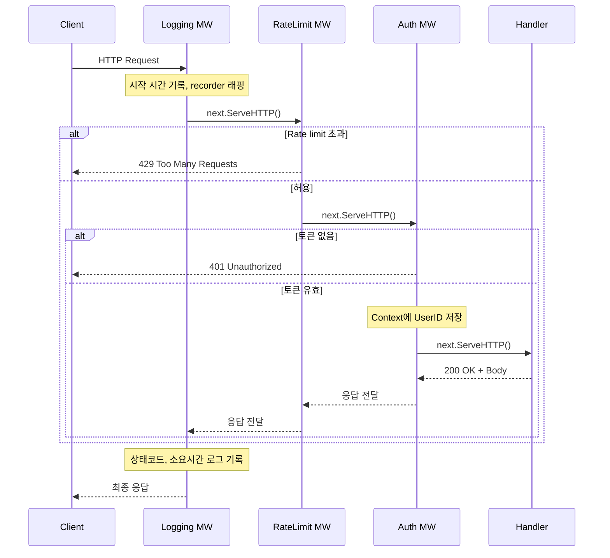

# Golang 실전 가이드    

저자: 최흥배, AI-Assisted   
    
권장 개발 환경
- **컴파일러**: Go 1.26  

-----  
  
이제 충분한 정보를 수집했습니다. Chapter 05를 작성하겠습니다.

---

# **Golang 실전 가이드**
## **Chapter 05: net/http — 표준 라이브러리만으로 만드는 웹 서버, Handler 설계, 미들웨어**

---

## **들어가며**

Go를 처음 배운 사람들이 웹 서버를 만들 때 "어떤 프레임워크를 써야 할까요?" 라고 물어보는 경우가 많습니다. 하지만 Go의 표준 라이브러리인 `net/http`는 이미 프로덕션 수준의 웹 서버를 구축하기에 충분한 기능을 갖추고 있습니다. 특히 Go 1.22부터는 메서드 기반 라우팅과 경로 파라미터 추출이 표준 라이브러리에 포함되어, 외부 의존성 없이도 REST API를 깔끔하게 설계할 수 있게 되었습니다.

이 챕터에서는 `net/http` 패키지의 핵심 구조를 이해하고, `Handler` 인터페이스를 기반으로 한 유연한 설계, 그리고 실무에서 필수적으로 사용되는 미들웨어 패턴을 완전히 습득하는 것을 목표로 합니다.

---

## **5.1 net/http의 전체 구조**

`net/http`의 큰 그림을 먼저 파악하는 것이 중요합니다. 클라이언트에서 요청이 들어오면 Go의 런타임이 어떤 경로로 처리하는지 아래 다이어그램으로 살펴보겠습니다.

```
┌─────────────────────────────────────────────────────────────────────┐
│                        net/http 처리 흐름                            │
│                                                                     │
│  ┌──────────┐    TCP      ┌───────────────┐    Route    ┌─────────┐ │
│  │  Client  │ ─────────▶ │  http.Server  │ ──────────▶ │ServeMux │ │
│  └──────────┘            └───────────────┘             └────┬────┘ │
│                                 │                           │      │
│                          goroutine 생성                    Match   │
│                          (요청 당 1개)                       │      │
│                                 │                           ▼      │
│                          ┌──────┴──────┐          ┌──────────────┐ │
│                          │  Request    │          │   Handler    │ │
│                          │  Response   │─────────▶│  (함수/구조체) │ │
│                          └─────────────┘          └──────────────┘ │
└─────────────────────────────────────────────────────────────────────┘
```

Go HTTP 서버의 핵심은 매우 단순합니다. `http.Server`는 클라이언트로부터 TCP 연결을 수락하고, 각 요청마다 새로운 goroutine을 생성하여 처리합니다. 이것이 Go의 HTTP 서버가 별도의 스레드 풀 설정 없이도 높은 동시성을 자연스럽게 처리할 수 있는 이유입니다. 각 goroutine이 경량 스레드이기 때문에, 수천 개의 동시 요청도 메모리를 거의 소비하지 않으면서 처리할 수 있습니다.

---

## **5.2 Handler 인터페이스 — Go HTTP의 심장**

`net/http`의 모든 것은 단 하나의 인터페이스를 중심으로 돌아갑니다.

```go
// net/http 패키지의 핵심 인터페이스
type Handler interface {
    ServeHTTP(ResponseWriter, *Request)
}
```

이 인터페이스를 구현하는 타입은 무엇이든 HTTP 요청을 처리할 수 있습니다. 단 하나의 메서드만 구현하면 된다는 단순함이 Go의 인터페이스 철학을 잘 보여줍니다.

실제로 함수를 바로 Handler로 사용할 수 있도록 `http.HandlerFunc`라는 어댑터 타입도 제공됩니다.

```go
// http.HandlerFunc의 실제 내부 구현
type HandlerFunc func(ResponseWriter, *Request)

func (f HandlerFunc) ServeHTTP(w ResponseWriter, r *Request) {
    f(w, r)
}
```

이 타입 덕분에 일반 함수를 `http.HandlerFunc(myFunc)` 형태로 캐스팅하는 것만으로 Handler 인터페이스를 만족시킬 수 있습니다. 아래 코드는 Handler를 사용하는 두 가지 방식(구조체 메서드 방식과 함수 방식)을 비교한 것입니다.

```go
package main

import (
    "fmt"
    "net/http"
)

// ── 방법 1: 구조체에 ServeHTTP 구현 ──────────────────────────────
type GreetHandler struct {
    greeting string
}

// Handler 인터페이스를 직접 구현
func (h GreetHandler) ServeHTTP(w http.ResponseWriter, r *http.Request) {
    fmt.Fprintf(w, "%s, %s!\n", h.greeting, r.URL.Query().Get("name"))
}

// ── 방법 2: 함수를 HandlerFunc로 변환 ────────────────────────────
func helloFunc(w http.ResponseWriter, r *http.Request) {
    fmt.Fprintln(w, "Hello from function handler!")
}

func main() {
    mux := http.NewServeMux()

    // 구조체 핸들러 등록 — 의존성(greeting)을 구조체 필드로 보유
    mux.Handle("/greet", GreetHandler{greeting: "Welcome"})

    // 함수 핸들러 등록 — http.HandlerFunc로 자동 변환
    mux.HandleFunc("/hello", helloFunc)

    fmt.Println("Listening on :8080")
    http.ListenAndServe(":8080", mux)
}
```

구조체 방식의 핵심 장점은 데이터베이스 연결이나 설정 값 같은 **의존성을 구조체 필드에 캡슐화**할 수 있다는 점입니다. 이 패턴은 이후 미들웨어 설계에서도 광범위하게 활용됩니다.

---

## **5.3 ServeMux — 요청 라우팅의 핵심**

`http.ServeMux`는 URL 패턴과 Handler를 매핑하는 라우터(multiplexer)입니다. Go 1.22에서 대폭 강화되어, 이제는 HTTP 메서드 지정과 경로 파라미터 추출을 기본으로 지원합니다.

```
┌──────────────────────────────────────────────────────────────────┐
│               ServeMux 패턴 매칭 우선순위 (Go 1.22+)              │
│                                                                  │
│  우선순위 높음                                                    │
│  ┌──────────────────────────────────────────────────────────┐   │
│  │ 1. 정확한 경로 매칭   "GET /users/admin"                  │   │
│  ├──────────────────────────────────────────────────────────┤   │
│  │ 2. 메서드 + 와일드카드 "GET /users/{id}"                  │   │
│  ├──────────────────────────────────────────────────────────┤   │
│  │ 3. 메서드 없는 와일드카드 "/users/{id}"                   │   │
│  ├──────────────────────────────────────────────────────────┤   │
│  │ 4. 접두사 패턴        "/users/"                          │   │
│  ├──────────────────────────────────────────────────────────┤   │
│  │ 5. 루트 패턴          "/"  (catch-all)                   │   │
│  └──────────────────────────────────────────────────────────┘   │
│  우선순위 낮음                                                    │
└──────────────────────────────────────────────────────────────────┘
```

아래 코드는 Go 1.22의 새로운 라우팅 기능을 종합적으로 보여줍니다.

```go
package main

import (
    "fmt"
    "net/http"
)

func main() {
    mux := http.NewServeMux()

    // ── Go 1.22 이전: 메서드 구분 없음, 수동 파싱 필요 ─────────────
    // mux.HandleFunc("/users/", manualParseHandler)

    // ── Go 1.22+: 메서드 기반 라우팅 ────────────────────────────────
    // GET /users      → 사용자 목록 반환
    mux.HandleFunc("GET /users", listUsers)

    // POST /users     → 새 사용자 생성
    mux.HandleFunc("POST /users", createUser)

    // GET /users/{id} → 특정 사용자 조회 (경로 파라미터 추출)
    mux.HandleFunc("GET /users/{id}", getUser)

    // PUT /users/{id} → 사용자 수정
    mux.HandleFunc("PUT /users/{id}", updateUser)

    // DELETE /users/{id} → 사용자 삭제
    mux.HandleFunc("DELETE /users/{id}", deleteUser)

    // 중첩 경로 파라미터
    mux.HandleFunc("GET /orgs/{orgID}/members/{memberID}", getMember)

    // {path...} : catch-all 와일드카드 (나머지 경로 전체를 캡처)
    mux.HandleFunc("GET /static/{filepath...}", serveStatic)

    fmt.Println("Server running on :8080")
    http.ListenAndServe(":8080", mux)
}

func listUsers(w http.ResponseWriter, r *http.Request) {
    fmt.Fprintln(w, "[GET] 사용자 목록")
}

func createUser(w http.ResponseWriter, r *http.Request) {
    fmt.Fprintln(w, "[POST] 사용자 생성")
}

func getUser(w http.ResponseWriter, r *http.Request) {
    // r.PathValue()로 경로 파라미터를 추출 (Go 1.22+)
    id := r.PathValue("id")
    fmt.Fprintf(w, "[GET] 사용자 ID: %s\n", id)
}

func updateUser(w http.ResponseWriter, r *http.Request) {
    id := r.PathValue("id")
    fmt.Fprintf(w, "[PUT] 사용자 %s 수정\n", id)
}

func deleteUser(w http.ResponseWriter, r *http.Request) {
    id := r.PathValue("id")
    fmt.Fprintf(w, "[DELETE] 사용자 %s 삭제\n", id)
}

func getMember(w http.ResponseWriter, r *http.Request) {
    orgID := r.PathValue("orgID")
    memberID := r.PathValue("memberID")
    fmt.Fprintf(w, "Org: %s, Member: %s\n", orgID, memberID)
}

func serveStatic(w http.ResponseWriter, r *http.Request) {
    // "/static/css/main.css" 요청 시 filepath = "css/main.css"
    filepath := r.PathValue("filepath")
    http.ServeFile(w, r, "./public/"+filepath)
}
```

Go 1.22부터 지원되지 않는 메서드로 요청이 들어오면 ServeMux가 자동으로 `405 Method Not Allowed`를 반환한다는 점도 중요한 개선사항입니다. 이전에는 개발자가 모든 핸들러 안에서 `r.Method`를 직접 검사해야 했습니다.

---

## **5.4 Request와 ResponseWriter — 요청/응답 처리**

HTTP 핸들러 내부에서 `*http.Request`와 `http.ResponseWriter`를 다루는 방법을 체계적으로 알아봅니다. 이 두 타입을 능숙하게 다루는 것이 Go 웹 개발의 기본기입니다.

```go
package main

import (
    "encoding/json"
    "fmt"
    "io"
    "net/http"
    "time"
)

// API 응답에 사용할 공통 구조체
type APIResponse struct {
    Success bool        `json:"success"`
    Data    interface{} `json:"data,omitempty"`
    Error   string      `json:"error,omitempty"`
}

// ── JSON 응답 헬퍼 함수 ───────────────────────────────────────────
func respondJSON(w http.ResponseWriter, statusCode int, data interface{}) {
    w.Header().Set("Content-Type", "application/json; charset=utf-8")
    w.WriteHeader(statusCode) // 반드시 Header 설정 이후에 호출해야 함
    if err := json.NewEncoder(w).Encode(data); err != nil {
        // WriteHeader 이후에는 상태코드 변경 불가 — 로그만 남김
        fmt.Printf("JSON 인코딩 실패: %v\n", err)
    }
}

func respondError(w http.ResponseWriter, statusCode int, message string) {
    respondJSON(w, statusCode, APIResponse{
        Success: false,
        Error:   message,
    })
}

// ── 요청 정보 읽기 예시 ───────────────────────────────────────────
type CreateItemRequest struct {
    Name  string `json:"name"`
    Price int    `json:"price"`
}

func createItemHandler(w http.ResponseWriter, r *http.Request) {
    // 1. 헤더에서 값 읽기
    contentType := r.Header.Get("Content-Type")
    apiKey := r.Header.Get("X-API-Key")
    fmt.Printf("Content-Type: %s, API-Key: %s\n", contentType, apiKey)

    // 2. 쿼리 파라미터 읽기 (?debug=true)
    debug := r.URL.Query().Get("debug")

    // 3. Body를 JSON으로 디코딩
    // Body 크기 제한 — DoS 방지를 위해 반드시 설정할 것
    r.Body = http.MaxBytesReader(w, r.Body, 1<<20) // 1MB 제한
    defer r.Body.Close()

    var req CreateItemRequest
    decoder := json.NewDecoder(r.Body)
    decoder.DisallowUnknownFields() // 알 수 없는 필드 거부
    if err := decoder.Decode(&req); err != nil {
        if err == io.EOF {
            respondError(w, http.StatusBadRequest, "request body가 비어있습니다")
            return
        }
        respondError(w, http.StatusBadRequest, "잘못된 JSON 형식: "+err.Error())
        return
    }

    // 4. 입력값 검증
    if req.Name == "" {
        respondError(w, http.StatusUnprocessableEntity, "name은 필수입니다")
        return
    }

    // 5. 응답 반환
    result := map[string]interface{}{
        "id":        "item-001",
        "name":      req.Name,
        "price":     req.Price,
        "debug":     debug == "true",
        "createdAt": time.Now().Format(time.RFC3339),
    }
    respondJSON(w, http.StatusCreated, APIResponse{
        Success: true,
        Data:    result,
    })
}
```

`w.WriteHeader()`는 반드시 `w.Header().Set()`으로 헤더를 설정한 *이후에* 호출해야 한다는 점에 주의해야 합니다. `WriteHeader`가 호출되고 나면 헤더는 이미 클라이언트로 전송된 것으로 간주되어, 이후에 헤더를 변경하려 해도 효과가 없습니다. 이것은 Go HTTP 개발에서 가장 흔하게 발생하는 실수 중 하나입니다.

---

## **5.5 http.Server 상세 설정**

프로덕션 환경에서는 기본 설정 그대로 사용해서는 안 됩니다. 타임아웃과 TLS 설정은 필수적인 보안/안정성 요소입니다.

```go
package main

import (
    "context"
    "crypto/tls"
    "fmt"
    "net/http"
    "os"
    "os/signal"
    "syscall"
    "time"
)

func main() {
    mux := http.NewServeMux()
    mux.HandleFunc("GET /health", func(w http.ResponseWriter, r *http.Request) {
        w.Write([]byte(`{"status":"ok"}`))
    })

    // ── 프로덕션용 서버 설정 ─────────────────────────────────────
    server := &http.Server{
        Addr:    ":8443",
        Handler: mux,

        // ❶ ReadTimeout: 요청 헤더+바디를 읽는 데 허용되는 최대 시간
        //    Slowloris 공격 방지를 위해 반드시 설정
        ReadTimeout: 10 * time.Second,

        // ❷ WriteTimeout: 응답을 쓰는 데 허용되는 최대 시간
        WriteTimeout: 10 * time.Second,

        // ❸ IdleTimeout: Keep-Alive 연결의 유휴 시간 제한
        IdleTimeout: 120 * time.Second,

        // ❹ ReadHeaderTimeout: 헤더만 읽는 시간 제한 (더 세밀한 제어)
        ReadHeaderTimeout: 5 * time.Second,

        // ❺ MaxHeaderBytes: 요청 헤더 최대 크기 (기본: 1MB)
        MaxHeaderBytes: 1 << 20,

        // ❻ TLS 설정 (HTTPS)
        TLSConfig: &tls.Config{
            MinVersion:               tls.VersionTLS12,
            PreferServerCipherSuites: true,
        },
    }

    // ── Graceful Shutdown ────────────────────────────────────────
    // OS 시그널을 별도 goroutine에서 수신하여 서버를 우아하게 종료
    quit := make(chan os.Signal, 1)
    signal.Notify(quit, syscall.SIGINT, syscall.SIGTERM)

    go func() {
        <-quit
        fmt.Println("\n종료 신호 수신. 서버를 안전하게 종료합니다...")

        // 최대 30초 동안 현재 처리 중인 요청이 완료되기를 기다림
        ctx, cancel := context.WithTimeout(context.Background(), 30*time.Second)
        defer cancel()

        if err := server.Shutdown(ctx); err != nil {
            fmt.Printf("강제 종료: %v\n", err)
        }
    }()

    fmt.Println("HTTPS 서버 시작: https://localhost:8443")
    // TLS 없이 HTTP로 실행하려면:
    // if err := server.ListenAndServe(); err != http.ErrServerClosed {
    if err := server.ListenAndServeTLS("cert.pem", "key.pem"); err != http.ErrServerClosed {
        fmt.Printf("서버 오류: %v\n", err)
        os.Exit(1)
    }
    fmt.Println("서버가 정상적으로 종료되었습니다.")
}
```

`Graceful Shutdown`은 프로덕션에서 매우 중요한 패턴입니다. `server.Shutdown(ctx)`을 호출하면 새로운 연결 수락을 중지하면서, 현재 처리 중인 요청들이 완료될 때까지 기다린 후 서버를 종료합니다. 이를 통해 배포나 재시작 시 진행 중인 요청이 갑자기 끊기는 상황을 방지할 수 있습니다.

---

## **5.6 미들웨어 — Handler를 감싸는 Handler**

미들웨어는 HTTP 요청 처리 파이프라인에서 횡단 관심사(cross-cutting concerns)를 분리하는 강력한 패턴입니다. 로깅, 인증, 속도 제한 같은 기능을 비즈니스 로직과 분리하여 재사용 가능하게 만들 수 있습니다.

```
┌─────────────────────────────────────────────────────────────────┐
│                    미들웨어 체인 동작 원리                         │
│                                                                 │
│  Client Request                                                 │
│      │                                                          │
│      ▼                                                          │
│  ┌──────────────────────────────────────────────────────────┐   │
│  │  [1] Logging Middleware  ← 요청 시작                     │   │
│  │    ┌──────────────────────────────────────────────────┐  │   │
│  │    │  [2] Auth Middleware  ← 토큰 검증                 │  │   │
│  │    │    ┌──────────────────────────────────────────┐   │  │   │
│  │    │    │  [3] RateLimit Middleware  ← IP 제한     │   │  │   │
│  │    │    │    ┌──────────────────────────────────┐  │   │  │   │
│  │    │    │    │      실제 Handler               │  │   │  │   │
│  │    │    │    │  (비즈니스 로직 실행)             │  │   │  │   │
│  │    │    │    └──────────────────────────────────┘  │   │  │   │
│  │    │    │  [3] RateLimit Middleware  → 요청 후 처리  │   │  │   │
│  │    │    └──────────────────────────────────────────┘   │  │   │
│  │    │  [2] Auth Middleware  → 응답 후 처리               │  │   │
│  │    └──────────────────────────────────────────────────┘  │   │
│  │  [1] Logging Middleware  → 처리 시간 기록                 │   │
│  └──────────────────────────────────────────────────────────┘   │
│      │                                                          │
│      ▼                                                          │
│  Client Response                                                │
└─────────────────────────────────────────────────────────────────┘
```

미들웨어의 시그니처는 "Handler를 받아서 Handler를 반환하는 함수"입니다.

```go
// 미들웨어의 표준 타입 정의
type Middleware func(http.Handler) http.Handler
```

### **5.6.1 로깅 미들웨어**

응답 상태 코드를 캡처하려면 `http.ResponseWriter`를 직접 래핑해야 합니다. 표준 인터페이스는 상태 코드를 쓴 이후에 그 값을 조회하는 방법을 제공하지 않기 때문입니다.

```go
package main

import (
    "log/slog"
    "net/http"
    "time"
)

// responseRecorder는 상태 코드와 응답 크기를 기록하기 위한 래퍼
type responseRecorder struct {
    http.ResponseWriter
    statusCode    int
    bytesWritten  int
    headerWritten bool
}

func newResponseRecorder(w http.ResponseWriter) *responseRecorder {
    return &responseRecorder{ResponseWriter: w, statusCode: http.StatusOK}
}

// WriteHeader를 오버라이드하여 상태 코드를 캡처
func (rr *responseRecorder) WriteHeader(code int) {
    if !rr.headerWritten {
        rr.statusCode = code
        rr.headerWritten = true
        rr.ResponseWriter.WriteHeader(code)
    }
}

// Write를 오버라이드하여 응답 크기를 추적
func (rr *responseRecorder) Write(b []byte) (int, error) {
    if !rr.headerWritten {
        rr.WriteHeader(http.StatusOK)
    }
    n, err := rr.ResponseWriter.Write(b)
    rr.bytesWritten += n
    return n, err
}

// LoggingMiddleware: 요청/응답 정보를 구조화된 로그로 기록
func LoggingMiddleware(logger *slog.Logger) Middleware {
    return func(next http.Handler) http.Handler {
        return http.HandlerFunc(func(w http.ResponseWriter, r *http.Request) {
            start := time.Now()
            rec := newResponseRecorder(w)

            // 다음 핸들러 실행
            next.ServeHTTP(rec, r)

            // 실행 완료 후 로그 기록
            logger.Info("http request",
                "method", r.Method,
                "path", r.URL.Path,
                "status", rec.statusCode,
                "bytes", rec.bytesWritten,
                "duration", time.Since(start),
                "remote_addr", r.RemoteAddr,
                "user_agent", r.UserAgent(),
            )
        })
    }
}
```

### **5.6.2 인증 미들웨어**

```go
package main

import (
    "context"
    "net/http"
    "strings"
)

// contextKey: context에 값을 저장할 때 사용하는 타입 안전한 키
// string 같은 기본 타입을 직접 쓰면 다른 패키지와 키가 충돌할 수 있음
type contextKey string

const (
    ContextKeyUserID contextKey = "userID"
    ContextKeyRole   contextKey = "role"
)

// JWT 검증을 흉내낸 간단한 토큰 파서 (실제로는 jwt 라이브러리 사용)
func parseToken(token string) (userID, role string, valid bool) {
    // 실제 구현에서는 jwt.Parse() 등을 사용
    if token == "valid-admin-token" {
        return "user-001", "admin", true
    }
    if token == "valid-user-token" {
        return "user-002", "user", true
    }
    return "", "", false
}

// AuthMiddleware: Bearer 토큰을 검증하고 사용자 정보를 컨텍스트에 저장
func AuthMiddleware(next http.Handler) http.Handler {
    return http.HandlerFunc(func(w http.ResponseWriter, r *http.Request) {
        authHeader := r.Header.Get("Authorization")
        if authHeader == "" {
            http.Error(w, `{"error":"Authorization header 없음"}`, http.StatusUnauthorized)
            return
        }

        // "Bearer <token>" 형식 파싱
        parts := strings.SplitN(authHeader, " ", 2)
        if len(parts) != 2 || parts[0] != "Bearer" {
            http.Error(w, `{"error":"잘못된 Authorization 형식"}`, http.StatusUnauthorized)
            return
        }

        userID, role, valid := parseToken(parts[1])
        if !valid {
            http.Error(w, `{"error":"유효하지 않은 토큰"}`, http.StatusUnauthorized)
            return
        }

        // 컨텍스트에 사용자 정보 저장 → 다음 핸들러에서 꺼내 쓸 수 있음
        ctx := context.WithValue(r.Context(), ContextKeyUserID, userID)
        ctx = context.WithValue(ctx, ContextKeyRole, role)
        next.ServeHTTP(w, r.WithContext(ctx))
    })
}

// RequireRole: 특정 역할을 가진 사용자만 접근 허용하는 미들웨어 팩토리
func RequireRole(role string) Middleware {
    return func(next http.Handler) http.Handler {
        return http.HandlerFunc(func(w http.ResponseWriter, r *http.Request) {
            userRole, ok := r.Context().Value(ContextKeyRole).(string)
            if !ok || userRole != role {
                http.Error(w, `{"error":"권한 없음"}`, http.StatusForbidden)
                return
            }
            next.ServeHTTP(w, r)
        })
    }
}

// 핸들러에서 컨텍스트 값을 꺼내 쓰는 예시
func adminOnlyHandler(w http.ResponseWriter, r *http.Request) {
    userID := r.Context().Value(ContextKeyUserID).(string)
    w.Header().Set("Content-Type", "application/json")
    w.Write([]byte(`{"message":"관리자 전용 페이지","userID":"` + userID + `"}`))
}
```

### **5.6.3 미들웨어 체이닝 헬퍼**

여러 미들웨어를 중첩 호출하면 코드가 우측으로 깊어지는 "콜백 지옥" 같은 문제가 발생합니다. `Chain` 함수를 만들어 이를 해결합니다.

```go
package main

import (
    "net/http"
)

// Middleware 타입: Handler를 받아 새 Handler를 반환하는 함수
type Middleware func(http.Handler) http.Handler

// Chain: 여러 미들웨어를 순서대로 적용하는 헬퍼
// 첫 번째 미들웨어가 가장 바깥쪽(먼저 실행)이 됨
func Chain(h http.Handler, middlewares ...Middleware) http.Handler {
    // 역순으로 적용해야 실행 순서가 인자 순서와 일치함
    for i := len(middlewares) - 1; i >= 0; i-- {
        h = middlewares[i](h)
    }
    return h
}

// ─────────── 사용 예시 ────────────────────────────────────────────

func setupRoutes() http.Handler {
    mux := http.NewServeMux()

    // 공개 엔드포인트: 로깅만 적용
    mux.Handle("GET /health",
        Chain(
            http.HandlerFunc(healthCheck),
            LoggingMiddleware(logger), // logger는 전역 또는 클로저 내 변수
        ),
    )

    // 인증 필요 엔드포인트
    mux.Handle("GET /api/profile",
        Chain(
            http.HandlerFunc(profileHandler),
            LoggingMiddleware(logger),
            AuthMiddleware,
        ),
    )

    // 관리자 전용 엔드포인트
    mux.Handle("DELETE /api/admin/users/{id}",
        Chain(
            http.HandlerFunc(adminOnlyHandler),
            LoggingMiddleware(logger),
            AuthMiddleware,
            RequireRole("admin"),
        ),
    )

    return mux
}
```

---

## **5.7 추가 핵심 미들웨어 구현**

실무에서 자주 사용하는 미들웨어들을 추가로 살펴봅니다.

### **5.7.1 속도 제한 (Rate Limiting) 미들웨어**

```go
package main

import (
    "net/http"
    "sync"
    "time"
)

// tokenBucket: 토큰 버킷 알고리즘으로 속도 제한 구현
type tokenBucket struct {
    tokens     float64
    maxTokens  float64
    refillRate float64 // 초당 토큰 보충량
    lastRefill time.Time
    mu         sync.Mutex
}

func newTokenBucket(maxTokens, refillRate float64) *tokenBucket {
    return &tokenBucket{
        tokens:     maxTokens,
        maxTokens:  maxTokens,
        refillRate: refillRate,
        lastRefill: time.Now(),
    }
}

// Allow: 토큰 1개 소비 가능 여부 확인
func (tb *tokenBucket) Allow() bool {
    tb.mu.Lock()
    defer tb.mu.Unlock()

    now := time.Now()
    elapsed := now.Sub(tb.lastRefill).Seconds()
    // 경과 시간만큼 토큰 보충 (최대값 초과 불가)
    tb.tokens = min(tb.maxTokens, tb.tokens+elapsed*tb.refillRate)
    tb.lastRefill = now

    if tb.tokens >= 1.0 {
        tb.tokens -= 1.0
        return true
    }
    return false
}

// IPRateLimiter: IP 주소 별로 개별 버킷 관리
type IPRateLimiter struct {
    buckets map[string]*tokenBucket
    mu      sync.RWMutex
    max     float64
    rate    float64
}

func NewIPRateLimiter(max, rate float64) *IPRateLimiter {
    return &IPRateLimiter{
        buckets: make(map[string]*tokenBucket),
        max:     max,
        rate:    rate,
    }
}

func (irl *IPRateLimiter) getBucket(ip string) *tokenBucket {
    irl.mu.RLock()
    bucket, exists := irl.buckets[ip]
    irl.mu.RUnlock()

    if !exists {
        irl.mu.Lock()
        bucket = newTokenBucket(irl.max, irl.rate)
        irl.buckets[ip] = bucket
        irl.mu.Unlock()
    }
    return bucket
}

func RateLimitMiddleware(limiter *IPRateLimiter) Middleware {
    return func(next http.Handler) http.Handler {
        return http.HandlerFunc(func(w http.ResponseWriter, r *http.Request) {
            // X-Forwarded-For 헤더를 고려한 IP 추출 (프록시 환경)
            ip := r.Header.Get("X-Forwarded-For")
            if ip == "" {
                ip = r.RemoteAddr
            }

            if !limiter.getBucket(ip).Allow() {
                w.Header().Set("Retry-After", "1")
                http.Error(w, `{"error":"Too Many Requests"}`,
                    http.StatusTooManyRequests)
                return
            }
            next.ServeHTTP(w, r)
        })
    }
}

func min(a, b float64) float64 {
    if a < b {
        return a
    }
    return b
}
```

### **5.7.2 CORS 미들웨어**

```go
package main

import "net/http"

type CORSConfig struct {
    AllowedOrigins []string
    AllowedMethods []string
    AllowedHeaders []string
    MaxAge         int // 초 단위
}

// CORSMiddleware: Cross-Origin Resource Sharing 헤더 처리
func CORSMiddleware(cfg CORSConfig) Middleware {
    allowedOrigins := make(map[string]struct{}, len(cfg.AllowedOrigins))
    for _, o := range cfg.AllowedOrigins {
        allowedOrigins[o] = struct{}{}
    }

    return func(next http.Handler) http.Handler {
        return http.HandlerFunc(func(w http.ResponseWriter, r *http.Request) {
            origin := r.Header.Get("Origin")
            _, allowed := allowedOrigins[origin]
            if allowed || len(cfg.AllowedOrigins) == 0 {
                w.Header().Set("Access-Control-Allow-Origin", origin)
            }

            // OPTIONS 프리플라이트 요청 처리
            if r.Method == http.MethodOptions {
                w.Header().Set("Access-Control-Allow-Methods",
                    joinStrings(cfg.AllowedMethods, ", "))
                w.Header().Set("Access-Control-Allow-Headers",
                    joinStrings(cfg.AllowedHeaders, ", "))
                w.Header().Set("Access-Control-Max-Age",
                    itoa(cfg.MaxAge))
                w.WriteHeader(http.StatusNoContent)
                return // 프리플라이트는 여기서 종료
            }

            next.ServeHTTP(w, r)
        })
    }
}

func joinStrings(ss []string, sep string) string {
    result := ""
    for i, s := range ss {
        if i > 0 {
            result += sep
        }
        result += s
    }
    return result
}

func itoa(n int) string {
    if n == 0 {
        return "0"
    }
    buf := make([]byte, 0, 10)
    for n > 0 {
        buf = append([]byte{byte('0' + n%10)}, buf...)
        n /= 10
    }
    return string(buf)
}
```

---

## **5.8 미들웨어 흐름 시각화**

아래 머메이드 다이어그램은 실제 요청이 미들웨어 체인을 통과하는 흐름과 각 단계에서 발생하는 분기 처리를 보여줍니다.



---

## **5.9 Chapter 05 응용 프로그램 — 완전한 REST API 서버**

이 챕터에서 배운 모든 내용을 종합하여 실무 수준의 **할 일 관리 REST API 서버**를 구축합니다. 이 서버는 표준 라이브러리만 사용하며, 구조화된 로깅, JWT 유사 인증, 속도 제한, CORS, Graceful Shutdown까지 모두 포함합니다.

```
프로젝트 구조:
todo-api/
├── main.go
├── middleware/
│   ├── middleware.go   (Middleware 타입, Chain 함수)
│   ├── logging.go      (LoggingMiddleware)
│   ├── auth.go         (AuthMiddleware)
│   └── ratelimit.go    (RateLimitMiddleware)
├── handler/
│   └── todo.go         (TodoHandler)
└── store/
    └── store.go        (인메모리 데이터 저장소)
```

### **store/store.go**

```go
package store

import (
    "errors"
    "sync"
    "time"
)

// Todo: 할 일 항목을 표현하는 도메인 모델
type Todo struct {
    ID          string    `json:"id"`
    UserID      string    `json:"userId"`
    Title       string    `json:"title"`
    Description string    `json:"description,omitempty"`
    Done        bool      `json:"done"`
    CreatedAt   time.Time `json:"createdAt"`
    UpdatedAt   time.Time `json:"updatedAt"`
}

var (
    ErrNotFound   = errors.New("todo를 찾을 수 없습니다")
    ErrForbidden  = errors.New("접근 권한이 없습니다")
)

// InMemoryStore: 스레드 안전한 인메모리 저장소
type InMemoryStore struct {
    mu      sync.RWMutex
    todos   map[string]Todo
    counter int
}

func NewInMemoryStore() *InMemoryStore {
    return &InMemoryStore{
        todos: make(map[string]Todo),
    }
}

func (s *InMemoryStore) nextID() string {
    s.counter++
    return fmt.Sprintf("todo-%04d", s.counter)
}

// Create: 새 할 일 생성
func (s *InMemoryStore) Create(userID, title, description string) Todo {
    s.mu.Lock()
    defer s.mu.Unlock()

    now := time.Now()
    todo := Todo{
        ID:          s.nextID(),
        UserID:      userID,
        Title:       title,
        Description: description,
        Done:        false,
        CreatedAt:   now,
        UpdatedAt:   now,
    }
    s.todos[todo.ID] = todo
    return todo
}

// GetByID: ID로 할 일 조회
func (s *InMemoryStore) GetByID(id string) (Todo, error) {
    s.mu.RLock()
    defer s.mu.RUnlock()

    todo, ok := s.todos[id]
    if !ok {
        return Todo{}, ErrNotFound
    }
    return todo, nil
}

// ListByUser: 특정 사용자의 모든 할 일 조회
func (s *InMemoryStore) ListByUser(userID string) []Todo {
    s.mu.RLock()
    defer s.mu.RUnlock()

    result := make([]Todo, 0)
    for _, todo := range s.todos {
        if todo.UserID == userID {
            result = append(result, todo)
        }
    }
    // 생성 시간 기준 정렬
    sort.Slice(result, func(i, j int) bool {
        return result[i].CreatedAt.Before(result[j].CreatedAt)
    })
    return result
}

// Update: 할 일 수정 (소유자 확인 포함)
func (s *InMemoryStore) Update(id, userID, title, description string, done bool) (Todo, error) {
    s.mu.Lock()
    defer s.mu.Unlock()

    todo, ok := s.todos[id]
    if !ok {
        return Todo{}, ErrNotFound
    }
    if todo.UserID != userID {
        return Todo{}, ErrForbidden
    }

    todo.Title = title
    todo.Description = description
    todo.Done = done
    todo.UpdatedAt = time.Now()
    s.todos[id] = todo
    return todo, nil
}

// Delete: 할 일 삭제 (소유자 확인 포함)
func (s *InMemoryStore) Delete(id, userID string) error {
    s.mu.Lock()
    defer s.mu.Unlock()

    todo, ok := s.todos[id]
    if !ok {
        return ErrNotFound
    }
    if todo.UserID != userID {
        return ErrForbidden
    }

    delete(s.todos, id)
    return nil
}
```

### **middleware/middleware.go**

```go
package middleware

import "net/http"

// Middleware: Go 표준 미들웨어 함수 시그니처
type Middleware func(http.Handler) http.Handler

// Chain: 미들웨어를 순서대로 적용하는 헬퍼
// Chain(h, A, B, C) → 요청은 A → B → C → h 순으로 처리됨
func Chain(h http.Handler, mws ...Middleware) http.Handler {
    for i := len(mws) - 1; i >= 0; i-- {
        h = mws[i](h)
    }
    return h
}
```

### **middleware/logging.go**

```go
package middleware

import (
    "log/slog"
    "net/http"
    "time"
)

type statusRecorder struct {
    http.ResponseWriter
    status int
    size   int
}

func (sr *statusRecorder) WriteHeader(code int) {
    sr.status = code
    sr.ResponseWriter.WriteHeader(code)
}

func (sr *statusRecorder) Write(b []byte) (int, error) {
    n, err := sr.ResponseWriter.Write(b)
    sr.size += n
    return n, err
}

// NewLogging: 구조화된 로그를 기록하는 미들웨어 생성
func NewLogging(logger *slog.Logger) Middleware {
    return func(next http.Handler) http.Handler {
        return http.HandlerFunc(func(w http.ResponseWriter, r *http.Request) {
            start := time.Now()
            rec := &statusRecorder{ResponseWriter: w, status: http.StatusOK}

            next.ServeHTTP(rec, r)

            logger.Info("access",
                slog.String("method", r.Method),
                slog.String("path", r.URL.Path),
                slog.String("query", r.URL.RawQuery),
                slog.Int("status", rec.status),
                slog.Int("bytes", rec.size),
                slog.Duration("duration", time.Since(start)),
                slog.String("ip", r.RemoteAddr),
            )
        })
    }
}
```

### **middleware/auth.go**

```go
package middleware

import (
    "context"
    "net/http"
    "strings"
)

type ctxKey string

const (
    CtxUserID ctxKey = "userID"
    CtxRole   ctxKey = "role"
)

// GetUserID: 컨텍스트에서 사용자 ID를 추출하는 헬퍼
func GetUserID(r *http.Request) string {
    v, _ := r.Context().Value(CtxUserID).(string)
    return v
}

// 실제 서비스에서는 JWT 라이브러리로 대체
var validTokens = map[string][2]string{
    "token-alice-admin": {"user-alice", "admin"},
    "token-bob-user":    {"user-bob", "user"},
}

// NewAuth: Bearer 토큰 인증 미들웨어
func NewAuth() Middleware {
    return func(next http.Handler) http.Handler {
        return http.HandlerFunc(func(w http.ResponseWriter, r *http.Request) {
            header := r.Header.Get("Authorization")
            if header == "" {
                http.Error(w,
                    `{"success":false,"error":"인증 토큰이 필요합니다"}`,
                    http.StatusUnauthorized)
                return
            }

            parts := strings.SplitN(header, " ", 2)
            if len(parts) != 2 || parts[0] != "Bearer" {
                http.Error(w,
                    `{"success":false,"error":"잘못된 토큰 형식"}`,
                    http.StatusUnauthorized)
                return
            }

            info, ok := validTokens[parts[1]]
            if !ok {
                http.Error(w,
                    `{"success":false,"error":"유효하지 않은 토큰"}`,
                    http.StatusUnauthorized)
                return
            }

            ctx := context.WithValue(r.Context(), CtxUserID, info[0])
            ctx = context.WithValue(ctx, CtxRole, info[1])
            next.ServeHTTP(w, r.WithContext(ctx))
        })
    }
}
```

### **handler/todo.go**

```go
package handler

import (
    "encoding/json"
    "errors"
    "net/http"

    "todo-api/middleware"
    "todo-api/store"
)

type TodoHandler struct {
    store *store.InMemoryStore
}

func NewTodoHandler(s *store.InMemoryStore) *TodoHandler {
    return &TodoHandler{store: s}
}

// RegisterRoutes: 핸들러의 라우트를 ServeMux에 등록
func (h *TodoHandler) RegisterRoutes(mux *http.ServeMux, auth middleware.Middleware) {
    // 모든 todo 엔드포인트는 인증이 필요
    mux.Handle("GET /api/todos",
        auth(http.HandlerFunc(h.listTodos)))
    mux.Handle("POST /api/todos",
        auth(http.HandlerFunc(h.createTodo)))
    mux.Handle("GET /api/todos/{id}",
        auth(http.HandlerFunc(h.getTodo)))
    mux.Handle("PUT /api/todos/{id}",
        auth(http.HandlerFunc(h.updateTodo)))
    mux.Handle("DELETE /api/todos/{id}",
        auth(http.HandlerFunc(h.deleteTodo)))
}

// ── 응답 헬퍼 ────────────────────────────────────────────────────

type apiResp struct {
    Success bool        `json:"success"`
    Data    interface{} `json:"data,omitempty"`
    Error   string      `json:"error,omitempty"`
}

func writeJSON(w http.ResponseWriter, code int, v interface{}) {
    w.Header().Set("Content-Type", "application/json; charset=utf-8")
    w.WriteHeader(code)
    json.NewEncoder(w).Encode(v)
}

func writeError(w http.ResponseWriter, code int, msg string) {
    writeJSON(w, code, apiResp{Success: false, Error: msg})
}

// ── 핸들러 구현 ──────────────────────────────────────────────────

// GET /api/todos → 내 할 일 목록
func (h *TodoHandler) listTodos(w http.ResponseWriter, r *http.Request) {
    userID := middleware.GetUserID(r)
    todos := h.store.ListByUser(userID)
    writeJSON(w, http.StatusOK, apiResp{
        Success: true,
        Data:    todos,
    })
}

// POST /api/todos → 할 일 생성
type createTodoReq struct {
    Title       string `json:"title"`
    Description string `json:"description"`
}

func (h *TodoHandler) createTodo(w http.ResponseWriter, r *http.Request) {
    userID := middleware.GetUserID(r)

    var req createTodoReq
    if err := json.NewDecoder(r.Body).Decode(&req); err != nil {
        writeError(w, http.StatusBadRequest, "잘못된 요청 형식: "+err.Error())
        return
    }
    if req.Title == "" {
        writeError(w, http.StatusUnprocessableEntity, "title은 필수입니다")
        return
    }

    todo := h.store.Create(userID, req.Title, req.Description)
    writeJSON(w, http.StatusCreated, apiResp{Success: true, Data: todo})
}

// GET /api/todos/{id} → 특정 할 일 조회
func (h *TodoHandler) getTodo(w http.ResponseWriter, r *http.Request) {
    id := r.PathValue("id")
    userID := middleware.GetUserID(r)

    todo, err := h.store.GetByID(id)
    if err != nil {
        if errors.Is(err, store.ErrNotFound) {
            writeError(w, http.StatusNotFound, err.Error())
        } else {
            writeError(w, http.StatusInternalServerError, "서버 오류")
        }
        return
    }
    // 다른 사용자의 할 일은 조회 불가
    if todo.UserID != userID {
        writeError(w, http.StatusForbidden, "접근 권한이 없습니다")
        return
    }

    writeJSON(w, http.StatusOK, apiResp{Success: true, Data: todo})
}

// PUT /api/todos/{id} → 할 일 수정
type updateTodoReq struct {
    Title       string `json:"title"`
    Description string `json:"description"`
    Done        bool   `json:"done"`
}

func (h *TodoHandler) updateTodo(w http.ResponseWriter, r *http.Request) {
    id := r.PathValue("id")
    userID := middleware.GetUserID(r)

    var req updateTodoReq
    if err := json.NewDecoder(r.Body).Decode(&req); err != nil {
        writeError(w, http.StatusBadRequest, "잘못된 요청 형식")
        return
    }
    if req.Title == "" {
        writeError(w, http.StatusUnprocessableEntity, "title은 필수입니다")
        return
    }

    todo, err := h.store.Update(id, userID, req.Title, req.Description, req.Done)
    if err != nil {
        switch {
        case errors.Is(err, store.ErrNotFound):
            writeError(w, http.StatusNotFound, err.Error())
        case errors.Is(err, store.ErrForbidden):
            writeError(w, http.StatusForbidden, err.Error())
        default:
            writeError(w, http.StatusInternalServerError, "서버 오류")
        }
        return
    }

    writeJSON(w, http.StatusOK, apiResp{Success: true, Data: todo})
}

// DELETE /api/todos/{id} → 할 일 삭제
func (h *TodoHandler) deleteTodo(w http.ResponseWriter, r *http.Request) {
    id := r.PathValue("id")
    userID := middleware.GetUserID(r)

    if err := h.store.Delete(id, userID); err != nil {
        switch {
        case errors.Is(err, store.ErrNotFound):
            writeError(w, http.StatusNotFound, err.Error())
        case errors.Is(err, store.ErrForbidden):
            writeError(w, http.StatusForbidden, err.Error())
        default:
            writeError(w, http.StatusInternalServerError, "서버 오류")
        }
        return
    }

    w.WriteHeader(http.StatusNoContent) // 204: 성공했지만 반환할 내용 없음
}
```

### **main.go — 전체 조합**

```go
package main

import (
    "context"
    "fmt"
    "log/slog"
    "net/http"
    "os"
    "os/signal"
    "syscall"
    "time"

    "todo-api/handler"
    "todo-api/middleware"
    "todo-api/store"
)

func main() {
    // ── 구조화 로거 설정 ─────────────────────────────────────────
    logger := slog.New(slog.NewJSONHandler(os.Stdout, &slog.HandlerOptions{
        Level: slog.LevelInfo,
    }))

    // ── 의존성 생성 ──────────────────────────────────────────────
    todoStore := store.NewInMemoryStore()
    todoHandler := handler.NewTodoHandler(todoStore)

    // ── 미들웨어 인스턴스 생성 ────────────────────────────────────
    authMW := middleware.NewAuth()
    logMW := middleware.NewLogging(logger)

    // ── 라우터 설정 ──────────────────────────────────────────────
    mux := http.NewServeMux()

    // 공개 엔드포인트
    mux.HandleFunc("GET /health", func(w http.ResponseWriter, r *http.Request) {
        w.Header().Set("Content-Type", "application/json")
        fmt.Fprintln(w, `{"status":"ok","service":"todo-api"}`)
    })

    // API 정보 엔드포인트
    mux.HandleFunc("GET /api", func(w http.ResponseWriter, r *http.Request) {
        w.Header().Set("Content-Type", "application/json")
        fmt.Fprintln(w, `{
            "version": "1.0.0",
            "endpoints": [
                "GET /api/todos",
                "POST /api/todos",
                "GET /api/todos/{id}",
                "PUT /api/todos/{id}",
                "DELETE /api/todos/{id}"
            ]
        }`)
    })

    // 인증이 필요한 Todo API 라우트 등록
    todoHandler.RegisterRoutes(mux, authMW)

    // ── 전역 미들웨어 적용 (로깅은 모든 요청에 적용) ──────────────
    handler := logMW(mux)

    // ── 서버 설정 ────────────────────────────────────────────────
    server := &http.Server{
        Addr:              ":8080",
        Handler:           handler,
        ReadTimeout:       10 * time.Second,
        WriteTimeout:      10 * time.Second,
        IdleTimeout:       120 * time.Second,
        ReadHeaderTimeout: 5 * time.Second,
        MaxHeaderBytes:    1 << 20,
    }

    // ── Graceful Shutdown ────────────────────────────────────────
    quit := make(chan os.Signal, 1)
    signal.Notify(quit, syscall.SIGINT, syscall.SIGTERM)

    go func() {
        <-quit
        logger.Info("종료 신호 수신. Graceful Shutdown 시작...")

        ctx, cancel := context.WithTimeout(context.Background(), 30*time.Second)
        defer cancel()

        if err := server.Shutdown(ctx); err != nil {
            logger.Error("강제 종료", "error", err)
        }
    }()

    logger.Info("Todo API 서버 시작",
        "addr", server.Addr,
        "go_version", "1.26",
    )

    // ────────────────────────────────────────────────────────────
    // 서버 시작. ErrServerClosed는 Shutdown()에 의한 정상 종료를 의미
    if err := server.ListenAndServe(); err != http.ErrServerClosed {
        logger.Error("서버 시작 실패", "error", err)
        os.Exit(1)
    }

    logger.Info("서버가 정상적으로 종료되었습니다")
}
```

### **API 동작 확인 — curl 예시**

```bash
# 서버 헬스 체크
curl http://localhost:8080/health

# 할 일 생성 (Alice 토큰)
curl -X POST http://localhost:8080/api/todos \
  -H "Authorization: Bearer token-alice-admin" \
  -H "Content-Type: application/json" \
  -d '{"title":"Go 책 Chapter 05 복습","description":"net/http 미들웨어 패턴 정리"}'

# 할 일 목록 조회
curl http://localhost:8080/api/todos \
  -H "Authorization: Bearer token-alice-admin"

# 특정 할 일 조회
curl http://localhost:8080/api/todos/todo-0001 \
  -H "Authorization: Bearer token-alice-admin"

# 할 일 완료 처리
curl -X PUT http://localhost:8080/api/todos/todo-0001 \
  -H "Authorization: Bearer token-alice-admin" \
  -H "Content-Type: application/json" \
  -d '{"title":"Go 책 Chapter 05 복습","done":true}'

# 인증 없이 접근 시도 → 401 Unauthorized
curl http://localhost:8080/api/todos

# 삭제
curl -X DELETE http://localhost:8080/api/todos/todo-0001 \
  -H "Authorization: Bearer token-alice-admin"
```

---

## **5.10 챕터 정리**

이 챕터에서 다룬 핵심 개념들을 아래 다이어그램으로 한눈에 정리합니다.

```
┌─────────────────────────────────────────────────────────────────────┐
│                   Chapter 05 핵심 개념 지도                           │
│                                                                     │
│  ┌─────────────────────────────────────────────────────────────┐   │
│  │  net/http 핵심 타입                                          │   │
│  │                                                             │   │
│  │  http.Handler ─────── http.HandlerFunc (함수 어댑터)        │   │
│  │       │                                                     │   │
│  │  http.ServeMux ────── Go 1.22: 메서드 라우팅, PathValue()   │   │
│  │       │                                                     │   │
│  │  http.Server ─────── 타임아웃, TLS, Graceful Shutdown       │   │
│  └─────────────────────────────────────────────────────────────┘   │
│                                                                     │
│  ┌─────────────────────────────────────────────────────────────┐   │
│  │  미들웨어 패턴                                                │   │
│  │                                                             │   │
│  │  type Middleware func(http.Handler) http.Handler            │   │
│  │                                                             │   │
│  │  • Logging    → responseRecorder로 상태코드 캡처             │   │
│  │  • Auth       → context.WithValue로 사용자 정보 전달        │   │
│  │  • RateLimit  → 토큰 버킷 알고리즘                           │   │
│  │  • CORS       → OPTIONS 프리플라이트 처리                    │   │
│  │  • Chain()    → 가독성 높은 미들웨어 조합                     │   │
│  └─────────────────────────────────────────────────────────────┘   │
│                                                                     │
│  ┌─────────────────────────────────────────────────────────────┐   │
│  │  실무 설계 원칙                                               │   │
│  │                                                             │   │
│  │  • 의존성은 구조체 필드에 → 테스트 용이성 향상               │   │
│  │  • MaxBytesReader → DoS 방지                                │   │
│  │  • 타임아웃 설정 → Slowloris 공격 방지                       │   │
│  │  • Graceful Shutdown → 무중단 배포                           │   │
│  │  • context.Value 키는 타입 안전한 커스텀 타입 사용           │   │
│  └─────────────────────────────────────────────────────────────┘   │
└─────────────────────────────────────────────────────────────────────┘
```

이 챕터에서 가장 중요하게 기억해야 할 것은 Go의 `net/http`가 단 하나의 인터페이스인 `http.Handler`를 중심으로 극도로 일관성 있게 설계되어 있다는 점입니다. 이 단순함 덕분에 미들웨어 패턴이 자연스럽게 탄생하고, 어떤 복잡한 기능도 "Handler를 감싸는 Handler"라는 일관된 방식으로 구현할 수 있습니다. 다음 챕터에서는 이 표준 라이브러리 위에 구축된 `Gin`과 `Echo` 프레임워크가 어떤 문제를 해결하는지, 그리고 언제 프레임워크를 선택해야 하는지를 살펴봅니다.  