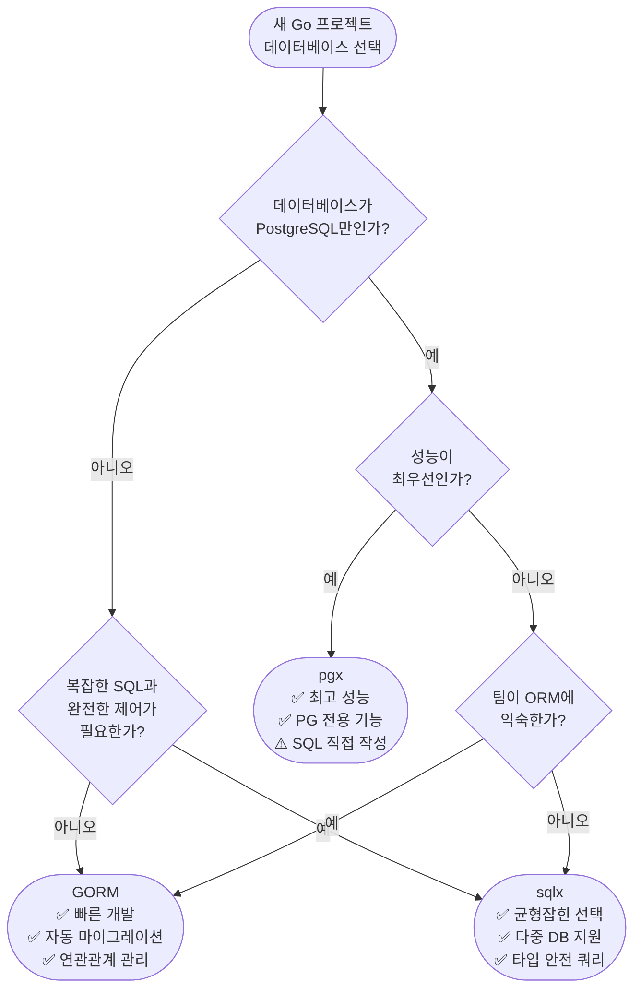

# Golang 실전 가이드    

저자: 최흥배, AI-Assisted   
    
권장 개발 환경
- **컴파일러**: Go 1.26  

-----   
  
이제 충분한 정보를 수집했습니다. Chapter 07 전체를 작성하겠습니다.

---

# 📘 Golang 실전 가이드
## Chapter 07: 데이터베이스 — database/sql, sqlx, GORM을 통한 CRUD, 연결 풀 관리, 트랜잭션, 마이그레이션

---

## **들어가며**

Go로 실무 애플리케이션을 개발할 때 데이터베이스와의 연동은 피할 수 없는 핵심 주제입니다. Go 생태계에서는 데이터베이스를 다루는 방식이 크게 세 계층으로 나뉩니다. 첫 번째는 표준 라이브러리인 `database/sql`이고, 두 번째는 이를 확장한 `sqlx`, 세 번째는 완전한 ORM인 `GORM`입니다. 각 계층은 추상화 수준, 성능, 생산성이 서로 다르므로 프로젝트의 요구사항에 맞게 선택해야 합니다.

이 챕터에서는 세 가지 접근법을 모두 실습하며, 연결 풀 관리, 트랜잭션, 그리고 프로덕션 환경에서 필수적인 마이그레이션까지 다룹니다.

---

## **7.1 Go 데이터베이스 생태계 개요**

```
┌─────────────────────────────────────────────────────────────────┐
│                   Go 데이터베이스 추상화 계층                        │
├─────────────────────────────────────────────────────────────────┤
│                                                                 │
│   ┌──────────────┐   ┌──────────────┐   ┌──────────────────┐  │
│   │    GORM      │   │    sqlx      │   │  database/sql    │  │
│   │  (Full ORM)  │   │  (SQL 확장)  │   │  (표준 라이브러리) │  │
│   └──────┬───────┘   └──────┬───────┘   └────────┬─────────┘  │
│          │                  │                     │             │
│   높은 추상화               중간 추상화            낮은 추상화    │
│   빠른 개발               균형잡힌 접근           최대 제어권    │
│   성능 오버헤드            적은 오버헤드           최고 성능     │
│          │                  │                     │             │
│          └──────────────────┴─────────────────────┘             │
│                             │                                   │
│                    ┌────────▼────────┐                          │
│                    │   DB 드라이버   │                           │
│                    │ (pq, mysql,     │                          │
│                    │  sqlite3, pgx)  │                          │
│                    └────────┬────────┘                          │
│                             │                                   │
│          ┌──────────────────┼──────────────────┐               │
│          ▼                  ▼                  ▼                │
│    ┌──────────┐      ┌──────────┐      ┌──────────┐            │
│    │PostgreSQL│      │  MySQL   │      │  SQLite  │            │
│    └──────────┘      └──────────┘      └──────────┘            │
└─────────────────────────────────────────────────────────────────┘
```

세 가지 접근법의 핵심 특징을 비교하면 다음과 같습니다.

| 항목 | database/sql | sqlx | GORM |
|---|---|---|---|
| 추상화 수준 | 낮음 | 중간 | 높음 |
| SQL 제어 | 완전 수동 | 수동 + 헬퍼 | 자동 생성 |
| 구조체 매핑 | 수동 | 자동 스캔 | 자동 매핑 |
| 마이그레이션 | 없음 | 없음 | AutoMigrate |
| 성능 | 최고 | 상 | 중 |
| 학습 곡선 | 중 | 낮음 | 낮음 |

---

## **7.2 환경 설정**

실습에 앞서 필요한 모듈을 설치합니다. 이 챕터에서는 PostgreSQL을 기준으로 설명하되, SQLite를 이용한 예제도 함께 제공합니다.

```bash
# 프로젝트 초기화
mkdir ch07-database && cd ch07-database
go mod init ch07/database

# 필수 드라이버 및 라이브러리 설치
go get github.com/lib/pq                  # PostgreSQL 드라이버 (database/sql 용)
go get github.com/jmoiron/sqlx            # sqlx
go get gorm.io/gorm                       # GORM
go get gorm.io/driver/postgres            # GORM PostgreSQL 드라이버
go get gorm.io/driver/sqlite              # GORM SQLite 드라이버 (예제용)
go get github.com/pressly/goose/v3        # 마이그레이션 도구
go get modernc.org/sqlite                 # CGO 없이 사용가능한 SQLite 드라이버
```

> **Note:** Go 1.26 기준으로 `GORM v1.31.1`, `sqlx v1.7.x`를 사용합니다. GORM의 버전 문자열은 `gorm.io/gorm v1.x.x` 형태이며, 내부적으로는 V2 아키텍처를 사용합니다.

---

## **7.3 database/sql — 표준 라이브러리의 기초**

`database/sql`은 Go 표준 라이브러리로, 어떤 SQL 데이터베이스든 동일한 인터페이스로 다룰 수 있도록 설계되었습니다. 드라이버만 교체하면 MySQL, PostgreSQL, SQLite 등을 동일한 코드로 사용할 수 있는 것이 가장 큰 장점입니다.

### **7.3.1 연결과 연결 풀(Connection Pool)**

`database/sql`의 `*sql.DB`는 단일 연결이 아니라 **연결 풀(connection pool)** 입니다. 내부적으로 여러 연결을 관리하며, 요청이 들어올 때마다 풀에서 연결을 꺼내고 사용 후 반환합니다.

```
┌───────────────────────────────────────────────────────┐
│                    *sql.DB (연결 풀)                    │
│                                                       │
│  ┌─────────┐  ┌─────────┐  ┌─────────┐  ┌─────────┐ │
│  │  Conn1  │  │  Conn2  │  │  Conn3  │  │  Conn4  │ │
│  │(유휴)   │  │(사용중) │  │(유휴)   │  │(사용중) │ │
│  └─────────┘  └─────────┘  └─────────┘  └─────────┘ │
│                                                       │
│  MaxOpenConns: 25  │  MaxIdleConns: 10               │
│  ConnMaxLifetime: 5min                                │
└───────────────────────────────────────────────────────┘
        ▲               ▲
        │               │
  고루틴 1           고루틴 2
  (쿼리 실행)        (쿼리 실행)
```

```go
// db/connection.go
package db

import (
    "database/sql"
    "fmt"
    "log"
    "time"

    _ "github.com/lib/pq" // PostgreSQL 드라이버 (사이드 이펙트 임포트)
)

// Config는 데이터베이스 연결 설정을 담습니다.
type Config struct {
    Host            string
    Port            int
    User            string
    Password        string
    DBName          string
    SSLMode         string
    MaxOpenConns    int           // 최대 열린 연결 수
    MaxIdleConns    int           // 최대 유휴 연결 수
    ConnMaxLifetime time.Duration // 연결 최대 수명
    ConnMaxIdleTime time.Duration // 유휴 연결 최대 수명
}

// DefaultConfig는 권장 기본값을 반환합니다.
func DefaultConfig() Config {
    return Config{
        Host:            "localhost",
        Port:            5432,
        User:            "postgres",
        Password:        "password",
        DBName:          "myapp",
        SSLMode:         "disable",
        MaxOpenConns:    25,
        MaxIdleConns:    10,
        ConnMaxLifetime: 5 * time.Minute,
        ConnMaxIdleTime: 2 * time.Minute,
    }
}

// NewDB는 연결 풀을 생성하고 반환합니다.
func NewDB(cfg Config) (*sql.DB, error) {
    dsn := fmt.Sprintf(
        "host=%s port=%d user=%s password=%s dbname=%s sslmode=%s",
        cfg.Host, cfg.Port, cfg.User, cfg.Password, cfg.DBName, cfg.SSLMode,
    )

    db, err := sql.Open("postgres", dsn)
    if err != nil {
        return nil, fmt.Errorf("sql.Open 실패: %w", err)
    }

    // 연결 풀 설정 — 프로덕션에서 반드시 튜닝해야 합니다
    db.SetMaxOpenConns(cfg.MaxOpenConns)    // 동시에 열 수 있는 최대 연결 수
    db.SetMaxIdleConns(cfg.MaxIdleConns)    // 풀에 유지할 유휴 연결 수
    db.SetConnMaxLifetime(cfg.ConnMaxLifetime) // 연결이 재사용될 수 있는 최대 시간
    db.SetConnMaxIdleTime(cfg.ConnMaxIdleTime) // 유휴 상태로 유지되는 최대 시간

    // Ping으로 실제 연결 확인
    if err := db.Ping(); err != nil {
        return nil, fmt.Errorf("데이터베이스 Ping 실패: %w", err)
    }

    log.Printf("데이터베이스 연결 성공 (host=%s, db=%s)", cfg.Host, cfg.DBName)
    return db, nil
}
```

> ⚠️ **핵심:** `sql.Open()`은 실제로 연결을 생성하지 않습니다. 드라이버를 등록하고 `*sql.DB` 풀 객체를 반환할 뿐입니다. 실제 연결은 첫 번째 쿼리나 `db.Ping()`을 호출할 때 생성됩니다.

### **7.3.2 기본 CRUD**

```go
// model/user.go
package model

import "time"

type User struct {
    ID        int64
    Name      string
    Email     string
    Age       int
    CreatedAt time.Time
    UpdatedAt time.Time
}
```

```go
// repository/user_sql.go
package repository

import (
    "context"
    "database/sql"
    "errors"
    "fmt"
    "time"

    "ch07/database/model"
)

// UserRepository는 database/sql을 사용한 사용자 저장소입니다.
type UserRepository struct {
    db *sql.DB
}

func NewUserRepository(db *sql.DB) *UserRepository {
    return &UserRepository{db: db}
}

// Create — INSERT 쿼리, RETURNING으로 생성된 ID 반환
func (r *UserRepository) Create(ctx context.Context, u *model.User) error {
    query := `
        INSERT INTO users (name, email, age, created_at, updated_at)
        VALUES ($1, $2, $3, $4, $5)
        RETURNING id`

    now := time.Now()
    u.CreatedAt = now
    u.UpdatedAt = now

    // QueryRowContext는 단일 행 반환 시 사용합니다.
    // Scan으로 RETURNING된 id를 가져옵니다.
    return r.db.QueryRowContext(ctx, query,
        u.Name, u.Email, u.Age, u.CreatedAt, u.UpdatedAt,
    ).Scan(&u.ID)
}

// FindByID — SELECT 단건 조회
func (r *UserRepository) FindByID(ctx context.Context, id int64) (*model.User, error) {
    query := `
        SELECT id, name, email, age, created_at, updated_at
        FROM users
        WHERE id = $1`

    u := &model.User{}
    err := r.db.QueryRowContext(ctx, query, id).Scan(
        &u.ID, &u.Name, &u.Email, &u.Age, &u.CreatedAt, &u.UpdatedAt,
    )
    if errors.Is(err, sql.ErrNoRows) {
        // sql.ErrNoRows는 레코드가 없음을 의미합니다 — 에러가 아닌 경우로 처리할 수도 있습니다
        return nil, fmt.Errorf("사용자 ID=%d 를 찾을 수 없음: %w", id, ErrNotFound)
    }
    if err != nil {
        return nil, fmt.Errorf("사용자 조회 실패: %w", err)
    }
    return u, nil
}

// FindAll — SELECT 다건 조회
func (r *UserRepository) FindAll(ctx context.Context) ([]*model.User, error) {
    query := `
        SELECT id, name, email, age, created_at, updated_at
        FROM users
        ORDER BY id`

    // QueryContext는 여러 행을 반환합니다.
    rows, err := r.db.QueryContext(ctx, query)
    if err != nil {
        return nil, fmt.Errorf("사용자 목록 조회 실패: %w", err)
    }
    defer rows.Close() // 반드시 Close! 연결이 풀로 반환됩니다

    var users []*model.User
    for rows.Next() {
        u := &model.User{}
        if err := rows.Scan(
            &u.ID, &u.Name, &u.Email, &u.Age, &u.CreatedAt, &u.UpdatedAt,
        ); err != nil {
            return nil, fmt.Errorf("행 스캔 실패: %w", err)
        }
        users = append(users, u)
    }
    // rows.Next() 루프 이후 rows.Err() 확인은 필수입니다!
    if err := rows.Err(); err != nil {
        return nil, fmt.Errorf("rows 반복 중 오류: %w", err)
    }
    return users, nil
}

// Update — UPDATE 쿼리
func (r *UserRepository) Update(ctx context.Context, u *model.User) error {
    query := `
        UPDATE users
        SET name = $1, email = $2, age = $3, updated_at = $4
        WHERE id = $5`

    u.UpdatedAt = time.Now()
    result, err := r.db.ExecContext(ctx, query,
        u.Name, u.Email, u.Age, u.UpdatedAt, u.ID,
    )
    if err != nil {
        return fmt.Errorf("사용자 업데이트 실패: %w", err)
    }
    // 영향받은 행 수 확인
    affected, err := result.RowsAffected()
    if err != nil {
        return fmt.Errorf("RowsAffected 확인 실패: %w", err)
    }
    if affected == 0 {
        return fmt.Errorf("업데이트할 사용자 ID=%d 가 없음: %w", u.ID, ErrNotFound)
    }
    return nil
}

// Delete — DELETE 쿼리
func (r *UserRepository) Delete(ctx context.Context, id int64) error {
    query := `DELETE FROM users WHERE id = $1`

    result, err := r.db.ExecContext(ctx, query, id)
    if err != nil {
        return fmt.Errorf("사용자 삭제 실패: %w", err)
    }
    affected, _ := result.RowsAffected()
    if affected == 0 {
        return fmt.Errorf("삭제할 사용자 ID=%d 가 없음: %w", id, ErrNotFound)
    }
    return nil
}

// ErrNotFound는 레코드를 찾지 못했을 때 반환되는 센티넬 에러입니다.
var ErrNotFound = errors.New("record not found")
```

### **7.3.3 Prepared Statement로 성능 최적화**

동일한 구조의 쿼리를 반복 실행할 때는 `Prepared Statement`를 사용하면 데이터베이스 서버가 쿼리 파싱과 플래닝을 한 번만 수행하므로 성능이 향상됩니다.

```go
// repository/prepared_user.go
package repository

import (
    "context"
    "database/sql"
    "fmt"

    "ch07/database/model"
)

// PreparedUserRepository는 Prepared Statement를 사용합니다.
type PreparedUserRepository struct {
    db         *sql.DB
    stmtInsert *sql.Stmt
    stmtFindID *sql.Stmt
}

func NewPreparedUserRepository(db *sql.DB) (*PreparedUserRepository, error) {
    r := &PreparedUserRepository{db: db}

    var err error
    // PrepareContext로 쿼리를 미리 컴파일합니다
    r.stmtInsert, err = db.PrepareContext(context.Background(), `
        INSERT INTO users (name, email, age, created_at, updated_at)
        VALUES ($1, $2, $3, NOW(), NOW())
        RETURNING id`,
    )
    if err != nil {
        return nil, fmt.Errorf("insert stmt 준비 실패: %w", err)
    }

    r.stmtFindID, err = db.PrepareContext(context.Background(), `
        SELECT id, name, email, age, created_at, updated_at
        FROM users WHERE id = $1`,
    )
    if err != nil {
        r.stmtInsert.Close()
        return nil, fmt.Errorf("findById stmt 준비 실패: %w", err)
    }

    return r, nil
}

// Close는 Prepared Statement를 해제합니다.
func (r *PreparedUserRepository) Close() {
    r.stmtInsert.Close()
    r.stmtFindID.Close()
}

func (r *PreparedUserRepository) Create(ctx context.Context, u *model.User) error {
    // 이미 파싱된 stmt를 재사용합니다 — 빠름!
    return r.stmtInsert.QueryRowContext(ctx, u.Name, u.Email, u.Age).Scan(&u.ID)
}

func (r *PreparedUserRepository) FindByID(ctx context.Context, id int64) (*model.User, error) {
    u := &model.User{}
    err := r.stmtFindID.QueryRowContext(ctx, id).Scan(
        &u.ID, &u.Name, &u.Email, &u.Age, &u.CreatedAt, &u.UpdatedAt,
    )
    if err != nil {
        return nil, err
    }
    return u, nil
}
```

---

## **7.4 트랜잭션(Transaction)**

트랜잭션은 여러 SQL 연산을 하나의 원자적 단위로 묶어, 모두 성공하거나 모두 실패하도록 보장하는 메커니즘입니다. 계좌 이체처럼 A에서 돈을 빼고 B에 더하는 연산이 중간에 실패하면 안 되는 상황에서 반드시 필요합니다.

```
┌─────────────────────────────────────────────────────────┐
│                  트랜잭션 흐름도                           │
│                                                         │
│  db.BeginTx(ctx)                                        │
│       │                                                 │
│       ▼                                                 │
│  ┌──────────┐    성공    ┌───────────┐                  │
│  │ SQL 실행 │ ─────────▶ │  Commit   │ ─▶ 변경사항 확정 │
│  │ (여러 개)│            └───────────┘                  │
│  └──────────┘                                           │
│       │ 실패                                            │
│       ▼                                                 │
│  ┌──────────┐            ┌───────────┐                  │
│  │  에러    │ ─────────▶ │ Rollback  │ ─▶ 변경사항 취소 │
│  └──────────┘            └───────────┘                  │
└─────────────────────────────────────────────────────────┘
```

```go
// service/transfer.go
package service

import (
    "context"
    "database/sql"
    "fmt"
)

type AccountService struct {
    db *sql.DB
}

// Transfer는 계좌 이체를 트랜잭션으로 처리합니다.
func (s *AccountService) Transfer(
    ctx context.Context,
    fromID, toID int64,
    amount float64,
) error {
    // BeginTx로 트랜잭션 시작 — 격리 수준 설정 가능
    tx, err := s.db.BeginTx(ctx, &sql.TxOptions{
        Isolation: sql.LevelReadCommitted,
        ReadOnly:  false,
    })
    if err != nil {
        return fmt.Errorf("트랜잭션 시작 실패: %w", err)
    }

    // defer로 에러 시 Rollback을 보장합니다.
    // Commit이 먼저 호출되면 Rollback은 no-op이 됩니다.
    defer func() {
        if p := recover(); p != nil {
            _ = tx.Rollback()
            panic(p) // 패닉 재전파
        }
    }()

    // 헬퍼 함수를 사용하면 트랜잭션 관리를 깔끔하게 할 수 있습니다
    if err := s.transferWithTx(ctx, tx, fromID, toID, amount); err != nil {
        if rbErr := tx.Rollback(); rbErr != nil {
            return fmt.Errorf("트랜잭션 롤백 실패: %v (원인: %w)", rbErr, err)
        }
        return err
    }

    if err := tx.Commit(); err != nil {
        return fmt.Errorf("트랜잭션 커밋 실패: %w", err)
    }
    return nil
}

func (s *AccountService) transferWithTx(
    ctx context.Context,
    tx *sql.Tx,
    fromID, toID int64,
    amount float64,
) error {
    // 1단계: 송금 계좌 잔액 확인 (FOR UPDATE로 행 잠금)
    var balance float64
    err := tx.QueryRowContext(ctx,
        `SELECT balance FROM accounts WHERE id = $1 FOR UPDATE`,
        fromID,
    ).Scan(&balance)
    if err != nil {
        return fmt.Errorf("계좌 %d 조회 실패: %w", fromID, err)
    }
    if balance < amount {
        return fmt.Errorf("잔액 부족: 현재 %.2f, 요청 %.2f", balance, amount)
    }

    // 2단계: 송금 계좌에서 차감
    _, err = tx.ExecContext(ctx,
        `UPDATE accounts SET balance = balance - $1 WHERE id = $2`,
        amount, fromID,
    )
    if err != nil {
        return fmt.Errorf("차감 실패: %w", err)
    }

    // 3단계: 수신 계좌에 추가
    _, err = tx.ExecContext(ctx,
        `UPDATE accounts SET balance = balance + $1 WHERE id = $2`,
        amount, toID,
    )
    if err != nil {
        return fmt.Errorf("입금 실패: %w", err)
    }

    // 4단계: 이체 이력 기록
    _, err = tx.ExecContext(ctx,
        `INSERT INTO transfer_logs (from_id, to_id, amount) VALUES ($1, $2, $3)`,
        fromID, toID, amount,
    )
    if err != nil {
        return fmt.Errorf("이체 이력 저장 실패: %w", err)
    }

    return nil
}
```

### **7.4.1 트랜잭션 헬퍼 패턴**

반복적인 `Begin → defer Rollback → Commit` 패턴을 제네릭 헬퍼로 추출하면 코드가 훨씬 간결해집니다.

```go
// db/tx_helper.go
package db

import (
    "context"
    "database/sql"
    "fmt"
)

// WithTx는 트랜잭션 내에서 fn을 실행하는 제네릭 헬퍼입니다.
// fn이 에러를 반환하면 롤백, 성공하면 커밋합니다.
// Go 1.26의 제네릭을 활용하여 반환 타입도 지정할 수 있습니다.
func WithTx[T any](
    ctx context.Context,
    db *sql.DB,
    opts *sql.TxOptions,
    fn func(tx *sql.Tx) (T, error),
) (T, error) {
    var zero T

    tx, err := db.BeginTx(ctx, opts)
    if err != nil {
        return zero, fmt.Errorf("트랜잭션 시작 실패: %w", err)
    }

    result, err := fn(tx)
    if err != nil {
        if rbErr := tx.Rollback(); rbErr != nil {
            return zero, fmt.Errorf("롤백 실패(%v): 원인=%w", rbErr, err)
        }
        return zero, err
    }

    if err := tx.Commit(); err != nil {
        return zero, fmt.Errorf("커밋 실패: %w", err)
    }
    return result, nil
}

// 사용 예시:
//
// user, err := db.WithTx(ctx, sqlDB, nil, func(tx *sql.Tx) (*model.User, error) {
//     // 트랜잭션 내 쿼리 실행
//     var u model.User
//     err := tx.QueryRowContext(ctx, "SELECT ...").Scan(&u.ID, &u.Name)
//     return &u, err
// })
```

---

## **7.5 sqlx — 실용적인 SQL 확장**

`sqlx`는 `database/sql`을 완전히 감싸면서 구조체 자동 매핑, Named Query, In Query 확장 등 생산성을 높이는 기능을 추가합니다.

```
database/sql의 한계 → sqlx의 해결책
━━━━━━━━━━━━━━━━━━━━━━━━━━━━━━━━━━━━━━━━━━━━━━━━━━━━━━━━━
수동 rows.Scan(&a,&b,&c,&d...)  →  sqlx.StructScan(&user)
$1,$2,...로 위치 지정 파라미터  →  :name, :email Named 파라미터
IN ($1,$2,$3) 수동 생성        →  sqlx.In() 자동 확장
[]byte 결과를 수동 파싱         →  자동 타입 변환
```

### **7.5.1 sqlx CRUD**

```go
// repository/user_sqlx.go
package repository

import (
    "context"
    "fmt"
    "time"

    "github.com/jmoiron/sqlx"

    "ch07/database/model"
)

// db 태그가 컬럼명을 지정합니다 — sqlx 자동 매핑에 사용됩니다
type UserRow struct {
    ID        int64     `db:"id"`
    Name      string    `db:"name"`
    Email     string    `db:"email"`
    Age       int       `db:"age"`
    CreatedAt time.Time `db:"created_at"`
    UpdatedAt time.Time `db:"updated_at"`
}

type UserSqlxRepository struct {
    db *sqlx.DB
}

func NewUserSqlxRepository(db *sqlx.DB) *UserSqlxRepository {
    return &UserSqlxRepository{db: db}
}

// Create — Named 파라미터로 INSERT
func (r *UserSqlxRepository) Create(ctx context.Context, u *UserRow) error {
    query := `
        INSERT INTO users (name, email, age, created_at, updated_at)
        VALUES (:name, :email, :age, :created_at, :updated_at)
        RETURNING id`

    u.CreatedAt = time.Now()
    u.UpdatedAt = time.Now()

    // NamedQueryContext는 구조체 필드를 :name 파라미터에 자동 바인딩합니다
    rows, err := r.db.NamedQueryContext(ctx, query, u)
    if err != nil {
        return fmt.Errorf("사용자 생성 실패: %w", err)
    }
    defer rows.Close()

    if rows.Next() {
        return rows.Scan(&u.ID)
    }
    return fmt.Errorf("RETURNING id 실패")
}

// FindByID — GetContext는 단건 조회 + 구조체 자동 매핑
func (r *UserSqlxRepository) FindByID(ctx context.Context, id int64) (*UserRow, error) {
    u := &UserRow{}
    // GetContext는 결과가 없으면 sql.ErrNoRows를 반환합니다
    err := r.db.GetContext(ctx, u, `
        SELECT id, name, email, age, created_at, updated_at
        FROM users WHERE id = $1`, id)
    if err != nil {
        return nil, fmt.Errorf("사용자 조회 실패 (id=%d): %w", id, err)
    }
    return u, nil
}

// FindAll — SelectContext는 다건 조회 + 구조체 슬라이스 자동 매핑
func (r *UserSqlxRepository) FindAll(ctx context.Context) ([]*UserRow, error) {
    var users []*UserRow
    // SelectContext는 rows.Next() + Scan 루프를 자동으로 처리합니다!
    err := r.db.SelectContext(ctx, &users, `
        SELECT id, name, email, age, created_at, updated_at
        FROM users ORDER BY id`)
    if err != nil {
        return nil, fmt.Errorf("사용자 목록 조회 실패: %w", err)
    }
    return users, nil
}

// FindByIDs — IN 쿼리: sqlx.In()으로 동적 IN 절 생성
func (r *UserSqlxRepository) FindByIDs(ctx context.Context, ids []int64) ([]*UserRow, error) {
    if len(ids) == 0 {
        return nil, nil
    }

    // sqlx.In은 []int64를 $1,$2,$3,... 형태로 확장합니다
    query, args, err := sqlx.In(`
        SELECT id, name, email, age, created_at, updated_at
        FROM users WHERE id IN (?)`, ids)
    if err != nil {
        return nil, fmt.Errorf("쿼리 빌드 실패: %w", err)
    }

    // PostgreSQL은 ? 대신 $1,$2,...를 사용하므로 Rebind 필요
    query = r.db.Rebind(query)

    var users []*UserRow
    err = r.db.SelectContext(ctx, &users, query, args...)
    if err != nil {
        return nil, fmt.Errorf("ID 목록으로 사용자 조회 실패: %w", err)
    }
    return users, nil
}

// BulkInsert — NamedExecContext로 대량 삽입
func (r *UserSqlxRepository) BulkInsert(ctx context.Context, users []*UserRow) error {
    if len(users) == 0 {
        return nil
    }

    now := time.Now()
    for _, u := range users {
        u.CreatedAt = now
        u.UpdatedAt = now
    }

    // NamedExecContext는 구조체 슬라이스를 반복하며 INSERT합니다
    _, err := r.db.NamedExecContext(ctx, `
        INSERT INTO users (name, email, age, created_at, updated_at)
        VALUES (:name, :email, :age, :created_at, :updated_at)`,
        users,
    )
    if err != nil {
        return fmt.Errorf("대량 삽입 실패: %w", err)
    }
    return nil
}
```

### **7.5.2 sqlx 트랜잭션**

```go
// repository/user_sqlx_tx.go
package repository

import (
    "context"
    "fmt"

    "github.com/jmoiron/sqlx"
)

// CreateWithProfile은 사용자와 프로필을 하나의 트랜잭션으로 생성합니다.
func (r *UserSqlxRepository) CreateWithProfile(
    ctx context.Context,
    user *UserRow,
    profile *ProfileRow,
) error {
    // sqlx.DB.BeginTxx는 *sqlx.Tx를 반환합니다
    tx, err := r.db.BeginTxx(ctx, nil)
    if err != nil {
        return fmt.Errorf("트랜잭션 시작 실패: %w", err)
    }
    defer func() {
        if err != nil {
            _ = tx.Rollback()
        }
    }()

    // 사용자 생성
    rows, err := tx.NamedQueryContext(ctx, `
        INSERT INTO users (name, email, age, created_at, updated_at)
        VALUES (:name, :email, :age, :created_at, :updated_at)
        RETURNING id`, user)
    if err != nil {
        return fmt.Errorf("사용자 INSERT 실패: %w", err)
    }
    if rows.Next() {
        if err = rows.Scan(&user.ID); err != nil {
            rows.Close()
            return fmt.Errorf("user ID 스캔 실패: %w", err)
        }
    }
    rows.Close()

    // 프로필 생성
    profile.UserID = user.ID
    _, err = tx.NamedExecContext(ctx, `
        INSERT INTO profiles (user_id, bio, avatar_url)
        VALUES (:user_id, :bio, :avatar_url)`, profile)
    if err != nil {
        return fmt.Errorf("프로필 INSERT 실패: %w", err)
    }

    return tx.Commit()
}

type ProfileRow struct {
    ID        int64  `db:"id"`
    UserID    int64  `db:"user_id"`
    Bio       string `db:"bio"`
    AvatarURL string `db:"avatar_url"`
}
```

---

## **7.6 GORM — 풀 ORM의 세계**

GORM은 Go 생태계에서 가장 인기 있는 ORM으로, 구조체를 데이터베이스 테이블에 자동으로 매핑하고 CRUD, 연관 관계(Association), 마이그레이션, 훅(Hook) 등 풍부한 기능을 제공합니다.

```
GORM 아키텍처
┌──────────────────────────────────────────────────────────┐
│                     GORM 코어                             │
│  ┌──────────┐  ┌───────────┐  ┌──────────┐  ┌────────┐  │
│  │  Model   │  │  Query    │  │  Hooks   │  │ Plugin │  │
│  │  매핑    │  │  Builder  │  │ Before/  │  │ System │  │
│  │          │  │           │  │ After    │  │        │  │
│  └──────────┘  └───────────┘  └──────────┘  └────────┘  │
│                                                          │
│  ┌──────────────────────────────────────────────────┐   │
│  │                  Dialects                         │   │
│  │  PostgreSQL │ MySQL │ SQLite │ SQL Server         │   │
│  └──────────────────────────────────────────────────┘   │
└──────────────────────────────────────────────────────────┘
```

### **7.6.1 모델 정의**

```go
// model/gorm_models.go
package model

import (
    "time"

    "gorm.io/gorm"
)

// gorm.Model을 임베드하면 ID, CreatedAt, UpdatedAt, DeletedAt 필드가 추가됩니다.
// DeletedAt은 소프트 삭제(Soft Delete)를 지원합니다.
type GormUser struct {
    gorm.Model                        // ID, CreatedAt, UpdatedAt, DeletedAt 포함
    Name     string    `gorm:"size:100;not null"`
    Email    string    `gorm:"size:255;uniqueIndex;not null"`
    Age      int       `gorm:"check:age >= 0"`
    Profile  GormProfile               // HasOne 연관관계
    Orders   []GormOrder               // HasMany 연관관계
}

// TableName은 커스텀 테이블명을 지정합니다.
func (GormUser) TableName() string {
    return "users"
}

type GormProfile struct {
    gorm.Model
    UserID    uint   `gorm:"uniqueIndex"` // GormUser의 외래 키
    Bio       string `gorm:"type:text"`
    AvatarURL string `gorm:"size:500"`
}

type GormOrder struct {
    gorm.Model
    UserID    uint          `gorm:"index;not null"`
    Product   string        `gorm:"size:200;not null"`
    Amount    float64       `gorm:"type:decimal(10,2);not null"`
    Status    string        `gorm:"size:20;default:'pending'"`
    Items     []GormOrderItem // HasMany
}

type GormOrderItem struct {
    gorm.Model
    OrderID   uint    `gorm:"index;not null"`
    ProductID uint    `gorm:"not null"`
    Quantity  int     `gorm:"not null"`
    Price     float64 `gorm:"type:decimal(10,2);not null"`
}

// BeforeCreate 훅 — 생성 전 자동 실행
func (u *GormUser) BeforeCreate(tx *gorm.DB) error {
    // 이메일 유효성 검사 등 비즈니스 로직을 여기에 추가할 수 있습니다
    if u.Email == "" {
        return fmt.Errorf("이메일은 필수입니다")
    }
    return nil
}

// AfterCreate 훅 — 생성 후 자동 실행
func (u *GormUser) AfterCreate(tx *gorm.DB) error {
    // 생성 후 이벤트 발행, 캐시 무효화 등
    return nil
}
```

### **7.6.2 GORM 연결 및 AutoMigrate**

```go
// db/gorm_connection.go
package db

import (
    "fmt"
    "log"
    "os"
    "time"

    "gorm.io/driver/postgres"
    "gorm.io/driver/sqlite"
    "gorm.io/gorm"
    "gorm.io/gorm/logger"

    "ch07/database/model"
)

// NewGormDB는 GORM DB 인스턴스를 생성합니다.
func NewGormDB(dsn string) (*gorm.DB, error) {
    // 커스텀 로거 설정
    newLogger := logger.New(
        log.New(os.Stdout, "\r\n", log.LstdFlags),
        logger.Config{
            SlowThreshold:             200 * time.Millisecond, // 슬로우 쿼리 임계값
            LogLevel:                  logger.Warn,            // 경고 이상만 로깅
            IgnoreRecordNotFoundError: true,                   // ErrRecordNotFound 무시
            Colorful:                  true,
        },
    )

    db, err := gorm.Open(postgres.Open(dsn), &gorm.Config{
        Logger: newLogger,
        // PrepareStmt: true,  // Prepared Statement 캐싱 활성화 (성능 향상)
        NowFunc: func() time.Time {
            return time.Now().UTC() // UTC 시간 사용
        },
    })
    if err != nil {
        return nil, fmt.Errorf("GORM 연결 실패: %w", err)
    }

    // 내부 *sql.DB에 연결 풀 설정 적용
    sqlDB, err := db.DB()
    if err != nil {
        return nil, fmt.Errorf("sql.DB 가져오기 실패: %w", err)
    }
    sqlDB.SetMaxOpenConns(25)
    sqlDB.SetMaxIdleConns(10)
    sqlDB.SetConnMaxLifetime(5 * time.Minute)

    return db, nil
}

// NewGormSQLiteDB는 테스트용 SQLite GORM 인스턴스를 생성합니다.
func NewGormSQLiteDB(dbPath string) (*gorm.DB, error) {
    db, err := gorm.Open(sqlite.Open(dbPath), &gorm.Config{
        Logger: logger.Default.LogMode(logger.Info),
    })
    if err != nil {
        return nil, fmt.Errorf("SQLite GORM 연결 실패: %w", err)
    }
    return db, nil
}

// AutoMigrate는 모델 구조체에 맞게 스키마를 자동 생성/수정합니다.
// 주의: 열 삭제는 하지 않습니다 — 프로덕션에서는 전용 마이그레이션 도구를 사용하세요.
func AutoMigrate(db *gorm.DB) error {
    return db.AutoMigrate(
        &model.GormUser{},
        &model.GormProfile{},
        &model.GormOrder{},
        &model.GormOrderItem{},
    )
}
```

### **7.6.3 GORM CRUD**

```go
// repository/user_gorm.go
package repository

import (
    "context"
    "errors"
    "fmt"

    "gorm.io/gorm"

    "ch07/database/model"
)

type UserGormRepository struct {
    db *gorm.DB
}

func NewUserGormRepository(db *gorm.DB) *UserGormRepository {
    return &UserGormRepository{db: db}
}

// Create — 생성 (훅 자동 실행)
func (r *UserGormRepository) Create(ctx context.Context, u *model.GormUser) error {
    result := r.db.WithContext(ctx).Create(u)
    // result.RowsAffected, result.Error로 결과 확인
    return result.Error
}

// FindByID — 단건 조회
func (r *UserGormRepository) FindByID(ctx context.Context, id uint) (*model.GormUser, error) {
    var u model.GormUser
    result := r.db.WithContext(ctx).First(&u, id)
    if errors.Is(result.Error, gorm.ErrRecordNotFound) {
        return nil, fmt.Errorf("사용자 ID=%d 없음: %w", id, ErrNotFound)
    }
    return &u, result.Error
}

// FindByIDWithProfile — Preload로 연관 데이터 함께 로드
func (r *UserGormRepository) FindByIDWithProfile(
    ctx context.Context, id uint,
) (*model.GormUser, error) {
    var u model.GormUser
    result := r.db.WithContext(ctx).
        Preload("Profile").           // HasOne 프로필 프리로드
        Preload("Orders").            // HasMany 주문 프리로드
        Preload("Orders.Items").      // 중첩 연관 관계도 가능
        First(&u, id)
    if errors.Is(result.Error, gorm.ErrRecordNotFound) {
        return nil, ErrNotFound
    }
    return &u, result.Error
}

// FindAll — 다건 조회 (페이지네이션 + 필터 포함)
func (r *UserGormRepository) FindAll(
    ctx context.Context,
    page, pageSize int,
    minAge int,
) ([]*model.GormUser, int64, error) {
    var users []*model.GormUser
    var total int64

    query := r.db.WithContext(ctx).Model(&model.GormUser{}).Where("age >= ?", minAge)

    // 전체 개수 먼저 조회
    if err := query.Count(&total).Error; err != nil {
        return nil, 0, fmt.Errorf("총 수 조회 실패: %w", err)
    }

    offset := (page - 1) * pageSize
    result := query.
        Order("id ASC").
        Limit(pageSize).
        Offset(offset).
        Find(&users)

    return users, total, result.Error
}

// Update — 특정 필드만 업데이트 (Zero 값 문제 방지)
func (r *UserGormRepository) Update(
    ctx context.Context,
    id uint,
    updates map[string]any,
) error {
    // Updates(map)은 non-zero 필드만 업데이트합니다
    result := r.db.WithContext(ctx).
        Model(&model.GormUser{}).
        Where("id = ?", id).
        Updates(updates)
    if result.RowsAffected == 0 {
        return fmt.Errorf("업데이트 대상 없음: %w", ErrNotFound)
    }
    return result.Error
}

// Delete — 소프트 삭제 (gorm.Model의 DeletedAt 사용)
func (r *UserGormRepository) Delete(ctx context.Context, id uint) error {
    result := r.db.WithContext(ctx).Delete(&model.GormUser{}, id)
    if result.RowsAffected == 0 {
        return fmt.Errorf("삭제 대상 없음: %w", ErrNotFound)
    }
    return result.Error
}

// HardDelete — 완전 삭제
func (r *UserGormRepository) HardDelete(ctx context.Context, id uint) error {
    return r.db.WithContext(ctx).Unscoped().Delete(&model.GormUser{}, id).Error
}

// FindWithRawSQL — 복잡한 쿼리는 Raw SQL 사용
func (r *UserGormRepository) FindActiveUsersWithOrderCount(
    ctx context.Context,
) ([]struct {
    UserID     uint
    Name       string
    OrderCount int64
}, error) {
    var results []struct {
        UserID     uint
        Name       string
        OrderCount int64
    }

    err := r.db.WithContext(ctx).Raw(`
        SELECT u.id AS user_id, u.name, COUNT(o.id) AS order_count
        FROM users u
        LEFT JOIN orders o ON o.user_id = u.id AND o.deleted_at IS NULL
        WHERE u.deleted_at IS NULL
        GROUP BY u.id, u.name
        HAVING COUNT(o.id) > 0
        ORDER BY order_count DESC
        LIMIT 10
    `).Scan(&results).Error

    return results, err
}
```

### **7.6.4 GORM 트랜잭션**

```go
// service/order_service.go
package service

import (
    "context"
    "fmt"

    "gorm.io/gorm"

    "ch07/database/model"
)

type OrderService struct {
    db *gorm.DB
}

// CreateOrder는 주문 생성을 트랜잭션으로 처리합니다.
func (s *OrderService) CreateOrder(
    ctx context.Context,
    userID uint,
    items []model.GormOrderItem,
) (*model.GormOrder, error) {

    var order *model.GormOrder

    // Transaction 메서드는 fn이 에러를 반환하면 자동으로 Rollback합니다
    err := s.db.WithContext(ctx).Transaction(func(tx *gorm.DB) error {
        // 1. 사용자 존재 확인
        var user model.GormUser
        if err := tx.First(&user, userID).Error; err != nil {
            return fmt.Errorf("사용자 없음: %w", err)
        }

        // 2. 총 금액 계산
        var totalAmount float64
        for _, item := range items {
            totalAmount += item.Price * float64(item.Quantity)
        }

        // 3. 주문 생성
        order = &model.GormOrder{
            UserID:  userID,
            Amount:  totalAmount,
            Status:  "pending",
        }
        if err := tx.Create(order).Error; err != nil {
            return fmt.Errorf("주문 생성 실패: %w", err)
        }

        // 4. 주문 아이템 생성 (Batch Insert)
        for i := range items {
            items[i].OrderID = order.ID
        }
        if err := tx.CreateInBatches(items, 100).Error; err != nil {
            return fmt.Errorf("주문 아이템 생성 실패: %w", err)
        }

        // 5. 재고 감소
        for _, item := range items {
            result := tx.Model(&model.Product{}).
                Where("id = ? AND stock >= ?", item.ProductID, item.Quantity).
                UpdateColumn("stock", gorm.Expr("stock - ?", item.Quantity))
            if result.RowsAffected == 0 {
                return fmt.Errorf("상품 %d 재고 부족", item.ProductID)
            }
        }

        return nil // nil 반환 시 자동 Commit
    })

    if err != nil {
        return nil, err
    }
    return order, nil
}
```

---

## **7.7 마이그레이션 — Goose로 스키마 버전 관리**

프로덕션 환경에서 `AutoMigrate`만으로는 부족합니다. 스키마 변경 이력 추적, 롤백, 팀원 간 동기화를 위해 전용 마이그레이션 도구가 필요합니다. 여기서는 Go 생태계에서 널리 사용되는 **Goose**를 사용합니다.

```
마이그레이션 버전 관리 흐름
┌──────────────────────────────────────────────────────────┐
│                   스키마 변경 이력                         │
│                                                          │
│  v1 ──▶ v2 ──▶ v3 ──▶ v4 ──▶ (현재)                    │
│                                                          │
│  각 버전은 Up(적용)과 Down(롤백) SQL을 가집니다            │
│                                                          │
│  DB에 goose_db_version 테이블을 생성하여 추적합니다        │
└──────────────────────────────────────────────────────────┘

migrations/
  ├── 001_create_users.sql
  ├── 002_create_profiles.sql
  ├── 003_add_age_to_users.sql
  └── 004_create_orders.sql
```

### **7.7.1 마이그레이션 파일 작성**

```sql
-- migrations/001_create_users.sql

-- +goose Up
-- +goose StatementBegin
CREATE TABLE IF NOT EXISTS users (
    id         BIGSERIAL PRIMARY KEY,
    name       VARCHAR(100) NOT NULL,
    email      VARCHAR(255) NOT NULL UNIQUE,
    age        INTEGER CHECK (age >= 0),
    created_at TIMESTAMPTZ NOT NULL DEFAULT NOW(),
    updated_at TIMESTAMPTZ NOT NULL DEFAULT NOW(),
    deleted_at TIMESTAMPTZ
);

CREATE INDEX idx_users_email    ON users(email);
CREATE INDEX idx_users_deleted  ON users(deleted_at);
-- +goose StatementEnd

-- +goose Down
DROP TABLE IF EXISTS users;
```

```sql
-- migrations/002_create_profiles.sql

-- +goose Up
CREATE TABLE IF NOT EXISTS profiles (
    id         BIGSERIAL PRIMARY KEY,
    user_id    BIGINT NOT NULL UNIQUE REFERENCES users(id) ON DELETE CASCADE,
    bio        TEXT,
    avatar_url VARCHAR(500),
    created_at TIMESTAMPTZ NOT NULL DEFAULT NOW(),
    updated_at TIMESTAMPTZ NOT NULL DEFAULT NOW(),
    deleted_at TIMESTAMPTZ
);

-- +goose Down
DROP TABLE IF EXISTS profiles;
```

```sql
-- migrations/003_create_orders.sql

-- +goose Up
CREATE TABLE IF NOT EXISTS orders (
    id         BIGSERIAL PRIMARY KEY,
    user_id    BIGINT NOT NULL REFERENCES users(id),
    product    VARCHAR(200) NOT NULL,
    amount     DECIMAL(10, 2) NOT NULL,
    status     VARCHAR(20) NOT NULL DEFAULT 'pending',
    created_at TIMESTAMPTZ NOT NULL DEFAULT NOW(),
    updated_at TIMESTAMPTZ NOT NULL DEFAULT NOW(),
    deleted_at TIMESTAMPTZ
);

CREATE INDEX idx_orders_user_id ON orders(user_id);
CREATE INDEX idx_orders_status  ON orders(status);

CREATE TABLE IF NOT EXISTS order_items (
    id         BIGSERIAL PRIMARY KEY,
    order_id   BIGINT NOT NULL REFERENCES orders(id) ON DELETE CASCADE,
    product_id BIGINT NOT NULL,
    quantity   INTEGER NOT NULL CHECK (quantity > 0),
    price      DECIMAL(10, 2) NOT NULL,
    created_at TIMESTAMPTZ NOT NULL DEFAULT NOW()
);

-- +goose Down
DROP TABLE IF EXISTS order_items;
DROP TABLE IF EXISTS orders;
```

### **7.7.2 Go 코드에서 Goose 실행**

```go
// migrate/migrate.go
package migrate

import (
    "database/sql"
    "embed"
    "fmt"
    "log"

    "github.com/pressly/goose/v3"
)

// FS에 마이그레이션 SQL 파일을 임베드합니다 (Go 1.16+)
//
//go:embed migrations/*.sql
var migrationsFS embed.FS

// Up은 모든 미적용 마이그레이션을 순서대로 실행합니다.
func Up(db *sql.DB) error {
    goose.SetBaseFS(migrationsFS)

    if err := goose.SetDialect("postgres"); err != nil {
        return fmt.Errorf("dialect 설정 실패: %w", err)
    }

    if err := goose.Up(db, "migrations"); err != nil {
        return fmt.Errorf("마이그레이션 Up 실패: %w", err)
    }

    log.Println("마이그레이션 완료")
    return nil
}

// Down은 마지막으로 적용된 마이그레이션을 롤백합니다.
func Down(db *sql.DB) error {
    goose.SetBaseFS(migrationsFS)
    goose.SetDialect("postgres")
    return goose.Down(db, "migrations")
}

// Status는 현재 마이그레이션 상태를 출력합니다.
func Status(db *sql.DB) error {
    goose.SetBaseFS(migrationsFS)
    goose.SetDialect("postgres")
    return goose.Status(db, "migrations")
}

// Reset은 모든 마이그레이션을 롤백합니다 (개발 환경 전용).
func Reset(db *sql.DB) error {
    goose.SetBaseFS(migrationsFS)
    goose.SetDialect("postgres")
    return goose.Reset(db, "migrations")
}
```

---

## **7.8 연결 풀 튜닝 가이드**

연결 풀은 데이터베이스 성능에 직접적인 영향을 미칩니다. 잘못 설정된 연결 풀은 연결 부족(`too many connections`)이나 불필요한 연결 유지(`idle connections`)로 이어질 수 있습니다.

```
연결 풀 설정 의사결정 트리
━━━━━━━━━━━━━━━━━━━━━━━━━━━━━━━━━━━━━━━━━━━━━━━━━━━━━━━━━━━

MaxOpenConns: 동시에 DB에 열 수 있는 최대 연결 수
  → 공식: min(DB 서버 max_connections × 0.8 / 앱 인스턴스 수, CPU코어×4)
  → 예: DB max_connections=100, 앱 5개 → 100×0.8/5 = 16

MaxIdleConns: 유휴 상태로 풀에 유지할 연결 수
  → MaxOpenConns의 40~50% 권장
  → 너무 많으면 DB 리소스 낭비, 너무 적으면 연결 재생성 오버헤드

ConnMaxLifetime: 연결을 재사용할 수 있는 최대 시간
  → DB 서버의 wait_timeout 보다 짧게 설정 (MySQL 기본값: 8h)
  → PostgreSQL: tcp_keepalives_idle 값 참고
  → 5분~1시간 사이 권장

ConnMaxIdleTime: 유휴 연결이 닫히기까지의 최대 시간
  → 트래픽이 낮은 시간대 불필요한 연결 정리
  → 1~5분 권장
```

```go
// db/pool_monitor.go
package db

import (
    "database/sql"
    "log/slog"
    "time"
)

// MonitorPool은 주기적으로 연결 풀 상태를 로깅합니다.
// 프로덕션에서 메트릭 수집 시스템과 연동하면 더욱 유용합니다.
func MonitorPool(db *sql.DB, interval time.Duration) (stop func()) {
    ticker := time.NewTicker(interval)
    done := make(chan struct{})

    go func() {
        for {
            select {
            case <-ticker.C:
                stats := db.Stats()
                slog.Info("DB 연결 풀 상태",
                    "open_connections", stats.OpenConnections,   // 현재 열린 연결 수
                    "in_use",          stats.InUse,              // 사용 중인 연결 수
                    "idle",            stats.Idle,               // 유휴 연결 수
                    "wait_count",      stats.WaitCount,          // 연결 대기 횟수
                    "wait_duration",   stats.WaitDuration,       // 총 대기 시간
                    "max_idle_closed", stats.MaxIdleTimeClosed,  // 유휴 시간 초과로 닫힌 수
                    "max_lifetime_closed", stats.MaxLifetimeClosed, // 수명 초과로 닫힌 수
                )
            case <-done:
                ticker.Stop()
                return
            }
        }
    }()

    return func() { close(done) }
}
```

---

## **7.9 세 가지 접근법 비교 다이어그램**



---

## **7.10 실전 응용 프로그램: 도서 관리 API 서버**

이 챕터에서 배운 모든 내용을 종합하여 **도서 관리 시스템(Book Management System)** 을 구축합니다. GORM으로 모델 정의와 연관 관계를 처리하고, 복잡한 검색 쿼리에는 sqlx를 사용하며, Goose로 마이그레이션을 관리합니다.

```
┌─────────────────────────────────────────────────────────────────┐
│              도서 관리 시스템 아키텍처                             │
│                                                                 │
│  HTTP Request                                                   │
│      │                                                          │
│      ▼                                                          │
│  ┌──────────┐    ┌──────────────┐    ┌────────────────────┐    │
│  │ Handler  │───▶│   Service    │───▶│    Repository      │    │
│  │(net/http)│    │ (비즈니스로직)│    │ (GORM + sqlx 혼용) │    │
│  └──────────┘    └──────────────┘    └──────────┬─────────┘    │
│                                                  │              │
│                       ┌──────────────────────────┘              │
│                       ▼                                         │
│               ┌───────────────┐                                 │
│               │  PostgreSQL   │                                 │
│               │  (Goose 마이  │                                 │
│               │   그레이션)   │                                 │
│               └───────────────┘                                 │
│                                                                 │
│  엔티티: Book, Author, Category, Review                         │
└─────────────────────────────────────────────────────────────────┘
```

```go
// main.go
package main

import (
    "context"
    "errors"
    "fmt"
    "log"
    "log/slog"
    "net/http"
    "os"
    "os/signal"
    "syscall"
    "time"

    "gorm.io/driver/sqlite"
    "gorm.io/gorm"
    "gorm.io/gorm/logger"
)

func main() {
    // ── 1. 데이터베이스 연결 ──────────────────────────────────────
    db, err := gorm.Open(sqlite.Open("bookstore.db"), &gorm.Config{
        Logger: logger.Default.LogMode(logger.Warn),
        NowFunc: func() time.Time { return time.Now().UTC() },
    })
    if err != nil {
        log.Fatalf("DB 연결 실패: %v", err)
    }

    // 연결 풀 설정
    sqlDB, _ := db.DB()
    sqlDB.SetMaxOpenConns(10)
    sqlDB.SetMaxIdleConns(5)
    sqlDB.SetConnMaxLifetime(5 * time.Minute)

    // ── 2. AutoMigrate로 스키마 생성 (SQLite 데모용) ──────────────
    if err := db.AutoMigrate(
        &Author{}, &Category{}, &Book{}, &Review{},
    ); err != nil {
        log.Fatalf("AutoMigrate 실패: %v", err)
    }

    // ── 3. 초기 데이터 투입 ───────────────────────────────────────
    if err := seedData(db); err != nil {
        log.Fatalf("시드 데이터 생성 실패: %v", err)
    }

    // ── 4. 저장소 및 서비스 초기화 ──────────────────────────────
    bookRepo   := NewBookRepository(db)
    bookSvc    := NewBookService(bookRepo)

    // ── 5. HTTP 핸들러 등록 ────────────────────────────────────
    mux := http.NewServeMux()
    handler := NewBookHandler(bookSvc)
    handler.RegisterRoutes(mux)

    // ── 6. 서버 시작 (Graceful Shutdown 포함) ──────────────────
    srv := &http.Server{
        Addr:         ":8080",
        Handler:      mux,
        ReadTimeout:  10 * time.Second,
        WriteTimeout: 10 * time.Second,
        IdleTimeout:  60 * time.Second,
    }

    go func() {
        slog.Info("서버 시작", "addr", srv.Addr)
        if err := srv.ListenAndServe(); !errors.Is(err, http.ErrServerClosed) {
            log.Fatalf("서버 오류: %v", err)
        }
    }()

    // Graceful Shutdown
    quit := make(chan os.Signal, 1)
    signal.Notify(quit, syscall.SIGINT, syscall.SIGTERM)
    <-quit

    slog.Info("서버 종료 중...")
    ctx, cancel := context.WithTimeout(context.Background(), 10*time.Second)
    defer cancel()
    if err := srv.Shutdown(ctx); err != nil {
        log.Printf("강제 종료: %v", err)
    }
    slog.Info("서버 종료 완료")
}
```

```go
// models.go
package main

import (
    "time"

    "gorm.io/gorm"
)

// ── 모델 정의 ─────────────────────────────────────────────────────

type Author struct {
    gorm.Model
    Name      string  `gorm:"size:200;not null"`
    Biography string  `gorm:"type:text"`
    Books     []Book  `gorm:"foreignKey:AuthorID"`
}

type Category struct {
    gorm.Model
    Name  string `gorm:"size:100;not null;uniqueIndex"`
    Books []Book `gorm:"foreignKey:CategoryID"`
}

type Book struct {
    gorm.Model
    Title       string   `gorm:"size:300;not null;index"`
    ISBN        string   `gorm:"size:20;uniqueIndex"`
    AuthorID    uint     `gorm:"not null;index"`
    Author      Author   `gorm:"foreignKey:AuthorID"`
    CategoryID  uint     `gorm:"index"`
    Category    Category `gorm:"foreignKey:CategoryID"`
    Price       float64  `gorm:"type:decimal(10,2);not null"`
    Stock       int      `gorm:"default:0;check:stock >= 0"`
    PublishedAt time.Time
    Reviews     []Review `gorm:"foreignKey:BookID"`
}

// AverageRating은 GORM에 저장되지 않는 계산 필드입니다
func (b *Book) AverageRating() float64 {
    if len(b.Reviews) == 0 {
        return 0
    }
    total := 0.0
    for _, r := range b.Reviews {
        total += float64(r.Rating)
    }
    return total / float64(len(b.Reviews))
}

type Review struct {
    gorm.Model
    BookID  uint   `gorm:"not null;index"`
    Rating  int    `gorm:"check:rating >= 1 AND rating <= 5"`
    Comment string `gorm:"type:text"`
}

// ── DTO (Data Transfer Object) ────────────────────────────────

type BookCreateRequest struct {
    Title       string    `json:"title"`
    ISBN        string    `json:"isbn"`
    AuthorID    uint      `json:"author_id"`
    CategoryID  uint      `json:"category_id"`
    Price       float64   `json:"price"`
    Stock       int       `json:"stock"`
    PublishedAt time.Time `json:"published_at"`
}

type BookResponse struct {
    ID          uint      `json:"id"`
    Title       string    `json:"title"`
    ISBN        string    `json:"isbn"`
    Author      string    `json:"author"`
    Category    string    `json:"category"`
    Price       float64   `json:"price"`
    Stock       int       `json:"stock"`
    AvgRating   float64   `json:"avg_rating"`
    ReviewCount int       `json:"review_count"`
    PublishedAt time.Time `json:"published_at"`
}

type SearchFilter struct {
    Query      string  `json:"query"`       // 제목/저자 검색
    CategoryID uint    `json:"category_id"`
    MinPrice   float64 `json:"min_price"`
    MaxPrice   float64 `json:"max_price"`
    MinRating  float64 `json:"min_rating"`
    Page       int     `json:"page"`
    PageSize   int     `json:"page_size"`
}

type PagedResult[T any] struct {
    Data       []T   `json:"data"`
    Total      int64 `json:"total"`
    Page       int   `json:"page"`
    PageSize   int   `json:"page_size"`
    TotalPages int   `json:"total_pages"`
}
```

```go
// repository.go
package main

import (
    "context"
    "errors"
    "fmt"
    "math"
    "strings"

    "gorm.io/gorm"
)

// BookRepository는 GORM을 사용하는 도서 저장소입니다.
type BookRepository struct {
    db *gorm.DB
}

func NewBookRepository(db *gorm.DB) *BookRepository {
    return &BookRepository{db: db}
}

// Create — 도서 생성
func (r *BookRepository) Create(ctx context.Context, book *Book) error {
    return r.db.WithContext(ctx).Create(book).Error
}

// FindByID — ID로 도서 조회 (연관 데이터 포함)
func (r *BookRepository) FindByID(ctx context.Context, id uint) (*Book, error) {
    var book Book
    err := r.db.WithContext(ctx).
        Preload("Author").
        Preload("Category").
        Preload("Reviews").
        First(&book, id).Error
    if errors.Is(err, gorm.ErrRecordNotFound) {
        return nil, fmt.Errorf("도서 ID=%d 없음", id)
    }
    return &book, err
}

// Search — 복합 조건 검색 (GORM 동적 쿼리 빌드)
func (r *BookRepository) Search(
    ctx context.Context,
    filter SearchFilter,
) (*PagedResult[BookResponse], error) {

    if filter.Page <= 0 {
        filter.Page = 1
    }
    if filter.PageSize <= 0 || filter.PageSize > 100 {
        filter.PageSize = 20
    }

    // 동적 쿼리 빌드 — 조건이 없으면 해당 Where 절을 추가하지 않습니다
    query := r.db.WithContext(ctx).Model(&Book{}).
        Joins("JOIN authors ON authors.id = books.author_id AND authors.deleted_at IS NULL").
        Joins("JOIN categories ON categories.id = books.category_id AND categories.deleted_at IS NULL").
        Joins("LEFT JOIN reviews ON reviews.book_id = books.id AND reviews.deleted_at IS NULL")

    if filter.Query != "" {
        term := "%" + strings.ToLower(filter.Query) + "%"
        query = query.Where(
            "LOWER(books.title) LIKE ? OR LOWER(authors.name) LIKE ?",
            term, term,
        )
    }
    if filter.CategoryID > 0 {
        query = query.Where("books.category_id = ?", filter.CategoryID)
    }
    if filter.MinPrice > 0 {
        query = query.Where("books.price >= ?", filter.MinPrice)
    }
    if filter.MaxPrice > 0 {
        query = query.Where("books.price <= ?", filter.MaxPrice)
    }

    // GROUP BY 추가 (LEFT JOIN reviews로 인한 중복 제거)
    query = query.Group("books.id, authors.name, categories.name")

    if filter.MinRating > 0 {
        query = query.Having("AVG(COALESCE(reviews.rating, 0)) >= ?", filter.MinRating)
    }

    // 전체 개수 조회
    var total int64
    if err := query.Count(&total).Error; err != nil {
        return nil, fmt.Errorf("검색 카운트 실패: %w", err)
    }

    // 실제 데이터 조회
    type rawResult struct {
        BookID      uint    `gorm:"column:book_id"`
        Title       string  `gorm:"column:title"`
        ISBN        string  `gorm:"column:isbn"`
        AuthorName  string  `gorm:"column:author_name"`
        CategoryName string `gorm:"column:category_name"`
        Price       float64 `gorm:"column:price"`
        Stock       int     `gorm:"column:stock"`
        AvgRating   float64 `gorm:"column:avg_rating"`
        ReviewCount int     `gorm:"column:review_count"`
    }

    var rows []rawResult
    offset := (filter.Page - 1) * filter.PageSize

    err := query.
        Select(`
            books.id        AS book_id,
            books.title,
            books.isbn,
            authors.name    AS author_name,
            categories.name AS category_name,
            books.price,
            books.stock,
            COALESCE(AVG(reviews.rating), 0) AS avg_rating,
            COUNT(reviews.id)                AS review_count
        `).
        Order("books.id DESC").
        Limit(filter.PageSize).
        Offset(offset).
        Scan(&rows).Error
    if err != nil {
        return nil, fmt.Errorf("검색 쿼리 실패: %w", err)
    }

    // 결과 변환
    responses := make([]BookResponse, 0, len(rows))
    for _, row := range rows {
        responses = append(responses, BookResponse{
            ID:          row.BookID,
            Title:       row.Title,
            ISBN:        row.ISBN,
            Author:      row.AuthorName,
            Category:    row.CategoryName,
            Price:       row.Price,
            Stock:       row.Stock,
            AvgRating:   math.Round(row.AvgRating*10) / 10,
            ReviewCount: row.ReviewCount,
        })
    }

    totalPages := int(math.Ceil(float64(total) / float64(filter.PageSize)))
    return &PagedResult[BookResponse]{
        Data:       responses,
        Total:      total,
        Page:       filter.Page,
        PageSize:   filter.PageSize,
        TotalPages: totalPages,
    }, nil
}

// Purchase — 도서 구매 (재고 감소, 트랜잭션 처리)
func (r *BookRepository) Purchase(
    ctx context.Context,
    bookID uint,
    quantity int,
) error {
    return r.db.WithContext(ctx).Transaction(func(tx *gorm.DB) error {
        // 1. 도서 조회 + 행 잠금 (동시성 제어)
        var book Book
        // SQLite는 FOR UPDATE 미지원 — PostgreSQL에서는 사용 가능
        if err := tx.Set("gorm:query_option", "FOR UPDATE").
            First(&book, bookID).Error; err != nil {
            return fmt.Errorf("도서 조회 실패: %w", err)
        }

        // 2. 재고 확인
        if book.Stock < quantity {
            return fmt.Errorf("재고 부족: 현재 %d, 요청 %d", book.Stock, quantity)
        }

        // 3. 재고 감소 (낙관적 업데이트)
        result := tx.Model(&book).
            Where("stock >= ?", quantity).
            UpdateColumn("stock", gorm.Expr("stock - ?", quantity))
        if result.RowsAffected == 0 {
            return fmt.Errorf("재고 업데이트 실패 (동시성 충돌 가능성)")
        }

        return nil
    })
}

// AddReview — 리뷰 추가 (트랜잭션으로 평균 평점 일관성 유지)
func (r *BookRepository) AddReview(
    ctx context.Context,
    bookID uint,
    rating int,
    comment string,
) (*Review, error) {
    var review Review
    err := r.db.WithContext(ctx).Transaction(func(tx *gorm.DB) error {
        // 도서 존재 확인
        var count int64
        if err := tx.Model(&Book{}).Where("id = ?", bookID).Count(&count).Error; err != nil {
            return err
        }
        if count == 0 {
            return fmt.Errorf("도서 ID=%d 없음", bookID)
        }

        // 리뷰 생성
        review = Review{
            BookID:  bookID,
            Rating:  rating,
            Comment: comment,
        }
        return tx.Create(&review).Error
    })
    return &review, err
}

// GetStats — 통계 조회 (Raw SQL 활용)
func (r *BookRepository) GetStats(ctx context.Context) (map[string]any, error) {
    var stats struct {
        TotalBooks    int64   `gorm:"column:total_books"`
        TotalAuthors  int64   `gorm:"column:total_authors"`
        AvgPrice      float64 `gorm:"column:avg_price"`
        TotalReviews  int64   `gorm:"column:total_reviews"`
    }

    err := r.db.WithContext(ctx).Raw(`
        SELECT
            (SELECT COUNT(*) FROM books      WHERE deleted_at IS NULL) AS total_books,
            (SELECT COUNT(*) FROM authors    WHERE deleted_at IS NULL) AS total_authors,
            (SELECT COALESCE(AVG(price), 0) FROM books WHERE deleted_at IS NULL) AS avg_price,
            (SELECT COUNT(*) FROM reviews    WHERE deleted_at IS NULL) AS total_reviews
    `).Scan(&stats).Error
    if err != nil {
        return nil, fmt.Errorf("통계 조회 실패: %w", err)
    }

    return map[string]any{
        "total_books":   stats.TotalBooks,
        "total_authors": stats.TotalAuthors,
        "avg_price":     math.Round(stats.AvgPrice*100) / 100,
        "total_reviews": stats.TotalReviews,
    }, nil
}
```

```go
// service.go
package main

import (
    "context"
    "fmt"
)

// BookService는 도서 관련 비즈니스 로직을 담당합니다.
type BookService struct {
    repo *BookRepository
}

func NewBookService(repo *BookRepository) *BookService {
    return &BookService{repo: repo}
}

func (s *BookService) CreateBook(ctx context.Context, req BookCreateRequest) (*Book, error) {
    if req.Title == "" {
        return nil, fmt.Errorf("도서 제목은 필수입니다")
    }
    if req.Price < 0 {
        return nil, fmt.Errorf("가격은 0 이상이어야 합니다")
    }

    book := &Book{
        Title:       req.Title,
        ISBN:        req.ISBN,
        AuthorID:    req.AuthorID,
        CategoryID:  req.CategoryID,
        Price:       req.Price,
        Stock:       req.Stock,
        PublishedAt: req.PublishedAt,
    }
    if err := s.repo.Create(ctx, book); err != nil {
        return nil, fmt.Errorf("도서 생성 실패: %w", err)
    }
    return book, nil
}

func (s *BookService) GetBook(ctx context.Context, id uint) (*Book, error) {
    return s.repo.FindByID(ctx, id)
}

func (s *BookService) SearchBooks(
    ctx context.Context, filter SearchFilter,
) (*PagedResult[BookResponse], error) {
    return s.repo.Search(ctx, filter)
}

func (s *BookService) PurchaseBook(ctx context.Context, bookID uint, qty int) error {
    if qty <= 0 {
        return fmt.Errorf("구매 수량은 1 이상이어야 합니다")
    }
    return s.repo.Purchase(ctx, bookID, qty)
}

func (s *BookService) AddReview(
    ctx context.Context, bookID uint, rating int, comment string,
) (*Review, error) {
    if rating < 1 || rating > 5 {
        return nil, fmt.Errorf("평점은 1~5 사이여야 합니다")
    }
    return s.repo.AddReview(ctx, bookID, rating, comment)
}

func (s *BookService) GetStats(ctx context.Context) (map[string]any, error) {
    return s.repo.GetStats(ctx)
}
```

```go
// handler.go
package main

import (
    "encoding/json"
    "fmt"
    "log/slog"
    "math"
    "net/http"
    "strconv"
    "strings"
    "time"
)

// BookHandler는 HTTP 핸들러를 담당합니다.
type BookHandler struct {
    svc *BookService
}

func NewBookHandler(svc *BookService) *BookHandler {
    return &BookHandler{svc: svc}
}

func (h *BookHandler) RegisterRoutes(mux *http.ServeMux) {
    mux.HandleFunc("GET  /api/v1/books",          h.SearchBooks)
    mux.HandleFunc("POST /api/v1/books",           h.CreateBook)
    mux.HandleFunc("GET  /api/v1/books/{id}",      h.GetBook)
    mux.HandleFunc("POST /api/v1/books/{id}/buy",  h.PurchaseBook)
    mux.HandleFunc("POST /api/v1/books/{id}/review", h.AddReview)
    mux.HandleFunc("GET  /api/v1/stats",           h.GetStats)
}

// ── 헬퍼 함수 ────────────────────────────────────────────────────

func writeJSON(w http.ResponseWriter, status int, v any) {
    w.Header().Set("Content-Type", "application/json")
    w.WriteHeader(status)
    if err := json.NewEncoder(w).Encode(v); err != nil {
        slog.Error("JSON 인코딩 실패", "error", err)
    }
}

func writeError(w http.ResponseWriter, status int, msg string) {
    writeJSON(w, status, map[string]string{"error": msg})
}

func parseUint(s string) (uint, error) {
    v, err := strconv.ParseUint(s, 10, 64)
    if err != nil {
        return 0, fmt.Errorf("유효하지 않은 ID: %q", s)
    }
    return uint(v), nil
}

// ── 핸들러 구현 ──────────────────────────────────────────────────

func (h *BookHandler) SearchBooks(w http.ResponseWriter, r *http.Request) {
    q := r.URL.Query()

    filter := SearchFilter{
        Query:    q.Get("q"),
        Page:     1,
        PageSize: 20,
    }

    if v := q.Get("category_id"); v != "" {
        if id, err := parseUint(v); err == nil {
            filter.CategoryID = id
        }
    }
    if v := q.Get("min_price"); v != "" {
        filter.MinPrice, _ = strconv.ParseFloat(v, 64)
    }
    if v := q.Get("max_price"); v != "" {
        filter.MaxPrice, _ = strconv.ParseFloat(v, 64)
    }
    if v := q.Get("min_rating"); v != "" {
        filter.MinRating, _ = strconv.ParseFloat(v, 64)
    }
    if v := q.Get("page"); v != "" {
        filter.Page, _ = strconv.Atoi(v)
    }
    if v := q.Get("page_size"); v != "" {
        filter.PageSize, _ = strconv.Atoi(v)
    }

    result, err := h.svc.SearchBooks(r.Context(), filter)
    if err != nil {
        slog.Error("도서 검색 실패", "error", err)
        writeError(w, http.StatusInternalServerError, "도서 검색 실패")
        return
    }
    writeJSON(w, http.StatusOK, result)
}

func (h *BookHandler) CreateBook(w http.ResponseWriter, r *http.Request) {
    var req BookCreateRequest
    if err := json.NewDecoder(r.Body).Decode(&req); err != nil {
        writeError(w, http.StatusBadRequest, "잘못된 요청 형식")
        return
    }

    book, err := h.svc.CreateBook(r.Context(), req)
    if err != nil {
        writeError(w, http.StatusBadRequest, err.Error())
        return
    }
    writeJSON(w, http.StatusCreated, book)
}

func (h *BookHandler) GetBook(w http.ResponseWriter, r *http.Request) {
    id, err := parseUint(r.PathValue("id"))
    if err != nil {
        writeError(w, http.StatusBadRequest, err.Error())
        return
    }

    book, err := h.svc.GetBook(r.Context(), id)
    if err != nil {
        if strings.Contains(err.Error(), "없음") {
            writeError(w, http.StatusNotFound, err.Error())
            return
        }
        writeError(w, http.StatusInternalServerError, "도서 조회 실패")
        return
    }

    writeJSON(w, http.StatusOK, map[string]any{
        "id":           book.ID,
        "title":        book.Title,
        "isbn":         book.ISBN,
        "author":       book.Author.Name,
        "category":     book.Category.Name,
        "price":        book.Price,
        "stock":        book.Stock,
        "avg_rating":   math.Round(book.AverageRating()*10) / 10,
        "review_count": len(book.Reviews),
        "published_at": book.PublishedAt,
    })
}

func (h *BookHandler) PurchaseBook(w http.ResponseWriter, r *http.Request) {
    id, err := parseUint(r.PathValue("id"))
    if err != nil {
        writeError(w, http.StatusBadRequest, err.Error())
        return
    }

    var req struct {
        Quantity int `json:"quantity"`
    }
    if err := json.NewDecoder(r.Body).Decode(&req); err != nil {
        writeError(w, http.StatusBadRequest, "잘못된 요청 형식")
        return
    }

    if err := h.svc.PurchaseBook(r.Context(), id, req.Quantity); err != nil {
        writeError(w, http.StatusBadRequest, err.Error())
        return
    }
    writeJSON(w, http.StatusOK, map[string]string{"message": "구매 완료"})
}

func (h *BookHandler) AddReview(w http.ResponseWriter, r *http.Request) {
    id, err := parseUint(r.PathValue("id"))
    if err != nil {
        writeError(w, http.StatusBadRequest, err.Error())
        return
    }

    var req struct {
        Rating  int    `json:"rating"`
        Comment string `json:"comment"`
    }
    if err := json.NewDecoder(r.Body).Decode(&req); err != nil {
        writeError(w, http.StatusBadRequest, "잘못된 요청 형식")
        return
    }

    review, err := h.svc.AddReview(r.Context(), id, req.Rating, req.Comment)
    if err != nil {
        writeError(w, http.StatusBadRequest, err.Error())
        return
    }
    writeJSON(w, http.StatusCreated, review)
}

func (h *BookHandler) GetStats(w http.ResponseWriter, r *http.Request) {
    stats, err := h.svc.GetStats(r.Context())
    if err != nil {
        writeError(w, http.StatusInternalServerError, "통계 조회 실패")
        return
    }
    writeJSON(w, http.StatusOK, stats)
}
```

```go
// seed.go
package main

import (
    "log"
    "time"

    "gorm.io/gorm"
)

// seedData는 초기 테스트 데이터를 삽입합니다.
func seedData(db *gorm.DB) error {
    var count int64
    db.Model(&Author{}).Count(&count)
    if count > 0 {
        return nil // 이미 데이터가 있으면 건너뜀
    }

    log.Println("시드 데이터 생성 중...")

    // 저자 생성
    authors := []*Author{
        {Name: "도날드 커누스", Biography: "컴퓨터 과학의 아버지"},
        {Name: "로버트 C. 마틴", Biography: "클린 코드의 저자"},
        {Name: "앤드류 헌트", Biography: "실용주의 프로그래머"},
    }
    if err := db.Create(&authors).Error; err != nil {
        return err
    }

    // 카테고리 생성
    categories := []*Category{
        {Name: "알고리즘"},
        {Name: "소프트웨어 엔지니어링"},
        {Name: "프로그래밍 언어"},
    }
    if err := db.Create(&categories).Error; err != nil {
        return err
    }

    // 도서 생성
    books := []*Book{
        {
            Title: "The Art of Computer Programming", ISBN: "978-0-201-89683-1",
            AuthorID: authors[0].ID, CategoryID: categories[0].ID,
            Price: 89900, Stock: 15,
            PublishedAt: time.Date(1968, 1, 1, 0, 0, 0, 0, time.UTC),
        },
        {
            Title: "Clean Code", ISBN: "978-0-13-235088-4",
            AuthorID: authors[1].ID, CategoryID: categories[1].ID,
            Price: 38000, Stock: 42,
            PublishedAt: time.Date(2008, 8, 1, 0, 0, 0, 0, time.UTC),
        },
        {
            Title: "The Pragmatic Programmer", ISBN: "978-0-13-595705-9",
            AuthorID: authors[2].ID, CategoryID: categories[1].ID,
            Price: 45000, Stock: 30,
            PublishedAt: time.Date(1999, 10, 20, 0, 0, 0, 0, time.UTC),
        },
        {
            Title: "Introduction to Algorithms", ISBN: "978-0-262-04630-5",
            AuthorID: authors[0].ID, CategoryID: categories[0].ID,
            Price: 78000, Stock: 8,
            PublishedAt: time.Date(2009, 7, 31, 0, 0, 0, 0, time.UTC),
        },
    }
    if err := db.Create(&books).Error; err != nil {
        return err
    }

    // 리뷰 생성
    reviews := []*Review{
        {BookID: books[0].ID, Rating: 5, Comment: "전설적인 책입니다"},
        {BookID: books[1].ID, Rating: 5, Comment: "모든 개발자 필독서"},
        {BookID: books[1].ID, Rating: 4, Comment: "매우 좋은 책"},
        {BookID: books[2].ID, Rating: 5, Comment: "실용적인 조언이 가득"},
        {BookID: books[3].ID, Rating: 4, Comment: "알고리즘 바이블"},
        {BookID: books[3].ID, Rating: 3, Comment: "어렵지만 가치있는 책"},
    }
    if err := db.Create(&reviews).Error; err != nil {
        return err
    }

    log.Printf("시드 데이터 생성 완료: 저자 %d명, 카테고리 %d개, 도서 %d권, 리뷰 %d개",
        len(authors), len(categories), len(books), len(reviews))
    return nil
}
```

이 애플리케이션을 실행하고 테스트하는 방법은 다음과 같습니다.

```bash
# 서버 실행
go run .

# 도서 목록 검색 (기본)
curl "http://localhost:8080/api/v1/books"

# 키워드 검색
curl "http://localhost:8080/api/v1/books?q=clean"

# 가격 필터 + 페이지네이션
curl "http://localhost:8080/api/v1/books?min_price=30000&max_price=80000&page=1&page_size=5"

# 특정 도서 상세 조회
curl "http://localhost:8080/api/v1/books/1"

# 도서 구매 (재고 감소)
curl -X POST "http://localhost:8080/api/v1/books/2/buy" \
     -H "Content-Type: application/json" \
     -d '{"quantity": 2}'

# 리뷰 추가
curl -X POST "http://localhost:8080/api/v1/books/1/review" \
     -H "Content-Type: application/json" \
     -d '{"rating": 5, "comment": "강력 추천합니다!"}'

# 통계 조회
curl "http://localhost:8080/api/v1/stats"
```

---

## **챕터 정리**

이 챕터에서 다룬 핵심 내용을 정리합니다.

```
┌──────────────────────────────────────────────────────────────────────┐
│                       Chapter 07 핵심 요약                            │
├──────────────────────────────────────────────────────────────────────┤
│                                                                      │
│  database/sql                                                        │
│  • 표준 라이브러리, 드라이버 교체로 다중 DB 지원                        │
│  • *sql.DB는 연결 풀 — SetMaxOpenConns 등으로 반드시 튜닝              │
│  • Rows.Close()와 rows.Err() 확인을 절대 빠뜨리지 말것                 │
│  • Prepared Statement로 반복 쿼리 성능 향상 가능                       │
│                                                                      │
│  sqlx                                                                │
│  • StructScan, GetContext, SelectContext으로 보일러플레이트 제거       │
│  • Named Query(:field)로 구조체 필드 자동 바인딩                       │
│  • sqlx.In()으로 동적 IN 절 생성, Rebind로 DB별 플레이스홀더 변환      │
│                                                                      │
│  GORM                                                                │
│  • gorm.Model 임베드로 ID/Timestamps/SoftDelete 자동 관리             │
│  • Preload로 N+1 문제 없이 연관 관계 로드                              │
│  • Updates(map)으로 특정 필드만 업데이트 (Zero 값 문제 방지)            │
│  • Transaction()으로 에러 시 자동 롤백                                 │
│  • 복잡한 쿼리는 Raw SQL + Scan 조합 사용                             │
│                                                                      │
│  트랜잭션                                                             │
│  • ACID 보장: BEGIN → 쿼리 실행 → COMMIT or ROLLBACK                  │
│  • FOR UPDATE로 행 잠금, 동시성 충돌 방지                              │
│  • defer Rollback 패턴으로 안전한 트랜잭션 종료 보장                   │
│                                                                      │
│  마이그레이션 (Goose)                                                 │
│  • -- +goose Up / Down 마커로 적용/롤백 SQL 분리                      │
│  • embed.FS로 마이그레이션 파일 바이너리에 임베드                       │
│  • 프로덕션에서는 AutoMigrate 대신 Goose 등 전용 도구 사용             │
│                                                                      │
│  연결 풀 튜닝                                                         │
│  • MaxOpenConns: DB max_connections × 0.8 / 인스턴스 수              │
│  • MaxIdleConns: MaxOpenConns의 40~50%                               │
│  • ConnMaxLifetime: DB wait_timeout보다 짧게                          │
│  • db.Stats()로 런타임 연결 풀 상태 모니터링                           │
└──────────────────────────────────────────────────────────────────────┘
```

**다음 챕터 예고:** Chapter 08에서는 Protocol Buffers를 이용한 서비스 정의와 코드 생성, 그리고 gRPC의 단방향/서버 스트리밍/클라이언트 스트리밍/양방향 스트리밍을 실습합니다. 특히 Go의 goroutine과 gRPC 스트리밍이 결합될 때 어떤 강력한 패턴이 만들어지는지 확인해 보겠습니다.  