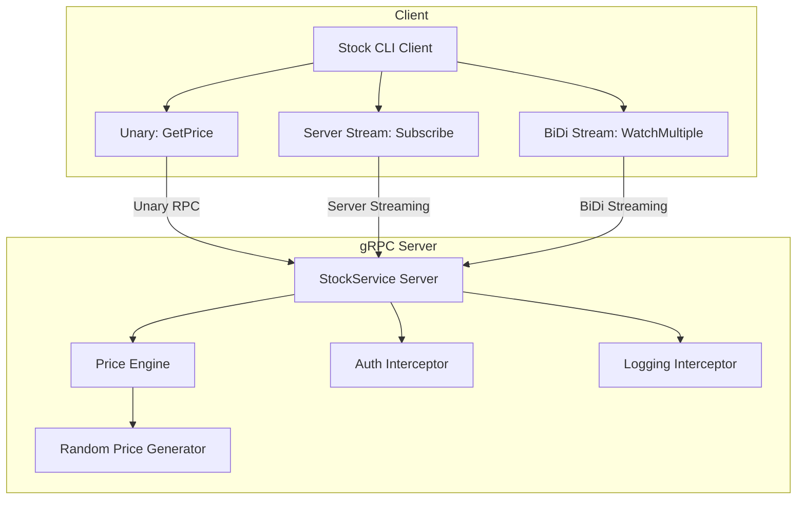
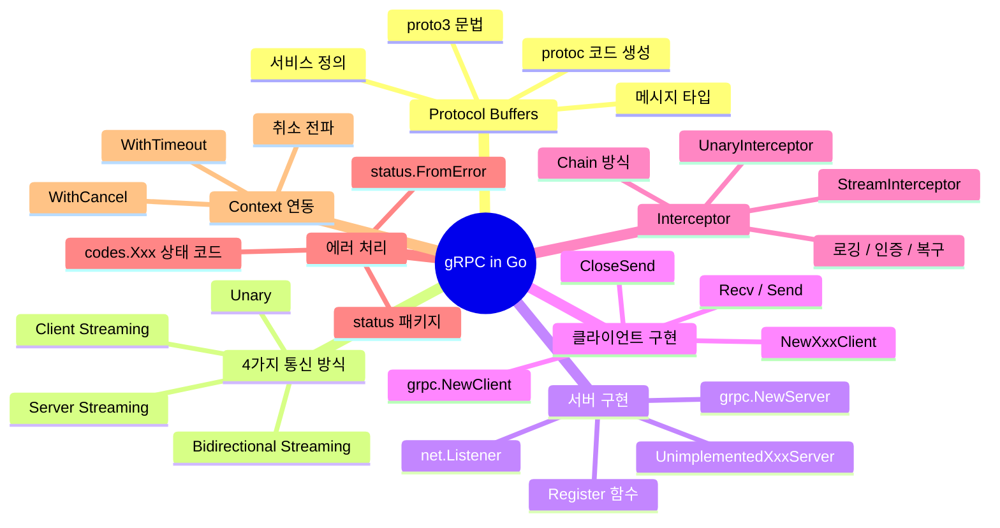

# Golang 실전 가이드    

저자: 최흥배, AI-Assisted   
    
권장 개발 환경
- **컴파일러**: Go 1.26  

-----  
  
이제 충분한 정보를 수집했습니다. Chapter 08을 작성하겠습니다.

---

# Golang 실전 가이드

---

# Chapter 08: gRPC — Protocol Buffers 서비스 정의, 코드 생성, 양방향 스트리밍

---

## 8.1 gRPC란 무엇인가?

gRPC(Google Remote Procedure Call)는 Google이 개발한 고성능 오픈소스 RPC(Remote Procedure Call) 프레임워크입니다. 기존의 REST API가 HTTP/1.1과 JSON을 기반으로 동작하는 것과 달리, gRPC는 HTTP/2 프로토콜 위에서 Protocol Buffers(이하 protobuf)라는 이진 직렬화 포맷을 사용합니다. 이 조합 덕분에 훨씬 낮은 레이턴시, 높은 처리량, 그리고 강력한 타입 안전성을 확보할 수 있습니다.

gRPC의 핵심 설계 철학은 **"서비스 계약 우선(Contract-First)"** 입니다. 개발자가 먼저 `.proto` 파일에 서비스와 메시지 형식을 정의하면, `protoc` 컴파일러가 서버와 클라이언트 코드를 자동으로 생성해줍니다. 이 접근 방식은 서버와 클라이언트 간의 인터페이스 불일치 문제를 컴파일 타임에 방지해 줍니다.

```
┌─────────────────────────────────────────────────────────────────┐
│                    gRPC vs REST 비교                             │
├─────────────────────┬───────────────────────────────────────────┤
│       항목          │       REST           │      gRPC           │
├─────────────────────┼──────────────────────┼─────────────────────┤
│  프로토콜           │ HTTP/1.1             │ HTTP/2              │
│  직렬화             │ JSON (텍스트)        │ Protobuf (바이너리) │
│  인터페이스 정의    │ OpenAPI/Swagger      │ .proto 파일         │
│  코드 생성          │ 선택 사항            │ 필수 (자동 생성)    │
│  스트리밍           │ 제한적 (SSE 등)      │ 4종 네이티브 지원   │
│  브라우저 지원      │ 완전 지원            │ grpc-web 필요       │
│  타입 안전          │ 런타임 검사          │ 컴파일 타임 검사    │
│  성능               │ 보통                 │ 높음 (2~10배)       │
└─────────────────────┴──────────────────────┴─────────────────────┘
```

**gRPC가 특히 빛나는 상황**은 마이크로서비스 간 내부 통신, IoT 디바이스처럼 네트워크 대역폭이 제한된 환경, 실시간 양방향 데이터 스트리밍이 필요한 채팅/게임 서버, 그리고 다양한 언어로 작성된 시스템이 서로 통신해야 할 때입니다.

---

## 8.2 gRPC의 4가지 통신 방식

gRPC는 단순한 단방향 요청-응답을 넘어서 네 가지 통신 패턴을 지원합니다. 이 유연성이 gRPC를 단순한 RPC 프레임워크를 넘어 강력한 통신 계층으로 만드는 핵심입니다.

```
┌──────────────────────────────────────────────────────────────────┐
│                  gRPC 4가지 통신 방식                             │
│                                                                  │
│  1. Unary (단방향)                                               │
│     Client ──[Request]──────────────► Server                    │
│     Client ◄─[Response]─────────────── Server                   │
│                                                                  │
│  2. Server Streaming (서버 스트리밍)                              │
│     Client ──[Request]──────────────► Server                    │
│     Client ◄─[Response 1]──────────── Server                    │
│     Client ◄─[Response 2]──────────── Server                    │
│     Client ◄─[Response 3]──────────── Server                    │
│     Client ◄─[EOF]─────────────────── Server                    │
│                                                                  │
│  3. Client Streaming (클라이언트 스트리밍)                        │
│     Client ──[Request 1]────────────► Server                    │
│     Client ──[Request 2]────────────► Server                    │
│     Client ──[Request 3]────────────► Server                    │
│     Client ──[EOF]──────────────────► Server                    │
│     Client ◄─[Response]─────────────── Server                   │
│                                                                  │
│  4. Bidirectional Streaming (양방향 스트리밍)                     │
│     Client ──[Req 1]────────────────► Server                    │
│     Client ◄─[Res 1]─────────────────  Server                   │
│     Client ──[Req 2]────────────────► Server                    │
│     Client ◄─[Res 2]─────────────────  Server                   │
│     Client ──[Req 3]────────────────► Server  (동시 진행)        │
│     Client ◄─[Res 3]─────────────────  Server                   │
└──────────────────────────────────────────────────────────────────┘
```

---

## 8.3 개발 환경 설정

gRPC 개발을 시작하기 위해서는 몇 가지 도구를 설치해야 합니다.

**필요 도구 설치:**

```bash
# 1. protoc (Protocol Buffer 컴파일러) 설치
# macOS
brew install protobuf

# Ubuntu/Debian
apt-get install -y protobuf-compiler

# 버전 확인
protoc --version  # libprotoc 27.x 이상 권장

# 2. Go용 protoc 플러그인 설치
go install google.golang.org/protobuf/cmd/protoc-gen-go@latest
go install google.golang.org/grpc/cmd/protoc-gen-go-grpc@latest

# PATH에 $GOPATH/bin 추가 확인
export PATH="$PATH:$(go env GOPATH)/bin"
```

**Go 모듈 의존성 추가:**

```bash
# 새 프로젝트 초기화
mkdir grpc-guide && cd grpc-guide
go mod init grpc-guide

# gRPC 및 protobuf 라이브러리 추가
go get google.golang.org/grpc@latest
go get google.golang.org/protobuf@latest
```

**프로젝트 디렉터리 구조:**

```
grpc-guide/
├── proto/
│   └── chat/
│       └── chat.proto          ← 서비스 정의
├── gen/
│   └── chat/
│       ├── chat.pb.go          ← protoc가 생성 (메시지)
│       └── chat_grpc.pb.go     ← protoc가 생성 (서비스)
├── server/
│   └── main.go
├── client/
│   └── main.go
├── go.mod
└── go.sum
```

---

## 8.4 Protocol Buffers 서비스 정의

`.proto` 파일은 gRPC 세계의 "설계도"입니다. 어떤 데이터를 주고받을지(Message), 어떤 함수를 제공할지(Service)를 선언하면 컴파일러가 나머지를 처리합니다.

**`proto/chat/chat.proto` — 채팅 서비스 정의:**

```protobuf
syntax = "proto3";

// Go 패키지 경로 지정 (생성 코드의 import path)
option go_package = "grpc-guide/gen/chat";

package chat;

// ───────────────────────────────────────────
// 메시지 타입 정의
// ───────────────────────────────────────────

// 채팅 메시지
message ChatMessage {
  string user_id   = 1;  // 필드 번호 1: 이진 인코딩 시 식별자
  string username  = 2;
  string content   = 3;
  int64  timestamp = 4;  // Unix timestamp (milliseconds)
}

// 채팅방 입장 요청
message JoinRequest {
  string user_id  = 1;
  string username = 2;
  string room_id  = 3;
}

// 채팅방 입장 응답
message JoinResponse {
  bool   success = 1;
  string message = 2;
}

// 채팅 기록 요청
message HistoryRequest {
  string room_id = 1;
  int32  limit   = 2;  // 가져올 메시지 수
}

// 파일 업로드용 청크 (클라이언트 스트리밍 예시)
message FileChunk {
  string filename = 1;
  bytes  data     = 2;  // 파일 데이터 조각
  bool   is_last  = 3;  // 마지막 청크 여부
}

// 파일 업로드 결과
message UploadResult {
  string file_id   = 1;
  int64  file_size = 2;
  string message   = 3;
}

// ───────────────────────────────────────────
// 서비스 정의 (4가지 통신 방식 모두 포함)
// ───────────────────────────────────────────
service ChatService {

  // 1. Unary: 채팅방 입장
  rpc JoinRoom(JoinRequest) returns (JoinResponse);

  // 2. Server Streaming: 채팅 기록 스트림으로 수신
  rpc GetHistory(HistoryRequest) returns (stream ChatMessage);

  // 3. Client Streaming: 파일을 청크 단위로 업로드
  rpc UploadFile(stream FileChunk) returns (UploadResult);

  // 4. Bidirectional Streaming: 실시간 채팅
  rpc Chat(stream ChatMessage) returns (stream ChatMessage);
}
```

**`.proto` 파일 핵심 문법 정리:**

```
┌─────────────────────────────────────────────────────────────────┐
│               proto3 필드 타입 치트 시트                          │
├────────────────┬──────────────────────────────────────────────── │
│ proto 타입     │  Go 타입           │  용도                       │
├────────────────┼────────────────────┼───────────────────────────┤
│ string         │ string             │ UTF-8 문자열                │
│ bytes          │ []byte             │ 바이너리 데이터             │
│ bool           │ bool               │ 불리언                      │
│ int32/int64    │ int32/int64        │ 정수 (음수 허용)            │
│ uint32/uint64  │ uint32/uint64      │ 양의 정수                   │
│ float/double   │ float32/float64    │ 부동소수점                  │
│ repeated T     │ []T (슬라이스)     │ 리스트/배열                 │
│ map<K,V>       │ map[K]V            │ 키-값 맵                    │
│ oneof          │ interface{}        │ 유니온 타입                 │
│ message T      │ *T (포인터)        │ 중첩 메시지                 │
│ enum           │ int32 (const)      │ 열거형                      │
└────────────────┴────────────────────┴───────────────────────────┘
```

---

## 8.5 코드 생성 (protoc)

`.proto` 파일 작성이 완료되면 `protoc`로 Go 코드를 생성합니다.

```bash
# proto 디렉터리에서 실행
protoc \
  --go_out=./gen \
  --go_opt=paths=source_relative \
  --go-grpc_out=./gen \
  --go-grpc_opt=paths=source_relative \
  proto/chat/chat.proto
```

`Makefile`로 코드 생성 자동화:

```makefile
# Makefile
.PHONY: proto clean

PROTO_DIR = proto
GEN_DIR   = gen

proto:
	@echo "▶ Generating protobuf code..."
	@find $(PROTO_DIR) -name "*.proto" | xargs -I{} protoc \
		--go_out=$(GEN_DIR) \
		--go_opt=paths=source_relative \
		--go-grpc_out=$(GEN_DIR) \
		--go-grpc_opt=paths=source_relative \
		{}
	@echo "✓ Done"

clean:
	rm -rf $(GEN_DIR)
```

생성된 코드의 구조를 이해하면, gRPC의 동작 원리가 더욱 명확해집니다. `chat.pb.go`에는 메시지 구조체와 직렬화/역직렬화 로직이 담기고, `chat_grpc.pb.go`에는 서버가 구현해야 할 인터페이스(`ChatServiceServer`)와 클라이언트가 호출할 스텁(`ChatServiceClient`)이 담깁니다.

---

## 8.6 gRPC 서버 구현

**`server/main.go` — 4가지 통신 방식 모두 구현:**

```go
package main

import (
	"context"
	"fmt"
	"io"
	"log"
	"net"
	"sync"
	"time"

	pb "grpc-guide/gen/chat"

	"google.golang.org/grpc"
	"google.golang.org/grpc/codes"
	"google.golang.org/grpc/status"
)

// ──────────────────────────────────────────
// 서버 구조체 (ChatServiceServer 인터페이스 구현)
// ──────────────────────────────────────────

type chatServer struct {
	pb.UnimplementedChatServiceServer // 미구현 메서드에 대한 기본 응답 제공

	mu       sync.RWMutex
	rooms    map[string][]*pb.ChatMessage         // 채팅 기록 저장
	streams  map[string][]pb.ChatService_ChatServer // 활성 스트림 목록
}

func newChatServer() *chatServer {
	return &chatServer{
		rooms:   make(map[string][]*pb.ChatMessage),
		streams: make(map[string][]pb.ChatService_ChatServer),
	}
}

// ──────────────────────────────────────────
// 1. Unary RPC: JoinRoom
// ──────────────────────────────────────────

func (s *chatServer) JoinRoom(
	ctx context.Context,
	req *pb.JoinRequest,
) (*pb.JoinResponse, error) {

	// 입력 유효성 검사
	if req.UserId == "" || req.RoomId == "" {
		// gRPC 표준 상태 코드로 에러 반환
		return nil, status.Errorf(
			codes.InvalidArgument,
			"user_id와 room_id는 필수입니다",
		)
	}

	log.Printf("✅ [JoinRoom] user=%s room=%s", req.Username, req.RoomId)

	// 채팅방 초기화 (없을 경우)
	s.mu.Lock()
	if _, ok := s.rooms[req.RoomId]; !ok {
		s.rooms[req.RoomId] = make([]*pb.ChatMessage, 0)
	}
	s.mu.Unlock()

	return &pb.JoinResponse{
		Success: true,
		Message: fmt.Sprintf("'%s' 님이 방 '%s'에 입장했습니다", req.Username, req.RoomId),
	}, nil
}

// ──────────────────────────────────────────
// 2. Server Streaming RPC: GetHistory
// ──────────────────────────────────────────

func (s *chatServer) GetHistory(
	req *pb.HistoryRequest,
	stream pb.ChatService_GetHistoryServer, // 서버 → 클라이언트 스트림
) error {

	s.mu.RLock()
	messages := s.rooms[req.RoomId]
	s.mu.RUnlock()

	// limit 처리
	if req.Limit > 0 && int(req.Limit) < len(messages) {
		messages = messages[len(messages)-int(req.Limit):]
	}

	log.Printf("📜 [GetHistory] room=%s count=%d", req.RoomId, len(messages))

	for _, msg := range messages {
		// 클라이언트가 취소했는지 확인
		if err := stream.Context().Err(); err != nil {
			return status.Errorf(codes.Canceled, "클라이언트가 연결을 취소했습니다")
		}

		// 메시지를 스트림으로 전송
		if err := stream.Send(msg); err != nil {
			return fmt.Errorf("스트림 전송 실패: %w", err)
		}

		// 실제 환경에서는 필요 없지만, 예시를 위해 약간의 딜레이
		time.Sleep(10 * time.Millisecond)
	}

	return nil // nil 반환 = 스트림 정상 종료 (EOF 신호)
}

// ──────────────────────────────────────────
// 3. Client Streaming RPC: UploadFile
// ──────────────────────────────────────────

func (s *chatServer) UploadFile(
	stream pb.ChatService_UploadFileServer, // 클라이언트 → 서버 스트림
) error {

	var (
		filename  string
		totalData []byte
	)

	// 클라이언트가 보내는 청크를 계속 수신
	for {
		chunk, err := stream.Recv()
		if err == io.EOF {
			// 모든 청크 수신 완료
			break
		}
		if err != nil {
			return status.Errorf(codes.Internal, "청크 수신 실패: %v", err)
		}

		if filename == "" {
			filename = chunk.Filename
		}

		totalData = append(totalData, chunk.Data...)
		log.Printf("📦 [UploadFile] file=%s chunk_size=%d bytes", filename, len(chunk.Data))
	}

	log.Printf("✅ [UploadFile] 완료: file=%s total=%d bytes", filename, len(totalData))

	// 모든 청크 수신 후 최종 응답을 한 번만 반환
	return stream.SendAndClose(&pb.UploadResult{
		FileId:   fmt.Sprintf("file_%d", time.Now().UnixNano()),
		FileSize: int64(len(totalData)),
		Message:  fmt.Sprintf("'%s' 업로드 성공 (%d bytes)", filename, len(totalData)),
	})
}

// ──────────────────────────────────────────
// 4. Bidirectional Streaming RPC: Chat
// ──────────────────────────────────────────

func (s *chatServer) Chat(
	stream pb.ChatService_ChatServer, // 양방향 스트림
) error {

	// 이 스트림을 식별할 임시 ID
	streamID := fmt.Sprintf("stream_%d", time.Now().UnixNano())
	var roomID string

	// 연결 해제 시 스트림 목록에서 제거
	defer func() {
		if roomID != "" {
			s.removeStream(roomID, stream)
			log.Printf("👋 [Chat] 스트림 해제: %s (room=%s)", streamID, roomID)
		}
	}()

	for {
		// 클라이언트 메시지 수신 (블로킹)
		msg, err := stream.Recv()
		if err == io.EOF {
			return nil // 클라이언트가 연결 종료
		}
		if err != nil {
			return status.Errorf(codes.Internal, "메시지 수신 실패: %v", err)
		}

		msg.Timestamp = time.Now().UnixMilli()

		// 첫 메시지로 roomID 초기화
		if roomID == "" {
			roomID = "default" // 실제 구현에서는 메시지에 room_id 필드 추가
			s.addStream(roomID, stream)
			log.Printf("🔗 [Chat] 스트림 등록: %s user=%s", streamID, msg.Username)
		}

		// 메시지 저장
		s.mu.Lock()
		s.rooms[roomID] = append(s.rooms[roomID], msg)
		s.mu.Unlock()

		log.Printf("💬 [Chat] %s: %s", msg.Username, msg.Content)

		// 같은 방의 모든 활성 스트림에 브로드캐스트
		s.broadcast(roomID, msg, stream)
	}
}

// broadcast: 같은 채팅방의 모든 스트림에 메시지 전송 (발신자 제외)
func (s *chatServer) broadcast(
	roomID string,
	msg *pb.ChatMessage,
	sender pb.ChatService_ChatServer,
) {
	s.mu.RLock()
	streams := s.streams[roomID]
	s.mu.RUnlock()

	for _, st := range streams {
		if st == sender {
			continue // 발신자에게는 다시 보내지 않음
		}
		if err := st.Send(msg); err != nil {
			log.Printf("⚠️  브로드캐스트 실패: %v", err)
		}
	}
}

func (s *chatServer) addStream(roomID string, st pb.ChatService_ChatServer) {
	s.mu.Lock()
	defer s.mu.Unlock()
	s.streams[roomID] = append(s.streams[roomID], st)
}

func (s *chatServer) removeStream(roomID string, st pb.ChatService_ChatServer) {
	s.mu.Lock()
	defer s.mu.Unlock()
	list := s.streams[roomID]
	for i, s := range list {
		if s == st {
			s.streams[roomID] = append(list[:i], list[i+1:]...)
			return
		}
	}
}

// ──────────────────────────────────────────
// main: gRPC 서버 기동
// ──────────────────────────────────────────

func main() {
	lis, err := net.Listen("tcp", ":50051")
	if err != nil {
		log.Fatalf("리스너 생성 실패: %v", err)
	}

	// gRPC 서버 옵션 설정
	s := grpc.NewServer(
		grpc.MaxRecvMsgSize(10 * 1024 * 1024), // 최대 수신 10MB
		grpc.MaxSendMsgSize(10 * 1024 * 1024), // 최대 송신 10MB
	)

	pb.RegisterChatServiceServer(s, newChatServer())

	log.Printf("🚀 gRPC 서버 시작: port=50051")

	if err := s.Serve(lis); err != nil {
		log.Fatalf("서버 기동 실패: %v", err)
	}
}
```

---

## 8.7 gRPC 클라이언트 구현

**`client/main.go` — 4가지 통신 방식 모두 호출:**

```go
package main

import (
	"context"
	"fmt"
	"io"
	"log"
	"sync"
	"time"

	pb "grpc-guide/gen/chat"

	"google.golang.org/grpc"
	"google.golang.org/grpc/credentials/insecure"
)

func main() {
	// gRPC 서버에 연결 (개발 환경: TLS 없이)
	conn, err := grpc.NewClient(
		"localhost:50051",
		grpc.WithTransportCredentials(insecure.NewCredentials()),
	)
	if err != nil {
		log.Fatalf("서버 연결 실패: %v", err)
	}
	defer conn.Close()

	client := pb.NewChatServiceClient(conn)

	// 1. Unary 호출 예시
	demoUnary(client)

	// 2. Server Streaming 예시
	demoServerStreaming(client)

	// 3. Client Streaming 예시
	demoClientStreaming(client)

	// 4. Bidirectional Streaming 예시
	demoBidirectionalStreaming(client)
}

// ──────────────────────────────────────────
// 1. Unary 호출
// ──────────────────────────────────────────

func demoUnary(client pb.ChatServiceClient) {
	fmt.Println("\n=== [1] Unary RPC: JoinRoom ===")

	ctx, cancel := context.WithTimeout(context.Background(), 5*time.Second)
	defer cancel()

	resp, err := client.JoinRoom(ctx, &pb.JoinRequest{
		UserId:   "user-001",
		Username: "Gopher",
		RoomId:   "room-golang",
	})
	if err != nil {
		log.Printf("❌ JoinRoom 실패: %v", err)
		return
	}
	fmt.Printf("✅ 입장 결과: %s\n", resp.Message)
}

// ──────────────────────────────────────────
// 2. Server Streaming 호출
// ──────────────────────────────────────────

func demoServerStreaming(client pb.ChatServiceClient) {
	fmt.Println("\n=== [2] Server Streaming: GetHistory ===")

	ctx, cancel := context.WithTimeout(context.Background(), 10*time.Second)
	defer cancel()

	stream, err := client.GetHistory(ctx, &pb.HistoryRequest{
		RoomId: "room-golang",
		Limit:  10,
	})
	if err != nil {
		log.Printf("❌ GetHistory 시작 실패: %v", err)
		return
	}

	count := 0
	for {
		msg, err := stream.Recv() // 서버가 보내는 메시지를 하나씩 수신
		if err == io.EOF {
			fmt.Printf("✅ 기록 수신 완료 (총 %d개)\n", count)
			break
		}
		if err != nil {
			log.Printf("❌ 수신 실패: %v", err)
			return
		}
		fmt.Printf("  [%s] %s: %s\n",
			time.UnixMilli(msg.Timestamp).Format("15:04:05"),
			msg.Username,
			msg.Content,
		)
		count++
	}
}

// ──────────────────────────────────────────
// 3. Client Streaming 호출
// ──────────────────────────────────────────

func demoClientStreaming(client pb.ChatServiceClient) {
	fmt.Println("\n=== [3] Client Streaming: UploadFile ===")

	ctx, cancel := context.WithTimeout(context.Background(), 30*time.Second)
	defer cancel()

	stream, err := client.UploadFile(ctx)
	if err != nil {
		log.Printf("❌ UploadFile 스트림 오픈 실패: %v", err)
		return
	}

	// 파일을 청크 단위로 분할하여 전송 (예시: 1KB 청크)
	fileData := make([]byte, 5*1024) // 5KB 더미 데이터
	chunkSize := 1024
	filename := "sample.bin"

	for i := 0; i < len(fileData); i += chunkSize {
		end := i + chunkSize
		if end > len(fileData) {
			end = len(fileData)
		}

		chunk := &pb.FileChunk{
			Filename: filename,
			Data:     fileData[i:end],
			IsLast:   end == len(fileData),
		}

		if err := stream.Send(chunk); err != nil {
			log.Printf("❌ 청크 전송 실패: %v", err)
			return
		}
		fmt.Printf("  📤 청크 전송: %d ~ %d bytes\n", i, end)
	}

	// 모든 청크 전송 완료 후 서버 응답 수신
	result, err := stream.CloseAndRecv()
	if err != nil {
		log.Printf("❌ 최종 응답 수신 실패: %v", err)
		return
	}
	fmt.Printf("✅ 업로드 완료: %s\n", result.Message)
}

// ──────────────────────────────────────────
// 4. Bidirectional Streaming 호출
// ──────────────────────────────────────────

func demoBidirectionalStreaming(client pb.ChatServiceClient) {
	fmt.Println("\n=== [4] Bidirectional Streaming: Chat ===")

	ctx, cancel := context.WithTimeout(context.Background(), 15*time.Second)
	defer cancel()

	stream, err := client.Chat(ctx)
	if err != nil {
		log.Printf("❌ Chat 스트림 오픈 실패: %v", err)
		return
	}

	var wg sync.WaitGroup

	// goroutine 1: 서버로부터 메시지 수신
	wg.Add(1)
	go func() {
		defer wg.Done()
		for {
			msg, err := stream.Recv()
			if err == io.EOF {
				return
			}
			if err != nil {
				// Context가 취소되면 정상 종료
				return
			}
			fmt.Printf("  📩 수신: [%s] %s\n", msg.Username, msg.Content)
		}
	}()

	// goroutine 2: 서버로 메시지 송신
	wg.Add(1)
	go func() {
		defer wg.Done()
		messages := []string{"안녕하세요!", "gRPC 양방향 스트리밍 테스트", "잘 되고 있나요?"}
		for _, content := range messages {
			err := stream.Send(&pb.ChatMessage{
				UserId:   "client-001",
				Username: "TestClient",
				Content:  content,
			})
			if err != nil {
				log.Printf("❌ 송신 실패: %v", err)
				return
			}
			fmt.Printf("  📤 송신: %s\n", content)
			time.Sleep(500 * time.Millisecond)
		}
		stream.CloseSend() // 송신 완료 신호
	}()

	wg.Wait()
	fmt.Println("✅ 양방향 스트리밍 완료")
}
```

---

## 8.8 Interceptor — gRPC의 미들웨어

HTTP 서버의 미들웨어처럼, gRPC에서는 **Interceptor**를 사용하여 모든 RPC 호출에 공통 로직(로깅, 인증, 복구 등)을 삽입할 수 있습니다.

```
┌─────────────────────────────────────────────────────────────────┐
│                    Interceptor 흐름도                            │
│                                                                  │
│   Client                                                         │
│     │                                                            │
│     ▼                                                            │
│  ┌──────────────────────────────────────┐                       │
│  │  Client Interceptor Chain            │                       │
│  │  ┌────────────┐  ┌────────────────┐  │                       │
│  │  │  Logging   │→ │ Retry/Timeout  │→ │──► gRPC Server        │
│  │  └────────────┘  └────────────────┘  │                       │
│  └──────────────────────────────────────┘                       │
│                           │                                      │
│                           ▼                                      │
│  ┌──────────────────────────────────────┐                       │
│  │  Server Interceptor Chain            │                       │
│  │  ┌─────────────┐  ┌───────────────┐  │                       │
│  │  │ Auth Check  │→ │ Panic Recovery│→ │──► Handler            │
│  │  └─────────────┘  └───────────────┘  │                       │
│  └──────────────────────────────────────┘                       │
└─────────────────────────────────────────────────────────────────┘
```

**`interceptor/interceptors.go` — 서버 Interceptor 구현:**

```go
package interceptor

import (
	"context"
	"log"
	"runtime/debug"
	"time"

	"google.golang.org/grpc"
	"google.golang.org/grpc/codes"
	"google.golang.org/grpc/metadata"
	"google.golang.org/grpc/status"
)

// ──────────────────────────────────────────
// Unary Interceptor: 로깅
// ──────────────────────────────────────────

func UnaryLoggingInterceptor(
	ctx context.Context,
	req interface{},
	info *grpc.UnaryServerInfo,
	handler grpc.UnaryHandler,
) (interface{}, error) {
	start := time.Now()

	// 핸들러 실행
	resp, err := handler(ctx, req)

	// 완료 후 로그 기록
	duration := time.Since(start)
	if err != nil {
		log.Printf("❌ [gRPC] method=%s duration=%v error=%v",
			info.FullMethod, duration, err)
	} else {
		log.Printf("✅ [gRPC] method=%s duration=%v",
			info.FullMethod, duration)
	}

	return resp, err
}

// ──────────────────────────────────────────
// Unary Interceptor: 인증 (API 키 검사)
// ──────────────────────────────────────────

const validAPIKey = "secret-api-key-12345"

func UnaryAuthInterceptor(
	ctx context.Context,
	req interface{},
	info *grpc.UnaryServerInfo,
	handler grpc.UnaryHandler,
) (interface{}, error) {

	// 메타데이터에서 API 키 추출
	// 클라이언트는 헤더처럼 metadata를 설정하여 전송
	md, ok := metadata.FromIncomingContext(ctx)
	if !ok {
		return nil, status.Errorf(codes.Unauthenticated, "메타데이터 없음")
	}

	keys := md.Get("x-api-key") // 소문자로 비교됨
	if len(keys) == 0 || keys[0] != validAPIKey {
		return nil, status.Errorf(codes.Unauthenticated, "유효하지 않은 API 키")
	}

	return handler(ctx, req)
}

// ──────────────────────────────────────────
// Unary Interceptor: Panic 복구
// ──────────────────────────────────────────

func UnaryRecoveryInterceptor(
	ctx context.Context,
	req interface{},
	info *grpc.UnaryServerInfo,
	handler grpc.UnaryHandler,
) (resp interface{}, err error) {

	defer func() {
		if r := recover(); r != nil {
			log.Printf("🔥 [Panic] method=%s panic=%v\n%s",
				info.FullMethod, r, debug.Stack())
			err = status.Errorf(codes.Internal, "내부 서버 오류")
		}
	}()

	return handler(ctx, req)
}

// ──────────────────────────────────────────
// Stream Interceptor: 로깅 (스트리밍용)
// ──────────────────────────────────────────

func StreamLoggingInterceptor(
	srv interface{},
	ss grpc.ServerStream,
	info *grpc.StreamServerInfo,
	handler grpc.StreamHandler,
) error {
	start := time.Now()
	log.Printf("🔄 [Stream 시작] method=%s client=%v server=%v",
		info.FullMethod, info.IsClientStream, info.IsServerStream)

	err := handler(srv, ss)

	log.Printf("🔄 [Stream 종료] method=%s duration=%v err=%v",
		info.FullMethod, time.Since(start), err)

	return err
}
```

**서버에 Interceptor 체이닝 적용:**

```go
// server/main.go - Interceptor를 적용한 서버 생성
s := grpc.NewServer(
	// Unary 인터셉터 체이닝 (실행 순서: Recovery → Auth → Logging → Handler)
	grpc.ChainUnaryInterceptor(
		interceptor.UnaryRecoveryInterceptor,
		interceptor.UnaryAuthInterceptor,
		interceptor.UnaryLoggingInterceptor,
	),
	// Stream 인터셉터 체이닝
	grpc.ChainStreamInterceptor(
		interceptor.StreamLoggingInterceptor,
	),
)
```

**클라이언트 측 메타데이터 전송:**

```go
// client/main.go - 인증 메타데이터와 함께 호출
import "google.golang.org/grpc/metadata"

// API 키를 메타데이터에 담아 Context 생성
ctx := metadata.AppendToOutgoingContext(
	context.Background(),
	"x-api-key", "secret-api-key-12345",
)

// 메타데이터가 포함된 Context로 RPC 호출
resp, err := client.JoinRoom(ctx, &pb.JoinRequest{...})
```

---

## 8.9 gRPC 에러 처리 — Status 코드

gRPC는 HTTP의 상태 코드와 유사한 자체 상태 코드 시스템을 가지고 있습니다. `status` 패키지를 활용하여 구조화된 에러를 전달하는 것이 베스트 프랙티스입니다.

```go
package main

import (
	"google.golang.org/grpc/codes"
	"google.golang.org/grpc/status"
)

// ──────────────────────────────────────────
// 에러 생성 및 반환
// ──────────────────────────────────────────

func exampleErrors() error {
	// 잘못된 인자
	return status.Errorf(codes.InvalidArgument, "user_id는 필수입니다")

	// 리소스를 찾을 수 없음
	return status.Errorf(codes.NotFound, "사용자 ID %s를 찾을 수 없습니다", "user-999")

	// 권한 없음
	return status.Errorf(codes.PermissionDenied, "이 리소스에 접근 권한이 없습니다")

	// 이미 존재함
	return status.Errorf(codes.AlreadyExists, "이미 등록된 이메일입니다")

	// 재시도 가능한 일시적 오류
	return status.Errorf(codes.Unavailable, "서비스가 일시적으로 불가합니다")
}

// ──────────────────────────────────────────
// 클라이언트에서 에러 타입 판별
// ──────────────────────────────────────────

func handleClientError(err error) {
	if err == nil {
		return
	}

	// gRPC 상태 코드 추출
	st, ok := status.FromError(err)
	if !ok {
		// gRPC 에러가 아닌 일반 에러
		log.Printf("일반 에러: %v", err)
		return
	}

	switch st.Code() {
	case codes.NotFound:
		log.Printf("리소스 없음: %s", st.Message())
	case codes.InvalidArgument:
		log.Printf("잘못된 요청: %s", st.Message())
	case codes.Unauthenticated:
		log.Printf("인증 실패: %s", st.Message())
	case codes.Unavailable:
		log.Printf("서비스 불가 (재시도 필요): %s", st.Message())
	default:
		log.Printf("알 수 없는 gRPC 에러 [%s]: %s", st.Code(), st.Message())
	}
}
```

**주요 gRPC 상태 코드 레퍼런스:**

```
┌─────────────────────────────────────────────────────────────────┐
│                  gRPC 주요 상태 코드                              │
├─────────────────────┬─────────────┬───────────────────────────── │
│ codes.OK            │ 0   │ 성공                                 │
│ codes.Canceled      │ 1   │ 클라이언트가 취소                    │
│ codes.Unknown       │ 2   │ 알 수 없는 오류                      │
│ codes.InvalidArgument│ 3  │ 잘못된 인자                          │
│ codes.DeadlineExceeded│ 4 │ 타임아웃 초과                        │
│ codes.NotFound      │ 5   │ 리소스 없음                          │
│ codes.AlreadyExists │ 6   │ 이미 존재                            │
│ codes.PermissionDenied│ 7 │ 권한 없음                            │
│ codes.Unauthenticated│ 16 │ 인증 실패                            │
│ codes.ResourceExhausted│ 8│ 할당량 초과                          │
│ codes.Unimplemented │ 12  │ 미구현 메서드                        │
│ codes.Internal      │ 13  │ 서버 내부 오류                       │
│ codes.Unavailable   │ 14  │ 서비스 불가 (재시도 가능)            │
└─────────────────────┴─────┴─────────────────────────────────────┘
```

---

## 8.10 gRPC와 Context — 타임아웃과 취소 전파

Chapter 04에서 배운 `context`는 gRPC에서도 핵심적인 역할을 합니다. 클라이언트가 설정한 타임아웃과 취소 신호는 gRPC 채널을 통해 서버까지 자동으로 전파됩니다.

```go
// ──────────────────────────────────────────
// 클라이언트: 타임아웃 설정
// ──────────────────────────────────────────

func callWithTimeout(client pb.ChatServiceClient) {
	// 3초 타임아웃
	ctx, cancel := context.WithTimeout(context.Background(), 3*time.Second)
	defer cancel()

	_, err := client.JoinRoom(ctx, &pb.JoinRequest{
		UserId: "user-001",
		RoomId: "room-001",
	})
	if err != nil {
		st, _ := status.FromError(err)
		if st.Code() == codes.DeadlineExceeded {
			log.Println("⏰ 요청 타임아웃!")
		}
	}
}

// ──────────────────────────────────────────
// 서버: Context 취소 감지
// ──────────────────────────────────────────

func (s *chatServer) GetHistory(
	req *pb.HistoryRequest,
	stream pb.ChatService_GetHistoryServer,
) error {
	for _, msg := range s.rooms[req.RoomId] {

		// 클라이언트 취소/타임아웃 여부 확인
		select {
		case <-stream.Context().Done():
			log.Println("⚠️ 클라이언트가 스트림을 취소했습니다")
			return status.Errorf(codes.Canceled, "스트림 취소됨")
		default:
			// 정상 진행
		}

		if err := stream.Send(msg); err != nil {
			return err
		}
	}
	return nil
}
```

---

## 8.11 실전 응용 프로그램 — 실시간 주식 시세 gRPC 서버

이 장의 핵심 개념들을 모두 통합한 실전 예제입니다. **실시간 주식 시세 조회 시스템**을 gRPC로 구현합니다. Unary로 현재 시세를 조회하고, Server Streaming으로 특정 종목의 실시간 시세를 구독하며, Bidirectional Streaming으로 여러 종목을 동적으로 추가/제거하며 구독하는 시스템입니다.

**전체 시스템 아키텍처:**



**Step 1: proto 파일 정의 (`proto/stock/stock.proto`):**

```protobuf
syntax = "proto3";
option go_package = "grpc-guide/gen/stock";
package stock;

// 주식 시세 요청
message PriceRequest {
  string symbol = 1;  // 종목 코드 (예: AAPL, GOOGL)
}

// 주식 시세 응답
message PriceResponse {
  string symbol    = 1;
  double price     = 2;  // 현재 가격
  double change    = 3;  // 전일 대비 변동액
  double change_pct= 4;  // 전일 대비 변동율 (%)
  int64  timestamp = 5;
}

// 구독 요청 (Bidirectional: 종목 추가/제거 명령)
message WatchCommand {
  enum Action {
    SUBSCRIBE   = 0;  // 구독 추가
    UNSUBSCRIBE = 1;  // 구독 제거
  }
  Action action = 1;
  string symbol = 2;
}

// 여러 종목 시세 응답
message MultiPriceResponse {
  repeated PriceResponse prices = 1;
  int64 timestamp = 2;
}

service StockService {
  // 1. Unary: 단일 종목 현재 시세 조회
  rpc GetPrice(PriceRequest) returns (PriceResponse);

  // 2. Server Streaming: 특정 종목 실시간 시세 구독
  rpc SubscribePrice(PriceRequest) returns (stream PriceResponse);

  // 3. Bidirectional: 다중 종목 동적 구독/해제
  rpc WatchMultiple(stream WatchCommand) returns (stream MultiPriceResponse);
}
```

**Step 2: 서버 구현 (`server/stock_server.go`):**

```go
package main

import (
	"context"
	"fmt"
	"io"
	"log"
	"math/rand"
	"net"
	"sync"
	"time"

	pb "grpc-guide/gen/stock"

	"google.golang.org/grpc"
	"google.golang.org/grpc/codes"
	"google.golang.org/grpc/status"
)

// ──────────────────────────────────────────
// 주가 엔진: 랜덤 주가 생성기
// ──────────────────────────────────────────

type priceEngine struct {
	mu     sync.RWMutex
	prices map[string]float64 // 종목코드 → 현재가
	prev   map[string]float64 // 종목코드 → 전일종가
}

func newPriceEngine() *priceEngine {
	pe := &priceEngine{
		prices: map[string]float64{
			"AAPL":  185.50,
			"GOOGL": 141.80,
			"MSFT":  420.00,
			"TSLA":  245.30,
			"NVDA":  875.00,
			"AMZN":  185.10,
		},
	}
	pe.prev = make(map[string]float64)
	for k, v := range pe.prices {
		pe.prev[k] = v
	}
	return pe
}

// tick: 가격을 무작위로 소폭 변동시킴
func (pe *priceEngine) tick() {
	pe.mu.Lock()
	defer pe.mu.Unlock()
	for symbol := range pe.prices {
		// ±0.5% 범위 내 랜덤 변동
		change := (rand.Float64() - 0.5) * 0.01 * pe.prices[symbol]
		pe.prices[symbol] = pe.prices[symbol] + change
		if pe.prices[symbol] < 1 {
			pe.prices[symbol] = 1
		}
	}
}

func (pe *priceEngine) getPrice(symbol string) (*pb.PriceResponse, error) {
	pe.mu.RLock()
	defer pe.mu.RUnlock()

	price, ok := pe.prices[symbol]
	if !ok {
		return nil, status.Errorf(codes.NotFound, "종목 '%s'를 찾을 수 없습니다", symbol)
	}

	prev := pe.prev[symbol]
	change := price - prev
	changePct := 0.0
	if prev > 0 {
		changePct = (change / prev) * 100
	}

	return &pb.PriceResponse{
		Symbol:    symbol,
		Price:     price,
		Change:    change,
		ChangePct: changePct,
		Timestamp: time.Now().UnixMilli(),
	}, nil
}

// ──────────────────────────────────────────
// gRPC 서비스 구현체
// ──────────────────────────────────────────

type stockServer struct {
	pb.UnimplementedStockServiceServer
	engine *priceEngine
}

func newStockServer() *stockServer {
	s := &stockServer{engine: newPriceEngine()}

	// 백그라운드에서 주기적으로 가격 변동
	go func() {
		ticker := time.NewTicker(500 * time.Millisecond)
		for range ticker.C {
			s.engine.tick()
		}
	}()

	return s
}

// ──────────────────────────────────────────
// 1. Unary: GetPrice
// ──────────────────────────────────────────

func (s *stockServer) GetPrice(
	ctx context.Context,
	req *pb.PriceRequest,
) (*pb.PriceResponse, error) {

	if req.Symbol == "" {
		return nil, status.Errorf(codes.InvalidArgument, "symbol은 필수입니다")
	}

	return s.engine.getPrice(req.Symbol)
}

// ──────────────────────────────────────────
// 2. Server Streaming: SubscribePrice
// ──────────────────────────────────────────

func (s *stockServer) SubscribePrice(
	req *pb.PriceRequest,
	stream pb.StockService_SubscribePriceServer,
) error {

	if req.Symbol == "" {
		return status.Errorf(codes.InvalidArgument, "symbol은 필수입니다")
	}

	log.Printf("📈 [Subscribe] 구독 시작: %s", req.Symbol)
	ticker := time.NewTicker(1 * time.Second)
	defer ticker.Stop()

	for {
		select {
		case <-stream.Context().Done():
			log.Printf("📉 [Subscribe] 구독 종료: %s", req.Symbol)
			return nil

		case <-ticker.C:
			price, err := s.engine.getPrice(req.Symbol)
			if err != nil {
				return err
			}
			if err := stream.Send(price); err != nil {
				return fmt.Errorf("스트림 전송 실패: %w", err)
			}
		}
	}
}

// ──────────────────────────────────────────
// 3. Bidirectional Streaming: WatchMultiple
// ──────────────────────────────────────────

func (s *stockServer) WatchMultiple(
	stream pb.StockService_WatchMultipleServer,
) error {

	var (
		mu          sync.RWMutex
		subscribed  = make(map[string]bool) // 현재 구독 중인 종목
	)

	// goroutine A: 클라이언트 명령 수신 (SUBSCRIBE / UNSUBSCRIBE)
	go func() {
		for {
			cmd, err := stream.Recv()
			if err == io.EOF {
				return
			}
			if err != nil {
				return
			}

			mu.Lock()
			switch cmd.Action {
			case pb.WatchCommand_SUBSCRIBE:
				subscribed[cmd.Symbol] = true
				log.Printf("➕ [Watch] 종목 추가: %s", cmd.Symbol)
			case pb.WatchCommand_UNSUBSCRIBE:
				delete(subscribed, cmd.Symbol)
				log.Printf("➖ [Watch] 종목 제거: %s", cmd.Symbol)
			}
			mu.Unlock()
		}
	}()

	// goroutine B (메인): 구독 중인 종목 시세를 주기적으로 전송
	ticker := time.NewTicker(1 * time.Second)
	defer ticker.Stop()

	for {
		select {
		case <-stream.Context().Done():
			return nil

		case <-ticker.C:
			mu.RLock()
			symbols := make([]string, 0, len(subscribed))
			for sym := range subscribed {
				symbols = append(symbols, sym)
			}
			mu.RUnlock()

			if len(symbols) == 0 {
				continue
			}

			// 구독 중인 모든 종목 시세 수집
			var prices []*pb.PriceResponse
			for _, sym := range symbols {
				p, err := s.engine.getPrice(sym)
				if err != nil {
					log.Printf("⚠️ 시세 조회 실패: %s - %v", sym, err)
					continue
				}
				prices = append(prices, p)
			}

			// 한 번에 전송
			if err := stream.Send(&pb.MultiPriceResponse{
				Prices:    prices,
				Timestamp: time.Now().UnixMilli(),
			}); err != nil {
				return fmt.Errorf("시세 전송 실패: %w", err)
			}
		}
	}
}

// ──────────────────────────────────────────
// 서버 기동
// ──────────────────────────────────────────

func printBanner() {
	fmt.Println(`
 ____  _             _      ____  ____   ____
/ ___|| |_ ___   ___| | __ |  _ \|  _ \ / ___|
\___ \| __/ _ \ / __| |/ / | |_) | |_) | |
 ___) | || (_) | (__|   <  |  _ <|  __/| |___
|____/ \__\___/ \___|_|\_\ |_| \_\_|    \____|

  Golang 실전 가이드 - Chapter 08
  gRPC 주식 시세 서버 v1.0
  port: :50051
`)
}

func main() {
	printBanner()

	lis, err := net.Listen("tcp", ":50051")
	if err != nil {
		log.Fatalf("리스너 생성 실패: %v", err)
	}

	s := grpc.NewServer(
		grpc.ChainUnaryInterceptor(unaryLogging),
		grpc.ChainStreamInterceptor(streamLogging),
	)

	pb.RegisterStockServiceServer(s, newStockServer())

	log.Printf("🚀 StockService gRPC 서버 시작: :50051")
	if err := s.Serve(lis); err != nil {
		log.Fatalf("서버 에러: %v", err)
	}
}

// 간단한 로깅 인터셉터 (인라인)
func unaryLogging(
	ctx context.Context, req interface{},
	info *grpc.UnaryServerInfo, handler grpc.UnaryHandler,
) (interface{}, error) {
	start := time.Now()
	resp, err := handler(ctx, req)
	log.Printf("[Unary] %s (%v) err=%v", info.FullMethod, time.Since(start), err)
	return resp, err
}

func streamLogging(
	srv interface{}, ss grpc.ServerStream,
	info *grpc.StreamServerInfo, handler grpc.StreamHandler,
) error {
	start := time.Now()
	err := handler(srv, ss)
	log.Printf("[Stream] %s (%v) err=%v", info.FullMethod, time.Since(start), err)
	return err
}
```

**Step 3: CLI 클라이언트 구현 (`client/stock_client.go`):**

```go
package main

import (
	"context"
	"fmt"
	"io"
	"log"
	"os"
	"os/signal"
	"strings"
	"syscall"
	"time"

	pb "grpc-guide/gen/stock"

	"google.golang.org/grpc"
	"google.golang.org/grpc/credentials/insecure"
)

func main() {
	conn, err := grpc.NewClient(
		"localhost:50051",
		grpc.WithTransportCredentials(insecure.NewCredentials()),
	)
	if err != nil {
		log.Fatalf("연결 실패: %v", err)
	}
	defer conn.Close()

	client := pb.NewStockServiceClient(conn)

	if len(os.Args) < 2 {
		printUsage()
		return
	}

	switch os.Args[1] {
	case "get":
		// 사용: ./client get AAPL
		if len(os.Args) < 3 {
			fmt.Println("사용법: client get <SYMBOL>")
			return
		}
		getPrice(client, os.Args[2])

	case "subscribe":
		// 사용: ./client subscribe AAPL
		if len(os.Args) < 3 {
			fmt.Println("사용법: client subscribe <SYMBOL>")
			return
		}
		subscribePrice(client, os.Args[2])

	case "watch":
		// 사용: ./client watch AAPL GOOGL MSFT
		if len(os.Args) < 3 {
			fmt.Println("사용법: client watch <SYMBOL1> [SYMBOL2] ...")
			return
		}
		watchMultiple(client, os.Args[2:])

	default:
		printUsage()
	}
}

func printUsage() {
	fmt.Println(`
📈 Stock gRPC Client

사용법:
  client get <SYMBOL>                  현재 시세 조회 (Unary)
  client subscribe <SYMBOL>            실시간 시세 구독 (Server Streaming)
  client watch <SYM1> [SYM2] ...       다중 종목 구독 (BiDi Streaming)

예시:
  client get AAPL
  client subscribe NVDA
  client watch AAPL GOOGL MSFT TSLA
`)
}

// ──────────────────────────────────────────
// 1. Unary: 현재 시세 조회
// ──────────────────────────────────────────

func getPrice(client pb.StockServiceClient, symbol string) {
	ctx, cancel := context.WithTimeout(context.Background(), 5*time.Second)
	defer cancel()

	resp, err := client.GetPrice(ctx, &pb.PriceRequest{Symbol: strings.ToUpper(symbol)})
	if err != nil {
		log.Printf("❌ 조회 실패: %v", err)
		return
	}

	changeSign := "+"
	if resp.Change < 0 {
		changeSign = ""
	}

	fmt.Printf(`
┌─────────────────────────────────┐
│  %s 현재 시세                     │
├─────────────────────────────────┤
│  가격:  $%.2f
│  변동:  %s%.2f (%s%.2f%%)
│  시각:  %s
└─────────────────────────────────┘
`,
		resp.Symbol,
		resp.Price,
		changeSign, resp.Change,
		changeSign, resp.ChangePct,
		time.UnixMilli(resp.Timestamp).Format("15:04:05.000"),
	)
}

// ──────────────────────────────────────────
// 2. Server Streaming: 실시간 시세 구독
// ──────────────────────────────────────────

func subscribePrice(client pb.StockServiceClient, symbol string) {
	ctx, cancel := context.WithCancel(context.Background())
	defer cancel()

	// Ctrl+C 감지
	sig := make(chan os.Signal, 1)
	signal.Notify(sig, syscall.SIGINT, syscall.SIGTERM)
	go func() {
		<-sig
		fmt.Println("\n⚠️  구독을 종료합니다...")
		cancel()
	}()

	stream, err := client.SubscribePrice(ctx, &pb.PriceRequest{
		Symbol: strings.ToUpper(symbol),
	})
	if err != nil {
		log.Printf("❌ 구독 실패: %v", err)
		return
	}

	fmt.Printf("📡 %s 실시간 구독 시작 (Ctrl+C로 종료)\n\n", strings.ToUpper(symbol))
	fmt.Printf("%-10s %-12s %-12s %-12s\n", "종목", "현재가($)", "변동($)", "변동율(%)")
	fmt.Println(strings.Repeat("─", 50))

	for {
		resp, err := stream.Recv()
		if err == io.EOF {
			fmt.Println("✅ 스트림 종료")
			return
		}
		if err != nil {
			if ctx.Err() != nil {
				return // 정상 취소
			}
			log.Printf("❌ 수신 오류: %v", err)
			return
		}

		indicator := "▲"
		if resp.Change < 0 {
			indicator = "▼"
		}

		fmt.Printf("%-10s %-12.2f %s%-11.2f %s%-11.2f  %s\n",
			resp.Symbol,
			resp.Price,
			indicator, resp.Change,
			indicator, resp.ChangePct,
			time.UnixMilli(resp.Timestamp).Format("15:04:05"),
		)
	}
}

// ──────────────────────────────────────────
// 3. BiDi Streaming: 다중 종목 구독
// ──────────────────────────────────────────

func watchMultiple(client pb.StockServiceClient, symbols []string) {
	ctx, cancel := context.WithCancel(context.Background())
	defer cancel()

	sig := make(chan os.Signal, 1)
	signal.Notify(sig, syscall.SIGINT, syscall.SIGTERM)
	go func() {
		<-sig
		fmt.Println("\n⚠️  구독을 종료합니다...")
		cancel()
	}()

	stream, err := client.WatchMultiple(ctx)
	if err != nil {
		log.Printf("❌ 스트림 오픈 실패: %v", err)
		return
	}

	// 초기 종목 구독 명령 전송
	for _, sym := range symbols {
		if err := stream.Send(&pb.WatchCommand{
			Action: pb.WatchCommand_SUBSCRIBE,
			Symbol: strings.ToUpper(sym),
		}); err != nil {
			log.Printf("❌ 구독 명령 실패: %v", err)
			return
		}
	}

	fmt.Printf("📡 %d개 종목 실시간 구독 시작 (Ctrl+C로 종료)\n\n",
		len(symbols))

	for {
		resp, err := stream.Recv()
		if err == io.EOF || ctx.Err() != nil {
			return
		}
		if err != nil {
			log.Printf("❌ 수신 오류: %v", err)
			return
		}

		// 화면 초기화 후 테이블 출력
		fmt.Print("\033[H\033[2J") // ANSI clear screen
		fmt.Printf("  📊 실시간 시세  (%s)\n",
			time.UnixMilli(resp.Timestamp).Format("2006-01-02 15:04:05"))
		fmt.Println("  " + strings.Repeat("─", 52))
		fmt.Printf("  %-8s %-12s %-12s %-10s\n",
			"종목", "현재가($)", "변동($)", "변동율(%)")
		fmt.Println("  " + strings.Repeat("─", 52))

		for _, p := range resp.Prices {
			indicator := "▲"
			if p.Change < 0 {
				indicator = "▼"
			}
			fmt.Printf("  %-8s %-12.2f %s%-11.2f %s%.2f%%\n",
				p.Symbol, p.Price,
				indicator, p.Change,
				indicator, p.ChangePct,
			)
		}

		fmt.Println("  " + strings.Repeat("─", 52))
		fmt.Println("  [Ctrl+C] 종료")
	}
}
```

**실행 화면 예시:**

```
# 서버 기동
$ go run server/main.go

 ____  _             _      ____  ____   ____
/ ___|| |_ ___   ___| | __ |  _ \|  _ \ / ___|
...
🚀 StockService gRPC 서버 시작: :50051

# 단일 시세 조회
$ go run client/main.go get AAPL

┌─────────────────────────────────┐
│  AAPL 현재 시세                  │
├─────────────────────────────────┤
│  가격:  $185.92
│  변동:  +0.42 (+0.23%)
│  시각:  14:32:07.512
└─────────────────────────────────┘

# 다중 종목 실시간 구독
$ go run client/main.go watch AAPL GOOGL MSFT TSLA

  📊 실시간 시세  (2026-03-24 14:32:15)
  ─────────────────────────────────────────────────────
  종목      현재가($)     변동($)     변동율(%)
  ─────────────────────────────────────────────────────
  AAPL     185.94       ▲0.44       ▲0.24%
  GOOGL    141.65       ▼-0.15      ▼-0.11%
  MSFT     420.83       ▲0.83       ▲0.20%
  TSLA     244.91       ▼-0.39      ▼-0.16%
  ─────────────────────────────────────────────────────
  [Ctrl+C] 종료
```

---

## 8.12 챕터 정리 및 핵심 요약

이 장에서 우리는 gRPC의 전체적인 생태계를 깊이 있게 탐험했습니다. 아래 다이어그램은 이 장에서 다룬 개념들의 관계를 한눈에 보여줍니다.



이 장에서 배운 핵심 원칙들은 다음과 같습니다. 첫째, `.proto` 파일이 진실의 원천(Single Source of Truth)이 됩니다. 서버와 클라이언트 모두 동일한 `.proto`로부터 생성된 코드를 사용하므로 인터페이스 불일치가 원천적으로 불가능합니다. 둘째, 4가지 통신 방식을 올바르게 선택하는 것이 핵심입니다. 단순 조회에는 Unary, 대용량 결과 반환에는 Server Streaming, 파일 업로드에는 Client Streaming, 채팅/실시간 데이터에는 Bidirectional Streaming을 사용합니다. 셋째, Interceptor는 횡단 관심사(Logging, Auth, Recovery)를 비즈니스 로직과 깔끔하게 분리하는 gRPC의 미들웨어 계층입니다. 넷째, `status` 패키지를 활용한 구조화된 에러 처리는 클라이언트가 에러 원인을 정확하게 판별할 수 있게 해주는 gRPC의 강점입니다.

다음 장(Chapter 09)에서는 이렇게 구현한 gRPC 서비스를 어떻게 효과적으로 테스트할지, `httptest`와 테이블 구동 테스트, 모의(mock) 객체를 사용하는 방법을 배웁니다.