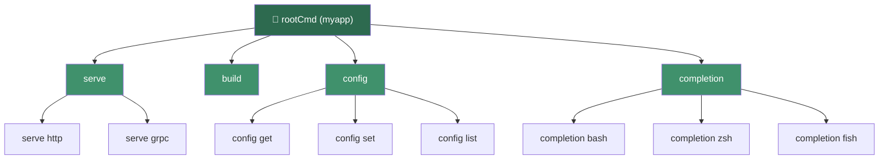
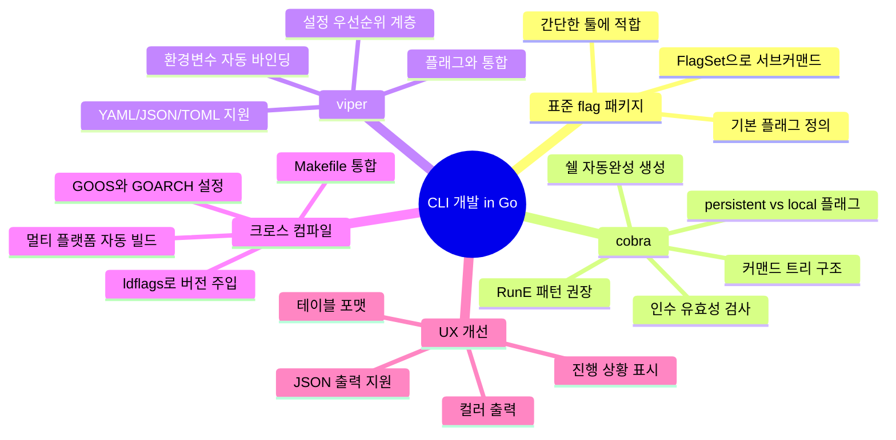

# Golang 실전 가이드    

저자: 최흥배, AI-Assisted   
    
권장 개발 환경
- **컴파일러**: Go 1.26  

-----   
  
이제 충분한 정보를 수집했습니다. Chapter 10을 작성하겠습니다.

---

# Golang 실전 가이드
## Chapter 10: CLI 개발 — 표준 flag 패키지에서 cobra+viper에 의한 본격 CLI 툴 개발, 크로스 컴파일

---

## 10.1 CLI 툴 개발의 세계에 오신 것을 환영합니다

Go는 CLI(Command-Line Interface) 툴 개발에 있어 사실상 업계 표준 언어가 되었습니다. `kubectl`, `docker`, `helm`, `gh`(GitHub CLI), `hugo` 등 개발자들이 매일 사용하는 수많은 명령줄 도구들이 Go로 작성되어 있습니다. 그 이유는 명확합니다. Go는 단일 바이너리로 컴파일되어 의존성 없이 배포할 수 있고, 빠른 시작 시간과 낮은 메모리 사용량, 그리고 강력한 크로스 컴파일 지원 덕분에 CLI 툴 개발에 최적화된 언어입니다.

이 챕터에서는 Go의 표준 `flag` 패키지부터 시작하여, 실무에서 광범위하게 사용되는 `cobra`와 `viper` 라이브러리를 활용한 본격 CLI 툴 개발, 그리고 크로스 컴파일을 통한 멀티 플랫폼 배포까지의 전 과정을 단계적으로 학습합니다.

```
 ██████╗██╗     ██╗    ██████╗ ███████╗██╗   ██╗
██╔════╝██║     ██║    ██╔══██╗██╔════╝██║   ██║
██║     ██║     ██║    ██║  ██║█████╗  ██║   ██║
██║     ██║     ██║    ██║  ██║██╔══╝  ╚██╗ ██╔╝
╚██████╗███████╗██║    ██████╔╝███████╗ ╚████╔╝
 ╚═════╝╚══════╝╚═╝    ╚═════╝ ╚══════╝  ╚═══╝

  CLI Development Journey in Go
  flag → cobra → viper → cross-compile
```

---

## 10.2 CLI 툴 개발의 진화 단계

Go에서 CLI를 개발하는 방법은 크게 세 단계로 발전합니다. 각 단계는 이전 단계의 한계를 극복하면서 더 강력한 기능을 제공합니다.

```mermaid
flowchart LR
    A["📦 표준 flag 패키지\n단순 플래그 파싱\n서브커맨드 수동 구현"] 
    -->|"복잡도 증가"| 
    B["🐍 cobra\n서브커맨드 트리\n자동 help 생성\n쉘 자동완성"]
    -->|"설정 관리 필요"| 
    C["⚙️ viper 통합\n파일/환경변수/플래그\n통합 설정 관리\n우선순위 계층"]
    -->|"배포 최적화"| 
    D["🚀 크로스 컴파일\nLinux/macOS/Windows\nAMD64/ARM64\n단일 바이너리 배포"]
```

---

## 10.3 표준 `flag` 패키지 — 기초부터 탄탄히

### 10.3.1 기본 플래그 파싱

`flag` 패키지는 Go 표준 라이브러리에 포함된 CLI 플래그 파싱 도구입니다. 외부 의존성이 없고 간결한 API를 제공하므로, 단순한 툴에서는 충분히 강력한 선택지입니다.

```go
// chapter10/01_flag_basic/main.go
package main

import (
	"flag"
	"fmt"
	"os"
	"strings"
)

func main() {
	// --- 플래그 정의 ---
	// flag.Type(이름, 기본값, 설명) 형태로 정의
	host := flag.String("host", "localhost", "서버 호스트")
	port := flag.Int("port", 8080, "서버 포트")
	verbose := flag.Bool("verbose", false, "상세 로그 출력")
	tags := flag.String("tags", "", "쉼표로 구분된 태그 목록")

	// 커스텀 사용법 메시지
	flag.Usage = func() {
		fmt.Fprintf(os.Stderr, "사용법: %s [옵션]\n\n", os.Args[0])
		fmt.Fprintf(os.Stderr, "옵션:\n")
		flag.PrintDefaults()
		fmt.Fprintf(os.Stderr, "\n예시:\n")
		fmt.Fprintf(os.Stderr, "  %s -host example.com -port 9090 -verbose\n", os.Args[0])
	}

	// 플래그 파싱 (os.Args[1:]를 파싱)
	flag.Parse()

	// 파싱 후 남은 인수
	args := flag.Args()

	if *verbose {
		fmt.Printf("[DEBUG] 호스트: %s, 포트: %d\n", *host, *port)
		fmt.Printf("[DEBUG] 남은 인수: %v\n", args)
	}

	fmt.Printf("서버 접속: %s:%d\n", *host, *port)

	if *tags != "" {
		tagList := strings.Split(*tags, ",")
		fmt.Printf("태그: %v\n", tagList)
	}
}
```

```
# 실행 예시
$ go run main.go -host example.com -port 9090 -verbose -tags "web,api"
[DEBUG] 호스트: example.com, 포트: 9090
[DEBUG] 남은 인수: []
서버 접속: example.com:9090
태그: [web api]

# 도움말 출력
$ go run main.go -help
사용법: main [옵션]

옵션:
  -host string
        서버 호스트 (default "localhost")
  -port int
        서버 포트 (default 8080)
  -tags string
        쉼표로 구분된 태그 목록
  -verbose
        상세 로그 출력

예시:
  main -host example.com -port 9090 -verbose
```

### 10.3.2 `FlagSet`으로 서브커맨드 구현

표준 `flag` 패키지만으로도 서브커맨드를 구현할 수 있습니다. `FlagSet`은 독립적인 플래그 집합을 정의하는 타입으로, 각 서브커맨드마다 별도의 `FlagSet`을 만들어 처리합니다.

```go
// chapter10/02_flagset_subcommand/main.go
package main

import (
	"flag"
	"fmt"
	"os"
)

// --- 서브커맨드별 플래그를 담는 구조체 ---

type ServeConfig struct {
	Host    string
	Port    int
	TLS     bool
}

type BuildConfig struct {
	Output  string
	Release bool
	Target  string
}

func main() {
	// 인수가 없으면 도움말 출력
	if len(os.Args) < 2 {
		printUsage()
		os.Exit(1)
	}

	// 첫 번째 인수로 서브커맨드 분기
	switch os.Args[1] {
	case "serve":
		runServe(os.Args[2:])
	case "build":
		runBuild(os.Args[2:])
	case "help", "-h", "--help":
		printUsage()
	default:
		fmt.Fprintf(os.Stderr, "알 수 없는 서브커맨드: %q\n", os.Args[1])
		printUsage()
		os.Exit(1)
	}
}

func runServe(args []string) {
	// serve 전용 FlagSet 생성
	serveCmd := flag.NewFlagSet("serve", flag.ExitOnError)
	cfg := &ServeConfig{}

	serveCmd.StringVar(&cfg.Host, "host", "0.0.0.0", "바인딩 호스트")
	serveCmd.IntVar(&cfg.Port, "port", 8080, "리스닝 포트")
	serveCmd.BoolVar(&cfg.TLS, "tls", false, "TLS 활성화")

	serveCmd.Usage = func() {
		fmt.Fprintf(os.Stderr, "사용법: app serve [옵션]\n\n")
		fmt.Fprintf(os.Stderr, "HTTP 서버를 시작합니다.\n\n옵션:\n")
		serveCmd.PrintDefaults()
	}

	// 서브커맨드 전용 인수 파싱
	if err := serveCmd.Parse(args); err != nil {
		os.Exit(1)
	}

	protocol := "http"
	if cfg.TLS {
		protocol = "https"
	}
	fmt.Printf("서버 시작: %s://%s:%d\n", protocol, cfg.Host, cfg.Port)
}

func runBuild(args []string) {
	buildCmd := flag.NewFlagSet("build", flag.ExitOnError)
	cfg := &BuildConfig{}

	buildCmd.StringVar(&cfg.Output, "output", "dist/app", "출력 경로")
	buildCmd.BoolVar(&cfg.Release, "release", false, "릴리스 빌드 (최적화 활성화)")
	buildCmd.StringVar(&cfg.Target, "target", "linux/amd64", "타겟 플랫폼 (OS/ARCH)")

	if err := buildCmd.Parse(args); err != nil {
		os.Exit(1)
	}

	fmt.Printf("빌드 설정:\n")
	fmt.Printf("  출력: %s\n", cfg.Output)
	fmt.Printf("  릴리스: %v\n", cfg.Release)
	fmt.Printf("  타겟: %s\n", cfg.Target)
	fmt.Printf("빌드 완료!\n")
}

func printUsage() {
	fmt.Fprintf(os.Stderr, `사용법: app <서브커맨드> [옵션]

서브커맨드:
  serve   HTTP 서버 시작
  build   애플리케이션 빌드
  help    이 도움말 출력

각 서브커맨드의 도움말은 'app <서브커맨드> -help'를 실행하세요.
`)
}
```

```
# 실행 예시
$ go run main.go serve -port 9090 -tls
서버 시작: https://0.0.0.0:9090

$ go run main.go build -output bin/myapp -release -target darwin/arm64
빌드 설정:
  출력: bin/myapp
  릴리스: true
  타겟: darwin/arm64
빌드 완료!
```

### 10.3.3 `flag` 패키지의 한계

`flag` 패키지는 단순하지만, 프로젝트가 성장할수록 여러 한계를 드러냅니다.

```
┌─────────────────────────────────────────────────┐
│           flag 패키지의 한계                      │
├────────────────────┬────────────────────────────┤
│ 한계               │ 설명                         │
├────────────────────┼────────────────────────────┤
│ 중첩 서브커맨드     │ 직접 switch/case 로 구현해야  │
│                    │ 하며 깊어질수록 복잡도 폭발적  │
├────────────────────┼────────────────────────────┤
│ 쉘 자동완성        │ 지원하지 않음                  │
├────────────────────┼────────────────────────────┤
│ 전역/지역 플래그    │ 수동으로 플래그를 전파해야 함   │
├────────────────────┼────────────────────────────┤
│ 형식화된 에러 처리 │ 일관된 에러 메시지 처리 없음    │
├────────────────────┼────────────────────────────┤
│ 설정 파일 통합      │ 직접 구현해야 함               │
└────────────────────┴────────────────────────────┘
```

---

## 10.4 Cobra — 프로덕션급 CLI 프레임워크

### 10.4.1 Cobra 아키텍처 이해

Cobra는 `kubectl`, `docker`, `gh` 등을 만든 회사들이 선택한 Go의 대표 CLI 프레임워크입니다. 명령어 트리 구조, 자동 help 생성, 쉘 자동완성, 체계적인 플래그 관리 등을 제공합니다.



### 10.4.2 프로젝트 초기화

```bash
# 프로젝트 생성
mkdir myapp && cd myapp
go mod init github.com/yourname/myapp

# Cobra 및 Viper 설치
go get github.com/spf13/cobra@latest
go get github.com/spf13/viper@latest
```

Cobra 프로젝트의 표준 디렉토리 구조는 다음과 같습니다.

```
myapp/
├── main.go          # 진입점 (cmd.Execute() 호출만)
├── go.mod
├── go.sum
└── cmd/
    ├── root.go      # 루트 커맨드 및 전역 설정
    ├── serve.go     # serve 서브커맨드
    ├── build.go     # build 서브커맨드
    ├── config.go    # config 서브커맨드 (중첩)
    └── completion.go # 쉘 자동완성
```

### 10.4.3 루트 커맨드 구현

```go
// cmd/root.go
package cmd

import (
	"fmt"
	"os"
	"strings"

	"github.com/spf13/cobra"
	"github.com/spf13/viper"
)

var cfgFile string

// rootCmd는 서브커맨드 없이 호출될 때의 기본 커맨드
var rootCmd = &cobra.Command{
	Use:   "myapp",
	Short: "강력한 개발 도구 모음",
	Long: `myapp은 Go로 작성된 개발자용 CLI 툴입니다.

서버 관리, 빌드 자동화, 설정 관리 등의 기능을 제공합니다.

예시:
  myapp serve http --port 8080
  myapp build --release --target linux/amd64
  myapp config set server.port 9090`,

	// PersistentPreRunE: 모든 서브커맨드 실행 전에 호출됨
	PersistentPreRunE: func(cmd *cobra.Command, args []string) error {
		return initConfig()
	},
}

// Execute는 main.go에서 호출되는 진입점
func Execute() {
	if err := rootCmd.Execute(); err != nil {
		fmt.Fprintln(os.Stderr, err)
		os.Exit(1)
	}
}

func init() {
	// PersistentFlags: 이 커맨드와 모든 자식 커맨드에 적용
	rootCmd.PersistentFlags().StringVar(
		&cfgFile, "config", "",
		"설정 파일 경로 (기본값: $HOME/.myapp.yaml)",
	)
	rootCmd.PersistentFlags().BoolP(
		"verbose", "v", false,
		"상세 출력 모드 활성화",
	)

	// Flags: 이 커맨드에만 적용되는 지역 플래그
	rootCmd.Flags().BoolP(
		"version", "V", false,
		"버전 정보 출력",
	)

	// 버전 플래그 처리
	rootCmd.RunE = func(cmd *cobra.Command, args []string) error {
		if v, _ := cmd.Flags().GetBool("version"); v {
			fmt.Println("myapp version 1.0.0")
			return nil
		}
		return cmd.Help()
	}
}

func initConfig() error {
	if cfgFile != "" {
		viper.SetConfigFile(cfgFile)
	} else {
		home, err := os.UserHomeDir()
		if err != nil {
			return fmt.Errorf("홈 디렉토리 확인 실패: %w", err)
		}

		// 설정 파일 검색 경로 (우선순위 순)
		viper.AddConfigPath(".")          // 현재 디렉토리
		viper.AddConfigPath(home)         // 홈 디렉토리
		viper.SetConfigType("yaml")
		viper.SetConfigName(".myapp")
	}

	// 환경변수 자동 매핑: MYAPP_SERVER_PORT → server.port
	viper.SetEnvPrefix("MYAPP")
	viper.SetEnvKeyReplacer(strings.NewReplacer(".", "_"))
	viper.AutomaticEnv()

	// 기본값 설정
	viper.SetDefault("server.host", "localhost")
	viper.SetDefault("server.port", 8080)
	viper.SetDefault("log.level", "info")

	// 설정 파일 읽기 (없어도 에러 아님)
	if err := viper.ReadInConfig(); err != nil {
		if _, ok := err.(viper.ConfigFileNotFoundError); !ok {
			return fmt.Errorf("설정 파일 읽기 실패: %w", err)
		}
	}

	return nil
}
```

```go
// main.go
package main

import "github.com/yourname/myapp/cmd"

func main() {
	cmd.Execute()
}
```

### 10.4.4 서브커맨드 구현 — `serve`

```go
// cmd/serve.go
package cmd

import (
	"fmt"

	"github.com/spf13/cobra"
	"github.com/spf13/viper"
)

// serveCmd는 serve 커맨드 그룹의 부모
var serveCmd = &cobra.Command{
	Use:   "serve",
	Short: "서버를 시작합니다",
	Long:  `HTTP 또는 gRPC 서버를 시작합니다.`,
}

// serveHTTPCmd는 HTTP 서버를 시작하는 서브커맨드
var serveHTTPCmd = &cobra.Command{
	Use:   "http",
	Short: "HTTP 서버 시작",
	Long: `HTTP 서버를 지정된 호스트와 포트에서 시작합니다.

예시:
  myapp serve http
  myapp serve http --port 9090 --tls
  myapp serve http --host 0.0.0.0 --port 443 --tls`,

	// RunE: 에러를 반환할 수 있는 Run 핸들러 (권장)
	RunE: func(cmd *cobra.Command, args []string) error {
		host := viper.GetString("server.host")
		port := viper.GetInt("server.port")
		tls, _ := cmd.Flags().GetBool("tls")

		// 플래그 값이 기본값과 다를 때만 Viper를 오버라이드
		if cmd.Flags().Changed("host") {
			h, _ := cmd.Flags().GetString("host")
			host = h
		}
		if cmd.Flags().Changed("port") {
			p, _ := cmd.Flags().GetInt("port")
			port = p
		}

		verbose, _ := cmd.Root().PersistentFlags().GetBool("verbose")
		if verbose {
			fmt.Printf("[DEBUG] 설정 파일: %s\n", viper.ConfigFileUsed())
			fmt.Printf("[DEBUG] 로그 레벨: %s\n", viper.GetString("log.level"))
		}

		protocol := "http"
		if tls {
			protocol = "https"
		}

		fmt.Printf("🚀 HTTP 서버 시작: %s://%s:%d\n", protocol, host, port)
		// 실제 구현에서는 여기서 net/http 서버를 시작
		return nil
	},
}

var serveGRPCCmd = &cobra.Command{
	Use:   "grpc",
	Short: "gRPC 서버 시작",
	RunE: func(cmd *cobra.Command, args []string) error {
		port, _ := cmd.Flags().GetInt("port")
		fmt.Printf("🚀 gRPC 서버 시작: 0.0.0.0:%d\n", port)
		return nil
	},
}

func init() {
	// 커맨드 트리 등록
	rootCmd.AddCommand(serveCmd)
	serveCmd.AddCommand(serveHTTPCmd)
	serveCmd.AddCommand(serveGRPCCmd)

	// serve http 전용 플래그
	serveHTTPCmd.Flags().String("host", "", "바인딩 호스트 (설정 파일의 server.host 오버라이드)")
	serveHTTPCmd.Flags().Int("port", 0, "리스닝 포트 (설정 파일의 server.port 오버라이드)")
	serveHTTPCmd.Flags().Bool("tls", false, "TLS/HTTPS 활성화")
	serveHTTPCmd.Flags().String("cert", "", "TLS 인증서 파일 경로")
	serveHTTPCmd.Flags().String("key", "", "TLS 키 파일 경로")

	// TLS가 활성화된 경우 cert와 key는 필수
	serveHTTPCmd.MarkFlagsRequiredTogether("tls", "cert", "key")

	// serve grpc 전용 플래그
	serveGRPCCmd.Flags().Int("port", 50051, "gRPC 리스닝 포트")
}
```

### 10.4.5 플래그와 인수 유효성 검사

Cobra는 다양한 인수 유효성 검사기를 내장하고 있습니다.

```go
// cmd/deploy.go
package cmd

import (
	"fmt"
	"regexp"

	"github.com/spf13/cobra"
)

// 배포 환경 목록 (쉘 자동완성에도 활용됨)
var validEnvironments = []string{"development", "staging", "production"}

var deployCmd = &cobra.Command{
	Use:   "deploy [environment]",
	Short: "지정된 환경에 애플리케이션을 배포합니다",
	Long: `지정된 환경에 최신 빌드를 배포합니다.

유효한 환경: development, staging, production`,

	// ValidArgs: 쉘 자동완성 시 제안할 인수 목록
	ValidArgs: validEnvironments,

	// Args: 커스텀 인수 유효성 검사 함수
	Args: func(cmd *cobra.Command, args []string) error {
		// cobra.ExactArgs(1)과 커스텀 검사를 결합
		if err := cobra.ExactArgs(1)(cmd, args); err != nil {
			return err
		}

		// 유효한 환경인지 검사
		for _, env := range validEnvironments {
			if args[0] == env {
				return nil
			}
		}

		return fmt.Errorf(
			"유효하지 않은 환경: %q\n유효한 환경: %v",
			args[0], validEnvironments,
		)
	},

	RunE: func(cmd *cobra.Command, args []string) error {
		environment := args[0]
		version, _ := cmd.Flags().GetString("version")
		dryRun, _ := cmd.Flags().GetBool("dry-run")

		// 버전 형식 검사: v1.2.3 형태
		if version != "" {
			versionRegex := regexp.MustCompile(`^v\d+\.\d+\.\d+$`)
			if !versionRegex.MatchString(version) {
				return fmt.Errorf("버전 형식 오류: %q (형식: v1.2.3)", version)
			}
		}

		if dryRun {
			fmt.Printf("[DRY-RUN] 환경 %q에 버전 %q 배포 시뮬레이션\n",
				environment, version)
			return nil
		}

		fmt.Printf("✈️  환경 %q에 버전 %q 배포 시작...\n", environment, version)
		return nil
	},
}

func init() {
	rootCmd.AddCommand(deployCmd)
	deployCmd.Flags().StringP("version", "V", "latest", "배포할 버전 (예: v1.2.3)")
	deployCmd.Flags().Bool("dry-run", false, "실제 배포 없이 시뮬레이션만 수행")
	deployCmd.Flags().Bool("force", false, "안전 검사 없이 강제 배포")

	// production 배포 시 --force를 명시적으로 확인하도록 MarkFlagsMutuallyExclusive 등 활용 가능
}
```

---

## 10.5 Viper — 계층적 설정 관리의 완성

### 10.5.1 Viper의 설정 우선순위 계층

Viper는 다양한 소스에서 설정을 읽어 우선순위에 따라 병합합니다. 이 계층 구조를 이해하는 것이 Viper 활용의 핵심입니다.

```
  높은 우선순위 ↓
 ┌──────────────────────────────────────────────────┐
 │  1. cobra 플래그 (--port 9090)                    │ ← 최우선
 ├──────────────────────────────────────────────────┤
 │  2. 환경변수 (MYAPP_SERVER_PORT=9090)             │
 ├──────────────────────────────────────────────────┤
 │  3. 설정 파일 (~/.myapp.yaml, ./config.yaml)      │
 ├──────────────────────────────────────────────────┤
 │  4. 원격 K/V 저장소 (etcd, Consul 등)             │
 ├──────────────────────────────────────────────────┤
 │  5. 기본값 (viper.SetDefault("server.port", 8080))│ ← 최하위
 └──────────────────────────────────────────────────┘
  낮은 우선순위 ↑
```

### 10.5.2 설정 파일 형식과 바인딩

```go
// cmd/config.go
package cmd

import (
	"fmt"
	"os"
	"path/filepath"

	"github.com/spf13/cobra"
	"github.com/spf13/viper"
)

var configCmd = &cobra.Command{
	Use:   "config",
	Short: "설정 관리",
	Long:  `myapp의 설정값을 조회하거나 수정합니다.`,
}

var configGetCmd = &cobra.Command{
	Use:   "get <키>",
	Short: "설정값 조회",
	Args:  cobra.ExactArgs(1),
	RunE: func(cmd *cobra.Command, args []string) error {
		key := args[0]
		val := viper.Get(key)
		if val == nil {
			return fmt.Errorf("설정 키 %q 를 찾을 수 없습니다", key)
		}
		fmt.Printf("%s = %v\n", key, val)
		return nil
	},
}

var configSetCmd = &cobra.Command{
	Use:   "set <키> <값>",
	Short: "설정값 변경 및 저장",
	Args:  cobra.ExactArgs(2),
	RunE: func(cmd *cobra.Command, args []string) error {
		key, value := args[0], args[1]
		viper.Set(key, value)

		configPath := viper.ConfigFileUsed()
		if configPath == "" {
			home, err := os.UserHomeDir()
			if err != nil {
				return err
			}
			configPath = filepath.Join(home, ".myapp.yaml")
		}

		if err := viper.WriteConfigAs(configPath); err != nil {
			return fmt.Errorf("설정 저장 실패: %w", err)
		}

		fmt.Printf("✅ 설정 저장: %s = %s\n   파일: %s\n", key, value, configPath)
		return nil
	},
}

var configListCmd = &cobra.Command{
	Use:   "list",
	Short: "모든 설정값 출력",
	RunE: func(cmd *cobra.Command, args []string) error {
		settings := viper.AllSettings()
		if len(settings) == 0 {
			fmt.Println("(설정값 없음)")
			return nil
		}
		printSettings(settings, "")
		return nil
	},
}

// 중첩된 맵을 들여쓰기로 재귀 출력
func printSettings(m map[string]interface{}, prefix string) {
	for k, v := range m {
		key := prefix + k
		if nested, ok := v.(map[string]interface{}); ok {
			fmt.Printf("%s:\n", key)
			printSettings(nested, "  "+prefix)
		} else {
			fmt.Printf("  %-30s = %v\n", key, v)
		}
	}
}

func init() {
	rootCmd.AddCommand(configCmd)
	configCmd.AddCommand(configGetCmd)
	configCmd.AddCommand(configSetCmd)
	configCmd.AddCommand(configListCmd)
}
```

Viper가 읽는 YAML 설정 파일의 예시는 다음과 같습니다.

```yaml
# ~/.myapp.yaml
server:
  host: 0.0.0.0
  port: 8080
  tls: false

database:
  driver: postgres
  dsn: "host=localhost user=app dbname=mydb sslmode=disable"
  max_open_conns: 25
  max_idle_conns: 5

log:
  level: info
  format: json

deploy:
  registry: ghcr.io/yourname
  timeout: 300
```

### 10.5.3 플래그와 Viper 바인딩

플래그와 Viper를 연결하면 플래그, 환경변수, 설정 파일 중 어느 것으로든 값을 제공할 수 있습니다.

```go
// cmd/serve_advanced.go - 플래그-Viper 바인딩 패턴
package cmd

import (
	"fmt"

	"github.com/spf13/cobra"
	"github.com/spf13/viper"
)

var serveAdvancedCmd = &cobra.Command{
	Use:   "start",
	Short: "설정 바인딩 예시가 적용된 서버 시작",
	RunE: func(cmd *cobra.Command, args []string) error {
		// 플래그에 값이 명시적으로 지정된 경우에만 Viper 오버라이드
		// 그렇지 않으면 Viper 계층에서 값을 가져옴
		// (설정 파일 > 환경변수 > 기본값 순)
		host := viper.GetString("server.host")
		port := viper.GetInt("server.port")
		logLevel := viper.GetString("log.level")

		fmt.Printf("서버 시작 설정:\n")
		fmt.Printf("  Host:      %s  (출처: %s)\n", host, configSource("server.host", cmd))
		fmt.Printf("  Port:      %d  (출처: %s)\n", port, configSource("server.port", cmd))
		fmt.Printf("  Log Level: %s  (출처: %s)\n", logLevel, configSource("log.level", cmd))

		return nil
	},
}

// configSource: 값의 출처를 디버그용으로 확인
func configSource(key string, cmd *cobra.Command) string {
	// 환경변수나 설정 파일 중 어디서 왔는지 추적하는 유틸리티
	if viper.IsSet(key) {
		return "설정 파일/환경변수"
	}
	return "기본값"
}

func init() {
	rootCmd.AddCommand(serveAdvancedCmd)

	serveAdvancedCmd.Flags().String("host", "", "서버 호스트")
	serveAdvancedCmd.Flags().Int("port", 0, "서버 포트")
	serveAdvancedCmd.Flags().String("log-level", "", "로그 레벨")

	// 플래그를 Viper 키에 바인딩
	// 플래그가 지정되면 Viper의 "server.host" 값을 오버라이드
	viper.BindPFlag("server.host", serveAdvancedCmd.Flags().Lookup("host"))
	viper.BindPFlag("server.port", serveAdvancedCmd.Flags().Lookup("port"))
	viper.BindPFlag("log.level", serveAdvancedCmd.Flags().Lookup("log-level"))

	// 환경변수 명시적 바인딩
	// MYAPP_SERVER_HOST 환경변수 → server.host
	viper.BindEnv("server.host", "MYAPP_SERVER_HOST")
	viper.BindEnv("server.port", "MYAPP_SERVER_PORT")
}
```

---

## 10.6 쉘 자동완성 구현

쉘 자동완성은 사용자 경험을 크게 향상시키는 기능입니다. Cobra는 bash, zsh, fish, PowerShell을 위한 자동완성 스크립트를 자동으로 생성합니다.

```go
// cmd/completion.go
package cmd

import (
	"os"

	"github.com/spf13/cobra"
)

var completionCmd = &cobra.Command{
	Use:   "completion [bash|zsh|fish|powershell]",
	Short: "쉘 자동완성 스크립트 생성",
	Long: `다양한 쉘을 위한 자동완성 스크립트를 생성합니다.

【Bash】
  $ source <(myapp completion bash)
  # 영구 적용 (Linux)
  $ myapp completion bash > /etc/bash_completion.d/myapp
  # 영구 적용 (macOS with Homebrew)
  $ myapp completion bash > $(brew --prefix)/etc/bash_completion.d/myapp

【Zsh】
  $ source <(myapp completion zsh)
  # 영구 적용
  $ myapp completion zsh > "${fpath[1]}/_myapp"

【Fish】
  $ myapp completion fish | source
  # 영구 적용
  $ myapp completion fish > ~/.config/fish/completions/myapp.fish

【PowerShell】
  PS> myapp completion powershell | Out-String | Invoke-Expression`,

	DisableFlagsInUseLine: true,
	ValidArgs:             []string{"bash", "zsh", "fish", "powershell"},
	Args: cobra.MatchAll(
		cobra.ExactArgs(1),
		cobra.OnlyValidArgs,
	),
	RunE: func(cmd *cobra.Command, args []string) error {
		switch args[0] {
		case "bash":
			return cmd.Root().GenBashCompletion(os.Stdout)
		case "zsh":
			return cmd.Root().GenZshCompletion(os.Stdout)
		case "fish":
			return cmd.Root().GenFishCompletion(os.Stdout, true)
		case "powershell":
			return cmd.Root().GenPowerShellCompletionWithDesc(os.Stdout)
		}
		return nil
	},
}

func init() {
	rootCmd.AddCommand(completionCmd)
}
```

동적 자동완성을 구현하면 런타임 데이터 기반의 제안이 가능합니다.

```go
// 동적 자동완성 예시: 환경 목록을 API에서 동적으로 가져오는 경우
var dynamicDeployCmd = &cobra.Command{
	Use:   "deploy [environment]",
	Short: "동적 자동완성이 있는 배포 커맨드",
	ValidArgsFunction: func(cmd *cobra.Command, args []string, toComplete string) (
		[]string, cobra.ShellCompDirective,
	) {
		if len(args) != 0 {
			// 첫 번째 인수 이후로는 자동완성 없음
			return nil, cobra.ShellCompDirectiveNoFileComp
		}

		// 실제 환경에서는 API 호출이나 설정 파일에서 목록을 가져올 수 있음
		environments := fetchAvailableEnvironments()
		return environments, cobra.ShellCompDirectiveNoFileComp
	},
	RunE: func(cmd *cobra.Command, args []string) error {
		fmt.Printf("배포 대상: %s\n", args[0])
		return nil
	},
}

func fetchAvailableEnvironments() []string {
	// 실제로는 API나 로컬 캐시에서 동적으로 가져옴
	return []string{
		"development\t개발 환경",
		"staging\t스테이징 환경",
		"production\t프로덕션 환경 (주의 필요)",
	}
}
```

---

## 10.7 크로스 컴파일 — 단일 소스로 멀티 플랫폼 배포

Go의 가장 강력한 특징 중 하나는 크로스 컴파일입니다. 단순히 환경변수 두 개(`GOOS`, `GOARCH`)를 설정하는 것만으로 어떤 플랫폼의 바이너리도 빌드할 수 있습니다.

### 10.7.1 지원 플랫폼 목록

```
$ go tool dist list | head -30

  android/amd64    android/arm64
  darwin/amd64     darwin/arm64    ← macOS Intel / Apple Silicon
  linux/amd64      linux/arm64     ← 대부분의 서버/클라우드
  linux/arm        linux/386
  windows/amd64    windows/arm64   ← Windows x64 / ARM
  freebsd/amd64    freebsd/arm64
  openbsd/amd64    ...
```

### 10.7.2 기본 크로스 컴파일

```bash
# macOS (Apple Silicon) 에서 Linux AMD64 바이너리 빌드
GOOS=linux GOARCH=amd64 go build -o dist/myapp-linux-amd64 .

# macOS (Intel) 에서 Windows 바이너리 빌드
GOOS=windows GOARCH=amd64 go build -o dist/myapp-windows-amd64.exe .

# ARM64 Linux 빌드 (Raspberry Pi 4, AWS Graviton 등)
GOOS=linux GOARCH=arm64 go build -o dist/myapp-linux-arm64 .

# macOS Universal Binary 빌드 (Intel + Apple Silicon)
GOOS=darwin GOARCH=amd64 go build -o dist/myapp-darwin-amd64 .
GOOS=darwin GOARCH=arm64 go build -o dist/myapp-darwin-arm64 .
# lipo로 합치기 (macOS에서만 가능)
lipo -create -output dist/myapp-darwin-universal \
    dist/myapp-darwin-amd64 dist/myapp-darwin-arm64
```

### 10.7.3 빌드 플래그 활용

```go
// internal/version/version.go
// 빌드 시 -ldflags로 주입되는 버전 정보
package version

var (
	// go build -ldflags="-X 'myapp/internal/version.Version=v1.2.3'"
	Version   = "dev"
	Commit    = "unknown"
	BuildDate = "unknown"
	GoVersion = "unknown"
)
```

```bash
# 버전 정보를 바이너리에 주입하며 빌드
VERSION=$(git describe --tags --always --dirty)
COMMIT=$(git rev-parse --short HEAD)
BUILD_DATE=$(date -u +"%Y-%m-%dT%H:%M:%SZ")
GO_VERSION=$(go version | awk '{print $3}')

go build \
  -ldflags="-s -w \
    -X 'github.com/yourname/myapp/internal/version.Version=${VERSION}' \
    -X 'github.com/yourname/myapp/internal/version.Commit=${COMMIT}' \
    -X 'github.com/yourname/myapp/internal/version.BuildDate=${BUILD_DATE}' \
    -X 'github.com/yourname/myapp/internal/version.GoVersion=${GO_VERSION}'" \
  -o dist/myapp .

# -s -w: 심볼 테이블과 디버그 정보 제거 → 바이너리 크기 축소
```

### 10.7.4 멀티 플랫폼 빌드 자동화

```bash
#!/usr/bin/env bash
# scripts/build-all.sh — 전체 플랫폼 빌드 스크립트

set -euo pipefail

APP_NAME="myapp"
VERSION=$(git describe --tags --always --dirty 2>/dev/null || echo "dev")
COMMIT=$(git rev-parse --short HEAD 2>/dev/null || echo "unknown")
BUILD_DATE=$(date -u +"%Y-%m-%dT%H:%M:%SZ")

LDFLAGS="-s -w \
  -X 'github.com/yourname/myapp/internal/version.Version=${VERSION}' \
  -X 'github.com/yourname/myapp/internal/version.Commit=${COMMIT}' \
  -X 'github.com/yourname/myapp/internal/version.BuildDate=${BUILD_DATE}'"

# 타겟 플랫폼 배열: "OS/ARCH" 형식
TARGETS=(
  "linux/amd64"
  "linux/arm64"
  "darwin/amd64"
  "darwin/arm64"
  "windows/amd64"
  "windows/arm64"
)

mkdir -p dist

echo "🔨 빌드 시작: ${APP_NAME} ${VERSION}"
echo "━━━━━━━━━━━━━━━━━━━━━━━━━━━━━━━━━━━━━━━━━━━━"

for target in "${TARGETS[@]}"; do
  GOOS="${target%/*}"
  GOARCH="${target#*/}"
  
  OUTPUT="dist/${APP_NAME}-${GOOS}-${GOARCH}"
  # Windows는 .exe 확장자 추가
  [[ "${GOOS}" == "windows" ]] && OUTPUT="${OUTPUT}.exe"
  
  printf "  %-20s → %s\n" "${target}" "${OUTPUT}"
  
  GOOS="${GOOS}" GOARCH="${GOARCH}" \
    go build -ldflags="${LDFLAGS}" -o "${OUTPUT}" . \
    2>&1 || { echo "  ❌ 빌드 실패: ${target}"; continue; }
  
  # 체크섬 생성
  sha256sum "${OUTPUT}" >> "dist/checksums.txt"
done

echo "━━━━━━━━━━━━━━━━━━━━━━━━━━━━━━━━━━━━━━━━━━━━"
echo "✅ 빌드 완료! dist/ 디렉토리를 확인하세요."
ls -lh dist/
```

### 10.7.5 Makefile 통합

```makefile
# Makefile
APP_NAME  := myapp
MODULE    := github.com/yourname/myapp
VERSION   := $(shell git describe --tags --always --dirty 2>/dev/null || echo "dev")
COMMIT    := $(shell git rev-parse --short HEAD 2>/dev/null || echo "unknown")
BUILD_DATE := $(shell date -u +"%Y-%m-%dT%H:%M:%SZ")

LDFLAGS := -s -w \
  -X '$(MODULE)/internal/version.Version=$(VERSION)' \
  -X '$(MODULE)/internal/version.Commit=$(COMMIT)' \
  -X '$(MODULE)/internal/version.BuildDate=$(BUILD_DATE)'

.PHONY: all build build-all clean test install

## build: 현재 플랫폼용 바이너리 빌드
build:
	@echo "빌드 중: $(APP_NAME) $(VERSION)"
	go build -ldflags="$(LDFLAGS)" -o dist/$(APP_NAME) .

## build-all: 전체 플랫폼 빌드
build-all:
	@./scripts/build-all.sh

## install: 현재 사용자의 PATH에 설치
install:
	go install -ldflags="$(LDFLAGS)" .

## test: 테스트 실행
test:
	go test -v -race ./...

## clean: 빌드 산출물 삭제
clean:
	rm -rf dist/

## release: 태그를 붙이고 전체 빌드
release: test build-all
	@echo "릴리스 준비 완료: $(VERSION)"

## help: 이 도움말 출력
help:
	@grep -E '^## ' Makefile | sed 's/## //'
```

---

## 10.8 출력 포맷팅과 UX 개선

좋은 CLI 툴은 사용하기 편한 출력 형식을 제공합니다. JSON, 테이블, 컬러 출력 등 다양한 형식을 지원하면 파이프라인 통합과 가독성이 모두 향상됩니다.

```go
// internal/output/formatter.go
package output

import (
	"encoding/json"
	"fmt"
	"io"
	"os"
	"text/tabwriter"
)

// Formatter는 다양한 출력 형식을 처리하는 인터페이스
type Formatter interface {
	Print(data interface{}) error
}

// TableFormatter: 정렬된 텍스트 테이블 출력
type TableFormatter struct {
	Headers []string
	Rows    [][]string
	Out     io.Writer
}

func (f *TableFormatter) Print(_ interface{}) error {
	w := tabwriter.NewWriter(f.Out, 0, 0, 2, ' ', 0)
	
	// 헤더 출력 (굵게)
	for i, h := range f.Headers {
		if i > 0 {
			fmt.Fprint(w, "\t")
		}
		fmt.Fprintf(w, "\033[1m%s\033[0m", h) // Bold
	}
	fmt.Fprintln(w)

	// 구분선
	for i := range f.Headers {
		if i > 0 {
			fmt.Fprint(w, "\t")
		}
		for range f.Headers[i] {
			fmt.Fprint(w, "─")
		}
	}
	fmt.Fprintln(w)

	// 데이터 행
	for _, row := range f.Rows {
		for i, cell := range row {
			if i > 0 {
				fmt.Fprint(w, "\t")
			}
			fmt.Fprint(w, cell)
		}
		fmt.Fprintln(w)
	}

	return w.Flush()
}

// JSONFormatter: JSON 형식 출력 (스크립트 파이프라인용)
type JSONFormatter struct {
	Out    io.Writer
	Pretty bool
}

func (f *JSONFormatter) Print(data interface{}) error {
	var (
		b   []byte
		err error
	)
	if f.Pretty {
		b, err = json.MarshalIndent(data, "", "  ")
	} else {
		b, err = json.Marshal(data)
	}
	if err != nil {
		return fmt.Errorf("JSON 직렬화 실패: %w", err)
	}
	_, err = fmt.Fprintln(f.Out, string(b))
	return err
}

// NewFormatter: 출력 형식 문자열로 Formatter 생성
func NewFormatter(format string, pretty bool) Formatter {
	switch format {
	case "json":
		return &JSONFormatter{Out: os.Stdout, Pretty: pretty}
	default: // "table" 또는 미지정
		return &TableFormatter{Out: os.Stdout}
	}
}

// --- 컬러 출력 유틸리티 ---

const (
	ColorReset  = "\033[0m"
	ColorRed    = "\033[31m"
	ColorGreen  = "\033[32m"
	ColorYellow = "\033[33m"
	ColorBlue   = "\033[34m"
	ColorBold   = "\033[1m"
)

func Success(format string, a ...interface{}) {
	fmt.Printf(ColorGreen+"✅ "+format+ColorReset+"\n", a...)
}

func Error(format string, a ...interface{}) {
	fmt.Fprintf(os.Stderr, ColorRed+"❌ "+format+ColorReset+"\n", a...)
}

func Warning(format string, a ...interface{}) {
	fmt.Printf(ColorYellow+"⚠️  "+format+ColorReset+"\n", a...)
}

func Info(format string, a ...interface{}) {
	fmt.Printf(ColorBlue+"ℹ️  "+format+ColorReset+"\n", a...)
}
```

---

## 10.9 테스트 — CLI 툴의 품질 보증

CLI 툴의 테스트는 일반 Go 테스트와 달리 커맨드 실행 흐름 전체를 검증해야 합니다.

```go
// cmd/root_test.go
package cmd_test

import (
	"bytes"
	"strings"
	"testing"

	"github.com/spf13/cobra"
)

// executeCommand: 테스트에서 커맨드를 실행하고 출력을 캡처하는 헬퍼
func executeCommand(root *cobra.Command, args ...string) (output string, err error) {
	buf := new(bytes.Buffer)
	root.SetOut(buf)
	root.SetErr(buf)
	root.SetArgs(args)

	_, err = root.ExecuteC()
	return buf.String(), err
}

func TestRootCommand_Version(t *testing.T) {
	// 루트 커맨드 생성 (테스트용 독립 인스턴스)
	root := &cobra.Command{
		Use:   "myapp",
		Short: "테스트용 CLI",
		RunE: func(cmd *cobra.Command, args []string) error {
			if v, _ := cmd.Flags().GetBool("version"); v {
				cmd.Println("myapp version 1.0.0")
				return nil
			}
			return cmd.Help()
		},
	}
	root.Flags().BoolP("version", "V", false, "버전 출력")

	output, err := executeCommand(root, "--version")
	if err != nil {
		t.Fatalf("예상치 못한 에러: %v", err)
	}

	if !strings.Contains(output, "1.0.0") {
		t.Errorf("버전 정보가 출력에 포함되어야 함\n실제 출력: %q", output)
	}
}

func TestDeployCommand_InvalidEnvironment(t *testing.T) {
	tests := []struct {
		name        string
		args        []string
		expectError bool
		errorMsg    string
	}{
		{
			name:        "유효한 환경",
			args:        []string{"deploy", "staging"},
			expectError: false,
		},
		{
			name:        "유효하지 않은 환경",
			args:        []string{"deploy", "invalid-env"},
			expectError: true,
			errorMsg:    "유효하지 않은 환경",
		},
		{
			name:        "인수 없음",
			args:        []string{"deploy"},
			expectError: true,
		},
	}

	for _, tt := range tests {
		t.Run(tt.name, func(t *testing.T) {
			root := buildTestRoot() // 테스트용 커맨드 트리 구성
			_, err := executeCommand(root, tt.args...)

			if tt.expectError && err == nil {
				t.Errorf("에러가 발생해야 하지만 발생하지 않음")
			}
			if !tt.expectError && err != nil {
				t.Errorf("에러가 발생하면 안 되지만 발생: %v", err)
			}
			if tt.errorMsg != "" && err != nil {
				if !strings.Contains(err.Error(), tt.errorMsg) {
					t.Errorf("에러 메시지 불일치\n기대: %q\n실제: %q",
						tt.errorMsg, err.Error())
				}
			}
		})
	}
}

func buildTestRoot() *cobra.Command {
	// 테스트용 최소 커맨드 트리
	root := &cobra.Command{Use: "myapp"}
	deploy := &cobra.Command{
		Use:  "deploy [environment]",
		Args: cobra.ExactArgs(1),
		RunE: func(cmd *cobra.Command, args []string) error {
			valid := map[string]bool{
				"development": true,
				"staging":     true,
				"production":  true,
			}
			if !valid[args[0]] {
				return fmt.Errorf("유효하지 않은 환경: %q", args[0])
			}
			return nil
		},
	}
	root.AddCommand(deploy)
	return root
}
```

---

## 10.10 장 마무리 — 응용 프로그램: `gostat` — 시스템 정보 CLI 툴

이 챕터에서 배운 모든 내용을 통합하여 실무 수준의 CLI 툴 `gostat`을 구현합니다. `gostat`은 시스템 정보와 프로세스 상태를 조회하고, 결과를 다양한 형식으로 출력하며, 설정 파일과 환경변수를 통해 동작을 커스터마이즈할 수 있는 툴입니다.

```
gostat/
├── main.go
├── go.mod
├── go.sum
├── Makefile
├── scripts/
│   └── build-all.sh
├── internal/
│   ├── version/
│   │   └── version.go
│   ├── output/
│   │   └── formatter.go
│   └── sysinfo/
│       └── sysinfo.go
└── cmd/
    ├── root.go
    ├── system.go
    ├── process.go
    ├── config.go
    └── completion.go
```

```go
// internal/version/version.go
package version

import "fmt"

var (
	Version   = "dev"
	Commit    = "unknown"
	BuildDate = "unknown"
)

func String() string {
	return fmt.Sprintf("gostat %s (commit: %s, built: %s)",
		Version, Commit, BuildDate)
}
```

```go
// internal/sysinfo/sysinfo.go
// 시스템 정보를 수집하는 크로스 플랫폼 패키지
package sysinfo

import (
	"fmt"
	"os"
	"runtime"
	"time"
)

// SystemInfo는 수집된 시스템 정보를 담는 구조체
type SystemInfo struct {
	Hostname     string        `json:"hostname"`
	OS           string        `json:"os"`
	Architecture string        `json:"architecture"`
	NumCPU       int           `json:"num_cpu"`
	GoVersion    string        `json:"go_version"`
	GoRoutines   int           `json:"goroutines"`
	Uptime       time.Duration `json:"uptime,omitempty"`
	MemStats     MemStats      `json:"memory"`
	WorkingDir   string        `json:"working_dir"`
}

// MemStats는 메모리 통계
type MemStats struct {
	AllocMB     float64 `json:"alloc_mb"`
	TotalAllocMB float64 `json:"total_alloc_mb"`
	SysMB       float64 `json:"sys_mb"`
	NumGC       uint32  `json:"num_gc"`
}

// Collect는 현재 시스템 정보를 수집하여 반환
func Collect() (*SystemInfo, error) {
	hostname, err := os.Hostname()
	if err != nil {
		return nil, fmt.Errorf("호스트명 조회 실패: %w", err)
	}

	wd, err := os.Getwd()
	if err != nil {
		wd = "unknown"
	}

	var memStats runtime.MemStats
	runtime.ReadMemStats(&memStats)

	return &SystemInfo{
		Hostname:     hostname,
		OS:           runtime.GOOS,
		Architecture: runtime.GOARCH,
		NumCPU:       runtime.NumCPU(),
		GoVersion:    runtime.Version(),
		GoRoutines:   runtime.NumGoroutine(),
		WorkingDir:   wd,
		MemStats: MemStats{
			AllocMB:      float64(memStats.Alloc) / 1024 / 1024,
			TotalAllocMB: float64(memStats.TotalAlloc) / 1024 / 1024,
			SysMB:        float64(memStats.Sys) / 1024 / 1024,
			NumGC:        memStats.NumGC,
		},
	}, nil
}

// ProcessInfo는 단일 프로세스 정보
type ProcessInfo struct {
	PID        int    `json:"pid"`
	Executable string `json:"executable"`
	Args       string `json:"args"`
}

// CurrentProcess는 현재 프로세스 정보를 반환
func CurrentProcess() ProcessInfo {
	exe, _ := os.Executable()
	return ProcessInfo{
		PID:        os.Getpid(),
		Executable: exe,
	}
}
```

```go
// cmd/root.go
package cmd

import (
	"fmt"
	"os"
	"strings"

	"github.com/spf13/cobra"
	"github.com/spf13/viper"
	"github.com/yourname/gostat/internal/version"
)

var (
	cfgFile string
	verbose bool
)

var rootCmd = &cobra.Command{
	Use:   "gostat",
	Short: "Go로 만든 시스템 정보 CLI 툴",
	Long: `
  ██████╗  ██████╗ ███████╗████████╗ █████╗ ████████╗
 ██╔════╝ ██╔═══██╗██╔════╝╚══██╔══╝██╔══██╗╚══██╔══╝
 ██║  ███╗██║   ██║███████╗   ██║   ███████║   ██║
 ██║   ██║██║   ██║╚════██║   ██║   ██╔══██║   ██║
 ╚██████╔╝╚██████╔╝███████║   ██║   ██║  ██║   ██║
  ╚═════╝  ╚═════╝ ╚══════╝   ╚═╝   ╚═╝  ╚═╝   ╚═╝

gostat은 시스템 정보와 프로세스 상태를 조회하는 CLI 툴입니다.

예시:
  gostat system info
  gostat system info --output json
  gostat process list
  gostat config set output.format json`,

	PersistentPreRunE: func(cmd *cobra.Command, args []string) error {
		// completion 커맨드는 설정 초기화 불필요
		if cmd.Name() == "completion" {
			return nil
		}
		return initConfig()
	},
}

func Execute() {
	if err := rootCmd.Execute(); err != nil {
		fmt.Fprintln(os.Stderr, err)
		os.Exit(1)
	}
}

func init() {
	rootCmd.PersistentFlags().StringVar(&cfgFile, "config", "",
		"설정 파일 경로 (기본값: $HOME/.gostat.yaml)")
	rootCmd.PersistentFlags().BoolVarP(&verbose, "verbose", "v", false,
		"상세 출력 모드")

	// 전역 출력 형식 플래그
	rootCmd.PersistentFlags().StringP("output", "o", "",
		"출력 형식: table, json (기본값: table)")

	// 버전 커맨드 등록
	rootCmd.AddCommand(&cobra.Command{
		Use:   "version",
		Short: "버전 정보 출력",
		Run: func(cmd *cobra.Command, args []string) {
			fmt.Println(version.String())
		},
	})
}

func initConfig() error {
	if cfgFile != "" {
		viper.SetConfigFile(cfgFile)
	} else {
		home, err := os.UserHomeDir()
		if err != nil {
			return fmt.Errorf("홈 디렉토리 확인 실패: %w", err)
		}
		viper.AddConfigPath(".")
		viper.AddConfigPath(home)
		viper.SetConfigType("yaml")
		viper.SetConfigName(".gostat")
	}

	viper.SetEnvPrefix("GOSTAT")
	viper.SetEnvKeyReplacer(strings.NewReplacer(".", "_"))
	viper.AutomaticEnv()

	// 기본값
	viper.SetDefault("output.format", "table")
	viper.SetDefault("output.pretty", true)
	viper.SetDefault("log.level", "info")

	if err := viper.ReadInConfig(); err != nil {
		if _, ok := err.(viper.ConfigFileNotFoundError); !ok {
			return fmt.Errorf("설정 파일 읽기 실패: %w", err)
		}
	}

	if verbose && viper.ConfigFileUsed() != "" {
		fmt.Fprintf(os.Stderr, "[DEBUG] 설정 파일 사용: %s\n",
			viper.ConfigFileUsed())
	}
	return nil
}
```

```go
// cmd/system.go
package cmd

import (
	"encoding/json"
	"fmt"
	"os"
	"text/tabwriter"

	"github.com/spf13/cobra"
	"github.com/spf13/viper"
	"github.com/yourname/gostat/internal/sysinfo"
)

var systemCmd = &cobra.Command{
	Use:   "system",
	Short: "시스템 정보 관련 커맨드",
}

var systemInfoCmd = &cobra.Command{
	Use:   "info",
	Short: "현재 시스템 정보 출력",
	Long: `CPU, 메모리, OS 등 현재 시스템 정보를 출력합니다.

예시:
  gostat system info
  gostat system info --output json
  gostat system info -o json | jq '.num_cpu'`,

	RunE: func(cmd *cobra.Command, args []string) error {
		info, err := sysinfo.Collect()
		if err != nil {
			return fmt.Errorf("시스템 정보 수집 실패: %w", err)
		}

		// 출력 형식 결정 (플래그 > Viper 설정 > 기본값)
		format := viper.GetString("output.format")
		if cmd.Flags().Changed("output") {
			format, _ = cmd.Flags().GetString("output")
		}

		switch format {
		case "json":
			return printSystemInfoJSON(info, viper.GetBool("output.pretty"))
		default:
			return printSystemInfoTable(info)
		}
	},
}

var systemEnvCmd = &cobra.Command{
	Use:   "env",
	Short: "환경변수 출력",
	Long:  `현재 설정된 환경변수 목록을 출력합니다.`,
	RunE: func(cmd *cobra.Command, args []string) error {
		filter, _ := cmd.Flags().GetString("filter")

		fmt.Println("환경변수 목록:")
		fmt.Println(strings.Repeat("─", 60))
		for _, env := range os.Environ() {
			if filter == "" || strings.Contains(env, filter) {
				parts := strings.SplitN(env, "=", 2)
				if len(parts) == 2 {
					fmt.Printf("  %-30s = %s\n", parts[0], parts[1])
				}
			}
		}
		return nil
	},
}

func printSystemInfoTable(info *sysinfo.SystemInfo) error {
	w := tabwriter.NewWriter(os.Stdout, 0, 0, 2, ' ', 0)

	fmt.Fprintln(w, "\033[1m── 시스템 정보 ────────────────────────────────\033[0m")
	fmt.Fprintf(w, "  %-20s\t %s\n", "호스트명", info.Hostname)
	fmt.Fprintf(w, "  %-20s\t %s\n", "운영체제", info.OS)
	fmt.Fprintf(w, "  %-20s\t %s\n", "아키텍처", info.Architecture)
	fmt.Fprintf(w, "  %-20s\t %d코어\n", "CPU", info.NumCPU)
	fmt.Fprintf(w, "  %-20s\t %s\n", "Go 버전", info.GoVersion)
	fmt.Fprintf(w, "  %-20s\t %d\n", "고루틴 수", info.GoRoutines)
	fmt.Fprintf(w, "  %-20s\t %s\n", "작업 디렉토리", info.WorkingDir)

	fmt.Fprintln(w, "\033[1m── 메모리 통계 ─────────────────────────────────\033[0m")
	fmt.Fprintf(w, "  %-20s\t %.2f MB\n", "현재 할당", info.MemStats.AllocMB)
	fmt.Fprintf(w, "  %-20s\t %.2f MB\n", "총 할당 (누적)", info.MemStats.TotalAllocMB)
	fmt.Fprintf(w, "  %-20s\t %.2f MB\n", "시스템 메모리", info.MemStats.SysMB)
	fmt.Fprintf(w, "  %-20s\t %d회\n", "GC 횟수", info.MemStats.NumGC)

	return w.Flush()
}

func printSystemInfoJSON(info *sysinfo.SystemInfo, pretty bool) error {
	var (
		b   []byte
		err error
	)
	if pretty {
		b, err = json.MarshalIndent(info, "", "  ")
	} else {
		b, err = json.Marshal(info)
	}
	if err != nil {
		return fmt.Errorf("JSON 직렬화 실패: %w", err)
	}
	fmt.Println(string(b))
	return nil
}

func init() {
	rootCmd.AddCommand(systemCmd)
	systemCmd.AddCommand(systemInfoCmd)
	systemCmd.AddCommand(systemEnvCmd)

	systemEnvCmd.Flags().StringP("filter", "f", "",
		"필터링할 환경변수 이름 (부분 일치)")
}
```

```go
// cmd/process.go
package cmd

import (
	"fmt"
	"os"
	"text/tabwriter"

	"github.com/spf13/cobra"
	"github.com/yourname/gostat/internal/sysinfo"
)

var processCmd = &cobra.Command{
	Use:   "process",
	Short: "프로세스 정보 관련 커맨드",
}

var processInfoCmd = &cobra.Command{
	Use:   "info",
	Short: "현재 프로세스 정보 출력",
	RunE: func(cmd *cobra.Command, args []string) error {
		proc := sysinfo.CurrentProcess()

		w := tabwriter.NewWriter(os.Stdout, 0, 0, 2, ' ', 0)
		fmt.Fprintln(w, "\033[1m── 프로세스 정보 ───────────────────────────────\033[0m")
		fmt.Fprintf(w, "  %-15s\t %d\n", "PID", proc.PID)
		fmt.Fprintf(w, "  %-15s\t %s\n", "실행 파일", proc.Executable)

		return w.Flush()
	},
}

// processRunCmd: 외부 명령을 실행하고 결과를 출력하는 서브커맨드
var processRunCmd = &cobra.Command{
	Use:   "run <명령어> [인수...]",
	Short: "명령어를 실행하고 결과를 출력합니다",
	Args:  cobra.MinimumNArgs(1),
	RunE: func(cmd *cobra.Command, args []string) error {
		timeout, _ := cmd.Flags().GetDuration("timeout")
		capture, _ := cmd.Flags().GetBool("capture")

		fmt.Printf("실행: %v (타임아웃: %s, 출력 캡처: %v)\n",
			args, timeout, capture)

		// 실제 구현에서는 os/exec 패키지로 명령을 실행
		// ctx, cancel := context.WithTimeout(context.Background(), timeout)
		// defer cancel()
		// out, err := exec.CommandContext(ctx, args[0], args[1:]...).Output()
		
		fmt.Println("(데모 모드: 실제 실행 없음)")
		return nil
	},
}

func init() {
	rootCmd.AddCommand(processCmd)
	processCmd.AddCommand(processInfoCmd)
	processCmd.AddCommand(processRunCmd)

	processRunCmd.Flags().Duration("timeout", 30*time.Second,
		"명령어 실행 타임아웃")
	processRunCmd.Flags().Bool("capture", false,
		"출력을 캡처하여 gostat 형식으로 출력")
}
```

```go
// cmd/config.go (완성 버전)
package cmd

import (
	"fmt"
	"os"
	"path/filepath"

	"github.com/spf13/cobra"
	"github.com/spf13/viper"
)

var gstatConfigCmd = &cobra.Command{
	Use:   "config",
	Short: "설정 관리",
}

var gstatConfigGetCmd = &cobra.Command{
	Use:   "get <키>",
	Short: "설정값 조회",
	Args:  cobra.ExactArgs(1),
	RunE: func(cmd *cobra.Command, args []string) error {
		key := args[0]
		if !viper.IsSet(key) {
			return fmt.Errorf("설정 키를 찾을 수 없음: %q", key)
		}
		fmt.Printf("%s = %v\n", key, viper.Get(key))
		return nil
	},
}

var gstatConfigSetCmd = &cobra.Command{
	Use:   "set <키> <값>",
	Short: "설정값 변경",
	Args:  cobra.ExactArgs(2),
	RunE: func(cmd *cobra.Command, args []string) error {
		key, value := args[0], args[1]
		viper.Set(key, value)

		configPath := viper.ConfigFileUsed()
		if configPath == "" {
			home, err := os.UserHomeDir()
			if err != nil {
				return err
			}
			configPath = filepath.Join(home, ".gostat.yaml")
		}

		if err := viper.WriteConfigAs(configPath); err != nil {
			return fmt.Errorf("설정 저장 실패: %w", err)
		}

		fmt.Printf("✅ 저장 완료: %s = %v\n   파일: %s\n", key, value, configPath)
		return nil
	},
}

var gstatConfigListCmd = &cobra.Command{
	Use:   "list",
	Short: "모든 설정값 출력",
	RunE: func(cmd *cobra.Command, args []string) error {
		settings := viper.AllSettings()
		if len(settings) == 0 {
			fmt.Println("(설정값 없음 - 모두 기본값 사용 중)")
			return nil
		}
		fmt.Println("현재 설정값:")
		for key, val := range settings {
			fmt.Printf("  %-30s = %v\n", key, val)
		}
		return nil
	},
}

func init() {
	rootCmd.AddCommand(gstatConfigCmd)
	gstatConfigCmd.AddCommand(gstatConfigGetCmd)
	gstatConfigCmd.AddCommand(gstatConfigSetCmd)
	gstatConfigCmd.AddCommand(gstatConfigListCmd)
}
```

```go
// cmd/completion.go
package cmd

import (
	"os"
	"github.com/spf13/cobra"
)

var completionCmd = &cobra.Command{
	Use:                   "completion [bash|zsh|fish|powershell]",
	Short:                 "쉘 자동완성 스크립트 생성",
	DisableFlagsInUseLine: true,
	ValidArgs:             []string{"bash", "zsh", "fish", "powershell"},
	Args:                  cobra.MatchAll(cobra.ExactArgs(1), cobra.OnlyValidArgs),
	RunE: func(cmd *cobra.Command, args []string) error {
		switch args[0] {
		case "bash":
			return cmd.Root().GenBashCompletion(os.Stdout)
		case "zsh":
			return cmd.Root().GenZshCompletion(os.Stdout)
		case "fish":
			return cmd.Root().GenFishCompletion(os.Stdout, true)
		case "powershell":
			return cmd.Root().GenPowerShellCompletionWithDesc(os.Stdout)
		}
		return nil
	},
}

func init() {
	rootCmd.AddCommand(completionCmd)
}
```

```go
// main.go
package main

import "github.com/yourname/gostat/cmd"

func main() {
	cmd.Execute()
}
```

전체 빌드 및 실행 결과를 확인합니다.

```
# 빌드
$ make build
빌드 중: gostat dev

# 기본 도움말
$ ./dist/gostat --help

  ██████╗  ██████╗ ███████╗████████╗ █████╗ ████████╗
 ██╔════╝ ██╔═══██╗██╔════╝╚══██╔══╝██╔══██╗╚══██╔══╝
 ...

gostat은 시스템 정보와 프로세스 상태를 조회하는 CLI 툴입니다.

Usage:
  gostat [command]

Available Commands:
  completion  쉘 자동완성 스크립트 생성
  config      설정 관리
  process     프로세스 정보 관련 커맨드
  system      시스템 정보 관련 커맨드
  version     버전 정보 출력

Flags:
      --config string   설정 파일 경로
  -h, --help            help for gostat
  -o, --output string   출력 형식: table, json
  -v, --verbose         상세 출력 모드

# 시스템 정보 (테이블 형식)
$ ./dist/gostat system info
── 시스템 정보 ────────────────────────────────
  호스트명              myhost
  운영체제              darwin
  아키텍처              arm64
  CPU                  10코어
  Go 버전              go1.26.0
  고루틴 수             3
  작업 디렉토리         /Users/user/projects/gostat

── 메모리 통계 ─────────────────────────────────
  현재 할당             0.42 MB
  총 할당 (누적)        0.42 MB
  시스템 메모리         8.25 MB
  GC 횟수               0회

# JSON 형식 출력 (파이프라인용)
$ ./dist/gostat system info -o json | jq '.num_cpu'
10

# 설정 저장
$ ./dist/gostat config set output.format json
✅ 저장 완료: output.format = json
   파일: /Users/user/.gostat.yaml

# 크로스 컴파일
$ make build-all
🔨 빌드 시작: gostat v1.0.0
━━━━━━━━━━━━━━━━━━━━━━━━━━━━━━━━━━━━━━━━━━━━━
  linux/amd64          → dist/gostat-linux-amd64
  linux/arm64          → dist/gostat-linux-arm64
  darwin/amd64         → dist/gostat-darwin-amd64
  darwin/arm64         → dist/gostat-darwin-arm64
  windows/amd64        → dist/gostat-windows-amd64.exe
  windows/arm64        → dist/gostat-windows-arm64.exe
━━━━━━━━━━━━━━━━━━━━━━━━━━━━━━━━━━━━━━━━━━━━━
✅ 빌드 완료! dist/ 디렉토리를 확인하세요.
  6.2M  gostat-linux-amd64
  5.8M  gostat-linux-arm64
  6.5M  gostat-darwin-amd64
  6.1M  gostat-darwin-arm64
  6.4M  gostat-windows-amd64.exe
  5.9M  gostat-windows-arm64.exe
```

---

## 10.11 챕터 요약

이 챕터에서 다룬 핵심 내용을 정리합니다.



표준 `flag` 패키지는 간단하고 의존성이 없지만, 중첩 서브커맨드나 자동완성 같은 고급 기능에서 한계를 보입니다. `cobra`는 이러한 한계를 해소하며 `kubectl`, `docker` 등 대형 프로젝트에서 검증된 프레임워크로, 커맨드 트리와 자동 help 생성, 쉘 자동완성을 손쉽게 구현할 수 있습니다. `viper`는 플래그, 환경변수, 설정 파일을 통합하여 12-Factor App 방법론에 맞는 유연한 설정 관리를 가능하게 합니다. 마지막으로 Go의 크로스 컴파일은 단순히 환경변수 두 개로 어떤 플랫폼의 바이너리도 빌드할 수 있다는 점에서, 단일 소스로 멀티 플랫폼 배포라는 Go CLI 개발의 가장 강력한 장점을 실현합니다.