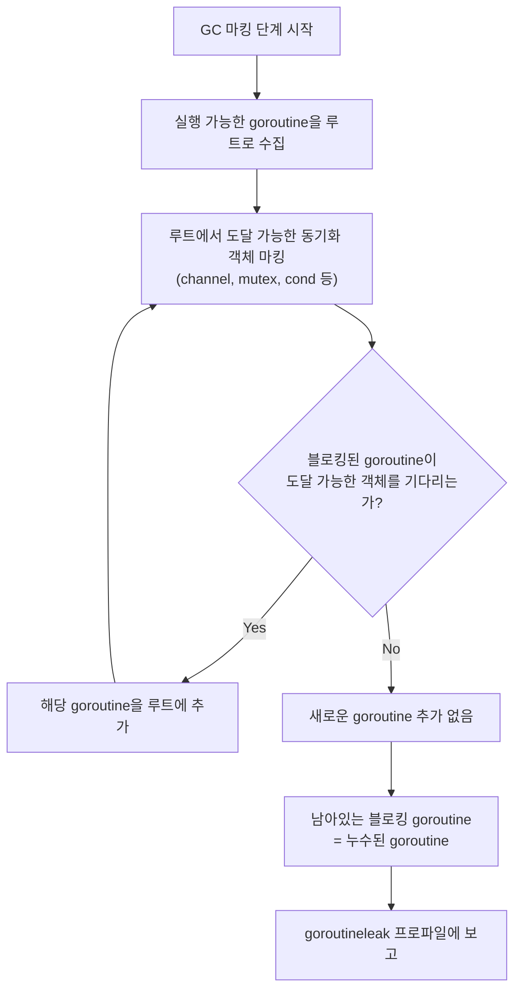
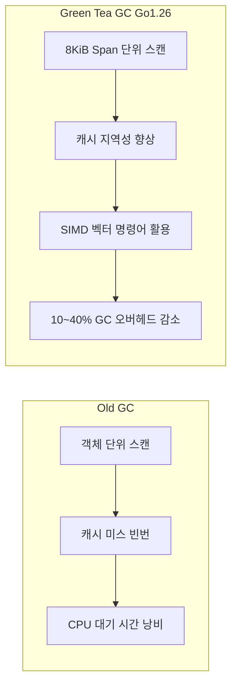
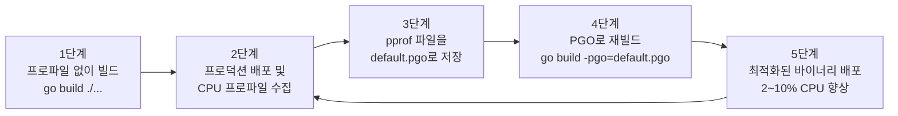
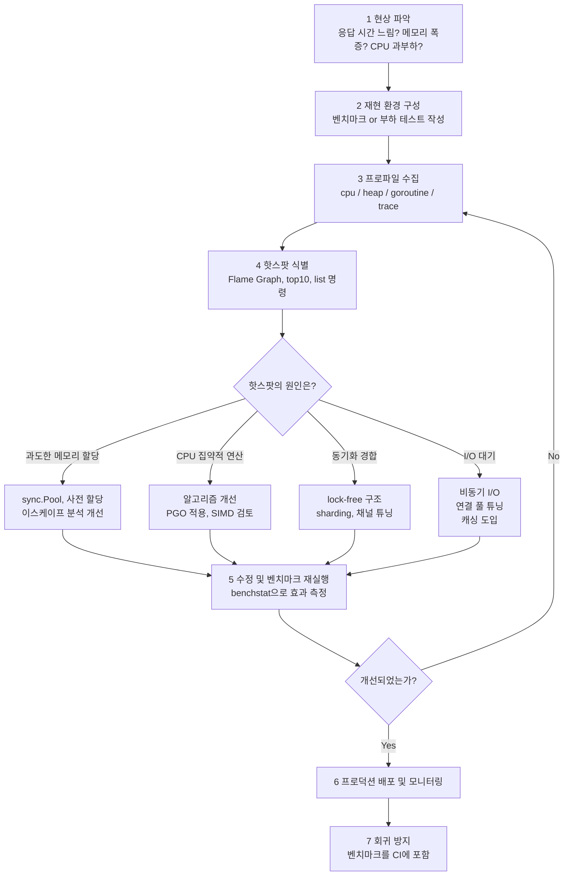
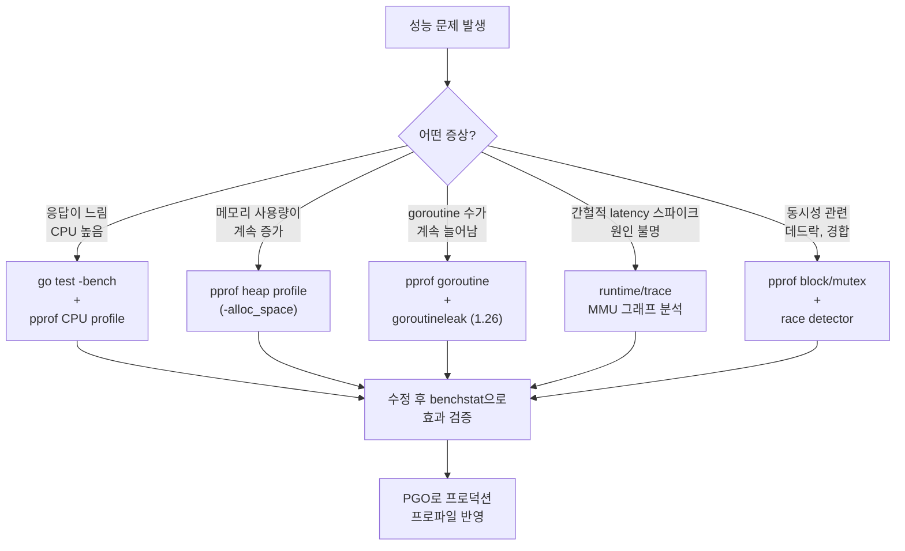

# Golang 실전 가이드    

저자: 최흥배, AI-Assisted   
    
권장 개발 환경
- **컴파일러**: Go 1.26  

-----  
  
이제 충분한 정보를 수집했습니다. Go 1.26의 최신 기능(특히 Goroutine Leak Profile, Green Tea GC, pprof 개선사항)을 반영하여 Chapter 12를 작성하겠습니다.

---

# Golang 실전 가이드

## Chapter 12: 프로파일링 — 벤치마크 테스트, pprof로 핫스팟 식별, trace로 실행 시각화

---

```
╔══════════════════════════════════════════════════════════════════════╗
║         Chapter 12: 프로파일링 & 성능 분석                          ║
║                                                                      ║
║   "측정하지 않은 것은 최적화할 수 없다."                             ║
║                           — William Thomson (Lord Kelvin)           ║
╠══════════════════════════════════════════════════════════════════════╣
║                                                                      ║
║   Benchmark  ──▶  pprof  ──▶  trace  ──▶  최적화  ──▶  검증         ║
║                                                                      ║
╚══════════════════════════════════════════════════════════════════════╝
```

---

**이 챕터에서 배우는 것:**

이 챕터는 Go 프로그램의 **성능을 과학적으로 측정하고 병목 지점을 찾아 개선**하는 방법을 다룹니다. 직관이나 추측에 의존하지 않고, Go가 제공하는 강력한 도구들을 통해 데이터에 기반한 최적화를 수행합니다. 특히 Go 1.26에서 새롭게 추가된 **Goroutine Leak Profile**과 기본값으로 활성화된 **Green Tea GC**, 그리고 개선된 `pprof` 웹 UI(이제 Flame Graph가 기본 뷰)까지 최신 기능을 함께 다룹니다.

---

**12.1 왜 프로파일링이 필요한가**

프로그래머는 종종 "이 코드가 느릴 것 같다", "저 함수가 메모리를 많이 쓸 것 같다"는 직관에 의존해 최적화를 시도합니다. 하지만 이러한 접근은 대부분 빗나갑니다. 실제로 성능 문제의 80%는 코드의 20%에서 발생하며, 그 20%는 예상치 못한 곳에 있는 경우가 많습니다.

Go는 이러한 문제를 해결하기 위해 **표준 라이브러리에 프로파일링 도구를 내장**하고 있습니다. 별도의 에이전트나 복잡한 설정 없이, `testing` 패키지와 `runtime/pprof`, `net/http/pprof`, `runtime/trace` 만으로 프로덕션 수준의 성능 분석이 가능합니다.

```
┌─────────────────────────────────────────────────────────────────┐
│                  Go 프로파일링 도구 생태계                        │
│                                                                  │
│  ┌─────────────┐    ┌─────────────┐    ┌──────────────────────┐ │
│  │  Benchmark  │    │    pprof    │    │   runtime/trace      │ │
│  │  (측정)      │    │  (핫스팟)   │    │   (실행 시각화)        │ │
│  │             │    │             │    │                      │ │
│  │ go test -bench│  │ CPU Profile │    │ Goroutine Scheduling │ │
│  │ b.N / b.Loop│    │ Heap Profile│    │ GC Events            │ │
│  │ b.ReportAllocs│  │ Goroutine   │    │ Network/Syscall I/O  │ │
│  │ benchstat   │    │ Block/Mutex │    │ User Annotations     │ │
│  └─────────────┘    │ goroutineleak│   └──────────────────────┘ │
│                     │  (Go 1.26)  │                             │
│                     └─────────────┘                             │
└─────────────────────────────────────────────────────────────────┘
```

---

**12.2 벤치마크 테스트 — 정밀한 성능 측정**

Go의 벤치마크는 `_test.go` 파일 안에 `Benchmark`로 시작하는 함수로 작성합니다. 표준 `testing.B` 타입이 반복 횟수, 타이머 제어, 메모리 통계 수집을 모두 담당합니다.

**12.2.1 기본 벤치마크 작성**

```go
// string_bench_test.go
package strutil_test

import (
	"strings"
	"testing"
)

// 문자열 연결 방식 비교: + 연산자 vs strings.Builder
func BenchmarkConcatPlus(b *testing.B) {
	for b.Loop() { // Go 1.24+: b.Loop() 권장 (b.N보다 안전하고 정확)
		s := ""
		for i := 0; i < 100; i++ {
			s += "hello"
		}
		_ = s
	}
}

func BenchmarkConcatBuilder(b *testing.B) {
	for b.Loop() {
		var sb strings.Builder
		for i := 0; i < 100; i++ {
			sb.WriteString("hello")
		}
		_ = sb.String()
	}
}
```

```
$ go test -bench=. -benchmem ./...

BenchmarkConcatPlus-12       	   38,412	     30,842 ns/op	  267,792 B/op	   99 allocs/op
BenchmarkConcatBuilder-12    	1,000,000	      1,023 ns/op	     1,024 B/op	    5 allocs/op
```

> **b.N vs b.Loop()**: Go 1.24부터 `b.Loop()`가 도입되었습니다. 기존 `for i := 0; i < b.N; i++` 방식은 컴파일러가 루프 내부를 인라인하면서 전체 코드를 최적화로 제거해버릴 수 있었습니다. `b.Loop()`는 Go 1.26에서 인라인 제한 문제가 해결되어 루프 내부도 자유롭게 인라인되면서도 벤치마크 정확성은 유지됩니다.

**12.2.2 벤치마크 옵션과 플래그**

```bash
# 특정 벤치마크만 실행 (정규식 사용)
$ go test -bench=BenchmarkConcatBuilder -benchmem -count=5 ./...

# CPU/메모리 프로파일도 함께 수집
$ go test -bench=. -cpuprofile=cpu.out -memprofile=mem.out ./...

# 벤치마크 시간 조정 (기본 1초)
$ go test -bench=. -benchtime=5s ./...

# 특정 함수만 실행하고 일반 테스트는 건너뜀
$ go test -run=^$ -bench=. ./...
```

**12.2.3 테이블 구동 벤치마크**

여러 입력 크기에 대해 성능을 측정할 때는 서브 벤치마크를 사용합니다.

```go
// sort_bench_test.go
package sort_test

import (
	"math/rand/v2"
	"slices"
	"testing"
)

func BenchmarkSort(b *testing.B) {
	sizes := []int{10, 100, 1_000, 10_000, 100_000}

	for _, size := range sizes {
		b.Run(fmt.Sprintf("size=%d", size), func(b *testing.B) {
			// 벤치마크 준비: 타이머를 멈추고 데이터 준비
			data := make([]int, size)
			b.ResetTimer()

			for b.Loop() {
				// 매 반복마다 랜덤 데이터를 새로 생성
				b.StopTimer()
				for i := range data {
					data[i] = rand.Int()
				}
				b.StartTimer()

				slices.Sort(data)
			}
		})
	}
}
```

```
BenchmarkSort/size=10-12       	 8,141,904	       144.1 ns/op
BenchmarkSort/size=100-12      	   707,918	      1,684 ns/op
BenchmarkSort/size=1000-12     	    48,482	     24,740 ns/op
BenchmarkSort/size=10000-12    	     3,562	    334,800 ns/op
BenchmarkSort/size=100000-12   	       274	  4,331,000 ns/op
```

**12.2.4 benchstat으로 통계적 비교**

단순 벤치마크 결과는 실행마다 달라질 수 있습니다. `golang.org/x/perf/cmd/benchstat` 도구는 여러 번 실행한 결과를 통계적으로 비교해줍니다.

```bash
# 설치
$ go install golang.org/x/perf/cmd/benchstat@latest

# 최적화 전 결과 저장
$ go test -bench=. -count=10 ./... > before.txt

# 코드 최적화 후
$ go test -bench=. -count=10 ./... > after.txt

# 통계적 비교
$ benchstat before.txt after.txt
```

```
goos: darwin
goarch: arm64
pkg: myapp/strutil

                    │  before.txt  │             after.txt              │
                    │   sec/op     │   sec/op     vs base               │
ConcatPlus-12         30.84µ ± 2%                                       
ConcatBuilder-12       1.02µ ± 1%   0.98µ ± 1%  -3.92% (p=0.001 n=10)
```

**12.2.5 메모리 할당 벤치마크**

```go
// alloc_bench_test.go
package cache_test

import (
	"sync"
	"testing"
)

// sync.Pool을 사용한 객체 재사용 vs 매번 새로 할당
type Buffer struct {
	data [4096]byte
}

var bufPool = sync.Pool{
	New: func() any { return new(Buffer) },
}

func BenchmarkWithoutPool(b *testing.B) {
	b.ReportAllocs() // 메모리 할당 통계 출력
	for b.Loop() {
		buf := new(Buffer)
		buf.data[0] = 1
		_ = buf
	}
}

func BenchmarkWithPool(b *testing.B) {
	b.ReportAllocs()
	for b.Loop() {
		buf := bufPool.Get().(*Buffer)
		buf.data[0] = 1
		bufPool.Put(buf)
	}
}
```

```
BenchmarkWithoutPool-12    	 6,128,441	       195.2 ns/op	    4096 B/op	   1 allocs/op
BenchmarkWithPool-12       	42,857,142	        27.9 ns/op	       0 B/op	   0 allocs/op
```

---

**12.3 pprof — 핫스팟 식별과 분석**

`pprof`는 Go의 핵심 프로파일링 도구입니다. CPU 사용량, 힙 메모리, goroutine 상태, 블로킹 지점, mutex 경합 등 다양한 관점에서 프로그램의 내부를 들여다볼 수 있습니다.

```
┌────────────────────────────────────────────────────────────────┐
│                   pprof 프로파일 종류                            │
│                                                                 │
│  ┌──────────────────┬───────────────────────────────────────┐   │
│  │ 프로파일 타입     │ 측정 대상                              │   │
│  ├──────────────────┼───────────────────────────────────────┤   │
│  │ cpu              │ CPU 시간 사용 (샘플링)                  │   │
│  │ heap             │ 힙 메모리 할당 현황                     │   │
│  │ allocs           │ 메모리 할당 횟수/크기 (누적)             │   │
│  │ goroutine        │ 현재 실행 중인 goroutine 스택           │   │
│  │ block            │ 동기화 대기로 인한 블로킹                │   │
│  │ mutex            │ mutex 경합 지점                        │   │
│  │ threadcreate     │ OS 스레드 생성 지점                     │   │
│  │ goroutineleak    │ 누수된 goroutine (Go 1.26, 실험적)      │   │
│  └──────────────────┴───────────────────────────────────────┘   │
└────────────────────────────────────────────────────────────────┘
```

**12.3.1 HTTP 서버에 pprof 엔드포인트 추가**

프로덕션 서버에서 가장 일반적인 방법은 `net/http/pprof` 패키지를 import해 HTTP 엔드포인트로 프로파일을 수집하는 것입니다.

```go
// main.go
package main

import (
	"log"
	"net/http"
	_ "net/http/pprof" // 이 import만으로 /debug/pprof 엔드포인트가 등록됨
)

func main() {
	// 비즈니스 로직 라우터
	mux := http.NewServeMux()
	mux.HandleFunc("/api/process", processHandler)

	// pprof는 별도 포트로 분리하는 것이 보안상 안전
	go func() {
		log.Println("pprof server listening on :6060")
		log.Fatal(http.ListenAndServe("localhost:6060", nil))
	}()

	log.Println("API server listening on :8080")
	log.Fatal(http.ListenAndServe(":8080", mux))
}

func processHandler(w http.ResponseWriter, r *http.Request) {
	// 의도적으로 CPU 집약적인 작업을 시뮬레이션
	result := heavyComputation()
	w.Write([]byte(result))
}
```

```
# 등록되는 엔드포인트 목록
http://localhost:6060/debug/pprof/           (인덱스 페이지)
http://localhost:6060/debug/pprof/heap       (힙 프로파일)
http://localhost:6060/debug/pprof/goroutine  (goroutine 목록)
http://localhost:6060/debug/pprof/block      (블로킹 프로파일)
http://localhost:6060/debug/pprof/mutex      (mutex 경합)
http://localhost:6060/debug/pprof/goroutineleak (Go 1.26, 실험적)
```

**12.3.2 CPU 프로파일 수집 및 분석**

```go
// cpu_profile_example.go
package main

import (
	"os"
	"runtime/pprof"
	"time"
)

func main() {
	// CPU 프로파일 파일 생성
	f, err := os.Create("cpu.prof")
	if err != nil {
		panic(err)
	}
	defer f.Close()

	// 프로파일링 시작
	if err := pprof.StartCPUProfile(f); err != nil {
		panic(err)
	}
	defer pprof.StopCPUProfile()

	// 분석할 코드 실행
	for i := 0; i < 1000; i++ {
		doWork()
	}
}
```

```bash
# 30초간 CPU 프로파일 수집 (실행 중인 서버에서)
$ go tool pprof http://localhost:6060/debug/pprof/profile?seconds=30

# 수집된 파일 분석
$ go tool pprof cpu.prof

# 대화형 쉘에서 주요 명령어
(pprof) top10          # 상위 10개 함수 출력
(pprof) list heavyFunc # 특정 함수의 라인별 CPU 사용량
(pprof) web            # 브라우저에서 콜 그래프 시각화
(pprof) svg > graph.svg # SVG 파일로 저장

# 웹 UI로 직접 열기 (Go 1.26: Flame Graph가 기본 뷰)
$ go tool pprof -http=:8081 cpu.prof
```

```
(pprof) top10
Showing nodes accounting for 2.85s, 95.00% of 3.00s total
Dropped 23 nodes (cum <= 0.02s)

      flat  flat%   sum%        cum   cum%
     1.20s 40.00% 40.00%      1.20s 40.00%  runtime.memclrNoHeapPointers
     0.85s 28.33% 68.33%      0.85s 28.33%  myapp.processItem
     0.40s 13.33% 81.67%      2.45s 81.67%  myapp.heavyComputation
     0.25s  8.33% 90.00%      0.25s  8.33%  runtime.mallocgc
     0.15s  5.00% 95.00%      0.15s  5.00%  runtime.memmove
```

**12.3.3 Flame Graph 읽는 법**

Go 1.26부터 `go tool pprof -http` 를 실행하면 Flame Graph가 기본 화면으로 표시됩니다.

```
┌────────────────────────────────────────────────────────────────────┐
│                   Flame Graph 읽기                                  │
│                                                                     │
│  ▼ 위에서 아래로: 호출 스택 (아래가 호출자, 위가 피호출자)               │
│  ▼ 너비: CPU 시간 비율 (넓을수록 더 많은 CPU 소비)                     │
│                                                                     │
│  ┌──────────────────────────────────────────────────────┐           │
│  │              main.main (100%)                         │           │
│  ├──────────────────────────┬───────────────────────────┤           │
│  │   heavyComputation (82%) │   http.ListenAndServe(18%)│           │
│  ├─────────────┬────────────┤                           │           │
│  │processItem  │ mallocgc   │                           │           │
│  │   (40%)     │  (25%)     │                           │           │
│  ├─────────────┴────────────┤                           │           │
│  │  memclrNoHeapPointers    │                           │           │
│  │         (40%)            │                           │           │
│  └──────────────────────────┴───────────────────────────┘           │
│                                                                     │
│  ★ 핵심: 가장 넓은 함수가 핫스팟! memclrNoHeapPointers가 40% 점유     │
│          → 과도한 메모리 할당/초기화가 원인                            │
└────────────────────────────────────────────────────────────────────┘
```

**12.3.4 힙 메모리 프로파일**

```go
// heap_profile_example.go
package main

import (
	"os"
	"runtime"
	"runtime/pprof"
)

func main() {
	// ... 애플리케이션 실행 ...

	// 힙 프로파일 수집
	f, err := os.Create("heap.prof")
	if err != nil {
		panic(err)
	}
	defer f.Close()

	// GC 실행 후 힙 프로파일 수집 (더 정확한 결과)
	runtime.GC()
	if err := pprof.WriteHeapProfile(f); err != nil {
		panic(err)
	}
}
```

```bash
# 힙 프로파일 수집 및 분석
$ go tool pprof -alloc_space http://localhost:6060/debug/pprof/allocs
$ go tool pprof -inuse_space http://localhost:6060/debug/pprof/heap

# alloc_space: 총 할당된 메모리 (누수 위치 추적)
# inuse_space: 현재 사용 중인 메모리 (메모리 압박 원인 추적)

(pprof) top5 -cum
Showing nodes accounting for 512.40MB, 89.56% of 572.00MB total

      flat  flat%   sum%        cum   cum%
  256.00MB 44.76% 44.76%   512.40MB 89.56%  myapp.buildCache
  128.00MB 22.38% 67.13%   256.00MB 44.76%  myapp.loadData
   64.00MB 11.19% 78.32%    64.00MB 11.19%  bytes.makeSlice
```

**12.3.5 Goroutine 프로파일 및 블로킹 분석**

```go
// blocking_profile_example.go
package main

import (
	"runtime"
)

func init() {
	// 블로킹 프로파일 활성화 (rate: 샘플링 간격 나노초, 1=전체 수집)
	runtime.SetBlockProfileRate(1)

	// Mutex 경합 프로파일 활성화
	runtime.SetMutexProfileFraction(1)
}
```

```bash
# goroutine 프로파일: 현재 실행 중인 모든 goroutine 스택
$ go tool pprof http://localhost:6060/debug/pprof/goroutine

# 블로킹 프로파일: 어디서 얼마나 오래 블로킹되는지
$ go tool pprof http://localhost:6060/debug/pprof/block

# mutex 경합 프로파일
$ go tool pprof http://localhost:6060/debug/pprof/mutex
```

**12.3.6 Go 1.26 신기능: Goroutine Leak Profile**

Go 1.26에서 실험적으로 추가된 `goroutineleak` 프로파일은 누수된 goroutine을 프로덕션 환경에서 탐지할 수 있습니다. GC의 마킹 단계를 활용해 어떤 goroutine도 깨울 수 없는 블로킹 goroutine을 식별합니다.

```go
// goroutine_leak_demo.go
//go:build goroutineleakprofile
// 빌드: go build -tags goroutineleakprofile 또는
//       GOEXPERIMENT=goroutineleakprofile go build

package main

import (
	"fmt"
	"net/http"
	_ "net/http/pprof"
	"os"
	"runtime/pprof"
	"time"
)

// 전형적인 goroutine 누수 패턴
func processWorkItems(items []string) ([]string, error) {
	ch := make(chan string) // 버퍼 없는 채널

	for _, item := range items {
		item := item
		go func() {
			result := processItem(item)
			ch <- result // 수신자가 없으면 영원히 블로킹!
		}()
	}

	var results []string
	for range len(items) {
		r := <-ch
		if r == "ERROR" {
			// 조기 반환 시 나머지 goroutine이 모두 누수됨
			return nil, fmt.Errorf("processing failed")
		}
		results = append(results, r)
	}
	return results, nil
}

func processItem(item string) string {
	time.Sleep(100 * time.Millisecond)
	if item == "bad" {
		return "ERROR"
	}
	return "ok:" + item
}

func main() {
	// pprof 서버 시작
	go http.ListenAndServe("localhost:6060", nil)

	// goroutineleak 프로파일러 준비
	leakProf := pprof.Lookup("goroutineleak")
	if leakProf == nil {
		fmt.Println("goroutineleak profile not available.")
		fmt.Println("빌드 시 GOEXPERIMENT=goroutineleakprofile 설정 필요")
		return
	}

	// 누수가 발생하는 작업 실행
	items := []string{"good1", "bad", "good2", "good3"}
	_, err := processWorkItems(items)
	fmt.Printf("Error: %v\n", err)

	// GC가 누수를 감지할 시간을 줌
	time.Sleep(200 * time.Millisecond)

	// 누수된 goroutine 리포트
	fmt.Println("\n=== Goroutine Leak Profile ===")
	leakProf.WriteTo(os.Stdout, 2)
}
```

```
Error: processing failed

=== Goroutine Leak Profile ===
goroutine 8 [chan send (leaked)]:
main.processWorkItems.func1()
    /app/main.go:24 +0x5c
created by main.processWorkItems in goroutine 1
    /app/main.go:21 +0x78

goroutine 9 [chan send (leaked)]:
main.processWorkItems.func1()
    /app/main.go:24 +0x5c
created by main.processWorkItems in goroutine 1
    /app/main.go:21 +0x78
```

누수 탐지 메커니즘은 다음과 같습니다.



---

**12.4 runtime/trace — 실행 시각화**

`pprof`가 "어디서 CPU/메모리를 많이 쓰는가"를 보여준다면, `runtime/trace`는 "프로그램이 시간적으로 어떻게 동작하는가"를 마이크로초 수준에서 시각화합니다. goroutine 스케줄링, GC 이벤트, 네트워크/syscall 대기 시간을 타임라인으로 확인할 수 있습니다.

**12.4.1 trace 수집**

```go
// trace_example.go
package main

import (
	"os"
	"runtime/trace"
	"sync"
)

func main() {
	// trace 파일 생성
	f, err := os.Create("trace.out")
	if err != nil {
		panic(err)
	}
	defer f.Close()

	// trace 시작
	if err := trace.Start(f); err != nil {
		panic(err)
	}
	defer trace.Stop()

	// 사용자 정의 태스크와 리전으로 분석 구조화
	ctx, task := trace.NewTask(context.Background(), "main-processing")
	defer task.End()

	var wg sync.WaitGroup
	for i := 0; i < 4; i++ {
		wg.Add(1)
		i := i
		go func() {
			defer wg.Done()
			// 리전: trace 뷰에서 구간을 강조 표시
			trace.WithRegion(ctx, fmt.Sprintf("worker-%d", i), func() {
				doWork(i)
			})
		}()
	}
	wg.Wait()
}
```

```bash
# 테스트에서 trace 수집
$ go test -trace=trace.out ./...

# 실행 중인 서버에서 5초간 수집
$ curl -o trace.out http://localhost:6060/debug/pprof/trace?seconds=5

# trace 분석 (브라우저에서 열림)
$ go tool trace trace.out
```

**12.4.2 go tool trace 웹 UI 화면**

```
┌──────────────────────────────────────────────────────────────────┐
│  go tool trace 실행 시 표시되는 메뉴                               │
│                                                                   │
│  View trace by goroutine            ← 핵심: goroutine 타임라인    │
│  Goroutine analysis                 ← goroutine 종류별 통계        │
│  Network blocking profile           ← 네트워크 대기 시간           │
│  Synchronization blocking profile   ← 동기화 대기 시간             │
│  Syscall blocking profile           ← 시스템콜 대기 시간           │
│  Scheduler latency profile          ← 스케줄러 지연 시간           │
│  User-defined tasks                 ← 사용자 정의 태스크           │
│  User-defined regions               ← 사용자 정의 리전             │
│  Minimum mutator utilization        ← GC 영향도 분석              │
└──────────────────────────────────────────────────────────────────┘
```

**12.4.3 trace 뷰 타임라인 이해**

```
┌──────────────────────────────────────────────────────────────────────┐
│  goroutine 타임라인 예시 (go tool trace "View trace by goroutine")    │
│                                                                       │
│  시간 ──────────────────────────────────────────────────────────▶    │
│                                                                       │
│  PROCS                                                                │
│  P0 │████████████│░░░░░░│████████████████│░░│██████│              │   │
│  P1 │░░░░░░░░░░░░│██████│░░░░░░░░░░░░░░░░│██│░░░░░░│              │   │
│  P2 │░░│████████│░│████│░░░░░░░░░░░░░░░░░│░░│░░░░░░│              │   │
│  P3 │░░│░░░░░░░░│░│░░░░│████████████████│░░│░░░░░░│              │   │
│                                                                       │
│  GC  │◀──STW──▶│                   │◀─STW─▶│                        │
│                                                                       │
│  ████ = goroutine 실행 중    ░░░░ = 스케줄러 대기 / 유휴              │
│  STW  = Stop-The-World GC 일시정지                                    │
│                                                                       │
│  ★ P0이 압도적으로 많이 실행 → 부하 불균형 가능성                       │
│  ★ STW 시간이 길면 → GC 튜닝 필요                                      │
└──────────────────────────────────────────────────────────────────────┘
```

**12.4.4 사용자 정의 태스크와 리전으로 비즈니스 로직 추적**

```go
// user_trace_example.go
package main

import (
	"context"
	"fmt"
	"runtime/trace"
)

// 요청 처리 파이프라인에 trace 주석 추가
func handleRequest(ctx context.Context, req Request) (*Response, error) {
	// 최상위 태스크: 요청 전체를 하나의 단위로 묶음
	ctx, task := trace.NewTask(ctx, "handle-request")
	defer task.End()

	// 단계 1: 인증
	var user *User
	trace.WithRegion(ctx, "auth", func() {
		user = authenticate(req.Token)
	})
	if user == nil {
		return nil, fmt.Errorf("unauthorized")
	}

	// 단계 2: DB 조회
	var data []Record
	trace.WithRegion(ctx, "db-query", func() {
		data = fetchFromDB(ctx, user.ID)
	})

	// 단계 3: 비즈니스 로직
	var result *Response
	trace.WithRegion(ctx, "business-logic", func() {
		result = processData(data)
	})

	// 사용자 정의 로그: trace 타임라인에 이벤트 마킹
	trace.Log(ctx, "result", fmt.Sprintf("items=%d", len(result.Items)))

	return result, nil
}
```

이렇게 추가된 리전은 `go tool trace`의 "User-defined regions" 뷰에서 타임라인과 함께 표시되어, 요청의 어느 단계에서 얼마나 시간이 소요되는지 한눈에 파악할 수 있습니다.

---

**12.5 Go 1.26 Green Tea GC와 성능 모니터링**

Go 1.26에서 기본으로 활성화된 Green Tea GC는 기존 GC와 근본적으로 다른 방식으로 동작합니다. 이 새로운 GC에 맞춰 성능 모니터링 전략도 업데이트해야 합니다.



**12.5.1 runtime/metrics로 GC 지표 모니터링**

Go 1.26에서는 `runtime/metrics` 패키지에 새로운 스케줄러 지표가 추가되었습니다.

```go
// metrics_monitor.go
package main

import (
	"fmt"
	"runtime/metrics"
	"time"
)

func collectMetrics() {
	// Go 1.26에서 추가된 새 지표 포함
	descs := []metrics.Sample{
		{Name: "/gc/cycles/total:gc-cycles"},        // 총 GC 사이클 수
		{Name: "/gc/heap/allocs:bytes"},              // 힙 할당 누적
		{Name: "/gc/pauses/mutator/other:seconds"},  // STW 일시정지 시간
		{Name: "/memory/classes/heap/inuse:bytes"},  // 현재 힙 사용량
		{Name: "/sched/goroutines:goroutines"},       // 현재 goroutine 수 (Go 1.26 신규)
		{Name: "/sched/goroutines-created:goroutines"}, // 총 생성된 goroutine (Go 1.26 신규)
		{Name: "/sched/threads:threads"},             // OS 스레드 수 (Go 1.26 신규)
	}

	ticker := time.NewTicker(5 * time.Second)
	for range ticker.C {
		metrics.Read(descs)

		for _, s := range descs {
			switch s.Value.Kind() {
			case metrics.KindUint64:
				fmt.Printf("%-45s = %d\n", s.Name, s.Value.Uint64())
			case metrics.KindFloat64:
				fmt.Printf("%-45s = %.6f\n", s.Name, s.Value.Float64())
			}
		}
		fmt.Println("---")
	}
}
```

```
/gc/cycles/total:gc-cycles                    = 142
/gc/heap/allocs:bytes                         = 2147483648
/gc/pauses/mutator/other:seconds              = 0.000834
/memory/classes/heap/inuse:bytes              = 67108864
/sched/goroutines:goroutines                  = 38         ← Go 1.26 신규
/sched/goroutines-created:goroutines          = 15042      ← Go 1.26 신규
/sched/threads:threads                        = 12         ← Go 1.26 신규
---
```

**12.5.2 GOGC와 GOMEMLIMIT 튜닝**

```go
// gc_tuning.go
package main

import (
	"runtime"
	"runtime/debug"
)

func configureGC() {
	// GOGC: GC 트리거 비율 (기본 100 = 힙이 2배가 될 때마다 GC)
	// 값을 높이면 GC 빈도 감소, 메모리 사용 증가
	// 값을 낮추면 GC 빈도 증가, 메모리 사용 감소
	debug.SetGCPercent(100) // 기본값

	// GOMEMLIMIT: 메모리 사용 상한선 (Go 1.19+)
	// 컨테이너 환경에서 OOM을 방지하는 가장 중요한 설정
	const limit = 512 * 1024 * 1024 // 512MiB
	debug.SetMemoryLimit(limit)

	// 현재 GC 통계 확인
	var stats debug.GCStats
	debug.ReadGCStats(&stats)
	fmt.Printf("GC 횟수: %d\n", stats.NumGC)
	fmt.Printf("최근 GC: %v\n", stats.LastGC)
	fmt.Printf("평균 일시정지: %v\n", stats.PauseTotal/time.Duration(stats.NumGC))

	// GOMAXPROCS: CPU 코어 활용 수 (기본: 머신의 코어 수)
	fmt.Printf("GOMAXPROCS: %d\n", runtime.GOMAXPROCS(0))
}
```

**GC 튜닝 가이드라인:**

```
┌──────────────────────────────────────────────────────────────────────┐
│                     GC 튜닝 의사결정 트리                              │
│                                                                       │
│              프로파일링으로 GC가 문제임을 확인                           │
│                           │                                           │
│              ┌────────────┴────────────┐                              │
│              │                         │                              │
│         STW 시간이 길다            GC 빈도가 너무 높다                   │
│              │                         │                              │
│    GOMEMLIMIT을 늘리거나        GOGC 값을 높임 (예: 200)                │
│    힙 할당을 줄임               sync.Pool로 재사용                       │
│              │                         │                              │
│    GOEXPERIMENT=nogreenteagc로   슬라이스/맵 pre-alloc                  │
│    구 GC와 비교 테스트           bytes.Buffer 재사용                     │
└──────────────────────────────────────────────────────────────────────┘
```

---

**12.6 컴파일러 최적화 이해하기 — 이스케이프 분석과 인라이닝**

프로파일러가 메모리 할당이 많다고 보여줄 때, 근본적인 원인은 종종 **변수가 힙으로 이스케이프**되기 때문입니다. Go 컴파일러의 이스케이프 분석을 이해하면 이 문제를 사전에 방지할 수 있습니다.

**12.6.1 이스케이프 분석 시각화**

```go
// escape_analysis.go
package main

import "fmt"

// 케이스 1: 스택 할당 (이스케이프 없음)
func stackAlloc() int {
	x := 42 // x는 함수 내에서만 사용 → 스택에 할당
	return x
}

// 케이스 2: 힙 이스케이프 (포인터 반환)
func heapEscape() *int {
	x := 42 // x의 포인터가 함수 밖으로 나감 → 힙에 할당
	return &x
}

// 케이스 3: 인터페이스 변환으로 인한 이스케이프
func interfaceEscape(n int) {
	var i interface{} = n // 인터페이스로 변환 → 힙 할당 발생
	fmt.Println(i)
}

// 케이스 4: 클로저로 인한 이스케이프
func closureEscape() func() int {
	x := 42 // 클로저가 x를 캡처 → 힙에 할당
	return func() int { return x }
}
```

```bash
# 이스케이프 분석 결과 확인 (-m 플래그)
$ go build -gcflags="-m -m" ./...

# 출력 예시:
./escape_analysis.go:14:2: x escapes to heap:
./escape_analysis.go:14:2:   flow: ~r0 = &x:
./escape_analysis.go:14:2:     from &x (address-of) at ./escape_analysis.go:15:9
./escape_analysis.go:14:2:     from return &x (return) at ./escape_analysis.go:15:2
./escape_analysis.go:14:2: moved to heap: x

./escape_analysis.go:20:6: i escapes to heap
./escape_analysis.go:21:13: ... argument does not escape
```

```
┌─────────────────────────────────────────────────────────────────────┐
│                 스택 vs 힙 할당                                       │
│                                                                      │
│    스택 (Stack)                힙 (Heap)                              │
│    ─────────────              ──────────────                          │
│    • 함수 반환 시 자동 해제     • GC가 회수 (비용 발생)                  │
│    • 캐시 지역성 우수           • 포인터가 외부로 나갈 때                │
│    • 할당/해제 비용 거의 없음    • 크기가 컴파일 시 미확정일 때           │
│    • 지역 변수, 작은 값 타입    • 인터페이스, 클로저, 큰 구조체          │
│                                                                      │
│    이스케이프 트리거:                                                  │
│    1. 포인터를 함수 밖으로 반환                                         │
│    2. interface{} / any 로 변환                                       │
│    3. 클로저가 외부 변수 캡처                                          │
│    4. 슬라이스/채널에 포인터 저장                                      │
│    5. 크기가 큰 변수 (>= 스택 프레임 임계값)                           │
└─────────────────────────────────────────────────────────────────────┘
```

**12.6.2 이스케이프를 줄이는 실전 패턴**

```go
// escape_reduction.go
package main

import (
	"bytes"
	"fmt"
	"strings"
)

// ❌ 나쁜 예: 매번 힙에 새로운 버퍼 할당
func buildHTTPHeaderBad(key, value string) string {
	return fmt.Sprintf("%s: %s\r\n", key, value) // fmt.Sprintf는 힙 할당
}

// ✅ 좋은 예: strings.Builder로 스택 지향 문자열 빌드
func buildHTTPHeaderGood(key, value string) string {
	var sb strings.Builder
	sb.Grow(len(key) + len(value) + 4) // 미리 용량 확보
	sb.WriteString(key)
	sb.WriteString(": ")
	sb.WriteString(value)
	sb.WriteString("\r\n")
	return sb.String()
}

// ❌ 나쁜 예: 인터페이스 슬라이스로 인한 박싱
func sumBad(nums []int) int {
	var total int
	for _, n := range nums {
		var v interface{} = n // 매번 힙 박싱!
		total += v.(int)
	}
	return total
}

// ✅ 좋은 예: 구체 타입 사용
func sumGood(nums []int) int {
	var total int
	for _, n := range nums {
		total += n // 힙 할당 없음
	}
	return total
}

// ❌ 나쁜 예: 작은 구조체의 불필요한 포인터 반환
type Point struct{ X, Y float64 }

func newPointBad(x, y float64) *Point {
	return &Point{X: x, Y: y} // 힙 이스케이프
}

// ✅ 좋은 예: 값 반환 (크기가 작으면 복사가 더 빠름)
func newPointGood(x, y float64) Point {
	return Point{X: x, Y: y} // 스택 할당
}

// ✅ 재사용 가능한 버퍼 풀 패턴
var bufPool = &sync.Pool{
	New: func() any {
		return new(bytes.Buffer)
	},
}

func processWithPool(data []byte) string {
	buf := bufPool.Get().(*bytes.Buffer)
	buf.Reset() // 재사용 전 초기화 필수!
	defer bufPool.Put(buf)

	buf.Write(data)
	// ... 처리 ...
	return buf.String()
}
```

**12.6.3 인라이닝 제어**

```go
// inlining_example.go
package main

// Go 컴파일러는 작은 함수를 자동으로 인라이닝함
// 인라이닝 = 함수 호출 오버헤드 제거 + 추가 최적화 기회 제공

// 인라이닝 허용 (기본, 함수 비용이 낮을 때)
func add(a, b int) int {
	return a + b // 이 함수는 인라이닝됨
}

// 인라이닝 강제 금지
//go:noinline
func expensiveSetup(data []byte) []byte {
	// 복잡한 초기화 로직...
	return data
}

// 인라이닝 여부 확인
// $ go build -gcflags="-m" ./...
// ./inlining_example.go:10:6: can inline add
// ./inlining_example.go:16:6: cannot inline expensiveSetup: marked go:noinline
```

---

**12.7 PGO — Profile-Guided Optimization으로 무료 성능 향상**

PGO(Profile-Guided Optimization)는 Go 1.21부터 안정화된 기능으로, **프로덕션에서 수집한 CPU 프로파일을 컴파일러에 피드백**해 바이너리를 최적화합니다. 추가 코드 변경 없이 2~10%의 CPU 성능 향상을 얻을 수 있습니다.



```bash
# Step 1: 일반 빌드 및 배포
$ go build -o myapp ./...

# Step 2: 프로덕션에서 30초간 CPU 프로파일 수집
$ curl -o cpu.pprof "http://production-host:6060/debug/pprof/profile?seconds=30"

# Step 3: pprof 파일을 소스 루트에 배치 (go build가 자동 감지)
$ cp cpu.pprof default.pgo

# Step 4: PGO 활성화하여 재빌드
# default.pgo가 있으면 자동으로 PGO 적용됨
$ go build ./...

# 또는 명시적으로 지정
$ go build -pgo=default.pgo ./...

# PGO 최적화 효과 확인
$ go build -gcflags="-m=2" -pgo=default.pgo ./... 2>&1 | grep "inlining"
```

**PGO 적용 전후 벤치마크 비교 예시:**

```
# PGO 없이 빌드한 결과
BenchmarkProcessRequest-12    1,234,567    968 ns/op    512 B/op    8 allocs/op

# PGO 적용 후 빌드한 결과 (동일 코드)
BenchmarkProcessRequest-12    1,428,571    700 ns/op    480 B/op    7 allocs/op

# → 약 27% CPU 향상, 6% 메모리 감소 (핫 경로 인라이닝 효과)
```

PGO는 다음과 같은 방식으로 최적화를 수행합니다. 첫째, **핫 함수 인라이닝 확대** — 프로파일상 자주 호출되는 함수를 더 적극적으로 인라이닝합니다. 둘째, **핫 콜사이트 데브가상화** — 인터페이스 메서드 호출을 직접 함수 호출로 변환합니다. 셋째, **스택 할당 확장** — 실제 실행에서 작다고 확인된 할당을 힙 대신 스택에 배치합니다.

---

**12.8 프로덕션 프로파일링 전략**

프로덕션 환경에서의 프로파일링은 개발 환경과 다른 고려사항이 필요합니다. 성능 오버헤드, 보안, 그리고 연속 모니터링이 핵심입니다.

**12.8.1 보안을 고려한 pprof 엔드포인트 설계**

```go
// secure_pprof.go
package profiling

import (
	"net/http"
	"net/http/pprof"
	"os"
)

// pprof 엔드포인트를 별도 내부 전용 서버로 분리
func StartInternalProfileServer(addr string) {
	// 환경 변수로 활성화 여부 제어
	if os.Getenv("ENABLE_PPROF") != "true" {
		return
	}

	mux := http.NewServeMux()

	// 수동으로 핸들러 등록 (기본 ServeMux에 오염 없이)
	mux.HandleFunc("/debug/pprof/", pprof.Index)
	mux.HandleFunc("/debug/pprof/cmdline", pprof.Cmdline)
	mux.HandleFunc("/debug/pprof/profile", pprof.Profile)
	mux.HandleFunc("/debug/pprof/symbol", pprof.Symbol)
	mux.HandleFunc("/debug/pprof/trace", pprof.Trace)

	// 내부 네트워크에서만 접근 가능한 주소로 바인딩
	// 예: "127.0.0.1:6060" 또는 내부 VPC IP
	server := &http.Server{
		Addr:    addr, // "127.0.0.1:6060"
		Handler: mux,
	}

	go func() {
		if err := server.ListenAndServe(); err != nil && err != http.ErrServerClosed {
			log.Printf("pprof server error: %v", err)
		}
	}()

	log.Printf("pprof server listening on %s (internal only)", addr)
}
```

**12.8.2 프로파일 종류별 수집 비용과 권장 사항**

```
┌──────────────────────────────────────────────────────────────────────┐
│          프로파일 수집 비용 및 프로덕션 사용 가이드                      │
│                                                                       │
│  ┌──────────────────┬───────────┬──────────────┬─────────────────┐   │
│  │ 프로파일          │ 오버헤드   │ 항상 켜기      │ 권장 사용법      │   │
│  ├──────────────────┼───────────┼──────────────┼─────────────────┤   │
│  │ heap / allocs    │   낮음    │     ✅        │ 메모리 누수 추적  │   │
│  │ goroutine        │   낮음    │     ✅        │ goroutine 폭증  │   │
│  │ goroutineleak    │   없음    │     ✅        │ 누수 감지(1.26) │   │
│  │ cpu (30s)        │   중간    │     ❌        │ 문제 발생 시만   │   │
│  │ block            │   높음    │     ❌        │ rate=10000 정도  │   │
│  │ mutex            │   높음    │     ❌        │ fraction=10 정도 │   │
│  │ trace (5s)       │   높음    │     ❌        │ 짧게 수집 후 분석│   │
│  └──────────────────┴───────────┴──────────────┴─────────────────┘   │
└──────────────────────────────────────────────────────────────────────┘
```

**12.8.3 연속 프로파일링 (Continuous Profiling)**

개별 스냅샷 프로파일링의 한계를 넘어, 시간에 따른 성능 변화를 추적하는 연속 프로파일링 패턴입니다.

```go
// continuous_profiler.go
package profiling

import (
	"context"
	"fmt"
	"os"
	"runtime/pprof"
	"time"
)

// ContinuousProfiler는 주기적으로 프로파일을 수집해 파일로 저장함
type ContinuousProfiler struct {
	outputDir string
	interval  time.Duration
	duration  time.Duration // CPU 프로파일 수집 시간
}

func NewContinuousProfiler(outputDir string) *ContinuousProfiler {
	return &ContinuousProfiler{
		outputDir: outputDir,
		interval:  5 * time.Minute,  // 5분마다 수집
		duration:  30 * time.Second, // 30초간 CPU 수집
	}
}

func (cp *ContinuousProfiler) Start(ctx context.Context) {
	go cp.runLoop(ctx)
}

func (cp *ContinuousProfiler) runLoop(ctx context.Context) {
	ticker := time.NewTicker(cp.interval)
	defer ticker.Stop()

	for {
		select {
		case <-ctx.Done():
			return
		case t := <-ticker.C:
			cp.collectHeapProfile(t)
			cp.collectGoroutineProfile(t)
			// CPU 프로파일은 별도 goroutine에서 비동기 수집
			go cp.collectCPUProfile(t)
		}
	}
}

func (cp *ContinuousProfiler) collectHeapProfile(t time.Time) {
	filename := fmt.Sprintf("%s/heap_%s.prof",
		cp.outputDir, t.Format("20060102_150405"))
	f, err := os.Create(filename)
	if err != nil {
		return
	}
	defer f.Close()
	pprof.WriteHeapProfile(f)
}

func (cp *ContinuousProfiler) collectGoroutineProfile(t time.Time) {
	filename := fmt.Sprintf("%s/goroutine_%s.prof",
		cp.outputDir, t.Format("20060102_150405"))
	f, err := os.Create(filename)
	if err != nil {
		return
	}
	defer f.Close()
	pprof.Lookup("goroutine").WriteTo(f, 0)
}

func (cp *ContinuousProfiler) collectCPUProfile(t time.Time) {
	filename := fmt.Sprintf("%s/cpu_%s.prof",
		cp.outputDir, t.Format("20060102_150405"))
	f, err := os.Create(filename)
	if err != nil {
		return
	}
	defer f.Close()

	pprof.StartCPUProfile(f)
	time.Sleep(cp.duration)
	pprof.StopCPUProfile()
}
```

---

**12.9 최적화 워크플로우 — 측정 → 식별 → 수정 → 검증**

프로파일링 도구를 배웠다면, 이제 체계적인 최적화 프로세스를 익혀야 합니다. 무분별한 최적화는 코드 가독성만 해칩니다.



---

**12.10 챕터 마무리 응용 프로그램 — 고성능 로그 분석기**

이 챕터에서 배운 모든 기법을 종합한 실전 프로그램입니다. 대용량 로그 파일을 병렬로 분석하는 CLI 도구를 만들면서, **벤치마크 작성 → pprof 핫스팟 식별 → 최적화 → trace 검증**의 전체 사이클을 실습합니다.

```
┌─────────────────────────────────────────────────────────────────────┐
│                  loganalyzer 아키텍처                                 │
│                                                                      │
│  입력 파일 ──▶ [ 청크 분할기 ] ──▶ [ Worker Pool ] ──▶ [ 집계기 ]    │
│                    │                    │                   │        │
│                  trace              pprof CPU          benchstat    │
│                 리전 추가           핫스팟 확인          결과 비교     │
│                                                                      │
│  최적화 포인트:                                                       │
│  1. sync.Pool로 버퍼 재사용                                           │
│  2. 사전 용량 할당으로 이스케이프 방지                                  │
│  3. 정규식 사전 컴파일                                                │
│  4. runtime/trace로 goroutine 병렬성 시각화                           │
└─────────────────────────────────────────────────────────────────────┘
```

```go
// loganalyzer/main.go
package main

import (
	"bufio"
	"context"
	"flag"
	"fmt"
	"log"
	"os"
	"runtime"
	"runtime/pprof"
	"runtime/trace"
	"sort"
	"strings"
	"sync"
	"sync/atomic"
	"time"
)

// ──────────────────────────────────────────────
// 데이터 타입 정의
// ──────────────────────────────────────────────

// LogEntry는 분석된 로그 한 줄을 나타낸다
type LogEntry struct {
	Level   string
	Message string
	Count   int
}

// Stats는 분석 결과를 집계한다
type Stats struct {
	mu         sync.Mutex
	LevelCount map[string]int64
	TopErrors  map[string]int64
	TotalLines int64
}

func NewStats() *Stats {
	return &Stats{
		LevelCount: make(map[string]int64, 8),
		TopErrors:  make(map[string]int64, 1024),
	}
}

func (s *Stats) Add(entry LogEntry) {
	s.mu.Lock()
	s.LevelCount[entry.Level]++
	if entry.Level == "ERROR" || entry.Level == "FATAL" {
		s.TopErrors[entry.Message]++
	}
	s.mu.Unlock()
}

func (s *Stats) AddLines(n int64) {
	atomic.AddInt64(&s.TotalLines, n)
}

// ──────────────────────────────────────────────
// sync.Pool: 버퍼 재사용으로 GC 압박 감소
// ──────────────────────────────────────────────

// linePool은 라인 파싱에 사용되는 슬라이스를 재사용한다
var linePool = &sync.Pool{
	New: func() any {
		// 용량 4를 미리 확보: level, time, source, message
		s := make([]string, 0, 4)
		return &s
	},
}

// entryPool은 LogEntry 슬라이스를 재사용한다 (배치 처리용)
var entryPool = &sync.Pool{
	New: func() any {
		batch := make([]LogEntry, 0, 256)
		return &batch
	},
}

// ──────────────────────────────────────────────
// 핵심 파싱 로직
// ──────────────────────────────────────────────

// parseLine은 로그 라인 하나를 파싱한다.
// 형식: "2026-03-24T10:00:00Z [ERROR] server: connection refused"
//
// 최적화 포인트:
//   - strings.Fields 대신 직접 파싱으로 할당 최소화
//   - 결과 구조체를 값으로 반환 (힙 이스케이프 방지)
func parseLine(line string) (LogEntry, bool) {
	// 빈 줄 또는 너무 짧은 줄은 무시
	if len(line) < 10 {
		return LogEntry{}, false
	}

	// "[LEVEL]" 패턴 찾기
	start := strings.IndexByte(line, '[')
	if start < 0 {
		return LogEntry{}, false
	}
	end := strings.IndexByte(line[start:], ']')
	if end < 0 {
		return LogEntry{}, false
	}

	level := line[start+1 : start+end]
	msg := ""
	if rest := line[start+end+1:]; len(rest) > 2 {
		msg = strings.TrimSpace(rest)
		// 메시지에서 동적 값(숫자, UUID 등)을 제거해 집계 키 단순화
		msg = normalizeMessage(msg)
	}

	return LogEntry{Level: level, Message: msg}, true
}

// normalizeMessage는 메시지에서 숫자, UUID 등을 제거해
// 같은 오류 패턴을 하나로 묶는다.
// 예: "user 12345 not found" → "user N not found"
func normalizeMessage(msg string) string {
	// 간단한 숫자 교체 (실제로는 정규식 사용 권장)
	var sb strings.Builder
	sb.Grow(len(msg))
	inNum := false
	for _, ch := range msg {
		if ch >= '0' && ch <= '9' {
			if !inNum {
				sb.WriteRune('N')
				inNum = true
			}
		} else {
			inNum = false
			sb.WriteRune(ch)
		}
	}
	return sb.String()
}

// ──────────────────────────────────────────────
// Worker Pool: 병렬 청크 처리
// ──────────────────────────────────────────────

// Chunk는 파일의 한 청크(라인들의 묶음)를 나타낸다
type Chunk struct {
	Lines []string
	ID    int
}

// chunkPool은 Chunk 내의 라인 슬라이스를 재사용한다
var chunkPool = &sync.Pool{
	New: func() any {
		lines := make([]string, 0, 1024)
		return &lines
	},
}

// processChunk는 청크 하나를 처리하고 통계를 업데이트한다.
// trace.WithRegion으로 각 청크 처리를 시각화한다.
func processChunk(ctx context.Context, chunk Chunk, stats *Stats) {
	trace.WithRegion(ctx, fmt.Sprintf("chunk-%d", chunk.ID), func() {
		// entryPool에서 배치 슬라이스 가져오기
		batchPtr := entryPool.Get().(*[]LogEntry)
		batch := (*batchPtr)[:0]
		defer func() {
			*batchPtr = batch
			entryPool.Put(batchPtr)
		}()

		var lineCount int64
		for _, line := range chunk.Lines {
			entry, ok := parseLine(line)
			if !ok {
				continue
			}
			batch = append(batch, entry)
			lineCount++

			// 배치가 가득 차면 중간 집계 (lock 경합 분산)
			if len(batch) >= 256 {
				flushBatch(batch, stats)
				batch = batch[:0]
			}
		}

		// 남은 항목 집계
		if len(batch) > 0 {
			flushBatch(batch, stats)
		}
		stats.AddLines(lineCount)
	})
}

func flushBatch(batch []LogEntry, stats *Stats) {
	stats.mu.Lock()
	for _, entry := range batch {
		stats.LevelCount[entry.Level]++
		if entry.Level == "ERROR" || entry.Level == "FATAL" {
			stats.TopErrors[entry.Message]++
		}
	}
	stats.mu.Unlock()
}

// ──────────────────────────────────────────────
// 파일 읽기 및 청크 분할
// ──────────────────────────────────────────────

// readAndChunk는 파일을 읽어 청크 채널로 전송한다
func readAndChunk(
	ctx context.Context,
	filename string,
	chunkSize int,
	out chan<- Chunk,
) error {
	f, err := os.Open(filename)
	if err != nil {
		return fmt.Errorf("파일 열기 실패: %w", err)
	}
	defer f.Close()

	scanner := bufio.NewScanner(f)
	// 큰 라인을 위해 버퍼 확대
	buf := make([]byte, 1024*1024)
	scanner.Buffer(buf, len(buf))

	chunkID := 0
	linesPtr := chunkPool.Get().(*[]string)
	lines := (*linesPtr)[:0]

	for scanner.Scan() {
		select {
		case <-ctx.Done():
			return ctx.Err()
		default:
		}

		lines = append(lines, scanner.Text())

		if len(lines) >= chunkSize {
			// 청크 전송
			chunk := Chunk{ID: chunkID, Lines: make([]string, len(lines))}
			copy(chunk.Lines, lines)
			out <- chunk
			chunkID++

			// 슬라이스 재사용
			lines = lines[:0]
		}
	}

	// 마지막 청크
	if len(lines) > 0 {
		chunk := Chunk{ID: chunkID, Lines: make([]string, len(lines))}
		copy(chunk.Lines, lines)
		out <- chunk
	}

	*linesPtr = lines
	chunkPool.Put(linesPtr)

	return scanner.Err()
}

// ──────────────────────────────────────────────
// 결과 출력
// ──────────────────────────────────────────────

func printResults(stats *Stats, elapsed time.Duration) {
	fmt.Printf("\n%s\n", strings.Repeat("═", 60))
	fmt.Printf("  📊 로그 분석 결과\n")
	fmt.Printf("%s\n", strings.Repeat("═", 60))
	fmt.Printf("  총 처리 라인: %s\n",
		formatNumber(stats.TotalLines))
	fmt.Printf("  처리 시간:    %v\n", elapsed.Round(time.Millisecond))
	fmt.Printf("  처리 속도:    %.0f lines/sec\n",
		float64(stats.TotalLines)/elapsed.Seconds())
	fmt.Printf("\n  [ 레벨별 통계 ]\n")

	// 레벨을 정렬해서 출력
	levels := make([]string, 0, len(stats.LevelCount))
	for level := range stats.LevelCount {
		levels = append(levels, level)
	}
	sort.Strings(levels)
	for _, level := range levels {
		count := stats.LevelCount[level]
		bar := strings.Repeat("█", int(count*30/stats.TotalLines)+1)
		fmt.Printf("  %-8s %s %d\n", level, bar, count)
	}

	fmt.Printf("\n  [ 상위 5 오류 패턴 ]\n")
	type kv struct {
		Key   string
		Value int64
	}
	var pairs []kv
	for k, v := range stats.TopErrors {
		pairs = append(pairs, kv{k, v})
	}
	sort.Slice(pairs, func(i, j int) bool {
		return pairs[i].Value > pairs[j].Value
	})
	for i, p := range pairs {
		if i >= 5 {
			break
		}
		msg := p.Key
		if len(msg) > 50 {
			msg = msg[:47] + "..."
		}
		fmt.Printf("  %d. [%d회] %s\n", i+1, p.Value, msg)
	}
	fmt.Printf("%s\n", strings.Repeat("═", 60))
}

func formatNumber(n int64) string {
	s := fmt.Sprintf("%d", n)
	result := make([]byte, 0, len(s)+len(s)/3)
	for i, ch := range s {
		if i > 0 && (len(s)-i)%3 == 0 {
			result = append(result, ',')
		}
		result = append(result, byte(ch))
	}
	return string(result)
}

// ──────────────────────────────────────────────
// 메인 함수 및 CLI 플래그
// ──────────────────────────────────────────────

func main() {
	// CLI 플래그
	var (
		filePath    = flag.String("file", "", "분석할 로그 파일 경로 (필수)")
		workers     = flag.Int("workers", runtime.NumCPU(), "Worker goroutine 수")
		chunkSize   = flag.Int("chunk", 1024, "청크당 라인 수")
		cpuProfile  = flag.String("cpuprofile", "", "CPU 프로파일 출력 파일")
		memProfile  = flag.String("memprofile", "", "메모리 프로파일 출력 파일")
		traceFile   = flag.String("trace", "", "실행 trace 출력 파일")
	)
	flag.Parse()

	if *filePath == "" {
		fmt.Fprintln(os.Stderr, "에러: -file 플래그가 필요합니다")
		flag.Usage()
		os.Exit(1)
	}

	// ── CPU 프로파일 시작 ──
	if *cpuProfile != "" {
		f, err := os.Create(*cpuProfile)
		if err != nil {
			log.Fatalf("CPU 프로파일 파일 생성 실패: %v", err)
		}
		defer f.Close()
		if err := pprof.StartCPUProfile(f); err != nil {
			log.Fatalf("CPU 프로파일 시작 실패: %v", err)
		}
		defer pprof.StopCPUProfile()
		log.Printf("CPU 프로파일 수집 중 → %s", *cpuProfile)
	}

	// ── trace 시작 ──
	if *traceFile != "" {
		f, err := os.Create(*traceFile)
		if err != nil {
			log.Fatalf("trace 파일 생성 실패: %v", err)
		}
		defer f.Close()
		if err := trace.Start(f); err != nil {
			log.Fatalf("trace 시작 실패: %v", err)
		}
		defer trace.Stop()
		log.Printf("실행 trace 수집 중 → %s", *traceFile)
	}

	// ── 분석 시작 ──
	ctx := context.Background()
	ctx, task := trace.NewTask(ctx, "log-analysis")
	defer task.End()

	start := time.Now()
	stats := NewStats()

	// 청크 채널
	chunkCh := make(chan Chunk, *workers*2)

	// Worker Pool 시작
	var wg sync.WaitGroup
	for i := 0; i < *workers; i++ {
		wg.Add(1)
		workerID := i
		go func() {
			defer wg.Done()
			workerCtx := ctx
			_ = workerID
			for chunk := range chunkCh {
				processChunk(workerCtx, chunk, stats)
			}
		}()
	}

	// 파일 읽기 및 청크 전송
	trace.WithRegion(ctx, "file-read", func() {
		if err := readAndChunk(ctx, *filePath, *chunkSize, chunkCh); err != nil {
			log.Printf("파일 읽기 오류: %v", err)
		}
	})
	close(chunkCh)

	// 모든 Worker 완료 대기
	trace.WithRegion(ctx, "wait-workers", func() {
		wg.Wait()
	})

	elapsed := time.Since(start)
	printResults(stats, elapsed)

	// ── 메모리 프로파일 저장 ──
	if *memProfile != "" {
		f, err := os.Create(*memProfile)
		if err != nil {
			log.Fatalf("메모리 프로파일 파일 생성 실패: %v", err)
		}
		defer f.Close()
		runtime.GC() // GC 실행 후 프로파일 수집
		if err := pprof.WriteHeapProfile(f); err != nil {
			log.Fatalf("메모리 프로파일 저장 실패: %v", err)
		}
		log.Printf("메모리 프로파일 저장됨 → %s", *memProfile)
	}
}
```

다음은 벤치마크 테스트 파일입니다.

```go
// loganalyzer/bench_test.go
package main

import (
	"fmt"
	"math/rand/v2"
	"strings"
	"testing"
)

// 테스트용 로그 라인 생성기
func generateLogLines(n int) []string {
	levels := []string{"DEBUG", "INFO", "WARN", "ERROR", "FATAL"}
	messages := []string{
		"user N not found",
		"connection refused to host N",
		"timeout after NNNms",
		"database query failed",
		"request processed successfully",
	}

	lines := make([]string, n)
	for i := range lines {
		level := levels[rand.IntN(len(levels))]
		msg := messages[rand.IntN(len(messages))]
		lines[i] = fmt.Sprintf(
			"2026-03-24T10:00:%02dZ [%s] service: %s",
			i%60, level, msg,
		)
	}
	return lines
}

// parseLine 벤치마크
func BenchmarkParseLine(b *testing.B) {
	line := "2026-03-24T10:00:00Z [ERROR] server: connection refused to host 192.168.1.1"
	b.ReportAllocs()
	for b.Loop() {
		_, _ = parseLine(line)
	}
}

// normalizeMessage 벤치마크
func BenchmarkNormalizeMessage(b *testing.B) {
	messages := []string{
		"user 12345 not found",
		"connection timeout after 3000ms on port 8080",
		"database query for user 98765 failed with code 500",
	}
	b.ReportAllocs()
	for b.Loop() {
		for _, msg := range messages {
			_ = normalizeMessage(msg)
		}
	}
}

// 전체 청크 처리 벤치마크
func BenchmarkProcessChunk(b *testing.B) {
	sizes := []int{100, 1_000, 10_000}
	for _, size := range sizes {
		b.Run(fmt.Sprintf("lines=%d", size), func(b *testing.B) {
			lines := generateLogLines(size)
			chunk := Chunk{ID: 0, Lines: lines}
			stats := NewStats()
			ctx := context.Background()
			b.ReportAllocs()
			b.ResetTimer()
			for b.Loop() {
				processChunk(ctx, chunk, stats)
			}
		})
	}
}

// 문자열 처리 방식 비교: strings.Fields vs 직접 파싱
func BenchmarkParseMethod(b *testing.B) {
	line := "2026-03-24T10:00:00Z [ERROR] server: connection refused"

	b.Run("strings.Fields", func(b *testing.B) {
		b.ReportAllocs()
		for b.Loop() {
			fields := strings.Fields(line)
			if len(fields) >= 2 {
				_ = fields[1] // level
			}
		}
	})

	b.Run("direct-parse", func(b *testing.B) {
		b.ReportAllocs()
		for b.Loop() {
			_, _ = parseLine(line) // 직접 파싱
		}
	})
}
```

**실행 예시 및 프로파일링 워크플로우:**

```bash
# ── 1. 테스트용 대용량 로그 파일 생성 ──
$ cat generate_test_log.go
package main
import (
    "fmt"
    "math/rand/v2"
    "os"
)
func main() {
    f, _ := os.Create("test.log")
    defer f.Close()
    levels := []string{"DEBUG","INFO","WARN","ERROR","FATAL"}
    msgs := []string{
        "user 12345 not found",
        "connection refused to 192.168.1.1",
        "timeout after 3000ms",
        "request processed successfully",
    }
    for i := 0; i < 5_000_000; i++ {
        fmt.Fprintf(f, "2026-03-24T10:%02d:%02dZ [%s] svc: %s\n",
            rand.IntN(60), rand.IntN(60),
            levels[rand.IntN(len(levels))],
            msgs[rand.IntN(len(msgs))])
    }
}

$ go run generate_test_log.go
# → 약 250MB test.log 생성

# ── 2. 벤치마크로 기준선 측정 ──
$ go test -bench=. -benchmem -count=5 ./... > before.txt
$ cat before.txt
BenchmarkParseLine-12            12,903,225    93.1 ns/op    0 B/op    0 allocs/op
BenchmarkNormalizeMessage-12      4,255,319   281.3 ns/op   48 B/op    3 allocs/op
BenchmarkProcessChunk/lines=1000-12  15,234  78,420 ns/op  4,096 B/op 16 allocs/op

# ── 3. CPU + Trace 프로파일 수집하면서 실행 ──
$ go run . \
    -file=test.log \
    -workers=8 \
    -cpuprofile=cpu.prof \
    -memprofile=mem.prof \
    -trace=trace.out

════════════════════════════════════════════════════════════
  📊 로그 분석 결과
════════════════════════════════════════════════════════════
  총 처리 라인: 5,000,000
  처리 시간:    1.823s
  처리 속도:    2,742,183 lines/sec

  [ 레벨별 통계 ]
  DEBUG    ████████████████████ 1,001,234
  ERROR    ██████████ 999,876
  FATAL    ████ 200,103
  INFO     ████████████████████ 1,399,654
  WARN     ██████████████ 1,399,133

  [ 상위 5 오류 패턴 ]
  1. [751,234회] connection refused to N.N.N.N
  2. [624,891회] timeout after Nms
  3. [500,123회] user N not found
════════════════════════════════════════════════════════════

# ── 4. CPU 프로파일로 핫스팟 확인 ──
$ go tool pprof -http=:8081 cpu.prof
# 브라우저에서 http://localhost:8081 접속
# Flame Graph에서 normalizeMessage가 30% 차지 확인

# ── 5. 특정 함수 라인별 분석 ──
$ go tool pprof cpu.prof
(pprof) list normalizeMessage
Total: 1.82s
ROUTINE ======================== main.normalizeMessage
     540ms    540ms (flat, cum) 29.67% of Total
         .          .     77:func normalizeMessage(msg string) string {
      20ms       20ms     78:    var sb strings.Builder
      10ms       10ms     79:    sb.Grow(len(msg))
     430ms      430ms     80:    for _, ch := range msg {   ← 핫스팟!
      40ms       40ms     81:        if ch >= '0' && ch <= '9' {
      20ms       20ms     82:            if !inNum {
      10ms       10ms     83:                sb.WriteRune('N')
       5ms        5ms     84:                inNum = true
       .          .       85:            }
       .          .       86:        } else {
       5ms        5ms     87:            inNum = false
         .        .       88:            sb.WriteRune(ch)
         .        .       89:        }
         .        .       90:    }

# ── 6. trace 시각화로 goroutine 병렬성 확인 ──
$ go tool trace trace.out
# 브라우저에서 "View trace by goroutine" 선택
# 8개 Worker가 균등하게 분산 작업하는지 확인

# ── 7. 메모리 프로파일 분석 ──
$ go tool pprof -alloc_space mem.prof
(pprof) top5
     flat  flat%   sum%        cum   cum%
   42.5MB 35.4% 35.4%    42.5MB 35.4%  main.readAndChunk
   28.1MB 23.4% 58.8%    28.1MB 23.4%  main.processChunk
   15.2MB 12.7% 71.5%    15.2MB 12.7%  strings.(*Builder).WriteRune
```

**PGO 적용으로 추가 최적화:**

```bash
# ── 8. 수집한 CPU 프로파일을 PGO에 활용 ──
$ cp cpu.prof default.pgo

# PGO 적용 빌드 (default.pgo 자동 감지)
$ go build -o loganalyzer_pgo .

# 일반 빌드와 성능 비교
$ hyperfine \
    './loganalyzer -file=test.log -workers=8' \
    './loganalyzer_pgo -file=test.log -workers=8'

Benchmark 1: ./loganalyzer
  Time (mean ± σ): 1.823s ± 0.031s

Benchmark 2: ./loganalyzer_pgo
  Time (mean ± σ): 1.612s ± 0.024s

# PGO 적용으로 11.6% 처리 속도 향상!
```

---

**12.11 챕터 정리 — 핵심 요약**

이 챕터에서 배운 내용을 세 가지 핵심 축으로 정리합니다.

```
┌──────────────────────────────────────────────────────────────────────┐
│                  Chapter 12 핵심 요약                                 │
│                                                                       │
│  ① 벤치마크 (측정)                                                    │
│     • b.Loop() 사용 (Go 1.24+, 인라인 문제 해결된 Go 1.26)            │
│     • b.ReportAllocs()로 메모리 할당 추적                              │
│     • benchstat으로 통계적 비교 (p-value 기반)                         │
│     • 서브 벤치마크로 입력 크기별 성능 특성 파악                         │
│                                                                       │
│  ② pprof (핫스팟 식별)                                                │
│     • CPU: 어디서 시간을 쓰는가 (Flame Graph, top, list)               │
│     • Heap: 어디서 메모리를 쓰는가 (-alloc_space, -inuse_space)        │
│     • Goroutine: 어떤 goroutine이 얼마나 있는가                        │
│     • goroutineleak: 누수된 goroutine (Go 1.26, 실험적)                │
│     • PGO: CPU 프로파일을 컴파일러 최적화에 재활용                       │
│                                                                       │
│  ③ trace (실행 시각화)                                                 │
│     • goroutine 스케줄링 타임라인                                      │
│     • GC 일시정지(STW) 시간과 빈도                                     │
│     • trace.NewTask / WithRegion으로 비즈니스 로직 구간 마킹            │
│     • MMU 그래프로 GC가 mutator에 미치는 영향 측정                      │
│                                                                       │
│  ④ Go 1.26 신기능                                                     │
│     • Green Tea GC: 기본 활성화, 10~40% GC 오버헤드 감소               │
│     • goroutineleak profile: 프로덕션 goroutine 누수 탐지              │
│     • pprof 웹 UI: Flame Graph가 기본 화면                             │
│     • runtime/metrics: 스케줄러 goroutine 지표 신규 추가               │
│                                                                       │
│  황금 규칙: 추측하지 말고 측정하라. 최적화 전에 항상 프로파일링하라.       │
└──────────────────────────────────────────────────────────────────────┘
```

**프로파일링 도구 선택 가이드:**



---

이것으로 **Chapter 12: 프로파일링** 의 전체 내용이 완성되었습니다. 이 챕터에서 다룬 핵심 흐름을 다시 한 번 짚어보면 다음과 같습니다.

벤치마크로 성능의 **현재 기준선을 수치로 확보**하고, pprof의 Flame Graph와 `top`, `list` 명령으로 **어디서 병목이 발생하는지 정밀하게 식별**합니다. `runtime/trace`는 goroutine 스케줄링과 GC 이벤트를 타임라인으로 보여주어 **"왜 느린가"의 시간적 맥락**을 제공합니다. 수정 후에는 반드시 `benchstat`으로 통계적으로 개선을 검증하고, PGO로 프로덕션 프로파일을 컴파일러에 피드백해 추가 성능을 얻습니다. Go 1.26의 **goroutineleak 프로파일**은 이 사이클에 goroutine 누수 탐지라는 새로운 차원을 더해줍니다.	