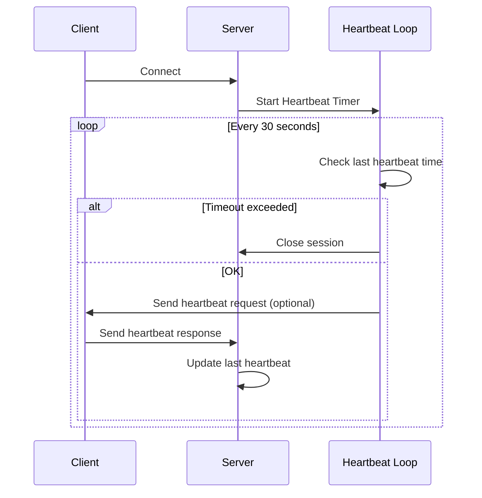
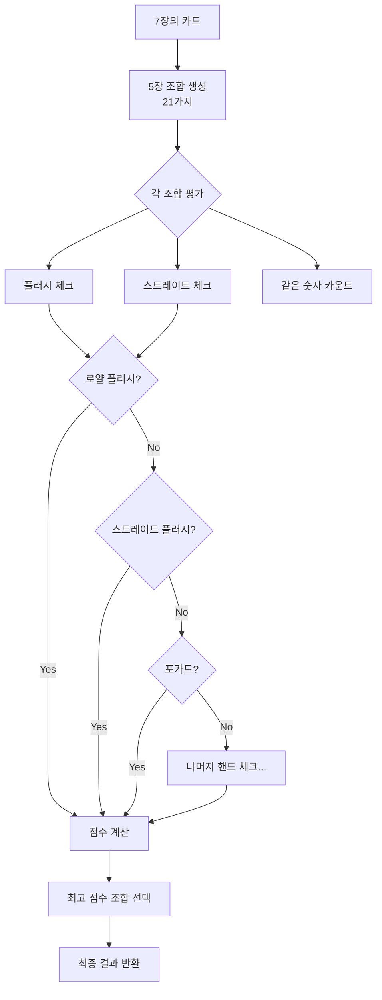
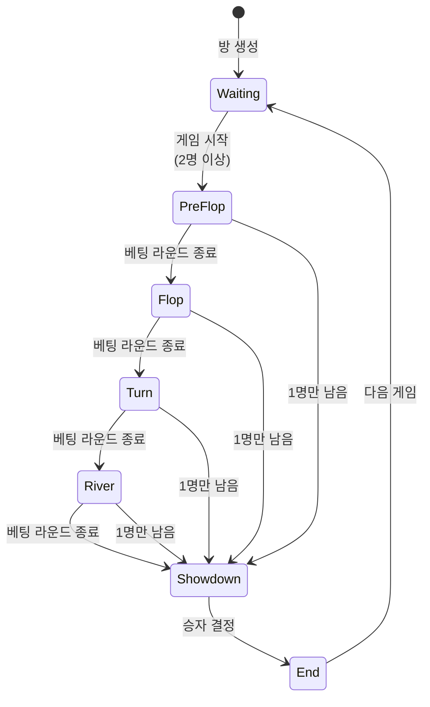

# Go 게임 서버 프로그래밍 - 소켓 기반 멀티플레이 게임 서버 개발  

저자: 최흥배, AI-Assisted   
    
권장 개발 환경
- **IDE**: Visual Studio Code
- **버전**: 1.25
- **OS**: Windows 10 이상

-----    
  
# Chapter 20. 포커 게임 설계

구현에 앞서 포커 게임의 전체 설계를 명확히 정의하는 것이 중요하다. 이 장에서는 텍사스 홀덤 포커의 규칙을 정리하고, 게임 상태 머신을 설계하며, 데이터 모델과 프로토콜을 명세한다. 명확한 설계는 구현 단계에서 발생할 수 있는 혼란을 줄이고, 팀원 간 커뮤니케이션을 원활하게 한다.

## 20.1 텍사스 홀덤 룰 정리

텍사스 홀덤은 가장 인기 있는 포커 변형 중 하나다. 우리가 구현할 게임은 간소화된 버전으로, 2~6명의 플레이어가 참여할 수 있다.

### 기본 규칙

**카드 구성**: 52장의 표준 카드 덱을 사용한다. 조커는 사용하지 않는다.

**플레이어**: 최소 2명, 최대 6명이 한 게임에 참여한다.

**홀 카드**: 각 플레이어는 2장의 개인 카드를 받는다. 이 카드는 다른 플레이어에게 공개되지 않는다.

**커뮤니티 카드**: 모든 플레이어가 공유하는 5장의 카드다. 플롭(3장), 턴(1장), 리버(1장) 순서로 공개된다.

**핸드 구성**: 플레이어는 자신의 홀 카드 2장과 커뮤니티 카드 5장 중 최고의 5장 조합을 만든다.

### 게임 진행 순서

```
게임 시작
    │
    ▼
┌─────────────────┐
│  1. 블라인드    │  ← 스몰/빅 블라인드 배팅
└────────┬────────┘
         ▼
┌─────────────────┐
│  2. 홀 카드     │  ← 각 플레이어에게 2장 분배
└────────┬────────┘
         ▼
┌─────────────────┐
│  3. 프리플롭    │  ← 첫 번째 베팅 라운드
└────────┬────────┘
         ▼
┌─────────────────┐
│  4. 플롭        │  ← 커뮤니티 카드 3장 공개
└────────┬────────┘
         ▼
┌─────────────────┐
│  5. 플롭 베팅   │  ← 두 번째 베팅 라운드
└────────┬────────┘
         ▼
┌─────────────────┐
│  6. 턴          │  ← 커뮤니티 카드 1장 공개
└────────┬────────┘
         ▼
┌─────────────────┐
│  7. 턴 베팅     │  ← 세 번째 베팅 라운드
└────────┬────────┘
         ▼
┌─────────────────┐
│  8. 리버        │  ← 커뮤니티 카드 1장 공개
└────────┬────────┘
         ▼
┌─────────────────┐
│  9. 리버 베팅   │  ← 네 번째 베팅 라운드
└────────┬────────┘
         ▼
┌─────────────────┐
│ 10. 쇼다운      │  ← 핸드 비교 및 승자 결정
└────────┬────────┘
         ▼
      게임 종료
```

### 베팅 액션

플레이어는 자신의 턴에 다음 액션 중 하나를 선택할 수 있다.

**폴드(Fold)**: 게임을 포기한다. 해당 라운드에서 더 이상 참여하지 않는다.

**체크(Check)**: 베팅하지 않고 다음 플레이어에게 턴을 넘긴다. 현재 베팅이 없을 때만 가능하다.

**콜(Call)**: 현재 베팅 금액과 같은 금액을 베팅한다.

**레이즈(Raise)**: 현재 베팅보다 더 높은 금액을 베팅한다.

**올인(All-in)**: 자신의 모든 칩을 베팅한다.

### 핸드 랭킹

높은 순서대로 나열한다.

```
1. 로얄 플러시 (Royal Flush)
   A♠ K♠ Q♠ J♠ 10♠
   같은 무늬의 A, K, Q, J, 10

2. 스트레이트 플러시 (Straight Flush)
   9♥ 8♥ 7♥ 6♥ 5♥
   같은 무늬의 연속된 5장

3. 포 카드 (Four of a Kind)
   K♠ K♥ K♦ K♣ 3♠
   같은 숫자 4장

4. 풀 하우스 (Full House)
   Q♠ Q♥ Q♦ 7♣ 7♠
   같은 숫자 3장 + 같은 숫자 2장

5. 플러시 (Flush)
   K♦ J♦ 9♦ 6♦ 3♦
   같은 무늬 5장

6. 스트레이트 (Straight)
   9♠ 8♥ 7♦ 6♣ 5♠
   연속된 숫자 5장

7. 트리플 (Three of a Kind)
   8♠ 8♥ 8♦ K♣ 3♠
   같은 숫자 3장

8. 투 페어 (Two Pair)
   J♠ J♥ 5♦ 5♣ K♠
   같은 숫자 2장씩 2쌍

9. 원 페어 (One Pair)
   10♠ 10♥ A♦ 7♣ 3♠
   같은 숫자 2장

10. 하이 카드 (High Card)
    A♠ Q♥ 9♦ 6♣ 2♠
    위의 어떤 조합도 아닌 경우
```

### 간소화된 규칙

우리 구현에서는 다음과 같이 규칙을 간소화한다.

- 블라인드는 고정 금액으로 설정한다.
- 베팅 제한은 노 리밋(No Limit) 방식을 사용한다.
- 사이드 팟(Side Pot)은 구현하지 않는다. 올인한 플레이어는 메인 팟에서만 승리할 수 있다.
- 타임 뱅크(Time Bank)는 구현하지 않고, 간단한 턴 타임아웃만 적용한다.

## 20.2 게임 상태 머신 설계

게임의 상태 전이를 명확히 정의하여 버그를 줄이고 로직을 단순화할 수 있다. 포커 게임은 상태 머신으로 모델링하기 적합하다.

### 게임 상태 정의

```go
// GameState는 게임의 현재 상태를 나타낸다.
type GameState int

const (
    // StateWaiting은 게임 시작을 대기 중인 상태다.
    StateWaiting GameState = iota
    
    // StateBlindBetting은 블라인드 베팅 상태다.
    StateBlindBetting
    
    // StatePreFlop은 홀 카드 분배 후 첫 베팅 라운드다.
    StatePreFlop
    
    // StateFlop은 플롭(커뮤니티 카드 3장) 공개 후 베팅 라운드다.
    StateFlop
    
    // StateTurn은 턴(커뮤니티 카드 4번째) 공개 후 베팅 라운드다.
    StateTurn
    
    // StateRiver는 리버(커뮤니티 카드 5번째) 공개 후 베팅 라운드다.
    StateRiver
    
    // StateShowdown은 모든 베팅이 끝난 후 핸드를 비교하는 상태다.
    StateShowdown
    
    // StateFinished는 게임이 종료된 상태다.
    StateFinished
)
```

### 상태 전이 다이어그램

```
                    ┌──────────────┐
                    │   Waiting    │ ← 플레이어 대기
                    └──────┬───────┘
                           │ 게임 시작 (최소 2명)
                           ▼
                    ┌──────────────┐
                    │BlindBetting  │ ← 블라인드 베팅
                    └──────┬───────┘
                           │ 블라인드 완료
                           ▼
                    ┌──────────────┐
                    │   PreFlop    │ ← 홀 카드 분배 및 베팅
                    └──────┬───────┘
                           │ 베팅 라운드 종료
                           ▼
      ┌────────────────────┼────────────────────┐
      │ 1명 제외 모두 폴드?│                    │
      ▼ Yes                │ No                 ▼
┌──────────┐               │            ┌──────────────┐
│Finished  │               │            │    Flop      │ ← 3장 공개
└──────────┘               │            └──────┬───────┘
                           │                   │ 베팅 라운드 종료
                           │                   ▼
                           │            ┌──────────────┐
                           │            │    Turn      │ ← 1장 공개
                           │            └──────┬───────┘
                           │                   │ 베팅 라운드 종료
                           │                   ▼
                           │            ┌──────────────┐
                           │            │    River     │ ← 1장 공개
                           │            └──────┬───────┘
                           │                   │ 베팅 라운드 종료
                           │                   ▼
                           │            ┌──────────────┐
                           └────────────│  Showdown    │ ← 핸드 비교
                                        └──────┬───────┘
                                               │ 승자 결정
                                               ▼
                                        ┌──────────────┐
                                        │  Finished    │
                                        └──────────────┘
```

### 플레이어 상태 정의

게임 상태와 별도로 각 플레이어도 자체 상태를 가진다.

```go
// PlayerState는 플레이어의 현재 상태를 나타낸다.
type PlayerState int

const (
    // PlayerStateActive는 활성 상태로 게임에 참여 중이다.
    PlayerStateActive PlayerState = iota
    
    // PlayerStateFolded는 폴드하여 현재 라운드에 참여하지 않는다.
    PlayerStateFolded
    
    // PlayerStateAllIn은 올인 상태로 더 이상 베팅할 수 없다.
    PlayerStateAllIn
    
    // PlayerStateDisconnected는 연결이 끊긴 상태다.
    PlayerStateDisconnected
)
```

### 상태 전이 규칙

상태 전이는 다음 규칙을 따른다.

```go
// 상태 전이 규칙 예시
var stateTransitions = map[GameState][]GameState{
    StateWaiting: {StateBlindBetting},
    StateBlindBetting: {StatePreFlop, StateFinished},
    StatePreFlop: {StateFlop, StateFinished},
    StateFlop: {StateTurn, StateFinished},
    StateTurn: {StateRiver, StateFinished},
    StateRiver: {StateShowdown},
    StateShowdown: {StateFinished},
    StateFinished: {StateWaiting}, // 새 게임 시작 가능
}

// IsValidTransition은 상태 전이가 유효한지 검증한다.
func IsValidTransition(from, to GameState) bool {
    validStates, exists := stateTransitions[from]
    if !exists {
        return false
    }
    
    for _, validState := range validStates {
        if validState == to {
            return true
        }
    }
    return false
}
```

## 20.3 데이터 모델 정의

게임에 필요한 모든 데이터 구조를 명확히 정의한다. `poker-logic/model/model.go` 파일을 생성한다.

```go
package model

import "time"

// Suit는 카드의 무늬를 나타낸다.
type Suit int

const (
    SuitSpades Suit = iota   // ♠ 스페이드
    SuitHearts               // ♥ 하트
    SuitDiamonds             // ♦ 다이아몬드
    SuitClubs                // ♣ 클로버
)

// String은 무늬의 문자열 표현을 반환한다.
func (s Suit) String() string {
    switch s {
    case SuitSpades:
        return "Spades"
    case SuitHearts:
        return "Hearts"
    case SuitDiamonds:
        return "Diamonds"
    case SuitClubs:
        return "Clubs"
    default:
        return "Unknown"
    }
}

// Rank는 카드의 숫자를 나타낸다.
type Rank int

const (
    RankTwo Rank = iota + 2  // 2부터 시작
    RankThree
    RankFour
    RankFive
    RankSix
    RankSeven
    RankEight
    RankNine
    RankTen
    RankJack
    RankQueen
    RankKing
    RankAce
)

// String은 숫자의 문자열 표현을 반환한다.
func (r Rank) String() string {
    switch r {
    case RankAce:
        return "A"
    case RankKing:
        return "K"
    case RankQueen:
        return "Q"
    case RankJack:
        return "J"
    case RankTen:
        return "10"
    default:
        return string('0' + byte(r))
    }
}

// Card는 카드를 나타낸다.
type Card struct {
    Suit Suit
    Rank Rank
}

// String은 카드의 문자열 표현을 반환한다.
// 예: "A♠", "K♥"
func (c Card) String() string {
    suitSymbol := map[Suit]string{
        SuitSpades:   "♠",
        SuitHearts:   "♥",
        SuitDiamonds: "♦",
        SuitClubs:    "♣",
    }
    return c.Rank.String() + suitSymbol[c.Suit]
}

// HandRank는 포커 핸드의 등급을 나타낸다.
type HandRank int

const (
    HandRankHighCard HandRank = iota
    HandRankOnePair
    HandRankTwoPair
    HandRankThreeOfAKind
    HandRankStraight
    HandRankFlush
    HandRankFullHouse
    HandRankFourOfAKind
    HandRankStraightFlush
    HandRankRoyalFlush
)

// String은 핸드 등급의 문자열 표현을 반환한다.
func (h HandRank) String() string {
    names := []string{
        "High Card",
        "One Pair",
        "Two Pair",
        "Three of a Kind",
        "Straight",
        "Flush",
        "Full House",
        "Four of a Kind",
        "Straight Flush",
        "Royal Flush",
    }
    if int(h) < len(names) {
        return names[h]
    }
    return "Unknown"
}

// Hand는 플레이어의 최종 핸드를 나타낸다.
type Hand struct {
    Rank  HandRank  // 핸드 등급
    Cards []Card    // 핸드를 구성하는 5장의 카드
    Kickers []Rank  // 키커(동점 판정용)
}

// Player는 게임에 참여하는 플레이어를 나타낸다.
type Player struct {
    ID           string       // 플레이어 고유 ID
    Name         string       // 플레이어 이름
    Chips        int          // 보유 칩
    HoleCards    []Card       // 홀 카드 (2장)
    State        PlayerState  // 현재 상태
    CurrentBet   int          // 현재 라운드에서 베팅한 금액
    TotalBet     int          // 게임 전체에서 베팅한 총 금액
    Position     int          // 테이블에서의 위치 (0부터 시작)
    IsDealer     bool         // 딜러 버튼 여부
    IsSmallBlind bool         // 스몰 블라인드 여부
    IsBigBlind   bool         // 빅 블라인드 여부
}

// PlayerState는 플레이어의 상태를 나타낸다.
type PlayerState int

const (
    PlayerStateActive PlayerState = iota
    PlayerStateFolded
    PlayerStateAllIn
    PlayerStateDisconnected
)

// BettingAction은 베팅 액션을 나타낸다.
type BettingAction int

const (
    ActionFold BettingAction = iota
    ActionCheck
    ActionCall
    ActionRaise
    ActionAllIn
)

// String은 액션의 문자열 표현을 반환한다.
func (a BettingAction) String() string {
    names := []string{"Fold", "Check", "Call", "Raise", "All-in"}
    if int(a) < len(names) {
        return names[a]
    }
    return "Unknown"
}

// BettingRound는 베팅 라운드 정보를 나타낸다.
type BettingRound struct {
    CurrentBet    int              // 현재 베팅 금액
    MinRaise      int              // 최소 레이즈 금액
    Actions       []PlayerAction   // 플레이어 액션 기록
    ActivePlayers int              // 활성 플레이어 수
}

// PlayerAction은 플레이어의 액션을 기록한다.
type PlayerAction struct {
    PlayerID  string         // 플레이어 ID
    Action    BettingAction  // 액션 종류
    Amount    int            // 베팅 금액
    Timestamp time.Time      // 액션 시간
}

// GameState는 게임의 전체 상태를 나타낸다.
type GameState int

const (
    StateWaiting GameState = iota
    StateBlindBetting
    StatePreFlop
    StateFlop
    StateTurn
    StateRiver
    StateShowdown
    StateFinished
)

// String은 게임 상태의 문자열 표현을 반환한다.
func (g GameState) String() string {
    names := []string{
        "Waiting",
        "Blind Betting",
        "Pre-Flop",
        "Flop",
        "Turn",
        "River",
        "Showdown",
        "Finished",
    }
    if int(g) < len(names) {
        return names[g]
    }
    return "Unknown"
}

// Game은 포커 게임의 전체 상태를 나타낸다.
type Game struct {
    RoomID         string          // 방 ID
    State          GameState       // 현재 게임 상태
    Players        []*Player       // 참여 플레이어 목록
    Deck           []Card          // 카드 덱
    CommunityCards []Card          // 커뮤니티 카드
    Pot            int             // 팟(총 베팅 금액)
    DealerPosition int             // 딜러 위치
    CurrentPlayer  int             // 현재 턴인 플레이어 위치
    BettingRound   *BettingRound   // 현재 베팅 라운드 정보
    SmallBlind     int             // 스몰 블라인드 금액
    BigBlind       int             // 빅 블라인드 금액
    StartTime      time.Time       // 게임 시작 시간
}

// GameResult는 게임 결과를 나타낸다.
type GameResult struct {
    Winners []WinnerInfo  // 승자 정보 (여러 명일 수 있음)
    Pot     int           // 총 팟 금액
}

// WinnerInfo는 승자 정보를 나타낸다.
type WinnerInfo struct {
    PlayerID   string    // 플레이어 ID
    PlayerName string    // 플레이어 이름
    Hand       Hand      // 승리한 핸드
    WinAmount  int       // 획득 금액
}

// RoomConfig는 방 설정을 나타낸다.
type RoomConfig struct {
    MaxPlayers int  // 최대 플레이어 수
    MinPlayers int  // 최소 플레이어 수 (게임 시작)
    SmallBlind int  // 스몰 블라인드 금액
    BigBlind   int  // 빅 블라인드 금액
    BuyIn      int  // 초기 칩 금액
    TurnTimeout int  // 턴 타임아웃 (초)
}

// DefaultRoomConfig는 기본 방 설정을 반환한다.
func DefaultRoomConfig() RoomConfig {
    return RoomConfig{
        MaxPlayers:  6,
        MinPlayers:  2,
        SmallBlind:  10,
        BigBlind:    20,
        BuyIn:       1000,
        TurnTimeout: 30,
    }
}
```

이 데이터 모델은 게임의 모든 측면을 표현할 수 있도록 설계되었다. 각 구조체는 명확한 책임을 가지며, 게임 로직에서 쉽게 사용할 수 있다.

## 20.4 프로토콜 명세서 작성

클라이언트와 서버 간 통신에 사용될 패킷 프로토콜을 명세한다. 명확한 프로토콜 정의는 클라이언트와 서버 개발자 간 협업을 원활하게 한다.

### 패킷 ID 정의

`poker-game/protocol/packet_id.go` 파일을 생성한다.

```go
package protocol

// PacketID는 패킷의 고유 식별자다.
type PacketID uint16

const (
    // 클라이언트 → 서버 패킷 (1~999)
    
    // 로그인/인증
    PacketLoginRequest PacketID = 1
    
    // 방 관리
    PacketRoomListRequest    PacketID = 10
    PacketRoomCreateRequest  PacketID = 11
    PacketRoomJoinRequest    PacketID = 12
    PacketRoomLeaveRequest   PacketID = 13
    
    // 게임 액션
    PacketGameReadyRequest   PacketID = 20
    PacketBettingAction      PacketID = 21
    
    // 서버 → 클라이언트 패킷 (1000~1999)
    
    // 로그인/인증
    PacketLoginResponse PacketID = 1000
    
    // 방 관리
    PacketRoomListResponse   PacketID = 1010
    PacketRoomCreateResponse PacketID = 1011
    PacketRoomJoinResponse   PacketID = 1012
    PacketRoomLeaveResponse  PacketID = 1013
    PacketRoomPlayerJoined   PacketID = 1014  // 다른 플레이어 입장 알림
    PacketRoomPlayerLeft     PacketID = 1015  // 다른 플레이어 퇴장 알림
    
    // 게임 진행
    PacketGameStart          PacketID = 1020  // 게임 시작
    PacketCardDealt          PacketID = 1021  // 카드 분배
    PacketCommunityCards     PacketID = 1022  // 커뮤니티 카드 공개
    PacketTurnChanged        PacketID = 1023  // 턴 변경
    PacketBettingActionNotify PacketID = 1024  // 베팅 액션 알림
    PacketGameResult         PacketID = 1025  // 게임 결과
    PacketGameStateChanged   PacketID = 1026  // 게임 상태 변경
    
    // 에러
    PacketError PacketID = 9999
)
```

### 패킷 구조 정의

각 패킷의 상세 구조를 정의한다. `poker-game/protocol/packets.go` 파일을 생성한다.

```go
package protocol

import (
    "encoding/json"
    
    "github.com/yourusername/poker-logic/model"
)

// BasePacket는 모든 패킷의 기본 인터페이스다.
type BasePacket interface {
    GetID() PacketID
    Serialize() ([]byte, error)
    Deserialize(data []byte) error
}

// ===== 클라이언트 → 서버 패킷 =====

// LoginRequest는 로그인 요청 패킷이다.
type LoginRequest struct {
    PlayerName string `json:"playerName"`  // 플레이어 이름
}

func (p *LoginRequest) GetID() PacketID { return PacketLoginRequest }

func (p *LoginRequest) Serialize() ([]byte, error) {
    return json.Marshal(p)
}

func (p *LoginRequest) Deserialize(data []byte) error {
    return json.Unmarshal(data, p)
}

// RoomJoinRequest는 방 입장 요청 패킷이다.
type RoomJoinRequest struct {
    RoomID string `json:"roomId"`  // 방 ID
}

func (p *RoomJoinRequest) GetID() PacketID { return PacketRoomJoinRequest }

func (p *RoomJoinRequest) Serialize() ([]byte, error) {
    return json.Marshal(p)
}

func (p *RoomJoinRequest) Deserialize(data []byte) error {
    return json.Unmarshal(data, p)
}

// BettingActionRequest는 베팅 액션 요청 패킷이다.
type BettingActionRequest struct {
    Action model.BettingAction `json:"action"`  // 액션 종류
    Amount int                 `json:"amount"`  // 베팅 금액 (레이즈/올인)
}

func (p *BettingActionRequest) GetID() PacketID { return PacketBettingAction }

func (p *BettingActionRequest) Serialize() ([]byte, error) {
    return json.Marshal(p)
}

func (p *BettingActionRequest) Deserialize(data []byte) error {
    return json.Unmarshal(data, p)
}

// ===== 서버 → 클라이언트 패킷 =====

// LoginResponse는 로그인 응답 패킷이다.
type LoginResponse struct {
    Success  bool   `json:"success"`   // 성공 여부
    PlayerID string `json:"playerId"`  // 플레이어 ID
    Message  string `json:"message"`   // 메시지
}

func (p *LoginResponse) GetID() PacketID { return PacketLoginResponse }

func (p *LoginResponse) Serialize() ([]byte, error) {
    return json.Marshal(p)
}

func (p *LoginResponse) Deserialize(data []byte) error {
    return json.Unmarshal(data, p)
}

// GameStartNotify는 게임 시작 알림 패킷이다.
type GameStartNotify struct {
    RoomID         string            `json:"roomId"`
    Players        []PlayerInfo      `json:"players"`
    DealerPosition int               `json:"dealerPosition"`
    SmallBlind     int               `json:"smallBlind"`
    BigBlind       int               `json:"bigBlind"`
}

type PlayerInfo struct {
    PlayerID string `json:"playerId"`
    Name     string `json:"name"`
    Chips    int    `json:"chips"`
    Position int    `json:"position"`
}

func (p *GameStartNotify) GetID() PacketID { return PacketGameStart }

func (p *GameStartNotify) Serialize() ([]byte, error) {
    return json.Marshal(p)
}

func (p *GameStartNotify) Deserialize(data []byte) error {
    return json.Unmarshal(data, p)
}

// CardDealtNotify는 카드 분배 알림 패킷이다.
type CardDealtNotify struct {
    Cards []CardInfo `json:"cards"`  // 받은 카드 (2장)
}

type CardInfo struct {
    Suit int `json:"suit"`  // 무늬 (0~3)
    Rank int `json:"rank"`  // 숫자 (2~14)
}

func (p *CardDealtNotify) GetID() PacketID { return PacketCardDealt }

func (p *CardDealtNotify) Serialize() ([]byte, error) {
    return json.Marshal(p)
}

func (p *CardDealtNotify) Deserialize(data []byte) error {
    return json.Unmarshal(data, p)
}

// CommunityCardsNotify는 커뮤니티 카드 공개 알림 패킷이다.
type CommunityCardsNotify struct {
    Cards     []CardInfo      `json:"cards"`      // 현재까지 공개된 모든 커뮤니티 카드
    GameState model.GameState `json:"gameState"`  // 현재 게임 상태
}

func (p *CommunityCardsNotify) GetID() PacketID { return PacketCommunityCards }

func (p *CommunityCardsNotify) Serialize() ([]byte, error) {
    return json.Marshal(p)
}

func (p *CommunityCardsNotify) Deserialize(data []byte) error {
    return json.Unmarshal(data, p)
}

// TurnChangedNotify는 턴 변경 알림 패킷이다.
type TurnChangedNotify struct {
    PlayerID    string `json:"playerId"`     // 현재 턴인 플레이어 ID
    TimeLimit   int    `json:"timeLimit"`    // 제한 시간 (초)
    CurrentBet  int    `json:"currentBet"`   // 현재 베팅 금액
    MinRaise    int    `json:"minRaise"`     // 최소 레이즈 금액
    CallAmount  int    `json:"callAmount"`   // 콜에 필요한 금액
}

func (p *TurnChangedNotify) GetID() PacketID { return PacketTurnChanged }

func (p *TurnChangedNotify) Serialize() ([]byte, error) {
    return json.Marshal(p)
}

func (p *TurnChangedNotify) Deserialize(data []byte) error {
    return json.Unmarshal(data, p)
}

// BettingActionNotify는 베팅 액션 알림 패킷이다.
type BettingActionNotify struct {
    PlayerID   string              `json:"playerId"`    // 액션한 플레이어 ID
    PlayerName string              `json:"playerName"`  // 플레이어 이름
    Action     model.BettingAction `json:"action"`      // 액션 종류
    Amount     int                 `json:"amount"`      // 베팅 금액
    TotalPot   int                 `json:"totalPot"`    // 현재 총 팟
}

func (p *BettingActionNotify) GetID() PacketID { return PacketBettingActionNotify }

func (p *BettingActionNotify) Serialize() ([]byte, error) {
    return json.Marshal(p)
}

func (p *BettingActionNotify) Deserialize(data []byte) error {
    return json.Unmarshal(data, p)
}

// GameResultNotify는 게임 결과 알림 패킷이다.
type GameResultNotify struct {
    Winners       []WinnerInfo `json:"winners"`        // 승자 정보
    CommunityCards []CardInfo  `json:"communityCards"` // 커뮤니티 카드
    PlayerHands   []PlayerHand `json:"playerHands"`    // 모든 플레이어의 핸드
}

type WinnerInfo struct {
    PlayerID   string     `json:"playerId"`
    PlayerName string     `json:"playerName"`
    WinAmount  int        `json:"winAmount"`
    HandRank   string     `json:"handRank"`   // 핸드 이름
    HandCards  []CardInfo `json:"handCards"`  // 핸드를 구성하는 카드
}

type PlayerHand struct {
    PlayerID  string     `json:"playerId"`
    HoleCards []CardInfo `json:"holeCards"`  // 홀 카드
    HandRank  string     `json:"handRank"`   // 핸드 이름
}

func (p *GameResultNotify) GetID() PacketID { return PacketGameResult }

func (p *GameResultNotify) Serialize() ([]byte, error) {
    return json.Marshal(p)
}

func (p *GameResultNotify) Deserialize(data []byte) error {
    return json.Unmarshal(data, p)
}

// ErrorNotify는 에러 알림 패킷이다.
type ErrorNotify struct {
    Code    int    `json:"code"`     // 에러 코드
    Message string `json:"message"`  // 에러 메시지
}

func (p *ErrorNotify) GetID() PacketID { return PacketError }

func (p *ErrorNotify) Serialize() ([]byte, error) {
    return json.Marshal(p)
}

func (p *ErrorNotify) Deserialize(data []byte) error {
    return json.Unmarshal(data, p)
}
```

### 프로토콜 문서

프로토콜을 표 형식으로 정리한 문서도 작성한다. `PROTOCOL.md` 파일을 생성한다.

```markdown
# 포커 게임 프로토콜 명세서

## 패킷 구조

모든 패킷은 다음 구조를 따른다:

```
+--------+--------+----------+
| Size   | ID     | Body     |
| 4bytes | 2bytes | N bytes  |
+--------+--------+----------+
```

- Size: 전체 패킷 크기 (헤더 포함, Big Endian)
- ID: 패킷 ID (Big Endian)
- Body: JSON 형식의 패킷 데이터

## 클라이언트 → 서버 패킷

| ID | 이름 | 설명 |
|----|------|------|
| 1 | LoginRequest | 로그인 요청 |
| 10 | RoomListRequest | 방 목록 조회 |
| 11 | RoomCreateRequest | 방 생성 |
| 12 | RoomJoinRequest | 방 입장 |
| 13 | RoomLeaveRequest | 방 퇴장 |
| 20 | GameReadyRequest | 게임 준비 완료 |
| 21 | BettingAction | 베팅 액션 |

## 서버 → 클라이언트 패킷

| ID | 이름 | 설명 |
|----|------|------|
| 1000 | LoginResponse | 로그인 응답 |
| 1020 | GameStart | 게임 시작 알림 |
| 1021 | CardDealt | 카드 분배 알림 |
| 1022 | CommunityCards | 커뮤니티 카드 공개 |
| 1023 | TurnChanged | 턴 변경 알림 |
| 1024 | BettingActionNotify | 베팅 액션 알림 |
| 1025 | GameResult | 게임 결과 |
| 9999 | Error | 에러 메시지 |
```

## 20.5 시퀀스 다이어그램

게임의 주요 시나리오를 시퀀스 다이어그램으로 표현한다. 이를 통해 전체 흐름을 한눈에 파악할 수 있다.

### 게임 시작 시퀀스

```
플레이어A    플레이어B    서버         게임로직
    │            │          │             │
    │  Join Room │          │             │
    ├───────────────────────>│             │
    │            │          │             │
    │            │ Join Room│             │
    │            ├──────────>│             │
    │            │          │             │
    │<────────────────────────  RoomPlayerJoined
    │            │          │             │
    │            │<──────────  RoomPlayerJoined
    │            │          │             │
    │  Ready     │          │             │
    ├───────────────────────>│             │
    │            │  Ready   │             │
    │            ├──────────>│             │
    │            │          │ Start Game  │
    │            │          ├────────────>│
    │            │          │             │
    │<────────────────────────  GameStart │
    │            │<─────────── GameStart  │
    │            │          │<────────────│
    │            │          │             │
    │<────────────────────────  CardDealt │
    │            │<─────────── CardDealt  │
    │            │          │             │
```

### 베팅 라운드 시퀀스

```
플레이어A    플레이어B    서버         게임로직
    │            │          │             │
    │<────────────────────────  TurnChanged (A)
    │            │<─────────── TurnChanged (A)
    │            │          │             │
    │  Raise 100 │          │             │
    ├───────────────────────>│ ProcessBet │
    │            │          ├────────────>│
    │            │          │  Validate   │
    │            │          │<────────────│
    │            │          │             │
    │<────────────────────────  BettingActionNotify
    │            │<─────────── BettingActionNotify
    │            │          │             │
    │<────────────────────────  TurnChanged (B)
    │            │<─────────── TurnChanged (B)
    │            │          │             │
    │            │  Call 100│             │
    │            ├──────────>│ ProcessBet │
    │            │          ├────────────>│
    │            │          │<────────────│
    │            │          │             │
    │<────────────────────────  BettingActionNotify
    │            │<─────────── BettingActionNotify
    │            │          │             │
    │            │          │ Next Round  │
    │            │          ├────────────>│
    │            │          │             │
    │<────────────────────────  CommunityCards (Flop)
    │            │<─────────── CommunityCards (Flop)
    │            │          │             │
```

### 게임 종료 시퀀스

```
플레이어A    플레이어B    서버         게임로직
    │            │          │             │
    │            │          │ All Bets   │
    │            │          │ Completed  │
    │            │          ├────────────>│
    │            │          │ Evaluate   │
    │            │          │ Hands      │
    │            │          │<────────────│
    │            │          │             │
    │<────────────────────────  GameResult │
    │            │<─────────── GameResult  │
    │            │          │             │
    │            │          │ Update      │
    │            │          │ Chips       │
    │            │          ├────────────>│
    │            │          │<────────────│
    │            │          │             │
    │            │          │ Reset Game  │
    │            │          ├────────────>│
    │            │          │<────────────│
    │            │          │             │
```

### 에러 처리 시퀀스

```
플레이어A    서버         게임로직
    │          │             │
    │ Invalid  │             │
    │ Action   │             │
    ├──────────>│ Validate   │
    │          ├────────────>│
    │          │  Error      │
    │          │<────────────│
    │          │             │
    │<───────── ErrorNotify  │
    │          │             │
    │          │ Log Error   │
    │          ├────────────>│
    │          │             │
```

---

## 정리

이 장에서는 포커 게임의 전체 설계를 완성했다. 주요 내용은 다음과 같다.

### 게임 규칙

- 텍사스 홀덤 기본 규칙 정리
- 간소화된 규칙 정의
- 핸드 랭킹 체계

### 상태 머신

```
게임 상태 흐름
Waiting → BlindBetting → PreFlop → Flop → 
Turn → River → Showdown → Finished
```

### 데이터 모델

- Card, Player, Game 등 핵심 데이터 구조
- 명확한 타입 정의와 상수
- 확장 가능한 구조 설계

### 프로토콜

- 클라이언트-서버 통신 패킷 정의
- JSON 기반 직렬화
- 명확한 패킷 ID 체계

### 시퀀스

- 게임 시작부터 종료까지의 전체 흐름
- 베팅 라운드 상호작용
- 에러 처리 시나리오

이러한 설계는 다음 장들에서 실제 구현의 청사진이 된다. 명확한 설계 문서는 팀원 간 커뮤니케이션을 원활하게 하고, 구현 과정에서 발생할 수 있는 혼란을 최소화한다. 다음 장에서는 네트워크 라이브러리의 실제 구현을 시작한다.

   
# Chapter 21. 네트워크 라이브러리 구현

이 장에서는 실제로 사용할 수 있는 네트워크 라이브러리를 처음부터 구현한다. 게임 서버에서 재사용 가능한 컴포넌트로 설계하며, 실전에서 필요한 핵심 기능들을 모두 포함한다.

## 21.1 프로젝트 생성 및 구조

### 21.1.1 디렉토리 구조 설계

네트워크 라이브러리는 게임 로직과 분리된 독립적인 모듈이다. 다음과 같은 디렉토리 구조로 구성한다.

```
D:\GoProjects\
├── network-lib\           # 네트워크 라이브러리 프로젝트
│   ├── go.mod
│   ├── server\            # TCP 서버 구현
│   │   ├── listener.go
│   │   └── config.go
│   ├── session\           # 세션 관리
│   │   ├── session.go
│   │   ├── manager.go
│   │   └── heartbeat.go
│   ├── packet\            # 패킷 처리
│   │   ├── packet.go
│   │   ├── processor.go
│   │   └── handler.go
│   └── logger\            # 로깅
│       └── logger.go
│
└── poker-game\            # 게임 서버 프로젝트 (나중에 생성)
    └── go.mod
```

### 21.1.2 모듈 초기화

먼저 네트워크 라이브러리 프로젝트를 생성한다.

```bash
# Windows PowerShell 또는 명령 프롬프트에서 실행
cd D:\GoProjects
mkdir network-lib
cd network-lib
go mod init github.com/yourusername/network-lib
```

`go.mod` 파일이 생성되면 다음과 같은 내용을 확인할 수 있다.

```go
module github.com/yourusername/network-lib

go 1.25
```

### 21.1.3 패키지 구조 설명

각 패키지의 역할을 명확히 정의한다.

```
┌─────────────────────────────────────────┐
│          Application Layer              │
│      (poker-game 프로젝트)              │
└─────────────────┬───────────────────────┘
                  │ uses
┌─────────────────▼───────────────────────┐
│       Network Library Layer             │
│                                          │
│  ┌──────────┐  ┌──────────┐            │
│  │  Server  │  │ Session  │            │
│  │ Package  │──│ Package  │            │
│  └──────────┘  └──────────┘            │
│       │             │                   │
│       └──────┬──────┘                   │
│              │                          │
│       ┌──────▼──────┐                   │
│       │   Packet    │                   │
│       │   Package   │                   │
│       └─────────────┘                   │
└──────────────────────────────────────────┘
```

- **server 패키지**: TCP 리스너를 관리하고 새로운 연결을 수락한다
- **session 패키지**: 클라이언트 연결(세션)의 생명주기를 관리한다
- **packet 패키지**: 패킷의 인코딩/디코딩과 처리를 담당한다
- **logger 패키지**: 통합 로깅 기능을 제공한다

---

## 21.2 TCP 리스너 구현

### 21.2.1 서버 설정 구조체

먼저 서버 설정을 위한 구조체를 정의한다.

**파일: `server/config.go`**

```go
package server

import "time"

// Config는 TCP 서버의 설정을 담는 구조체다.
type Config struct {
    // 서버가 바인딩할 주소 (예: "0.0.0.0:8080")
    Address string
    
    // 최대 동시 연결 수
    MaxConnections int
    
    // 읽기 타임아웃 (0이면 타임아웃 없음)
    ReadTimeout time.Duration
    
    // 쓰기 타임아웃 (0이면 타임아웃 없음)
    WriteTimeout time.Duration
    
    // 하트비트 간격 (0이면 하트비트 비활성화)
    HeartbeatInterval time.Duration
    
    // 하트비트 타임아웃 (이 시간 동안 응답 없으면 연결 종료)
    HeartbeatTimeout time.Duration
}

// DefaultConfig는 기본 서버 설정을 반환한다.
func DefaultConfig() *Config {
    return &Config{
        Address:           "0.0.0.0:8080",
        MaxConnections:    10000,
        ReadTimeout:       30 * time.Second,
        WriteTimeout:      30 * time.Second,
        HeartbeatInterval: 30 * time.Second,
        HeartbeatTimeout:  90 * time.Second,
    }
}

// Validate는 설정 값의 유효성을 검증한다.
func (c *Config) Validate() error {
    if c.Address == "" {
        return ErrInvalidAddress
    }
    
    if c.MaxConnections <= 0 {
        return ErrInvalidMaxConnections
    }
    
    if c.HeartbeatInterval > 0 && c.HeartbeatTimeout <= c.HeartbeatInterval {
        return ErrInvalidHeartbeatConfig
    }
    
    return nil
}
```

### 21.2.2 에러 정의

서버에서 사용할 에러들을 미리 정의한다.

**파일: `server/errors.go`**

```go
package server

import "errors"

var (
    // 설정 관련 에러
    ErrInvalidAddress         = errors.New("invalid server address")
    ErrInvalidMaxConnections  = errors.New("max connections must be positive")
    ErrInvalidHeartbeatConfig = errors.New("heartbeat timeout must be greater than interval")
    
    // 서버 상태 관련 에러
    ErrServerNotRunning = errors.New("server is not running")
    ErrServerAlreadyRunning = errors.New("server is already running")
    
    // 연결 관련 에러
    ErrMaxConnectionsReached = errors.New("maximum connections reached")
    ErrConnectionClosed = errors.New("connection closed")
)
```

### 21.2.3 TCP 리스너 구현

이제 핵심인 TCP 서버를 구현한다.

**파일: `server/listener.go`**

```go
package server

import (
    "context"
    "fmt"
    "net"
    "sync"
    "sync/atomic"
    
    "github.com/yourusername/network-lib/logger"
    "github.com/yourusername/network-lib/session"
)

// Server는 TCP 게임 서버를 나타낸다.
type Server struct {
    config   *Config
    listener net.Listener
    
    // 세션 관리자
    sessionMgr *session.Manager
    
    // 서버 상태
    running atomic.Bool
    
    // graceful shutdown을 위한 WaitGroup
    wg sync.WaitGroup
    
    // shutdown 시그널을 위한 context
    ctx    context.Context
    cancel context.CancelFunc
}

// New는 새로운 TCP 서버를 생성한다.
func New(config *Config) (*Server, error) {
    if err := config.Validate(); err != nil {
        return nil, fmt.Errorf("invalid config: %w", err)
    }
    
    ctx, cancel := context.WithCancel(context.Background())
    
    return &Server{
        config:     config,
        sessionMgr: session.NewManager(config.MaxConnections),
        ctx:        ctx,
        cancel:     cancel,
    }, nil
}

// Start는 TCP 서버를 시작한다.
func (s *Server) Start() error {
    if s.running.Load() {
        return ErrServerAlreadyRunning
    }
    
    // TCP 리스너 시작
    listener, err := net.Listen("tcp", s.config.Address)
    if err != nil {
        return fmt.Errorf("failed to start listener: %w", err)
    }
    
    s.listener = listener
    s.running.Store(true)
    
    logger.Info("Server started on %s", s.config.Address)
    
    // Accept 루프를 별도 고루틴에서 실행
    s.wg.Add(1)
    go s.acceptLoop()
    
    return nil
}

// acceptLoop는 새로운 연결을 계속 수락한다.
func (s *Server) acceptLoop() {
    defer s.wg.Done()
    
    for {
        // context가 취소되었는지 확인
        select {
        case <-s.ctx.Done():
            logger.Info("Accept loop shutting down")
            return
        default:
        }
        
        // 새로운 연결 수락
        conn, err := s.listener.Accept()
        if err != nil {
            // 서버가 종료 중이면 에러 무시
            if !s.running.Load() {
                return
            }
            
            logger.Error("Failed to accept connection: %v", err)
            continue
        }
        
        // 최대 연결 수 확인
        if s.sessionMgr.Count() >= s.config.MaxConnections {
            logger.Warn("Max connections reached, rejecting %s", conn.RemoteAddr())
            conn.Close()
            continue
        }
        
        // 새로운 세션 처리
        s.wg.Add(1)
        go s.handleNewConnection(conn)
    }
}

// handleNewConnection은 새로운 연결을 처리한다.
func (s *Server) handleNewConnection(conn net.Conn) {
    defer s.wg.Done()
    
    // 세션 생성
    sess, err := s.sessionMgr.CreateSession(conn, s.config)
    if err != nil {
        logger.Error("Failed to create session: %v", err)
        conn.Close()
        return
    }
    
    logger.Info("New connection from %s (Session ID: %d)", 
        conn.RemoteAddr(), sess.ID())
    
    // 세션 시작 (별도 고루틴에서 실행됨)
    sess.Start(s.ctx)
}

// Shutdown은 서버를 우아하게 종료한다.
func (s *Server) Shutdown() error {
    if !s.running.Load() {
        return ErrServerNotRunning
    }
    
    logger.Info("Server shutting down...")
    
    // 더 이상 새로운 연결을 받지 않음
    s.running.Store(false)
    
    // 리스너 닫기
    if s.listener != nil {
        s.listener.Close()
    }
    
    // context 취소 (모든 고루틴에 종료 시그널)
    s.cancel()
    
    // 모든 세션 종료
    s.sessionMgr.CloseAll()
    
    // 모든 고루틴이 종료될 때까지 대기
    s.wg.Wait()
    
    logger.Info("Server shutdown complete")
    return nil
}

// SessionCount는 현재 활성 세션 수를 반환한다.
func (s *Server) SessionCount() int {
    return s.sessionMgr.Count()
}

// IsRunning은 서버가 실행 중인지 반환한다.
func (s *Server) IsRunning() bool {
    return s.running.Load()
}
```

**코드 설명:**

1. **atomic.Bool 사용**: `running` 필드는 여러 고루틴에서 동시에 접근할 수 있으므로 원자적 연산을 사용한다.

2. **WaitGroup**: graceful shutdown을 위해 모든 고루틴의 완료를 추적한다.

3. **Context**: shutdown 시그널을 모든 고루틴에 전파하기 위해 사용한다.

4. **Accept Loop**: 무한 루프로 새로운 연결을 계속 수락하지만, context가 취소되면 종료한다.

5. **연결 제한**: 최대 연결 수를 초과하면 새로운 연결을 거부한다.

---

## 21.3 세션 핸들러 구현

### 21.3.1 세션 구조체 설계

각 클라이언트 연결을 나타내는 세션을 구현한다.

**파일: `session/session.go`**

```go
package session

import (
    "context"
    "fmt"
    "net"
    "sync"
    "sync/atomic"
    "time"
    
    "github.com/yourusername/network-lib/logger"
    "github.com/yourusername/network-lib/packet"
)

// SessionState는 세션의 상태를 나타낸다.
type SessionState int32

const (
    StateConnected SessionState = iota
    StateAuthenticated
    StateDisconnected
)

// Session은 클라이언트와의 연결을 나타낸다.
type Session struct {
    id    uint64
    conn  net.Conn
    state atomic.Int32
    
    // 설정
    readTimeout  time.Duration
    writeTimeout time.Duration
    
    // 패킷 처리
    packetProcessor *packet.Processor
    
    // 송신 버퍼 (채널 기반)
    sendChan chan []byte
    
    // 종료 관리
    ctx    context.Context
    cancel context.CancelFunc
    wg     sync.WaitGroup
    
    // 하트비트
    lastHeartbeat atomic.Int64
    heartbeatTicker *time.Ticker
    
    // 사용자 데이터 (게임 로직에서 사용)
    userData sync.Map
}

// NewSession은 새로운 세션을 생성한다.
func NewSession(id uint64, conn net.Conn, readTimeout, writeTimeout time.Duration) *Session {
    ctx, cancel := context.WithCancel(context.Background())
    
    sess := &Session{
        id:           id,
        conn:         conn,
        readTimeout:  readTimeout,
        writeTimeout: writeTimeout,
        sendChan:     make(chan []byte, 100), // 버퍼 크기 100
        ctx:          ctx,
        cancel:       cancel,
    }
    
    sess.state.Store(int32(StateConnected))
    sess.updateHeartbeat()
    
    return sess
}

// Start는 세션의 읽기/쓰기 루프를 시작한다.
func (s *Session) Start(parentCtx context.Context) {
    logger.Info("[Session %d] Starting session", s.id)
    
    // 읽기 루프
    s.wg.Add(1)
    go s.readLoop(parentCtx)
    
    // 쓰기 루프
    s.wg.Add(1)
    go s.writeLoop(parentCtx)
    
    // 하트비트 체크 루프 (필요시)
    // s.wg.Add(1)
    // go s.heartbeatLoop(parentCtx)
}

// readLoop는 클라이언트로부터 데이터를 읽는다.
func (s *Session) readLoop(parentCtx context.Context) {
    defer s.wg.Done()
    defer s.Close()
    
    buffer := make([]byte, 4096)
    
    for {
        // 부모 context 확인
        select {
        case <-parentCtx.Done():
            logger.Info("[Session %d] Read loop stopping (server shutdown)", s.id)
            return
        case <-s.ctx.Done():
            logger.Info("[Session %d] Read loop stopping (session closed)", s.id)
            return
        default:
        }
        
        // 읽기 타임아웃 설정
        if s.readTimeout > 0 {
            s.conn.SetReadDeadline(time.Now().Add(s.readTimeout))
        }
        
        // 데이터 읽기
        n, err := s.conn.Read(buffer)
        if err != nil {
            if netErr, ok := err.(net.Error); ok && netErr.Timeout() {
                // 타임아웃은 정상적인 상황일 수 있음
                continue
            }
            
            logger.Info("[Session %d] Read error: %v", s.id, err)
            return
        }
        
        if n > 0 {
            s.updateHeartbeat()
            
            // 패킷 처리 (나중에 구현)
            if s.packetProcessor != nil {
                s.packetProcessor.Process(s, buffer[:n])
            }
        }
    }
}

// writeLoop는 클라이언트로 데이터를 전송한다.
func (s *Session) writeLoop(parentCtx context.Context) {
    defer s.wg.Done()
    
    for {
        select {
        case <-parentCtx.Done():
            logger.Info("[Session %d] Write loop stopping (server shutdown)", s.id)
            return
            
        case <-s.ctx.Done():
            logger.Info("[Session %d] Write loop stopping (session closed)", s.id)
            return
            
        case data := <-s.sendChan:
            // 쓰기 타임아웃 설정
            if s.writeTimeout > 0 {
                s.conn.SetWriteDeadline(time.Now().Add(s.writeTimeout))
            }
            
            // 데이터 전송
            _, err := s.conn.Write(data)
            if err != nil {
                logger.Error("[Session %d] Write error: %v", s.id, err)
                s.Close()
                return
            }
        }
    }
}

// Send는 데이터를 송신 큐에 추가한다.
func (s *Session) Send(data []byte) error {
    if s.IsClosed() {
        return ErrSessionClosed
    }
    
    select {
    case s.sendChan <- data:
        return nil
    case <-time.After(5 * time.Second):
        return ErrSendTimeout
    }
}

// Close는 세션을 종료한다.
func (s *Session) Close() {
    if s.IsClosed() {
        return
    }
    
    logger.Info("[Session %d] Closing session", s.id)
    
    s.state.Store(int32(StateDisconnected))
    s.cancel()
    
    // 송신 채널 닫기
    close(s.sendChan)
    
    // 연결 닫기
    s.conn.Close()
    
    // 하트비트 타이머 정지
    if s.heartbeatTicker != nil {
        s.heartbeatTicker.Stop()
    }
    
    // 모든 고루틴이 종료될 때까지 대기
    s.wg.Wait()
    
    logger.Info("[Session %d] Session closed", s.id)
}

// ID는 세션 ID를 반환한다.
func (s *Session) ID() uint64 {
    return s.id
}

// State는 현재 세션 상태를 반환한다.
func (s *Session) State() SessionState {
    return SessionState(s.state.Load())
}

// SetState는 세션 상태를 변경한다.
func (s *Session) SetState(state SessionState) {
    s.state.Store(int32(state))
}

// IsClosed는 세션이 닫혔는지 확인한다.
func (s *Session) IsClosed() bool {
    return s.State() == StateDisconnected
}

// RemoteAddr는 클라이언트의 주소를 반환한다.
func (s *Session) RemoteAddr() string {
    return s.conn.RemoteAddr().String()
}

// updateHeartbeat는 마지막 하트비트 시간을 갱신한다.
func (s *Session) updateHeartbeat() {
    s.lastHeartbeat.Store(time.Now().Unix())
}

// LastHeartbeat는 마지막 하트비트 시간을 반환한다.
func (s *Session) LastHeartbeat() time.Time {
    timestamp := s.lastHeartbeat.Load()
    return time.Unix(timestamp, 0)
}

// SetUserData는 사용자 정의 데이터를 저장한다.
func (s *Session) SetUserData(key string, value interface{}) {
    s.userData.Store(key, value)
}

// GetUserData는 사용자 정의 데이터를 조회한다.
func (s *Session) GetUserData(key string) (interface{}, bool) {
    return s.userData.Load(key)
}
```

**파일: `session/errors.go`**

```go
package session

import "errors"

var (
    ErrSessionClosed = errors.New("session is closed")
    ErrSendTimeout   = errors.New("send timeout")
    ErrMaxSessions   = errors.New("maximum sessions reached")
)
```

**코드 설명:**

1. **채널 기반 송신**: `sendChan`을 사용하여 여러 고루틴에서 안전하게 데이터를 전송할 수 있다.

2. **Context 기반 종료**: 부모 context(서버)와 자신의 context 모두를 확인하여 적절한 시점에 종료한다.

3. **타임아웃 처리**: 읽기/쓰기 작업에 타임아웃을 설정하여 무한 대기를 방지한다.

4. **사용자 데이터**: `sync.Map`을 사용하여 게임 로직에서 필요한 데이터를 안전하게 저장할 수 있다.

### 21.3.2 세션 매니저 구현

여러 세션을 관리하는 매니저를 구현한다.

**파일: `session/manager.go`**

```go
package session

import (
    "fmt"
    "sync"
    "sync/atomic"
    
    "github.com/yourusername/network-lib/logger"
    "github.com/yourusername/network-lib/server"
)

// Manager는 모든 세션을 관리한다.
type Manager struct {
    sessions    sync.Map  // map[uint64]*Session
    nextID      atomic.Uint64
    maxSessions int
    count       atomic.Int32
}

// NewManager는 새로운 세션 매니저를 생성한다.
func NewManager(maxSessions int) *Manager {
    return &Manager{
        maxSessions: maxSessions,
    }
}

// CreateSession은 새로운 세션을 생성하고 등록한다.
func (m *Manager) CreateSession(conn net.Conn, config *server.Config) (*Session, error) {
    if int(m.count.Load()) >= m.maxSessions {
        return nil, ErrMaxSessions
    }
    
    id := m.nextID.Add(1)
    sess := NewSession(id, conn, config.ReadTimeout, config.WriteTimeout)
    
    m.sessions.Store(id, sess)
    m.count.Add(1)
    
    logger.Info("[SessionMgr] Created session %d (Total: %d)", id, m.count.Load())
    
    return sess, nil
}

// RemoveSession은 세션을 제거한다.
func (m *Manager) RemoveSession(id uint64) {
    if _, ok := m.sessions.LoadAndDelete(id); ok {
        m.count.Add(-1)
        logger.Info("[SessionMgr] Removed session %d (Total: %d)", id, m.count.Load())
    }
}

// GetSession은 ID로 세션을 조회한다.
func (m *Manager) GetSession(id uint64) (*Session, bool) {
    value, ok := m.sessions.Load(id)
    if !ok {
        return nil, false
    }
    return value.(*Session), true
}

// Count는 현재 활성 세션 수를 반환한다.
func (m *Manager) Count() int {
    return int(m.count.Load())
}

// CloseAll은 모든 세션을 종료한다.
func (m *Manager) CloseAll() {
    logger.Info("[SessionMgr] Closing all sessions...")
    
    var wg sync.WaitGroup
    
    m.sessions.Range(func(key, value interface{}) bool {
        sess := value.(*Session)
        
        wg.Add(1)
        go func() {
            defer wg.Done()
            sess.Close()
        }()
        
        return true
    })
    
    wg.Wait()
    logger.Info("[SessionMgr] All sessions closed")
}

// Broadcast는 모든 세션에 데이터를 전송한다.
func (m *Manager) Broadcast(data []byte) {
    m.sessions.Range(func(key, value interface{}) bool {
        sess := value.(*Session)
        if !sess.IsClosed() {
            sess.Send(data)
        }
        return true
    })
}

// BroadcastExcept는 특정 세션을 제외하고 모든 세션에 데이터를 전송한다.
func (m *Manager) BroadcastExcept(exceptID uint64, data []byte) {
    m.sessions.Range(func(key, value interface{}) bool {
        sess := value.(*Session)
        if sess.ID() != exceptID && !sess.IsClosed() {
            sess.Send(data)
        }
        return true
    })
}
```

---

## 21.4 패킷 프로세서 구현

### 21.4.1 패킷 구조 정의

게임 서버에서 사용할 패킷 구조를 정의한다.

**파일: `packet/packet.go`**

```go
package packet

import (
    "encoding/binary"
    "fmt"
)

// 패킷 구조:
// [2 bytes: Length] [2 bytes: PacketID] [N bytes: Body]
//
// Length: 전체 패킷 크기 (헤더 포함)
// PacketID: 패킷 타입 식별자
// Body: 패킷 데이터

const (
    HeaderSize = 4  // Length(2) + PacketID(2)
    MaxPacketSize = 65535  // 최대 패킷 크기 (2^16 - 1)
)

// Packet은 네트워크 패킷을 나타낸다.
type Packet struct {
    ID   uint16
    Body []byte
}

// Encode는 패킷을 바이트 슬라이스로 인코딩한다.
func (p *Packet) Encode() ([]byte, error) {
    totalSize := HeaderSize + len(p.Body)
    
    if totalSize > MaxPacketSize {
        return nil, ErrPacketTooLarge
    }
    
    buf := make([]byte, totalSize)
    
    // Length 쓰기
    binary.BigEndian.PutUint16(buf[0:2], uint16(totalSize))
    
    // PacketID 쓰기
    binary.BigEndian.PutUint16(buf[2:4], p.ID)
    
    // Body 복사
    copy(buf[4:], p.Body)
    
    return buf, nil
}

// Decode는 바이트 슬라이스를 패킷으로 디코딩한다.
func Decode(data []byte) (*Packet, error) {
    if len(data) < HeaderSize {
        return nil, ErrInvalidPacketSize
    }
    
    length := binary.BigEndian.Uint16(data[0:2])
    if int(length) != len(data) {
        return nil, fmt.Errorf("%w: expected %d, got %d", 
            ErrInvalidPacketSize, length, len(data))
    }
    
    packetID := binary.BigEndian.Uint16(data[2:4])
    body := make([]byte, len(data)-HeaderSize)
    copy(body, data[4:])
    
    return &Packet{
        ID:   packetID,
        Body: body,
    }, nil
}

// NewPacket은 새로운 패킷을 생성한다.
func NewPacket(id uint16, body []byte) *Packet {
    return &Packet{
        ID:   id,
        Body: body,
    }
}
```

**파일: `packet/errors.go`**

```go
package packet

import "errors"

var (
    ErrPacketTooLarge    = errors.New("packet size exceeds maximum")
    ErrInvalidPacketSize = errors.New("invalid packet size")
    ErrNoHandler         = errors.New("no handler registered for packet")
)
```

### 21.4.2 패킷 핸들러 인터페이스

패킷 처리를 위한 핸들러 인터페이스를 정의한다.

**파일: `packet/handler.go`**

```go
package packet

// Handler는 특정 패킷을 처리하는 인터페이스다.
type Handler interface {
    Handle(session interface{}, packet *Packet) error
}

// HandlerFunc는 함수를 Handler로 변환하는 어댑터다.
type HandlerFunc func(session interface{}, packet *Packet) error

// Handle은 HandlerFunc를 Handler 인터페이스로 구현한다.
func (f HandlerFunc) Handle(session interface{}, packet *Packet) error {
    return f(session, packet)
}
```

### 21.4.3 패킷 프로세서 구현

패킷을 라우팅하고 처리하는 프로세서를 구현한다.

**파일: `packet/processor.go`**

```go
package packet

import (
    "bytes"
    "encoding/binary"
    "fmt"
    "sync"
    
    "github.com/yourusername/network-lib/logger"
)

// Processor는 패킷을 처리하는 프로세서다.
type Processor struct {
    handlers sync.Map  // map[uint16]Handler
    
    // 부분 패킷 처리를 위한 버퍼
    buffers sync.Map  // map[uint64]*bytes.Buffer (세션ID별)
}

// NewProcessor는 새로운 패킷 프로세서를 생성한다.
func NewProcessor() *Processor {
    return &Processor{}
}

// RegisterHandler는 패킷 ID에 대한 핸들러를 등록한다.
func (p *Processor) RegisterHandler(packetID uint16, handler Handler) {
    p.handlers.Store(packetID, handler)
    logger.Info("[PacketProcessor] Registered handler for packet ID: %d", packetID)
}

// Process는 수신한 데이터를 처리한다.
func (p *Processor) Process(session interface{}, data []byte) {
    // 세션 ID를 가져옴 (session은 *session.Session 타입이어야 함)
    // 여기서는 interface{}로 받아서 범용성을 높임
    sessionID := getSessionID(session)
    
    // 세션별 버퍼 가져오기 또는 생성
    bufferVal, _ := p.buffers.LoadOrStore(sessionID, bytes.NewBuffer(nil))
    buffer := bufferVal.(*bytes.Buffer)
    
    // 수신한 데이터를 버퍼에 추가
    buffer.Write(data)
    
    // 완전한 패킷들을 추출하고 처리
    for {
        // 헤더를 읽을 수 있는지 확인
        if buffer.Len() < HeaderSize {
            break
        }
        
        // 패킷 길이 읽기 (버퍼에서 제거하지 않음)
        headerBytes := buffer.Bytes()[:HeaderSize]
        packetLength := binary.BigEndian.Uint16(headerBytes[0:2])
        
        // 전체 패킷이 버퍼에 있는지 확인
        if buffer.Len() < int(packetLength) {
            break
        }
        
        // 완전한 패킷 추출
        packetData := make([]byte, packetLength)
        buffer.Read(packetData)
        
        // 패킷 디코딩 및 처리
        packet, err := Decode(packetData)
        if err != nil {
            logger.Error("[PacketProcessor] Failed to decode packet: %v", err)
            continue
        }
        
        // 핸들러 조회 및 실행
        if err := p.handlePacket(session, packet); err != nil {
            logger.Error("[PacketProcessor] Failed to handle packet %d: %v", 
                packet.ID, err)
        }
    }
}

// handlePacket은 패킷을 적절한 핸들러로 전달한다.
func (p *Processor) handlePacket(session interface{}, packet *Packet) error {
    handlerVal, ok := p.handlers.Load(packet.ID)
    if !ok {
        return fmt.Errorf("%w: packet ID %d", ErrNoHandler, packet.ID)
    }
    
    handler := handlerVal.(Handler)
    return handler.Handle(session, packet)
}

// CleanupSession은 세션 종료 시 버퍼를 정리한다.
func (p *Processor) CleanupSession(sessionID uint64) {
    p.buffers.Delete(sessionID)
}

// getSessionID는 session 인터페이스에서 ID를 추출한다.
func getSessionID(session interface{}) uint64 {
    // Type assertion을 통해 ID 메서드 호출
    // 실제로는 session.Session 타입이어야 함
    type IDGetter interface {
        ID() uint64
    }
    
    if s, ok := session.(IDGetter); ok {
        return s.ID()
    }
    
    return 0
}
```

**코드 설명:**

1. **버퍼 관리**: TCP는 스트림 기반이므로 하나의 Read 호출에서 부분 패킷이나 여러 패킷이 올 수 있다. 세션별 버퍼로 이를 처리한다.

2. **패킷 경계 탐지**: 패킷 헤더의 Length 필드를 읽어 완전한 패킷이 도착했는지 확인한다.

3. **핸들러 등록**: `sync.Map`을 사용하여 thread-safe하게 핸들러를 관리한다.

---

## 21.5 하트비트 메커니즘

### 21.5.1 하트비트 구현

클라이언트가 살아있는지 확인하는 하트비트를 구현한다.

**파일: `session/heartbeat.go`**

```go
package session

import (
    "time"
    
    "github.com/yourusername/network-lib/logger"
)

const (
    // 하트비트 패킷 ID
    PacketIDHeartbeat = 1
)

// StartHeartbeat는 하트비트 체크를 시작한다.
func (s *Session) StartHeartbeat(interval, timeout time.Duration) {
    if interval <= 0 {
        return  // 하트비트 비활성화
    }
    
    s.heartbeatTicker = time.NewTicker(interval)
    
    s.wg.Add(1)
    go s.heartbeatLoop(timeout)
}

// heartbeatLoop는 주기적으로 하트비트를 체크한다.
func (s *Session) heartbeatLoop(timeout time.Duration) {
    defer s.wg.Done()
    
    for {
        select {
        case <-s.ctx.Done():
            return
            
        case <-s.heartbeatTicker.C:
            // 마지막 하트비트로부터 경과 시간 확인
            elapsed := time.Since(s.LastHeartbeat())
            
            if elapsed > timeout {
                logger.Warn("[Session %d] Heartbeat timeout (elapsed: %v)", 
                    s.id, elapsed)
                s.Close()
                return
            }
            
            // 하트비트 요청 전송 (옵션)
            // s.sendHeartbeatRequest()
        }
    }
}

// sendHeartbeatRequest는 클라이언트에게 하트비트를 요청한다.
func (s *Session) sendHeartbeatRequest() error {
    // 간단한 핑 패킷 (Body 없음)
    data := make([]byte, 4)
    data[0] = 0  // Length 상위 바이트
    data[1] = 4  // Length 하위 바이트 (헤더만)
    data[2] = 0  // PacketID 상위 바이트
    data[3] = PacketIDHeartbeat  // PacketID 하위 바이트
    
    return s.Send(data)
}

// OnHeartbeatReceived는 하트비트 패킷 수신 시 호출한다.
func (s *Session) OnHeartbeatReceived() {
    s.updateHeartbeat()
}
```

**시퀀스 다이어그램:**



---

## 21.6 우아한 종료 (Graceful Shutdown)

### 21.6.1 Graceful Shutdown 개념

```
서버 종료 프로세스:

1. 새로운 연결 거부
   └─> listener.Close()

2. 기존 연결에 종료 알림
   └─> context.Cancel()
   
3. 진행 중인 작업 완료 대기
   └─> WaitGroup.Wait()
   
4. 리소스 정리
   └─> 모든 고루틴 종료
```

### 21.6.2 시그널 핸들링

운영체제 시그널을 받아 graceful shutdown을 수행한다.

**파일: `server/shutdown.go`**

```go
package server

import (
    "context"
    "os"
    "os/signal"
    "syscall"
    "time"
    
    "github.com/yourusername/network-lib/logger"
)

// WaitForShutdown은 종료 시그널을 대기한다.
func (s *Server) WaitForShutdown(timeout time.Duration) {
    sigChan := make(chan os.Signal, 1)
    signal.Notify(sigChan, syscall.SIGINT, syscall.SIGTERM)
    
    // 시그널 대기
    sig := <-sigChan
    logger.Info("Received signal: %v", sig)
    
    // 타임아웃 컨텍스트 생성
    ctx, cancel := context.WithTimeout(context.Background(), timeout)
    defer cancel()
    
    // 종료 시작
    shutdownChan := make(chan struct{})
    go func() {
        s.Shutdown()
        close(shutdownChan)
    }()
    
    // 타임아웃 또는 종료 완료 대기
    select {
    case <-ctx.Done():
        logger.Error("Shutdown timeout exceeded, forcing exit")
    case <-shutdownChan:
        logger.Info("Graceful shutdown completed")
    }
}
```

### 21.6.3 사용 예제

**파일: `examples/simple_server.go`**

```go
package main

import (
    "log"
    "time"
    
    "github.com/yourusername/network-lib/logger"
    "github.com/yourusername/network-lib/packet"
    "github.com/yourusername/network-lib/server"
    "github.com/yourusername/network-lib/session"
)

func main() {
    // 로거 초기화
    logger.Init("server.log", logger.LevelInfo)
    
    // 서버 설정
    config := server.DefaultConfig()
    config.Address = "0.0.0.0:9090"
    
    // 서버 생성
    srv, err := server.New(config)
    if err != nil {
        log.Fatalf("Failed to create server: %v", err)
    }
    
    // 패킷 핸들러 등록 (예제)
    registerHandlers()
    
    // 서버 시작
    if err := srv.Start(); err != nil {
        log.Fatalf("Failed to start server: %v", err)
    }
    
    logger.Info("Server is running. Press Ctrl+C to stop.")
    
    // 종료 시그널 대기 (최대 30초)
    srv.WaitForShutdown(30 * time.Second)
}

// registerHandlers는 패킷 핸들러를 등록한다.
func registerHandlers() {
    processor := packet.NewProcessor()
    
    // 하트비트 핸들러
    processor.RegisterHandler(session.PacketIDHeartbeat, 
        packet.HandlerFunc(handleHeartbeat))
    
    // 에코 핸들러 (테스트용)
    processor.RegisterHandler(100, 
        packet.HandlerFunc(handleEcho))
}

// handleHeartbeat는 하트비트 패킷을 처리한다.
func handleHeartbeat(sess interface{}, pkt *packet.Packet) error {
    if s, ok := sess.(*session.Session); ok {
        s.OnHeartbeatReceived()
        logger.Debug("[Session %d] Heartbeat received", s.ID())
    }
    return nil
}

// handleEcho는 에코 패킷을 처리한다.
func handleEcho(sess interface{}, pkt *packet.Packet) error {
    if s, ok := sess.(*session.Session); ok {
        logger.Info("[Session %d] Echo: %s", s.ID(), string(pkt.Body))
        
        // 같은 데이터를 다시 전송
        response, _ := pkt.Encode()
        return s.Send(response)
    }
    return nil
}
```

### 21.6.4 로거 구현

**파일: `logger/logger.go`**

```go
package logger

import (
    "fmt"
    "log"
    "os"
    "sync"
)

// Level은 로그 레벨을 나타낸다.
type Level int

const (
    LevelDebug Level = iota
    LevelInfo
    LevelWarn
    LevelError
)

var (
    currentLevel Level
    mu           sync.Mutex
    logFile      *os.File
)

// Init은 로거를 초기화한다.
func Init(filename string, level Level) error {
    mu.Lock()
    defer mu.Unlock()
    
    currentLevel = level
    
    if filename != "" {
        f, err := os.OpenFile(filename, 
            os.O_CREATE|os.O_WRONLY|os.O_APPEND, 0666)
        if err != nil {
            return err
        }
        logFile = f
        log.SetOutput(f)
    }
    
    log.SetFlags(log.Ldate | log.Ltime | log.Lmicroseconds | log.Lshortfile)
    return nil
}

// Debug는 디버그 로그를 출력한다.
func Debug(format string, v ...interface{}) {
    if currentLevel <= LevelDebug {
        log.Printf("[DEBUG] "+format, v...)
    }
}

// Info는 정보 로그를 출력한다.
func Info(format string, v ...interface{}) {
    if currentLevel <= LevelInfo {
        log.Printf("[INFO] "+format, v...)
    }
}

// Warn은 경고 로그를 출력한다.
func Warn(format string, v ...interface{}) {
    if currentLevel <= LevelWarn {
        log.Printf("[WARN] "+format, v...)
    }
}

// Error는 에러 로그를 출력한다.
func Error(format string, v ...interface{}) {
    if currentLevel <= LevelError {
        log.Printf("[ERROR] "+format, v...)
    }
}

// Close는 로그 파일을 닫는다.
func Close() {
    mu.Lock()
    defer mu.Unlock()
    
    if logFile != nil {
        logFile.Close()
    }
}
```

---

## 21.7 테스트 코드 작성

### 21.7.1 패킷 인코딩/디코딩 테스트

**파일: `packet/packet_test.go`**

```go
package packet

import (
    "bytes"
    "testing"
)

func TestPacketEncodeDecode(t *testing.T) {
    tests := []struct {
        name string
        packet *Packet
    }{
        {
            name: "Empty body",
            packet: &Packet{ID: 100, Body: []byte{}},
        },
        {
            name: "With body",
            packet: &Packet{ID: 200, Body: []byte("Hello, World!")},
        },
        {
            name: "Large body",
            packet: &Packet{ID: 300, Body: bytes.Repeat([]byte("A"), 1000)},
        },
    }
    
    for _, tt := range tests {
        t.Run(tt.name, func(t *testing.T) {
            // Encode
            encoded, err := tt.packet.Encode()
            if err != nil {
                t.Fatalf("Encode failed: %v", err)
            }
            
            // Decode
            decoded, err := Decode(encoded)
            if err != nil {
                t.Fatalf("Decode failed: %v", err)
            }
            
            // 검증
            if decoded.ID != tt.packet.ID {
                t.Errorf("ID mismatch: expected %d, got %d", 
                    tt.packet.ID, decoded.ID)
            }
            
            if !bytes.Equal(decoded.Body, tt.packet.Body) {
                t.Errorf("Body mismatch: expected %v, got %v", 
                    tt.packet.Body, decoded.Body)
            }
        })
    }
}

func TestPacketTooLarge(t *testing.T) {
    // MaxPacketSize를 초과하는 패킷
    largeBody := make([]byte, MaxPacketSize)
    packet := &Packet{ID: 1, Body: largeBody}
    
    _, err := packet.Encode()
    if err != ErrPacketTooLarge {
        t.Errorf("Expected ErrPacketTooLarge, got %v", err)
    }
}
```

---

## 정리

이 장에서 구현한 네트워크 라이브러리는 다음 기능을 제공한다.

1. **TCP 서버**: 비동기 연결 수락 및 관리
2. **세션 관리**: 클라이언트별 연결 추적 및 생명주기 관리
3. **패킷 처리**: 바이너리 프로토콜 인코딩/디코딩 및 라우팅
4. **하트비트**: 연결 상태 모니터링
5. **Graceful Shutdown**: 안전한 서버 종료

다음 장에서는 이 라이브러리를 사용하여 실제 포커 게임 로직을 구현한다.

**다음 장 예고: Chapter 22. 포커 게임 로직 구현**


# Chapter 22. 포커 게임 로직 구현

이 장에서는 텍사스 홀덤 포커 게임의 핵심 로직을 구현한다. Chapter 21에서 구현한 네트워크 라이브러리와 분리된 독립적인 게임 로직 모듈을 만들며, 실제 게임에서 사용할 수 있는 완전한 기능을 포함한다.

## 22.1 프로젝트 생성 및 네트워크 라이브러리 연동

### 22.1.1 프로젝트 구조

게임 로직 프로젝트는 네트워크 라이브러리와 분리되어 있지만, 로컬 경로로 참조한다.

```
D:\GoProjects\
├── network-lib\              # 네트워크 라이브러리 (Chapter 21)
│   ├── go.mod
│   ├── server\
│   ├── session\
│   ├── packet\
│   └── logger\
│
└── poker-game\               # 포커 게임 프로젝트 (이번 장)
    ├── go.mod
    ├── main.go
    ├── game\                 # 게임 로직
    │   ├── card.go          # 카드 관련
    │   ├── deck.go          # 덱 관리
    │   ├── hand.go          # 핸드 평가
    │   ├── player.go        # 플레이어
    │   ├── room.go          # 게임 방
    │   └── betting.go       # 베팅 로직
    ├── protocol\             # 프로토콜 정의
    │   ├── packet_id.go
    │   └── messages.go
    └── config\               # 설정
        └── config.go
```

### 22.1.2 모듈 초기화 및 로컬 라이브러리 연동

먼저 게임 프로젝트를 생성하고 로컬 네트워크 라이브러리를 연동한다.

```bash
# Windows PowerShell 또는 명령 프롬프트
cd D:\GoProjects
mkdir poker-game
cd poker-game
go mod init github.com/yourusername/poker-game
```

**파일: `go.mod`**

```go
module github.com/yourusername/poker-game

go 1.25

// 로컬 네트워크 라이브러리를 참조
require github.com/yourusername/network-lib v0.0.0

// 로컬 경로 지정
replace github.com/yourusername/network-lib => ../network-lib
```

로컬 경로로 참조하면 다음과 같은 장점이 있다.

```
장점:
1. 실시간 수정 반영
   └─> 라이브러리 코드 수정 시 즉시 적용

2. 디버깅 용이
   └─> 두 프로젝트를 동시에 디버깅 가능

3. 버전 관리 독립
   └─> 각 프로젝트별 Git 저장소 분리 가능
```

### 22.1.3 기본 디렉토리 생성

```bash
# PowerShell에서 실행
mkdir game, protocol, config
cd game
New-Item card.go, deck.go, hand.go, player.go, room.go, betting.go
cd ..\protocol
New-Item packet_id.go, messages.go
cd ..\config
New-Item config.go
cd ..
```

---

## 22.2 카드 덱과 핸드 평가 로직

### 22.2.1 카드 구조 정의

포커 카드의 기본 구조를 정의한다.

**파일: `game/card.go`**

```go
package game

import "fmt"

// Suit은 카드의 무늬를 나타낸다.
type Suit int

const (
    Spades Suit = iota   // ♠
    Hearts               // ♥
    Diamonds             // ♦
    Clubs                // ♣
)

// String은 무늬를 문자열로 반환한다.
func (s Suit) String() string {
    switch s {
    case Spades:
        return "♠"
    case Hearts:
        return "♥"
    case Diamonds:
        return "♦"
    case Clubs:
        return "♣"
    default:
        return "?"
    }
}

// Rank는 카드의 숫자를 나타낸다.
type Rank int

const (
    _ Rank = iota
    _ 
    Two    // 2
    Three  // 3
    Four   // 4
    Five   // 5
    Six    // 6
    Seven  // 7
    Eight  // 8
    Nine   // 9
    Ten    // 10
    Jack   // J
    Queen  // Q
    King   // K
    Ace    // A
)

// String은 숫자를 문자열로 반환한다.
func (r Rank) String() string {
    switch r {
    case Two:
        return "2"
    case Three:
        return "3"
    case Four:
        return "4"
    case Five:
        return "5"
    case Six:
        return "6"
    case Seven:
        return "7"
    case Eight:
        return "8"
    case Nine:
        return "9"
    case Ten:
        return "10"
    case Jack:
        return "J"
    case Queen:
        return "Q"
    case King:
        return "K"
    case Ace:
        return "A"
    default:
        return "?"
    }
}

// Card는 포커 카드를 나타낸다.
type Card struct {
    Suit Suit
    Rank Rank
}

// String은 카드를 문자열로 반환한다.
// 예: "A♠", "K♥"
func (c Card) String() string {
    return fmt.Sprintf("%s%s", c.Rank, c.Suit)
}

// NewCard는 새로운 카드를 생성한다.
func NewCard(suit Suit, rank Rank) Card {
    return Card{
        Suit: suit,
        Rank: rank,
    }
}

// Value는 카드의 순서 값을 반환한다 (비교용).
// Ace는 가장 높은 값(14)을 가진다.
func (c Card) Value() int {
    return int(c.Rank)
}
```

### 22.2.2 덱 구현

52장의 카드 덱을 관리하는 구조를 만든다.

**파일: `game/deck.go`**

```go
package game

import (
    "math/rand"
    "time"
)

// Deck은 카드 덱을 나타낸다.
type Deck struct {
    cards []Card
    rng   *rand.Rand
}

// NewDeck은 새로운 덱을 생성한다.
func NewDeck() *Deck {
    deck := &Deck{
        cards: make([]Card, 0, 52),
        rng:   rand.New(rand.NewSource(time.Now().UnixNano())),
    }
    deck.Reset()
    return deck
}

// Reset은 덱을 초기화하고 52장의 카드로 채운다.
func (d *Deck) Reset() {
    d.cards = d.cards[:0]
    
    // 4개 무늬 × 13개 숫자 = 52장
    suits := []Suit{Spades, Hearts, Diamonds, Clubs}
    ranks := []Rank{Two, Three, Four, Five, Six, Seven, Eight, 
                     Nine, Ten, Jack, Queen, King, Ace}
    
    for _, suit := range suits {
        for _, rank := range ranks {
            d.cards = append(d.cards, NewCard(suit, rank))
        }
    }
}

// Shuffle은 덱을 섞는다.
// Fisher-Yates 알고리즘을 사용한다.
func (d *Deck) Shuffle() {
    n := len(d.cards)
    for i := n - 1; i > 0; i-- {
        j := d.rng.Intn(i + 1)
        d.cards[i], d.cards[j] = d.cards[j], d.cards[i]
    }
}

// Draw는 덱에서 카드를 한 장 뽑는다.
func (d *Deck) Draw() (Card, bool) {
    if len(d.cards) == 0 {
        return Card{}, false
    }
    
    card := d.cards[0]
    d.cards = d.cards[1:]
    return card, true
}

// DrawMultiple은 여러 장의 카드를 뽑는다.
func (d *Deck) DrawMultiple(count int) []Card {
    if count > len(d.cards) {
        count = len(d.cards)
    }
    
    cards := make([]Card, count)
    for i := 0; i < count; i++ {
        cards[i], _ = d.Draw()
    }
    return cards
}

// Remaining은 덱에 남은 카드 수를 반환한다.
func (d *Deck) Remaining() int {
    return len(d.cards)
}
```

**Fisher-Yates 알고리즘 설명:**

```
초기 상태: [A, B, C, D, E]
         i=4

Step 1: i=4, j=random(0~4)=2
        swap(cards[4], cards[2])
        결과: [A, B, E, D, C]

Step 2: i=3, j=random(0~3)=1
        swap(cards[3], cards[1])
        결과: [A, D, E, B, C]

Step 3: i=2, j=random(0~2)=0
        swap(cards[2], cards[0])
        결과: [E, D, A, B, C]

Step 4: i=1, j=random(0~1)=1
        swap(cards[1], cards[1])
        결과: [E, D, A, B, C]

완료: 완전히 섞인 덱
```

### 22.2.3 핸드 평가 로직

텍사스 홀덤의 핸드 순위를 평가하는 로직을 구현한다.

**파일: `game/hand.go`**

```go
package game

import (
    "sort"
)

// HandRank는 포커 핸드의 순위를 나타낸다.
type HandRank int

const (
    HighCard HandRank = iota
    OnePair
    TwoPair
    ThreeOfAKind
    Straight
    Flush
    FullHouse
    FourOfAKind
    StraightFlush
    RoyalFlush
)

// String은 핸드 순위를 문자열로 반환한다.
func (h HandRank) String() string {
    ranks := []string{
        "High Card",
        "One Pair",
        "Two Pair",
        "Three of a Kind",
        "Straight",
        "Flush",
        "Full House",
        "Four of a Kind",
        "Straight Flush",
        "Royal Flush",
    }
    
    if h >= 0 && int(h) < len(ranks) {
        return ranks[h]
    }
    return "Unknown"
}

// HandResult는 핸드 평가 결과를 나타낸다.
type HandResult struct {
    Rank  HandRank
    Cards []Card    // 순위를 만드는 5장의 카드
    Score int       // 비교용 점수
}

// EvaluateHand는 7장의 카드에서 최고의 5장 조합을 찾는다.
// (홀 카드 2장 + 커뮤니티 카드 5장 = 총 7장)
func EvaluateHand(cards []Card) HandResult {
    if len(cards) < 5 {
        return HandResult{Rank: HighCard, Cards: cards}
    }
    
    // 7장 중 5장을 선택하는 모든 조합 (21가지)
    combinations := generateCombinations(cards, 5)
    
    var bestResult HandResult
    bestScore := -1
    
    for _, combo := range combinations {
        result := evaluateFiveCards(combo)
        if result.Score > bestScore {
            bestScore = result.Score
            bestResult = result
        }
    }
    
    return bestResult
}

// evaluateFiveCards는 정확히 5장의 카드를 평가한다.
func evaluateFiveCards(cards []Card) HandResult {
    // 카드를 랭크 순으로 정렬 (내림차순)
    sortedCards := make([]Card, len(cards))
    copy(sortedCards, cards)
    sort.Slice(sortedCards, func(i, j int) bool {
        return sortedCards[i].Rank > sortedCards[j].Rank
    })
    
    isFlush := checkFlush(sortedCards)
    isStraight, straightHigh := checkStraight(sortedCards)
    
    // 로얄 플러시 체크
    if isFlush && isStraight && straightHigh == Ace {
        return HandResult{
            Rank:  RoyalFlush,
            Cards: sortedCards,
            Score: calculateScore(RoyalFlush, sortedCards),
        }
    }
    
    // 스트레이트 플러시 체크
    if isFlush && isStraight {
        return HandResult{
            Rank:  StraightFlush,
            Cards: sortedCards,
            Score: calculateScore(StraightFlush, sortedCards),
        }
    }
    
    // 같은 숫자 카드 개수 세기
    rankCounts := countRanks(sortedCards)
    
    // 포카드 체크
    if hasFourOfAKind(rankCounts) {
        return HandResult{
            Rank:  FourOfAKind,
            Cards: sortedCards,
            Score: calculateScore(FourOfAKind, sortedCards),
        }
    }
    
    // 풀하우스 체크
    if hasFullHouse(rankCounts) {
        return HandResult{
            Rank:  FullHouse,
            Cards: sortedCards,
            Score: calculateScore(FullHouse, sortedCards),
        }
    }
    
    // 플러시 체크
    if isFlush {
        return HandResult{
            Rank:  Flush,
            Cards: sortedCards,
            Score: calculateScore(Flush, sortedCards),
        }
    }
    
    // 스트레이트 체크
    if isStraight {
        return HandResult{
            Rank:  Straight,
            Cards: sortedCards,
            Score: calculateScore(Straight, sortedCards),
        }
    }
    
    // 트리플 체크
    if hasThreeOfAKind(rankCounts) {
        return HandResult{
            Rank:  ThreeOfAKind,
            Cards: sortedCards,
            Score: calculateScore(ThreeOfAKind, sortedCards),
        }
    }
    
    // 투페어 체크
    if hasTwoPair(rankCounts) {
        return HandResult{
            Rank:  TwoPair,
            Cards: sortedCards,
            Score: calculateScore(TwoPair, sortedCards),
        }
    }
    
    // 원페어 체크
    if hasOnePair(rankCounts) {
        return HandResult{
            Rank:  OnePair,
            Cards: sortedCards,
            Score: calculateScore(OnePair, sortedCards),
        }
    }
    
    // 하이카드
    return HandResult{
        Rank:  HighCard,
        Cards: sortedCards,
        Score: calculateScore(HighCard, sortedCards),
    }
}

// checkFlush는 모든 카드의 무늬가 같은지 확인한다.
func checkFlush(cards []Card) bool {
    if len(cards) < 5 {
        return false
    }
    
    suit := cards[0].Suit
    for _, card := range cards[1:] {
        if card.Suit != suit {
            return false
        }
    }
    return true
}

// checkStraight는 연속된 숫자인지 확인한다.
// A-2-3-4-5 (wheel)도 스트레이트로 인정한다.
func checkStraight(cards []Card) (bool, Rank) {
    if len(cards) < 5 {
        return false, 0
    }
    
    // 일반 스트레이트 체크
    for i := 0; i < len(cards)-1; i++ {
        if int(cards[i].Rank) != int(cards[i+1].Rank)+1 {
            // Wheel (A-2-3-4-5) 체크
            if i == 0 && cards[0].Rank == Ace && cards[1].Rank == Five {
                if isWheel(cards) {
                    return true, Five  // Wheel의 하이카드는 5
                }
            }
            return false, 0
        }
    }
    
    return true, cards[0].Rank
}

// isWheel은 A-2-3-4-5 스트레이트인지 확인한다.
func isWheel(cards []Card) bool {
    if len(cards) != 5 {
        return false
    }
    
    expected := []Rank{Ace, Five, Four, Three, Two}
    for i, card := range cards {
        if card.Rank != expected[i] {
            return false
        }
    }
    return true
}

// countRanks는 각 랭크별 카드 개수를 센다.
func countRanks(cards []Card) map[Rank]int {
    counts := make(map[Rank]int)
    for _, card := range cards {
        counts[card.Rank]++
    }
    return counts
}

// hasFourOfAKind는 같은 숫자 4장이 있는지 확인한다.
func hasFourOfAKind(counts map[Rank]int) bool {
    for _, count := range counts {
        if count == 4 {
            return true
        }
    }
    return false
}

// hasFullHouse는 3장 + 2장 조합이 있는지 확인한다.
func hasFullHouse(counts map[Rank]int) bool {
    hasThree := false
    hasTwo := false
    
    for _, count := range counts {
        if count == 3 {
            hasThree = true
        }
        if count == 2 {
            hasTwo = true
        }
    }
    
    return hasThree && hasTwo
}

// hasThreeOfAKind는 같은 숫자 3장이 있는지 확인한다.
func hasThreeOfAKind(counts map[Rank]int) bool {
    for _, count := range counts {
        if count == 3 {
            return true
        }
    }
    return false
}

// hasTwoPair는 페어가 2개 있는지 확인한다.
func hasTwoPair(counts map[Rank]int) bool {
    pairCount := 0
    for _, count := range counts {
        if count == 2 {
            pairCount++
        }
    }
    return pairCount == 2
}

// hasOnePair는 페어가 1개 있는지 확인한다.
func hasOnePair(counts map[Rank]int) bool {
    for _, count := range counts {
        if count == 2 {
            return true
        }
    }
    return false
}

// calculateScore는 핸드의 점수를 계산한다.
// 높은 점수가 더 강한 핸드다.
func calculateScore(rank HandRank, cards []Card) int {
    // 기본 점수: 핸드 랭크 × 1,000,000
    score := int(rank) * 1000000
    
    // 키커 점수 추가 (각 카드의 랭크를 15진법으로 계산)
    for i, card := range cards {
        score += int(card.Rank) * pow(15, 4-i)
    }
    
    return score
}

// pow는 정수 거듭제곱을 계산한다.
func pow(base, exp int) int {
    result := 1
    for i := 0; i < exp; i++ {
        result *= base
    }
    return result
}

// generateCombinations는 n개 중 k개를 선택하는 모든 조합을 생성한다.
func generateCombinations(cards []Card, k int) [][]Card {
    var result [][]Card
    n := len(cards)
    
    var generate func(start int, combo []Card)
    generate = func(start int, combo []Card) {
        if len(combo) == k {
            // 조합 복사
            temp := make([]Card, k)
            copy(temp, combo)
            result = append(result, temp)
            return
        }
        
        for i := start; i < n; i++ {
            generate(i+1, append(combo, cards[i]))
        }
    }
    
    generate(0, []Card{})
    return result
}
```

**핸드 평가 흐름:**



---

## 22.3 플레이어 관리

### 22.3.1 플레이어 구조체

게임 방 내에서의 플레이어 정보를 관리한다.

**파일: `game/player.go`**

```go
package game

import (
    "sync"
    "sync/atomic"
)

// PlayerState는 플레이어의 게임 상태를 나타낸다.
type PlayerState int

const (
    PlayerWaiting PlayerState = iota  // 대기 중
    PlayerPlaying                     // 게임 중
    PlayerFolded                      // 폴드함
    PlayerAllIn                       // 올인함
    PlayerOut                         // 파산
)

// String은 플레이어 상태를 문자열로 반환한다.
func (s PlayerState) String() string {
    states := []string{"Waiting", "Playing", "Folded", "AllIn", "Out"}
    if s >= 0 && int(s) < len(states) {
        return states[s]
    }
    return "Unknown"
}

// Player는 게임 플레이어를 나타낸다.
type Player struct {
    ID       uint64
    Name     string
    Position int         // 테이블 위치 (0~9)
    
    // 칩 관리
    chips       atomic.Int64  // 현재 보유 칩
    currentBet  atomic.Int64  // 현재 라운드 베팅액
    totalBet    atomic.Int64  // 이번 게임 총 베팅액
    
    // 카드
    holeCards []Card        // 홀 카드 (2장)
    mu        sync.RWMutex  // 카드 접근 동기화
    
    // 상태
    state atomic.Int32      // PlayerState
    
    // 액션 타이머
    actionTimeout int       // 액션 제한 시간 (초)
}

// NewPlayer는 새로운 플레이어를 생성한다.
func NewPlayer(id uint64, name string, position int, chips int64) *Player {
    p := &Player{
        ID:            id,
        Name:          name,
        Position:      position,
        actionTimeout: 30,  // 기본 30초
    }
    
    p.chips.Store(chips)
    p.state.Store(int32(PlayerWaiting))
    
    return p
}

// GetChips는 현재 보유 칩을 반환한다.
func (p *Player) GetChips() int64 {
    return p.chips.Load()
}

// AddChips는 칩을 추가한다.
func (p *Player) AddChips(amount int64) {
    p.chips.Add(amount)
}

// DeductChips는 칩을 차감한다.
// 보유 칩보다 많이 차감하려고 하면 false를 반환한다.
func (p *Player) DeductChips(amount int64) bool {
    for {
        current := p.chips.Load()
        if current < amount {
            return false
        }
        
        if p.chips.CompareAndSwap(current, current-amount) {
            return true
        }
    }
}

// GetCurrentBet는 현재 라운드 베팅액을 반환한다.
func (p *Player) GetCurrentBet() int64 {
    return p.currentBet.Load()
}

// AddBet는 베팅액을 추가한다.
func (p *Player) AddBet(amount int64) {
    p.currentBet.Add(amount)
    p.totalBet.Add(amount)
}

// ResetCurrentBet는 현재 라운드 베팅액을 초기화한다.
func (p *Player) ResetCurrentBet() {
    p.currentBet.Store(0)
}

// GetTotalBet는 이번 게임 총 베팅액을 반환한다.
func (p *Player) GetTotalBet() int64 {
    return p.totalBet.Load()
}

// ResetTotalBet는 총 베팅액을 초기화한다.
func (p *Player) ResetTotalBet() {
    p.totalBet.Store(0)
    p.currentBet.Store(0)
}

// SetHoleCards는 홀 카드를 설정한다.
func (p *Player) SetHoleCards(cards []Card) {
    p.mu.Lock()
    defer p.mu.Unlock()
    p.holeCards = cards
}

// GetHoleCards는 홀 카드를 반환한다.
func (p *Player) GetHoleCards() []Card {
    p.mu.RLock()
    defer p.mu.RUnlock()
    
    // 복사본 반환
    cards := make([]Card, len(p.holeCards))
    copy(cards, p.holeCards)
    return cards
}

// ClearHoleCards는 홀 카드를 제거한다.
func (p *Player) ClearHoleCards() {
    p.mu.Lock()
    defer p.mu.Unlock()
    p.holeCards = nil
}

// GetState는 현재 상태를 반환한다.
func (p *Player) GetState() PlayerState {
    return PlayerState(p.state.Load())
}

// SetState는 상태를 변경한다.
func (p *Player) SetState(state PlayerState) {
    p.state.Store(int32(state))
}

// CanAct는 플레이어가 액션할 수 있는 상태인지 확인한다.
func (p *Player) CanAct() bool {
    state := p.GetState()
    return state == PlayerPlaying
}

// IsActive는 플레이어가 게임에 참여 중인지 확인한다.
func (p *Player) IsActive() bool {
    state := p.GetState()
    return state == PlayerPlaying || state == PlayerAllIn
}

// IsFolded는 플레이어가 폴드했는지 확인한다.
func (p *Player) IsFolded() bool {
    return p.GetState() == PlayerFolded
}

// IsAllIn은 플레이어가 올인했는지 확인한다.
func (p *Player) IsAllIn() bool {
    return p.GetState() == PlayerAllIn
}

// Reset은 플레이어를 게임 시작 전 상태로 초기화한다.
func (p *Player) Reset() {
    p.ClearHoleCards()
    p.ResetTotalBet()
    
    if p.GetChips() > 0 {
        p.SetState(PlayerWaiting)
    } else {
        p.SetState(PlayerOut)
    }
}
```

**코드 설명:**

1. **atomic 연산**: 칩과 베팅 금액은 여러 고루틴에서 접근할 수 있으므로 atomic 타입을 사용한다.

2. **CompareAndSwap**: 칩 차감 시 경쟁 조건을 방지하기 위해 CAS 연산을 사용한다.

3. **RWMutex**: 홀 카드는 읽기가 많고 쓰기가 적으므로 RWMutex를 사용한다.

---

## 22.4 게임 방 구현

### 22.4.1 방 구조체

여러 플레이어가 포커 게임을 하는 방을 구현한다.

**파일: `game/room.go`**

```go
package game

import (
    "errors"
    "fmt"
    "sync"
    "time"
)

var (
    ErrRoomFull        = errors.New("room is full")
    ErrPlayerNotFound  = errors.New("player not found")
    ErrGameInProgress  = errors.New("game is in progress")
    ErrNotEnoughPlayers = errors.New("not enough players")
    ErrInvalidAction   = errors.New("invalid action")
)

// GamePhase는 게임의 현재 단계를 나타낸다.
type GamePhase int

const (
    PhaseWaiting GamePhase = iota  // 플레이어 대기 중
    PhasePreFlop                   // 프리플랍 (홀카드 배분)
    PhaseFlop                      // 플랍 (커뮤니티 3장)
    PhaseTurn                      // 턴 (커뮤니티 4장)
    PhaseRiver                     // 리버 (커뮤니티 5장)
    PhaseShowdown                  // 쇼다운 (결과 확인)
    PhaseEnd                       // 게임 종료
)

// String은 게임 단계를 문자열로 반환한다.
func (p GamePhase) String() string {
    phases := []string{"Waiting", "PreFlop", "Flop", "Turn", "River", "Showdown", "End"}
    if p >= 0 && int(p) < len(phases) {
        return phases[p]
    }
    return "Unknown"
}

// Room은 게임 방을 나타낸다.
type Room struct {
    ID          uint64
    Name        string
    MaxPlayers  int
    SmallBlind  int64
    BigBlind    int64
    
    // 플레이어 관리
    players     []*Player
    playerMap   map[uint64]*Player  // ID로 빠른 검색
    playerMu    sync.RWMutex
    
    // 게임 상태
    phase       GamePhase
    deck        *Deck
    community   []Card              // 커뮤니티 카드
    pot         int64               // 팟 금액
    currentBet  int64               // 현재 라운드 최고 베팅액
    
    // 포지션
    dealerPos   int                 // 딜러 버튼 위치
    currentPos  int                 // 현재 액션 플레이어 위치
    
    // 동기화
    mu          sync.RWMutex
    
    // 이벤트 콜백
    OnPlayerAction func(roomID uint64, playerID uint64, action string)
    OnGameStateChange func(roomID uint64, phase GamePhase)
}

// NewRoom은 새로운 게임 방을 생성한다.
func NewRoom(id uint64, name string, maxPlayers int, smallBlind, bigBlind int64) *Room {
    return &Room{
        ID:         id,
        Name:       name,
        MaxPlayers: maxPlayers,
        SmallBlind: smallBlind,
        BigBlind:   bigBlind,
        players:    make([]*Player, 0, maxPlayers),
        playerMap:  make(map[uint64]*Player),
        deck:       NewDeck(),
        community:  make([]Card, 0, 5),
        phase:      PhaseWaiting,
    }
}

// AddPlayer는 방에 플레이어를 추가한다.
func (r *Room) AddPlayer(player *Player) error {
    r.playerMu.Lock()
    defer r.playerMu.Unlock()
    
    if len(r.players) >= r.MaxPlayers {
        return ErrRoomFull
    }
    
    // 중복 체크
    if _, exists := r.playerMap[player.ID]; exists {
        return fmt.Errorf("player %d already in room", player.ID)
    }
    
    r.players = append(r.players, player)
    r.playerMap[player.ID] = player
    
    return nil
}

// RemovePlayer는 방에서 플레이어를 제거한다.
func (r *Room) RemovePlayer(playerID uint64) error {
    r.playerMu.Lock()
    defer r.playerMu.Unlock()
    
    player, exists := r.playerMap[playerID]
    if !exists {
        return ErrPlayerNotFound
    }
    
    // 슬라이스에서 제거
    for i, p := range r.players {
        if p.ID == playerID {
            r.players = append(r.players[:i], r.players[i+1:]...)
            break
        }
    }
    
    // 맵에서 제거
    delete(r.playerMap, playerID)
    
    // 게임 진행 중이면 폴드 처리
    if r.phase != PhaseWaiting {
        player.SetState(PlayerFolded)
    }
    
    return nil
}

// GetPlayer는 플레이어를 조회한다.
func (r *Room) GetPlayer(playerID uint64) (*Player, bool) {
    r.playerMu.RLock()
    defer r.playerMu.RUnlock()
    
    player, exists := r.playerMap[playerID]
    return player, exists
}

// GetPlayers는 모든 플레이어 목록을 반환한다.
func (r *Room) GetPlayers() []*Player {
    r.playerMu.RLock()
    defer r.playerMu.RUnlock()
    
    players := make([]*Player, len(r.players))
    copy(players, r.players)
    return players
}

// PlayerCount는 현재 플레이어 수를 반환한다.
func (r *Room) PlayerCount() int {
    r.playerMu.RLock()
    defer r.playerMu.RUnlock()
    return len(r.players)
}

// StartGame은 새로운 게임을 시작한다.
func (r *Room) StartGame() error {
    r.mu.Lock()
    defer r.mu.Unlock()
    
    if r.phase != PhaseWaiting {
        return ErrGameInProgress
    }
    
    activePlayers := r.getActivePlayers()
    if len(activePlayers) < 2 {
        return ErrNotEnoughPlayers
    }
    
    // 게임 초기화
    r.resetGame()
    
    // 블라인드 베팅
    r.postBlinds()
    
    // 카드 배분
    r.dealHoleCards()
    
    // 프리플랍 시작
    r.phase = PhasePreFlop
    r.currentPos = r.getNextActivePlayer(r.dealerPos)
    
    if r.OnGameStateChange != nil {
        r.OnGameStateChange(r.ID, r.phase)
    }
    
    return nil
}

// resetGame은 게임을 초기화한다.
func (r *Room) resetGame() {
    // 덱 초기화 및 섞기
    r.deck.Reset()
    r.deck.Shuffle()
    
    // 커뮤니티 카드 초기화
    r.community = r.community[:0]
    
    // 팟 초기화
    r.pot = 0
    r.currentBet = 0
    
    // 딜러 버튼 이동
    r.dealerPos = r.getNextActivePlayer(r.dealerPos)
    
    // 플레이어 초기화
    for _, player := range r.players {
        if player.GetChips() > 0 {
            player.Reset()
            player.SetState(PlayerPlaying)
        }
    }
}

// postBlinds는 스몰 블라인드와 빅 블라인드를 베팅한다.
func (r *Room) postBlinds() {
    activePlayers := r.getActivePlayers()
    if len(activePlayers) < 2 {
        return
    }
    
    // 스몰 블라인드 (딜러 다음 플레이어)
    sbPos := r.getNextActivePlayer(r.dealerPos)
    sbPlayer := r.players[sbPos]
    sbAmount := min(r.SmallBlind, sbPlayer.GetChips())
    sbPlayer.DeductChips(sbAmount)
    sbPlayer.AddBet(sbAmount)
    r.pot += sbAmount
    
    // 빅 블라인드 (스몰 블라인드 다음 플레이어)
    bbPos := r.getNextActivePlayer(sbPos)
    bbPlayer := r.players[bbPos]
    bbAmount := min(r.BigBlind, bbPlayer.GetChips())
    bbPlayer.DeductChips(bbAmount)
    bbPlayer.AddBet(bbAmount)
    r.pot += bbAmount
    r.currentBet = bbAmount
}

// dealHoleCards는 각 플레이어에게 홀카드 2장을 배분한다.
func (r *Room) dealHoleCards() {
    for _, player := range r.players {
        if player.IsActive() {
            cards := r.deck.DrawMultiple(2)
            player.SetHoleCards(cards)
        }
    }
}

// NextPhase는 다음 게임 단계로 진행한다.
func (r *Room) NextPhase() {
    r.mu.Lock()
    defer r.mu.Unlock()
    
    // 모든 플레이어의 현재 라운드 베팅액 초기화
    for _, player := range r.players {
        player.ResetCurrentBet()
    }
    r.currentBet = 0
    
    switch r.phase {
    case PhasePreFlop:
        // 플랍: 커뮤니티 카드 3장
        r.community = append(r.community, r.deck.DrawMultiple(3)...)
        r.phase = PhaseFlop
        
    case PhaseFlop:
        // 턴: 커뮤니티 카드 1장 추가
        card, _ := r.deck.Draw()
        r.community = append(r.community, card)
        r.phase = PhaseTurn
        
    case PhaseTurn:
        // 리버: 커뮤니티 카드 1장 추가
        card, _ := r.deck.Draw()
        r.community = append(r.community, card)
        r.phase = PhaseRiver
        
    case PhaseRiver:
        // 쇼다운
        r.phase = PhaseShowdown
        r.determineWinner()
        
    case PhaseShowdown:
        r.phase = PhaseEnd
    }
    
    if r.OnGameStateChange != nil {
        r.OnGameStateChange(r.ID, r.phase)
    }
}

// getActivePlayers는 게임에 참여 중인 플레이어 목록을 반환한다.
func (r *Room) getActivePlayers() []*Player {
    var active []*Player
    for _, player := range r.players {
        if player.IsActive() {
            active = append(active, player)
        }
    }
    return active
}

// getNextActivePlayer는 다음 액션 가능한 플레이어 위치를 반환한다.
func (r *Room) getNextActivePlayer(currentPos int) int {
    playerCount := len(r.players)
    if playerCount == 0 {
        return 0
    }
    
    pos := (currentPos + 1) % playerCount
    for i := 0; i < playerCount; i++ {
        player := r.players[pos]
        if player.CanAct() {
            return pos
        }
        pos = (pos + 1) % playerCount
    }
    
    return currentPos
}

// min은 두 int64 중 작은 값을 반환한다.
func min(a, b int64) int64 {
    if a < b {
        return a
    }
    return b
}
```

**게임 흐름 다이어그램:**



---

## 22.5 베팅 라운드 처리

### 22.5.1 플레이어 액션 정의

**파일: `game/betting.go`**

```go
package game

import (
    "fmt"
)

// Action은 플레이어의 액션을 나타낸다.
type Action int

const (
    ActionFold Action = iota  // 폴드
    ActionCheck               // 체크
    ActionCall                // 콜
    ActionRaise               // 레이즈
    ActionAllIn               // 올인
)

// String은 액션을 문자열로 반환한다.
func (a Action) String() string {
    actions := []string{"Fold", "Check", "Call", "Raise", "AllIn"}
    if a >= 0 && int(a) < len(actions) {
        return actions[a]
    }
    return "Unknown"
}

// ActionRequest는 플레이어의 액션 요청을 나타낸다.
type ActionRequest struct {
    Action Action
    Amount int64  // Raise/AllIn 시 금액
}

// ProcessAction은 플레이어의 액션을 처리한다.
func (r *Room) ProcessAction(playerID uint64, req ActionRequest) error {
    r.mu.Lock()
    defer r.mu.Unlock()
    
    // 플레이어 확인
    player, exists := r.playerMap[playerID]
    if !exists {
        return ErrPlayerNotFound
    }
    
    // 액션 가능 상태 확인
    if !player.CanAct() {
        return fmt.Errorf("player %d cannot act", playerID)
    }
    
    // 현재 차례 확인
    if r.players[r.currentPos].ID != playerID {
        return fmt.Errorf("not player %d's turn", playerID)
    }
    
    // 액션 처리
    switch req.Action {
    case ActionFold:
        return r.handleFold(player)
        
    case ActionCheck:
        return r.handleCheck(player)
        
    case ActionCall:
        return r.handleCall(player)
        
    case ActionRaise:
        return r.handleRaise(player, req.Amount)
        
    case ActionAllIn:
        return r.handleAllIn(player)
        
    default:
        return ErrInvalidAction
    }
}

// handleFold는 폴드를 처리한다.
func (r *Room) handleFold(player *Player) error {
    player.SetState(PlayerFolded)
    
    if r.OnPlayerAction != nil {
        r.OnPlayerAction(r.ID, player.ID, "Fold")
    }
    
    // 다음 플레이어로 이동
    r.moveToNextPlayer()
    
    // 1명만 남았는지 확인
    if r.countActivePlayers() == 1 {
        r.phase = PhaseShowdown
        r.determineWinner()
    }
    
    return nil
}

// handleCheck는 체크를 처리한다.
func (r *Room) handleCheck(player *Player) error {
    // 체크는 현재 베팅액과 같을 때만 가능
    if player.GetCurrentBet() < r.currentBet {
        return fmt.Errorf("cannot check, must call %d", r.currentBet-player.GetCurrentBet())
    }
    
    if r.OnPlayerAction != nil {
        r.OnPlayerAction(r.ID, player.ID, "Check")
    }
    
    r.moveToNextPlayer()
    return nil
}

// handleCall은 콜을 처리한다.
func (r *Room) handleCall(player *Player) error {
    callAmount := r.currentBet - player.GetCurrentBet()
    
    if callAmount <= 0 {
        // 이미 같은 금액이면 체크와 동일
        return r.handleCheck(player)
    }
    
    // 보유 칩으로 콜 가능 여부 확인
    if player.GetChips() < callAmount {
        // 올인
        return r.handleAllIn(player)
    }
    
    // 칩 차감 및 베팅
    player.DeductChips(callAmount)
    player.AddBet(callAmount)
    r.pot += callAmount
    
    if r.OnPlayerAction != nil {
        r.OnPlayerAction(r.ID, player.ID, fmt.Sprintf("Call %d", callAmount))
    }
    
    r.moveToNextPlayer()
    return nil
}

// handleRaise는 레이즈를 처리한다.
func (r *Room) handleRaise(player *Player, raiseAmount int64) error {
    totalBet := r.currentBet + raiseAmount
    betAmount := totalBet - player.GetCurrentBet()
    
    // 최소 레이즈 금액 확인 (빅 블라인드 이상)
    if raiseAmount < r.BigBlind {
        return fmt.Errorf("raise amount must be at least %d", r.BigBlind)
    }
    
    // 보유 칩 확인
    if player.GetChips() < betAmount {
        return fmt.Errorf("insufficient chips")
    }
    
    // 칩 차감 및 베팅
    player.DeductChips(betAmount)
    player.AddBet(betAmount)
    r.pot += betAmount
    r.currentBet = totalBet
    
    if r.OnPlayerAction != nil {
        r.OnPlayerAction(r.ID, player.ID, fmt.Sprintf("Raise %d", raiseAmount))
    }
    
    r.moveToNextPlayer()
    return nil
}

// handleAllIn은 올인을 처리한다.
func (r *Room) handleAllIn(player *Player) error {
    allInAmount := player.GetChips()
    
    if allInAmount <= 0 {
        return fmt.Errorf("no chips to bet")
    }
    
    player.DeductChips(allInAmount)
    player.AddBet(allInAmount)
    r.pot += allInAmount
    player.SetState(PlayerAllIn)
    
    // 현재 베팅액 갱신
    if player.GetCurrentBet() > r.currentBet {
        r.currentBet = player.GetCurrentBet()
    }
    
    if r.OnPlayerAction != nil {
        r.OnPlayerAction(r.ID, player.ID, fmt.Sprintf("All-In %d", allInAmount))
    }
    
    r.moveToNextPlayer()
    return nil
}

// moveToNextPlayer는 다음 플레이어로 턴을 이동한다.
func (r *Room) moveToNextPlayer() {
    startPos := r.currentPos
    r.currentPos = r.getNextActivePlayer(r.currentPos)
    
    // 한 바퀴 돌았는지 확인 (모든 플레이어가 액션 완료)
    if r.currentPos == startPos || r.isBettingRoundComplete() {
        r.NextPhase()
    }
}

// isBettingRoundComplete는 베팅 라운드가 완료되었는지 확인한다.
func (r *Room) isBettingRoundComplete() bool {
    // 액션 가능한 플레이어가 없으면 완료
    actionablePlayers := 0
    for _, player := range r.players {
        if player.CanAct() {
            actionablePlayers++
            
            // 아직 베팅이 안 맞춰진 플레이어가 있으면 미완료
            if player.GetCurrentBet() < r.currentBet {
                return false
            }
        }
    }
    
    return actionablePlayers <= 1
}

// countActivePlayers는 활성 플레이어 수를 센다.
func (r *Room) countActivePlayers() int {
    count := 0
    for _, player := range r.players {
        if player.IsActive() {
            count++
        }
    }
    return count
}
```

**베팅 라운드 흐름:**

```
플레이어 액션 처리:

1. 액션 검증
   ├─> 플레이어 존재 확인
   ├─> 액션 가능 상태 확인
   └─> 현재 차례 확인

2. 액션 실행
   ├─> Fold: 상태 변경
   ├─> Check: 베팅 확인
   ├─> Call: 칩 차감 및 팟 증가
   ├─> Raise: 베팅액 증가
   └─> All-In: 모든 칩 베팅

3. 다음 플레이어로 이동
   └─> 베팅 라운드 완료 확인
       ├─> 완료: 다음 단계로
       └─> 미완료: 다음 플레이어 차례
```

---

## 22.6 승자 결정 알고리즘

### 22.6.1 쇼다운 처리

**파일: `game/room.go` (계속)**

```go
// determineWinner는 승자를 결정하고 팟을 분배한다.
func (r *Room) determineWinner() {
    activePlayers := r.getActivePlayers()
    
    // 1명만 남은 경우 (나머지 모두 폴드)
    if len(activePlayers) == 1 {
        winner := activePlayers[0]
        winner.AddChips(r.pot)
        
        if r.OnPlayerAction != nil {
            r.OnPlayerAction(r.ID, winner.ID, 
                fmt.Sprintf("Wins %d (Others folded)", r.pot))
        }
        return
    }
    
    // 여러 명이 남은 경우 핸드 평가
    type PlayerHand struct {
        Player *Player
        Result HandResult
    }
    
    var hands []PlayerHand
    
    // 각 플레이어의 핸드 평가
    for _, player := range activePlayers {
        if !player.IsFolded() {
            // 홀 카드 + 커뮤니티 카드 = 7장
            allCards := append(player.GetHoleCards(), r.community...)
            result := EvaluateHand(allCards)
            
            hands = append(hands, PlayerHand{
                Player: player,
                Result: result,
            })
        }
    }
    
    // 핸드 점수로 정렬 (내림차순)
    sort.Slice(hands, func(i, j int) bool {
        return hands[i].Result.Score > hands[j].Result.Score
    })
    
    // 승자 결정 (동점자 처리 포함)
    winners := []PlayerHand{hands[0]}
    highestScore := hands[0].Result.Score
    
    for i := 1; i < len(hands); i++ {
        if hands[i].Result.Score == highestScore {
            winners = append(winners, hands[i])
        } else {
            break
        }
    }
    
    // 팟 분배
    shareAmount := r.pot / int64(len(winners))
    remainder := r.pot % int64(len(winners))
    
    for i, winner := range winners {
        amount := shareAmount
        
        // 나머지는 첫 번째 승자에게
        if i == 0 {
            amount += remainder
        }
        
        winner.Player.AddChips(amount)
        
        if r.OnPlayerAction != nil {
            r.OnPlayerAction(r.ID, winner.Player.ID,
                fmt.Sprintf("Wins %d with %s", amount, winner.Result.Rank))
        }
    }
    
    r.pot = 0
}
```

### 22.6.2 사이드 팟 처리

올인한 플레이어가 여러 명일 때 사이드 팟을 처리한다.

**파일: `game/sidepot.go`**

```go
package game

import "sort"

// SidePot은 사이드 팟을 나타낸다.
type SidePot struct {
    Amount  int64
    Players []*Player
}

// CalculateSidePots는 올인 플레이어가 있을 때 사이드 팟을 계산한다.
func (r *Room) CalculateSidePots() []SidePot {
    var sidePots []SidePot
    
    // 각 플레이어의 베팅액 정보
    type PlayerBet struct {
        Player *Player
        Bet    int64
    }
    
    var playerBets []PlayerBet
    for _, player := range r.players {
        if !player.IsFolded() && player.GetTotalBet() > 0 {
            playerBets = append(playerBets, PlayerBet{
                Player: player,
                Bet:    player.GetTotalBet(),
            })
        }
    }
    
    // 베팅액으로 정렬 (오름차순)
    sort.Slice(playerBets, func(i, j int) bool {
        return playerBets[i].Bet < playerBets[j].Bet
    })
    
    previousBet := int64(0)
    
    for len(playerBets) > 0 {
        currentBet := playerBets[0].Bet
        betDiff := currentBet - previousBet
        
        // 현재 레벨에 참여한 플레이어들
        var participants []*Player
        potAmount := int64(0)
        
        for i := range playerBets {
            participants = append(participants, playerBets[i].Player)
            potAmount += betDiff
        }
        
        if potAmount > 0 {
            sidePots = append(sidePots, SidePot{
                Amount:  potAmount,
                Players: participants,
            })
        }
        
        previousBet = currentBet
        playerBets = playerBets[1:]
    }
    
    return sidePots
}

// DistributeSidePots는 사이드 팟을 승자들에게 분배한다.
func (r *Room) DistributeSidePots(sidePots []SidePot) {
    for _, pot := range sidePots {
        r.distributePot(pot.Amount, pot.Players)
    }
}

// distributePot은 특정 팟을 플레이어들에게 분배한다.
func (r *Room) distributePot(amount int64, eligiblePlayers []*Player) {
    // 각 플레이어의 핸드 평가
    type PlayerHand struct {
        Player *Player
        Result HandResult
    }
    
    var hands []PlayerHand
    
    for _, player := range eligiblePlayers {
        if !player.IsFolded() {
            allCards := append(player.GetHoleCards(), r.community...)
            result := EvaluateHand(allCards)
            
            hands = append(hands, PlayerHand{
                Player: player,
                Result: result,
            })
        }
    }
    
    if len(hands) == 0 {
        return
    }
    
    // 최고 점수 찾기
    sort.Slice(hands, func(i, j int) bool {
        return hands[i].Result.Score > hands[j].Result.Score
    })
    
    winners := []PlayerHand{hands[0]}
    highestScore := hands[0].Result.Score
    
    for i := 1; i < len(hands); i++ {
        if hands[i].Result.Score == highestScore {
            winners = append(winners, hands[i])
        } else {
            break
        }
    }
    
    // 팟 분배
    shareAmount := amount / int64(len(winners))
    remainder := amount % int64(len(winners))
    
    for i, winner := range winners {
        winAmount := shareAmount
        if i == 0 {
            winAmount += remainder
        }
        
        winner.Player.AddChips(winAmount)
    }
}
```

**사이드 팟 계산 예시:**

```
플레이어 A: 1000 베팅
플레이어 B: 500 베팅 (올인)
플레이어 C: 1000 베팅

사이드 팟 계산:

메인 팟: 500 × 3 = 1500 (A, B, C 모두 참여)
사이드 팟: 500 × 2 = 1000 (A, C만 참여)

총 팟: 2500

승자 결정:
- B가 이기면: 메인 팟 1500만 획득
- A 또는 C가 이기면: 전체 2500 획득
```

---

## 정리

이 장에서 구현한 포커 게임 로직은 다음을 포함한다.

1. **카드 시스템**: 52장 덱, 셔플, 드로우
2. **핸드 평가**: 7장 중 최고 5장 조합 찾기, 모든 핸드 순위 평가
3. **플레이어 관리**: 칩, 베팅, 상태 관리
4. **게임 방**: 게임 진행, 단계 전환
5. **베팅 로직**: Fold, Check, Call, Raise, All-In
6. **승자 결정**: 핸드 비교, 팟 분배, 사이드 팟 처리

다음 장에서는 이 게임 로직과 네트워크 라이브러리를 통합하여 실제 동작하는 게임 서버를 만든다.

**다음 장 예고: Chapter 23. 게임 서버 메인 로직**


# Chapter 23. 게임 서버 메인 로직

이 장에서는 Chapter 21의 네트워크 라이브러리와 Chapter 22의 게임 로직을 통합하여 완전한 포커 게임 서버를 구현한다. 클라이언트의 요청을 받아 적절한 게임 로직으로 라우팅하고, 게임 상태를 관리하는 핵심 서버 로직을 완성한다.

## 23.1 서버 초기화

### 23.1.1 프로토콜 정의

먼저 클라이언트와 서버 간 통신에 사용할 패킷 ID를 정의한다.

**파일: `protocol/packet_id.go`**

```go
package protocol

// 클라이언트 → 서버 패킷
const (
    // 인증 관련
    C2S_Login        uint16 = 1000
    C2S_Logout       uint16 = 1001
    
    // 방 관련
    C2S_RoomList     uint16 = 2000
    C2S_CreateRoom   uint16 = 2001
    C2S_JoinRoom     uint16 = 2002
    C2S_LeaveRoom    uint16 = 2003
    
    // 게임 관련
    C2S_Ready        uint16 = 3000
    C2S_GameAction   uint16 = 3001  // Fold/Check/Call/Raise/AllIn
    
    // 하트비트
    C2S_Heartbeat    uint16 = 9999
)

// 서버 → 클라이언트 패킷
const (
    // 인증 응답
    S2C_LoginResult  uint16 = 1000
    
    // 방 정보
    S2C_RoomList     uint16 = 2000
    S2C_RoomInfo     uint16 = 2001
    S2C_JoinResult   uint16 = 2002
    S2C_LeaveResult  uint16 = 2003
    
    // 게임 상태
    S2C_GameStart    uint16 = 3000
    S2C_GamePhase    uint16 = 3001
    S2C_PlayerAction uint16 = 3002
    S2C_DealCards    uint16 = 3003
    S2C_Community    uint16 = 3004
    S2C_GameResult   uint16 = 3005
    
    // 에러
    S2C_Error        uint16 = 9000
    
    // 하트비트
    S2C_Heartbeat    uint16 = 9999
)
```

### 23.1.2 메시지 구조체

패킷 본문에 사용할 메시지 구조체를 정의한다.

**파일: `protocol/messages.go`**

```go
package protocol

import (
    "encoding/json"
    "github.com/yourusername/poker-game/game"
)

// LoginRequest는 로그인 요청 메시지다.
type LoginRequest struct {
    Username string `json:"username"`
    Password string `json:"password"`
}

// LoginResult는 로그인 결과 메시지다.
type LoginResult struct {
    Success bool   `json:"success"`
    UserID  uint64 `json:"user_id"`
    Message string `json:"message"`
}

// CreateRoomRequest는 방 생성 요청 메시지다.
type CreateRoomRequest struct {
    RoomName   string `json:"room_name"`
    MaxPlayers int    `json:"max_players"`
    SmallBlind int64  `json:"small_blind"`
    BigBlind   int64  `json:"big_blind"`
}

// JoinRoomRequest는 방 입장 요청 메시지다.
type JoinRoomRequest struct {
    RoomID uint64 `json:"room_id"`
}

// RoomInfo는 방 정보 메시지다.
type RoomInfo struct {
    RoomID     uint64       `json:"room_id"`
    RoomName   string       `json:"room_name"`
    MaxPlayers int          `json:"max_players"`
    Players    []PlayerInfo `json:"players"`
    Phase      string       `json:"phase"`
}

// PlayerInfo는 플레이어 정보 메시지다.
type PlayerInfo struct {
    UserID   uint64 `json:"user_id"`
    Username string `json:"username"`
    Position int    `json:"position"`
    Chips    int64  `json:"chips"`
    State    string `json:"state"`
}

// GameActionRequest는 게임 액션 요청 메시지다.
type GameActionRequest struct {
    Action string `json:"action"`  // "fold", "check", "call", "raise", "allin"
    Amount int64  `json:"amount"`  // raise 금액
}

// PlayerActionNotify는 플레이어 액션 알림 메시지다.
type PlayerActionNotify struct {
    UserID   uint64 `json:"user_id"`
    Username string `json:"username"`
    Action   string `json:"action"`
    Amount   int64  `json:"amount"`
    Pot      int64  `json:"pot"`
}

// DealCardsNotify는 카드 배분 알림 메시지다.
type DealCardsNotify struct {
    Cards []CardInfo `json:"cards"`
}

// CardInfo는 카드 정보 메시지다.
type CardInfo struct {
    Suit string `json:"suit"`
    Rank string `json:"rank"`
}

// CommunityCardsNotify는 커뮤니티 카드 알림 메시지다.
type CommunityCardsNotify struct {
    Cards []CardInfo `json:"cards"`
    Phase string     `json:"phase"`
}

// GameResultNotify는 게임 결과 알림 메시지다.
type GameResultNotify struct {
    Winners []WinnerInfo `json:"winners"`
}

// WinnerInfo는 승자 정보 메시지다.
type WinnerInfo struct {
    UserID   uint64     `json:"user_id"`
    Username string     `json:"username"`
    HandRank string     `json:"hand_rank"`
    Amount   int64      `json:"amount"`
    Cards    []CardInfo `json:"cards"`
}

// ErrorMessage는 에러 메시지다.
type ErrorMessage struct {
    Code    int    `json:"code"`
    Message string `json:"message"`
}

// Marshal은 구조체를 JSON으로 직렬화한다.
func Marshal(v interface{}) ([]byte, error) {
    return json.Marshal(v)
}

// Unmarshal은 JSON을 구조체로 역직렬화한다.
func Unmarshal(data []byte, v interface{}) error {
    return json.Unmarshal(data, v)
}

// CardToInfo는 게임 카드를 메시지 카드로 변환한다.
func CardToInfo(card game.Card) CardInfo {
    return CardInfo{
        Suit: card.Suit.String(),
        Rank: card.Rank.String(),
    }
}

// CardsToInfo는 카드 슬라이스를 변환한다.
func CardsToInfo(cards []game.Card) []CardInfo {
    infos := make([]CardInfo, len(cards))
    for i, card := range cards {
        infos[i] = CardToInfo(card)
    }
    return infos
}
```

### 23.1.3 서버 설정

**파일: `config/config.go`**

```go
package config

import (
    "encoding/json"
    "os"
)

// Config는 서버 설정을 담는 구조체다.
type Config struct {
    Server   ServerConfig   `json:"server"`
    Game     GameConfig     `json:"game"`
    Database DatabaseConfig `json:"database"`
}

// ServerConfig는 서버 네트워크 설정이다.
type ServerConfig struct {
    Address           string `json:"address"`
    MaxConnections    int    `json:"max_connections"`
    ReadTimeout       int    `json:"read_timeout"`
    WriteTimeout      int    `json:"write_timeout"`
    HeartbeatInterval int    `json:"heartbeat_interval"`
    HeartbeatTimeout  int    `json:"heartbeat_timeout"`
}

// GameConfig는 게임 설정이다.
type GameConfig struct {
    MaxRooms       int   `json:"max_rooms"`
    DefaultChips   int64 `json:"default_chips"`
    DefaultSBlind  int64 `json:"default_small_blind"`
    DefaultBBlind  int64 `json:"default_big_blind"`
    ActionTimeout  int   `json:"action_timeout"`
}

// DatabaseConfig는 데이터베이스 설정이다.
type DatabaseConfig struct {
    Host     string `json:"host"`
    Port     int    `json:"port"`
    Username string `json:"username"`
    Password string `json:"password"`
    Database string `json:"database"`
}

// LoadConfig는 설정 파일을 읽어온다.
func LoadConfig(filename string) (*Config, error) {
    file, err := os.Open(filename)
    if err != nil {
        return nil, err
    }
    defer file.Close()
    
    var config Config
    decoder := json.NewDecoder(file)
    if err := decoder.Decode(&config); err != nil {
        return nil, err
    }
    
    return &config, nil
}

// DefaultConfig는 기본 설정을 반환한다.
func DefaultConfig() *Config {
    return &Config{
        Server: ServerConfig{
            Address:           "0.0.0.0:9090",
            MaxConnections:    1000,
            ReadTimeout:       30,
            WriteTimeout:      30,
            HeartbeatInterval: 30,
            HeartbeatTimeout:  90,
        },
        Game: GameConfig{
            MaxRooms:      100,
            DefaultChips:  10000,
            DefaultSBlind: 50,
            DefaultBBlind: 100,
            ActionTimeout: 30,
        },
    }
}
```

**파일: `config.json` (예제)**

```json
{
  "server": {
    "address": "0.0.0.0:9090",
    "max_connections": 1000,
    "read_timeout": 30,
    "write_timeout": 30,
    "heartbeat_interval": 30,
    "heartbeat_timeout": 90
  },
  "game": {
    "max_rooms": 100,
    "default_chips": 10000,
    "default_small_blind": 50,
    "default_big_blind": 100,
    "action_timeout": 30
  },
  "database": {
    "host": "localhost",
    "port": 3306,
    "username": "poker",
    "password": "poker123",
    "database": "poker_game"
  }
}
```

---

## 23.2 방 매니저 구현

### 23.2.1 방 매니저 구조체

모든 게임 방을 관리하는 매니저를 구현한다.

**파일: `server/room_manager.go`**

```go
package server

import (
    "errors"
    "sync"
    "sync/atomic"
    
    "github.com/yourusername/poker-game/game"
    "github.com/yourusername/network-lib/logger"
)

var (
    ErrRoomNotFound = errors.New("room not found")
    ErrMaxRooms     = errors.New("maximum rooms reached")
)

// RoomManager는 게임 방들을 관리한다.
type RoomManager struct {
    rooms    sync.Map  // map[uint64]*game.Room
    nextID   atomic.Uint64
    maxRooms int
    count    atomic.Int32
    
    // 기본 설정
    defaultChips  int64
    defaultSBlind int64
    defaultBBlind int64
}

// NewRoomManager는 새로운 방 매니저를 생성한다.
func NewRoomManager(maxRooms int, defaultChips, defaultSBlind, defaultBBlind int64) *RoomManager {
    return &RoomManager{
        maxRooms:      maxRooms,
        defaultChips:  defaultChips,
        defaultSBlind: defaultSBlind,
        defaultBBlind: defaultBBlind,
    }
}

// CreateRoom은 새로운 방을 생성한다.
func (rm *RoomManager) CreateRoom(name string, maxPlayers int, smallBlind, bigBlind int64) (*game.Room, error) {
    if int(rm.count.Load()) >= rm.maxRooms {
        return nil, ErrMaxRooms
    }
    
    // 블라인드 값 검증
    if smallBlind <= 0 {
        smallBlind = rm.defaultSBlind
    }
    if bigBlind <= 0 {
        bigBlind = rm.defaultBBlind
    }
    
    // 최대 플레이어 수 검증
    if maxPlayers < 2 || maxPlayers > 10 {
        maxPlayers = 6  // 기본 6인 테이블
    }
    
    roomID := rm.nextID.Add(1)
    room := game.NewRoom(roomID, name, maxPlayers, smallBlind, bigBlind)
    
    // 이벤트 핸들러 설정
    rm.setupRoomCallbacks(room)
    
    rm.rooms.Store(roomID, room)
    rm.count.Add(1)
    
    logger.Info("[RoomMgr] Created room %d: %s (Total: %d)", roomID, name, rm.count.Load())
    
    return room, nil
}

// GetRoom은 방을 조회한다.
func (rm *RoomManager) GetRoom(roomID uint64) (*game.Room, bool) {
    value, ok := rm.rooms.Load(roomID)
    if !ok {
        return nil, false
    }
    return value.(*game.Room), true
}

// RemoveRoom은 방을 제거한다.
func (rm *RoomManager) RemoveRoom(roomID uint64) error {
    value, ok := rm.rooms.LoadAndDelete(roomID)
    if !ok {
        return ErrRoomNotFound
    }
    
    room := value.(*game.Room)
    rm.count.Add(-1)
    
    logger.Info("[RoomMgr] Removed room %d: %s (Total: %d)", 
        roomID, room.Name, rm.count.Load())
    
    return nil
}

// GetAllRooms는 모든 방 목록을 반환한다.
func (rm *RoomManager) GetAllRooms() []*game.Room {
    var rooms []*game.Room
    
    rm.rooms.Range(func(key, value interface{}) bool {
        rooms = append(rooms, value.(*game.Room))
        return true
    })
    
    return rooms
}

// Count는 현재 방 개수를 반환한다.
func (rm *RoomManager) Count() int {
    return int(rm.count.Load())
}

// setupRoomCallbacks는 방 이벤트 콜백을 설정한다.
func (rm *RoomManager) setupRoomCallbacks(room *game.Room) {
    // 플레이어 액션 콜백
    room.OnPlayerAction = func(roomID uint64, playerID uint64, action string) {
        logger.Info("[Room %d] Player %d: %s", roomID, playerID, action)
    }
    
    // 게임 상태 변경 콜백
    room.OnGameStateChange = func(roomID uint64, phase game.GamePhase) {
        logger.Info("[Room %d] Phase changed to: %s", roomID, phase)
    }
}
```

---

## 23.3 패킷 라우팅

### 23.3.1 게임 서버 구조체

**파일: `server/game_server.go`**

```go
package server

import (
    "sync"
    "time"
    
    "github.com/yourusername/poker-game/config"
    "github.com/yourusername/poker-game/protocol"
    "github.com/yourusername/network-lib/logger"
    "github.com/yourusername/network-lib/packet"
    netserver "github.com/yourusername/network-lib/server"
    "github.com/yourusername/network-lib/session"
)

// GameServer는 포커 게임 서버를 나타낸다.
type GameServer struct {
    config *config.Config
    
    // 네트워크 서버
    netServer *netserver.Server
    processor *packet.Processor
    
    // 게임 매니저
    roomMgr *RoomManager
    
    // 사용자 관리
    users    sync.Map  // map[uint64]*UserInfo (userID -> UserInfo)
    sessions sync.Map  // map[uint64]uint64 (sessionID -> userID)
}

// UserInfo는 로그인한 사용자 정보다.
type UserInfo struct {
    UserID   uint64
    Username string
    Session  *session.Session
    RoomID   uint64  // 현재 속한 방 ID (0이면 로비)
}

// NewGameServer는 새로운 게임 서버를 생성한다.
func NewGameServer(cfg *config.Config) (*GameServer, error) {
    // 네트워크 서버 설정
    netCfg := netserver.DefaultConfig()
    netCfg.Address = cfg.Server.Address
    netCfg.MaxConnections = cfg.Server.MaxConnections
    netCfg.ReadTimeout = time.Duration(cfg.Server.ReadTimeout) * time.Second
    netCfg.WriteTimeout = time.Duration(cfg.Server.WriteTimeout) * time.Second
    netCfg.HeartbeatInterval = time.Duration(cfg.Server.HeartbeatInterval) * time.Second
    netCfg.HeartbeatTimeout = time.Duration(cfg.Server.HeartbeatTimeout) * time.Second
    
    netSrv, err := netserver.New(netCfg)
    if err != nil {
        return nil, err
    }
    
    gs := &GameServer{
        config:    cfg,
        netServer: netSrv,
        processor: packet.NewProcessor(),
        roomMgr:   NewRoomManager(
            cfg.Game.MaxRooms,
            cfg.Game.DefaultChips,
            cfg.Game.DefaultSBlind,
            cfg.Game.DefaultBBlind,
        ),
    }
    
    // 패킷 핸들러 등록
    gs.registerHandlers()
    
    return gs, nil
}

// Start는 게임 서버를 시작한다.
func (gs *GameServer) Start() error {
    logger.Info("Starting game server...")
    
    if err := gs.netServer.Start(); err != nil {
        return err
    }
    
    logger.Info("Game server started successfully")
    return nil
}

// Stop은 게임 서버를 중지한다.
func (gs *GameServer) Stop() error {
    logger.Info("Stopping game server...")
    
    if err := gs.netServer.Shutdown(); err != nil {
        return err
    }
    
    logger.Info("Game server stopped")
    return nil
}

// WaitForShutdown은 종료 시그널을 대기한다.
func (gs *GameServer) WaitForShutdown() {
    gs.netServer.WaitForShutdown(30 * time.Second)
}

// registerHandlers는 모든 패킷 핸들러를 등록한다.
func (gs *GameServer) registerHandlers() {
    // 하트비트
    gs.processor.RegisterHandler(protocol.C2S_Heartbeat, 
        packet.HandlerFunc(gs.handleHeartbeat))
    
    // 인증
    gs.processor.RegisterHandler(protocol.C2S_Login, 
        packet.HandlerFunc(gs.handleLogin))
    gs.processor.RegisterHandler(protocol.C2S_Logout, 
        packet.HandlerFunc(gs.handleLogout))
    
    // 방 관련
    gs.processor.RegisterHandler(protocol.C2S_RoomList, 
        packet.HandlerFunc(gs.handleRoomList))
    gs.processor.RegisterHandler(protocol.C2S_CreateRoom, 
        packet.HandlerFunc(gs.handleCreateRoom))
    gs.processor.RegisterHandler(protocol.C2S_JoinRoom, 
        packet.HandlerFunc(gs.handleJoinRoom))
    gs.processor.RegisterHandler(protocol.C2S_LeaveRoom, 
        packet.HandlerFunc(gs.handleLeaveRoom))
    
    // 게임 관련
    gs.processor.RegisterHandler(protocol.C2S_Ready, 
        packet.HandlerFunc(gs.handleReady))
    gs.processor.RegisterHandler(protocol.C2S_GameAction, 
        packet.HandlerFunc(gs.handleGameAction))
}

// handleHeartbeat는 하트비트 패킷을 처리한다.
func (gs *GameServer) handleHeartbeat(sess interface{}, pkt *packet.Packet) error {
    s := sess.(*session.Session)
    s.OnHeartbeatReceived()
    
    // 하트비트 응답
    response := &packet.Packet{
        ID:   protocol.S2C_Heartbeat,
        Body: []byte{},
    }
    data, _ := response.Encode()
    return s.Send(data)
}

// getUserBySession은 세션으로 사용자 정보를 조회한다.
func (gs *GameServer) getUserBySession(sess *session.Session) (*UserInfo, bool) {
    userIDVal, ok := gs.sessions.Load(sess.ID())
    if !ok {
        return nil, false
    }
    
    userID := userIDVal.(uint64)
    userVal, ok := gs.users.Load(userID)
    if !ok {
        return nil, false
    }
    
    return userVal.(*UserInfo), true
}

// sendError는 에러 메시지를 전송한다.
func (gs *GameServer) sendError(sess *session.Session, code int, message string) error {
    errMsg := protocol.ErrorMessage{
        Code:    code,
        Message: message,
    }
    
    body, _ := protocol.Marshal(errMsg)
    pkt := &packet.Packet{
        ID:   protocol.S2C_Error,
        Body: body,
    }
    
    data, _ := pkt.Encode()
    return sess.Send(data)
}
```

---

## 23.4 로그인/로그아웃 처리

### 23.4.1 로그인 핸들러

**파일: `server/handler_auth.go`**

```go
package server

import (
    "sync/atomic"
    
    "github.com/yourusername/poker-game/protocol"
    "github.com/yourusername/network-lib/logger"
    "github.com/yourusername/network-lib/packet"
    "github.com/yourusername/network-lib/session"
)

var nextUserID atomic.Uint64

// handleLogin은 로그인 요청을 처리한다.
func (gs *GameServer) handleLogin(sess interface{}, pkt *packet.Packet) error {
    s := sess.(*session.Session)
    
    // 이미 로그인된 경우
    if _, ok := gs.getUserBySession(s); ok {
        return gs.sendError(s, 1001, "Already logged in")
    }
    
    // 요청 파싱
    var req protocol.LoginRequest
    if err := protocol.Unmarshal(pkt.Body, &req); err != nil {
        return gs.sendError(s, 1002, "Invalid login request")
    }
    
    // 인증 처리 (실제로는 DB 조회 등)
    // 여기서는 간단히 처리
    if req.Username == "" {
        return gs.sendError(s, 1003, "Invalid username")
    }
    
    // 사용자 ID 생성
    userID := nextUserID.Add(1)
    
    // 사용자 정보 생성
    user := &UserInfo{
        UserID:   userID,
        Username: req.Username,
        Session:  s,
        RoomID:   0,
    }
    
    // 등록
    gs.users.Store(userID, user)
    gs.sessions.Store(s.ID(), userID)
    
    logger.Info("[Auth] User %d (%s) logged in from %s", 
        userID, req.Username, s.RemoteAddr())
    
    // 로그인 성공 응답
    result := protocol.LoginResult{
        Success: true,
        UserID:  userID,
        Message: "Login successful",
    }
    
    body, _ := protocol.Marshal(result)
    response := &packet.Packet{
        ID:   protocol.S2C_LoginResult,
        Body: body,
    }
    
    data, _ := response.Encode()
    return s.Send(data)
}

// handleLogout은 로그아웃 요청을 처리한다.
func (gs *GameServer) handleLogout(sess interface{}, pkt *packet.Packet) error {
    s := sess.(*session.Session)
    
    user, ok := gs.getUserBySession(s)
    if !ok {
        return gs.sendError(s, 1004, "Not logged in")
    }
    
    // 방에 있으면 퇴장 처리
    if user.RoomID != 0 {
        gs.leaveRoom(user)
    }
    
    // 사용자 정보 삭제
    gs.users.Delete(user.UserID)
    gs.sessions.Delete(s.ID())
    
    logger.Info("[Auth] User %d (%s) logged out", user.UserID, user.Username)
    
    // 연결 종료
    s.Close()
    return nil
}

// onSessionClosed는 세션 종료 시 호출된다.
func (gs *GameServer) onSessionClosed(sess *session.Session) {
    user, ok := gs.getUserBySession(sess)
    if !ok {
        return
    }
    
    logger.Info("[Auth] Session closed for user %d (%s)", user.UserID, user.Username)
    
    // 방에서 퇴장
    if user.RoomID != 0 {
        gs.leaveRoom(user)
    }
    
    // 사용자 정보 삭제
    gs.users.Delete(user.UserID)
    gs.sessions.Delete(sess.ID())
}
```

---

## 23.5 방 생성/입장/퇴장

### 23.5.1 방 관련 핸들러

**파일: `server/handler_room.go`**

```go
package server

import (
    "github.com/yourusername/poker-game/game"
    "github.com/yourusername/poker-game/protocol"
    "github.com/yourusername/network-lib/logger"
    "github.com/yourusername/network-lib/packet"
    "github.com/yourusername/network-lib/session"
)

// handleRoomList는 방 목록 요청을 처리한다.
func (gs *GameServer) handleRoomList(sess interface{}, pkt *packet.Packet) error {
    s := sess.(*session.Session)
    
    user, ok := gs.getUserBySession(s)
    if !ok {
        return gs.sendError(s, 2001, "Not logged in")
    }
    
    // 모든 방 정보 수집
    rooms := gs.roomMgr.GetAllRooms()
    roomInfos := make([]protocol.RoomInfo, len(rooms))
    
    for i, room := range rooms {
        roomInfos[i] = gs.getRoomInfo(room)
    }
    
    body, _ := protocol.Marshal(roomInfos)
    response := &packet.Packet{
        ID:   protocol.S2C_RoomList,
        Body: body,
    }
    
    data, _ := response.Encode()
    logger.Info("[Room] User %d requested room list (%d rooms)", user.UserID, len(rooms))
    
    return s.Send(data)
}

// handleCreateRoom은 방 생성 요청을 처리한다.
func (gs *GameServer) handleCreateRoom(sess interface{}, pkt *packet.Packet) error {
    s := sess.(*session.Session)
    
    user, ok := gs.getUserBySession(s)
    if !ok {
        return gs.sendError(s, 2002, "Not logged in")
    }
    
    // 이미 방에 있는 경우
    if user.RoomID != 0 {
        return gs.sendError(s, 2003, "Already in a room")
    }
    
    // 요청 파싱
    var req protocol.CreateRoomRequest
    if err := protocol.Unmarshal(pkt.Body, &req); err != nil {
        return gs.sendError(s, 2004, "Invalid create room request")
    }
    
    // 방 생성
    room, err := gs.roomMgr.CreateRoom(
        req.RoomName,
        req.MaxPlayers,
        req.SmallBlind,
        req.BigBlind,
    )
    if err != nil {
        return gs.sendError(s, 2005, err.Error())
    }
    
    // 방에 플레이어 추가
    if err := gs.joinRoom(user, room); err != nil {
        gs.roomMgr.RemoveRoom(room.ID)
        return gs.sendError(s, 2006, err.Error())
    }
    
    logger.Info("[Room] User %d created room %d: %s", user.UserID, room.ID, room.Name)
    
    // 방 정보 전송
    return gs.sendRoomInfo(s, room)
}

// handleJoinRoom은 방 입장 요청을 처리한다.
func (gs *GameServer) handleJoinRoom(sess interface{}, pkt *packet.Packet) error {
    s := sess.(*session.Session)
    
    user, ok := gs.getUserBySession(s)
    if !ok {
        return gs.sendError(s, 2007, "Not logged in")
    }
    
    // 이미 방에 있는 경우
    if user.RoomID != 0 {
        return gs.sendError(s, 2008, "Already in a room")
    }
    
    // 요청 파싱
    var req protocol.JoinRoomRequest
    if err := protocol.Unmarshal(pkt.Body, &req); err != nil {
        return gs.sendError(s, 2009, "Invalid join room request")
    }
    
    // 방 조회
    room, ok := gs.roomMgr.GetRoom(req.RoomID)
    if !ok {
        return gs.sendError(s, 2010, "Room not found")
    }
    
    // 방에 입장
    if err := gs.joinRoom(user, room); err != nil {
        return gs.sendError(s, 2011, err.Error())
    }
    
    logger.Info("[Room] User %d joined room %d", user.UserID, room.ID)
    
    // 방 정보 전송
    return gs.sendRoomInfo(s, room)
}

// handleLeaveRoom은 방 퇴장 요청을 처리한다.
func (gs *GameServer) handleLeaveRoom(sess interface{}, pkt *packet.Packet) error {
    s := sess.(*session.Session)
    
    user, ok := gs.getUserBySession(s)
    if !ok {
        return gs.sendError(s, 2012, "Not logged in")
    }
    
    // 방에 없는 경우
    if user.RoomID == 0 {
        return gs.sendError(s, 2013, "Not in a room")
    }
    
    // 방 퇴장
    if err := gs.leaveRoom(user); err != nil {
        return gs.sendError(s, 2014, err.Error())
    }
    
    logger.Info("[Room] User %d left room", user.UserID)
    
    // 퇴장 성공 응답
    response := &packet.Packet{
        ID:   protocol.S2C_LeaveResult,
        Body: []byte(`{"success":true}`),
    }
    
    data, _ := response.Encode()
    return s.Send(data)
}

// joinRoom은 사용자를 방에 입장시킨다.
func (gs *GameServer) joinRoom(user *UserInfo, room *game.Room) error {
    // 플레이어 생성
    player := game.NewPlayer(
        user.UserID,
        user.Username,
        room.PlayerCount(),
        gs.config.Game.DefaultChips,
    )
    
    // 방에 추가
    if err := room.AddPlayer(player); err != nil {
        return err
    }
    
    user.RoomID = room.ID
    
    // 다른 플레이어들에게 알림
    gs.broadcastToRoom(room, protocol.S2C_RoomInfo, gs.getRoomInfo(room))
    
    return nil
}

// leaveRoom은 사용자를 방에서 퇴장시킨다.
func (gs *GameServer) leaveRoom(user *UserInfo) error {
    room, ok := gs.roomMgr.GetRoom(user.RoomID)
    if !ok {
        return ErrRoomNotFound
    }
    
    // 방에서 제거
    if err := room.RemovePlayer(user.UserID); err != nil {
        return err
    }
    
    user.RoomID = 0
    
    // 방이 비었으면 삭제
    if room.PlayerCount() == 0 {
        gs.roomMgr.RemoveRoom(room.ID)
    } else {
        // 다른 플레이어들에게 알림
        gs.broadcastToRoom(room, protocol.S2C_RoomInfo, gs.getRoomInfo(room))
    }
    
    return nil
}

// getRoomInfo는 방 정보를 메시지로 변환한다.
func (gs *GameServer) getRoomInfo(room *game.Room) protocol.RoomInfo {
    players := room.GetPlayers()
    playerInfos := make([]protocol.PlayerInfo, len(players))
    
    for i, player := range players {
        playerInfos[i] = protocol.PlayerInfo{
            UserID:   player.ID,
            Username: player.Name,
            Position: player.Position,
            Chips:    player.GetChips(),
            State:    player.GetState().String(),
        }
    }
    
    return protocol.RoomInfo{
        RoomID:     room.ID,
        RoomName:   room.Name,
        MaxPlayers: room.MaxPlayers,
        Players:    playerInfos,
        Phase:      room.Phase.String(),
    }
}

// sendRoomInfo는 방 정보를 전송한다.
func (gs *GameServer) sendRoomInfo(sess *session.Session, room *game.Room) error {
    info := gs.getRoomInfo(room)
    body, _ := protocol.Marshal(info)
    
    response := &packet.Packet{
        ID:   protocol.S2C_RoomInfo,
        Body: body,
    }
    
    data, _ := response.Encode()
    return sess.Send(data)
}

// broadcastToRoom은 방의 모든 플레이어에게 메시지를 전송한다.
func (gs *GameServer) broadcastToRoom(room *game.Room, packetID uint16, message interface{}) {
    body, _ := protocol.Marshal(message)
    pkt := &packet.Packet{
        ID:   packetID,
        Body: body,
    }
    data, _ := pkt.Encode()
    
    players := room.GetPlayers()
    for _, player := range players {
        if userVal, ok := gs.users.Load(player.ID); ok {
            user := userVal.(*UserInfo)
            user.Session.Send(data)
        }
    }
}
```

---

## 23.6 게임 시작/진행/종료

### 23.6.1 게임 핸들러

**파일: `server/handler_game.go`**

```go
package server

import (
    "github.com/yourusername/poker-game/game"
    "github.com/yourusername/poker-game/protocol"
    "github.com/yourusername/network-lib/logger"
    "github.com/yourusername/network-lib/packet"
    "github.com/yourusername/network-lib/session"
)

// handleReady는 게임 준비 요청을 처리한다.
func (gs *GameServer) handleReady(sess interface{}, pkt *packet.Packet) error {
    s := sess.(*session.Session)
    
    user, ok := gs.getUserBySession(s)
    if !ok {
        return gs.sendError(s, 3001, "Not logged in")
    }
    
    if user.RoomID == 0 {
        return gs.sendError(s, 3002, "Not in a room")
    }
    
    room, ok := gs.roomMgr.GetRoom(user.RoomID)
    if !ok {
        return gs.sendError(s, 3003, "Room not found")
    }
    
    // 게임 시작 시도
    if err := room.StartGame(); err != nil {
        return gs.sendError(s, 3004, err.Error())
    }
    
    logger.Info("[Game] Game started in room %d", room.ID)
    
    // 게임 시작 알림
    gs.notifyGameStart(room)
    
    return nil
}

// handleGameAction은 게임 액션을 처리한다.
func (gs *GameServer) handleGameAction(sess interface{}, pkt *packet.Packet) error {
    s := sess.(*session.Session)
    
    user, ok := gs.getUserBySession(s)
    if !ok {
        return gs.sendError(s, 3005, "Not logged in")
    }
    
    if user.RoomID == 0 {
        return gs.sendError(s, 3006, "Not in a room")
    }
    
    room, ok := gs.roomMgr.GetRoom(user.RoomID)
    if !ok {
        return gs.sendError(s, 3007, "Room not found")
    }
    
    // 요청 파싱
    var req protocol.GameActionRequest
    if err := protocol.Unmarshal(pkt.Body, &req); err != nil {
        return gs.sendError(s, 3008, "Invalid action request")
    }
    
    // 액션 변환
    var action game.Action
    switch req.Action {
    case "fold":
        action = game.ActionFold
    case "check":
        action = game.ActionCheck
    case "call":
        action = game.ActionCall
    case "raise":
        action = game.ActionRaise
    case "allin":
        action = game.ActionAllIn
    default:
        return gs.sendError(s, 3009, "Invalid action")
    }
    
    // 액션 실행
    actionReq := game.ActionRequest{
        Action: action,
        Amount: req.Amount,
    }
    
    if err := room.ProcessAction(user.UserID, actionReq); err != nil {
        return gs.sendError(s, 3010, err.Error())
    }
    
    // 액션 알림
    gs.notifyPlayerAction(room, user.UserID, req.Action, req.Amount)
    
    return nil
}

// notifyGameStart는 게임 시작을 알린다.
func (gs *GameServer) notifyGameStart(room *game.Room) {
    // 게임 시작 메시지
    gs.broadcastToRoom(room, protocol.S2C_GameStart, map[string]interface{}{
        "room_id": room.ID,
        "phase":   room.Phase.String(),
    })
    
    // 각 플레이어에게 홀 카드 전송
    players := room.GetPlayers()
    for _, player := range players {
        if player.IsActive() {
            gs.sendHoleCards(player.ID, player.GetHoleCards())
        }
    }
}

// sendHoleCards는 플레이어에게 홀 카드를 전송한다.
func (gs *GameServer) sendHoleCards(userID uint64, cards []game.Card) {
    userVal, ok := gs.users.Load(userID)
    if !ok {
        return
    }
    
    user := userVal.(*UserInfo)
    
    notify := protocol.DealCardsNotify{
        Cards: protocol.CardsToInfo(cards),
    }
    
    body, _ := protocol.Marshal(notify)
    pkt := &packet.Packet{
        ID:   protocol.S2C_DealCards,
        Body: body,
    }
    
    data, _ := pkt.Encode()
    user.Session.Send(data)
}

// notifyPlayerAction은 플레이어 액션을 알린다.
func (gs *GameServer) notifyPlayerAction(room *game.Room, userID uint64, action string, amount int64) {
    userVal, ok := gs.users.Load(userID)
    if !ok {
        return
    }
    
    user := userVal.(*UserInfo)
    
    notify := protocol.PlayerActionNotify{
        UserID:   userID,
        Username: user.Username,
        Action:   action,
        Amount:   amount,
        Pot:      room.Pot,
    }
    
    gs.broadcastToRoom(room, protocol.S2C_PlayerAction, notify)
}
```

### 23.6.2 메인 함수

**파일: `main.go`**

```go
package main

import (
    "flag"
    "log"
    
    "github.com/yourusername/poker-game/config"
    "github.com/yourusername/poker-game/server"
    "github.com/yourusername/network-lib/logger"
)

func main() {
    // 커맨드 라인 플래그
    configFile := flag.String("config", "config.json", "Configuration file path")
    flag.Parse()
    
    // 로거 초기화
    if err := logger.Init("poker-server.log", logger.LevelInfo); err != nil {
        log.Fatalf("Failed to initialize logger: %v", err)
    }
    defer logger.Close()
    
    // 설정 로드
    cfg, err := config.LoadConfig(*configFile)
    if err != nil {
        logger.Warn("Failed to load config file, using defaults: %v", err)
        cfg = config.DefaultConfig()
    }
    
    // 게임 서버 생성
    gameServer, err := server.NewGameServer(cfg)
    if err != nil {
        log.Fatalf("Failed to create game server: %v", err)
    }
    
    // 서버 시작
    if err := gameServer.Start(); err != nil {
        log.Fatalf("Failed to start game server: %v", err)
    }
    
    logger.Info("===========================================")
    logger.Info("  Poker Game Server")
    logger.Info("  Address: %s", cfg.Server.Address)
    logger.Info("  Max Connections: %d", cfg.Server.MaxConnections)
    logger.Info("  Max Rooms: %d", cfg.Game.MaxRooms)
    logger.Info("===========================================")
    logger.Info("Server is running. Press Ctrl+C to stop.")
    
    // 종료 시그널 대기
    gameServer.WaitForShutdown()
}
```

### 23.6.3 실행 방법

```bash
# Windows PowerShell에서 실행

# 1. 의존성 다운로드
go mod tidy

# 2. 서버 실행 (기본 설정)
go run main.go

# 3. 서버 실행 (사용자 정의 설정)
go run main.go -config=my_config.json

# 4. 빌드
go build -o poker-server.exe

# 5. 빌드된 실행 파일 실행
.\poker-server.exe
```

---

## 정리

이 장에서 구현한 게임 서버 메인 로직은 다음을 포함한다.

**전체 아키텍처:**

```
┌─────────────────────────────────────────┐
│         Client Applications             │
└──────────────┬──────────────────────────┘
               │ TCP/IP
┌──────────────▼──────────────────────────┐
│      Network Library Layer              │
│   ┌──────────────────────────────┐      │
│   │  Session Management          │      │
│   │  Packet Processing           │      │
│   └──────────────────────────────┘      │
└──────────────┬──────────────────────────┘
               │
┌──────────────▼──────────────────────────┐
│      Game Server Layer                  │
│   ┌──────────────────────────────┐      │
│   │  Packet Routing              │      │
│   │  User Management             │      │
│   │  Room Manager                │      │
│   └──────────────────────────────┘      │
└──────────────┬──────────────────────────┘
               │
┌──────────────▼──────────────────────────┐
│      Game Logic Layer                   │
│   ┌──────────────────────────────┐      │
│   │  Card System                 │      │
│   │  Hand Evaluation             │      │
│   │  Betting Logic               │      │
│   │  Winner Determination        │      │
│   └──────────────────────────────┘      │
└─────────────────────────────────────────┘
```

**주요 기능:**

1. **서버 초기화**: 설정 로드, 네트워크 서버 생성
2. **방 매니저**: 게임 방 생성/관리/삭제
3. **패킷 라우팅**: 클라이언트 요청을 적절한 핸들러로 전달
4. **인증 처리**: 로그인/로그아웃
5. **방 시스템**: 방 생성/입장/퇴장
6. **게임 진행**: 게임 시작, 액션 처리, 결과 통지

다음 장에서는 동시성 처리와 성능 최적화를 다룬다.

**다음 장 예고: Chapter 24. 동시성 처리 및 최적화**  
  


# Chapter 24. 동시성 처리 및 최적화

게임 서버는 수천 개의 동시 연결을 처리해야 하기 때문에 효율적인 동시성 처리가 필수다. Go의 고루틴과 채널은 강력한 동시성 모델을 제공하지만, 잘못 사용하면 경쟁 조건, 메모리 누수, 성능 저하 등의 문제가 발생한다. 이 챕터에서는 게임 서버 개발 시 실제로 마주할 수 있는 동시성 문제들을 식별하고 해결하는 방법, 그리고 성능을 모니터링하고 최적화하는 기법들을 다룬다.

## 24.1 경쟁 조건 찾기 및 해결

### 경쟁 조건의 개념과 게임 서버에서의 영향

경쟁 조건(race condition)은 여러 고루틴이 동시에 같은 데이터에 접근할 때 접근 순서가 정해지지 않아 예상치 못한 결과가 발생하는 상황이다. 게임 서버에서 경쟁 조건은 플레이어의 칩(chip) 개수가 잘못 계산되거나, 방의 상태가 일관성 없게 변경되거나, 게임 결과가 중복으로 처리되는 등 심각한 데이터 무결성 문제를 야기한다.

다음의 예제는 동기화 없이 여러 고루틴이 같은 변수를 수정할 때 발생하는 경쟁 조건을 보여준다.

```go
package main

import (
    "fmt"
    "sync"
)

// 경쟁 조건이 있는 코드
type Account struct {
    Balance int
}

func (a *Account) Withdraw(amount int) {
    // 이 부분에서 경쟁 조건 발생
    temp := a.Balance
    temp -= amount
    a.Balance = temp
}

func main() {
    account := &Account{Balance: 1000}
    
    // 10개의 고루틴이 동시에 100씩 인출하려고 시도
    // 정상이면 잔액은 0이 되어야 한다
    for i := 0; i < 10; i++ {
        go account.Withdraw(100)
    }
    
    // 결과를 확인하기 위해 약간의 시간을 준다
    sync.WaitGroup이 없으므로 실제로는 메인 고루틴이 먼저 종료된다
}
```

위 코드의 문제는 `Withdraw` 메서드의 세 단계(`Read-Modify-Write`)가 원자적(atomic)이지 않다는 점이다. 고루틴 A가 `Balance`를 읽은 후 수정하기 전에 고루틴 B가 같은 `Balance`를 읽을 수 있으므로, 두 고루틴의 변경사항 중 하나가 손실된다.

### 뮤텍스를 이용한 상호 배제

가장 일반적인 해결 방법은 `sync.Mutex`를 사용하여 임계 영역(critical section)을 보호하는 것이다.

```go
package main

import (
    "fmt"
    "sync"
    "time"
)

// 뮤텍스로 보호되는 계정
type SafeAccount struct {
    mu      sync.Mutex
    Balance int
}

func (a *SafeAccount) Withdraw(amount int) {
    a.mu.Lock()
    defer a.mu.Unlock()
    
    // 이제 이 부분은 한 번에 하나의 고루틴만 실행된다
    a.Balance -= amount
}

func main() {
    account := &SafeAccount{Balance: 1000}
    var wg sync.WaitGroup
    
    // 10개의 고루틴이 동시에 100씩 인출
    for i := 0; i < 10; i++ {
        wg.Add(1)
        go func() {
            defer wg.Done()
            account.Withdraw(100)
        }()
    }
    
    wg.Wait()
    
    // 이제 Balance는 항상 0이 된다
    fmt.Printf("최종 잔액: %d\n", account.Balance)
}
```

뮤텍스는 한 번에 하나의 고루틴만 임계 영역에 진입하도록 강제한다. 위 코드에서는 모든 인출 작업이 올바르게 순서대로 처리되어 최종 잔액이 항상 0이 된다.

### 게임 서버 실제 사례: 플레이어 칩 관리

포커 게임 서버에서 플레이어의 칩을 관리하는 방식을 살펴보자. 여러 게임이 동시에 진행될 때 같은 플레이어의 칩에 접근하는 경합을 피해야 한다.

```go
package main

import (
    "fmt"
    "sync"
)

// 게임 방의 상태를 나타내는 상수
const (
    RoomStateWaiting = iota
    RoomStateDealing
    RoomStateBetting
    RoomStateShowdown
)

// 플레이어 정보
type Player struct {
    ID       int
    Name     string
    Chips    int
    InGame   bool
}

// 포커 게임 방
type PokerRoom struct {
    mu         sync.RWMutex  // 읽기/쓰기 뮤텍스
    RoomID     int
    Players    map[int]*Player
    State      int
    Pot        int
}

// 플레이어 칩 추가 (안전한 버전)
func (r *PokerRoom) AddChips(playerID int, amount int) error {
    r.mu.Lock()
    defer r.mu.Unlock()
    
    player, exists := r.Players[playerID]
    if !exists {
        return fmt.Errorf("플레이어를 찾을 수 없음: %d", playerID)
    }
    
    player.Chips += amount
    return nil
}

// 플레이어 칩 차감 (안전한 버전)
func (r *PokerRoom) DeductChips(playerID int, amount int) error {
    r.mu.Lock()
    defer r.mu.Unlock()
    
    player, exists := r.Players[playerID]
    if !exists {
        return fmt.Errorf("플레이어를 찾을 수 없음: %d", playerID)
    }
    
    if player.Chips < amount {
        return fmt.Errorf("칩이 부족함: %d (필요: %d)", player.Chips, amount)
    }
    
    player.Chips -= amount
    return nil
}

// 플레이어 칩 조회 (읽기만 하므로 RWMutex 사용)
func (r *PokerRoom) GetChips(playerID int) (int, error) {
    r.mu.RLock()
    defer r.mu.RUnlock()
    
    player, exists := r.Players[playerID]
    if !exists {
        return 0, fmt.Errorf("플레이어를 찾을 수 없음: %d", playerID)
    }
    
    return player.Chips, nil
}

// 베팅 처리 (복합 작업)
func (r *PokerRoom) PlaceBet(playerID int, betAmount int) error {
    r.mu.Lock()
    defer r.mu.Unlock()
    
    player, exists := r.Players[playerID]
    if !exists {
        return fmt.Errorf("플레이어를 찾을 수 없음: %d", playerID)
    }
    
    if player.Chips < betAmount {
        return fmt.Errorf("칩이 부족함")
    }
    
    // 원자적으로 처리되는 복합 작업
    player.Chips -= betAmount
    r.Pot += betAmount
    
    return nil
}

func main() {
    room := &PokerRoom{
        RoomID:  1,
        Players: make(map[int]*Player),
        State:   RoomStateWaiting,
        Pot:     0,
    }
    
    // 2명의 플레이어 추가
    room.Players[1] = &Player{ID: 1, Name: "Alice", Chips: 1000}
    room.Players[2] = &Player{ID: 2, Name: "Bob", Chips: 1000}
    
    var wg sync.WaitGroup
    
    // 동시에 베팅 수행
    for i := 0; i < 10; i++ {
        wg.Add(1)
        go func(playerID int) {
            defer wg.Done()
            room.PlaceBet(playerID, 10)
        }(1 + i%2)
    }
    
    wg.Wait()
    
    fmt.Printf("Alice의 칩: %d\n", room.Players[1].Chips)
    fmt.Printf("Bob의 칩: %d\n", room.Players[2].Chips)
    fmt.Printf("팟: %d\n", room.Pot)
}
```

이 코드에서 중요한 점들을 설명하면 다음과 같다.

`sync.RWMutex`는 `sync.Mutex`보다 효율적이다. 여러 고루틴이 동시에 읽기 작업을 수행할 수 있지만, 쓰기 작업은 배타적으로 처리된다. `GetChips` 메서드처럼 읽기만 하는 경우 `RLock`과 `RUnlock`을 사용하여 읽기 성능을 높인다.

`PlaceBet` 메서드는 여러 단계(칩 차감, 팟 증가)를 원자적으로 처리해야 한다. 뮤텍스로 전체 메서드를 보호함으로써 중간에 다른 고루틴이 개입할 수 없게 한다.

### Go의 Race Detector 사용

Go는 경쟁 조건을 찾기 위한 내장 도구인 `-race` 플래그를 제공한다. 이 도구는 런타임에 동시 접근을 감지하고 경고한다.

```bash
# 경쟁 조건 감지와 함께 테스트 실행
go test -race ./...

# 프로그램 실행
go run -race main.go
```

Race Detector를 사용하면 아래와 같은 경고 메시지를 얻을 수 있다.

```
==================
WARNING: DATA RACE
==================
Write at 0x00c0001d2000 by goroutine 34:
    main.(*Account).Withdraw()
        /path/to/main.go:20 +0x44

Previous read at 0x00c0001d2000 by goroutine 33:
    main.(*Account).Withdraw()
        /path/to/main.go:19 +0x40

Goroutine 34 created at:
    main.main()
        /path/to/main.go:28 +0x5d
```

### 채널을 이용한 동시성 제어

경우에 따라 뮤텍스보다 채널을 사용하는 것이 더 안전하고 우아할 수 있다. 특히 순차적인 작업이 필요할 때 채널을 이용하면 고루틴 간의 안전한 통신이 가능하다.

```go
package main

import (
    "fmt"
    "sync"
)

// 채널을 통한 칩 관리
type ChannelBasedAccount struct {
    chips chan int
}

func NewChannelBasedAccount(initialChips int) *ChannelBasedAccount {
    account := &ChannelBasedAccount{
        chips: make(chan int, 1),
    }
    account.chips <- initialChips
    return account
}

// 칩 조회
func (a *ChannelBasedAccount) GetBalance() int {
    balance := <-a.chips
    a.chips <- balance  // 다시 채널에 반환
    return balance
}

// 칩 변경
func (a *ChannelBasedAccount) UpdateBalance(delta int) {
    balance := <-a.chips
    balance += delta
    a.chips <- balance
}

func main() {
    account := NewChannelBasedAccount(1000)
    var wg sync.WaitGroup
    
    // 10개의 고루틴이 동시에 인출
    for i := 0; i < 10; i++ {
        wg.Add(1)
        go func() {
            defer wg.Done()
            account.UpdateBalance(-100)
        }()
    }
    
    wg.Wait()
    
    fmt.Printf("최종 잔액: %d\n", account.GetBalance())
}
```

이 접근 방식은 채널의 버퍼 크기가 1로 제한되어 있어서 한 번에 하나의 고루틴만 칩 값에 접근할 수 있다. 데이터 경쟁이 원천적으로 불가능해진다.

## 24.2 고루틴 누수 방지

### 고루틴 누수의 원인과 영향

고루틴 누수(goroutine leak)는 작동을 마쳐야 할 고루틴이 계속 실행되거나 대기 중인 상태를 말한다. 게임 서버에서는 클라이언트 연결이 끊겼을 때 해당 고루틴을 제대로 정리하지 않으면, 시간이 지날수록 누적되어 메모리 부족과 성능 저하로 이어진다.

고루틴 누수의 일반적인 원인은 다음과 같다.

1. 채널 대기에서 벗어나지 못하는 경우
2. 무한 루프에서 종료 신호를 받지 못하는 경우
3. `context.Context`를 무시하는 경우
4. 동기화 프리미티브에서 영구적으로 대기하는 경우

### 채널 기반 종료 신호

게임 서버에서 플레이어 세션을 처리하는 고루틴을 보자. 플레이어가 연결을 끊을 때 해당 고루틴도 함께 종료되어야 한다.

```go
package main

import (
    "fmt"
    "sync"
    "time"
)

// 플레이어 세션 처리
type PlayerSession struct {
    PlayerID   int
    MessageCh  chan string
    CloseCh    chan struct{}  // 종료 신호 채널
}

// 고루틴 누수 예제 1: 문제 있는 버전
func (ps *PlayerSession) HandleMessagesWithoutClose() {
    for {
        select {
        case msg := <-ps.MessageCh:
            fmt.Printf("플레이어 %d: 메시지 수신 - %s\n", ps.PlayerID, msg)
        // CloseCh를 대기하지 않음 - 문제!
        }
    }
}

// 고루틴 누수 예제 2: 수정된 버전
func (ps *PlayerSession) HandleMessages() {
    for {
        select {
        case msg := <-ps.MessageCh:
            fmt.Printf("플레이어 %d: 메시지 수신 - %s\n", ps.PlayerID, msg)
        case <-ps.CloseCh:
            fmt.Printf("플레이어 %d: 세션 종료\n", ps.PlayerID)
            return  // 고루틴 종료
        }
    }
}

// 연결 종료
func (ps *PlayerSession) Close() {
    close(ps.CloseCh)
}

func main() {
    // 올바른 세션 처리
    session := &PlayerSession{
        PlayerID:  1,
        MessageCh: make(chan string),
        CloseCh:   make(chan struct{}),
    }
    
    go session.HandleMessages()
    
    // 메시지 전송
    session.MessageCh <- "안녕"
    session.MessageCh <- "게임 시작"
    
    time.Sleep(100 * time.Millisecond)
    
    // 연결 종료
    session.Close()
    
    time.Sleep(100 * time.Millisecond)
    fmt.Println("메인 함수 종료")
}
```

### Context를 이용한 우아한 종료

보다 정교한 고루틴 관리를 위해서는 `context.Context`를 사용하는 것이 권장된다. Context는 시간 제한, 취소 신호, 그리고 메타데이터를 전달할 수 있는 강력한 도구다.

```go
package main

import (
    "context"
    "fmt"
    "sync"
    "time"
)

// Context 기반 플레이어 세션
type ContextBasedSession struct {
    PlayerID int
    MessageCh chan string
}

// Context를 받아 처리
func (ps *ContextBasedSession) HandleMessages(ctx context.Context) {
    for {
        select {
        case msg := <-ps.MessageCh:
            fmt.Printf("플레이어 %d: 메시지 수신 - %s\n", ps.PlayerID, msg)
        case <-ctx.Done():
            fmt.Printf("플레이어 %d: 컨텍스트 종료됨 (%v)\n", ps.PlayerID, ctx.Err())
            return
        }
    }
}

func main() {
    // 3초 후 자동으로 취소되는 컨텍스트
    ctx, cancel := context.WithTimeout(context.Background(), 3*time.Second)
    defer cancel()
    
    session := &ContextBasedSession{
        PlayerID:  1,
        MessageCh: make(chan string),
    }
    
    var wg sync.WaitGroup
    wg.Add(1)
    
    go func() {
        defer wg.Done()
        session.HandleMessages(ctx)
    }()
    
    // 메시지 전송
    for i := 0; i < 5; i++ {
        session.MessageCh <- fmt.Sprintf("메시지 %d", i)
        time.Sleep(500 * time.Millisecond)
    }
    
    wg.Wait()
    fmt.Println("세션 처리 완료")
}
```

### 게임 서버의 플레이어 관리자

실제 게임 서버에서는 여러 플레이어를 관리하는 구조가 필요하다. 각 플레이어의 고루틴이 제대로 정리되어야 한다.

```go
package main

import (
    "context"
    "fmt"
    "sync"
    "time"
)

// 플레이어 연결 핸들러
type PlayerHandler struct {
    playerID int
    input    chan string
}

// 플레이어 관리자
type PlayerManager struct {
    mu       sync.RWMutex
    players  map[int]*PlayerHandler
    ctx      context.Context
    cancel   context.CancelFunc
}

func NewPlayerManager() *PlayerManager {
    ctx, cancel := context.WithCancel(context.Background())
    return &PlayerManager{
        players: make(map[int]*PlayerHandler),
        ctx:     ctx,
        cancel:  cancel,
    }
}

// 플레이어 추가
func (pm *PlayerManager) AddPlayer(playerID int) {
    pm.mu.Lock()
    defer pm.mu.Unlock()
    
    player := &PlayerHandler{
        playerID: playerID,
        input:    make(chan string, 10),  // 버퍼를 사용하여 누수 방지
    }
    
    pm.players[playerID] = player
    
    // 각 플레이어를 위한 고루틴 시작
    go pm.handlePlayerLoop(player)
}

// 플레이어 제거
func (pm *PlayerManager) RemovePlayer(playerID int) {
    pm.mu.Lock()
    defer pm.mu.Unlock()
    
    if player, exists := pm.players[playerID]; exists {
        close(player.input)  // 채널을 닫아 고루틴이 종료되도록 함
        delete(pm.players, playerID)
        fmt.Printf("플레이어 %d 제거됨\n", playerID)
    }
}

// 플레이어 루프
func (pm *PlayerManager) handlePlayerLoop(player *PlayerHandler) {
    defer fmt.Printf("플레이어 %d 고루틴 종료\n", player.playerID)
    
    for {
        select {
        case msg, ok := <-player.input:
            if !ok {  // 채널이 닫혔음
                return
            }
            fmt.Printf("플레이어 %d: %s\n", player.playerID, msg)
            
        case <-pm.ctx.Done():  // 관리자 컨텍스트가 취소됨
            return
        }
    }
}

// 메시지 전송
func (pm *PlayerManager) SendMessage(playerID int, msg string) error {
    pm.mu.RLock()
    player, exists := pm.players[playerID]
    pm.mu.RUnlock()
    
    if !exists {
        return fmt.Errorf("플레이어를 찾을 수 없음: %d", playerID)
    }
    
    select {
    case player.input <- msg:
        return nil
    case <-pm.ctx.Done():
        return fmt.Errorf("서버가 종료 중입니다")
    }
}

// 서버 종료
func (pm *PlayerManager) Shutdown() {
    pm.mu.Lock()
    playerCount := len(pm.players)
    pm.mu.Unlock()
    
    fmt.Printf("서버 종료 시작 (%d명의 플레이어)\n", playerCount)
    
    // 컨텍스트를 취소하여 모든 플레이어 고루틴 종료
    pm.cancel()
    
    // 잠시 후 모든 플레이어 정리
    pm.mu.Lock()
    for playerID := range pm.players {
        // 이미 context.Done()으로 종료되었으므로 안전
    }
    pm.players = make(map[int]*PlayerHandler)
    pm.mu.Unlock()
}

func main() {
    manager := NewPlayerManager()
    
    // 5명의 플레이어 추가
    for i := 1; i <= 5; i++ {
        manager.AddPlayer(i)
    }
    
    time.Sleep(100 * time.Millisecond)
    
    // 메시지 전송
    manager.SendMessage(1, "게임 시작")
    manager.SendMessage(3, "베팅")
    
    time.Sleep(200 * time.Millisecond)
    
    // 플레이어 2 제거
    manager.RemovePlayer(2)
    
    time.Sleep(100 * time.Millisecond)
    
    // 서버 종료
    manager.Shutdown()
    
    time.Sleep(200 * time.Millisecond)
    fmt.Println("모든 고루틴이 정상 종료됨")
}
```

이 구조의 장점은 다음과 같다.

채널을 닫으면 해당 채널에서 수신 중인 고루틴이 즉시 깨어난다. 이를 통해 정상적인 종료 흐름을 만들 수 있다.

Context를 통한 취소는 모든 플레이어에게 동시에 종료 신호를 보낼 수 있어 우아한 종료가 가능하다.

RWMutex를 사용하여 플레이어 맵 접근을 동시성으로부터 보호한다.

### WaitGroup을 이용한 고루틴 동기화

여러 고루틴의 완료를 기다릴 때는 `sync.WaitGroup`을 사용한다.

```go
package main

import (
    "fmt"
    "sync"
    "time"
)

func main() {
    var wg sync.WaitGroup
    
    // 5개의 게임 라운드 실행
    for i := 1; i <= 5; i++ {
        wg.Add(1)
        go func(roundNum int) {
            defer wg.Done()  // 중요: 반드시 Done() 호출
            
            fmt.Printf("라운드 %d 시작\n", roundNum)
            time.Sleep(time.Duration(roundNum*100) * time.Millisecond)
            fmt.Printf("라운드 %d 완료\n", roundNum)
        }(i)
    }
    
    wg.Wait()  // 모든 고루틴의 완료를 기다림
    fmt.Println("모든 라운드 완료")
}
```

## 24.3 메모리 최적화

### 메모리 누수 식별

게임 서버는 장시간 실행되어야 하기 때문에 메모리 누수에 매우 취약하다. 메모리가 계속 증가하면 결국 서버 크래시로 이어진다.

메모리 누수의 일반적인 원인은 다음과 같다.

1. 전역 슬라이스나 맵에 데이터를 계속 추가하면서 제거하지 않음
2. 고루틴이 종료되지 않으면서 해당 고루틴의 스택이 메모리를 점유
3. 채널에 메시지가 계속 쌓이면서 송신 고루틴이 대기 중인 상태
4. 시간 기반 구조체(ticker, timer)가 종료되지 않음

다음은 메모리 누수의 예를 보여준다.

```go
package main

import (
    "fmt"
    "runtime"
    "time"
)

var (
    messageLog []string  // 전역 슬라이스 - 계속 커짐
)

// 메모리 누수 예제 1: 전역 슬라이스에 계속 추가
func LogMessageWithLeak(msg string) {
    messageLog = append(messageLog, msg)  // 제거 로직 없음
}

// 메모리 누수 예제 2: Ticker가 정지되지 않음
func StartHeartbeatWithLeak() {
    ticker := time.NewTicker(1 * time.Second)
    // ticker.Stop() 호출 없음 - 메모리 누수!
    
    for range ticker.C {
        // 주기적 작업
    }
}

// 메모리 누수 예제 3: 채널 수신자가 없음
func SendMessageWithLeak() {
    ch := make(chan string)  // 버퍼 없음
    
    go func() {
        for {
            ch <- "메시지"  // 수신자가 없으면 영구 대기
        }
    }()
    
    // 채널을 닫지 않음
}

func PrintMemoryStats() {
    var m runtime.MemStats
    runtime.ReadMemStats(&m)
    fmt.Printf("메모리: Alloc=%vKB, TotalAlloc=%vKB, Sys=%vKB, NumGC=%v\n",
        m.Alloc/1024,
        m.TotalAlloc/1024,
        m.Sys/1024,
        m.NumGC,
    )
}

func main() {
    PrintMemoryStats()
    
    // 메모리 누수 시뮬레이션
    for i := 0; i < 100000; i++ {
        LogMessageWithLeak(fmt.Sprintf("메시지 %d", i))
    }
    
    PrintMemoryStats()
    fmt.Printf("슬라이스 크기: %d\n", len(messageLog))
}
```

### 메모리 누수 방지: 순환 버퍼

게임 로그를 저장할 때는 순환 버퍼를 사용하여 메모리 사용을 제한한다.

```go
package main

import (
    "fmt"
    "sync"
)

// 순환 버퍼
type CircularBuffer struct {
    mu    sync.Mutex
    items []string
    size  int
    head  int
}

func NewCircularBuffer(capacity int) *CircularBuffer {
    return &CircularBuffer{
        items: make([]string, capacity),
        size:  0,
        head:  0,
    }
}

// 항목 추가
func (cb *CircularBuffer) Add(item string) {
    cb.mu.Lock()
    defer cb.mu.Unlock()
    
    // 이미 가득 찼으면 가장 오래된 항목 덮어씀
    if cb.size == len(cb.items) {
        cb.items[cb.head] = item
        cb.head = (cb.head + 1) % len(cb.items)
    } else {
        cb.items[cb.size] = item
        cb.size++
    }
}

// 모든 항목 출력
func (cb *CircularBuffer) GetAll() []string {
    cb.mu.Lock()
    defer cb.mu.Unlock()
    
    result := make([]string, cb.size)
    for i := 0; i < cb.size; i++ {
        result[i] = cb.items[(cb.head+i)%len(cb.items)]
    }
    return result
}

func main() {
    buffer := NewCircularBuffer(5)
    
    // 10개의 항목 추가 - 버퍼 크기를 초과
    for i := 1; i <= 10; i++ {
        buffer.Add(fmt.Sprintf("로그 %d", i))
    }
    
    // 최근 5개의 로그만 유지됨
    fmt.Println(buffer.GetAll())  // [로그 6 로그 7 로그 8 로그 9 로그 10]
}
```

### 객체 풀을 이용한 메모리 재사용

게임 서버에서 자주 생성/제거되는 객체(예: 게임 이벤트, 패킷)는 객체 풀을 사용하여 메모리 할당을 줄인다.

```go
package main

import (
    "fmt"
    "sync"
)

// 게임 이벤트
type GameEvent struct {
    EventID   int
    PlayerID  int
    EventType string
    Data      string
}

// 이벤트 풀
type EventPool struct {
    mu    sync.Mutex
    pool  chan *GameEvent
}

func NewEventPool(capacity int) *EventPool {
    return &EventPool{
        pool: make(chan *GameEvent, capacity),
    }
}

// 풀에서 이벤트 가져오기
func (ep *EventPool) Get() *GameEvent {
    select {
    case event := <-ep.pool:
        // 이전 데이터 초기화
        event.EventID = 0
        event.PlayerID = 0
        event.EventType = ""
        event.Data = ""
        return event
    default:
        // 풀에 사용 가능한 이벤트가 없으면 새로 생성
        return &GameEvent{}
    }
}

// 사용한 이벤트를 풀에 반환
func (ep *EventPool) Put(event *GameEvent) {
    select {
    case ep.pool <- event:
        // 풀에 반환됨
    default:
        // 풀이 가득 찼으면 버림 (메모리 누수 방지)
    }
}

func main() {
    pool := NewEventPool(100)
    
    // 메모리 효율적인 이벤트 처리
    for i := 0; i < 1000; i++ {
        event := pool.Get()
        
        // 이벤트 사용
        event.EventID = i
        event.PlayerID = i % 10
        event.EventType = "BET"
        event.Data = fmt.Sprintf("베팅 금액: %d", 100+i)
        
        if i%10 == 0 {
            fmt.Printf("이벤트 처리: %v\n", event)
        }
        
        // 사용 완료 후 풀에 반환
        pool.Put(event)
    }
    
    fmt.Println("모든 이벤트 처리 완료")
}
```

### 문자열 연결 최적화

문자열 연결은 각 연산마다 새로운 문자열이 할당되므로 매우 비효율적이다. 로깅이나 메시지 구성 시 `strings.Builder`를 사용한다.

```go
package main

import (
    "fmt"
    "strings"
)

// 비효율적인 문자열 연결
func BuildMessageWithPlusMark(playerName string, action string) string {
    msg := ""
    msg += "플레이어: "
    msg += playerName
    msg += ", 액션: "
    msg += action
    msg += ", 타임스탬프: 2025-01-15"
    return msg
}

// 효율적인 문자열 연결
func BuildMessageWithBuilder(playerName string, action string) string {
    var builder strings.Builder
    builder.WriteString("플레이어: ")
    builder.WriteString(playerName)
    builder.WriteString(", 액션: ")
    builder.WriteString(action)
    builder.WriteString(", 타임스탬프: 2025-01-15")
    return builder.String()
}

func main() {
    playerName := "Alice"
    action := "RAISE"
    
    msg := BuildMessageWithBuilder(playerName, action)
    fmt.Println(msg)
    // 출력: 플레이어: Alice, 액션: RAISE, 타임스탐프: 2025-01-15
}
```

## 24.4 CPU 프로파일링

### CPU 프로파일링의 개념

CPU 프로파일링은 프로그램이 어느 함수에 가장 많은 CPU 시간을 소비하는지 분석하는 기법이다. 이를 통해 성능 병목을 찾아 최적화할 수 있다.

Go에서는 표준 라이브러리의 `runtime/pprof` 패키지를 사용하여 CPU 프로파일링을 수행한다.

### 프로파일링 데이터 수집

다음은 게임 서버의 핵심 로직(카드 평가)을 프로파일링하는 예제다.

```go
package main

import (
    "fmt"
    "os"
    "runtime/pprof"
)

// 카드를 나타내는 타입
type Card struct {
    Rank int  // 2-14 (A)
    Suit int  // 0-3
}

// 손의 강도를 평가하는 함수 (시간이 많이 걸리는 작업)
func EvaluateHand(cards []Card) int {
    // 매우 비효율적인 평가 로직
    score := 0
    
    for i := 0; i < len(cards); i++ {
        for j := 0; j < len(cards); j++ {
            for k := 0; k < len(cards); k++ {
                if cards[i].Rank == cards[j].Rank &&
                   cards[j].Rank == cards[k].Rank {
                    score += 100
                }
            }
        }
    }
    
    return score
}

func main() {
    // CPU 프로파일링 시작
    cpuProfile, _ := os.Create("cpu.prof")
    defer cpuProfile.Close()
    
    pprof.StartCPUProfile(cpuProfile)
    defer pprof.StopCPUProfile()
    
    // 프로파일링할 작업
    cards := []Card{
        {Rank: 14, Suit: 0},  // A of Spades
        {Rank: 14, Suit: 1},  // A of Hearts
        {Rank: 13, Suit: 2},  // K of Diamonds
        {Rank: 13, Suit: 3},  // K of Clubs
        {Rank: 12, Suit: 0},  // Q of Spades
    }
    
    // 많은 반복으로 시간 측정
    for i := 0; i < 100000; i++ {
        EvaluateHand(cards)
    }
    
    fmt.Println("프로파일링 완료: cpu.prof")
}
```

프로파일링 파일 생성 후 분석을 위해 다음 명령어를 실행한다.

```bash
# 프로그램 실행 (cpu.prof 생성)
go run -cpuprofile=cpu.prof main.go

# 프로파일 분석
go tool pprof cpu.prof

# 또는 웹 UI로 확인
go tool pprof -http=:8080 cpu.prof
```

### 메모리 프로파일링

CPU 프로파일링과 유사하게 메모리 프로파일링을 수행할 수 있다.

```go
package main

import (
    "fmt"
    "os"
    "runtime"
    "runtime/pprof"
)

func AllocateGameData() {
    // 많은 메모리를 할당
    data := make([][]int, 1000)
    for i := 0; i < 1000; i++ {
        data[i] = make([]int, 1000)
        for j := 0; j < 1000; j++ {
            data[i][j] = i*1000 + j
        }
    }
    // data는 함수 종료 후 가비지 컬렉션 대상이 됨
}

func main() {
    // 메모리 프로파일링 시작
    memProfile, _ := os.Create("mem.prof")
    defer memProfile.Close()
    
    // 할당 작업 수행
    for i := 0; i < 100; i++ {
        AllocateGameData()
    }
    
    // 가비지 컬렉션 강제 실행
    runtime.GC()
    
    // 메모리 프로파일 작성
    pprof.WriteHeapProfile(memProfile)
    
    fmt.Println("메모리 프로파일링 완료: mem.prof")
}
```

메모리 프로파일 분석:

```bash
go tool pprof mem.prof

# 웹 UI로 확인
go tool pprof -http=:8080 mem.prof
```

### Goroutine 프로파일링

고루틴 누수를 찾기 위해 고루틴 프로파일링을 수행한다.

```go
package main

import (
    "fmt"
    "os"
    "runtime"
    "runtime/pprof"
    "time"
)

func LeakyGoroutine() {
    // 종료되지 않는 고루틴
    go func() {
        for {
            time.Sleep(1 * time.Second)
        }
    }()
}

func main() {
    // 고루틴 누수 시뮬레이션
    for i := 0; i < 100; i++ {
        LeakyGoroutine()
    }
    
    time.Sleep(100 * time.Millisecond)
    
    // 고루틴 프로파일 작성
    goroutineProfile, _ := os.Create("goroutine.prof")
    defer goroutineProfile.Close()
    
    pprof.Lookup("goroutine").WriteTo(goroutineProfile, 0)
    
    fmt.Printf("현재 고루틴 수: %d\n", runtime.NumGoroutine())
    fmt.Println("고루틴 프로파일 완료: goroutine.prof")
}
```

고루틴 프로파일 분석:

```bash
go tool pprof goroutine.prof

# 프롬프트에서 'top'을 입력하면 상위 고루틴을 확인
```

## 24.5 벤치마크 테스트

### 벤치마크 테스트의 작성

벤치마크 테스트는 함수의 성능을 정량적으로 측정한다. 최적화 전후를 비교하여 효과를 검증할 수 있다.

```go
package main

import (
    "testing"
)

// 카드 비교 - 비효율적인 버전
func CompareCardsInefficient(card1 int, card2 int) bool {
    for i := 0; i < 1000; i++ {
        _ = i  // 의미 없는 작업
    }
    return card1 > card2
}

// 카드 비교 - 효율적인 버전
func CompareCardsEfficient(card1 int, card2 int) bool {
    return card1 > card2
}

// 비효율적인 버전 벤치마크
func BenchmarkCompareCardsInefficient(b *testing.B) {
    for i := 0; i < b.N; i++ {
        CompareCardsInefficient(14, 13)
    }
}

// 효율적인 버전 벤치마크
func BenchmarkCompareCardsEfficient(b *testing.B) {
    for i := 0; i < b.N; i++ {
        CompareCardsEfficient(14, 13)
    }
}

// 슬라이스 기반 카드 평가
func EvaluateHandWithSlice(cards []int) int {
    score := 0
    for _, card := range cards {
        score += card
    }
    return score
}

// 배열 기반 카드 평가
func EvaluateHandWithArray(cards [5]int) int {
    score := 0
    for _, card := range cards {
        score += card
    }
    return score
}

func BenchmarkEvaluateHandWithSlice(b *testing.B) {
    cards := []int{14, 13, 12, 11, 10}
    for i := 0; i < b.N; i++ {
        EvaluateHandWithSlice(cards)
    }
}

func BenchmarkEvaluateHandWithArray(b *testing.B) {
    cards := [5]int{14, 13, 12, 11, 10}
    for i := 0; i < b.N; i++ {
        EvaluateHandWithArray(cards)
    }
}
```

벤치마크 실행:

```bash
# 단일 벤치마크 실행
go test -bench=BenchmarkCompareCards -benchmem

# 모든 벤치마크 실행
go test -bench=. -benchmem

# 실행 시간 지정 (기본값: 1초)
go test -bench=. -benchtime=3s

# 비교를 위해 여러 번 실행
go test -bench=. -count=5
```

벤치마크 출력 해석:

```
BenchmarkCompareCardsInefficient-8    1000000    1205 ns/op    0 B/op    0 allocs/op
BenchmarkCompareCardsEfficient-8   1000000000     1.234 ns/op  0 B/op    0 allocs/op
```

각 항목의 의미는 다음과 같다.
- `-8`: GOMAXPROCS 값 (8개 코어)
- `1000000000`: b.N 값 (반복 횟수)
- `1.234 ns/op`: 평균 실행 시간
- `0 B/op`: 반복당 메모리 할당량
- `0 allocs/op`: 반복당 할당 횟수

### 게임 로직 벤치마크

실제 게임 로직의 성능을 측정하는 예제다.

```go
package main

import (
    "testing"
)

// 플레이어 구조체
type Player struct {
    ID    int
    Chips int
}

// 베팅 처리 - 단순 버전
func PlaceBetSimple(player *Player, amount int) error {
    player.Chips -= amount
    return nil
}

// 베팅 처리 - 검증 포함
func PlaceBetWithValidation(player *Player, amount int) error {
    if player.Chips < amount {
        return ErrInsufficientChips
    }
    player.Chips -= amount
    return nil
}

var ErrInsufficientChips = struct{}{}

func BenchmarkPlaceBetSimple(b *testing.B) {
    player := &Player{ID: 1, Chips: 10000}
    b.ResetTimer()
    
    for i := 0; i < b.N; i++ {
        player.Chips = 10000  // 리셋
        PlaceBetSimple(player, 100)
    }
}

func BenchmarkPlaceBetWithValidation(b *testing.B) {
    player := &Player{ID: 1, Chips: 10000}
    b.ResetTimer()
    
    for i := 0; i < b.N; i++ {
        player.Chips = 10000  // 리셋
        PlaceBetWithValidation(player, 100)
    }
}
```

## 24.6 성능 모니터링

### 실시간 메트릭 수집

게임 서버는 운영 중에 성능을 실시간으로 모니터링해야 한다. 메트릭 수집 구조를 만들자.

```go
package main

import (
    "fmt"
    "sync"
    "sync/atomic"
    "time"
)

// 게임 서버 메트릭
type ServerMetrics struct {
    mu sync.RWMutex
    
    // 원자적 카운터
    totalConnections      int64
    activeConnections     int64
    totalMessagesReceived int64
    totalMessagesSent     int64
    totalErrors           int64
    
    // 시간 기반 메트릭
    lastResetTime time.Time
}

func NewServerMetrics() *ServerMetrics {
    return &ServerMetrics{
        lastResetTime: time.Now(),
    }
}

// 연결 증가
func (sm *ServerMetrics) RecordConnection() {
    atomic.AddInt64(&sm.totalConnections, 1)
    atomic.AddInt64(&sm.activeConnections, 1)
}

// 연결 해제
func (sm *ServerMetrics) RecordDisconnection() {
    atomic.AddInt64(&sm.activeConnections, -1)
}

// 메시지 수신
func (sm *ServerMetrics) RecordMessageReceived() {
    atomic.AddInt64(&sm.totalMessagesReceived, 1)
}

// 메시지 전송
func (sm *ServerMetrics) RecordMessageSent() {
    atomic.AddInt64(&sm.totalMessagesSent, 1)
}

// 에러 발생
func (sm *ServerMetrics) RecordError() {
    atomic.AddInt64(&sm.totalErrors, 1)
}

// 메트릭 출력
func (sm *ServerMetrics) PrintMetrics() {
    sm.mu.RLock()
    defer sm.mu.RUnlock()
    
    elapsed := time.Since(sm.lastResetTime).Seconds()
    
    fmt.Printf("=== 서버 메트릭 ===\n")
    fmt.Printf("누적 연결: %d\n", atomic.LoadInt64(&sm.totalConnections))
    fmt.Printf("활성 연결: %d\n", atomic.LoadInt64(&sm.activeConnections))
    fmt.Printf("수신 메시지: %d (%.2f msg/sec)\n",
        atomic.LoadInt64(&sm.totalMessagesReceived),
        float64(atomic.LoadInt64(&sm.totalMessagesReceived))/elapsed)
    fmt.Printf("송신 메시지: %d (%.2f msg/sec)\n",
        atomic.LoadInt64(&sm.totalMessagesSent),
        float64(atomic.LoadInt64(&sm.totalMessagesSent))/elapsed)
    fmt.Printf("에러: %d\n", atomic.LoadInt64(&sm.totalErrors))
    fmt.Printf("경과 시간: %.2f초\n", elapsed)
}

func main() {
    metrics := NewServerMetrics()
    
    // 메트릭 시뮬레이션
    for i := 0; i < 10; i++ {
        metrics.RecordConnection()
        
        for j := 0; j < 100; j++ {
            metrics.RecordMessageReceived()
            metrics.RecordMessageSent()
        }
        
        if i%3 == 0 {
            metrics.RecordError()
        }
        
        metrics.RecordDisconnection()
    }
    
    metrics.PrintMetrics()
}
```

### 성능 데이터 로깅

시간 경과에 따른 성능 변화를 추적하기 위해 주기적으로 메트릭을 로깅한다.

```go
package main

import (
    "context"
    "fmt"
    "sync"
    "sync/atomic"
    "time"
)

// 성능 모니터
type PerformanceMonitor struct {
    metrics       *ServerMetrics
    ticker        *time.Ticker
    stopCh        chan struct{}
    ctx            context.Context
    cancel         context.CancelFunc
}

type ServerMetrics struct {
    activeConnections int64
    messagesPerSec   int64
}

func NewPerformanceMonitor(metrics *ServerMetrics) *PerformanceMonitor {
    ctx, cancel := context.WithCancel(context.Background())
    return &PerformanceMonitor{
        metrics: metrics,
        stopCh:  make(chan struct{}),
        ctx:     ctx,
        cancel:  cancel,
    }
}

// 모니터링 시작 (별도 고루틴에서 실행)
func (pm *PerformanceMonitor) Start() {
    pm.ticker = time.NewTicker(5 * time.Second)
    
    go func() {
        defer pm.ticker.Stop()
        
        for {
            select {
            case <-pm.ticker.C:
                pm.logMetrics()
            case <-pm.stopCh:
                return
            case <-pm.ctx.Done():
                return
            }
        }
    }()
}

// 메트릭 로깅
func (pm *PerformanceMonitor) logMetrics() {
    active := atomic.LoadInt64(&pm.metrics.activeConnections)
    mps := atomic.LoadInt64(&pm.metrics.messagesPerSec)
    
    fmt.Printf("[%s] 활성 연결: %d, 메시지/초: %d\n",
        time.Now().Format("15:04:05"),
        active,
        mps)
}

// 모니터링 종료
func (pm *PerformanceMonitor) Stop() {
    pm.cancel()
    close(pm.stopCh)
}

func main() {
    metrics := &ServerMetrics{}
    monitor := NewPerformanceMonitor(metrics)
    monitor.Start()
    
    // 시뮬레이션
    for i := 0; i < 20; i++ {
        atomic.AddInt64(&metrics.activeConnections, 5)
        atomic.AddInt64(&metrics.messagesPerSec, 100)
        time.Sleep(1 * time.Second)
    }
    
    monitor.Stop()
}
```

### 병목 지점 식별 및 최적화

다음은 게임 서버의 일반적인 병목을 찾고 최적화하는 사례다.

```go
package main

import (
    "context"
    "fmt"
    "runtime"
    "sync"
    "time"
)

// 병목 예제 1: Lock contention이 많은 경우
type RoomWithGlobalLock struct {
    mu      sync.Mutex
    players map[int]*Player
}

type Player struct {
    ID    int
    Score int
}

func (r *RoomWithGlobalLock) UpdateScore(playerID int, delta int) {
    r.mu.Lock()
    defer r.mu.Unlock()
    
    if p, ok := r.players[playerID]; ok {
        p.Score += delta
    }
    time.Sleep(1 * time.Millisecond)  // 작업 시뮬레이션
}

// 최적화 버전: 플레이어별 락 사용
type OptimizedPlayer struct {
    mu    sync.Mutex
    ID    int
    Score int
}

type RoomWithLocalLocks struct {
    players map[int]*OptimizedPlayer
}

func (r *RoomWithLocalLocks) UpdateScore(playerID int, delta int) {
    p, ok := r.players[playerID]
    if !ok {
        return
    }
    
    p.mu.Lock()
    defer p.mu.Unlock()
    
    p.Score += delta
    time.Sleep(1 * time.Millisecond)  // 작업 시뮬레이션
}

// 병목 비교
func benchmarkLocking(name string, fn func()) {
    start := time.Now()
    var wg sync.WaitGroup
    
    // 10개 고루틴이 동시에 점수 업데이트
    for i := 0; i < 10; i++ {
        wg.Add(1)
        go func() {
            defer wg.Done()
            fn()
        }()
    }
    
    wg.Wait()
    elapsed := time.Since(start)
    
    fmt.Printf("%s: %v\n", name, elapsed)
}

func main() {
    // 전역 락 버전
    globalLockRoom := &RoomWithGlobalLock{
        players: make(map[int]*Player),
    }
    for i := 1; i <= 10; i++ {
        globalLockRoom.players[i] = &Player{ID: i}
    }
    
    benchmarkLocking("전역 락", func() {
        for i := 0; i < 100; i++ {
            globalLockRoom.UpdateScore(i%10+1, 1)
        }
    })
    
    // 로컬 락 버전
    localLockRoom := &RoomWithLocalLocks{
        players: make(map[int]*OptimizedPlayer),
    }
    for i := 1; i <= 10; i++ {
        localLockRoom.players[i] = &OptimizedPlayer{ID: i}
    }
    
    benchmarkLocking("로컬 락", func() {
        for i := 0; i < 100; i++ {
            localLockRoom.UpdateScore(i%10+1, 1)
        }
    })
    
    // 메모리 상태 확인
    var m runtime.MemStats
    runtime.ReadMemStats(&m)
    fmt.Printf("메모리 사용: %v MB\n", m.Alloc/1024/1024)
}
```

### 프로파일링 기반 최적화

실제 프로파일링 데이터를 기반으로 최적화하는 전략을 보자.

```go
package main

import (
    "fmt"
    "time"
)

// 최적화 전: 카드 조합을 매번 계산
func GenerateAllCombinationsSlow(cards []int) [][]int {
    var combinations [][]int
    
    for i := 0; i < len(cards); i++ {
        for j := i + 1; j < len(cards); j++ {
            combinations = append(combinations, []int{cards[i], cards[j]})
        }
    }
    
    return combinations
}

// 최적화 후: 슬라이스 용량 미리 할당
func GenerateAllCombinationsFast(cards []int) [][]int {
    n := len(cards)
    count := n * (n - 1) / 2
    
    combinations := make([][]int, 0, count)
    
    for i := 0; i < len(cards); i++ {
        for j := i + 1; j < len(cards); j++ {
            combinations = append(combinations, []int{cards[i], cards[j]})
        }
    }
    
    return combinations
}

func benchmarkCombinations() {
    cards := []int{2, 3, 4, 5, 6, 7, 8, 9, 10, 11, 12, 13, 14}
    
    // 느린 버전
    start := time.Now()
    for i := 0; i < 100000; i++ {
        GenerateAllCombinationsSlow(cards)
    }
    slowTime := time.Since(start)
    
    // 빠른 버전
    start = time.Now()
    for i := 0; i < 100000; i++ {
        GenerateAllCombinationsFast(cards)
    }
    fastTime := time.Since(start)
    
    fmt.Printf("느린 버전: %v\n", slowTime)
    fmt.Printf("빠른 버전: %v\n", fastTime)
    fmt.Printf("개선율: %.2f%%\n", 
        float64(slowTime-fastTime)*100/float64(slowTime))
}

func main() {
    benchmarkCombinations()
}
```

---

## 요약

이 챕터에서 다룬 내용을 정리하면 게임 서버의 동시성 처리는 다음 원칙을 따라야 한다.

경쟁 조건을 찾기 위해 `-race` 플래그를 활용하고, 뮤텍스와 채널을 적절히 조합하여 데이터 일관성을 보장한다. Context를 통한 우아한 종료와 고루틴 누수 방지는 장시간 운영되는 서버 안정성의 핵심이다.

메모리 최적화는 순환 버퍼, 객체 풀, 효율적인 문자열 처리 등을 통해 이루어진다. CPU 프로파일링과 벤치마크 테스트는 실제 병목을 찾아 의도적인 최적화를 가능하게 한다.

실시간 성능 모니터링은 운영 중인 서버의 건강도를 파악하고 문제를 조기에 발견하는 데 필수다. 이러한 기법들을 종합적으로 활용하면 수천 명의 플레이어를 동시에 처리할 수 있는 견고한 게임 서버를 구축할 수 있다.  