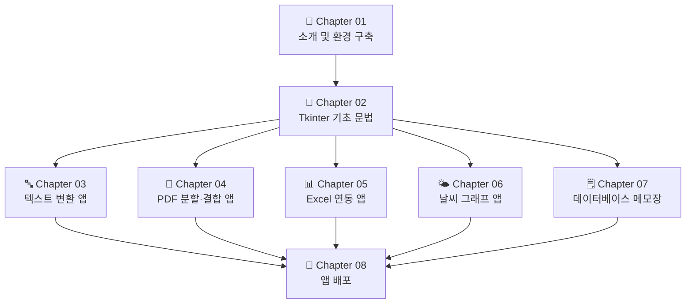
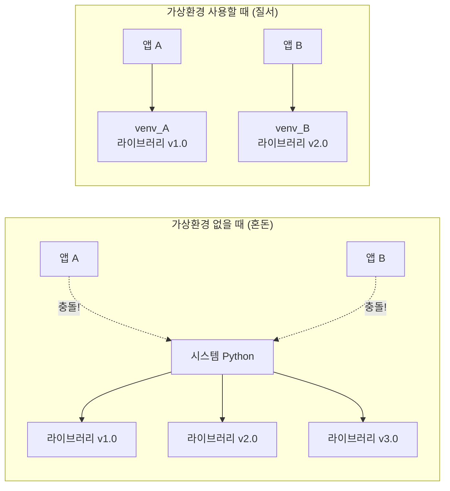
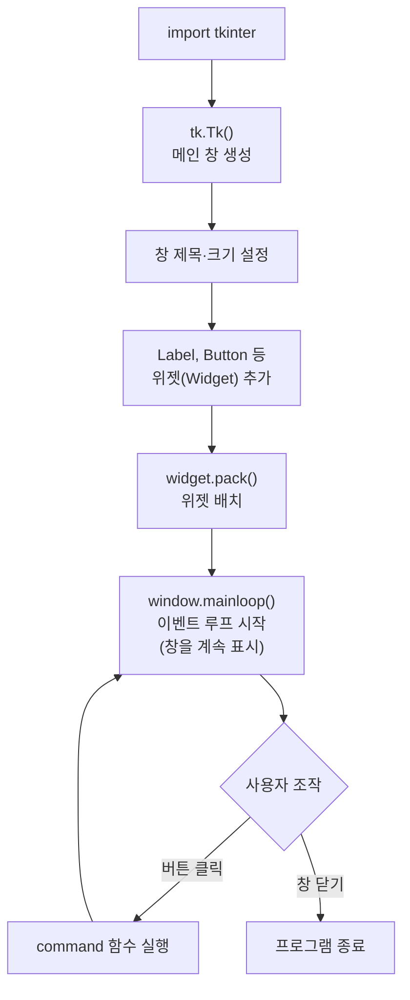

# 파이썬으로 만들기! 데스크톱 앱 시작  

저자: 최흥배, AI-Assisted   
    
권장 개발 환경
- **IDE**: Visual Code
- **컴파일러**: Python 3.13
- **OS**: Windows 10 이상

----- 
  
# **Chapter 01. 소개**

---

```
██████╗ ██╗   ██╗████████╗██╗  ██╗ ██████╗ ███╗   ██╗
██╔══██╗╚██╗ ██╔╝╚══██╔══╝██║  ██║██╔═══██╗████╗  ██║
██████╔╝ ╚████╔╝    ██║   ███████║██║   ██║██╔██╗ ██║
██╔═══╝   ╚██╔╝     ██║   ██╔══██║██║   ██║██║╚██╗██║
██║        ██║      ██║   ██║  ██║╚██████╔╝██║ ╚████║
╚═╝        ╚═╝      ╚═╝   ╚═╝  ╚═╝ ╚═════╝ ╚═╝  ╚═══╝

  +---------------------------+
  |  📄  나의 첫 번째 앱       |
  |                           |
  |  [ 텍스트를 입력하세요 ]   |
  |                           |
  |  [  변환하기  ]  [  닫기  ] |
  +---------------------------+

파이썬으로 내 손으로 만드는 데스크톱 앱!
```

---

**1-1. 이 책은 어떤 책인가?**

이 책은 파이썬(Python)을 사용해서 실제로 **눈에 보이는 창(Window)이 있는 데스크톱 애플리케이션**을 만드는 것을 목표로 합니다. "앱을 만들고 싶다"는 꿈은 있지만 막상 어디서부터 시작해야 할지 몰라 막막했던 분들을 위한 책입니다.

파이썬은 배우기 쉬운 언어로 알려져 있지만, 막상 "그래서 뭘 만들 수 있지?"라는 질문 앞에서 멈추는 분들이 많습니다. 이 책은 그 질문에 구체적인 대답을 드립니다. 텍스트 변환 앱, PDF 편집 앱, Excel 연동 앱, 날씨 그래프 앱, 메모장 앱까지 — 실생활에서 바로 쓸 수 있는 도구들을 직접 만들어봅니다.

이 책의 대상 독자는 다음과 같습니다.

- 파이썬의 기초 문법(변수, 함수, 반복문, 조건문)을 어느 정도 아는 분
- Java, C#, JavaScript 등 다른 프로그래밍 언어에는 익숙한 분
- "파이썬으로 뭔가 쓸모 있는 것을 만들고 싶다"는 분
- 사용 환경은 **Windows 11** 기준입니다

---

**1-2. 왜 파이썬으로 데스크톱 앱을 만드는가?**

다른 언어를 알고 있는 여러분이라면 이런 생각이 드실 수 있습니다. *"데스크톱 앱이라면 C#의 WPF나 Java의 Swing이 더 강력하지 않나?"* 맞는 말입니다. 하지만 파이썬에는 다른 언어에는 없는 강력한 무기가 있습니다.

**풍부한 라이브러리 생태계**가 바로 그것입니다. PDF 처리, Excel 조작, 데이터베이스 연결, 외부 API 호출 — 이 모든 것을 `pip install` 한 줄로 추가할 수 있습니다. 백엔드 로직을 만드는 시간이 극적으로 줄어드는 것입니다. 다시 말해, 파이썬으로 만드는 데스크톱 앱은 **"아이디어를 빠르게 현실로 바꾸기"** 에 최적화된 선택입니다.

```
[다른 언어로 만들 때]          [파이썬으로 만들 때]
  아이디어                       아이디어
     |                              |
  라이브러리 탐색 (며칠)           pip install (몇 초)
     |                              |
  API 공부 (며칠)                 코드 작성 (몇 시간)
     |                              |
  코드 작성 (며칠)                완성! 🎉
     |
  완성 (몇 주 후...)
```

---

**1-3. GUI 라이브러리 선택 — 왜 Tkinter인가?**

파이썬으로 GUI(Graphical User Interface, 그래픽 사용자 인터페이스) 앱을 만들 수 있는 라이브러리는 여러 가지가 있습니다. 대표적인 것들을 비교해봅시다.

| 라이브러리 | 특징 | 난이도 | 설치 필요 여부 |
|---|---|---|---|
| **Tkinter** | 파이썬 내장, 가볍고 심플 | ⭐ 쉬움 | ❌ 불필요 |
| PyQt6 / PySide6 | 강력하고 세련된 UI | ⭐⭐⭐ 어려움 | ✅ 필요 |
| CustomTkinter | Tkinter 기반, 모던한 디자인 | ⭐⭐ 보통 | ✅ 필요 |
| Kivy | 터치/모바일 지원 | ⭐⭐⭐ 어려움 | ✅ 필요 |
| wxPython | 네이티브 UI와 유사 | ⭐⭐⭐ 어려움 | ✅ 필요 |

이 책에서는 **Tkinter**를 선택합니다. 그 이유는 명확합니다. Tkinter는 파이썬을 설치하면 **별도의 추가 설치 없이 바로 사용할 수 있는** 표준 라이브러리입니다. 처음 배우는 도구가 복잡하면 도구 자체를 배우는 데 시간을 다 써버립니다. 이 책은 "앱 만들기"가 목표이므로, 가장 진입 장벽이 낮은 Tkinter로 시작하는 것이 현명합니다.

> 💡 **다른 언어 사용자를 위한 비유**
> Tkinter는 Java의 Swing, C#의 WinForms와 비슷한 포지션입니다. 기본적이지만 충분히 실용적이고, 기초를 배우면 다른 GUI 라이브러리로 넘어가는 것도 훨씬 쉬워집니다.

---

**1-4. 이 책에서 만드는 것들 (전체 개요)**

이 책에서는 챕터마다 하나씩 완성된 앱을 만들어갑니다. 전체 흐름을 먼저 파악해두면 학습이 더 즐거워집니다.



각 챕터에서 만드는 앱들은 다음과 같습니다.

- **Chapter 03**: 텍스트를 대문자/소문자 변환, 공백 제거 등을 해주는 텍스트 변환 앱
- **Chapter 04**: PDF 파일을 선택해서 페이지를 나누거나 여러 PDF를 하나로 합치는 앱
- **Chapter 05**: Excel 파일을 열고, 데이터를 읽고 쓰며, 집계를 자동으로 해주는 앱
- **Chapter 06**: OpenWeather API로 날씨 데이터를 받아 그래프로 시각화하는 앱
- **Chapter 07**: sqlite3 데이터베이스를 사용한 메모를 저장하고 검색할 수 있는 앱
- **Chapter 08**: 만든 앱을 `.exe` 파일로 변환하여 누구나 실행할 수 있도록 배포

---

**1-5. 개발 환경 구축 — 파이썬 설치 (Windows 11)**

자, 이제 실제로 손을 움직여 봅시다! 먼저 파이썬을 설치해야 합니다. 이 책은 **Python 3.13** 기준으로 작성되었습니다.

**🔹 STEP 1: 파이썬 공식 사이트에서 다운로드**

브라우저에서 아래 주소로 접속합니다.

```
https://www.python.org/downloads/
```

페이지에 접속하면 노란색의 큰 `Download Python 3.13.x` 버튼이 보입니다. 이 버튼을 클릭하면 Windows 64비트 인스톨러가 자동으로 다운로드됩니다.

**🔹 STEP 2: 설치 시 반드시 확인할 옵션**

다운로드된 `.exe` 파일을 실행하면 아래와 같은 설치 화면이 나타납니다. 여기서 **가장 중요한 체크박스**를 반드시 확인해야 합니다!

```
+----------------------------------------------------------+
|   Install Python 3.13.x (64-bit)                        |
|                                                          |
|  [✅] Add python.exe to PATH   ← ★ 반드시 체크! ★       |
|                                                          |
|  [ Install Now ]   [ Customize installation ]           |
+----------------------------------------------------------+
```

> ⚠️ **주의!** `Add python.exe to PATH` 체크박스를 **반드시** 체크해야 합니다. 이것을 빠뜨리면 터미널에서 `python` 명령어를 인식하지 못해, 나중에 번거로운 수동 설정을 해야 합니다.

`Install Now`를 클릭하고 설치가 완료되면 `Close`를 누릅니다.

**🔹 STEP 3: 설치 확인**

설치가 제대로 됐는지 확인해봅시다. Windows 키를 눌러 `PowerShell` 또는 `명령 프롬프트(cmd)`를 검색해서 실행합니다.

```powershell
python --version
```

아래와 같이 버전이 표시되면 성공입니다! 🎉

```
Python 3.13.x
```

---

**1-6. 코드 에디터 선택 — VS Code 설치 및 설정**

파이썬이 설치됐으니 이제 코드를 편집할 도구가 필요합니다. 파이썬에는 기본으로 IDLE이라는 에디터가 포함되어 있지만, 이 책에서는 훨씬 강력하고 무료인 **Visual Studio Code (VS Code)** 를 사용합니다.

**🔹 VS Code 다운로드 및 설치**

```
https://code.visualstudio.com/
```

위 주소에서 다운로드 후 설치합니다. 설치 중 `PATH에 추가` 옵션도 체크해 두면 편리합니다.

**🔹 파이썬 확장 프로그램 설치**

VS Code를 실행한 후, 왼쪽 사이드바의 확장 프로그램 아이콘(네모 4개 모양)을 클릭하고, 검색창에 `Python`을 입력합니다. Microsoft에서 만든 **Python 확장 프로그램**을 설치합니다.

```
+-----------------------------------+
|  Extensions: Marketplace          |
|  [🔍 Python                    ]  |
|                                   |
|  🐍 Python  (Microsoft)           |
|     IntelliSense, Linting,        |
|     Debugging...                  |
|     ★★★★★  [Install]             |
+-----------------------------------+
```

이 확장 프로그램을 설치하면 코드 자동완성, 문법 오류 강조, 디버깅 등 개발에 필요한 편의 기능이 모두 활성화됩니다.

---

**1-7. 가상환경(venv) 이해하기 — 프로젝트를 깔끔하게 관리**

다른 언어를 사용해본 분이라면 Java의 Maven/Gradle 프로젝트, Node.js의 `node_modules`처럼 프로젝트별로 의존성을 관리하는 개념을 알고 계실 겁니다. 파이썬에서는 **가상환경(Virtual Environment)** 이 그 역할을 합니다.

가상환경을 사용하지 않으면, `pip install`로 설치한 모든 라이브러리가 시스템 전체에 뒤섞여 버립니다. 프로젝트 A는 라이브러리 버전 1.0을, 프로젝트 B는 버전 2.0을 필요로 할 때 충돌이 발생하는 것이죠. 가상환경은 이 문제를 해결해줍니다.



**🔹 프로젝트 폴더 만들고 가상환경 생성하기**

PowerShell을 열고 아래 명령어를 순서대로 실행합니다.

```powershell
# 1. 프로젝트 폴더 생성 (예: 바탕화면에 my_desktop_app 폴더 생성)
mkdir C:\Users\사용자이름\Desktop\my_desktop_app

# 2. 해당 폴더로 이동
cd C:\Users\사용자이름\Desktop\my_desktop_app

# 3. 가상환경 생성 (venv라는 이름의 폴더가 생성됨)
python -m venv venv

# 4. 가상환경 활성화 (Windows)
venv\Scripts\activate
```

가상환경이 활성화되면 터미널 프롬프트 앞에 `(venv)` 라는 표시가 나타납니다.

```powershell
(venv) PS C:\Users\사용자이름\Desktop\my_desktop_app>
```

이 `(venv)` 표시가 보이면 성공입니다! 이제 이 환경에서 설치하는 모든 라이브러리는 이 프로젝트에만 적용됩니다. 가상환경을 비활성화하려면 `deactivate`를 입력하면 됩니다.

> 💡 **VS Code에서 가상환경 연결하기** VS Code로 프로젝트 폴더를 열면, 우측 하단에 Python 버전이 표시됩니다. 이것을 클릭하면 인터프리터를 선택할 수 있는데, `venv` 폴더 안의 Python을 선택하면 VS Code가 자동으로 가상환경을 인식합니다.

---

**1-8. 첫 번째 파이썬 코드 실행해보기**

환경이 준비됐으니 진짜로 코드를 써볼 차례입니다! VS Code에서 `my_desktop_app` 폴더를 열고, 새 파일 `hello.py`를 만들어 아래 코드를 입력해봅시다.

```python
# hello.py - 나의 첫 번째 파이썬 프로그램

name = "파이썬 데스크톱 앱"
print(f"안녕하세요! {name} 세계에 오신 것을 환영합니다!")
print("=" * 40)
print("오늘부터 나만의 앱을 만들어봅시다 🚀")
```

터미널에서 아래 명령어로 실행합니다.

```powershell
python hello.py
```

출력 결과:

```
안녕하세요! 파이썬 데스크톱 앱 세계에 오신 것을 환영합니다!
========================================
오늘부터 나만의 앱을 만들어봅시다 🚀
```

---

**1-9. 첫 번째 Tkinter 창 띄워보기**

이제 드디어 GUI 창을 띄워볼 차례입니다! Tkinter는 별도 설치 없이 바로 사용할 수 있다는 것, 기억하시죠? 새 파일 `first_window.py`를 만들고 아래 코드를 입력해보세요.

```python
# first_window.py - 나의 첫 번째 GUI 창

import tkinter as tk  # tkinter 라이브러리를 'tk'라는 이름으로 불러오기

# 1. 메인 윈도우(창) 생성
window = tk.Tk()

# 2. 창 제목 설정
window.title("나의 첫 번째 앱 🎉")

# 3. 창 크기 설정 (가로 x 세로, 단위: 픽셀)
window.geometry("400x200")

# 4. 창 안에 텍스트 레이블 추가
label = tk.Label(
    window,
    text="안녕하세요!\n파이썬 데스크톱 앱의 세계에 오신 것을 환영합니다!",
    font=("맑은 고딕", 14),
    pady=20
)
label.pack()  # 레이블을 창에 배치

# 5. 버튼 추가
button = tk.Button(
    window,
    text="클릭해보세요! 😊",
    font=("맑은 고딕", 12),
    command=lambda: label.config(text="버튼이 눌렸습니다! 🎊")
)
button.pack()

# 6. 이벤트 루프 시작 (창이 닫힐 때까지 계속 실행)
window.mainloop()
```

실행하면 아래와 같은 창이 나타납니다!

```
+------------------------------------------+
|  나의 첫 번째 앱 🎉              [─][□][✕] |
+------------------------------------------+
|                                          |
|     안녕하세요!                           |
|  파이썬 데스크톱 앱의 세계에              |
|     오신 것을 환영합니다!                 |
|                                          |
|       [ 클릭해보세요! 😊 ]               |
|                                          |
+------------------------------------------+
```

버튼을 클릭하면 위의 텍스트가 바뀌는 것을 확인할 수 있습니다. 여러분은 방금 파이썬으로 **진짜 GUI 앱**을 만든 것입니다! 🎉

코드의 흐름을 간단히 이해해봅시다.



> 💡 **다른 언어와 비교하면** `window.mainloop()`는 Java Swing의 `setVisible(true)` 또는 C#의 `Application.Run()`과 같은 역할입니다. GUI 앱은 사용자가 창을 닫기 전까지 계속 실행되면서 클릭, 입력 등의 이벤트를 기다려야 하기 때문에 이런 "무한 루프"가 필요합니다.

---

**1-10. 이 챕터의 정리**

Chapter 01에서 배운 내용을 정리해봅시다.

```
✅ 체크리스트
┌─────────────────────────────────────────────┐
│ □ 파이썬 3.13을 설치했다                      │
│ □ python --version으로 설치를 확인했다        │
│ □ VS Code와 Python 확장을 설치했다            │
│ □ 프로젝트 폴더에 가상환경(venv)을 만들었다   │
│ □ 가상환경을 활성화하는 방법을 알았다          │
│ □ 첫 번째 Tkinter 창을 띄울 수 있었다        │
└─────────────────────────────────────────────┘
```

이번 챕터에서는 파이썬 데스크톱 앱 개발을 위한 무대를 마련했습니다. 파이썬 설치부터 VS Code 설정, 가상환경의 개념, 그리고 Tkinter로 첫 창을 띄우는 것까지 해냈습니다.

다음 **Chapter 02**에서는 Tkinter로 앱을 만들기 전에 알아두면 유용한 파이썬 기초 문법들을 빠르게 훑어보고, 본격적으로 앱 개발을 시작할 준비를 합니다. 클래스(Class)를 사용해 GUI 코드를 깔끔하게 구조화하는 방법도 배워볼 예정입니다. 기대해주세요! 🐍

---

> 📌 **도움이 되는 참고 링크**
> - 파이썬 공식 문서: https://docs.python.org/ko/3/
> - Tkinter 공식 문서: https://docs.python.org/ko/3/library/tkinter.html
> - VS Code 공식 사이트: https://code.visualstudio.com/    