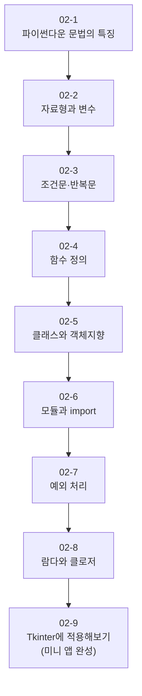
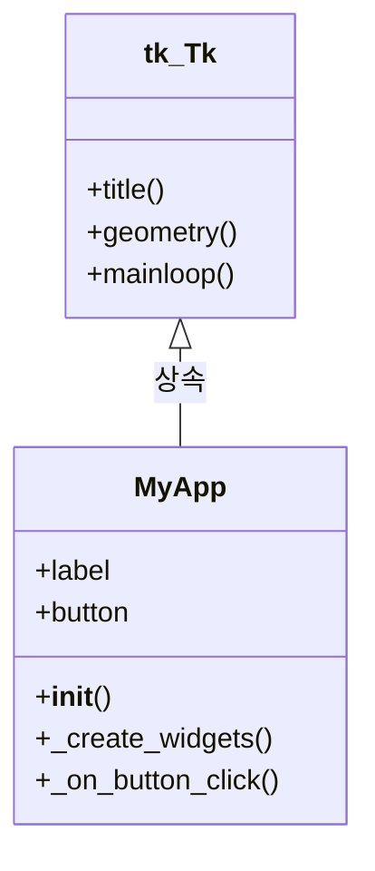
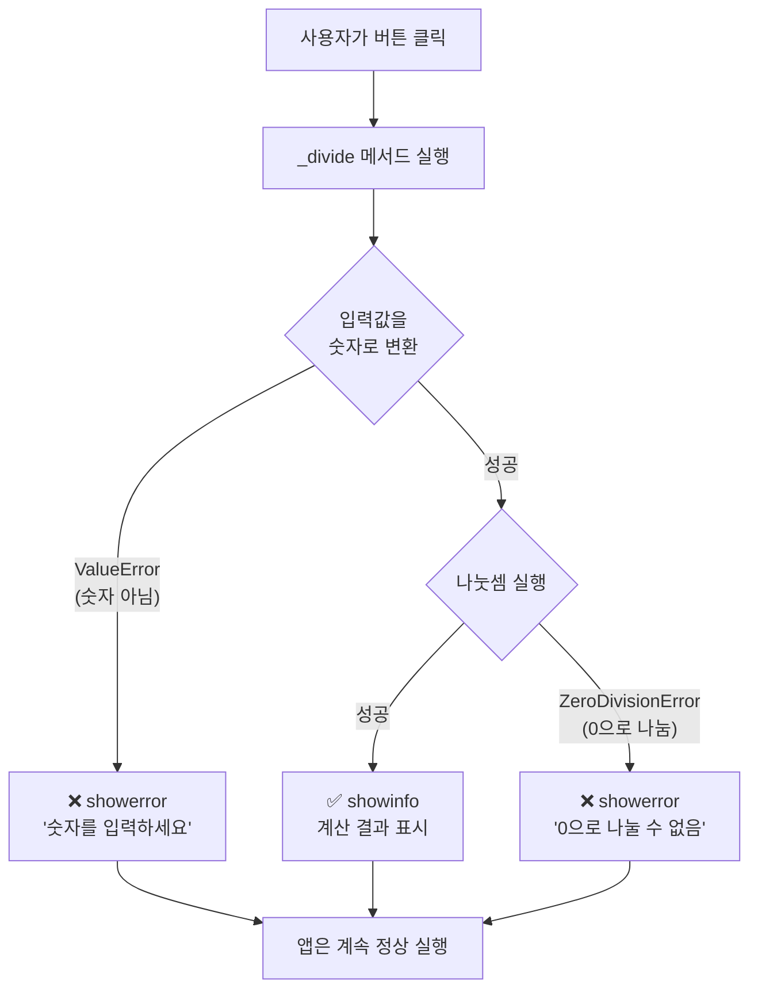
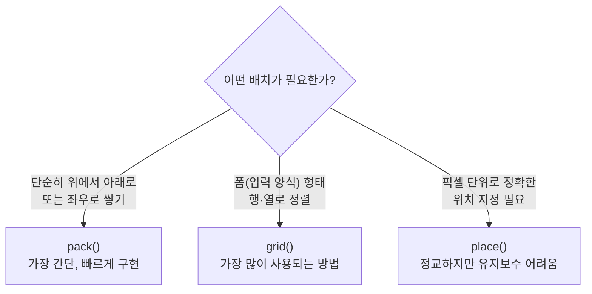
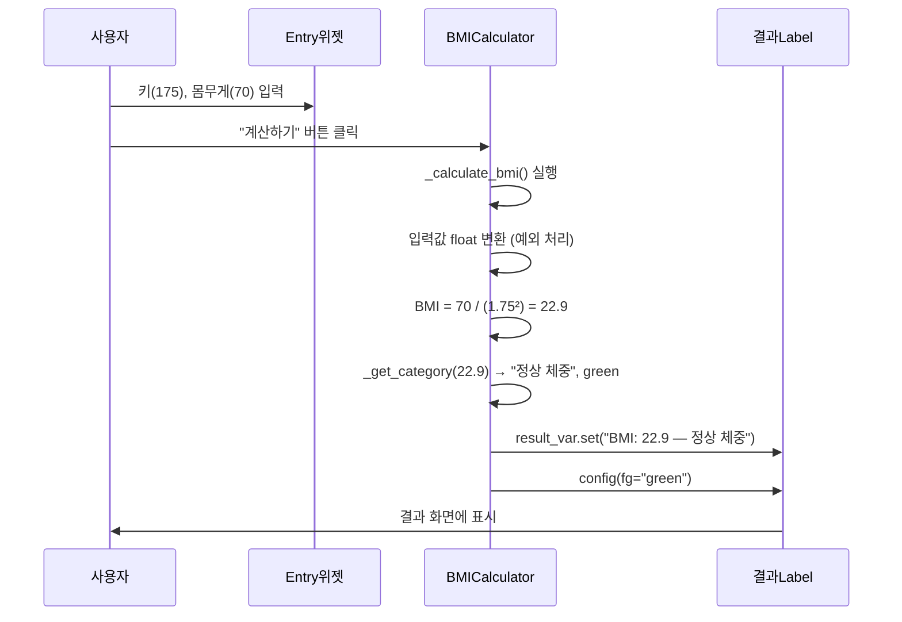

# 파이썬으로 만들기! 데스크톱 앱 시작  

저자: 최흥배, AI-Assisted   
    
권장 개발 환경
- **IDE**: Visual Code
- **컴파일러**: Python 3.13
- **OS**: Windows 10 이상

----- 
  
# **Chapter 02. Tkinter에서 앱을 만들기 전에 (기초 문법 확인)**

---

```
  _____     _     _       _
 |_   _| __(_)___| | ___ | |_
   | || '__| / __| |/ _ \| __|
   | || |  | \__ \ | (_) | |_
   |_||_|  |_|___/_|\___/ \__|

  기초를 탄탄히! 앱 개발의 첫걸음
  ================================
  변수 → 함수 → 클래스 → Tkinter!
```

이 챕터에서는 Tkinter로 본격적으로 앱을 만들기 전에, 반드시 알아두어야 할 파이썬 문법을 빠르게 복습합니다. 특히 **다른 프로그래밍 언어에는 익숙하지만 파이썬은 처음인 분**들을 위해, Java·C#·JavaScript와의 비교를 곁들여 설명합니다. 이미 아는 내용이라면 빠르게 훑어보고 넘어가도 좋습니다.

이 챕터에서 다루는 내용의 전체 흐름은 아래와 같습니다.



---

## **02-1. 파이썬다운 문법의 특징**
파이썬을 처음 접하는 타 언어 경험자가 가장 먼저 당황하는 부분은 바로 **들여쓰기(indentation)** 입니다. C#이나 Java에서는 중괄호 `{}`로 코드 블록을 구분했지만, 파이썬은 **들여쓰기 자체가 문법**입니다.

```python
# ❌ 잘못된 예시 — 들여쓰기가 맞지 않으면 에러!
def say_hello():
print("안녕하세요!")  # IndentationError 발생!

# ✅ 올바른 예시
def say_hello():
    print("안녕하세요!")  # 스페이스 4칸 들여쓰기
```

> 💡 **VS Code 설정 팁** VS Code에서는 탭(Tab) 키를 누르면 자동으로 스페이스 4칸으로 변환해줍니다. 탭과 스페이스를 혼용하면 오류가 나므로 하나로 통일하세요. 하단 상태바에서 `Spaces: 4`로 설정되어 있는지 확인하세요.

또한 파이썬은 **세미콜론(`;`)이 필요 없습니다.** 줄 바꿈이 곧 문장의 끝입니다.

```python
# Java / C# 스타일
# int x = 10;
# String name = "홍길동";

# Python 스타일 — 세미콜론 없음!
x = 10
name = "홍길동"
```

주석은 `#` 기호를 사용하며, 여러 줄 주석은 큰따옴표 세 개 `"""..."""` 로 감쌉니다.

```python
# 한 줄 주석

"""
여러 줄 주석입니다.
함수나 클래스 설명에도 자주 사용됩니다.
이것을 'docstring'이라고 부릅니다.
"""
```

---

## **02-2. 자료형과 변수**
파이썬은 **동적 타입(Dynamic Typing)** 언어입니다. 변수를 선언할 때 자료형을 명시하지 않아도 됩니다. Python이 오른쪽 값을 보고 자동으로 타입을 결정합니다.

```python
# Java: int age = 25;
# Python:
age = 25              # int (정수)
height = 172.5        # float (실수)
name = "홍길동"        # str (문자열)
is_student = True     # bool (불리언: True / False)
nothing = None        # NoneType (Java의 null, C#의 null)

# type() 함수로 타입 확인 가능
print(type(age))      # <class 'int'>
print(type(name))     # <class 'str'>
```

**🔹 문자열(str) — 파이썬의 강력한 도구**

문자열은 Tkinter 앱에서 화면에 텍스트를 표시하거나, 사용자 입력을 처리할 때 매우 자주 사용됩니다.

```python
# 문자열 연결
first = "파이썬"
second = "앱 개발"
result = first + " " + second
print(result)   # 파이썬 앱 개발

# f-string (포맷 문자열) — 가장 현대적이고 편리한 방법
user_name = "홍길동"
score = 95
print(f"{user_name}님의 점수는 {score}점입니다.")
# 출력: 홍길동님의 점수는 95점입니다.

# 주요 문자열 메서드
text = "  Hello, Python!  "
print(text.strip())         # "Hello, Python!"  (앞뒤 공백 제거)
print(text.upper())         # "  HELLO, PYTHON!  " (대문자)
print(text.lower())         # "  hello, python!  " (소문자)
print(text.replace("Python", "World"))  # "  Hello, World!  "
print("Python" in text)     # True (포함 여부 확인)
print(text.split(","))      # ['  Hello', ' Python!  '] (분리)
```

**🔹 리스트(list) — Python의 배열**

```python
# Java: String[] fruits = {"사과", "바나나", "딸기"};
# Python:
fruits = ["사과", "바나나", "딸기"]

# 요소 접근 (0부터 시작)
print(fruits[0])    # 사과
print(fruits[-1])   # 딸기 (마이너스 인덱스: 뒤에서부터)

# 리스트 조작
fruits.append("포도")       # 끝에 추가
fruits.insert(1, "레몬")    # 특정 위치에 삽입
fruits.remove("바나나")      # 특정 값 제거
print(len(fruits))          # 리스트 길이

# 슬라이싱 (리스트의 일부를 잘라내기)
numbers = [0, 1, 2, 3, 4, 5]
print(numbers[1:4])   # [1, 2, 3] (인덱스 1 이상 4 미만)
print(numbers[:3])    # [0, 1, 2] (처음부터 3 미만)
print(numbers[3:])    # [3, 4, 5] (인덱스 3부터 끝까지)
```

**🔹 딕셔너리(dict) — 키-값 쌍의 자료구조**

Tkinter 앱에서 설정값이나 데이터를 관리할 때 매우 유용합니다.

```python
# Java의 HashMap, C#의 Dictionary와 비슷합니다
person = {
    "name": "홍길동",
    "age": 30,
    "city": "서울"
}

# 값에 접근
print(person["name"])           # 홍길동
print(person.get("age"))        # 30
print(person.get("email", "없음"))  # 없음 (키가 없을 때 기본값)

# 값 추가 및 수정
person["email"] = "hong@example.com"
person["age"] = 31

# 순회
for key, value in person.items():
    print(f"{key}: {value}")
```

**🔹 튜플(tuple) — 변경 불가능한 리스트**

```python
# 한번 만들면 변경할 수 없는 리스트
# Tkinter에서 색상, 크기 등 고정된 값을 전달할 때 자주 사용됩니다
point = (100, 200)       # x, y 좌표
color = (255, 0, 0)      # RGB 색상

x, y = point             # 튜플 언패킹 (분해 대입)
print(f"x={x}, y={y}")  # x=100, y=200
```

---

## **02-3. 조건문과 반복문**

**🔹 조건문 (if / elif / else)**

파이썬의 조건문은 중괄호 대신 들여쓰기와 콜론(`:`)을 사용합니다.

```python
# Java/C# 스타일:
# if (score >= 90) { ... } else if (score >= 70) { ... } else { ... }

# Python 스타일:
score = 85

if score >= 90:
    print("A등급")
elif score >= 70:       # else if 대신 elif
    print("B등급")
elif score >= 50:
    print("C등급")
else:
    print("F등급")

# 출력: B등급
```

파이썬에는 **한 줄 조건 표현식(삼항 연산자)**도 있습니다.

```python
# Java/C#: String result = (score >= 60) ? "합격" : "불합격";
# Python:
result = "합격" if score >= 60 else "불합격"
print(result)   # 합격
```

**🔹 반복문 (for / while)**

```python
# --- for 반복문 ---

# 리스트 순회
fruits = ["사과", "바나나", "딸기"]
for fruit in fruits:
    print(fruit)

# range()를 이용한 숫자 반복
# Java: for (int i = 0; i < 5; i++) { ... }
# Python:
for i in range(5):       # 0, 1, 2, 3, 4
    print(i)

for i in range(1, 6):    # 1, 2, 3, 4, 5
    print(i)

for i in range(0, 10, 2):  # 0, 2, 4, 6, 8 (2씩 증가)
    print(i)

# enumerate(): 인덱스와 값을 함께 얻기
for index, fruit in enumerate(fruits):
    print(f"{index}: {fruit}")
# 출력:
# 0: 사과
# 1: 바나나
# 2: 딸기
```

```python
# --- while 반복문 ---
count = 0
while count < 3:
    print(f"카운트: {count}")
    count += 1

# break와 continue
for i in range(10):
    if i == 3:
        continue    # 3은 건너뜀
    if i == 7:
        break       # 7에서 반복 종료
    print(i)
# 출력: 0 1 2 4 5 6
```

**🔹 리스트 컴프리헨션 — 파이썬다운 리스트 생성**

이것은 파이썬만의 매우 편리한 문법입니다. 처음에는 낯설지만 익숙해지면 코드가 훨씬 간결해집니다.

```python
# 일반적인 방법
squares = []
for i in range(1, 6):
    squares.append(i * i)
print(squares)  # [1, 4, 9, 16, 25]

# 리스트 컴프리헨션으로 한 줄에!
squares = [i * i for i in range(1, 6)]
print(squares)  # [1, 4, 9, 16, 25]

# 조건 포함
even_squares = [i * i for i in range(1, 11) if i % 2 == 0]
print(even_squares)  # [4, 16, 36, 64, 100]
```

---

## **02-4. 함수 정의**

함수는 `def` 키워드로 정의합니다. Tkinter에서는 버튼을 눌렀을 때 실행할 동작을 함수로 정의하기 때문에 함수를 잘 이해하는 것이 매우 중요합니다.

```python
# 기본 함수 정의
def greet(name):
    print(f"안녕하세요, {name}님!")

greet("홍길동")   # 안녕하세요, 홍길동님!


# 반환값이 있는 함수
def add(a, b):
    return a + b

result = add(3, 5)
print(result)   # 8


# 기본값 인수(Default Argument)
def greet_with_title(name, title="님"):
    print(f"안녕하세요, {name}{title}!")

greet_with_title("홍길동")          # 안녕하세요, 홍길동님!
greet_with_title("홍길동", " 선생님")  # 안녕하세요, 홍길동 선생님!


# 키워드 인수(Keyword Argument) — 순서 상관없이 이름으로 전달
def introduce(name, age, city):
    print(f"저는 {city} 출신 {age}세 {name}입니다.")

introduce(age=30, city="서울", name="홍길동")
```

**🔹 여러 값 반환하기**

파이썬 함수는 여러 값을 동시에 반환할 수 있습니다. (실제로는 튜플로 반환됩니다)

```python
def get_min_max(numbers):
    return min(numbers), max(numbers)  # 두 값을 동시에 반환

data = [3, 1, 4, 1, 5, 9, 2, 6]
minimum, maximum = get_min_max(data)  # 튜플 언패킹으로 받기
print(f"최솟값: {minimum}, 최댓값: {maximum}")
# 출력: 최솟값: 1, 최댓값: 9
```

**🔹 *args와 **kwargs — 가변 인수**

```python
# *args: 개수가 정해지지 않은 위치 인수 (튜플로 받음)
def sum_all(*args):
    total = 0
    for num in args:
        total += num
    return total

print(sum_all(1, 2, 3))         # 6
print(sum_all(1, 2, 3, 4, 5))  # 15


# **kwargs: 개수가 정해지지 않은 키워드 인수 (딕셔너리로 받음)
# Tkinter 위젯 설정에서 자주 보이는 패턴입니다!
def show_config(**kwargs):
    for key, value in kwargs.items():
        print(f"  {key} = {value}")

show_config(font="맑은 고딕", size=14, color="blue")
# 출력:
#   font = 맑은 고딕
#   size = 14
#   color = blue
```

> 💡 **Tkinter와의 연결** Tkinter에서 위젯을 만들 때 `tk.Label(window, text="안녕", font=("맑은 고딕", 14))` 처럼 키워드 인수를 많이 사용합니다. 이것이 바로 `**kwargs` 패턴과 같은 개념입니다.

---

## **02-5. 클래스와 객체지향 — Tkinter 앱의 뼈대**

이 섹션은 이 챕터에서 가장 중요합니다. Tkinter 앱을 깔끔하게 구조화하는 핵심이 바로 **클래스(Class)** 이기 때문입니다. Java나 C#에서 클래스를 이미 알고 있다면 개념은 같고 문법만 다릅니다.

**🔹 클래스 기본 문법**

```python
# Java/C# 스타일:
# public class Dog {
#     private String name;
#     public Dog(String name) { this.name = name; }
#     public void bark() { System.out.println(name + ": 왈왈!"); }
# }

# Python 스타일:
class Dog:
    # __init__은 생성자 (Java의 constructor)
    # self는 Java/C#의 this와 같습니다
    def __init__(self, name):
        self.name = name    # 인스턴스 변수

    def bark(self):
        print(f"{self.name}: 왈왈!")

    def introduce(self):
        print(f"저는 {self.name}입니다.")


# 객체(인스턴스) 생성
dog1 = Dog("초코")
dog2 = Dog("바둑이")

dog1.bark()       # 초코: 왈왈!
dog2.introduce()  # 저는 바둑이입니다.
```

클래스와 인스턴스의 관계를 그림으로 이해해봅시다.

```
     [클래스: Dog] ← 설계도
     ┌─────────────┐
     │ name        │
     │ bark()      │
     │ introduce() │
     └─────────────┘
           │ 찍어내기 (인스턴스화)
    ┌──────┴──────┐
    ▼             ▼
[dog1: Dog]  [dog2: Dog]  ← 실제 객체들
name="초코"  name="바둑이"
```

**🔹 상속(Inheritance)**

```python
class Animal:
    def __init__(self, name):
        self.name = name

    def speak(self):
        print("...")

# Animal을 상속받는 Dog 클래스
class Dog(Animal):
    def speak(self):                        # 메서드 오버라이드
        print(f"{self.name}: 왈왈!")

class Cat(Animal):
    def speak(self):
        print(f"{self.name}: 야옹~")

animals = [Dog("초코"), Cat("나비"), Dog("바둑이")]
for animal in animals:
    animal.speak()
# 출력:
# 초코: 왈왈!
# 나비: 야옹~
# 바둑이: 왈왈!
```

**🔹 Tkinter 앱을 클래스로 구조화하기 — 핵심 패턴!**

간단한 Tkinter 앱을 만들 때는 코드를 그냥 순서대로 쭉 쓸 수도 있습니다. 하지만 앱이 조금만 커져도 코드가 뒤죽박죽 되어버립니다. 그래서 이 책에서는 **처음부터 클래스로 앱을 구조화하는 패턴**을 사용합니다.

```python
import tkinter as tk

# ❌ 클래스 없이 만들면 — 규모가 커질수록 관리가 어려워진다
window = tk.Tk()
window.title("앱")
label = tk.Label(window, text="안녕")
label.pack()
button = tk.Button(window, text="클릭", command=lambda: print("클릭!"))
button.pack()
window.mainloop()
```

```python
import tkinter as tk

# ✅ 클래스로 구조화 — 이 책에서 사용하는 기본 패턴
class MyApp(tk.Tk):
    """
    tk.Tk를 상속받아 앱 전체를 하나의 클래스로 관리합니다.
    """
    def __init__(self):
        super().__init__()          # 부모 클래스(tk.Tk) 초기화
        self.title("나의 앱")
        self.geometry("400x300")

        self._create_widgets()      # 위젯 생성 메서드 호출

    def _create_widgets(self):
        """UI 위젯들을 생성하고 배치합니다."""
        self.label = tk.Label(
            self,
            text="안녕하세요!",
            font=("맑은 고딕", 16)
        )
        self.label.pack(pady=20)

        self.button = tk.Button(
            self,
            text="클릭해보세요",
            command=self._on_button_click   # 메서드를 command로 전달
        )
        self.button.pack()

    def _on_button_click(self):
        """버튼 클릭 시 실행되는 메서드."""
        self.label.config(text="버튼이 눌렸습니다! 🎉")


# 앱 실행
if __name__ == "__main__":
    app = MyApp()
    app.mainloop()
```

이 패턴의 구조를 다이어그램으로 살펴봅시다.



> 💡 **`if __name__ == "__main__":` 이란?**
> 이 코드는 "이 파일이 직접 실행될 때만 아래 코드를 실행하라"는 의미입니다. 다른 파일에서 `import`될 때는 실행되지 않습니다. Java의 `public static void main(String[] args)`와 비슷한 역할을 합니다. 파이썬 파일의 진입점(entry point)을 명시하는 좋은 습관입니다.

---

## **02-6. 모듈과 import**

파이썬의 강점 중 하나는 방대한 라이브러리 생태계입니다. `import` 문으로 다른 파일(모듈)이나 외부 라이브러리의 기능을 가져와 사용합니다.

```python
# 모듈 전체 import
import os
import math

print(math.pi)          # 3.141592653589793
print(math.sqrt(16))    # 4.0
print(os.getcwd())      # 현재 작업 디렉터리 경로 출력


# 모듈에서 특정 기능만 import
from math import sqrt, pi
print(sqrt(25))   # 5.0 (math. 없이 바로 사용)
print(pi)         # 3.141592653589793


# 별칭(alias) 부여
import tkinter as tk           # tkinter를 tk라는 이름으로 사용
import tkinter.ttk as ttk      # ttk 서브모듈 import


# 여러 항목 한 번에 import
from tkinter import messagebox, filedialog
```

**🔹 자신이 만든 파일을 모듈로 사용하기**

프로젝트가 커지면 코드를 여러 파일로 분리하게 됩니다.

```
my_desktop_app/
├── main.py          ← 메인 실행 파일
├── utils.py         ← 유틸리티 함수 모음
└── config.py        ← 설정값 모음
```

```python
# config.py
APP_TITLE = "나의 데스크톱 앱"
APP_WIDTH = 800
APP_HEIGHT = 600
DEFAULT_FONT = ("맑은 고딕", 12)
```

```python
# utils.py
def clean_text(text):
    """문자열의 앞뒤 공백을 제거하고 빈 문자열 여부를 반환합니다."""
    cleaned = text.strip()
    return cleaned, len(cleaned) == 0
```

```python
# main.py
import tkinter as tk
from config import APP_TITLE, APP_WIDTH, APP_HEIGHT, DEFAULT_FONT
from utils import clean_text

class MyApp(tk.Tk):
    def __init__(self):
        super().__init__()
        self.title(APP_TITLE)
        self.geometry(f"{APP_WIDTH}x{APP_HEIGHT}")
        # ...
```

**🔹 pip로 외부 라이브러리 설치하기**

표준 라이브러리 외에 외부 라이브러리는 `pip`로 설치합니다. 이 책 전체에서 사용할 라이브러리를 미리 한번 살펴봅시다.

```powershell
# 가상환경이 활성화된 상태에서 실행!
(venv) pip install pillow        # 이미지 처리
(venv) pip install pypdf         # PDF 처리
(venv) pip install openpyxl      # Excel 파일 처리
(venv) pip install requests      # HTTP API 호출
(venv) pip install matplotlib    # 그래프 시각화
```

설치된 라이브러리 목록 확인 및 저장:

```powershell
# 설치된 라이브러리 목록 확인
(venv) pip list

# requirements.txt로 목록 저장 (프로젝트 공유 시 유용)
(venv) pip freeze > requirements.txt

# requirements.txt를 보고 한 번에 설치
(venv) pip install -r requirements.txt
```

---

## **02-7. 예외 처리 — 앱이 갑자기 죽지 않도록**

데스크톱 앱에서 예외 처리는 매우 중요합니다. 사용자가 잘못된 입력을 하거나, 파일이 없거나, 네트워크 연결이 끊어지는 상황이 언제든 발생할 수 있기 때문입니다. 예외 처리 없이 앱을 만들면 사용자가 오류 때문에 앱이 갑자기 종료되는 최악의 경험을 하게 됩니다.

```python
# 기본 구조
# Java/C#: try { ... } catch (Exception e) { ... } finally { ... }
# Python:  try: ... except Exception as e: ... finally: ...

try:
    # 오류가 발생할 수 있는 코드
    number = int("abc")   # ValueError 발생!
except ValueError as e:
    print(f"숫자 변환 오류: {e}")
except ZeroDivisionError as e:
    print(f"0으로 나눌 수 없습니다: {e}")
except Exception as e:
    # 위에서 잡지 못한 모든 예외
    print(f"예상치 못한 오류: {e}")
else:
    # 예외가 발생하지 않았을 때 실행
    print("정상적으로 처리됐습니다.")
finally:
    # 예외 발생 여부와 상관없이 항상 실행
    print("항상 실행됩니다.")
```

**🔹 Tkinter 앱에서의 실전 예외 처리**

```python
import tkinter as tk
from tkinter import messagebox   # 메시지 박스 다이얼로그

class CalculatorApp(tk.Tk):
    def __init__(self):
        super().__init__()
        self.title("간단한 나눗셈 계산기")
        self.geometry("300x200")
        self._create_widgets()

    def _create_widgets(self):
        tk.Label(self, text="숫자 A:").pack()
        self.entry_a = tk.Entry(self)
        self.entry_a.pack()

        tk.Label(self, text="숫자 B (나눌 수):").pack()
        self.entry_b = tk.Entry(self)
        self.entry_b.pack()

        tk.Button(
            self, text="나누기",
            command=self._divide
        ).pack(pady=10)

    def _divide(self):
        try:
            a = float(self.entry_a.get())   # 숫자가 아니면 ValueError
            b = float(self.entry_b.get())
            result = a / b                   # b가 0이면 ZeroDivisionError
            messagebox.showinfo("결과", f"{a} ÷ {b} = {result:.2f}")

        except ValueError:
            # ❌ 앱이 죽는 대신 → ✅ 친절한 오류 메시지 표시
            messagebox.showerror("입력 오류", "숫자를 올바르게 입력해주세요.")
        except ZeroDivisionError:
            messagebox.showerror("계산 오류", "0으로 나눌 수 없습니다.")

if __name__ == "__main__":
    app = CalculatorApp()
    app.mainloop()
```

예외 처리의 흐름을 정리하면 아래와 같습니다.



---

## **02-8. 람다(lambda)와 콜백 — Tkinter에서 자주 쓰이는 패턴**

Tkinter에서 버튼에 함수를 연결할 때 `command` 인수를 사용합니다. 이때 **람다(lambda)** 가 매우 자주 등장합니다.

**🔹 람다 기본 문법**

```python
# 일반 함수
def add(a, b):
    return a + b

# 람다로 같은 것을 표현 (단순한 한 줄 함수)
add_lambda = lambda a, b: a + b

print(add(3, 5))         # 8
print(add_lambda(3, 5))  # 8
```

람다는 `lambda 인수: 반환식` 형태로 이름 없는 간단한 함수를 만드는 방법입니다.

**🔹 Tkinter에서 람다가 필요한 이유**

Tkinter의 `command`에는 **인수 없는 함수**를 전달해야 합니다. 그런데 실제로는 인수를 전달해서 실행하고 싶은 경우가 많습니다. 이때 람다로 인수를 "묶어서" 전달합니다.

```python
import tkinter as tk

class LambdaDemo(tk.Tk):
    def __init__(self):
        super().__init__()
        self.title("람다 예제")
        self.geometry("300x200")
        self._create_widgets()

    def _show_message(self, message):
        """메시지를 출력하는 메서드 — 인수가 있음"""
        print(f"메시지: {message}")

    def _create_widgets(self):
        # ❌ 이렇게 하면 안 됨 — 버튼 생성 시점에 즉시 실행되어 버림
        # tk.Button(self, text="인사", command=self._show_message("안녕!"))

        # ✅ lambda로 감싸면 버튼 클릭 시에만 실행됨
        tk.Button(
            self,
            text="인사하기",
            command=lambda: self._show_message("안녕하세요!")
        ).pack(pady=5)

        # 여러 버튼을 반복문으로 만들 때도 lambda가 필수
        colors = ["빨강", "초록", "파랑"]
        for color in colors:
            tk.Button(
                self,
                text=color,
                # lambda의 color=color는 현재 color 값을 캡처합니다
                command=lambda c=color: self._show_message(f"{c} 버튼 클릭!")
            ).pack(pady=2)

if __name__ == "__main__":
    app = LambdaDemo()
    app.mainloop()
```

> ⚠️ **람다 반복문의 함정** 반복문 안에서 `lambda: self._show_message(color)` 라고 쓰면, 모든 버튼이 마지막 `color` 값("파랑")을 사용하게 됩니다. `lambda c=color: ...` 처럼 **기본값으로 현재 값을 캡처**하는 것이 올바른 방법입니다.

---

## **02-9. Tkinter 핵심 개념 정리 — 위젯·배치·이벤트**
이제 지금까지 배운 문법을 Tkinter의 핵심 개념과 연결해봅시다.

**🔹 주요 위젯(Widget) 종류**

위젯이란 창 안에 배치되는 버튼, 텍스트, 입력창 등 모든 UI 요소를 말합니다.

```
Tkinter 주요 위젯 한눈에 보기
┌────────────────────────────────────────────────┐
│  [Label    ] 텍스트나 이미지를 표시               │
│  [Entry    ] 한 줄 텍스트 입력                    │
│  [Button   ] 클릭 가능한 버튼                     │
│  [Text     ] 여러 줄 텍스트 입력/표시              │
│  [Listbox  ] 목록 표시                            │
│  [Checkbutton] ☑ 체크박스                        │
│  [Radiobutton] ◉ 라디오 버튼                     │
│  [Combobox ] ▼ 드롭다운 선택 (ttk)               │
│  [Scale    ] ───●──── 슬라이더                   │
│  [Frame    ] 다른 위젯을 묶는 컨테이너             │
│  [Canvas   ] 도형, 이미지 그리기 영역              │
└────────────────────────────────────────────────┘
```

**🔹 배치 관리자(Layout Manager) 3가지**

Tkinter에서 위젯을 창 안에 어떻게 배치할지 결정하는 방법이 3가지 있습니다.

```python
import tkinter as tk

window = tk.Tk()
window.geometry("400x300")

# ① pack() — 위→아래, 왼→오른쪽으로 순서대로 배치 (가장 단순)
label1 = tk.Label(window, text="pack 위", bg="lightblue")
label1.pack(fill="x", pady=5)          # fill="x": 가로 전체 채우기

label2 = tk.Label(window, text="pack 아래", bg="lightgreen")
label2.pack(fill="x", pady=5)


# ② grid() — 표(Table) 형태로 행(row)·열(column) 지정
frame = tk.Frame(window)
frame.pack()

tk.Label(frame, text="이름:").grid(row=0, column=0, sticky="e", padx=5)
tk.Entry(frame).grid(row=0, column=1, padx=5)
tk.Label(frame, text="나이:").grid(row=1, column=0, sticky="e", padx=5)
tk.Entry(frame).grid(row=1, column=1, padx=5)
# sticky="e": 동쪽(East=오른쪽) 정렬
# padx, pady: 위젯 바깥 여백


# ③ place() — x, y 좌표를 직접 지정 (정밀 배치, 하지만 유연성 낮음)
tk.Button(window, text="정확한 위치").place(x=150, y=250)

window.mainloop()
```

3가지 배치 방법을 언제 써야 할지 정리하면 다음과 같습니다.



> ⚠️ **주의!** `pack()`과 `grid()`를 **같은 창(또는 Frame) 안에서 혼용하면 안 됩니다.** 프로그램이 멈춰버립니다. 단, 서로 다른 `Frame` 안에서는 각각 다른 방법을 써도 됩니다.

**🔹 Tkinter 변수(Variable) 클래스**

Tkinter에는 위젯과 파이썬 변수를 **자동으로 연동**시켜주는 특별한 변수 클래스가 있습니다. 이것이 다른 GUI 프레임워크의 데이터 바인딩과 비슷한 역할을 합니다.

```python
import tkinter as tk

class VariableDemo(tk.Tk):
    def __init__(self):
        super().__init__()
        self.title("Tkinter 변수 데모")
        self.geometry("350x250")

        # Tkinter 변수 클래스 종류
        self.str_var  = tk.StringVar()    # 문자열
        self.int_var  = tk.IntVar()       # 정수
        self.bool_var = tk.BooleanVar()   # 불리언 (체크박스용)
        self.dbl_var  = tk.DoubleVar()    # 실수

        # 초기값 설정
        self.str_var.set("초기 텍스트")
        self.int_var.set(0)

        self._create_widgets()

    def _create_widgets(self):
        # textvariable로 연동하면 변수가 바뀌면 위젯도 자동으로 바뀜!
        tk.Entry(self, textvariable=self.str_var).pack(pady=5)
        tk.Label(self, textvariable=self.str_var, fg="blue").pack()

        # 체크박스
        tk.Checkbutton(
            self,
            text="동의합니다",
            variable=self.bool_var,
            command=self._on_check
        ).pack(pady=5)

        # 버튼 클릭으로 값 읽기
        tk.Button(
            self,
            text="현재 값 출력",
            command=self._print_values
        ).pack(pady=5)

    def _on_check(self):
        print(f"체크 상태: {self.bool_var.get()}")

    def _print_values(self):
        print(f"Entry 값: {self.str_var.get()}")
        print(f"체크 여부: {self.bool_var.get()}")

if __name__ == "__main__":
    app = VariableDemo()
    app.mainloop()
```

---

## **02-10. 종합 실습 — 미니 BMI 계산기 앱**
지금까지 배운 내용을 모두 종합해서 작은 앱을 만들어봅시다. 키와 몸무게를 입력하면 BMI를 계산하고 결과를 알려주는 앱입니다.

```
+------------------------------------+
|  🏃 BMI 계산기              [─][□][✕] |
+------------------------------------+
|                                    |
|  키 (cm):  [  175      ]           |
|                                    |
|  몸무게(kg): [  70      ]           |
|                                    |
|       [ 계산하기 ]                  |
|                                    |
|  📊 결과: BMI 22.9 — 정상 체중      |
|                                    |
+------------------------------------+
```

```python
# bmi_calculator.py
import tkinter as tk
from tkinter import messagebox


class BMICalculator(tk.Tk):
    """
    BMI 계산기 앱
    배운 내용: 클래스, 예외처리, Tkinter 변수, grid 배치, 람다
    """

    # 클래스 변수 — BMI 기준 (변하지 않는 상수)
    BMI_CATEGORIES = [
        (18.5, "저체중  😟", "blue"),
        (23.0, "정상 체중 😊", "green"),
        (25.0, "과체중  😐", "orange"),
        (float("inf"), "비만  😥", "red"),
    ]

    def __init__(self):
        super().__init__()
        self.title("🏃 BMI 계산기")
        self.geometry("380x280")
        self.resizable(False, False)   # 창 크기 고정

        # Tkinter 변수
        self.height_var = tk.StringVar()
        self.weight_var = tk.StringVar()
        self.result_var = tk.StringVar(value="키와 몸무게를 입력하세요.")

        self._create_widgets()

    def _create_widgets(self):
        """위젯 생성 및 배치 (grid 방식)"""
        # 패딩을 위한 외곽 프레임
        frame = tk.Frame(self, padx=20, pady=20)
        frame.pack(fill="both", expand=True)

        # 제목 라벨
        tk.Label(
            frame,
            text="BMI 계산기",
            font=("맑은 고딕", 18, "bold")
        ).grid(row=0, column=0, columnspan=2, pady=(0, 15))

        # 키 입력
        tk.Label(frame, text="키 (cm):", font=("맑은 고딕", 12)
                 ).grid(row=1, column=0, sticky="e", padx=5, pady=5)
        tk.Entry(frame, textvariable=self.height_var,
                 font=("맑은 고딕", 12), width=12
                 ).grid(row=1, column=1, sticky="w", pady=5)

        # 몸무게 입력
        tk.Label(frame, text="몸무게 (kg):", font=("맑은 고딕", 12)
                 ).grid(row=2, column=0, sticky="e", padx=5, pady=5)
        tk.Entry(frame, textvariable=self.weight_var,
                 font=("맑은 고딕", 12), width=12
                 ).grid(row=2, column=1, sticky="w", pady=5)

        # 계산 버튼
        tk.Button(
            frame,
            text="  계산하기  ",
            font=("맑은 고딕", 12, "bold"),
            command=self._calculate_bmi
        ).grid(row=3, column=0, columnspan=2, pady=15)

        # 결과 라벨 (텍스트 변수와 연동)
        self.result_label = tk.Label(
            frame,
            textvariable=self.result_var,
            font=("맑은 고딕", 13),
            fg="gray"
        )
        self.result_label.grid(row=4, column=0, columnspan=2)

    def _get_category(self, bmi):
        """BMI 수치에 따른 카테고리와 색상을 반환합니다."""
        for threshold, label, color in self.BMI_CATEGORIES:
            if bmi < threshold:
                return label, color
        return "알 수 없음", "black"

    def _calculate_bmi(self):
        """BMI를 계산하고 결과를 화면에 표시합니다."""
        try:
            height_cm = float(self.height_var.get())
            weight_kg = float(self.weight_var.get())

            # 입력값 유효성 검사
            if height_cm <= 0 or weight_kg <= 0:
                raise ValueError("키와 몸무게는 0보다 커야 합니다.")

            # BMI 계산: 몸무게(kg) / 키(m)²
            height_m = height_cm / 100
            bmi = weight_kg / (height_m ** 2)

            category, color = self._get_category(bmi)

            # 결과 표시 (Tkinter 변수 & 색상 변경)
            self.result_var.set(f"📊 BMI: {bmi:.1f}  —  {category}")
            self.result_label.config(fg=color)

        except ValueError as e:
            messagebox.showerror("입력 오류", f"올바른 숫자를 입력해주세요.\n{e}")
            self.result_var.set("다시 입력해주세요.")
            self.result_label.config(fg="red")


if __name__ == "__main__":
    app = BMICalculator()
    app.mainloop()
```

이 앱의 전체 동작 흐름을 살펴봅시다.



---

## **02-11. 이 챕터의 정리**
이번 챕터에서 배운 내용을 한눈에 정리해봅시다.

```
✅ Chapter 02 학습 체크리스트
┌──────────────────────────────────────────────────────┐
│                                                      │
│  □ 들여쓰기와 콜론(:)이 파이썬 문법임을 이해했다       │
│  □ str, list, dict, tuple 자료형을 알고 있다          │
│  □ f-string으로 문자열을 포맷할 수 있다               │
│  □ if/elif/else 조건문을 쓸 수 있다                   │
│  □ for/while 반복문과 range()를 쓸 수 있다            │
│  □ def로 함수를 정의하고 호출할 수 있다               │
│  □ 클래스로 Tkinter 앱을 구조화하는 패턴을 이해했다   │
│  □ try/except로 예외를 처리할 수 있다                 │
│  □ lambda로 간단한 콜백 함수를 만들 수 있다            │
│  □ pack(), grid() 배치 방법의 차이를 안다             │
│  □ StringVar 등 Tkinter 변수를 사용할 수 있다         │
│  □ BMI 계산기 앱을 직접 실행해봤다                    │
│                                                      │
└──────────────────────────────────────────────────────┘
```

이번 챕터에서는 Tkinter 앱을 만들기 위한 파이썬 문법의 핵심을 빠르게 훑어봤습니다. 특히 **클래스를 이용한 앱 구조화 패턴**은 이 책의 모든 챕터에서 반복적으로 등장하므로 꼭 손에 익혀두세요.

다음 **Chapter 03** 에서는 드디어 본격적인 앱 개발에 들어갑니다. 사용자가 텍스트를 입력하면 대소문자 변환, 공백 제거, 줄 수 세기 등 다양한 변환을 해주는 **텍스트 변환 앱**을 완성합니다. 이번 챕터에서 배운 모든 개념이 실제 앱 코드에서 살아 움직이는 것을 확인할 수 있을 것입니다! 🚀    