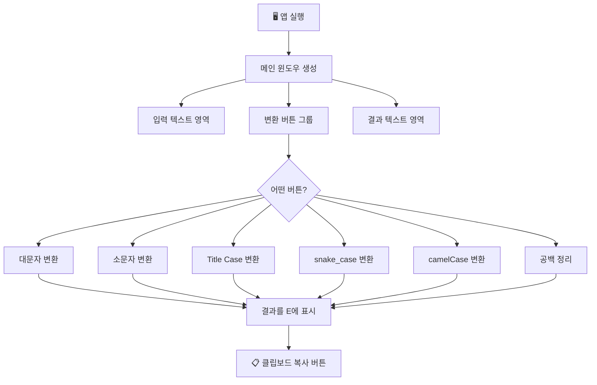
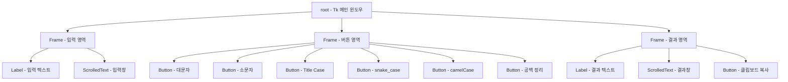
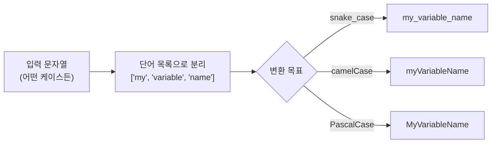
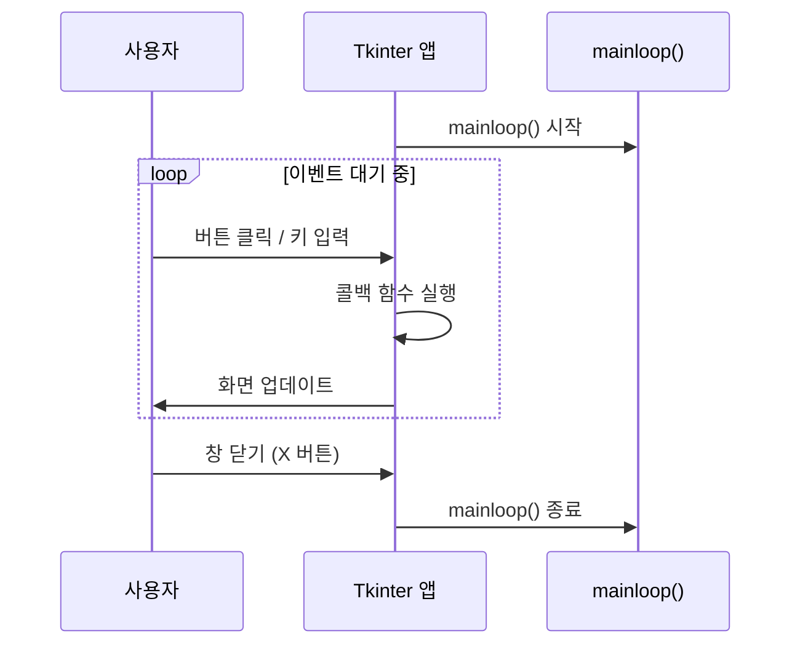

# 파이썬으로 만들기! 데스크톱 앱 시작  

저자: 최흥배, AI-Assisted   
    
권장 개발 환경
- **IDE**: Visual Code
- **컴파일러**: Python 3.13
- **OS**: Windows 10 이상

----- 
  
# Chapter 03. 나만의 텍스트 변환 앱 만들기

---

```
 _____ ____ __  ____    __    ____  ____ 
|_   _|  __|\  / /\ \  / /   /    \|  _ \
  | | | |__| \/ |  \ \/ /   | |  | | |_) |
  | | |  __| /\ |   \  /    | |  | |  __/
 _| |_| |___/ \/ |   \/     | |__| | |
|_____|____/__/\__|   /\      \____/|_|
  _____  ___  _  _ __   __ ____ ____  ____  ____  ____
 / ____||   \| \| |\ \ / /|  __| __ \|_   _|  __||  _ \
| |     | |) |    | \ V / | |__|    /  | | | |__ | |_) |
| |     |   /| \| |  | |  |  __| | \   | | |  __||  __/
| |____ | |) |    |  | |  | |___| |) | | | | |___| |
 \_____||___/|_|\__|  |_|  |____|____/ |_| |____|_|
     _    ____  ____
    / \  |  _ \|  _ \
   / _ \ | |_) | |_) |
  / ___ \|  __/|  __/
 /_/   \_\_|   |_|
```

---

**이번 챕터에서 배울 것들:**

이번 챕터에서는 Tkinter를 사용하여 **실용적인 텍스트 변환 앱**을 처음부터 끝까지 직접 만들어봅니다. 단순히 "Hello World"를 출력하는 것을 넘어서, 실제로 일상에서 쓸 수 있는 앱을 완성하는 것이 목표입니다.

완성되는 앱은 다음과 같은 기능을 가집니다:
- 텍스트를 대문자(UPPERCASE) / 소문자(lowercase)로 변환
- 앞글자만 대문자(Title Case)로 변환
- `snake_case` ↔ `camelCase` ↔ `PascalCase` 변환
- 공백 정리(앞뒤 공백 제거, 연속 공백 제거)
- 클립보드에 결과 복사

---

## **3-1. 이번 챕터의 전체 흐름**
본격적으로 코드를 짜기 전에, 앱이 어떤 구조로 만들어지는지 전체 흐름을 그림으로 파악해 봅시다.



또한, 앱의 위젯 구성을 계층으로 보면 다음과 같습니다:



---

## **3-2. 사전 준비 — 필요한 라이브러리 확인**
이번 챕터에서는 파이썬 기본 내장 라이브러리만으로 대부분의 기능을 구현할 수 있습니다. 단, 클립보드 복사 기능을 위해 `pyperclip`이라는 외부 라이브러리를 하나 추가합니다.

> 💡 **Tkinter는 별도 설치 필요 없음!**  
> Windows에 파이썬을 공식 사이트(python.org)에서 설치했다면, Tkinter는 이미 함께 포함되어 있습니다.

**pyperclip 설치하기:**

명령 프롬프트(CMD) 또는 PowerShell을 열고 아래 명령어를 입력하세요.

```bash
pip install pyperclip
```

설치가 완료되면 다음과 같이 출력됩니다:

```
Successfully installed pyperclip-1.x.x
```

---

## **3-3. 텍스트 변환 로직 먼저 만들기**
GUI를 만들기 전에, **"무엇을 할 것인지"** 즉 변환 로직을 먼저 순수 파이썬 함수로 작성합니다. 이렇게 하면 GUI와 로직이 분리되어 나중에 수정하기 훨씬 쉬워집니다.

> 💡 **왜 로직을 먼저 만드나요?**  
> 프로그래밍에서 "관심사의 분리(Separation of Concerns)"는 매우 중요한 원칙입니다. 화면을 담당하는 코드와 실제 처리를 담당하는 코드를 분리하면, 버그를 찾기도 쉽고 코드를 재사용하기도 쉬워집니다.

### **3-3-1. 대소문자 변환**
파이썬의 문자열(str)에는 이미 대소문자 변환 메서드가 내장되어 있습니다.

```python
# converter.py (로직 전용 파일)

def to_uppercase(text: str) -> str:
    """텍스트를 전부 대문자로 변환합니다."""
    return text.upper()

def to_lowercase(text: str) -> str:
    """텍스트를 전부 소문자로 변환합니다."""
    return text.lower()

def to_titlecase(text: str) -> str:
    """각 단어의 첫 글자를 대문자로 변환합니다."""
    return text.title()
```

> 💡 **`-> str` 이란?**  
> 파이썬의 **타입 힌트(Type Hint)** 문법입니다. "이 함수는 str 타입을 반환한다"는 것을 명시적으로 표현합니다. 실행에 영향을 주지는 않지만, 코드를 읽는 사람과 IDE가 함수의 의도를 이해하는 데 도움을 줍니다.

빠르게 동작 확인:

```python
# 동작 테스트
print(to_uppercase("hello world"))  # HELLO WORLD
print(to_lowercase("HELLO WORLD"))  # hello world
print(to_titlecase("hello world"))  # Hello World
```

### **3-3-2. snake_case / camelCase / PascalCase 변환**
이제 조금 복잡한 변환을 만들어봅시다. 먼저 각 케이스가 무엇인지 정리해 봅니다:

```
snake_case  → 단어 사이를 _로 연결, 모두 소문자  (예: my_variable_name)
camelCase   → 첫 단어는 소문자, 이후 단어 첫 글자는 대문자 (예: myVariableName)
PascalCase  → 모든 단어의 첫 글자가 대문자 (예: MyVariableName)
```

변환 전략은 다음과 같습니다. 어떤 케이스가 입력되든, 먼저 **단어 목록으로 쪼개고**, 그 다음 원하는 케이스로 **다시 조립**하는 방식을 사용합니다.



```python
import re

def _split_into_words(text: str) -> list[str]:
    """
    다양한 케이스의 텍스트를 단어 목록으로 분리하는 내부 함수입니다.
    snake_case, camelCase, PascalCase, 공백 구분 등을 모두 처리합니다.
    """
    # 1단계: camelCase/PascalCase의 대문자 앞에 공백 삽입
    #        예: "myVariableName" -> "my Variable Name"
    text = re.sub(r'([A-Z])', r' \1', text)

    # 2단계: 언더스코어(_), 하이픈(-), 연속 공백을 모두 공백으로 치환
    text = re.sub(r'[_\-\s]+', ' ', text)

    # 3단계: 앞뒤 공백 제거 후 공백 기준으로 분리, 빈 문자열 제거
    words = [w for w in text.strip().split(' ') if w]

    # 4단계: 모두 소문자로 정규화
    return [w.lower() for w in words]


def to_snake_case(text: str) -> str:
    """텍스트를 snake_case로 변환합니다."""
    words = _split_into_words(text)
    return '_'.join(words)


def to_camel_case(text: str) -> str:
    """텍스트를 camelCase로 변환합니다."""
    words = _split_into_words(text)
    if not words:
        return ""
    # 첫 단어는 소문자, 나머지는 첫 글자만 대문자
    return words[0] + ''.join(w.capitalize() for w in words[1:])


def to_pascal_case(text: str) -> str:
    """텍스트를 PascalCase로 변환합니다."""
    words = _split_into_words(text)
    return ''.join(w.capitalize() for w in words)
```

> 💡 **`re` 모듈이란?**  
> `re`는 파이썬 내장 **정규 표현식(Regular Expression)** 모듈입니다. 문자열에서 특정 패턴을 찾거나 치환할 때 강력한 도구입니다. `re.sub(패턴, 치환문자, 문자열)`은 패턴에 맞는 부분을 치환문자로 바꿔줍니다.

> 💡 **`_split_into_words`의 이름 앞에 `_`(언더스코어)가 붙은 이유는?**  
> 파이썬 관례(Convention)에서 이름 앞에 `_`를 붙이면 "이 함수는 이 파일 내부에서만 사용하는 함수"임을 나타냅니다. 공식적인 제한은 없지만, 코드를 읽는 사람에게 "직접 호출하지 마세요"라는 신호를 줍니다.

동작을 확인해봅시다:

```python
print(to_snake_case("myVariableName"))    # my_variable_name
print(to_snake_case("MyVariableName"))    # my_variable_name
print(to_snake_case("my variable name")) # my_variable_name

print(to_camel_case("my_variable_name")) # myVariableName
print(to_camel_case("My Variable Name")) # myVariableName

print(to_pascal_case("my_variable_name"))# MyVariableName
print(to_pascal_case("myVariableName"))  # MyVariableName
```

### **3-3-3. 공백 정리 기능**
마지막으로 공백을 깔끔하게 정리하는 함수를 만듭니다.

```python
def clean_whitespace(text: str) -> str:
    """
    텍스트의 공백을 정리합니다.
    - 앞뒤 공백 제거
    - 연속된 공백을 하나의 공백으로 압축
    - 각 줄의 앞뒤 공백 제거
    """
    # 줄 단위로 처리
    lines = text.splitlines()
    cleaned_lines = []
    for line in lines:
        # 각 줄의 연속 공백을 하나로 압축하고 앞뒤 공백 제거
        cleaned = re.sub(r' +', ' ', line).strip()
        cleaned_lines.append(cleaned)
    return '\n'.join(cleaned_lines).strip()
```

---

## **3-4. 변환 로직 파일 완성본**
위에서 만든 함수들을 하나의 파일 `converter.py`로 정리합니다. 프로젝트 폴더 구조는 다음과 같이 설계합니다:

```
text_converter_app/
│
├── converter.py     ← 변환 로직 (순수 파이썬 함수들)
└── main.py          ← GUI 앱 (Tkinter)
```

```python
# converter.py — 텍스트 변환 로직 모음

import re


def _split_into_words(text: str) -> list[str]:
    """다양한 케이스의 문자열을 단어 리스트로 분리합니다."""
    text = re.sub(r'([A-Z])', r' \1', text)
    text = re.sub(r'[_\-\s]+', ' ', text)
    words = [w for w in text.strip().split(' ') if w]
    return [w.lower() for w in words]


def to_uppercase(text: str) -> str:
    """전체 대문자로 변환합니다."""
    return text.upper()


def to_lowercase(text: str) -> str:
    """전체 소문자로 변환합니다."""
    return text.lower()


def to_titlecase(text: str) -> str:
    """각 단어의 첫 글자를 대문자로 변환합니다."""
    return text.title()


def to_snake_case(text: str) -> str:
    """snake_case로 변환합니다."""
    words = _split_into_words(text)
    return '_'.join(words)


def to_camel_case(text: str) -> str:
    """camelCase로 변환합니다."""
    words = _split_into_words(text)
    if not words:
        return ""
    return words[0] + ''.join(w.capitalize() for w in words[1:])


def to_pascal_case(text: str) -> str:
    """PascalCase로 변환합니다."""
    words = _split_into_words(text)
    return ''.join(w.capitalize() for w in words)


def clean_whitespace(text: str) -> str:
    """앞뒤 공백 및 연속 공백을 정리합니다."""
    lines = text.splitlines()
    cleaned_lines = [re.sub(r' +', ' ', line).strip() for line in lines]
    return '\n'.join(cleaned_lines).strip()
```

---

## **3-5. GUI 설계 — 화면을 먼저 스케치하자**
코드를 짜기 전에, 우리가 만들 앱의 화면을 머릿속으로 그려봅시다. 아래는 ASCII 아트로 표현한 앱의 레이아웃입니다:

```
┌─────────────────────────────────────────────────────┐
│          🔤 나만의 텍스트 변환 앱                     │
├─────────────────────────────────────────────────────┤
│  📥 입력 텍스트                                       │
│  ┌─────────────────────────────────────────────┐    │
│  │                                             │▲   │
│  │  여기에 변환할 텍스트를 입력하세요...            │█   │
│  │                                             │    │
│  │                                             │▼   │
│  └─────────────────────────────────────────────┘    │
│                                                     │
│  ┌──────────┐ ┌──────────┐ ┌──────────┐            │
│  │ 대문자    │ │ 소문자    │ │TitleCase │            │
│  └──────────┘ └──────────┘ └──────────┘            │
│  ┌──────────┐ ┌──────────┐ ┌──────────┐            │
│  │snake_case│ │camelCase │ │PascalCase│            │
│  └──────────┘ └──────────┘ └──────────┘            │
│  ┌──────────────────────────────────┐               │
│  │          공백 정리                │               │
│  └──────────────────────────────────┘               │
│                                                     │
│  📤 변환 결과                                        │
│  ┌─────────────────────────────────────────────┐    │
│  │                                             │▲   │
│  │  변환된 텍스트가 여기 표시됩니다...              │█   │
│  │                                             │    │
│  │                                             │▼   │
│  └─────────────────────────────────────────────┘    │
│             [ 📋 클립보드에 복사 ]                   │
└─────────────────────────────────────────────────────┘
```

---

## **3-6. GUI 만들기 — main.py 작성**
이제 본격적으로 GUI 코드를 작성합니다. 단계별로 차근차근 살펴보겠습니다.

### **3-6-1. 기본 윈도우 만들기**

```python
# main.py

import tkinter as tk
from tkinter import scrolledtext, messagebox
import pyperclip
import converter  # 우리가 만든 변환 로직 파일

# ── 메인 윈도우 설정 ───────────────────────────────────
root = tk.Tk()
root.title("🔤 나만의 텍스트 변환 앱")
root.geometry("600x700")          # 너비 600px, 높이 700px
root.resizable(True, True)        # 창 크기 조절 허용
root.configure(bg="#f0f4f8")      # 배경색 설정 (연한 회색빛 파란색)

root.mainloop()
```

> 💡 **`root.mainloop()`란?**  
> Tkinter 앱의 **이벤트 루프(Event Loop)**를 시작합니다. 이 코드가 실행되면 앱은 사용자의 입력(버튼 클릭, 키보드 입력 등)을 계속 기다리는 상태가 됩니다. `mainloop()`를 호출하지 않으면 창이 바로 닫혀버립니다.



### **3-6-2. 스타일 상수 정의**
색상이나 폰트 값을 코드 중간중간에 직접 쓰면 나중에 디자인을 바꾸기 어렵습니다. 상단에 상수로 모아두는 것이 좋은 습관입니다.

```python
# main.py — 스타일 상수 (파일 상단에 선언)

# ── 색상 팔레트 ────────────────────────────────────────
COLOR_BG        = "#f0f4f8"   # 전체 배경색
COLOR_FRAME_BG  = "#ffffff"   # 프레임 배경색 (흰색)
COLOR_BTN_CASE  = "#4a90d9"   # 케이스 변환 버튼 색 (파란색)
COLOR_BTN_CLEAN = "#6ab04c"   # 공백 정리 버튼 색 (초록색)
COLOR_BTN_COPY  = "#f39c12"   # 복사 버튼 색 (주황색)
COLOR_BTN_TEXT  = "#ffffff"   # 버튼 글자색 (흰색)
COLOR_LABEL     = "#2c3e50"   # 레이블 글자색 (진한 남색)

# ── 폰트 설정 ──────────────────────────────────────────
FONT_LABEL  = ("맑은 고딕", 11, "bold")
FONT_TEXT   = ("맑은 고딕", 10)
FONT_BTN    = ("맑은 고딕", 9, "bold")
```

> 💡 **Windows에서 한글 폰트 사용하기**  
> Windows 11에는 `맑은 고딕`이 기본으로 설치되어 있습니다. 한글이 포함된 UI를 만들 때는 이 폰트를 사용하면 깔끔하게 출력됩니다. 만약 다른 운영체제에서 동작시킬 것이라면 `나눔고딕` 등 해당 환경에서 사용 가능한 폰트를 사용해야 합니다.

### **3-6-3. 입력 영역 만들기**

```python
# main.py — 입력 영역

# ── 입력 영역 프레임 ───────────────────────────────────
frame_input = tk.Frame(root, bg=COLOR_FRAME_BG, bd=1, relief="solid")
frame_input.pack(fill="x", padx=15, pady=(15, 5))

tk.Label(
    frame_input,
    text="📥 입력 텍스트",
    font=FONT_LABEL,
    bg=COLOR_FRAME_BG,
    fg=COLOR_LABEL
).pack(anchor="w", padx=10, pady=(8, 2))

# ScrolledText: 스크롤바가 내장된 텍스트 입력창
input_text = scrolledtext.ScrolledText(
    frame_input,
    height=8,           # 표시할 줄 수
    font=FONT_TEXT,
    wrap=tk.WORD,       # 단어 단위로 줄바꿈
    relief="flat",
    bg="#fdfdfd"
)
input_text.pack(fill="x", padx=10, pady=(0, 10))
```

> 💡 **`scrolledtext.ScrolledText`란?**  
> 일반 `Text` 위젯에 **스크롤바를 자동으로 추가**해주는 편의 위젯입니다. 텍스트가 길어지면 자동으로 스크롤할 수 있게 됩니다.

> 💡 **`pack()` 레이아웃 매니저**  
> Tkinter에는 위젯을 배치하는 방법이 3가지 있습니다(`pack`, `grid`, `place`). `pack()`은 위젯을 **순서대로 쌓아가는** 방식으로 가장 간단합니다. `fill="x"`는 가로 방향으로 꽉 채우라는 의미이고, `padx`, `pady`는 바깥쪽 여백(margin)입니다.

### **3-6-4. 버튼 영역 만들기**
변환 버튼들은 `grid()` 레이아웃을 사용해서 격자(표) 형태로 배치합니다.

```python
# main.py — 버튼 영역

# ── 버튼 영역 프레임 ───────────────────────────────────
frame_buttons = tk.Frame(root, bg=COLOR_BG)
frame_buttons.pack(fill="x", padx=15, pady=5)

def make_case_btn(parent, text, command, row, col):
    """버튼 생성 헬퍼 함수 — 중복 코드를 줄이기 위해 사용합니다."""
    btn = tk.Button(
        parent,
        text=text,
        command=command,
        font=FONT_BTN,
        bg=COLOR_BTN_CASE,
        fg=COLOR_BTN_TEXT,
        activebackground="#2980b9",
        activeforeground=COLOR_BTN_TEXT,
        relief="flat",
        cursor="hand2",        # 마우스를 올리면 손 커서로 변경
        padx=10,
        pady=6,
    )
    btn.grid(row=row, column=col, padx=4, pady=4, sticky="ew")
    return btn

# 버튼 배치를 위해 각 열의 너비를 균등하게 설정
for i in range(3):
    frame_buttons.grid_columnconfigure(i, weight=1)

# 6개의 변환 버튼 (2행 3열 배치)
make_case_btn(frame_buttons, "🔠 대문자 (UPPER)",    lambda: convert(converter.to_uppercase),  0, 0)
make_case_btn(frame_buttons, "🔡 소문자 (lower)",    lambda: convert(converter.to_lowercase),  0, 1)
make_case_btn(frame_buttons, "🔤 Title Case",        lambda: convert(converter.to_titlecase),  0, 2)
make_case_btn(frame_buttons, "🐍 snake_case",        lambda: convert(converter.to_snake_case), 1, 0)
make_case_btn(frame_buttons, "🐪 camelCase",         lambda: convert(converter.to_camel_case), 1, 1)
make_case_btn(frame_buttons, "🅿️ PascalCase",        lambda: convert(converter.to_pascal_case),1, 2)

# 공백 정리 버튼 (전체 너비)
btn_clean = tk.Button(
    frame_buttons,
    text="🧹 공백 정리 (앞뒤 공백 / 연속 공백 제거)",
    command=lambda: convert(converter.clean_whitespace),
    font=FONT_BTN,
    bg=COLOR_BTN_CLEAN,
    fg=COLOR_BTN_TEXT,
    activebackground="#27ae60",
    activeforeground=COLOR_BTN_TEXT,
    relief="flat",
    cursor="hand2",
    pady=6,
)
btn_clean.grid(row=2, column=0, columnspan=3, padx=4, pady=4, sticky="ew")
```

> 💡 **`lambda`란?**  
> `lambda`는 이름 없는 함수(익명 함수)를 짧게 만드는 파이썬 문법입니다. `lambda: convert(converter.to_uppercase)`는 "버튼이 클릭됐을 때 `convert(converter.to_uppercase)`를 실행하라"는 의미입니다. 버튼의 `command` 옵션에는 함수 자체(호출하지 않은 것)를 넘겨야 하기 때문에 `lambda`로 감싸줍니다.

> 💡 **`grid_columnconfigure(i, weight=1)` 란?**  
> `weight=1`로 설정하면 해당 열이 창 크기가 변할 때 **균등하게 늘어납니다**. 3개의 열에 모두 동일한 weight를 주면, 3개의 버튼이 항상 동일한 너비를 유지합니다.

### **3-6-5. 결과 영역 만들기**

```python
# main.py — 결과 영역

# ── 결과 영역 프레임 ───────────────────────────────────
frame_output = tk.Frame(root, bg=COLOR_FRAME_BG, bd=1, relief="solid")
frame_output.pack(fill="both", expand=True, padx=15, pady=(5, 15))

tk.Label(
    frame_output,
    text="📤 변환 결과",
    font=FONT_LABEL,
    bg=COLOR_FRAME_BG,
    fg=COLOR_LABEL
).pack(anchor="w", padx=10, pady=(8, 2))

output_text = scrolledtext.ScrolledText(
    frame_output,
    height=8,
    font=FONT_TEXT,
    wrap=tk.WORD,
    relief="flat",
    bg="#f9f9f9",
    state="disabled",    # 처음에는 편집 불가 상태
)
output_text.pack(fill="both", expand=True, padx=10, pady=(0, 5))

# 클립보드 복사 버튼
btn_copy = tk.Button(
    frame_output,
    text="📋 클립보드에 복사",
    command=copy_to_clipboard,
    font=FONT_BTN,
    bg=COLOR_BTN_COPY,
    fg=COLOR_BTN_TEXT,
    activebackground="#e67e22",
    activeforeground=COLOR_BTN_TEXT,
    relief="flat",
    cursor="hand2",
    padx=15,
    pady=6,
)
btn_copy.pack(pady=(0, 10))
```

> 💡 **`state="disabled"` 란?**  
> 결과창은 사용자가 직접 편집할 수 없도록 `disabled` 상태로 설정합니다. 하지만 프로그램 코드에서 내용을 쓸 때는 잠깐 `NORMAL` 상태로 바꾸었다가 다시 `DISABLED`로 돌려놓는 패턴을 사용합니다(아래 함수 참고).

### **3-6-6. 핵심 함수 — convert()와 copy_to_clipboard()**
버튼을 눌렀을 때 실제 동작을 수행하는 두 가지 핵심 함수를 작성합니다.

```python
# main.py — 핵심 동작 함수들

def convert(func):
    """
    입력창의 텍스트를 가져와 변환 함수를 적용한 뒤,
    결과를 결과창에 표시합니다.

    Parameters:
        func: converter 모듈의 변환 함수 중 하나
    """
    # 1. 입력창에서 텍스트 가져오기
    #    "1.0"은 "1번째 줄의 0번째 문자"를 의미하는 Tkinter 인덱스
    #    tk.END는 텍스트의 맨 끝을 의미
    raw_text = input_text.get("1.0", tk.END)

    # 입력이 비어있으면 경고창 표시 후 종료
    if not raw_text.strip():
        messagebox.showwarning("입력 없음", "변환할 텍스트를 입력해주세요! 😊")
        return

    # 2. 변환 함수 적용
    result = func(raw_text.strip())

    # 3. 결과창에 표시
    #    결과창은 disabled 상태이므로, 내용을 쓰기 위해 잠깐 NORMAL로 변경
    output_text.config(state="normal")
    output_text.delete("1.0", tk.END)  # 기존 내용 지우기
    output_text.insert("1.0", result)  # 새 내용 삽입
    output_text.config(state="disabled")  # 다시 편집 불가로


def copy_to_clipboard():
    """
    결과창의 텍스트를 클립보드에 복사합니다.
    """
    output_text.config(state="normal")
    result = output_text.get("1.0", tk.END).strip()
    output_text.config(state="disabled")

    if not result:
        messagebox.showwarning("복사 실패", "복사할 내용이 없습니다! 🤔")
        return

    pyperclip.copy(result)
    messagebox.showinfo("복사 완료", "📋 클립보드에 복사되었습니다!")
```

> 💡 **Tkinter의 텍스트 인덱스 `"1.0"`**  
> 일반 프로그래밍에서는 인덱스가 0부터 시작하지만, Tkinter의 `Text` 위젯은 **"행.열"** 형식을 사용합니다. `"1.0"`은 첫 번째 줄(`1`), 첫 번째 문자(`0`)를 의미합니다. 즉, 텍스트의 제일 처음을 가리킵니다. `tk.END`는 텍스트의 끝을 가리키는 특수 상수입니다.

---

## **3-7. main.py 완성본**
지금까지 설명한 모든 부분을 하나의 완성된 파일로 합칩니다. 함수 정의가 버튼 생성보다 먼저 와야 하므로, 파일 구조 순서에 주의하세요.

```python
# main.py — 텍스트 변환 앱 메인 파일 (완성본)

import tkinter as tk
from tkinter import scrolledtext, messagebox
import pyperclip
import converter

# ──────────────────────────────────────────────────────
#  스타일 상수
# ──────────────────────────────────────────────────────
COLOR_BG        = "#f0f4f8"
COLOR_FRAME_BG  = "#ffffff"
COLOR_BTN_CASE  = "#4a90d9"
COLOR_BTN_CLEAN = "#6ab04c"
COLOR_BTN_COPY  = "#f39c12"
COLOR_BTN_TEXT  = "#ffffff"
COLOR_LABEL     = "#2c3e50"

FONT_LABEL  = ("맑은 고딕", 11, "bold")
FONT_TEXT   = ("맑은 고딕", 10)
FONT_BTN    = ("맑은 고딕", 9, "bold")

# ──────────────────────────────────────────────────────
#  메인 윈도우 생성
# ──────────────────────────────────────────────────────
root = tk.Tk()
root.title("🔤 나만의 텍스트 변환 앱")
root.geometry("620x720")
root.resizable(True, True)
root.configure(bg=COLOR_BG)

# ──────────────────────────────────────────────────────
#  입력 영역
# ──────────────────────────────────────────────────────
frame_input = tk.Frame(root, bg=COLOR_FRAME_BG, bd=1, relief="solid")
frame_input.pack(fill="x", padx=15, pady=(15, 5))

tk.Label(
    frame_input,
    text="📥 입력 텍스트",
    font=FONT_LABEL,
    bg=COLOR_FRAME_BG,
    fg=COLOR_LABEL
).pack(anchor="w", padx=10, pady=(8, 2))

input_text = scrolledtext.ScrolledText(
    frame_input,
    height=8,
    font=FONT_TEXT,
    wrap=tk.WORD,
    relief="flat",
    bg="#fdfdfd"
)
input_text.pack(fill="x", padx=10, pady=(0, 10))

# ──────────────────────────────────────────────────────
#  동작 함수 (버튼보다 먼저 정의!)
# ──────────────────────────────────────────────────────
def convert(func):
    """입력 텍스트에 변환 함수를 적용하고 결과를 출력합니다."""
    raw_text = input_text.get("1.0", tk.END)
    if not raw_text.strip():
        messagebox.showwarning("입력 없음", "변환할 텍스트를 입력해주세요! 😊")
        return
    result = func(raw_text.strip())
    output_text.config(state="normal")
    output_text.delete("1.0", tk.END)
    output_text.insert("1.0", result)
    output_text.config(state="disabled")


def copy_to_clipboard():
    """결과 텍스트를 클립보드에 복사합니다."""
    output_text.config(state="normal")
    result = output_text.get("1.0", tk.END).strip()
    output_text.config(state="disabled")
    if not result:
        messagebox.showwarning("복사 실패", "복사할 내용이 없습니다! 🤔")
        return
    pyperclip.copy(result)
    messagebox.showinfo("복사 완료", "📋 클립보드에 복사되었습니다!")

# ──────────────────────────────────────────────────────
#  버튼 영역
# ──────────────────────────────────────────────────────
frame_buttons = tk.Frame(root, bg=COLOR_BG)
frame_buttons.pack(fill="x", padx=15, pady=5)

for i in range(3):
    frame_buttons.grid_columnconfigure(i, weight=1)


def make_case_btn(parent, text, command, row, col):
    """버튼 생성 헬퍼 함수"""
    btn = tk.Button(
        parent,
        text=text,
        command=command,
        font=FONT_BTN,
        bg=COLOR_BTN_CASE,
        fg=COLOR_BTN_TEXT,
        activebackground="#2980b9",
        activeforeground=COLOR_BTN_TEXT,
        relief="flat",
        cursor="hand2",
        padx=10,
        pady=6,
    )
    btn.grid(row=row, column=col, padx=4, pady=4, sticky="ew")
    return btn


make_case_btn(frame_buttons, "🔠 대문자 (UPPER)",   lambda: convert(converter.to_uppercase),  0, 0)
make_case_btn(frame_buttons, "🔡 소문자 (lower)",   lambda: convert(converter.to_lowercase),  0, 1)
make_case_btn(frame_buttons, "🔤 Title Case",       lambda: convert(converter.to_titlecase),  0, 2)
make_case_btn(frame_buttons, "🐍 snake_case",       lambda: convert(converter.to_snake_case), 1, 0)
make_case_btn(frame_buttons, "🐪 camelCase",        lambda: convert(converter.to_camel_case), 1, 1)
make_case_btn(frame_buttons, "🅿️  PascalCase",      lambda: convert(converter.to_pascal_case),1, 2)

tk.Button(
    frame_buttons,
    text="🧹 공백 정리 (앞뒤 공백 / 연속 공백 제거)",
    command=lambda: convert(converter.clean_whitespace),
    font=FONT_BTN,
    bg=COLOR_BTN_CLEAN,
    fg=COLOR_BTN_TEXT,
    activebackground="#27ae60",
    activeforeground=COLOR_BTN_TEXT,
    relief="flat",
    cursor="hand2",
    pady=6,
).grid(row=2, column=0, columnspan=3, padx=4, pady=4, sticky="ew")

# ──────────────────────────────────────────────────────
#  결과 영역
# ──────────────────────────────────────────────────────
frame_output = tk.Frame(root, bg=COLOR_FRAME_BG, bd=1, relief="solid")
frame_output.pack(fill="both", expand=True, padx=15, pady=(5, 15))

tk.Label(
    frame_output,
    text="📤 변환 결과",
    font=FONT_LABEL,
    bg=COLOR_FRAME_BG,
    fg=COLOR_LABEL
).pack(anchor="w", padx=10, pady=(8, 2))

output_text = scrolledtext.ScrolledText(
    frame_output,
    height=8,
    font=FONT_TEXT,
    wrap=tk.WORD,
    relief="flat",
    bg="#f9f9f9",
    state="disabled",
)
output_text.pack(fill="both", expand=True, padx=10, pady=(0, 5))

tk.Button(
    frame_output,
    text="📋 클립보드에 복사",
    command=copy_to_clipboard,
    font=FONT_BTN,
    bg=COLOR_BTN_COPY,
    fg=COLOR_BTN_TEXT,
    activebackground="#e67e22",
    activeforeground=COLOR_BTN_TEXT,
    relief="flat",
    cursor="hand2",
    padx=15,
    pady=6,
).pack(pady=(0, 10))

# ──────────────────────────────────────────────────────
#  앱 실행
# ──────────────────────────────────────────────────────
root.mainloop()
```

---

## **3-8. 실행해보자!**
파일 두 개(`converter.py`, `main.py`)가 같은 폴더에 있는지 확인한 뒤, 터미널에서 다음 명령을 실행합니다:

```bash
cd text_converter_app
python main.py
```

앱이 실행되면 다음과 같이 사용해 봅시다:

```
┌─────────── 동작 예시 ───────────────┐

입력: "my variable name is important"

[🐍 snake_case 클릭] → my_variable_name_is_important
[🐪 camelCase 클릭]  → myVariableNameIsImportant
[🅿️ PascalCase 클릭] → MyVariableNameIsImportant
[🔠 대문자 클릭]     → MY VARIABLE NAME IS IMPORTANT
[🧹 공백 정리 클릭]  → my variable name is important

└─────────────────────────────────────┘
```

---

## **3-9. 조금 더 개선해보자 — 추가 기능 도전**
기본 앱이 완성됐다면, 아래의 기능들을 직접 추가해보는 것에 도전해보세요!

### **3-9-1. 문자 수 카운터 추가**
입력한 텍스트의 글자 수와 단어 수를 실시간으로 표시하는 기능입니다. 텍스트가 변경될 때마다 자동으로 업데이트됩니다.

```python
# main.py에 추가할 코드

# 입력 영역 프레임 안에 카운터 레이블 추가
lbl_counter = tk.Label(
    frame_input,
    text="글자 수: 0  |  단어 수: 0",
    font=("맑은 고딕", 9),
    bg=COLOR_FRAME_BG,
    fg="#7f8c8d"   # 회색 (부제목 느낌)
)
lbl_counter.pack(anchor="e", padx=10, pady=(0, 8))


def update_counter(event=None):
    """텍스트가 변경될 때마다 글자 수와 단어 수를 업데이트합니다."""
    text = input_text.get("1.0", tk.END).strip()
    char_count = len(text)
    word_count = len(text.split()) if text else 0
    lbl_counter.config(text=f"글자 수: {char_count}  |  단어 수: {word_count}")


# 텍스트가 변경될 때마다 update_counter 함수 호출
# <<Modified>>는 Text 위젯의 내용이 바뀔 때 발생하는 가상 이벤트
input_text.bind("<<Modified>>", lambda e: (
    input_text.edit_modified(False),  # Modified 플래그 리셋
    update_counter()
))
```

> 💡 **`bind()`란?**  
> Tkinter에서 `bind(이벤트, 함수)`는 특정 이벤트가 발생했을 때 함수를 실행하라는 의미입니다. `<<Modified>>`는 Text 위젯의 내용이 변경될 때 발생하는 **가상 이벤트(Virtual Event)**입니다. 꺾쇠 두 개(`<<`, `>>`)로 감싸인 것이 가상 이벤트의 특징입니다.

### **3-9-2. kebab-case 변환 추가**
프론트엔드 개발에서 자주 사용하는 `kebab-case`(단어를 `-`로 연결)도 추가해봅시다.

```python
# converter.py에 추가할 함수

def to_kebab_case(text: str) -> str:
    """텍스트를 kebab-case로 변환합니다. (예: my-variable-name)"""
    words = _split_into_words(text)
    return '-'.join(words)
```

```python
# main.py의 버튼 부분에 추가
# (기존 2행을 3행으로 확장하고 grid_columnconfigure도 조정 필요)
make_case_btn(frame_buttons, "🍢 kebab-case", lambda: convert(converter.to_kebab_case), 2, 0)
```

### **3-9-3. 되돌리기(Undo) 기능**
마지막 변환 전의 텍스트를 기억해두었다가 되돌리는 기능입니다.

```python
# main.py에 추가할 코드

# 변환 이력을 저장할 스택 (리스트를 스택처럼 사용)
history_stack = []


def convert(func):
    """입력 텍스트에 변환 함수를 적용하고 결과를 출력합니다. (Undo 지원)"""
    raw_text = input_text.get("1.0", tk.END)
    if not raw_text.strip():
        messagebox.showwarning("입력 없음", "변환할 텍스트를 입력해주세요! 😊")
        return

    # 변환 전 상태를 스택에 저장
    history_stack.append(raw_text)

    result = func(raw_text.strip())

    output_text.config(state="normal")
    output_text.delete("1.0", tk.END)
    output_text.insert("1.0", result)
    output_text.config(state="disabled")


def undo_last():
    """마지막 변환 이전 텍스트로 입력창을 되돌립니다."""
    if not history_stack:
        messagebox.showinfo("되돌리기 불가", "되돌릴 이력이 없습니다.")
        return
    previous_text = history_stack.pop()
    input_text.delete("1.0", tk.END)
    input_text.insert("1.0", previous_text.strip())


# 되돌리기 버튼 추가 (버튼 영역 내)
tk.Button(
    frame_buttons,
    text="↩️ 되돌리기",
    command=undo_last,
    font=FONT_BTN,
    bg="#95a5a6",
    fg=COLOR_BTN_TEXT,
    relief="flat",
    cursor="hand2",
    pady=6,
).grid(row=3, column=0, columnspan=3, padx=4, pady=(0, 4), sticky="ew")
```

---

## **3-10. 이번 챕터 정리**
이번 챕터에서 배운 내용을 정리해봅시다:

```
┌─────────────────────────────────────────────────────────┐
│                  Chapter 03 배운 것들                    │
├──────────────────────┬──────────────────────────────────┤
│ 개념                 │ 핵심 내용                        │
├──────────────────────┼──────────────────────────────────┤
│ 관심사의 분리        │ 로직(converter.py)과              │
│                      │ GUI(main.py)를 파일로 분리        │
├──────────────────────┼──────────────────────────────────┤
│ ScrolledText         │ 스크롤 바 내장 텍스트 위젯        │
├──────────────────────┼──────────────────────────────────┤
│ pack / grid 레이아웃 │ 위젯 배치의 두 가지 방법         │
├──────────────────────┼──────────────────────────────────┤
│ lambda               │ 버튼 콜백에 인자를 넘기는 패턴   │
├──────────────────────┼──────────────────────────────────┤
│ state="disabled"     │ 결과창 편집 잠금 / 해제 패턴     │
├──────────────────────┼──────────────────────────────────┤
│ messagebox           │ 경고 / 정보 팝업 대화상자         │
├──────────────────────┼──────────────────────────────────┤
│ pyperclip            │ 클립보드 복사 외부 라이브러리     │
├──────────────────────┼──────────────────────────────────┤
│ re 모듈              │ 정규 표현식으로 문자열 변환       │
├──────────────────────┼──────────────────────────────────┤
│ bind() / 가상 이벤트 │ 텍스트 변경 감지 및 실시간 반응  │
└──────────────────────┴──────────────────────────────────┘
```

**잘 하셨습니다!** 🎉 이번 챕터에서는 단순한 "화면 출력"을 넘어서, 실제로 동작하는 유틸리티 앱을 처음부터 끝까지 완성해봤습니다. 로직과 GUI를 분리하는 습관, 헬퍼 함수로 중복 코드를 줄이는 패턴, 그리고 이벤트 기반 프로그래밍의 흐름을 자연스럽게 익히셨을 것입니다.

다음 챕터에서는 이보다 한 단계 더 나아가, 외부 PDF 파일을 다루는 앱을 만들어봅니다!

---

> 📂 **이번 챕터의 최종 파일 구조**
> ```
> text_converter_app/
> ├── converter.py   ← 텍스트 변환 로직
> └── main.py        ← Tkinter GUI 앱
> ```  
  