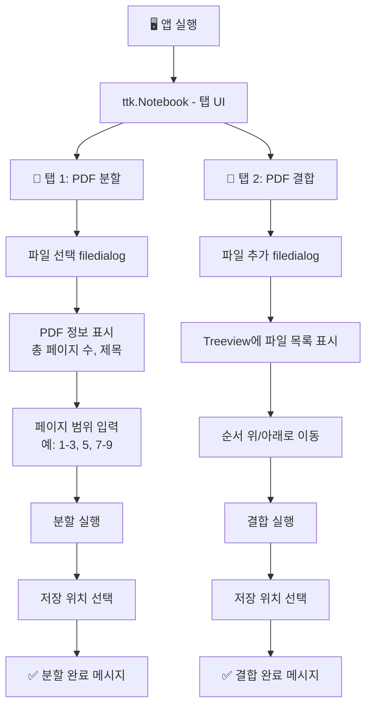
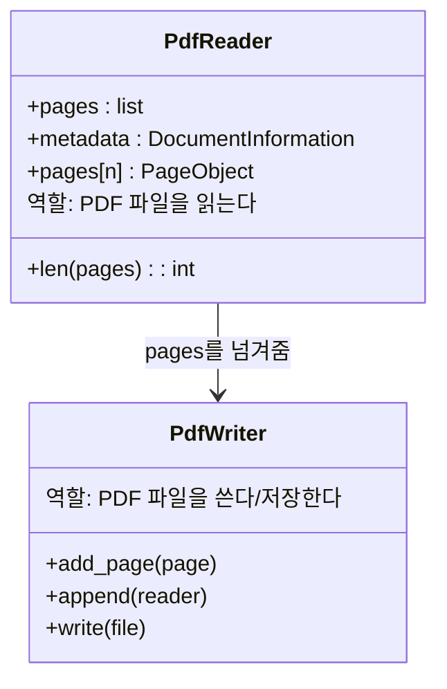
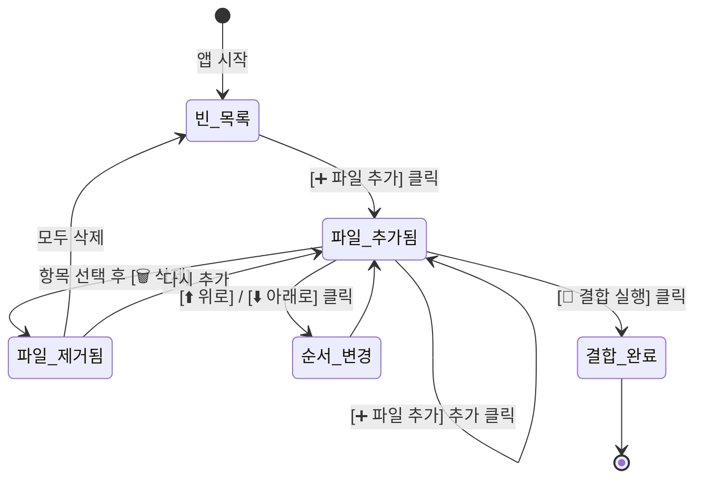

# 파이썬으로 만들기! 데스크톱 앱 시작  

저자: 최흥배, AI-Assisted   
    
권장 개발 환경
- **IDE**: Visual Code
- **컴파일러**: Python 3.13
- **OS**: Windows 10 이상

----- 
  
# Chapter 04. GUI 조작으로 PDF를 분할·결합

---

```
 ____  ____  _____      _    ____  ____
|  _ \|  _ \|  ___|    / \  |  _ \|  _ \
| |_) | | | | |_      / _ \ | |_) | |_) |
|  __/| |_| |  _|    / ___ \|  __/|  __/
|_|   |____/|_|     /_/   \_\_|   |_|

 __  __   _   _  _  _  ____  ____  __    ____  ____
|  \/  | / \ | \| || || __ \| __ \|  |  | __ \|  _ \
| |\/| |/ _ \|    || ||  __/|  __/| |  |  __/| |_) |
|_|  |_/_/ \_\_|\__|_||_|   |_|   |___|_|    |_|  \_\
```

---

**이번 챕터에서 배울 것들:**

이번 챕터에서는 일상에서 매우 자주 쓰이는 **PDF 분할 및 결합 앱**을 만들어봅니다. "30페이지짜리 PDF에서 5~10페이지만 뽑아내고 싶다", "여러 개의 PDF를 하나로 합치고 싶다"는 상황은 업무에서 빈번하게 발생합니다. 이 챕터가 끝나면 그런 작업을 버튼 클릭 몇 번으로 처리하는 자신만의 앱이 완성됩니다.

이번 챕터에서 익히는 핵심 개념은 다음과 같습니다:
- `pypdf` 라이브러리를 이용한 PDF 읽기, 분할, 결합
- `ttk.Notebook`을 이용한 탭(Tab) UI 구성
- `ttk.Treeview`를 이용한 파일 목록 표시 및 순서 변경
- `filedialog`를 이용한 파일 열기/저장 대화상자
- 페이지 범위 파싱 (예: `"1-3, 5, 7-9"`)

---

## **4-1. 이번 챕터의 전체 흐름**

앱은 **두 개의 탭**으로 구성됩니다. 첫 번째 탭은 PDF 분할, 두 번째 탭은 PDF 결합 기능을 담당합니다.



**최종 앱의 화면 레이아웃:**

```
┌──────────────────────────────────────────────────────────┐
│  🗂️  PDF 분할 · 결합 도구                                 │
├──────────────────┬───────────────────────────────────────┤
│  📄 PDF 분할     │  📎 PDF 결합                          │  ← 탭
├──────────────────┴───────────────────────────────────────┤
│                                                          │
│  ┌──────────────────────────────────────────────────┐   │
│  │  선택한 파일: example.pdf  (총 15 페이지)         │   │
│  └──────────────────────────────────────────────────┘   │
│                                                          │
│  [파일 선택]                                             │
│                                                          │
│  페이지 범위: [  1-3, 5, 8-10          ]                 │
│  (예: 1-3, 5, 8-10  /  비워두면 전체 페이지)            │
│                                                          │
│  출력 파일명: [  output_split.pdf      ]                 │
│                                                          │
│            [ ✂️ 분할 실행 ]                              │
│                                                          │
└──────────────────────────────────────────────────────────┘
```

```
┌──────────────────────────────────────────────────────────┐
│  🗂️  PDF 분할 · 결합 도구                                 │
├──────────────────┬───────────────────────────────────────┤
│  📄 PDF 분할     │  📎 PDF 결합                          │
├──────────────────┴───────────────────────────────────────┤
│                                                          │
│  파일 목록 (위에서부터 순서대로 결합됩니다)              │
│  ┌──┬────────────────────────┬──────┐                   │
│  │# │ 파일명                 │ 페이지│                   │
│  ├──┼────────────────────────┼──────┤                   │
│  │1 │ document_a.pdf         │  5   │                   │
│  │2 │ report_2024.pdf        │  12  │                   │
│  │3 │ appendix.pdf           │  3   │                   │
│  └──┴────────────────────────┴──────┘                   │
│                                                          │
│  [➕ 파일 추가] [🗑️ 삭제] [⬆️ 위로] [⬇️ 아래로]          │
│                                                          │
│            [ 📎 결합 실행 ]                              │
│                                                          │
└──────────────────────────────────────────────────────────┘
```

---

## **4-2. 사전 준비 — pypdf 설치**

이번 챕터에서 사용하는 외부 라이브러리는 `pypdf` 하나뿐입니다.

> 💡 **pypdf vs PyPDF2 — 무엇이 다른가요?**  
> `PyPDF2`는 오래된 이름입니다. 2022년 이후 프로젝트가 `pypdf`라는 이름으로 통합되었습니다. 현재(2025년 기준) 적극적으로 유지보수되는 것은 `pypdf`이므로, 새 프로젝트에서는 항상 `pypdf`를 사용하세요. 인터넷에서 `PyPDF2` 코드를 발견해도 대부분 `from pypdf import ...`로 바꾸기만 하면 그대로 동작합니다.

```bash
pip install pypdf
```

설치 확인:

```python
import pypdf
print(pypdf.__version__)   # 예: 6.x.x
```

**프로젝트 폴더 구조:**

```
pdf_tool_app/
│
├── pdf_logic.py     ← PDF 처리 로직 (pypdf 사용)
└── main.py          ← GUI 앱 (Tkinter)
```

---

## **4-3. PDF 처리 로직 먼저 만들기**

Chapter 03에서 그랬듯, GUI와 로직을 분리하여 `pdf_logic.py`를 먼저 작성합니다.

### **4-3-1. pypdf의 기본 구조 이해하기**

`pypdf`의 핵심 클래스는 단 두 가지입니다:



가장 간단한 사용 패턴은 다음과 같습니다:

```python
from pypdf import PdfReader, PdfWriter

# 읽기
reader = PdfReader("input.pdf")
print(f"총 {len(reader.pages)} 페이지")  # 페이지 수 확인

# 특정 페이지를 새 PDF로 저장
writer = PdfWriter()
writer.add_page(reader.pages[0])   # 0번 인덱스 = 1번째 페이지
with open("output.pdf", "wb") as f:
    writer.write(f)
```

> 💡 **페이지 번호는 0부터 시작!**  
> 사람이 보는 PDF의 "1페이지"는 파이썬 코드에서 `reader.pages[0]`입니다. 이 차이를 항상 염두에 두세요. 사용자에게 보여주는 번호와 내부 인덱스 사이의 변환(+1, -1)이 이번 챕터의 작은 함정 중 하나입니다.

### **4-3-2. 페이지 범위 문자열 파싱**

사용자가 `"1-3, 5, 8-10"` 같은 문자열을 입력하면, 이것을 실제 페이지 인덱스 리스트 `[0, 1, 2, 4, 7, 8, 9]`로 변환해야 합니다. 이 부분이 이번 챕터에서 가장 중요한 순수 로직입니다.

```
입력 문자열:  "1-3, 5, 8-10"
                ↓  파싱
페이지 번호:  [1, 2, 3, 5, 8, 9, 10]   ← 사람이 보는 번호 (1-based)
                ↓  인덱스 변환 (-1)
파이썬 인덱스: [0, 1, 2, 4, 7, 8, 9]   ← pypdf에서 사용하는 번호 (0-based)
```

```python
# pdf_logic.py

def parse_page_range(range_str: str, total_pages: int) -> list[int]:
    """
    페이지 범위 문자열을 파이썬 인덱스 리스트로 변환합니다.

    Args:
        range_str   : "1-3, 5, 8-10" 형식의 문자열
                      빈 문자열이면 전체 페이지를 반환합니다.
        total_pages : PDF의 전체 페이지 수 (범위 유효성 검사에 사용)

    Returns:
        0-based 인덱스 리스트. 예: [0, 1, 2, 4, 7, 8, 9]

    Raises:
        ValueError : 잘못된 형식이나 범위를 벗어난 페이지 번호가 있을 때
    """
    # 빈 문자열이면 전체 페이지 반환
    if not range_str.strip():
        return list(range(total_pages))

    indices = []
    # 쉼표로 각 토큰을 분리
    tokens = range_str.split(",")

    for token in tokens:
        token = token.strip()
        if not token:
            continue

        if "-" in token:
            # "1-3" 형식 처리
            parts = token.split("-")
            if len(parts) != 2:
                raise ValueError(f"잘못된 범위 형식입니다: '{token}'")
            try:
                start = int(parts[0].strip())
                end   = int(parts[1].strip())
            except ValueError:
                raise ValueError(f"숫자가 아닌 값이 포함되어 있습니다: '{token}'")

            if start > end:
                raise ValueError(f"시작 페이지가 끝 페이지보다 큽니다: '{token}'")
            if start < 1 or end > total_pages:
                raise ValueError(
                    f"페이지 범위를 벗어났습니다: '{token}' "
                    f"(이 PDF는 1~{total_pages} 페이지입니다)"
                )
            # 1-based → 0-based 변환
            indices.extend(range(start - 1, end))
        else:
            # "5" 형식 처리 (단일 페이지)
            try:
                page_num = int(token)
            except ValueError:
                raise ValueError(f"숫자가 아닌 값이 포함되어 있습니다: '{token}'")

            if page_num < 1 or page_num > total_pages:
                raise ValueError(
                    f"페이지 번호를 벗어났습니다: '{page_num}' "
                    f"(이 PDF는 1~{total_pages} 페이지입니다)"
                )
            # 1-based → 0-based 변환
            indices.append(page_num - 1)

    # 중복 제거 후 순서 유지
    seen = set()
    unique_indices = []
    for i in indices:
        if i not in seen:
            seen.add(i)
            unique_indices.append(i)

    return unique_indices
```

동작을 바로 확인해봅시다:

```python
# 테스트
print(parse_page_range("1-3, 5, 8-10", 15))
# → [0, 1, 2, 4, 7, 8, 9]

print(parse_page_range("", 10))
# → [0, 1, 2, 3, 4, 5, 6, 7, 8, 9]  (전체)

print(parse_page_range("1, 1, 2", 10))
# → [0, 1]  (중복 제거)
```

> 💡 **`seen = set()` 패턴으로 중복을 제거하는 이유**  
> `list(set(indices))`로 간단히 중복을 제거할 수도 있지만, `set`은 **순서를 보장하지 않습니다**. `"3, 1, 2"`를 입력했을 때 `[2, 0, 1]` 순서가 유지되어야 하기 때문에, `seen` 집합으로 이미 추가했는지 확인하면서 순서를 지키는 방식을 사용했습니다.

### **4-3-3. PDF 분할 함수**

페이지 범위 파싱이 준비됐으니, 실제 분할 함수를 만듭니다.

```python
# pdf_logic.py — PDF 분할

from pypdf import PdfReader, PdfWriter


def get_pdf_info(filepath: str) -> dict:
    """
    PDF 파일의 기본 정보를 딕셔너리로 반환합니다.

    Returns:
        {"total_pages": int, "title": str, "author": str}
    """
    reader = PdfReader(filepath)
    meta = reader.metadata  # 메타데이터 (없을 수도 있으므로 None 체크 필요)

    return {
        "total_pages": len(reader.pages),
        "title" : (meta.title  or "제목 없음") if meta else "제목 없음",
        "author": (meta.author or "작성자 없음") if meta else "작성자 없음",
    }


def split_pdf(
    input_path: str,
    output_path: str,
    range_str: str
) -> int:
    """
    PDF 파일에서 지정된 페이지 범위만 추출하여 새 파일로 저장합니다.

    Args:
        input_path  : 원본 PDF 파일 경로
        output_path : 저장할 PDF 파일 경로
        range_str   : 페이지 범위 문자열 (예: "1-3, 5, 8-10")

    Returns:
        저장된 페이지 수

    Raises:
        ValueError : 잘못된 페이지 범위
        FileNotFoundError : 파일을 찾을 수 없을 때
    """
    reader = PdfReader(input_path)
    total = len(reader.pages)

    # 페이지 범위 파싱
    indices = parse_page_range(range_str, total)

    if not indices:
        raise ValueError("추출할 페이지가 하나도 없습니다.")

    # 지정된 페이지만 writer에 추가
    writer = PdfWriter()
    for idx in indices:
        writer.add_page(reader.pages[idx])

    # 파일로 저장
    with open(output_path, "wb") as f:
        writer.write(f)

    return len(indices)
```

> 💡 **`"wb"` 모드란?**  
> 파일을 열 때 `"wb"`는 **"w"rite + "b"inary** 의 약자입니다. PDF는 텍스트가 아닌 바이너리 형식이기 때문에 반드시 `"wb"` 모드로 써야 합니다. 텍스트 파일을 쓸 때 쓰는 `"w"` 모드와 다른 점을 기억해두세요.

### **4-3-4. PDF 결합 함수**

여러 PDF 파일을 순서대로 이어붙이는 함수입니다.

```python
# pdf_logic.py — PDF 결합

def merge_pdfs(
    input_paths: list[str],
    output_path: str
) -> int:
    """
    여러 PDF 파일을 순서대로 결합하여 하나의 파일로 저장합니다.

    Args:
        input_paths : 결합할 PDF 파일 경로 리스트 (순서대로 결합됩니다)
        output_path : 저장할 PDF 파일 경로

    Returns:
        최종 PDF의 총 페이지 수

    Raises:
        ValueError          : 입력 파일이 없을 때
        FileNotFoundError   : 파일을 찾을 수 없을 때
    """
    if not input_paths:
        raise ValueError("결합할 PDF 파일이 없습니다.")

    writer = PdfWriter()

    for path in input_paths:
        # append()는 PdfReader를 자동으로 생성하고 모든 페이지를 추가합니다
        writer.append(path)

    with open(output_path, "wb") as f:
        writer.write(f)

    return len(writer.pages)
```

> 💡 **`writer.append(path)`의 편리함**  
> `pypdf`의 `PdfWriter.append()`는 파일 경로 문자열을 직접 받을 수 있습니다. 내부적으로 `PdfReader`를 만들고, 모든 페이지를 추가하고, 파일을 닫는 과정을 한 번에 처리합니다. 덕분에 결합 로직이 단 세 줄로 끝납니다.

---

## **4-4. pdf_logic.py 완성본**

```python
# pdf_logic.py — PDF 처리 로직 완성본

from pypdf import PdfReader, PdfWriter


# ──────────────────────────────────────────────────────
#  유틸리티 함수
# ──────────────────────────────────────────────────────

def parse_page_range(range_str: str, total_pages: int) -> list[int]:
    """페이지 범위 문자열을 0-based 인덱스 리스트로 변환합니다."""
    if not range_str.strip():
        return list(range(total_pages))

    indices = []
    tokens = range_str.split(",")

    for token in tokens:
        token = token.strip()
        if not token:
            continue

        if "-" in token:
            parts = token.split("-")
            if len(parts) != 2:
                raise ValueError(f"잘못된 범위 형식입니다: '{token}'")
            try:
                start = int(parts[0].strip())
                end   = int(parts[1].strip())
            except ValueError:
                raise ValueError(f"숫자가 아닌 값이 포함되어 있습니다: '{token}'")
            if start > end:
                raise ValueError(f"시작 페이지가 끝 페이지보다 큽니다: '{token}'")
            if start < 1 or end > total_pages:
                raise ValueError(
                    f"페이지 범위를 벗어났습니다: '{token}' "
                    f"(이 PDF는 1~{total_pages} 페이지입니다)"
                )
            indices.extend(range(start - 1, end))
        else:
            try:
                page_num = int(token)
            except ValueError:
                raise ValueError(f"숫자가 아닌 값이 포함되어 있습니다: '{token}'")
            if page_num < 1 or page_num > total_pages:
                raise ValueError(
                    f"페이지 번호를 벗어났습니다: '{page_num}' "
                    f"(이 PDF는 1~{total_pages} 페이지입니다)"
                )
            indices.append(page_num - 1)

    seen = set()
    unique_indices = []
    for i in indices:
        if i not in seen:
            seen.add(i)
            unique_indices.append(i)

    return unique_indices


def get_pdf_info(filepath: str) -> dict:
    """PDF 파일의 기본 정보를 반환합니다."""
    reader = PdfReader(filepath)
    meta = reader.metadata
    return {
        "total_pages": len(reader.pages),
        "title" : (meta.title  or "제목 없음") if meta else "제목 없음",
        "author": (meta.author or "작성자 없음") if meta else "작성자 없음",
    }


# ──────────────────────────────────────────────────────
#  핵심 기능 함수
# ──────────────────────────────────────────────────────

def split_pdf(input_path: str, output_path: str, range_str: str) -> int:
    """PDF를 지정한 페이지 범위로 분할 저장합니다."""
    reader = PdfReader(input_path)
    total  = len(reader.pages)
    indices = parse_page_range(range_str, total)

    if not indices:
        raise ValueError("추출할 페이지가 하나도 없습니다.")

    writer = PdfWriter()
    for idx in indices:
        writer.add_page(reader.pages[idx])

    with open(output_path, "wb") as f:
        writer.write(f)

    return len(indices)


def merge_pdfs(input_paths: list[str], output_path: str) -> int:
    """여러 PDF를 하나로 결합하여 저장합니다."""
    if not input_paths:
        raise ValueError("결합할 PDF 파일이 없습니다.")

    writer = PdfWriter()
    for path in input_paths:
        writer.append(path)

    with open(output_path, "wb") as f:
        writer.write(f)

    return len(writer.pages)
```

---

## **4-5. GUI 만들기 — main.py 작성**

### **4-5-1. 기반 코드 및 스타일 설정**

```python
# main.py

import tkinter as tk
from tkinter import ttk, filedialog, messagebox
import os
import pdf_logic

# ──────────────────────────────────────────────────────
#  스타일 상수
# ──────────────────────────────────────────────────────
COLOR_BG        = "#f5f6fa"
COLOR_FRAME_BG  = "#ffffff"
COLOR_ACCENT    = "#3498db"    # 파란색 (주요 버튼)
COLOR_DANGER    = "#e74c3c"    # 빨간색 (삭제 버튼)
COLOR_SUCCESS   = "#27ae60"    # 초록색 (실행 버튼)
COLOR_MOVE      = "#95a5a6"    # 회색 (이동 버튼)
COLOR_WHITE     = "#ffffff"
COLOR_LABEL     = "#2c3e50"
COLOR_SUBLABEL  = "#7f8c8d"

FONT_TITLE  = ("맑은 고딕", 13, "bold")
FONT_LABEL  = ("맑은 고딕", 10, "bold")
FONT_NORMAL = ("맑은 고딕", 9)
FONT_BTN    = ("맑은 고딕", 9, "bold")
FONT_INFO   = ("맑은 고딕", 9)

# ──────────────────────────────────────────────────────
#  메인 윈도우
# ──────────────────────────────────────────────────────
root = tk.Tk()
root.title("🗂️ PDF 분할 · 결합 도구")
root.geometry("680x560")
root.resizable(True, True)
root.configure(bg=COLOR_BG)
```

### **4-5-2. ttk.Notebook으로 탭 UI 만들기**

```python
# main.py — 탭 UI

# ttk.Style로 탭의 디자인을 커스터마이즈
style = ttk.Style()
style.theme_use("clam")   # Windows 11에서 비교적 깔끔한 테마
style.configure(
    "TNotebook.Tab",
    font=FONT_LABEL,
    padding=[16, 6],
)
style.configure("TNotebook", background=COLOR_BG)

# Notebook 위젯 (탭 컨테이너)
notebook = ttk.Notebook(root)
notebook.pack(fill="both", expand=True, padx=15, pady=15)

# 각 탭의 내용을 담을 Frame 생성
tab_split = tk.Frame(notebook, bg=COLOR_FRAME_BG)
tab_merge = tk.Frame(notebook, bg=COLOR_FRAME_BG)

# Notebook에 탭 추가
notebook.add(tab_split, text="  ✂️  PDF 분할  ")
notebook.add(tab_merge, text="  📎  PDF 결합  ")
```

> 💡 **`ttk.Notebook`이란?**  
> 웹 브라우저의 탭처럼, 하나의 창 안에서 여러 "페이지"를 전환할 수 있게 해주는 위젯입니다. `notebook.add(frame, text="탭 이름")`으로 탭을 추가합니다. 각 탭 안에는 일반 `Frame`을 넣고, 그 안에 원하는 위젯들을 자유롭게 배치하면 됩니다.

> 💡 **`ttk.Style`과 테마**  
> `ttk` 위젯은 운영체제의 기본 스타일을 따르는데, `style.theme_use("clam")`처럼 테마를 직접 지정하면 플랫폼에 관계없이 일관된 모양을 유지할 수 있습니다. 사용 가능한 테마는 `ttk.Style().theme_names()`로 확인할 수 있습니다.

### **4-5-3. 분할 탭 UI 구성**

분할 탭에서는 파일을 선택하고, 페이지 범위를 입력하고, 분할을 실행합니다.

```python
# main.py — 분할 탭 UI

# 분할 탭에서 사용할 상태 변수
split_filepath = tk.StringVar(value="")   # 선택된 파일 경로
split_info_var = tk.StringVar(value="파일을 선택해주세요.")  # 파일 정보 표시

# ── 파일 정보 표시 영역 ────────────────────────────────
frame_split_info = tk.Frame(tab_split, bg=COLOR_FRAME_BG)
frame_split_info.pack(fill="x", padx=20, pady=(20, 0))

tk.Label(
    frame_split_info,
    text="📄 선택된 파일",
    font=FONT_LABEL,
    bg=COLOR_FRAME_BG,
    fg=COLOR_LABEL
).pack(anchor="w")

tk.Label(
    frame_split_info,
    textvariable=split_info_var,   # 이 변수가 바뀌면 자동으로 표시가 바뀜
    font=FONT_INFO,
    bg="#eaf4fb",
    fg=COLOR_LABEL,
    relief="flat",
    anchor="w",
    padx=10,
    pady=8,
    wraplength=580
).pack(fill="x", pady=(4, 0))

# ── 파일 선택 버튼 ────────────────────────────────────
tk.Button(
    tab_split,
    text="📂 PDF 파일 선택",
    command=lambda: on_select_split_file(),
    font=FONT_BTN,
    bg=COLOR_ACCENT,
    fg=COLOR_WHITE,
    activebackground="#2980b9",
    relief="flat",
    cursor="hand2",
    padx=12, pady=5
).pack(anchor="w", padx=20, pady=(10, 0))

# 구분선
ttk.Separator(tab_split, orient="horizontal").pack(fill="x", padx=20, pady=15)

# ── 페이지 범위 입력 ──────────────────────────────────
frame_range = tk.Frame(tab_split, bg=COLOR_FRAME_BG)
frame_range.pack(fill="x", padx=20)

tk.Label(
    frame_range,
    text="✂️ 추출할 페이지 범위",
    font=FONT_LABEL,
    bg=COLOR_FRAME_BG,
    fg=COLOR_LABEL
).grid(row=0, column=0, sticky="w", pady=(0, 4))

tk.Label(
    frame_range,
    text="(예: 1-3, 5, 8-10   /   비워두면 전체 페이지)",
    font=("맑은 고딕", 8),
    bg=COLOR_FRAME_BG,
    fg=COLOR_SUBLABEL
).grid(row=0, column=1, sticky="w", padx=(10, 0), pady=(0, 4))

split_range_entry = tk.Entry(
    frame_range,
    font=FONT_NORMAL,
    relief="solid",
    bd=1,
    width=35
)
split_range_entry.grid(row=1, column=0, columnspan=2, sticky="ew", ipady=4)
frame_range.grid_columnconfigure(0, weight=1)

# ── 출력 파일명 입력 ───────────────────────────────────
frame_outname = tk.Frame(tab_split, bg=COLOR_FRAME_BG)
frame_outname.pack(fill="x", padx=20, pady=(12, 0))

tk.Label(
    frame_outname,
    text="💾 출력 파일명",
    font=FONT_LABEL,
    bg=COLOR_FRAME_BG,
    fg=COLOR_LABEL
).pack(anchor="w", pady=(0, 4))

split_outname_entry = tk.Entry(
    frame_outname,
    font=FONT_NORMAL,
    relief="solid",
    bd=1,
    width=35
)
split_outname_entry.insert(0, "output_split.pdf")
split_outname_entry.pack(fill="x", ipady=4)

# ── 실행 버튼 ─────────────────────────────────────────
tk.Button(
    tab_split,
    text="✂️  분할 실행",
    command=lambda: on_split(),
    font=("맑은 고딕", 11, "bold"),
    bg=COLOR_SUCCESS,
    fg=COLOR_WHITE,
    activebackground="#219a52",
    relief="flat",
    cursor="hand2",
    padx=30, pady=8
).pack(pady=25)
```

### **4-5-4. 분할 탭 동작 함수**

```python
# main.py — 분할 탭 동작 함수

# 분할 탭에서 사용할 내부 상태 (딕셔너리로 관리)
split_state = {
    "filepath": "",       # 선택된 파일 경로
    "total_pages": 0,     # 전체 페이지 수
}


def on_select_split_file():
    """파일 선택 다이얼로그를 열고 PDF 정보를 표시합니다."""
    path = filedialog.askopenfilename(
        title="분할할 PDF 파일 선택",
        filetypes=[("PDF 파일", "*.pdf"), ("모든 파일", "*.*")]
    )
    if not path:
        return  # 취소를 누르면 아무것도 하지 않음

    try:
        info = pdf_logic.get_pdf_info(path)
    except Exception as e:
        messagebox.showerror("오류", f"PDF를 읽을 수 없습니다.\n{e}")
        return

    # 상태 업데이트
    split_state["filepath"]    = path
    split_state["total_pages"] = info["total_pages"]

    # 표시 문자열 업데이트
    filename = os.path.basename(path)
    split_info_var.set(
        f"📄 {filename}\n"
        f"   총 {info['total_pages']} 페이지  |  "
        f"제목: {info['title']}  |  작성자: {info['author']}"
    )

    # 출력 파일명 자동 제안 (원본파일명_split.pdf)
    base, _ = os.path.splitext(filename)
    split_outname_entry.delete(0, tk.END)
    split_outname_entry.insert(0, f"{base}_split.pdf")


def on_split():
    """분할을 실행하고 저장 위치를 물어봅니다."""
    # 유효성 검사
    if not split_state["filepath"]:
        messagebox.showwarning("파일 없음", "먼저 분할할 PDF 파일을 선택해주세요! 📂")
        return

    range_str = split_range_entry.get().strip()
    outname   = split_outname_entry.get().strip()

    if not outname:
        messagebox.showwarning("파일명 없음", "출력 파일명을 입력해주세요!")
        return

    # .pdf 확장자가 없으면 자동으로 추가
    if not outname.lower().endswith(".pdf"):
        outname += ".pdf"

    # 저장 위치 선택
    save_path = filedialog.asksaveasfilename(
        title="분할된 PDF 저장 위치 선택",
        defaultextension=".pdf",
        initialfile=outname,
        filetypes=[("PDF 파일", "*.pdf")]
    )
    if not save_path:
        return  # 취소

    # 분할 실행
    try:
        saved_pages = pdf_logic.split_pdf(
            input_path  = split_state["filepath"],
            output_path = save_path,
            range_str   = range_str
        )
        messagebox.showinfo(
            "분할 완료 ✅",
            f"성공적으로 분할되었습니다!\n\n"
            f"📄 저장된 파일: {os.path.basename(save_path)}\n"
            f"📃 페이지 수: {saved_pages} 페이지\n"
            f"📁 저장 위치: {os.path.dirname(save_path)}"
        )
    except ValueError as e:
        messagebox.showerror("입력 오류", str(e))
    except Exception as e:
        messagebox.showerror("오류", f"분할 중 오류가 발생했습니다.\n{e}")
```

> 💡 **`os.path.basename()`과 `os.path.splitext()` 란?**  
> `os.path.basename("C:/Users/user/document.pdf")`는 `"document.pdf"`를 반환합니다. 즉 경로에서 파일명만 꺼냅니다. `os.path.splitext("document.pdf")`는 `("document", ".pdf")`처럼 이름과 확장자를 분리해줍니다. 파일 경로를 다룰 때 매우 자주 쓰이는 함수들이니 기억해두세요.

### **4-5-5. 결합 탭 UI — ttk.Treeview로 파일 목록 만들기**

결합 탭의 핵심은 `ttk.Treeview`를 이용한 파일 목록입니다. 파일을 추가하고, 삭제하고, 순서를 바꿀 수 있어야 합니다.



```python
# main.py — 결합 탭 UI

# ── 파일 목록 영역 ────────────────────────────────────
frame_merge_list = tk.Frame(tab_merge, bg=COLOR_FRAME_BG)
frame_merge_list.pack(fill="both", expand=True, padx=20, pady=(20, 0))

tk.Label(
    frame_merge_list,
    text="📎 결합할 PDF 파일 목록  (위에서부터 순서대로 결합됩니다)",
    font=FONT_LABEL,
    bg=COLOR_FRAME_BG,
    fg=COLOR_LABEL
).pack(anchor="w", pady=(0, 6))

# Treeview (파일 목록 표시)
columns = ("#", "filename", "pages")
merge_tree = ttk.Treeview(
    frame_merge_list,
    columns=columns,
    show="headings",       # 헤더만 표시 (트리 구조 없음)
    height=10,
    selectmode="browse"    # 한 번에 하나만 선택
)

# 컬럼 설정
merge_tree.heading("#",        text="#",     anchor="center")
merge_tree.heading("filename", text="파일명", anchor="w")
merge_tree.heading("pages",    text="페이지 수", anchor="center")

merge_tree.column("#",        width=40,  stretch=False, anchor="center")
merge_tree.column("filename", width=380, stretch=True,  anchor="w")
merge_tree.column("pages",    width=80,  stretch=False, anchor="center")

# 스크롤바 추가
scrollbar = ttk.Scrollbar(
    frame_merge_list,
    orient="vertical",
    command=merge_tree.yview
)
merge_tree.configure(yscrollcommand=scrollbar.set)

# Treeview와 스크롤바를 나란히 배치
merge_tree.pack(side="left", fill="both", expand=True)
scrollbar.pack(side="right", fill="y")

# ── 조작 버튼 영역 ────────────────────────────────────
frame_merge_btns = tk.Frame(tab_merge, bg=COLOR_FRAME_BG)
frame_merge_btns.pack(fill="x", padx=20, pady=10)


def make_btn(parent, text, command, bg_color):
    """버튼 생성 헬퍼 함수"""
    return tk.Button(
        parent,
        text=text,
        command=command,
        font=FONT_BTN,
        bg=bg_color,
        fg=COLOR_WHITE,
        activeforeground=COLOR_WHITE,
        relief="flat",
        cursor="hand2",
        padx=10, pady=5
    )


btn_add    = make_btn(frame_merge_btns, "➕ 파일 추가",   lambda: on_add_files(),    COLOR_ACCENT)
btn_remove = make_btn(frame_merge_btns, "🗑️ 삭제",        lambda: on_remove_file(),  COLOR_DANGER)
btn_up     = make_btn(frame_merge_btns, "⬆️ 위로",        lambda: on_move_up(),      COLOR_MOVE)
btn_down   = make_btn(frame_merge_btns, "⬇️ 아래로",      lambda: on_move_down(),    COLOR_MOVE)
btn_clear  = make_btn(frame_merge_btns, "🧹 전체 삭제",   lambda: on_clear_all(),    COLOR_DANGER)

btn_add.pack(side="left", padx=(0, 4))
btn_remove.pack(side="left", padx=(0, 4))
btn_up.pack(side="left", padx=(0, 4))
btn_down.pack(side="left", padx=(0, 4))
btn_clear.pack(side="left", padx=(0, 4))

# ── 결합 실행 버튼 ────────────────────────────────────
tk.Button(
    tab_merge,
    text="📎  결합 실행",
    command=lambda: on_merge(),
    font=("맑은 고딕", 11, "bold"),
    bg=COLOR_SUCCESS,
    fg=COLOR_WHITE,
    activebackground="#219a52",
    relief="flat",
    cursor="hand2",
    padx=30, pady=8
).pack(pady=(5, 15))
```

> 💡 **`ttk.Treeview`란?**  
> `ttk.Treeview`는 표(테이블) 또는 트리 형태의 데이터를 보여주는 위젯입니다. `show="headings"`로 설정하면 트리 구조 없이 순수한 표로 사용할 수 있습니다. 각 행은 **아이템(item)**이라고 부르며, 고유한 ID를 가집니다. 이 ID를 통해 행을 선택하거나 삭제하거나 이동할 수 있습니다.

### **4-5-6. 결합 탭 동작 함수**

```python
# main.py — 결합 탭 동작 함수

# 내부 상태: 파일 경로 목록 (Treeview의 표시와 동기화)
merge_files: list[dict] = []
# 예: [{"path": "C:/a.pdf", "name": "a.pdf", "pages": 5}, ...]


def _refresh_tree():
    """merge_files 리스트를 기반으로 Treeview를 새로 그립니다."""
    # 기존 항목 전부 삭제
    for item in merge_tree.get_children():
        merge_tree.delete(item)

    # merge_files를 순서대로 다시 삽입
    for i, file_info in enumerate(merge_files, start=1):
        merge_tree.insert(
            "",              # 부모 없음 (최상위 항목)
            "end",           # 맨 끝에 추가
            iid=str(i - 1), # 아이템 ID = 인덱스(문자열)
            values=(
                i,
                file_info["name"],
                file_info["pages"]
            )
        )


def on_add_files():
    """파일 선택 다이얼로그로 PDF 파일을 추가합니다 (복수 선택 가능)."""
    paths = filedialog.askopenfilenames(
        title="결합할 PDF 파일 선택 (복수 선택 가능)",
        filetypes=[("PDF 파일", "*.pdf"), ("모든 파일", "*.*")]
    )
    if not paths:
        return

    added_count = 0
    for path in paths:
        try:
            info = pdf_logic.get_pdf_info(path)
            merge_files.append({
                "path" : path,
                "name" : os.path.basename(path),
                "pages": info["total_pages"]
            })
            added_count += 1
        except Exception as e:
            messagebox.showwarning("파일 오류", f"'{os.path.basename(path)}' 를 읽을 수 없습니다.\n{e}")

    _refresh_tree()

    if added_count > 0:
        # 가장 마지막으로 추가된 항목을 선택 상태로
        last_iid = str(len(merge_files) - 1)
        merge_tree.selection_set(last_iid)


def on_remove_file():
    """선택된 항목을 목록에서 제거합니다."""
    selected = merge_tree.selection()
    if not selected:
        messagebox.showinfo("선택 없음", "삭제할 파일을 먼저 선택해주세요.")
        return

    idx = int(selected[0])   # iid를 인덱스로 변환
    del merge_files[idx]
    _refresh_tree()


def on_move_up():
    """선택된 항목을 한 칸 위로 이동합니다."""
    selected = merge_tree.selection()
    if not selected:
        return

    idx = int(selected[0])
    if idx == 0:
        return  # 이미 맨 위

    # 리스트에서 swap
    merge_files[idx], merge_files[idx - 1] = merge_files[idx - 1], merge_files[idx]
    _refresh_tree()

    # 이동한 항목을 다시 선택
    new_iid = str(idx - 1)
    merge_tree.selection_set(new_iid)
    merge_tree.see(new_iid)   # 스크롤하여 보이게


def on_move_down():
    """선택된 항목을 한 칸 아래로 이동합니다."""
    selected = merge_tree.selection()
    if not selected:
        return

    idx = int(selected[0])
    if idx == len(merge_files) - 1:
        return  # 이미 맨 아래

    merge_files[idx], merge_files[idx + 1] = merge_files[idx + 1], merge_files[idx]
    _refresh_tree()

    new_iid = str(idx + 1)
    merge_tree.selection_set(new_iid)
    merge_tree.see(new_iid)


def on_clear_all():
    """파일 목록 전체를 비웁니다."""
    if not merge_files:
        return
    if messagebox.askyesno("전체 삭제", "목록의 모든 파일을 삭제하시겠습니까?"):
        merge_files.clear()
        _refresh_tree()


def on_merge():
    """결합을 실행하고 저장 위치를 물어봅니다."""
    if len(merge_files) < 2:
        messagebox.showwarning(
            "파일 부족",
            "결합하려면 PDF 파일이 최소 2개 이상 필요합니다.\n"
            "➕ 파일 추가 버튼으로 파일을 더 추가해주세요."
        )
        return

    # 저장 위치 선택
    save_path = filedialog.asksaveasfilename(
        title="결합된 PDF 저장 위치 선택",
        defaultextension=".pdf",
        initialfile="merged_output.pdf",
        filetypes=[("PDF 파일", "*.pdf")]
    )
    if not save_path:
        return

    # 결합 실행
    try:
        paths = [f["path"] for f in merge_files]
        total_pages = pdf_logic.merge_pdfs(paths, save_path)

        messagebox.showinfo(
            "결합 완료 ✅",
            f"성공적으로 결합되었습니다!\n\n"
            f"📎 결합된 파일 수: {len(merge_files)}개\n"
            f"📃 최종 페이지 수: {total_pages} 페이지\n"
            f"💾 저장 위치: {os.path.dirname(save_path)}\n"
            f"📄 파일명: {os.path.basename(save_path)}"
        )
    except Exception as e:
        messagebox.showerror("오류", f"결합 중 오류가 발생했습니다.\n{e}")
```

> 💡 **`_refresh_tree()` 패턴의 의미**  
> Treeview를 업데이트할 때 "항목을 하나씩 찾아서 수정"하는 방식은 복잡해지기 쉽습니다. 이 코드에서는 **"항상 전체를 지우고 다시 그린다"** 는 단순한 패턴을 사용했습니다. 데이터가 수백 개가 되지 않는 이상 이 방식이 더 이해하기 쉽고 버그도 적습니다. `merge_files` 리스트가 **Single Source of Truth(유일한 데이터 원본)**이 되고, Treeview는 그것을 "표시"하는 역할만 하는 구조입니다.

---

## **4-6. main.py 완성본**

모든 코드를 올바른 순서로 합친 완성본입니다. **함수 정의는 반드시 해당 함수를 호출하는 버튼 위젯보다 먼저** 와야 한다는 점에 주의하세요.

```python
# main.py — PDF 분할·결합 앱 완성본

import tkinter as tk
from tkinter import ttk, filedialog, messagebox
import os
import pdf_logic

# ──────────────────────────────────────────────────────
#  스타일 상수
# ──────────────────────────────────────────────────────
COLOR_BG        = "#f5f6fa"
COLOR_FRAME_BG  = "#ffffff"
COLOR_ACCENT    = "#3498db"
COLOR_DANGER    = "#e74c3c"
COLOR_SUCCESS   = "#27ae60"
COLOR_MOVE      = "#95a5a6"
COLOR_WHITE     = "#ffffff"
COLOR_LABEL     = "#2c3e50"
COLOR_SUBLABEL  = "#7f8c8d"

FONT_TITLE  = ("맑은 고딕", 13, "bold")
FONT_LABEL  = ("맑은 고딕", 10, "bold")
FONT_NORMAL = ("맑은 고딕", 9)
FONT_BTN    = ("맑은 고딕", 9, "bold")
FONT_INFO   = ("맑은 고딕", 9)

# ──────────────────────────────────────────────────────
#  메인 윈도우
# ──────────────────────────────────────────────────────
root = tk.Tk()
root.title("🗂️ PDF 분할 · 결합 도구")
root.geometry("680x580")
root.resizable(True, True)
root.configure(bg=COLOR_BG)

# ──────────────────────────────────────────────────────
#  탭 UI
# ──────────────────────────────────────────────────────
style = ttk.Style()
style.theme_use("clam")
style.configure("TNotebook.Tab", font=FONT_LABEL, padding=[16, 6])
style.configure("TNotebook", background=COLOR_BG)

notebook = ttk.Notebook(root)
notebook.pack(fill="both", expand=True, padx=15, pady=15)

tab_split = tk.Frame(notebook, bg=COLOR_FRAME_BG)
tab_merge = tk.Frame(notebook, bg=COLOR_FRAME_BG)

notebook.add(tab_split, text="  ✂️  PDF 분할  ")
notebook.add(tab_merge, text="  📎  PDF 결합  ")

# ──────────────────────────────────────────────────────
#  [분할 탭] 상태 변수
# ──────────────────────────────────────────────────────
split_state    = {"filepath": "", "total_pages": 0}
split_info_var = tk.StringVar(value="파일을 선택해주세요.")

# ──────────────────────────────────────────────────────
#  [분할 탭] 동작 함수 (위젯 생성 전에 정의)
# ──────────────────────────────────────────────────────
def on_select_split_file():
    path = filedialog.askopenfilename(
        title="분할할 PDF 파일 선택",
        filetypes=[("PDF 파일", "*.pdf"), ("모든 파일", "*.*")]
    )
    if not path:
        return
    try:
        info = pdf_logic.get_pdf_info(path)
    except Exception as e:
        messagebox.showerror("오류", f"PDF를 읽을 수 없습니다.\n{e}")
        return

    split_state["filepath"]    = path
    split_state["total_pages"] = info["total_pages"]

    filename = os.path.basename(path)
    split_info_var.set(
        f"📄 {filename}\n"
        f"   총 {info['total_pages']} 페이지  |  "
        f"제목: {info['title']}  |  작성자: {info['author']}"
    )
    base, _ = os.path.splitext(filename)
    split_outname_entry.delete(0, tk.END)
    split_outname_entry.insert(0, f"{base}_split.pdf")


def on_split():
    if not split_state["filepath"]:
        messagebox.showwarning("파일 없음", "먼저 분할할 PDF 파일을 선택해주세요! 📂")
        return
    range_str = split_range_entry.get().strip()
    outname   = split_outname_entry.get().strip()
    if not outname:
        messagebox.showwarning("파일명 없음", "출력 파일명을 입력해주세요!")
        return
    if not outname.lower().endswith(".pdf"):
        outname += ".pdf"
    save_path = filedialog.asksaveasfilename(
        title="분할된 PDF 저장 위치 선택",
        defaultextension=".pdf",
        initialfile=outname,
        filetypes=[("PDF 파일", "*.pdf")]
    )
    if not save_path:
        return
    try:
        saved_pages = pdf_logic.split_pdf(split_state["filepath"], save_path, range_str)
        messagebox.showinfo(
            "분할 완료 ✅",
            f"성공적으로 분할되었습니다!\n\n"
            f"📄 저장된 파일: {os.path.basename(save_path)}\n"
            f"📃 페이지 수: {saved_pages} 페이지\n"
            f"📁 저장 위치: {os.path.dirname(save_path)}"
        )
    except ValueError as e:
        messagebox.showerror("입력 오류", str(e))
    except Exception as e:
        messagebox.showerror("오류", f"분할 중 오류가 발생했습니다.\n{e}")

# ──────────────────────────────────────────────────────
#  [분할 탭] UI 위젯
# ──────────────────────────────────────────────────────
frame_split_info = tk.Frame(tab_split, bg=COLOR_FRAME_BG)
frame_split_info.pack(fill="x", padx=20, pady=(20, 0))

tk.Label(frame_split_info, text="📄 선택된 파일",
         font=FONT_LABEL, bg=COLOR_FRAME_BG, fg=COLOR_LABEL).pack(anchor="w")

tk.Label(frame_split_info, textvariable=split_info_var,
         font=FONT_INFO, bg="#eaf4fb", fg=COLOR_LABEL,
         relief="flat", anchor="w", padx=10, pady=8,
         wraplength=580, justify="left").pack(fill="x", pady=(4, 0))

tk.Button(tab_split, text="📂 PDF 파일 선택",
          command=on_select_split_file,
          font=FONT_BTN, bg=COLOR_ACCENT, fg=COLOR_WHITE,
          activebackground="#2980b9", relief="flat",
          cursor="hand2", padx=12, pady=5
          ).pack(anchor="w", padx=20, pady=(10, 0))

ttk.Separator(tab_split, orient="horizontal").pack(fill="x", padx=20, pady=15)

frame_range = tk.Frame(tab_split, bg=COLOR_FRAME_BG)
frame_range.pack(fill="x", padx=20)

tk.Label(frame_range, text="✂️ 추출할 페이지 범위",
         font=FONT_LABEL, bg=COLOR_FRAME_BG, fg=COLOR_LABEL
         ).grid(row=0, column=0, sticky="w", pady=(0, 4))
tk.Label(frame_range, text="(예: 1-3, 5, 8-10   /   비워두면 전체 페이지)",
         font=("맑은 고딕", 8), bg=COLOR_FRAME_BG, fg=COLOR_SUBLABEL
         ).grid(row=0, column=1, sticky="w", padx=(10, 0), pady=(0, 4))

split_range_entry = tk.Entry(frame_range, font=FONT_NORMAL, relief="solid", bd=1, width=35)
split_range_entry.grid(row=1, column=0, columnspan=2, sticky="ew", ipady=4)
frame_range.grid_columnconfigure(0, weight=1)

frame_outname = tk.Frame(tab_split, bg=COLOR_FRAME_BG)
frame_outname.pack(fill="x", padx=20, pady=(12, 0))

tk.Label(frame_outname, text="💾 출력 파일명",
         font=FONT_LABEL, bg=COLOR_FRAME_BG, fg=COLOR_LABEL
         ).pack(anchor="w", pady=(0, 4))

split_outname_entry = tk.Entry(frame_outname, font=FONT_NORMAL, relief="solid", bd=1, width=35)
split_outname_entry.insert(0, "output_split.pdf")
split_outname_entry.pack(fill="x", ipady=4)

tk.Button(tab_split, text="✂️  분할 실행",
          command=on_split,
          font=("맑은 고딕", 11, "bold"),
          bg=COLOR_SUCCESS, fg=COLOR_WHITE,
          activebackground="#219a52", relief="flat",
          cursor="hand2", padx=30, pady=8
          ).pack(pady=25)

# ──────────────────────────────────────────────────────
#  [결합 탭] 상태 변수 및 동작 함수
# ──────────────────────────────────────────────────────
merge_files: list[dict] = []


def _refresh_tree():
    for item in merge_tree.get_children():
        merge_tree.delete(item)
    for i, fi in enumerate(merge_files, start=1):
        merge_tree.insert("", "end", iid=str(i - 1),
                          values=(i, fi["name"], fi["pages"]))


def on_add_files():
    paths = filedialog.askopenfilenames(
        title="결합할 PDF 파일 선택 (복수 선택 가능)",
        filetypes=[("PDF 파일", "*.pdf"), ("모든 파일", "*.*")]
    )
    if not paths:
        return
    for path in paths:
        try:
            info = pdf_logic.get_pdf_info(path)
            merge_files.append({"path": path,
                                 "name": os.path.basename(path),
                                 "pages": info["total_pages"]})
        except Exception as e:
            messagebox.showwarning("파일 오류",
                f"'{os.path.basename(path)}' 를 읽을 수 없습니다.\n{e}")
    _refresh_tree()
    if merge_files:
        last_iid = str(len(merge_files) - 1)
        merge_tree.selection_set(last_iid)


def on_remove_file():
    selected = merge_tree.selection()
    if not selected:
        messagebox.showinfo("선택 없음", "삭제할 파일을 먼저 선택해주세요.")
        return
    del merge_files[int(selected[0])]
    _refresh_tree()


def on_move_up():
    selected = merge_tree.selection()
    if not selected:
        return
    idx = int(selected[0])
    if idx == 0:
        return
    merge_files[idx], merge_files[idx - 1] = merge_files[idx - 1], merge_files[idx]
    _refresh_tree()
    new_iid = str(idx - 1)
    merge_tree.selection_set(new_iid)
    merge_tree.see(new_iid)


def on_move_down():
    selected = merge_tree.selection()
    if not selected:
        return
    idx = int(selected[0])
    if idx == len(merge_files) - 1:
        return
    merge_files[idx], merge_files[idx + 1] = merge_files[idx + 1], merge_files[idx]
    _refresh_tree()
    new_iid = str(idx + 1)
    merge_tree.selection_set(new_iid)
    merge_tree.see(new_iid)


def on_clear_all():
    if not merge_files:
        return
    if messagebox.askyesno("전체 삭제", "목록의 모든 파일을 삭제하시겠습니까?"):
        merge_files.clear()
        _refresh_tree()


def on_merge():
    if len(merge_files) < 2:
        messagebox.showwarning("파일 부족",
            "결합하려면 PDF 파일이 최소 2개 이상 필요합니다.\n"
            "➕ 파일 추가 버튼으로 파일을 더 추가해주세요.")
        return
    save_path = filedialog.asksaveasfilename(
        title="결합된 PDF 저장 위치 선택",
        defaultextension=".pdf",
        initialfile="merged_output.pdf",
        filetypes=[("PDF 파일", "*.pdf")]
    )
    if not save_path:
        return
    try:
        paths = [f["path"] for f in merge_files]
        total = pdf_logic.merge_pdfs(paths, save_path)
        messagebox.showinfo(
            "결합 완료 ✅",
            f"성공적으로 결합되었습니다!\n\n"
            f"📎 결합된 파일 수: {len(merge_files)}개\n"
            f"📃 최종 페이지 수: {total} 페이지\n"
            f"💾 저장 위치: {os.path.dirname(save_path)}\n"
            f"📄 파일명: {os.path.basename(save_path)}"
        )
    except Exception as e:
        messagebox.showerror("오류", f"결합 중 오류가 발생했습니다.\n{e}")

# ──────────────────────────────────────────────────────
#  [결합 탭] UI 위젯
# ──────────────────────────────────────────────────────
frame_merge_list = tk.Frame(tab_merge, bg=COLOR_FRAME_BG)
frame_merge_list.pack(fill="both", expand=True, padx=20, pady=(20, 0))

tk.Label(frame_merge_list,
         text="📎 결합할 PDF 파일 목록  (위에서부터 순서대로 결합됩니다)",
         font=FONT_LABEL, bg=COLOR_FRAME_BG, fg=COLOR_LABEL
         ).pack(anchor="w", pady=(0, 6))

columns = ("#", "filename", "pages")
merge_tree = ttk.Treeview(frame_merge_list, columns=columns,
                           show="headings", height=10, selectmode="browse")

merge_tree.heading("#",        text="#",      anchor="center")
merge_tree.heading("filename", text="파일명",  anchor="w")
merge_tree.heading("pages",    text="페이지 수", anchor="center")

merge_tree.column("#",        width=40,  stretch=False, anchor="center")
merge_tree.column("filename", width=380, stretch=True,  anchor="w")
merge_tree.column("pages",    width=80,  stretch=False, anchor="center")

scrollbar = ttk.Scrollbar(frame_merge_list, orient="vertical",
                          command=merge_tree.yview)
merge_tree.configure(yscrollcommand=scrollbar.set)
merge_tree.pack(side="left", fill="both", expand=True)
scrollbar.pack(side="right", fill="y")

frame_merge_btns = tk.Frame(tab_merge, bg=COLOR_FRAME_BG)
frame_merge_btns.pack(fill="x", padx=20, pady=10)


def make_btn(parent, text, command, bg_color):
    return tk.Button(parent, text=text, command=command,
                     font=FONT_BTN, bg=bg_color, fg=COLOR_WHITE,
                     activeforeground=COLOR_WHITE, relief="flat",
                     cursor="hand2", padx=10, pady=5)


make_btn(frame_merge_btns, "➕ 파일 추가",  on_add_files,  COLOR_ACCENT).pack(side="left", padx=(0, 4))
make_btn(frame_merge_btns, "🗑️ 삭제",       on_remove_file, COLOR_DANGER).pack(side="left", padx=(0, 4))
make_btn(frame_merge_btns, "⬆️ 위로",       on_move_up,    COLOR_MOVE).pack(side="left", padx=(0, 4))
make_btn(frame_merge_btns, "⬇️ 아래로",     on_move_down,  COLOR_MOVE).pack(side="left", padx=(0, 4))
make_btn(frame_merge_btns, "🧹 전체 삭제",  on_clear_all,  COLOR_DANGER).pack(side="left", padx=(0, 4))

tk.Button(tab_merge, text="📎  결합 실행",
          command=on_merge,
          font=("맑은 고딕", 11, "bold"),
          bg=COLOR_SUCCESS, fg=COLOR_WHITE,
          activebackground="#219a52", relief="flat",
          cursor="hand2", padx=30, pady=8
          ).pack(pady=(5, 15))

# ──────────────────────────────────────────────────────
#  앱 실행
# ──────────────────────────────────────────────────────
root.mainloop()
```

---

## **4-7. 실행해보자!**

두 파일(`pdf_logic.py`, `main.py`)이 같은 폴더에 있는지 확인한 후:

```bash
cd pdf_tool_app
python main.py
```

**분할 기능 테스트 시나리오:**

```
1. ✂️ PDF 분할 탭 클릭
2. [📂 PDF 파일 선택] 클릭 → 10페이지 이상의 PDF 선택
3. 파일 정보 확인 (총 페이지 수 표시)
4. 페이지 범위 입력: "1-3, 5"
5. [✂️ 분할 실행] 클릭 → 저장 위치 선택
6. 결과: 4페이지짜리 PDF가 저장됨
```

**결합 기능 테스트 시나리오:**

```
1. 📎 PDF 결합 탭 클릭
2. [➕ 파일 추가] 클릭 → PDF 파일 3개 선택
3. 목록에서 순서 확인, [⬆️ 위로] / [⬇️ 아래로]로 순서 조정
4. [📎 결합 실행] 클릭 → 저장 위치 선택
5. 결과: 3개 파일이 합쳐진 PDF가 저장됨
```

---

## **4-8. 추가 도전 — 기능 확장 아이디어**

기본 앱이 완성됐다면, 아래 기능들을 직접 추가해보는 것에 도전해보세요!

### **4-8-1. 페이지 단위 분할 (전체 페이지를 1페이지씩 저장)**

때로는 PDF의 모든 페이지를 각각 별도의 파일로 저장하고 싶을 때가 있습니다.

```python
# pdf_logic.py에 추가

def split_pdf_by_page(input_path: str, output_dir: str) -> int:
    """
    PDF의 모든 페이지를 1페이지씩 별도 파일로 저장합니다.

    Args:
        input_path : 원본 PDF 경로
        output_dir : 저장 폴더 경로

    Returns:
        생성된 파일 수 (= 총 페이지 수)
    """
    import os
    reader = PdfReader(input_path)
    total  = len(reader.pages)
    base_name = os.path.splitext(os.path.basename(input_path))[0]

    os.makedirs(output_dir, exist_ok=True)  # 폴더가 없으면 생성

    for i, page in enumerate(reader.pages):
        writer = PdfWriter()
        writer.add_page(page)

        # 파일명: 원본이름_001.pdf, 원본이름_002.pdf, ...
        # zfill(3)으로 앞을 0으로 채워서 파일 정렬이 올바르게 되도록 함
        filename = f"{base_name}_{str(i + 1).zfill(3)}.pdf"
        out_path = os.path.join(output_dir, filename)

        with open(out_path, "wb") as f:
            writer.write(f)

    return total
```

> 💡 **`str(i + 1).zfill(3)` 이란?**  
> `zfill(3)`은 문자열을 지정한 길이(3자리)가 될 때까지 앞에 `"0"`을 채웁니다. `"1"` → `"001"`, `"12"` → `"012"` 처럼 변환됩니다. 파일명을 이렇게 만들면 파일 탐색기에서 `_001`, `_002`, `_010`, `_011`... 순으로 올바르게 정렬됩니다. 단순히 `"1"`, `"2"`, `"10"`, `"11"`로 만들면 `"1"`, `"10"`, `"11"`, `"2"` 순으로 잘못 정렬됩니다.

### **4-8-2. 페이지 범위 입력 유효성 검사 실시간 표시**

사용자가 페이지 범위를 입력하는 도중에 실시간으로 "몇 페이지가 선택됐는지"를 표시하면 더욱 친절한 UX가 됩니다.

```python
# main.py에 추가

# 페이지 범위 입력창 아래에 추가할 레이블
split_range_hint = tk.StringVar(value="")
tk.Label(
    frame_range,
    textvariable=split_range_hint,
    font=("맑은 고딕", 8),
    bg=COLOR_FRAME_BG,
    fg="#27ae60"  # 초록색으로 성공, 빨간색으로 오류
).grid(row=2, column=0, columnspan=2, sticky="w", pady=(2, 0))


def on_range_changed(event=None):
    """페이지 범위 입력이 바뀔 때마다 실시간 검증 및 힌트 표시."""
    if not split_state["total_pages"]:
        return

    range_str = split_range_entry.get().strip()
    if not range_str:
        split_range_hint.set(
            f"비워두면 전체 {split_state['total_pages']} 페이지가 선택됩니다."
        )
        return

    try:
        indices = pdf_logic.parse_page_range(range_str, split_state["total_pages"])
        split_range_hint.set(f"✅ {len(indices)} 페이지 선택됨")
    except ValueError as e:
        split_range_hint.set(f"❌ {e}")


# 키 입력마다 검증 함수 호출
split_range_entry.bind("<KeyRelease>", on_range_changed)
```

---

## **4-9. 이번 챕터 정리**

```
┌─────────────────────────────────────────────────────────┐
│                  Chapter 04 배운 것들                    │
├───────────────────────┬─────────────────────────────────┤
│ 개념                  │ 핵심 내용                       │
├───────────────────────┼─────────────────────────────────┤
│ pypdf                 │ PdfReader(읽기),                 │
│                       │ PdfWriter(쓰기/저장)             │
├───────────────────────┼─────────────────────────────────┤
│ 페이지 인덱스         │ 1-based(사람) ↔ 0-based(파이썬) │
│                       │ 항상 -1 변환이 필요              │
├───────────────────────┼─────────────────────────────────┤
│ ttk.Notebook          │ 탭 기반 UI 구성                 │
├───────────────────────┼─────────────────────────────────┤
│ ttk.Treeview          │ 파일 목록 표시, 행 선택/이동    │
├───────────────────────┼─────────────────────────────────┤
│ filedialog            │ askopenfilenames() 복수 선택    │
│                       │ asksaveasfilename() 저장 위치   │
├───────────────────────┼─────────────────────────────────┤
│ ttk.Scrollbar         │ Treeview와 스크롤바 연결 패턴   │
├───────────────────────┼─────────────────────────────────┤
│ StringVar             │ 레이블 텍스트 동적 업데이트     │
├───────────────────────┼─────────────────────────────────┤
│ Single Source of Truth│ merge_files 리스트 → Treeview   │
│                       │ 데이터와 뷰를 분리하는 패턴     │
└───────────────────────┴─────────────────────────────────┘
```

**잘 하셨습니다!** 🎉 이번 챕터에서는 외부 라이브러리(`pypdf`)와 Tkinter의 고급 위젯(`Notebook`, `Treeview`)을 조합하여 실무에서 실제로 쓸 수 있는 PDF 도구를 완성했습니다. 특히 "데이터(`merge_files`)와 화면(`Treeview`)을 분리하고, 화면은 항상 데이터를 보여주기만 한다"는 패턴은 앞으로 더 복잡한 앱을 만들 때도 반드시 도움이 될 핵심 아이디어입니다.

다음 챕터에서는 Excel 파일과 연동하는 앱을 만들어봅니다!

---

> 📂 **이번 챕터의 최종 파일 구조**
> ```
> pdf_tool_app/
> ├── pdf_logic.py   ← PDF 처리 로직 (pypdf 사용)
> └── main.py        ← Tkinter GUI 앱
> ```
  