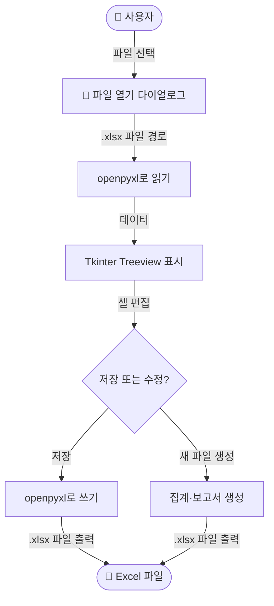
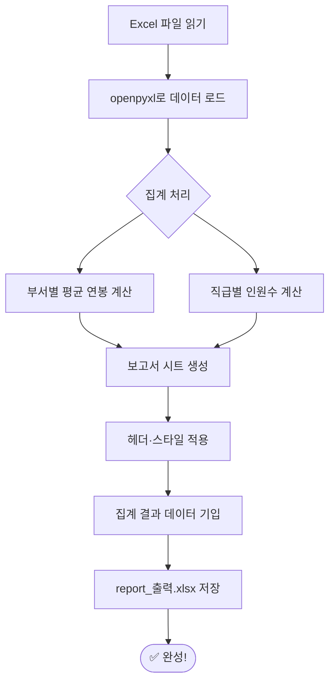
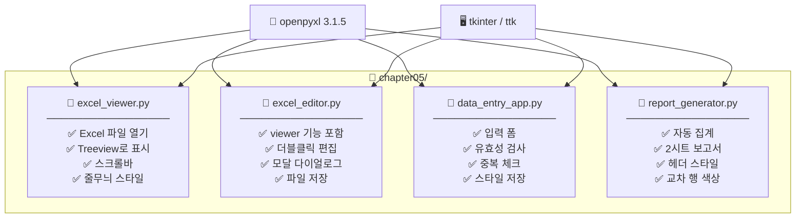

# 파이썬으로 만들기! 데스크톱 앱 시작  

저자: 최흥배, AI-Assisted   
    
권장 개발 환경
- **IDE**: Visual Code
- **컴파일러**: Python 3.13
- **OS**: Windows 10 이상

----- 
  
# Chapter 05. Excel과 함께 작동하는 앱을 만들자!

```
  ╔══════════════════════════════════════════════════════════╗
  ║                                                          ║
  ║    ██████╗ ██╗  ██╗ ██████╗███████╗██╗                  ║
  ║   ██╔════╝ ╚██╗██╔╝██╔════╝██╔════╝██║                  ║
  ║   ██║  ███╗ ╚███╔╝ ██║     █████╗  ██║                  ║
  ║   ██║   ██║ ██╔██╗ ██║     ██╔══╝  ██║                  ║
  ║   ╚██████╔╝██╔╝ ██╗╚██████╗███████╗███████╗             ║
  ║    ╚═════╝ ╚═╝  ╚═╝ ╚═════╝╚══════╝╚══════╝             ║
  ║                                                          ║
  ║         🐍 Python + 📊 Excel = 💪 최강 조합!             ║
  ║                                                          ║
  ╚══════════════════════════════════════════════════════════╝
```

---

## 5.0 이 챕터에서 만들 것

이 챕터에서는 Python과 Excel을 연결하는 데스크톱 앱을 단계적으로 만들어 나갑니다. 단순히 파일을 읽고 쓰는 것에서 그치지 않고, GUI로 데이터를 시각적으로 확인하고, Excel 파일을 직접 편집·저장·생성하는 실용적인 앱까지 완성하는 것이 목표입니다.

이 챕터를 마칠 때쯤이면 다음과 같은 흐름으로 앱이 완성됩니다.



이 챕터에서 완성할 기능을 미리 정리하면 다음과 같습니다. Excel 파일을 GUI에서 표처럼 읽어 표시하는 **Excel 뷰어**, Treeview에서 행을 더블클릭해 수정하고 저장하는 **데이터 편집 기능**, 그리고 입력 폼에서 새로운 데이터를 추가하고 Excel로 자동 저장하는 **데이터 입력 앱**까지, 세 가지 큰 기능을 순서대로 구현합니다.

---

## 5.1 openpyxl 이란?

Python에서 Excel 파일(`.xlsx` 형식)을 다루는 라이브러리는 여러 가지가 있습니다. 이 챕터에서는 그 중에서 가장 널리 사용되고, 순수 Python으로 동작하는 **openpyxl**을 사용합니다.

| 라이브러리 | 읽기 | 쓰기 | Excel 실행 불필요 | 주요 특징 |
|:---|:---:|:---:|:---:|:---|
| **openpyxl** | ✅ | ✅ | ✅ | 가장 보편적, 스타일·차트 지원 |
| pandas | ✅ | ✅ | ✅ | 데이터 분석 특화, 내부적으로 openpyxl 사용 |
| xlwings | ✅ | ✅ | ❌ (필요) | Excel과 실시간 연동, 매크로 실행 가능 |
| xlrd | ✅ | ❌ | ✅ | `.xls` 구형 형식 읽기 전용 |

> 💡 **왜 openpyxl인가?**
> openpyxl은 PC에 Microsoft Excel이 설치되어 있지 않아도 동작합니다. 앱 배포 시 사용자 환경에 Excel이 없어도 걱정할 필요가 없다는 것이 큰 장점입니다. 현재 최신 버전은 **3.1.5** 입니다.

---

## 5.2 환경 준비

**openpyxl 설치:**

터미널(명령 프롬프트 또는 PowerShell)을 열고 다음 명령어를 입력합니다.

```bash
pip install openpyxl
```

설치가 완료되면 제대로 설치되었는지 확인해 봅시다.

```python
import openpyxl
print(openpyxl.__version__)
# 출력 예: 3.1.5
```

**이 챕터에서 사용하는 라이브러리 목록:**

이 챕터에서 사용할 라이브러리는 `openpyxl`과 Python에 기본 포함된 `tkinter`, `tkinter.ttk`, `tkinter.filedialog`, `tkinter.messagebox`입니다. `openpyxl` 이외에는 별도 설치가 필요하지 않습니다.

---

## 5.3 openpyxl 기초 — Excel 읽고 쓰기

본격적인 GUI 앱을 만들기 전에, openpyxl의 기본 조작 방법을 익혀 봅시다. 이 절의 내용은 이후 앱의 핵심 로직이 됩니다.

### 5.3.1 Excel 파일의 구조 이해

```
📄 workbook (.xlsx 파일 전체)
 └── 📋 worksheet (시트 탭 하나하나)
      └── 🔲 cell (셀)
           ├── A1, B2, C3 ... (알파벳=열, 숫자=행)
           └── value (값)
```

openpyxl에서는 이 구조를 그대로 코드로 표현합니다. 파일 전체가 `Workbook` 객체이고, 시트 하나가 `Worksheet` 객체이며, 셀 하나가 `Cell` 객체입니다.

### 5.3.2 Excel 파일 읽기

우선 연습용 Excel 파일(`sample.xlsx`)이 있다고 가정하고 읽어 봅시다.

```python
import openpyxl

# ① 워크북(Excel 파일 전체)을 열기
wb = openpyxl.load_workbook("sample.xlsx")

# ② 시트 이름 목록 확인
print(wb.sheetnames)  # 예: ['Sheet1', '매출', '직원목록']

# ③ 특정 시트 선택
ws = wb["Sheet1"]       # 이름으로 선택
# ws = wb.active       # 현재 활성 시트 선택

# ④ 특정 셀의 값 읽기
print(ws["A1"].value)   # A1 셀의 값
print(ws.cell(row=2, column=3).value)  # B행 3열 (= C2) 의 값

# ⑤ 전체 데이터를 반복하며 읽기
for row in ws.iter_rows(values_only=True):
    print(row)   # 튜플로 한 행씩 출력
    # 예: ('이름', '나이', '부서')
    #     ('홍길동', 30, '개발팀')
```

> 💡 `values_only=True`를 지정하면 `Cell` 객체 대신 순수한 값(문자열, 숫자 등)만 반환되어 처리가 편리합니다.

### 5.3.3 Excel 파일 쓰기 (새 파일 생성)

```python
import openpyxl

# ① 새 워크북 생성
wb = openpyxl.Workbook()

# ② 기본으로 생성된 활성 시트 가져오기
ws = wb.active
ws.title = "직원 목록"  # 시트 이름 변경

# ③ 헤더 행 작성
headers = ["이름", "나이", "부서", "입사일"]
ws.append(headers)

# ④ 데이터 행 추가
data = [
    ["홍길동", 30, "개발팀", "2020-04-01"],
    ["김영희", 25, "디자인팀", "2022-07-15"],
    ["이철수", 35, "기획팀", "2018-01-10"],
]
for row in data:
    ws.append(row)

# ⑤ 파일 저장
wb.save("output.xlsx")
print("저장 완료!")
```

### 5.3.4 셀 스타일 꾸미기

openpyxl은 셀의 색상, 폰트, 테두리 등의 스타일도 지원합니다. 보고서 생성 앱에서 활용할 내용이니 눈여겨보세요.

```python
from openpyxl import Workbook
from openpyxl.styles import Font, PatternFill, Alignment, Border, Side

wb = Workbook()
ws = wb.active

# --- 헤더 셀 꾸미기 ---
cell = ws["A1"]
cell.value = "이름"

# 폰트: 굵게, 흰색, 크기 12
cell.font = Font(bold=True, color="FFFFFF", size=12)

# 배경색: 짙은 파란색
cell.fill = PatternFill(fill_type="solid", fgColor="2F5496")

# 텍스트 가운데 정렬
cell.alignment = Alignment(horizontal="center", vertical="center")

# 테두리
thin = Side(style="thin")
cell.border = Border(left=thin, right=thin, top=thin, bottom=thin)

# 열 너비 조정
ws.column_dimensions["A"].width = 20

wb.save("styled.xlsx")
```

이 코드를 실행하면 A1 셀이 짙은 파란색 배경에 흰색 굵은 글씨로 표시되는 Excel 파일이 만들어집니다. 이 스타일링 기법은 5.6절의 보고서 자동 생성 앱에서 실제로 사용합니다.

---

## 5.4 프로젝트 구성

이 챕터에서 만들 앱의 파일 구성은 다음과 같습니다.

```
chapter05/
│
├── 📄 excel_viewer.py        # 앱 ① Excel 뷰어
├── 📄 excel_editor.py        # 앱 ② Excel 편집기
├── 📄 data_entry_app.py      # 앱 ③ 데이터 입력 앱
├── 📄 report_generator.py    # 앱 ④ 보고서 생성기
│
└── 📁 sample_data/
    └── 📄 employees.xlsx     # 연습용 샘플 데이터
```

우선 연습용 샘플 데이터를 만드는 스크립트를 실행해 둡시다.

```python
# create_sample.py — 연습용 샘플 Excel 파일 생성
import openpyxl

wb = openpyxl.Workbook()
ws = wb.active
ws.title = "직원목록"

# 헤더
ws.append(["사원번호", "이름", "부서", "직급", "연봉(만원)", "입사일"])

# 샘플 데이터
employees = [
    ["E001", "홍길동", "개발팀",   "시니어",  6000, "2019-03-01"],
    ["E002", "김영희", "디자인팀", "주니어",  4200, "2022-07-15"],
    ["E003", "이철수", "기획팀",   "팀장",    7500, "2016-01-10"],
    ["E004", "박민수", "개발팀",   "주니어",  4500, "2023-04-01"],
    ["E005", "최지연", "마케팅팀", "시니어",  5800, "2020-09-20"],
    ["E006", "정현우", "개발팀",   "팀장",    8200, "2014-06-15"],
    ["E007", "윤서아", "디자인팀", "시니어",  5500, "2021-02-28"],
    ["E008", "강태양", "기획팀",   "주니어",  4100, "2024-01-05"],
]

for emp in employees:
    ws.append(emp)

import os
os.makedirs("sample_data", exist_ok=True)
wb.save("sample_data/employees.xlsx")
print("샘플 파일 생성 완료: sample_data/employees.xlsx")
```

이 파일을 `create_sample.py`로 저장하고 실행(`python create_sample.py`)하면 `sample_data/employees.xlsx`가 생성됩니다.

---

## 5.5 앱 ① Excel 뷰어 만들기

이제 본격적으로 GUI 앱을 만들어 봅시다. 첫 번째는 Excel 파일을 열어서 표처럼 화면에 표시하는 **Excel 뷰어**입니다.

완성 화면의 이미지를 ASCII 아트로 표현하면 다음과 같습니다.

```
┌──────────────────────────────────────────────────────────────┐
│  📊 Excel 뷰어                              [─][□][✕]        │
├──────────────────────────────────────────────────────────────┤
│  [ 📂 파일 열기 ]   현재 파일: employees.xlsx                 │
├──────────────────────────────────────────────────────────────┤
│  사원번호 │  이름  │   부서   │  직급  │ 연봉(만원) │ 입사일  │
│ ─────────┼────────┼──────────┼────────┼────────────┼──────── │
│  E001    │ 홍길동 │ 개발팀   │시니어  │   6000     │2019-..  │
│  E002    │ 김영희 │ 디자인팀 │주니어  │   4200     │2022-..  │
│  E003    │ 이철수 │ 기획팀   │팀장    │   7500     │2016-..  │
│  E004    │ 박민수 │ 개발팀   │주니어  │   4500     │2023-..  │
│  E005    │ 최지연 │ 마케팅팀 │시니어  │   5800     │2020-..  │
│  ...     │  ...   │  ...     │  ...   │   ...      │  ...    │
├──────────────────────────────────────────────────────────────┤
│  총 8개 행이 로드되었습니다.                                  │
└──────────────────────────────────────────────────────────────┘
```

**앱의 처리 흐름:**


```python
# excel_viewer.py — Excel 뷰어 앱

import tkinter as tk
from tkinter import ttk, filedialog, messagebox
import openpyxl


class ExcelViewer(tk.Tk):
    """Excel 파일을 Treeview로 표시하는 뷰어 앱"""

    def __init__(self):
        super().__init__()

        # ── 기본 윈도우 설정 ──────────────────────────────────
        self.title("📊 Excel 뷰어")
        self.geometry("900x550")
        self.configure(bg="#F0F4F8")
        self.resizable(True, True)

        # ── 위젯 생성 ─────────────────────────────────────────
        self._build_toolbar()
        self._build_treeview()
        self._build_statusbar()

    # ----------------------------------------------------------
    # UI 구성 메서드
    # ----------------------------------------------------------

    def _build_toolbar(self):
        """상단 툴바 (파일 열기 버튼 + 파일 경로 레이블)"""
        toolbar = tk.Frame(self, bg="#2F5496", pady=6)
        toolbar.pack(fill="x")

        open_btn = tk.Button(
            toolbar,
            text="📂  파일 열기",
            command=self._open_file,
            bg="#FFFFFF",
            fg="#2F5496",
            font=("Malgun Gothic", 11, "bold"),
            relief="flat",
            padx=12,
            pady=4,
            cursor="hand2",
        )
        open_btn.pack(side="left", padx=10)

        self.file_label = tk.Label(
            toolbar,
            text="파일을 선택하세요...",
            bg="#2F5496",
            fg="#DDEEFF",
            font=("Malgun Gothic", 10),
        )
        self.file_label.pack(side="left", padx=6)

    def _build_treeview(self):
        """데이터를 표시할 Treeview와 스크롤바"""
        frame = tk.Frame(self, bg="#F0F4F8")
        frame.pack(fill="both", expand=True, padx=10, pady=8)

        # Treeview 스타일 설정
        style = ttk.Style()
        style.theme_use("clam")
        style.configure(
            "Custom.Treeview",
            background="#FFFFFF",
            fieldbackground="#FFFFFF",
            rowheight=26,
            font=("Malgun Gothic", 10),
        )
        style.configure(
            "Custom.Treeview.Heading",
            background="#2F5496",
            foreground="white",
            font=("Malgun Gothic", 10, "bold"),
        )
        # 행 선택 색상
        style.map(
            "Custom.Treeview",
            background=[("selected", "#BDD7EE")],
            foreground=[("selected", "#000000")],
        )

        # Treeview 위젯
        self.tree = ttk.Treeview(
            frame, style="Custom.Treeview", show="headings"
        )

        # 스크롤바 (세로 + 가로)
        vsb = ttk.Scrollbar(frame, orient="vertical",   command=self.tree.yview)
        hsb = ttk.Scrollbar(frame, orient="horizontal", command=self.tree.xview)
        self.tree.configure(yscrollcommand=vsb.set, xscrollcommand=hsb.set)

        # 배치
        self.tree.grid(row=0, column=0, sticky="nsew")
        vsb.grid(row=0, column=1, sticky="ns")
        hsb.grid(row=1, column=0, sticky="ew")

        frame.grid_rowconfigure(0, weight=1)
        frame.grid_columnconfigure(0, weight=1)

        # 홀수/짝수 행 줄무늬 색상
        self.tree.tag_configure("even", background="#EBF3FB")
        self.tree.tag_configure("odd",  background="#FFFFFF")

    def _build_statusbar(self):
        """하단 상태바"""
        self.status_var = tk.StringVar(value="파일을 열면 데이터가 표시됩니다.")
        status_bar = tk.Label(
            self,
            textvariable=self.status_var,
            bg="#D9E1EC",
            fg="#333333",
            font=("Malgun Gothic", 9),
            anchor="w",
            padx=10,
            pady=4,
        )
        status_bar.pack(fill="x", side="bottom")

    # ----------------------------------------------------------
    # 이벤트 처리 메서드
    # ----------------------------------------------------------

    def _open_file(self):
        """파일 선택 다이얼로그를 열고 Excel 파일을 로드"""
        filepath = filedialog.askopenfilename(
            title="Excel 파일 선택",
            filetypes=[("Excel 파일", "*.xlsx *.xlsm"), ("모든 파일", "*.*")],
        )
        if not filepath:
            return  # 취소했을 경우 아무것도 하지 않음

        try:
            self._load_excel(filepath)
            # 파일 이름만 추출해서 레이블에 표시
            filename = filepath.split("/")[-1]
            self.file_label.config(text=f"현재 파일:  {filename}")
        except Exception as e:
            messagebox.showerror("오류", f"파일을 읽는 중 오류가 발생했습니다.\n\n{e}")

    def _load_excel(self, filepath: str):
        """openpyxl로 Excel 파일을 읽어 Treeview에 표시"""

        # ① 기존 데이터 초기화
        self.tree.delete(*self.tree.get_children())

        # ② 파일 읽기
        wb = openpyxl.load_workbook(filepath, read_only=True, data_only=True)
        ws = wb.active

        # ③ 모든 행을 리스트로 변환
        all_rows = list(ws.iter_rows(values_only=True))
        if not all_rows:
            self.status_var.set("데이터가 없습니다.")
            wb.close()
            return

        # ④ 1행을 헤더로 사용하여 컬럼 설정
        headers = [str(h) if h is not None else "" for h in all_rows[0]]
        self.tree["columns"] = headers

        for col_name in headers:
            self.tree.heading(col_name, text=col_name, anchor="center")
            self.tree.column(col_name, width=120, anchor="center", minwidth=60)

        # ⑤ 2행 이후를 데이터로 삽입 (홀짝 줄무늬 적용)
        data_rows = all_rows[1:]
        for i, row in enumerate(data_rows):
            values = [str(v) if v is not None else "" for v in row]
            tag = "even" if i % 2 == 0 else "odd"
            self.tree.insert("", "end", values=values, tags=(tag,))

        wb.close()

        # ⑥ 상태바 업데이트
        self.status_var.set(f"✅  총 {len(data_rows)}개 행이 로드되었습니다.")


# ── 앱 실행 ──────────────────────────────────────────────────
if __name__ == "__main__":
    app = ExcelViewer()
    app.mainloop()
```

> 🔍 **코드 포인트 해설**
>
> - `read_only=True` 옵션을 지정하면 파일을 읽기 전용으로 열어 메모리 사용량이 줄고 속도가 빨라집니다. 대용량 파일을 열 때 특히 효과적입니다.
> - `data_only=True`는 수식(예: `=SUM(A1:A10)`)이 있는 셀에서 수식 문자열이 아닌 마지막으로 계산된 **결과값**을 가져옵니다.
> - `tag_configure`로 홀짝 행에 다른 배경색을 지정하면 표를 읽기 훨씬 편해집니다.

---

## 5.6 앱 ② 데이터 편집·저장 기능 추가

뷰어만으로는 부족합니다. 이제 Treeview에서 행을 **더블클릭**하면 편집 다이얼로그가 열리고, 수정 내용을 Excel 파일에 저장하는 기능을 추가해 봅시다.

```
┌─────────────────────────────────────────────────────┐
│  📊 Excel 편집기                       [─][□][✕]    │
├─────────────────────────────────────────────────────┤
│  [ 📂 파일 열기 ]  [ 💾 저장 ]  파일: employees.xlsx │
├─────────────────────────────────────────────────────┤
│  사원번호 │  이름  │   부서   │  직급  │ 연봉(만원) │ │
│ ─────────┼────────┼──────────┼────────┼────────────┤ │
│  E001    │ 홍길동 │ 개발팀   │시니어  │   6000     │ │
│ ▶E002◀  │ 김영희 │ 디자인팀 │주니어  │   4200     │ │  ← 선택된 행
│  E003    │ 이철수 │ 기획팀   │팀장    │   7500     │ │
├─────────────────────────────────────────────────────┤
│  💡 행을 더블클릭하면 편집 창이 열립니다.            │
└─────────────────────────────────────────────────────┘

              ┌──────────────────────────┐
              │  ✏️  행 편집              │
              ├──────────────────────────┤
              │  사원번호:  [E002      ] │
              │  이름:      [김영희    ] │
              │  부서:      [디자인팀  ] │
              │  직급:      [주니어    ] │
              │  연봉(만원):[4200      ] │
              │  입사일:    [2022-07-15] │
              ├──────────────────────────┤
              │     [ ✅ 확인 ] [ ✕ 취소]│
              └──────────────────────────┘
```

```python
# excel_editor.py — 편집 기능이 있는 Excel 편집기

import tkinter as tk
from tkinter import ttk, filedialog, messagebox
import openpyxl


class EditDialog(tk.Toplevel):
    """행 편집을 위한 팝업 다이얼로그"""

    def __init__(self, parent, headers: list, values: list):
        super().__init__(parent)
        self.title("✏️  행 편집")
        self.resizable(False, False)
        self.grab_set()  # 부모 창을 비활성화 (모달)

        self.result = None  # 확인 시 수정된 값을 담을 변수
        self.entries = []   # 각 입력 필드

        # ── 입력 폼 생성 ────────────────────────────────────
        form_frame = tk.Frame(self, padx=20, pady=16)
        form_frame.pack()

        for i, (header, value) in enumerate(zip(headers, values)):
            tk.Label(
                form_frame,
                text=f"{header}:",
                font=("Malgun Gothic", 10),
                anchor="e",
                width=12,
            ).grid(row=i, column=0, sticky="e", pady=4)

            entry = tk.Entry(form_frame, font=("Malgun Gothic", 10), width=24)
            entry.insert(0, value)
            entry.grid(row=i, column=1, padx=(8, 0), pady=4)
            self.entries.append(entry)

        # ── 버튼 영역 ────────────────────────────────────────
        btn_frame = tk.Frame(self, pady=10)
        btn_frame.pack()

        ok_btn = tk.Button(
            btn_frame,
            text="✅  확인",
            command=self._on_ok,
            bg="#2F5496",
            fg="white",
            font=("Malgun Gothic", 10, "bold"),
            relief="flat",
            padx=16,
            pady=6,
            cursor="hand2",
        )
        ok_btn.pack(side="left", padx=8)

        cancel_btn = tk.Button(
            btn_frame,
            text="✕  취소",
            command=self.destroy,
            bg="#CCCCCC",
            fg="#333333",
            font=("Malgun Gothic", 10),
            relief="flat",
            padx=16,
            pady=6,
            cursor="hand2",
        )
        cancel_btn.pack(side="left", padx=8)

        # 다이얼로그를 화면 중앙에 배치
        self.update_idletasks()
        x = parent.winfo_rootx() + (parent.winfo_width()  // 2) - (self.winfo_width()  // 2)
        y = parent.winfo_rooty() + (parent.winfo_height() // 2) - (self.winfo_height() // 2)
        self.geometry(f"+{x}+{y}")

    def _on_ok(self):
        """확인 버튼: 입력값을 result에 저장 후 닫기"""
        self.result = [e.get() for e in self.entries]
        self.destroy()


class ExcelEditor(tk.Tk):
    """Excel 파일 편집 기능이 포함된 앱"""

    def __init__(self):
        super().__init__()
        self.title("📊 Excel 편집기")
        self.geometry("960x580")
        self.configure(bg="#F0F4F8")

        # 현재 열린 파일 경로와 워크북을 인스턴스 변수로 보관
        self.filepath = None
        self.wb       = None
        self.headers  = []

        self._build_toolbar()
        self._build_treeview()
        self._build_statusbar()

        # 더블클릭 이벤트 바인딩
        self.tree.bind("<Double-1>", self._on_double_click)

    # ----------------------------------------------------------
    # UI 구성 (5.5의 ExcelViewer와 거의 동일, 저장 버튼 추가)
    # ----------------------------------------------------------

    def _build_toolbar(self):
        toolbar = tk.Frame(self, bg="#2F5496", pady=6)
        toolbar.pack(fill="x")

        for text, cmd in [("📂  파일 열기", self._open_file),
                          ("💾  저장",     self._save_file)]:
            tk.Button(
                toolbar, text=text, command=cmd,
                bg="#FFFFFF", fg="#2F5496",
                font=("Malgun Gothic", 11, "bold"),
                relief="flat", padx=12, pady=4, cursor="hand2",
            ).pack(side="left", padx=(10, 0))

        self.file_label = tk.Label(
            toolbar, text="  파일을 선택하세요...",
            bg="#2F5496", fg="#DDEEFF", font=("Malgun Gothic", 10),
        )
        self.file_label.pack(side="left", padx=10)

    def _build_treeview(self):
        frame = tk.Frame(self, bg="#F0F4F8")
        frame.pack(fill="both", expand=True, padx=10, pady=8)

        style = ttk.Style()
        style.theme_use("clam")
        style.configure("Custom.Treeview",
                         background="#FFFFFF", fieldbackground="#FFFFFF",
                         rowheight=26, font=("Malgun Gothic", 10))
        style.configure("Custom.Treeview.Heading",
                         background="#2F5496", foreground="white",
                         font=("Malgun Gothic", 10, "bold"))
        style.map("Custom.Treeview",
                  background=[("selected", "#BDD7EE")],
                  foreground=[("selected", "#000000")])

        self.tree = ttk.Treeview(frame, style="Custom.Treeview", show="headings")

        vsb = ttk.Scrollbar(frame, orient="vertical",   command=self.tree.yview)
        hsb = ttk.Scrollbar(frame, orient="horizontal", command=self.tree.xview)
        self.tree.configure(yscrollcommand=vsb.set, xscrollcommand=hsb.set)

        self.tree.grid(row=0, column=0, sticky="nsew")
        vsb.grid(row=0, column=1, sticky="ns")
        hsb.grid(row=1, column=0, sticky="ew")
        frame.grid_rowconfigure(0, weight=1)
        frame.grid_columnconfigure(0, weight=1)

        self.tree.tag_configure("even", background="#EBF3FB")
        self.tree.tag_configure("odd",  background="#FFFFFF")

    def _build_statusbar(self):
        self.status_var = tk.StringVar(value="💡  행을 더블클릭하면 편집 창이 열립니다.")
        tk.Label(self, textvariable=self.status_var,
                 bg="#D9E1EC", fg="#333333",
                 font=("Malgun Gothic", 9), anchor="w", padx=10, pady=4,
                 ).pack(fill="x", side="bottom")

    # ----------------------------------------------------------
    # 파일 열기 / 저장
    # ----------------------------------------------------------

    def _open_file(self):
        filepath = filedialog.askopenfilename(
            title="Excel 파일 선택",
            filetypes=[("Excel 파일", "*.xlsx *.xlsm"), ("모든 파일", "*.*")],
        )
        if not filepath:
            return
        try:
            self.filepath = filepath
            # 편집을 위해 read_only=False (기본값)로 열기
            self.wb = openpyxl.load_workbook(filepath, data_only=True)
            self._refresh_treeview()
            filename = filepath.split("/")[-1]
            self.file_label.config(text=f"  현재 파일:  {filename}")
        except Exception as e:
            messagebox.showerror("오류", f"파일을 읽는 중 오류가 발생했습니다.\n\n{e}")

    def _save_file(self):
        """현재 Treeview의 데이터를 워크북에 반영하고 저장"""
        if self.wb is None:
            messagebox.showwarning("경고", "먼저 파일을 열어주세요.")
            return

        ws = self.wb.active

        # ① 기존 데이터 행 모두 삭제 (헤더는 남김)
        for row in ws.iter_rows(min_row=2):
            for cell in row:
                cell.value = None

        # ② Treeview의 현재 데이터를 워크북에 쓰기
        items = self.tree.get_children()
        for row_idx, item in enumerate(items, start=2):
            values = self.tree.item(item, "values")
            for col_idx, value in enumerate(values, start=1):
                ws.cell(row=row_idx, column=col_idx, value=value)

        # ③ 파일 저장
        try:
            self.wb.save(self.filepath)
            self.status_var.set(f"✅  저장 완료:  {self.filepath.split('/')[-1]}")
            messagebox.showinfo("저장 완료", "파일이 저장되었습니다.")
        except Exception as e:
            messagebox.showerror("저장 오류", f"저장 중 오류가 발생했습니다.\n\n{e}")

    # ----------------------------------------------------------
    # Treeview 갱신 및 더블클릭 편집
    # ----------------------------------------------------------

    def _refresh_treeview(self):
        """워크북 데이터를 Treeview에 다시 표시"""
        self.tree.delete(*self.tree.get_children())
        ws = self.wb.active

        all_rows = list(ws.iter_rows(values_only=True))
        if not all_rows:
            return

        self.headers = [str(h) if h is not None else "" for h in all_rows[0]]
        self.tree["columns"] = self.headers
        for col_name in self.headers:
            self.tree.heading(col_name, text=col_name, anchor="center")
            self.tree.column(col_name, width=130, anchor="center", minwidth=60)

        for i, row in enumerate(all_rows[1:]):
            values = [str(v) if v is not None else "" for v in row]
            tag = "even" if i % 2 == 0 else "odd"
            self.tree.insert("", "end", values=values, tags=(tag,))

        self.status_var.set(
            f"✅  {len(all_rows) - 1}개 행 로드 완료  |  💡 더블클릭으로 편집"
        )

    def _on_double_click(self, event):
        """행 더블클릭 → 편집 다이얼로그 열기"""
        selected = self.tree.selection()
        if not selected:
            return

        item = selected[0]
        current_values = list(self.tree.item(item, "values"))

        # 편집 다이얼로그 표시
        dialog = EditDialog(self, self.headers, current_values)
        self.wait_window(dialog)  # 다이얼로그가 닫힐 때까지 대기

        if dialog.result is not None:
            # Treeview의 해당 행 업데이트
            self.tree.item(item, values=dialog.result)
            self.status_var.set("✏️  편집됨. [저장] 버튼을 눌러 파일에 반영하세요.")


if __name__ == "__main__":
    app = ExcelEditor()
    app.mainloop()
```

> ⚠️ **주의: 저장 전에 Excel에서 파일을 닫아야 합니다**
> Windows에서는 Excel이 파일을 열어놓은 상태에서 Python이 같은 파일을 저장하려 하면 `PermissionError`가 발생합니다. 저장 전에 반드시 Excel에서 해당 파일을 닫아주세요.

---

## 5.7 앱 ③ 데이터 입력 앱 만들기

세 번째 앱은 입력 폼에서 새로운 데이터를 입력하고 Excel에 자동 저장하는 **데이터 입력 앱**입니다. 업무에서 매일 데이터를 Excel로 수집해야 하는 상황에 매우 유용합니다.

```
┌───────────────────────────────────────────────────────┐
│  📝 직원 데이터 입력기                    [─][□][✕]   │
├───────────────────────────────────────────────────────┤
│                                                       │
│  사원번호:  [          ]  이름:    [          ]       │
│  부서:      [          ]  직급:    [          ]       │
│  연봉(만원):[          ]  입사일:  [          ]       │
│                                                       │
│             [ ➕ 추가 ]  [ 🗑️ 지우기 ]                │
│                                                       │
├───────────────────────────────────────────────────────┤
│  사원번호 │  이름  │  부서   │  직급  │ 연봉  │ 입사일│
│ ─────────┼────────┼─────────┼────────┼───────┼───────│
│  E001    │ 홍길동 │ 개발팀  │시니어  │ 6000  │2019.. │
│  E002    │ 김영희 │디자인팀 │주니어  │ 4200  │2022.. │
├───────────────────────────────────────────────────────┤
│  [ 💾 Excel로 저장 ]          총 2개 행 등록됨        │
└───────────────────────────────────────────────────────┘
```

```python
# data_entry_app.py — 데이터 입력 → Excel 저장 앱

import tkinter as tk
from tkinter import ttk, filedialog, messagebox
from datetime import date
import openpyxl


# 앱에서 다룰 컬럼 정의 (이름, 너비, 기본값)
COLUMNS = [
    ("사원번호",   100, ""),
    ("이름",       100, ""),
    ("부서",       120, ""),
    ("직급",       100, ""),
    ("연봉(만원)", 100, ""),
    ("입사일",     120, str(date.today())),  # 오늘 날짜를 기본값으로
]


class DataEntryApp(tk.Tk):
    """입력 폼에서 데이터를 추가하고 Excel로 저장하는 앱"""

    def __init__(self):
        super().__init__()
        self.title("📝 직원 데이터 입력기")
        self.geometry("820x600")
        self.configure(bg="#F0F4F8")

        self.entries = {}   # 각 입력 필드를 딕셔너리로 관리

        self._build_form()
        self._build_treeview()
        self._build_footer()

    # ----------------------------------------------------------
    # UI 구성
    # ----------------------------------------------------------

    def _build_form(self):
        """상단 입력 폼 영역"""
        form_outer = tk.LabelFrame(
            self, text="  새 데이터 입력  ",
            font=("Malgun Gothic", 10, "bold"),
            bg="#F0F4F8", fg="#2F5496",
            padx=14, pady=10,
        )
        form_outer.pack(fill="x", padx=12, pady=(10, 4))

        # 2열 그리드로 입력 필드 배치
        for i, (col_name, _, default) in enumerate(COLUMNS):
            row, col = divmod(i, 2)  # 짝수 인덱스 → 왼쪽, 홀수 → 오른쪽

            tk.Label(
                form_outer, text=f"{col_name}:",
                font=("Malgun Gothic", 10), bg="#F0F4F8",
                anchor="e", width=10,
            ).grid(row=row, column=col * 2, sticky="e", padx=(0, 4), pady=4)

            entry = tk.Entry(
                form_outer, font=("Malgun Gothic", 10), width=18,
                relief="solid", bd=1,
            )
            entry.insert(0, default)  # 기본값 설정
            entry.grid(row=row, column=col * 2 + 1, sticky="ew", padx=(0, 16), pady=4)
            self.entries[col_name] = entry

        # ── 버튼 ────────────────────────────────────────────
        btn_frame = tk.Frame(form_outer, bg="#F0F4F8")
        btn_frame.grid(row=len(COLUMNS) // 2 + 1, column=0,
                       columnspan=4, pady=(8, 0))

        tk.Button(
            btn_frame, text="➕  추가",
            command=self._add_row,
            bg="#2F5496", fg="white",
            font=("Malgun Gothic", 11, "bold"),
            relief="flat", padx=18, pady=6, cursor="hand2",
        ).pack(side="left", padx=8)

        tk.Button(
            btn_frame, text="🗑️  지우기",
            command=self._clear_form,
            bg="#AAAAAA", fg="white",
            font=("Malgun Gothic", 10),
            relief="flat", padx=14, pady=6, cursor="hand2",
        ).pack(side="left", padx=8)

    def _build_treeview(self):
        """입력된 데이터를 표시하는 Treeview"""
        frame = tk.Frame(self, bg="#F0F4F8")
        frame.pack(fill="both", expand=True, padx=12, pady=4)

        style = ttk.Style()
        style.theme_use("clam")
        style.configure("Entry.Treeview",
                         background="#FFFFFF", fieldbackground="#FFFFFF",
                         rowheight=26, font=("Malgun Gothic", 10))
        style.configure("Entry.Treeview.Heading",
                         background="#2F5496", foreground="white",
                         font=("Malgun Gothic", 10, "bold"))
        style.map("Entry.Treeview",
                  background=[("selected", "#BDD7EE")],
                  foreground=[("selected", "#000000")])

        col_names = [c[0] for c in COLUMNS]
        self.tree = ttk.Treeview(
            frame, style="Entry.Treeview",
            columns=col_names, show="headings",
        )

        for col_name, width, _ in COLUMNS:
            self.tree.heading(col_name, text=col_name, anchor="center")
            self.tree.column(col_name, width=width, anchor="center", minwidth=50)

        vsb = ttk.Scrollbar(frame, orient="vertical", command=self.tree.yview)
        self.tree.configure(yscrollcommand=vsb.set)

        self.tree.pack(side="left", fill="both", expand=True)
        vsb.pack(side="right", fill="y")

        self.tree.tag_configure("even", background="#EBF3FB")
        self.tree.tag_configure("odd",  background="#FFFFFF")

        # 선택된 행을 Treeview에서 삭제하는 키 바인딩 (Delete 키)
        self.tree.bind("<Delete>", self._delete_selected_row)

    def _build_footer(self):
        """하단: 저장 버튼 + 상태 표시"""
        footer = tk.Frame(self, bg="#D9E1EC", pady=6)
        footer.pack(fill="x", side="bottom")

        tk.Button(
            footer, text="💾  Excel로 저장",
            command=self._save_to_excel,
            bg="#1F7540", fg="white",
            font=("Malgun Gothic", 11, "bold"),
            relief="flat", padx=18, pady=6, cursor="hand2",
        ).pack(side="left", padx=12)

        self.status_var = tk.StringVar(value="데이터를 입력하고 [추가] 버튼을 눌러주세요.")
        tk.Label(
            footer, textvariable=self.status_var,
            bg="#D9E1EC", fg="#333333",
            font=("Malgun Gothic", 9),
        ).pack(side="left", padx=10)

    # ----------------------------------------------------------
    # 이벤트 처리
    # ----------------------------------------------------------

    def _add_row(self):
        """입력 폼의 값을 읽어 Treeview에 행 추가"""
        values = [self.entries[col].get().strip() for col, _, _ in COLUMNS]

        # 필수 항목(사원번호, 이름) 빈칸 체크
        if not values[0]:
            messagebox.showwarning("입력 오류", "사원번호를 입력해주세요.")
            self.entries["사원번호"].focus()
            return
        if not values[1]:
            messagebox.showwarning("입력 오류", "이름을 입력해주세요.")
            self.entries["이름"].focus()
            return

        # 사원번호 중복 체크
        existing_ids = [
            self.tree.item(item, "values")[0]
            for item in self.tree.get_children()
        ]
        if values[0] in existing_ids:
            messagebox.showwarning("중복 오류", f"사원번호 '{values[0]}'는 이미 등록되어 있습니다.")
            return

        # Treeview에 행 삽입
        count = len(self.tree.get_children())
        tag = "even" if count % 2 == 0 else "odd"
        self.tree.insert("", "end", values=values, tags=(tag,))

        # 입력 폼 초기화 (입사일 기본값은 유지)
        self._clear_form(keep_date=True)

        self.status_var.set(f"➕  추가됨. 총 {count + 1}개 행 등록됨.")
        # 첫 번째 필드에 포커스
        self.entries["사원번호"].focus()

    def _clear_form(self, keep_date=False):
        """입력 폼 전체 초기화"""
        for col_name, _, default in COLUMNS:
            self.entries[col_name].delete(0, "end")
            if keep_date and col_name == "입사일":
                self.entries[col_name].insert(0, str(date.today()))
            elif default:
                self.entries[col_name].insert(0, default)

    def _delete_selected_row(self, event=None):
        """Treeview에서 선택된 행을 삭제 (Delete 키)"""
        selected = self.tree.selection()
        if selected:
            for item in selected:
                self.tree.delete(item)
            count = len(self.tree.get_children())
            self.status_var.set(f"🗑️  삭제됨. 총 {count}개 행 등록됨.")

    def _save_to_excel(self):
        """Treeview의 데이터를 Excel 파일로 저장"""
        items = self.tree.get_children()
        if not items:
            messagebox.showwarning("저장 불가", "저장할 데이터가 없습니다.")
            return

        # 저장 경로 선택
        filepath = filedialog.asksaveasfilename(
            title="Excel 파일로 저장",
            defaultextension=".xlsx",
            filetypes=[("Excel 파일", "*.xlsx"), ("모든 파일", "*.*")],
            initialfile="직원목록.xlsx",
        )
        if not filepath:
            return

        # 워크북 생성
        wb = openpyxl.Workbook()
        ws = wb.active
        ws.title = "직원목록"

        # 헤더 스타일 적용
        from openpyxl.styles import Font, PatternFill, Alignment, Border, Side

        headers = [col[0] for col in COLUMNS]
        ws.append(headers)

        thin = Side(style="thin")
        border = Border(left=thin, right=thin, top=thin, bottom=thin)

        for col_idx, header in enumerate(headers, start=1):
            cell = ws.cell(row=1, column=col_idx)
            cell.font      = Font(bold=True, color="FFFFFF", size=11)
            cell.fill      = PatternFill(fill_type="solid", fgColor="2F5496")
            cell.alignment = Alignment(horizontal="center", vertical="center")
            cell.border    = border

        # 데이터 행 추가
        for row_idx, item in enumerate(items, start=2):
            values = self.tree.item(item, "values")
            ws.append(list(values))
            # 데이터 셀에도 테두리와 중앙 정렬 적용
            for col_idx in range(1, len(headers) + 1):
                cell = ws.cell(row=row_idx, column=col_idx)
                cell.alignment = Alignment(horizontal="center")
                cell.border    = border

        # 열 너비 자동 조정
        col_widths = [c[1] / 7 for c in COLUMNS]  # pixel → 문자 단위 근사값
        for col_idx, width in enumerate(col_widths, start=1):
            ws.column_dimensions[
                openpyxl.utils.get_column_letter(col_idx)
            ].width = max(width, 12)

        # 행 높이
        ws.row_dimensions[1].height = 20

        try:
            wb.save(filepath)
            messagebox.showinfo("저장 완료", f"✅  저장되었습니다!\n\n{filepath}")
            self.status_var.set(f"💾  저장 완료: {filepath.split('/')[-1]}")
        except Exception as e:
            messagebox.showerror("저장 오류", f"저장 중 오류가 발생했습니다.\n\n{e}")


if __name__ == "__main__":
    app = DataEntryApp()
    app.mainloop()
```

> 💡 **`openpyxl.utils.get_column_letter()`란?**
> 열 번호(정수)를 Excel 열 이름(문자)으로 변환해줍니다. 예를 들어 `get_column_letter(1)`은 `"A"`, `get_column_letter(3)`은 `"C"`를 반환합니다. `column_dimensions`에 접근할 때는 문자 키가 필요하기 때문에 이 함수를 사용합니다.

---

## 5.8 앱 ④ 집계 보고서 자동 생성기

마지막으로, 가장 실용적인 앱입니다. 직원 데이터를 읽어서 **부서별 평균 연봉**, **직급별 인원수** 같은 집계 결과를 자동으로 계산하고, 스타일이 적용된 보고서 Excel 파일을 생성하는 앱을 만들어 봅시다.

**처리 흐름:**



```python
# report_generator.py — 집계 보고서 자동 생성기

import tkinter as tk
from tkinter import filedialog, messagebox
import openpyxl
from openpyxl.styles import Font, PatternFill, Alignment, Border, Side
from openpyxl.utils import get_column_letter
from collections import defaultdict


class ReportGenerator(tk.Tk):
    """Excel 데이터를 집계하여 보고서를 자동 생성하는 앱"""

    def __init__(self):
        super().__init__()
        self.title("📈 보고서 자동 생성기")
        self.geometry("480x340")
        self.configure(bg="#F0F4F8")
        self.resizable(False, False)

        self._build_ui()

    def _build_ui(self):
        # 타이틀
        tk.Label(
            self,
            text="📈  Excel 보고서 자동 생성기",
            font=("Malgun Gothic", 14, "bold"),
            bg="#F0F4F8", fg="#2F5496",
        ).pack(pady=(24, 4))

        tk.Label(
            self,
            text="직원 Excel 파일을 선택하면\n부서별 평균 연봉과 직급별 인원수를\n자동으로 집계한 보고서를 생성합니다.",
            font=("Malgun Gothic", 10),
            bg="#F0F4F8", fg="#555555",
            justify="center",
        ).pack(pady=8)

        # 파일 선택 영역
        file_frame = tk.Frame(self, bg="#F0F4F8")
        file_frame.pack(pady=10)

        self.file_var = tk.StringVar(value="선택된 파일 없음")
        tk.Label(
            file_frame, textvariable=self.file_var,
            font=("Malgun Gothic", 9), bg="#E8EEF6", fg="#333333",
            width=38, anchor="w", padx=8, pady=4, relief="solid", bd=1,
        ).pack(side="left", padx=(0, 6))

        tk.Button(
            file_frame, text="📂 찾아보기",
            command=self._select_file,
            bg="#2F5496", fg="white",
            font=("Malgun Gothic", 10, "bold"),
            relief="flat", padx=10, pady=4, cursor="hand2",
        ).pack(side="left")

        # 생성 버튼
        tk.Button(
            self, text="🚀  보고서 생성!",
            command=self._generate_report,
            bg="#1F7540", fg="white",
            font=("Malgun Gothic", 13, "bold"),
            relief="flat", padx=24, pady=10, cursor="hand2",
        ).pack(pady=14)

        self.status_var = tk.StringVar(value="")
        tk.Label(
            self, textvariable=self.status_var,
            font=("Malgun Gothic", 9), bg="#F0F4F8", fg="#888888",
        ).pack()

    def _select_file(self):
        filepath = filedialog.askopenfilename(
            title="직원 Excel 파일 선택",
            filetypes=[("Excel 파일", "*.xlsx"), ("모든 파일", "*.*")],
        )
        if filepath:
            self.filepath = filepath
            self.file_var.set(filepath.split("/")[-1])

    def _generate_report(self):
        if not hasattr(self, "filepath"):
            messagebox.showwarning("파일 없음", "Excel 파일을 먼저 선택해주세요.")
            return

        try:
            # ── ① 원본 데이터 읽기 ─────────────────────────
            wb_src = openpyxl.load_workbook(self.filepath, data_only=True)
            ws_src = wb_src.active
            rows   = list(ws_src.iter_rows(values_only=True))
            wb_src.close()

            if len(rows) < 2:
                messagebox.showwarning("데이터 없음", "데이터가 부족합니다.")
                return

            headers  = rows[0]   # ('사원번호', '이름', '부서', '직급', '연봉(만원)', '입사일')
            data     = rows[1:]

            # 컬럼 인덱스 확인 (유연한 대응)
            try:
                dept_idx   = headers.index("부서")
                grade_idx  = headers.index("직급")
                salary_idx = headers.index("연봉(만원)")
            except ValueError:
                messagebox.showerror(
                    "형식 오류",
                    "'부서', '직급', '연봉(만원)' 컬럼이 필요합니다.\n"
                    "샘플 파일(employees.xlsx)을 사용해주세요."
                )
                return

            # ── ② 집계 계산 ────────────────────────────────
            # 부서별 연봉 합계 & 인원수
            dept_salary = defaultdict(list)
            grade_count = defaultdict(int)

            for row in data:
                dept   = row[dept_idx]
                grade  = row[grade_idx]
                salary = row[salary_idx]

                if dept and salary is not None:
                    try:
                        dept_salary[dept].append(float(salary))
                    except (ValueError, TypeError):
                        pass
                if grade:
                    grade_count[grade] += 1

            dept_avg = {
                dept: round(sum(salaries) / len(salaries), 1)
                for dept, salaries in dept_salary.items()
            }

            # ── ③ 보고서 워크북 생성 ───────────────────────
            wb_out = openpyxl.Workbook()

            # --- 시트 ① : 부서별 평균 연봉 ---
            ws1 = wb_out.active
            ws1.title = "부서별 평균 연봉"
            self._write_report_sheet(
                ws1,
                title="부서별 평균 연봉 집계",
                headers=["부서", "평균 연봉(만원)", "인원수"],
                data_rows=[
                    [dept, avg, len(dept_salary[dept])]
                    for dept, avg in sorted(dept_avg.items())
                ],
                header_color="2F5496",
            )

            # --- 시트 ② : 직급별 인원수 ---
            ws2 = wb_out.create_sheet(title="직급별 인원수")
            self._write_report_sheet(
                ws2,
                title="직급별 인원수 집계",
                headers=["직급", "인원수"],
                data_rows=sorted(grade_count.items(), key=lambda x: -x[1]),
                header_color="1F7540",
            )

            # ── ④ 저장 경로 선택 & 저장 ───────────────────
            save_path = filedialog.asksaveasfilename(
                title="보고서 저장",
                defaultextension=".xlsx",
                filetypes=[("Excel 파일", "*.xlsx")],
                initialfile="report_직원집계.xlsx",
            )
            if not save_path:
                return

            wb_out.save(save_path)
            self.status_var.set(f"✅  저장 완료: {save_path.split('/')[-1]}")
            messagebox.showinfo(
                "생성 완료",
                f"보고서가 생성되었습니다!\n\n"
                f"📋 시트 1: 부서별 평균 연봉\n"
                f"📋 시트 2: 직급별 인원수\n\n"
                f"저장 위치: {save_path}"
            )

        except Exception as e:
            messagebox.showerror("오류", f"보고서 생성 중 오류가 발생했습니다.\n\n{e}")

    def _write_report_sheet(
        self, ws, title: str, headers: list,
        data_rows: list, header_color: str
    ):
        """보고서 시트를 스타일과 함께 작성하는 내부 메서드"""

        thin   = Side(style="thin")
        border = Border(left=thin, right=thin, top=thin, bottom=thin)

        # --- 타이틀 행 ---
        ws.merge_cells(start_row=1, start_column=1,
                       end_row=1,   end_column=len(headers))
        title_cell            = ws.cell(row=1, column=1, value=title)
        title_cell.font       = Font(bold=True, size=14, color="2F5496")
        title_cell.alignment  = Alignment(horizontal="center", vertical="center")
        ws.row_dimensions[1].height = 28

        # --- 헤더 행 ---
        for col_idx, header in enumerate(headers, start=1):
            cell            = ws.cell(row=2, column=col_idx, value=header)
            cell.font       = Font(bold=True, color="FFFFFF", size=11)
            cell.fill       = PatternFill(fill_type="solid", fgColor=header_color)
            cell.alignment  = Alignment(horizontal="center", vertical="center")
            cell.border     = border
        ws.row_dimensions[2].height = 22

        # --- 데이터 행 ---
        alt_colors = ["FFFFFF", "EBF3FB"]  # 흰색 / 연한 파란색 교차
        for row_idx, row_data in enumerate(data_rows, start=3):
            fill_color = alt_colors[(row_idx - 3) % 2]
            for col_idx, value in enumerate(row_data, start=1):
                cell           = ws.cell(row=row_idx, column=col_idx, value=value)
                cell.fill      = PatternFill(fill_type="solid", fgColor=fill_color)
                cell.alignment = Alignment(horizontal="center")
                cell.border    = border

        # --- 열 너비 자동 조정 ---
        for col_idx in range(1, len(headers) + 1):
            col_letter = get_column_letter(col_idx)
            ws.column_dimensions[col_letter].width = 20


if __name__ == "__main__":
    app = ReportGenerator()
    app.mainloop()
```

---

## 5.9 완성 앱 구조 정리

이 챕터에서 만든 네 개의 앱이 어떻게 연결되는지 전체 구조를 정리해 봅시다.



---

## 5.10 자주 발생하는 오류와 해결법

실제로 코드를 실행하다 보면 마주칠 수 있는 대표적인 오류와 그 해결책을 정리했습니다.

**① `PermissionError: [Errno 13] Permission denied`**

이 오류는 Python이 파일을 저장하려는 순간 Excel이 해당 파일을 이미 열어놓고 있을 때 발생합니다. Windows에서는 같은 파일을 두 프로세스가 동시에 쓸 수 없기 때문입니다. 해결책은 간단히 Excel에서 해당 파일을 닫은 뒤 다시 저장 버튼을 누르면 됩니다.

**② `KeyError: 'Sheet1'` 또는 시트를 못 찾는 오류**

`wb["Sheet1"]`처럼 이름으로 시트를 지정했을 때, 실제 시트 이름과 다른 경우 발생합니다. `print(wb.sheetnames)`로 실제 이름을 먼저 확인하거나, `wb.active`를 사용해서 활성 시트를 가져오는 방법이 안전합니다.

**③ 수식이 있는 셀에서 `None`이 반환된다**

`load_workbook(filepath)`로 파일을 열면 수식은 마지막 저장 당시의 캐시된 값을 반환하는데, 이 캐시가 없으면 `None`이 됩니다. 반드시 `data_only=True` 옵션을 추가하고, 한 번 Excel에서 파일을 열고 저장한 뒤 다시 읽어야 정상적인 값을 얻을 수 있습니다.

**④ 한글 폰트가 깨진다**

`Font(name="Malgun Gothic")`처럼 폰트 이름을 명시적으로 지정하면 해결됩니다. Windows 11에는 맑은 고딕(Malgun Gothic)이 기본 탑재되어 있어 안전하게 사용할 수 있습니다.

```python
from openpyxl.styles import Font
cell.font = Font(name="Malgun Gothic", size=11)
```

---

## 5.11 챕터 정리

```
╔════════════════════════════════════════════════════════════╗
║                  📌 Chapter 05 요약                        ║
╠════════════════════════════════════════════════════════════╣
║                                                            ║
║  ✅ openpyxl 로 .xlsx 파일을 읽고 쓸 수 있다              ║
║  ✅ Treeview 로 표 형태의 데이터를 GUI로 표시할 수 있다   ║
║  ✅ 더블클릭 + Toplevel 로 편집 다이얼로그를 만들 수 있다 ║
║  ✅ 입력 폼 → Excel 자동 저장 흐름을 구현할 수 있다       ║
║  ✅ 셀 스타일(폰트, 색상, 테두리)을 코드로 지정할 수 있다 ║
║  ✅ 집계 처리 결과를 보고서 Excel로 자동 생성할 수 있다   ║
║                                                            ║
╚════════════════════════════════════════════════════════════╝
```

이 챕터에서는 `openpyxl`과 `tkinter`를 조합하여 Excel을 다루는 네 가지 앱을 단계적으로 만들었습니다. 뷰어 → 편집기 → 입력 앱 → 보고서 생성기의 순서로 점차 기능을 확장해 나가는 방식으로 구성했기 때문에, 각 앱을 순서대로 만들어보는 것만으로도 `openpyxl`의 핵심 기능 대부분을 익힐 수 있습니다.

다음 챕터(Chapter 06)에서는 OpenWeather API로 날씨 데이터를 가져와 `matplotlib`으로 그래프를 그리는 앱을 만들어 봅니다. 외부 API와 통신하는 방법, 그래프를 Tkinter 창 안에 삽입하는 방법이 이 챕터의 핵심 포인트가 됩니다!

---

> 📝 **연습 문제**
>
> 1. `excel_viewer.py`에 **시트 선택 콤보박스**를 추가해보세요. `wb.sheetnames`로 시트 목록을 가져와 콤보박스에 표시하고, 선택 시 해당 시트 데이터로 Treeview를 갱신합니다.
> 2. `data_entry_app.py`에서 **기존 Excel 파일을 불러와 이어쓰기**하는 기능을 추가해보세요. 파일 열기 → 기존 데이터를 Treeview에 로드 → 새 행 추가 → 저장 흐름으로 구현합니다.
> 3. `report_generator.py`에서 집계 결과에 **최고 연봉**, **최저 연봉** 항목도 함께 출력하도록 확장해보세요. `max()`, `min()` 함수를 활용합니다.
  