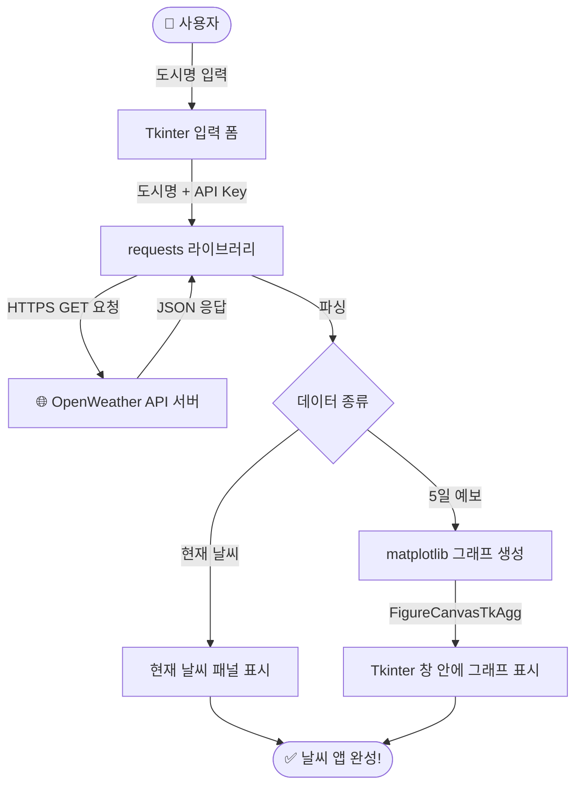

# 파이썬으로 만들기! 데스크톱 앱 시작  

저자: 최흥배, AI-Assisted   
    
권장 개발 환경
- **IDE**: Visual Code
- **컴파일러**: Python 3.13
- **OS**: Windows 10 이상

----- 
  
# Chapter 06. OpenWeather API를 사용하여 그래프를 보자

```
  ╔══════════════════════════════════════════════════════════════╗
  ║                                                              ║
  ║   ░██╗░░░░░░░██╗███████╗ █████╗ ████████╗██╗  ██╗███████╗  ║
  ║   ░██║░░██╗░░██║██╔════╝██╔══██╗╚══██╔══╝██║  ██║██╔════╝  ║
  ║   ░╚██╗████╗██╔╝█████╗  ███████║   ██║   ███████║█████╗    ║
  ║   ░░████╔═████║░██╔══╝  ██╔══██║   ██║   ██╔══██║██╔══╝    ║
  ║   ░░╚██╔╝░╚██╔╝░███████╗██║  ██║   ██║   ██║  ██║███████╗  ║
  ║   ░░░╚═╝░░░╚═╝░░╚══════╝╚═╝  ╚═╝   ╚═╝   ╚═╝  ╚═╝╚══════╝  ║
  ║                                                              ║
  ║         🌤️  실시간 날씨 데이터 + 📊 그래프 시각화!          ║
  ║                                                              ║
  ╚══════════════════════════════════════════════════════════════╝
```

---

## 6.0 이 챕터에서 만들 것
이 챕터에서는 외부 **Web API**와 통신하는 방법을 배우고, 가져온 데이터를 그래프로 시각화하는 앱을 완성합니다. Chapter 05에서는 파일(Excel)을 다루었다면, 이번에는 인터넷 너머의 서버와 대화하는 앱을 만드는 것이 핵심입니다.

완성되는 앱의 전체 흐름은 다음과 같습니다.



이 챕터를 마치면 다음과 같은 능력을 갖추게 됩니다. 첫째, `requests` 라이브러리로 Web API를 호출하고 JSON 응답을 Python 딕셔너리로 파싱하는 기술을 익힙니다. 둘째, `matplotlib`으로 꺾은선 그래프, 막대 그래프, 복합 그래프를 그리는 방법을 배웁니다. 셋째, 가장 중요한 포인트로서 matplotlib 그래프를 Tkinter 창 내부에 직접 **내장(embed)** 하는 기법을 완전히 이해합니다.

---

## 6.1 이 챕터에서 사용하는 기술 스택

```
┌──────────────────────────────────────────────────────────┐
│                   날씨 앱 기술 스택                       │
├──────────────────────────────────────────────────────────┤
│                                                          │
│   🖥️  Tkinter / ttk      → GUI 프레임, 버튼, 레이블      │
│   🌐  requests           → HTTP 통신, API 호출           │
│   📦  json (내장)        → API 응답 파싱                  │
│   📊  matplotlib         → 그래프 생성                    │
│   🔗  FigureCanvasTkAgg  → matplotlib ↔ Tkinter 연결     │
│   🧵  threading (내장)   → API 호출을 백그라운드에서      │
│                                                          │
└──────────────────────────────────────────────────────────┘
```

**사용 라이브러리와 버전:**

| 라이브러리 | 버전 | 포함 여부 | 설명 |
|:---|:---:|:---:|:---|
| tkinter | Python 내장 | ✅ | GUI |
| requests | 2.x | ❌ pip 설치 | HTTP 통신 |
| matplotlib | **3.10.x** | ❌ pip 설치 | 그래프 |
| json | Python 내장 | ✅ | JSON 파싱 |
| threading | Python 내장 | ✅ | 비동기 처리 |

---

## 6.2 환경 준비

### 6.2.1 라이브러리 설치

터미널(PowerShell 또는 명령 프롬프트)을 열고 아래 명령어를 실행합니다.

```bash
pip install requests matplotlib
```

설치 확인은 다음과 같이 합니다.

```python
import requests
import matplotlib
print(requests.__version__)     # 예: 2.32.3
print(matplotlib.__version__)   # 예: 3.10.1
```

### 6.2.2 OpenWeather API 키 발급받기

이 챕터의 앱은 인터넷상의 서버에서 날씨 데이터를 받아옵니다. 이를 위해 **OpenWeather**라는 서비스의 API 키가 필요합니다. 무료로 발급받을 수 있으니 걱정하지 않아도 됩니다.

```
API 키 발급 절차
─────────────────────────────────────────────────────
 STEP 1  https://openweathermap.org 에 접속
         ↓
 STEP 2  우측 상단 [Sign In] → [Create an Account] 클릭
         이름, 이메일, 비밀번호를 입력하고 가입
         ↓
 STEP 3  가입 후 로그인 → 우측 상단 닉네임 클릭
         → 드롭다운에서 [My API keys] 선택
         ↓
 STEP 4  기본 생성된 API 키가 있음
         없다면 [API key name]에 이름 입력 후
         [Generate] 버튼 클릭
         ↓
 STEP 5  생성된 키를 복사해 두기
         예: a1b2c3d4e5f6a1b2c3d4e5f6a1b2c3d4
─────────────────────────────────────────────────────
 ⚠️  API 키는 발급 후 활성화까지 최대 2시간이 걸릴 수 있습니다.
    바로 테스트하면 401 오류가 날 수 있으니 잠시 기다려 주세요.
```

> 💡 **무료 플랜의 범위**
> OpenWeather의 무료 플랜(Free tier)에서는 **현재 날씨 API(Current Weather)**와 **5일 예보 API(5 Day Forecast)** 를 하루에 1,000번까지 무료로 호출할 수 있습니다. 이 챕터에서 만드는 앱은 이 두 가지 API만 사용하므로 비용이 전혀 발생하지 않습니다.

---

## 6.3 Web API 기초 — HTTP 통신 이해하기

코드를 작성하기 전에, Web API가 어떻게 동작하는지 원리를 이해해 봅시다. 이 개념은 이후 어떤 Web API를 사용하더라도 공통으로 적용됩니다.

### 6.3.1 API란?

**API(Application Programming Interface)** 는 소프트웨어끼리 대화하기 위한 약속입니다. Web API의 경우, 브라우저 주소창에 URL을 입력하는 것처럼 Python 코드에서 특정 URL로 요청을 보내면 서버가 데이터를 응답해주는 구조입니다.

```
우리 앱                      OpenWeather 서버
  │                                 │
  │  ① GET 요청 (URL + API Key)     │
  │ ──────────────────────────────► │
  │                                 │  서버 내부에서
  │                                 │  날씨 데이터 조회
  │  ② JSON 응답 (날씨 데이터)      │
  │ ◄────────────────────────────── │
  │                                 │
  ↓                                 
Python 딕셔너리로 변환 → 화면에 표시
```

### 6.3.2 JSON이란?

API는 대부분 **JSON(JavaScript Object Notation)** 형식으로 데이터를 주고받습니다. Python의 딕셔너리와 거의 동일하게 생겼습니다.

```json
{
  "name": "Seoul",
  "main": {
    "temp": 18.5,
    "humidity": 62
  },
  "weather": [
    { "description": "맑음" }
  ]
}
```

Python에서는 `json` 모듈(또는 `requests` 라이브러리)을 사용해 이 JSON 문자열을 그대로 Python 딕셔너리로 변환할 수 있습니다.

```python
import requests

# JSON 응답을 Python 딕셔너리로 자동 변환
response = requests.get("https://...")
data = response.json()   # ← 딕셔너리!

print(data["name"])           # "Seoul"
print(data["main"]["temp"])   # 18.5
```

### 6.3.3 requests 라이브러리 기초

`requests`는 Python에서 HTTP 통신을 가장 쉽게 할 수 있게 해주는 라이브러리입니다.

```python
import requests

# ① GET 요청 보내기
response = requests.get("https://api.openweathermap.org/data/2.5/weather",
                        params={
                            "q":     "Seoul",       # 도시 이름
                            "appid": "YOUR_API_KEY",
                            "units": "metric",      # 섭씨(°C) 단위
                            "lang":  "kr",          # 한국어 날씨 설명
                        })

# ② 응답 상태 코드 확인
print(response.status_code)  # 200 이면 성공, 401 이면 API Key 오류

# ③ JSON 파싱
data = response.json()
print(data)

# ④ 오류 자동 감지 (200이 아닌 경우 예외 발생)
response.raise_for_status()
```

**주요 HTTP 상태 코드:**

| 코드 | 의미 | 대처 방법 |
|:---:|:---|:---|
| `200` | 성공 | 정상 처리 |
| `401` | 인증 오류 | API 키 확인, 활성화 대기 |
| `404` | 도시 없음 | 도시명 철자 확인 |
| `429` | 요청 초과 | 잠시 기다린 후 재시도 |

---

## 6.4 OpenWeather API 구조 파악

코드를 작성하기 전에 실제로 어떤 데이터가 응답되는지 구조를 파악해 두면 코딩이 훨씬 쉬워집니다.

### 6.4.1 현재 날씨 API

**요청 URL:**
```
https://api.openweathermap.org/data/2.5/weather?q={도시명}&appid={키}&units=metric&lang=kr
```

**응답 JSON 구조 (주요 항목만):**

```python
{
    "name": "Seoul",           # 도시명
    "sys": {
        "country": "KR",       # 국가 코드
        "sunrise": 1700000000, # 일출 시각 (Unix 타임스탬프)
        "sunset":  1700040000, # 일몰 시각
    },
    "main": {
        "temp":       18.5,    # 현재 기온 (°C, units=metric 시)
        "feels_like": 17.2,    # 체감 온도
        "temp_min":   15.0,    # 최저 기온
        "temp_max":   21.0,    # 최고 기온
        "humidity":   62,      # 습도 (%)
        "pressure":   1013,    # 기압 (hPa)
    },
    "wind": {
        "speed": 3.5,          # 풍속 (m/s)
        "deg":   180,          # 풍향 (도)
    },
    "weather": [
        {
            "main":        "Clear",    # 날씨 상태 (영문)
            "description": "맑음",    # 날씨 설명 (lang=kr 시 한국어)
            "icon":        "01d",      # 날씨 아이콘 코드
        }
    ],
    "clouds": { "all": 0 },   # 구름량 (%)
    "visibility": 10000,       # 시정 (m)
}
```

### 6.4.2 5일 예보 API

**요청 URL:**
```
https://api.openweathermap.org/data/2.5/forecast?q={도시명}&appid={키}&units=metric&lang=kr
```

5일 예보 API는 **3시간 간격**으로 최대 40개의 데이터를 리스트로 반환합니다.

```python
{
    "city": { "name": "Seoul", "country": "KR" },
    "list": [                         # 3시간 간격 예보 40개
        {
            "dt":      1700000000,    # Unix 타임스탬프
            "dt_txt":  "2024-11-15 00:00:00",  # 날짜/시각 (문자열)
            "main": {
                "temp":     12.3,
                "humidity": 70,
            },
            "weather": [
                { "description": "흐림", "icon": "04d" }
            ],
            "wind":   { "speed": 2.1 },
            "clouds": { "all": 85 },
            "pop":    0.3,            # 강수 확률 (0.0 ~ 1.0)
        },
        # ... 39개 더
    ]
}
```

이 `list` 배열의 데이터를 날짜별로 집계하면 5일치 일별 예보를 만들 수 있습니다.

---

## 6.5 matplotlib 기초 — Tkinter에 그래프 내장하기

matplotlib 그래프를 독립 창이 아니라 **Tkinter 창 내부에 내장**하는 것이 이 챕터의 핵심 기술입니다. 원리를 먼저 이해한 뒤 앱을 만들어 봅시다.

### 6.5.1 일반적인 matplotlib 사용법 (독립 창)

```python
import matplotlib.pyplot as plt

# 이렇게 하면 별도의 창이 열린다 → 앱에서는 이 방법을 사용하지 않음!
plt.plot([1, 2, 3], [10, 20, 15])
plt.show()   # ← 별도 창이 열림
```

### 6.5.2 Tkinter 내장 방법 (FigureCanvasTkAgg)

```mermaid
flowchart LR
    A["matplotlib\nFigure 객체"] -->|FigureCanvasTkAgg| B["Tkinter\n호환 Canvas"]
    B -->|.get_tk_widget()| C["Tkinter\nFrame 안에 배치"]
```

```python
import tkinter as tk
from matplotlib.figure import Figure
from matplotlib.backends.backend_tkagg import FigureCanvasTkAgg, NavigationToolbar2Tk

root = tk.Tk()
frame = tk.Frame(root)
frame.pack(fill="both", expand=True)

# ① matplotlib Figure 생성 (plt.figure() 대신 Figure() 사용!)
fig = Figure(figsize=(8, 4), dpi=100)
ax  = fig.add_subplot(111)

# ② 그래프 그리기
ax.plot([1, 2, 3, 4, 5], [10, 24, 18, 30, 22], color="#2196F3", linewidth=2)
ax.set_title("기온 변화")
ax.set_xlabel("날짜")
ax.set_ylabel("기온 (°C)")

# ③ FigureCanvasTkAgg로 Figure를 Tkinter 위젯으로 변환
canvas = FigureCanvasTkAgg(fig, master=frame)
canvas.draw()   # ← 그래프를 실제로 렌더링

# ④ Tkinter 위젯으로서 배치
canvas.get_tk_widget().pack(fill="both", expand=True)

# ⑤ (선택) 확대/축소 등 도구 모음 추가
toolbar = NavigationToolbar2Tk(canvas, frame)
toolbar.update()

root.mainloop()
```

> 🔍 **핵심 포인트:** `plt.figure()` 대신 반드시 `matplotlib.figure.Figure()`를 사용해야 합니다. `plt`를 사용하면 내부적으로 별도 창 관련 처리가 연결되어 Tkinter와 충돌이 발생할 수 있습니다.

### 6.5.3 한글 폰트 설정

matplotlib은 기본적으로 한글 폰트가 설정되어 있지 않아, 그래프 제목이나 레이블에 한글을 쓰면 □□□ 처럼 깨져 보입니다. Windows 11에서는 다음 코드로 맑은 고딕 폰트를 지정하면 해결됩니다.

```python
import matplotlib
import matplotlib.font_manager as fm

# Windows 11 맑은 고딕 폰트 설정
matplotlib.rcParams["font.family"] = "Malgun Gothic"
matplotlib.rcParams["axes.unicode_minus"] = False  # 마이너스 기호 깨짐 방지
```

이 두 줄을 앱 코드의 가장 윗부분에 한 번만 설정해두면 이후 모든 그래프에 자동 적용됩니다.

---

## 6.6 프로젝트 구성

```
chapter06/
│
├── 📄 weather_app.py          # 메인 앱 (이 챕터의 최종 완성본)
├── 📄 api_client.py           # API 통신 담당 모듈
├── 📄 graph_panel.py          # 그래프 패널 모듈
│
└── 📁 assets/
    └── 📄 config.py           # API 키 등 설정값 (⚠️ Git에 올리지 말 것!)
```

앱을 하나의 거대한 파일로 만들 수도 있지만, 역할별로 파일을 나누면 코드가 훨씬 읽기 쉬워집니다. 이 구성을 따라 단계적으로 구현해 나가겠습니다.

---

## 6.7 Step 1 — API 통신 모듈 만들기

먼저 API 통신을 전담하는 모듈을 만들어 봅시다. UI 로직과 통신 로직을 분리하면 나중에 수정·테스트가 쉬워집니다.

```python
# api_client.py — OpenWeather API 통신 담당 모듈

import requests
from datetime import datetime
from collections import defaultdict


# ── 상수 정의 ──────────────────────────────────────────────
BASE_URL_CURRENT  = "https://api.openweathermap.org/data/2.5/weather"
BASE_URL_FORECAST = "https://api.openweathermap.org/data/2.5/forecast"


class WeatherAPIError(Exception):
    """날씨 API 관련 오류를 나타내는 커스텀 예외 클래스"""
    pass


class WeatherAPIClient:
    """OpenWeather API와 통신하는 클라이언트 클래스"""

    def __init__(self, api_key: str):
        self.api_key = api_key

    # ----------------------------------------------------------
    # 현재 날씨 가져오기
    # ----------------------------------------------------------
    def get_current_weather(self, city: str) -> dict:
        """
        도시명으로 현재 날씨를 조회하고 가공된 딕셔너리를 반환한다.

        반환 예시:
        {
            "city":        "Seoul",
            "country":     "KR",
            "temp":        18.5,
            "feels_like":  17.2,
            "temp_min":    15.0,
            "temp_max":    21.0,
            "humidity":    62,
            "pressure":    1013,
            "wind_speed":  3.5,
            "description": "맑음",
            "icon":        "01d",
            "sunrise":     "06:28",
            "sunset":      "17:52",
            "visibility":  10000,
        }
        """
        params = {
            "q":     city,
            "appid": self.api_key,
            "units": "metric",
            "lang":  "kr",
        }

        try:
            resp = requests.get(BASE_URL_CURRENT, params=params, timeout=10)
        except requests.exceptions.ConnectionError:
            raise WeatherAPIError("인터넷 연결을 확인해 주세요.")
        except requests.exceptions.Timeout:
            raise WeatherAPIError("서버 응답 시간이 초과되었습니다. 다시 시도해 주세요.")

        # HTTP 오류 처리
        if resp.status_code == 401:
            raise WeatherAPIError("API 키가 올바르지 않습니다.\n키 발급 후 최대 2시간이 필요합니다.")
        elif resp.status_code == 404:
            raise WeatherAPIError(f"도시 '{city}'를 찾을 수 없습니다.\n영문 도시명을 확인해 주세요.")
        elif resp.status_code != 200:
            raise WeatherAPIError(f"API 오류: HTTP {resp.status_code}")

        raw = resp.json()

        # 필요한 데이터만 추출해서 깔끔한 딕셔너리로 반환
        return {
            "city":        raw.get("name", city),
            "country":     raw["sys"]["country"],
            "temp":        raw["main"]["temp"],
            "feels_like":  raw["main"]["feels_like"],
            "temp_min":    raw["main"]["temp_min"],
            "temp_max":    raw["main"]["temp_max"],
            "humidity":    raw["main"]["humidity"],
            "pressure":    raw["main"]["pressure"],
            "wind_speed":  raw["wind"]["speed"],
            "description": raw["weather"][0]["description"],
            "icon":        raw["weather"][0]["icon"],
            "sunrise":     datetime.fromtimestamp(raw["sys"]["sunrise"]).strftime("%H:%M"),
            "sunset":      datetime.fromtimestamp(raw["sys"]["sunset"]).strftime("%H:%M"),
            "visibility":  raw.get("visibility", 0),
        }

    # ----------------------------------------------------------
    # 5일 예보 가져오기
    # ----------------------------------------------------------
    def get_forecast(self, city: str) -> list[dict]:
        """
        도시명으로 5일 예보를 조회하고 일별로 집계한 리스트를 반환한다.

        반환 예시 (5개 요소):
        [
            {
                "date":        "11/15 (금)",
                "temp_max":    22.0,
                "temp_min":    14.0,
                "humidity":    65.0,
                "pop":         20.0,      # 강수 확률 (%)
                "wind_speed":  3.2,
                "description": "맑음",
                "icon":        "01d",
            },
            ...
        ]
        """
        params = {
            "q":     city,
            "appid": self.api_key,
            "units": "metric",
            "lang":  "kr",
        }

        try:
            resp = requests.get(BASE_URL_FORECAST, params=params, timeout=10)
        except requests.exceptions.ConnectionError:
            raise WeatherAPIError("인터넷 연결을 확인해 주세요.")
        except requests.exceptions.Timeout:
            raise WeatherAPIError("서버 응답 시간이 초과되었습니다.")

        if resp.status_code == 401:
            raise WeatherAPIError("API 키가 올바르지 않습니다.")
        elif resp.status_code == 404:
            raise WeatherAPIError(f"도시 '{city}'를 찾을 수 없습니다.")
        elif resp.status_code != 200:
            raise WeatherAPIError(f"API 오류: HTTP {resp.status_code}")

        raw = resp.json()

        # ── 3시간 간격 데이터를 날짜별로 집계 ─────────────────
        # defaultdict: 키가 없어도 자동으로 빈 리스트를 생성해 주는 딕셔너리
        daily_data = defaultdict(lambda: {
            "temps": [], "humidities": [], "winds": [],
            "pops": [], "descriptions": [], "icons": []
        })

        for item in raw["list"]:
            # dt_txt 예: "2024-11-15 12:00:00" → "2024-11-15" 날짜만 추출
            date_key = item["dt_txt"].split(" ")[0]
            d = daily_data[date_key]

            d["temps"].append(item["main"]["temp"])
            d["humidities"].append(item["main"]["humidity"])
            d["winds"].append(item["wind"]["speed"])
            d["pops"].append(item.get("pop", 0) * 100)  # 0~1 → 0~100%
            d["descriptions"].append(item["weather"][0]["description"])
            d["icons"].append(item["weather"][0]["icon"])

        # ── 날짜별 집계 (최대 5일) ─────────────────────────────
        result = []
        WEEKDAYS = ["월", "화", "수", "목", "금", "토", "일"]

        for date_str in sorted(daily_data.keys())[:5]:
            d    = daily_data[date_str]
            dt   = datetime.strptime(date_str, "%Y-%m-%d")
            wday = WEEKDAYS[dt.weekday()]

            result.append({
                "date":        f"{dt.month}/{dt.day} ({wday})",
                "temp_max":    round(max(d["temps"]), 1),
                "temp_min":    round(min(d["temps"]), 1),
                "humidity":    round(sum(d["humidities"]) / len(d["humidities"]), 1),
                "pop":         round(max(d["pops"]), 1),     # 하루 중 최대 강수 확률
                "wind_speed":  round(sum(d["winds"]) / len(d["winds"]), 1),
                "description": max(set(d["descriptions"]),   # 최빈 날씨 설명
                                   key=d["descriptions"].count),
                "icon":        max(set(d["icons"]),
                                   key=d["icons"].count),
            })

        return result
```

> 🔍 **코드 포인트 해설**
>
> `defaultdict(lambda: {...})`는 딕셔너리에 없는 키로 접근할 때 `lambda`가 반환하는 값을 자동으로 초깃값으로 설정해 줍니다. 덕분에 `if date_key not in daily_data:` 같은 분기문 없이 깔끔하게 집계할 수 있습니다.

---

## 6.8 Step 2 — 그래프 패널 모듈 만들기

다음으로 matplotlib 그래프를 Tkinter에 내장하는 패널 모듈을 만듭니다. 이 파일이 이 챕터에서 기술적으로 가장 핵심적인 부분입니다.

```python
# graph_panel.py — matplotlib 그래프를 Tkinter에 내장하는 패널

import tkinter as tk
from tkinter import ttk
import matplotlib
import matplotlib.pyplot as plt
from matplotlib.figure import Figure
from matplotlib.backends.backend_tkagg import FigureCanvasTkAgg, NavigationToolbar2Tk

# ── 한글 폰트 & 마이너스 기호 설정 (파일 상단에 한 번만!) ──
matplotlib.rcParams["font.family"]       = "Malgun Gothic"
matplotlib.rcParams["axes.unicode_minus"] = False

# ── 그래프 공통 색상 팔레트 ──────────────────────────────────
COLOR_TEMP_MAX  = "#E74C3C"   # 최고 기온: 빨간색
COLOR_TEMP_MIN  = "#3498DB"   # 최저 기온: 파란색
COLOR_HUMIDITY  = "#27AE60"   # 습도:     초록색
COLOR_POP       = "#8E44AD"   # 강수 확률: 보라색
COLOR_WIND      = "#F39C12"   # 풍속:     주황색
BG_COLOR        = "#F8F9FA"   # 배경색


class GraphPanel(tk.Frame):
    """
    matplotlib 그래프를 Tkinter Frame 안에 표시하는 복합 위젯.
    4가지 탭(기온, 습도, 강수확률, 풍속)을 제공한다.
    """

    def __init__(self, parent, **kwargs):
        super().__init__(parent, **kwargs)
        self.configure(bg=BG_COLOR)

        self._forecast_data = []  # 예보 데이터 (외부에서 세팅)
        self._fig     = None
        self._canvas  = None
        self._toolbar = None

        self._build_tab_buttons()
        self._build_canvas_area()

        # 초기 안내 메시지
        self._show_placeholder()

    # ----------------------------------------------------------
    # UI 구성
    # ----------------------------------------------------------

    def _build_tab_buttons(self):
        """그래프 종류 전환 버튼 탭"""
        tab_frame = tk.Frame(self, bg="#DEE2E6")
        tab_frame.pack(fill="x")

        self._tab_buttons = {}
        tabs = [
            ("🌡️ 기온",    "temp"),
            ("💧 습도",    "humidity"),
            ("🌧️ 강수확률", "pop"),
            ("💨 풍속",    "wind"),
        ]

        for label, key in tabs:
            btn = tk.Button(
                tab_frame,
                text=label,
                command=lambda k=key: self.show_graph(k),
                bg="#DEE2E6", fg="#495057",
                font=("Malgun Gothic", 10, "bold"),
                relief="flat",
                padx=16, pady=7,
                cursor="hand2",
                activebackground="#2F5496",
                activeforeground="white",
            )
            btn.pack(side="left")
            self._tab_buttons[key] = btn

    def _build_canvas_area(self):
        """matplotlib 캔버스가 들어갈 프레임"""
        self._canvas_frame = tk.Frame(self, bg=BG_COLOR)
        self._canvas_frame.pack(fill="both", expand=True)

    # ----------------------------------------------------------
    # 외부에서 호출하는 메서드
    # ----------------------------------------------------------

    def update_forecast(self, forecast_data: list):
        """
        새 예보 데이터를 받아 기온 그래프를 기본으로 표시한다.
        외부(메인 앱)에서 API 결과를 받으면 이 메서드를 호출한다.
        """
        self._forecast_data = forecast_data
        self.show_graph("temp")  # 기온 그래프를 기본으로 표시

    def show_graph(self, graph_type: str):
        """지정된 종류의 그래프를 그린다"""
        if not self._forecast_data:
            self._show_placeholder()
            return

        # 탭 버튼 활성/비활성 스타일 전환
        for key, btn in self._tab_buttons.items():
            if key == graph_type:
                btn.config(bg="#2F5496", fg="white")
            else:
                btn.config(bg="#DEE2E6", fg="#495057")

        # 기존 캔버스 제거
        self._clear_canvas()

        # 그래프 종류에 따라 그리기 메서드 분기
        draw_methods = {
            "temp":     self._draw_temperature,
            "humidity": self._draw_humidity,
            "pop":      self._draw_pop,
            "wind":     self._draw_wind,
        }
        draw_methods[graph_type]()

    # ----------------------------------------------------------
    # 내부 그리기 메서드
    # ----------------------------------------------------------

    def _clear_canvas(self):
        """기존 그래프 캔버스를 제거"""
        for widget in self._canvas_frame.winfo_children():
            widget.destroy()
        if self._fig:
            plt.close(self._fig)  # 메모리 해제
            self._fig = None

    def _create_figure(self) -> tuple:
        """공통 Figure와 Axes를 생성하고 Tkinter에 내장"""
        self._fig = Figure(figsize=(7, 3.8), dpi=100)
        self._fig.patch.set_facecolor(BG_COLOR)   # 그림 배경색

        ax = self._fig.add_subplot(111)
        ax.set_facecolor(BG_COLOR)                 # 플롯 영역 배경색

        # Canvas를 Tkinter 위젯으로 변환하여 배치
        self._canvas = FigureCanvasTkAgg(self._fig, master=self._canvas_frame)
        self._canvas.get_tk_widget().pack(fill="both", expand=True)

        # 내비게이션 툴바 (확대/이동/저장 버튼)
        toolbar_frame = tk.Frame(self._canvas_frame, bg=BG_COLOR)
        toolbar_frame.pack(fill="x")
        self._toolbar = NavigationToolbar2Tk(self._canvas, toolbar_frame)
        self._toolbar.update()

        return self._fig, ax

    def _finalize(self):
        """그래프 공통 마무리 처리 (레이아웃 정렬 + 렌더링)"""
        self._fig.tight_layout()   # 레이블이 잘리지 않도록 여백 자동 조정
        self._canvas.draw()        # 실제 화면에 렌더링

    def _get_dates(self) -> list:
        return [d["date"] for d in self._forecast_data]

    # ── ① 기온 그래프 (꺾은선 + 영역 채우기) ──────────────────

    def _draw_temperature(self):
        _, ax = self._create_figure()
        dates     = self._get_dates()
        temp_max  = [d["temp_max"] for d in self._forecast_data]
        temp_min  = [d["temp_min"] for d in self._forecast_data]
        x_indices = range(len(dates))

        # 꺾은선 그래프
        ax.plot(x_indices, temp_max, "o-",
                color=COLOR_TEMP_MAX, linewidth=2.5,
                markersize=8, label="최고 기온", zorder=3)
        ax.plot(x_indices, temp_min, "s-",
                color=COLOR_TEMP_MIN, linewidth=2.5,
                markersize=8, label="최저 기온", zorder=3)

        # 최고~최저 사이 영역 채우기
        ax.fill_between(x_indices, temp_max, temp_min,
                        alpha=0.15, color=COLOR_TEMP_MAX)

        # 각 점 위에 값 표시
        for i, (hi, lo) in enumerate(zip(temp_max, temp_min)):
            ax.annotate(f"{hi}°", (i, hi),
                        textcoords="offset points", xytext=(0, 8),
                        ha="center", fontsize=9, color=COLOR_TEMP_MAX, fontweight="bold")
            ax.annotate(f"{lo}°", (i, lo),
                        textcoords="offset points", xytext=(0, -14),
                        ha="center", fontsize=9, color=COLOR_TEMP_MIN, fontweight="bold")

        ax.set_xticks(x_indices)
        ax.set_xticklabels(dates, fontsize=10)
        ax.set_ylabel("기온 (°C)", fontsize=10)
        ax.set_title("5일 기온 예보", fontsize=13, fontweight="bold", pad=12)
        ax.legend(loc="upper right", fontsize=9)
        ax.grid(axis="y", linestyle="--", alpha=0.5)
        ax.spines[["top", "right"]].set_visible(False)

        self._finalize()

    # ── ② 습도 그래프 (막대 그래프) ──────────────────────────

    def _draw_humidity(self):
        _, ax = self._create_figure()
        dates    = self._get_dates()
        humidity = [d["humidity"] for d in self._forecast_data]
        x        = range(len(dates))

        bars = ax.bar(x, humidity, color=COLOR_HUMIDITY,
                      alpha=0.75, width=0.55, zorder=2)

        # 막대 위에 값 표시
        for bar, val in zip(bars, humidity):
            ax.text(bar.get_x() + bar.get_width() / 2,
                    bar.get_height() + 0.8,
                    f"{val}%",
                    ha="center", va="bottom", fontsize=10, fontweight="bold",
                    color=COLOR_HUMIDITY)

        ax.set_xticks(x)
        ax.set_xticklabels(dates, fontsize=10)
        ax.set_ylabel("습도 (%)", fontsize=10)
        ax.set_ylim(0, 110)
        ax.set_title("5일 습도 예보", fontsize=13, fontweight="bold", pad=12)
        ax.grid(axis="y", linestyle="--", alpha=0.5)
        ax.spines[["top", "right"]].set_visible(False)

        self._finalize()

    # ── ③ 강수 확률 그래프 (막대 + 임계선) ─────────────────────

    def _draw_pop(self):
        _, ax = self._create_figure()
        dates = self._get_dates()
        pops  = [d["pop"] for d in self._forecast_data]
        x     = range(len(dates))

        # 강수 확률에 따라 막대 색상을 다르게 (50% 이상이면 진한 보라)
        colors = [COLOR_POP if p >= 50 else "#C9A8E0" for p in pops]
        bars = ax.bar(x, pops, color=colors, alpha=0.85, width=0.55, zorder=2)

        # 50% 기준선
        ax.axhline(y=50, color="#C0392B", linestyle="--",
                   linewidth=1.2, alpha=0.7, label="50% 기준선")

        for bar, val in zip(bars, pops):
            ax.text(bar.get_x() + bar.get_width() / 2,
                    bar.get_height() + 1,
                    f"{val:.0f}%",
                    ha="center", va="bottom", fontsize=10, fontweight="bold")

        ax.set_xticks(x)
        ax.set_xticklabels(dates, fontsize=10)
        ax.set_ylabel("강수 확률 (%)", fontsize=10)
        ax.set_ylim(0, 110)
        ax.set_title("5일 강수 확률 예보", fontsize=13, fontweight="bold", pad=12)
        ax.legend(fontsize=9)
        ax.grid(axis="y", linestyle="--", alpha=0.4)
        ax.spines[["top", "right"]].set_visible(False)

        self._finalize()

    # ── ④ 풍속 그래프 (꺾은선) ──────────────────────────────

    def _draw_wind(self):
        _, ax = self._create_figure()
        dates  = self._get_dates()
        winds  = [d["wind_speed"] for d in self._forecast_data]
        x      = range(len(dates))

        ax.plot(x, winds, "D-",
                color=COLOR_WIND, linewidth=2.5,
                markersize=9, markerfacecolor="white",
                markeredgecolor=COLOR_WIND, markeredgewidth=2,
                label="평균 풍속", zorder=3)

        # 풍속 등급 기준선 (약풍 / 보통 / 강풍)
        for level, label, color in [
            (3.4, "약풍", "#AED6F1"),
            (7.9, "보통", "#F9E79F"),
        ]:
            ax.axhline(y=level, color=color, linestyle=":",
                       linewidth=1.5, alpha=0.8)
            ax.text(len(dates) - 0.5, level + 0.1,
                    label, fontsize=8, color="#888888")

        for i, v in enumerate(winds):
            ax.annotate(f"{v}m/s", (i, v),
                        textcoords="offset points", xytext=(0, 9),
                        ha="center", fontsize=9, color=COLOR_WIND, fontweight="bold")

        ax.set_xticks(x)
        ax.set_xticklabels(dates, fontsize=10)
        ax.set_ylabel("풍속 (m/s)", fontsize=10)
        ax.set_title("5일 풍속 예보", fontsize=13, fontweight="bold", pad=12)
        ax.legend(fontsize=9)
        ax.grid(axis="y", linestyle="--", alpha=0.5)
        ax.spines[["top", "right"]].set_visible(False)

        self._finalize()

    # ----------------------------------------------------------
    # 초기 플레이스홀더
    # ----------------------------------------------------------

    def _show_placeholder(self):
        """데이터가 없을 때 안내 메시지 표시"""
        self._clear_canvas()
        tk.Label(
            self._canvas_frame,
            text="🌤️\n\n도시명을 입력하고\n[날씨 검색] 버튼을 눌러주세요.",
            font=("Malgun Gothic", 13),
            bg=BG_COLOR, fg="#ADB5BD",
            justify="center",
        ).pack(expand=True)
```

---

## 6.9 Step 3 — 메인 앱 완성

이제 앞서 만든 두 모듈을 조합해 최종 날씨 앱을 완성합니다. 이 파일이 앱의 진입점(`__main__`)이 됩니다.

완성 앱의 레이아웃 구조를 먼저 확인해 봅시다.

```
┌──────────────────────────────────────────────────────────────┐
│  🌤️  날씨 그래프 앱                            [─][□][✕]    │
├──────────────────────────────────────────────────────────────┤
│  도시명: [Seoul          ] [ 🔍 날씨 검색 ]  API키: [●●●●] │
├─────────────────┬────────────────────────────────────────────┤
│  현재 날씨 패널  │  그래프 패널                              │
│  ─────────────  │  ┌──────────────────────────────────────┐  │
│  🌆 Seoul, KR  │  │ [🌡️기온][💧습도][🌧️강수확률][💨풍속]  │  │
│                 │  ├──────────────────────────────────────┤  │
│  🌡️ 현재 18.5°C│  │                                      │  │
│  ↑21° / ↓15°   │  │     📊 matplotlib 그래프 영역         │  │
│                 │  │       (FigureCanvasTkAgg)             │  │
│  💧 습도  62%  │  │                                      │  │
│  💨 풍속 3.5m/s│  │                                      │  │
│  🌅 일출 06:28 │  │                                      │  │
│  🌇 일몰 17:52 │  └──────────────────────────────────────┘  │
│  📋 맑음        │                                            │
├──────────────────────────────────────────────────────────────┤
│  ✅  Seoul 날씨 데이터 로드 완료                              │
└──────────────────────────────────────────────────────────────┘
```

```python
# weather_app.py — 날씨 그래프 앱 메인 파일

import tkinter as tk
from tkinter import ttk, messagebox
import threading

from api_client import WeatherAPIClient, WeatherAPIError
from graph_panel import GraphPanel


class WeatherApp(tk.Tk):
    """
    OpenWeather API + matplotlib 날씨 그래프 앱
    """

    # ── API 키는 여기에 설정 ────────────────────────────────
    # ⚠️ 실제 사용 시에는 환경 변수나 별도 설정 파일에서 읽는 것을 권장
    DEFAULT_API_KEY = "여기에_발급받은_API_키를_입력"

    def __init__(self):
        super().__init__()
        self.title("🌤️  날씨 그래프 앱")
        self.geometry("1050x620")
        self.minsize(900, 550)
        self.configure(bg="#F8F9FA")

        self._client = None   # WeatherAPIClient 인스턴스 (API 키 설정 후 생성)

        self._build_header()
        self._build_body()
        self._build_statusbar()

    # ----------------------------------------------------------
    # UI 구성
    # ----------------------------------------------------------

    def _build_header(self):
        """상단 검색 바"""
        header = tk.Frame(self, bg="#2C3E50", pady=10)
        header.pack(fill="x")

        # 앱 타이틀
        tk.Label(
            header,
            text="🌤️  날씨 그래프 앱",
            font=("Malgun Gothic", 14, "bold"),
            bg="#2C3E50", fg="#FFFFFF",
        ).pack(side="left", padx=18)

        # API 키 입력 (우측)
        tk.Label(
            header, text="API Key:",
            bg="#2C3E50", fg="#BDC3C7",
            font=("Malgun Gothic", 9),
        ).pack(side="right", padx=(0, 4))

        self.api_key_var = tk.StringVar(value=self.DEFAULT_API_KEY)
        api_entry = tk.Entry(
            header, textvariable=self.api_key_var,
            show="●",  # API 키는 마스킹 표시
            font=("Malgun Gothic", 9),
            width=32, relief="solid", bd=1,
        )
        api_entry.pack(side="right", padx=(0, 12))

        # 검색 버튼
        search_btn = tk.Button(
            header,
            text="🔍  날씨 검색",
            command=self._on_search,
            bg="#3498DB", fg="white",
            font=("Malgun Gothic", 11, "bold"),
            relief="flat", padx=16, pady=6,
            cursor="hand2",
            activebackground="#2980B9",
        )
        search_btn.pack(side="right", padx=10)

        # 도시명 입력
        tk.Label(
            header, text="도시명:",
            bg="#2C3E50", fg="#FFFFFF",
            font=("Malgun Gothic", 10),
        ).pack(side="right", padx=(0, 4))

        self.city_var = tk.StringVar(value="Seoul")
        city_entry = tk.Entry(
            header, textvariable=self.city_var,
            font=("Malgun Gothic", 11),
            width=16, relief="solid", bd=1,
        )
        city_entry.pack(side="right", padx=(0, 6))
        # Enter 키로도 검색 가능하게
        city_entry.bind("<Return>", lambda e: self._on_search())
        city_entry.focus()

    def _build_body(self):
        """메인 본문: 좌측 현재 날씨 패널 + 우측 그래프 패널"""
        body = tk.Frame(self, bg="#F8F9FA")
        body.pack(fill="both", expand=True, padx=10, pady=(8, 4))

        # ── 좌측: 현재 날씨 패널 ──────────────────────────────
        self._build_current_panel(body)

        # ── 우측: 그래프 패널 ─────────────────────────────────
        self.graph_panel = GraphPanel(body, bg="#F8F9FA")
        self.graph_panel.pack(side="right", fill="both", expand=True)

    def _build_current_panel(self, parent):
        """좌측 현재 날씨 정보 패널"""
        panel = tk.Frame(
            parent, bg="#FFFFFF",
            relief="solid", bd=1,
            width=210,
        )
        panel.pack(side="left", fill="y", padx=(0, 10))
        panel.pack_propagate(False)  # 너비 고정

        # 패딩용 내부 프레임
        inner = tk.Frame(panel, bg="#FFFFFF", padx=16, pady=16)
        inner.pack(fill="both", expand=True)

        # ── 항목 레이블을 딕셔너리로 관리 ─────────────────────
        self._weather_labels = {}

        def make_label(key, font_size=10, bold=False, color="#2C3E50"):
            weight = "bold" if bold else "normal"
            lbl = tk.Label(
                inner, text="─",
                font=("Malgun Gothic", font_size, weight),
                bg="#FFFFFF", fg=color,
                wraplength=170, justify="left",
            )
            lbl.pack(anchor="w", pady=1)
            self._weather_labels[key] = lbl

        make_label("city",        font_size=15, bold=True, color="#2C3E50")
        tk.Frame(inner, bg="#DEE2E6", height=1).pack(fill="x", pady=6)
        make_label("temp",        font_size=28, bold=True, color="#E74C3C")
        make_label("temp_range",  font_size=10, color="#7F8C8D")
        tk.Frame(inner, bg="#DEE2E6", height=1).pack(fill="x", pady=6)
        make_label("description", font_size=11, color="#2980B9")
        make_label("humidity",    font_size=10)
        make_label("wind",        font_size=10)
        make_label("pressure",    font_size=10)
        make_label("visibility",  font_size=10)
        tk.Frame(inner, bg="#DEE2E6", height=1).pack(fill="x", pady=6)
        make_label("sunrise",     font_size=10)
        make_label("sunset",      font_size=10)

        # 초기 플레이스홀더 텍스트
        self._weather_labels["city"].config(text="도시를 검색하세요")
        for key in ["temp", "temp_range", "description",
                    "humidity", "wind", "pressure",
                    "visibility", "sunrise", "sunset"]:
            self._weather_labels[key].config(text="")

    def _build_statusbar(self):
        """하단 상태바"""
        self.status_var = tk.StringVar(value="도시명을 입력하고 [날씨 검색]을 눌러주세요.")
        tk.Label(
            self,
            textvariable=self.status_var,
            bg="#DEE2E6", fg="#495057",
            font=("Malgun Gothic", 9),
            anchor="w", padx=12, pady=5,
        ).pack(fill="x", side="bottom")

    # ----------------------------------------------------------
    # 이벤트 처리
    # ----------------------------------------------------------

    def _on_search(self):
        """검색 버튼 클릭 또는 Enter 키 입력 시 처리"""
        city    = self.city_var.get().strip()
        api_key = self.api_key_var.get().strip()

        if not city:
            messagebox.showwarning("입력 오류", "도시명을 입력해 주세요.")
            return
        if not api_key or api_key == "여기에_발급받은_API_키를_입력":
            messagebox.showwarning(
                "API 키 미설정",
                "API 키를 입력해 주세요.\n\nhttps://openweathermap.org 에서 무료 발급 가능합니다."
            )
            return

        # API 클라이언트 생성
        self._client = WeatherAPIClient(api_key)

        # ⚠️ 중요: API 호출은 별도 스레드에서 실행!
        # Tkinter는 싱글 스레드 모델이므로 메인 스레드에서 네트워크 요청을 하면
        # 응답이 올 때까지 UI가 완전히 멈(프리징)춥니다.
        self.status_var.set(f"🔄  {city} 날씨 데이터를 불러오는 중...")
        thread = threading.Thread(
            target=self._fetch_weather,
            args=(city,),
            daemon=True,  # 메인 창이 닫히면 스레드도 자동 종료
        )
        thread.start()

    def _fetch_weather(self, city: str):
        """
        백그라운드 스레드에서 실행되는 API 호출 메서드.
        완료되면 메인 스레드에 결과를 전달한다.
        """
        try:
            current  = self._client.get_current_weather(city)
            forecast = self._client.get_forecast(city)

            # ⚠️ Tkinter UI 업데이트는 반드시 메인 스레드에서!
            # after(0, ...) 으로 메인 스레드 이벤트 루프에 콜백을 등록한다.
            self.after(0, self._update_ui, current, forecast)

        except WeatherAPIError as e:
            self.after(0, self._show_error, str(e))
        except Exception as e:
            self.after(0, self._show_error, f"예기치 않은 오류가 발생했습니다.\n{e}")

    def _update_ui(self, current: dict, forecast: list):
        """메인 스레드에서 UI를 업데이트하는 메서드"""

        # ── 현재 날씨 패널 업데이트 ──────────────────────────
        lbl = self._weather_labels

        lbl["city"].config(
            text=f"🌆  {current['city']}, {current['country']}"
        )
        lbl["temp"].config(
            text=f"{current['temp']:.1f}°C"
        )
        lbl["temp_range"].config(
            text=f"↑ {current['temp_max']:.1f}°  /  ↓ {current['temp_min']:.1f}°\n"
                 f"체감  {current['feels_like']:.1f}°C"
        )
        lbl["description"].config(
            text=f"📋  {current['description']}"
        )
        lbl["humidity"].config(
            text=f"💧  습도    {current['humidity']}%"
        )
        lbl["wind"].config(
            text=f"💨  풍속    {current['wind_speed']} m/s"
        )
        lbl["pressure"].config(
            text=f"⏱️  기압    {current['pressure']} hPa"
        )
        vis_km = current["visibility"] / 1000
        lbl["visibility"].config(
            text=f"👁️  시정    {vis_km:.1f} km"
        )
        lbl["sunrise"].config(
            text=f"🌅  일출    {current['sunrise']}"
        )
        lbl["sunset"].config(
            text=f"🌇  일몰    {current['sunset']}"
        )

        # ── 그래프 패널 업데이트 ──────────────────────────────
        self.graph_panel.update_forecast(forecast)

        # ── 상태바 업데이트 ───────────────────────────────────
        self.status_var.set(
            f"✅  {current['city']} 날씨 데이터 로드 완료  |  "
            f"현재 기온: {current['temp']:.1f}°C  |  {current['description']}"
        )

    def _show_error(self, message: str):
        """오류 메시지 표시"""
        self.status_var.set(f"❌  오류 발생")
        messagebox.showerror("날씨 데이터 오류", message)


# ── 앱 실행 ──────────────────────────────────────────────────
if __name__ == "__main__":
    app = WeatherApp()
    app.mainloop()
```

---

## 6.10 threading — UI 프리징을 막는 핵심 기술

이 챕터에서 처음으로 `threading`이 등장했습니다. 왜 필요한지, 어떻게 동작하는지를 정확히 이해하는 것이 중요합니다.

### 6.10.1 threading이 없으면 어떻게 되는가?

```
threading 없이 메인 스레드에서 API 호출 시:

메인 스레드 (UI + 로직)
│
├── 버튼 클릭 감지
├── requests.get(...) 호출  ←── 여기서 1~5초 대기
│   ⏳⏳⏳⏳⏳               ←── 이 동안 UI가 완전히 멈춤!!
│                              창을 클릭해도 반응 없음
│                              Windows가 "응답 없음" 표시
└── 응답 수신 → UI 업데이트
```

### 6.10.2 threading을 사용한 올바른 방식

```
threading 사용 시:

메인 스레드 (UI 전담)          백그라운드 스레드 (API 호출)
│                               │
├── 버튼 클릭 감지              │
├── 스레드 생성 & 시작 ─────────┤ API 호출 시작
├── "로딩 중..." 표시           ├── requests.get(...) ⏳
├── UI 계속 정상 동작!          │   (기다리는 동안 메인은 정상)
│   (버튼 클릭, 창 이동 등)     │
│                               ├── 응답 수신
│   ◄── after(0, callback) ────┤ 메인 스레드에 결과 전달
├── callback 실행               │
└── UI 업데이트                 └── 스레드 종료
```

```python
# threading 패턴의 핵심 요약

import threading
import tkinter as tk

def fetch_data():
    """백그라운드 스레드에서 실행 (시간이 걸리는 작업)"""
    result = 시간이_걸리는_작업()
    # ⚠️ 여기서 직접 UI를 수정하면 절대 안 됨!
    # 반드시 after()로 메인 스레드에 위임한다
    root.after(0, update_ui, result)

def update_ui(result):
    """메인 스레드에서 UI 업데이트 (안전!)"""
    label.config(text=result)

# 스레드 시작
t = threading.Thread(target=fetch_data, daemon=True)
t.start()
```

> ⚠️ **황금 규칙: Tkinter UI 조작은 항상 메인 스레드에서!**
> 백그라운드 스레드에서 `label.config()` 등 Tkinter 위젯을 직접 조작하면 예측 불가능한 오류가 발생합니다. `root.after(0, 콜백함수)` 패턴으로 반드시 메인 스레드에 위임하세요.

---

## 6.11 API 키를 안전하게 관리하기

API 키는 비밀번호와 같습니다. 코드에 직접 작성하면 GitHub 등에 실수로 공개되었을 때 키가 노출됩니다. 다음 두 가지 방법 중 하나를 사용하세요.

### 6.11.1 방법 ① 환경 변수 사용 (권장)

```bash
# Windows PowerShell에서 환경 변수 설정
$env:OPENWEATHER_API_KEY = "여기에_실제_API_키"
```

```python
import os

api_key = os.environ.get("OPENWEATHER_API_KEY", "")
if not api_key:
    raise RuntimeError("환경 변수 OPENWEATHER_API_KEY 가 설정되어 있지 않습니다.")
```

### 6.11.2 방법 ② 설정 파일 사용 (`.gitignore`에 추가 필수)

```python
# config.py — ⚠️ 절대 Git에 커밋하지 말 것!
API_KEY = "여기에_실제_API_키"
```

```python
# weather_app.py에서 읽기
from config import API_KEY
```

```
# .gitignore 파일에 반드시 추가
config.py
*.env
```

---

## 6.12 앱 실행 방법

완성된 파일 구조를 확인하고 실행해 봅시다.

```
chapter06/
├── weather_app.py    ← python weather_app.py 로 실행
├── api_client.py
└── graph_panel.py
```

```bash
# chapter06 폴더로 이동
cd chapter06

# 앱 실행
python weather_app.py
```

실행 후 다음 순서로 동작을 확인합니다.

```
① 상단 [API Key] 입력창에 발급받은 API 키 입력
   (또는 weather_app.py 의 DEFAULT_API_KEY 에 직접 입력)
   ↓
② [도시명] 입력창에 영문 도시명 입력
   예: Seoul, Tokyo, London, New York, Paris
   ↓
③ [🔍 날씨 검색] 버튼 클릭 또는 Enter 키 입력
   ↓
④ 좌측에 현재 날씨 정보 표시
   우측에 기온 그래프 자동 표시
   ↓
⑤ 그래프 상단의 [💧습도] [🌧️강수확률] [💨풍속] 탭을
   클릭하여 다른 그래프로 전환
```

---

## 6.13 자주 발생하는 오류와 해결법

**① `401 Unauthorized` — API 키 인증 오류**

API 키를 방금 발급받았다면 활성화까지 최대 2시간이 걸립니다. 기다린 후 다시 시도해 보세요. API 키를 복사할 때 앞뒤에 공백이 포함되지 않도록 주의하세요.

**② `404 Not Found` — 도시를 찾을 수 없음**

OpenWeather API는 **영문 도시명**을 사용합니다. 한글로 입력하면 찾지 못합니다. `서울` 대신 `Seoul`, `도쿄` 대신 `Tokyo`처럼 영문으로 입력하세요. 도시명 앞뒤에 여분의 공백이 있는지도 확인하세요.

**③ 그래프에 한글이 □□□로 표시됨**

`graph_panel.py` 상단에 아래 두 줄이 있는지 확인하세요.

```python
matplotlib.rcParams["font.family"]       = "Malgun Gothic"
matplotlib.rcParams["axes.unicode_minus"] = False
```

만약 여전히 안 된다면 다음 코드로 시스템에 설치된 폰트 목록을 확인합니다.

```python
import matplotlib.font_manager as fm
fonts = [f.name for f in fm.fontManager.ttflist]
# "Malgun Gothic" 이 있는지 확인
print([f for f in fonts if "Malgun" in f or "Gothic" in f])
```

**④ 앱 실행 시 `ModuleNotFoundError: No module named 'requests'`**

`pip install requests matplotlib` 명령어를 다시 실행해서 라이브러리를 설치하세요. 여러 Python 버전이 설치되어 있다면 `pip` 대신 `python -m pip install requests matplotlib`을 사용하세요.

**⑤ 창이 멈추는 현상 (프리징)**

`weather_app.py`에서 `threading.Thread`를 사용하지 않고 메인 스레드에서 직접 API를 호출하고 있는지 확인하세요. `_fetch_weather` 메서드가 반드시 별도 스레드에서 실행되어야 합니다.

---

## 6.14 발전 과제 — 도전해보세요!

기본 앱이 완성되었다면 다음 기능들을 추가해보세요.

**① 즐겨찾기 도시 기능**

여러 도시를 버튼으로 저장해두고 클릭 한 번에 날씨를 불러올 수 있도록 만들어 봅시다. Chapter 07에서 배울 `sqlite3`을 미리 활용해볼 좋은 기회입니다.

```python
# 힌트: Combobox로 즐겨찾기 도시 선택
favorite_cities = ["Seoul", "Tokyo", "London", "New York"]
combo = ttk.Combobox(header, values=favorite_cities, width=14)
combo.bind("<<ComboboxSelected>>", lambda e: self.city_var.set(combo.get()))
```

**② 자동 새로고침 기능**

`after()` 메서드를 사용해 일정 시간마다 자동으로 날씨를 갱신하는 기능을 추가해 봅시다.

```python
def _auto_refresh(self):
    """10분마다 자동 새로고침"""
    if self.city_var.get():
        self._on_search()
    # 10분 = 600,000 밀리초 후에 다시 자신을 호출
    self.after(600_000, self._auto_refresh)
```

**③ 복합 그래프 (기온 + 강수 확률 동시 표시)**

matplotlib의 `twinx()` 기능을 사용하면 왼쪽 Y축(기온)과 오른쪽 Y축(강수 확률)을 가진 복합 그래프를 그릴 수 있습니다.

```python
# 힌트: twinx()로 두 번째 Y축 추가
fig, ax1 = self._create_figure()
ax2 = ax1.twinx()   # ← 같은 X축을 공유하는 두 번째 Y축

ax1.plot(x, temp_max, "r-o", label="최고 기온")
ax1.set_ylabel("기온 (°C)", color="red")

ax2.bar(x, pop, alpha=0.3, color="blue", label="강수 확률")
ax2.set_ylabel("강수 확률 (%)", color="blue")
```

---

## 6.15 챕터 정리

```
╔══════════════════════════════════════════════════════════════╗
║                   📌 Chapter 06 요약                         ║
╠══════════════════════════════════════════════════════════════╣
║                                                              ║
║  ✅ requests 로 Web API를 호출하고 JSON을 파싱할 수 있다     ║
║  ✅ OpenWeather API 의 현재날씨·5일예보 구조를 이해했다      ║
║  ✅ matplotlib Figure 를 Tkinter 창 안에 내장할 수 있다      ║
║  ✅ FigureCanvasTkAgg / NavigationToolbar2Tk 사용법을 안다   ║
║  ✅ threading 으로 UI 프리징 없이 API 호출을 처리할 수 있다  ║
║  ✅ after(0, callback) 패턴으로 스레드 간 안전하게 통신한다  ║
║  ✅ 한글 폰트 설정으로 그래프 한글 깨짐을 해결할 수 있다     ║
║  ✅ API 키를 환경변수로 안전하게 관리하는 방법을 알았다      ║
║                                                              ║
╚══════════════════════════════════════════════════════════════╝
```

이 챕터에서는 외부 Web API와 통신하는 방법부터, matplotlib 그래프를 Tkinter 창 안에 직접 내장하는 핵심 기술, 그리고 UI 프리징을 방지하는 `threading` 패턴까지 실용적인 기술들을 단계적으로 익혔습니다. 특히 `FigureCanvasTkAgg`를 통한 그래프 내장 기법과 `after(0, callback)` 패턴은 이후 어떤 앱을 만들더라도 반복해서 쓰이는 중요한 패턴이니 확실히 익혀두세요.

다음 챕터(Chapter 07)에서는 Python 내장 모듈인 `sqlite3`을 사용해 **데이터베이스가 있는 메모장 앱**을 만들어 봅니다. 데이터를 파일이 아닌 데이터베이스에 저장하고, SQL로 검색·정렬·삭제하는 방법이 이 챕터의 핵심이 됩니다!

---

> 📝 **연습 문제**
>
> 1. `api_client.py`의 `get_forecast()` 메서드를 수정해서 **시간별 예보 리스트**(일별 집계 전의 원본 데이터)를 반환하는 메서드 `get_hourly_forecast()`를 추가해 보세요. 24시간치 기온 변화를 꺾은선 그래프로 표시해 봅시다.
> 2. 현재 날씨 패널의 날씨 설명에 따라 **배경색이 바뀌도록** 수정해 보세요. 예를 들어 `맑음`이면 하늘색, `비`이면 짙은 회색, `눈`이면 흰색으로 바꿔봅시다.
> 3. 그래프 패널에 **저장 기능**을 추가해 봅시다. `NavigationToolbar2Tk`에는 기본적으로 이미지 저장 버튼이 포함되어 있는데, 이를 활용하거나 `fig.savefig("weather.png")`를 호출하는 버튼을 직접 만들어 보세요.
   